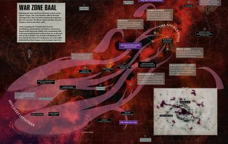

# 0841 M42早期 天使光环 Angel's Halo

精校状态：中文行文已逐段精校，部分术语仍为暂定

分类：时间线

原文来源：https://www.bilibili.com/opus/1138436972243582977

原作者：帝国神选罐头

原文时间：2025年11月23日 20:36

[返回分类目录](目录.md) · [全书目录](../../目录.md)

<!-- A0841-B0001 -->
**英文原文**

The Angel's Halo is an ambitious campaign of reconquest, launched by the Blood Angels' Chapter Master Dante, to reclaim the systems of the Red Scar, which have been invaded by Hive Fleet Leviathan.

<!-- /A0841-B0001 -->

<!-- A0841-B0002 -->

原译文

天使光环是一场雄心勃勃的重新征服战役，由圣血天使战团长但丁发起，旨在夺回被虫巢舰队利维坦入侵的红疤星系。

**校订译文**

天使光环是圣血天使战团长但丁发动的一场大规模收复战役，旨在夺回红疤地区遭利维坦虫巢舰队入侵的各个星系。

<!-- /A0841-B0002 -->

<!-- A0841-B0003 -->
**英文原文**

To support the campaign, Dante and his fellow Chapter Masters have dispatched forces to fight holding actions and reclamation operations against the Tyranids throughout the Red Scar region. In order to ensure the Angel's Halo succeeds, Dante has also not hesitated to call upon the full breadth of his newly conferred authority, as Regent of the Imperium Nihilus.

<!-- /A0841-B0003 -->

<!-- A0841-B0004 -->

原译文

为了支持这场战役，但丁和他的战团长们已经派遣部队在整个红疤地区对泰伦进行抵抗行动和收复行动。为了确保天使光环的成功，但丁也毫不犹豫地呼吁他作为帝国暗面摄政，全面行使新授予的权力。

**校订译文**

为支持这场战役，但丁与其他战团长派出部队，在红疤地区各处阻击泰伦、收复失地。为确保天使光环成功，但丁也毫不犹豫地充分行使自己新获授的帝国暗面摄政之权。

<!-- /A0841-B0004 -->

<!-- A0841-B0005 图片 -->

<!-- A0841-B0006 -->

原译文

The Red Scar warzone 红疤战区

**校订译文**

The Red Scar warzone 红疤战区

<!-- /A0841-B0006 -->

<!-- A0841-B0007 -->
**英文原文**

Date:Early M42

<!-- /A0841-B0007 -->

<!-- A0841-B0008 -->

原译文

日期：M42早期

**校订译文**

日期：M42早期

<!-- /A0841-B0008 -->

<!-- A0841-B0009 -->
**英文原文**

Location:Red Scar

<!-- /A0841-B0009 -->

<!-- A0841-B0010 -->

原译文

地点：红疤

**校订译文**

地点：红疤

<!-- /A0841-B0010 -->

<!-- A0841-B0011 -->
**英文原文**

Outcome:Ongoing

<!-- /A0841-B0011 -->

<!-- A0841-B0012 -->

原译文

结果：进行中

**校订译文**

结果：进行中

<!-- /A0841-B0012 -->

<!-- A0841-B0013 -->
**英文原文**

Combatants:Imperium/Tyranids

<!-- /A0841-B0013 -->

<!-- A0841-B0014 -->

原译文

作战人员：帝国/泰伦

**校订译文**

交战双方：帝国／泰伦

<!-- /A0841-B0014 -->

<!-- A0841-B0015 -->
**英文原文**

Commanders: Commander Dante, Chapter Master Gabriel Seth, Chief Librarian Mephiston, Captain Sendini, Lieutenant Perdaelus/Hive Mind

<!-- /A0841-B0015 -->

<!-- A0841-B0016 -->

原译文

指挥官：指挥官但丁、战团长加百列·赛斯、首席智库墨菲斯顿、连长森迪尼、副官佩达勒斯/虫巢思维

**校订译文**

指挥官：但丁指挥官、战团长加百列·赛斯、首席智库员墨菲斯顿、森迪尼连长、佩达勒斯副官／虫巢意志

<!-- /A0841-B0016 -->

<!-- A0841-B0017 -->
**英文原文**

Strength: Blood Angels, Flesh Tearers, Angels Encarmine, Imperial Guard including the Valhallan 77th and 101st, Imperial Navy/Tendrils of Hive Fleet Leviathan

<!-- /A0841-B0017 -->

<!-- A0841-B0018 -->

原译文

力量：圣血天使，撕肉者，赤红天使，帝国卫队包括瓦尔哈拉第77和101兵团，帝国海军/虫巢舰队利维坦的触须

**校订译文**

兵力：圣血天使、撕肉者、赤红天使、包括瓦尔哈拉第 77 团与第 101 团在内的帝国卫队，以及帝国海军／利维坦虫巢舰队的触须舰队

<!-- /A0841-B0018 -->

<!-- A0841-B0019 -->
### Overview 概述

<!-- /A0841-B0019 -->

<!-- A0841-B0020 -->
**英文原文**

The Angel's Halo began in the aftermath of the Devastation of Baal at the order of Dante and is being fought by the Blood Angels and their Successor Chapters, who have chosen to aid them. The objective of Dante was to save the Red Scar from the remaining tendrils of Leviathan. However the immediate task was to redeploy the surviving Blood Angels and Successor assets in the aftermath of the Devastation of Baal.

<!-- /A0841-B0020 -->

<!-- A0841-B0021 -->

原译文

天使光环始于但丁下令摧毁巴尔之后，由选择帮助他们的圣血天使及其子分会进行战斗。但丁的目标是从利维坦剩下的触须中拯救红疤。然而，当务之急是在巴尔的毁灭后重新部署幸存的圣血天使和子战团资产。

**校订译文**

巴尔的毁灭之后，但丁下令发动天使光环战役，由圣血天使及愿意前来相助的子战团共同参战。他的目标是将红疤地区从利维坦残存的触须舰队手中解救出来。不过，战后的当务之急，是重新部署圣血天使及子战团幸存的兵力与装备。

**校注：** at the order of Dante 修饰战役发起，而非 Devastation of Baal；原译“但丁下令摧毁巴尔”把施事关系完全倒置。

<!-- /A0841-B0021 -->

<!-- A0841-B0022 -->
**英文原文**

A significant issue for the Imperials was the Tyranid Shadow in the Warp, which had intensified to such a degree that it was causing madness in even Guardsmen and other non-augmented Imperial servants. Even the Blood Angels Librarians strained under the effect amid widespread riots and civil strife across the Red Scar. This confounded the mysterious Psychic Awakening, which saw large numbers of Psykers born across the Galaxy. The Imperials began to fear what the effects might have on a powerful Psyker, whose populations were no longer being controlled in lieu of regular visits by the League of Black Ships. To prevent disaster the Blood Angels were forced to use their own Librarians to oversee Psykers among the mass of refugees fleeing Leviathan. Upon identification, the psykers were conducted with mental interrogation to decide what sort of threat they could pose. However many more Psykers fell through the cracks. The Hive Mind did not fail to notice this weakness among its prey, and used psychic beasts on battlefields as the Blood Angels Librarians were forced to deal with internal threats.

<!-- /A0841-B0022 -->

<!-- A0841-B0023 -->

原译文

帝国面临的一个重要问题是亚空间中的泰伦阴影，它已经加剧到甚至在卫兵和其他未增强的帝国仆人中也造成了疯狂。在红疤地区广泛的暴乱和内乱中，就连圣血天使智库也受到了影响。这混淆了神秘的灵能觉醒，它看到了银河系各地出生的大量灵能者。帝国开始担心这会对强大的灵能者产生什么影响，因为黑船联盟的定期访问已经取代了对灵能者人口的控制。为了防止灾难，圣血天使被迫使用自己的智库来监督逃离利维坦的大批难民中的灵能者。在确认后，对灵能者进行了灵能审讯，以决定他们可能构成什么样的威胁。然而，更多的灵能者从裂隙中掉了出来。虫巢思维并没有忽视猎物的这种弱点，并在战场上使用灵能野兽，因为圣血天使智库被迫应对内部威胁。

**校订译文**

泰伦造成的亚空间阴影，是帝国面临的一大难题。它已强烈到连帝国卫队士兵及其他未经改造的帝国人员都会被逼疯。红疤地区到处爆发骚乱和内乱，就连圣血天使的智库员也苦苦承受着影响。与此同时，神秘的灵能觉醒让银河各处出现大量新的灵能者，使局势更加复杂。黑船联盟无法正常定期巡访，灵能者的数量已失去管控，帝国开始担忧这种影响会在强大灵能者身上酿成什么后果。为防止灾难，圣血天使只得派出自己的智库员，监管躲避利维坦而逃亡的大批难民中的灵能者。发现灵能者后，他们会进行心灵审讯，以判断其可能造成的威胁。然而，仍有大量灵能者逃过排查。虫巢意志没有放过猎物的这一弱点：当圣血天使智库员忙于应对内部威胁时，它便在战场上投入灵能兽。

**校注：** fell through the cracks 为逃过监管的习语，非从裂隙中掉落。原文 in lieu of regular visits 用法不顺，按人口失控及难民排查的上下文译为缺少正常巡访，并保留英文待核。

<!-- /A0841-B0023 -->

<!-- A0841-B0024 -->
**英文原文**

The first move of the Angel's Halo oversaw Dante himself retaking the rest of the Baal System. He led a squadrons of ships to the outer gas giant of Kheru, battling Tyranid swarms upon the moons of the gas giant. While Dante fought to secure the Baal System, Gabriel Seth and the Flesh Tearers struck at three nearby Systems dubbed the Points of Grace which were to be established as staging posts for further expansion. These were the Industrial World Ashallon, the Gamma IV System's linked space stations and orbital platforms and the last being the Fortress World Bhelik Alphus. Seth led an attack on Ashallon, Vanguard Space Marines of the Angels Encarmine targeted Gamma IV, and the Blood Angels 5th Company with additional significant Chapter reserves under Captain Sendini struck at Bhelik Alphus.

<!-- /A0841-B0024 -->

<!-- A0841-B0025 -->

原译文

天使光环的第一步见证了但丁自己夺回了巴尔星系的其余部分。他率领一个舰队前往外层气体巨星克赫鲁，与气体巨星卫星上的泰伦虫群作战。当但丁为保卫巴尔星系而战时，加百列·赛斯和撕肉者袭击了附近的三个被称为恩典点的星系，这些星系将被建立为进一步扩张的中转站。这些是阿沙隆工业世界，伽马四号星系的连接空间站和轨道平台，最后一个是堡垒世界贝利克·阿尔弗斯。赛斯领导了对阿沙隆的攻击，赤红天使的先锋星际战士瞄准了伽马四号，森迪尼连长率领的圣血天使第五连队和额外的重要战团预备部队袭击了贝利克·阿尔弗斯。

**校订译文**

天使光环的第一步，是由但丁亲自夺回巴尔星系其余地区。他率领一支舰艇编队前往外缘气态巨行星克赫鲁，在其卫星上与泰伦虫群交战。但丁忙于稳固巴尔星系时，加百列·赛斯及其撕肉者开始进攻邻近的三个星系。它们合称“恩典节点”，计划作为进一步扩大战果的集结基地：工业世界阿沙隆、伽马四号星系相连的空间站与轨道平台，以及要塞世界贝利克·阿尔弗斯。赛斯率军攻击阿沙隆，赤红天使的先锋星际战士进攻伽马四号，森迪尼连长则指挥圣血天使第五连及大批战团预备部队，攻打贝利克·阿尔弗斯。

**校注：** 原文说三个星系，却随后列两个世界和一组星系设施；保留这一层级不齐的概述，不把红疤地区整体译成单一星系。

<!-- /A0841-B0025 -->

<!-- A0841-B0026 -->
### Kheru 克赫鲁

<!-- /A0841-B0026 -->

<!-- A0841-B0027 -->
**英文原文**

The entire Imperial presence on the arid Sentinel World of Kheru was bottled up in four fortified sensoria-cities in the southern hemisphere. The Tyranids had surrounded these sites and were assaulting them in waves. Though cut off from the influence of the Hive Mind, the swarms were far from directionless as Dante had hoped; it was clear that some kind of control was still exerted over them. Lieutenant Perdaelus led the force that advanced upon Sensorem Primus, the largest and capital facility of Kheru. The Human garrison had quickly fallen to the Tyranids, but the Blood Angels Reiver Squads were able to insert themselves two miles from their target with the aid of Chief Librarian Mephiston, who shielded their presence psychically. Infiltrators and Incursors gathered intelligence while the city's remaining Blood Angels and automated defenses kept the Tyranids at bay.

<!-- /A0841-B0027 -->

<!-- A0841-B0028 -->

原译文

整个帝国在干旱的克赫鲁哨兵世界的存在被封锁在南半球的四个设防的感知之城。泰伦已经包围了这些地点，并一波又一波地袭击它们。虽然与虫巢思维的影响隔绝，但虫群远非但丁所希望的那样没有方向；很明显，他们仍然受到某种控制。佩达勒斯副官率领部队向克赫鲁最大的首都设施感知之首推进。人类驻军很快就落入了泰伦的手中，但圣血天使掠夺者小队在首席智库墨菲斯顿的帮助下，能够在距离目标两英里的地方插入自己，墨菲斯顿在灵能上保护了他们的存在。渗透者和入侵者收集情报，而该城剩下的圣血天使和自动防御系统则将泰伦拒之门外。

**校订译文**

在干旱的哨兵世界克赫鲁，帝国的全部驻守力量都被压缩在南半球四座设防的传感城内。泰伦包围了这些城市，发动一轮轮进攻。虫群虽然与虫巢意志的影响隔绝，却远不像但丁期待的那样失去指挥，显然仍受某种力量控制。佩达勒斯副官率军向克赫鲁最大、也是首府所在的设施“感知之首”推进。当地人类守军很快被泰伦击败，但在首席智库员墨菲斯顿以灵能掩藏行踪的协助下，圣血天使掠夺者小队成功潜入距离目标两英里的位置。渗透者和入侵者负责搜集情报，城内残存的圣血天使及自动防御设施则继续抵挡泰伦。

**校注：** 前段称 Kheru 为气态巨行星，此段却称干旱哨兵世界，后文又说清剿其卫星；底稿地理描述互有矛盾，未擅自把这里改成某颗未命名卫星。sensoria 依感测设施语境暂译传感城。

<!-- /A0841-B0028 -->

<!-- A0841-B0029 -->
**英文原文**

The Vanguard Marines struck with the element of surprise, advancing from cover to cover along an ancient riverbed. Attacking several broods at once, the Blood Angels spread out from their initial line of advance. The Tyranids reacted instantly, but were met by Reivers and Mephiston. The Vanguard suddenly withdrew as Eliminators opened up from the riverbed's high banks as the Tyranids surged after the withdrawing Marines. Lictors and Genestealers now appeared among the Blood Angels flanks and rear, and the fighting to defeat this threat was desperate for the Imperials. It was then that Dante's own forces entered combat. Mephiston and the Vanguard had drawn away the Tyranids from the Sensoria-city, stretching the aliens' reach and forcing them to fight on two fronts. Using this advantage, Dante's Sanguinary Guard and Suppressors targeted the Tyranid leader-beasts while Mephiston and Perdaelus led the Vanguard to hammer the remaining broods.

<!-- /A0841-B0029 -->

<!-- A0841-B0030 -->

原译文

先锋星际战士出其不意，沿着一条古老的河床从一个掩体推进到另一个掩体。圣血天使们一次攻击了几个族群，从最初的推进战线上散开。泰伦立即做出反应，但遭到了掠夺者和墨菲斯顿的迎接。先锋突然撤退，因为歼灭者在河床的高岸部署，而泰伦在撤退的战士后激增。利卡特和基因窃取者现在出现在圣血天使的侧翼和后方，击败这一威胁的战斗对帝国来说是绝望的。就在那时，但丁自己的部队进入了战斗。墨菲斯顿和先锋已经将泰伦从感知之城拉开，扩大了异型的范围，迫使他们在两条战线上作战。利用这一优势，但丁的圣血卫队和压制者瞄准了泰伦的首领野兽，而墨菲斯顿和佩达勒斯则带领先锋军摧毁了剩下的幼崽。

**校订译文**

先锋星际战士发动突袭，沿古老河床借助一处处掩体推进。圣血天使从最初的进军路线向外展开，同时袭击数群泰伦。泰伦立即反应，却遭到掠夺者与墨菲斯顿迎头痛击。先锋部队随后突然撤退；泰伦涌上追击之际，歼灭者从河床两侧的高岸开火。此时，刀斧虫与基因窃取者出现在圣血天使侧后方，帝国战士不得不殊死抵挡这一威胁。就在这时，但丁亲率的部队投入战斗。墨菲斯顿与先锋部队已将泰伦诱离传感城，拉长其阵线，迫使它们两面作战。但丁的圣血守卫和压制者利用这一优势攻击泰伦的指挥兽，墨菲斯顿与佩达勒斯则率先锋部队猛攻其余虫群。

**校注：** opened up 指开火；broods 指泰伦群体而非幼崽。以佯退引开虫群、拉长阵线，使但丁得以从另一方向参战，原译未交代清楚的战术因果已理顺。

<!-- /A0841-B0030 -->

<!-- A0841-B0031 -->
**英文原文**

Kheru's moons were also infested by Genestealers and Commander Dante personally led a Blood Angels strike force to cleanse them. The Commander would fight surrounded by the Sanguinary Guard and the Sanguinor himself, later appeared to aid Dante against the Genestealers. During the battle, Veteran Squad Rasmiel was attacked by a large number of the Xenos, that were led by their Broodlord. Though they were outnumbered and alone, the Veterans were able to kill many of the Genestealers, before the last of the squadron died.

<!-- /A0841-B0031 -->

<!-- A0841-B0032 -->

原译文

克赫鲁的卫星也受到了基因窃取者的侵扰，但丁指挥官亲自率领一支圣血天使打击部队清理它们。指挥官将在圣血卫队和圣吉列诺本人的包围下作战，后来似乎帮助但丁对抗基因窃取者。在战斗中，老兵小队拉斯米尔遭到了由他们的族裔领主领导的大量异型的袭击。尽管他们寡不敌众，孤立无援，但老兵在最后一个中队死亡之前，还是杀死了许多基因窃取者。

**校订译文**

克赫鲁的卫星同样遭到基因窃取者侵占，但丁亲自率领圣血天使打击部队前去清剿。他在圣血守卫护卫下作战，圣血者随后也亲自显现，帮助他对抗基因窃取者。战斗中，拉斯米尔老兵小队遭到族群领主率领的大批异形袭击。虽然寡不敌众、孤立无援，老兵们仍斩杀了大量基因窃取者，直到最后一名队员倒下。

**校注：** Sanguinor ... later appeared 是圣血者随后显现，非“似乎帮助”；last of the squadron 指最后一名队员，非最后一个中队。

<!-- /A0841-B0032 -->

<!-- A0841-B0033 -->
### Ashallon 阿沙隆

<!-- /A0841-B0033 -->

<!-- A0841-B0034 -->
**英文原文**

At Ashallon, the Flesh Tearers' Astropaths and Navigators had significant issues traveling close to the system. A source of psychic trauma was identified at Ashallon's city-sized refinery in the northern polar region. It was accessible only by a single megalithic bridge, the Via Velestos.

<!-- /A0841-B0034 -->

<!-- A0841-B0035 -->

原译文

在阿沙隆，撕肉者的星语者和导航者在接近该星系时遇到了重大问题。在阿沙隆北极地区的城市规模的精炼厂发现了灵能创伤的来源。它只能通过一座巨石桥，即维莱斯托斯之路到达。

**校订译文**

接近阿沙隆星系时，撕肉者的星语者和导航员都遭遇了严重困难。造成这种灵能创伤的源头，被定位在阿沙隆北极地区一座城市般庞大的精炼厂中。通往那里只有一条路：巨型石桥“维莱斯托斯之路”。

<!-- /A0841-B0035 -->

<!-- A0841-B0036 -->
**英文原文**

The Flesh Tearers' ships passed the destroyed orbital defenses then struck at the Tyranid Bio-Ships as the Marines launched a dropship attack on Ashallon itself. Due to the violent disruptive storms of the polar regions, the Flesh Tearers had to land further south. He landed armored assets and journeyed north, using Intercessors and the Death Company to fight off swarms of Tyranid flyers. However the heat of battle caused many of the Flesh Tearers to succumb to their rage, causing their lines to dissect as they reached the buttress of the bridge. It was then that Imperial Navy elements arrived to support the Flesh Tearers, deploying Valkyrie and Vendetta gunships. The Flesh Tearers used this opportunity to move to the city's Astropathic Tower to end the source of the psychic disturbance. Inside, they discovered a breed of psyker-beast feeding on the twitching husks of Astropaths. Gabriel Seth himself was able to slay the creature with his massive Chainsword.

<!-- /A0841-B0036 -->

<!-- A0841-B0037 -->

原译文

当战士对阿沙隆本身发动空降船袭击时，撕肉者的舰船通过了被摧毁的轨道防御，然后袭击了泰伦生物舰。由于极地地区的猛烈破坏性风暴，撕肉者不得不降落在更南的地方。他降落了装甲资产，向北行进，使用仲裁者和死亡连击退了成群的泰伦飞行生物。然而，激烈的战斗使许多撕肉者屈服于他们的愤怒，导致他们的队伍在到达桥的扶壁时被撕裂。就在那时，帝国海军部队抵达支援撕肉者，部署了瓦尔基里和仇杀炮艇。撕肉者利用这个机会搬到了城市的星语塔，以结束灵能干扰的来源。在里面，他们发现了一种灵能者野兽，以星语者抽搐的外壳为食。加百列·赛斯本人能够用他巨大的链锯剑杀死这个生物。

**校订译文**

撕肉者舰船穿过已经毁坏的轨道防线，攻击泰伦生物舰，同时将星际战士通过登陆艇送往阿沙隆。由于极地猛烈的风暴造成严重干扰，撕肉者不得不在更南方着陆。赛斯让装甲部队落地后向北推进，以仲裁者和死亡连击退成群的泰伦飞行生物。但激战使许多撕肉者屈从于怒火，他们抵达桥梁支墩处时，阵线已因狂怒而散乱。这时，帝国海军派来女武神和仇杀炮艇提供支援。撕肉者趁机前往城内的星语塔，准备消灭灵能干扰源。他们在塔中发现了一种灵能兽，正在吞食星语者不断抽搐、形销骨立的躯体。加百列·赛斯亲自用巨型链锯剑杀死了它。

**校注：** 原文由 They 转为 He，依上下文指赛斯。husks 在此为被吸食后枯槁的人体，并非星语者穿戴的外壳。

<!-- /A0841-B0037 -->

<!-- A0841-B0038 -->
### Bhelik Alphus 贝利克·阿尔弗斯

<!-- /A0841-B0038 -->

<!-- A0841-B0039 -->
**英文原文**

The Blood Angels force which arrived at Bhelik Alphus under the command of Captain Sendini consisted of not only the 5th company, but reserves from the 9th and significant armored assets. After landing, they made their primary target the fortified fort complex at Rhikan. There was still an Imperial Guard garrison alive within the complex, desperately holding off Tyranid swarms which included vicious subterranean beasts. The Blood Angels landed gunships at the port itself as Sendini ordered the Guardsmen evacuate and join the Space Marines.

<!-- /A0841-B0039 -->

<!-- A0841-B0040 -->

原译文

在森迪尼连长的指挥下，抵达贝利克·阿尔弗斯的圣血天使部队不仅包括第5连队，还包括第9连队的预备队和重要的装甲资产。登陆后，他们的主要目标是里坎的强化堡垒群。该建筑群内仍有一支帝国卫队驻军，拼命抵抗包括凶猛的地下野兽在内的泰伦虫群。当森迪尼命令卫兵撤离并加入星际战士时，圣血天使在港口降落了炮艇。

**校订译文**

森迪尼连长率领的圣血天使部队抵达贝利克·阿尔弗斯时，兵力不仅包括第五连，还包括第九连的预备部队和大量装甲单位。登陆后，他们将里坎的要塞建筑群作为主要目标。那里仍有一支帝国卫队驻军幸存，正拼死抵挡泰伦虫群，其中包括凶猛的地下生物。圣血天使的炮艇直接降落在港区，森迪尼则命令卫队士兵撤离阵地，前来与星际战士会合。

<!-- /A0841-B0040 -->

<!-- A0841-B0041 -->
**英文原文**

No longer held back at the port's defenses, the Tyranids swarmed into the initial facilities. As the garrison withdrew, Suppressors fired into the oncoming Tyranids until the Guardsmen reached the cover of the port buildings. The Blood Angels Fire Support Squads and entrenched Guardsmen then opened up, turning the port into a killing field. It was then that a massive Mawloc appeared, accompanied by a force of Zoanthropes and led by a Hive Tyrant. Worse still for the Imperials, Genestealers erupted from within the buildings. The Tyranids unleashed psychic assaults that devastated the Imperial Guard elements and the Blood Angels called in air support. However, these were countered by the return of several Tyranid Bioships. It was then that the garrison's troops erupted in the psychic power of a Tyranid witch-assault, consuming xenos and Humans alike. Bhelik Alphus was falling and hope for the Imperials was fading fast.

<!-- /A0841-B0041 -->

<!-- A0841-B0042 -->

原译文

泰伦不再固守港口的防御，涌入了最初的设施。当驻军撤退时，压制者向迎面而来的泰伦开火，直到卫兵到达港口建筑物的掩体。圣血天使火力支援小队和牢固确立的卫兵随后打开了大门，将港口变成了一个杀戮区。就在那时，一个巨大的沙蟒出现了，伴随着一群灵化脑虫，由一个虫巢暴君领导。对帝国来说更糟糕的是，基因窃取者从建筑物内爆发。泰伦发动了灵能攻击，摧毁了帝国卫队成员和空中支援的圣血天使。然而，几艘泰伦生物舰的返回抵消了这一点。就在那时，驻军的部队爆发了泰伦巫师袭击的灵能力量，吞噬了异型和人类。贝利克·阿尔弗斯正在陷落，帝国的希望正在迅速消失。

**校订译文**

港区防线不再阻挡泰伦，虫群涌入最外侧的设施。驻军撤退时，压制者持续向追来的泰伦射击，直到卫队士兵进入港区建筑的掩护。随后，圣血天使火力支援小队与据守阵地的卫队士兵一齐开火，将港区变成杀戮场。这时，一只巨大的沙蟒出现；与它一同到来的还有一群脑虫，整个攻势由一只虫巢暴君率领。更糟的是，基因窃取者也从建筑内部突然杀出。泰伦发起灵能攻击，重创帝国卫队部队，圣血天使只得呼叫空中支援，但返回战场的几艘泰伦生物舰又阻断了支援。随后，泰伦的巫术攻势使驻军士兵体内爆发灵能力量，将异形与人类一同吞噬。贝利克·阿尔弗斯正在陷落，帝国的希望迅速黯淡。

**校注：** No longer held back 的主体是泰伦，表示不再被帝国港口防线阻挡，原译却让泰伦成为守港者；opened up 仍指开火，非打开大门。末句保留灵能爆发由泰伦攻击引起的叙述，未把受害士兵另造为泰伦巫师。

<!-- /A0841-B0042 -->

<!-- A0841-B0043 -->
### Acrabellar 阿克拉贝拉

<!-- /A0841-B0043 -->

<!-- A0841-B0044 -->
**英文原文**

This region sees the Battle of Acrabellar where the Blood Angels, Blood Scythes, Cruor Blades and Flesh Eaters fought to defend the invaded Shrine World.

<!-- /A0841-B0044 -->

<!-- A0841-B0045 -->

原译文

这个地区发生了阿克拉贝拉之战，圣血天使、鲜血镰刀、凝血之刃和食肉者为保卫被入侵的圣地世界而战。

**校订译文**

这一地区还爆发了阿克拉贝拉之战，圣血天使、鲜血之镰、凝血之刃与食肉者为保卫遭到入侵的圣地世界而战。

<!-- /A0841-B0045 -->

本篇核心术语与暂定项

以下列出本篇出现的英文原形及核心术语表用词。同形词可能指不同对象，具体词义以本篇正文和校注为准；单复数、别名和仅见于图注的名称可能尚未列入。完整候选见[术语表](../../术语表/双语术语候选.csv)。

| 英文 | 采用中文 | 状态 |
| --- | --- | --- |
| Space Marines | 星际战士 | 官方已核对 |
| Blood Angels | 圣血天使 | 官方已核对 |
| Imperial Guard | 帝国卫队 | 暂定·语境区分 |
| Tyranids | 泰伦虫族 | 官方已核对 |
| Psyker | 灵能者 | 官方已核对 |
| Librarian | 智库员 | 官方已核对 |
| Chainsword | 链锯剑 | 官方已核对 |
| Warp | 亚空间 | 官方已核对 |
| Imperium | 帝国 | 暂定·简称 |
| Imperial Navy | 帝国海军 | 暂定 |
| Hive Tyrant | 虫巢暴君 | 官方已核对 |
| Hive Mind | 虫巢意志 | 官方已核对 |
| Sanguinary | 圣血学派 | 暂定·学派语境 |
| Shadow in the Warp | 亚空间之影 | 暂定 |
| Shrine World | 圣地世界 | 暂定·官方待核 |
| The Order | 秩序 | 暂定·官方待核 |
| Navigators | 导航员 | 官方已核对 |
| Imperium Nihilus | 帝国暗面 | 暂定·官方待核 |
| Devastation of Baal | 巴尔之毁 | 暂定·官方待核 |
| Red Scar | 红疤地区 | 暂定·官方待核 |
| Hive Fleet Leviathan | 利维坦虫巢舰队 | 暂定·官方待核 |
| League of Black Ships | 黑船联盟 | 暂定·官方待核 |
| Baal | 巴尔 | 暂定·官方待核 |
| Clear | 清明 | 暂定·官方待核 |
| Chief Librarian | 首席智库员 | 暂定·官方待核 |
| Master | 导师（审判庭职衔）／舰务官（舰员职务） | 语境定译·官方待核 |
| Ancient | 旗手 | 官方已核对 |
| Sanguinary Guard | 圣血守卫 | 官方已核对 |
| Lieutenant | 副官 | 暂定·官方待核 |
| Chapter | 战团 | 暂定·官方待核 |
| Chapter Master | 战团长 | 暂定·官方待核 |
| Captain | 连长 | 暂定·官方待核 |
| Veteran | 老兵 | 暂定·官方待核 |
| Vanguard | 先锋 | 暂定·官方待核 |
| Reiver | 掠夺者 | 暂定·官方待核 |
| Dante | 但丁 | 暂定·官方待核 |
| Mephiston | 墨菲斯顿 | 暂定·官方待核 |
| Flesh Tearers | 撕肉者 | 暂定·官方待核 |
| Gabriel Seth | 加百列·赛斯 | 暂定·官方待核 |
| The Angel | 天使 | 暂定·官方待核 |
| Angels Encarmine | 赤红天使 | 暂定·官方待核 |
| Blood Scythes | 鲜血之镰 | 暂定·官方待核 |
| Cruor Blades | 凝血之刃 | 暂定·官方待核 |
| Flesh Eaters | 食肉者 | 暂定·官方待核 |
| Chief Librarian Mephiston | 首席智库员墨菲斯顿 | 官方已核 |
| The Sanguinor | 圣血者 | 官方已核 |
| Valkyrie | 女武神炮艇 | 官方已核对 |
| Xenos | 异形 | 暂定·官方待核 |
| Broodlord | 族群领主 | 官方已核对 |
| Mawloc | 沙蟒 | 官方已核对 |
| Zoanthropes | 脑虫 | 官方已核对 |
| Primus | 领军 | 官方已核对 |
| The Blood | 鲜血 | 暂定·官方待核 |
| System | 星系（恒星系统） | 暂定·官方待核 |
| Fortress World | 堡垒世界 | 暂定·官方待核 |
| Industrial World | 工业世界 | 暂定·官方待核 |
| Sentinel World | 哨兵世界 | 暂定·官方待核 |
| Angel's Halo | 天使光环 | 暂定·官方待核 |
| Sendini | 森迪尼 | 暂定·官方待核 |
| Perdaelus | 佩达勒斯 | 暂定·官方待核 |
| Kheru | 克赫鲁 | 暂定·官方待核 |
| Points of Grace | 恩典节点 | 暂定·官方待核 |
| Ashallon | 阿沙隆 | 暂定·官方待核 |
| Gamma IV System | 伽马四号星系 | 暂定·官方待核 |
| Bhelik Alphus | 贝利克·阿尔弗斯 | 暂定·官方待核 |
| Sensorem Primus | 感知之首 | 暂定·官方待核 |
| sensoria-city | 传感城 | 暂定·官方待核 |
| Rasmiel | 拉斯米尔 | 暂定·官方待核 |
| Via Velestos | 维莱斯托斯之路 | 暂定·官方待核 |
| Rhikan | 里坎 | 暂定·官方待核 |
| Acrabellar | 阿克拉贝拉 | 暂定·官方待核 |
| Reivers | 掠夺者 | 暂定·官方待核 |

