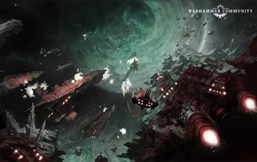
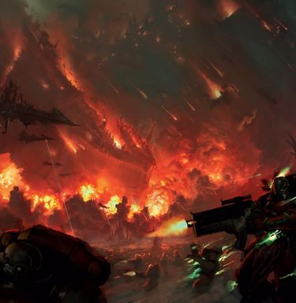
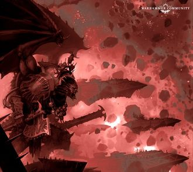
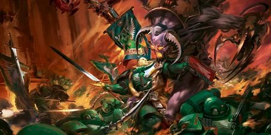
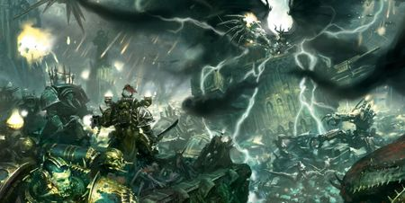

# 0842 M42早期 噩兆方舟战役(上) Arks of Omen Campaign

精校状态：中文行文已逐段精校，部分术语仍为暂定

分类：时间线

原文来源：https://www.bilibili.com/opus/1133191494314754082

原作者：帝国神选罐头

原文时间：2025年11月09日 17:21

[返回分类目录](目录.md) · [全书目录](../../目录.md)

<!-- A0842-B0001 -->
**英文原文**

The Arks of Omen Campaign was a major galaxy-wide offensive recently launched by Abaddon the Despoiler and his armies. Its purpose was to complete a mysterious artifact known as The Key to The Lock and activate The Weapon, which has the power to destroy the Imperium.

<!-- /A0842-B0001 -->

<!-- A0842-B0002 -->

原译文

噩兆方舟战役是掠夺者阿巴顿和他的军队最近发起的一场大规模的银河系攻势。它的目的是完成一件名为锁之钥的神秘神器，并激活具有摧毁帝国的力量的武器。

**校订译文**

噩兆方舟战役是掠夺者阿巴顿及其军队发动的一场席卷银河的大规模攻势。他们企图集齐神秘的“锁之钥”，进而启动一件足以摧毁帝国的造物——“武器”。

<!-- /A0842-B0002 -->

<!-- A0842-B0003 图片 -->

<!-- A0842-B0004 -->

原译文

Chaos Balefleet moves 混沌灾祸舰队移动

**校订译文**

Chaos Balefleet moves 混沌灾祸舰队行动

<!-- /A0842-B0004 -->

<!-- A0842-B0005 -->
**英文原文**

Conflict:Long War

<!-- /A0842-B0005 -->

<!-- A0842-B0006 -->

原译文

冲突：万古长战

**校订译文**

冲突：万古长战

<!-- /A0842-B0006 -->

<!-- A0842-B0007 -->
**英文原文**

Date:Early M42

<!-- /A0842-B0007 -->

<!-- A0842-B0008 -->

原译文

日期：M42早期

**校订译文**

日期：M42早期

<!-- /A0842-B0008 -->

<!-- A0842-B0009 -->
**英文原文**

Location:Galaxy-wide, primarily in Imperium Nihilus

<!-- /A0842-B0009 -->

<!-- A0842-B0010 -->

原译文

地点：银河系范围，主要在帝国暗面

**校订译文**

地点：银河系范围，主要在帝国暗面

<!-- /A0842-B0010 -->

<!-- A0842-B0011 -->
**英文原文**

Outcome:Strategic Chaos Victory, The Key activated

<!-- /A0842-B0011 -->

<!-- A0842-B0012 -->

原译文

结果：战略上混沌胜利，钥匙激活

**校订译文**

结果：战略上混沌胜利，钥匙激活

<!-- /A0842-B0012 -->

<!-- A0842-B0013 -->
**英文原文**

Combatants:Imperium of Man/Forces of Chaos/Various unaligned Xenos, Farsight Enclaves, Eldar, Orks, Szarekhan Dynasty, Tyranids, Lords of Iron Thorn, Leagues of Votann, Enslavers, Kalavassi

<!-- /A0842-B0013 -->

<!-- A0842-B0014 -->

原译文

作战人员：人类帝国/混沌部队/许多未结盟的异型、远见飞地、灵族、欧克、斯扎拉坎王朝、泰伦、铁棘领主、沃坦联盟、奴役者、卡拉瓦西

**校订译文**

交战各方：人类帝国／混沌势力／各支未结盟的异形势力，包括远见飞地、灵族、欧克、斯扎拉坎王朝、泰伦、铁棘领主、沃坦联盟、奴役者和卡拉瓦西

<!-- /A0842-B0014 -->

<!-- A0842-B0015 -->
**英文原文**

Commanders: Primarch Lion El'Jonson, Lord Regent Dante, Fleetmaster Trincus Abconcis (KIA), Inquisitor Lord Torquemada Coteaz, Inquisitor Glori Emagna (KIA), Supreme Grand Master Azrael, Chapter Master Nymarn (KIA), Grand Master Nakir, Chapter Master Yosharo DuGal, Chief Librarian Tigurius, Grand Master Ezekiel, Brother-Captain Drystann Cromm (KIA), Grand Master Sammael, Grand Master Belial (WIA), Master Asmodai, Captain Albaar, Chaplain Julianos, Captain Aphael, Master Lazarus, Hibogen Khan, Groupmaster Kelmer (KIA), Canoness Verity Kade (MIA), Canoness Felicita (Corrupted), Admiral Ignacious Pell (KIA), Groupmaster Persepha Xeng, Groupmaster Ira Threnodar (KIA), Groupmaster Josiah Bolsett III, Groupmaster Zavadan Mael/Abaddon the Despoiler, Vashtorr the Arkifane, Daemon Primarch Angron (Banished), Khârn the Betrayer, Lord Invocatus, Karakka Bloodfist, Falkus Kibre, Daemon Prince Dreagh'or (Banished), Ughalax the Soul Eater (KIA), Gakhar the Savage, Flenseling Prince, Lord Glass, Sorcerer Lord Xorphas (KIA), Warsmith Czagra, Lord Apophari Quen, Gulthorg the Blighted, Sorcerer Lord Hasomet, Flensemaster Thavak, Scourgemaster Ulghata, Dark Magos Persephora Hexxen, Lady Maeve/Commander Farsight, Lord Somatatek, Warboss Skullkrakka, Warboss Grymzag, Warboss Bolgrog Bigtusk, Warboss Skragga Fundastomp, Da Smoggboss

<!-- /A0842-B0015 -->

<!-- A0842-B0016 -->

原译文

指挥官：原体莱昂·艾尔庄森、领主摄政但丁、舰队司令特林库斯·阿布克莱斯特（KIA）、审判官领主托尔克马达·科特兹、审判官格洛里·埃马格纳（KIA）、至高大导师阿兹瑞尔、战团长尼马尔恩（KIA）、大导师纳吉尔、战团长吉沙罗·杜加尔、首席智库狄格里斯、大导师以西结、兄弟连长德里斯坦·克罗姆（KIA）、大导师萨麦尔、大导师贝利亚（WIA）、导师阿斯莫代、连长阿尔巴尔、连长尤里安诺思、连长阿法尔、导师拉萨路、希博根可汗、集群司令凯尔默（KIA）、大修女维里蒂·凯德（MIA）、大修女弗丽瑟（腐化）、海军上将伊格纳西斯·佩尔（KIA）、集群司令佩尔塞法·辛格、集群司令艾拉·斯雷诺达尔（KIA）、集群司令约西亚·博塞特三世、集群司令扎瓦丹·梅尔/掠夺者阿巴顿、造物者瓦什托尔、恶魔原体安格隆（被放逐）、背叛者卡恩、因维卡图斯领主、卡拉卡·血拳、法库斯·凯博、恶魔王子德雷格’尔（被放逐）、灵魂吞食者乌加拉克斯（KIA）、野蛮者加哈尔，剥皮王子、镜面领主、巫师领主索法斯（KIA）、战争铁匠查格拉、领主阿波法里·昆恩、枯萎者古尔索普、巫师领主哈索梅特、剥皮大师塔瓦克、灾祸大师乌尔格塔，黑暗贤者珀尔塞福拉·海克森、梅芙夫人/指挥官远见、领主索玛泰克、战争头目碎颅、战争头目格里姆扎格、战争头目博尔格罗格·大牙、战争头目斯克拉加·重踏、大烟雾头目

**校订译文**

指挥官：原体莱昂·艾尔’庄森，摄政领主但丁，舰队司令特林库斯·阿布康西斯（阵亡），领主审判官托尔克马达·克提兹，审判官格洛里·埃马格纳（阵亡），至高大导师阿兹瑞尔，战团长尼马尔恩（阵亡），大导师纳基尔，战团长吉沙罗·杜加尔，首席智库员狄格里斯，大导师以西结，兄弟会连长德里斯坦·克罗姆（阵亡），大导师萨麦尔，大导师贝利亚（负伤），导师阿斯莫德，阿尔巴尔连长，教士尤里安诺思，阿菲尔连长，导师拉撒路，希博根可汗，集群司令凯尔默（阵亡），大修女维里蒂·凯德（失踪），大修女费莉西塔（遭腐化），海军上将伊格纳西斯·佩尔（阵亡），集群司令佩尔塞法·辛格，集群司令艾拉·斯雷诺达尔（阵亡），集群司令约西亚·博塞特三世，集群司令扎瓦丹·梅尔／掠夺者阿巴顿，造物者瓦什托尔，恶魔原体安格隆（遭放逐），背叛者卡恩，因维卡图斯尊主，卡拉卡·血拳，法库斯·凯博，恶魔王子德雷格’尔（遭放逐），灵魂吞食者乌加拉克斯（被杀），野蛮者加哈尔，剥皮王子，镜面领主，巫师领主索法斯（被杀），战争铁匠查格拉，阿波法里·昆恩领主，枯萎者古尔索格，巫师领主哈索梅特，剥皮大师塔瓦克，灾祸大师乌尔格塔，黑暗贤者珀尔塞福拉·海克森，梅芙夫人／远见指挥官，索玛泰克领主，战争头目碎颅，战争头目格里姆扎格，战争头目博尔格罗格·大牙，战争头目斯克拉加·重踏，大烟雾头目

**校注：** 按已核姓名词根与前篇统一：克提兹、阿斯莫德、拉撒路、纳基尔、特林库斯·阿布康西斯等；Julianos 的职衔为 Chaplain 教士，原列表错作连长。Felicita 暂译费莉西塔，原弗丽瑟与拼写不合。Gulthorg 暂译古尔索格，原古尔索普误读末尾。

<!-- /A0842-B0016 -->

<!-- A0842-B0017 -->
**英文原文**

Losses/Survivors:Galaxy-wide destruction, Grievous losses to the Unforgiven/Heavy

<!-- /A0842-B0017 -->

<!-- A0842-B0018 -->

原译文

损失/幸存者：银河系范围内的破坏，令人悲痛的损失对于不可饶恕者/严重

**校订译文**

损失／幸存情况：银河各地遭到破坏，戴罪者蒙受惨重损失／损失惨重

<!-- /A0842-B0018 -->

<!-- A0842-B0019 -->
## Overview 概述

<!-- /A0842-B0019 -->

<!-- A0842-B0020 -->
### Prelude 序曲

<!-- /A0842-B0020 -->

<!-- A0842-B0021 -->
**英文原文**

The campaign began as part of the greater War of Beasts, when Black Legion forces led by Warpsmith Vask engaged in the Vigilus warzone raided the Mechanicum artificial moon of Pergamatros. After launching a data-assault upon the moon's power and control systems, which revealed the hidden moon's location, the Black Legion vessel Unrepentant appeared in the system. Despite formidable defences, including manned lasers, Skitarii, and a maniple of Reaver Titans of the Legio Maledictus, Vask and the Dark Mechanicus Magos Persephora Hexxen led overwhelming forces which swept aside their foes. Dark Magos Juregg was able to penetrate the moons data-vaults, hoping to gather data for the Despoiler’s favour. However unknown to the Magos, the data-tome he brought back to the Vengeful Spirit was part of a greater plan by the Daemon Vashtorr.

<!-- /A0842-B0021 -->

<!-- A0842-B0022 -->

原译文

这场战役始于更大的野兽战争，当时由战争铁匠瓦斯克领导的黑色军团部队在警戒星战区突袭了帕加马托斯的机械教人造卫星。在对卫星的动力和控制系统发动数据攻击，揭示了隐藏卫星的位置后，黑色军团战舰不悔号出现在星系中。尽管有强大的防御，包括有人驾驶的激光器、护教军和诅咒军团的收割者泰坦，瓦斯克和黑暗机械教贤者珀尔塞福拉·海克森领导了压倒性的部队，将敌人驱逐。黑暗贤者朱里格能够穿透卫星数据库，希望为掠夺者收集数据。尽管贤者们对此一无所知，但他带回给复仇之魂号的数据巨著是恶魔瓦什托尔更大计划的一部分。

**校订译文**

这场战役的开端，是规模更大的野兽之战中的一次行动。次元铁匠瓦斯克率领在警戒星战区作战的黑色军团部队，袭击了机械教的人造卫星帕加马托斯。他们对卫星的动力与控制系统发动数据攻击，使这颗隐蔽卫星的位置暴露，随后黑色军团战舰不悔号出现在星系中。守方虽拥有人工操作的激光炮位、护教军，以及诅咒军团的一支掠夺者级泰坦分队等强大防御，仍被瓦斯克与黑暗机械教贤者珀尔塞福拉·海克森率领的优势兵力击溃。黑暗贤者朱里格闯入卫星的数据秘库，企图通过搜集资料博取掠夺者的青睐。然而，他并不知道，自己带回复仇之魂号的数据巨著，其实是恶魔瓦什托尔更大计划中的一环。

<!-- /A0842-B0022 -->

<!-- A0842-B0023 -->
**英文原文**

Months later, as Abaddon oversaw the continued repairs to his flagship the Vengeful Spirit, the data-tome proved to be a portal that allowed Vashtorr to manifest on the bridge directly in the presence of The Despoiler. Upon meeting, Vashtorr presented Abaddon with a prophecy of a burning sky and stars blazing bright enough to drown out the darkness. He was candid with The Despoiler, declaring that while the ruler of the Forge of Souls, he was unsatisfied with his status and wished to become a fifth Chaos God in his own right. Vashtorr believed this could be achieved if he could fulfill this prophecy, and offered an alliance with Abaddon. The Despoiler was unimpressed, and Vashtorr bid that they move together on the nearby world of Magdalor to demonstrate the value of an alliance where the next fragment of the mysterious “Key” lay.

<!-- /A0842-B0023 -->

<!-- A0842-B0024 -->

原译文

几个月后，当阿巴顿监督他的旗舰复仇之魂号的持续维修时，这本数据巨著被证明是一个门户，让瓦什托尔在掠夺者面前直接出现在舰桥上。在会面时，瓦什托尔向阿巴顿提出了一个关于燃烧的天空和明亮到足以淹没黑暗的星星的预言。他对掠夺者坦诚相待，宣称在担任灵魂熔炉的统治者期间，他对自己的地位感到不满，并希望凭借自己的力量成为第五位混沌之神。瓦什托尔相信，如果他能实现这一预言，这是可以实现的，并提出与阿巴顿结盟。掠夺者对此不以为然，瓦什托尔要求他们一起前往附近的马格达洛世界，以展示神秘的“钥匙”的下一个碎片的所在处与联盟的价值。

**校订译文**

数月后，阿巴顿正监督旗舰复仇之魂号继续修缮，那本数据巨著却化为一道传送门，让瓦什托尔直接在掠夺者面前的舰桥上显现。瓦什托尔向阿巴顿展示了一则预言：天空燃烧，群星明亮得足以吞没黑暗。他坦言，自己虽然统治灵魂熔炉，却不满足于现有地位，希望成为真正的第五位混沌神。他相信，只要实现预言，就能达成这一目标，因此提议与阿巴顿结盟。掠夺者并未动心。瓦什托尔于是邀请他一同前往附近的马格达洛，用行动证明结盟的价值——神秘“钥匙”的下一块碎片就在那里。

<!-- /A0842-B0024 -->

<!-- A0842-B0025 -->

原译文

Part 1: Abaddon Strikes 第一部分：阿巴顿的突袭

**校订译文**

Part 1: Abaddon Strikes 第一部分：阿巴顿的突袭

<!-- /A0842-B0025 -->

<!-- A0842-B0026 -->
### Revelation on Magdalor 马格达洛上的启示

<!-- /A0842-B0026 -->

<!-- A0842-B0027 -->
**英文原文**

Magdalor was the homeworld of the troubled Iron Angels Space Marines. Despite their replenished gene-seed stock and numbers, they nonetheless sported a formidable fleet and committed themselves to fight to the end upon the arrival of the Vengeful Spirit in their system. As battles erupted across space between the Iron Angels and Traitor armadas, several hundred Iron Angels manned the formidable defences of their Fortress-Monastery known as the Angels’ Crown. Black Legion and Cultist forces landed on the surface of Magdalor while the Despoiler, Falkus Kibre, and his Bringers of Despair launched a teleportation assault into the heart of the Angels’ Crown. After defeating three Iron Angels Librarians, it became clear that the Iron Angels resistance was ultimately doomed as their forces were overwhelmed by the traitor onslaught.

<!-- /A0842-B0027 -->

<!-- A0842-B0028 -->

原译文

马格达洛是陷入困境的钢铁天使星际战士的家园世界。尽管他们补充了基因种子库和数量，但他们仍然拥有一支强大的舰队，并承诺在复仇之魂号进入他们的星系后战斗到底。当钢铁天使和叛徒舰队在太空中爆发战斗时，数百名钢铁天使守卫着他们被称为天使之冠的堡垒修道院的强大防御。黑色军团和邪教徒部队降落在马格达洛的表面，而掠夺者，法库斯·凯博和他的绝望使者向天使之冠的中心发动了传送攻击。在击败了三名钢铁天使智库后，很明显，钢铁天使的抵抗最终注定要失败，因为他们的部队被叛徒的猛攻淹没了。

**校订译文**

马格达洛是处境艰难的钢铁天使战团的母星。原文称，他们的基因种子储备与人员数量已经得到补充，并且仍拥有一支强大舰队。复仇之魂号进入星系时，他们决心战至最后。钢铁天使舰队与叛徒舰队在太空交战，数百名钢铁天使则驻守要塞修道院“天使之冠”的坚固防线。黑色军团与邪教徒登陆马格达洛表面，掠夺者本人、法库斯·凯博及其绝望使者则直接传送至天使之冠腹地。三名钢铁天使智库员被击败后，战团部队在叛徒猛攻下节节崩溃，抵抗已注定失败。

**校注：** 原文 Despite their replenished ... nonetheless 逻辑重复且欠通，可能存在英语底稿差错；未无据将 replenished 改成 depleted（耗尽）。保留“已经补充”的字面信息，并标记待核。

<!-- /A0842-B0028 -->

<!-- A0842-B0029 -->
**英文原文**

After having crushed the last serious resistance, Abaddon set about sacking the Fortress-Monastery but discovered scenes of carnage and Daemonic corruption deep within its walls. Someone had already torn out the heart of the Angels’ Crown, and soon enough Abaddon met the shackled Daemons and mutant engines of Vashtorr’s own host. Here, the Iron Angels Chapter Master Nymarn and the last of the 1st Company were staging a final stand. However, thanks to Vashtorr, horrifying monstrosities erupted from the machineries of the Apothecarion and Reclusiam as Abaddon himself struck down Nymarn. After the battle, Vashtorr’s forces ignored all but a tall marble pillar floating in a suspensor field. Dubbed the Oathing Stone by the Iron Angels, Abaddon was initially unimpressed with the pillar but after hours of closed meeting with Vashtorr was informed of its true nature. After learning of its true purpose as a fragment of The Key, Abaddon let out a great laugh and became committed to working with Vashtorr.

<!-- /A0842-B0029 -->

<!-- A0842-B0030 -->

原译文

在粉碎了最后一次重大的抵抗之后，阿巴顿开始洗劫要塞修道院，但在其城墙深处发现了大屠杀和恶魔腐化的场景。有人已经撕下了天使之冠的心脏，很快阿巴顿就遇到了戴着镣铐的恶魔和瓦什托尔自己的天军的变种引擎。在这里，钢铁天使战团长尼马尔恩和第一连队的最后一名成员正在进行最后的抵抗。然而，多亏了瓦什托尔，当阿巴顿击倒尼马尔恩时，药剂部和隐修室的机器里爆发出了可怕的怪物。战斗结束后，瓦什托尔的部队除了一根漂浮在吊带上的高大大理石柱外，什么也没理。被钢铁天使称为誓言之石，阿巴顿最初对这根柱子并不感兴趣，但在与瓦什托尔进行了数小时的闭门会议后，他得知了它的真实性质。在得知其作为钥匙碎片的真正用途后，阿巴顿大笑起来，并致力于与瓦什托尔合作。

**校订译文**

粉碎最后一股有力抵抗后，阿巴顿开始洗劫要塞修道院，却在其深处发现了屠杀与恶魔腐化的痕迹。有人已先一步掏空天使之冠的核心；不久，他便遇到了瓦什托尔军中戴着镣铐的恶魔和畸变战争机器。钢铁天使战团长尼马尔恩与第一连残部正在此地作最后抵抗。瓦什托尔令药剂部和隐修圣殿的机械中涌出可怕怪物，阿巴顿则亲手击倒尼马尔恩。战后，瓦什托尔的军队对其他一切都置之不理，唯独关注一根漂浮在悬浮力场中的高大大理石柱。钢铁天使称它为“誓言之石”。阿巴顿起初并不在意这根石柱，但与瓦什托尔密谈数小时后，终于得知它的真相。明白这其实是一块钥匙碎片后，阿巴顿放声大笑，决心与瓦什托尔合作。

**校注：** the last of the 1st Company 指第一连残存人员，不是最后一人。suspensor field 指悬浮力场，不是吊带；该柱的悬浮状态是技术效果。

<!-- /A0842-B0030 -->

<!-- A0842-B0031 -->
**英文原文**

Over the next several months, the Black Legion began to corral and mutate enormous Space Hulks under the direction of Vashtorr. Having spent many days and heavy casualties clearing these constructs of various foes, Vashtorr used his techno-sorcery to corrupt the Hulks even further. Various Chaos Champions either commanded by or allied to Abaddon were placed in charge of these reborn Space Hulks, which soon became known as the Arks of Omen, and their purpose was to assail worlds throughout the galaxy to secure further fragments of The Key. Each Ark was commanded by a Champion of Chaos, either one of Abaddon’s own subordinates or an allied Chaos Lord that had pledged fealty to The Despoiler.

<!-- /A0842-B0031 -->

<!-- A0842-B0032 -->

原译文

在接下来的几个月里，黑色军团开始在瓦什托尔的指导下围捕和变异巨大的太空废船。在花费了许多天和大量伤亡清理这些有各种敌人的建筑后，瓦什托尔利用他的科技巫法进一步腐化了废船。由阿巴顿指挥或与阿巴顿结盟的各位混沌冠军被任命为这些重生的太空废船的负责人，这些废船很快被称为噩兆方舟，他们的目的是攻击整个星系的世界，以获取更多的钥匙碎片。每艘方舟都由一位混沌冠军指挥，他要么是阿巴顿自己的下属，要么是一位宣誓效忠掠夺者的盟友混沌领主。

**校订译文**

接下来的数月中，黑色军团在瓦什托尔指挥下开始收拢巨型太空废船，并使其发生畸变。他们花费多日、付出惨重伤亡，清除废船内盘踞的各种敌人；瓦什托尔随后又以技术巫术加深这些废船的腐化。效命于阿巴顿或与他结盟的混沌勇士，获派指挥这些重获新生的太空废船。它们很快被称为“噩兆方舟”，使命是袭击银河各地的世界，夺取更多钥匙碎片。每艘方舟都由一名混沌勇士统领，或是阿巴顿的部下，或是向掠夺者宣誓效忠的盟友混沌领主。

<!-- /A0842-B0032 -->

<!-- A0842-B0033 图片 -->

<!-- A0842-B0034 -->

原译文

Abaddon invades Magdalor 阿巴顿入侵马格达洛

**校订译文**

Abaddon invades Magdalor 阿巴顿入侵马格达洛

<!-- /A0842-B0034 -->

<!-- A0842-B0035 -->
### The Arks Unleashed 方舟出击

原题：The Arks Unleashed 释放方舟

<!-- /A0842-B0035 -->

<!-- A0842-B0036 -->
**英文原文**

Even as Vashtorr labored to construct additional Arks, Abaddon unleashed those he had already built upon the galaxy. More than a dozen Arks made up this initial onslaught, each accompanied by a flotilla of Chaos vessels in dark contrast to the fleets of the Indomitus Crusade. Notable assaults launched in this first wave were conducted against the ice moons of Korbrach and the industrial sprawls of Vaingloria. After weeks of bloody siege on the Shrine World of Lume IV, Iron Warriors Warsmith Czagra, commander of the Ark of Omen Ogre, tore open the world’s innermost reliquarium to secure a Key-Fragment which took the form of an ancient fire-blackened cogitator bank held in a stasis field. On Hassp, Alpha Legion agents penetrated an ancient dig-site to secure a key-fragment that appeared to be a meteorite embedded in the planet’s bedrock. Upon recovery of a Key-Fragment, they were presented before the Warp Portal aboard each Ark and claimed by Abaddon and Vashtorr. On Aggamedes, the Ark Bloodmaw and its escorts began a month-long conflict against the maniples of Graia that saw entire planets depopulated. Amidst the Rasputar Cluster, the Bane of Life plunged into an ongoing war between the Leagues of Votann of the Kronus Hegemony and the Orks of Waaagh! Skullkrakka. At the Serpessa Nebulae, Flensemaster Thavak of the Night Lords found his Balefleet beset at every turn by Eldar of Ulthwe and Dark Eldar of the Kabal of the Iron Thorn.

<!-- /A0842-B0036 -->

<!-- A0842-B0037 -->

原译文

就在瓦什托尔努力建造更多方舟的时候，阿巴顿释放了他已经在银河系建造的方舟。十几艘方舟组成了这场最初的进攻，每艘方舟都伴随着一支混沌舰队，与不屈远征的舰队形成了鲜明的对比。在第一波攻击中，著名的攻击是针对科尔布拉奇的冰雪卫星和虚荣星的工业扩区。在对流明四号圣地世界进行了数周的血腥围困后，噩兆方舟的指挥官钢铁勇士战争铁匠查格拉撕开了世界上最里面的圣物箱，以确保一个关键碎片的安全，该碎片的形式是一个古老的被火烧黑的沉思者密库，存放在一个静滞力场中。在哈斯普，阿尔法军团特工渗透到一个古老的挖掘地点，以确保一个关键碎片的安全，该碎片似乎是嵌在行星基岩中的陨石。在回收一个关键碎片后，他们被带到每艘方舟上的亚空间传送门前，并被阿巴顿和瓦什托尔认领。在阿加梅德斯，方舟血喉号及其护卫舰开始了为期一个月的冲突，与格拉亚的连队作战，导致整个行星人口减少。在拉斯普塔星群中，生命之祸号陷入了沃坦联盟的克罗努斯霸权和欧克的碎颅的Waaagh！之间持续的战争。在瑟佩萨星云，午夜领主的剥皮大师塔瓦克发现他的灾祸舰队在每个转弯处都被乌斯维的灵族和铁棘阴谋团的黑暗灵族包围。

**校订译文**

瓦什托尔仍在建造更多方舟时，阿巴顿已将完成的方舟投入银河各处。首轮攻势由十余艘方舟发起，每艘都配有一支混沌舰队，仿佛是不屈远征舰队的黑暗倒影。其中较著名的袭击目标，包括科尔布拉奇的冰封卫星和虚荣星的工业扩区。在圣地世界流明四号，钢铁勇士战争铁匠查格拉率领噩兆方舟食人魔号，经过数周血腥围攻，攻破该世界最深处的圣物库，夺取一块钥匙碎片：它是一组古老、被火焰熏黑的沉思者机组，保存于静滞力场中。在哈斯普，阿尔法军团特工潜入古老发掘场，夺走另一块钥匙碎片；它看起来是一块嵌在行星基岩中的陨石。每逢夺得碎片，部队便将其送到方舟上的亚空间传送门前，交给阿巴顿与瓦什托尔。在阿加梅德斯，血喉号及其护航舰队与格莱亚的分队激战一个月，令整颗整颗行星的人口遭到清空。在拉斯普塔星群，生命之祸号闯入了沃坦联盟克洛诺斯霸权与欧克“碎颅 Waaagh!”之间尚未结束的战争。在瑟佩萨星云，午夜领主剥皮大师塔瓦克的灾祸舰队则处处遭到乌斯维灵族和铁棘阴谋团黑暗灵族的袭击。

**校注：** Key-Fragment 是专名“钥匙”的碎片，不是泛称关键碎片。原译漏掉方舟名 Ogre，已补食人魔号。Kronus Hegemony 此处为沃坦政体，词根随既有 Kronus 克洛诺斯；不与同名行星认作同一实体。depopulated 指人口被清空，不是普通人口下降。

<!-- /A0842-B0037 -->

<!-- A0842-B0038 -->
**英文原文**

By the time the second wave of Arks of Omen was launched, the corrupted Hulks were now present across every Imperium segmentum and many major war zones. Sometimes they ignored Imperial holdings altogether, targeting worlds inhabited by Orks, Tyranids, or even other heretic factions to claim their prize. Had it not been for the presence of the Arks themselves, Imperial authorities would not have placed these incidents as part of a larger pattern. Famed Lord Inquisitor Coteaz of the Ordo Malleus received word from the Eldar of the larger Chaos plan. The Inquisition responded accordingly with investigation teams to the Balefleets true purpose, and while several Arks were boarded and purged at great cost during Imperial counter-attacks, many more continued to wreak havoc upon the galaxy.

<!-- /A0842-B0038 -->

<!-- A0842-B0039 -->

原译文

到第二波噩兆方舟发射时，腐化的废船已经出现在帝国的每一个地区和许多主要战区。有时，他们完全无视帝国的财产，瞄准欧克、泰伦甚至其他异型别居住的世界来夺取他们的战利品。如果不是方舟本身的存在，帝国当局就不会将这些事件作为更大格局的一部分。圣锤修会的著名审判官科特兹从灵族那里得到了更大的混沌计划的消息。审判庭相应地派出调查小组回应了灾祸舰队的真正目的，虽然在帝国反击期间，几架方舟被跳帮并被净化，但更多的方舟仍在继续对银河系造成严重破坏。

**校订译文**

第二波噩兆方舟出动时，这些腐化废船已遍布帝国每一个星域及众多主要战区。有时，它们完全绕过帝国领地，为夺取目标物而进攻欧克、泰伦乃至其他异端派系占据的世界。若非袭击中都出现了方舟，帝国当局本不会将这些事件联系为一项更大计划。恶魔审判庭著名的领主审判官克提兹，从灵族那里获知了混沌的整体谋划。审判庭随即派出调查队，追查灾祸舰队的真正目的。帝国反击时付出惨重代价，登上并净化了数艘方舟，但更多方舟仍在银河各处肆虐。

**校注：** 原文 heretic factions 为异端派系，原译异型别既残缺又错认异形。segmentum 为星域，不是笼统地区。

<!-- /A0842-B0039 -->

<!-- A0842-B0040 -->
### Cortosa III 科尔托萨三号

<!-- /A0842-B0040 -->

<!-- A0842-B0041 -->
**英文原文**

One of the most notable Chaos assaults took place on the Fortress World of Cortosa III. Garrisoned by over 200 Imperial Guard Regiments, at the heart of its Fortum Primus was a martial museum which held a key-fragment in the shape of a sword. However, thanks to its Psyker seers, the high command of the world had foreseen the Chaos assault even before it arrived and thus when the Ark Ogre arrived in-system, it faced not only Imperial Guard but also a Sisters of Battle convent and Black Templars force. Due to the Arks advanced navigational systems, It was able to bypass these loyalist reinforcements and rapidly assault Cortosa III itself. The assault was led by the Sons of Rot under Gulthorg the Blighted, who sought not only to acquire the key fragment for Abaddon but also secure the planet in Nurgle’s name.

<!-- /A0842-B0041 -->

<!-- A0842-B0042 -->

原译文

最著名的混沌袭击之一发生在科尔托萨三号要塞世界。由200多个帝国卫队兵团守卫，在其命运之首的中心是一个军事博物馆，里面有一把剑形状的钥匙碎片。然而，多亏了它的灵能者预言者，世界的最高指挥部甚至在它到达之前就预见到了混沌的攻击，因此当方舟食人魔号到达星系时，它不仅面临帝国卫队，还面临着一个战斗修女修道院和黑色圣堂的部队。由于方舟拥有先进的导航系统，它能够绕过这些忠诚的增援部队，迅速攻击科尔托萨三号本身。这次袭击是由枯萎者古尔索普领导的腐烂之子领导的，他们不仅试图为阿巴顿获得钥匙碎片，还以纳垢的名义把守这个行星。

**校订译文**

其中一次引人注目的混沌进攻，发生在要塞世界科尔托萨三号。当地驻扎着两百多个帝国卫队团，其第一堡垒深处的军事博物馆中，收藏着一块剑形钥匙碎片。然而，灵能先知提前预见了混沌的进攻，因此当方舟食人魔号进入星系时，除了帝国卫队，它还要面对战斗修女修院与黑色圣堂的增援部队。方舟凭借先进的导航系统绕过这些援军，迅速突袭科尔托萨三号本身。枯萎者古尔索格率领腐烂之子发动攻击，既要为阿巴顿夺取钥匙碎片，也要以纳垢之名占领这颗行星。

**校注：** Fortum Primus 是堡垒地名，原命运之首将 Fortum 误联想到 fortune；暂定第一堡垒。此前同名方舟 Ogre 由战争铁匠 Czagra 指挥，本处出现古尔索格，底稿未说明交接，保留不强改。

<!-- /A0842-B0042 -->

<!-- A0842-B0043 -->
**英文原文**

To that end, Lord Gulthorg deployed the Plaguecrows and Vermin Guard with dealing with the Imperial fleet in the system while he, the Sons of Rot, his Morbidax Traitor Guard Regiments, Dark Mechanicus vivisectors, and the Chaos Knights of House Gnaw launched an assault on Cortosa itself. After ferociously contested landings, fighting erupted across the Munifica Maxima, the fortified mountain range of Absolutis Colossi, and the training Plains of the Expans Martial. Viral weapons reduced thousands of loyalists to a bubbling slime, out of which daemons of Vashtorr emerged. However, a huge loyalist armored spearhead swept between the towers of the Arcadia Ballistus and into the Expans Martial, throwing back House Gnaw Knights. At the same time, a vicious orbital battle erupted as the Imperial reinforcements attempted to punch through the Traitor blockade. Costly boarding actions saw vessels on both sides scattered and destroyed.

<!-- /A0842-B0043 -->

<!-- A0842-B0044 -->

原译文

为此，领主古尔索普部署了瘟疫乌鸦和害虫守卫来处理星系中的帝国舰队，而他、腐烂之子、他的疾病叛徒卫队兵团、黑暗机械教活体解剖者和啃噬家族的混沌骑士则对科尔托萨本身发动了袭击。在激烈争夺的登陆后，战斗爆发在慷慨之最、绝对巨像的防御山脉和军事扩区的训练平原上。病毒武器将数千名忠诚者变成了沸腾的黏液，从中出现了瓦什托尔的恶魔。然而，一支巨大的忠诚派装甲矛头横扫阿卡迪亚·巴利斯图斯的塔楼之间，进入了军事扩区，击退了啃噬家族骑士。与此同时，帝国援军试图突破叛徒封锁，爆发了一场恶性的轨道空战。代价高昂的跳帮行动导致双方战舰分散并被摧毁。

**校订译文**

为此，古尔索格领主派瘟疫乌鸦与害虫守卫对付星系内的帝国舰队，自己则率腐烂之子、莫比达克斯叛军卫队诸团、黑暗机械教活体解剖者，以及啃噬家族的混沌骑士，进攻科尔托萨表面。登陆阶段争夺激烈，随后战火蔓延至慷慨之最、设有坚固工事的绝对巨像山脉，以及军事扩区的训练平原。病毒武器将数千名忠诚派战士化为冒泡的黏液，瓦什托尔的恶魔又从中涌出。但一支庞大的忠诚派装甲突击部队穿过阿卡迪亚·巴利斯图斯的塔楼，冲入军事扩区，将啃噬家族的骑士击退。与此同时，帝国援军试图突破叛军封锁，引发惨烈的轨道战。双方不断发动代价高昂的跳帮突击，多艘舰船被打散或摧毁。

**校注：** Morbidax 是专名，暂音译莫比达克斯，不意译为泛称疾病。保留本段与阿加梅德斯无关的地域描述，地名译义未证实者仍列暂定。

<!-- /A0842-B0044 -->

<!-- A0842-B0045 -->
**英文原文**

In the end, the Imperial defenders unity proved to be the traitors undoing, at least as far as the Sons of Rot were concerned. As rival Chaos warbands fought on their own, Gulthorg was forced abandon command of the ground war and return with many of his own Sons of Rot to garrison his Ark against Imperial assaults. This was the moment Alpha Legion forces concealed within the traitors had waited for, and they hijacked vox channels which caused a portion of the traitor host to abandon their positions and throw themselves Fortum Primus. The frenzied assault succeeded in penetrating the fortress and securing the Key-Fragment, but traitor positions across the greater system fell apart.

<!-- /A0842-B0045 -->

<!-- A0842-B0046 -->

原译文

最后，帝国守军的团结被证明是叛徒的毁灭，至少对腐烂之子来说是这样。当敌对的混沌战帮独自作战时，古尔索普被迫放弃地面战争的指挥权，带着许多自己的腐烂之子返回，驻扎他的方舟以抵御帝国的进攻。这是隐藏在叛徒内部的阿尔法军团部队一直在等待的时刻，他们劫持了音阵频道，导致一部分叛徒放弃了他们的阵地，冲向了命运之首。疯狂的攻击成功地穿透了堡垒并保护了钥匙碎片，但整个大星系中的叛徒阵地分崩离析。

**校订译文**

最终，至少对腐烂之子而言，帝国守军的团结成为导致叛军败亡的关键。相互敌视的混沌战帮各自为战，古尔索格不得不放弃指挥地面战事，带着大批腐烂之子返回方舟，抵挡帝国进攻。潜伏在叛军中的阿尔法军团等的正是这一刻。他们劫持通讯频道，诱使部分叛军离开阵地，向第一堡垒猛扑。这场狂乱的突击成功突破堡垒，夺得了钥匙碎片，但叛军在整个星系的阵地也随之崩溃。

<!-- /A0842-B0046 -->

<!-- A0842-B0047 -->
### Reprisals 报复

<!-- /A0842-B0047 -->

<!-- A0842-B0048 -->
**英文原文**

By the second wave, it was becoming clear these Chaos assaults were part of a greater strategic coordination and not isolated Space Hulk raids. Despite this, it was still difficult for the foes of Chaos to understand what Abaddon’s goal was or where his Arks would appear next. As the Arks drove deeper into the furthest reaches of the void, they attracted the attention of alien horrors such as the Kalavassi and Enslavers, who managed to damage the Ark Blackened Tower. The Ark Sobbing God soon found itself boarded by swarms of Hive Fleet Kraken, forcing Scourgemaster Ulghata and his surviving forces to retreat deep into their vessel and resist the invaders.

<!-- /A0842-B0048 -->

<!-- A0842-B0049 -->

原译文

到了第二波，很明显，这些混沌攻击是更大战略协调的一部分，而不是孤立的太空废船袭击。尽管如此，混沌的敌人仍然很难理解阿巴顿的目标是什么，或者他的方舟接下来会出现在哪里。随着方舟深入虚空的最深处，它们引起了卡拉瓦西和奴役者等异型恐怖的注意，他们设法破坏了方舟漆黑之塔号。方舟啜泣之神号很快发现自己被成群的虫巢舰队克拉肯登上，迫使灾祸大师乌尔格塔和他幸存的部队撤退到他们的战舰里，抵抗侵略者。

**校订译文**

第二波攻势展开后，外界逐渐看清，这些混沌袭击属于一场协调一致的战略行动，而非孤立的太空废船劫掠。即便如此，混沌的敌人仍难以弄清阿巴顿的目标，以及方舟接下来会出现在哪里。随着方舟深入虚空最偏远之处，它们引来了卡拉瓦西、奴役者等可怕异形的注意；这些生物重创了漆黑之塔号。啜泣之神号则遭到克拉肯虫巢舰队的虫群登舰，灾祸大师乌尔格塔被迫率残部退守舰内深处，抵抗入侵。

<!-- /A0842-B0049 -->

<!-- A0842-B0050 -->
**英文原文**

Despite these setbacks, the Arks continued on their mission. On the Tomb World of Vol, the Ark Beast in Scarlet caught the slumbering Szarekhan Dynasty Necrons unawares and tore the key-fragment from them before departing. Unbeknownst to the Thousand Sons Sorcerer Lord Hasomet however, the slain Necron Lord Somatatek was promptly resurrected and outraged by the dishonorable attack. He gathered a fleet of his own and set out to bring vengeance down upon the Beast in Scarlet.

<!-- /A0842-B0050 -->

<!-- A0842-B0051 -->

原译文

尽管遭遇了这些挫折，方舟仍继续执行任务。在沃尔墓穴世界中，方舟猩红野兽号在不知不觉中抓住了沉睡的斯扎拉坎王朝死灵，并在离开前将钥匙碎片从他们身上撕下。然而，千子巫师领主哈索梅特并不知道，被杀的死灵领主索玛泰克迅速复活，并对这场不光彩的袭击感到愤怒。他召集了一支自己的舰队，开始向猩红野兽号复仇。

**校订译文**

尽管受挫，方舟仍继续执行任务。在墓穴世界沃尔，猩红野兽号突袭了沉睡中的斯扎拉坎王朝太空死灵，趁其措手不及夺走钥匙碎片，随后离去。然而，千子巫师领主哈索梅特并不知道，被杀的太空死灵领主索玛泰克很快便复生了。他对这次卑劣突袭怒不可遏，集结自己的舰队，出发向猩红野兽号复仇。

**校注：** caught ... unawares 指让对方猝不及防，而非方舟自己在不知不觉中抓人。

<!-- /A0842-B0051 -->

<!-- A0842-B0052 -->
**英文原文**

At the Onalpa System, the Ark of Omen Colossus translated into local space. Boasting a huge compliment of Traitor Titans, the Balefleet scattered the defenders as Dark Magi and their servants descended upon the rich worlds of Onalpa to sate their greed. This proved an opening which allowed the Ultramarines under Chaplain Julianos to board the ‘’Colossus’’. While nearly every Ultramarine of the boarding party was lost, they succeeded into causing an engine meltdown to destroy it. Meanwhile, Eldar Corsairs of the Diamond Talon boarded the Ark Devourer of Hope, crippling its command center.

<!-- /A0842-B0052 -->

<!-- A0842-B0053 -->

原译文

在奥纳尔帕星系中，噩兆方舟巨像号被传送成当地空域。灾祸舰队吹嘘叛徒泰坦的巨大赞美，分散了防御者，因为黑暗贤者和他们的仆人降临到奥纳尔帕的富裕世界来满足他们的贪婪。事实证明，这是一个机会，让朱利安诺斯牧师领导下的极限战士登上了巨像号。虽然跳帮队伍中几乎所有的极限战士都失踪了，但他们成功地造成了发动机熔毁，将其摧毁。与此同时，钻石之爪的灵族海盗登上了方舟希望吞噬者号，使其指挥中心瘫痪。

**校订译文**

在奥纳尔帕星系，噩兆方舟巨像号跃出亚空间。灾祸舰队载有大批叛军泰坦，击溃当地守军，黑暗贤者及其仆从趁势降临奥纳尔帕富饶的各个世界，攫取财富。这也留下了可乘之机：教士尤里安诺思率领的极限战士登上巨像号。跳帮部队虽然几乎全军覆没，却成功引发动力装置熔毁，将方舟摧毁。与此同时，钻石之爪的灵族海盗登上希望吞噬者号，使其指挥中枢瘫痪。

**校注：** translated 指舰船跃出亚空间，不是被翻译或传送成某地；boasting a huge compliment 疑为 complement，指载有庞大兵力，非吹嘘或赞美。lost 在此为跳帮兵力损失，不径作全员失踪。

<!-- /A0842-B0053 -->

<!-- A0842-B0054 -->
**英文原文**

Another Balefleet under Lady Maeve of House Grendyl arrived in the Polyhadra System expecting to claim their prize from local Orks. Instead, they found a thriving enclave of the Greater Thurian League. Squat Kin had long since sliced apart the world Maeve sought, the key-fragment having since been moved into the Galactic Core. Before she could disengage and pursue her prize however, she sought to punish the Squats for what they had done. Soon, a savage battle erupted. Other Xenos forces actively sought out the Balefleets to destroy them, such as Craftworlds Ulthwe, Saim-Hann, Yme-Loc, and their allies including Harlequins, Dark Eldar, Corsairs, and Exodites.

<!-- /A0842-B0054 -->

<!-- A0842-B0055 -->

原译文

格伦德尔家族的梅芙夫人率领的另一支灾祸舰队抵达波利哈德拉星系，希望从当地的欧克手中夺取战利品。相反，他们发现了一个繁荣的大索里安联盟飞地。炉裔早已将梅芙所寻找的世界分割开来，钥匙碎片已被移入银河系核心。然而，在她能够脱离并追求她的战利品之前，她试图惩罚矮人的所作所为。不久，一场激烈的战斗爆发了。其他异型部队积极寻找灾祸舰队摧毁他们，如方舟世界乌斯维、萨姆-罕、伊姆-洛克及其盟友，包括丑角、黑暗灵族、海盗和蛮荒灵族。

**校订译文**

格伦德尔家族的梅芙夫人率另一支灾祸舰队抵达波利哈德拉星系，本以为能从当地欧克手中夺得目标物，却发现那里是一片繁荣的大索里安联盟聚居地。炉裔早已拆解了她要寻找的世界，钥匙碎片也被运往银河核心。梅芙原本应该离开，继续追索碎片，却决定先惩罚这些炉裔，一场惨烈战斗随即爆发。其他异形势力也主动搜寻并攻击灾祸舰队，其中包括乌斯维、塞姆罕和伊姆—洛克方舟世界，以及与它们结盟的丑角、黑暗灵族、海盗和蛮荒灵族。

**校注：** sliced apart 指炉裔已经拆解行星，不是划分政治领地。Squat 与 Kin 在此指同一群体，按本稿统一炉裔，不无故再换矮人。

<!-- /A0842-B0055 -->

<!-- A0842-B0056 -->
**英文原文**

Meanwhile, the Inquisitor Coteaz was continuing his investigation into what the Eldar had warned him of. He and other Inquisitors requisitioned large resources to intercept and if possible, destroy the Arks wherever they may appear. The Inquisition succeeded in having the Iron Hands under Captain Albaar board the Morbidius as well as the mysterious destruction of the Reaper’s Shadow. As the Ark Night Terror bore down on the Agri-Worlds of the Saganas Belt deep in Imperium Nihilus, its Regent Dante led a counterattack. However, when they arrived, they found the Balefleet wrecked, the corpses of dead Astartes withered in bolter rounds and withered in sulphureous residue.

<!-- /A0842-B0056 -->

<!-- A0842-B0057 -->

原译文

与此同时，审判官科特兹正在继续调查灵族警告他的事情。他和其他审判官征用了大量资源，以拦截并在可能的情况下摧毁方舟，无论方舟出现在哪里。审判庭成功地让阿尔巴尔连长手下的钢铁之手登上了莫比迪厄斯号，并秘密地摧毁了收割者之影号。当方舟午夜恐怖号袭击帝国暗面深处的萨加纳斯地区的农业世界时，其摄政但丁发动了反击。然而，当他们到达时，他们发现灾祸舰队已经沉没，死去的阿斯塔特的尸体在爆矢弹药和含硫残渣中干枯。

**校订译文**

与此同时，审判官克提兹继续调查灵族发出的警告。他与其他审判官征调大量资源，准备在方舟出现的任何地方予以拦截，并尽可能将其摧毁。在审判庭的安排下，阿尔巴尔连长率钢铁之手成功登上莫比迪厄斯号；收割者之影号也遭到神秘的毁灭。方舟午夜恐怖号逼近帝国暗面深处萨加纳斯带的农业世界时，摄政但丁率军反击。然而，援军抵达后却发现灾祸舰队已被摧毁，阿斯塔特尸体留有爆矢攻击痕迹，并在含硫残留物中干枯。

**校注：** mysterious destruction 为毁灭原因神秘，不是审判庭秘密执行毁灭；原文 withered 重复且与 bolter rounds 搭配不通，暂译留下爆矢痕迹与枯萎尸体两项信息，具体致死过程待核。

<!-- /A0842-B0057 -->

<!-- A0842-B0058 -->
**英文原文**

Ironically, many of the Arks were assailed by their fellow Traitor Astartes, either to foil Abaddon’s plans for their own agenda or simply to capture one of the vessels. Such was the case of an Ark which meant missing in Red Corsairs territory within The Maelstrom. For their part, the Word Bearers broke the bindings placed upon the Ark Neverlight, unleashing a tide of Daemonic entities that consumed the attackers, defenders, and nearby Mining World of Karmyne. After the Ark Dirge Discordant was scuttled by Khornate forces at the Chyron System while in search for a more significant key fragment, Abaddon took to the field directly to shatter the host. He then took his forces to Chyron Tertius, resolved to claim the fragment. In the ensuing battle against Imperial Guard The Despoiler succeeded in smashing aside the Cadians and claiming the fragment.

<!-- /A0842-B0058 -->

<!-- A0842-B0059 -->

原译文

具有讽刺意味的是，许多方舟都遭到了他们的叛徒阿斯塔特的攻击，要么是为了挫败阿巴顿对他们自己议程的计划，要么只是为了夺取其中一艘战舰。方舟就是这种情况，它意味着在大漩涡内的红海盗领地失踪。就他们而言，怀言者打破了方舟无光号的束缚装置，释放出一股恶魔实体的浪潮，吞噬了攻击者、防御者和附近的卡米恩矿业世界。在寻找更重要的钥匙碎片时，方舟不协挽歌号在凯隆星系被恐虐部队凿沉，阿巴顿直接前往战场粉碎天军。然后，他率领部队前往凯隆三号，决心夺取碎片。在随后与帝国卫队的战斗中，掠夺者成功地击溃了卡迪亚人，并夺取了碎片。

**校订译文**

讽刺的是，不少方舟还受到其他叛变阿斯塔特的攻击。袭击者或是为了自己的目的破坏阿巴顿的计划，或只是想夺取一艘方舟。例如，一艘方舟就在大漩涡内的红海盗领地失踪。怀言者则破坏了无光号上的束缚，释放出恶魔洪流，将攻守双方及附近的矿业世界卡米恩一同吞噬。不协挽歌号在凯隆星系寻找一块更重要的钥匙碎片时，被恐虐军队凿沉；阿巴顿于是亲临战场，粉碎这支军队。随后，他率军前往凯隆三号，决心夺取碎片。在与帝国卫队交战后，掠夺者击溃卡迪安部队，成功获得目标。

**校注：** meant missing 明显疑为 went missing；按舰船在红海盗领地失踪处理，不是“意味着失踪”。

<!-- /A0842-B0059 -->

<!-- A0842-B0060 -->
**英文原文**

However, it was during the battle on Chyron Tertius that Abaddon was informed by Vashtorr that Angron had been spotted on the world of Malakbael, a location of an important Key-Fragment. The Red Angel was battling Indomitus Crusade Fleet Quartus, and Vashtorr notified Abaddon that he wished to travel to Malakbael himself to deal with the situation.

<!-- /A0842-B0060 -->

<!-- A0842-B0061 -->

原译文

然而，在凯隆三号之战中，瓦什托尔通知阿巴顿，安格隆已在马拉克贝尔行星上被发现，这是一个重要的钥匙碎片的位置。红天使正在与不屈远征第四舰队作战，瓦什托尔通知阿巴顿，他希望亲自前往马拉克贝尔处理这一情况。

**校订译文**

然而，就在凯隆三号交战期间，瓦什托尔告知阿巴顿，安格隆已出现在马拉克巴力——另一块重要钥匙碎片的所在地。红天使正在与不屈远征第四舰队交战。瓦什托尔表示，他要亲自前往马拉克巴力，处理这一变故。

<!-- /A0842-B0061 -->

<!-- A0842-B0062 -->

原译文

Part 2: Angron 第二部分：安格隆

**校订译文**

Part 2: Angron 第二部分：安格隆

<!-- /A0842-B0062 -->

<!-- A0842-B0063 -->
### Portents and Preparations 预兆与准备

<!-- /A0842-B0063 -->

<!-- A0842-B0064 -->
**英文原文**

Much to the misfortune of the Imperium, Angron had recently returned to the Materium aboard the Conqueror. Around the Daemon Primarch gathered a force which included noted World Eaters Chaos Lords such as Kossolax and Karakka Bloodfist as well as other Chaos Space Marine warbands and even Xenos mercenaries. The reborn Red Angel made way for Malakbael in search of a beacon which had been tormenting him with its psychic light, known as the Choral Engine. The engine had recently been aiding Indomitus Crusade Fleet Quartus in a string of victories, but to the forces of Chaos it was anathema much like the light of the Astronomican.

<!-- /A0842-B0064 -->

<!-- A0842-B0065 -->

原译文

令帝国非常不幸的是，安格隆最近乘坐征服者号回到了物质界。在恶魔原体周围聚集了一支部队，其中包括著名的吞世者混沌领主，如科索拉克斯和卡拉卡·血拳，以及其他混沌星际战士战帮，甚至是异型雇佣兵。重生的红天使前往马拉克贝尔，寻找一个被称为圣歌引擎的灯塔，这个灯塔一直用它的灵能之光折磨着他。这台引擎最近一直在帮助不屈远征第四舰队取得一系列胜利，但对于混沌势力来说，它就像星域之光一样令人厌恶。

**校订译文**

对帝国而言，安格隆乘征服者号重返物质宇宙，是个极其不幸的消息。一支大军在恶魔原体身边集结，其中有科索拉克斯、卡拉卡·血拳等著名的吞世者混沌领主，也有其他混沌星际战士战帮，甚至异形雇佣兵。复归的红天使驶向马拉克巴力，寻找名为“圣歌引擎”的信标；它的灵能光辉一直折磨着他。圣歌引擎近期协助不屈远征第四舰队取得了一连串胜利，但对混沌而言，它与星炬之光一样，是无法容忍的克星。

<!-- /A0842-B0065 -->

<!-- A0842-B0066 -->
**英文原文**

Even before discovering the Red Angel had returned, the Grey Knights under 4th Brotherhood Brother-Captain Drystann Cromm dispatched the Strike Cruiser Unrelenting to the Malak System to investigate Warp anomalies. There, Cromm met with Fleetmaster Trincus Abconcis and they discussed the nature of the Choral Engine. Cromm next traveled to the surface of Malakbael and questioned Inquisitor Glori Emagna, quickly surmising that a vast traitor host would soon be drawn to its light. He quickly notified the Imperials at the Malak System to ready themselves for war. Afterwards, he would discover the true origin of the Choral Engine.

<!-- /A0842-B0066 -->

<!-- A0842-B0067 -->

原译文

甚至在发现红天使回归之前，第四兄弟会的兄弟连长德里斯坦·克罗姆率领的灰骑士就派遣了无情号打击巡洋舰前往马拉克星系调查亚空间异常。在那里，克罗姆会见了舰队司令特林库斯·阿布康西斯，他们讨论了圣歌引擎的性质。克罗姆随后前往马拉克贝尔的表面并询问了审判官格洛里·埃马格纳，很快就猜测一个庞大的叛徒天军很快就会被它的光芒所吸引。他迅速通知马拉克星系的帝国为战争做好准备。之后，他发现圣歌引擎的真正起源。

**校订译文**

早在得知红天使归来之前，第四兄弟会兄弟会连长德里斯坦·克罗姆麾下的灰骑士，就已派打击巡洋舰无情号前往马拉克星系，调查亚空间异常。克罗姆在那里会见舰队司令特林库斯·阿布康西斯，讨论圣歌引擎的性质。他随后前往马拉克巴力表面，询问审判官格洛里·埃马格纳，很快判断出引擎的光芒即将招来一支庞大的叛军。他立即通知马拉克星系的帝国部队备战，并在此后查明了圣歌引擎的真正来历。

<!-- /A0842-B0067 -->

<!-- A0842-B0068 -->
**英文原文**

In the aftermath of Cromm's visit, Abcondis ordered many Battlegroups send whatever reinforcements that could be spared back to Malakbael to strengthen its defences. Soon enough, Admiral Ignacious Pell arrived with three task forces from Battle Group Betaris while Groupmaster Zavadan Mael arrived with four task forces of Battle Group Dominus. Canoness Verity Kade of the Order of the Argent Shroud arrived aboard the Dauntless Class Light Cruiser Mercy in Death. Groupmaster Persepha Xeng and her ancient Nemesis Class Fleet Carrier Bountiful Hate came at the head of five task forces from Battle Group Jovia. Groupmaster Josiah Bolsett III of Battle Group Kilox arrived, leading two full task forces. Even Space Marines in the form of the Yosharo DuGal arrived under Chapter Master Yosharo DuGal himself.

<!-- /A0842-B0068 -->

<!-- A0842-B0069 -->

原译文

克罗姆访问后，阿布康西斯命令许多战斗群将任何可以节省的增援部队送回马拉克贝尔，以加强其防御。很快，海军上将伊格纳西斯·佩尔率领贝塔利斯战斗群的三支特遣部队抵达，而集群司令扎瓦丹·梅尔则率领多明努斯战斗群的四支特遣舰队抵达。银白寿衣修会的大修女维里蒂·凯德乘坐无畏级轻型巡洋舰死亡慈悲号抵达。集群司令佩尔塞法·辛格和她的古代复仇女神级舰队航母无尽仇恨号率领乔维亚战斗群的五个特遣部队前来。基洛斯战斗群的集群司令约西亚·博塞特三世率领两支完整的特遣部队抵达。甚至以吉沙罗·杜加尔的组织出现的星际战士也在战团长吉沙罗·杜加尔本人的带领下抵达。

**校订译文**

克罗姆到访后，阿布康西斯命令各战斗群将一切能抽调的兵力派回马拉克巴力，加强防御。很快，伊格纳西斯·佩尔上将率贝塔利斯战斗群的三支特遣部队抵达；集群司令扎瓦丹·梅尔则带来了多明努斯战斗群的四支特遣部队。银白寿衣修会大修女维里蒂·凯德乘无畏级轻型巡洋舰死亡慈悲号赶来。集群司令佩尔塞法·辛格以古老的复仇女神级舰队航母无尽仇恨号为旗舰，率乔维亚战斗群的五支特遣部队前来支援。基洛斯战斗群的集群司令约西亚·博塞特三世，也带来了两支完整的特遣部队。还有星际战士部队在战团长吉沙罗·杜加尔亲自率领下抵达。

**校注：** 原文 Abcondis 与前文 Abconcis 异拼，统一本篇同一舰队司令阿布康西斯。末句错误地将 Yosharo DuGal 同时放在部队名与战团长名位置；译文保留确定的人名，未凭空补出未给出的战团名称。

<!-- /A0842-B0069 -->

<!-- A0842-B0070 -->
**英文原文**

The forces of Battle Group Alphae were deployed throughout the Malak System, which Abcondis aboard his flagship Honour of Terra hung in orbit over Malakbael itself along with two task forces worth of warships. Other taskforces were assigned to guard Malakra and Malakshet which Task Force X under Groupmaster Ira Threnodar was broken into smaller squadrons to conduct patrols. Battle Group Forthrax was assigned to watch the Malakandrias asteroid belt known as the Barren Reach. Around the Choral Engine itself, the Imperials erected a great bastion known as the Fortress of Light. Soon enough, the forces of the Malak system were colossal and its defences were beyond imposing.

<!-- /A0842-B0070 -->

<!-- A0842-B0071 -->

原译文

阿尔法战斗群的部队部署在整个马拉克星系中，阿布康西斯的旗舰泰拉之誉号与两艘相当于战舰的特遣部队一起停在马拉克贝尔上空的轨道上。其他特遣部队被指派守卫马拉克拉和马拉克谢特，由集群司令艾拉·斯雷诺达尔领导的X特遣部队则被分成更小的中队进行巡逻。弗斯拉克斯战斗群被派去观察被称为荒芜地带的马拉坎德里亚斯小行星带。在圣歌引擎周围，帝国建立了一个被称为光之堡垒的伟大堡垒。很快，马拉克星系的部队就变得庞大起来，其防御力也难以企及。

**校订译文**

阿尔法战斗群的部队部署在整个马拉克星系。阿布康西斯坐镇旗舰泰拉之誉号，与相当于两支特遣部队规模的战舰一同驻守马拉克巴力轨道。其他特遣部队负责保卫马拉克拉和马拉克谢特；艾拉·斯雷诺达尔集群司令麾下的第十特遣部队，则拆分为较小的舰艇编队执行巡逻。弗斯拉克斯战斗群负责监视马拉坎德里亚斯小行星带，即“荒芜地带”。帝国还围绕圣歌引擎建起了一座名为“光之堡垒”的巨型要塞。不久，马拉克星系便集结起惊人的兵力，防御阵势极为强大。

**校注：** two task forces worth of warships 是两个特遣部队规模的舰船，非两艘舰船。Task Force X 按数字编号第十处理。

<!-- /A0842-B0071 -->

<!-- A0842-B0072 -->
**英文原文**

However, after a full week of waiting, there was still no sign of the invaders and many including Fleetmaster Abcondis grew doubtful that an attack of coming, and became frustrated that these great resources could be better used elsewhere. Thus he was almost relieved when on the seventh hour of the eight day that a large Chaos fleet burst from the Warp at the edges of the Malak System.

<!-- /A0842-B0072 -->

<!-- A0842-B0073 -->

原译文

然而，经过整整一周的等待，仍然没有入侵者的迹象，包括舰队司令阿布康西斯在内的许多人对即将到来的袭击表示怀疑，并对这些巨大的资源可以更好地用于其他地方而感到沮丧。因此，当八天的第七个小时，一支庞大的混沌舰队从马拉克星系边缘的亚空间冲出时，他几乎松了一口气。

**校订译文**

但整整一周过去，入侵者仍未现身。阿布康西斯等许多人开始怀疑进攻是否真的会来，也对大量资源闲置于此、无法用于其他战场感到焦躁。因此，当第八天的第七个小时，一支庞大混沌舰队在马拉克星系边缘冲出亚空间时，他几乎松了一口气。

<!-- /A0842-B0073 -->

<!-- A0842-B0074 -->
### Battle of the Malak 马拉克之战

<!-- /A0842-B0074 -->

<!-- A0842-B0075 -->
**英文原文**

At the head of the Chaos fleet large enough to conquer an entire Sector was the Ark of Omen Stygian Heart. They included not only conventional vessels by also ship-sized Daemon Engines. The Chaos forces made straight for Malakbael, ignoring all other worlds in the system for now. Such a force would have initially created great panic for the Imperials, but Abcondis and the rest of his staff were well-prepared. He immediately ordered Groupmasters Threnodar and Xeng to lead their forces to intercept while ordering defence fleets over Malakvar, Malakshet, and Malakbael to act as a second wave.

<!-- /A0842-B0075 -->

<!-- A0842-B0076 -->

原译文

在足以征服整个星区的混沌舰队的首领是噩兆方舟冥河之心号。它们不仅包括常规战舰，还包括战舰大小的恶魔引擎。混沌部队直接向马拉克贝尔逼近，暂时忽略了星系中的所有其他世界。这样的部队最初给帝国带来巨大的恐慌，但阿布康西斯和他的其他工作人员已经做好了充分的准备。他立即命令集群司令斯雷诺达尔和辛格率领他们的部队进行拦截，同时命令马拉克瓦尔、马拉克谢特和马拉克贝尔上空的防御舰队作为第二波行动。

**校订译文**

这支足以征服整个星区的混沌舰队，由噩兆方舟冥河之心号领头。舰队不只有常规舰船，还包括舰船般庞大的恶魔引擎。它暂时无视星系内其他世界，直扑马拉克巴力。如此规模的兵力本足以令帝国惊慌失措，但阿布康西斯及其参谋已准备充分。他立即命令斯雷诺达尔与辛格两位集群司令率军拦截，同时令马拉克瓦尔、马拉克谢特及马拉克巴力上空的防御舰队准备第二轮接战。

<!-- /A0842-B0076 -->

<!-- A0842-B0077 图片 -->

<!-- A0842-B0078 -->

原译文

Angron leads his fleet against the Malak System 安格隆率领舰队对抗马拉克星系

**校订译文**

Angron leads his fleet against the Malak System 安格隆率领舰队对抗马拉克星系

<!-- /A0842-B0078 -->

<!-- A0842-B0079 -->
**英文原文**

Such was the size of the Imperial fleet that thousands of Torpedoes struck the Chaos armada simultaneously. Despite taking great damage, the Chaos vessels fought with great skill and ferocity and inflicted similar losses on the Imperials. Their every action seemed calculated to push near Malakbael while also buying time, as if they were waiting for something. However, a boarding attack by the Void Tridents against a Red Corsairs Desecrator Class Battleship and the destruction of a Repulsive Class Grand Cruiser succeeded in seemingly turning the tide. Abcondis grew more confident, and began to feel as if he should have called the Grey Knights warning alarmist. It was then that everything changed for the Imperials, in a matter of seconds no less. The disaster began when Astropaths on Malakbael plugged into the Choral Engine began to scream. Then the divining mirrors of the Grey Knights broke apart. Soon enough, a second traitor fleet far greater in size than the first began to arrive in-system. Looming over it all was the Conqueror, atop which perched Angron himself.

<!-- /A0842-B0079 -->

<!-- A0842-B0080 -->

原译文

帝国舰队的规模如此之大，以至于数千枚鱼雷同时袭击了混沌舰队。尽管遭受了巨大的破坏，混沌战舰仍以高超的技巧和凶猛的战斗，给帝国造成了类似的损失。他们的每一个行动似乎都是为了接近马拉克贝尔，同时也争取时间，好像他们在等待什么。然而，虚空三叉戟对一艘红海盗亵渎者级战列舰的跳帮攻击和对一艘厌恶级大型巡洋舰的摧毁似乎成功地扭转了局势。阿布康西斯变得更加自信，开始觉得他应该称灰骑士为警告危言耸听者。就在那时，帝国的一切都发生了变化，在几秒钟内。灾难开始时，马拉克贝尔的圣歌引擎上的星语者开始尖啸。然后，灰骑士的占卜之镜碎了。很快，第二支规模远远大于第一支的叛徒舰队开始进入星系。在这一切之上隐约可见的是征服者号，安格隆本人就坐在征服者号顶上。

**校订译文**

帝国舰队规模庞大，数千枚鱼雷同时击向混沌舰群。混沌舰船虽遭重创，却凭娴熟技巧和凶猛攻势，让帝国也蒙受了相近损失。它们的每一步似乎都在设法逼近马拉克巴力，同时拖延时间，仿佛等待着什么。此时，虚空三叉戟成功跳帮了一艘红海盗亵渎者级战列舰，另有一艘厌恶级重型巡洋舰被摧毁，战局看似开始转向帝国。阿布康西斯愈发自信，甚至觉得灰骑士此前的警告有些危言耸听。可局势在几秒钟内彻底改变：连接圣歌引擎的马拉克巴力星语者开始尖叫，灰骑士的占卜镜随后碎裂，第二支远比第一支庞大的叛军舰队驶入星系。征服者号凌驾于舰群之上，安格隆本人正盘踞在它的顶端。

<!-- /A0842-B0080 -->

<!-- A0842-B0081 -->
**英文原文**

Perhaps unusually lucid for the rageful avatar of Khorne, Angron carefully divided his fleet into three thrusts like a trident. The first prong formed around the Ark of Omen Clarion Dire and and tore away towards Malakra, a feint to force the world's defenders to dig in. It was then instructed to use Malakra's gravity well to slingshot themselves recklessly through the enemy lines towards Malakbael. The second prong, led by the World Eaters Battle Barge Exsanguinator, climbed rapidly above the galactic plane to bare down on the fringes of the Malakandrias asteroid belt to assault Malakbael's defences head-on. Angron the Conqueror led the third prong, arcing close to the star Malak itself before powering up from below the galactic plane to give a killing thrust at Malakbael itself. For their part, the Imperials responded quickly but were beset by both panic and grim determination. Angron's war cry had reached the ears of every soul within the System, and all knew the Red Angel had come for slaughter. Commissars had to put down maddened riots aboard both vessels and planetside. Yet for every ship or bastion that fell into panic, there was another that retained discipline and order. For many within Fleet Quartus, this was not the first time they had fought the forces of Chaos. Abcondis himself faced the new threat with a surprising enthusiastic readiness.

<!-- /A0842-B0081 -->

<!-- A0842-B0082 -->

原译文

对于恐虐这个狂暴的化身来说，安格隆可能异常清醒，他像三叉戟一样小心地将舰队分成三个部分。第一个分支在噩兆方舟不详号角号周围形成，并向马拉克拉方向猛攻，这是一种迫使世界守军深入的佯攻。然后，它被指示利用马拉克拉的重力井，鲁莽地穿过敌人的防线，向马拉克贝尔投射。第二个分支，由吞世者战斗驳船放血者号领导，迅速攀升到银河系平面之上，在马拉坎德里亚斯小行星带的边缘揭露出来，正面攻击马拉克贝尔的防御。安格隆和征服者号领导了第三个分支，先是沿着弧形轨迹逼近马拉克的恒星，随后从银河系平面下方启动动力，向马拉克贝尔发起致命冲击。就帝国而言，他们反应迅速，但被恐慌和冷酷的决心所困扰。安格隆的战争咆哮已经传到了星系内每个灵魂的耳朵里，所有人都知道红天使是来屠杀的。政委们不得不平息战舰上和平台上的疯狂骚乱。然而，每一艘陷入恐慌的战舰或堡垒，都有另一艘保持着纪律和秩序。对于第四舰队的许多人来说，这不是他们第一次与混沌部队作战。阿布康西斯本人以惊人的热忱准备面对新的威胁。

**校订译文**

这位恐虐的狂怒化身似乎表现出了罕见的清醒。安格隆周密地将舰队分成三路，如同三叉戟的三个尖端。第一路以噩兆方舟不祥号角号为核心，直扑马拉克拉，以佯攻迫使守军固守；随后它要借助该星球的引力井进行弹弓机动，冒险穿过敌军阵线，转向马拉克巴力。第二路由吞世者战斗驳船放血者号领头，迅速升至银河平面上方，压向马拉坎德里亚斯小行星带边缘，再正面攻击马拉克巴力的防御。安格隆与征服者号率领第三路，沿弧线贴近马拉克恒星，然后从银河平面下方全速上冲，给予马拉克巴力致命一击。帝国迅速反应，军中同时弥漫着恐慌与决死意志。安格隆的战吼传遍星系内每个灵魂，所有人都知道红天使为屠戮而来。政委不得不镇压舰上和行星表面的疯狂骚乱。但有舰船或堡垒陷入恐慌，也有部队仍保持纪律和秩序。第四舰队中许多人早已与混沌交过手，阿布康西斯本人更以惊人的热忱迎接这项新威胁。

**校注：** dig in 指据守工事，不是向深处推进；planetside 指行星表面，不是平台。银河平面是原文的空间参照，未擅改为局部黄道面。

<!-- /A0842-B0082 -->

<!-- A0842-B0083 -->
**英文原文**

After quickly reforming his lines, Abcondis ordered Groupmaster Threnodar to abandon her pursuit of the damaged Stygian Heart and return to him. However many other Imperial fleets and garrions in the system were undermanned to meet a threat of this scale, and amongst the first casualties was Task Force VI of Battle Group Forthrax. While they had initially joined with the Void Talons under Captain Ugoshi to conduct hit-and-run attacks from the asteroid belt against the fleet of the Exsanguinator, they were quickly overwhelmed by the size of the enemy force. The Void Talons failed in their attempts to board World Eaters vessels, being pushed back by frenzied counterattacks. Captain Ughosi himself was slain in one such fight, and in the end only some ships of the Daemon Prince Dreagh'or took the bait to move into the asteroid belt to be destroyed. After the Exsanguinator destroyed the Void Talons strike cruiser Noble Blade, Task Force VI fragmented.

<!-- /A0842-B0083 -->

<!-- A0842-B0084 -->

原译文

阿布康西斯迅速重整了他的战线，命令集群司令斯雷诺达尔放弃对受损的冥河之心号的追逐，回到他身边。然而，该星系中的许多其他帝国舰队和驻军人手不足，无法应对如此规模的威胁，首批伤亡的是弗斯拉克斯战斗群的第六特遣部队。虽然他们最初加入了乌戈希连长领导的虚空之爪，从小行星带对放血者号的舰队进行跑打攻击，但他们很快就被敌军的规模所淹没。虚空之爪试图跳帮吞世者的战舰，但被疯狂的反击击退，失败了。乌戈希连长本人在一次这样的战斗中被杀，最后只有恶魔王子德雷格’尔的一些战舰上钩，进入小行星带被摧毁。在放血者号摧毁了虚空之爪的打击巡洋舰崇高之刃号后，第六特遣部队四分五裂。

**校订译文**

阿布康西斯迅速重整阵线，命令斯雷诺达尔放弃追击受损的冥河之心号，返回他身边。但星系中许多帝国舰队与驻军都兵力不足，难以应对这种规模的进攻。弗斯拉克斯战斗群第六特遣部队是最早受创的部队之一。他们与乌戈希连长率领的虚空之爪合作，从小行星带出击，对放血者号舰队打了就跑，却很快被敌人的数量优势压倒。虚空之爪试图跳帮吞世者舰船，但遭到狂暴反击，被逐一打退。乌戈希连长也在一次交战中阵亡。最后，只有恶魔王子德雷格’尔麾下的部分舰船中了圈套，进入小行星带后遭到摧毁。放血者号击毁虚空之爪的打击巡洋舰崇高之刃号后，第六特遣部队彻底瓦解。

**校注：** Ugoshi／Ughosi 在同段交替，暂统一乌戈希，保留英语异拼待核。

<!-- /A0842-B0084 -->

<!-- A0842-B0085 -->
**英文原文**

Meanwhile on the far side of the Malak System, the Clarion Dire and its escorts under Lord Karakka Bloodfist bore down upon the Jungle World of Malakra with suicidal speed. Commanding from the Mars Class Battlecruiser Cry of Wrath, Admiral Ignacious Pell ordered his forces to blunt the enemy assault despite knowing his own assets were insufficient for such a task. Two task forces had been dispatched to battle the Stygian Heart, and he now ordered them return with all haste. At the same time, Sisters of Battle under Canoness Kade arrived over the Ice World of Malakshet, eager to join the fight. She stripped three full task forces from Malakshet, leaving only a handful of formations to garrison the planet then made for Malakra. Fortunately for the Imperials, the recalled task forces arrived just minutes before the Chaos fleet did. Pell ordered all ships open fire as the Chaos armada simply rushed towards Malakra, seemingly on a collision course.

<!-- /A0842-B0085 -->

<!-- A0842-B0086 -->

原译文

与此同时，在马拉克星系的另一边，领主卡拉卡·血拳率领的不详号角号及其护卫舰以自杀般的速度向马拉克拉丛林世界逼近。海军上将伊格纳西斯·佩尔从火星级战列巡洋舰愤怒呼喊号上指挥，尽管他知道自己的资产不足以完成这项任务，但他还是命令部队削弱敌人的进攻。两支特遣部队已被派往与冥河之心号作战，他现在命令他们尽快返回。与此同时，大修女凯德率领的战斗修女抵达马拉克谢特冰雪世界，渴望加入战斗。她从马拉克谢特撤走了三支完整的特遣部队，只留下少数几个编队来守卫这个行星，然后前往马拉克拉。对帝国来说幸运的是，被召回的特遣部队在混沌舰队到达前几分钟就到达了。佩尔命令所有战舰开火，因为混沌舰队似乎正朝马拉克拉冲去。

**校订译文**

马拉克星系的另一侧，卡拉卡·血拳领主率领不祥号角号及护航舰，以近乎自杀的速度逼向丛林世界马拉克拉。伊格纳西斯·佩尔上将在火星级战列巡洋舰愤怒呼喊号上指挥，明知现有兵力不足，仍下令遏止敌军。他此前已派两支特遣部队迎战冥河之心号，此时命令它们全速回援。同时，大修女凯德麾下的战斗修女抵达冰封世界马拉克谢特上空，急于参战。她从当地抽走整整三支特遣部队，只留下少数编队守卫行星，便转向马拉克拉。幸运的是，被佩尔召回的特遣部队比混沌舰队早到几分钟。佩尔下令所有舰船开火，而混沌舰群仍直冲马拉克拉，看起来几乎就要撞上星球。

<!-- /A0842-B0086 -->

<!-- A0842-B0087 -->
**英文原文**

Skirting close to its atmosphere and deliberately allowing themselves to fall into Malakra's gravity well, the Khornate ships were able to swing themselves on their axis and veer straight into the scattered Imperial formation. Some failed in the risky maneuver and crashed into Malakra with catastrophic result for all involved, while others simply collided with Imperial ships. What followed was a great slaughter as the Clarion Dire slingshoted itself through the Imperial lines and on towards Malakbael. In their wake, they left a mauled Imperial flotilla still trying to put itself back together and pursue. Only a timely teleportation assault by the Ultramarines of the Strike Cruiser Prandium prevented Pell himself from being killed by a World Eaters boarding party. Furious and dismayed, Pell sent word to Canoness Kade that she should make for Malakbael.

<!-- /A0842-B0087 -->

<!-- A0842-B0088 -->

原译文

靠近大气层，故意让自己落入马拉克拉的重力井中，恐虐战舰能够在轴线上回摆，直接转向分散的帝国编队。一些在危险的机动中失败了，撞上了马拉克拉，给所有相关人员带来了灾难性的后果，而另一些则只是与帝国战舰相撞。接下来是一场大屠杀，不详号角号穿过帝国防线，驶向马拉克贝尔。在他们之后，他们留下了一支被重创的帝国舰队，该舰队仍在努力重新集结并追击。只因极限战士的打击巡洋舰正餐号及时进行了传送攻击，佩尔本人才没被一个吞世者跳帮队杀死。佩尔既愤怒又沮丧，于是派人去见大修女凯德，让她去马拉克贝尔。

**校订译文**

恐虐舰船贴近大气层，主动坠入马拉克拉的引力井，借引力扭转航向，直冲分散的帝国编队。一些舰船未能完成这场危险机动，坠毁在行星上，酿成灾难；另一些则与帝国舰船相撞。紧接着便是惨烈屠杀。不祥号角号利用弹弓机动穿透帝国阵线，飞向马拉克巴力，身后只留下重创的帝国舰队，艰难地重新集结、准备追击。打击巡洋舰普兰蒂姆号上的极限战士及时发动传送突击，才使佩尔免于死在吞世者跳帮部队手中。佩尔惊怒交加，向大修女凯德传讯，命她改道前往马拉克巴力。

**校注：** Prandium 是舰名，依全书既有同形专名词根普兰蒂姆译为普兰蒂姆号；原正餐号属于将专名按普通拉丁词意译，改后不表示已证明舰名以同名行星命名。

<!-- /A0842-B0088 -->

<!-- A0842-B0089 -->
**英文原文**

While he still had eight full task forces around Malakbael, the rest of the system was woefully underprepared to meet the Chaos threat. He finally ascended to Groupmaster Threnodar, allowing her and Xeng to lead the might of their system patrol force on an intercept course with the Conqueror. With almost seven task forces at their command, the two Groupmasters rallied from their battle against the Stygian Heart and launched a mighty counterattack. Their vessels included not only those of the Imperial Navy, but also those of the White Scars, Imperial Fists, Howling Griffons, and Basilikon Astra. Carnage erupted as the two great fleets met. While the World Eaters still had the numeric advantage, the Imperials had the advantage in discipline. Soon enough the Imperials were able to take advantage of the Worlds ships tendency to fight like lone feral dogs to isolate and destroy them in piecemeal. Three major vessels were destroyed in such a fashion. At the same time, the Imperial Fists Codicier Vorn Dylas led a boarding action of the World Eaters ship Bloodied Fang and turned its Lance batteries on its unsuspecting escorts. Hibogen Khan led his White Scars in a rapid that crippled two Chaos Strike Cruisers. Meanwhile, Groupmaster Threnodar herself led a formation of three Imperial Battleships - including her own Resplendent - to kill the Conqueror.

<!-- /A0842-B0089 -->

<!-- A0842-B0090 -->

原译文

虽然他仍然在马拉克贝尔周围有八个完整的特遣部队，但星系的其他部分在应对混沌威胁方面准备不足。他最终找上了集群司令斯雷诺达尔，让她和辛格带领他们的星系巡逻队与一起对征服者号进行拦截。在近七支特遣部队的指挥下，两名集群司令从与冥河之心号的战斗中集结起来，发动了强大的反击。他们的战舰不仅包括帝国海军的船只，还包括白色伤疤、帝国之拳、咆哮狮鹫和星界君王的战舰。当两支庞大的舰队相遇时，大屠杀爆发了。虽然吞世者仍然拥有数量优势，但帝国在纪律方面具有优势。很快，帝国就能够利用吞世者战舰像孤独的野狗一样战斗的倾向，将它们孤立并逐一摧毁。三艘主力战舰就这样被摧毁了。与此同时，帝国之拳编修员沃恩·迪拉斯率领跳帮吞世者舰船流血之牙，并将光矛炮台对准了毫无戒备的护卫舰。希博根可汗率领他的白色伤疤快速前进，导致两艘混沌打击巡洋舰瘫痪。与此同时，集群司令斯雷诺达尔亲自率领三艘帝国战舰的编队 — 包括她自己的辉煌号 — 杀向了征服者号。

**校订译文**

阿布康西斯在马拉克巴力周围仍有八支完整的特遣部队，星系其他区域却远未做好应对混沌进攻的准备。他终于同意斯雷诺达尔的请求，让她与辛格率星系巡逻部队拦截征服者号。两位集群司令手握近七支特遣部队，从与冥河之心号的交战中重整兵力，发起猛烈反击。旗下舰船不仅来自帝国海军，也来自白疤、帝国之拳、咆哮狮鹫和星界君主舰队。两支大舰队相遇，血战随即爆发。吞世者虽占数量优势，帝国却纪律更强。他们利用吞世者舰船如野狗般各自为战的弱点，将敌舰隔离后逐一摧毁，三艘主力舰因此被击沉。帝国之拳典记员沃恩·迪拉斯率队登上吞世者舰船流血之牙号，调转其光矛炮组，攻击毫无戒备的护航舰。希博根可汗率白疤发动快速突袭，重创两艘混沌打击巡洋舰。斯雷诺达尔本人则率三艘帝国战列舰，包括自己的辉煌号，直取征服者号。

**校注：** 原文 He 承接不清，但拥有马拉克巴力守军并向集群司令下令者为阿布康西斯，译文明示。ascended to 疑为 assented to；in a rapid 缺名词，依动作译快速突袭，保留英文待核。

<!-- /A0842-B0090 -->

<!-- A0842-B0091 -->
**英文原文**

As the three Battleships converged on the Conqueror, the flagship suddenly powered forward and unleashed a vicious salvo which damaged the Oberon Class Battleship Veracity and forced the already damaged Blade of Aquilant to abandon its attack run. Then it used its Ursus Claws to ensnare the Resplendent and drag it in close. It was at this moment that the Red Angel himself took flight, tearing through the hull of the Conqueror and into the void of space before plunging towards the Resplendant. Despite nearly being torn in half by a Lance blast, Angron plowed through a Imperial Navy Frigate attempting to free the Resplendent and continued his dive towards the vessel. Angron was repeatedly blown to bits by Imperial fire, but rematerialized within seconds and eventually was able to materialize on the bridge of the Resplendent. Groupmaster Threnodar died with honour as the crippling of her ship turned the tide of the wider battle in favour of the World Eaters. Soon enough four Imperial capital ships were lost as well as the White Scars Battle Barge Steed of Kumblai. Seeing this new development, Xeng ordered a retreat as the World Eaters led a frenzied pursuit.

<!-- /A0842-B0091 -->

<!-- A0842-B0092 -->

原译文

当三艘战舰汇聚在征服者号上时，旗舰突然向前推进，发动了一场猛烈的齐射，损坏了奥伯龙级战舰真实号，并迫使已经损坏的天鹰之刃号放弃了攻击。然后，它用它的熊爪捕获了辉煌号，并把它拖得很近。就在这一刻，红天使起飞了，撕裂了征服者号的船体，进入了太空的虚空，然后冲向了辉煌号。尽管被光矛的爆炸几乎撕成两半，安格隆还是穿过了一艘试图解救辉煌号的帝国海军护卫舰，并继续向该舰俯冲。安格隆多次被帝国的炮火炸成碎片，但在几秒钟内再次出现，最终得以在辉煌号的舰桥上出现。舰长斯雷诺达尔光荣牺牲，因为她的船的瘫痪扭转了更广泛的战斗的潮流，有利于吞世者。很快，四艘帝国主力舰以及白色疤痕的战斗驳船忽必烈骏马号都沉没了。看到这一新的发展，辛格下令撤退，因为吞世者领导了疯狂的追击。

**校订译文**

三艘战列舰逼近之际，征服者号骤然加速前冲，猛烈齐射击伤天卫四级战列舰真实号，并迫使原已受损的天鹰之刃号放弃攻击航线。随后，它用熊爪钩住辉煌号，将其拖到近前。红天使就在此时腾空而起，撕穿征服者号船体进入虚空，扑向辉煌号。一束光矛几乎将他撕成两半，他却仍撞穿了一艘试图营救辉煌号的帝国海军护卫舰，继续扑向目标。帝国炮火多次将安格隆轰成碎片，他却总能在几秒内重新凝聚，最终显现在辉煌号舰桥上。集群司令斯雷诺达尔英勇战死，她的舰船失去战力，让整个战局倒向吞世者。不久，帝国又损失四艘主力舰，以及白疤战斗驳船忽必烈骏马号。见此情形，辛格下令撤退，吞世者则展开疯狂追杀。

**校注：** Resplendent／Resplendant 为本段同舰异拼。Oberon 舰级按核心天卫四级，与前文仙王泰坦军团分开。Steed of Kumblai 暂沿原忽必烈骏马号，Kumblai 异于常见人名拼写，不改原英文。

<!-- /A0842-B0092 -->

<!-- A0842-B0093 -->
**英文原文**

By now, the Exsanguinator and its fleet had attacked the defences around Malakbael itself as Fleetmaster Abcondis sent Task Forces Alphae II and Irasmus VII out on a flanking arcs while Groupmaster Bolsett led a screening force up to meet the front. The strategy worked in encircling elements of the traitor host and inflicting heavy casualties, forcing Lord Dreagh'or to lose momentum but failing to halt the attack entirely. As Imperial orbital defences hammered the World Eaters, the Exsanguinator thundered on. However just then the Grey Knights Strike Cruiser Unrelenting leapt into the fray alongside Abcondis' own flagship and Chapter Master DuGal. The Imperials may have prevailed in this sudden attack had it not been for Angron, who had by now scattered the last of Xeng's ships and was plunging into the battle over Malakbael. In his wake followed the rest of the World Eaters and was met by DuGal's forces while Abcondis sought to deal with the Exsanguinator. What followed was a bloody stalemate as Angron himself plunged into the atmosphere of Malakbael and towards the Choral Engine.

<!-- /A0842-B0093 -->

<!-- A0842-B0094 -->

原译文

到目前为止，放血者号及其舰队已经攻击了马拉克贝尔周围的防御工事，因为舰队司令阿布康西斯派遣了特遣部队阿尔法二号和伊拉斯姆斯七号在侧翼弧线上，而集群司令博塞特则率领一支掩护部队前往前线。该策略在包围叛徒天军的部分成员并造成重大伤亡方面发挥了作用，迫使领主德雷格’尔失去了势头，但未能完全停止袭击。当帝国的轨道防御系统对吞世者发起猛烈攻击时，放血者号继续前进。然而，就在那时，灰骑士打击巡洋舰无情号与阿布康西斯自己的旗舰和战团长杜加尔一起加入了战斗。如果不是因为安格隆，帝国可能已经在这次突然袭击中获胜，安格隆现在已经分散了辛格的最后一艘战舰，并投入了马拉克贝尔的战斗。在他身后，其他的吞世者紧随其后，杜加尔的部队迎接了他，而阿布康西斯则试图解决放血者号。接下来是一场血腥的僵局，因为安格隆投入了马拉克贝尔的大气中，前往圣歌引擎。

**校订译文**

此时，放血者号舰队已开始攻击马拉克巴力周围的防御。阿布康西斯派阿尔法第二特遣部队与伊拉斯姆斯第七特遣部队沿两翼包抄，博塞特集群司令则率掩护部队迎击正面。这一战术包围了部分叛军，造成重大伤亡，令德雷格’尔领主的攻势受挫，却未能彻底阻止进攻。帝国轨道防御炮火猛烈轰击吞世者，放血者号仍隆隆前进。就在此时，灰骑士打击巡洋舰无情号与阿布康西斯的旗舰、杜加尔战团长的部队一同投入战斗。这次突然出击本可能帮助帝国取胜，安格隆却在击散辛格最后的舰船后，冲进了马拉克巴力上空的战场。其余吞世者紧随而至，由杜加尔的部队迎战；阿布康西斯则设法对付放血者号。太空战陷入血腥僵局，安格隆本人却冲入大气层，扑向圣歌引擎。

<!-- /A0842-B0094 -->

<!-- A0842-B0095 -->
**英文原文**

Meanwhile, Canoness Kade finally met the Clarion Dire in battle, swinging alongside the enemy spearhead and engaging in a running battle that wrought carnage on both sides. Kade led a last-ditch boarding assault aboard the Ark of Omen, leading not only Sisters of Battle but also Space Marines. However soon enough all contact with these brave invaders were lost, and none ever discovered their fate. One clue may lay with the fact that the Clarion Dire plunged suddenly into the Warp just before it was to reach Malakbael.

<!-- /A0842-B0095 -->

<!-- A0842-B0096 -->

原译文

与此同时，大修女凯德终于在战斗中遇到了不详号角号，与敌人的矛头并肩摆动，进行了一场持续的战斗，双方都遭受了大屠杀。凯德率领最后一搏跳帮噩兆方舟，不仅带领战斗修女，还带领星际战士。然而，很快，与这些勇敢的入侵者的所有联系都消失了，没有人得知他们的命运。一个线索可能是，就在不详号角号到达马拉克贝尔之前，它突然坠入亚空间。

**校订译文**

与此同时，大修女凯德终于追上不祥号角号，切入敌方突击舰队的侧翼，在航行中持续交火，双方损失惨重。她随后孤注一掷，亲自率战斗修女与星际战士跳帮这艘噩兆方舟。但不久，帝国便与这些勇敢的突击队员彻底失联，也无人查明他们的命运。唯一可能的线索是，不祥号角号在即将抵达马拉克巴力之前，突然遁入了亚空间。

<!-- /A0842-B0096 -->

<!-- A0842-B0097 -->
### Planetfall 登陆

原题：Planetfall 行星陷落

<!-- /A0842-B0097 -->

<!-- A0842-B0098 -->
**英文原文**

Angron quickly arrived over the central dome of the Choral Engine, with some small part of him perhaps wishing that its energies may finally destroy him for good. Enduring a punishing salvo by the Imperial defences, Angron managed to reach the Fortress of Light and slaughtered all he came across. Slaying Space Marines and downing Valkyries, Angron fought his way into the citadels missile silos and caused a catastrophic chain reaction that annihilated all within. Angron continued to fight his way deep into the interior of the fortress, the energy of the Choral Engine and his own Butchers Nails mixing together in a discord of agony upon his mind. Breaking down the gates to the fortress' inner sanctum, Angron was determined to destroy the Choral Engine forever.

<!-- /A0842-B0098 -->

<!-- A0842-B0099 -->

原译文

安格隆很快就到达了圣歌引擎的中央穹顶，他的一小部分可能希望它的能量最终会永远摧毁他。在帝国防御部队的猛烈攻击下，安格隆设法到达了光之堡垒，并屠杀了他遇到的所有人。杀死星际战士并击落瓦尔基里，安格隆奋力进入城堡的导弹发射井，引发了灾难性的连锁反应，摧毁了内部的所有。安格隆继续战斗，深入堡垒内部，圣歌引擎的能量和他自己的屠夫之钉，在他脑海中痛苦地交织在一起。安格隆打破了堡垒内殿的大门，决心永久摧毁圣歌引擎。

**校订译文**

安格隆很快来到圣歌引擎中央穹顶上空。他内心或许仍有一丝渴望：希望引擎的能量终于能让自己永远毁灭。他承受帝国防御火力的猛烈齐射，闯入光之堡垒，杀死沿途遇到的一切敌人。他斩杀星际战士、击落女武神炮艇，一路杀入城堡的导弹发射井，引发灾难性连锁爆炸，将井内一切化为乌有。他继续向堡垒深处推进，圣歌引擎的能量与屠夫之钉共同折磨着他的心智，化作痛苦的杂音。安格隆轰开内殿大门，决心将圣歌引擎彻底摧毁。

<!-- /A0842-B0099 -->

<!-- A0842-B0100 -->
**英文原文**

In space, Abcondis continued to wage a valiant defence as Admiral Pell managed to gain the upper hand against the fleet of the Clarion Dire. However, the Conqueror had now arrived and was battling in orbit over Malakbael's upper atmosphere as the Void Talons, Imperial Fists, and Howling Griffons attempted to stop them. By now Abcondis had learned of Angron's rampage inside the Fortress of Light and considered the gravest threat to his defence. He ordered the Honour of Terra to come about and rally the largest remaining vessels in a path towards the Conqueror and its invasion flotilla. The manoeuvre drew the attention of dozens of smaller Chaos vessels, with some plunging towards Abcondis' fleet while others sought to secure a secondary drop zone in order to land Titans. However, the World Eaters were able to use Dreadclaws to board the Honour of Terra. Despite counterattacks by Voidsmen, Ultramarines under Lieutenant Scipion, and Kastelan Robots, the Imperials were quickly overwhelmed when Kharn the Betrayer and his Butcherhorde entered the Imperial flagship. Lieutenant Scipion informed Abcondis that if he wished to live, he would have to abandon ship. Abcondis issued an order for all combat-capable crew to abandon the fight in orbit and redeploy on the surface to take part in the defence of the Choral Engine. While hoping to turn around the situation on the ground, he also sought to hold out until naval reinforcements from Admiral Pell could turn the tide in space.

<!-- /A0842-B0100 -->

<!-- A0842-B0101 -->

原译文

在太空中，阿布康西斯继续进行英勇的防御，因为海军上将佩尔设法在对抗不详号角号的舰队时占据了上风。然而，征服者号现在已经到达，并在马拉克贝尔高层大气的轨道上作战，因为虚空之爪、帝国之拳和咆哮狮鹫试图阻止他们。到目前为止，阿布康西斯已经了解了安格隆在光之堡垒内的暴行，并认为这是对他防御的最严重威胁。他命令泰拉之誉号前来，召集剩余最大的战舰，驶向征服者号及其入侵舰队。这一举动引起了数十艘较小的混沌战舰的注意，其中一些战舰冲向阿布康西斯的舰队，而另一些战舰则试图确保一个二次降落区，以便让泰坦降落。然而，吞世者使用恐怖爪登上了泰拉之誉号。尽管船员、西皮翁副官率领的极限战士和卡斯特兰机兵进行了反击，但当背叛者卡恩和他的屠夫部落进入帝国旗舰时，帝国很快就被淹没了。西皮翁副官告诉阿布康西斯，如果他想活下去，就必须弃船。阿布康西斯发布命令，要求所有有战斗能力的船员放弃轨道上的战斗，重新部署到地面，参与圣歌引擎的防御。在希望扭转地面局势的同时，他也试图坚持下去，直到海军上将佩尔的海军增援能够扭转太空局势。

**校订译文**

太空中，阿布康西斯仍在奋勇抵抗，佩尔上将则在对不祥号角号舰队的战斗中逐渐占据上风。然而，征服者号已经抵达马拉克巴力高层大气上方的轨道，与试图阻挡它的虚空之爪、帝国之拳和咆哮狮鹫交战。阿布康西斯得知安格隆正在光之堡垒内大肆杀戮，将其视为整条防线面临的最大威胁。他命令泰拉之誉号转向，集结残存的大型舰船，直取征服者号及其登陆舰队。这一机动吸引了数十艘小型混沌舰船：部分扑向他的舰队，另一些则试图夺取第二处着陆区，投送泰坦。吞世者乘恐惧爪登陆舱登上泰拉之誉号。武装船员、西皮翁副官率领的极限战士及卡斯特兰机器人虽奋力反击，但背叛者卡恩与其屠夫大军登上旗舰后，守军很快就被压倒。西皮翁告诉阿布康西斯，若想活命，就必须弃舰。阿布康西斯于是下令，所有仍能战斗的船员停止轨道作战，转移至地表，参加圣歌引擎保卫战。他既希望扭转地面战局，也要争取撑到佩尔上将的舰队援军赶来，在太空中夺回优势。

**校注：** 此段说阿布康西斯令有战斗能力的船员转移到地面，下段却明确他本人仍留在旗舰指挥；不替他补写撤离或返舰过程。Dreadclaw 为登陆舱，不是一般恐怖之爪。

<!-- /A0842-B0101 -->

<!-- A0842-B0102 -->
**英文原文**

Back on Malakbael's surface, Imperial ground forces fought on as best they could. These consisted of Knights of House Terryn, Sisters of Battle from the Order of Our Martyred Lady, and Imperial Guard Regiments of the Death Korps of Krieg and Ulathu Artillery. They desperately attempted to hold back Traitor Titans at great cost, with the Dark Mechanicum engines slaughtering thousands for each loss of their own. About their feet, twisted Skitarii and Servitors snatched up loyalists for experimentation. Outnumbered Krieg platoons did all they could to hold the Hereteks back, often dying to the last man in the process. In Malakbael's southern hemisphere, the great spaceport-city of Hallowed Helm burned at the hands of Lord Invocatus. Despite the best efforts of the Sons of Medusa and Imperial Fists, the traitor orbital bombardment had wreaked great destruction as World Eaters tanks and Daemon Engines came in Invocatus' wake. Invocatus ploughed through the Imperial formations, refusing to get bogged down in the Imperial Fists fortified poisitions by simply outflanking them. All across the world, sacred sites such as the Sanctum of the God-Emperor Resplendent, the temple of Mount Ephnari, and the Library of the Star Pilgrims became bloody battlefields. Not even the arrival of Abcondis' reinforcements from space was enough to turn the tide.

<!-- /A0842-B0102 -->

<!-- A0842-B0103 -->

原译文

回到马拉克贝尔的表面上，帝国地面部队尽其所能地继续战斗。这些人包括泰林家族的骑士、我们的殉教女士修会的战斗修女，以及克里格死亡军团和乌拉图炮兵的帝国卫队。他们拼命地试图以巨大的代价阻止叛徒泰坦，黑暗机械教的引擎每损失一个，就会屠杀数千人。在他们的脚下，扭曲的护教军和机仆抓住了忠诚者进行实验。人数众多的克里格排尽其所能阻止异端，在这个过程中，他们经常战死到最后一个人。在马拉克贝尔的南半球，伟大的空港城市圣盔在因维卡图斯领主的手中被烧毁。尽管美杜莎之子和帝国之拳做出了最大的努力，但叛徒的轨道轰炸造成了巨大的破坏，因为吞世者的坦克和恶魔引擎紧随因维卡图斯而来。因维卡图斯艰难地穿过帝国的阵型，拒绝仅仅通过迂回来陷入帝国之拳的强化阵地。在世界各地，神圣的场所，如辉煌神皇圣地，埃弗纳里山的圣殿，和星际朝圣者的图书馆成为血腥的战场。甚至阿布康西斯的太空增援的到来也不足以扭转局势。

**校订译文**

马拉克巴力地表的帝国部队仍在竭尽全力抵抗。他们包括泰林家族骑士、殉教圣女修会战斗修女，以及克里格死亡军团、乌拉图炮兵诸团等帝国卫队部队。守军为阻挡叛军泰坦付出了巨大代价；黑暗机械教的战争机器每损失一台，都会先屠杀数千人。在它们脚下，畸变的护教军和机仆抓走忠诚派战士，用于实验。克里格各排寡不敌众，仍竭力阻击异端科技者，往往战至最后一人。南半球的巨大空港城圣盔，已在因维卡图斯尊主的攻击下燃烧。美杜莎之子与帝国之拳虽奋力抵抗，叛军轨道轰炸仍造成严重破坏，吞世者坦克与恶魔引擎紧随因维卡图斯涌来。他冲破帝国阵列，又绕过帝国之拳的坚固阵地，避免陷入攻坚泥潭。辉煌神皇圣所、埃弗纳里山神殿、星际朝圣者图书馆等圣地，全都沦为血腥战场。即使阿布康西斯派来的太空援军抵达，也不足以扭转败局。

**校注：** Outnumbered 是寡不敌众，原人数众多方向相反；outflanking 阵地使因维卡图斯避免陷入攻坚，原译的施受关系倒置。

<!-- /A0842-B0103 -->

<!-- A0842-B0104 -->
**英文原文**

Abcondis and the Honour of Terra led a spearhead of warships in a desperate low-orbit attack run against the Conqueror, blowing apart multiple traitor vessels in his path even as his own flagship was a battlefield at the hands of Kharn the Betrayer. As the ships wrestled at close range in the upper atmosphere, the Machine Spirit of the Conqueror rebelled. Unwilling to be slain, the spirit triggered its Warp Engines and crash-translated into the Empyrean. By this time Kharn and his forces had finally reached Abcondis' bridge, and his last transmission was that of gunfire and screams.

<!-- /A0842-B0104 -->

<!-- A0842-B0105 -->

原译文

阿布康西斯和泰拉之誉号领导了一支战舰矛头，对征服者号进行了绝望的低轨攻击，击毁了他途中的多艘叛徒战舰，尽管他自己的旗舰已经是背叛者卡恩手中的战场。当战舰在高层大气中近距离缠斗时，征服者号的机魂叛乱了。不愿意被杀死，机魂触发了它的亚空间引擎，崩溃转变为至高天。这时，卡恩和他的部队终于到达了阿布康西斯的舰桥，他最后一次传来的是枪声和尖叫声。

**校订译文**

阿布康西斯亲自留在泰拉之誉号上，率舰艇突击群在低轨道对征服者号发动殊死攻击，击碎挡路的多艘叛舰；与此同时，他自己的旗舰也因卡恩的入侵而处处交战。双方舰船在高层大气中近距离缠斗时，征服者号的机魂反抗了原有命令。它不愿毁灭，启动亚空间引擎，仓促强行跃入至高天。此时，卡恩及其部队终于杀到阿布康西斯的舰桥；舰队司令最后传出的声音，只有枪声与惨叫。

**校注：** crash-translated 在此为仓促紧急跃迁，不是崩溃并转变成至高天。

<!-- /A0842-B0105 -->

<!-- A0842-B0106 -->
**英文原文**

Soon enough, the slaughter on Malakbael allowed Khornate Daemons to finally fully manifest on Malakbael's surface. This caused a general disaster for the Imperial Guard Regiments that soon turned into a general rout despite the Choral Engine's light eventually forcing the creatures back into the Warp. Nowhere was the bloodshed more horrific than within the Fortress of Light, where Angron was able to summon eight Bloodthirsters to his side alongside Skull Cannons, Bloodletters, Bloodcrushers, and even a Lord of Skulls. This terrifying host quickly swept aside the last of the Imperial defences inside the citadel's outer ring and reached the gatehouse to the inner sanctum. Angron and his Bloodthirster honour guard slaughtered the final Imperial Fists standing his way to reach the Choral Engine itself.

<!-- /A0842-B0106 -->

<!-- A0842-B0107 -->

原译文

很快，对马拉克贝尔的屠杀使恐虐恶魔最终在马拉克贝尔表面完全显现。这给帝国卫队造成了一场广泛的灾难，尽管圣歌引擎的光芒最终迫使这些生物回到亚空间，但很快就变成了一场大溃败。没有什么比光之堡垒内的流血事件更可怕的了，安格隆在那里召集了八名嗜血狂魔，与颅骨炮、放血鬼、碎血者，甚至颅骨之主并肩作战。这个可怕的天军迅速扫除了城堡外环内的最后一道帝国防御工事，到达了内殿的门楼。安格隆和他的嗜血狂魔荣誉卫队屠杀了最后一批帝国之拳，他们站在通往圣歌引擎的路上。

**校订译文**

马拉克巴力的屠杀终于让恐虐恶魔得以完整显现在地表。帝国卫队诸团因此遭受全面灾难，迅速演变成大溃败，尽管圣歌引擎的光辉最终还是将这些生物逼回了亚空间。最惨烈的杀戮发生在光之堡垒内：安格隆召来八名嗜血狂魔，还有颅骨大炮、放血鬼、碾血骑兵，甚至一尊颅骨之主。这支恐怖大军很快扫平城堡外环最后的帝国防线，抵达内殿门楼。安格隆与嗜血狂魔仪仗卫队杀光了最后一批挡路的帝国之拳，来到圣歌引擎前。

<!-- /A0842-B0107 -->

<!-- A0842-B0108 -->
**英文原文**

Meanwhile aboard the Exsanguinator, Brother-Captain Cromm and his Grey Knights continued their boarding assault. The Grey Knights managed to fight their way to the bridge of the vessel, confronting the Daemon Prince Dreagh'or. The battle there was savage and cost Cromm many brothers, but they succeeded in bashing Dreag'hor back into the Warp. Robbed of its link to its master, the Exsanguinator began to die. While the loss of the vessel was a major blow to Chaos forces, Cromm cursed the time and resources it had cost. Cromm then set about to teleporting to Malakbael's surface in order to confront Angron.

<!-- /A0842-B0108 -->

<!-- A0842-B0109 -->

原译文

与此同时，在放血者号上，兄弟连长克罗姆和他的灰骑士继续他们的跳帮攻击。灰骑士设法打到了舰桥，与恶魔王子德雷格'尔对峙。那里的战斗非常激烈，克罗姆损失了许多兄弟，但他们成功地将德雷格'尔击退回了亚空间。被剥夺了与宿主的联系，放血者号开始死亡。虽然这艘船的损失对混沌部队来说是一个沉重的打击，但克罗姆诅咒了因为它所花费的时间和资源。克罗姆随后开始传送到马拉克贝尔的表面，以对抗安格隆。

**校订译文**

与此同时，放血者号上的克罗姆兄弟会连长与灰骑士继续发动跳帮突击。他们杀到舰桥，与恶魔王子德雷格’尔正面交锋。战斗极为惨烈，克罗姆损失了许多战斗兄弟，但最终将德雷格’尔打回亚空间。失去与主人的联系，放血者号开始衰亡。摧毁这艘舰船虽重创了混沌，克罗姆却痛恨为此耗费的时间与力量。他随即准备传送到马拉克巴力地表，迎战安格隆。

**校注：** master 指与舰船有连接的主人，原宿主误混附身关系。

<!-- /A0842-B0109 -->

<!-- A0842-B0110 -->
**英文原文**

As the battle raged, the Stygian Heart had limped away under orders by Apophari Quen, who sought to ascertain what action should be taken. It was then that Vashtorr the Arkifane materialized aboard the damaged Ark.

<!-- /A0842-B0110 -->

<!-- A0842-B0111 -->

原译文

随着战斗的激烈进行，冥河之心号在阿波法里·昆恩的命令下蹒跚地离开了，他试图确定应该采取什么行动。就在那时，造物者瓦什托尔出现在受损的方舟上。

**校订译文**

激战中，阿波法里·昆恩命令受损的冥河之心号缓慢撤离，准备判断下一步行动。就在此时，造物者瓦什托尔显现在方舟上。

<!-- /A0842-B0111 -->

<!-- A0842-B0112 -->
### Murder-Curse 杀戮诅咒

原题：Murder-Curse 谋杀诅咒

<!-- /A0842-B0112 -->

<!-- A0842-B0113 -->
**英文原文**

It was then that Inquisitor Emagna's voice erupted over the Vox, issuing scorn to the traitors as she had her tech-adepts disable the last failsafes over the barely-understood Choral Engine. Convinced that the light of the Emperor shined through the engine and could turn back the host, she amplified the power of the Choral Engine and let out a massive psychic shock wave. The blast caused Angron to tumble down from the air in agony and scour the Daemons from existence. Subsequent shockwaves followed, each decimating the traitor hosts but also causing mortals to hear the psychic screams of the Psykers slaved to the engine in their own minds. The raw power triggered heacaches, visions, strange voices, and other bizarre phenomena. Yet despite all of this, Emagna's plan seemed to be working. Robbed of their Daemonic allies and with their Cultist and Traitor Guard slaves shaken, the World Eaters momentum fell apart. Of the Daemons, only Angron and his eight Bloodthirsters remained and even they were wracked with pain. Regardless of this, they continued their frenzied advance towards the Choral Engine.

<!-- /A0842-B0113 -->

<!-- A0842-B0114 -->

原译文

就在那时，审判官埃马格纳的声音在音阵上爆发，对叛徒表示蔑视，因为她让她的技术专家禁用了几乎无法理解的圣歌引擎的最后一个故障保护装置。她确信帝皇的光芒穿过引擎，可以让天军返回，于是她放大了圣歌引擎的力量，发出了巨大的灵能冲击波。爆炸使安格隆痛苦地从空中坠落，并将恶魔们彻底消灭。随后的冲击波接踵而至，每一次都摧毁了叛徒天军，但也让凡人在自己的脑海中听到了被引擎奴役的灵能的灵能尖啸。原始的力量引发了头痛、幻觉、奇怪的声音和其他奇怪的现象。然而，尽管如此，埃马格纳的计划似乎正在奏效。他们的恶魔盟友被抢走，他们的邪教徒和叛徒卫队奴隶被动摇，吞世者的势头崩溃了。在恶魔中，只剩下安格隆和他的八个嗜血狂魔，就连他们也痛苦不堪。尽管如此，他们还是继续疯狂地向圣歌引擎前进。

**校订译文**

此时，审判官埃马格纳的声音在通讯中响起，向叛徒发出蔑视。她命令技术专家关闭圣歌引擎最后的安全保险，尽管众人对这件装置的原理所知甚少。她坚信帝皇的光辉正通过引擎照耀，足以击退敌军，于是将功率不断放大，释放出一道巨大的灵能冲击波。安格隆痛苦地从空中跌落，众多恶魔被冲击扫灭。随后，一道道冲击波接踵而至，重创叛军，也让凡人在脑海中听见被束缚于引擎上的灵能者发出的惨叫。强大的原始能量引起头痛、幻象、怪声及种种异状。尽管如此，埃马格纳的计划似乎正在奏效：恶魔盟军消失，邪教徒与叛军卫队奴仆陷入惊惧，吞世者的攻势因此瓦解。恶魔中只剩安格隆及其八名嗜血狂魔，他们也备受痛苦折磨，却仍疯狂地向圣歌引擎推进。

<!-- /A0842-B0114 -->

<!-- A0842-B0115 -->
**英文原文**

Soon enough, the enraged but strangely invigorated Angron reached the inner sanctum of the Choral Engine. Angron were met by explosives placed by Emagna and an ambush by Tempestus Scions and 60 Grey Knights under Cromm. The Space Marines began a banishment ritual as the Tempestus Scions fell in agony before the presence of the Daemon. Grey Knight Terminators and 2 Dreadknights closed on Angron, and the Daemon Primarch finally fell to one knee. It was then that the first of Angron's Bloodthirster bodyguards arrived, forcing to shift the Dreadnoughts attention. Chaos erupted in the inner chamber and Inquisitor Emagna herself was beheaded by one of the creatures. Nonetheless, Cromm and his Paladins continued to close on Angron and complete their banishment ritual. The maddened Primarch threw itself at his attackers, and despite slaying multiple Paladins took a grievous blow from Cromm's own Nemesis Daemon Hammer. The Daemon suffered another blow but before the third could be delivered, dropped Samni'arius from his grip and grabbed the haft of Cromm's hammer. He then brought Spinegrinder down with meteroic force, carving the Brother-Captain in two. Finally cleared of obstacles, Angron moved on the Choral Engine and struck it with his axe.

<!-- /A0842-B0115 -->

<!-- A0842-B0116 -->

原译文

很快，愤怒但奇怪地充满活力的安格隆到达了圣歌引擎的内殿。安格隆遭遇了埃马格纳放置的炸药，以及克罗姆手下的暴风忠嗣和60名灰骑士的伏击。当暴风忠嗣在恶魔出现之前陷入极度痛苦时，星际战士开始了放逐仪式。灰骑士终结者和两名恐惧骑士逼近安格隆，恶魔原体终于单膝跪地。就在那时，安格隆的第一个嗜血狂魔到达了，迫使恐惧骑士转移注意力。内厅爆发了混乱，审判官埃马格纳本人被其中一个生物斩首。尽管如此，克罗姆和他的圣骑士们仍继续向安格隆逼近，并完成了他们的放逐仪式。这位疯狂的原体向袭击者扑去，尽管杀死了多名圣骑士，但还是受到了克罗姆自己的复仇女神恶魔之锤的沉重打击。恶魔遭受了另一次打击，但在第三次打击之前，萨姆尼’阿里乌斯从他的手中掉下来，他抓住了克罗姆的锤子的柄。然后，他用流星般的力量把碎脊者劈下，把兄弟连长劈成两半。终于清除了障碍物，安格隆走上圣歌引擎，用斧头砍了它。

**校订译文**

不久，愤怒却又莫名振奋的安格隆冲入圣歌引擎内殿，撞上埃马格纳预设的炸药，以及风暴忠嗣军和克罗姆麾下六十名灰骑士的伏击。风暴忠嗣军在恶魔的威压下痛苦倒地，星际战士则开始举行放逐仪式。灰骑士终结者与两台骇骑机甲逼近，终于将恶魔原体压得单膝跪地。这时，安格隆的第一名嗜血狂魔护卫赶到，迫使守方重型机甲转移注意力。内殿乱作一团，埃马格纳本人被一只恶魔斩首。克罗姆与圣骑士仍继续逼近安格隆，试图完成放逐仪式。疯狂的原体扑向攻击者，杀死数名圣骑士，却也被克罗姆的复仇女神恶魔锤重创。他又挨了一击，但在第三锤落下前主动松开萨姆尼’阿里乌斯，抓住克罗姆的锤柄，随即以陨星般的力量挥落碎脊者，将兄弟会连长劈成两半。障碍终于扫清，安格隆冲向圣歌引擎，挥斧砍下。

**校注：** 原文先写两台 Dreadknights，后一句却写 Dreadnoughts，存在源文单位名不一致；首处按明确名称译骇骑机甲，后处以守方重型机甲描述并保留待核，而非认定两类单位相同。continued ... complete 在此为继续设法完成仪式，并非已经成功放逐；后文安格隆仍在战斗。

<!-- /A0842-B0116 -->

<!-- A0842-B0117 -->
**英文原文**

In that moment, Angron's pure rage transformed himself into a supernatural conduit that connected both the Materium and Immaterium. As he struck, he channeled not only his own rage, but that of the Blood God itself. Khorne himself appeared in Angron's mind, invigorating him with the Blood God's own blade. In this moment the Choral Engine erupted in a great crimson explosion as Angron and his bloodthirsters were torn apart. Soon only Angron's incorpeal conciousness endured within the chamber. As Angron's physical form slowly regenerated, he saw Khorne's great murder-curse along with countless Daemons erupt from the wound left in reality where the Choral Engine had stood.

<!-- /A0842-B0117 -->

<!-- A0842-B0118 -->

原译文

在那一刻，安格隆的纯粹愤怒将自己变成了一个连接物质界和非物质界的超自然管道。当他打击时，他不仅发泄了自己的愤怒，还发泄了血神本身的愤怒。恐虐自己出现在安格隆的脑海里，用血神自己的刀刃激励他。就在这一刻，圣歌引擎爆发出一场巨大的深红色爆炸，安格隆和他的嗜血狂魔被撕裂了。很快，房间里只剩下安格隆的非物质意识。随着安格隆的身体形态缓慢再生，他看到恐虐的巨大谋杀诅咒以及无数恶魔从圣歌引擎所在的现实伤口中爆发出来。

**校订译文**

就在那一刻，纯粹的愤怒将安格隆化为连接物质宇宙与亚空间的超自然通道。他这一击所引导的，不仅是自己的怒火，还有血神本身的狂怒。恐虐显现在他的意识中，以血神之刃赋予他力量。圣歌引擎随即爆发出巨大的猩红爆炸，将安格隆与嗜血狂魔尽数撕碎。殿内很快只剩安格隆没有实体的意识。随着躯体缓慢再生，他看见恐虐的杀戮诅咒与无数恶魔，一同从圣歌引擎原址留下的现实创口中涌出。

<!-- /A0842-B0118 -->

<!-- A0842-B0119 -->
**英文原文**

The destruction of the Choral Engine proved catastrophic for the Imperium. The blast tore Malakbael itself in two and sent a wave of madness that swept across the entire System, killing nearly everyone planetside in minutes. While small numbers of Space Marines were successfully evacuated, many orbiting ships were forcibly thrown into the Warp. Malakvar and even distant Malakshet suffered punishing debris storms from the death of Malakbael, and the incoming fleet of Admiral Pell was pelted with wreckage of the world and suffered grievous loses. Even so, the dead were arguably the lucky ones.

<!-- /A0842-B0119 -->

<!-- A0842-B0120 -->

原译文

圣歌引擎的毁灭对帝国来说是灾难性的。爆炸将马拉克贝尔本身撕裂成两半，并引发了席卷整个星系的疯狂浪潮，在几分钟内几乎杀死了行星上的所有人。虽然少数星际战士被成功疏散，但许多轨道战舰被强行扔进了亚空间。马拉克瓦尔甚至遥远的马拉克谢特因马拉克贝尔的死亡而遭受了毁灭性的碎片风暴，即将到来的海军上将佩尔的舰队被世界的残骸击中，遭受了巨大的损失。即便如此，死者可以说是幸运的。

**校订译文**

圣歌引擎的毁灭给帝国带来了灾难。爆炸将马拉克巴力撕成两半，疯狂的冲击席卷整个星系，几分钟内几乎杀光了行星表面的人。虽然少数星际战士成功撤走，许多轨道舰船却被强行抛入亚空间。马拉克瓦尔乃至遥远的马拉克谢特都遭到行星毁灭产生的碎片风暴轰击；赶来的佩尔上将舰队也被星球残骸砸中，损失惨重。即便如此，死者或许反而是幸运的。

<!-- /A0842-B0120 -->

<!-- A0842-B0121 -->
**英文原文**

Within minutes of the death of Malakbael, madness took hold of whatever Imperial survivors were left. Loyalists began to fall into berserker madness, turning on one another and howling in rage to the Blood God. The effected could no longer speak or recognize friend from foe. As carnage erupted across the remains of Indomitus Crusade Fleet Quartus, seemingly random individuals were able to resist the madness but only fell at the hands of their former allies. Aboard his own flagship, Admiral Pell was eaten alive by his own rabid crew.

<!-- /A0842-B0121 -->

<!-- A0842-B0122 -->

原译文

马拉克贝尔死亡后几分钟内，帝国的幸存者都陷入了疯狂。忠诚者开始陷入疯狂，互相攻击，愤怒地向血神咆哮。受影响的人再也无法说话，也无法分辨敌我。随着不屈远征第四舰队的残余上爆发大屠杀，看起来随机的人能够抵抗这种疯狂，但落入了他们的前盟友的手中。在自己的旗舰上，海军上将佩尔被自己的疯狂船员活活吃掉了。

**校订译文**

马拉克巴力毁灭后不过几分钟，疯狂便攫住了帝国残存部队。忠诚者陷入狂暴，彼此攻击，向血神发出愤怒咆哮。受到影响的人丧失语言能力，也无法分辨敌我。不屈远征第四舰队残部中到处爆发屠杀。个别看不出有何共同特征的人抵抗住了疯狂，却仍被昔日同伴杀死。佩尔上将就在自己的旗舰上，被发狂的船员活活吞食。

<!-- /A0842-B0122 -->

<!-- A0842-B0123 -->
### The Arkifane's Prize 造物者的战利品

<!-- /A0842-B0123 -->

<!-- A0842-B0124 -->
**英文原文**

It was into this madness that Arkifane appeared at the head of the Stygian Heart. He road like some infernal boatsman into the devastation, seemingly immune to its effects. He moved on the ruins of Malakbael, identifying the broken husk where the Choral Engine's geothermal syphon coil once existed. As he moved closer to the coil, now a great rune of Khorne, the Stygian Heart began to come apart but he formed bits of the vessel to create a staircase. Vashtorr moved forward to where the core of Malakbael once stood. Taking a dark mass of stone from the core of Malakbael, Arkifane then stepped through a Warp portal, having achieved what he had set out to do.

<!-- /A0842-B0124 -->

<!-- A0842-B0125 -->

原译文

正是在这种疯狂中，造物者出现在冥河之心的顶端。他就像一个炼狱的船夫，似乎对灾难的影响免疫。他在马拉克贝尔的废墟上移动，确定了圣歌引擎的地热虹吸线圈曾经存在的破碎外壳。当他靠近线圈时，现在是恐虐的一个伟大符文，冥河之心开始瓦解，但他形成了容器的碎片，创造了一个楼梯。瓦什托尔向前走到马拉克贝尔的核心曾经所在的地方。造物者从马拉克贝尔的核心取出一块深色的石头，然后穿过亚空间传送门，完成了他想要做的事情。

**校订译文**

造物者驾着冥河之心号，闯入了这场疯狂。他宛如地狱船夫，驶过毁灭景象，似乎完全不受影响。瓦什托尔来到马拉克巴力的残骸前，辨认出圣歌引擎地热虹吸线圈原本所在的破碎躯壳。线圈如今已化为巨大的恐虐符文。方舟越靠越近，舰体开始解体，但他将碎片重塑为阶梯，继续向原先的行星核心走去。他从马拉克巴力核心取出一块暗色石质物体，随后踏入亚空间传送门，终于达成了此行目的。

<!-- /A0842-B0125 -->

<!-- A0842-B0126 -->
**英文原文**

In the aftermath of the debacle at Malakbael, nearly all of Fleet Quartus had been lost. The wave of madness had spread through the fleets Navigators and Astropaths, corrupting 80% of Battlegroups Alphae, Betaris, Dominus, Forthrax, Irasmus, Jovia, and Kilox. Space Marines and Sisters of Battle fell as easily as Inquisitors, Priests, and common serfs. Only the Grey Knights, Sisters of Silence, and Custodes were truly immune. The disaster was exacerbated by the fact that the fragments of Fleet Quartus that remained began frenzied killing sprees across the Galaxy, cutting bloody paths all the way back to the Imperium Sanctus and being declared Excommunicate Traitoris. The disaster would have far-reaching consequences for years to come.

<!-- /A0842-B0126 -->

<!-- A0842-B0127 -->

原译文

在马拉克贝尔的溃败之后，几乎所有的第四舰队都损失了。疯狂的浪潮已经蔓延到舰队导航者和星语者，腐蚀了80%的阿尔法、贝塔利斯、多米努斯、弗斯拉克斯、伊拉斯谟、乔维亚和基洛克斯战斗群。星际战士和战斗修女像审判官、牧师和普通仆役一样容易堕落。只有灰骑士、寂静修女和禁军真正免疫。这场灾难因以下事实而加剧：剩下的第四舰队残余开始在银河系各地疯狂杀戮，一路切割出通往帝国圣所的血腥道路，并被宣布为绝罚叛徒。这场灾难将在未来几年产生深远的影响。

**校订译文**

马拉克巴力惨败后，第四舰队几乎全部损失。疯狂通过舰队的导航员和星语者传播，腐化了阿尔法、贝塔利斯、多明努斯、弗斯拉克斯、伊拉斯姆斯、乔维亚及基洛斯各战斗群约八成的兵力。星际战士和战斗修女，与审判官、教士和普通仆役一样轻易沦陷；只有灰骑士、寂静修女与禁军真正免疫。残存的第四舰队部队又在银河中四处疯狂杀戮，沿途开辟血路，甚至一路杀回帝国圣疆，最终被宣布为绝罚叛徒，使灾难进一步扩大。其影响还将在未来多年持续。

**校注：** 原文 80% 的修饰范围按列出的七个战斗群的兵力损失理解，不是十个战斗群中八个；保留原英文供进一步核对。Imperium Sanctus 按核心帝国圣疆，非某一圣所。

<!-- /A0842-B0127 -->

<!-- A0842-B0128 -->

原译文

Part 3: The Siege of The Rock 第三部分：巨石围城

**校订译文**

Part 3: The Siege of The Rock 第三部分：巨石围城

<!-- /A0842-B0128 -->

<!-- A0842-B0129 -->
### Preparations 准备

<!-- /A0842-B0129 -->

<!-- A0842-B0130 -->
**英文原文**

After Angron's destruction of Crusade Fleet Quartus, Vashtorr sought to launch his own assault on The Rock, the mobile Fortress-Monastery of the Dark Angels and one of the most formidable fortresses in the Imperium. Seeing another Key-Fragment, he did not seek to undertake such a momentous task alone, using his ties with Abaddon to mobilize several Balefleets and Chaos Space Marine forces from the Black Legion under Xorphas, Iron Warriors provided by Vashtorr's sometimes-ally Perturabo, and Word Bearers alongside his own Cultist and Daemonic host known as the Cult of the Arkifane. Vashtorr himself rode at the head of the Ark of Omen Orac Unleashed. Using his Ark's infernal Artificial Intelligence known as the Orac Myriad, Vashtorr was able to locate The Rock and its escort fleet and developed a plan to ambush the Dark Angels and planned to use a diabolical Warp-Weapon known as The Unmaker to bombard the Fortress-Monastery Void Shield array known as the Gorgon's Aegis into submission.

<!-- /A0842-B0130 -->

<!-- A0842-B0131 -->

原译文

在安格隆摧毁第四远征舰队后，瓦什托尔试图对巨石发动自己的进攻，巨石是黑暗天使的移动堡垒修道院，也是帝国中最强大的堡垒之一。看到另一个钥匙碎片，他并没有试图独自承担如此重大的任务，而是利用他与阿巴顿的关系，从索法斯领导的黑色军团中动员了几支灾祸舰队和混沌星际战士，由瓦什托尔有时的盟友佩图拉博提供的钢铁勇士，以及与他自己的邪教徒和恶魔天军一起被称为造物者教派的怀言者。瓦什托尔亲自在噩兆方舟神谕释放号的顶端。利用他的方舟被称为万象神谕的炼狱人工智能，瓦什托尔能够找到巨石及其护航舰队，并制定了伏击黑暗天使的计划，并计划使用被称为毁灭者的恶魔亚空间武器轰炸被称为戈尔贡之盾的堡垒修道院虚空盾阵列。

**校订译文**

安格隆摧毁不屈远征第四舰队后，瓦什托尔准备亲自进攻巨石。这座黑暗天使的移动要塞修道院，是帝国最坚固的堡垒之一。为夺取其中的另一块钥匙碎片，他没有独力承担如此艰巨的任务，而是借助与阿巴顿的关系，调集数支灾祸舰队和混沌星际战士部队：索法斯麾下的黑色军团、时而与他结盟的佩图拉博提供的钢铁勇士，以及怀言者。他自己麾下被称为“造物者教派”的邪教徒与恶魔大军也一同参战。瓦什托尔亲自乘噩兆方舟神谕释放号领军，利用舰上名为“万象神谕”的炼狱人工智能，定位巨石及其护航舰队，制定伏击黑暗天使的计划。他打算以名为“毁灭者”的凶恶亚空间武器，轰垮巨石的“戈尔贡之盾”虚空盾阵列。

**校注：** Cult of the Arkifane 专指瓦什托尔自己的教徒与恶魔大军，原译语法把怀言者也纳入该教派。Orac Unleashed／Orac Myriad 暂沿原译神谕释放号／万象神谕，Orac 词源及完整官译待核。

<!-- /A0842-B0131 -->

<!-- A0842-B0132 图片 -->

<!-- A0842-B0133 -->

原译文

Vashtorr invades The Rock 瓦什托尔入侵巨石

**校订译文**

Vashtorr invades The Rock 瓦什托尔入侵巨石

<!-- /A0842-B0133 -->

<!-- A0842-B0134 -->
**英文原文**

The world of Marwent's Reach had recently cancelled its Tithe to the Imperium due to their need to defend themselves from a sudden Chaos Knight invasion. Unlike their distress calls, this drew swift attention from the Imperium and Fleet Primus' Task Force XII under Ultramarines Chief Librarian Varro Tigurius was dispatched to relieve the beleagured world and restore its tribute payments. After learning their hated arch-enemy House Korvax was assailing Marwent's Reach, House Raven proved eager to aid Tigurius in his task. The Dark-hooded Heretic Astartes who were marching alongside the Chaos Knights also drew the attention of the Dark Angels. Thus did the Strike Cruiser Implacable Justice appear in the Valvire System with a compliment of Ravenwing under Sammael. After confirming the presence of Fallen, The Rock itself and its escort fleet carrying over half the Chapter's strength appeared in the System.

<!-- /A0842-B0134 -->

<!-- A0842-B0135 -->

原译文

马尔文特河段世界最近取消了对帝国的什一税，因为他们需要保护自己免受混沌骑士的突然入侵。与他们的求救信号不同，这引起了帝国和第一舰队的迅速关注。极限战士首席智库瓦罗·狄格里斯率领的第十二特遣部队被派往救援陷入困境的世界，并恢复其税款支付。在得知他们憎恨的宿敌科尔瓦克斯家族正在攻击马尔文特河段后，渡鸦家族证明了自己渴望帮助狄格里斯完成任务。与混沌骑士并肩行进的戴着黑头巾的异端阿斯塔特也引起了黑暗天使的注意。因此，在萨麦尔领导下的鸦翼的致意下，打击巡洋舰无解正义号出现在瓦尔维尔星系中。在确认堕天使的存在后，巨石本身及其护航舰队携带了超过一半的战团兵力出现在星系中。

**校订译文**

马尔温特疆域星突然遭到混沌骑士入侵，为了自保而中止向帝国缴纳什一税。此前的求救未获及时回应，停止纳税却立刻引来帝国关注。第一舰队派出第十二特遣部队，由极限战士首席智库员瓦罗·狄格里斯率领，前去解围并恢复税收。得知进攻者中有自己的宿敌科瓦克斯家族，渡鸦家族也急切地加入救援。与混沌骑士同行、头戴黑色兜帽的异端阿斯塔特，则引起黑暗天使注意。打击巡洋舰不屈正义号因此驶入瓦尔维尔星系，载来萨麦尔率领的鸦翼部队。确认敌军中有堕天使后，巨石及其护航舰队也出现在星系内，带来了超过半个战团的兵力。

**校注：** Marwent’s Reach 按核心统一马尔温特疆域星，非河段。compliment 再次疑为 complement，表示搭载鸦翼部队，原译致意误读。Implacable 表示不屈不挠或毫不妥协，原无解词义不当，舰名暂定不屈正义号。

<!-- /A0842-B0135 -->

<!-- A0842-B0136 -->
### Battle for the Rock 巨石之战

<!-- /A0842-B0136 -->

<!-- A0842-B0137 -->
**英文原文**

Vashtorr's assault came as the Dark Angels home fleet was rushing to the aid of Marwent's Reach. Having his own fleet materialize out of the Warp at ambush-angles, unleashing a punishing void salvo on the Dark Angels fleet. Reacting quickly, Chief Librarian Ezekiel transferred fleet command to Sammael and attempted to make full-course towards Marwent's Reach in order to link up with Task Force XII as Sammael dispersed his own ships to initiate a fighting retreat. The Dark Angels fleet however suffered heavy losses, losing the warships The Revenged, Silent Sentinel, Primarch's Roar, Obsidian Sword, and Valiant Ire. Meanwhile, the damaged Frigate Solemn Vow suffered a Gellar Field failure and was overrun by Daemons.

<!-- /A0842-B0137 -->

<!-- A0842-B0138 -->

原译文

瓦什托尔的攻击发生时，黑暗天使的本土舰队正赶往马尔文特河段援助。让他自己的舰队以伏击的角度从亚空间中现身，对黑暗天使舰队发动了一场惩罚性的虚空齐射。首席智库以西结迅速作出反应，将舰队指挥权移交给萨麦尔，并试图向马尔文特河段全速前进，以便在萨麦尔分散自己的战舰发起战斗撤退时与第十二特遣部队会合。然而，黑暗天使舰队遭受了重大损失，失去了战舰复仇号、寂静哨兵号、原体咆哮号、黑曜石之剑号和英勇之怒号。与此同时，受损的护卫舰神圣誓言号遭遇了盖勒力场的失效，并被恶魔占领。

**校订译文**

黑暗天使本部舰队赶往马尔温特疆域星时，瓦什托尔发动伏击。他的舰队从预先选好的攻击方位跃出亚空间，向黑暗天使猛烈齐射。首席智库员以西结迅速将舰队指挥权交给萨麦尔，试图全速赶往马尔温特疆域星，与第十二特遣部队会合；萨麦尔则将舰船展开，边战边退。黑暗天使舰队仍损失惨重，复仇号、寂静哨兵号、原体咆哮号、黑曜石之剑号和英勇之怒号相继被毁。受损的护卫舰神圣誓言号又发生盖勒力场故障，被恶魔吞没。

<!-- /A0842-B0138 -->

<!-- A0842-B0139 -->
**英文原文**

The Dark Angels did not suffer alone however, and a squad of Deathwing Knights was able to board the Traitor Grand Cruiser Vandabraxis, taking control of its guns to destroy the vessel itself. The Implacable Justice meanwhile unleashed waves of Ravenwing Black Knights piloting fighter craft to cripple several traitor vessels. The Rock and its fleet escorts managed to cripple a quarter of the traitor host, but ultimately failed to prevent the Dark Angels home from being boarded.

<!-- /A0842-B0139 -->

<!-- A0842-B0140 -->

原译文

然而，黑暗天使并没有独自受苦，一队死翼骑士登上了叛徒大型巡洋舰范德布拉西斯号，控制了它的炮塔，摧毁了这艘战舰本身。与此同时，无解正义号释放了一波又一波的鸦翼黑骑士驾驶战斗机，摧毁了几艘叛徒战舰。巨石及其护航舰队设法削弱了四分之一的叛徒天军，但最终未能阻止跳帮黑暗天使的家园。

**校订译文**

叛军也付出了代价。一队死翼骑士登上叛军重型巡洋舰范德布拉西斯号，夺取炮组控制权，用舰上的火炮将这艘船自身摧毁。不屈正义号则接连放出驾驶战斗机的鸦翼黑骑士，重创数艘叛舰。巨石及其护航舰队使四分之一的叛军失去战力，却终究没能阻止敌人登上黑暗天使的家园。

**校注：** 原文确称 Ravenwing Black Knights 驾驶 fighter craft；保留这一参与飞行战斗的叙述，不按通常单位配装改写成骑乘摩托。

<!-- /A0842-B0140 -->

<!-- A0842-B0141 -->
**英文原文**

With the Dark Angels fleet dispersed, The Rock now faced the Orac Unleashed alone. Utilizing gigantic energy projectors mounted on his Balefleets escorts, Vashtorr charged The Unmaker aboard the Orac Unleashed. The cannon aboard the Ark combined with the other energy projectors, unleashing a massive black of Warp-energy that disabled The Rock's Void Shield array known as the Gorgon's Aegis. The Arkifane next launched a series of landing craft and Boarding Torpedoes, and The Rock itself was soon boarded as the Dark Angels Master of the Forge sought to restore the Gorgon's Aegis. Aboard the Rock itself, Supreme Grand Master Azrael appointed Belial as overall commander of The Rock's defence, while Ezekiel, Lazarus, Asmodai, and Azrael himself led detachments to turn every corridor of The Rock into a killing field. Despite the scale of the assault, the Arkifane knew he was unlikely to fully capture The Rock or wipe out the Dark Angels. This was not his goal however, he simply sought to drive the Dark Angels back as he ventured deep within the vaults of The Rock to acquire the prize he sought.

<!-- /A0842-B0141 -->

<!-- A0842-B0142 -->

原译文

随着黑暗天使舰队的分散，巨石现在独自面对神谕释放号。利用安装在他的灾祸舰队护卫舰上的巨大能量投射器，瓦什托尔在神谕释放号使用毁灭者。方舟上的大炮与其他能量投射器结合，释放出巨大的亚空间能量，使巨石的虚空盾阵列（即戈尔贡之盾）失效。造物者随后发射了一系列登陆艇和跳帮鱼雷，随着黑暗天使铸造大师试图恢复戈尔贡之盾，巨石本身很快就被跳帮了。在巨石上，至高大导师阿兹瑞尔任命贝利亚为巨石的防御的总指挥官，而以西结、拉撒路、阿斯莫代和阿兹瑞尔本人则率领分遣队将巨石的每条走廊都变成了杀戮场。尽管攻击的规模很大，但造物者知道他不太可能完全占领巨石或消灭黑暗天使。然而，这不是他的目标，他只是试图把黑暗天使赶回去，因为他冒险深入巨石的秘库，以获得他所寻求的战利品。

**校订译文**

黑暗天使舰队被打散后，巨石只能独自面对神谕释放号。瓦什托尔借助灾祸舰队护航舰上的巨型能量投射器，为方舟上的毁灭者充能。主炮与各能量投射器协同，释放出庞大的亚空间能量冲击，使戈尔贡之盾虚空盾阵列失效。造物者随后派出登陆艇和跳帮鱼雷。黑暗天使铸造大师还在设法恢复护盾，敌人便已登上巨石。至高大导师阿兹瑞尔任命贝利亚总领防御，自己与以西结、拉撒路、阿斯莫德分别率领部队，将每条走廊化为杀戮场。瓦什托尔知道，即使攻势如此庞大，他仍不太可能彻底夺取巨石或消灭黑暗天使。但那并不是他的目标：他只需逼退守军，深入秘库，拿走自己追寻的东西。

<!-- /A0842-B0142 -->

<!-- A0842-B0143 -->
**英文原文**

The fight for The Rock broke into two distinct theatres. The first was upon the rocky plain surrounding The Rock's central command spire known as the Tower of Angels. Here, Iron Warriors and Black Legion armour alongside hordes of Daemon Engines drove on the surface of The Rock, threatening Belial's own strategium and emergency Void Shield generators. Belial ordered armored spearheads venture out and push back the traitor armor alongside a cadre of Librarians and Ravenwing Land Speeders. However it soon became apparent that the traitors were content to tie up the Dark Angels and force Belail's forces in place.

<!-- /A0842-B0143 -->

<!-- A0842-B0144 -->

原译文

争夺巨石的战斗分为两个不同的部分。第一个是在巨石的中心指挥尖塔 - 被称为天使之塔 - 周围的岩石平原上。在这里，钢铁勇士和黑色军团装甲与成群的恶魔引擎一起在巨石表面行驶，威胁着贝利亚自己的战略和紧急虚空盾发生器。贝利亚命令装甲矛头冒险出击，与一群智库和鸦翼兰德速攻艇一起击退叛徒装甲。然而，很快就很明显，叛徒们满足于拖住黑暗天使，迫使贝利亚的部队就位。

**校订译文**

争夺巨石的战斗分为两个战场。其一位于中央指挥尖塔“天使之塔”周围的岩石平原。钢铁勇士与黑色军团装甲部队伴随成群恶魔引擎，驶过巨石表面，威胁贝利亚的战略指挥室和应急虚空盾发生器。贝利亚命令装甲突击部队出击，在智库员与鸦翼兰德速攻艇支援下击退叛军装甲。不过，守方很快便发现，敌人的目的主要是牵制黑暗天使，将贝利亚的兵力钉在原地。

**校注：** strategium 为战略指挥室，不是抽象战略；tie up、force in place 指牵制钉住，不是帮助部队就位。

<!-- /A0842-B0144 -->

<!-- A0842-B0145 -->
**英文原文**

The second and most important theatre was deep within The Rock itself, as the Arkifane and his boarding parties sought to claim their prize. Here, fast-moving elements of the Dark Angels 8th and 10th Companies launched localized counter-attacks against each fresh breach point. Meanwhile, layered defences drawn from the remaining forces secured crucial intersections, corridors, lifts, and other facilities. The initial fighting was a confused race to staunch one wound after another as the full weight of the chaos surprise attack came to bear. However in the face of overwhelming Chaos assaults led by Black Legion Terminators and Word Bearers-summoned Daemons, these Dark Angels detachments suffered grievous losses. But their sacrifice allowed time for a second layer of Dark Angels defences to be erected, most notably in the Vault of banners under Chaplain Asmodai. Here, Asmodai led fifty Battle-Brothers and broke four successive Chaos assaults. In the Whispering Dome, Dark Angels Dreadnoughts and heavy weapons specialists fought a ferocious battle against Iron Warriors Warsmith Choragg.

<!-- /A0842-B0145 -->

<!-- A0842-B0146 -->

原译文

第二个也是最重要的部分就在巨石本身的深处，因为造物者和他的跳帮队试图领取他们的战利品。在这里，黑暗天使第8和第10连队的快速移动成员对每个新的突破点发起了局部反击。与此同时，来自剩余部队的分层防御确保了关键的十字路口、走廊、电梯和其他设施的安全。最初的战斗是一场混乱的竞争，随着混沌突袭的全部重量的到来，一个接一个的伤口被治愈。然而，面对由黑色军团终结者和怀言者召唤的恶魔领导的压倒性混沌袭击，这些黑暗天使分遣队遭受了严重损失。但他们的牺牲为黑暗天使的第二层防御提供了时间，最明显的是在阿斯莫代牧师的旗帜秘库中。在这里，阿斯莫代领导了五十名战斗兄弟，并连续四次击败了混沌的进攻。在地狱穹顶，黑暗天使无畏和重型武器专家与钢铁勇士战争铁匠乔拉格进行了一场激烈的战斗。

**校订译文**

第二处、也是更重要的战场位于巨石深处，造物者与跳帮部队正设法夺取目标物。黑暗天使第八连和第十连的快速部队，对每一个新出现的突破口发动局部反击；其余兵力构筑纵深防线，守住关键交叉口、走廊、升降梯及其他设施。混沌突袭的全部压力扑来，最初的战斗变成一场混乱的堵漏行动，守军忙于封住接连出现的缺口。黑色军团终结者和怀言者召来的恶魔猛烈进攻，令这些黑暗天使分队损失惨重。但他们的牺牲为第二道防线赢得了时间，最著名的据点就是阿斯莫德教士指挥的旗帜秘库。他在那里率五十名战斗兄弟，连续击退四次混沌进攻。低语穹顶内，黑暗天使无畏机甲与重武器战士则同钢铁勇士战争铁匠乔拉格展开激战。

**校注：** staunch one wound after another 借伤口比喻封堵突入点，原译作治愈伤口易误为医疗行动。Whispering Dome 为低语穹顶，原地狱穹顶完全误译。

<!-- /A0842-B0146 -->

<!-- A0842-B0147 -->
**英文原文**

While the Dark Angels scored some local victories, it became apparent that the main thrust towards the Forbidden Gate and Ascension Well Stairway led by Vashtorr himself could not be halted. Vashtorr was aided by Xorphas and the Word Bearers Dark Apostle Gar Hathon in summoning great Daemonic hordes and converging to dive deep into the heart of The Rock. Acting swiftly, Lazarus deployed holding forces through great great chambers of the region known as the Galleria Apscondael while Azrael raced to bring elite reinforcements. Soon enough, Azrael and the Inner Circle emerged with his forces at the south wall of the Gallerium Exactor in the expanse before the Nameless Gate. Fighting through both Daemons and Black Legionaires, Azrael declared no foe would cross the Nameless Gate. During the fierce fighting that followed, Azrael slew Xorphas. With their leader dead, the remaining Chaos Space Marines fell back as Daemons covered their retreat.

<!-- /A0842-B0147 -->

<!-- A0842-B0148 -->

原译文

虽然黑暗天使在当地取得了一些胜利，但很明显，瓦什托尔本人领导的向禁忌之门和升天之井阶梯的主要推进无法停止。瓦什托尔在索法斯和怀言者黑暗使徒加尔·哈顿的帮助下召集了巨大恶魔部落，并聚集在一起深入巨石的中心。拉撒路迅速采取行动，通过被称为隐秘长廊的地区的大房间部署了控制部队，而阿兹瑞尔则迅速地带来了精英增援部队。很快，阿兹瑞尔和内环带着他的部队出现在无名之门前广阔的强征大厅的南墙。在和恶魔和黑色军团的战斗中，阿兹瑞尔宣布没有敌人能穿过无名之门。在随后的激烈战斗中，阿兹瑞尔杀死了索法斯。随着他们的领袖死亡，剩下的混沌星际战士在恶魔的掩护下撤退了。

**校订译文**

黑暗天使虽取得一些局部胜利，却无法阻挡瓦什托尔亲率的主攻部队逼向禁忌之门和升天之井阶梯。索法斯与怀言者黑暗使徒加尔·哈顿协助他召来大批恶魔，集中兵力直插巨石腹地。拉撒路迅速在隐秘长廊的各座大厅部署阻击部队，阿兹瑞尔则赶紧调来精锐增援。阿兹瑞尔与内环成员很快率部出现在强征大厅南墙，前方就是通往无名之门的开阔地。他一面与恶魔和黑色军团战士交战，一面宣告绝不允许敌人跨过无名之门。激战中，阿兹瑞尔斩杀索法斯；首领一死，残余混沌星际战士便在恶魔掩护下撤退。

<!-- /A0842-B0148 -->

<!-- A0842-B0149 -->
**英文原文**

However it was then that Vashtorr and his own forces arrived, and the Arkifane met Azrael himself in battle as Ezekiel held off hordes of Daemons and Lazarus held the gate itself. The battle before the Nameless Gate exploded in savagery as Vashtorr hacked into the loyalist Vox, forcing many Dark Angels to remove their helmets or be driven mad. As the Arkifane and Azrael traded blows, it became clear the Dark Angel could not win the fight despite his own prowess. It was then however that something distracted Vashtorr enough for Azrael to wound the Daemon and retreat back into his own lines. Meanwhile in the void, the Rock drew closer to Marwent's Reach as Belial left the Strategium in the Tower of Angels to take to the field himself alongside a retinue of Deathwing Knights.

<!-- /A0842-B0149 -->

<!-- A0842-B0150 -->

原译文

然而，就在那时，瓦什托尔和他自己的部队到达了，造物者在战斗中亲自迎上了阿兹瑞尔，以西结击退了成群的恶魔，拉撒路守住了大门。无名之门前的战斗发生了凶残的爆发，因为瓦什托尔闯入了忠诚派的音阵，迫使许多黑暗天使摘下头盔或发疯。随着造物者和阿兹瑞尔的交锋，很明显，尽管黑暗天使自己很厉害，但他无法赢得这场战斗。然而，就在那时，某种东西分散了瓦什托尔的注意力，足以让阿兹瑞尔伤害恶魔并撤退回自己的队伍。与此同时，在虚空中，当贝利亚离开天使之塔的战略基地，与死翼骑士的随从一起前往战场时，巨石越来越靠近马尔文特河段。

**校订译文**

瓦什托尔及其亲军此时赶到。造物者亲自对上阿兹瑞尔，以西结抵挡恶魔群，拉撒路则守住大门。无名之门前的战斗愈发凶暴。瓦什托尔侵入忠诚派通讯系统，许多黑暗天使不得不摘下头盔，以免被逼疯。阿兹瑞尔虽武艺高强，却明显无力战胜造物者。但某种变故突然吸引了瓦什托尔的注意，让阿兹瑞尔得以趁机将其击伤，退回己方阵线。太空中，巨石正不断接近马尔温特疆域星；贝利亚离开天使之塔的战略指挥室，带领一队死翼骑士，亲赴战场。

<!-- /A0842-B0150 -->

<!-- A0842-B0151 -->
### The Dark Master 黑暗主宰

原题：The Dark Master 黑暗之主

<!-- /A0842-B0151 -->

<!-- A0842-B0152 -->
**英文原文**

It was then that the distraction Vashtorr had felt made itself known. All the lights aboard The Rock went out and the shadows began to dance. The Fallen alongside new warbands of Word Bearers and Alpha Legion emerged from these shadows, marching forward at the head of a new unexpected host. Chaos Knights of House Korvax manifested outside the Tower of Angels, assailing loyalist and traitor armour both. At the head of this host was Be'lakor, the Dark Master and a hated foe of Vashtorr.

<!-- /A0842-B0152 -->

<!-- A0842-B0153 -->

原译文

就在那时，瓦什托尔感到分心了。巨石上的所有灯都熄灭了，阴影开始舞动。堕天使与新的怀言者和阿尔法军团一起从这些阴影中出现，在一个意想不到的新主人的带领下前进。科尔瓦克斯家族的混沌骑士在天使之塔外现身，攻击忠诚者和叛徒的装甲。领头的是黑暗之主比'拉克，他是瓦什托尔的死敌。

**校订译文**

令瓦什托尔分心的原因，此时终于显露。巨石内所有灯光熄灭，阴影开始舞动。堕天使与新到的怀言者、阿尔法军团战帮从黑暗中出现，作为一支意料之外的大军的先锋向前推进。科瓦克斯家族混沌骑士显现在天使之塔外，同时攻击忠诚派和叛军装甲。统率这支大军的，是瓦什托尔的死敌——黑暗主宰比拉克尔。

**校注：** host 指大军，不是新主人。The Dark Master 随比拉克尔官方“黑暗主宰”词根统一，非其他角色同形头衔。

<!-- /A0842-B0153 -->

<!-- A0842-B0154 图片 -->

<!-- A0842-B0155 -->

原译文

Vashtorr and Be'lakor battle 瓦什托尔和比'拉克战斗

**校订译文**

Vashtorr and Be'lakor battle 瓦什托尔与比拉克尔交战

<!-- /A0842-B0155 -->

<!-- A0842-B0156 -->
**英文原文**

Utter bedlam erupted throughout the Gallerium Exactor as the battle turned into a 3-sided bloodbath. Fortunately for the Imperials, the interrupted allowed the Dark Angels to consolidate their positions and regain strategic momentum. Amidst the chaos, Vashtorr and Be'lakor began a fearsome duel. Ultimately, by draining the power of nearby machinery and Void Shields, Vashtorr was able to summon enough energy to overcome Be'lakor's shadows. However the Dark Master still smiled a mocking grin and chided the Arkifane for his hubris. Be'lakor stated that none of Vashtorr's mattered now, for they were all about to be undone. To that, they need only to look out into space and see that Task Force XII had finally arrived to aid The Rock. It was then revealed that Be'lakor had engineered the invasion of Marwent's Reach in the first place.

<!-- /A0842-B0156 -->

<!-- A0842-B0157 -->

原译文

随着战斗演变成一场三方血战，整个强征大厅爆发了彻底的混乱。幸运的是，对帝国来说，中断让黑暗天使巩固了他们的地位，重新获得了战略势头。在混乱中，瓦什托尔和比'拉克开始了一场可怕的决斗。最终，通过耗尽附近机械和虚空盾的力量，瓦什托尔能够召唤出足够的能量来克服比'拉克的阴影。然而，黑暗之主仍然带着嘲弄的笑容，批评造物者的傲慢。比'拉克表示，瓦什托尔的一切现在都不重要了，因为它们都即将毁灭。为此，他们只需要看看太空，就知道第十二特遣部队终于到达了帮助巨石。随后，有消息透露，比'拉克首先策划了对马尔文特河段的入侵。

**校订译文**

强征大厅顿时乱作一团，战斗变成三方血战。这场变故反而给了黑暗天使巩固阵地、重夺主动权的机会。混战中，瓦什托尔与比拉克尔展开可怕的决斗。瓦什托尔汲取附近机械与虚空盾的力量，终于汇集足够的能量，压倒比拉克尔的阴影。然而，黑暗主宰仍露出嘲弄的笑容，讥讽造物者的狂妄。他说，瓦什托尔的一切努力都已毫无意义，很快就会付诸东流。只需望向太空便能明白：第十二特遣部队终于抵达，前来支援巨石。到这时人们才明白，对马尔温特疆域星的入侵，从一开始就是比拉克尔的安排。

**校注：** none of Vashtorr’s mattered 原文缺少所有格后的中心词，按其计划将被破坏的上下文补为一切努力；不扩写成所有作品永久毁灭。

<!-- /A0842-B0157 -->

<!-- A0842-B0158 -->
**英文原文**

As Tigurius' fleet closed in, Knights of House Raven were landed on The Rock and did battle with their Chaos counterparts of House Korvax. Raven Princeps Grevan was able to personally slay a traitor Knight Tyrant. At the same time, Ultramarines and Novamarines arrived and launched an offensive onto The Rock's surface as Tigurius himself led the main assault against Black Legionnaires embroiled against Dark Angels armour. By this time, Sammael had managed to turn the void war around in space and joined with Tigurius' own fleet. Be'lakor cared little however, for he had never intended to best any side in the war for The Rock but only to ruin Vashtorr's plans. Furious, Vashtorr summoned a great strength to himself and took control of many nearby gun-batteries, unleashing a barrage that toppled many war engines, warriors, and badly wounded Be'lakor himself. As Be'lakor vanished into the Warp, he did so with a howl of rage. As the Dark Master vanished, so did his Disciples.

<!-- /A0842-B0158 -->

<!-- A0842-B0159 -->

原译文

当狄格里斯的舰队逼近时，渡鸦家族的骑士们降落在巨石上，与科尔瓦克斯家族的混沌骑士们展开了战斗。渡鸦首席格雷万能够亲自杀死叛徒骑士暴君。与此同时，极限战士和新星战士抵达并向巨石表面发动进攻，狄格里斯本人领导了对抗卷入黑暗天使装甲的黑色军团的主要进攻。在那时，萨麦尔已经设法在太空中扭转了这场虚空战争，并加入了狄格里斯的舰队。然而，比'拉克并不在乎，因为他从来没有打算在战争中为巨石打败任何一方，只想破坏瓦什托尔的计划。愤怒的瓦什托尔召集了一股强大的力量，控制了附近的许多炮台，发动了一场炮击，摧毁了许多战争引擎、战士和重伤的比'拉克本人。当比'拉克消失在亚空间中时，他愤怒地嚎叫着。随着黑暗之主的消失，他的门徒也消失了。

**校订译文**

狄格里斯的舰队逼近后，渡鸦家族骑士登陆巨石，与科瓦克斯家族的混沌骑士交战。渡鸦家族首席格雷万亲自摧毁了一台叛军暴君骑士。极限战士与新星战士也赶到，在巨石表面发动进攻。狄格里斯亲率主力，攻击正与黑暗天使装甲部队缠斗的黑色军团战士。此时，萨麦尔已扭转太空战局，与狄格里斯的舰队会合。比拉克尔却并不在意，他从未想过要在巨石之战中击败任何一方，只想毁掉瓦什托尔的计划。盛怒的瓦什托尔聚集力量，控制附近大量炮组，猛烈轰击，击倒众多战争机器与战士，也重创比拉克尔本人。黑暗主宰怒吼着遁回亚空间，他的门徒也随之消失。

<!-- /A0842-B0159 -->

<!-- A0842-B0160 -->
**英文原文**

It was now that the Dark Angels and Crusade reinforcements brought their full fury against Vashtorr's surviving forces. On the surface, Vashtorr knew all was lost and he raged at his ruined plans. He promptly commanded his surviving warships to converge on The Rock and extract his remaining forces. Precious few traitors were rescued, and the Arkifane himself teleporated back aboard the Orac Unleashed and exited from the warzone. In the aftermath of the battle, abandoned Chaos Space Marines were taken prisoner to the torments of the Dark Angels.

<!-- /A0842-B0160 -->

<!-- A0842-B0161 -->

原译文

现在，黑暗天使和远征增援部队对瓦什托尔幸存的部队大发雷霆。从表面上看，瓦什托尔知道一切都完了，他对自己被破坏的计划感到愤怒。他迅速命令幸存的战舰在巨石之上集结，撤出剩余的部队。极少数叛徒获救，造物者本人通过传送回到神谕释放号上，离开了战区。战斗结束后，被遗弃的混沌星际战士被囚禁在黑暗天使的折磨之下。

**校订译文**

黑暗天使与远征援军随即将全部怒火倾泻到瓦什托尔残存的军队身上。巨石表面的瓦什托尔明白败局已定，为计划破灭而狂怒。他立刻命令残存舰船向巨石靠拢，接应部队撤离。但最终获救的叛军寥寥无几，造物者本人也传送回神谕释放号，离开战区。战后，被抛弃的混沌星际战士沦为俘虏，落入黑暗天使的拷问之中。

**校注：** On the surface 指瓦什托尔位于巨石表面，不是“从表面上看”。

<!-- /A0842-B0161 -->

<!-- A0842-B0162 -->
**英文原文**

In the aftermath of the battle, Azrael greeted Tigurius and Grevan coldly and ordered the Imperials withdraw away from The Rock and the Dark Angels fleet. Used to dealing with the Unforgiven, Tigurius obeyed and The Rock and its escorts re-entered the Warp. However for the Dark Angels, this matter was far from over. Meanwhile, interrogations of captive Chaos Space Marines under Asmodai revealed that Vashtorr intended to flee to the Somnium Stars. In truth, this was part of a new plan being devised by the Arkifane.

<!-- /A0842-B0162 -->

<!-- A0842-B0163 -->

原译文

战斗结束后，阿兹瑞尔冷淡地迎接了狄格里斯和格雷万，并命令帝国军队撤出巨石和黑暗天使舰队。狄格里斯习惯于与不可饶恕者打交道，他服从了，巨石及其护卫队重新进入了亚空间。然而，对于黑暗天使来说，这件事远未结束。与此同时，对阿斯莫代手下被俘的混沌星际战士的审讯显示，瓦什托尔打算逃往幻梦群星。事实上，这是造物者正在制定的一项新计划的一部分。

**校订译文**

战后，阿兹瑞尔冷淡地接待狄格里斯和格雷万，命令其他帝国部队离开巨石及黑暗天使舰队。狄格里斯早已习惯与戴罪者打交道，照办撤军；巨石及其护航舰随后重新进入亚空间。但对黑暗天使而言，事情远未结束。阿斯莫德主持审讯被俘的混沌星际战士，得知瓦什托尔打算逃往幻梦群星。事实上，这条消息正是造物者正在筹划的新计划的一部分。

**校注：** under Asmodai 修饰审讯由阿斯莫德主持，而非混沌俘虏是其麾下部队。

<!-- /A0842-B0163 -->

本篇核心术语与暂定项

以下列出本篇出现的英文原形及核心术语表用词。同形词可能指不同对象，具体词义以本篇正文和校注为准；单复数、别名和仅见于图注的名称可能尚未列入。完整候选见[术语表](../../术语表/双语术语候选.csv)。

| 英文 | 采用中文 | 状态 |
| --- | --- | --- |
| Space Marines | 星际战士 | 官方已核对 |
| Black Templars | 黑色圣堂 | 官方已核对 |
| Dark Angels | 黑暗天使 | 官方已核对 |
| Grey Knights | 灰骑士 | 官方已核对 |
| Imperial Guard | 帝国卫队 | 暂定·语境区分 |
| Chaos Space Marines | 混沌星际战士 | 官方已核对 |
| Thousand Sons | 千子 | 官方已核对 |
| World Eaters | 吞世者 | 官方已核对 |
| Eldar | 灵族 | 暂定·语境区分 |
| Dark Eldar | 黑暗灵族 | 暂定·旧称对应 |
| Tyranids | 泰伦虫族 | 官方已核对 |
| Leagues of Votann | 沃坦联盟 | 官方已核对 |
| Necrons | 太空死灵 | 官方已核对 |
| Orks | 欧克蛮人 | 官方已核对 |
| Psyker | 灵能者 | 官方已核对 |
| Librarian | 智库员 | 官方已核对 |
| Ultramarines | 极限战士 | 官方已核对 |
| Be'lakor | 比拉克尔 | 官方已核对 |
| Astronomican | 星炬 | 暂定 |
| Warp | 亚空间 | 官方已核对 |
| Inquisition | 审判庭 | 暂定 |
| Inquisitor | 审判官 | 官方已核对 |
| Imperium of Man | 人类帝国 | 官方已核对 |
| Imperium | 帝国 | 暂定·简称 |
| Imperial Navy | 帝国海军 | 暂定 |
| Mechanicum | 机械教 | 暂定·历史称谓 |
| Dark Mechanicum | 黑暗机械教 | 暂定·官方待核 |
| Warpsmith | 次元铁匠 | 官方已核 |
| Gellar Field | 盖勒力场 | 暂定 |
| Teleportation | 传送 | 暂定 |
| Sorcerer | 巫师 | 官方已核对 |
| Khorne | 恐虐 | 官方已核对 |
| Nurgle | 纳垢 | 官方已核对 |
| Waaagh! | Waaagh! | 暂定·保留原文 |
| Farsight | 远见 | 暂定 |
| Farsight Enclaves | 远见飞地 | 暂定 |
| Indomitus | 不屈学派 | 暂定·学派语境 |
| Maelstrom | 大漩涡 | 官方已核对 |
| Ordo Malleus | 恶魔审判庭 | 用户指定 |
| Imperial Fists | 帝国之拳 | 暂定 |
| Emperor | 帝皇 | 官方已核对 |
| Primarch | 原体 | 官方已核对 |
| Imperial Fleet | 帝国舰队 | 暂定 |
| Battle Barge | 战斗驳船 | 暂定·官方待核 |
| Shrine World | 圣地世界 | 暂定·官方待核 |
| Mutant | 变种人 | 暂定·官方待核 |
| Word Bearers | 怀言者 | 暂定·官方待核 |
| Dark Apostle | 黑暗使徒 | 官方已核对 |
| Daemon Prince | 恶魔亲王 | 官方已核对 |
| Black Legion | 黑色军团 | 暂定·官方待核 |
| Iron Warriors | 钢铁勇士 | 暂定·官方待核 |
| Night Lords | 午夜领主 | 暂定·官方待核 |
| Kabal | 阴谋团 | 暂定·官方待核 |
| Szarekhan Dynasty | 斯扎拉坎王朝 | 暂定·官方待核 |
| The Order | 秩序 | 暂定·官方待核 |
| Terra | 泰拉 | 暂定·官方待核 |
| Murder | 谋杀 | 暂定·官方待核 |
| Vengeful Spirit | 复仇之魂号 | 暂定·官方待核 |
| Lion El'Jonson | 莱昂·艾尔’庄森 | 官方已核对 |
| Iron Hands | 钢铁之手 | 暂定·官方待核 |
| Skitarii | 护教军 | 暂定·官方待核 |
| Sisters of Battle | 战斗修女 | 暂定·官方待核 |
| Sisters of Silence | 寂静修女 | 暂定·官方待核 |
| Navigators | 导航员 | 官方已核对 |
| Imperium Nihilus | 帝国暗面 | 暂定·官方待核 |
| Imperium Sanctus | 帝国圣疆 | 暂定·官方待核 |
| Indomitus Crusade | 不屈远征 | 暂定·官方待核 |
| War of Beasts | 野兽之战 | 暂定·官方待核 |
| Segmentum | 星域 | 暂定·官方待核 |
| Sector | 星区 | 暂定·官方待核 |
| Dark Master | 黑暗之主 | 暂定·官方待核 |
| Brotherhood | 兄弟会 | 暂定·官方待核 |
| Squats | 矮人 | 暂定·官方待核 |
| Deeper | 深人 | 暂定·官方待核 |
| Mars | 火星 | 暂定·官方待核 |
| Graia | 格莱亚 | 暂定·官方待核 |
| Kronus | 克洛诺斯 | 暂定·官方待核 |
| Medusa | 美杜莎 | 暂定·官方待核 |
| Vigilus | 警戒星 | 暂定·官方待核 |
| Discordant | 失谐者 | 暂定·官方待核 |
| Warsmith | 战争铁匠 | 暂定·官方待核 |
| Tech | 技术语 | 暂定·官方待核 |
| Clear | 清明 | 暂定·官方待核 |
| Crash | 崩溃 | 暂定·官方待核 |
| Codicier | 典记员 | 暂定·官方待核 |
| Chief Librarian | 首席智库员 | 暂定·官方待核 |
| Inquisitor Lord | 领主审判官 | 暂定 |
| Master | 导师（审判庭职衔）／舰务官（舰员职务） | 语境定译·官方待核 |
| Mission | 教团／传教机构 | 暂定 |
| Order of Our Martyred Lady | 殉教圣女修会 | 暂定 |
| Canoness | 大修女 | 官方已核对 |
| Reclusiam | 隐修圣殿 | 暂定·官方待核 |
| Master of the Forge | 铸造大师 | 暂定·官方待核 |
| Apothecarion | 药剂部 | 暂定·官方待核 |
| Unforgiven | 戴罪者 | 暂定·官方待核 |
| Chaplain | 教士 | 官方已核对 |
| Asmodai | 阿斯莫德 | 官方已核对 |
| Ancient | 旗手 | 官方已核对 |
| Torquemada Coteaz | 托尔克马达·克提兹 | 官方词根参考·全名待核 |
| Kastelan Robots | 卡斯特兰机器人 | 官方已核对 |
| Princeps | 首席 | 暂定·官方待核 |
| Lance | 骑士矛阵 | 暂定·官方待核 |
| Cadre | 骨干连（寂静修女）／核心队（钛族） | 语境定译·钛族词根参考 |
| Long War | 万古长战 | 暂定·官方待核 |
| Falkus Kibre | 法库斯·凯博 | 暂定·官方待核 |
| Honour Guard | 荣誉卫队 | 暂定·官方待核 |
| Lieutenant | 副官 | 暂定·官方待核 |
| White Scars | 白疤 | 官方已核 |
| Alpha Legion | 阿尔法军团 | 暂定·官方待核 |
| Scars | 伤疤 | 暂定·官方待核 |
| Khârn | 卡恩 | 暂定·官方待核 |
| Champion | 冠军 | 暂定·官方待核 |
| Despoiler | 劫掠者 | 暂定·官方待核 |
| Space Marine | 星际战士 | 暂定·官方待核 |
| Chapter | 战团 | 暂定·官方待核 |
| Fortress-monastery | 要塞修道院 | 暂定·官方待核 |
| Chapter Master | 战团长 | 暂定·官方待核 |
| Captain | 连长 | 暂定·官方待核 |
| Terminators | 终结者 | 暂定·官方待核 |
| Brother | 修士 | 暂定·官方待核 |
| Varro Tigurius | 瓦罗·狄格里斯 | 暂定·官方待核 |
| Azrael | 阿兹瑞尔 | 官方已核 |
| Sammael | 萨麦尔 | 官方已核 |
| Belial | 贝利亚 | 官方已核 |
| Ezekiel | 以西结 | 暂定·官方待核 |
| Lazarus | 拉撒路 | 官方已核 |
| Dante | 但丁 | 暂定·官方待核 |
| Nemesis | 复仇女神 | 暂定·官方待核 |
| Novamarines | 新星战士 | 暂定·官方待核 |
| Void Tridents | 虚空三叉戟 | 暂定·官方待核 |
| Land Speeders | 兰德速攻艇 | 暂定·官方待核 |
| Supreme Grand Master | 至高大导师 | 暂定·官方待核 |
| Howling Griffons | 咆哮狮鹫 | 暂定·官方待核 |
| Invaders | 侵略者 | 暂定·官方待核 |
| Iron Angels | 钢铁天使 | 暂定·官方待核 |
| Nameless | 无名者 | 暂定·官方待核 |
| Reborn | 复生者（战团）／重生者（死神军自称） | 语境定译·官方待核 |
| Sons of Medusa | 美杜莎之子 | 暂定·官方待核 |
| Void Talons | 虚空之爪 | 暂定·官方待核 |
| Gene-seed | 基因种子 | 暂定·官方待核 |
| Oberon Class Battleship | 天卫四级战列舰 | 暂定·官方待核 |
| Strike Cruiser | 打击巡洋舰 | 暂定·官方待核 |
| Dauntless Class Light Cruiser | 无畏级轻型巡洋舰 | 暂定·官方待核 |
| Landing Craft | 登陆艇 | 暂定·官方待核 |
| Brother-Captain | 兄弟会连长（灰骑士）／兄弟连长（通称） | 语境定译·灰骑士职衔官译已核 |
| Bringers of Despair | 绝望使者 | 暂定·官方待核 |
| Exsanguinator | 放血器 | 暂定·官方待核 |
| Malak | 马拉克 | 暂定·官方待核 |
| Host | 天军 | 暂定·官方待核 |
| Death Korps of Krieg | 克里格死亡军团 | 官方已核对 |
| Tempestus Scions | 风暴忠嗣军 | 官方已核对 |
| Dark Mechanicus | 黑暗机械教 | 暂定·官方待核 |
| Xenos | 异形 | 暂定·官方待核 |
| Initiate | 正式成员 | 暂定·官方待核 |
| Bloodletters | 放血者 | 官方已核对 |
| Bloodthirster | 嗜血狂魔 | 官方已核对 |
| Bloodcrushers | 碾血骑兵 | 官方已核对 |
| Abaddon the Despoiler | 掠夺者阿巴顿 | 官方已核对 |
| Vashtorr the Arkifane | 造物者瓦什托尔 | 官方已核对 |
| Saim-Hann | 塞姆罕 | 暂定·官方待核 |
| Prandium | 普兰蒂姆 | 暂定·官方待核 |
| Khârn the Betrayer | 背叛者卡恩 | 官方已核对 |
| Iron Thorn | 铁棘 | 暂定·官方待核 |
| Warboss | 战争头目 | 官方已核对 |
| The Beast | 野兽 | 暂定·官方待核 |
| Lord Invocatus | 因维卡图斯尊主 | 官方已核对 |
| Heretic Astartes | 阿斯塔特叛军 | 官方词根参考·整名待核 |
| Sanctum | 圣所星 | 暂定·官方待核 |
| Primus | 领军 | 官方已核对 |
| Sanctus | 圣裁者 | 官方已核对 |
| Commander Farsight | 指挥官远见 | 官方已核对 |
| Fleet Quartus | 第四舰队 | 暂定·官方待核 |
| Malakbael | 马拉克巴力 | 暂定·官方待核 |
| Kossolax | 科索拉克斯 | 暂定·官方待核 |
| Angron | 安格隆 | 官方已核对 |
| Necron Lord | 死灵领主 | 暂定·官方待核 |
| Vengeance | 复仇号 | 暂定·官方待核 |
| Trident | 三叉戟号 | 暂定·官方待核 |
| Reaper | 收割者号 | 暂定·官方待核 |
| Drystann Cromm | 德里斯坦·克罗姆 | 暂定·官方待核 |
| Grand Master | 大导师 | 暂定·官方待核 |
| Unrelenting | 无情号 | 暂定·官方待核 |
| Subordinates | 属役 | 暂定·官方待核 |
| Arcadia | 阿卡迪亚 | 暂定·官方待核 |
| Fealty | 忠诚 | 暂定·官方待核 |
| Marwent's Reach | 马尔温特疆域星 | 暂定·官方待核 |
| Gallerium Exactor | 强征大厅 | 暂定·官方待核 |
| The Weapon | 武器 | 暂定·官方待核 |
| The Key | 钥匙 | 暂定·官方待核 |
| The Lock | 锁 | 暂定·官方待核 |
| Hubris | 傲慢星 | 暂定·官方待核 |
| Wrought | 锻造秘库 | 暂定·官方待核 |
| Veracity | 真实 | 暂定·官方待核 |
| Bear | 熊 | 暂定·官方待核 |
| Ferocity | 凶猛 | 暂定·官方待核 |
| Gun | 甘 | 暂定·官方待核 |
| Mercy | 仁慈 | 暂定·官方待核 |
| The Dark | 《黑暗》 | 暂定·官方待核 |
| The Blood | 鲜血 | 暂定·官方待核 |
| Night Terror | 午夜恐惧号 | 暂定·官方待核 |
| Saganas Belt | 萨加纳斯带 | 暂定·官方待核 |
| Nemesis Daemon Hammer | 复仇女神恶魔锤 | 暂定·官方待核 |
| Basilikon Astra | 星界君主舰队 | 暂定·官方待核 |
| System | 星系（恒星系统） | 暂定·官方待核 |
| Kin | 炉裔 | 暂定·官方待核 |
| Galactic Core | 银心 | 暂定·官方待核 |
| Krieg | 克里格 | 暂定·官方待核 |
| Shroud | 裹尸布 | 暂定·官方待核 |
| Fortress World | 堡垒世界 | 暂定·官方待核 |
| Mining World | 矿业世界 | 暂定·官方待核 |
| Choral Engine | 圣歌引擎 | 暂定·官方待核 |
| Murder-Curse | 杀戮诅咒 | 暂定·官方待核 |
| Samni'arius | 萨姆尼’阿里乌斯 | 暂定·官方待核 |
| Spinegrinder | 碎脊者 | 暂定·官方待核 |
| House Raven | 渡鸦家族 | 暂定·官方待核 |
| House Korvax | 科瓦克斯家族 | 暂定·官方待核 |
| Tower of Angels | 天使之塔 | 暂定·官方待核 |
| Corruption | 腐败 | 暂定·官方待核 |
| Xorphas | 索法斯 | 暂定·官方待核 |
| Omen | 预兆号 | 暂定·官方待核 |
| Nakir | 纳基尔 | 暂定·官方待核 |
| Order of the Argent Shroud | 银白寿衣修会 | 暂定·官方待核 |
| Bolter | 爆矢枪 | 暂定·官方待核 |
| Groupmaster | 集群司令 | 暂定·官方待核 |
| Fleetmaster | 舰队司令 | 暂定·官方待核 |
| Trincus Abconcis | 特林库斯·阿布康西斯 | 暂定·官方待核 |
| Inquisitor Coteaz | 审判官克提兹 | 官方已核 |
| Aggamedes | 阿加梅德斯 | 暂定·官方待核 |
| House Terryn | 泰林家族 | 暂定·官方待核 |
| The Key to The Lock | 锁之钥 | 暂定·官方待核 |
| Balefleet | 灾祸舰队 | 暂定·官方待核 |
| Lords of Iron Thorn | 铁棘领主 | 暂定·官方待核 |
| Kalavassi | 卡拉瓦西 | 暂定·官方待核 |
| Glori Emagna | 格洛里·埃马格纳 | 暂定·官方待核 |
| Nymarn | 尼马尔恩 | 暂定·官方待核 |
| Yosharo DuGal | 吉沙罗·杜加尔 | 暂定·官方待核 |
| Albaar | 阿尔巴尔 | 暂定·官方待核 |
| Julianos | 尤里安诺思 | 暂定·官方待核 |
| Aphael | 阿菲尔 | 暂定·官方待核 |
| Hibogen Khan | 希博根可汗 | 暂定·官方待核 |
| Kelmer | 凯尔默 | 暂定·官方待核 |
| Verity Kade | 维里蒂·凯德 | 暂定·官方待核 |
| Felicita | 费莉西塔 | 暂定·官方待核 |
| Ignacious Pell | 伊格纳西斯·佩尔 | 暂定·官方待核 |
| Persepha Xeng | 佩尔塞法·辛格 | 暂定·官方待核 |
| Ira Threnodar | 艾拉·斯雷诺达尔 | 暂定·官方待核 |
| Josiah Bolsett III | 约西亚·博塞特三世 | 暂定·官方待核 |
| Zavadan Mael | 扎瓦丹·梅尔 | 暂定·官方待核 |
| Karakka Bloodfist | 卡拉卡·血拳 | 暂定·官方待核 |
| Ughalax the Soul Eater | 灵魂吞食者乌加拉克斯 | 暂定·官方待核 |
| Gakhar the Savage | 野蛮者加哈尔 | 暂定·官方待核 |
| Flenseling Prince | 剥皮王子 | 暂定·官方待核 |
| Lord Glass | 镜面领主 | 暂定·官方待核 |
| Czagra | 查格拉 | 暂定·官方待核 |
| Apophari Quen | 阿波法里·昆恩 | 暂定·官方待核 |
| Gulthorg the Blighted | 枯萎者古尔索格 | 暂定·官方待核 |
| Gulthorg | 古尔索格 | 暂定·官方待核 |
| Hasomet | 哈索梅特 | 暂定·官方待核 |
| Flensemaster Thavak | 剥皮大师塔瓦克 | 暂定·官方待核 |
| Scourgemaster Ulghata | 灾祸大师乌尔格塔 | 暂定·官方待核 |
| Persephora Hexxen | 珀尔塞福拉·海克森 | 暂定·官方待核 |
| Lady Maeve | 梅芙夫人 | 暂定·官方待核 |
| Somatatek | 索玛泰克 | 暂定·官方待核 |
| Skullkrakka | 碎颅 | 暂定·官方待核 |
| Grymzag | 格里姆扎格 | 暂定·官方待核 |
| Bolgrog Bigtusk | 博尔格罗格·大牙 | 暂定·官方待核 |
| Skragga Fundastomp | 斯克拉加·重踏 | 暂定·官方待核 |
| Da Smoggboss | 大烟雾头目 | 暂定·官方待核 |
| Vask | 瓦斯克 | 暂定·官方待核 |
| Pergamatros | 帕加马托斯 | 暂定·官方待核 |
| Unrepentant | 不悔号 | 暂定·官方待核 |
| Legio Maledictus | 诅咒军团 | 暂定·官方待核 |
| Juregg | 朱里格 | 暂定·官方待核 |
| Magdalor | 马格达洛 | 暂定·官方待核 |
| Angels’ Crown | 天使之冠 | 暂定·官方待核 |
| Oathing Stone | 誓言之石 | 暂定·官方待核 |
| Korbrach | 科尔布拉奇 | 暂定·官方待核 |
| Vaingloria | 虚荣星 | 暂定·官方待核 |
| Lume IV | 流明四号 | 暂定·官方待核 |
| Ogre | 食人魔号 | 暂定·官方待核 |
| Hassp | 哈斯普 | 暂定·官方待核 |
| Bloodmaw | 血喉号 | 暂定·官方待核 |
| Rasputar Cluster | 拉斯普塔星群 | 暂定·官方待核 |
| Bane of Life | 生命之祸号 | 暂定·官方待核 |
| Kronus Hegemony | 克洛诺斯霸权 | 暂定·官方待核 |
| Serpessa Nebulae | 瑟佩萨星云 | 暂定·官方待核 |
| Cortosa III | 科尔托萨三号 | 暂定·官方待核 |
| Fortum Primus | 第一堡垒 | 暂定·官方待核 |
| Sons of Rot | 腐烂之子 | 暂定·官方待核 |
| Plaguecrows | 瘟疫乌鸦 | 暂定·官方待核 |
| Vermin Guard | 害虫守卫 | 暂定·官方待核 |
| Morbidax | 莫比达克斯 | 暂定·官方待核 |
| House Gnaw | 啃噬家族 | 暂定·官方待核 |
| Munifica Maxima | 慷慨之最 | 暂定·官方待核 |
| Absolutis Colossi | 绝对巨像山脉 | 暂定·官方待核 |
| Expans Martial | 军事扩区 | 暂定·官方待核 |
| Arcadia Ballistus | 阿卡迪亚·巴利斯图斯 | 暂定·官方待核 |
| Blackened Tower | 漆黑之塔号 | 暂定·官方待核 |
| Sobbing God | 啜泣之神号 | 暂定·官方待核 |
| Vol | 沃尔 | 暂定·官方待核 |
| Beast in Scarlet | 猩红野兽号 | 暂定·官方待核 |
| Onalpa System | 奥纳尔帕星系 | 暂定·官方待核 |
| Colossus | 巨像号 | 暂定·官方待核 |
| Diamond Talon | 钻石之爪 | 暂定·官方待核 |
| Devourer of Hope | 希望吞噬者号 | 暂定·官方待核 |
| House Grendyl | 格伦德尔家族 | 暂定·官方待核 |
| Polyhadra System | 波利哈德拉星系 | 暂定·官方待核 |
| Greater Thurian League | 大索里安联盟 | 暂定·官方待核 |
| Yme-Loc | 伊姆—洛克 | 暂定·官方待核 |
| Morbidius | 莫比迪厄斯号 | 暂定·官方待核 |
| Reaper’s Shadow | 收割者之影号 | 暂定·官方待核 |
| Neverlight | 无光号 | 暂定·官方待核 |
| Karmyne | 卡米恩 | 暂定·官方待核 |
| Dirge Discordant | 不协挽歌号 | 暂定·官方待核 |
| Chyron System | 凯隆星系 | 暂定·官方待核 |
| Chyron Tertius | 凯隆三号 | 暂定·官方待核 |
| Malak System | 马拉克星系 | 暂定·官方待核 |
| Battle Group Betaris | 贝塔利斯战斗群 | 暂定·官方待核 |
| Battle Group Dominus | 多明努斯战斗群 | 暂定·官方待核 |
| Mercy in Death | 死亡慈悲号 | 暂定·官方待核 |
| Nemesis Class Fleet Carrier | 复仇女神级舰队航母 | 暂定·官方待核 |
| Bountiful Hate | 无尽仇恨号 | 暂定·官方待核 |
| Battle Group Jovia | 乔维亚战斗群 | 暂定·官方待核 |
| Battle Group Kilox | 基洛斯战斗群 | 暂定·官方待核 |
| Battle Group Alphae | 阿尔法战斗群 | 暂定·官方待核 |
| Honour of Terra | 泰拉之誉号 | 暂定·官方待核 |
| Malakra | 马拉克拉 | 暂定·官方待核 |
| Malakshet | 马拉克谢特 | 暂定·官方待核 |
| Battle Group Forthrax | 弗斯拉克斯战斗群 | 暂定·官方待核 |
| Malakandrias | 马拉坎德里亚斯 | 暂定·官方待核 |
| Barren Reach | 荒芜地带 | 暂定·官方待核 |
| Fortress of Light | 光之堡垒 | 暂定·官方待核 |
| Stygian Heart | 冥河之心号 | 暂定·官方待核 |
| Malakvar | 马拉克瓦尔 | 暂定·官方待核 |
| Desecrator Class Battleship | 亵渎者级战列舰 | 暂定·官方待核 |
| Repulsive Class Grand Cruiser | 厌恶级重型巡洋舰 | 暂定·官方待核 |
| Clarion Dire | 不祥号角号 | 暂定·官方待核 |
| Ugoshi | 乌戈希 | 暂定·官方待核 |
| Noble Blade | 崇高之刃号 | 暂定·官方待核 |
| Cry of Wrath | 愤怒呼喊号 | 暂定·官方待核 |
| Vorn Dylas | 沃恩·迪拉斯 | 暂定·官方待核 |
| Bloodied Fang | 流血之牙号 | 暂定·官方待核 |
| Resplendent | 辉煌号 | 暂定·官方待核 |
| Blade of Aquilant | 天鹰之刃号 | 暂定·官方待核 |
| Ursus Claws | 熊爪 | 暂定·官方待核 |
| Steed of Kumblai | 忽必烈骏马号 | 暂定·官方待核 |
| Scipion | 西皮翁 | 暂定·官方待核 |
| Butcherhorde | 屠夫大军 | 暂定·官方待核 |
| Ulathu Artillery | 乌拉图炮兵 | 暂定·官方待核 |
| Hallowed Helm | 圣盔 | 暂定·官方待核 |
| Sanctum of the God-Emperor Resplendent | 辉煌神皇圣所 | 暂定·官方待核 |
| Mount Ephnari | 埃弗纳里山 | 暂定·官方待核 |
| Library of the Star Pilgrims | 星际朝圣者图书馆 | 暂定·官方待核 |
| Cult of the Arkifane | 造物者教派 | 暂定·官方待核 |
| Orac Unleashed | 神谕释放号 | 暂定·官方待核 |
| Orac Myriad | 万象神谕 | 暂定·官方待核 |
| The Unmaker | 毁灭者 | 暂定·官方待核 |
| Implacable Justice | 不屈正义号 | 暂定·官方待核 |
| Valvire System | 瓦尔维尔星系 | 暂定·官方待核 |
| The Revenged | 复仇号 | 暂定·官方待核 |
| Silent Sentinel | 寂静哨兵号 | 暂定·官方待核 |
| Obsidian Sword | 黑曜石之剑号 | 暂定·官方待核 |
| Valiant Ire | 英勇之怒号 | 暂定·官方待核 |
| Solemn Vow | 神圣誓言号 | 暂定·官方待核 |
| Vandabraxis | 范德布拉西斯号 | 暂定·官方待核 |
| Vault of Banners | 旗帜秘库 | 暂定·官方待核 |
| Whispering Dome | 低语穹顶 | 暂定·官方待核 |
| Choragg | 乔拉格 | 暂定·官方待核 |
| Forbidden Gate | 禁忌之门 | 暂定·官方待核 |
| Ascension Well Stairway | 升天之井阶梯 | 暂定·官方待核 |
| Gar Hathon | 加尔·哈顿 | 暂定·官方待核 |
| Galleria Apscondael | 隐秘长廊 | 暂定·官方待核 |
| Nameless Gate | 无名之门 | 暂定·官方待核 |
| Grevan | 格雷万 | 暂定·官方待核 |
| Somnium Stars | 幻梦群星 | 暂定·官方待核 |
| Bloodfist | 血拳 | 暂定·官方待核 |
| Argent | 圣银权杖 | 暂定·官方待核 |
| Suspensor | 悬浮装置 | 暂定·官方待核 |
| Colossi | 巨像 | 暂定·官方待核 |
| Kraken | 克拉肯 | 暂定·官方待核 |
| Enclaves | 飞地 | 暂定·官方待核 |
| Gorgon | 戈尔贡 | 暂定·官方待核 |
| The Loss | 失落 | 暂定·官方待核 |

