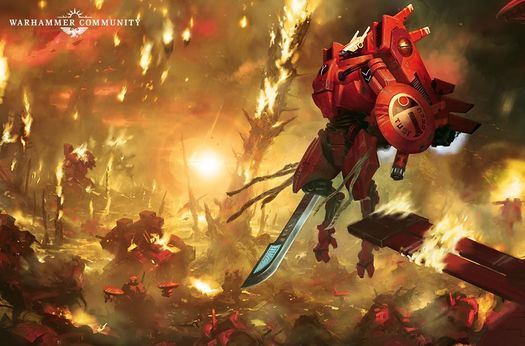
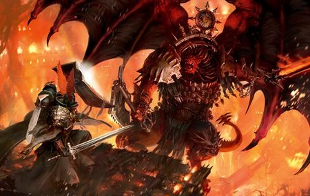

# 0843 M42早期 噩兆方舟战役(下) Arks of Omen Campaign

精校状态：中文行文已逐段精校，部分术语仍为暂定

分类：时间线

原文来源：https://www.bilibili.com/opus/1133464778796171264

原作者：帝国神选罐头

原文时间：2025年11月10日 11:02

[返回分类目录](目录.md) · [全书目录](../../目录.md)

<!-- A0843-B0001 -->

原译文

Part 4: Farsight 第四部分：远见

**校订译文**

Part 4: Farsight 第四部分：远见

<!-- /A0843-B0001 -->

<!-- A0843-B0002 -->
### Return to Arthas Moloch 返回阿尔萨斯·摩洛克

<!-- /A0843-B0002 -->

<!-- A0843-B0003 -->
**英文原文**

Meanwhile, the Tau Farsight Enclaves battled an Ork Waaagh! under Warboss Nazdreg. In the end, Commander Farsight was able to launch an assault on the Ork fortress-world of Dregrokk and Nazdreg went missing in a massive vortex implosion. However just as the Tau withdrew back into space to plan their next move, a Balefleet under Daemon Prince Ughalax arrived in-system. Led by the Ark of Omen Unhallowed, they sought a Key-Fragment located on the world. Ughalax's host consisted of many and varied elements from World Eaters under Gakhar the Savage to the Night Lords warband under the Flenseling Prince. Alongside them were more than two score other Chaos Space Marine warbands, Traitor Guardsmen Regiments, Chaos Knights, and three maniples of the Legio Vulturum.

<!-- /A0843-B0003 -->

<!-- A0843-B0004 -->

原译文

与此同时，钛远见飞地与战争头目纳兹德雷格的领导下的欧克Waaagh！作战。最后，远见指挥官能够对德雷格罗克欧克堡垒世界发动攻击，纳兹德雷格在一次巨大的漩涡内爆中失踪。然而，就在钛撤退回太空计划下一步行动时，恶魔王子乌加拉克斯领导的灾祸舰队抵达了星系。在噩兆方舟渎圣号的带领下，他们寻找一个位于世界上的钥匙碎片。乌加拉克斯的天军由许多不同的成员组成，从野蛮者加哈尔领导下的吞世者到剥皮王子领导下的午夜领主战帮。与他们并肩作战的还有20多个其他混沌星际战士战帮、叛徒卫队兵团、混沌骑士和三个秃鹰军团的支队。

**校订译文**

与此同时，钛族远见飞地正与战争头目纳兹德雷格麾下的欧克 Waaagh! 交战。最终，指挥官远见进攻欧克要塞世界德雷格罗克，纳兹德雷格则在一次巨大的涡流内爆中失踪。钛族刚撤回太空，准备筹划下一步行动，恶魔王子乌加拉克斯的灾祸舰队便驶入星系。舰队由噩兆方舟渎圣号领头，前来寻找这颗星球上的钥匙碎片。乌加拉克斯的大军成分复杂，包括野蛮者加哈尔麾下的吞世者、剥皮王子统领的午夜领主战帮，以及四十多个其他混沌星际战士战帮、叛军卫队诸团、混沌骑士和秃鹫军团的三支分队。

**校注：** two score 是四十，原二十多个误读；three maniples 为三支泰坦分队，未擅自推算台数。Legio Vulturum 原秃鹰／秃鹫并见，本篇统一秃鹫军团。

<!-- /A0843-B0004 -->

<!-- A0843-B0005 -->
**英文原文**

Ughalax observed the Tau and Greenskin fleets at war over Dreggrok, but resisting the temptation instead made for the nearby world of Arthas Moloch. Before he could give the command however, the World Eaters under Gakhar instead made right for the Xenos battle. This caused the Tau to withdraw and instead make for Arthas Moloch alongside a group of pursuing Orks. Farsight reached Arthas Moloch just hours ahead of his foes, intent on stopping Chaos' plan however it may manifest. He immediately landed upon the world then ordered his fleet scatter in the face of the incoming forces. Though melancholy at his forced return to this blighted world, he nonetheless organized his army to conduct a Kauyon-style guerilla campaign aimed at drawing the Orks and Chaos forces into destroying one another. So desperate was his situation that Farsight dispatched a Torpedo Drone to the Tau Empire requesting aid.

<!-- /A0843-B0005 -->

<!-- A0843-B0006 -->

原译文

乌加拉克斯观察到钛和绿皮舰队在德雷格罗克的战争中，但抵制住了诱惑，转而前往附近的阿尔萨斯·摩洛克世界。然而，在他下达命令之前，加哈尔领导下的吞世者转而向异型战斗进发。这导致钛撤退，转而与一群追击的欧克一起前往阿尔萨斯·摩洛克。远见比他的敌人提前几个小时到达阿尔萨斯·摩洛克，意图阻止混沌的计划，无论它表现如何。他立即降落在世界上，然后命令他的舰队在即将到来的部队面前散开。尽管他对被迫回到这个破败的世界感到沮丧，但他还是组织了他的军队进行了一场空育式的游击战，旨在吸引欧克和混沌部队相互摧毁。他的处境如此绝望，以至于远见派遣了一架鱼雷无人机前往钛帝国请求援助。

**校订译文**

乌加拉克斯看见钛族与绿皮舰队正在德雷格罗克上空交战，却克制住参战的诱惑，准备转向附近的阿尔萨斯·摩洛克。然而，他尚未下令，加哈尔的吞世者便擅自冲向异形舰队的战场。钛族因此撤退，改道前往阿尔萨斯·摩洛克，一群欧克紧追其后。远见比敌人早到数小时，决心阻止混沌计划，无论对方究竟想做什么。他立即登陆，并命令舰队面对即将抵达的敌军分散行动。重返这颗受诅咒的世界让他心情沉重，但他仍组织起一场遵循考雍战法的游击战，企图引诱欧克与混沌彼此消耗。局势如此绝望，他甚至派出一架鱼雷无人机，向钛帝国请求援助。

**校注：** Dregrokk／Dreggrok 为原文异拼，暂视同一世界德雷格罗克；Kauyon 按官方考雍，原空育不沿用。

<!-- /A0843-B0006 -->

<!-- A0843-B0007 -->
**英文原文**

The first weeks of the war on Arthas Moloch were bloody and anarchic. The Tau sought to fight on their own terms, falling back from unfavorable engagements and seeking to bait rampaging Ork hordes into Chaos warbands. For his part, Ughalax was focused on recovering the Key-Fragment located on the world. The madness of the world scrambled the minds of his slaved Psykers, preventing the Fragment from being quickly recovered. While most of his forces held to their mission, some such as the Word Bearers under Asmor Bleakverse spent most of their time capturing victims for sacrifice. Meanwhile, the Thousand Sons of the Perplexing Weave became captivated by the worlds ancient ruins and abandoned their mission to instead purge Greenskins in a particularly well-preserved ruin belt. Despite the efficient Tau strategy, Ughalax was able to eventually discertain their tactics and inflicted increasingly heavy losses on them. During the withdrawal from Temporary Air base Zephyr33, Farsight's close confidant Commander Brightsword was slain.

<!-- /A0843-B0007 -->

<!-- A0843-B0008 -->

原译文

对阿尔萨斯·摩洛克的战争的头几周是血腥和无秩序的。钛试图按照自己的方式作战，从不利的交战中退缩，并试图引诱狂暴的欧克部落到混沌战帮。就他而言，乌加拉克斯专注于恢复位于世界上的钥匙碎片。世界的疯狂扰乱了他被奴役的灵能者的思想，阻止了碎片的迅速恢复。虽然他的大部分部队都坚持执行任务，但阿斯莫尔·荒凉之诗领导下的怀言者等一些部队大部分时间都在抓捕受害者进行献祭。与此同时，困惑编织的千子们被世界的古代废墟所吸引，放弃了在保存完好的废墟带清除绿皮的任务。尽管有有效的钛战略，乌加拉克斯最终还是能够识别他们的战术，并给他们造成了越来越大的损失。在从西风33临时空军基地撤离期间，远见的密友明剑指挥官被杀。

**校订译文**

阿尔萨斯·摩洛克之战的头几周血腥而混乱。钛族力图掌握交战节奏，避开不利战斗，诱使狂暴的欧克大军撞上混沌战帮。乌加拉克斯则专心寻找钥匙碎片，但星球上的疯狂力量扰乱了其灵能奴仆的心智，使搜索迟迟未能完成。他的大多数部队仍在执行任务，却也有人另行其是：阿斯莫尔·荒凉之诗率领的怀言者忙于抓人献祭；“迷乱织网”的千子则迷上了古代遗迹，抛下原定任务，转去清剿一片保存特别完好的遗迹带内的绿皮。钛族战法虽有效，乌加拉克斯最终还是识破其战术，让他们蒙受越来越大的损失。从西风 33 临时空军基地撤退时，远见的亲密战友明剑指挥官阵亡。

**校注：** 原文 abandoned their mission to instead purge 表示放弃原任务、转而清剿绿皮，原译恰好反成放弃清剿绿皮。Perplexing Weave 暂定迷乱织网，原困惑编织。

<!-- /A0843-B0008 -->

<!-- A0843-B0009 -->
**英文原文**

Ughalax began to realize that he faced the stiffest Tau opposition in the ruin belts of Arthas Moloch's northern hemisphere. Intrigued, he began to believe that the Tau had hidden most of their command assets here or more importantly were defending something that they did not the Chaos forces to capture. The Orks meanwhile continued to pour down onto Arthas Moloch, and an especially audacious group of Freebooterz even boarded the Unhallowed itself. With Nazdreg's disappearance, several Orks had risen to command the remnants of his Waaagh!. This included the Freebooter Beast Snagga Bolgrog Bigtusk, Gargant mob boss Skragga Fundastomp, and the Goff Mekboss Da Smoggboss and his up-armored Speedwaagh!. The Greenskins increasingly began to work together, forcing the Tau into smaller operational areas and frustrating Farsight. The heavy casualties and the loss of friends such as Brightsword and Ob'lotai began to take its mental toll of O'Shovah personally.

<!-- /A0843-B0009 -->

<!-- A0843-B0010 -->

原译文

乌加拉克斯开始意识到，他在阿尔萨斯·摩洛克北半球的废墟地带面临着最强硬的钛反抗者。他很感兴趣，开始相信钛把大部分指挥资产都藏在了这里，或者更重要的是，他们正在保卫一些他们没有被混沌部队占领的东西。与此同时，欧克继续向阿尔萨斯·摩洛克倾倒，一群特别大胆的流寇甚至登上了渎圣号本身。随着纳兹德雷格的失踪，几个欧克已经起来指挥他的Waaagh！。这包括流寇兽霸博尔格罗格·大牙，加冈特暴徒头目斯克拉加·重踏，以及高夫技师头目大烟雾头目和他的装甲极速Waaagh！绿皮越来越多地开始合作，迫使钛进入更小的作战区域，让远见感到沮丧。重大伤亡和明剑和奥博'罗泰等朋友的牺牲开始对欧'肖瓦个人造成精神上的伤害。

**校订译文**

乌加拉克斯逐渐注意到，自己在阿尔萨斯·摩洛克北半球遗迹带遭遇的钛族抵抗最顽强。他怀疑，钛族可能把主要指挥力量藏在这里，更可能是在保护某件不愿让混沌夺走的东西。与此同时，欧克继续涌向星球，一伙格外大胆的流寇甚至登上了渎圣号。纳兹德雷格失踪后，数名欧克头目崛起，争夺其 Waaagh! 残部的指挥权，包括流寇兽霸博尔格罗格·大牙、加冈特战帮头目斯克拉加·重踏，以及高夫技师头目大烟雾头目和他的重装极速 Waaagh!。绿皮越来越善于合作，将钛族压缩在更小的活动范围内，让远见深感挫败。惨重伤亡，以及明剑、奥博’罗泰等战友的死亡，也开始侵蚀欧’肖瓦本人的心志。

**校注：** O’Shovah 为远见的另一称呼，沿核心与原稿，不另造人物；Ob’lotai 暂沿奥博’罗泰，其身份细节不据其他版本补写。

<!-- /A0843-B0010 -->

<!-- A0843-B0011 -->
### War of Attrition 消耗战争

<!-- /A0843-B0011 -->

<!-- A0843-B0012 -->
**英文原文**

By this point, the Tau were being pushed into the ruin zone around the Great Star Dais. Rather than breakout, an increasingly frustrated Farsight instead established a series of corridors to drawn in most of his forces and established what was dubbed the Star Dais ExclusioN Zone. He then instructed his best commanders to focus on decapitation strikes against Ork and Chaos command assets which succeeded in knocking out many Greenskin and Chaos warlords alike including the Night Lords leader known as the Flenseling Prince. These strikes also proved to spark infighting amongst his enemies and bought time for the Tau Empire reinforcements he hoped were on their way. During these actions a vengeful Farsight fought in the thickest of the action, venting his frustrations upon his foes.

<!-- /A0843-B0012 -->

<!-- A0843-B0013 -->

原译文

此时，钛正被推入巨星平台周围的废墟区。越来越沮丧的远见非但没有突破，反而建立了一系列通道来吸引他的大部分部队，并建立了所谓的星辰平台排除区。然后，他指示他最好的指挥官集中精力对欧克和混沌指挥资产进行斩首打击，成功击败了许多绿皮和混沌军阀，包括被称为剥皮王子的午夜领主领袖。这些袭击也引发了敌人之间的内斗，并为他希望即将到来的钛帝国增援部队争取了时间。在这些行动中，复仇的远见在最激烈的行动中战斗，向敌人发泄他的沮丧。

**校订译文**

此时，钛族已被逼入巨星平台周围的遗迹区。愈发焦躁的远见并未选择突围，而是开辟一系列通道，将大部兵力收拢进来，建立“星台禁入区”。他命最优秀的指挥官专门袭击欧克与混沌的指挥中枢，成功斩首多名敌方军阀，其中包括午夜领主的剥皮王子。这些突袭还引发敌人内斗，为他寄望中的钛帝国援军争取时间。远见本人则满怀复仇之心，冲入最激烈的战斗，将压抑的愤懑发泄在敌人身上。

**校注：** corridors 此处用于收拢己方部队，不是引诱自己的军队；Star Dais Exclusion Zone 暂译星台禁入区，原排除区僵硬。

<!-- /A0843-B0013 -->

<!-- A0843-B0014 图片 -->

<!-- A0843-B0015 -->

原译文

Commander Farsight and his forces upon the battlefield 远见指挥官和他的部队在战场上

**校订译文**

Commander Farsight and his forces upon the battlefield 远见指挥官和他的部队在战场上

<!-- /A0843-B0015 -->

<!-- A0843-B0016 -->
**英文原文**

By the time of the Battle of the Haggard Tower against a huge Ork horde that the supposed Ethereal aid finally arrived from the Tau Empire during which Commander Bravestorm was badly injured. As Farsight oversaw the wounded Bravestorm's evacuation to a medical facility, a Drone appeared projecting the image of Ethereal Supreme Aun'va. Instead of offering salvation however, the holographic message stated that Farsight had turned his back on the Greater Good through his actions and that the entire Farsight Enclaves would be condemned with him. The message finished by stating he hoped Farsight would inflict much damage on the Chaos and Ork forces before his inevitable end. A furious Farsight destroyed the Drone with his Plasma Rifle then ordered his forces withdraw to their fallback positions while he went into a state of meditation to determine what their next move would be. In truth, Farsight had now become determined on his final desperate gambit to unleash the same enemies at the Great Star Dais upon his foes that he had encountered during his first visit to Arthas Moloch.

<!-- /A0843-B0016 -->

<!-- A0843-B0017 -->

原译文

在憔悴之塔与庞大的欧克部落的战斗中，所谓的以太支援终于从钛帝国抵达，在此期间，勇暴指挥官受了重伤。当远见监督受伤的勇暴被疏散到医疗机构时，一架无人机出现了，投射出了至高以太铵'瓦的影像。然而，全息信息并没有提供救赎，而是表示远见通过他的行为背弃了上上善道，整个远见飞地都将与他一起受到谴责。消息最后说，他希望远见在他不可避免的结局之前对混沌和欧克部队造成足够大的伤害。愤怒的远见用他的等离子步枪摧毁了无人机，然后命令他的部队撤退到他们的后备阵地，同时他进入冥想状态，以确定他们的下一步行动。事实上，远见现在已经下定决心，要采取最后一个绝望的策略，他将自己首次造访阿尔萨斯·莫洛克时遭遇过的敌人在巨星平台上尽数释放。

**校订译文**

憔悴之塔一战中，钛族与庞大的欧克大军激战，勇暴指挥官身受重伤；就在这时，钛帝国所谓的以太援助终于到来。远见正安排将勇暴撤往医疗设施，一架无人机出现，投射出至高以太铵瓦的影像。全息讯息没有带来援救，反而宣告远见的所作所为已背离上上善道，整个远见飞地都将与他一同受到谴责。铵瓦最后表示，希望远见在不可避免的灭亡前，尽可能重创混沌和欧克。盛怒的远见用等离子步枪击毁无人机，命令部队退回备用阵地，自己则进入冥想，思索下一步。事实上，他已经决心作最后一搏：在巨星平台释放自己初访阿尔萨斯·摩洛克时遭遇的那些敌人，让它们攻击眼下的追兵。

<!-- /A0843-B0017 -->

<!-- A0843-B0018 -->
### The Great Star Dais 巨星平台

<!-- /A0843-B0018 -->

<!-- A0843-B0019 -->
**英文原文**

Farsight immediately ordered the Tau Fleet scattered across the system return to Arthas Moloch and prepare for high-value extraction. All across the battlefront, Tau forces began to conduct a fighting and orderly withdrawal. As the Tau cordon decreased in size, Ork and Chaos forces began to clash more frequently and Farsight sought to exploit this. Soon only Farsight, his commanders, and a few thousand warriors were left around the Great Star Dais.

<!-- /A0843-B0019 -->

<!-- A0843-B0020 -->

原译文

远见立即命令分散在整个星系中的钛舰队返回阿尔萨斯·莫洛克，准备进行高价值的提取。在整个战线上，钛部队开始进行战斗并有序撤退。随着钛警戒线规模的缩小，欧克和混沌部队开始更频繁地发生冲突，远见试图利用这一点。很快，只有远见、他的指挥官和几千名战士留在了巨星平台周围。

**校订译文**

远见立即命令分散在星系各处的钛族舰队返回阿尔萨斯·摩洛克，准备撤离关键人员。整条战线的钛族部队开始有序地边战边退。随着钛族防御圈缩小，欧克与混沌更加频繁地直接交锋，远见正准备利用这一点。很快，巨星平台周围只剩他本人、各位指挥官和几千名战士。

<!-- /A0843-B0020 -->

<!-- A0843-B0021 -->
**英文原文**

At the same time, an Imperial Deathwatch force abroad the Sword Class Frigate Bleak Missive intercepted Farsights communique. Watch Captain Tholonius counceled his Codicier Cachecis, who in truth was an Alpha Legion infiltrator known as Lord Glass. Informing on the Deathwatch to Vashtorr, Lord Glass sought to acquire the Key-Fragment of Arthas Moloch before Ughalax could do so. Lord Glass activated his trigger phrase aboard the Bleak Missive (That of Looking Glass), causing 20 of the 34 Space Marines aboard to reveal their true allegiance and rise up. Taking their loyalist brothers by complete surprise, the Alpha Legion quickly overran the Frigate and set course for Arthas Moloch. Upon arriving they abandoned the vessel to make planetfall as the Bleak Missive was blasted from space. The Alpha Legion target as an ancient downed Dark Angels Dark Talon fighter jet, in which they believed the Key-Fragment was held.

<!-- /A0843-B0021 -->

<!-- A0843-B0022 -->

原译文

与此同时，帝国的一支死亡守望部队 — 剑级护卫舰荒凉使命号截获了远见的公报。守望连长托洛尼乌斯指挥他的典记员卡切西斯，他实际上是阿尔法军团的渗透者，被称为镜面领主。镜面领主在向瓦什托尔在死亡守望提供信息后，试图在乌加拉克斯之前获得阿尔萨斯·摩洛克的钥匙碎片。镜面领主在荒凉使命号上激活了他的触发短语，导致船上34名星际战士中的20名暴露了他们的真正忠诚并站了起来。阿尔法军团让他们的忠诚兄弟们大吃一惊，并迅速占领了护卫舰，设定了阿尔萨斯·摩洛克的航向。他们抵达后便弃船登陆行星，而此时荒凉使命号已经在太空中爆炸。阿尔法军团的目标是一架古老的被击落的黑暗天使暗爪喷气战斗机，他们认为钥匙碎片就在其中。

**校订译文**

与此同时，帝国死亡守望部队乘坐的剑级护卫舰凄冷信函号截获了远见的通讯。守望连长托洛尼乌斯征询典记员卡切西斯的意见，却不知道后者其实是名叫“镜面领主”的阿尔法军团渗透者。镜面领主向瓦什托尔泄露死亡守望情报，打算抢在乌加拉克斯之前取得阿尔萨斯·摩洛克上的钥匙碎片。他在舰上说出暗号“镜子”，三十四名星际战士中的二十人随即暴露真实效忠对象，发动叛乱。忠诚派同袍措手不及，阿尔法军团很快控制护卫舰，转向阿尔萨斯·摩洛克。抵达后，他们弃舰登陆，凄冷信函号随后在太空中被击毁。他们的目标是一架古老的坠毁黑暗天使暗爪战机，认为钥匙碎片就藏在机内。

**校注：** counseled 为征询或商议，非单向指挥。Looking Glass 暗号原中文漏译，现补镜子；Bleak Missive 是信函名称而非 mission 使命，舰名暂改凄冷信函号。

<!-- /A0843-B0022 -->

<!-- A0843-B0023 -->
**英文原文**

By this point, Gakhar and his World Eaters had launched a full-scale assault on the first Tau defences around the Great Star Dais. Massed waves of Cultists and Traitor Guardsmen absorbed the Tau volley fire, allowing the Chaos Space Marines to draw in close and rip the Xenos to pieces. In their wake came tanks and Daemon Engines. Ughalax himself surged forward alongside a column of Black Legion vehicles, and the Tau proved unable to halt the Chaos advance. Out on the ashen plains, Ork Gargants under Skragga Fundastomp fought the Chaos Titans of the Legio Vulturum as Knights and Stompas clashed around their feet. Other Ork warbands surged forward, creating a hectic three-sided battle for supremacy. A fourth faction entered the fray when the Alpha Legionnaires under Lord Glass arrived, seeking the downed Dark Talon fighter. Using Servitors to excavate the Dark Talon and the crystaline growth within, Lord Glass was overjoyed at acquiring the key-fragment before Ughalax. Now, they need only board the Unhallowed and offer up the fragment to the Warp Portal within to take credit with Vashtorr for the discovery. Unbeknownst to the Chaos forces on the ground, however, Ork boarding parties had actuallxy overrun the Unhallowed, defeating Ughalax.

<!-- /A0843-B0023 -->

<!-- A0843-B0024 -->

原译文

此时，加哈尔和他的吞世者已经对巨星平台周围的第一道钛防线发动了全面进攻。大批的邪教徒和叛徒卫队吸收了钛的齐射火力，使混沌星际战士得以靠近并将异型撕成碎片。紧随其后的是坦克和恩引擎。乌加拉克斯本人与一列黑色军团载具一起向前冲去，事实证明，钛无法阻止混沌的推进。在灰白色的平原上，斯克拉加·重踏领导的欧克加冈特与秃鹫军团的混沌泰坦作战，骑士和古巨圾在他们的脚下发生冲突。其他欧克战帮奋力向前，为争夺霸权而展开了一场紧张的三方战争。当镜面领主率领的阿尔法军团抵达时，第四个派系加入了战斗，寻找被击落的暗爪战斗机。镜面领主利用机仆挖掘暗爪和里面生长的晶体，在乌加拉克斯前面获得了钥匙碎片，他欣喜若狂。现在，他们只需要登上渎圣号，并将碎片提供给里面的亚空间传送门，就可以由这一发现从瓦什托尔获得赞誉。然而，在地面上的混沌部队不知情的情况下，欧克跳帮队实际上已经击败了乌加拉克斯，肆虐了渎圣号。

**校订译文**

此时，加哈尔及吞世者已全面进攻巨星平台周围的第一道钛族防线。大批邪教徒与叛军卫队用肉身承受齐射，让混沌星际战士得以逼近，将异形撕碎；坦克和恶魔引擎紧随而至。乌加拉克斯本人也随一列黑色军团车辆冲锋，钛族无力遏止其推进。灰烬平原上，斯克拉加·重踏麾下的欧克加冈特与秃鹫军团的混沌泰坦交战，骑士和践踏巨机在它们脚下厮杀。其他欧克战帮也一拥而上，战斗化为三方混战。镜面领主率阿尔法军团抵达后，第四方势力又加入其中，寻找坠毁的暗爪战机。他们让机仆挖出战机及其内部生长的晶体，抢在乌加拉克斯前拿到钥匙碎片，镜面领主大喜过望。只要登上渎圣号，将碎片献给舰内传送门，他们就能向瓦什托尔邀功。然而，地面的混沌部队并不知道，欧克跳帮队已夺下渎圣号，并击败了乌加拉克斯。

**校注：** 原文同段前称乌加拉克斯亲自在地面，末尾又说欧克登舰击败他，叙事未交代位置变化；保留并标记，不补造返回舰上过程。

<!-- /A0843-B0024 -->

<!-- A0843-B0025 -->
**英文原文**

Soon enough Ork and Chaos forces began to reach the Great Star Dais itself. Farsight pulled back his remaining forces while he and the remainder of The Eight (now reduced to five) made their stand on the Dais itself. Resisting the urge to surge forward and spill the blood of his enemies, Farsight instead stuck to his plan. This odd bloodlust was spreading throughout the Tau ranks, causing some normally disciplined warriors to venture out of their defences to meet the oncoming foes. Farsight recognized some external force was influencing the Tau, but knew he must complete his mission before they all fell to madness. Only when the first wave of Berzerkers reached the Dais did Farsight and his remaining officers open fire. Orks soon entered the kill-box, and it was then that Farsight enacted his plan. He used the blood of the fallen enemies to influence the ancient structure, and soon enough Daemons began to manifest across the battlefield.

<!-- /A0843-B0025 -->

<!-- A0843-B0026 -->

原译文

很快，欧克和混沌部队开始到达巨星平台本身。远见撤回了他剩下的部队，而他和其余的八人（现在减少到五人）则站在了平台身上。远见顶住了向前冲去、让敌人流血的冲动，坚持了自己的计划。这种奇怪的嗜血情绪在整个钛队伍中蔓延，导致一些通常有纪律的战士冒险走出防御工事，迎战迎面而来的敌人。远见意识到一些外部力量正在影响钛，但他知道他必须在他们都陷入疯狂之前完成任务。只有当第一波狂战士到达平台时，远见和他的其余军官才开火。欧克很快进入了杀戮箱，就在那时，远见实施了他的计划。他利用倒下的敌人的鲜血来影响这座古老的结构，很快，恶魔开始在战场上出现。

**校订译文**

欧克和混沌很快逼近巨星平台。远见让残部后撤，自己与仅剩五人的“八人组”在平台上坚守。他克制住冲上去泼洒敌血的冲动，继续按计划行动。诡异的嗜血欲望正在钛族队伍中传播，连平时纪律严明的战士也有人擅离工事，迎向敌人。远见意识到某种外力正在影响钛族，知道必须赶在所有人发疯前完成任务。直到第一波狂战士冲上平台，他和剩余军官才开火。欧克很快也进入预设火力区，远见随即实施计划：用敌人的鲜血激活这座古老建筑。恶魔很快开始在整个战场显现。

**校注：** The Eight 为远见亲随群体名，暂译八人组，现存五人与固定称号不矛盾；区别黄衣之王八人众。

<!-- /A0843-B0026 -->

<!-- A0843-B0027 -->
**英文原文**

What followed was absolute bedlam as Orks, mortal followers of Chaos, Daemons, and Tau murdered one another. Using the anarchy as a distraction, Farsight ordered his remaining forces attempt to slip away. Tau warships were in orbit over Arthas Moloch's northern hemisphere, blasting a path through enemy vessels for extraction. However madness began to sweep through the Tau lines, and Farsight's battlesuit itself was transformed into a war engine to rival a Titan. His Dawn Blade had been replaced with an axe and skulls appeared across his armor. Farsight began to view his planned retreat of cowardice, and he soon lost himself in rage as he hacked apart enemies. However it was the thought that he should fight alone for himself and let his own troops too weak to survive fall that caused Farsight to recoile in horror, and a degree of sanity returned to him. As Farsight regained his senses and returned to his uncorrupted form, his battlesuit AI informed him that their window of retreat had now shrunk to mere minutes.

<!-- /A0843-B0027 -->

<!-- A0843-B0028 -->

原译文

接下来是绝对的混乱，欧克，混沌的凡人追随者，恶魔和钛互相谋杀。远见利用无秩序状态分散注意力，命令他的剩余部队试图溜走。钛战舰在阿尔萨斯·摩洛克北半球上空的轨道上，在敌方战舰中开辟了一条撤离路径。然而，疯狂开始席卷钛战线，远见的战斗服本身被改造成了一台战争引擎，可以与泰坦匹敌。他的黎明之刃被斧头取代，头骨出现在他的盔甲上。远见开始看到他计划中的怯懦撤退，他很快就在愤怒中击败了敌人。然而，正是想到他应该独自为自己而战，让自己的部队太弱而无法生存下去，才让远见惊恐地重新振作起来，他恢复了一定程度的理智。当远见恢复知觉，恢复了原样时，他的战斗服AI告诉他，他们的撤退窗口现在已经缩小到几分钟。

**校订译文**

欧克、混沌凡人追随者、恶魔与钛族彼此厮杀，战场彻底失控。远见趁乱命令残部脱身。钛族战舰已在北半球上空就位，在敌舰间轰开撤离通道。然而，疯狂也席卷钛族阵线，远见的战斗服变成足以匹敌泰坦的战争机器，黎明之刃化为斧头，装甲上浮现头骨。他开始认为计划中的撤退是怯懦，陷入怒火，疯狂砍杀敌人。直到一个念头出现——他应该只为自己独战，让那些弱得无法存活的部下自生自灭——远见才猛然感到恐惧，恢复一丝理智。他重新清醒，战斗服也恢复未受腐化的形态；此时，其人工智能告知他，撤离窗口只剩几分钟。

**校注：** 原文将战斗服变化按叙事直接陈述，未明确是幻象或物质变形，译文同样保留，不自行判定。远见因察觉自己欲抛弃部下而惊醒，原译丢失这一因果。

<!-- /A0843-B0028 -->

<!-- A0843-B0029 -->
**英文原文**

Jetting back to the Star Dais, Farsight gathered his remaining Eight to him and ordered that they were to fight no more this day. They would resist the urge to spill blood and instead shephered their surviving troops out of the battlezone. Extraction was all that mattered now, retreat was survival. Content to let the enemy destroy one another, the Tau withdrew north to the extraction zone.

<!-- /A0843-B0029 -->

<!-- A0843-B0030 -->

原译文

飞回星辰平台，远见聚集了他剩下的八个人，命令他们今天不要再打了。他们会抵抗嗜血的冲动，而是将幸存的部队赶出战区。现在，撤退才是最重要的，撤退就是生存。知足让敌人互相摧毁，钛向北撤退到提取区。

**校订译文**

远见喷射飞回巨星平台，召集八人组的幸存成员，命令他们今天不再作战。他们必须抵抗杀戮欲望，护送残存部队离开战区。此刻，撤离才是唯一要务，退走才能生存。钛族任由敌人相互毁灭，向北撤往接应区。

<!-- /A0843-B0030 -->

<!-- A0843-B0031 -->
**英文原文**

Shortly after the Tau departed, the Chaos forces also disappeared, having seemingly achieved their objective. Only Greenskins remained on Arthas Moloch, who soon lost interest and looked elsewhere for a fight. After the enemy had departed, Farsight and his entourage quietly returned to Arthas Moloch to examine the Great Star Dais and investigate its status. Farsight was pleased to find the corruption was gone, and that organic life was beginning to develop on the world. Meanwhile, the Orks renamed the captured Unhallowed to Da Suparig, turning it into a mobile base. The former Ark of Omen was shared between the armies of Bolgrog Bigtusk, Skragga Fundastomp, and Da Smoggboss, as none could agree who of them had killed Ughalax.

<!-- /A0843-B0031 -->

<!-- A0843-B0032 -->

原译文

在钛离开后不久，混沌部队也消失了，似乎已经实现了他们的目标。只有绿皮留在阿尔萨斯·摩洛克身上，很快就失去了兴趣，转向别处寻求战斗。敌人离开后，远见和他的随从悄悄地回到阿尔萨斯·摩洛克，检查巨星平台并调查其状态。远见很高兴地发现腐化已经消失，有机生命开始在世界上发展。与此同时，欧克将被俘的渎圣号更名为超大环，将其变成了一个移动基地。前噩兆方舟由博尔格罗格·大牙、斯克拉加·重踏和大烟雾头目的军队共享，因为没有人能就谁杀了乌加拉克斯达成一致。

**校订译文**

钛族离去后不久，混沌部队也消失了，似乎已达成目标。阿尔萨斯·摩洛克只剩绿皮，它们很快失去兴趣，转向其他地方寻找战斗。敌人离开后，远见及随从悄然返回，检查巨星平台的状况。他欣喜地发现腐化已经消退，星球上开始出现生命。另一边，欧克将夺来的渎圣号改名为“超级大车号”，作为移动基地。博尔格罗格·大牙、斯克拉加·重踏和大烟雾头目的军队共同使用这艘旧方舟，因为三方谁也不承认别人杀死了乌加拉克斯。

**校注：** Da Suparig 为夺取的方舟新名，rig 指装置或车辆，不是 ring 环；暂译超级大车号，原超大环保留对照。

<!-- /A0843-B0032 -->

<!-- A0843-B0033 -->

原译文

Part 5: The Battle of Idolatros 第五部分：盲信之战

**校订译文**

Part 5: The Battle of Idolatros 第五部分：盲信之战

<!-- /A0843-B0033 -->

<!-- A0843-B0034 -->
### The Lure 诱饵

<!-- /A0843-B0034 -->

<!-- A0843-B0035 -->
**英文原文**

Following Vashtorr's assault on The Rock, the Dark Angels and other chapters of the Unforgiven gathered in strength to learn of the Arkifane's stronghold and finish the Daemon once and for all. Ultimately, 3/4th of all Unforgiven strength was mustered at the great mobile Fortress-Monastery. Meanwhile, torture of captured Fallen revealed that Vashtorr had taken refuge in the Idolatros System in the Somnium Stars. Azrael and other assembled Inner Circle knew they were heading into a trap, but at the same time could not leave Vashtorr free to wreak havoc upon the Imperium. Azrael dispatched several taskforces of Unforgiven ahead of the main fleet in order to search for Vashtorr's inevitable trap. At the same time, Ezekiel and other Unforgiven Chief Librarians sought to unravel the strands of fate and forsee what awaited them in the Somnium Stars.

<!-- /A0843-B0035 -->

<!-- A0843-B0036 -->

原译文

在瓦什托尔对巨石的攻击之后，黑暗天使和不可饶恕者的其他战团聚集在一起，了解造物者的据点，并一劳永逸地终结恶魔。最终，四分之三的不可饶恕的力量被召集到了巨大的移动堡垒修道院。与此同时，对被俘的堕天使的折磨表明，瓦什托尔已经在幻梦群星的盲信星系中避难。阿兹瑞尔和其他聚集在一起的内环知道他们正陷入陷阱，但同时不能让瓦什托尔自由地对帝国造成严重破坏。阿兹瑞尔在主舰队前方派遣了几支不可饶恕者特遣部队，以搜寻瓦什托尔不可避免的陷阱。与此同时，以西结和其他不可饶恕者的首席智库试图解开命运的线索，并预见在幻梦群星等待他们的是什么。

**校订译文**

瓦什托尔进攻巨石后，黑暗天使与其他戴罪者战团大举集结，准备查明造物者的据点，一劳永逸地除掉他。最终，戴罪者总兵力的四分之三齐聚这座巨大移动要塞修道院。对被俘堕天使的拷问得知，瓦什托尔藏身于幻梦群星的盲信星系。阿兹瑞尔及在场的内环成员明知前方是陷阱，却也不能任由瓦什托尔继续祸害帝国。他派数支戴罪者特遣部队先于主舰队出发，搜寻敌人必然布下的圈套。以西结与其他战团的首席智库员则试图解读命运，预见幻梦群星中等待他们的事物。

<!-- /A0843-B0036 -->

<!-- A0843-B0037 -->
**英文原文**

Soon enough, Ravenwing scout fleets returned with word of waiting traitor armadas within the Idolatros System. These included not only expected Cult of the Arkifane and Black Legion but also Emperor's Children, Death Guard, and Word Bearers. Largest of all was the Ark of Omen Netherworld Blade and its Balefleet, which was under control of the Dark Mechanicum. For their part, the Unforgiven Librarians under Ezekiel were able to confirm that Vashtorr indeed dwelt within the System, though they could offer little more information than that. Many other periphery Chaos fleets lay in the Unforgivens path, and Azrael declared that several chapters such as the Cowled Wardens, Blades of Vengeance, and Guardians of the Covenant strike in the Scrilem and Apostra Systems to deal with these foes.

<!-- /A0843-B0037 -->

<!-- A0843-B0038 -->

原译文

很快，鸦翼侦察舰队带着盲信星系内等待的叛徒舰队的消息回来了。这些人不仅包括预期中的造物者教派和黑色军团，还包括帝皇之子、死亡守卫和怀言者。其中最大的是噩兆方舟冥界之刃号及其灾祸舰队，它由黑暗机械教控制。就他们而言，以西结领导下的不可饶恕者的智库能够证实瓦什托尔确实在这个星系中，尽管他们只能提供很少的信息。许多其他外围的混沌舰队都在不可饶恕者的道路上，阿兹瑞尔宣布，几个战团，如罩袍监察者、复仇之刃和圣约守卫者，在斯克里莱姆和阿波斯特拉星系中打击，以应对这些敌人。

**校订译文**

鸦翼侦察舰队很快带回消息：叛军舰群正在盲信星系中等候。敌人不仅有预料之中的造物者教派与黑色军团，还包括帝皇之子、死亡守卫和怀言者。其中最大的力量，是黑暗机械教控制的噩兆方舟冥界之刃号及其灾祸舰队。以西结麾下的戴罪者智库员确认瓦什托尔确在星系内，却无法提供更多信息。通往目标的外围星系也盘踞着不少混沌舰队，阿兹瑞尔命令罩袍监察者、复仇之刃、圣约守卫者等战团，前往斯克里莱姆和阿波斯特拉星系，清除这些敌军。

<!-- /A0843-B0038 -->

<!-- A0843-B0039 -->
### Into Idolatros 盲信之内

<!-- /A0843-B0039 -->

<!-- A0843-B0040 -->
**英文原文**

When The Rock and its massive accompanying fleet finally arrived into the Idolatros System, it detected an unexpected concealed abberation but the Ravenwing scouts had been been accurate that a large Balefleet lay in the path of the Unforgiven. Soon enough both sides traded Torpedo fire and Attack Craft launched as the massive battle erupted.

<!-- /A0843-B0040 -->

<!-- A0843-B0041 -->

原译文

当巨石及其庞大的随行舰队最终抵达盲信星系时，它发现了一个意想不到的隐蔽修道院，但鸦翼侦察兵已经准确地指出，一支庞大的灾祸舰队位于不可饶恕者的道路上。很快，双方交换了鱼雷火力，随着大规模战斗的爆发，攻击机发射了。

**校订译文**

巨石与庞大的随行舰队抵达盲信星系后，发现一处意料之外的隐蔽异常。鸦翼侦察结果则得到证实：一支大型灾祸舰队挡在戴罪者前方。双方随即互射鱼雷，放出攻击机群，大规模舰战就此爆发。

**校注：** abberation 应为 aberration（异常）拼写差错，原译修道院误认 abbey；只保留未明异常，不提前指认后文揭晓对象。

<!-- /A0843-B0041 -->

<!-- A0843-B0042 -->
**英文原文**

The Unforgiven had a significant advantage in numbers, but the Chaos forces had the advantage of Vashtorr's infernal mastery of technology as well as their weapons being seemingly boosted by the power of the Somnium Stars. Soon enough, The Unforgiven suffered heavy casualties and several capital ships were lost to highly advanced Chaos weaponry. For its part, the Ark of Omen Netherworld Blade was able to destroy an entire squadron of Frigates of the Disciples of Caliban as well as two Strike Cruisers. Undeterred, the Dark Angels launched boarding actions against several Chaos Daemonships and destroyed them from within. From their strategium aboard The Rock, Azrael and his Inner Circle determined that the Netherworld Blade was simply stalling the best its could to buy time for reinforcements, reinforcements that the Unforgiven were simultaneously ambushing in the periphery systems.

<!-- /A0843-B0042 -->

<!-- A0843-B0043 -->

原译文

不可饶恕者在人数上有着显著的优势，但混沌部队的优势在于瓦什托尔对技术的地狱般的掌握，以及他们的武器似乎被幻梦群星的力量所增强。很快，不可饶恕者遭受了重大伤亡，几艘主力舰被高度先进的混沌武器摧毁。就其本身而言，噩兆方舟冥界之刃号能够摧毁卡利班门徒的护卫舰的整个中队以及两艘打击巡洋舰。黑暗天使没有被吓倒，对几个混沌恶魔舰发动了跳帮行动，并从内部摧毁了它们。从他们在巨石上的战略来看，阿兹瑞尔和他的内环确定，冥界之刃号只是在尽其所能拖延时间，为增援部队争取时间，而不可饶恕者同时在外围星系伏击增援部队。

**校订译文**

戴罪者数量占优，混沌则倚仗瓦什托尔精湛而邪恶的技术，其武器似乎还受到幻梦群星力量的强化。戴罪者很快遭受重创，数艘主力舰被高度先进的混沌武器摧毁。冥界之刃号一舰便击毁了卡利班门徒一整个护卫舰编队，以及两艘打击巡洋舰。黑暗天使仍不退缩，登上数艘混沌恶魔舰，从内部将其摧毁。阿兹瑞尔与内环成员在巨石的战略指挥室中判断，冥界之刃号只是在尽量拖延，等待援军——而这些援军恰好正在外围星系遭到戴罪者伏击。

<!-- /A0843-B0043 -->

<!-- A0843-B0044 -->
**英文原文**

Master Sammael led a Ravenwing detachment in boarding the Netherworld Blade from his flagship Implacable Justice. They were joined by reinforcements from several Unforgiven strike forces, as supporting capital ships knocked out the Ark of Omens engines one by one. Yet the Ark did not die quietly, and in its death throes destroyed the Redoubtable and badly damaged five other vessels. By the time the Unforgiven withdrew, the Ark was a shattered hollowed-out ruin. Satisfied, Azrael ordered his fleet regroup and make for their true target: Vashtorr.

<!-- /A0843-B0044 -->

<!-- A0843-B0045 -->

原译文

导师萨麦尔率领一支鸦翼分队从他的旗舰无解正义号跳帮了冥界之刃号。他们与几支不可饶恕者的打击部队的增援部队会合，支援主力舰一个接一个地摧毁了噩兆方舟的发动机。然而，方舟并没有平静地死去，在它的垂死挣扎中摧毁了可敬号，并严重损坏了其他五艘战舰。当不可饶恕者撤退时，方舟已经是一片破碎的废墟。阿兹瑞尔满意地命令他的舰队重新集结，朝着他们的真正目标：瓦什托尔前进。

**校订译文**

萨麦尔导师从旗舰不屈正义号出击，率鸦翼分队登上冥界之刃号，其他数支戴罪者打击部队也前来增援。支援的主力舰则逐一摧毁方舟引擎。但方舟临死仍在挣扎，击毁可敬号，又重创五艘舰船。戴罪者撤出时，冥界之刃号已成为被掏空的破碎残骸。阿兹瑞尔满意地下令重整舰队，转向真正的目标：瓦什托尔。

<!-- /A0843-B0045 -->

<!-- A0843-B0046 -->
**英文原文**

Hours passed by as the Unforgiven fleet pressed deeper into the Idolatros System with only scattered signs of the enemy. During this time, Techmarines identified a mysterious Warp resonance that was seemingly growing in strength. Though its purpose could not be surmised, it began to interfere with mechanical systems and even the minds of those in the Unforgiven fleet. Finally, the Unforgiven fleet came in sight of what Vashtorr had been constructing: a planet-sized mechanical monstrosity of infernal Warp technology. To Azrael's horror, he realized that the Arkifane had acquired and modified the remnants of the ancient Dark Angels homeworld of Caliban. To the Forces of Chaos, they deemed the abomination Wyrmwood. Worse still, Abaddon the Despoiler and a large Black Legion fleet emerged from a Warp sub-dimension that had been constructed by Vashtorr's infernal technology.

<!-- /A0843-B0046 -->

<!-- A0843-B0047 -->

原译文

几个小时过去了，不可饶恕者的舰队在只有零星敌人迹象的情况下，进一步深入盲信星系。在此期间，技术军士发现了一种神秘的亚空间共振，其强度似乎在不断增强。虽然它的目的无法猜测，但它开始干扰机械系统，甚至干扰不可饶恕者舰队中的人的思想。最后，不可饶恕者的舰队看到了瓦什托尔一直在建造的东西：一个星球大小的炼狱亚空间技术机械怪物。令阿兹瑞尔惊恐的是，他意识到造物者已经获得并改造了古代黑暗天使家园世界卡利班的残骸。对于混沌部队来说，他们认为龙林星是可憎的。更糟糕的是，掠夺者阿巴顿和一支庞大的黑色军团舰队从瓦什托尔的炼狱技术建造的亚空间分维度中出现。

**校订译文**

数小时过去，戴罪者舰队不断深入盲信星系，沿途只见零星敌踪。科技战士侦测到一种神秘的亚空间共振，强度似乎越来越高。虽然无法判断其用途，它却已开始干扰机械系统，甚至影响舰队人员的心智。最后，瓦什托尔建造的东西出现在眼前：一座行星般庞大、以邪恶亚空间技术构成的机械怪物。阿兹瑞尔惊恐地意识到，造物者竟取得并改造了黑暗天使古老母星卡利班的残骸。混沌称这件亵渎造物为“龙林星”。更糟的是，掠夺者阿巴顿率庞大黑色军团舰队，从瓦什托尔以邪术科技构筑的亚空间夹层中现身。

**校注：** deemed ... Wyrmwood 在此为命名，将这件可憎造物称为龙林星，原译误成混沌也认为龙林星可憎。

<!-- /A0843-B0047 -->

<!-- A0843-B0048 -->
### Wyrmwood 龙林星

<!-- /A0843-B0048 -->

<!-- A0843-B0049 -->
**英文原文**

The Supreme Grand Master of the Unforgiven ordered his fleet make a full-on attack on Vashtorr's perversion of the Dark Angels legacy. The Dark Angels led boarding parties on the ruin of Caliban (now reclassified as the Daemon World Wyrmwood), including Azrael himself. The basic Unforgiven plan was to clear the primary continent of orbital defences to allow The Rock and its accompanying fleet to enact an Exterminatus on a scale unseen since the Horus Heresy. On the surface of Wyrmwood, the Unforgiven met not only Chaos Space Marines but also Daemons, Daemon Engines, Dark Skitarii, and Cultists. The Unforgiven fought their way towards a traitor bastion dubbed the Dark Cathedrum. Azrael and his own forces struck at a continental megastructure known as the Warpforge Palace, which Unforgiven Techmarines had identified as something similar to a Teleportarium which held the assembled Key-fragments the Chaos forces had assembled. Alongside Ezekiel, Belial, and Asmodai, Azrael struck at the Warpforge Palace as Angels of Redemption, Cowled Wardens, and Bladekeepers conducted diversionary attacks.

<!-- /A0843-B0049 -->

<!-- A0843-B0050 -->

原译文

不可饶恕者的至高大导师命令他的舰队全力攻击瓦什托尔对黑暗天使遗产的扭曲。黑暗天使在卡利班（现重新归类为恶魔世界龙林星）的废墟上领导了跳帮队，其中包括阿兹瑞尔本人。不可饶恕者的基本计划是清除主要大陆的轨道防御，使巨石及其随行舰队能够实施自荷鲁斯叛乱以来从未见过的灭绝计划。在龙林星的表面，不可饶恕者不仅遇到了混沌星际战士，还遇到了恶魔、恶魔引擎、黑暗护教军和邪教徒。不可饶恕者奋力向一个被称为黑暗大教堂的叛徒堡垒前进。阿兹瑞尔和他自己的部队袭击了一个名为亚空间铸炉宫殿的大陆巨型建筑，不可饶恕者技术军士将其确定为类似于传送仪的东西，其中存放着混沌部队组装的钥匙碎片。与以西结、贝利亚和阿斯莫代一起，阿兹瑞尔袭击了亚空间铸炉宫殿，因为救赎天使、罩袍看守者和守刃者进行了转移注意力的攻击。

**校订译文**

至高大导师下令全军进攻这件对黑暗天使遗产的亵渎造物。阿兹瑞尔亲自加入登陆部队，踏上已被重新认定为恶魔世界龙林星的卡利班残骸。戴罪者计划清除主要大陆上的轨道防御设施，让巨石及随行舰队能够发动荷鲁斯之乱以来罕见的大规模灭绝令。在地表，敌人不只有混沌星际战士，还有恶魔、恶魔引擎、黑暗护教军和邪教徒。戴罪者向名为黑暗大教堂的叛军要塞推进。阿兹瑞尔则率亲军攻击一座大陆级巨型建筑——亚空间铸炉宫殿。科技战士判断，它类似传送设施，混沌搜集的钥匙碎片正存放其中。阿兹瑞尔与以西结、贝利亚和阿斯莫德共同突击宫殿，救赎天使、罩袍监察者与守刃者则发动佯攻，分散敌人注意。

**校注：** 原文一处称大陆级巨型结构，未进一步说明面积；译文不补具体大小。Warpforge／Warpforged Palace 视为本篇同一宫殿异形，保留原英文。

<!-- /A0843-B0050 -->

<!-- A0843-B0051 -->
**英文原文**

After many nightmarish hours of battle which included facing the Daemon Prince Paralaxese, Azrael and his entourage at last reached the heart of the Warpforged Palace. There, they confronted an altar of Calibanite ruins on which the Key-Fragments had been ferried. Now however, the altar was the site of a huge brass shrine to Khorne which was defended by World Eaters and House Bazhkar. At its center was a vast summoning circle, and from it emerged Angron, Primarch of the World Eaters.

<!-- /A0843-B0051 -->

<!-- A0843-B0052 -->

原译文

在经历了数小时的噩梦般的战斗，包括与恶魔王子帕拉莱克西斯的对抗后，阿兹瑞尔和他的随从终于到达了亚空间铸炉宫殿的中心。在那里，他们面对着一座卡利班废墟祭坛，钥匙碎片就被运到了那里。然而，现在这座祭坛是一座巨大的恐虐黄铜神龛的所在地，由吞世者和巴兹卡尔家族防御。在它的中心是一个巨大的召唤圈，从中出现了吞世者的原体安格隆。

**校订译文**

经过数小时噩梦般的交战，包括与恶魔王子帕拉莱克西斯的战斗，阿兹瑞尔及随从终于抵达亚空间铸炉宫殿中心。他们看到一座由卡利班废墟构成的祭坛，钥匙碎片曾被运至此处。但祭坛如今已成为巨大的恐虐黄铜圣所，由吞世者与巴兹卡尔家族守卫。中央的庞大召唤法阵中，吞世者原体安格隆现身了。

<!-- /A0843-B0052 -->

<!-- A0843-B0053 -->
**英文原文**

In orbit, the Unforgiven found themselves hard-pressed by Abaddon's fleet led by the Vengeful Spirit and Vashtorr's Balefleet led by the Ark of Omen Orac Unleashed. The Unforgiven fleet was led by Grand Master Nakir of the Consecrators, but they were sandwiched between the weaponry of Wyrmwood and the Chaos armada. Abaddon and Falkus Kibre led a boarding operation of the Ravenwing flagship Implacable Justice, scuttling the vessel and sending its remains tumbling into the loyalist fleet. Its Warp Drive then detonated, devastating the Unforgiven. Fortunately for the Unforgiven, a loyalist armada of Blood Angels and Imperial Navy under Regent Dante soon translated into the Idolatros System. Though not knowing how these allies had known of the Unforgiven's crusade, Nakir nonetheless was relieved by these new arrivals. From his flagship Absolution's Ire, Dante ordered the attack. However still unknown to the Unforgiven, Dante carried with him a special passenger: Lion El'Jonson, the recently reawakened Primarch of the Dark Angels.

<!-- /A0843-B0053 -->

<!-- A0843-B0054 -->

原译文

在轨道上，不可饶恕者发现自己受到了由复仇之魂号领导的阿巴顿舰队和由噩兆方舟释放神谕号领导的瓦什托尔舰队的沉重打击。不可饶恕者的舰队由奉献者的大导师纳克尔领导，但他们被夹在龙林星和混沌舰队的武器之间。阿巴顿和法库斯·凯博领导了对鸦翼旗舰无解正义号的跳帮行动，凿沉了该船，并将其残骸投入了忠诚的舰队。它的亚空间引擎随后爆炸，摧毁了不可饶恕者。幸运的是，在摄政但丁的领导下，一支由圣血天使和帝国海军组成的忠诚舰队很快传送到盲信星系。虽然不知道这些盟友是如何知道不可饶恕者的远征的，但纳克尔还是被这些新来者所宽慰。但丁从他的旗舰赦免之怒号命令进攻。然而，不可饶恕者仍然不知道，但丁带着一位特殊的乘客：最近重新苏醒的黑暗天使原体莱昂·艾尔庄森。

**校订译文**

轨道上，戴罪者遭到双重猛攻：一边是复仇之魂号领头的阿巴顿舰队，另一边是神谕释放号领头的瓦什托尔灾祸舰队。奉献者大导师纳基尔统率戴罪者舰队，部队却被夹在龙林星与混沌舰群的火力之间。阿巴顿和法库斯·凯博跳帮鸦翼旗舰不屈正义号，毁坏舰船，将残骸推向忠诚派舰队。它的亚空间引擎随即爆炸，给戴罪者造成重大损失。幸而，摄政但丁率圣血天使与帝国海军组成的忠诚派舰队跃入盲信星系。纳基尔虽不明白盟友何以得知这次远征，仍因援军抵达而松了一口气。但丁在旗舰赦免之怒号上下令进攻。戴罪者还不知道，他带来了一位特殊乘客：刚刚苏醒归来的黑暗天使原体莱昂·艾尔’庄森。

<!-- /A0843-B0054 -->

<!-- A0843-B0055 -->
### Dante's Arrival 但丁的到来

<!-- /A0843-B0055 -->

<!-- A0843-B0056 -->
**英文原文**

To Dante's surprise however, the Lion no longer could be discovered aboard his flagship. The Blood Angels Chapter Master quickly surmrised that he had used his own new abilities to manifest on Caliban's surface. Trusting a son of the Emperor to carry out his own task, Dante proceeded with his own plan and sent Imperial Navy reinforcements to bolster the defences of The Rock as his own Blood Angels fleet plunged into the desperate orbital battle. At his arrival, Dante proudly announced the return of Lion El'Jonson, which was met by utter disbelief and shock by the Unforgiven. Nakir bombarded Dante with questions and oaths before stating that he now owed the Blood Angels a debt which could never be repaid. Together, Nakir and Dante sought to stabilize the desperate situation in orbit. Seeing the Blood Angels fleet inbound, Abaddon ordered his ships disengage from their present actions and reform for a counterattack. For his part, Vashtorr was irked by these new arrivals but undeterred. He reorganized his vessels and led the Orac Unleashed towards The Rock.

<!-- /A0843-B0056 -->

<!-- A0843-B0057 -->

原译文

然而，令但丁惊讶的是，在他的旗舰上再也找不到莱昂了。圣血天使战团长很快断定，他已经用自己的新能力在卡利班的表面显现了。但丁相信帝皇的一个儿子会完成自己的任务，于是继续执行自己的计划，并派遣帝国海军增援部队来加强巨石的防御，因为他自己的圣血天使舰队陷入了绝望的轨道战。当他到达时，但丁自豪地宣布莱昂·艾尔庄森的归来，这遭到了不可饶恕者的彻底怀疑和震惊。纳克尔用问题和誓言轰炸但丁，然后说他现在欠圣血天使一笔永远无法偿还的债务。纳克尔和但丁一起试图稳定轨道上的绝望局势。看到圣血天使舰队的到来，阿巴顿命令他的战舰脱离目前的行动，进行反击。就他而言，瓦什托尔对这些新来的人感到恼火，但并没有被吓倒。他重组了他的战舰，率领释放神谕号驶向巨石。

**校订译文**

然而，但丁惊讶地发现，狮王已不在旗舰上。他很快推测，莱昂利用新能力前往了卡利班表面。但丁相信帝皇之子能够完成自己的任务，于是继续按计划行动：让帝国海军增援巨石的防御，亲率圣血天使舰队投入危急的轨道战。他在抵达时自豪地宣布莱昂·艾尔’庄森归来，戴罪者震惊得难以置信。纳基尔接连发问、立誓，最后说，戴罪者如今欠下圣血天使一份永远还不清的恩情。两人合力稳住轨道局势。阿巴顿看见圣血天使舰队逼近，命令己方舰船脱离当前交战，重新编队反击。瓦什托尔虽因援军到来而恼怒，却并未退缩；他重整舰队，率神谕释放号逼向巨石。

<!-- /A0843-B0057 -->

<!-- A0843-B0058 -->
**英文原文**

Once within range of The Rock, Vashtorr used his technological mastery to establish contact with the prize he had sought all along: the ancient Tuchulcha engine, which had become embedded in The Rock millennia ago. Already, Vashtorr had acquired its sister engines Ouroboros and Plagueheart and with the third and final piece could create the Dissonance Engine in order to use The Key to access an Old One vault from the days of the War in Heaven. After exchanging a string of questions and dialog, Vashtorr and the Tuchulcha vanished into another realm entirely. Inside the pocket dimension at the heart of Wyrmwood, Vashtorr and Tuchulcha manifested alongside the Ouroboros and Plagueheart. Finally, the Arkifane began to complete his work by completing the Dissonance Engine. However the action proved to shatter the Orac Unleashed alongside its abominable intelligence, the Orac Myriad. Following the destruction of the Orac Unleashed, the Chaos fleet in orbit now found itself badly outmatched. The Rock and Imperial Navy vessels plunged forward, seeking to reinforce the Unforgiven and Blood Angels near Wyrmwood.

<!-- /A0843-B0058 -->

<!-- A0843-B0059 -->

原译文

一进入巨石的范围内，瓦什托尔就利用他的技术掌握与他一直寻求的战利品建立了联系：几千年前嵌入巨石的古代图丘查引擎。瓦什托尔已经获得了它的姊妹引擎衔尾蛇和瘟疫之心，并且可以用第三个也是最后一个引擎来创建不协引擎，以便使用钥匙进入天堂战争时期的古圣秘库。在交换了一系列问题和对话后，瓦什托尔和图丘查完全消失在另一个领域。在龙林星中心的口袋维度里，瓦什托尔和图丘查与衔尾蛇和瘟疫之心一起出现。最后，造物者开始完成他的工作，完成了不协引擎。然而，事实证明，这一行动粉碎了释放神谕号及其憎恶智能万象神谕。在释放神谕号被摧毁后，轨道上的混沌舰队现在发现自己被严重击败。巨石和帝国海军战舰向前猛冲，试图增援龙林星附近的不可饶恕者和圣血天使。

**校订译文**

进入有效范围后，瓦什托尔运用技术权能，与自己始终想得到的目标建立联系：数千年前融入巨石的古代图丘查引擎。他此前已获得另外两台同类引擎——衔尾蛇与瘟疫之心。只要得到最后这一台，就能构成不协引擎，借助钥匙进入天堂之战时期遗留的古圣秘库。双方经过一番问答，瓦什托尔和图丘查一同从现场消失，进入另一重空间。在龙林星核心的口袋维度内，它们与衔尾蛇、瘟疫之心会合，造物者终于开始完成不协引擎。这个过程却摧毁了神谕释放号及其憎恶智能万象神谕。方舟损失后，混沌轨道舰队陷入严重劣势。巨石与帝国海军舰船立即前进，支援龙林星附近的戴罪者和圣血天使。

**校注：** Ouroboros 此处是与图丘查、瘟疫之心对应的古代引擎，沿原稿衔尾蛇；区别第567篇其他实体的同形专名乌洛波洛斯。不因同形词强合并。

<!-- /A0843-B0059 -->

<!-- A0843-B0060 -->
**英文原文**

Back on Wyrmwood's surface, Azrael led a desperate defence against the might of Angron and his World Eaters. The Deathwing and Librarians conducted a rearguard action to allow Azrael and the core of his force into a string of gothic structures, though the cost had been terrible and Belial badly wounded by Angron himself. Several World Eaters attacks led by Angron on the new Unforgiven defensive line had failed, but at great cost. Soon enough, the Unforgiven now found themselves encircled and awaiting inevitable destruction. Just then, a Golden Host led by Dante himself emerged from the sky to save the Dark Angels. Together with these new allies, the Dark Angels led a general counterattack to break out of their siege. Amidst the chaotic battle, Azrael and Dante coordinated their actions despite a lack of Vox contact. Angron clearly had to be dealt with first, and the Blood Angels focused most of their fire upon this foe. Dante and his Sanguinary Guard fell upon the Red Angel alongside Assault Squads and Redemptor Dreadnoughts. Faced with this trap, even Angron staggered in the face of the Blood Angels assault.

<!-- /A0843-B0060 -->

<!-- A0843-B0061 -->

原译文

回到龙林星的表面，阿兹瑞尔领导了一场绝望的防御，对抗安格隆和他的吞世者的力量。死翼和智库进行了一次后卫行动，允许阿兹瑞尔和他的核心部队进入一系列哥特式建筑，尽管代价惨重，贝利亚也被安格隆本人重伤。安格隆率领的几次吞世者对新的不可饶恕者防线的攻击都失败了，但代价惨重。很快，不可饶恕者现在发现自己被包围了，等待不可避免的毁灭。就在这时，但丁亲自率领的黄金天军从天而降，拯救了黑暗天使。黑暗天使与这些新盟友一起领导了一场全面的反击，打破了他们的围困。在混乱的战斗中，尽管缺乏音阵的联系，阿兹瑞尔和但丁还是协调了他们的行动。显然，首先必须对付安格隆，圣血天使将大部分火力集中在这个敌人身上。但丁和他的圣血卫队与突击小队和救赎者无畏一起袭击了红天使。面对这个陷阱，就连安格隆也在圣血天使的攻击面前步履蹒跚。

**校订译文**

龙林星表面，阿兹瑞尔正在拼死抵挡安格隆与吞世者。死翼和智库员承担断后任务，掩护他与主力退入一片哥特式建筑，代价极其惨重，贝利亚也被安格隆亲手重伤。安格隆率吞世者数次进攻新防线，虽被击退，戴罪者却也损失惨重，最终陷入包围，似乎只能等待覆灭。此时，但丁亲率黄金大军从天而降，援救黑暗天使。两军随即联合反击，试图突围。通讯虽已中断，阿兹瑞尔与但丁仍在混战中协调行动。他们明白必须先解决安格隆，圣血天使于是将大部分火力集中在红天使身上。但丁和圣血守卫伴随突击小队、救赎者无畏机甲同时扑来；陷入围攻的安格隆，也在这股攻势下踉跄后退。

**校注：** Golden Host 在此指但丁麾下的圣血天使部队，暂作黄金大军，与第509篇同名恶魔军势不是同一实体。

<!-- /A0843-B0061 -->

<!-- A0843-B0062 -->
**英文原文**

However such was the might of Angron that not even this could subdue him. Despite coming under attack from all sides the Red Angel endured and atop a high tower bested not only the Blood Angels elite but even Dante himself. After destroying both Redemptor Dreadnoughts, Azrael watched in horror as the battered Angron threw Dante to the ground and was about to deliver the killing blow. Horror turned to disbelief as shadows erupted from the spot between Angron and Dante. From these shadows strode Lion El'Jonson, who deflected Angron's blow. The Lion was not alone: his loyalist Fallen known as The Risen emerged beside him. Despite the countless questions that surged across their minds, the Dark Angels only felt jubilation at the arrival of their Primarch. Azrael ordered a furious counterattack led by the Deathwing, and the Unforgiven pressed forward with a renewed zeal.

<!-- /A0843-B0062 -->

<!-- A0843-B0063 -->

原译文

然而，安格隆的力量如此之大，即使这样也无法征服他。尽管受到来自四面八方的攻击，红天使还是坚持了下来，在一座高塔上不仅击败了圣血天使精英，甚至击败了但丁本人。在摧毁了两位救赎者无畏后，阿兹瑞尔惊恐地看着被击溃的安格隆将但丁摔倒在地，准备进行致命一击。当阴影从安格隆和但丁之间的地方爆发出来时，恐惧变成了难以置信。莱昂·艾尔庄森从这些阴影中大步走了出来，他挡住了安格隆的一击。莱昂并不孤单：他的忠诚派堕天使被称为赦天使出现在他身边。尽管他们脑海中涌现出无数问题，但黑暗天使只是在他们的原体到来时感到欣喜。阿兹瑞尔下令在死翼的带领下进行猛烈的反击，不可饶恕者以新的狂热向前推进。

**校订译文**

但安格隆的力量仍强得难以制伏。他顶住四面八方的攻击，在高塔上击败圣血天使精锐，甚至将但丁本人打倒。两台救赎者无畏机甲被摧毁后，阿兹瑞尔惊恐地看见，伤痕累累的安格隆将但丁掼倒在地，即将施以致命一击。这时，阴影在两人之间骤然涌出，恐惧变成难以置信：莱昂·艾尔’庄森大步走出，挡住了安格隆的攻击。狮王并非孤身而来，被称为赦天使的忠诚派堕天使随他一同现身。黑暗天使脑海中虽有无数疑问，此刻却只因原体归来而欢欣。阿兹瑞尔下令，由死翼率领猛烈反击，戴罪者带着重燃的热忱向前推进。

**校注：** battered 指安格隆遍体鳞伤，不是已经被击溃；两台 Redemptor Dreadnoughts 按官译救赎者无畏机甲。

<!-- /A0843-B0063 -->

<!-- A0843-B0064 -->
**英文原文**

The Lion quickly withdrew from Dante's broken body to draw away Angron. The Red Angel rained a constant stream of blows upon the Lion, but against such a foe even Angron was hard-pressed. The Lion briefly met Azrael's gaze and in that moment knew that it was up to the Supreme Grand Master to win the day on Wyrmwood and recover the broken Blood Angels while El'Jonson dealt with Angron.

<!-- /A0843-B0064 -->

<!-- A0843-B0065 -->

原译文

莱昂很快将但丁破碎的身体拉了出来，把安格隆移开。红天使不断地向莱昂发起攻击，但面对这样的敌人，就连安格隆也受到了沉重的打击。莱昂短暂地碰上了阿兹瑞尔的目光，在那一刻，他知道这取决于至高大导师在龙林星赢得胜利，并在莱昂·艾尔庄森处理安格隆的同时恢复破碎的圣血天使。

**校订译文**

狮王迅速远离重伤倒地的但丁，将安格隆引走。红天使不断挥击，但面对这样的对手，即使他也倍感吃力。莱昂与阿兹瑞尔短暂交换目光，双方在这一刻明白：原体负责对付安格隆，至高大导师则必须赢下龙林星上的其余战斗，并救回重创的圣血天使。

**校注：** withdrew from Dante’s broken body 指狮王远离倒地的但丁以引走安格隆，原译却成拖出但丁身体；未据此宣称但丁身亡。

<!-- /A0843-B0065 -->

<!-- A0843-B0066 -->
### The Angel and The Beast 天使与野兽

<!-- /A0843-B0066 -->

<!-- A0843-B0067 -->
**英文原文**

On Wyrmwood itself, the Unforgiven and their new allies continued their assault, but were hampered by the ever-shifting puzzle-like terrain and traps of the mechanical world. Amidst all of this battled the Lion and Angron. While El'Jonson was disgusted by the corrupted form of his former brother, Angron felt only some dim recognition at the Lion. The two demigods fought their way across Wyrmwood, and with the Lion armed with his new weapons Fealty and the Emperor's Shield even Angron was facing extreme challenge. The battle between the two was titanic and saw them tumble into structures and Angron throw vehicles as if they were missiles. As Wyrmwood shifted, the ground crumbled beneath them and their battle continued as the two plunged below.

<!-- /A0843-B0067 -->

<!-- A0843-B0068 -->

原译文

在龙林星本身，不可饶恕者和他们的新盟友继续进攻，但受到机械世界不断变化的地形和陷阱的阻碍。在这一切中，莱昂和安格隆展开了战斗。当艾尔庄森对他前兄弟的堕落形态感到厌恶时，安格隆对莱昂只有一些模糊的认识。两个半神在龙林星战斗，莱昂手持他的新武器忠诚和帝皇之盾，就连安格隆也面临着极端的挑战。两人之间的战斗是巨大的，他们摔倒在建筑物里，安格隆像导弹一样投掷车辆。随着龙林星的移动，他们脚下的地面坍塌了，他们的战斗继续进行，两人一起跳入下面。

**校订译文**

戴罪者与新盟友继续进攻，却受到龙林星不断变化、宛如谜题的地形和陷阱阻碍。莱昂与安格隆就在这片混乱中厮杀。狮王厌恶昔日兄弟如今腐化的模样，安格隆则似乎只对他留有模糊的印象。两位半神一路战过龙林星，莱昂手持新武器忠诚与帝皇之盾，令安格隆也遭遇了极严峻的挑战。两人激战，撞入建筑，安格隆更将车辆当作导弹投掷。龙林星的结构不断移位，脚下地面突然坍塌，他们在坠向深处时仍交锋不休。

**校注：** plunged below 指地面坍塌后坠落，并非主动一起跳下；Angron 的认人反应按原文 dim recognition 保留。

<!-- /A0843-B0068 -->

<!-- A0843-B0069 图片 -->

<!-- A0843-B0070 -->

原译文

Lion El'Jonson faces Angron 莱昂·艾尔庄森面对安格隆

**校订译文**

Lion El'Jonson faces Angron 莱昂·艾尔’庄森迎战安格隆

<!-- /A0843-B0070 -->

<!-- A0843-B0071 -->
**英文原文**

By now, Azrael had linked up with the new acting Blood Angels commander, Aphael of the 2nd Company. They fought their way to the remains of the Sanguinary Guard, where they found several survivors including Dante. Dante was helped back to his feet, and together with Azrael and Aphael they planned their next course of action. Entursting Nakir to enact the Exterminatus plan, Dante and Azrael focused on extracting their warriors by seeking to establish several stable landing zones for gunships to land. The first to fall before the renewed Imperial plan were the World Eaters of the Warpforge Palace, which were overwhelmned on all sides by Blood Angels and Unforgiven. Dante and Azrael then ordered their forces form up and make for the nearest extraction zone. When asked about the Lion's status, Azrael stated he did not know where his gene-father was gone but had faith that he would find his way back into orbit with them.

<!-- /A0843-B0071 -->

<!-- A0843-B0072 -->

原译文

到目前为止，阿兹瑞尔已经与新的代理圣血天使指挥官、第二连队的阿法尔建立了联系。他们奋力前往圣血卫队的残骸，在那里他们找到了包括但丁在内的几名幸存者。但丁被帮助站了起来，他们与阿兹瑞尔和阿法尔一起计划了下一步行动。但丁和阿兹瑞尔委托纳克尔实施灭绝计划，通过建立几个稳定的炮艇着陆区，集中精力营救他们的战士。在新的帝国计划之前，第一个倒下的是亚空间铸炉宫殿的吞世者，他们被圣血天使和不可饶恕者从四面八方压倒了。但丁和阿兹瑞尔随后命令他们的部队集结，前往最近的撤离区。当被问及莱昂的状态时，阿兹瑞尔表示，他不知道他的基因之父去了哪里，但相信他会找到与他们一起重返轨道的方法。

**校订译文**

阿兹瑞尔已与暂代圣血天使指挥权的第二连阿菲尔会合。他们杀到圣血守卫残部所在之处，发现包括但丁在内的数名幸存者。但丁被扶起，与两人共同商定下一步行动。他们将执行灭绝令的任务交给纳基尔，自己集中力量撤出地面部队，设法建立数处稳定的炮艇着陆区。亚空间铸炉宫殿内的吞世者首先遭到新攻势打击，在圣血天使与戴罪者四面围攻下被压垮。随后，但丁与阿兹瑞尔命全军集结，前往最近的撤离点。被问及狮王的下落时，阿兹瑞尔说，自己不知道基因之父去了哪里，但相信他能找到返回轨道、与众人会合的路。

<!-- /A0843-B0072 -->

<!-- A0843-B0073 -->
**英文原文**

Meanwhile, the Lion and Angron continued their battle in the industrial depths of Wyrmwood. As they fought closer to its core, they began to penetrate the veil between reality and the empyrean. After fighting across across Daemonic assembly lines, the two found themselves back on the surface. The Lion sought to use their new enviornment to enact his plan, while Angron had by now grown into an even greater fury then usual. Using the industrial steam to his advantage, the Lion was able to use Angron's own strike to push the point of his Power Sword Fealty into the Daemon Primarch's throat. The wound was such that not even Angron could quickly regenerate from it, and while he lay on his back the Lion used the point of the Emperor's Shield to decapitate his corrupted brother. As Angron exploded back into the Warp, the Lion was victorious but badly wounded. El'Jonson hefted himself to his feet and now sought to escape Wyrmwood.

<!-- /A0843-B0073 -->

<!-- A0843-B0074 -->

原译文

与此同时，莱昂和安格隆继续在龙林星的工业深渊作战。当他们更接近其核心时，他们开始穿透现实和至高天之间的帷幕。在跨越恶魔装配战线后，两人发现自己又回到了表面上。莱昂试图利用他们的新环境来实施他的计划，而安格隆现在已经变得比平时更愤怒了。利用工业蒸汽的优势，莱昂能够利用安格隆自己的攻击，将他的动力剑忠诚推入恶魔原体的喉咙。伤口是这样的，甚至安格隆也不能很快从中再生，当他仰倒时，莱昂用皇帝之盾的尖端斩首了他堕落的兄弟。当安格隆爆炸回到亚空间中时，莱昂取得了胜利，但受了重伤。艾尔庄森站了起来，现在试图逃离龙林星。

**校订译文**

莱昂与安格隆仍在龙林星的工业深处激战。越接近核心，两人便越深入现实与至高天之间的帷幕。他们杀过恶魔装配流水线，又重新回到地表。狮王决定借新环境实施计划，安格隆则比平时更加狂暴。莱昂利用工业蒸汽掩护，借安格隆自身挥击的力道，将动力剑忠诚的剑尖送入对方喉咙。伤势如此严重，连安格隆也无法迅速再生。趁他仰面倒下，狮王用帝皇之盾的尖端斩下了这位腐化兄弟的头颅。安格隆爆散，返回亚空间；莱昂虽然获胜，也身负重伤。他艰难站起，开始寻找离开龙林星的办法。

**校注：** assembly lines 为生产装配流水线，原装配战线误读；原体的刀剑、盾牌动作保持原文。

<!-- /A0843-B0074 -->

<!-- A0843-B0075 -->
**英文原文**

By now, Azrael and Dante were nearing their own extraction zone. Despite the infernal horrors of Wyrmwood including roaming tentacles and shattering terrain, Imperial gunships conducted several waves of evacuations. Yet the Blood and Dark Angels were now faced with new foes in the form of Nurgleite Daemons. Azrael took command to hold off these enemies with heavy fire as Dante and Sammael led assault elements around their flanks. During the subsequent fighting, Dante saved a group of Deathwing carrying the injured Belial from a group of Daemon Engines as Sammael waged a breakout attempt to establish a corridor to allow his allies to escape. Sammael's charge was met by a huge Great Unclean One known as Urghab'laxx, and the route to salvation now seemed closed. However it was then that The Lion emerged before Azrael, and despite being infuriated by the presence of The Risen the Supreme Grand Master quickly worked alongside his genefather. The Risen threw themselves as the Great Unclean One and his Daemons as Sammael was ordered to break through the Chaos lines at any cost.

<!-- /A0843-B0075 -->

<!-- A0843-B0076 -->

原译文

此时，阿兹瑞尔和但丁已经接近他们自己的撤离区。尽管龙林星有着可怕的恐怖，包括漫游的触手和破碎的地形，但帝国炮艇还是进行了几波疏散。然而，圣血与黑暗天使现在面临着纳垢恶魔形式的新敌人。当但丁和萨麦尔率领突击部队绕过他们的侧翼时，阿兹瑞尔指挥用猛烈的火力击退了这些敌人。在随后的战斗中，但丁从一群恶魔引擎手中救出了一群带着受伤的贝利亚的死翼，而萨麦尔则试图突破，建立一条走廊，让他的盟友逃脱。萨麦尔的猛攻遭到了一个大不净者的回应，被称为乌尔加布'拉克斯，通往救赎的道路现在似乎已经关闭了。然而，就在那时，莱昂出现在阿兹瑞尔面前，尽管被赦天使的存在激怒了，但至高大导师很快与他的基因之父一起战斗。当萨麦尔奉命不惜一切代价突破混沌战线时，赦天使将他们自己投向大不净者和他的恶魔。

**校订译文**

阿兹瑞尔与但丁已接近撤离点。龙林星上虽遍布游动的触手与不断崩裂的地形，帝国炮艇仍完成了数轮撤运。但新的敌人——纳垢恶魔——又挡在两支天使战团面前。阿兹瑞尔组织重火力压制，但丁与萨麦尔率突击部队绕向两翼。但丁从恶魔引擎群手中救出一队正在抬运受伤贝利亚的死翼，萨麦尔则发起突围，试图打开逃生通道。然而，大不净者乌尔加布’拉克斯截住了他的冲锋，生路似乎再度被封死。就在此时，莱昂出现在阿兹瑞尔面前。赦天使的出现虽令至高大导师愤怒，他仍迅速与基因之父并肩作战。赦天使扑向大不净者与其恶魔，萨麦尔则奉命不惜代价冲破混沌阵线。

<!-- /A0843-B0076 -->

<!-- A0843-B0077 -->
**英文原文**

Together, this renewed Imperial counterattack was able to smash through the Daemonic ambush. As the Blood Angels and Dark Angels broke through under the Ravenwing, Urghab'laxx was subdued by an army of Risen. Finally reaching their extraction zone, Dante and Azrael were the last to board their gunships and make for space. As they left, The Rock opened up its guns on Wyrmwood and seemingly delivered a killing blow to the ruins of Caliban.

<!-- /A0843-B0077 -->

<!-- A0843-B0078 -->

原译文

帝国再次发起反击，成功粉碎了恶魔的伏击。当圣血天使和黑暗天使在鸦翼下突破时，乌尔加布'拉克斯被赦天使的军队征服了。但丁和阿兹瑞尔终于到达了他们的撤离区，他们是最后一个登上炮艇前往太空的。当他们离开时，巨石向龙林星开火，似乎对卡利班的废墟造成了致命的打击。

**校订译文**

这轮联合反击终于冲破恶魔伏击。圣血天使与黑暗天使在鸦翼引领下突围，赦天使部队则压倒乌尔加布’拉克斯。抵达撤离点后，但丁与阿兹瑞尔最后登上炮艇，返回太空。他们离开之际，巨石开始炮击龙林星，似乎给卡利班残骸带来了致命一击。

<!-- /A0843-B0078 -->

<!-- A0843-B0079 -->
### The Key Awakens 钥匙觉醒

<!-- /A0843-B0079 -->

<!-- A0843-B0080 -->
**英文原文**

Though they had by now apparently succeeded in destroying Wyrmwood and pushing back Abaddon's fleet, Azrael and Dantes forces had experienced grievous losses. The Lion had also fought his way back into orbit, and announced over the Vox that to stay in the vicinity of Wyrmwood was to risk annihilation. The traitors had awakened something in the core of the planet, and it was now beyond the ability of The Rock to even destroy. Azrael and Dante ordered a general withdrawal. Aboard the Vengeful Spirit, Abaddon felt satisfaction at the devastating losses he had inflicted upon his foes but bitterness at the arrival of another loyalist Primarch.

<!-- /A0843-B0080 -->

<!-- A0843-B0081 -->

原译文

虽然他们现在显然已经成功地摧毁了龙林星并击退了阿巴顿的舰队，但阿兹瑞尔和但丁的部队遭受了严重的损失。莱昂也奋力重返轨道，并在音阵上宣布，留在龙林星附近将面临被歼灭的风险。叛徒们唤醒了行星核心的一些东西，现在巨石甚至无法摧毁它。阿兹瑞尔和但丁下令全面撤军。在复仇之魂号上，阿巴顿对他给敌人造成的毁灭性损失感到满意，但对另一位忠诚的原体的到来感到痛苦。

**校订译文**

帝国看似摧毁了龙林星、击退了阿巴顿舰队，但阿兹瑞尔与但丁的部队也遭受惨重损失。狮王同样杀回轨道，并通过通讯警告：继续留在龙林星附近，就有全军覆灭的危险。叛军已经唤醒行星核心的某种东西，连巨石也无法再将其摧毁。两位指挥官随即下令全面撤退。复仇之魂号上，阿巴顿对给予敌军的重创感到满意，却又因另一位忠诚派原体归来而深感愤恨。

**校注：** apparently 指表面看来成功，需保留这种不确定性，以衔接随后证实龙林星并未被毁。

<!-- /A0843-B0081 -->

<!-- A0843-B0082 -->
**英文原文**

It was then that Vashtorr established contact with Abaddon, announcing that he had succeeded in the construction of the Dissonance Engine and with it the awakening of The Key. Using the ascendent Wyrmwood, they could now claim The Lock and with it The Weapon. Shortly after, Wyrmwood tore open the veil of reality itself and plunged into a whirling abyss.

<!-- /A0843-B0082 -->

<!-- A0843-B0083 -->

原译文

就在那时，瓦什托尔与阿巴顿建立了联系，宣布他成功地建造了不协引擎，并随之唤醒了钥匙。使用升格的龙林星，他们现在可以声称拥有锁和武器。不久之后，龙林星撕开了现实本身的帷幕，陷入了一个旋转的深渊。

**校订译文**

瓦什托尔此时联系阿巴顿，宣布不协引擎已建成，钥匙也随之苏醒。借助升格的龙林星，他们现在可以前去夺取锁，进而获得武器。不久，龙林星撕开现实帷幕，冲入旋转的深渊。

<!-- /A0843-B0083 -->

<!-- A0843-B0084 -->
### Aftermath 余波

<!-- /A0843-B0084 -->

<!-- A0843-B0085 -->
**英文原文**

Ultimately, the Arks of Omen Campaign can be credited as a Chaos strategic victory despite the return of Lion El'Jonson. Vashtorr succeeded in assembling the Key-Fragments, and now sought to find The Lock in order to obtain The Weapon. The Inquisition under Coteaz recognizes as such, and has ordered all available assets be used to stop The Arkifane at all costs.

<!-- /A0843-B0085 -->

<!-- A0843-B0086 -->

原译文

最终，尽管莱昂·艾尔庄森回归，但噩兆方舟战役可以被视为混沌的战略胜利。瓦什托尔成功地组装了钥匙碎片，现在他试图找到锁以获得武器。科特兹领导的审判庭承认这一点，并下令不惜一切代价使用所有可用资产来阻止造物者。

**校订译文**

尽管莱昂·艾尔’庄森归来，噩兆方舟战役最终仍可视为混沌的一场战略胜利。瓦什托尔已成功集齐钥匙碎片，下一步便是寻找锁，取得武器。克提兹麾下的审判庭力量也认识到了这一点，命令调动一切可用资源，不惜代价阻止造物者。

**校注：** 此处 Coteaz 领导的是参与此事的审判庭力量，未将他表述为掌管整个帝国审判庭的最高首脑。

<!-- /A0843-B0086 -->

<!-- A0843-B0087 -->
## Order of Battle 战斗序列

原题：Order of Battle 战斗组织

<!-- /A0843-B0087 -->

<!-- A0843-B0088 -->

原译文

Imperium 帝国

**校订译文**

Imperium 帝国

<!-- /A0843-B0088 -->

<!-- A0843-B0089 -->

原译文

Space Marines 星际战士

**校订译文**

Space Marines 星际战士

<!-- /A0843-B0089 -->

<!-- A0843-B0090 -->

原译文

Black Templars 黑色圣堂

**校订译文**

Black Templars 黑色圣堂

<!-- /A0843-B0090 -->

<!-- A0843-B0091 -->

原译文

Blood Angels 圣血天使

**校订译文**

Blood Angels 圣血天使

<!-- /A0843-B0091 -->

<!-- A0843-B0092 -->
**英文原文**

Grey Knights - 4th Brotherhood

<!-- /A0843-B0092 -->

<!-- A0843-B0093 -->

原译文

灰骑士 - 第四兄弟会

**校订译文**

灰骑士 - 第四兄弟会

<!-- /A0843-B0093 -->

<!-- A0843-B0094 -->

原译文

Hawk Lords 雄鹰领主

**校订译文**

Hawk Lords 雄鹰领主

<!-- /A0843-B0094 -->

<!-- A0843-B0095 -->

原译文

Howling Griffons 咆哮狮鹫

**校订译文**

Howling Griffons 咆哮狮鹫

<!-- /A0843-B0095 -->

<!-- A0843-B0096 -->

原译文

Imperial Fists 帝国之拳

**校订译文**

Imperial Fists 帝国之拳

<!-- /A0843-B0096 -->

<!-- A0843-B0097 -->

原译文

Iron Angels 钢铁天使

**校订译文**

Iron Angels 钢铁天使

<!-- /A0843-B0097 -->

<!-- A0843-B0098 -->

原译文

Iron Hands 钢铁之手

**校订译文**

Iron Hands 钢铁之手

<!-- /A0843-B0098 -->

<!-- A0843-B0099 -->
**英文原文**

Legion of the Damned (speculated)

<!-- /A0843-B0099 -->

<!-- A0843-B0100 -->

原译文

咒缚军团（推测）

**校订译文**

咒缚军团（推测）

<!-- /A0843-B0100 -->

<!-- A0843-B0101 -->

原译文

Sons of Medusa 美杜莎之子

**校订译文**

Sons of Medusa 美杜莎之子

<!-- /A0843-B0101 -->

<!-- A0843-B0102 -->

原译文

Novamarines 新星战士

**校订译文**

Novamarines 新星战士

<!-- /A0843-B0102 -->

<!-- A0843-B0103 -->

原译文

Ultramarines 极限战士

**校订译文**

Ultramarines 极限战士

<!-- /A0843-B0103 -->

<!-- A0843-B0104 -->

原译文

Void Talons 虚空之爪

**校订译文**

Void Talons 虚空之爪

<!-- /A0843-B0104 -->

<!-- A0843-B0105 -->

原译文

White Scars 白色疤痕

**校订译文**

White Scars 白疤

<!-- /A0843-B0105 -->

<!-- A0843-B0106 -->

原译文

The Unforgiven 不可饶恕者

**校订译文**

The Unforgiven 戴罪者

<!-- /A0843-B0106 -->

<!-- A0843-B0107 -->

原译文

Dark Angels 黑暗天使

**校订译文**

Dark Angels 黑暗天使

<!-- /A0843-B0107 -->

<!-- A0843-B0108 -->

原译文

Angels of Absolution 赦免天使

**校订译文**

Angels of Absolution 赦免天使

<!-- /A0843-B0108 -->

<!-- A0843-B0109 -->

原译文

Angels of Redemption 救赎天使

**校订译文**

Angels of Redemption 救赎天使

<!-- /A0843-B0109 -->

<!-- A0843-B0110 -->

原译文

Blades of Vengeance 复仇之刃

**校订译文**

Blades of Vengeance 复仇之刃

<!-- /A0843-B0110 -->

<!-- A0843-B0111 -->

原译文

Bladekeepers 守刃者

**校订译文**

Bladekeepers 守刃者

<!-- /A0843-B0111 -->

<!-- A0843-B0112 -->

原译文

Consecrators 奉献者

**校订译文**

Consecrators 奉献者

<!-- /A0843-B0112 -->

<!-- A0843-B0113 -->

原译文

Guardians of the Covenant 圣约守卫者

**校订译文**

Guardians of the Covenant 圣约守卫者

<!-- /A0843-B0113 -->

<!-- A0843-B0114 -->

原译文

Cowled Wardens 罩袍监察者

**校订译文**

Cowled Wardens 罩袍监察者

<!-- /A0843-B0114 -->

<!-- A0843-B0115 -->

原译文

Penitent Blades 忏悔之刃

**校订译文**

Penitent Blades 忏悔之刃

<!-- /A0843-B0115 -->

<!-- A0843-B0116 -->

原译文

Imperial Guard 帝国卫队

**校订译文**

Imperial Guard 帝国卫队

<!-- /A0843-B0116 -->

<!-- A0843-B0117 -->

原译文

Death Korps of Krieg 克里格死亡军团

**校订译文**

Death Korps of Krieg 克里格死亡军团

<!-- /A0843-B0117 -->

<!-- A0843-B0118 -->

原译文

Imperial Navy 帝国海军

**校订译文**

Imperial Navy 帝国海军

<!-- /A0843-B0118 -->

<!-- A0843-B0119 -->

原译文

Fleet Quartus 第四舰队

**校订译文**

Fleet Quartus 第四舰队

<!-- /A0843-B0119 -->

<!-- A0843-B0120 -->

原译文

Sisters of Battle 战斗修女

**校订译文**

Sisters of Battle 战斗修女

<!-- /A0843-B0120 -->

<!-- A0843-B0121 -->

原译文

Order of Our Martyred Lady 我们的殉教女士修会

**校订译文**

Order of Our Martyred Lady 殉教圣女修会

<!-- /A0843-B0121 -->

<!-- A0843-B0122 -->

原译文

Order of the Argent Shroud 银白寿衣修会

**校订译文**

Order of the Argent Shroud 银白寿衣修会

<!-- /A0843-B0122 -->

<!-- A0843-B0123 -->

原译文

Adeptus Mechanicus 机械神教

**校订译文**

Adeptus Mechanicus 机械修会

<!-- /A0843-B0123 -->

<!-- A0843-B0124 -->

原译文

Legio Maledictus 诅咒军团

**校订译文**

Legio Maledictus 诅咒军团

<!-- /A0843-B0124 -->

<!-- A0843-B0125 -->

原译文

Forces from Graia 来自格莱亚的部队

**校订译文**

Forces from Graia 来自格莱亚的部队

<!-- /A0843-B0125 -->

<!-- A0843-B0126 -->

原译文

Basilikon Astra 星界君主

**校订译文**

Basilikon Astra 星界君主舰队

<!-- /A0843-B0126 -->

<!-- A0843-B0127 -->

原译文

Knights 骑士

**校订译文**

Knights 骑士

<!-- /A0843-B0127 -->

<!-- A0843-B0128 -->

原译文

House Terryn 特伦家族

**校订译文**

House Terryn 泰林家族

<!-- /A0843-B0128 -->

<!-- A0843-B0129 -->

原译文

Inquisition 审判庭

**校订译文**

Inquisition 审判庭

<!-- /A0843-B0129 -->

<!-- A0843-B0130 -->

原译文

Ordo Malleus 圣锤修会

**校订译文**

Ordo Malleus 恶魔审判庭

<!-- /A0843-B0130 -->

<!-- A0843-B0131 -->

原译文

Forces of Chaos 混沌部队

**校订译文**

Forces of Chaos 混沌部队

<!-- /A0843-B0131 -->

<!-- A0843-B0132 -->

原译文

Chaos Space Marines 混沌星际战士

**校订译文**

Chaos Space Marines 混沌星际战士

<!-- /A0843-B0132 -->

<!-- A0843-B0133 -->

原译文

Black Legion 黑色军团

**校订译文**

Black Legion 黑色军团

<!-- /A0843-B0133 -->

<!-- A0843-B0134 -->

原译文

Alpha Legion 阿尔法军团

**校订译文**

Alpha Legion 阿尔法军团

<!-- /A0843-B0134 -->

<!-- A0843-B0135 -->
**英文原文**

Iron Warriors Warbands including the Effacers of Medrengard, Barbican Lords, and Ferrocratic Creed

<!-- /A0843-B0135 -->

<!-- A0843-B0136 -->

原译文

钢铁勇士战帮包括梅林德加德抹除者，碉楼领主和铁权信条

**校订译文**

钢铁勇士战帮包括梅林德加德抹除者，碉楼领主和铁权信条

<!-- /A0843-B0136 -->

<!-- A0843-B0137 -->

原译文

Night Lords 午夜领主

**校订译文**

Night Lords 午夜领主

<!-- /A0843-B0137 -->

<!-- A0843-B0138 -->

原译文

Death Guard 死亡守卫

**校订译文**

Death Guard 死亡守卫

<!-- /A0843-B0138 -->

<!-- A0843-B0139 -->

原译文

Emperor's Children 帝皇之子

**校订译文**

Emperor's Children 帝皇之子

<!-- /A0843-B0139 -->

<!-- A0843-B0140 -->

原译文

Plaguecrows 瘟疫乌鸦

**校订译文**

Plaguecrows 瘟疫乌鸦

<!-- /A0843-B0140 -->

<!-- A0843-B0141 -->

原译文

Sons of Rot 腐烂之子

**校订译文**

Sons of Rot 腐烂之子

<!-- /A0843-B0141 -->

<!-- A0843-B0142 -->

原译文

The Scourged 鞭挞者

**校订译文**

The Scourged 天灾

<!-- /A0843-B0142 -->

<!-- A0843-B0143 -->

原译文

Thousand Sons 千子

**校订译文**

Thousand Sons 千子

<!-- /A0843-B0143 -->

<!-- A0843-B0144 -->

原译文

Vermin Guard 害虫守卫

**校订译文**

Vermin Guard 害虫守卫

<!-- /A0843-B0144 -->

<!-- A0843-B0145 -->

原译文

Word Bearers 怀言者

**校订译文**

Word Bearers 怀言者

<!-- /A0843-B0145 -->

<!-- A0843-B0146 -->
**英文原文**

World Eaters - Massive force from many warbands including The Foresworn, Fire Riders, and Butcherhorde

<!-- /A0843-B0146 -->

<!-- A0843-B0147 -->

原译文

吞世者 - 来自背誓者、火焰骑士和屠夫部落等多个战帮的庞大部队

**校订译文**

吞世者——由背誓者、火焰骑士、屠夫大军等众多战帮组成的庞大部队

<!-- /A0843-B0147 -->

<!-- A0843-B0148 -->

原译文

The Lost and the Damned 迷失者与被诅咒者

**校订译文**

The Lost and the Damned 迷失者与被诅咒者

<!-- /A0843-B0148 -->

<!-- A0843-B0149 -->

原译文

Morbidax Traitor Guard 疾病叛徒卫队

**校订译文**

Morbidax Traitor Guard 莫比达克斯叛军卫队

<!-- /A0843-B0149 -->

<!-- A0843-B0150 -->

原译文

Riven Reforged 分裂重铸

**校订译文**

Riven Reforged 分裂重铸

<!-- /A0843-B0150 -->

<!-- A0843-B0151 -->

原译文

Dark Mechanicus 黑暗机械教

**校订译文**

Dark Mechanicus 黑暗机械教

<!-- /A0843-B0151 -->

<!-- A0843-B0152 -->

原译文

Legio Krytos 柯伊托斯军团

**校订译文**

Legio Krytos 柯伊托斯军团

<!-- /A0843-B0152 -->

<!-- A0843-B0153 -->

原译文

Legio Rorgahl 罗加尔军团

**校订译文**

Legio Rorgahl 罗加尔军团

<!-- /A0843-B0153 -->

<!-- A0843-B0154 -->

原译文

Legio Vulturum 秃鹫军团

**校订译文**

Legio Vulturum 秃鹫军团

<!-- /A0843-B0154 -->

<!-- A0843-B0155 -->

原译文

House Gnaw 啃噬家族

**校订译文**

House Gnaw 啃噬家族

<!-- /A0843-B0155 -->

<!-- A0843-B0156 -->

原译文

House Grendyl 格伦德尔家族

**校订译文**

House Grendyl 格伦德尔家族

<!-- /A0843-B0156 -->

<!-- A0843-B0157 -->

原译文

House Korvax 科尔瓦克斯家族

**校订译文**

House Korvax 科瓦克斯家族

<!-- /A0843-B0157 -->

<!-- A0843-B0158 -->

原译文

House Bazhkar 巴兹卡尔家族

**校订译文**

House Bazhkar 巴兹卡尔家族

<!-- /A0843-B0158 -->

<!-- A0843-B0159 -->

原译文

House Vextrix 维克斯特里克斯家族

**校订译文**

House Vextrix 维特瑞克斯家族

<!-- /A0843-B0159 -->

<!-- A0843-B0160 -->

原译文

House Akumara 阿库马拉家族

**校订译文**

House Akumara 阿库马拉家族

<!-- /A0843-B0160 -->

<!-- A0843-B0161 -->

原译文

Daemons 恶魔

**校订译文**

Daemons 恶魔

<!-- /A0843-B0161 -->

<!-- A0843-B0162 -->

原译文

Cult of the Arkifane 造物者教派

**校订译文**

Cult of the Arkifane 造物者教派

<!-- /A0843-B0162 -->

<!-- A0843-B0163 -->

原译文

Xenos 异型

**校订译文**

Xenos 异形

<!-- /A0843-B0163 -->

<!-- A0843-B0164 -->

原译文

Eldar 灵族

**校订译文**

Eldar 灵族

<!-- /A0843-B0164 -->

<!-- A0843-B0165 -->
**英文原文**

Craftworld Eldar from Ulthwe, Saim-Hann, and Yme-Loc

<!-- /A0843-B0165 -->

<!-- A0843-B0166 -->

原译文

来自乌斯维，萨姆-罕和伊姆-洛克方舟世界的灵族

**校订译文**

来自乌斯维、塞姆罕及伊姆—洛克方舟世界的灵族

<!-- /A0843-B0166 -->

<!-- A0843-B0167 -->
**英文原文**

Dark Eldar from the Kabal of the Iron Thorn

<!-- /A0843-B0167 -->

<!-- A0843-B0168 -->

原译文

来自铁棘阴谋团的黑暗灵族

**校订译文**

来自铁棘阴谋团的黑暗灵族

<!-- /A0843-B0168 -->

<!-- A0843-B0169 -->

原译文

Harlequins 丑角

**校订译文**

Harlequins 丑角

<!-- /A0843-B0169 -->

<!-- A0843-B0170 -->

原译文

Exodites 蛮荒灵族

**校订译文**

Exodites 蛮荒灵族

<!-- /A0843-B0170 -->

<!-- A0843-B0171 -->
**英文原文**

Eldar Corsairs from the Diamond Talon

<!-- /A0843-B0171 -->

<!-- A0843-B0172 -->

原译文

来自钻石之爪的灵族海盗

**校订译文**

来自钻石之爪的灵族海盗

<!-- /A0843-B0172 -->

<!-- A0843-B0173 -->

原译文

Orks 欧克

**校订译文**

Orks 欧克蛮人

<!-- /A0843-B0173 -->

<!-- A0843-B0174 -->

原译文

Waaagh! Skullkrakka 碎颅的Waaagh！

**校订译文**

Waaagh! Skullkrakka 碎颅的Waaagh！

<!-- /A0843-B0174 -->

<!-- A0843-B0175 -->

原译文

Grymzags Lootas 格里姆扎格拾荒者

**校订译文**

Grymzags Lootas 格里姆扎格的蛮人拾荒者

<!-- /A0843-B0175 -->

<!-- A0843-B0176 -->
**英文原文**

Beast Snagga Freebooters of Bolgrog Bigtusk

<!-- /A0843-B0176 -->

<!-- A0843-B0177 -->

原译文

博尔格罗格·大牙的兽霸流寇

**校订译文**

博尔格罗格·大牙的兽霸流寇

<!-- /A0843-B0177 -->

<!-- A0843-B0178 -->
**英文原文**

Gargant mob of Skragga Fundastomp

<!-- /A0843-B0178 -->

<!-- A0843-B0179 -->

原译文

斯克拉加·重踏的加冈特暴徒

**校订译文**

斯克拉加·重踏的加冈特战帮

<!-- /A0843-B0179 -->

<!-- A0843-B0180 -->
**英文原文**

Goff Speedwaagh! of Da Smoggboss

<!-- /A0843-B0180 -->

<!-- A0843-B0181 -->

原译文

大烟雾头目的高夫极速Waaagh!

**校订译文**

大烟雾头目的高夫极速Waaagh!

<!-- /A0843-B0181 -->

<!-- A0843-B0182 -->

原译文

Necrons 死灵

**校订译文**

Necrons 太空死灵

<!-- /A0843-B0182 -->

<!-- A0843-B0183 -->

原译文

Szarekhan Dynasty 斯扎拉坎王朝

**校订译文**

Szarekhan Dynasty 斯扎拉坎王朝

<!-- /A0843-B0183 -->

<!-- A0843-B0184 -->

原译文

Tyranids 泰伦

**校订译文**

Tyranids 泰伦虫族

<!-- /A0843-B0184 -->

<!-- A0843-B0185 -->

原译文

Hive Fleet Kraken 克拉肯虫巢舰队

**校订译文**

Hive Fleet Kraken 克拉肯虫巢舰队

<!-- /A0843-B0185 -->

<!-- A0843-B0186 -->

原译文

Leagues of Votann 沃坦联盟

**校订译文**

Leagues of Votann 沃坦联盟

<!-- /A0843-B0186 -->

<!-- A0843-B0187 -->

原译文

Greater Thurian League 大索里安联盟

**校订译文**

Greater Thurian League 大索里安联盟

<!-- /A0843-B0187 -->

<!-- A0843-B0188 -->

原译文

Kronus Hegemony 克罗诺斯霸权

**校订译文**

Kronus Hegemony 克洛诺斯霸权

<!-- /A0843-B0188 -->

<!-- A0843-B0189 -->

原译文

Enslavers 奴役者

**校订译文**

Enslavers 奴役者

<!-- /A0843-B0189 -->

<!-- A0843-B0190 -->

原译文

Kalavassi 卡拉瓦西

**校订译文**

Kalavassi 卡拉瓦西

<!-- /A0843-B0190 -->

<!-- A0843-B0191 -->

原译文

Farsight Enclaves 远见飞地

**校订译文**

Farsight Enclaves 远见飞地

<!-- /A0843-B0191 -->

本篇核心术语与暂定项

以下列出本篇出现的英文原形及核心术语表用词。同形词可能指不同对象，具体词义以本篇正文和校注为准；单复数、别名和仅见于图注的名称可能尚未列入。完整候选见[术语表](../../术语表/双语术语候选.csv)。

| 英文 | 采用中文 | 状态 |
| --- | --- | --- |
| Space Marines | 星际战士 | 官方已核对 |
| Blood Angels | 圣血天使 | 官方已核对 |
| Dark Angels | 黑暗天使 | 官方已核对 |
| Deathwatch | 死亡守望 | 官方已核对 |
| Grey Knights | 灰骑士 | 官方已核对 |
| Chaos Space Marines | 混沌星际战士 | 官方已核对 |
| Death Guard | 死亡守卫 | 官方已核对 |
| Thousand Sons | 千子 | 官方已核对 |
| World Eaters | 吞世者 | 官方已核对 |
| Eldar | 灵族 | 暂定·语境区分 |
| Dark Eldar | 黑暗灵族 | 暂定·旧称对应 |
| Orks | 欧克蛮人 | 官方已核对 |
| Horus Heresy | 荷鲁斯之乱 | 官方已核对 |
| Warp | 亚空间 | 官方已核对 |
| Inquisition | 审判庭 | 暂定 |
| Imperium | 帝国 | 暂定·简称 |
| Imperial Navy | 帝国海军 | 暂定 |
| Mechanicum | 机械教 | 暂定·历史称谓 |
| Dark Mechanicum | 黑暗机械教 | 暂定·官方待核 |
| Abominable Intelligence | 憎恶智能 | 暂定·官方待核 |
| Warp Drive | 亚空间驱动装置 | 暂定 |
| Khorne | 恐虐 | 官方已核对 |
| Craftworld | 方舟世界 | 官方已核对 |
| Waaagh! | Waaagh! | 暂定·保留原文 |
| Ethereal | 以太 | 官方已核对 |
| Farsight | 远见 | 暂定 |
| Farsight Enclaves | 远见飞地 | 暂定 |
| Arthas Moloch | 阿尔萨斯·摩洛克 | 暂定 |
| Sanguinary | 圣血学派 | 暂定·学派语境 |
| O'Shovah | 欧·肖瓦 | 暂定 |
| Teleportarium | 传送室 | 暂定 |
| Emperor | 帝皇 | 官方已核对 |
| Primarch | 原体 | 官方已核对 |
| Word Bearers | 怀言者 | 暂定·官方待核 |
| Daemon Prince | 恶魔亲王 | 官方已核对 |
| Black Legion | 黑色军团 | 暂定·官方待核 |
| Emperor's Children | 帝皇之子 | 官方已核对 |
| Iron Warriors | 钢铁勇士 | 暂定·官方待核 |
| Night Lords | 午夜领主 | 暂定·官方待核 |
| Kabal | 阴谋团 | 暂定·官方待核 |
| Freebooter | 流寇 | 暂定·官方待核 |
| Horus | 荷鲁斯 | 暂定·官方待核 |
| Vengeful Spirit | 复仇之魂号 | 暂定·官方待核 |
| Lion El'Jonson | 莱昂·艾尔’庄森 | 官方已核对 |
| Skitarii | 护教军 | 暂定·官方待核 |
| War in Heaven | 天堂之战 | 暂定·官方待核 |
| Brotherhood | 兄弟会 | 暂定·官方待核 |
| Deeper | 深人 | 暂定·官方待核 |
| Caliban | 卡利班 | 暂定·官方待核 |
| Titan | 泰坦 | 暂定·官方待核 |
| Clear | 清明 | 暂定·官方待核 |
| Codicier | 典记员 | 暂定·官方待核 |
| Master | 导师（审判庭职衔）／舰务官（舰员职务） | 语境定译·官方待核 |
| Mission | 教团／传教机构 | 暂定 |
| Unforgiven | 戴罪者 | 暂定·官方待核 |
| Asmodai | 阿斯莫德 | 官方已核对 |
| Ancient | 旗手 | 官方已核对 |
| Sanguinary Guard | 圣血守卫 | 官方已核对 |
| Veil | 韦尔 | 暂定·官方待核 |
| Falkus Kibre | 法库斯·凯博 | 暂定·官方待核 |
| Alpha Legion | 阿尔法军团 | 暂定·官方待核 |
| Despoiler | 劫掠者 | 暂定·官方待核 |
| Space Marine | 星际战士 | 暂定·官方待核 |
| Chapter | 战团 | 暂定·官方待核 |
| Fortress-monastery | 要塞修道院 | 暂定·官方待核 |
| Chapter Master | 战团长 | 暂定·官方待核 |
| Captain | 连长 | 暂定·官方待核 |
| Brother | 修士 | 暂定·官方待核 |
| Scout | 侦察兵 | 暂定·官方待核 |
| Infiltrator | 渗透者 | 暂定·官方待核 |
| Azrael | 阿兹瑞尔 | 官方已核 |
| Sammael | 萨麦尔 | 官方已核 |
| Belial | 贝利亚 | 官方已核 |
| Ezekiel | 以西结 | 暂定·官方待核 |
| Dante | 但丁 | 暂定·官方待核 |
| Angels of Redemption | 救赎天使 | 暂定·官方待核 |
| Blades of Vengeance | 复仇之刃 | 暂定·官方待核 |
| Supreme Grand Master | 至高大导师 | 暂定·官方待核 |
| Assault Squads | 突击小队 | 暂定·官方待核 |
| Bladekeepers | 守刃者 | 暂定·官方待核 |
| Consecrators | 奉献者 | 暂定·官方待核 |
| Cowled Wardens | 罩袍监察者 | 暂定·官方待核 |
| Disciples of Caliban | 卡利班门徒 | 暂定·官方待核 |
| Guardians of the Covenant | 圣约守卫者 | 暂定·官方待核 |
| Legion of the Damned | 诅咒军团 | 暂定·官方待核 |
| Remnants | 残骸 | 暂定·官方待核 |
| Sword Class Frigate | 剑级护卫舰 | 暂定·官方待核 |
| Dark Talon | 黑暗之爪 | 暂定·官方待核 |
| Torpedo | 鱼雷 | 暂定·官方待核 |
| Mortal | 凡人 | 暂定·官方待核 |
| Absolute | 绝对号 | 暂定·官方待核 |
| Host | 天军 | 暂定·官方待核 |
| Risen | 赦天使 | 暂定·官方待核 |
| Calibanite | 卡利班诸语 | 暂定·官方待核 |
| Xenos | 异形 | 暂定·官方待核 |
| Greater Good | 上上善道 | 官方已核对 |
| Great Unclean One | 大不净者 | 官方已核对 |
| Abaddon the Despoiler | 掠夺者阿巴顿 | 官方已核对 |
| Ouroboros | 乌洛波洛斯 | 暂定·官方待核 |
| Saim-Hann | 塞姆罕 | 暂定·官方待核 |
| Horde | 部落 | 暂定·官方待核 |
| Iron Thorn | 铁棘 | 暂定·官方待核 |
| Warboss | 战争头目 | 官方已核对 |
| Mob | 战群（欧克组织） | 暂定·官方待核 |
| Freebooterz | 流寇 | 暂定·官方待核 |
| Gargant | 加冈特 | 暂定·官方待核 |
| Medrengard | 梅林德加德 | 暂定·官方待核 |
| Mekboss | 技师头目 | 暂定·官方待核 |
| Ethereal Supreme | 至高以太 | 暂定·官方待核 |
| Commander Farsight | 指挥官远见 | 官方已核对 |
| Angron | 安格隆 | 官方已核对 |
| Kauyon | 考雍 | 官方已核对 |
| Absolution's Ire | 赦免之怒号 | 暂定·官方待核 |
| Vengeance | 复仇号 | 暂定·官方待核 |
| Watch Captain | 守望连长 | 暂定·官方待核 |
| Grand Master | 大导师 | 暂定·官方待核 |
| Tuchulcha | 图丘查 | 暂定·官方待核 |
| Fealty | 忠诚 | 暂定·官方待核 |
| Netherworld Blade | 冥界之刃号 | 暂定·官方待核 |
| The Weapon | 武器 | 暂定·官方待核 |
| The Key | 钥匙 | 暂定·官方待核 |
| The Lock | 锁 | 暂定·官方待核 |
| The Dark | 《黑暗》 | 暂定·官方待核 |
| The Blood | 鲜血 | 暂定·官方待核 |
| System | 星系（恒星系统） | 暂定·官方待核 |
| Ashen | 灰白星 | 暂定·官方待核 |
| The Periphery | 边陲 | 暂定·官方待核 |
| Corruption | 腐败 | 暂定·官方待核 |
| Omen | 预兆号 | 暂定·官方待核 |
| Nakir | 纳基尔 | 暂定·官方待核 |
| Hollowed | 空心者 | 暂定·官方待核 |
| Commander Brightsword | 指挥官明剑 | 暂定·官方待核 |
| Plasma Rifle | 等离子步枪 | 暂定·官方待核 |
| Wyrmwood | 龙林星 | 暂定·官方待核 |
| Balefleet | 灾祸舰队 | 暂定·官方待核 |
| Aphael | 阿菲尔 | 暂定·官方待核 |
| Gakhar the Savage | 野蛮者加哈尔 | 暂定·官方待核 |
| Flenseling Prince | 剥皮王子 | 暂定·官方待核 |
| Lord Glass | 镜面领主 | 暂定·官方待核 |
| Bolgrog Bigtusk | 博尔格罗格·大牙 | 暂定·官方待核 |
| Skragga Fundastomp | 斯克拉加·重踏 | 暂定·官方待核 |
| Da Smoggboss | 大烟雾头目 | 暂定·官方待核 |
| Diamond Talon | 钻石之爪 | 暂定·官方待核 |
| Yme-Loc | 伊姆—洛克 | 暂定·官方待核 |
| Butcherhorde | 屠夫大军 | 暂定·官方待核 |
| Cult of the Arkifane | 造物者教派 | 暂定·官方待核 |
| Orac Unleashed | 神谕释放号 | 暂定·官方待核 |
| Orac Myriad | 万象神谕 | 暂定·官方待核 |
| Implacable Justice | 不屈正义号 | 暂定·官方待核 |
| Somnium Stars | 幻梦群星 | 暂定·官方待核 |
| Tau Empire | 钛帝国 | 暂定·官方待核 |
| Dregrokk | 德雷格罗克 | 暂定·官方待核 |
| Unhallowed | 渎圣号 | 暂定·官方待核 |
| Legio Vulturum | 秃鹫军团 | 暂定·官方待核 |
| Torpedo Drone | 鱼雷无人机 | 暂定·官方待核 |
| Asmor Bleakverse | 阿斯莫尔·荒凉之诗 | 暂定·官方待核 |
| Perplexing Weave | 迷乱织网 | 暂定·官方待核 |
| Temporary Air Base Zephyr33 | 西风 33 临时空军基地 | 暂定·官方待核 |
| Great Star Dais | 巨星平台 | 暂定·官方待核 |
| Star Dais Exclusion Zone | 星台禁入区 | 暂定·官方待核 |
| Haggard Tower | 憔悴之塔 | 暂定·官方待核 |
| Commander Bravestorm | 指挥官勇暴 | 暂定·官方待核 |
| Bleak Missive | 凄冷信函号 | 暂定·官方待核 |
| Tholonius | 托洛尼乌斯 | 暂定·官方待核 |
| Cachecis | 卡切西斯 | 暂定·官方待核 |
| Looking Glass | 镜子 | 暂定·官方待核 |
| Da Suparig | 超级大车号 | 暂定·官方待核 |
| Idolatros System | 盲信星系 | 暂定·官方待核 |
| Redoubtable | 可敬号 | 暂定·官方待核 |
| Dark Cathedrum | 黑暗大教堂 | 暂定·官方待核 |
| Warpforge Palace | 亚空间铸炉宫殿 | 暂定·官方待核 |
| Paralaxese | 帕拉莱克西斯 | 暂定·官方待核 |
| House Bazhkar | 巴兹卡尔家族 | 暂定·官方待核 |
| Plagueheart | 瘟疫之心 | 暂定·官方待核 |
| Dissonance Engine | 不协引擎 | 暂定·官方待核 |
| Effacers of Medrengard | 梅林德加德抹除者 | 暂定·官方待核 |
| Barbican Lords | 碉楼领主 | 暂定·官方待核 |
| Ferrocratic Creed | 铁权信条 | 暂定·官方待核 |
| Fire Riders | 火焰骑士 | 暂定·官方待核 |
| Enclaves | 飞地 | 暂定·官方待核 |
| The Loss | 失落 | 暂定·官方待核 |

