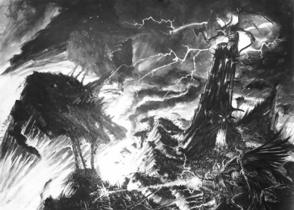
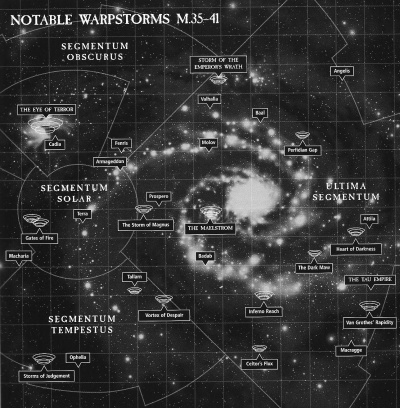

# 0846 亚空间 Warp

精校状态：中文行文已逐段精校，部分术语仍为暂定

分类：地理 / 亚空间 Warp

原文来源：https://www.bilibili.com/opus/1052222075092074520

原作者：帝国神选罐头

原文时间：编辑于 2025年11月10日 11:16

[返回分类目录](目录.md) · [全书目录](../../目录.md)

<!-- A0846-B0001 -->
**英文原文**

The Warp is a psychic dimension parallel to real space. It is known by many names: Warpspace, the Immaterium, the Empyrean, the Ether, the Sea of Souls, the Othersea, and also as the Realm of Chaos.

<!-- /A0846-B0001 -->

<!-- A0846-B0002 -->

原译文

亚空间是一个与现实空间平行的精神维度。它有很多名字：亚空间、非物质界、至高天、以太、灵魂之海、异海，也被称为混沌领域。

**校订译文**

亚空间是与现实空间平行的灵能维度。它有许多名称，包括亚空间、非物质界、至高天、以太、灵魂之海、异海，也被称为混沌领域。

**校注：** psychic 指灵能性质，不是一般心理或精神状态。英文 Warp／Warpspace 都可译亚空间，英文各称保留在对照中。

<!-- /A0846-B0002 -->

<!-- A0846-B0003 图片 -->

<!-- A0846-B0004 -->

原译文

Realm of Chaos 混沌领域

**校订译文**

Realm of Chaos 混沌领域

<!-- /A0846-B0004 -->

<!-- A0846-B0005 -->
## Overview 概述

<!-- /A0846-B0005 -->

<!-- A0846-B0006 -->
**英文原文**

Warpspace is a mirror dimension of pure energy. Existing as a mirror to our own reality, the Materium, it is the domain of the Gods of Chaos. These Gods dwell in their own realms, perpetually battling for one another in a struggle known as the Great Game. The size of these realms expands and contracts as the power of the Warp ebbs and flows.

<!-- /A0846-B0006 -->

<!-- A0846-B0007 -->

原译文

亚空间是纯粹能量的镜像维度。作为我们自己的现实—物质世界的镜像而存在，它是混沌之神的领域。这些神居住在自己的领域，在一场被称为“伟大游戏”的斗争中不断地相互争斗。随着亚空间力量的涨落，这些领域的规模会扩大和缩小。

**校订译文**

亚空间是由纯粹能量构成的镜像维度，与我们所处的物质宇宙彼此映照，也是混沌诸神的领地。诸神各据一方，在被称为“伟大游戏”的永恒争斗中彼此交战。随着亚空间力量消长，它们的领土也不断扩张或收缩。

<!-- /A0846-B0007 -->

<!-- A0846-B0008 图片 -->

<!-- A0846-B0009 -->

原译文

Map of the Realm of the Chaos Gods 混沌诸神领域地图

**校订译文**

Map of the Realm of the Chaos Gods 混沌诸神领域地图

<!-- /A0846-B0009 -->

<!-- A0846-B0010 -->
**英文原文**

The Warp's existence is fueled by the emotions and souls of all sentient beings in the Materium. Warpspace is without form and the laws of time and space do not apply there, for both size and time are simultaneously infinite and irrelevant within The Warp. Its energies are in constant turmoil, subject to endless disturbances.

<!-- /A0846-B0010 -->

<!-- A0846-B0011 -->

原译文

亚空间的存在是由物质世界中所有有情众生的情感和灵魂推动的。亚空间空间是没有形式的，时间和空间的法则不适用于那里，因为在亚空间中，规模和时间都是无限的，是不相关的。它的能量处于不断的混乱之中，受到无尽的干扰。

**校订译文**

物质宇宙中一切有感知能力的生命，其情感与灵魂都滋养着亚空间的存在。亚空间没有固定形态，时空法则在那里并不适用；空间大小与时间长短既是无限的，也失去了通常的意义。其能量始终处于动荡之中，承受着无尽扰动。

<!-- /A0846-B0011 -->

<!-- A0846-B0012 -->
**英文原文**

The common analogy used to describe Warpspace compares the Warp to a vast sea of energy, which is subject to constant movement, currents, undertows, etc. Immaterial space and real space bear a relationship as the dimensions parallel with each other. The fact that they share this relationship allows a Warp-capable craft to enter the Warp, carried for a time along the Warp flows until reemerging into real space a distance away from its starting point. The common metaphor used for Warp-jumping compares the Warp to a fast flowing stream. Its motionless banks represent real space. A leaf dropped into the water upstream will be carried along by the currents. This is a useful metaphor in understanding Warpspace, although the Warp is far more complex in its movements than a linear stream. The Warp moves in endlessly unpredictable and convoluted patterns.

<!-- /A0846-B0012 -->

<!-- A0846-B0013 -->

原译文

用于描述亚空间的常见类比是将亚空间比作一个巨大的能量海洋，它受到不断的运动、洋流、潜流等的影响。非物质空间和现实空间具有相互平行的维度关系。他们共享这种关系的事实允许具有亚空间能力的飞船进入亚空间，沿着亚空间航道航行一段时间，直到重新出现在距离其起点一段距离的真实空间中。亚空间跳跃常用的比喻是将亚空间比作快速流动的洋流。它一动不动的河岸代表了真实的空间。落入上游水中的叶子会被水流冲走。这是理解亚空间的一个有用的比喻，尽管亚空间的运动比线性流复杂得多。亚空间以无休止的不可预测和复杂的模式移动。

**校订译文**

人们常将亚空间比作一片浩瀚的能量海洋，其中潮流与暗流永不停息。它与现实空间相互平行，正因这种联系，具有亚空间航行能力的舰船才能进入其中，随能量流航行一段时间，再从远离出发点的位置返回现实空间。解释亚空间跃迁时，另一个常见比喻是急流：静止的两岸代表现实空间，一片在上游落水的叶子，会随水流迅速漂往下游。这个比喻有助于理解航行原理，但亚空间远比单向河流复杂，其流动路线曲折多变，永远无法完全预测。

<!-- /A0846-B0013 -->

<!-- A0846-B0014 -->
**英文原文**

The Warp is the final destination of the deceased souls of most races of the Galaxy. These souls will swirl endlessly within the Chaotic eddies of the Warp, and many are consumed by preying Daemons. The Craftworld Eldar use Spirit Stones to protect their departed souls from becoming the playthings of Slaanesh. While the Harlequin Eldar rely on the protection of the Laughing God. The Imperials believe that the Emperor will protect a virtuous soul once it has entered the Warp.

<!-- /A0846-B0014 -->

<!-- A0846-B0015 -->

原译文

亚空间是银河系大多数种族已故灵魂的最终目的地。这些灵魂将在扭曲的混沌漩涡中无休止地旋转，许多灵魂被捕食的恶魔吞噬。方舟灵族使用魂石来保护他们逝去的灵魂，使其不会成为色孽的玩物。灵族丑角依靠笑神的保护。帝国相信，一旦一个有道德的灵魂进入亚空间，帝皇就会保护它。

**校订译文**

对银河中大多数种族而言，亚空间是死者灵魂的最终归宿。灵魂在混乱涡流中无休止地翻卷，许多会被猎食的恶魔吞噬。方舟灵族用魂石保护死者，使其免于沦为色孽的玩物；丑角则依靠笑神庇护。帝国信徒相信，善良虔诚的灵魂进入亚空间后，会受到帝皇保护。

<!-- /A0846-B0015 -->

<!-- A0846-B0016 -->
**英文原文**

The Warp is born from the thoughts, dreams, and emotions of every psychically attuned sentient race in the Galaxy. Every emotion and action in the Materium feeds the Warp and it is reflected back, creating its own reality. Should the races of the Galaxy somehow be cut off from the Warp, its malevolent entities would ultimately weaken and starve.

<!-- /A0846-B0016 -->

<!-- A0846-B0017 -->

原译文

亚空间诞生于银河系中每一个精神上协调的有情种族的思想、梦想和情感。每一种情感和行为都会反馈给亚空间，并被反射回来，创造出自己的实体。如果银河系的种族以某种方式被切断与亚空间的联系，它的邪恶实体最终会削弱并饿死。

**校订译文**

亚空间诞生于银河各灵能感应种族的思想、梦境与情感。物质宇宙中的每一种情绪与行为都会滋养它，又被它映照回来，形成属于亚空间的现实。假如银河诸族以某种方式彻底切断与亚空间的联系，其中的邪恶存在最终便会衰弱，因失去滋养而饿死。

**校注：** psychically attuned 指有灵能感应的种族，不是精神协调。reality 译现实，不是具体实体生物。

<!-- /A0846-B0017 -->

<!-- A0846-B0018 -->
### Notable Locations Within the Warp 亚空间内的著名地点

<!-- /A0846-B0018 -->

<!-- A0846-B0019 -->

原译文

The Fortress of Khorne 恐虐堡垒

**校订译文**

The Fortress of Khorne 恐虐堡垒

<!-- /A0846-B0019 -->

<!-- A0846-B0020 -->

原译文

The Brass Citadel 黄铜堡垒

**校订译文**

The Brass Citadel 黄铜堡垒

<!-- /A0846-B0020 -->

<!-- A0846-B0021 -->

原译文

The Garden of Nurgle 纳垢花园

**校订译文**

The Garden of Nurgle 纳垢花园

<!-- /A0846-B0021 -->

<!-- A0846-B0022 -->

原译文

The Palace of Slaanesh 色孽宫殿

**校订译文**

The Palace of Slaanesh 色孽宫殿

<!-- /A0846-B0022 -->

<!-- A0846-B0023 -->

原译文

The Crystal Labyrinth of Tzeentch 奸奇水晶迷宫

**校订译文**

The Crystal Labyrinth of Tzeentch 奸奇水晶迷宫

<!-- /A0846-B0023 -->

<!-- A0846-B0024 -->

原译文

The Impossible Fortress 虚妄堡垒

**校订译文**

The Impossible Fortress 虚妄堡垒

<!-- /A0846-B0024 -->

<!-- A0846-B0025 -->

原译文

The Hidden Library 隐秘图书馆

**校订译文**

The Hidden Library 隐秘图书馆

<!-- /A0846-B0025 -->

<!-- A0846-B0026 -->

原译文

The Formless Wastes 无形废地

**校订译文**

The Formless Wastes 无形荒原

<!-- /A0846-B0026 -->

<!-- A0846-B0027 -->

原译文

The Forge of Souls 灵魂熔炉

**校订译文**

The Forge of Souls 灵魂熔炉

<!-- /A0846-B0027 -->

<!-- A0846-B0028 -->

原译文

The Well of Eternity 永恒之井

**校订译文**

The Well of Eternity 永恒之井

<!-- /A0846-B0028 -->

<!-- A0846-B0029 -->
## Warp Travel 亚空间航行

<!-- /A0846-B0029 -->

<!-- A0846-B0030 -->
**英文原文**

The Warp is an important factor in the survival of the human race. Spacecraft, capable of voyaging thousands of light-years in a matter of days, travel across the Warp. By such fragile means, humanity is bound together in a single Imperium. The Emperor's will may be mighty, but his reach is long only because Warpspace may be crossed by his fleets.

<!-- /A0846-B0030 -->

<!-- A0846-B0031 -->

原译文

亚空间是人类生存的重要因素。太空舰船能够在几天内航行数千光年，穿越亚空间。通过这种脆弱的手段，人类被束缚在一个统一的帝国中。帝皇的意志可能很强大，但他的影响力很广只是因为他的舰队可能会穿越亚空间。

**校订译文**

亚空间对人类的生存至关重要。舰船穿行其中，便能在数天内跨越数千光年。人类正是靠这种脆弱的交通方式，维系着统一帝国。帝皇的意志固然强大，但其权柄之所以能延伸至遥远星海，仍有赖于舰队穿越亚空间。

<!-- /A0846-B0031 -->

<!-- A0846-B0032 -->
**英文原文**

A spaceship may enter the Warp through the use of Warp drives. This is the means by which spacecraft effectively travel faster than the speed of light. This is achieved because Warpspace is a domain of pure energy, where spacecraft can navigate between streams, as in an ocean. The Imperium uses Navigators, a sub-race of humans, for this purpose. Time also proceeds a great deal slower- or faster- in the Warp than in the material universe, resulting in forms of time stasis, acceleration, reversal, and other chaotic violations of physics. While this solution is effective, it is far from perfect.

<!-- /A0846-B0032 -->

<!-- A0846-B0033 -->

原译文

宇宙飞船可以通过使用亚空间驱动器进入亚空间。这是太空舰船有效地以超光速飞行的手段。这是因为亚空间是一个纯能量的领域，太空舰船可以在航道之间导航，就像在海洋中一样。帝国为此目的使用了人类的一个亚种—导航者。时间在亚空间中的进展也比在物质世界中慢得多，甚至快得多，导致时间停滞、加速、逆转和其他混乱的物理学违反。虽然这种解决方案是有效的，但它远非完美。

**校订译文**

舰船通过亚空间引擎进入亚空间，从而实现实际效果上的超光速航行。在这片纯能量领域中，舰船可像海船穿行洋流一样，在不同能量流之间航行。帝国为此依靠一个人类亚种：导航员。然而，亚空间中的时间流速可能远慢于物质宇宙，也可能远快于它，甚至出现时间停滞、加速、倒流等违反物理法则的混乱现象。这种航行方式虽然有效，却绝不完善。

<!-- /A0846-B0033 -->

<!-- A0846-B0034 -->
**英文原文**

Long-distance journeys take months or even years, and the timing itself is unpredictable due to the very nature of the Warp.

<!-- /A0846-B0034 -->

<!-- A0846-B0035 -->

原译文

长途航行需要几个月甚至几年的时间，由于亚空间的性质，时间本身是不可预测的。

**校订译文**

远程旅途仍可能耗费数月乃至数年，而且亚空间本身的特性让航程长短无法可靠预测。

<!-- /A0846-B0035 -->

<!-- A0846-B0036 -->
## Warp Disturbances 亚空间干扰

<!-- /A0846-B0036 -->

<!-- A0846-B0037 -->
**英文原文**

The Warp is an extremely volatile medium. At times, disturbances can turn areas of the Warp into raging storms of incomprehensibly destructive fury. These storms can last for days, months, or even centuries. Even more devastating are Warp Rifts, which are tears in reality that link The Warp to the Materium. These rifts are highly dangerous and allow the Realm of Chaos to spill into our own. Notable Warp Rifts include the Eye of Terror, Maelstrom, and Great Rift.

<!-- /A0846-B0037 -->

<!-- A0846-B0038 -->

原译文

亚空间是一种极不稳定的形式。有时，干扰会将亚空间地区变成难以理解的破坏性狂怒的狂暴风暴。这些风暴可能持续数天、数月甚至数个世纪。更具破坏性的是亚空间裂隙，这是现实中将亚空间与物质世界联系起来的眼泪。这些裂隙非常危险，会让混沌领域蔓延到物质世界。著名的亚空间裂隙包括恐惧之眼、大漩涡和大裂隙。

**校订译文**

亚空间极不稳定，扰动有时会化作狂暴风暴，带来难以想象的毁灭。这些风暴可能持续数日、数月，甚至数百年。更具破坏力的是亚空间裂隙——现实本身的裂口，将亚空间与物质宇宙直接连通。它们极其危险，能让混沌领域涌入现实。著名的裂隙包括恐惧之眼、大漩涡与大裂隙。

**校注：** tears 在此是裂口，原译眼泪误取同形词。

<!-- /A0846-B0038 -->

<!-- A0846-B0039 图片 -->

<!-- A0846-B0040 -->

原译文

Notable warp-storms M35-M41 M35-M41著名亚空间风暴

**校订译文**

Notable warp-storms M35-M41 M35-M41著名亚空间风暴

<!-- /A0846-B0040 -->

<!-- A0846-B0041 -->
## Warp Entities 亚空间实体

<!-- /A0846-B0041 -->

<!-- A0846-B0042 -->
**英文原文**

The Warp, though utterly hostile to creatures of the material realm, is home to its own form of life. These are often voracious entities which are drawn to the psychic emanations of mortals of real space - these creatures include the Vampyre, Psychneuein, Astral Spectre, Astral Hound, Enslaver and most terrifying and numerous of all, the Daemons of Chaos.

<!-- /A0846-B0042 -->

<!-- A0846-B0043 -->

原译文

亚空间虽然对物质世界的生物充满敌意，但它是自己生命形式的家园。这些通常是贪婪的实体，被现实空间中凡人的灵能释放所吸引—这些生物包括吸血鬼、灵能毒蜂、星界幽灵、星界猎犬、奴役者，以及最可怕、数量最多的混沌恶魔。

**校订译文**

亚空间对物质宇宙的生物极端危险，却也孕育着自身的生命。这些存在往往贪婪凶暴，会被现实空间中凡人散发的灵能吸引，其中包括吸血鬼、灵能毒蜂、星界幽灵、星界猎犬、奴役者，以及最可怕、数量也最庞大的混沌恶魔。

<!-- /A0846-B0043 -->

<!-- A0846-B0044 -->
**英文原文**

Ships traveling in the Warp are shielded against attacks from these creatures. Without these shields, travelers through the Warp would be consumed by daemons.

<!-- /A0846-B0044 -->

<!-- A0846-B0045 -->

原译文

在亚空间中航行的船只受到防护，免受这些生物的攻击。没有这些护盾，穿越亚空间的航行者将被恶魔吞噬。

**校订译文**

在亚空间中航行的船只受到防护，免受这些生物的攻击。没有这些护盾，穿越亚空间的航行者将被恶魔吞噬。

<!-- /A0846-B0045 -->

<!-- A0846-B0046 -->
**英文原文**

The Warp is also the realm of the four Gods of Chaos: Khorne, Slaanesh, Tzeentch, and Nurgle. Though the Warp and the Chaos Gods are formed of the same energy and are practically synonymous, each god has a form that embodies their personalities and dwells at the heart of their realms.

<!-- /A0846-B0046 -->

<!-- A0846-B0047 -->

原译文

亚空间也是混沌四神的领地：恐虐、色孽、奸奇和纳垢。尽管亚空间和混沌诸神由相同的能量组成，几乎是同义的，每位神明都有一种形态，这种形态体现了他们的个性，并且居于他们各自领域的核心之处。

**校订译文**

亚空间也是恐虐、色孽、奸奇和纳垢四位混沌神的领域。它们与亚空间由同样的能量构成，几乎不可分割，但每位神仍有体现自身性情的形态，居于各自领土的核心。

<!-- /A0846-B0047 -->

本篇核心术语与暂定项

以下列出本篇出现的英文原形及核心术语表用词。同形词可能指不同对象，具体词义以本篇正文和校注为准；单复数、别名和仅见于图注的名称可能尚未列入。完整候选见[术语表](../../术语表/双语术语候选.csv)。

| 英文 | 采用中文 | 状态 |
| --- | --- | --- |
| Eldar | 灵族 | 暂定·语境区分 |
| Warp | 亚空间 | 官方已核对 |
| Great Rift | 大裂隙 | 官方已核对 |
| Imperium | 帝国 | 暂定·简称 |
| Khorne | 恐虐 | 官方已核对 |
| Tzeentch | 奸奇 | 官方已核对 |
| Nurgle | 纳垢 | 官方已核对 |
| Craftworld | 方舟世界 | 官方已核对 |
| Harlequin | 丑角 | 暂定 |
| Eye of Terror | 恐惧之眼 | 官方已核对 |
| Maelstrom | 大漩涡 | 官方已核对 |
| Enslaver | 奴役者 | 暂定 |
| Emperor | 帝皇 | 官方已核对 |
| Slaanesh | 色孽 | 官方已核对 |
| Navigators | 导航员 | 官方已核对 |
| Realm of Chaos | 混沌领域 | 暂定·官方待核 |
| Great Game | 伟大游戏 | 暂定·官方待核 |
| Emperor's Will | 帝皇意志号 | 暂定·官方待核 |
| Bear | 熊 | 暂定·官方待核 |
| Dwell | 德威尔 | 暂定·官方待核 |
| Real Space | 现实空间 | 暂定·官方待核 |
| Othersea | 异海 | 暂定·官方待核 |
| Psychneuein | 灵能毒蜂 | 暂定·官方待核 |
| Vampyre | 吸血鬼 | 暂定·官方待核 |
| Astral Spectre | 星界幽灵 | 暂定·官方待核 |

