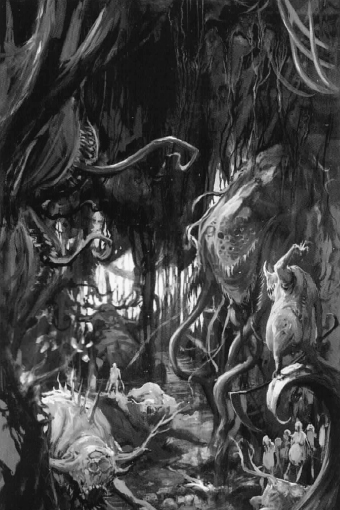

# 0847 纳垢花园 Garden of Nurgle

精校状态：中文行文已逐段精校，部分术语仍为暂定

分类：地理 / 亚空间 Warp

原文来源：https://www.bilibili.com/opus/1076691268288905248

原作者：帝国神选罐头

原文时间：2025年06月10日 11:12

[返回分类目录](目录.md) · [全书目录](../../目录.md)

<!-- A0847-B0001 -->
**英文原文**

The Garden of Nurgle is a realm within the Warp that falls under the dominion of Nurgle, the Master of Pestilence and one of the Chaos Gods.

<!-- /A0847-B0001 -->

<!-- A0847-B0002 -->

原译文

纳垢花园是亚空间内的一个领域，属于纳垢的统治，纳垢是瘟疫之主和混沌诸神之一。

**校订译文**

纳垢花园是亚空间中的一片领域，由混沌诸神之一、瘟疫之主纳垢统治。

<!-- /A0847-B0002 -->

<!-- A0847-B0003 图片 -->

<!-- A0847-B0004 -->

原译文

The Garden of Nurgle 纳垢花园

**校订译文**

The Garden of Nurgle 纳垢花园

<!-- /A0847-B0004 -->

<!-- A0847-B0005 -->
## Overview 概述

<!-- /A0847-B0005 -->

<!-- A0847-B0006 -->
**英文原文**

This unwholesome realm is home to every pox and affliction imaginable and is alive with the stench of rot. This 'garden' is not a barren wasteland, but rather a macabre paradise of death and pestilence. A thick sheet of buzzing swarms of black, furry flies litter the sky, and twisted, rotten boughs entangled with grasping vines cover the mouldering ground, beneath an insect-ravaged canopy of leaves. Boughs of Gnarlwood host the dormant Daemon waiting to be reborn. Defiled fungi both plain and extraordinary break through the leaf-strewn mulch of the forest floor, puffing out vile clouds of spores. Muddy rivers slither across the bloated landscape. Nurgle's Blighted Mansion of Misery and Mirth, made of rotted timbers and broken walls, resides at the heart of the garden — decrepit and ancient, yet eternally strong at its foundations. It is within these tumbling walls that Nurgle toils at his cauldron, a receptacle vast enough to contain all the oceans of the worlds of the galaxy.

<!-- /A0847-B0006 -->

<!-- A0847-B0007 -->

原译文

这个不健康的领域是所有可以想象的瘟疫和疾病的家园，充满了腐烂的恶臭。这个“花园”不是一片贫瘠的荒地，而是一个充满死亡和瘟疫的可怕天堂。一大片嗡嗡作响的黑色的毛茸茸的苍蝇散落在天空中，扭曲的腐烂树枝与紧紧抓住的藤蔓缠绕在发霉的地面上，在昆虫肆虐的树叶下。瘤木的树枝上栖息着等待重生的休眠恶魔。被玷污的真菌 — 无论是普通的还是非同寻常的 — 都会冲破森林地面上铺满的树叶覆盖物，喷出污秽的孢子云。泥泞的河流滑过臃肿的风景。纳垢的苦乐枯萎住所，由腐烂的木材和破碎的墙壁组成，位于花园的中心 — 破旧而古老，但地基永远坚固。正是在这些翻滚的墙壁内，纳垢在他的大锅旁辛勤劳作，这个容器足够大，可以容纳银河系所有世界的海洋。

**校订译文**

这里滋生着一切可以想象的瘟疫与病痛，腐烂的恶臭充斥各处。这座“花园”并非贫瘠荒原，而是死亡与疫病的诡异乐园。黑色、毛茸茸的蝇群密布天空，嗡鸣不绝；虫蛀的树冠下，腐朽扭曲的枝干与攫人的藤蔓纠缠，遮住发霉的地面。瘤木枝头栖息着沉睡的恶魔，等待重生。平凡或怪异的污秽菌类钻破林地的落叶腐殖层，喷出恶臭的孢子云；浑浊河流蜿蜒穿过肿胀的地景。花园中央坐落着纳垢的“苦乐枯萎之屋”，由腐木与残墙构成，古老破败，地基却永远稳固。纳垢就在这些摇摇欲坠的墙壁间，守着巨釜忙碌；釜身之大，足以容纳银河所有世界的海洋。

**校注：** tumbling walls 指破败欲坠的墙壁，非墙体正在翻滚。宅邸在原文名称带 Blighted，与下方列表统一沿原稿苦乐枯萎之屋。

<!-- /A0847-B0007 -->

<!-- A0847-B0008 -->
**英文原文**

When Nurgle's power waxes, the Garden blooms, encroaching on the lands of the other Chaos Gods. Nurgle's enemies would fight back, and the Plaguebearers would take up arms to defend it. Although the Garden will recede again, it would still have fed deeply on the essence of those who have fallen in such wars, and will lie in gestate peace until it is ready to bloom again.

<!-- /A0847-B0008 -->

<!-- A0847-B0009 -->

原译文

当纳垢的力量爆发时，花园盛开，侵占了其他混沌诸神的领地。纳垢的敌人会反击，瘟疫携带者会拿起武器保卫它。虽然花园会再次退缩，但它仍然会深深地汲取那些在战争中倒下的人的精华，并将处于孕育和平的状态，直到它准备再次绽放。

**校订译文**

纳垢力量增长时，花园便蓬勃生长，侵入其他混沌神的领土。敌人随之反击，瘟疫使则拿起武器保卫花园。虽然花园终将再次退缩，它已充分吸收那些战死者的精华，随后进入静静孕育的阶段，等待下一次盛放。

<!-- /A0847-B0009 -->

<!-- A0847-B0010 -->
**英文原文**

The chief Gardener of Nurgle's putrid realm is Horticulous Slimux and contains ravenous creatures such as Feculent Gnarlmaws.

<!-- /A0847-B0010 -->

<!-- A0847-B0011 -->

原译文

纳垢腐烂王国的首席园丁是园丁斯利姆克斯，里面有纳垢毒枝等贪婪的生物。

**校订译文**

这片腐败领域的首席园丁是园艺师史莱姆克斯，花园中还栖息着肮脏瘤口树等贪婪生物。

<!-- /A0847-B0011 -->

<!-- A0847-B0012 -->
**英文原文**

During the Plague Wars the Emperor appeared directly through Roboute Guilliman to strike a grievous blow to the Garden of Nurgle, damaging a portion of it.

<!-- /A0847-B0012 -->

<!-- A0847-B0013 -->

原译文

在瘟疫战争期间，帝皇直接通过罗伯特·基里曼出现，对纳垢花园造成了严重打击，破坏了其中的一部分。

**校订译文**

瘟疫战争期间，帝皇借罗保特·基里曼直接显现，重击纳垢花园，使其中一部分遭到破坏。

<!-- /A0847-B0013 -->

<!-- A0847-B0014 -->
## Known Locations 著名地点

<!-- /A0847-B0014 -->

<!-- A0847-B0015 -->
**英文原文**

The Blighted Mansion of Misery and Mirth - Nurgle's personal manse and lair.

<!-- /A0847-B0015 -->

<!-- A0847-B0016 -->

原译文

苦乐枯萎之屋 — Nurgle的私人宅邸和巢穴。

**校订译文**

苦乐枯萎之屋——纳垢的私人宅邸与巢穴。

<!-- /A0847-B0016 -->

<!-- A0847-B0017 -->
**英文原文**

The Death Beds - Frequently visited by Nurgle, this sea of muck both traps invaders and restrains them for some sort of future use. If one tells a tell to Nurgle that amuses him as he passes by, they may be plucked from the muck and rewarded for being used as a vessel for one of his newest plagues.

<!-- /A0847-B0017 -->

<!-- A0847-B0018 -->

原译文

死亡之床 — 纳垢经常造访，这片淤泥之海既能困住入侵者，又能约束他们以备将来使用。如果有人告诉纳垢一个故事，让他在经过时开怀大笑，他们可能会被从淤泥中挖出来，并得到奖励而被用作他最新瘟疫的容器。

**校订译文**

死亡之床——纳垢常来巡视的一片淤泥之海。它将入侵者困住，留待日后使用。如果有人在纳垢经过时讲出让他开怀的故事，便可能被从淤泥中捞起，获得一项“奖赏”：成为某种最新瘟疫的容器。

**校注：** 原英文 tell a tell 疑为 tell a tale；按讲故事译。奖赏是纳垢视角的黑色幽默：被选作疾病容器，而非治好入侵者。

<!-- /A0847-B0018 -->

<!-- A0847-B0019 -->
**英文原文**

The Poxyards - Testing ground for his newest plagues.

<!-- /A0847-B0019 -->

<!-- A0847-B0020 -->

原译文

瘟疫之园 - 他最新瘟疫的试验场。

**校订译文**

瘟疫之园 - 他最新瘟疫的试验场。

<!-- /A0847-B0020 -->

<!-- A0847-B0021 -->
**英文原文**

Deathbell Lily Fields - Whenever someone in the mortal realm dies from one of Nurgle's ailments, a pallid flower in Deathbell Lily Fields will emit a tiny chime.

<!-- /A0847-B0021 -->

<!-- A0847-B0022 -->

原译文

死铃百合领域 - 每当凡人世界中有人死于纳垢的疾病时，死铃百合领域内的一朵苍白的花就会发出一声微小的蜂鸣声。

**校订译文**

死铃百合花田——凡人世界每有一人死于纳垢的疾病，花田中便有一朵苍白的花发出细微的铃声。

<!-- /A0847-B0022 -->

<!-- A0847-B0023 -->
**英文原文**

Hanging Gardens of Thus'Bolg - Made in honor of the Great Unclean One Thush'Bolg, who used his own intestines to hang his many Ork victims from a colony of trees.

<!-- /A0847-B0023 -->

<!-- A0847-B0024 -->

原译文

瑟什·博尔格空中花园 - 为纪念大不净者瑟什·博尔格而建，他用自己的肠子将许多欧克受害者挂在一片树林里。

**校订译文**

瑟什·博尔格悬挂花园——为纪念大不净者瑟什·博尔格而建；他曾用自己的肠子，将大量被害欧克吊在一片树丛间。

**校注：** 标题写 Thus’Bolg，正文写 Thush’Bolg，保留英语异拼，中文沿同一人物瑟什·博尔格。Hanging Gardens 与吊挂尸体的叙述关联，暂修悬挂花园，原空中花园。

<!-- /A0847-B0024 -->

<!-- A0847-B0025 -->
**英文原文**

Bubbling Gully - here Typhus stopped the invasion of the daemons of Khorne, leading the final coordinated attack of Beasts of Nurgle and Plague Drones.

<!-- /A0847-B0025 -->

<!-- A0847-B0026 -->

原译文

沸腾溪谷 — 泰丰斯在这里阻止了恐虐恶魔的入侵，引导纳垢兽和瘟疫蜂群的最后协同攻击。

**校订译文**

沸腾溪谷——提丰曾在此率纳垢野兽与瘟疫蜂兵发动最后一轮协同攻击，阻止恐虐恶魔入侵。

<!-- /A0847-B0026 -->

本篇核心术语与暂定项

以下列出本篇出现的英文原形及核心术语表用词。同形词可能指不同对象，具体词义以本篇正文和校注为准；单复数、别名和仅见于图注的名称可能尚未列入。完整候选见[术语表](../../术语表/双语术语候选.csv)。

| 英文 | 采用中文 | 状态 |
| --- | --- | --- |
| Roboute Guilliman | 罗保特·基里曼 | 官方已核对 |
| Warp | 亚空间 | 官方已核对 |
| Khorne | 恐虐 | 官方已核对 |
| Nurgle | 纳垢 | 官方已核对 |
| Emperor | 帝皇 | 官方已核对 |
| Plague Wars | 瘟疫战争 | 暂定·官方待核 |
| Master | 导师（审判庭职衔）／舰务官（舰员职务） | 语境定译·官方待核 |
| Ancient | 旗手 | 官方已核对 |
| Invaders | 侵略者 | 暂定·官方待核 |
| Reborn | 复生者（战团）／重生者（死神军自称） | 语境定译·官方待核 |
| Mortal | 凡人 | 暂定·官方待核 |
| Dominion | 主天使 | 暂定·官方待核 |
| Host | 天军 | 暂定·官方待核 |
| Great Unclean One | 大不净者 | 官方已核对 |
| Beasts of Nurgle | 纳垢野兽 | 官方已核对 |
| Horticulous Slimux | 园艺师史莱姆克斯 | 官方已核对 |
| Plague Drones | 瘟疫蜂兵 | 官方已核对 |
| Plaguebearers | 瘟疫使 | 官方已核对 |
| Typhus | 泰弗斯 | 官方已核对 |
| Gnarlwood | 瘤木 | 暂定·官方待核 |
| The Blighted Mansion of Misery and Mirth | 苦乐枯萎之屋 | 暂定·官方待核 |
| The Death Beds | 死亡之床 | 暂定·官方待核 |
| The Poxyards | 瘟疫之园 | 暂定·官方待核 |
| Deathbell Lily Fields | 死铃百合花田 | 暂定·官方待核 |
| Bubbling Gully | 沸腾溪谷 | 暂定·官方待核 |

