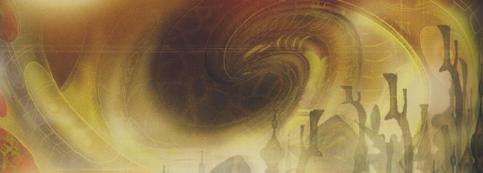
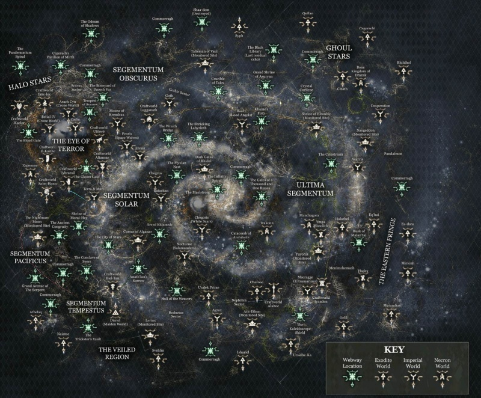
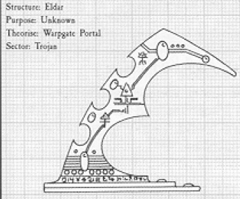

# 0849 网道 Webway

精校状态：中文行文已逐段精校，部分术语仍为暂定

分类：地理 / 亚空间 Warp / 网道 Webway

原文来源：https://www.bilibili.com/opus/1053726834039980052

原作者：帝国神选罐头

原文时间：2025年04月09日 13:58

[返回分类目录](目录.md) · [全书目录](../../目录.md)

<!-- A0849-B0001 -->
**英文原文**

The Webway is a labyrinthine dimension utilised by the Eldar for faster-than-light travel.

<!-- /A0849-B0001 -->

<!-- A0849-B0002 -->

原译文

网道是一个迷宫般的维度，被灵族用来实现超光速旅行。

**校订译文**

网道是一个迷宫般的维度，被灵族用来实现超光速旅行。

<!-- /A0849-B0002 -->

<!-- A0849-B0003 图片 -->

<!-- A0849-B0004 -->

原译文

Wraithbone Ruins - Eldar Webway 灵骨废墟 - 灵族网道

**校订译文**

Wraithbone Ruins - Eldar Webway 灵骨废墟 - 灵族网道

<!-- /A0849-B0004 -->

<!-- A0849-B0005 -->
## History 历史

<!-- /A0849-B0005 -->

<!-- A0849-B0006 -->
**英文原文**

This realm's origins are traced to the ancient race known as the Old Ones as a conduit through which they could travel to countless far-flung worlds without suffering from the risk of the tides of the Warp. It became a tool of this species when they became the first race to cross the vast gulf of stars in a single step and learnt to manipulate alternate dimensions. This quickly led them to attaining a mastery over the use of Webway Portals. It would later be used as a way for the Old Ones to outmanoeuver the Necrontyr during the War in Heaven leading to that race being turned into a minor irritant in the span of a few centuries. This ultimately changed when the C'tan entered into the war on the side of the now metallic Necron armies. By the closing days of the War in Heaven, one of the C'tan known as Nyadra'zatha had long desired to bring his eldtrich fire into the Webway. The Burning One taught the Necrons how to pierce the boundary of that space beyond space by way of Dolmen Gates whereupon they turned the Old Ones' greatest weapon against them.

<!-- /A0849-B0006 -->

<!-- A0849-B0007 -->

原译文

这个领域的起源可以追溯到被称为古圣的古代种族，他们可以通过这个隧道前往无数遥远的世界，而不会遭受亚空间潮汐的风险。当他们成为第一个一步穿过浩瀚恒星鸿沟并学会操纵替代维度的种族时，它就成为了这个物种的工具。这很快使他们掌握了网道门户的使用。后来，它被用作古圣在天堂之战中战胜惧亡者的一种方式，导致这个种族在几个世纪的时间里变成了一个小麻烦。当星神站在现在金属化的死灵军队一边参战时，这种情况最终发生了变化。在天堂之战的最后几天，一个叫燃烧者尼亚德拉萨的星神早就想把他的超自然火焰带进网道。燃烧者教会了死灵如何通过墓石之门刺穿太空之外的空间边界，于是他们将古圣最强大的武器转向了他们。

**校订译文**

网道起源于被称为古圣的古老种族。他们利用这些通道抵达无数遥远的世界，避开亚空间潮汐的危险。古圣学会操纵其他维度，成为第一个能够一步跨越浩瀚星际鸿沟的种族，网道也由此成为他们的工具。他们很快便掌握了网道门户的运用。在天堂之战中，古圣凭借网道取得了对惧亡者的机动优势，短短几个世纪便使对手沦为不足为虑的小患。直到星神加入如今已化作金属之躯的太空死灵一方，局势才终于改变。天堂之战临近尾声时，被称为“燃烧者”的星神尼亚德拉萨早已渴望将自己的超自然烈焰带入网道。它教会太空死灵使用墓石之门，刺穿常规空间之外的边界。古圣最强大的利器就这样被反过来用于对付他们。

<!-- /A0849-B0007 -->

<!-- A0849-B0008 -->
**英文原文**

In time, knowledge of the Webway would pass to the Eldar where the technologies used to create it were once taught to them by the Old Ones. These secret, invisible passageways between the Warp are noted as being ancient constructs and are older than even the Eldar know. The ancient Eldar discovered that it was possible to move through within its threads. From the many secrets of the Warp taught to them by the Old Ones, the Eldar created a pan-galactic network of navigable tunnels. It was the ancient Eldar who mastered the original Webway network. At the height of their empire, they used it to travel thousands of light years safely yet quickly and linked all their worlds. Their starships were thus able to move from one end of the galaxy to the other without entering realspace. By M18, the Eldar empire established Commoragh as its primary nodal port within the Webway. In this age, the leaders of the excess cults are known to have relocated their power bases into the Webway where they could command entire sub-realms. This pattern of behaviour continued between M25 to M30.

<!-- /A0849-B0008 -->

<!-- A0849-B0009 -->

原译文

随着时间的推移，网道的知识将传递给灵族，在那里，用于制造网道的技术曾经由古圣传授给他们。这些位于亚空间之间的秘密、无形的通道被认为是古老的建筑，甚至比灵族所知道的还要古老。古灵族发现，可以在它的隧道内移动。从古圣教给他们的许多亚空间秘密中，灵族制造了一个泛银河系的航行隧道网络。正是古灵族掌握了最初的网道网络。在他们帝国的鼎盛时期，他们用它安全而快速地航行数千光年，并连接了他们所有的世界。因此，他们的太空飞船能够在不进入现实空间的情况下从星系的一端移动到另一端。到M18时，灵族帝国将科摩罗确立为网道内的主要节点港口。在这个时代，众所周知，恣纵教派的领导人已经将他们的权力基础重新部署到了网道，在那里他们可以指挥整个子领域。这种行为模式在M25到M30之间持续存在。

**校订译文**

后来，古圣将建造网道的技术传授给灵族，网道的知识也随之传承下来。这些处于亚空间间隙中的隐秘无形通道，被认为是极其古老的构造，其历史甚至早于灵族所能知晓的年代。古代灵族发现，可以沿网道的脉络穿行。他们运用古圣传授的诸多亚空间奥秘，建立了一个遍布银河、可供通行的隧道网络，并掌握了原有的网道。在灵族帝国鼎盛时期，他们借此安全而迅速地跨越数千光年，将所有世界连接起来；飞船无需进入现实空间，就能从银河一端驶向另一端。到第 18 个千年，科摩罗已成为网道内的主要节点港口。当时，恣纵教派的领袖已开始将权力根基迁入网道，在那里掌控整个子领域。这一趋势在第 25 至第 30 个千年间仍在延续。

<!-- /A0849-B0009 -->

<!-- A0849-B0010 -->
**英文原文**

According to legend, a map of the Webway is known to have been made many thousands of years ago and resides in the Black Library of Chaos. The map contains many secret ways that are long lost or forgotten, though it is not believed to be entirely accurate in later years. Much of the Webway was either destroyed or damaged during the Fall of the Eldar. The energies of the Fall are known to have ruptured the hyperspatial pathways of the Webway in countless places. Despite the damage, the Webway still maintains a link between the Craftworlds, though portions of it have been breached by the Realm of Chaos, and have made these parts impassable. The Eldar are known to combat this intrusion of Chaos into the Webway. Those Eldar that survived within the depths of the Webway eventually became known as the Dark Eldar who made parts of it their home.

<!-- /A0849-B0010 -->

<!-- A0849-B0011 -->

原译文

据传说，网道的地图是在数千年前制作的，目前存放在混沌的黑色图书馆中。这张地图包含了许多早已丢失或被遗忘的秘密道路，尽管在后来的几年里，人们认为它并不完全准确。在灵族陨落期间，网道的大部分地区要么被毁，要么受损。众所周知，陨落的能量在无数地方破坏了网道的超空间路径。尽管受到了破坏，但网道仍然保持着方舟世界之间的联系，尽管它的一部分已被混沌领域破坏，并使这些部分无法通行。众所周知，灵族会对抗混沌对网道的入侵。那些在网道深处幸存下来的灵族最终被称为黑暗灵族，他们将其中的一部分作为自己的家。

**校订译文**

据传，一幅绘于数千年前的网道地图现藏于混沌黑图书馆，其中记载了许多早已失落或被遗忘的秘密路径。不过，在后来的时代，人们已认为它并非完全准确。灵族之陨期间，网道有大片区域遭到摧毁或损坏，灾变释放的能量在无数地点撕裂了其中的超空间通路。尽管受创，网道仍维系着方舟世界之间的联系；但某些区域已被混沌领域侵入，无法再安全通行。灵族也会与侵入网道的混沌势力作战。那些在网道深处躲过灾变的灵族后来被称为黑暗灵族，并将网道的一部分作为家园。

**校注：** Black Library of Chaos 是收藏混沌知识的灵族黑图书馆，名称不表示该馆属于混沌势力；详见第850篇。

<!-- /A0849-B0011 -->

<!-- A0849-B0012 -->
**英文原文**

The Webway in the current age has drastically changed compared to its original form as it has been torn apart by both disaster and war. During the Great Crusade, the Emperor created the Golden Throne on Terra as a means of entry into the Webway in order to remove the Imperium's reliance on Warp travel and astrotelepathy. This plan involved constructing a new short section into the Webway and linking it into the abandoned Eldar network. After the psychic disturbance caused by the ill-fated attempt of Magnus the Red to warn the Emperor of Horus's betrayal prior to the Horus Heresy, the human-built sections of the Webway were invaded by Warp entities. Since that time, a psyker has needed to remain on the Golden Throne and hold the portal between the Webway and realspace. The Emperor fulfills this role.

<!-- /A0849-B0012 -->

<!-- A0849-B0013 -->

原译文

与最初的形式相比，当代的网道发生了巨大的变化，因为它被灾难和战争撕裂了。在大远征期间，帝皇在泰拉上制造了黄金王座，作为进入网道的一种手段，以消除帝国对亚空间旅行和星语通讯的依赖。该计划涉及在网道中建造一个新的小段，并将其连接到废弃的灵族网络中。在荷鲁斯叛乱之前，赤红之马格努斯试图警告帝皇荷鲁斯的背叛，这一不幸的尝试造成了灵能上的干扰，之后网道的人造部分被亚空间实体入侵。从那时起，一名灵能者就需要留在黄金王座上，并守住网道和现实空间之间的门户。帝皇履行了这一职责。

**校订译文**

历经灾难与战争的撕裂，如今的网道已与最初的模样大不相同。大远征期间，帝皇在泰拉建造黄金王座，试图以此进入网道，使帝国摆脱对亚空间航行和星语通讯的依赖。这一计划包括新建一小段网道，将其接入灵族废弃的网络。荷鲁斯之乱爆发前，赤红马格努斯试图警告帝皇荷鲁斯即将叛变，却因这次不幸的尝试引发灵能扰动，使亚空间实体侵入了人类建造的网道区域。此后，必须有一名灵能者留在黄金王座上，守住网道与现实空间之间的门户。帝皇承担了这一职责。

**校注：** 本篇英文写帝皇在大远征期间 created the Golden Throne，后文又以王座材料解释其防护缺陷。依原文保留本篇叙述；不据其他来源的发现、改造或年代说法擅自重写。

<!-- /A0849-B0013 -->

<!-- A0849-B0014 -->
**英文原文**

The White Scars Space Marine Chapter believes that their Primarch, Jaghatai Khan, is lost somewhere in the Webway, forever cursing the Dark Eldar that lured him into it, although after 9,000 years of wandering, it seems unlikely.

<!-- /A0849-B0014 -->

<!-- A0849-B0015 -->

原译文

白色疤痕星际战士认为，他们的原体察合台可汗在网道的某个地方迷路了，他永远诅咒着引诱他进入网道的黑暗精灵，尽管经过9000年的流浪，这似乎不太可能。

**校订译文**

白疤星际战士相信，他们的原体察合台可汗仍迷失在网道某处，不断诅咒那些将他诱入其中的黑暗灵族。不过，若他已这样流浪了九千年，这种说法似乎也不太可能。

**校注：** 本段是白疤的信念及原文作者的怀疑，未将可汗的下落或死亡判作已知事实。

<!-- /A0849-B0015 -->

<!-- A0849-B0016 -->
## Background 背景

<!-- /A0849-B0016 -->

<!-- A0849-B0017 -->
**英文原文**

The Webway exists as a labyrinth between the Materium and the Warp. It exists as a part of both yet existing in neither. In fact, it has been described as not being a true dimension but instead a complex network of capillaries and arteries. This forms a maze of glowing tunnels making a tapestry of hidden threads that spread between the veil of realspace and warp space. Ultimately, it is a construct that spans the dimensions. Elements of its construction include complex psychic wards to protect it from being breached and hyperspatial pathways. Present day Eldar do not fully understand the exact shape or form of the Webway.

<!-- /A0849-B0017 -->

<!-- A0849-B0018 -->

原译文

网道作为一个迷宫存在于物质界和亚空间之间。它既作为两者的一部分存在，又不存在于两者之中。事实上，它被描述为不是一个真正的维度，而是一个复杂的毛细血管和动脉网络。这形成了一个由发光隧道构成的迷宫，宛如一幅由隐匿丝线编织而成的挂毯，这些丝线在现实空间与亚空间的帷幕之间延展。归根结底，这是一个跨越了不同维度的构造。其构造要素包括复杂的灵能防护以保护其免受破坏和超空间通路。如今的灵族并不完全了解网道的确切形状或形式。

**校订译文**

网道是一座介于物质界与亚空间之间的迷宫：它兼具两者的性质，却又不真正属于其中任何一方。与其说它是一个完整的维度，不如说它是由毛细血管与动脉般的通路交织而成的复杂网络。发光的隧道构成迷宫，如同由隐秘丝线织成的挂毯，延展于现实空间与亚空间的帷幕之间。归根结底，网道是一种跨维度构造，既有超空间通路，也有防止其受损的复杂灵能屏障。如今的灵族已无法完全理解网道的确切形状与结构。

<!-- /A0849-B0018 -->

<!-- A0849-B0019 图片 -->

<!-- A0849-B0020 -->

原译文

Webway entrances in the Materium 物质界的网道入口

**校订译文**

Webway entrances in the Materium 物质界的网道入口

<!-- /A0849-B0020 -->

<!-- A0849-B0021 -->
**英文原文**

In the shattered portions of the network exist dead-ends, mazes that trap the unwary, abandoned or destroyed pathways and some even inhabited by Daemons. The doorways into these parts are sealed with runes of power in order to prevent whatever unknown horror populating them from gaining entry into a Craftworld. Knowledge of a Craftworld's placement within the Webway is a secret kept by its Seers.

<!-- /A0849-B0021 -->

<!-- A0849-B0022 -->

原译文

在网络的破碎部分，存在着死胡同、迷宫，这些迷宫困住了无警戒、被遗弃或被摧毁的道路，有些甚至被恶魔居住。通往这些地方的大门都用符文密封，以防止任何未知的恐怖进入方舟世界。方舟世界在网道中的位置是其先知保守的秘密。

**校订译文**

网道的破损区域中，既有死路，也有会困住粗心旅人的迷宫；有些通道已被废弃或摧毁，有些甚至盘踞着恶魔。通往这些地方的门户都以符文封死，防止未知的恐怖之物进入方舟世界。各座方舟世界在网道中的位置，则是由其先知严守的秘密。

<!-- /A0849-B0022 -->

<!-- A0849-B0023 -->
**英文原文**

Artificial portals into the Webway such as those offered by the Dolmen Gates are not stable nor easily controllable. In addition, the Webway itself manages to somehow detect these breaches in its hallways and seal these infected branches off until the danger has passed. Any travelers in these portions can face destruction as the network attempts to correct the breach.

<!-- /A0849-B0023 -->

<!-- A0849-B0024 -->

原译文

进入网道的人工门户，如墓石之门提供的门户，既不稳定，也不容易控制。此外，网道本身设法在其走廊中检测到这些漏洞，并密封这些受感染的分支，直到危险过去。当网络试图纠正漏洞时，这些地区的任何航行者都可能面临破坏。

**校订译文**

墓石之门之类的人工入口既不稳定，也难以控制。网道本身还能察觉走廊中出现的这些缺口，并封闭受侵入的支路，直到威胁消退。网道试图修复缺口时，身处这些区域的旅人都可能遭到毁灭。

<!-- /A0849-B0024 -->

<!-- A0849-B0025 -->
**英文原文**

The Webway was used to connect the Eldar Empire in space, but it was also theorized that it stretched forwards and backwards in time. However, fearful of the consequences, the Eldar never experimented with the Webway's temporal aspects. The more enigmatic Harlequins say that there are remote locations within the Webway where the flow of time seemingly goes in reverse or does not flow at all. The location in the Webway where time flows backwards is known as Uigebealach. The location in the Webway where time does not flow is known as the Crossroads of Inertia. Inquisitor Bronislaw Czevak has theorized that constant travel through the Webway is partially responsible for the Eldar race's longevity. Czevak himself spent several decades in the Webway, which reversed his body's aging by several centuries.

<!-- /A0849-B0025 -->

<!-- A0849-B0026 -->

原译文

网道被用来在太空中连接灵族帝国，但也有理论认为它在时间上前后延伸。然而，由于担心后果，灵族从未尝试过网道的时间方面。更神秘的丑角说，在网道的偏远地区，时间的流动似乎是相反的，或者根本不流动。时间倒流的网道地区被称为威格比拉赫。网道中时间不流动的位置被称为惯性交汇点。审判官布罗尼斯瓦夫·切瓦克提出理论，认为不断穿越网道是灵族种族长寿的部分原因。切瓦克本人在网道度过了几十年，这使他的身体衰老逆转了几个世纪。

**校订译文**

网道曾在空间上联结整个灵族帝国，也有人推测，它的通路还可能向过去与未来延伸。但灵族因畏惧后果，从未尝试探索网道在时间上的这一面。更为神秘的丑角声称，在网道偏远的区域，时间似乎会倒流，甚至完全停滞。时间倒流的区域被称为“威格比拉赫”，时间停止流动之处则叫作“惯性交汇点”。审判官布罗尼斯瓦夫·切瓦克推测，频繁穿越网道，可能是灵族长寿的部分原因。切瓦克本人在网道中度过数十年，身体的衰老却逆转了数个世纪。

**校注：** 区分关于网道时间结构、灵族长寿原因的推测，与本篇对切瓦克个人经历的陈述。

<!-- /A0849-B0026 -->

<!-- A0849-B0027 -->
## Uses 用途

原题：Uses 使用

<!-- /A0849-B0027 -->

<!-- A0849-B0028 -->
**英文原文**

Through large arterial passages, spacecraft are able to journey into the Webway and allow the Eldar to move throughout the galaxy in order to wage war. Most such tunnels, however, can only allow small strike forces to travel on foot or potentially allow vehicles into their doorways. Incorporated into the hull of a Craftworld is a Nexus of Webway Gates that connects them to the Webway network. Storm Serpents have access to portable portal generators that power a Wraithgate thus allowing Eldar forces to travel directly onto the battlefield.

<!-- /A0849-B0028 -->

<!-- A0849-B0029 -->

原译文

通过大型动脉通道，飞船能够进入网道，并允许灵族在整个星系中移动，以发动战争。然而，大多数这样的隧道只能允许小规模的打击部队步行，或者可能允许车辆进入他们的门口。在方舟世界的船体中，有一个网道门枢纽，将它们连接到网道网络。风暴蝮蛇配备有便携式传送门发生器，这些发生器能为幽魂门提供动力，从而让灵族部队得以直接传送至战场。

**校订译文**

宽阔的主干通道足以供飞船进入网道，让灵族穿越银河发动战争。不过，大多数隧道只能容许小股突击部队徒步通行，至多再让一些车辆通过入口。方舟世界的舰体内设有网道门户枢纽，将它们接入网道网络。风暴蝮蛇搭载便携式传送门发生器，为幽魂门供能，使灵族部队能够直接抵达战场。

<!-- /A0849-B0029 -->

<!-- A0849-B0030 图片 -->

<!-- A0849-B0031 -->

原译文

Eldar Webway Nexus 灵族网道枢纽

**校订译文**

Eldar Webway Nexus 灵族网道枢纽

<!-- /A0849-B0031 -->

<!-- A0849-B0032 -->
**英文原文**

The Dark Eldar make use of mobile portals that link their forces by way of the Webway.

<!-- /A0849-B0032 -->

<!-- A0849-B0033 -->

原译文

黑暗灵族利用移动传送门，通过网道将他们的部队联系起来。

**校订译文**

黑暗灵族利用移动传送门，通过网道将他们的部队联系起来。

<!-- /A0849-B0033 -->

<!-- A0849-B0034 -->
**英文原文**

The parts of the network are also infested by the wasp-like, psychic predators known as the Psychneuein.

<!-- /A0849-B0034 -->

<!-- A0849-B0035 -->

原译文

该网络的各个部分也受到被称为灵能毒蜂的黄蜂般的灵能掠食者的侵扰。

**校订译文**

网道的部分区域还受到灵能毒蜂侵扰。这是一种形似黄蜂的灵能掠食者。

<!-- /A0849-B0035 -->

<!-- A0849-B0036 -->
**英文原文**

The Necrons are known to make use of the Webway as they are a species that are deprived of psykers. Without the Webway, they would be forced to rely on slow moving stasis-ships which would doom them to isolation.

<!-- /A0849-B0036 -->

<!-- A0849-B0037 -->

原译文

众所周知，死灵会使用网道，因为他们是一个没有灵能者的物种。没有网道，他们将被迫依靠缓慢移动的停滞船，这将使他们陷入孤立。

**校订译文**

太空死灵也会使用网道。它们没有灵能者；若无法利用网道，就只能依赖航速缓慢的停滞船，彼此陷入隔绝。

**校注：** 英文将网道说成太空死灵避免依赖慢速停滞船的必要途径。此为本篇所载说法；若其他篇记有不同的超光速技术，不据此删改本段。

<!-- /A0849-B0037 -->

<!-- A0849-B0038 -->
**英文原文**

Despite the level of protection in their doorways, Daemons are known to find the Webway an easy path of entry into a Craftworld.

<!-- /A0849-B0038 -->

<!-- A0849-B0039 -->

原译文

尽管他们的门口有一定程度的保护，但众所周知，恶魔发现网道是进入方舟世界的便捷途径。

**校订译文**

尽管网道门户设有一定程度的防护，恶魔仍会将网道视为侵入方舟世界的便捷途径。

<!-- /A0849-B0039 -->

<!-- A0849-B0040 -->
**英文原文**

The Emperor of Mankind created a doorway into the Webway and linked it to the greater network. However, because the Golden Throne was not constructed of psychically resistant material, the Emperor had to use his own powers to protect the human-built portions from the dangers of the Warp.

<!-- /A0849-B0040 -->

<!-- A0849-B0041 -->

原译文

人类帝皇制造了一个通往网道的入口，并将其连接到更大的网络。然而，由于黄金王座不是由抗灵能的材料建造的，帝皇不得不使用自己的力量来保护网道的人造部分免受亚空间的危险。

**校订译文**

人类帝皇制造了一个通往网道的入口，并将其连接到更大的网络。然而，由于黄金王座不是由抗灵能的材料建造的，帝皇不得不使用自己的力量来保护网道的人造部分免受亚空间的危险。

<!-- /A0849-B0041 -->

<!-- A0849-B0042 -->
## Important Locations 重要地点

<!-- /A0849-B0042 -->

<!-- A0849-B0043 -->

原译文

Biel-Tanigh 比尔-塔尼

**校订译文**

Biel-Tanigh 比尔-塔尼

<!-- /A0849-B0043 -->

<!-- A0849-B0044 -->

原译文

Black Library of Chaos 混沌黑图书馆

**校订译文**

Black Library of Chaos 混沌黑图书馆

<!-- /A0849-B0044 -->

<!-- A0849-B0045 -->

原译文

Calastar 卡拉斯塔

**校订译文**

Calastar 卡拉斯塔

<!-- /A0849-B0045 -->

<!-- A0849-B0046 -->

原译文

Commorragh 科摩罗

**校订译文**

Commorragh 科摩罗

<!-- /A0849-B0046 -->

<!-- A0849-B0047 -->

原译文

Uigebealach 威格比拉赫

**校订译文**

Uigebealach 威格比拉赫

<!-- /A0849-B0047 -->

本篇核心术语与暂定项

以下列出本篇出现的英文原形及核心术语表用词。同形词可能指不同对象，具体词义以本篇正文和校注为准；单复数、别名和仅见于图注的名称可能尚未列入。完整候选见[术语表](../../术语表/双语术语候选.csv)。

| 英文 | 采用中文 | 状态 |
| --- | --- | --- |
| Eldar | 灵族 | 暂定·语境区分 |
| Dark Eldar | 黑暗灵族 | 暂定·旧称对应 |
| Necrons | 太空死灵 | 官方已核对 |
| Psyker | 灵能者 | 官方已核对 |
| Horus Heresy | 荷鲁斯之乱 | 官方已核对 |
| Warp | 亚空间 | 官方已核对 |
| Inquisitor | 审判官 | 官方已核对 |
| Imperium | 帝国 | 暂定·简称 |
| Faster-Than-Light | 超光速航行 | 暂定 |
| Webway | 网道 | 暂定 |
| Craftworld | 方舟世界 | 官方已核对 |
| Old Ones | 古圣 | 暂定 |
| Emperor of Mankind | 人类帝皇 | 暂定 |
| Emperor | 帝皇 | 官方已核对 |
| Primarch | 原体 | 官方已核对 |
| Great Crusade | 大远征 | 暂定·官方待核 |
| Terra | 泰拉 | 暂定·官方待核 |
| Horus | 荷鲁斯 | 暂定·官方待核 |
| Magnus the Red | 红魔马格努斯 | 官方已核对 |
| Golden Throne | 黄金王座 | 暂定·官方待核 |
| War in Heaven | 天堂之战 | 暂定·官方待核 |
| Realm of Chaos | 混沌领域 | 暂定·官方待核 |
| Uigebealach | 威格比拉赫 | 暂定·官方待核 |
| Ancient | 旗手 | 官方已核对 |
| Veil | 韦尔 | 暂定·官方待核 |
| White Scars | 白疤 | 官方已核 |
| Scars | 伤疤 | 暂定·官方待核 |
| Space Marine | 星际战士 | 暂定·官方待核 |
| Chapter | 战团 | 暂定·官方待核 |
| Predators | 掠食者 | 暂定·官方待核 |
| Powers | 能天使 | 暂定·官方待核 |
| Necrontyr | 惧亡者 | 暂定·官方待核 |
| C'tan | 星神 | 暂定·官方待核 |
| Jaghatai Khan | 察合台可汗 | 暂定·官方待核 |
| Dolmen Gates | 墓石之门 | 暂定·官方待核 |
| The Dark | 《黑暗》 | 暂定·官方待核 |
| Psychneuein | 灵能毒蜂 | 暂定·官方待核 |
| Crossroads of Inertia | 惯性交汇点 | 暂定·官方待核 |
| Bronislaw Czevak | 布罗尼斯瓦夫·切瓦克 | 暂定·官方待核 |
| Wraithgate | 幽魂门 | 暂定·官方待核 |
| Black Library of Chaos | 混沌黑图书馆 | 暂定·官方待核 |
| Black Library | 黑图书馆 | 暂定·官方待核 |

