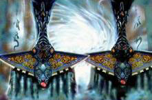

# 0850 混沌黑图书馆 Black Library of Chaos

精校状态：中文行文已逐段精校，部分术语仍为暂定

分类：地理 / 亚空间 Warp / 网道 Webway

原文来源：https://www.bilibili.com/opus/1078628345781944321

原作者：帝国神选罐头

原文时间：2025年06月15日 16:28

[返回分类目录](目录.md) · [全书目录](../../目录.md)

<!-- A0850-B0001 -->
**英文原文**

The Black Library of Chaos (also known as just the Black Library) is the Eldar's repository of forbidden lore.

<!-- /A0850-B0001 -->

<!-- A0850-B0002 -->

原译文

混沌黑图书馆（也被称为黑色图书馆）是灵族的遗忘传说知识库。

**校订译文**

混沌黑图书馆（通常简称黑图书馆）是灵族收藏禁忌知识的宝库。

**校注：** forbidden lore 是“禁忌知识”，不是 forgotten lore“遗忘的知识”。Black Library 简称统一黑图书馆；原“黑色图书馆”留在原译对照。

<!-- /A0850-B0002 -->

<!-- A0850-B0003 图片 -->

<!-- A0850-B0004 -->

原译文

Guardians of the Black Library 黑图书馆守护者

**校订译文**

Guardians of the Black Library 黑图书馆守护者

<!-- /A0850-B0004 -->

<!-- A0850-B0005 -->
## History

**补译**

历史

<!-- /A0850-B0005 -->

<!-- A0850-B0006 -->
**英文原文**

The Craftworlds became the only surviving sources of their ancient knowledge after the Fall of the Eldar. As the Craftworlds have drifted apart, this knowledge has consequently become fragmented, and as some Craftworlds have become lost over the millennia, more knowledge has been lost with them. The Library is the only source of the Eldar's knowledge concerning Chaos that has remained untouched. It was created by Cegorach (better known as the Laughing God), though for what purposes can only be guessed. As such, the Black Library is guarded by Harlequins such as those of the Masque of the Falling Moon.

<!-- /A0850-B0006 -->

<!-- A0850-B0007 -->

原译文

灵族之陨后，方舟世界成为他们古老知识的唯一幸存来源。随着方舟世界的疏远，这些知识也因此变得支离破碎，随着一些方舟世界在数千年的时间里消失了，更多的知识也随之消失了。图书馆是灵族关于混沌的唯一未被触及的知识来源。它是由西高奇（更为人所知是笑神）创造的，尽管其目的只能猜测。因此，黑色图书馆由丑角守卫，如落月面具。

**校订译文**

灵族之陨后，方舟世界成为保存其古老知识的唯一源头。随着各座方舟世界逐渐分散，这些知识也日益零碎；数千年间，一些方舟世界失踪，又有更多知识随之失落。唯有黑图书馆完整保存了灵族关于混沌的知识。它由西高奇——更广为人知的名号是笑神——创建，目的却只能猜测。黑图书馆因此受到丑角的守护，落月假面剧团便是守卫者之一。

<!-- /A0850-B0007 -->

<!-- A0850-B0008 -->
**英文原文**

Though most often mentioned in relation to its collection of chaotic lore, the Library contains other mysteries as well. It is said that knowledge of the fate of Arhra, the fallen Phoenix Lord, is contained within the vast archives of the Black Library, as is the nature of ancient "star gods" and more besides.

<!-- /A0850-B0008 -->

<!-- A0850-B0009 -->

原译文

尽管图书馆最常被提及的是它收集的混沌的知识，但它也包含着其他的奥秘。据说，关于陨落的凤凰领主阿赫拉命运的知识，以及古代“星神”的性质等，都包含在黑图书馆的庞大档案中。

**校订译文**

尽管图书馆最常被提及的是它收集的混沌的知识，但它也包含着其他的奥秘。据说，关于陨落的凤凰领主阿赫拉命运的知识，以及古代“星神”的性质等，都包含在黑图书馆的庞大档案中。

<!-- /A0850-B0009 -->

<!-- A0850-B0010 -->
**英文原文**

The Black Library is spoken of by Eldar as a dark Craftworld existing within the Webway, far beyond the reach of the Imperium. Within are collected tomes and writings describing the Eldar's studies of the warp. These writings describe all aspects of Chaos: its perils, promises and horrors. The Library is enclosed within a nearly impenetrable psychic barrier, and is watched and maintained by its Guardian-scribes, who collate and transcribe the knowledge of the Library a task they have carried out since the Fall, and are advised by the Black Council: a group of the greatest Farseers of the Asuryani. It contains not just Eldar knowledge of Chaos; any knowledge of Chaos is taken and kept within the Library, such as a copy of the Book of Magnus. It is as much a source of knowledge for those who fight Chaos as it is a vault to keep dangerous knowledge hidden and protected from those who would misuse it.

<!-- /A0850-B0010 -->

<!-- A0850-B0011 -->

原译文

灵族将黑色图书馆称为存在于网道内的黑暗方舟世界，远远超出了帝国的范围。里面收集了描述灵族对亚空间研究的巨著和著作。这些著作描述了混沌的各个方面：它的危险、承诺和恐怖。图书馆被封闭在一个几乎无法穿透的灵能屏障内，由其文士守护者监视和维护，他们整理和转录图书馆的知识 — 这是他们自陨落以来一直在进行的一项任务，并由黑色议会提供建议：一群方舟灵族最伟大的先知。它不仅包含了灵族关于混沌的知识；任何关于混沌的知识都会被拿走并保存在图书馆里，比如马格努斯之书的副本。对于那些与混沌作斗争的人来说，它既是一个知识来源，也是一个隐藏危险知识并保护其免受滥用的秘库。

**校订译文**

在灵族的描述中，黑图书馆是一座位于网道内的黑暗方舟世界，远在帝国势力所不能及之处。馆内收藏着灵族研究亚空间的典籍与著述，记载了混沌的种种危险、诱惑与恐怖。黑图书馆笼罩在一道几乎无法穿透的灵能屏障中，由文士守护者看护与维护。他们自灵族之陨以来便一直整理、抄录馆内知识，并接受黑色议会的建议；这个议会由方舟灵族最杰出的几位大先知组成。馆藏并不限于灵族自己的研究成果：任何关于混沌的知识都会被收集、保存于此，例如《马格努斯之书》的副本。它既为对抗混沌者提供知识，也是一座秘库，将危险的知识藏好，防止别有用心之人滥用。

<!-- /A0850-B0011 -->

<!-- A0850-B0012 -->
**英文原文**

The existence of the Library is known to few, and even fewer are allowed access to it. The Library's mind defends itself, barring the weak and corruptible. Only those who have mastered the Chaos within themselves are able to enter. Only two groups come and go at will: the Human Illuminati and the Eldar Solitaires. Inquisitor Bronislaw Czevak gained entry once, but had to prove himself worthy to the Black Council. Ahriman of the Thousand Sons has sought entrance to the Library for almost ten thousand years, in his vain attempt to understand the ever changing Tzeentch, Lord of Change. Inquisitor Jaq Draco also managed to find a way into the Black Library and steal the Book of the Rhana Dandra, aka the Book of Fate.

<!-- /A0850-B0012 -->

<!-- A0850-B0013 -->

原译文

图书馆的存在鲜为人知，被允许访问它的人更少。图书馆的思想保护自己，排除弱者和腐化者。只有那些掌握了内在混沌的人才能进入。只有两个团体可以随意出入：人类光照会和灵族独角。审判官布罗尼斯瓦夫·切瓦克获得了一次进入权，但必须证明自己配得上黑色议会。千子的阿里曼近一万年来一直在寻求进入图书馆，徒劳地试图理解不断变化的万变之主奸奇。检察官贾克·德拉科还设法找到了一条进入黑图书馆的路，偷走了《终焉之战之书》，也就是《命运之书》。

**校订译文**

知晓黑图书馆存在的人寥寥无几，获准进入者更少。图书馆自身的意识会进行防御，阻止意志薄弱、容易被腐化之人进入。唯有掌控了自身内在混沌者才能入内。能够自由出入的只有两个群体：人类光照会与灵族独角。审判官布罗尼斯瓦夫·切瓦克曾获准进入，但必须向黑色议会证明自己有此资格。千子的阿里曼近一万年来一直设法进入黑图书馆，徒劳地企图理解变幻莫测的万变之主奸奇。审判官贾克·德拉科也曾找到入馆之路，并盗走《终焉之战之书》，又称《命运之书》。

**校注：** Lord of Change 此处修饰奸奇这一神祇的称号，沿“万变之主”；不与同形的大魔单位 Lord of Change 官译“诡变领主”混为同一对象。only two groups 为本篇设定断言，其他年代人物获准进入并不据此改写。

<!-- /A0850-B0013 -->

<!-- A0850-B0014 -->
**英文原文**

Since the Fall of the Eldar, a crystal tome bounded with chains of light has rested upon an obsidian plinth at the heart of the Black Library. As fabled events came to pass — beginning with Ahzek Ahriman learning the first of those truths leading to his eventual attack on the Black Library and culminating with the death of the Maiden World of Dúriel — so those chains faded one by one until the tome opened shortly before the opening of the Great Rift. Revealed within were writings said to have been written by Cegorach itself, telling of a final act that changed utterly the tale of the Fall. Instead of the ultimate victory of Chaos, the final act tells of Cegorach's ultimate jest that would trick Slaanesh into expending all of her energies to save the Eldar instead of destroying them. How such an event could come to pass remains unclear.

<!-- /A0850-B0014 -->

<!-- A0850-B0015 -->

原译文

自灵族之陨以来，一本以光链为界的水晶巨著一直放在黑色图书馆中心的黑曜石基座上。随着传说中的事件发生 — 从阿扎克·阿里曼学习第一个真相开始，最终导致他对黑图书馆的攻击，最终导致杜里尔少女世界的死亡 — 这些枷锁一个接一个地消失了，直到大裂隙打开前不久这本书才出版。里面透露的是据说是西高奇自己写的，讲述了彻底改变堕落故事的最后一幕。最后一幕并不是混沌的最终胜利，而是讲述了西高奇的终极玩笑，这会欺骗色孽花费所有的精力来拯救灵族，而不是摧毁他们。这样的事件是如何发生的尚不清楚。

**校订译文**

自灵族之陨以来，一部由光之锁链束缚的水晶书，一直置于黑图书馆中心的黑曜石基座上。随着预言中的事件逐一应验，锁链也一条接一条地消退：这些事件始于阿扎克·阿里曼获知最初的真相——这些真相最终会引导他进攻黑图书馆——并以处女世界杜里尔的毁灭告终。就在大裂隙开启前不久，书本终于自行打开，其中显露的文字据说出自西高奇之手，记述了一场将彻底改写灵族之陨结局的终幕。这一终幕并非混沌的最终胜利，而是西高奇的终极恶作剧：他会诱使色孽倾尽所有力量，去拯救灵族而非将其毁灭。这一切究竟如何实现，仍不得而知。

**校注：** opened 指书本打开，不是出版；bounded 为 bound 的疑似误写，结合 chains 译为被锁链束缚。事件清单以杜里尔的毁灭为终点，不能误译为阿里曼袭击必然导致该星球毁灭。

<!-- /A0850-B0015 -->

<!-- A0850-B0016 -->
### Invasion 入侵

原题：Invasion 侵略

<!-- /A0850-B0016 -->

<!-- A0850-B0017 -->
**英文原文**

In 998.M41, shortly before Abaddon the Despoiler's Thirteenth Black Crusade, Ahriman led his warband of Thousand Sons into the Webway in an effort to finally claim the Black Library. Engaging in furious battles with the Harlequins and the Craftworlds of Ulthwé and Lugganath, Ahriman advanced to within sight of the Library itself. However, several major arteries of the Webway were choked with the dead before the Chaos Marines were driven from the secret paths leading to the Library. The breach caused by the rampaging Sorcerers was sealed. As a result, a section of the Webway was lost forever.

<!-- /A0850-B0017 -->

<!-- A0850-B0018 -->

原译文

998.M41，在掠夺者阿巴顿发动第十三次黑色远征前不久，阿里曼带领他的千子进入网道，试图最终占领黑图书馆。在与丑角以及乌斯维和拉格奈什的方舟世界的激烈战斗中，阿里曼前进到了图书馆本身的视线范围内。然而，在混沌星际战士被赶出通往图书馆的秘密通道之前，网道的几条主要通道都被死者堵塞了。狂暴的巫师造成的缺口被封锁了。结果，网道的一部分永远消失了。

**校订译文**

998.M41，掠夺者阿巴顿发动第十三次黑色远征前夕，阿里曼率领自己的千子战帮进入网道，试图最终夺取黑图书馆。他与丑角以及乌斯维、拉格奈什两个方舟世界的军队展开激战，一度推进到能望见黑图书馆的地方。混沌星际战士最终被逐出通往图书馆的隐秘路径，但此时网道的几条主干通路已被尸体堵塞。横行的巫师们造成的缺口随后被封闭，网道的一部分也因此永远失落。

<!-- /A0850-B0018 -->

<!-- A0850-B0019 -->
### Damage 受损

原题：Damage 伤害

<!-- /A0850-B0019 -->

<!-- A0850-B0020 -->
**英文原文**

Once considered inviolate, even the Black Library is not immune to the turmoil caused by the Cicatrix Maledictum. The opening of the Great Rift caused a section of the Library to fall completely, breached by the warp. Now in the clutches of She who Thirsts, that portion of the library is tainted forever, beyond the ability of even the White Seers to cleanse.

<!-- /A0850-B0020 -->

<!-- A0850-B0021 -->

原译文

虽然被认为是不可侵犯的，即使是黑图书馆也无法免受诅咒伤痕所造成的动荡。大裂隙的开启导致图书馆的一部分完全倒塌，被亚空间破坏。现在，在饥渴女士手中，图书馆的这一部分永远被污染了，甚至白先知也无法净化。

**校订译文**

黑图书馆曾被认为不可侵犯，却同样未能避开大裂隙带来的动荡。大裂隙开启时，亚空间侵入图书馆，使其中一片区域彻底陷落。如今，这部分已落入饥渴女士之手，遭到永久污染，就连白先知也无力净化。

<!-- /A0850-B0021 -->

<!-- A0850-B0022 -->
### Location 地点

<!-- /A0850-B0022 -->

<!-- A0850-B0023 -->
**英文原文**

The Black Library is often described as a "dark craftworld". While this is true in the sense that it is a crafted construct, it is no more ship or lost city than a hole in the heart is the heart itself. Just as the webway is a labyrinth of psychoactive tunnels that shift and change and deceive, so does the structure of the Library. It is a labyrinth within a labyrinth.

<!-- /A0850-B0023 -->

<!-- A0850-B0024 -->

原译文

黑图书馆经常被描述为“黑暗方舟世界”。虽然这是真的，因为它是一个精心设计的建筑，但它并不是舰或失落的城市，就像心脏上的一个洞就是心脏本身一样。正如网道是一个由灵能活动隧道组成的迷宫，这些隧道会移动、改变和欺骗，图书馆的结构也是如此。这是一个迷宫中的迷宫。

**校订译文**

黑图书馆常被称为“黑暗方舟世界”。若仅指它是人造构筑物，这种说法确实成立；但它并不能简单视为一艘飞船或一座失落之城，正如心脏中的空洞并不等于心脏本身。网道是由灵能感应通路组成的迷宫，路径不断移动、变化，令人迷失；黑图书馆的结构亦是如此。它是一座迷宫中的迷宫。

**校注：** 原文 no more ... than 否定两端的等同关系；原译将比喻后半写成“洞就是心脏”，逻辑倒置，已修正。

<!-- /A0850-B0024 -->

<!-- A0850-B0025 -->
**英文原文**

While it exists wholly within the webway, echoes of the Black Library persist within the materium. Some time after the opening of the Great Rift, the last of these traces in realspace were located at the western fringes of the Ghoul Stars, within a triangle formed by the Grand Shrine of Asuryan and the Exodite worlds of Syph and Quilan.

<!-- /A0850-B0025 -->

<!-- A0850-B0026 -->

原译文

虽然它完全存在于网道中，但黑图书馆的回声仍然存在于物质界中。大裂隙打开一段时间后，现实空间中的最后一条痕迹位于食尸鬼星的西部边缘，在由阿苏焉大神殿和赛弗和奎兰蛮荒世界形成的三角形内。

**校订译文**

黑图书馆虽然完全位于网道中，其回响却仍会留在物质界。大裂隙开启一段时间后，它在现实空间中最后的这些痕迹，位于食尸鬼群星西缘，由阿苏焉大神殿以及赛弗、奎兰两个蛮荒灵族世界围成的三角区域内。

<!-- /A0850-B0026 -->

<!-- A0850-B0027 -->
**英文原文**

The Black Library may be accessed in several ways, including via Webway Gate and the more flamboyant Neverending Stair.

<!-- /A0850-B0027 -->

<!-- A0850-B0028 -->

原译文

黑图书馆可以通过多种方式进入，包括通过网道门和更华丽的无尽阶梯。

**校订译文**

黑图书馆可以通过多种方式进入，包括通过网道门和更华丽的无尽阶梯。

<!-- /A0850-B0028 -->

<!-- A0850-B0029 -->
## Black Council 黑色议会

<!-- /A0850-B0029 -->

<!-- A0850-B0030 -->
**英文原文**

The Black Council serves in an advisory role to the Guardian-scribes of the Black Library, the race's greatest Farseers drawn from several Craftworlds.

<!-- /A0850-B0030 -->

<!-- A0850-B0031 -->

原译文

黑色议会为黑色图书馆的文士守护者提供咨询服务，这些文士是种族中最伟大的先知，他们来自几个方舟世界。

**校订译文**

黑色议会为黑图书馆的文士守护者提供建议。议会成员来自数座方舟世界，都是灵族最杰出的大先知。

**校注：** 英文句尾 the race’s greatest Farseers 指黑色议会成员，不是文士守护者。

<!-- /A0850-B0031 -->

<!-- A0850-B0032 -->
**英文原文**

Eldrad Ulthran of Ulthwé, in absentia

<!-- /A0850-B0032 -->

<!-- A0850-B0033 -->

原译文

乌斯维的埃尔德拉德·乌索然，缺席

**校订译文**

乌斯维的艾尔德拉德·乌瑟兰（未亲自出席）

<!-- /A0850-B0033 -->

<!-- A0850-B0034 -->
**英文原文**

Eiladar Ys of the Lugganath

<!-- /A0850-B0034 -->

<!-- A0850-B0035 -->

原译文

拉格奈什的艾拉达尔·伊斯

**校订译文**

拉格奈什的艾拉达尔·伊斯

<!-- /A0850-B0035 -->

<!-- A0850-B0036 -->
**英文原文**

Ffaid Karhedra of Eyslk-Tan

<!-- /A0850-B0036 -->

<!-- A0850-B0037 -->

原译文

艾斯利可-坦的法伊德·卡尔海德拉

**校订译文**

艾斯利可坦的法伊德·卡尔海德拉

<!-- /A0850-B0037 -->

<!-- A0850-B0038 -->
**英文原文**

Iqbraesil of Iyanden

<!-- /A0850-B0038 -->

<!-- A0850-B0039 -->

原译文

伊扬登的伊克布雷西尔

**校订译文**

伊扬登的伊克布雷西尔

<!-- /A0850-B0039 -->

<!-- A0850-B0040 -->
**英文原文**

Morcan Fiorinintal of Alaitoc

<!-- /A0850-B0040 -->

<!-- A0850-B0041 -->

原译文

阿莱托克的莫坎·菲奥里宁塔尔

**校订译文**

阿莱托克的莫坎·菲奥里宁塔尔

<!-- /A0850-B0041 -->

<!-- A0850-B0042 -->
## Known and Rumoured Contents 已知与传闻中的馆藏

原题：Known and Rumoured Contents 已知和传闻目录

<!-- /A0850-B0042 -->

<!-- A0850-B0043 -->

原译文

Atlas Infernal 炼狱图集

**校订译文**

Atlas Infernal 炼狱之图

<!-- /A0850-B0043 -->

<!-- A0850-B0044 -->

原译文

Book of Mournful Night 哀夜之书

**校订译文**

Book of Mournful Night 哀夜之书

<!-- /A0850-B0044 -->

<!-- A0850-B0045 -->

原译文

Book of Rhana Dandra 终焉之战之书

**校订译文**

Book of Rhana Dandra 终焉之战之书

<!-- /A0850-B0045 -->

<!-- A0850-B0046 -->

原译文

Cries of Isha 伊莎之泣

**校订译文**

Cries of Isha 伊莎之泣

<!-- /A0850-B0046 -->

<!-- A0850-B0047 -->
**英文原文**

Stern Codex (intended to be placed here)

<!-- /A0850-B0047 -->

<!-- A0850-B0048 -->

原译文

斯特恩圣典（拟放在此处）

**校订译文**

斯特恩圣典（拟放在此处）

<!-- /A0850-B0048 -->

<!-- A0850-B0049 -->
**英文原文**

The True Name of the Emperor of Mankind (rumoured, as one possible location)

<!-- /A0850-B0049 -->

<!-- A0850-B0050 -->

原译文

人类帝皇的真名（传闻，作为一个可能的地点）

**校订译文**

人类帝皇的真名（传闻；黑图书馆是可能的收藏地点之一）

<!-- /A0850-B0050 -->

<!-- A0850-B0051 -->
**英文原文**

Book of Magnus (copy)

<!-- /A0850-B0051 -->

<!-- A0850-B0052 -->

原译文

马格努斯之书（副本）

**校订译文**

马格努斯之书（副本）

<!-- /A0850-B0052 -->

<!-- A0850-B0053 -->
**英文原文**

Daemonicus Totalus (copy)

<!-- /A0850-B0053 -->

<!-- A0850-B0054 -->

原译文

恶魔全书（副本）

**校订译文**

恶魔全书（副本）

<!-- /A0850-B0054 -->

本篇核心术语与暂定项

以下列出本篇出现的英文原形及核心术语表用词。同形词可能指不同对象，具体词义以本篇正文和校注为准；单复数、别名和仅见于图注的名称可能尚未列入。完整候选见[术语表](../../术语表/双语术语候选.csv)。

| 英文 | 采用中文 | 状态 |
| --- | --- | --- |
| Thousand Sons | 千子 | 官方已核对 |
| Eldar | 灵族 | 暂定·语境区分 |
| Warp | 亚空间 | 官方已核对 |
| Great Rift | 大裂隙 | 官方已核对 |
| Cicatrix Maledictum | 大裂隙 | 暂定·别名对应 |
| Inquisitor | 审判官 | 官方已核对 |
| Imperium | 帝国 | 暂定·简称 |
| Webway | 网道 | 暂定 |
| Tzeentch | 奸奇 | 官方已核对 |
| Ulthwé | 乌斯维 | 暂定 |
| Craftworld | 方舟世界 | 官方已核对 |
| History | 历史 | 编辑用语已统一 |
| Emperor of Mankind | 人类帝皇 | 暂定 |
| Emperor | 帝皇 | 官方已核对 |
| Slaanesh | 色孽 | 官方已核对 |
| Asuryani | 阿苏焉尼 | 暂定·官方待核 |
| Exodite | 蛮荒灵族 | 暂定·官方待核 |
| Maiden World | 少女世界 | 暂定·官方待核 |
| Ghoul Stars | 食尸鬼群星 | 暂定·官方待核 |
| Illuminati | 光照会 | 暂定·官方待核 |
| Jaq Draco | 贾克·德拉科 | 暂定·官方待核 |
| Solitaires | 独角 | 官方已核·单复数词形对应 |
| Ancient | 旗手 | 官方已核对 |
| Ahzek Ahriman | 阿扎克·阿里曼 | 暂定·官方待核 |
| Despoiler | 劫掠者 | 暂定·官方待核 |
| Book of Magnus | 《马格努斯之书》 | 暂定·官方待核 |
| Lord of Change | 诡变领主 | 官方已核对 |
| Abaddon the Despoiler | 掠夺者阿巴顿 | 官方已核对 |
| Eldrad Ulthran | 艾尔德拉德·乌瑟兰 | 官方已核对 |
| Iyanden | 伊扬登 | 暂定·官方待核 |
| She Who Thirsts | 饥渴女士 | 暂定·官方待核 |
| Alaitoc | 阿莱托克 | 暂定·官方待核 |
| Cegorach | 西高奇 | 暂定·官方待核 |
| Phoenix Lord | 凤凰领主 | 暂定·官方待核 |
| Asuryan | 阿苏焉 | 暂定·官方待核 |
| Eiladar Ys | 艾拉达尔·伊斯 | 暂定·官方待核 |
| Lugganath | 拉格奈什 | 暂定·官方待核 |
| Black Council | 黑色议会 | 暂定·官方待核 |
| Ffaid Karhedra | 法伊德·卡尔海德拉 | 暂定·官方待核 |
| Eyslk-Tan | 艾斯利可坦 | 暂定·官方待核 |
| Iqbraesil | 伊克布雷西尔 | 暂定·官方待核 |
| Morcan Fiorinintal | 莫坎·菲奥里宁塔尔 | 暂定·官方待核 |
| Arhra | 阿赫拉 | 暂定·官方待核 |
| Scribes | 抄写员 | 暂定·官方待核 |
| The Book of Magnus | 马格努斯之书 | 暂定·官方待核 |
| Maledictum | 诅咒之印 | 暂定·官方待核 |
| Exodite Worlds | 蛮荒灵族世界 | 暂定·官方待核 |
| Bronislaw Czevak | 布罗尼斯瓦夫·切瓦克 | 暂定·官方待核 |
| Black Library of Chaos | 混沌黑图书馆 | 暂定·官方待核 |
| Black Library | 黑图书馆 | 暂定·官方待核 |
| Masque of the Falling Moon | 落月假面剧团 | 暂定·官方待核 |
| Guardian-scribes | 文士守护者 | 暂定·官方待核 |
| Dúriel | 杜里尔 | 暂定·官方待核 |
| Neverending Stair | 无尽阶梯 | 暂定·官方待核 |
| Book of the Rhana Dandra | 《终焉之战之书》 | 暂定·官方待核 |

