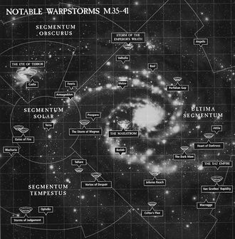

# 0851 亚空间风暴 Warp Storm

精校状态：中文行文已逐段精校，部分术语仍为暂定

分类：地理 / 亚空间 Warp / 亚空间风暴 Warp Storm

原文来源：https://www.bilibili.com/opus/1127601177804931081

原作者：帝国神选罐头

原文时间：2025年10月25日 15:48

[返回分类目录](目录.md) · [全书目录](../../目录.md)

<!-- A0851-B0001 -->
**英文原文**

Warp Storms are volatile events in both the Immaterium and Materium linked to the nature of the Warp.

<!-- /A0851-B0001 -->

<!-- A0851-B0002 -->

原译文

亚空间风暴是与亚空间性质相关的非物质界和物质界中的不稳定事件。

**校订译文**

亚空间风暴是由亚空间本身的性质引发的剧烈动荡，既会发生在亚空间中，也会波及物质宇宙。

<!-- /A0851-B0002 -->

<!-- A0851-B0003 图片 -->

<!-- A0851-B0004 -->

原译文

Major Warp Storms in the Imperium M35-M41 M35-M41帝国内部的主要亚空间风暴

**校订译文**

Major Warp Storms in the Imperium M35-M41 M35-M41帝国内部的主要亚空间风暴

<!-- /A0851-B0004 -->

<!-- A0851-B0005 -->
## Overview 概述

<!-- /A0851-B0005 -->

<!-- A0851-B0006 -->
**英文原文**

The Warp is an extremely volatile medium. At times, disturbances can turn areas of the Warp into raging storms of incomprehensibly destructive fury. These storms can last for days, months, or even centuries. Ships caught in these storms, at best, might be blown off-course, to emerge thousands of light-years off course into uncharted areas of the galaxy, or can find themselves trapped inside the Warp, a terrible fate for its passengers as they become playthings for the dark creatures that inhabit the malign realm. Sometimes, a ship, after traveling through the Warp for only a short time, will emerge from the Warp and find that centuries have passed in real space. The storms also cut off Warp travel through certain regions, isolating systems from the Imperium for months, years, or even centuries. Some systems have always been isolated and show no hint of becoming otherwise.

<!-- /A0851-B0006 -->

<!-- A0851-B0007 -->

原译文

亚空间是一种极不稳定的介质。有时，干扰会将亚空间变成难以理解的破坏性狂暴的强烈风暴。这些风暴可能持续数天、数月甚至数个世纪。被困在这些风暴中的舰船，至多可能会被吹离航线，偏离航线数千光年进入银河系的未知区域，或者发现自己被困在亚空间中，这对乘员来说是一个可怕的命运，因为他们成为了居住在邪恶领域的黑暗生物的玩物。有时，一艘船在穿越亚空间后只停留了很短的时间，就会从亚空间中出来，发现在真实空间中已经过去了几个世纪。风暴还切断了在某些地区的亚空间航行，将星系与帝国隔离几个月、几年甚至几个世纪。有些星系一直是孤立的，没有任何迹象表明会变得不同。

**校订译文**

亚空间极不稳定，扰动有时会使其中某些区域化为狂暴的风暴，释放难以想象的破坏力。风暴可能持续几天、几个月，甚至几个世纪。卷入其中的舰船，最好的结果也只是被吹离航线，在数千光年之外、尚未探索的银河区域重返现实；更糟的结局是永远困在亚空间，乘员沦为其中黑暗生物的玩物。有时，舰船自觉只在亚空间中航行了片刻，脱离后却发现现实中已过去数个世纪。风暴还会封闭某些区域的航路，使整片星系与帝国隔绝数月、数年，乃至数百年。有些星系始终被隔离，至今也看不到风暴消退的迹象。

**校注：** at best 表示最好也只是偏航，不是“至多可能”；时间跳跃发生在一次亚空间航行前后。

<!-- /A0851-B0007 -->

<!-- A0851-B0008 -->
**英文原文**

Particularly dangerous Warp Storms were noted during the Age of Strife, which led to the devastation of Humanity's interstellar realms. They only dissipated with the birth of Slaanesh.

<!-- /A0851-B0008 -->

<!-- A0851-B0009 -->

原译文

在纷争时代，特别危险的亚空间风暴被注意到，这导致了人类星际领域的毁灭。随着色孽的诞生，他们才消散。

**校订译文**

纷争时代出现过格外凶险的亚空间风暴，导致人类的星际领土遭到毁灭性打击。直到色孽诞生，这些风暴才逐渐消散。

<!-- /A0851-B0009 -->

<!-- A0851-B0010 -->
## Notable Warp Storms 著名亚空间风暴

<!-- /A0851-B0010 -->

<!-- A0851-B0011 -->
**英文原文**

Cicatrix Maledictum - Also known as the Great Rift

<!-- /A0851-B0011 -->

<!-- A0851-B0012 -->

原译文

诅咒瘢痕 - 也被称为大裂隙

**校订译文**

大裂隙——帝国亦称 Cicatrix Maledictum，原稿曾译“诅咒瘢痕”。

**校注：** Cicatrix Maledictum 与 Great Rift 为同一对象，正文统一大裂隙，此处保留原稿别名以说明列项关系。

<!-- /A0851-B0012 -->

<!-- A0851-B0013 -->

原译文

Eye of Terror 恐惧之眼

**校订译文**

Eye of Terror 恐惧之眼

<!-- /A0851-B0013 -->

<!-- A0851-B0014 -->

原译文

Maelstrom 大漩涡

**校订译文**

Maelstrom 大漩涡

<!-- /A0851-B0014 -->

<!-- A0851-B0015 -->

原译文

Screaming Vortex 尖啸旋涡

**校订译文**

Screaming Vortex 尖啸旋涡

<!-- /A0851-B0015 -->

<!-- A0851-B0016 -->

原译文

Storm of Judgement 审判风暴

**校订译文**

Storm of Judgement 审判风暴

<!-- /A0851-B0016 -->

<!-- A0851-B0017 -->

原译文

Storm of the Emperor's Wrath 帝皇之怒风暴

**校订译文**

Storm of the Emperor's Wrath 帝皇之怒风暴

<!-- /A0851-B0017 -->

本篇核心术语与暂定项

以下列出本篇出现的英文原形及核心术语表用词。同形词可能指不同对象，具体词义以本篇正文和校注为准；单复数、别名和仅见于图注的名称可能尚未列入。完整候选见[术语表](../../术语表/双语术语候选.csv)。

| 英文 | 采用中文 | 状态 |
| --- | --- | --- |
| Warp | 亚空间 | 官方已核对 |
| Great Rift | 大裂隙 | 官方已核对 |
| Cicatrix Maledictum | 大裂隙 | 暂定·别名对应 |
| Imperium | 帝国 | 暂定·简称 |
| Slaanesh | 色孽 | 官方已核对 |
| Age of Strife | 纷争时代 | 暂定·官方待核 |
| The Dark | 《黑暗》 | 暂定·官方待核 |
| Maledictum | 诅咒之印 | 暂定·官方待核 |
| Real Space | 现实空间 | 暂定·官方待核 |

