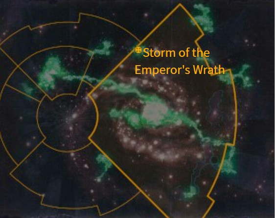

# 0852 帝皇之怒风暴 Storm of the Emperor's Wrath

精校状态：中文行文已逐段精校，部分术语仍为暂定

分类：地理 / 亚空间 Warp / 亚空间风暴 Warp Storm

原文来源：https://www.bilibili.com/opus/1072639254359703575

原作者：帝国神选罐头

原文时间：2025年05月30日 13:08

[返回分类目录](目录.md) · [全书目录](../../目录.md)

<!-- A0852-B0001 -->
**英文原文**

The Storm of the Emperor's Wrath is a warp storm that appeared in M36, during the Age of Apostasy, soon after Sebastian Thor openly rebelled against Goge Vandire. The storm's strength and persistence is enough that, millennia later, it still rages to this day enveloping the Clax system and isolating it from the rest of the Imperium.

<!-- /A0852-B0001 -->

<!-- A0852-B0002 -->

原译文

帝皇之怒风暴是一场亚空间风暴，出现在M36的叛教时代，就在塞巴斯蒂安·托尔公开反抗高戈·范迪尔之后不久。这场风暴的强度和持久性足以让在数千年后的今天，它仍然肆虐，包围着克拉克斯星系，并将其与帝国的其他部分隔离开来。

**校订译文**

帝皇之怒风暴是一场诞生于第36个千年叛教时代的亚空间风暴，出现于塞巴斯蒂安·托尔公开反抗高戈·范迪尔之后不久。它异常猛烈，也极为持久；按英文底稿所述，数千年后仍在克拉克斯星系周围肆虐，使该星系与帝国其他地区隔绝。

<!-- /A0852-B0002 -->

<!-- A0852-B0003 图片 -->

<!-- A0852-B0004 -->

原译文

Galactic map showing the Storm of the Emperor's Wrath 显示帝皇之怒风暴的银河系地图

**校订译文**

Galactic map showing the Storm of the Emperor's Wrath 显示帝皇之怒风暴的银河系地图

<!-- /A0852-B0004 -->

<!-- A0852-B0005 -->
**英文原文**

To crush Thor and his rebellion, Vandire sent a great Imperial Naval fleet, carrying the armies of the Frateris Templar. As the fleet attempted to cross through warp space to Dimmamar, the storm engulfed the region, destroying the entire fleet. The storm was considered the Emperor's will incarnate, a sign taken by Thor that Vandire had to be overthrown and the Imperium reorganized.

<!-- /A0852-B0005 -->

<!-- A0852-B0006 -->

原译文

为了粉碎托尔和他的叛乱，范迪尔派遣了一支庞大的帝国海军舰队，携带圣堂兄弟会的军队。当舰队试图穿越亚空间前往迪马默时，风暴席卷了该地区，摧毁了整个舰队。这场风暴被认为是帝皇意志的化身，托尔认为必须推翻范迪尔，重组帝国。

**校订译文**

范迪尔为镇压托尔的反抗，派出一支庞大的帝国海军舰队，运送圣堂兄弟会大军。舰队正通过亚空间驶向迪马默时，风暴突然吞没该区域，将整支舰队摧毁。人们将这一事件视为帝皇意志的显现；托尔也据此认定，必须推翻范迪尔，重整帝国。

<!-- /A0852-B0006 -->

本篇核心术语与暂定项

以下列出本篇出现的英文原形及核心术语表用词。同形词可能指不同对象，具体词义以本篇正文和校注为准；单复数、别名和仅见于图注的名称可能尚未列入。完整候选见[术语表](../../术语表/双语术语候选.csv)。

| 英文 | 采用中文 | 状态 |
| --- | --- | --- |
| Warp | 亚空间 | 官方已核对 |
| Imperium | 帝国 | 暂定·简称 |
| Emperor | 帝皇 | 官方已核对 |
| Age of Apostasy | 叛教时代 | 暂定·官方待核 |
| Goge Vandire | 高戈·范迪尔 | 暂定·官方待核 |
| Frateris Templar | 圣堂兄弟会 | 暂定·官方待核 |
| Dimmamar | 迪马默 | 暂定·官方待核 |
| Emperor's Will | 帝皇意志号 | 暂定·官方待核 |
| Warp Storm | 亚空间风暴 | 暂定·官方待核 |
| Storm of the Emperor's Wrath | 帝皇之怒风暴 | 暂定·官方待核 |
| Clax system | 克拉克斯星系 | 暂定·官方待核 |
| System | 星系（恒星系统） | 暂定·官方待核 |
| Sebastian Thor | 塞巴斯蒂安·托尔 | 暂定·官方待核 |
| Clax | 克拉克斯 | 暂定·官方待核 |

