# 0855 银河系 Milky Way Galaxy

精校状态：中文行文已逐段精校，部分术语仍为暂定

分类：地理 / 真实空间 Real Space

原文来源：https://www.bilibili.com/opus/1052614686602690601

原作者：帝国神选罐头

原文时间：2025年04月06日 14:02

[返回分类目录](目录.md) · [全书目录](../../目录.md)

<!-- A0855-B0001 -->
**英文原文**

The Milky Way Galaxy is the realm in which Warhammer 40,000 takes place. It is a vast spiral galaxy, ninety-thousand light years across and fifteen-thousand light years thick, containing roughly four hundred billion stars.

<!-- /A0855-B0001 -->

<!-- A0855-B0002 -->

原译文

银河系是战锤40000发生的领域。它是一个巨大的螺旋星系，直径9万光年，厚度1.5万光年，包含大约4000亿颗恒星。

**校订译文**

银河系是《战锤40,000》故事发生的舞台。按本篇底稿的描述，它是一座巨大的螺旋星系，直径约九万光年、厚约一万五千光年，包含约四千亿颗恒星。

**校注：** 尺寸与恒星数量均为本篇底稿的设定描述，未按现实天文学数据另行改写。

<!-- /A0855-B0002 -->

<!-- A0855-B0003 图片 -->
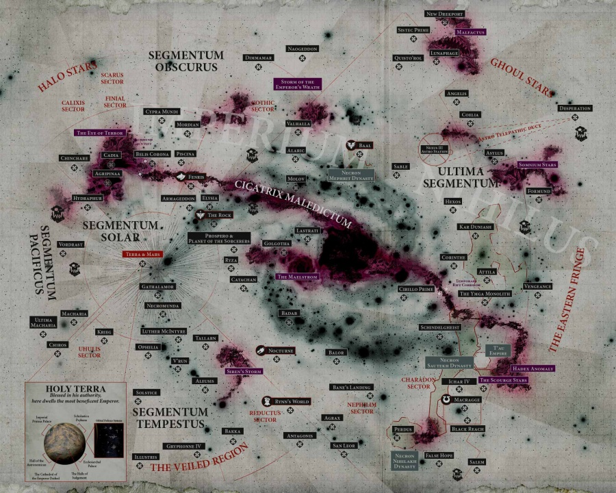

<!-- A0855-B0004 -->

原译文

Map of the Galaxy 银河系地图

**校订译文**

Map of the Galaxy 银河系地图

<!-- /A0855-B0004 -->

<!-- A0855-B0005 -->
## History 历史

<!-- /A0855-B0005 -->

<!-- A0855-B0006 -->
**英文原文**

Billions of years old, the earliest known sentient race in the galaxy were the Old Ones. Mastering advanced technologies derived from the Warp and creating the Webway, they soon established an empire across the whole galaxy. They believed that all life was useful and they are known to had brought about the rise of numerous new species, such as humanity, as well as impregnated thousands of worlds which they made their own. The Old Ones soon came into contact with vampire incorporeal beings which fed on the energy of stars known as C'tan. The Old Ones battled the C'tan, forcing them into hiding. At some point, the Old Ones came into conflict with the Necrontyr, a race of highly advanced but short-lived beings. The two civilizations eventually clashed in a massive galaxy-spanning conflict known as the War in Heaven which the Old Ones were winning until the Necrontyr turned to the C'tan in desperation, converting themselves into the mechanical Necrons. This time, the conflict was far different from the previous wars as the Old Ones mastery of the Warp was now countered by the C'tan's supremacy of the material universe. In time, the C'tan began to dominate the galaxy whilst the Old Ones bastions were besieged and their nurtured races being fed upon like cattle by the eternal hunger of the star-gods. Entire worlds were razed, suns extinguished and entire star systems devoured whole by the terrible C'tan. In desperation the Old Ones sired new races to fight the Necrons and C'tan such as the Eldar and Orks.

<!-- /A0855-B0006 -->

<!-- A0855-B0007 -->

原译文

数十亿年前，银河系中已知最早的有情种族是古圣。他们掌握了源自亚空间的先进技术，并创建了网道，很快在整个银河系建立了一个帝国。他们相信所有的生命都是有用的，众所周知，他们带来了许多新物种的崛起，如人类，以及他们创造的数千个世界。古圣很快就接触到了吸血鬼般的无形生物，它们以被称为星神，以恒星的能量为食。古圣们与星神作战，迫使他们躲藏起来。在某个时刻，古圣与惧亡者发生了冲突，惧亡者是一个高度发达但寿命短暂的种族。这两个文明最终在一场跨越星系的大规模冲突中发生了战争，这场冲突被称为“天堂之战”，古圣逐渐赢得这场战争，直到惧亡者绝望地转向星神，将自己变成了机械死灵。这一次，这场冲突与之前的战争大不相同，因为古圣对亚空间的掌握现在被星神对物质宇宙的权能所抵消。随着时间的推移，星神开始统治银河系，而古圣的堡垒被围困，他们培育的种族像牲畜一样被星神永恒的饥饿所吞噬。整个世界被夷为平地，太阳熄灭，整个恒星系统被可怕的星神吞噬。在绝望中，古圣渴望新的种族来对抗死灵和星神，如灵族和欧克。

**校订译文**

银河已有数十亿年的历史，其中最早为人所知的智慧种族是古圣。他们掌握了源于亚空间的先进技术，建造网道，很快建立起横跨银河的帝国。他们相信一切生命都有用处，促成了包括人类在内的众多物种兴起，也在纳入自己版图的数千个世界播下生命。古圣后来遇到被称为星神的无形存在；这些生物如同吸血鬼，以恒星能量为食。古圣与之交战，迫使其躲藏。此后，古圣又与技术先进却寿命短暂的惧亡者发生冲突，最终爆发横贯银河的“天堂之战”。古圣原本占据优势，直到绝境中的惧亡者求助星神，将自己转化为机械化的太空死灵。此时，星神对物质宇宙的支配足以抗衡古圣对亚空间的掌握，战局因而逆转。星神逐渐控制银河，古圣堡垒接连遭围攻，受其培育的种族则像牲畜般被永不餍足的星神吞食。世界被夷平，恒星被熄灭，整片恒星系统遭到吞噬。古圣在绝境中培育出灵族、欧克等新种族，以抵御太空死灵与星神。

**校注：** impregnated worlds 指在世界播种生命，非创造行星；sired 指培育新种族，非渴望。古圣与人类起源、古圣先与星神交战等说法属于底稿所采用叙述，不能据此消除其他篇的历史版本差异。

<!-- /A0855-B0007 -->

<!-- A0855-B0008 图片 -->
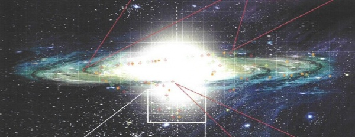

<!-- A0855-B0009 -->

原译文

A distant view of the Galaxy 银河系的远景

**校订译文**

A distant view of the Galaxy 银河系的远景

<!-- /A0855-B0009 -->

<!-- A0855-B0010 -->
**英文原文**

However this still did not prove enough and slowly the Old Ones were broken, scattered, and finally annihilated by the Necrons and C'tan. In the power vacuum following the war, the lesser creations of the Old Ones such as Mankind were known to had continued to develop but in unforseen ways. The mantle of galactic dominion would eventually pass to the Eldar who had fought alongside the Old Ones during the war. Exhausted from the War in Heaven, the Necrons departed into the Great Sleep on their Tomb Worlds in order to rebuild their strength and take control of the galaxy once more. Shortly before the Great Sleep the Necron Silent King, Szarekh, engineered a betrayal of the C'tan. The star-gods were shattered and enslaved by the Necrons and Szarekh went into self-imposed exile outside of the Galaxy.

<!-- /A0855-B0010 -->

<!-- A0855-B0011 -->

原译文

然而，这仍然不够，慢慢地，古圣被死灵和星神摧毁、分散，最终被消灭。在战争后的权力真空中，众所周知，人类等古圣的较小创造物继续发展，但以不可预见的方式发展。银河系的统治权最终将传递给在战争中与古圣并肩作战的灵族人。由于在天堂之战中筋疲力尽，死灵们回到了他们的墓穴世界，进入了大休眠，以重建他们的力量，再次控制银河系。在大休眠之前不久，死灵寂静王斯扎拉克策划了对星神的背叛。星神被死灵粉碎并奴役，斯扎拉克自我放逐，前往银河系之外。

**校订译文**

然而，这些努力仍不足以挽回败局。古圣逐渐遭到击溃、驱散，最终被太空死灵与星神消灭。战争留下权力真空，人类等地位较低的古圣造物继续发展，却走上了出人意料的道路。银河霸权最终落入曾与古圣并肩作战的灵族手中。太空死灵在天堂之战中疲惫不堪，遂退入墓穴世界，开始大休眠，等待恢复实力、重新统治银河的时机。大休眠开始前不久，寂静王斯扎拉克策划了一场反叛，将星神击碎，奴役其残片；此后，他自我放逐，离开了银河。

**校注：** 本篇将古圣灭亡简述为太空死灵与星神所为；保留所给英文，不擅自以其他版背景补成新的历史段落。

<!-- /A0855-B0011 -->

<!-- A0855-B0012 -->
**英文原文**

With the Necrons in hidden hibernation, the Eldar rose to the position as the masters of the Galaxy. Creating a vast empire and utilizing the Webway for travel, the Eldar Empire and its advanced technology flourished for millennia. However the Eldar were not the only major galactic power at this time. Humanity was eventually able to utilize Warp Drives and Navigators to finally leave the Sol System to colonize a large part of the Galaxy during a period that would become known as the Dark Age of Technology. Ultimately, this first interstellar empire of Humanity would collapse after a series of disasters that included a devastating machine uprising, Warp Storms, and the sudden appearance of large amounts of Psykers. In the subsequent Age of Strife most of humanity's domains regressed and the species seemed doomed.

<!-- /A0855-B0012 -->

<!-- A0855-B0013 -->

原译文

随着死灵隐藏蛰伏，灵族升任银河系的主人。创建了一个庞大的帝国，并利用网道进行航行，灵族帝国及其先进技术繁荣了数千年。然而，灵族并不是当时唯一的主要银河系力量。人类最终能够利用亚空间驱动器和导航者最终离开太阳系，在后来被称为黑暗技术时代的时期殖民银河系的大部分地区。最终，这个人类的第一个星际帝国将在一系列灾难之后崩溃，其中包括毁灭性的智械起义、亚空间风暴和大量灵能者的突然出现。在随后的纷争时代，人类的大部分领域都倒退了，物种似乎注定要灭亡。

**校订译文**

太空死灵隐入沉眠后，灵族成为银河的主人。他们建立庞大帝国，借网道往来各地，文明与先进技术繁盛了漫长岁月。不过，当时的银河并非只有这一支强权。人类后来利用亚空间引擎与导航员走出太阳系，在黑暗科技时代将殖民地扩展至银河大片区域。人类最初的星际帝国最终却被一连串灾难摧毁，包括毁灭性的智械叛乱、亚空间风暴，以及大量灵能者突然涌现。随后的纷争时代使大多数人类领地衰退，人类似乎已难逃灭亡。

<!-- /A0855-B0013 -->

<!-- A0855-B0014 -->
**英文原文**

Meanwhile, the Eldar Empire grew increasingly hedonistic, arrogant, and cruel. As the depravity of the Eldar grew, their psychic resonance was giving birth to a new God of Chaos. When this being of pure desire, Slaanesh, exploded into life the psychic backlash decimated the Eldar race and empire. The souls of billions of Eldar and most of their Gods were consumed by Slaanesh and a massive Warp Rift was created in the epicenter of the Eldar portal. This rift has since become known as the Eye of Terror. Only a small portion of the Eldar race survived the birth of Slaanesh, mainly those on Craftworlds or Exodite Worlds as well as their dark kin which resided in the Webway.

<!-- /A0855-B0014 -->

<!-- A0855-B0015 -->

原译文

与此同时，灵族帝国变得越来越享乐主义、傲慢和残忍。随着灵族的堕落越来越严重，他们的精神共鸣正在孕育一位新的混沌之神。当这种纯粹的欲望，色孽爆发出来时，精神上的反弹摧毁了灵族的种族和帝国。数十亿灵族的灵魂和他们的大多数神都被色孽吞噬了，在灵族门户的中心制造了一个巨大的亚空间裂隙。这个裂隙后来被称为恐惧之眼。只有一小部分灵族种族在色孽诞生后幸存下来，主要是那些生活在方舟世界或蛮荒世界的人，以及他们居住在网道的黑暗亲属。

**校订译文**

与此同时，灵族帝国愈发沉溺享乐，变得傲慢而残酷。他们不断加深的堕落通过灵能共鸣，孕育出一位新的混沌神祇。当纯粹欲望的化身色孽诞生时，灵能反冲摧毁了灵族文明的主体。数十亿灵族的灵魂及其大多数神祇被吞噬，灾变中心撕开一道巨大的亚空间裂口，后来被称为恐惧之眼。只有少数灵族活了下来，主要是方舟世界与蛮荒灵族世界的居民，以及居住在网道中的黑暗同族。

**校注：** 英文 epicenter of the Eldar portal 表述不清，疑 portal 为笔误，正文仅译为灾变中心，具体地理指称仍待核。Exodite Worlds 与人类 Feral Worlds 不同，采用蛮荒灵族世界。

<!-- /A0855-B0015 -->

<!-- A0855-B0016 -->
**英文原文**

Around the time of the Fall of the Eldar in M30, humanity's homeworld of Terra had recovered from the Age of Strife and united once more under the Emperor of Mankind. Forming the Imperium of Man, the Emperor and his offspring, the Primarchs, embarked on the Great Crusade. The Crusade succeeded in uniting thousands of human worlds which had become lost and isolated during the Age of Strife and mankind rose to become the Galaxy's largest single empire. However the events of the Horus Heresy forced the Emperor's remain to be forever shackled to the Golden Throne and over the next ten thousand years the Imperium would become increasingly theocratic and fall into a state of decay.

<!-- /A0855-B0016 -->

<!-- A0855-B0017 -->

原译文

在M30的灵族陨落前后，人类的家园世界泰拉已经从纷争时代恢复过来，并在人类帝皇的统治下再次统一。建立了人类帝国，帝皇和他的后代，即原体，开始了大远征。大远征成功地团结了数千个在纷争时代迷失和孤立的人类世界，人类崛起为银河系最大的单一帝国。然而，荷鲁斯叛乱事件迫使帝皇的遗体永远被束缚在黄金王座上，在接下来的一万年里，帝国将变得越来越神权政治，陷入衰落状态。

**校订译文**

第30个千年、灵族陨落前后，人类母星泰拉从纷争时代中恢复，并在人类帝皇统治下重新统一。帝皇建立人类帝国，与其子嗣——原体们——发起大远征，将数千个在纷争时代失散、隔绝的人类世界重新联合起来，使人类成为银河最大的单一帝国。然而，荷鲁斯之乱令帝皇残破的躯体永远受缚于黄金王座。此后一万年，帝国不断走向神权化，逐渐陷入衰败。

**校注：** remain 是残存躯体，译文不据此断定黄金王座上的帝皇已经彻底死亡。

<!-- /A0855-B0017 -->

<!-- A0855-B0018 -->
**英文原文**

Nonetheless for the last ten thousand years the Imperium has endured, battling not only Xenos races but also the forces of Chaos. The Orks have risen to become the most numerous of the Galaxy. Meanwhile, newer and more dynamic civilizations such as the Tau Empire would develop and the Necrons slowly began to reawaken from the Great Sleep. The Galaxy would face a new and grave threat at the close of M41 when the Tyranids, a ravenous race seeking to devour all organic life, finally arrived in The Galaxy to begin their feast.

<!-- /A0855-B0018 -->

<!-- A0855-B0019 -->

原译文

尽管如此，在过去的一万年里，帝国一直在与异型种族和混沌势力作战。欧克已经成为银河系中数量最多的。与此同时，像钛帝国这样更新、更有活力的文明将发展起来，死灵慢慢开始从沉睡中醒来。M41结束时，银河系将面临一个新的严重威胁，寻求吞噬所有有机生命的贪婪种族泰伦终于抵达银河系开始他们的盛宴。

**校订译文**

尽管如此，帝国仍延续了一万年，不断与异形种族及混沌势力交战。欧克成为银河中数量最多的种族；钛帝国等较年轻而富于活力的文明逐渐崛起，太空死灵也开始从大休眠中缓慢苏醒。到第41个千年末，银河又面临新的严重威胁：渴望吞噬一切有机生命的泰伦抵达银河，开始了它们的饕餮盛宴。

**校注：** 底稿概述泰伦抵达于M41末，与本书个别早期生物踪迹及其他年代记载未必一致；按此处概述保留。

<!-- /A0855-B0019 -->

<!-- A0855-B0020 -->
**英文原文**

After the Thirteenth Black Crusade, the Warp was thrown into such turmoil that much of the Galaxy was effectively split in two by a disturbance known as the Great Rift.

<!-- /A0855-B0020 -->

<!-- A0855-B0021 -->

原译文

第十三次黑色远征后，亚空间陷入如此混乱，以至于银河系的大部分实际上被一种称为大裂隙的干扰一分为二。

**校订译文**

第十三次黑色远征之后，亚空间剧烈动荡，形成大裂隙，实际上将银河大片区域一分为二。

<!-- /A0855-B0021 -->

<!-- A0855-B0022 -->
## Territories and Civilizations 领土和文明

<!-- /A0855-B0022 -->

<!-- A0855-B0023 -->
### The Imperium 帝国

<!-- /A0855-B0023 -->

<!-- A0855-B0024 -->
**英文原文**

The Imperium is the largest empire in the Galaxy, centred around Terra in the galactic west, consisting of at least a million worlds which are dispersed throughout the entire Galaxy. Space ruled by the Imperium is divided into five fleet zones, known as Segmentums:

<!-- /A0855-B0024 -->

<!-- A0855-B0025 -->

原译文

帝国是银河系中最大的帝国，以银河系西部的泰拉为中心，由至少一百万个分散在整个银河系的世界组成。帝国统治的空间分为五个舰队区域，称为星域：

**校订译文**

人类帝国是银河最大的帝国，以位于银河西部的泰拉为中心，至少拥有散布全银河的一百万个世界。其辖域分为五个舰队管辖区，称为星域：

<!-- /A0855-B0025 -->

<!-- A0855-B0026 图片 -->
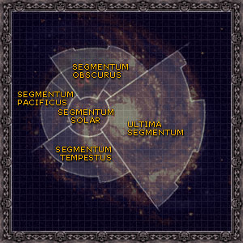

<!-- A0855-B0027 -->

原译文

Segmentums of the Galaxy 银河星域

**校订译文**

Segmentums of the Galaxy 银河星域

<!-- /A0855-B0027 -->

<!-- A0855-B0028 -->

原译文

Segmentum Solar 太阳星域

**校订译文**

Segmentum Solar 太阳星域

<!-- /A0855-B0028 -->

<!-- A0855-B0029 -->

原译文

Ultima Segmentum 极限星域

**校订译文**

Ultima Segmentum 极限星域

<!-- /A0855-B0029 -->

<!-- A0855-B0030 -->

原译文

Segmentum Tempestus 暴风星域

**校订译文**

Segmentum Tempestus 暴风星域

<!-- /A0855-B0030 -->

<!-- A0855-B0031 -->

原译文

Segmentum Pacificus 太平星域

**校订译文**

Segmentum Pacificus 太平星域

<!-- /A0855-B0031 -->

<!-- A0855-B0032 -->

原译文

Segmentum Obscurus 朦胧星域

**校订译文**

Segmentum Obscurus 朦胧星域

<!-- /A0855-B0032 -->

<!-- A0855-B0033 -->
**英文原文**

Space is then further divided into Sectors, which typically cover seven million cubic light years equivalent a cube with sides almost 200 light years long; Sub-sectors, which usually comprise between two and eight star systems within a ten light year radius; and systems. Imperial planets are categorised into several broad classes according to their function, type of civilisation and technological level.

<!-- /A0855-B0033 -->

<!-- A0855-B0034 -->

原译文

然后，空间被进一步划分为星区，星区通常覆盖700万立方光年，相当于边长近200光年的立方体；分区，通常包括十光年半径内的两到八个恒星系统；以及星系。帝国行星根据其功能、文明类型和技术水平分为几个大类。

**校订译文**

星域再细分为星区、次星区和星系。星区的典型体积约为七百万立方光年，相当于边长接近200光年的立方体；次星区通常包含半径十光年内的两至八个恒星系统。帝国又依功能、文明形态和技术水平，将所属行星划分为若干大类。

**校注：** 700万立方光年与边长“接近”200光年均见原文；不是把边长200的精确立方算成700万。

<!-- /A0855-B0034 -->

<!-- A0855-B0035 图片 -->
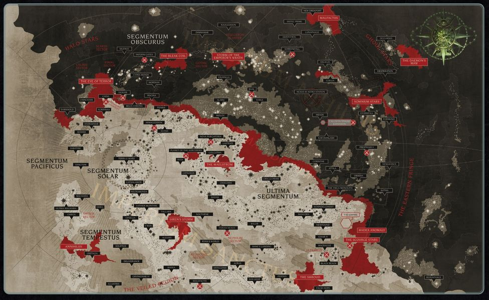

<!-- A0855-B0036 -->

原译文

Current situation for the Imperium 帝国当前情况

**校订译文**

Current situation for the Imperium 帝国当前情况

<!-- /A0855-B0036 -->

<!-- A0855-B0037 -->
**英文原文**

There remain vast areas, in fact the majority of the stars in the Galaxy, that are unexplored, uninhabited, inaccessible by the Warp, or are controlled by alien empires. These areas are known by various names including wilderness space or wilderness zones. By far a greater majority of habitable worlds exist outside the borders of Imperial civilization than within.

<!-- /A0855-B0037 -->

<!-- A0855-B0038 -->

原译文

事实上，银河系中的大多数恒星仍然有广阔的区域，这些区域尚未被探索、无人居住、亚空间无法进入，或者被外星帝国控制。这些地区有各种各样的名字，包括荒野空间或荒野地带。到目前为止，大多数可居住的世界都存在于帝国文明的边界之外，而不是内部。

**校订译文**

银河仍有极为广阔的区域——实际上囊括了大多数恒星——尚未探索、无人居住、无法经亚空间抵达，或被异形帝国控制。这些区域有许多称呼，例如荒野空域、荒野地带。位于帝国文明边界之外的宜居世界，远比边界之内的更多。

<!-- /A0855-B0038 -->

<!-- A0855-B0039 图片 -->
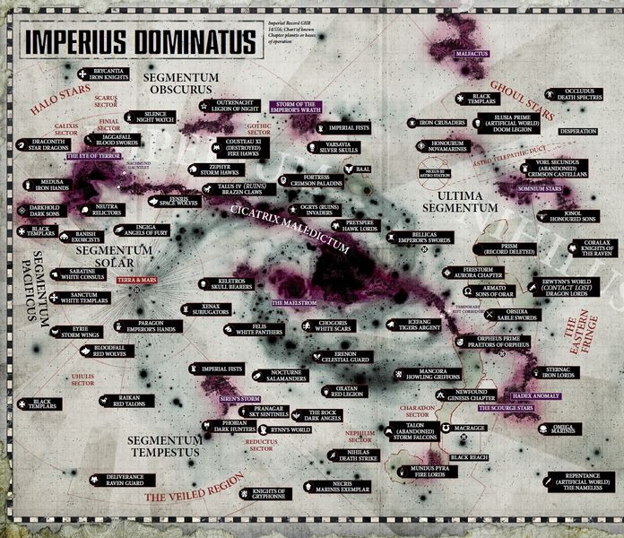

<!-- A0855-B0040 -->

原译文

Space Marine Deployments 星际战士部署

**校订译文**

Space Marine Deployments 星际战士部署

<!-- /A0855-B0040 -->

<!-- A0855-B0041 -->
**英文原文**

The Fringes surround the galaxy and are outside the light of the Astronomican and so beyond easy reach of the Imperium. They are known to contain human planets settled in ancient times as well as many alien worlds. The Eastern Fringe is the largest fringe area located to the far galactic east boarding the Ultima Segmentum.

<!-- /A0855-B0041 -->

<!-- A0855-B0042 -->

原译文

边缘环绕着银河系，位于星炬之光之外，因此帝国无法轻易触及。众所周知，它们包含古代定居的人类行星以及许多异型世界。东部边缘是位于银河系远东，极限星域的最大边缘区域。

**校订译文**

银河边缘地带围绕银河外围，超出星炬的照耀范围，因而难以被帝国触及。那里既有古代人类定居的世界，也有众多异形世界。东部边缘位于银河极东侧，与极限星域接壤，是规模最大的边缘区域。

<!-- /A0855-B0042 -->

<!-- A0855-B0043 图片 -->
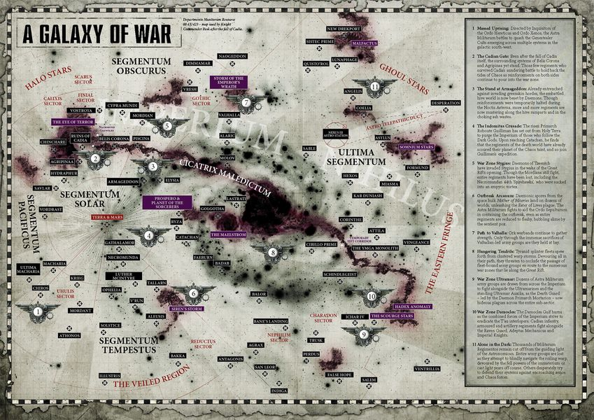

<!-- A0855-B0044 -->

原译文

Imperial Guard Deployments 帝国卫队部署

**校订译文**

Imperial Guard Deployments 帝国卫队部署

<!-- /A0855-B0044 -->

<!-- A0855-B0045 -->
**英文原文**

Beyond the Fringes lie the Halo Stars — very ancient stars ringing the Galaxy, the majority almost extinguished and circled by long-dead worlds.

<!-- /A0855-B0045 -->

<!-- A0855-B0046 -->

原译文

边缘之外是光环星 — 环绕银河系的非常古老的恒星，大多数几乎熄灭，被早已死亡的世界环绕。

**校订译文**

边缘之外分布着光环群星：一圈环绕银河的极古老恒星，其中大多数已近熄灭，周围环绕着早已死寂的世界。

<!-- /A0855-B0046 -->

<!-- A0855-B0047 图片 -->
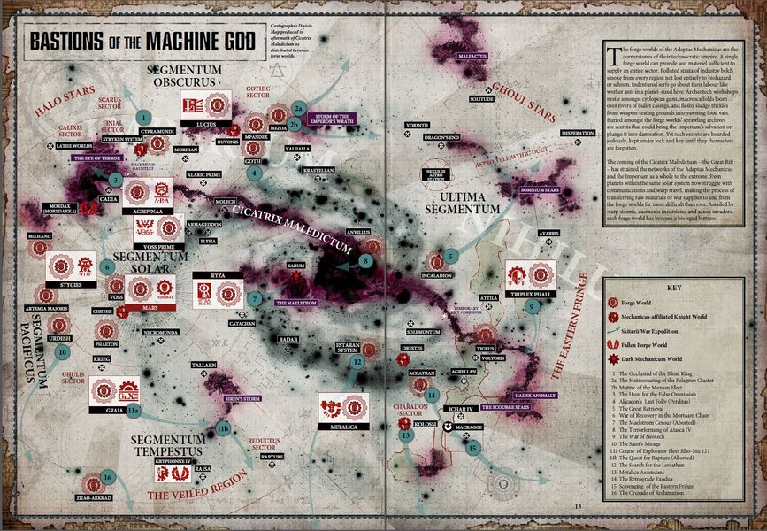

<!-- A0855-B0048 -->

原译文

Adeptus Mechanicus territory across the galaxy 整个银河系的机械神教

**校订译文**

Adeptus Mechanicus territory across the galaxy 机械修会在银河各处的领地

<!-- /A0855-B0048 -->

<!-- A0855-B0049 -->
**英文原文**

The forces of the Imperium are recruited from and posted to defend the many worlds of the Imperium. The immense armies of Imperial Guard are recruited from every single Imperial planet and regiments are shipped across the Galaxy to the frontlines of warzones . The elite Space Marines typically operate from a Chapter Planet, although some Chapters maintain their base on space-bound fleets, space stations or asteroids . The Imperium can also call upon the pious warriors of the Adepta Sororitas, the fleets of the Imperial Navy, and the mighty god-machines of the Collegia Titanica to come to its defense.

<!-- /A0855-B0049 -->

<!-- A0855-B0050 -->

原译文

帝国的军队从帝国的许多世界招募并驻扎，以保卫帝国的许多星球。帝国卫队的庞大军队从每一个帝国星球招募，兵团被运送到银河系的前线。精英星际战士通常在战团星球上作战，尽管有些战团以太空舰队、空间站或小行星为基地。帝国还可以召唤修女会的虔诚战士、帝国海军的舰队和泰坦修会的强大神机来为其防护。

**校订译文**

帝国从各个世界征募军队，又将部队派驻诸世界负责防卫。庞大的帝国卫队从帝国各星球征兵，所属各团随后被运往银河各处的战区前线。精锐的星际战士通常以战团母星为基地；也有一些战团驻扎于巡游舰队、空间站或小行星。帝国还可召集战斗修女会的虔诚战士、帝国海军舰队，以及泰坦修会强大的神之机械，共同保卫疆域。

**校注：** 英文 every single Imperial planet 过于概括，其他篇可能存在征募豁免；本句保留各星球征兵的概述，不延伸为所有世界都无例外。

<!-- /A0855-B0050 -->

<!-- A0855-B0051 图片 -->
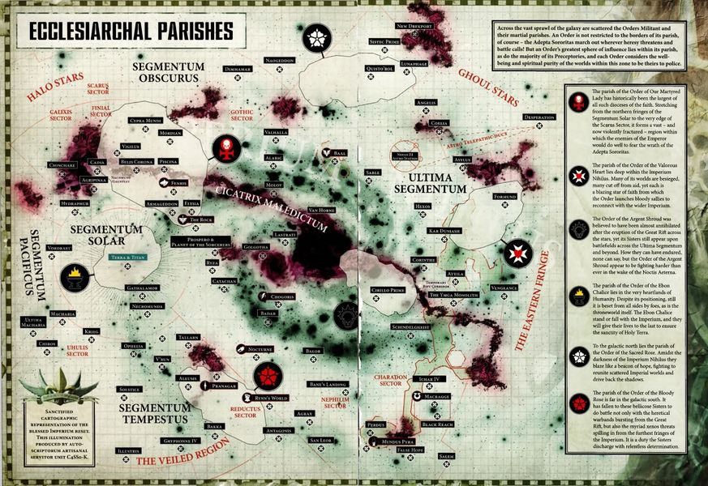

<!-- A0855-B0052 -->

原译文

Ecclesiarchy territory and activity across the galaxy 整个银河系的国教领地

**校订译文**

Ecclesiarchy territory and activity across the galaxy 国教在银河各处的领地与活动

<!-- /A0855-B0052 -->

<!-- A0855-B0053 -->
### Chaos 混沌

<!-- /A0855-B0053 -->

<!-- A0855-B0054 -->
**英文原文**

The forces of Chaos such as the mighty Chaos Space Marine Legions keep hidden lairs within Warp storms, notably the Eye of Terror. Warbands exist on ships hiding in the wilderness zones between Imperial sectors or on hidden bases. The Lost and the Damned can emerge from fallen Imperial forces to plague the Galaxy. Chaos Daemons exist in the Warp but are capable of invading realspace through means such as breaking through the tear in realities opened by the unprotected mind of a psyker, or being ritually summoned by followers of Chaos .

<!-- /A0855-B0054 -->

<!-- A0855-B0055 -->

原译文

混沌力量，如强大的混沌星际战士，在亚空间风暴中隐藏着巢穴，尤其是恐惧之眼。战帮存在于隐藏在帝国区域之间的荒野地带或隐藏基地的船只上。迷失者和被诅咒者可以从堕落的帝国军队中出现，困扰银河系。混沌恶魔存在于亚空间中，但能够通过各种方式入侵现实空间，例如突破由灵能者的无保护思想打开的现实裂隙，或被混沌追随者仪式召唤。

**校订译文**

强大的混沌星际战士军团等势力，把秘密巢穴设在亚空间风暴之中，尤以恐惧之眼为甚。其他战帮栖身于秘密基地，或乘舰藏身帝国星区之间的荒野空域。帝国军队也可能腐化，沦为迷失者与被诅咒者，继续荼毒银河。混沌恶魔原本存在于亚空间，却能通过多种方式进入真实空间：例如利用没有心智防护的灵能者撕开的现实裂口，或接受混沌信徒的仪式召唤。

<!-- /A0855-B0055 -->

<!-- A0855-B0056 图片 -->
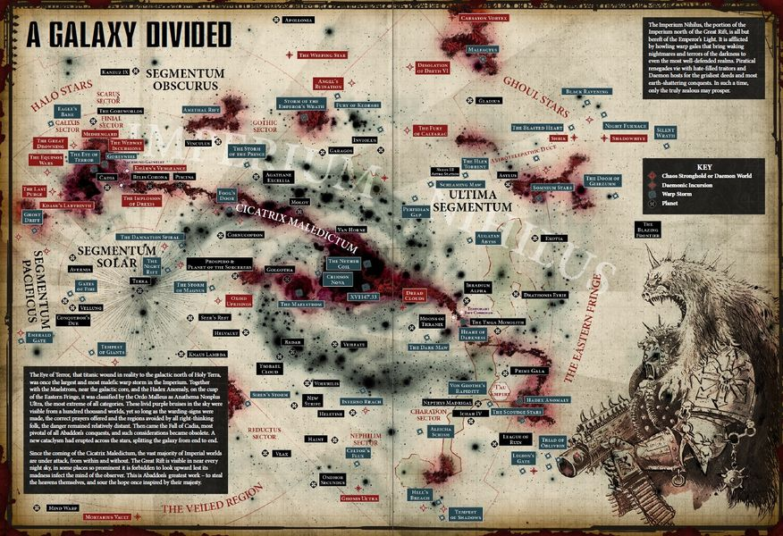

<!-- A0855-B0057 -->

原译文

Chaos Space Marines 混沌星际战士

**校订译文**

Chaos Space Marines 混沌星际战士

<!-- /A0855-B0057 -->

<!-- A0855-B0058 图片 -->
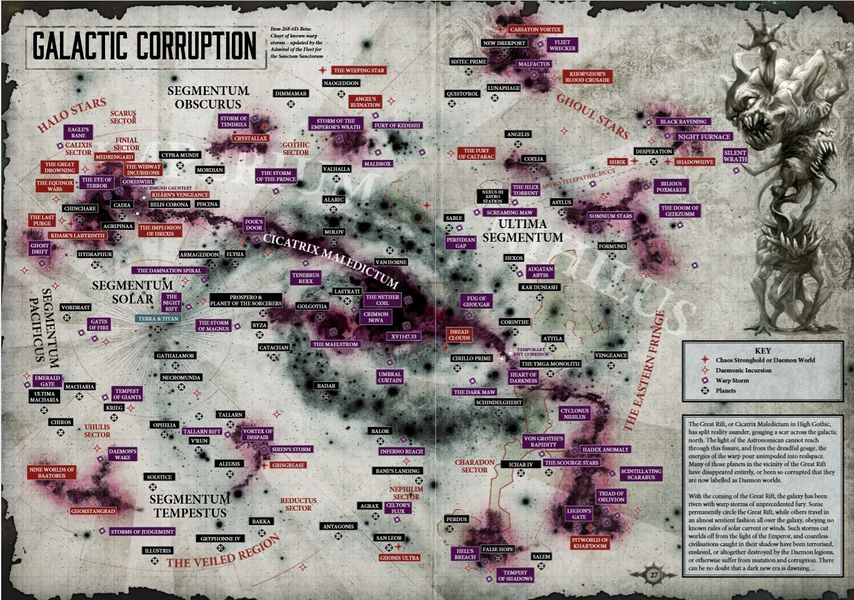

<!-- A0855-B0059 -->

原译文

Daemon Strongholds 恶魔据点

**校订译文**

Daemon Strongholds 恶魔据点

<!-- /A0855-B0059 -->

<!-- A0855-B0060 图片 -->
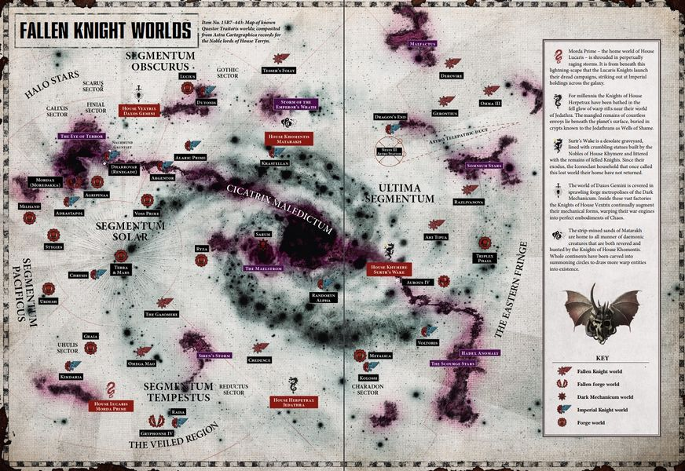

<!-- A0855-B0061 -->

原译文

Chaos Knight Strongholds 混沌骑士据点

**校订译文**

Chaos Knight Strongholds 混沌骑士据点

<!-- /A0855-B0061 -->

<!-- A0855-B0062 -->
### Eldar 灵族

<!-- /A0855-B0062 -->

<!-- A0855-B0063 -->
**英文原文**

The Eldar, whose Empire once spanned the Galaxy, survive mostly on vast ships known as Craftworlds. A Craftworld contains Webway gates which connect to other Craftworlds or to hidden gates throughout the Galaxy, providing a means for their war parties or spacecraft to travel the Galaxy. A minority of Eldar also inhabit Exodite Worlds or Maiden Worlds, wander the Galaxy as Eldar Outcasts or Corsairs, or travel the Webway as part of the Harlequins.

<!-- /A0855-B0063 -->

<!-- A0855-B0064 -->

原译文

灵族的帝国曾经横跨银河系，他们主要依靠被称为“方舟世界”的巨大船只生存。方舟世界包含网道门，可以连接到其他方舟世界或整个银河系的隐藏门，为他们的战党或宇宙飞船提供在银河系航行的手段。少数灵族也居住在蛮荒世界或未开发世界，作为灵族放逐者或海盗在银河系漫步，或者作为丑角的一部分在网道航行。

**校订译文**

灵族帝国曾经横跨银河，如今大部分幸存者居住在称为方舟世界的巨型舰船上。方舟内部的网道之门连向其他方舟，或银河各处的隐秘门户，使战斗部队与舰船得以通行。少数灵族居住在蛮荒灵族世界或少女世界，也有人作为放逐者、海盗漂泊银河，或加入丑角，在网道中往来。

<!-- /A0855-B0064 -->

<!-- A0855-B0065 图片 -->

<!-- A0855-B0066 -->

原译文

Eldar Activity 灵族活动

**校订译文**

Eldar Activity 灵族活动

<!-- /A0855-B0066 -->

<!-- A0855-B0067 -->
### Dark Eldar 黑暗灵族

<!-- /A0855-B0067 -->

<!-- A0855-B0068 -->
**英文原文**

The Dark Eldar live in Commorragh, a city located within the labyrinth of the Webway, with hidden Webway gates leading to points all across the Galaxy, allowing them to emerge and strike from seemingly nowhere and vanish again before any significant resistance can be mobilised.

<!-- /A0855-B0068 -->

<!-- A0855-B0069 -->

原译文

黑暗灵族居住在科摩罗，这是一个位于网道迷宫中的城市，隐藏的网道大门通往整个银河系的各个地点，让他们能够出现并从看似无处发起攻击，并在任何重大抵抗被动员之前再次消失。

**校订译文**

黑暗灵族居住在网道迷宫中的科摩罗。隐秘的网道之门通向银河各处，让他们仿佛凭空出现，突袭目标，又在敌人组织起有效抵抗之前消失。

<!-- /A0855-B0069 -->

<!-- A0855-B0070 图片 -->

<!-- A0855-B0071 -->

原译文

Dark Eldar Activity 黑暗灵族活动

**校订译文**

Dark Eldar Activity 黑暗灵族活动

<!-- /A0855-B0071 -->

<!-- A0855-B0072 -->
### Necrons 太空死灵

原题：Necrons 死灵

<!-- /A0855-B0072 -->

<!-- A0855-B0073 -->
**英文原文**

Necrons are scattered all throughout the galaxy, awakening from Tomb Worlds where they were buried in stasis for centuries. They are finding the Galaxy a changed place, infested with younger races to be harvested.

<!-- /A0855-B0073 -->

<!-- A0855-B0074 -->

原译文

死灵散布在整个银河系，从墓穴世界中醒来，在那里他们被埋葬了几个世纪。他们发现银河系是一个变化的地方，到处都是年轻的种族。

**校订译文**

太空死灵散布全银河，正从以静滞状态长久沉眠的墓穴世界中苏醒。他们发现银河已经改变，处处挤满了等待收割的年轻种族。

**校注：** 英文 centuries（数世纪）与前文古老大休眠的时间尺度不一致，正文概括为长久沉眠，具体年代待核；补回 to be harvested 的敌对视角。

<!-- /A0855-B0074 -->

<!-- A0855-B0075 图片 -->
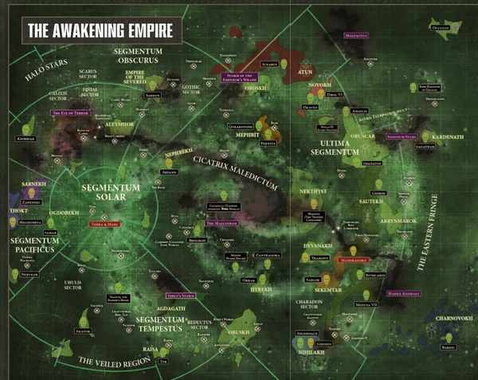

<!-- A0855-B0076 -->

原译文

Necron Activity 死灵活动

**校订译文**

Necron Activity 太空死灵活动

<!-- /A0855-B0076 -->

<!-- A0855-B0077 -->
### Orks 欧克蛮人

原题：Orks 欧克

<!-- /A0855-B0077 -->

<!-- A0855-B0078 -->
**英文原文**

Orks are spread everywhere throughout the Galaxy, in fact possibly outnumbering every other race. However due to their aggressive and warlike nature, the Ork race wars amongst itself and is split into hundreds of tiny empires. Only when a great Waaagh! is called do an uncountable number of Orks unite and channel their need for battle towards conquering planets, systems and other races.

<!-- /A0855-B0078 -->

<!-- A0855-B0079 -->

原译文

欧克遍布整个银河系，事实上，它们的数量可能超过其他所有种族。然而，由于他们的侵略性和好战性，欧克种族之间发生了战争，并分裂成数百个小帝国。只有当一个巨大的Waaagh！将无数的兽人联合起来，将他们的战斗需求引向征服行星、星系和其他种族。

**校订译文**

欧克遍布银河，数量甚至可能超过其他所有种族。但它们极富侵略性、好战成性，内斗不断，分裂为数百个小帝国。只有强大的Waaagh!兴起时，无数欧克才会联合，将战斗欲望转向征服行星、星系及其他种族。

<!-- /A0855-B0079 -->

<!-- A0855-B0080 图片 -->
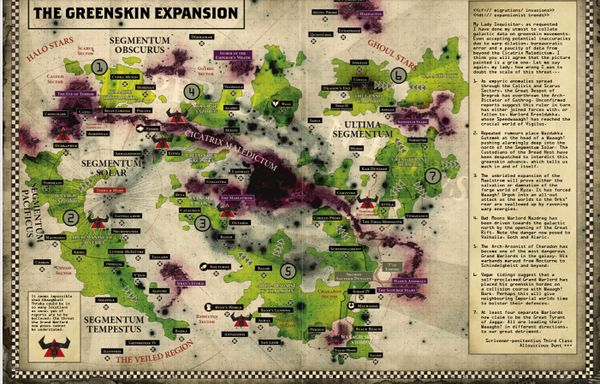

<!-- A0855-B0081 -->

原译文

Primary Ork Domains 主要欧克区域

**校订译文**

Primary Ork Domains 主要欧克区域

<!-- /A0855-B0081 -->

<!-- A0855-B0082 -->
### Tau 钛族

原题：Tau 钛

<!-- /A0855-B0082 -->

<!-- A0855-B0083 -->
**英文原文**

The Tau control an upstart Empire located near the Eastern Fringe and are now expanding across the galaxy thanks to the Startide Nexus, bringing them into conflict with the Imperium and other races.

<!-- /A0855-B0083 -->

<!-- A0855-B0084 -->

原译文

钛控制着一个位于东部边缘附近的新兴帝国，现在由于星潮枢纽的存在，他们正在整个银河系扩张，这使他们与帝国和其他种族发生冲突。

**校订译文**

钛族在东部边缘附近建立起一个新兴帝国，如今又借助星潮枢纽向银河各处扩张，因此与帝国及其他种族发生冲突。

<!-- /A0855-B0084 -->

<!-- A0855-B0085 图片 -->
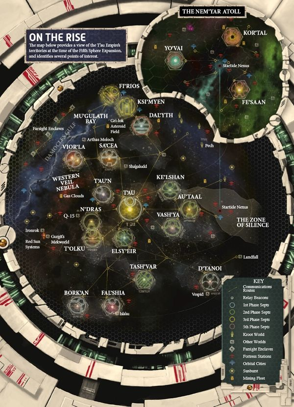

<!-- A0855-B0086 -->

原译文

Tau Planets 钛行星

**校订译文**

Tau Planets 钛族行星

<!-- /A0855-B0086 -->

<!-- A0855-B0087 -->
### Tyranids 泰伦虫族

原题：Tyranids 泰伦

<!-- /A0855-B0087 -->

<!-- A0855-B0088 -->
**英文原文**

The Tyranids are invading the Galaxy from beyond its borders, the majority of Hive Fleets having attacked from the Eastern Fringe. Though new Hive Fleets are emerging from the galactic north and south, most notably Hive Fleet Leviathan. Tyranid forces also include deadly Genestealer Cults.

<!-- /A0855-B0088 -->

<!-- A0855-B0089 -->

原译文

泰伦正从银河系的边界之外入侵银河系，大多数虫巢舰队都是从东部边缘进攻的。尽管新的虫巢舰队正从银河系的北部和南部出现，最著名的是虫巢舰队利维坦。泰伦势力还包括致命的基因窃取者教派。

**校订译文**

泰伦正从银河之外入侵，大多数虫巢舰队由东部边缘发起进攻。新的舰队也开始出现在银河北部与南部，其中最引人注目的是利维坦虫巢舰队。泰伦势力还包括致命的基因窃取者教派。

<!-- /A0855-B0089 -->

<!-- A0855-B0090 图片 -->
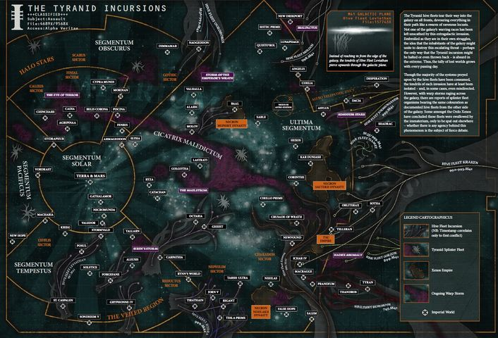

<!-- A0855-B0091 -->

原译文

Tyranid Incursions 泰伦入侵

**校订译文**

Tyranid Incursions 泰伦入侵

<!-- /A0855-B0091 -->

<!-- A0855-B0092 图片 -->
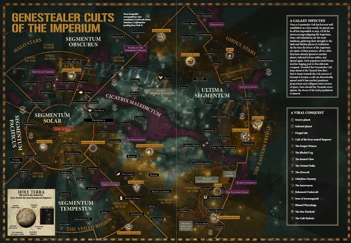

<!-- A0855-B0093 -->

原译文

Genestealer Cult forces 基因窃取者教派部队

**校订译文**

Genestealer Cult forces 基因窃取者教派部队

<!-- /A0855-B0093 -->

<!-- A0855-B0094 -->
### Leagues of Votann 沃坦联盟

<!-- /A0855-B0094 -->

<!-- A0855-B0095 -->
**英文原文**

The Kin are an Abhuman race likely originating from pre-Imperial Terra which settled the Galactic Core in the distant past. Largely keeping to themselves within their fabulously wealthy realm, the Great Rift has finally forced them to come into frequent contact with other civilizations.

<!-- /A0855-B0095 -->

<!-- A0855-B0096 -->

原译文

炉裔是一个亚人种族，可能起源于遥远的过去定居在银河系核心的前帝国时代。在很大程度上，在他们极为富庶的领地内，大多时候都独善其身，然而大裂隙的出现最终迫使他们频繁地与其他文明接触。

**校订译文**

炉裔是一支亚人种族，很可能源自帝国建立之前的泰拉，并在遥远的过去定居于银心地区。他们大多在极为富庶的疆域内自成一体；大裂隙的出现终于迫使他们频繁接触其他文明。

**校注：** 源自帝国前泰拉与后来定居银心为两个信息，原译漏掉泰拉并错接句法。

<!-- /A0855-B0096 -->

<!-- A0855-B0097 图片 -->
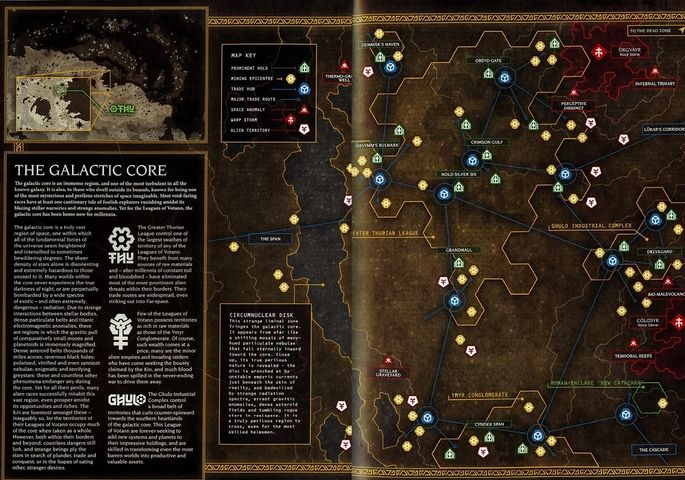

<!-- A0855-B0098 -->

原译文

Some of the Leagues of Votann holdings in the Galactic Core 沃坦联盟在银河系核心的一些资产

**校订译文**

Some of the Leagues of Votann holdings in the Galactic Core 沃坦联盟在银心地区的部分领地

<!-- /A0855-B0098 -->

<!-- A0855-B0099 -->
### Other Civilizations 其他文明

<!-- /A0855-B0099 -->

<!-- A0855-B0100 -->
**英文原文**

The Ulumeathic League, Church of Dracolith, Draxian Hegemony, and Reek Worldweave are other emerging alien empires which are beginning to challenge the might of the Imperium while Hrud migrations are a constant bane to any civilization.

<!-- /A0855-B0100 -->

<!-- A0855-B0101 -->

原译文

乌卢梅亚蒂克联盟、龙石教会、德拉西安霸权和瑞克世界编织者是其他新兴的外星帝国，它们开始挑战帝国的力量，而赫鲁德迁移是任何文明的持续祸害。

**校订译文**

乌卢梅亚蒂克联盟、龙石教会、德拉西安霸权与瑞克世界织网等新兴异形帝国，正开始挑战人类帝国的权势。与此同时，赫鲁德迁徙对任何文明而言都是持续不断的灾祸。

<!-- /A0855-B0101 -->

<!-- A0855-B0102 -->
**英文原文**

The Slaugth sport extremely advanced technology, even compared to the Eldar, and are currently infiltrating the Calixis Sector. They are able to disguise as humans, but most of the time they use human agents, bribed or threatened into service. Their long-term goal is to gain political influence and then to conquer the Calixis Sector by military means. Then they could openly feast on the human populations there.

<!-- /A0855-B0102 -->

<!-- A0855-B0103 -->

原译文

与灵族相比，史洛斯人运动技术极其先进，目前正在渗透到卡利西斯星区。他们能够伪装成人类，但大多数时候他们使用人类代理人，贿赂或威胁服役。他们的长期目标是获得政治影响力，然后通过军事手段征服卡利西斯星区。然后，他们可以公开地享用那里的人口。

**校订译文**

史洛斯的技术极为先进，甚至足以与灵族相比，目前正渗透卡利西斯星区。它们能够伪装成人类，但更常使用受贿或被威胁的人类代理人。其长期目标是先获取政治影响力，再以武力征服整个星区，从而可以公然吞食那里的人类居民。

**校注：** sport 表示拥有，不是“运动技术”。

<!-- /A0855-B0103 -->

<!-- A0855-B0104 -->
**英文原文**

There are dozens, if not hundreds of minor alien civilizations in the Galaxy.

<!-- /A0855-B0104 -->

<!-- A0855-B0105 -->

原译文

银河系中存在数十个，甚至数百个小型外星文明。

**校订译文**

银河中还存在数十个、甚至数百个规模较小的异形文明。

<!-- /A0855-B0105 -->

<!-- A0855-B0106 -->
## Galactic travel 银河航行

<!-- /A0855-B0106 -->

<!-- A0855-B0107 -->
**英文原文**

Inter-stellar travel around the galaxy is dependent on Warp jumps, a form of faster-than-light travel by means of entering the warp, a parallel psychic dimension, and re-emerging to a new location in real space light years away from the starting position.

<!-- /A0855-B0107 -->

<!-- A0855-B0108 -->

原译文

恒星间围绕银河系的航行依赖于亚空间跳跃，这是一种比光速更快的航行形式，通过进入亚空间（一个平行的精神维度），并重新出现在距离起始位置光年远的现实空间中的新位置。

**校订译文**

银河内的星际航行依赖亚空间跳跃：舰船进入平行的灵能维度——亚空间——再于数光年之外重返真实空间，从而实现超光速旅行。

<!-- /A0855-B0108 -->

<!-- A0855-B0109 -->
## Other galaxies 其他河系

<!-- /A0855-B0109 -->

<!-- A0855-B0110 -->
**英文原文**

The distances between galaxies are so vast as to make inter-galactic travel unfeasible even with advanced warp jumps. Being thrown drastically off-course by a Warp storm can result in emerging outside of the galaxy, or stepping through an ancient portal of the Webway.

<!-- /A0855-B0110 -->

<!-- A0855-B0111 -->

原译文

河系之间的距离如此之大，以至于即使有先进的亚空间跳跃，河系间的航行也不可行。被亚空间风暴彻底偏离轨道可能会导致出现在河系之外，或者穿过网道的古老门户。

**校订译文**

银河与其他河系之间的距离极为遥远，即使利用先进的亚空间跳跃技术，也难以进行常规跨河系航行。不过，亚空间风暴若把舰船吹得严重偏航，可能使其在银河之外现身；穿过某些古老网道门户，也可能抵达银河以外。

**校注：** 末句原文并列结构有缺陷；严重偏航与穿越网道门户是可能离开银河的两种途径，非风暴导致穿越门户。

<!-- /A0855-B0111 -->

<!-- A0855-B0112 -->
**英文原文**

The Imperium has no established presence outside the galaxy. Although, it is known that alien life exists out there - the Tyranids come from somewhere beyond the galaxy.

<!-- /A0855-B0112 -->

<!-- A0855-B0113 -->

原译文

帝国在银河系外没有既定的存在。虽然，众所周知，外星生命存在于那里——泰伦来自银河系以外的某个地方。

**校订译文**

帝国在银河之外没有已经建立的据点。但那里显然存在异星生命，泰伦就来自银河之外。

<!-- /A0855-B0113 -->

<!-- A0855-B0114 -->
## Trivia 琐事

<!-- /A0855-B0114 -->

<!-- A0855-B0115 -->
**英文原文**

It appears to be inspired by the real life Milky Way galaxy, as it shares the same shape of a spiral and the same location of Earth (Terra) as the real Milky Way galaxy, as well as the same general configuration of planets and moons in the Solar/Sol system. Additionally, the real-life star Proxima Centauri has been referenced in in-universe material. However, the majority of official depictions do not have the central galactic bar that the real Milky Way is thought to have, nor the same number of arms.

<!-- /A0855-B0115 -->

<!-- A0855-B0116 -->

原译文

它似乎受到了现实银河系的启发，因为它与现实银河系具有相同的螺旋形状和相同的地球（泰拉）位置，以及太阳/太阳系中行星和卫星的一般配置。此外，现实生活中的比邻星在宇宙内的相关资料中曾被提及。然而，大多数官方描绘中既没有现实中银河系被认为所拥有的中央银棒结构，旋臂的数量也与现实中的银河系不同。

**校订译文**

这一设定似乎以现实中的银河系为基础：二者都呈螺旋形，地球（泰拉）的位置，以及太阳系内行星与卫星的大致排列，也彼此对应。世界观资料中还提到过现实存在的比邻星。不过，按底稿的观察，多数官方银河图并未画出通常认为现实银河具有的中央棒状结构，旋臂数量也并不相同。

<!-- /A0855-B0116 -->

本篇核心术语与暂定项

以下列出本篇出现的英文原形及核心术语表用词。同形词可能指不同对象，具体词义以本篇正文和校注为准；单复数、别名和仅见于图注的名称可能尚未列入。完整候选见[术语表](../../术语表/双语术语候选.csv)。

| 英文 | 采用中文 | 状态 |
| --- | --- | --- |
| Space Marines | 星际战士 | 官方已核对 |
| Adepta Sororitas | 修女会 | 官方已核对 |
| Imperial Guard | 帝国卫队 | 暂定·语境区分 |
| Chaos Daemons | 混沌恶魔 | 官方已核对 |
| Eldar | 灵族 | 暂定·语境区分 |
| Dark Eldar | 黑暗灵族 | 暂定·旧称对应 |
| Tyranids | 泰伦虫族 | 官方已核对 |
| Genestealer Cults | 基因窃取者教派 | 官方已核对 |
| Necrons | 太空死灵 | 官方已核对 |
| Orks | 欧克蛮人 | 官方已核对 |
| Psyker | 灵能者 | 官方已核对 |
| Horus Heresy | 荷鲁斯之乱 | 官方已核对 |
| Astronomican | 星炬 | 暂定 |
| Warp | 亚空间 | 官方已核对 |
| Great Rift | 大裂隙 | 官方已核对 |
| Imperium of Man | 人类帝国 | 官方已核对 |
| Imperium | 帝国 | 暂定·简称 |
| Imperial Navy | 帝国海军 | 暂定 |
| Dark Age of Technology | 黑暗科技时代 | 暂定 |
| Faster-Than-Light | 超光速航行 | 暂定 |
| Webway | 网道 | 暂定 |
| The Lost and the Damned | 迷失者与被诅咒者 | 暂定 |
| Commorragh | 科摩罗 | 官方已核对 |
| Craftworld | 方舟世界 | 官方已核对 |
| Waaagh! | Waaagh! | 暂定·保留原文 |
| Old Ones | 古圣 | 暂定 |
| Eye of Terror | 恐惧之眼 | 官方已核对 |
| Emperor of Mankind | 人类帝皇 | 暂定 |
| Emperor | 帝皇 | 官方已核对 |
| Abhuman | 亚人 | 暂定·官方待核 |
| Slaanesh | 色孽 | 官方已核对 |
| Exodite | 蛮荒灵族 | 暂定·官方待核 |
| Great Crusade | 大远征 | 暂定·官方待核 |
| Age of Strife | 纷争时代 | 暂定·官方待核 |
| Terra | 泰拉 | 暂定·官方待核 |
| Horus | 荷鲁斯 | 暂定·官方待核 |
| Collegia Titanica | 泰坦修会 | 暂定·官方待核 |
| Navigators | 导航员 | 官方已核对 |
| Ulumeathic League | 乌卢梅亚蒂克联盟 | 暂定·官方待核 |
| Hive Fleet Leviathan | 利维坦虫巢舰队 | 暂定·官方待核 |
| Golden Throne | 黄金王座 | 暂定·官方待核 |
| Ultima Segmentum | 极限星域 | 暂定·官方待核 |
| Segmentum | 星域 | 暂定·官方待核 |
| Sector | 星区 | 暂定·官方待核 |
| Halo Stars | 光环群星 | 暂定·官方待核 |
| Eastern Fringe | 东部边缘 | 暂定·官方待核 |
| War in Heaven | 天堂之战 | 暂定·官方待核 |
| Ancient | 旗手 | 官方已核对 |
| Chaos Space Marine Legions | 混沌星际战士军团 | 暂定·官方待核 |
| The Primarchs | 原体 | 暂定·官方待核 |
| Sol | 太阳系 | 暂定·官方待核 |
| Space Marine | 星际战士 | 暂定·官方待核 |
| Chapter | 战团 | 暂定·官方待核 |
| Dominion | 主天使 | 暂定·官方待核 |
| Risen | 赦天使 | 暂定·官方待核 |
| Xenos | 异形 | 暂定·官方待核 |
| Slaugth | 史洛斯 | 暂定·官方待核 |
| Necrontyr | 惧亡者 | 暂定·官方待核 |
| C'tan | 星神 | 暂定·官方待核 |
| Szarekh | 斯扎拉克 | 暂定·官方待核 |
| Hrud | 赫鲁德 | 暂定·官方待核 |
| Reek | 瑞克 | 暂定·官方待核 |
| Maiden Worlds | 少女世界 | 暂定·官方待核 |
| Startide Nexus | 星潮枢纽 | 暂定·官方待核 |
| Great Sleep | 大休眠 | 暂定·官方待核 |
| The Dark | 《黑暗》 | 暂定·官方待核 |
| Warp Storm | 亚空间风暴 | 暂定·官方待核 |
| Real Space | 现实空间 | 暂定·官方待核 |
| Wilderness Space | 荒野空域 | 暂定·官方待核 |
| System | 星系（恒星系统） | 暂定·官方待核 |
| Milky Way Galaxy | 银河系 | 暂定·官方待核 |
| Exodite Worlds | 蛮荒灵族世界 | 暂定·官方待核 |
| Kin | 炉裔 | 暂定·官方待核 |
| Galactic Core | 银心 | 暂定·官方待核 |
| Church of Dracolith | 龙石教会 | 暂定·官方待核 |
| Draxian Hegemony | 德拉西安霸权 | 暂定·官方待核 |
| Reek Worldweave | 瑞克世界织网 | 暂定·官方待核 |
| Calixis Sector | 卡利西斯星区 | 暂定·官方待核 |
| Proxima Centauri | 比邻星 | 暂定·官方待核 |
| Proxima | 普罗西马 | 暂定·官方待核 |
| Tau Empire | 钛帝国 | 暂定·官方待核 |
| Sol System | 太阳系 | 暂定·官方待核 |

