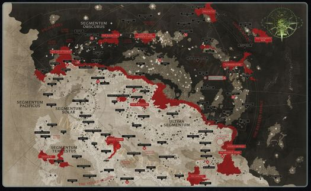

# 0856 帝国圣疆 Imperium Sanctus

精校状态：中文行文已逐段精校，部分术语仍为暂定

分类：地理 / 真实空间 Real Space

原文来源：https://www.bilibili.com/opus/1137179766618587160

原作者：帝国神选罐头

原文时间：2025年11月20日 11:18

[返回分类目录](目录.md) · [全书目录](../../目录.md)

<!-- A0856-B0001 -->
**英文原文**

The Imperium Sanctus is one of the two halves of the Imperium since the formation of the Great Rift, the other being Imperium Nihilus.

<!-- /A0856-B0001 -->

<!-- A0856-B0002 -->

原译文

帝国圣疆是大裂隙形成以来帝国的两半之一，另一半是帝国暗面。

**校订译文**

大裂隙形成后，帝国被分为两部分：帝国圣疆与帝国暗面。

<!-- /A0856-B0002 -->

<!-- A0856-B0003 图片 -->

<!-- A0856-B0004 -->

原译文

Imperium Sanctus, located south of the Great Rift 帝国圣疆，位于大裂隙以南

**校订译文**

Imperium Sanctus, located south of the Great Rift 帝国圣疆，位于大裂隙以南

<!-- /A0856-B0004 -->

<!-- A0856-B0005 -->
## Overview 概述

<!-- /A0856-B0005 -->

<!-- A0856-B0006 -->
**英文原文**

The half of Humanity's domain known as Imperium Sanctus has fared better in the wake of the Great Rift's opening, though this is only speaking comparatively. Consisting of Segmentums Solar, Pacificus, Tempestus, and parts of Ultima and Obscurus, it is within the light of the Astronomican. The strategic situation within Imperium Sanctus is more stable and the forces of the Imperium enforce the Emperor's rule throughout it. Despite this, it still suffers from dangerous Warp travel and the inefficient bureaucracy characteristic of the Imperium at large. For all its nihilistic misery and soulless oppression, the Imperium Sanctus continues to grind onwards and sends out to reclaim lost worlds and territory on the other side of the Great Rift.

<!-- /A0856-B0006 -->

<!-- A0856-B0007 -->

原译文

在大裂隙打开后，人类被称为帝国圣疆的一半领地表现更好，尽管这只是相对而言的。它由太阳、太平、暴风以及极限和朦胧星域的部分组成，在星炬的范围内。帝国圣疆内的战略形式更加稳定，帝国的部队在整个过程中执行帝皇的统治。尽管如此，它仍然遭受着危险的亚空间航行和整个帝国低效的官僚作风。尽管存在虚无主义的痛苦和无魂的压制，帝国圣疆仍在继续前进，并派出军队夺回大裂隙另一边失落的世界和领土。

**校订译文**

大裂隙开启后，帝国圣疆的处境相对较好，但这只是与另一半疆域相比而言。它包含太阳、太平及暴风星域，以及极限和朦胧星域的一部分，仍处于星炬照耀之下。这里的战略局势较为稳定，帝国军队仍能维持帝皇的统治。不过，亚空间航行依然危机四伏，帝国普遍存在的官僚低效也并未减轻。在绝望的苦难与冷酷的压迫中，帝国圣疆仍艰难运转，并不断派兵穿越大裂隙，试图收复另一侧失落的世界与疆土。

<!-- /A0856-B0007 -->

<!-- A0856-B0008 -->
**英文原文**

The seat of Imperium Sanctus is Terra, capital of Humanity.

<!-- /A0856-B0008 -->

<!-- A0856-B0009 -->

原译文

帝国圣所的所在地是人类的首都泰拉。

**校订译文**

帝国圣疆以人类首都泰拉为统治中心。

**校注：** Imperium Sanctus 是帝国圣疆，不是帝国圣所；与皇宫内部 Sanctum Imperialis 区分。

<!-- /A0856-B0009 -->

本篇核心术语与暂定项

以下列出本篇出现的英文原形及核心术语表用词。同形词可能指不同对象，具体词义以本篇正文和校注为准；单复数、别名和仅见于图注的名称可能尚未列入。完整候选见[术语表](../../术语表/双语术语候选.csv)。

| 英文 | 采用中文 | 状态 |
| --- | --- | --- |
| Astronomican | 星炬 | 暂定 |
| Warp | 亚空间 | 官方已核对 |
| Great Rift | 大裂隙 | 官方已核对 |
| Imperium | 帝国 | 暂定·简称 |
| Emperor | 帝皇 | 官方已核对 |
| Terra | 泰拉 | 暂定·官方待核 |
| Imperium Nihilus | 帝国暗面 | 暂定·官方待核 |
| Imperium Sanctus | 帝国圣疆 | 暂定·官方待核 |
| Obscurus | 朦胧星 | 暂定·官方待核 |
| Sanctus | 圣裁者 | 官方已核对 |

