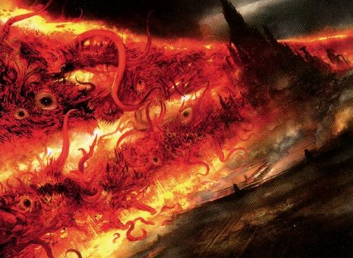
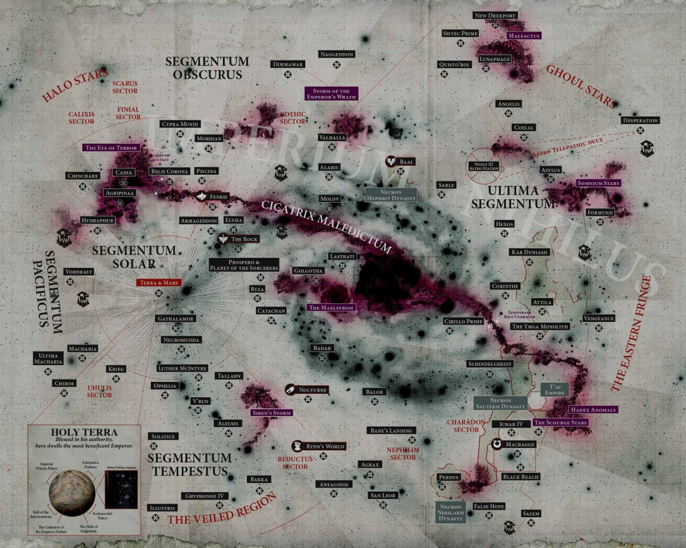

# 0857 大裂隙 Great Rift

精校状态：中文行文已逐段精校，部分术语仍为暂定

分类：地理 / 真实空间 Real Space

原文来源：https://www.bilibili.com/opus/1076691341256163336

原作者：帝国神选罐头

原文时间：2025年06月10日 11:12

[返回分类目录](目录.md) · [全书目录](../../目录.md)

<!-- A0857-B0001 -->
**英文原文**

The Great Rift, known to the Imperium as the Cicatrix Maledictum, is a new chain of catastrophic Warp Rifts that has divided much of the Galaxy.

<!-- /A0857-B0001 -->

<!-- A0857-B0002 -->

原译文

帝国称之为诅咒伤痕的大裂隙是一条新的灾难性亚空间裂隙链，将银河系的大部分地区分开。

**校订译文**

大裂隙是由一连串灾难性的亚空间裂口构成的巨大裂带，横贯银河，将大片区域隔开。帝国也用 Cicatrix Maledictum 这一名称称呼它。

<!-- /A0857-B0002 -->

<!-- A0857-B0003 图片 -->

<!-- A0857-B0004 -->

原译文

The Cicatrix Maledictum consuming a planet 诅咒伤痕吞噬了一颗行星

**校订译文**

The Cicatrix Maledictum consuming a planet 大裂隙吞噬一颗行星

<!-- /A0857-B0004 -->

<!-- A0857-B0005 -->
## Overview 概述

<!-- /A0857-B0005 -->

<!-- A0857-B0006 -->
**英文原文**

This new tear in reality was created at the end of the 41st Millennium during the Thirteenth Black Crusade following the destruction of Cadia. The origins of the Great Rift remain a mystery, with theories ranging from it forming due to the destruction of the Cadian Pylons at the end of the 13th Black Crusade, to sorcery used by Magnus the Red during the Siege of the Fenris System, to the awakening of Ynnead, mass bloodshed in the Damocles Gulf, and the reaction of the Ruinous Powers to the resurrection of Roboute Guilliman. Guilliman speculates that the Rift formed after Abaddon strategically destroyed worlds rich in Blackstone over ten thousand years, with the destruction of Cadia as its trigger. All that is truly known is that its emergence was a figuratively galaxy-shattering event that divided the Imperium in half and ushered in new wars across nearly every world in the Emperor's Empire. In a catastrophic event known as The Blackness, many worlds of the Imperium were cut off and overwhelmed by the Forces of Chaos as Warp Travel and Astropathic communication were rendered nigh-impossible.

<!-- /A0857-B0006 -->

<!-- A0857-B0007 -->

原译文

事实上，这一新的撕裂是在第41个千年结束时，在第十三次黑色远征期间卡迪亚被摧毁后造成的。大裂隙的起源仍然是一个谜，有各种理论，从它是由于第13次黑色远征结束时卡迪安方尖碑的破坏而形成的，到赤红之马格努斯在芬里斯星系围城期间使用的巫术，到伊纳德的觉醒，达摩克利斯湾的大规模流血事件，以及毁灭力量对罗伯特·基里曼复活的反应。基里曼推测，在阿巴顿在一万多年的时间里战略性地摧毁了富含黑石的世界之后，以卡迪亚的毁灭为导火索，形成了裂隙。真正知道的是，它的出现是一个象征性的银河系的毁灭事件，将帝国一分为二，并在帝皇的帝国的几乎每个世界引发了新的战争。在一场名为“黑暗”的灾难性事件中，帝国的许多世界被混沌力量切断并淹没，因为亚空间航行和星语通信几乎不可能实现。

**校订译文**

这道现实裂口形成于第41个千年末、第十三次黑色远征期间，出现在卡迪亚毁灭之后。其具体成因仍不明，众说纷纭：卡迪亚方尖碑被毁、红魔马格努斯在芬里斯星系围攻战中施展巫术、伊纳德苏醒、达摩克利斯湾的大规模流血，以及混沌诸神对罗保特·基里曼复苏的反应，都曾被列为可能因素。基里曼推测，阿巴顿在过去一万年间有计划地摧毁富含黑石的世界，而卡迪亚的毁灭最终触发了大裂隙。可以确定的是，这一事件彻底改变了银河局势，将帝国一分为二，几乎使帝皇治下每个世界都卷入新的战争。在随之而来的“黑暗期”灾难中，亚空间航行与星语通信几乎无法进行，许多帝国世界孤立无援，遭到混沌大军淹没。

**校注：** 各种起源解释与基里曼的推测均非已证实结论。figuratively galaxy-shattering 指影响震撼整个银河，并非天文学意义上银河已物理毁灭。

<!-- /A0857-B0007 -->

<!-- A0857-B0008 -->
**英文原文**

So powerful and far reaching was this Warp Storm, that the very laws of physics have begun to fray and the inconsistencies of time fluctuations, once largely localised to larger storms such as the Eye of Terror, have spread across the entire known galaxy. Since the Great Rift's creation, some worlds have felt centuries go by in an instant, while others have been all but frozen in time and still others have suffered constant temporal shifts.

<!-- /A0857-B0008 -->

<!-- A0857-B0009 -->

原译文

这场亚空间风暴如此强大和深远，以至于物理定律已经开始磨损，时间波动的不一致性，曾经主要局限于更大的风暴，如恐惧之眼，已经蔓延到整个已知的星系。自大裂隙形成以来，一些世界感觉几个世纪转瞬即逝，而另一些世界的时间则几乎被冻结，还有一些世界则经历了不断的时间变化。

**校订译文**

这场风暴威力之强、波及范围之广，甚至使物理法则本身开始失序。原本主要局限于恐惧之眼等巨大风暴附近的时间异常，如今蔓延到整个已知银河。有的世界在一瞬间便经历数百年，有的世界时间几乎凝固，还有的则不断遭遇时间流速的变动。

<!-- /A0857-B0009 -->

<!-- A0857-B0010 -->
**英文原文**

The Great Rift is variously known by the cultures of the galaxy as the Crimson Path, the Mouth of Ruin, the Warpscar, the Dathedian, Gork's Grin and a thousand other names besides. Space Wolves and folks of Fenris named the Great Rift Everdusk. To the Tau, the Great Rift is known as the Mont’yhe’va or "Devourer of Hope", for its stellar storms killed millions of Tau and left many colonies devastated. To the Imperium though, it is the Cicatrix Maledictum, and it appears to those on the western side of Segmentum Solar as a tainted scar across the sky. To those unfortunates on the eastern side of the Segmentum, however, now known as the Dark Imperium, it is far worse.

<!-- /A0857-B0010 -->

<!-- A0857-B0011 -->

原译文

大裂隙在银河系的文化中被称为深红之路、毁灭之口、亚空间之痕、达瑟迪安、搞哥狞笑以及其他一千个名字。太空野狼和芬里斯人将大裂隙命名为“黄昏”。对于钛来说，大裂隙被称为“希望吞噬者”，因为它的群星风暴杀死了数百万钛，并使许多殖民地遭到破坏。然而，对于帝国来说，这是诅咒伤痕，在太阳星域西侧的人看来，它就像天空中一道被污染的疤痕。然而，对于现在被称为黑暗帝国的东部星域的不幸者来说，情况要糟糕得多。

**校订译文**

银河各族为大裂隙取了众多名字，包括深红之路、毁灭之口、亚空间之痕、达瑟迪安与搞哥狞笑。太空野狼及芬里斯人称它为“永暮”。钛族称之为 Mont’yhe’va，意为“希望吞噬者”，因为它引发的星际风暴杀死了数百万钛族，摧毁许多殖民地。帝国则使用 Cicatrix Maledictum 之名。在太阳星域西侧的观测者眼中，它仿佛天空中一道污秽的伤疤；至于被划入黑暗帝国、位于裂隙另一侧的不幸世界，遭遇则更加惨重。

**校注：** 英文前称太阳星域西侧，随后以“该星域东侧”与黑暗帝国等同，地理范围表述不严谨；正文按裂隙两侧关系表述，此处保留待核。Everdusk 的 ever 不可遗漏，暂译永暮，原名黄昏保留于对照。

<!-- /A0857-B0011 -->

<!-- A0857-B0012 -->
**英文原文**

In response to this new catastrophe, the Primarch Roboute Guilliman, now Lord Commander of the Imperium's armies, has launched the Indomitus Crusade. Its aim is to liberate those Imperial worlds that now find themselves embattled by the forces of Chaos, following the Great Rift's creation. The Indomitus Crusade was able to exploit at least one passage through the Great Rift, located near the Eye of Terror in the Nachmund Gauntlet. Some years later, a second route dubbed the Attilan Gate was discovered.

<!-- /A0857-B0012 -->

<!-- A0857-B0013 -->

原译文

为了应对这场新的灾难，现任帝国军队领主指挥官的原体罗伯特·基里曼发动了不屈远征。它的目的是解放那些帝国世界，这些世界在大裂隙形成后，现在发现自己被混沌势力所包围。不屈远征能够利用至少一条穿过大裂隙的通道，该通道位于恐惧之眼附近的纳克蒙德走廊。几年后，第二条被称为阿提兰之门的路线被发现。

**校订译文**

为了应对灾难，出任帝国最高统帅的罗保特·基里曼发起不屈远征，解救大裂隙形成后遭混沌围攻的帝国世界。远征军至少找到了一条穿越裂隙的道路——靠近恐惧之眼的纳克蒙德走廊。数年后，又发现了第二条通路，称为阿提兰之门。

<!-- /A0857-B0013 -->

<!-- A0857-B0014 -->
**英文原文**

Inside the Rift itself, the Gods of Chaos have embarked in an extension of the Great Game, battling one another for supremacy in what has become known as the War in the Rift. According to Mathieu, the Forces of Chaos made a grave mistake by opening the Great Rift, for it is also empowering the Emperor and allowing for his eventual return.

<!-- /A0857-B0014 -->

<!-- A0857-B0015 -->

原译文

在大裂隙内部，混沌诸神已经开始了伟大游戏的延伸，在所谓的大裂隙战争中相互争夺霸权。根据马蒂厄的说法，混沌势力打开大裂隙是一个严重的错误，因为它也赋予了帝皇力量，并允许他最终回归。

**校订译文**

裂隙内部，混沌诸神把伟大游戏延伸到新的战场，相互争夺主导权，这场争斗被称为“裂隙战争”。马蒂厄认为，混沌势力开启大裂隙犯下了严重错误：裂隙也在增强帝皇的力量，使其最终回归成为可能。

**校注：** 帝皇最终回归是马蒂厄的判断，须保留说话者，不作全知旁白定论。

<!-- /A0857-B0015 -->

<!-- A0857-B0016 图片 -->

<!-- A0857-B0017 -->

原译文

map of the Imperium following the creation of the Cicatrix Maledictum, more commonly known as the Great Rift 诅咒伤痕（更常见的名字是大裂隙）形成后的帝国地图

**校订译文**

map of the Imperium following the creation of the Cicatrix Maledictum, more commonly known as the Great Rift 大裂隙形成后的帝国地图

<!-- /A0857-B0017 -->

本篇核心术语与暂定项

以下列出本篇出现的英文原形及核心术语表用词。同形词可能指不同对象，具体词义以本篇正文和校注为准；单复数、别名和仅见于图注的名称可能尚未列入。完整候选见[术语表](../../术语表/双语术语候选.csv)。

| 英文 | 采用中文 | 状态 |
| --- | --- | --- |
| Space Wolves | 太空野狼 | 官方已核对 |
| Roboute Guilliman | 罗保特·基里曼 | 官方已核对 |
| Warp | 亚空间 | 官方已核对 |
| Great Rift | 大裂隙 | 官方已核对 |
| Cicatrix Maledictum | 大裂隙 | 暂定·别名对应 |
| Imperium | 帝国 | 暂定·简称 |
| Indomitus | 不屈学派 | 暂定·学派语境 |
| Eye of Terror | 恐惧之眼 | 官方已核对 |
| Emperor | 帝皇 | 官方已核对 |
| Primarch | 原体 | 官方已核对 |
| Magnus the Red | 红魔马格努斯 | 官方已核对 |
| Dark Imperium | 黑暗帝国 | 暂定·官方待核 |
| Indomitus Crusade | 不屈远征 | 暂定·官方待核 |
| Nachmund Gauntlet | 纳克蒙德走廊 | 暂定·官方待核 |
| Lord Commander of the Imperium | 帝国最高统帅 | 暂定·官方待核 |
| Segmentum Solar | 太阳星域 | 暂定·官方待核 |
| Segmentum | 星域 | 暂定·官方待核 |
| Fenris | 芬里斯 | 暂定·官方待核 |
| Cadia | 卡迪亚 | 暂定·官方待核 |
| Lord Commander | 领主指挥官 | 暂定·官方待核 |
| Powers | 能天使 | 暂定·官方待核 |
| Great Game | 伟大游戏 | 暂定·官方待核 |
| Crimson Path | 深红之路 | 暂定·官方待核 |
| Ruinous Powers | 毁灭诸力 | 暂定·官方待核 |
| Ynnead | 伊纳德 | 官方词根参考·单名待核 |
| Dathedian | 达瑟迪安 | 暂定·官方待核 |
| Gork | 搞哥 | 暂定·官方待核 |
| The Blackness | 黑暗期 | 暂定·官方待核 |
| Pylons | 方尖碑 | 暂定·官方待核 |
| Attilan Gate | 阿提兰之门 | 暂定·官方待核 |
| Mathieu | 马蒂厄 | 暂定·官方待核 |
| The Dark | 《黑暗》 | 暂定·官方待核 |
| Maledictum | 诅咒之印 | 暂定·官方待核 |
| Warp Storm | 亚空间风暴 | 暂定·官方待核 |
| Mouth of Ruin | 毁灭之口 | 暂定·官方待核 |
| Warpscar | 亚空间之痕 | 暂定·官方待核 |
| Gork's Grin | 搞哥狞笑 | 暂定·官方待核 |
| Everdusk | 永暮 | 暂定·官方待核 |
| Mont’yhe’va | 希望吞噬者 | 暂定·官方待核 |
| War in the Rift | 裂隙战争 | 暂定·官方待核 |
| System | 星系（恒星系统） | 暂定·官方待核 |
| Devourer of Hope | 希望吞噬者号 | 暂定·官方待核 |

