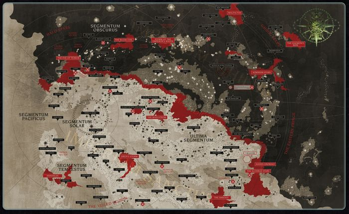

# 0858 帝国暗面 Imperium Nihilus

精校状态：中文行文已逐段精校，部分术语仍为暂定

分类：地理 / 真实空间 Real Space

原文来源：https://www.bilibili.com/opus/1091506453026439225

原作者：帝国神选罐头

原文时间：2025年07月20日 09:22

[返回分类目录](目录.md) · [全书目录](../../目录.md)

<!-- A0858-B0001 -->
**英文原文**

Imperium Nihilus, also known as the Dark Imperium, is a newly formed region of Imperial territory encompassing much of Segmentum Obscurus and Ultima Segmentum.

<!-- /A0858-B0001 -->

<!-- A0858-B0002 -->

原译文

帝国暗面，也称为黑暗帝国，是帝国领土上新形成的地区，包括大部分朦胧星域和极限星域。

**校订译文**

帝国暗面又称黑暗帝国，是大裂隙形成后出现的帝国疆域划分，涵盖朦胧星域与极限星域的大部分地区。

<!-- /A0858-B0002 -->

<!-- A0858-B0003 图片 -->

<!-- A0858-B0004 -->

原译文

Imperium Nihilus, located north of the Great Rift 帝国暗面，位于大裂隙以北

**校订译文**

Imperium Nihilus, located north of the Great Rift 帝国暗面，位于大裂隙以北

<!-- /A0858-B0004 -->

<!-- A0858-B0005 -->
## Overview 概述

<!-- /A0858-B0005 -->

<!-- A0858-B0006 -->
**英文原文**

The Dark Imperium is a region of space that became isolated from the greater Imperium, now known as the Imperium Sanctus, due to the formation of the Great Rift at the end of the Thirteenth Black Crusade. The "Dark Imperium" is aptly named, for here the light of the Astronomican is obscured, travel is extremely dangerous, astropathic communication is difficult, and many enemies of Humanity besiege its remaining isolated worlds. Though Imperium Sanctus suffers from a myriad of problems and threats, they pale in comparison to those of Imperium Nihilus. Chaos fleets and warbands in particular reave with near-impunity, new Daemon Worlds allow for Daemonic armies to roam freely, and many of the isolated Imperial worlds in this blighted region believe themselves the last outpost of mankind. Many of these worlds have essentially seceded from Imperial rule, establishing themselves as petty kingdoms. It is not uncommon for these small palatinates to fall under the sway of Chaos armies. It is doubtful that even Abaddon himself is aware of every such sovereign empire spreading beyond the influence of the Imperium, though rumors are abound that he is guiding them.

<!-- /A0858-B0006 -->

<!-- A0858-B0007 -->

原译文

黑暗帝国是一个空间区域，由于第十三次黑色远征结束时大裂隙的形成，它与现在被称为帝国圣疆的更大帝国隔离开来。“黑暗帝国”的名字很贴切，因为在这里，星炬的光芒被遮蔽，航行极其危险，星语的交流困难，许多人类之敌包围了它剩下的孤立世界。尽管帝国圣疆遭受着无数的问题和威胁，但与帝国暗面相比，它们显得苍白无力。特别是混沌的舰队和战帮几乎不受惩罚地生存，新的恶魔世界允许恶魔军队自由漫游，这个荒凉地区的许多孤立的帝国世界认为自己是人类最后的前哨。这些世界中的许多基本上已经脱离了帝国统治，建立了自己的小型王国。这些小领地落入混沌军队的控制之下并不罕见。令人怀疑的是，即使是阿巴顿本人也不知道每一个这样的主权帝国都在帝国的影响之外扩张，尽管有很多谣言说他正在指导他们。

**校订译文**

第十三次黑色远征结束时，大裂隙使这片疆域与帝国其余部分——如今的帝国圣疆——隔绝。“黑暗帝国”之名可谓名副其实：星炬光芒被遮断，航行极度危险，星语传讯也十分困难，众多人类之敌围攻着残存的孤立世界。帝国圣疆虽也面临无数危机，与这里相比却仍显得轻微。混沌舰队与战帮几乎无人能制，肆意劫掠；新生的恶魔世界又让恶魔大军得以四处出没。许多被隔绝的帝国世界甚至以为，自己已是人类最后的据点。不少世界实际上脱离帝国，成为割据的小王国，而这些小领国又常常落入混沌军队控制。传闻阿巴顿在幕后引导它们，但他是否连每一个脱离帝国掌控的割据政权都知晓，也很值得怀疑。

**校注：** reave 是劫掠，原译“不受惩罚地生存”漏掉军事行动；末句的疑点是阿巴顿是否掌握所有割据政权，而非肯定他一个都不知道。

<!-- /A0858-B0007 -->

<!-- A0858-B0008 -->
**英文原文**

Travel across the Great Rift to the Dark Imperium is said to be difficult to nigh-impossible. A stable route, known as the Nachmund Gauntlet was eventually discovered and is now one of the most strategically vital regions of the Galaxy. Until the Indomitus Crusade, it was not even clear to the Imperium if anything remained alive on the other side of the Rift. Lord Commander Roboute Guilliman has declared one of the aims of the Indomitus Crusade to be the liberation of the stranded worlds within Imperium Nihilus.

<!-- /A0858-B0008 -->

<!-- A0858-B0009 -->

原译文

穿越大裂隙前往黑暗帝国据说是困难的，几乎是不可能的。最终发现了一条被称为纳克蒙德走廊的稳定路线，现在是银河系最具战略意义的地区之一。在不屈远征之前，帝国甚至不清楚裂隙另一边是否还有活着的东西。领主指挥官罗伯特·基里曼宣布，不屈远征的目标之一是解放帝国暗面内被困的世界。

**校订译文**

据说，穿越大裂隙抵达帝国暗面极为困难，几乎不可能。后来，人们发现了稳定通路纳克蒙德走廊，使之成为银河最具战略意义的区域之一。在不屈远征开始前，帝国甚至无法确定裂隙另一侧是否还有生命存在。罗保特·基里曼已将解放帝国暗面受困世界，列为不屈远征的目标之一。

<!-- /A0858-B0009 -->

<!-- A0858-B0010 -->
**英文原文**

The current Regent of Imperium Nihilus as declared by Guilliman himself is Blood Angels Chapter Master Dante. He is currently seeking to transform Baal into the acting capital of Imperium Nihilus.

<!-- /A0858-B0010 -->

<!-- A0858-B0011 -->

原译文

基里曼本人宣布的现任帝国暗面摄政是圣血天使战团长但丁。他目前正试图将巴尔改造成帝国暗面的代理首都。

**校订译文**

基里曼亲自任命圣血天使战团长但丁为帝国暗面摄政。据底稿记载，但丁正致力于使巴尔成为这片疆域的临时首都。

<!-- /A0858-B0011 -->

<!-- A0858-B0012 -->
## Notable Worlds 著名世界

<!-- /A0858-B0012 -->

<!-- A0858-B0013 -->

原译文

Alaric 阿拉里克

**校订译文**

Alaric 阿拉里克

<!-- /A0858-B0013 -->

<!-- A0858-B0014 -->

原译文

Attila 阿提拉

**校订译文**

Attila 阿提拉

<!-- /A0858-B0014 -->

<!-- A0858-B0015 -->

原译文

Baal 巴尔

**校订译文**

Baal 巴尔

<!-- /A0858-B0015 -->

<!-- A0858-B0016 -->

原译文

Cypra Mundi 赛普拉·蒙迪

**校订译文**

Cypra Mundi 塞浦拉·蒙迪

<!-- /A0858-B0016 -->

<!-- A0858-B0017 -->

原译文

Elysium IX 厄琉息斯九号

**校订译文**

Elysium IX 厄琉息斯九号

<!-- /A0858-B0017 -->

<!-- A0858-B0018 -->

原译文

Dimmamar 迪马默

**校订译文**

Dimmamar 迪马默

<!-- /A0858-B0018 -->

<!-- A0858-B0019 -->

原译文

Hasciar 哈西尔

**校订译文**

Hasciar 哈西尔

<!-- /A0858-B0019 -->

<!-- A0858-B0020 -->

原译文

Kanak 卡纳克

**校订译文**

Kanak 卡纳克

<!-- /A0858-B0020 -->

<!-- A0858-B0021 -->

原译文

Kar Duniash 卡尔·杜尼亚什

**校订译文**

Kar Duniash 卡杜尼亚斯

<!-- /A0858-B0021 -->

<!-- A0858-B0022 -->

原译文

Khamun-Sen 卡蒙-森

**校订译文**

Khamun-Sen 卡蒙-森

<!-- /A0858-B0022 -->

<!-- A0858-B0023 -->

原译文

Mordian 莫迪安

**校订译文**

Mordian 莫迪安

<!-- /A0858-B0023 -->

<!-- A0858-B0024 -->

原译文

Nemeton 圣林

**校订译文**

Nemeton 圣林

<!-- /A0858-B0024 -->

<!-- A0858-B0025 -->

原译文

Piscina 皮西纳

**校订译文**

Piscina 皮西纳

<!-- /A0858-B0025 -->

<!-- A0858-B0026 -->

原译文

Valhalla 瓦尔哈拉

**校订译文**

Valhalla 瓦尔哈拉

<!-- /A0858-B0026 -->

<!-- A0858-B0027 -->

原译文

Vigilus 警戒星

**校订译文**

Vigilus 警戒星

<!-- /A0858-B0027 -->

<!-- A0858-B0028 -->

原译文

Vorakis 沃拉基斯

**校订译文**

Vorakis 沃拉基斯

<!-- /A0858-B0028 -->

<!-- A0858-B0029 -->
## Notable Regions 著名区域

<!-- /A0858-B0029 -->

<!-- A0858-B0030 -->

原译文

Gothic Sector 哥特星区

**校订译文**

Gothic Sector 哥特星区

<!-- /A0858-B0030 -->

<!-- A0858-B0031 -->

原译文

Elara's Veil 艾劳拉帷幕

**校订译文**

Elara's Veil 艾拉面纱

<!-- /A0858-B0031 -->

<!-- A0858-B0032 -->

原译文

Eastern Fringe 东部边缘

**校订译文**

Eastern Fringe 东部边缘

<!-- /A0858-B0032 -->

<!-- A0858-B0033 -->

原译文

Halo Stars 光环群星

**校订译文**

Halo Stars 光环群星

<!-- /A0858-B0033 -->

<!-- A0858-B0034 -->

原译文

Ghoul Stars 食尸鬼群星

**校订译文**

Ghoul Stars 食尸鬼群星

<!-- /A0858-B0034 -->

本篇核心术语与暂定项

以下列出本篇出现的英文原形及核心术语表用词。同形词可能指不同对象，具体词义以本篇正文和校注为准；单复数、别名和仅见于图注的名称可能尚未列入。完整候选见[术语表](../../术语表/双语术语候选.csv)。

| 英文 | 采用中文 | 状态 |
| --- | --- | --- |
| Blood Angels | 圣血天使 | 官方已核对 |
| Roboute Guilliman | 罗保特·基里曼 | 官方已核对 |
| Astronomican | 星炬 | 暂定 |
| Great Rift | 大裂隙 | 官方已核对 |
| Imperium | 帝国 | 暂定·简称 |
| Indomitus | 不屈学派 | 暂定·学派语境 |
| Dark Imperium | 黑暗帝国 | 暂定·官方待核 |
| Imperium Nihilus | 帝国暗面 | 暂定·官方待核 |
| Imperium Sanctus | 帝国圣疆 | 暂定·官方待核 |
| Indomitus Crusade | 不屈远征 | 暂定·官方待核 |
| Nachmund Gauntlet | 纳克蒙德走廊 | 暂定·官方待核 |
| Segmentum Obscurus | 朦胧星域 | 暂定·官方待核 |
| Ultima Segmentum | 极限星域 | 暂定·官方待核 |
| Segmentum | 星域 | 暂定·官方待核 |
| Baal | 巴尔 | 暂定·官方待核 |
| Obscurus | 朦胧星 | 暂定·官方待核 |
| Clear | 清明 | 暂定·官方待核 |
| Master | 导师（审判庭职衔）／舰务官（舰员职务） | 语境定译·官方待核 |
| Lord Commander | 领主指挥官 | 暂定·官方待核 |
| Chapter | 战团 | 暂定·官方待核 |
| Chapter Master | 战团长 | 暂定·官方待核 |
| Dante | 但丁 | 暂定·官方待核 |
| Sanctus | 圣裁者 | 官方已核对 |
| The Dark | 《黑暗》 | 暂定·官方待核 |

