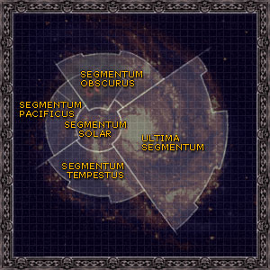

# 0859 星域 Segmentum

精校状态：中文行文已逐段精校，部分术语仍为暂定

分类：地理 / 真实空间 Real Space

原文来源：https://www.bilibili.com/opus/1151363934748409863

原作者：帝国神选罐头

原文时间：2025年12月28日 16:40

[返回分类目录](目录.md) · [全书目录](../../目录.md)

<!-- A0859-B0001 -->
**英文原文**

The space ruled by the Imperium is divided into five fleet zones known as the Segmentae Majoris. The galaxy is such a vast place that it would be unmanageable without this system.

<!-- /A0859-B0001 -->

<!-- A0859-B0002 -->

原译文

帝国统治的空域被分为五个舰队区域，称为主要星域。银河系是一个如此广阔的地方，如果没有这个系统，它将无法管理。

**校订译文**

帝国统治的空域分为五个舰队管辖区，合称五大星域。银河太过辽阔，若无这种分区体系，就难以有效管理。

<!-- /A0859-B0002 -->

<!-- A0859-B0003 图片 -->

<!-- A0859-B0004 -->
## Overview 概述

<!-- /A0859-B0004 -->

<!-- A0859-B0005 -->
**英文原文**

Each Segmentum has its own Imperial Navy and Merchant Fleets, as well as a Segmentum Fortress or Segmentum Naval Base that forms the base of fleet operations within the Segmentum. The Segmentum fleet commanders are known as the Lord High Admirals. The Segmentum Fortress is controlled directly by a high-ranking official of the Administratum known as the Master of the Segmentum.

<!-- /A0859-B0005 -->

<!-- A0859-B0006 -->

原译文

每个星域都有自己的帝国海军和商船舰队，以及一个星域堡垒或星域海军基地，构成星域内舰队行动的基地。星域舰队指挥官被称为领主至高海军上将。星域堡垒由一位被称为星域之主的内务部高级官员直接控制。

**校订译文**

每个星域都有自己的帝国海军与商船舰队，并设有星域堡垒，也称星域海军基地，作为区内舰队的行动中枢。舰队由海军至高上将指挥；星域堡垒则由内政部的一名高级官员直接掌管，其职衔为星域之主。

<!-- /A0859-B0006 -->

<!-- A0859-B0007 -->
**英文原文**

Although intended for purposes of fleet administration and shipping controls, the Segmentae have evolved into administrative divisions of the Adeptus Terra.

<!-- /A0859-B0007 -->

<!-- A0859-B0008 -->

原译文

虽然星域旨在用于舰船管理和航运控制，但它已经演变为中央政务部的行政部门。

**校订译文**

星域最初是为管理舰队、管制航运而划分的，后来逐渐成为中央政务部的行政区划。

**校注：** administrative divisions 为行政区划，不是五个行政部门。

<!-- /A0859-B0008 -->

<!-- A0859-B0009 -->
**英文原文**

The Segmentae Majoris and their fortresses are:

<!-- /A0859-B0009 -->

<!-- A0859-B0010 -->

原译文

主要星域及其堡垒包括：

**校订译文**

五大星域及其堡垒所在地如下：

<!-- /A0859-B0010 -->

<!-- A0859-B0011 -->
**英文原文**

Segmentum Solar - Centre - Mars

<!-- /A0859-B0011 -->

<!-- A0859-B0012 -->

原译文

太阳星域 - 中心 - 火星

**校订译文**

太阳星域——中央；堡垒位于火星。

<!-- /A0859-B0012 -->

<!-- A0859-B0013 -->
**英文原文**

Segmentum Obscurus - North - Cypra Mundi

<!-- /A0859-B0013 -->

<!-- A0859-B0014 -->

原译文

朦胧星域 - 北方 - 凯普拉·蒙迪

**校订译文**

朦胧星域——北部；堡垒位于塞浦拉·蒙迪。

<!-- /A0859-B0014 -->

<!-- A0859-B0015 -->
**英文原文**

Segmentum Pacificus - West - Hydraphur

<!-- /A0859-B0015 -->

<!-- A0859-B0016 -->

原译文

太平星域 - 西方 - 海德拉弗

**校订译文**

太平星域——西部；堡垒位于海德拉弗。

<!-- /A0859-B0016 -->

<!-- A0859-B0017 -->
**英文原文**

Ultima Segmentum - East - Kar Duniash

<!-- /A0859-B0017 -->

<!-- A0859-B0018 -->

原译文

极限星域 - 东方 - 卡尔·杜尼亚施

**校订译文**

极限星域——东部；堡垒位于卡杜尼亚斯。

<!-- /A0859-B0018 -->

<!-- A0859-B0019 -->
**英文原文**

Segmentum Tempestus - South - Bakka

<!-- /A0859-B0019 -->

<!-- A0859-B0020 -->

原译文

暴风星域 - 南方 - 巴卡

**校订译文**

暴风星域——南部；堡垒位于巴卡。

<!-- /A0859-B0020 -->

本篇核心术语与暂定项

以下列出本篇出现的英文原形及核心术语表用词。同形词可能指不同对象，具体词义以本篇正文和校注为准；单复数、别名和仅见于图注的名称可能尚未列入。完整候选见[术语表](../../术语表/双语术语候选.csv)。

| 英文 | 采用中文 | 状态 |
| --- | --- | --- |
| Imperium | 帝国 | 暂定·简称 |
| Imperial Navy | 帝国海军 | 暂定 |
| Administratum | 内政部 | 暂定 |
| Adeptus Terra | 中央政务部 | 暂定 |
| Terra | 泰拉 | 暂定·官方待核 |
| Segmentum Solar | 太阳星域 | 暂定·官方待核 |
| Segmentum Pacificus | 太平星域 | 暂定·官方待核 |
| Segmentum Obscurus | 朦胧星域 | 暂定·官方待核 |
| Segmentum Tempestus | 暴风星域 | 暂定·官方待核 |
| Ultima Segmentum | 极限星域 | 暂定·官方待核 |
| Segmentum | 星域 | 暂定·官方待核 |
| Mars | 火星 | 暂定·官方待核 |
| Bakka | 巴卡 | 暂定·官方待核 |
| Hydraphur | 海德拉弗 | 暂定·官方待核 |
| Cypra Mundi | 塞浦拉·蒙迪 | 暂定·官方待核 |
| Kar Duniash | 卡杜尼亚斯 | 暂定·官方待核 |
| Obscurus | 朦胧星 | 暂定·官方待核 |
| Master | 导师（审判庭职衔）／舰务官（舰员职务） | 语境定译·官方待核 |
| Segmentae Majoris | 五大星域 | 暂定·官方待核 |
| Lord High Admirals | 海军至高上将 | 暂定·官方待核 |
| Master of the Segmentum | 星域之主 | 暂定·官方待核 |
| Segmentum Fortress | 星域堡垒 | 暂定·官方待核 |
| System | 星系（恒星系统） | 暂定·官方待核 |

