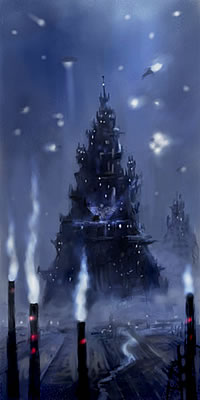

# 0863 巢都世界 Hive World

精校状态：中文行文已逐段精校，部分术语仍为暂定

分类：地理 / 真实空间 Real Space

原文来源：https://www.bilibili.com/opus/1112818166645391378

原作者：帝国神选罐头

原文时间：2025年09月15日 19:42

[返回分类目录](目录.md) · [全书目录](../../目录.md)

<!-- A0863-B0001 -->
**英文原文**

A η-class (eta class) or Hive World is a classification of Imperial world distinguished by vast, continent-spanning cities, often built high into the sky and deep beneath the earth.

<!-- /A0863-B0001 -->

<!-- A0863-B0002 -->

原译文

η级（七级）或巢都世界是帝国世界的一种分类，以广阔的、横跨大陆的城市为特征，这些城市通常建在高空和地下深处。

**校订译文**

巢都世界是帝国的一种行星分类，编号为η类（eta类）。其标志是横跨大陆的巨大城市，往往向上直入云霄，向下深入地底。

**校注：** η 为希腊字母 eta，不是数值等级“七级”。

<!-- /A0863-B0002 -->

<!-- A0863-B0003 图片 -->

<!-- A0863-B0004 -->

原译文

typical Hive City 典型巢都世界

**校订译文**

typical Hive City 典型巢都城市

<!-- /A0863-B0004 -->

<!-- A0863-B0005 -->
## Overview 概述

<!-- /A0863-B0005 -->

<!-- A0863-B0006 -->
**英文原文**

Hive Worlds are estimated to comprise between 10-25% of the total quantity of Imperial planets. The exact number is difficult to establish due to the bureaucratic features of the Imperium itself. The population of every Hive World is enormous, and almost all food needs to be imported. A Hive World rendered temporarily inaccessible through Warp space will suffer a devastating famine within a very short space of time. It will become a vast catacomb of lunatics driven to excesses of anarchic, urban savagery by starvation and claustrophobia. Hive Worlds are dangerous, being too large to monitor safely, and their citizens are typically unbalanced, if not utterly crazed. It has been known for the Adeptus Arbites to cull these planets in order to bring their populations down to manageable levels.

<!-- /A0863-B0006 -->

<!-- A0863-B0007 -->

原译文

巢都世界估计占帝国行星总数的10-25%。由于帝国本身的官僚主义特征，很难确定确切的数字。每个巢都世界的人口都是巨大的，几乎所有的食物都需要进口。通过亚空间空间暂时无法访问的巢都世界将在很短的时间内遭受毁灭性的饥荒。它将成为一个巨大的疯狂驱使的地下墓穴，被饥饿和幽闭恐惧驱使，陷入无政府主义、残暴城市的过度状态。巢都世界是危险的，太大而无法安全监控，他们的公民通常是不平衡的，如果不是完全疯狂的话。众所周知，法务部会宰杀这些行星，以将其种群数量降至可控水平。

**校订译文**

据估计，巢都世界占帝国行星总数的10%至25%，但帝国的官僚体系使准确统计十分困难。每个巢都世界都有极为庞大的人口，几乎全部粮食都需进口。亚空间航路一旦暂时中断，毁灭性饥荒很快便会爆发。饥饿与密闭环境会将居民逼至疯狂，让整座巢都化为无政府暴行肆虐的巨大坟窟。巢都规模过于庞大，难以有效监控；居民常常精神失衡，甚至彻底疯狂。法务部也曾对这类星球的人口进行屠杀式削减，以恢复可控局面。

**校注：** 比例10%—25%与后文32,380个世界未必来自同一统计口径，保留两种英文说法。

<!-- /A0863-B0007 -->

<!-- A0863-B0008 -->
**英文原文**

Hive Worlds have a population far too numerous to be fed or supported on their own, often exceeding a trillion inhabitants on a planet the size of Terra. These planets often have no more natural ground surface left, having become a giant urban agglomeration, with new construction happening on top of old ones. Billions of people can live crowded together in a single Hive city. Each of these Hive Worlders is a potential soldier for Imperial forces, including the Imperial Guard and the Space Marines. Hive Worlds contribute the vast bulk of the recruits for the Imperial Guard. The violent gangland lifestyle which most residents are forced to live means they are already hardened and experienced in warfare. Almost every recruit will already know how to handle a gun. Hive Worlds also serve to populate newly discovered planets. Imperial citizens are gathered from various Hive Worlds (willingly or unwillingly) and shipped off to distant colonies. An example of this would be Medusa V. Hive Worlds have huge import/export ratios, exporting a vast range of materials, and relying on imports of food and water. In common with most other Imperial worlds, Hive World society has distinct classes, with a ruling class and a working class. Invariably the lower classes inhabit the lower and more decayed and polluted levels of the Hive.

<!-- /A0863-B0008 -->

<!-- A0863-B0009 -->

原译文

巢都世界的人口太多，无法独自养活或维持，在一个像泰拉那么大的行星上，通常超过一万亿居民。这些行星通常没有更多的自然地表，已经成为一个巨大的城市群，新的建筑建立在旧的建筑之上。数十亿人可以挤在一个巢都城市里生活。这些巢都世界的人中的每一个都是帝国军队的潜在士兵，包括帝国卫队和星际战士。巢都世界为帝国卫队招募了大量新兵。大多数居民被迫过着暴力的黑帮生活，这意味着他们已经在战争中变得坚强和有经验。几乎每个新兵都已经知道如何处理枪支。巢都世界也用于填充新发现的行星。帝国公民从各个巢都世界（自愿或不自愿）聚集起来，被运往遥远的殖民地。一个例子是美杜莎五号。巢都世界有巨大的进出口比率，出口各种各样的材料，并依赖进口食物和水。与大多数其他帝国世界一样，巢都世界社会有不同的阶级，有统治阶级和工人阶级。下层阶级总是居住在巢都中较低、腐朽和污染程度较高的地方。

**校订译文**

巢都世界人口之多，远超自身供养能力；一颗与泰拉大小相近的行星，居民往往超过一万亿。这类世界常常已无自然地表，整颗行星变成巨大的城市群，新建筑不断叠加在旧建筑之上。单座巢都就可能挤着数十亿人。巢都居民为帝国卫队乃至星际战士提供潜在兵源，其中帝国卫队的大部分新兵都来自巢都。许多人被迫在帮派暴力中求生，早已磨炼得强悍，熟悉战斗，几乎每个新兵都懂得用枪。巢都也为新发现的行星提供殖民人口：帝国从各巢都征集居民，不论自愿与否，都可能将其送往遥远的殖民地，美杜莎五号便是例子。巢都世界进出口规模庞大，输出各类物资，同时依赖外界供应粮食与水。与大多数帝国世界一样，这里的社会分为统治阶级与劳动阶级；越贫穷的人，越只能住在巢都底部腐朽、污染严重的区域。

**校注：** 本文对单颗巢都世界人口作一般描述，后附清单可能远低于此数；不把清单人口强行改成一万亿。

<!-- /A0863-B0009 -->

<!-- A0863-B0010 -->
**英文原文**

There are approximately 32,380 Hive Worlds in the Imperium. Most consist of various enclosed Hive cities or Hive clusters surrounded by wasteland, jungle, ice, plains, etc. In the most extreme examples the Hive World has developed beyond the point of separate Hive clusters - the planet's surface instead is completely urbanised with hundreds of stacked layers of arcologies, covering the entirety of the planet. Holy Terra is an example of this "city-planet". The sheer numbers of workers in a Hive makes them hard to control. Gangs grow up and control sections, fighting among themselves and millions subsists on scraps. Further up power reaches the ancient lighting system, while even further up, air circulation systems clean the air for those rich enough to afford it. It is a hierarchical system, and a ruthless one, but given sufficient forces to keep the populace down, it is a very efficient way of housing billions of people. If each person had a house on the ground, the entire planet would be overrun with living quarters and no room for production facilities.

<!-- /A0863-B0010 -->

<!-- A0863-B0011 -->

原译文

帝国中大约有32380个巢都世界。大多数由各种封闭的巢都城市或巢都群组成，周围环绕着荒地、丛林、冰雪、平原等。在最极端的例子中，巢都世界已经超越了单独的巢都群 — 行星表面完全城市化，有数百层堆叠的穹顶，覆盖了整个行星。神圣泰拉就是这个“城市星球”的一个例子。巢都中工人的绝对数量使他们难以控制。帮派不断壮大，控制着各个地区，相互争斗，数百万人靠残羹剩饭生存。再往上走，电力到达了古老的照明系统，而再往上看，空气循环系统为那些有能力负担得起的人净化空气。这是一个等级制度，也是一个无情的制度，但只要有足够的力量来压制民众，这是一种为数十亿人提供住房的非常有效的方式。如果每个人在地表都有一所房子，整个行星将被生活区淹没，没有生产设施的空间。

**校订译文**

另一项记载称，帝国约有32,380个巢都世界。大多数由若干封闭的巢都或巢都群组成，周围仍有荒原、丛林、冰原或平地。最极端的巢都世界则已超越分散巢都群的形态：整颗行星彻底城市化，覆盖着数百层相互堆叠的巨型综合建筑，神圣泰拉便是这种“城市行星”的例子。工人数量庞大，难以管束，帮派因而割据不同区域，相互争斗，数百万人只能靠残羹剩饭维生。往上几层，古老的照明系统才有电可用；更高处，空气循环系统为负担得起的富人提供洁净空气。这套制度等级森严、冷酷无情，但只要有足够武力压服民众，就能极有效率地容纳数十亿人。若人人都在地面拥有独立住宅，整颗星球都会被住处占满，再无空间安置生产设施。

**校注：** arcologies 为巨型综合建筑体系，不是穹顶；改正建筑形制。

<!-- /A0863-B0011 -->

<!-- A0863-B0012 -->
**英文原文**

Hive Worlds are important due to their output. They don't reach anywhere near the production of a Forge World, but the number of workers give out a huge quantity of materials. Hive Worlders, being just as brutal and savage as those on Feral Worlds also provide the best fighting material to the Imperium.

<!-- /A0863-B0012 -->

<!-- A0863-B0013 -->

原译文

巢都世界因其输出而很重要。他们无法接近铸造世界的生产，但工人的数量会发出大量的材料。巢都世界的人，和蛮荒世界的人一样野蛮，也为帝国提供了最好的战斗材料。

**校订译文**

巢都世界的重要性来自其庞大的产出。虽然生产能力远不及铸造世界，海量工人仍可制造数量惊人的物资。巢都居民又像蛮荒世界居民一样凶悍，为帝国提供了优良兵源。

<!-- /A0863-B0013 -->

<!-- A0863-B0014 -->
### Notable Hive Worlds 著名巢都世界

<!-- /A0863-B0014 -->

<!-- A0863-B0015 -->
**英文原文**

Absolom Reach (former)/Now — Daemon World, also former Desert World

<!-- /A0863-B0015 -->

<!-- A0863-B0016 -->

原译文

阿布索伦河段（前）/现恶魔世界，也是前沙漠世界

**校订译文**

阿布索伦疆域（原巢都世界）／现为恶魔世界；也曾是沙漠世界。

<!-- /A0863-B0016 -->

<!-- A0863-B0017 -->
**英文原文**

Acheron IV/Also — War World; Imperium fought with Orks

<!-- /A0863-B0017 -->

<!-- A0863-B0018 -->

原译文

黄泉四号/也是战争世界；帝国与欧克作战

**校订译文**

黄泉四号/也是战争世界；帝国与欧克作战

<!-- /A0863-B0018 -->

<!-- A0863-B0019 -->
**英文原文**

Aerius (former)/Now - status unknown. Suffered great losses due to the plague.

<!-- /A0863-B0019 -->

<!-- A0863-B0020 -->

原译文

亚瑞乌斯（前）/现状态未知。因瘟疫而遭受巨大损失。

**校订译文**

亚瑞乌斯（前）/现状态未知。因瘟疫而遭受巨大损失。

<!-- /A0863-B0020 -->

<!-- A0863-B0021 -->
**英文原文**

Agrellan (former)/Ultima/Was captured by T'au and renamed to Mu'gulath Bay, then subjected to Exterminatus by Imperium, though part of the Tau population survived.

<!-- /A0863-B0021 -->

<!-- A0863-B0022 -->

原译文

阿格瑞兰（前）/极限星域/被钛占领并更名为穆格拉特湾，然后被帝国释放灭绝令，尽管部分钛人口幸存下来。

**校订译文**

阿格瑞兰（原巢都世界）／极限星域／被钛族占领后改名穆格拉特湾；后来帝国对其执行灭绝令，但部分钛族居民幸存。

<!-- /A0863-B0022 -->

<!-- A0863-B0023 -->
**英文原文**

Algol/18 billion

<!-- /A0863-B0023 -->

<!-- A0863-B0024 -->

原译文

大陵五/180亿

**校订译文**

大陵五/180亿

<!-- /A0863-B0024 -->

<!-- A0863-B0025 -->
**英文原文**

Amarah Prime/Tempestus/Orpheus/Capitoline/Amarah

<!-- /A0863-B0025 -->

<!-- A0863-B0026 -->

原译文

阿玛拉主星/暴风星域/俄耳甫斯星区/卡皮托利尼分区/阿玛拉星系

**校订译文**

阿玛拉主星／暴风星域／俄耳甫斯星区／卡皮托利尼亚次星区／阿玛拉星系

<!-- /A0863-B0026 -->

<!-- A0863-B0027 -->
**英文原文**

Anshur (former)/Status unknown, former Imperium

<!-- /A0863-B0027 -->

<!-- A0863-B0028 -->

原译文

安舒尔（前）/状态未知，前帝国

**校订译文**

安舒尔（前）/状态未知，前帝国

<!-- /A0863-B0028 -->

<!-- A0863-B0029 -->
**英文原文**

Aralan/Aralan

<!-- /A0863-B0029 -->

<!-- A0863-B0030 -->

原译文

阿拉兰/阿拉兰星系

**校订译文**

阿拉兰/阿拉兰星系

<!-- /A0863-B0030 -->

<!-- A0863-B0031 -->

原译文

Arcadia 阿卡迪亚

**校订译文**

Arcadia 阿卡迪亚

<!-- /A0863-B0031 -->

<!-- A0863-B0032 -->
**英文原文**

Archaos/Obscurus/Calixis/Drusus Marches

<!-- /A0863-B0032 -->

<!-- A0863-B0033 -->

原译文

阿契厄斯/朦胧星域/卡利西斯/德鲁苏斯边区

**校订译文**

阿契厄斯/朦胧星域/卡利西斯/德鲁苏斯边区

<!-- /A0863-B0033 -->

<!-- A0863-B0034 -->
**英文原文**

Armageddon/Solar/Armageddon Sector/Armageddon Subsector/Armageddon System

<!-- /A0863-B0034 -->

<!-- A0863-B0035 -->

原译文

阿玛吉多顿/太阳星域/阿玛吉多顿星区/阿玛吉多顿分区/阿玛吉多顿星系

**校订译文**

阿玛吉多顿／太阳星域／阿玛吉多顿星区／阿玛吉多顿次星区／阿玛吉多顿星系

<!-- /A0863-B0035 -->

<!-- A0863-B0036 -->
**英文原文**

Aryand/Now — Necron world

<!-- /A0863-B0036 -->

<!-- A0863-B0037 -->

原译文

雅利安德/现死灵世界

**校订译文**

雅利安德／现为太空死灵世界。

<!-- /A0863-B0037 -->

<!-- A0863-B0038 -->
**英文原文**

Ashek II/Pacificus/Sabbat Worlds/Attacked by Chaos with unknown result

<!-- /A0863-B0038 -->

<!-- A0863-B0039 -->

原译文

阿舍克二号/太平星域/萨巴特世界/被混沌攻击，结果未知

**校订译文**

阿舍克二号/太平星域/萨巴特诸世界/被混沌攻击，结果未知

**校注：** Sabbat 为专名，统一圣萨巴特、萨巴特诸世界及相关远征的词根；原安息日诸世界保留在原译栏，中文暂定。

<!-- /A0863-B0039 -->

<!-- A0863-B0040 -->
**英文原文**

Atoma Prime/Solar/Moebian Domain/90 Billion/Experiencing a Chaos Cult and Traitor Guardsmen uprising and being addressed by Inquisitor Grendyl's retinue.

<!-- /A0863-B0040 -->

<!-- A0863-B0041 -->

原译文

阿托马主星/太阳星域/莫比亚领域/900亿/经历了一场混沌教派和叛徒卫队的叛乱，并由审判官格伦德尔的随从发表讲话。

**校订译文**

阿托马主星／太阳星域／莫比安领／人口900亿／正遭遇混沌教派与叛变帝国卫队发动的起义，由审判官格伦德尔的随员着手处理。

**校注：** being addressed 指叛乱正在被处理，非随员“发表讲话”。

<!-- /A0863-B0041 -->

<!-- A0863-B0042 -->
**英文原文**

Auxilion/Now — Dead World

<!-- /A0863-B0042 -->

<!-- A0863-B0043 -->

原译文

阿斯利恩/现死亡世界

**校订译文**

阿斯利恩/现死寂世界

<!-- /A0863-B0043 -->

<!-- A0863-B0044 -->
**英文原文**

Avalan/Also — War World

<!-- /A0863-B0044 -->

<!-- A0863-B0045 -->

原译文

阿瓦兰/也是战争世界

**校订译文**

阿瓦兰/也是战争世界

<!-- /A0863-B0045 -->

<!-- A0863-B0046 -->
**英文原文**

Avellorn/Solar

<!-- /A0863-B0046 -->

<!-- A0863-B0047 -->

原译文

阿维隆/太阳星域

**校订译文**

阿维隆/太阳星域

<!-- /A0863-B0047 -->

<!-- A0863-B0048 -->
**英文原文**

Badab Primaris/Ultima/Badab Sector/Badab System/5,170,000,000/Former Adeptus Astartes Homeworld (Astral Claws)

<!-- /A0863-B0048 -->

<!-- A0863-B0049 -->

原译文

巴达布主星/极限星域/巴达布星区/巴达布星系/51,7000,0000人/前阿斯塔特修会家园世界（星辰之爪）

**校订译文**

巴达布主星／极限星域／巴达布星区／巴达布星系／人口51.7亿／曾是星辰之爪战团的母星。

<!-- /A0863-B0049 -->

<!-- A0863-B0050 -->

原译文

Bakus III 巴库斯三号

**校订译文**

Bakus III 巴库斯三号

<!-- /A0863-B0050 -->

<!-- A0863-B0051 -->
**英文原文**

Baraspine/Obscurus/Calixis Sector/Adrantis Nebula/Baraspine System/2,000,000,000

<!-- /A0863-B0051 -->

<!-- A0863-B0052 -->

原译文

巴拉斯佩恩/朦胧星域/卡利西斯星区/阿德兰提斯星云/巴拉斯佩恩星系/20,0000,0000人

**校订译文**

巴拉斯佩恩／朦胧星域／卡利西斯星区／阿德兰提斯星云／巴拉斯佩恩星系／人口20亿

<!-- /A0863-B0052 -->

<!-- A0863-B0053 -->
**英文原文**

Belecane/Obscurus/Calixis Sector/Markayn Marches/Belecane System/2,700,000,000Also — Forge World

<!-- /A0863-B0053 -->

<!-- A0863-B0054 -->

原译文

贝勒凯恩/朦胧星域/卡利西斯星区/马尔坎边区/贝勒凯恩星系/27,0000,0000人

**校订译文**

贝勒凯恩／朦胧星域／卡利西斯星区／马尔坎边区／贝勒凯恩星系／人口27亿；也是铸造世界。

**校注：** 补回漏译的 Also — Forge World。

<!-- /A0863-B0054 -->

<!-- A0863-B0055 -->
**英文原文**

Belial/Also — Industrial World

<!-- /A0863-B0055 -->

<!-- A0863-B0056 -->

原译文

彼列/也是工业世界

**校订译文**

彼列/也是工业世界

**校注：** 此处 Belial 为行星，沿原稿彼列；不将黑暗天使人物的官方译名贝利亚套用于同形地名。

<!-- /A0863-B0056 -->

<!-- A0863-B0057 -->
**英文原文**

Beta-Garmon III/Solar/Beta-Garmon Cluster/Alpha-Garmon System/Devastated during the Horus Heresy

<!-- /A0863-B0057 -->

<!-- A0863-B0058 -->

原译文

贝塔-伽蒙三号/太阳星域/贝塔-伽蒙星群/阿尔法-伽蒙星系/在荷鲁斯叛乱期间被摧毁

**校订译文**

贝塔-伽蒙三号／太阳星域／贝塔-伽蒙星群／阿尔法-伽蒙星系／荷鲁斯之乱期间遭到重创。

**校注：** 行星、星群与战役同一地名词根，统一分隔符。 阿尔法-伽蒙与同系列星系名称统一分隔符。

<!-- /A0863-B0058 -->

<!-- A0863-B0059 -->
**英文原文**

Black Reach (Blackreach)/Ultima

<!-- /A0863-B0059 -->

<!-- A0863-B0060 -->

原译文

黑色河段（黑河）/极限星域

**校订译文**

黑域（又作黑河）／极限星域

**校注：** Black Reach 沿既有定译黑色河段并保留黑河别名；本条是行星名，不代表银河中存在一条河。 Black Reach为行星，统一黑域；原稿别名黑色河段取了不适用的地理词义。

<!-- /A0863-B0060 -->

<!-- A0863-B0061 -->
**英文原文**

Bront/Obscurus/Calixis Sector/Golgenna Reach

<!-- /A0863-B0061 -->

<!-- A0863-B0062 -->

原译文

勃朗特/朦胧星域/卡利西斯星区/戈尔根纳河段

**校订译文**

勃朗特／朦胧星域／卡利西斯星区／戈尔根纳疆域

<!-- /A0863-B0062 -->

<!-- A0863-B0063 -->
**英文原文**

Caldera/Also — Death World

<!-- /A0863-B0063 -->

<!-- A0863-B0064 -->

原译文

卡尔德拉/也是死亡世界

**校订译文**

卡尔德拉/也是死亡世界

<!-- /A0863-B0064 -->

<!-- A0863-B0065 -->
**英文原文**

Canopus/Obscurus/Calixis Sector/Josian Reach

<!-- /A0863-B0065 -->

<!-- A0863-B0066 -->

原译文

卡诺帕斯/朦胧星域/卡利西斯星区/约西亚河段

**校订译文**

卡诺帕斯／朦胧星域／卡利西斯星区／约西亚疆域

<!-- /A0863-B0066 -->

<!-- A0863-B0067 -->
**英文原文**

Carcharias/Also — Adeptus Astartes Homeworld (Crimson Consuls)

<!-- /A0863-B0067 -->

<!-- A0863-B0068 -->

原译文

锥齿鲨星/也是阿斯塔特修会家园世界（深红执政官）

**校订译文**

锥齿鲨星/也是阿斯塔特修会家园世界（深红执政官）

<!-- /A0863-B0068 -->

<!-- A0863-B0069 -->
**英文原文**

Chima Lomas/Obscurus

<!-- /A0863-B0069 -->

<!-- A0863-B0070 -->

原译文

基马·洛马斯/朦胧星域

**校订译文**

基马·洛马斯/朦胧星域

<!-- /A0863-B0070 -->

<!-- A0863-B0071 -->
**英文原文**

Clove/Obscurus/Calixis Sector/Hazeroth Abyss

<!-- /A0863-B0071 -->

<!-- A0863-B0072 -->

原译文

丁香星/朦胧星域/卡利西斯星区/哈洗录深渊

**校订译文**

丁香星/朦胧星域/卡利西斯星区/哈冼录深渊

<!-- /A0863-B0072 -->

<!-- A0863-B0073 -->
**英文原文**

Coronis Agathon/Obscurus/120,000,000,000/Also — Fortress World

<!-- /A0863-B0073 -->

<!-- A0863-B0074 -->

原译文

科罗尼斯·阿加松/朦胧星域/1200,0000,0000人/也是堡垒世界

**校订译文**

科罗尼斯·阿加松／朦胧星域／人口1,200亿；也是堡垒世界。

<!-- /A0863-B0074 -->

<!-- A0863-B0075 -->
**英文原文**

Corvus Majoris/Ultima/Corvus Sub-Sector

<!-- /A0863-B0075 -->

<!-- A0863-B0076 -->

原译文

大鸦座/极限星域/乌鸦分区

**校订译文**

大鸦座／极限星域／乌鸦次星区

<!-- /A0863-B0076 -->

<!-- A0863-B0077 -->

原译文

Crixos 克里索斯

**校订译文**

Crixos 克里索斯

<!-- /A0863-B0077 -->

<!-- A0863-B0078 -->
**英文原文**

Cthonia (former)/Solar/Cthonia system/Now - destroyed

<!-- /A0863-B0078 -->

<!-- A0863-B0079 -->

原译文

科索尼亚（前）/太阳星域/科索尼亚星系/现毁灭

**校订译文**

科索尼亚（前）/太阳星域/科索尼亚星系/现毁灭

<!-- /A0863-B0079 -->

<!-- A0863-B0080 -->

原译文

Cyclopean Prime 独眼巨人主星

**校订译文**

Cyclopean Prime 独眼巨人主星

<!-- /A0863-B0080 -->

<!-- A0863-B0081 -->
**英文原文**

Cyclopia/Obscurus/Calixis Sector

<!-- /A0863-B0081 -->

<!-- A0863-B0082 -->

原译文

独眼星/朦胧星域/卡利西斯星区

**校订译文**

赛克洛皮亚／朦胧星域／卡利西斯星区

<!-- /A0863-B0082 -->

<!-- A0863-B0083 -->

原译文

Delaphina 德拉非纳

**校订译文**

Delaphina 德拉非纳

<!-- /A0863-B0083 -->

<!-- A0863-B0084 -->
**英文原文**

Derdoni (former)/Primary Hive was destroyed, status unknown

<!-- /A0863-B0084 -->

<!-- A0863-B0085 -->

原译文

德尔多尼（前）/主巢都已被摧毁，状态未知

**校订译文**

德尔多尼（前）/主巢都已被摧毁，状态未知

<!-- /A0863-B0085 -->

<!-- A0863-B0086 -->
**英文原文**

Don-Croix/Ultima

<!-- /A0863-B0086 -->

<!-- A0863-B0087 -->

原译文

唐·克罗伊/极限星域

**校订译文**

唐·克罗伊/极限星域

<!-- /A0863-B0087 -->

<!-- A0863-B0088 -->
**英文原文**

Drachu/Tempestus

<!-- /A0863-B0088 -->

<!-- A0863-B0089 -->

原译文

德拉库/暴风星域

**校订译文**

德拉库/暴风星域

<!-- /A0863-B0089 -->

<!-- A0863-B0090 -->
**英文原文**

Ephisia/Tempestus/Site of rebellion

<!-- /A0863-B0090 -->

<!-- A0863-B0091 -->

原译文

埃菲西亚/暴风星域/叛乱地点

**校订译文**

埃菲西亚/暴风星域/叛乱地点

<!-- /A0863-B0091 -->

<!-- A0863-B0092 -->
**英文原文**

Falchat (former)/Hives were stormed by Chaos, current status unknown

<!-- /A0863-B0092 -->

<!-- A0863-B0093 -->

原译文

法尔查特（前）/巢都被混沌突袭，目前状态未知

**校订译文**

法尔查特（前）/巢都被混沌突袭，目前状态未知

<!-- /A0863-B0093 -->

<!-- A0863-B0094 -->
**英文原文**

Fell Core(former)/Ultima/Now — Dead World

<!-- /A0863-B0094 -->

<!-- A0863-B0095 -->

原译文

堕落核心（前）/极限星域/现死亡世界

**校订译文**

堕落核心（原巢都世界）/极限星域/现死寂世界

<!-- /A0863-B0095 -->

<!-- A0863-B0096 -->
**英文原文**

Fenksworld/Obscurus/Calixis Sector/Josian Reach/1,000,000,000

<!-- /A0863-B0096 -->

<!-- A0863-B0097 -->

原译文

芬克斯世界/朦胧星域/卡利西斯星区/约西亚河段/10,0000,0000人

**校订译文**

芬克斯世界／朦胧星域／卡利西斯星区／约西亚疆域／人口10亿

<!-- /A0863-B0097 -->

<!-- A0863-B0098 -->
**英文原文**

Formal Prime/Pacificus/Sabbat Worlds

<!-- /A0863-B0098 -->

<!-- A0863-B0099 -->

原译文

庄重主星/太平星域/萨巴特世界

**校订译文**

庄重主星/太平星域/萨巴特诸世界

**校注：** Sabbat 为专名，统一圣萨巴特、萨巴特诸世界及相关远征的词根；原安息日诸世界保留在原译栏，中文暂定。

<!-- /A0863-B0099 -->

<!-- A0863-B0100 -->
**英文原文**

Fornax Aleph/Pacificus/Sabbat Worlds/Newfound Trailing Group

<!-- /A0863-B0100 -->

<!-- A0863-B0101 -->

原译文

天炉座阿尔法/太平星域/萨巴特世界/新发现追踪组

**校订译文**

天炉座阿列夫／太平星域／萨巴特诸世界／新发现尾随星群

**校注：** Aleph 不是 Alpha，修正阿尔法为阿列夫；Trailing Group 按星群语境暂译尾随星群。 Sabbat 为专名，统一圣萨巴特、萨巴特诸世界及相关远征的词根；原安息日诸世界保留在原译栏，中文暂定。

<!-- /A0863-B0101 -->

<!-- A0863-B0102 -->
**英文原文**

Forsarr (former),now - (Garaghak's World)/Tempestus/Forsarr Sector/Forsarr System/Now — Ork World

<!-- /A0863-B0102 -->

<!-- A0863-B0103 -->

原译文

弗萨尔（前），加拉哈克的世界（现）/暴风星域/弗萨尔星区/弗萨尔星系/现欧克世界

**校订译文**

弗萨尔（前），加拉哈克的世界（现）/暴风星域/弗萨尔星区/弗萨尔星系/现欧克世界

<!-- /A0863-B0103 -->

<!-- A0863-B0104 -->
**英文原文**

Galaspar/Galaspar System/Billions

<!-- /A0863-B0104 -->

<!-- A0863-B0105 -->

原译文

加拉斯帕/加拉斯帕星系/数十亿

**校订译文**

加拉斯帕/加拉斯帕星系/数十亿

<!-- /A0863-B0105 -->

<!-- A0863-B0106 -->

原译文

Gantor Terentes 甘托尔·泰伦特斯

**校订译文**

Gantor Terentes 甘托尔·泰伦特斯

<!-- /A0863-B0106 -->

<!-- A0863-B0107 -->
**英文原文**

Gehenna Prime/Gehenna System

<!-- /A0863-B0107 -->

<!-- A0863-B0108 -->

原译文

欣嫩子谷主星/欣嫩子谷星系

**校订译文**

欣嫩子谷主星/欣嫩子谷星系

<!-- /A0863-B0108 -->

<!-- A0863-B0109 -->
**英文原文**

Gethsemane/Obscurus/Gothic Sector/Gethsemane sub-sector/Gethsemane System

<!-- /A0863-B0109 -->

<!-- A0863-B0110 -->

原译文

客西马尼/朦胧星域/哥特星区/客西马尼分区/客西马尼星系

**校订译文**

客西马尼／朦胧星域／哥特星区／客西马尼次星区／客西马尼星系

<!-- /A0863-B0110 -->

<!-- A0863-B0111 -->

原译文

Greyshroud 灰寿衣星

**校订译文**

Greyshroud 灰寿衣星

<!-- /A0863-B0111 -->

<!-- A0863-B0112 -->
**英文原文**

Gunpoint/Obscurus/Calixis Sector/Hazeroth Abyss

<!-- /A0863-B0112 -->

<!-- A0863-B0113 -->

原译文

枪口星/朦胧星域/卡利西斯星区/哈洗录深渊

**校订译文**

枪口星/朦胧星域/卡利西斯星区/哈冼录深渊

<!-- /A0863-B0113 -->

<!-- A0863-B0114 -->
**英文原文**

Guytoga/Obscurus/Calixis Sector/Hazeroth Abyss

<!-- /A0863-B0114 -->

<!-- A0863-B0115 -->

原译文

盖托加/朦胧星域/卡利西斯星区/哈洗录深渊

**校订译文**

盖托加/朦胧星域/卡利西斯星区/哈冼录深渊

<!-- /A0863-B0115 -->

<!-- A0863-B0116 -->

原译文

Hamclov 哈姆克洛夫

**校订译文**

Hamclov 哈姆克洛夫

<!-- /A0863-B0116 -->

<!-- A0863-B0117 -->

原译文

Harakon 哈拉考

**校订译文**

Harakon 哈拉考

<!-- /A0863-B0117 -->

<!-- A0863-B0118 -->
**英文原文**

Hazhim/Ultima

<!-- /A0863-B0118 -->

<!-- A0863-B0119 -->

原译文

哈希姆/极限星域

**校订译文**

哈希姆/极限星域

<!-- /A0863-B0119 -->

<!-- A0863-B0120 -->
**英文原文**

Hermetica/Solar/Chonma Sector/Hermetica System

<!-- /A0863-B0120 -->

<!-- A0863-B0121 -->

原译文

何米狄克/太阳星域/天摩郡星区/何米狄克星系

**校订译文**

何米狄克/太阳星域/天摩郡星区/何米狄克星系

<!-- /A0863-B0121 -->

<!-- A0863-B0122 -->

原译文

Hexis Alpha 海克斯·阿尔法

**校订译文**

Hexis Alpha 海克斯·阿尔法

<!-- /A0863-B0122 -->

<!-- A0863-B0123 -->
**英文原文**

Hranx/Also — War World, divided the planet between the Imperium and the Alpha Legion

<!-- /A0863-B0123 -->

<!-- A0863-B0124 -->

原译文

赫兰克斯/也是战争世界，将行星划分为帝国和阿尔法军团

**校订译文**

赫兰克斯／也是战争世界，帝国与阿尔法军团各自占据星球的一部分。

<!-- /A0863-B0124 -->

<!-- A0863-B0125 -->
**英文原文**

Hredrin/Obscurus/Calixis Sector/Josian Reach

<!-- /A0863-B0125 -->

<!-- A0863-B0126 -->

原译文

赫德林/朦胧星域/卡利西斯星区/约西亚河段

**校订译文**

赫德林／朦胧星域／卡利西斯星区／约西亚疆域

<!-- /A0863-B0126 -->

<!-- A0863-B0127 -->
**英文原文**

Ichar IV/Ultima/Ichar System/500,000,000,000

<!-- /A0863-B0127 -->

<!-- A0863-B0128 -->

原译文

伊查尔四号/极限星域/伊查尔星系/5000,0000,0000人

**校订译文**

伊卡尔四号／极限星域／伊卡尔星系／人口5,000亿

<!-- /A0863-B0128 -->

<!-- A0863-B0129 -->
**英文原文**

Ichorax (former)/None, former billions/Now — Dead World

<!-- /A0863-B0129 -->

<!-- A0863-B0130 -->

原译文

伊科拉克斯（前）/无，前数十亿/现死亡世界

**校订译文**

伊科拉克斯（原巢都世界）／现无人居住，过去曾有数十亿人口／现为死寂世界。

<!-- /A0863-B0130 -->

<!-- A0863-B0131 -->
**英文原文**

Ishraq/Ultima/Corvus Sub-Sector/Though polluted by Chaos, the Imperium thinks that the population may be cleansed of its filth.

<!-- /A0863-B0131 -->

<!-- A0863-B0132 -->

原译文

伊斯哈克/极限星域/乌鸦分区/尽管受到混沌的污染，帝国认为民众的污秽可能会被清除。

**校订译文**

伊斯哈克／极限星域／乌鸦次星区／虽遭混沌污染，帝国仍认为当地居民有望得到净化。

<!-- /A0863-B0132 -->

<!-- A0863-B0133 -->
**英文原文**

Isstvan III (former)/Ultima/Isstvan system/None, was 12 billion pre-Heresy/Now — Dead World, site of the famous Battle of Isstvan III

<!-- /A0863-B0133 -->

<!-- A0863-B0134 -->

原译文

伊斯塔万三号（前）/极限星域/伊斯塔万星系/无，叛乱前120亿/现死亡世界，著名的伊斯塔万三号之战的地点

**校订译文**

伊斯塔万三号（原巢都世界）／极限星域／伊斯塔万星系／现无人居住，叛乱前人口120亿／现为死寂世界；著名的伊斯塔万三号之战发生于此。

<!-- /A0863-B0134 -->

<!-- A0863-B0135 -->
**英文原文**

Japheth/Now belongs to Chaos

<!-- /A0863-B0135 -->

<!-- A0863-B0136 -->

原译文

雅弗/现在属于混沌

**校订译文**

雅弗/现在属于混沌

<!-- /A0863-B0136 -->

<!-- A0863-B0137 -->
**英文原文**

Jones Crispin World/Ultima/Charadon sector/Eydolim System

<!-- /A0863-B0137 -->

<!-- A0863-B0138 -->

原译文

琼斯·克里斯平世界/极限星域/查拉顿星区/艾多里姆星系

**校订译文**

琼斯·克里斯平世界/极限星域/查拉顿星区/艾多里姆星系

<!-- /A0863-B0138 -->

<!-- A0863-B0139 -->
**英文原文**

Kado/Also — War World. Imperial forces fought here against Chaos forces.

<!-- /A0863-B0139 -->

<!-- A0863-B0140 -->

原译文

卡多/也是战争世界，帝国部队在这里战斗对抗混沌部队

**校订译文**

卡多/也是战争世界，帝国部队在这里战斗对抗混沌部队

<!-- /A0863-B0140 -->

<!-- A0863-B0141 -->
**英文原文**

Khadenghast/Also — War World. Imperialforces fought here against renegade PDF.

<!-- /A0863-B0141 -->

<!-- A0863-B0142 -->

原译文

哈登赫斯特/也是战争世界，帝国部队在这里与叛变的行星防卫部队作战。

**校订译文**

哈登赫斯特/也是战争世界，帝国部队在这里与叛变的行星防卫部队作战。

<!-- /A0863-B0142 -->

<!-- A0863-B0143 -->
**英文原文**

Kiavahr/Tempestus/Forsarr Sector/Kiavahr System/Also — Adeptus Astartes Homeworld (Raven Guard)

<!-- /A0863-B0143 -->

<!-- A0863-B0144 -->

原译文

基亚瓦尔/暴风星域/弗萨尔星区/基亚瓦尔星系/也是阿斯塔特修会家园世界（暗鸦守卫）

**校订译文**

基亚瓦尔/暴风星域/弗萨尔星区/基亚瓦尔星系/也是阿斯塔特修会家园世界（暗鸦守卫）

<!-- /A0863-B0144 -->

<!-- A0863-B0145 -->
**英文原文**

Krieg (former)/Tempestus/Uhulis Sector/Now — Death World

<!-- /A0863-B0145 -->

<!-- A0863-B0146 -->

原译文

克里格（前）/暴风星域/乌胡利斯星区/现死亡世界

**校订译文**

克里格（前）/暴风星域/乌胡利斯星区/现死亡世界

<!-- /A0863-B0146 -->

<!-- A0863-B0147 -->
**英文原文**

Lakadamon/Tempestus

<!-- /A0863-B0147 -->

<!-- A0863-B0148 -->

原译文

拉卡达蒙/暴风星域

**校订译文**

拉卡达蒙/暴风星域

<!-- /A0863-B0148 -->

<!-- A0863-B0149 -->
**英文原文**

Landunder/Obscurus/Calixis Sector/Malfian Subsector/Landunder System/\<1,000,000,000

<!-- /A0863-B0149 -->

<!-- A0863-B0150 -->

原译文

朗德星/朦胧星域/卡利西斯星区/马尔菲安分区/朗德星系/小于10,0000,0000人

**校订译文**

兰德安德／朦胧星域／卡利西斯星区／马尔菲安次星区／兰德安德星系／人口不足10亿

<!-- /A0863-B0150 -->

<!-- A0863-B0151 -->

原译文

Lastrati 拉斯特拉蒂

**校订译文**

Lastrati 拉斯特拉蒂

<!-- /A0863-B0151 -->

<!-- A0863-B0152 -->
**英文原文**

Lavantia/Tempestus/Also — Desert World and Adeptus Astartes Homeworld (Night Swords)

<!-- /A0863-B0152 -->

<!-- A0863-B0153 -->

原译文

拉万蒂亚/暴风星域/也是沙漠世界和阿斯塔特修会家园世界（午夜之剑）

**校订译文**

拉万蒂亚/暴风星域/也是沙漠世界和阿斯塔特修会家园世界（午夜之剑）

<!-- /A0863-B0153 -->

<!-- A0863-B0154 -->
**英文原文**

Lethe Eleven (former)/Obscurus/Scarus Sector/Helican Subsector/Thracian Primaris system/Now — Ork World

<!-- /A0863-B0154 -->

<!-- A0863-B0155 -->

原译文

忘川十一号（前）/朦胧星域/斯卡鲁斯星区/赫利坎分区/色雷斯主星星系

**校订译文**

忘川十一号（原巢都世界）／朦胧星域／斯卡鲁斯星区／赫利坎次星区／色雷斯主星系／现为欧克世界。

**校注：** 补回现为欧克世界。

<!-- /A0863-B0155 -->

<!-- A0863-B0156 -->
**英文原文**

Levion Gamma/Suffered great losses through Ork invasion

<!-- /A0863-B0156 -->

<!-- A0863-B0157 -->

原译文

莱维昂·伽马/因欧克入侵而遭受巨大损失

**校订译文**

莱维昂·伽马/因欧克入侵而遭受巨大损失

<!-- /A0863-B0157 -->

<!-- A0863-B0158 -->
**英文原文**

Lo/Obscurus/Calixis Sector/Drusus Marches

<!-- /A0863-B0158 -->

<!-- A0863-B0159 -->

原译文

洛/朦胧星域/卡利西斯星区/德鲁苏斯边区

**校订译文**

洛/朦胧星域/卡利西斯星区/德鲁苏斯边区

<!-- /A0863-B0159 -->

<!-- A0863-B0160 -->
**英文原文**

Lystra(former)/Overwhelmed by a Poxwalkers epidemy.

<!-- /A0863-B0160 -->

<!-- A0863-B0161 -->

原译文

利斯特拉（前）/被痘疹行者的流行病淹没。

**校订译文**

利斯特拉（原巢都世界）／被瘟疫行者疫病席卷。

<!-- /A0863-B0161 -->

<!-- A0863-B0162 -->

原译文

M'kond 姆恐德

**校订译文**

M'kond 姆恐德

<!-- /A0863-B0162 -->

<!-- A0863-B0163 -->
**英文原文**

Malfi/Obscurus/Calixis Sector/Malfian Subsector/Malfi System/23,000,000,000

<!-- /A0863-B0163 -->

<!-- A0863-B0164 -->

原译文

马尔菲/朦胧星域/卡利西斯星区/马尔菲安分区/马尔菲星系/230,0000,0000人

**校订译文**

马尔菲／朦胧星域／卡利西斯星区／马尔菲安次星区／马尔菲星系／人口230亿

<!-- /A0863-B0164 -->

<!-- A0863-B0165 -->
**英文原文**

Manachea/Obscurus/Coronid Deeps/Manachea System/tens of billions/Capital of the Manachean Commonwealth

<!-- /A0863-B0165 -->

<!-- A0863-B0166 -->

原译文

马纳切亚/朦胧星域/科罗纳德深渊/马纳切亚星系/数百亿/马纳切亚的首都

**校订译文**

玛纳基亚／朦胧星域／科罗尼德深渊／玛纳基亚星系／人口数百亿／玛纳基安联邦首都。

**校注：** 依既有 Manachean Commonwealth 玛纳基安联邦统一名称词根；原译遗漏联邦。

<!-- /A0863-B0166 -->

<!-- A0863-B0167 -->
**英文原文**

Medusa V (former)/Ultima/Medusa system/Now — Dead World, also formerly Mining World

<!-- /A0863-B0167 -->

<!-- A0863-B0168 -->

原译文

美杜莎五号（前）/极限星域/美杜莎星系/现死亡世界，也是前矿业世界

**校订译文**

美杜莎五号（原巢都世界）/极限星域/美杜莎星系/现死寂世界，也是前矿业世界

<!-- /A0863-B0168 -->

<!-- A0863-B0169 -->
**英文原文**

Mefara Secundus (former)/Now — Desert World

<!-- /A0863-B0169 -->

<!-- A0863-B0170 -->

原译文

梅法拉次星（前）/现沙漠世界

**校订译文**

梅法拉次星（前）/现沙漠世界

<!-- /A0863-B0170 -->

<!-- A0863-B0171 -->

原译文

Megheim 梅格海姆

**校订译文**

Megheim 梅格海姆

<!-- /A0863-B0171 -->

<!-- A0863-B0172 -->

原译文

Meridian/Ultima/Korianis/Subsector Aurelia/32,000,000,000人

**校订译文**

Meridian/Ultima/Korianis/Subsector Aurelia/32,000,000,000人

**校注：** 这一行在底稿中被标为中文，实为带“人”字的英文表项，原样保留；下一段提供中文。

<!-- /A0863-B0172 -->

<!-- A0863-B0173 -->

原译文

子午线/极限星域/科里安尼斯/奥瑞利亚分区/32000000000

**校订译文**

子午线／极限星域／科里安尼斯／奥瑞利亚次星区／人口320亿

<!-- /A0863-B0173 -->

<!-- A0863-B0174 -->
**英文原文**

Meridian (Maiden World)/Former Maiden World

<!-- /A0863-B0174 -->

<!-- A0863-B0175 -->

原译文

子午线（少女世界）/前少女世界

**校订译文**

子午线（少女世界）/前少女世界

<!-- /A0863-B0175 -->

<!-- A0863-B0176 -->
**英文原文**

Merov/Obscurus/Calixis Sector/Golgenna Reach

<!-- /A0863-B0176 -->

<!-- A0863-B0177 -->

原译文

梅洛夫/朦胧世界/卡利西斯星区/戈尔根纳河段

**校订译文**

梅洛夫／朦胧星域／卡利西斯星区／戈尔根纳疆域

<!-- /A0863-B0177 -->

<!-- A0863-B0178 -->
**英文原文**

Merovincha/Obscurus/Ixaniad Sector/Crassan Subsector

<!-- /A0863-B0178 -->

<!-- A0863-B0179 -->

原译文

梅洛文查/朦胧星域/伊萨尼亚德星区/克拉桑分区

**校订译文**

梅洛文查／朦胧星域／伊萨尼亚德星区／克拉桑次星区

<!-- /A0863-B0179 -->

<!-- A0863-B0180 -->
**英文原文**

Methalor/Solar

<!-- /A0863-B0180 -->

<!-- A0863-B0181 -->

原译文

梅塔洛/太阳星域

**校订译文**

梅塔洛/太阳星域

<!-- /A0863-B0181 -->

<!-- A0863-B0182 -->
**英文原文**

Methusela/Ultima/Bane's Landing System

<!-- /A0863-B0182 -->

<!-- A0863-B0183 -->

原译文

玛士撒拉/极限星域/灾祸降临星系

**校订译文**

玛士撒拉/极限星域/灾祸降临星系

<!-- /A0863-B0183 -->

<!-- A0863-B0184 -->
**英文原文**

Minea/Ultima/154,000,000,000

<!-- /A0863-B0184 -->

<!-- A0863-B0185 -->

原译文

米尼亚/极限星域/1540.0000,0000人

**校订译文**

米尼亚／极限星域／人口1,540亿

<!-- /A0863-B0185 -->

<!-- A0863-B0186 -->
**英文原文**

Mitra Prime/Solar/Now belongs to Chaos

<!-- /A0863-B0186 -->

<!-- A0863-B0187 -->

原译文

米特拉主星/太阳星域/现在属于混沌

**校订译文**

米特拉主星/太阳星域/现在属于混沌

<!-- /A0863-B0187 -->

<!-- A0863-B0188 -->
**英文原文**

Mordian/Obscurus/Mordian system

<!-- /A0863-B0188 -->

<!-- A0863-B0189 -->

原译文

莫迪安/朦胧星域/莫迪安星系

**校订译文**

莫迪安/朦胧星域/莫迪安星系

<!-- /A0863-B0189 -->

<!-- A0863-B0190 -->
**英文原文**

Morrigar (former)/Now — Dead World, also — Tomb World

<!-- /A0863-B0190 -->

<!-- A0863-B0191 -->

原译文

摩利伽（前）/现死亡世界，也是墓穴世界

**校订译文**

摩利伽（原巢都世界）/现死寂世界，也是墓穴世界

<!-- /A0863-B0191 -->

<!-- A0863-B0192 -->
**英文原文**

Necromunda/Solar/Necromunda System

<!-- /A0863-B0192 -->

<!-- A0863-B0193 -->

原译文

涅克罗蒙达/太阳星域/涅克罗蒙达星系

**校订译文**

涅克罗蒙达/太阳星域/涅克罗蒙达星系

<!-- /A0863-B0193 -->

<!-- A0863-B0194 -->
**英文原文**

Nonimax/Pacificus/Sabbat Worlds

<!-- /A0863-B0194 -->

<!-- A0863-B0195 -->

原译文

诺尼马克斯/太平星域/萨巴特世界

**校订译文**

诺尼马克斯/太平星域/萨巴特诸世界

**校注：** Sabbat 为专名，统一圣萨巴特、萨巴特诸世界及相关远征的词根；原安息日诸世界保留在原译栏，中文暂定。

<!-- /A0863-B0195 -->

<!-- A0863-B0196 -->
**英文原文**

Nostramo (former)/Ultima/Destroyed, also - former Adeptus Astartes Homeworlds (Night Lords)

<!-- /A0863-B0196 -->

<!-- A0863-B0197 -->

原译文

诺斯特拉莫（前）/极限星域/毁灭，也是前阿斯塔特修会家园世界（午夜领主）

**校订译文**

诺斯特拉莫（前）/极限星域/毁灭，也是前阿斯塔特修会家园世界（午夜领主）

<!-- /A0863-B0197 -->

<!-- A0863-B0198 -->
**英文原文**

Nova Sulis/Solar

<!-- /A0863-B0198 -->

<!-- A0863-B0199 -->

原译文

新苏利斯/太阳星域

**校订译文**

新苏利斯/太阳星域

<!-- /A0863-B0199 -->

<!-- A0863-B0200 -->
**英文原文**

Nova Terra (Constantinium)/Pacificus/Viridis Sector

<!-- /A0863-B0200 -->

<!-- A0863-B0201 -->

原译文

新泰拉（君士坦丁尼姆）/太平星域/碧翠星区

**校订译文**

新泰拉（君士坦丁尼姆）/太平星域/碧翠星区

<!-- /A0863-B0201 -->

<!-- A0863-B0202 -->
**英文原文**

Nucon VI/At least 100 Billion/The planet was plagued by Nurgle. Current status unknown

<!-- /A0863-B0202 -->

<!-- A0863-B0203 -->

原译文

努康六号/至少1000亿/这个行星被纳垢所困扰。当前状态未知

**校订译文**

努康六号／人口至少1,000亿／曾遭纳垢瘟疫侵袭，当前状态不明。

<!-- /A0863-B0203 -->

<!-- A0863-B0204 -->
**英文原文**

Optima Prima/Also — War World and Mining World. Forces of the Imperium fought here against Chaos Space Marines of Nurgle.

<!-- /A0863-B0204 -->

<!-- A0863-B0205 -->

原译文

奥普蒂玛主星/也是战争世界和矿业世界，帝国部队在这里与纳垢的混沌星际战士作战。

**校订译文**

奥普蒂玛主星/也是战争世界和矿业世界，帝国部队在这里与纳垢的混沌星际战士作战。

<!-- /A0863-B0205 -->

<!-- A0863-B0206 -->
**英文原文**

Orar/Obscurus/Gothic Sector/Orar Subsector

<!-- /A0863-B0206 -->

<!-- A0863-B0207 -->

原译文

奥拉尔/朦胧星域/哥特星区/奥拉尔分区

**校订译文**

奥拉尔／朦胧星域／哥特星区／奥拉尔次星区

<!-- /A0863-B0207 -->

<!-- A0863-B0208 -->
**英文原文**

Orphidia Delta/Solar

<!-- /A0863-B0208 -->

<!-- A0863-B0209 -->

原译文

奥尔菲迪亚·德尔塔/太阳星域

**校订译文**

奥尔菲迪亚·德尔塔/太阳星域

<!-- /A0863-B0209 -->

<!-- A0863-B0210 -->

原译文

Orphidia Prime 奥尔菲迪亚主星

**校订译文**

Orphidia Prime 奥尔菲迪亚主星

<!-- /A0863-B0210 -->

<!-- A0863-B0211 -->

原译文

Pandora Prime 潘多拉主星

**校订译文**

Pandora Prime 潘多拉主星

<!-- /A0863-B0211 -->

<!-- A0863-B0212 -->

原译文

Paraghast 帕拉加斯

**校订译文**

Paraghast 帕拉加斯

<!-- /A0863-B0212 -->

<!-- A0863-B0213 -->
**英文原文**

Persepolis/Pacificus

<!-- /A0863-B0213 -->

<!-- A0863-B0214 -->

原译文

珀塞波利斯/太平星域

**校订译文**

珀塞波利斯/太平星域

<!-- /A0863-B0214 -->

<!-- A0863-B0215 -->
**英文原文**

Phaenon Prime (former)/Obscurus/None, formerly 14 billion/Destroyed, also former Penal World and during some time belonged to Chaos

<!-- /A0863-B0215 -->

<!-- A0863-B0216 -->

原译文

菲安农主星（前）/朦胧星域/无，前140亿/毁灭，也是前刑罚世界，曾一度属于混沌

**校订译文**

菲安农主星（原巢都世界）／朦胧星域／现无人居住，过去人口140亿／已毁灭；也曾是刑罚世界，并曾一度受混沌控制。

**校注：** 对照本段英文确认同一实体，与全书核心译名统一；不改变同形异义词或省略称呼。

<!-- /A0863-B0216 -->

<!-- A0863-B0217 -->
**英文原文**

Piety/Obscurus/Calixis Sector/Drusus Marches

<!-- /A0863-B0217 -->

<!-- A0863-B0218 -->

原译文

虔诚星/朦胧星域/卡利西斯星区/德鲁苏斯边区

**校订译文**

虔诚星/朦胧星域/卡利西斯星区/德鲁苏斯边区

<!-- /A0863-B0218 -->

<!-- A0863-B0219 -->
**英文原文**

Port Maw/Obscurus/Gothic Sector/Port Maw/Port Maw System

<!-- /A0863-B0219 -->

<!-- A0863-B0220 -->

原译文

巨口港/朦胧星域/哥特星区/巨口港/巨口港星系

**校订译文**

巨口港/朦胧星域/哥特星区/巨口港/巨口港星系

<!-- /A0863-B0220 -->

<!-- A0863-B0221 -->
**英文原文**

Praedis Zeta/Ultima/Vidar Sector/Also — Adeptus Astartes Homeworld (Imperial Reavers)

<!-- /A0863-B0221 -->

<!-- A0863-B0222 -->

原译文

普雷迪斯·泽塔/极限星域/维达尔星区/也是阿斯塔特修会家园世界（帝国收割者）

**校订译文**

普雷迪斯·泽塔/极限星域/维达尔星区/也是阿斯塔特修会家园世界（帝国收割者）

<!-- /A0863-B0222 -->

<!-- A0863-B0223 -->
**英文原文**

Praetoria/Tempestus/Praetoria System

<!-- /A0863-B0223 -->

<!-- A0863-B0224 -->

原译文

帕尔托利亚/暴风星域/帕尔托利亚星系

**校订译文**

普雷托利亚／暴风星域／普雷托利亚星系

<!-- /A0863-B0224 -->

<!-- A0863-B0225 -->
**英文原文**

Prol IX/Obscurus/Calixis Sector/Markayn Marches/Prol System

<!-- /A0863-B0225 -->

<!-- A0863-B0226 -->

原译文

普罗尔九号/朦胧星域/卡利西斯星区/马尔坎边区/普罗尔星系

**校订译文**

普罗尔九号/朦胧星域/卡利西斯星区/马尔坎边区/普罗尔星系

<!-- /A0863-B0226 -->

<!-- A0863-B0227 -->

原译文

Pyros 派烙斯

**校订译文**

Pyros 派烙斯

<!-- /A0863-B0227 -->

<!-- A0863-B0228 -->
**英文原文**

Radnar (former)/Ultima/Now — Dead World

<!-- /A0863-B0228 -->

<!-- A0863-B0229 -->

原译文

拉德纳（前）/极限星域/现死亡世界

**校订译文**

拉德纳（原巢都世界）/极限星域/现死寂世界

<!-- /A0863-B0229 -->

<!-- A0863-B0230 -->
**英文原文**

Raxos (former)/Was invaded by Daemons, current status unknown

<!-- /A0863-B0230 -->

<!-- A0863-B0231 -->

原译文

帕克索斯（前）/被恶魔入侵，目前状态未知

**校订译文**

帕克索斯（前）/被恶魔入侵，目前状态未知

<!-- /A0863-B0231 -->

<!-- A0863-B0232 -->
**英文原文**

Rebas (former)/Now — Dead World

<!-- /A0863-B0232 -->

<!-- A0863-B0233 -->

原译文

雷巴斯（前）/现死亡世界

**校订译文**

雷巴斯（原巢都世界）/现死寂世界

<!-- /A0863-B0233 -->

<!-- A0863-B0234 -->
**英文原文**

Regallus/Now belongs to Chaos

<!-- /A0863-B0234 -->

<!-- A0863-B0235 -->

原译文

雷伽鲁斯/现属于混沌

**校订译文**

雷伽鲁斯/现属于混沌

<!-- /A0863-B0235 -->

<!-- A0863-B0236 -->
**英文原文**

Rora/Eudymimous System

<!-- /A0863-B0236 -->

<!-- A0863-B0237 -->

原译文

罗拉/欧迪米莫斯星系

**校订译文**

罗拉/欧迪米莫斯星系

<!-- /A0863-B0237 -->

<!-- A0863-B0238 -->
**英文原文**

Saint Marduk's Bane (former)/Now — Dead World

<!-- /A0863-B0238 -->

<!-- A0863-B0239 -->

原译文

圣马尔杜克之祸（前）/现死亡世界

**校订译文**

圣马尔杜克之祸（原巢都世界）/现死寂世界

<!-- /A0863-B0239 -->

<!-- A0863-B0240 -->
**英文原文**

Samson IV/Obscurus/Calixis Sector/Hazeroth Abyss

<!-- /A0863-B0240 -->

<!-- A0863-B0241 -->

原译文

萨姆森四号/朦胧星域/卡利西斯星区/哈洗录深渊

**校订译文**

萨姆森四号/朦胧星域/卡利西斯星区/哈冼录深渊

<!-- /A0863-B0241 -->

<!-- A0863-B0242 -->
**英文原文**

Schrödinger VII (former)/Ultima/Vidar Sector/Tomb World, Ice World, also former Mining World. Now belongs to the Necrons.

<!-- /A0863-B0242 -->

<!-- A0863-B0243 -->

原译文

薛定谔七号（前）/极限星域/维达尔星区/墓穴世界，冰雪世界，也是前矿业世界。现在属于死灵

**校订译文**

薛定谔七号（原巢都世界）／极限星域／维达尔星区／墓穴世界兼冰雪世界，也曾是矿业世界；现归太空死灵控制。

<!-- /A0863-B0243 -->

<!-- A0863-B0244 -->
**英文原文**

Scintilla/Obscurus/Calixis Sector/Golgenna Reach/25,000,000,000

<!-- /A0863-B0244 -->

<!-- A0863-B0245 -->

原译文

辛提拉/朦胧星域/卡利西斯星区/戈尔根纳河段/250,0000,0000人

**校订译文**

辛提拉／朦胧星域／卡利西斯星区／戈尔根纳疆域／人口250亿

<!-- /A0863-B0245 -->

<!-- A0863-B0246 -->
**英文原文**

Sephlagm/Also — War World where Imperium fought with rebels

<!-- /A0863-B0246 -->

<!-- A0863-B0247 -->

原译文

塞弗拉格姆/也是帝国与叛军作战的战争世界

**校订译文**

塞弗拉格姆/也是帝国与叛军作战的战争世界

<!-- /A0863-B0247 -->

<!-- A0863-B0248 -->

原译文

Septius VII 塞普蒂乌斯七号

**校订译文**

Septius VII 塞普蒂乌斯七号

<!-- /A0863-B0248 -->

<!-- A0863-B0249 -->
**英文原文**

Shardenus/Contqual

<!-- /A0863-B0249 -->

<!-- A0863-B0250 -->

原译文

沙迪努斯/康特奎尔

**校订译文**

沙迪努斯/康特奎尔

<!-- /A0863-B0250 -->

<!-- A0863-B0251 -->
**英文原文**

Shroud/Millions/Also — Mining World, Ice World

<!-- /A0863-B0251 -->

<!-- A0863-B0252 -->

原译文

裹尸布/百万人/也是矿业世界，冰雪世界

**校订译文**

裹尸布／人口数百万；也是矿业世界和冰雪世界。

<!-- /A0863-B0252 -->

<!-- A0863-B0253 -->

原译文

Siprix 西普里克斯

**校订译文**

Siprix 西普里克斯

<!-- /A0863-B0253 -->

<!-- A0863-B0254 -->
**英文原文**

Solomon/Obscurus/Calixis Sector/Markayn Marches/Solomon System/13,000,000,000

<!-- /A0863-B0254 -->

<!-- A0863-B0255 -->

原译文

所罗门/朦胧星域/卡利西斯星区/马尔坎边区/所罗门星系/130,0000,0000人

**校订译文**

所罗门／朦胧星域／卡利西斯星区／马尔坎边区／所罗门星系／人口130亿

<!-- /A0863-B0255 -->

<!-- A0863-B0256 -->
**英文原文**

Stalinvast (former)/Now — Dead World

<!-- /A0863-B0256 -->

<!-- A0863-B0257 -->

原译文

巨斯塔林（前）/现死亡世界

**校订译文**

斯大林瓦斯特（原巢都世界）／现为死寂世界。

<!-- /A0863-B0257 -->

<!-- A0863-B0258 -->
**英文原文**

Subiaco Diablo(former)/Obscurus/Belis Corona Sector/Belis Corona System/Now — Dead World

<!-- /A0863-B0258 -->

<!-- A0863-B0259 -->

原译文

苏比亚科·迪亚波罗（前）/朦胧星域/贝利斯·卡罗那星区/贝利斯·卡罗那星系/现死亡世界

**校订译文**

苏比亚科·迪亚波罗（原巢都世界）/朦胧星域/贝利斯·卡罗纳星区/贝利斯·卡罗纳星系/现死寂世界

<!-- /A0863-B0259 -->

<!-- A0863-B0260 -->
**英文原文**

Tanis (former)/Obscurus/Calixis/Tanis System/Now — Dead World

<!-- /A0863-B0260 -->

<!-- A0863-B0261 -->

原译文

塔尼斯（前）/朦胧星域/卡利西斯/塔尼斯星系/现死亡世界

**校订译文**

塔尼斯（原巢都世界）/朦胧星域/卡利西斯/塔尼斯星系/现死寂世界

<!-- /A0863-B0261 -->

<!-- A0863-B0262 -->
**英文原文**

Targus VIII/Tempestus

<!-- /A0863-B0262 -->

<!-- A0863-B0263 -->

原译文

塔古斯八号/暴风星域

**校订译文**

塔古斯八号/暴风星域

<!-- /A0863-B0263 -->

<!-- A0863-B0264 -->
**英文原文**

Temperis/Pacificus/Cabulis System/Also — War World. Attacked by Orks

<!-- /A0863-B0264 -->

<!-- A0863-B0265 -->

原译文

坦佩里斯/太平星域/卡布利斯星系

**校订译文**

坦佩里斯／太平星域／卡布利斯星系；也是战争世界，曾遭欧克进攻。

**校注：** 补回漏译的战争世界分类与欧克进攻信息。

<!-- /A0863-B0265 -->

<!-- A0863-B0266 -->
**英文原文**

Tephaine/Obscurus/Calixis Sector/Adrantis Subsector/Tephaine System

<!-- /A0863-B0266 -->

<!-- A0863-B0267 -->

原译文

忒法因/朦胧星域/卡利西斯星区/阿德兰提斯分区/忒法因星系

**校订译文**

忒法因／朦胧星域／卡利西斯星区／阿德兰提斯次星区／忒法因星系

<!-- /A0863-B0267 -->

<!-- A0863-B0268 -->
**英文原文**

Terra/Solar/Sector Solar/Sub-Sector Solar/Sol System/Billions

<!-- /A0863-B0268 -->

<!-- A0863-B0269 -->

原译文

泰拉/太阳星域/太阳星区/太阳分区/太阳系/数十亿

**校订译文**

泰拉／太阳星域／太阳星区／太阳次星区／太阳系／人口数十亿

**校注：** 人口数十亿直接见本行英文，与本篇其他对泰拉／巢都人口的描述存在差异，保留待核。

<!-- /A0863-B0269 -->

<!-- A0863-B0270 -->
**英文原文**

Thical/Obscurus/Calixis Sector/Drusus Marches

<!-- /A0863-B0270 -->

<!-- A0863-B0271 -->

原译文

西卡尔/朦胧星域/卡利西斯星区/德鲁苏斯边区

**校订译文**

西卡尔/朦胧星域/卡利西斯星区/德鲁苏斯边区

<!-- /A0863-B0271 -->

<!-- A0863-B0272 -->
**英文原文**

Thracian Primaris/Obscurus/Scarus Sector/Helican Subsector/Thracian Primaris system/22,000,000,000

<!-- /A0863-B0272 -->

<!-- A0863-B0273 -->

原译文

色雷斯主星/朦胧星域/斯卡鲁斯星区/赫利坎分区/色雷斯主星系/220,0000,0000人

**校订译文**

色雷斯主星／朦胧星域／斯卡鲁斯星区／赫利坎次星区／色雷斯主星系／人口220亿

<!-- /A0863-B0273 -->

<!-- A0863-B0274 -->
**英文原文**

Thranx(former)/Solar/Thranx System/Now — Dead World

<!-- /A0863-B0274 -->

<!-- A0863-B0275 -->

原译文

特兰克斯（前）/太阳星域/特兰克斯星系/现死亡世界

**校订译文**

特兰克斯（原巢都世界）/太阳星域/特兰克斯星系/现死寂世界

<!-- /A0863-B0275 -->

<!-- A0863-B0276 -->
**英文原文**

Thridia/Also — Tomb World

<!-- /A0863-B0276 -->

<!-- A0863-B0277 -->

原译文

西利迪亚/也是墓穴世界

**校订译文**

西利迪亚/也是墓穴世界

<!-- /A0863-B0277 -->

<!-- A0863-B0278 -->
**英文原文**

Tobias Halt/Halt System

<!-- /A0863-B0278 -->

<!-- A0863-B0279 -->

原译文

托比亚斯·哈尔特/哈尔特星系

**校订译文**

托比亚斯·哈尔特/哈尔特星系

<!-- /A0863-B0279 -->

<!-- A0863-B0280 -->
**英文原文**

Tranch/Obscurus/Scarus Sector/Adrantis Subsector

<!-- /A0863-B0280 -->

<!-- A0863-B0281 -->

原译文

特伦奇/朦胧星域/斯卡鲁斯星区/阿德兰提斯分区

**校订译文**

特伦奇／朦胧星域／斯卡鲁斯星区／阿德兰提斯次星区

<!-- /A0863-B0281 -->

<!-- A0863-B0282 -->

原译文

Turren Primus 图伦主星

**校订译文**

Turren Primus 图伦主星

<!-- /A0863-B0282 -->

<!-- A0863-B0283 -->

原译文

Urlon IV 乌隆四号

**校订译文**

Urlon IV 乌隆四号

<!-- /A0863-B0283 -->

<!-- A0863-B0284 -->
**英文原文**

Vanqualis/Scaephan Sector/Obsidian System

<!-- /A0863-B0284 -->

<!-- A0863-B0285 -->

原译文

凡奎利斯/斯卡法恩星区/黑曜石星系

**校订译文**

凡奎利斯/斯卡法恩星区/黑曜石星系

<!-- /A0863-B0285 -->

<!-- A0863-B0286 -->
**英文原文**

Vaust//Pacificus

<!-- /A0863-B0286 -->

<!-- A0863-B0287 -->

原译文

沃斯特/太平星域

**校订译文**

沃斯特/太平星域

<!-- /A0863-B0287 -->

<!-- A0863-B0288 -->
**英文原文**

Vaxanide/Obscurus/Calixis Sector/Malfian Sub-Sector/Vaxanide System/3,000,000,000

<!-- /A0863-B0288 -->

<!-- A0863-B0289 -->

原译文

瓦萨尼德/朦胧星域/卡利西斯星区/马尔菲安分区/瓦萨尼德星系/30,0000,0000人

**校订译文**

瓦萨尼德／朦胧星域／卡利西斯星区／马尔菲安次星区／瓦萨尼德星系／人口30亿

<!-- /A0863-B0289 -->

<!-- A0863-B0290 -->
**英文原文**

Vendettum/Ultima/Bane's Landing System

<!-- /A0863-B0290 -->

<!-- A0863-B0291 -->

原译文

文迪图姆/极限星域/灾祸降临星系

**校订译文**

文迪图姆/极限星域/灾祸降临星系

<!-- /A0863-B0291 -->

<!-- A0863-B0292 -->
**英文原文**

Verghast/Pacificus/Sabbat Worlds/Newfound Trailing Group

<!-- /A0863-B0292 -->

<!-- A0863-B0293 -->

原译文

维尔加斯特/太平星域/萨巴特世界/新发现追踪组

**校订译文**

维尔加斯特／太平星域／萨巴特诸世界／新发现尾随星群

**校注：** Sabbat 为专名，统一圣萨巴特、萨巴特诸世界及相关远征的词根；原安息日诸世界保留在原译栏，中文暂定。

<!-- /A0863-B0293 -->

<!-- A0863-B0294 -->
**英文原文**

Vigilus/Obscurus/Nachmund Gauntlet/Vigilus System/~167,000,000,000/Key route through the Great Rift

<!-- /A0863-B0294 -->

<!-- A0863-B0295 -->

原译文

警戒星/朦胧星域/纳克蒙德走廊/警戒星系/约1670,0000,0000人/穿越大裂隙的关键路线

**校订译文**

警戒星／朦胧星域／纳克蒙德走廊／警戒星系／人口约1,670亿／位于穿越大裂隙的关键通路上。

<!-- /A0863-B0295 -->

<!-- A0863-B0296 -->
**英文原文**

Volcanis Ultor/Solar/Volcanis System

<!-- /A0863-B0296 -->

<!-- A0863-B0297 -->

原译文

火山复仇者/太阳星域/火山星系

**校订译文**

火山复仇者/太阳星域/火山星系

<!-- /A0863-B0297 -->

<!-- A0863-B0298 -->

原译文

Vorlanthus IV 沃兰图斯四号

**校订译文**

Vorlanthus IV 沃兰图斯四号

<!-- /A0863-B0298 -->

<!-- A0863-B0299 -->
**英文原文**

Vorsk (former)/Vorsk Subsector/Betalis System/Now — Ork World

<!-- /A0863-B0299 -->

<!-- A0863-B0300 -->

原译文

沃尔斯克（前）/沃尔斯克分区/贝塔利斯星系/现欧克世界

**校订译文**

沃尔斯克（原巢都世界）／沃尔斯克次星区／贝塔利斯星系／现为欧克世界。

<!-- /A0863-B0300 -->

<!-- A0863-B0301 -->
**英文原文**

Vyaniah/Ultima/Khymaran Drift/2,500,000,000/Early stage Hive World

<!-- /A0863-B0301 -->

<!-- A0863-B0302 -->

原译文

维亚尼亚/极限星域/希马拉安漂流带/25,0000,0000人/早期巢都世界

**校订译文**

维亚尼亚／极限星域／凯马拉流域／人口25亿／处于发展初期的巢都世界。

<!-- /A0863-B0302 -->

本篇核心术语与暂定项

以下列出本篇出现的英文原形及核心术语表用词。同形词可能指不同对象，具体词义以本篇正文和校注为准；单复数、别名和仅见于图注的名称可能尚未列入。完整候选见[术语表](../../术语表/双语术语候选.csv)。

| 英文 | 采用中文 | 状态 |
| --- | --- | --- |
| Space Marines | 星际战士 | 官方已核对 |
| Adeptus Astartes | 阿斯塔特修会 | 官方已核对 |
| Imperial Guard | 帝国卫队 | 暂定·语境区分 |
| Chaos Space Marines | 混沌星际战士 | 官方已核对 |
| Necrons | 太空死灵 | 官方已核对 |
| Orks | 欧克蛮人 | 官方已核对 |
| Horus Heresy | 荷鲁斯之乱 | 官方已核对 |
| Warp | 亚空间 | 官方已核对 |
| Great Rift | 大裂隙 | 官方已核对 |
| Inquisitor | 审判官 | 官方已核对 |
| Imperium | 帝国 | 暂定·简称 |
| Nurgle | 纳垢 | 官方已核对 |
| Old Ones | 古圣 | 暂定 |
| Adeptus Arbites | 法务部 | 暂定 |
| Hive World | 巢都世界 | 暂定·官方待核 |
| Forge World | 铸造世界 | 暂定·官方待核 |
| Necromunda | 涅克罗蒙达 | 暂定·官方待核 |
| Night Lords | 午夜领主 | 暂定·官方待核 |
| Maiden World | 少女世界 | 暂定·官方待核 |
| Galaspar | 加拉斯帕 | 暂定·官方待核 |
| Terra | 泰拉 | 暂定·官方待核 |
| Horus | 荷鲁斯 | 暂定·官方待核 |
| Isstvan III | 伊斯塔万三号 | 暂定·官方待核 |
| Nachmund Gauntlet | 纳克蒙德走廊 | 暂定·官方待核 |
| Sector | 星区 | 暂定·官方待核 |
| Subsector | 次星区 | 暂定·官方待核 |
| Armageddon | 阿玛吉多顿 | 暂定·官方待核 |
| Ichar IV | 伊卡尔四号 | 暂定·官方待核 |
| Badab | 巴达布 | 暂定·官方待核 |
| Mordian | 莫迪安 | 暂定·官方待核 |
| Nova Terra | 新泰拉 | 暂定·官方待核 |
| Scintilla | 辛提拉 | 暂定·官方待核 |
| Praetoria | 普雷托利亚 | 暂定·官方待核 |
| Nostramo | 诺斯特拉莫 | 暂定·官方待核 |
| Black Reach | 黑域 | 暂定·官方待核 |
| Port Maw | 巨口港 | 暂定·官方待核 |
| Kiavahr | 基亚瓦尔 | 暂定·官方待核 |
| Caldera | 卡尔德拉 | 暂定·官方待核 |
| Belis Corona | 贝利斯·卡罗纳 | 暂定·官方待核 |
| Medusa V | 美杜莎五号 | 暂定·官方待核 |
| Cthonia | 科索尼亚 | 暂定·官方待核 |
| Obscurus | 朦胧星 | 暂定·官方待核 |
| Medusa | 美杜莎 | 暂定·官方待核 |
| Acheron | 黄泉星 | 暂定·官方待核 |
| Vigilus | 警戒星 | 暂定·官方待核 |
| Feral Worlds | 蛮荒世界 | 暂定·官方待核 |
| Adeptus Astartes Homeworlds | 阿斯塔特修会母星 | 暂定·官方待核 |
| Moebian Domain | 莫比安领 | 暂定·官方待核 |
| Marduk | 马尔杜克 | 暂定·官方待核 |
| Night Swords | 夜剑 | 暂定·官方待核 |
| Ancient | 旗手 | 官方已核对 |
| Alpha Legion | 阿尔法军团 | 暂定·官方待核 |
| Raven Guard | 暗鸦守卫 | 官方已核 |
| Sol | 太阳系 | 暂定·官方待核 |
| Isstvan | 伊斯塔万 | 暂定·官方待核 |
| Belial | 贝利亚 | 官方已核 |
| Crimson Consuls | 深红执政官 | 暂定·官方待核 |
| Monitor | 监视者 | 暂定·官方待核 |
| Cyclopia | 赛克洛皮亚 | 暂定·官方待核 |
| Newfound | 新发现星 | 暂定·官方待核 |
| Landunder | 兰德安德 | 暂定·官方待核 |
| T'au | 钛族 | 暂定·官方待核 |
| Vaust | 沃斯特 | 暂定·官方待核 |
| Poxwalkers | 瘟疫行者 | 官方已核对 |
| Hazeroth Abyss | 哈冼录深渊 | 暂定·官方待核 |
| Imperial Reavers | 帝国收割者 | 暂定·官方待核 |
| Absolom Reach | 阿布索伦疆域 | 暂定·官方待核 |
| Reavers | 劫掠者 | 官方已核对 |
| Charadon | 查拉顿 | 暂定·官方待核 |
| Garaghak | 加拉哈克 | 暂定·官方待核 |
| Forsarr | 弗萨尔 | 暂定·官方待核 |
| Radnar | 拉德纳 | 暂定·官方待核 |
| Stalinvast | 斯大林瓦斯特 | 暂定·官方待核 |
| Thranx | 特兰克斯 | 暂定·官方待核 |
| Manachean Commonwealth | 玛纳基安联邦 | 暂定·官方待核 |
| Coronid Deeps | 科罗尼德深渊 | 暂定·官方待核 |
| Thracian Primaris | 色雷斯主星 | 暂定·官方待核 |
| Piety | 虔诚星 | 暂定·官方待核 |
| Gun | 甘 | 暂定·官方待核 |
| Targus VIII | 塔古斯八号 | 暂定·官方待核 |
| Amarah | 阿玛拉 | 暂定·官方待核 |
| Helican Subsector | 赫利坎次星区 | 暂定·官方待核 |
| System | 星系（恒星系统） | 暂定·官方待核 |
| Calixis Sector | 卡利西斯星区 | 暂定·官方待核 |
| Dead World | 死寂世界 | 暂定·官方待核 |
| Death World | 死亡世界 | 暂定·官方待核 |
| Hive City | 巢都城市 | 暂定·官方待核 |
| Golgenna Reach | 戈尔根纳疆域 | 暂定·官方待核 |
| Josian Reach | 约西亚疆域 | 暂定·官方待核 |
| Newfound Trailing Group | 新发现尾随星群 | 暂定·官方待核 |
| Fornax Aleph | 天炉座阿列夫 | 暂定·官方待核 |
| Manachea | 玛纳基亚 | 暂定·官方待核 |
| Acheron IV | 黄泉四号 | 暂定·官方待核 |
| Aerius | 亚瑞乌斯 | 暂定·官方待核 |
| Agrellan | 阿格瑞兰 | 暂定·官方待核 |
| Algol | 大陵五 | 暂定·官方待核 |
| Amarah Prime | 阿玛拉主星 | 暂定·官方待核 |
| Anshur | 安舒尔 | 暂定·官方待核 |
| Aralan | 阿拉兰 | 暂定·官方待核 |
| Archaos | 阿契厄斯 | 暂定·官方待核 |
| Aryand | 雅利安德 | 暂定·官方待核 |
| Ashek II | 阿舍克二号 | 暂定·官方待核 |
| Atoma Prime | 阿托马主星 | 暂定·官方待核 |
| Auxilion | 阿斯利恩 | 暂定·官方待核 |
| Avalan | 阿瓦兰 | 暂定·官方待核 |
| Avellorn | 阿维隆 | 暂定·官方待核 |
| Badab Primaris | 巴达布主星 | 暂定·官方待核 |
| Baraspine | 巴拉斯佩恩 | 暂定·官方待核 |
| Belecane | 贝勒凯恩 | 暂定·官方待核 |
| Beta-Garmon III | 贝塔-伽蒙三号 | 暂定·官方待核 |
| Bront | 勃朗特 | 暂定·官方待核 |
| Canopus | 卡诺帕斯 | 暂定·官方待核 |
| Carcharias | 锥齿鲨星 | 暂定·官方待核 |
| Chima Lomas | 基马·洛马斯 | 暂定·官方待核 |
| Clove | 丁香星 | 暂定·官方待核 |
| Coronis Agathon | 科罗尼斯·阿加松 | 暂定·官方待核 |
| Corvus Majoris | 大鸦座 | 暂定·官方待核 |
| Derdoni | 德尔多尼 | 暂定·官方待核 |
| Don-Croix | 唐·克罗伊 | 暂定·官方待核 |
| Drachu | 德拉库 | 暂定·官方待核 |
| Ephisia | 埃菲西亚 | 暂定·官方待核 |
| Falchat | 法尔查特 | 暂定·官方待核 |
| Fell Core | 堕落核心 | 暂定·官方待核 |
| Fenksworld | 芬克斯世界 | 暂定·官方待核 |
| Formal Prime | 庄重主星 | 暂定·官方待核 |
| Gehenna Prime | 欣嫩子谷主星 | 暂定·官方待核 |
| Gethsemane | 客西马尼 | 暂定·官方待核 |
| Gunpoint | 枪口星 | 暂定·官方待核 |
| Guytoga | 盖托加 | 暂定·官方待核 |
| Hazhim | 哈希姆 | 暂定·官方待核 |
| Hermetica | 何米狄克 | 暂定·官方待核 |
| Hranx | 赫兰克斯 | 暂定·官方待核 |
| Hredrin | 赫德林 | 暂定·官方待核 |
| Ichorax | 伊科拉克斯 | 暂定·官方待核 |
| Ishraq | 伊斯哈克 | 暂定·官方待核 |
| Japheth | 雅弗 | 暂定·官方待核 |
| Jones Crispin World | 琼斯·克里斯平世界 | 暂定·官方待核 |
| Kado | 卡多 | 暂定·官方待核 |
| Khadenghast | 哈登赫斯特 | 暂定·官方待核 |
| Krieg | 克里格 | 暂定·官方待核 |
| Lakadamon | 拉卡达蒙 | 暂定·官方待核 |
| Lavantia | 拉万蒂亚 | 暂定·官方待核 |
| Lethe Eleven | 忘川十一号 | 暂定·官方待核 |
| Levion Gamma | 莱维昂·伽马 | 暂定·官方待核 |
| Lo | 洛 | 暂定·官方待核 |
| Lystra | 利斯特拉 | 暂定·官方待核 |
| Malfi | 马尔菲 | 暂定·官方待核 |
| Mefara Secundus | 梅法拉次星 | 暂定·官方待核 |
| Meridian (Maiden World) | 子午线 | 暂定·官方待核 |
| Merov | 梅洛夫 | 暂定·官方待核 |
| Merovincha | 梅洛文查 | 暂定·官方待核 |
| Methalor | 梅塔洛 | 暂定·官方待核 |
| Methusela | 玛士撒拉 | 暂定·官方待核 |
| Minea | 米尼亚 | 暂定·官方待核 |
| Mitra Prime | 米特拉主星 | 暂定·官方待核 |
| Morrigar | 摩利伽 | 暂定·官方待核 |
| Nonimax | 诺尼马克斯 | 暂定·官方待核 |
| Nova Sulis | 新苏利斯 | 暂定·官方待核 |
| Nova Terra (Constantinium) | 新泰拉 | 暂定·官方待核 |
| Nucon VI | 努康六号 | 暂定·官方待核 |
| Optima Prima | 奥普蒂玛主星 | 暂定·官方待核 |
| Orar | 奥拉尔 | 暂定·官方待核 |
| Orphidia Delta | 奥尔菲迪亚·德尔塔 | 暂定·官方待核 |
| Persepolis | 珀塞波利斯 | 暂定·官方待核 |
| Phaenon Prime | 菲安农主星 | 暂定·官方待核 |
| Praedis Zeta | 普雷迪斯·泽塔 | 暂定·官方待核 |
| Prol IX | 普罗尔九号 | 暂定·官方待核 |
| Raxos | 帕克索斯 | 暂定·官方待核 |
| Rebas | 雷巴斯 | 暂定·官方待核 |
| Regallus | 雷伽鲁斯 | 暂定·官方待核 |
| Rora | 罗拉 | 暂定·官方待核 |
| Saint Marduk's Bane | 圣马尔杜克之祸 | 暂定·官方待核 |
| Samson IV | 萨姆森四号 | 暂定·官方待核 |
| Schrödinger VII | 薛定谔七号 | 暂定·官方待核 |
| Sephlagm | 塞弗拉格姆 | 暂定·官方待核 |
| Shardenus | 沙迪努斯 | 暂定·官方待核 |
| Shroud | 裹尸布 | 暂定·官方待核 |
| Solomon | 所罗门 | 暂定·官方待核 |
| Subiaco Diablo | 苏比亚科·迪亚波罗 | 暂定·官方待核 |
| Tanis | 塔尼斯 | 暂定·官方待核 |
| Temperis | 坦佩里斯 | 暂定·官方待核 |
| Tephaine | 忒法因 | 暂定·官方待核 |
| Thical | 西卡尔 | 暂定·官方待核 |
| Thridia | 西利迪亚 | 暂定·官方待核 |
| Tobias Halt | 托比亚斯·哈尔特 | 暂定·官方待核 |
| Tranch | 特伦奇 | 暂定·官方待核 |
| Vanqualis | 凡奎利斯 | 暂定·官方待核 |
| Vaxanide | 瓦萨尼德 | 暂定·官方待核 |
| Vendettum | 文迪图姆 | 暂定·官方待核 |
| Verghast | 维尔加斯特 | 暂定·官方待核 |
| Volcanis Ultor | 火山复仇者 | 暂定·官方待核 |
| Vorsk | 沃尔斯克 | 暂定·官方待核 |
| Vyaniah | 维亚尼亚 | 暂定·官方待核 |
| Khymaran Drift | 凯马拉流域 | 暂定·官方待核 |
| Malfian Sub-Sector | 马尔菲安次星区 | 暂定·官方待核 |
| Sabbat Worlds | 萨巴特诸世界 | 暂定·官方待核 |
| Fortress World | 堡垒世界 | 暂定·官方待核 |
| Bane's Landing System | 灾祸降临星系 | 暂定·官方待核 |
| Industrial World | 工业世界 | 暂定·官方待核 |
| Mining World | 矿业世界 | 暂定·官方待核 |
| Penal World | 刑罚世界 | 暂定·官方待核 |
| War World | 战争世界 | 暂定·官方待核 |
| Astral Claws | 星辰之爪 | 暂定·官方待核 |
| Galaspar System | 加拉斯帕星系 | 暂定·官方待核 |
| Ixaniad Sector | 伊萨尼亚德星区 | 暂定·官方待核 |
| Belis Corona System | 贝利斯·卡罗纳星系 | 暂定·官方待核 |
| Beta | 贝塔号 | 暂定·官方待核 |
| Corvus Sub-sector | 乌鸦次星区 | 暂定·官方待核 |
| Forsarr Sector | 弗萨尔星区 | 暂定·官方待核 |
| Scaephan Sector | 斯卡法恩星区 | 暂定·官方待核 |
| Uhulis Sector | 乌胡利斯星区 | 暂定·官方待核 |
| Praetoria System | 普雷托利亚星系 | 暂定·官方待核 |
| Kiavahr System | 基亚瓦尔星系 | 暂定·官方待核 |
| Lomas | 罗马斯 | 暂定·官方待核 |
| Belis Corona Sector | 贝利斯·卡罗纳星区 | 暂定·官方待核 |
| Scarus Sector | 斯卡鲁斯星区 | 暂定·官方待核 |
| Markayn Marches | 马尔凯恩边区 | 暂定·官方待核 |
| Drusus | 德鲁苏斯 | 暂定·官方待核 |
| Constantinium | 康斯坦丁 | 暂定·官方待核 |
| Viridis Sector | 碧翠星区 | 暂定·官方待核 |
| Armageddon Sector | 阿玛吉多顿星区 | 暂定·官方待核 |
| Chonma Sector | 天马星区 | 暂定·官方待核 |
| Necromunda System | 涅克罗蒙达星系 | 暂定·官方待核 |
| Sector Solar | 太阳星区 | 暂定·官方待核 |
| Sol System | 太阳系 | 暂定·官方待核 |

