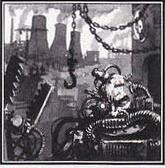
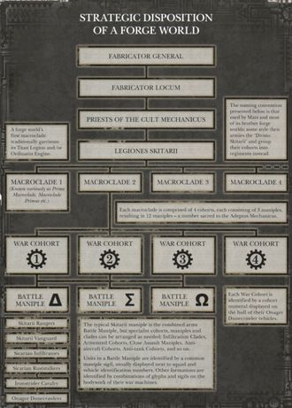
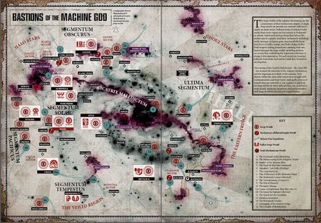

# 0864 铸造世界 Forge World

精校状态：中文行文已逐段精校，部分术语仍为暂定

分类：地理 / 真实空间 Real Space

原文来源：https://www.bilibili.com/opus/1144645141303132176

原作者：帝国神选罐头

原文时间：2025年12月10日 14:07

[返回分类目录](目录.md) · [全书目录](../../目录.md)

<!-- A0864-B0001 -->
**英文原文**

Φ-class or Forge Worlds, as classified by the Imperium, are the worlds of the Adeptus Mechanicus—worlds totally devoted to industry and to the Cult Mechanicus's own occult worship.

<!-- /A0864-B0001 -->

<!-- A0864-B0002 -->

原译文

根据帝国的分类，Φ级或铸造世界是机械神教的世界，完全致力于工业和机械教派自己的神秘崇拜。

**校订译文**

铸造世界在帝国分类中列为Φ类，是机械修会所属的世界。它们全力投入工业生产，同时奉行机械教派神秘的宗教仪式。

**校注：** Vanaheim沿较早第181篇瓦纳海姆之战统一为瓦纳海姆；原稿另译华纳海姆，官方对应待核。

<!-- /A0864-B0002 -->

<!-- A0864-B0003 图片 -->

<!-- A0864-B0004 -->

原译文

Image of a Forge World 铸造世界的图片

**校订译文**

Image of a Forge World 铸造世界的图片

<!-- /A0864-B0004 -->

<!-- A0864-B0005 -->
## Overview 概述

<!-- /A0864-B0005 -->

<!-- A0864-B0006 -->
**英文原文**

The majority of a Forge World's solid ground surface is covered in thousands of years of built-up, massive industrial complexes: great machine factories, production centres, huge volcanic furnaces, skyscraping chimneys, abyss-like quarries and the great workshop-fortresses of the Collegia Titanica. No other world can match the quality and quantity of a forge world's output.

<!-- /A0864-B0006 -->

<!-- A0864-B0007 -->

原译文

铸造世界的大部分坚固地表都覆盖着数千年来建造的大型工业建筑群：大型机械厂、生产中心、巨大的火山熔炉、高耸烟道、深渊般的采石场和泰坦修会的大型车间堡垒。没有其他世界能与铸造世界的产量和质量相媲美。

**校订译文**

铸造世界的大部分陆地，都被数千年间不断扩建的庞大工业设施覆盖：巨型机械厂、生产中心、火山熔炉、直插天际的烟囱、深渊般的采石场，以及泰坦修会的工坊堡垒。无论产量还是品质，其他世界都无法与之匹敌。

<!-- /A0864-B0007 -->

<!-- A0864-B0008 图片 -->

<!-- A0864-B0009 -->

原译文

Organization of a Forge World 铸造世界的组织

**校订译文**

Organization of a Forge World 铸造世界的组织

<!-- /A0864-B0009 -->

<!-- A0864-B0010 -->
**英文原文**

The Adeptus Mechanicus possesses a monopoly on the advanced technological knowledge of Terra's past; consequently, Forge Worlds are the sole producers of the Imperium's more unique and advanced equipment: high-end personal weapons, spacecraft, war machines such as tanks, fighters, and even Titans, as well as more mundane but vital and advanced equipment.

<!-- /A0864-B0010 -->

<!-- A0864-B0011 -->

原译文

机械神教垄断了泰拉过去的先进技术知识；因此，铸造世界是帝国更独特和先进设备的唯一生产者：高端个人武器、航天器、坦克、战斗机甚至泰坦等战争机器，以及更平凡但重要和先进的装备。

**校订译文**

机械修会垄断着古代泰拉遗留的先进技术知识，因此帝国许多特殊而尖端的装备只能由铸造世界生产，包括高性能单兵武器、航天器、坦克、战斗机乃至泰坦，以及其他虽不起眼却先进而关键的设备。

<!-- /A0864-B0011 -->

<!-- A0864-B0012 -->
**英文原文**

The population of a Forge World is invariably immense, the majority directly involved in the industry of the planet, laboriously working in factories and involved in heavy mining. The result of the planet's complete industrialization means its ecosystem has been completely destroyed. The air is saturated with toxic gases and rivers flow with toxic run-off from factories. In many cases, even seas and oceans have been dried up to make room for more factories. However, the output of forge worlds is absolutely vital to the Imperium as a whole.

<!-- /A0864-B0012 -->

<!-- A0864-B0013 -->

原译文

铸造世界的人口总是巨大的，大多数人直接参与这个行星的工业，在工厂里辛勤工作，从事重型采矿。行星完全工业化的结果意味着其生态系统已被完全摧毁。空气中充满了有毒气体，河流中流淌着工厂排放的有毒径流。在许多情况下，为了给更多的工厂腾出空间，甚至海洋也干涸了。然而，铸造世界的产出对整个帝国来说绝对至关重要。

**校订译文**

铸造世界人口极为庞大，多数居民直接服务于工业，在工厂中苦干，或从事大规模采矿。全面工业化摧毁了星球的生态系统：空气充满毒气，河流尽是工厂排出的有毒废水；有时连海洋也被排干，只为腾出更多厂房用地。然而，对整个帝国而言，这些世界的产出不可或缺。

<!-- /A0864-B0013 -->

<!-- A0864-B0014 图片 -->

<!-- A0864-B0015 -->

原译文

Forge Worlds across the galaxy 银河系中的铸造世界

**校订译文**

Forge Worlds across the galaxy 银河系中的铸造世界

<!-- /A0864-B0015 -->

<!-- A0864-B0016 -->
**英文原文**

An individual Forge World is operated theoretically as its own separate sovereign realm, but one beholden to the authority of the Fabricator-General of Mars and Holy Synod. However it is not unheard of for Forge Worlds to have a high degree of autonomy and power, and sometimes have even gotten away with flouting the dictates of Mars itself. Each Forge World is ruled by its own complex web of Archmagi and an individual Fabricator-General.

<!-- /A0864-B0016 -->

<!-- A0864-B0017 -->

原译文

从理论上讲，一个单独的铸造世界是作为自己独立的主权领域运作的，但它受制于火星铸造将军和最高圣会的权威。然而，铸造世界拥有高度的自主权和权力，有时甚至无视火星本身的命令，这并非闻所未闻。每个铸造世界都由自己复杂的大贤者网络和一个单独的铸造将军统治。

**校订译文**

理论上，每个铸造世界都是独立运作的主权领地，但仍须服从火星铸造将军与最高圣会的权威。实际上，一些铸造世界拥有极大的自主权和实力，甚至公然违抗火星，也能免于惩处。各世界都由自己的铸造将军及关系复杂的大贤者群体统治。

<!-- /A0864-B0017 -->

<!-- A0864-B0018 -->
**英文原文**

All Forge Worlds are completely dedicated to the manufacture of the various machines of the Imperium, the pursuit and preservation of humanity's ancient scientific knowledge and the worship of the Machine God. Ancient pacts between the Adeptus Mechanicus and other worlds and institutions of the Imperium oblige the various Forge Worlds to supply other worlds and the various military arms of the Imperium, such as the Imperial Guard. Based on most forge worlds are the Titan Legions; these are supported by legions of Skitarii, the Mechanicus's cybernetically-enhanced soldiers, who also serve as the forge worlds' military forces. Besides these two prestigious forces, there are many other sub factions of a Forge World's armies such as those of the Cybernetica, sworn Knight Houses, Auxilia Myrmidon, Ordo Reductor, Ordinati, Magisterium, Tech-Thralls, war Servitors, etc. Equipment produced by forge worlds are constructed according to the individual forge world's own design-standards or "patterns".

<!-- /A0864-B0018 -->

<!-- A0864-B0019 -->

原译文

所有铸造世界都完全致力于制造帝国的各种机器，追求和保护人类古老的科学知识，崇拜万机神。机械教与帝国的其他世界和机构之间的古代契约要求各个铸造世界为其他世界和帝国的各种军事武装提供补给，如帝国卫队。基于大多数铸造世界的是泰坦军团；这些得到了机械教的智控增强士兵护教军团的支持，他们也是铸造世界的军事部队。除了这两支著名的部队，铸造世界的军队还有许多其他子派系，如智控、宣誓骑士家族、辅军精锐、源还修会、百机队、辖区裁判所、技术奴工、战争机仆等。铸造世界生产的设备是根据单个铸造世界自己的设计标准或“型号”制造的。

**校订译文**

铸造世界全力制造帝国所需机械，寻找并保存人类古老的科学知识，崇拜万机神。机械修会与帝国其他世界、机构之间的古老契约，要求它们向诸世界及帝国卫队等军事力量提供装备物资。大多数铸造世界驻有泰坦军团，并由接受机械强化的护教军支援；护教军也承担本地防卫。除此之外，铸造世界武装还包括智控军团、宣誓效忠的骑士家族、辅军精锐、源还修会、百机战争机器、辖区裁判所、技术奴工，以及战斗机仆等。各世界生产的装备，均遵循各自的设计标准，即不同“型式”。

**校注：** Cybernetica 按完整组织智控军团理解；Ordinati 是 Ordinatus 的复数，依既有定译百机战争机器，与 Centurio Ordinatus 百机队区别。

<!-- /A0864-B0019 -->

<!-- A0864-B0020 -->
**英文原文**

Forge worlds are not environments that reward, let alone tolerate, weakness in body or mind. To survive and prosper in a forge world's rigid society, an individual must possess drive, ambition, and good fortune, or at the very least a bloody-minded ruthlessness enough to endure. Rather than being fully indoctrinated to the Imperial Cult, even the lowliest member of a forge world is familiar with the Credo Omniasiah, the Cult Mechanicus. If a forge world native makes their way off-world, they tend to find Imperial society strangely alien, where fools either fear or profane sacred technology and have no understanding of its spiritual mysteries and purity of essence. Nor does Imperial society seem to grasp that men can only prosper by the teachings of the Omnissiah, that survival requires power, and power is knowledge incarnate. Many on a forge world have some degree of understanding of binharic or other forms of Cant Mechanicus.

<!-- /A0864-B0020 -->

<!-- A0864-B0021 -->

原译文

铸造世界不是奖励，更不用说容忍身体或心灵弱点的环境。为了在一个死板的铸造世界中生存和发达，一个人必须拥有冲劲、野心和好运，或者至少是一种足以忍受的冷血无情。即使是铸造世界中最低级的成员也熟悉信仰机械教派的欧姆尼赛亚信条，而不是完全被灌输帝国教派。如果一个铸造世界的本地人离开世界，他们往往会发现帝国社会奇怪地陌生，在那里，傻瓜要么害怕，要么亵渎神圣的技术，对它的精神奥秘和纯净本质一无所知。帝国社会似乎也没有意识到，人类只有通过欧姆尼赛亚的教义才能繁荣，生存需要力量，而力量是知识的化身。在铸造世界中，许多人对二进制语言或其他形式的机械之语有一定程度的理解。

**校订译文**

铸造世界不会优待弱者，甚至容不下身心软弱之人。要在这种等级僵化的社会里生存并出人头地，就必须具备进取心、野心和好运；至少也得足够强硬无情，才能熬下去。即便地位最低的居民，也熟悉欧姆尼赛亚信条与机械教派的教义，而非只接受帝皇信仰的教化。离开母星后，他们常觉得帝国社会陌生得不可思议：那些愚人不是畏惧神圣技术，就是亵渎技术，对其中的灵性奥秘与纯粹本质毫无认识。在他们看来，帝国人也不明白，人类唯有遵循欧姆尼赛亚的教诲才能兴盛；生存需要力量，而力量正是知识的体现。许多铸造世界居民多少能理解二进制语，或机械之语的其他形式。

**校注：** 已核同一人物、组织、型号或事件，与全书核心术语及后续专篇统一；原译保留对照。

<!-- /A0864-B0021 -->

<!-- A0864-B0022 -->
### Types of Forge Worlds 铸造世界类型

<!-- /A0864-B0022 -->

<!-- A0864-B0023 -->

原译文

Data-Hoard 数据仓库

**校订译文**

Data-Hoard 数据积藏型

<!-- /A0864-B0023 -->

<!-- A0864-B0024 -->

原译文

Expansionist 扩张主义

**校订译文**

Expansionist 扩张型

<!-- /A0864-B0024 -->

<!-- A0864-B0025 -->

原译文

Rad-Saturated 辐射饱和

**校订译文**

Rad-Saturated 辐射饱和型

<!-- /A0864-B0025 -->

<!-- A0864-B0026 -->

原译文

Reignited 重燃

**校订译文**

Reignited 重燃型

<!-- /A0864-B0026 -->

<!-- A0864-B0027 -->

原译文

Slaved Systems 附属星系

**校订译文**

Slaved Systems 附属星系型

<!-- /A0864-B0027 -->

<!-- A0864-B0028 -->
## Known Forge Worlds 已知铸造世界

<!-- /A0864-B0028 -->

<!-- A0864-B0029 -->
**英文原文**

Accatran - Ultima - Homeworld of the Legio Destructor.

<!-- /A0864-B0029 -->

<!-- A0864-B0030 -->

原译文

阿卡特兰 - 极限星域 - 毁灭者军团的家园世界

**校订译文**

阿卡特兰 - 极限星域 - 毁灭者军团的家园世界

<!-- /A0864-B0030 -->

<!-- A0864-B0031 -->

原译文

Achlys III 阿克利斯三号

**校订译文**

Achlys III 阿克利斯三号

<!-- /A0864-B0031 -->

<!-- A0864-B0032 -->
**英文原文**

Adrosi - Ultima - Gorath Sector - Silurian System

<!-- /A0864-B0032 -->

<!-- A0864-B0033 -->

原译文

阿德罗西 - 极限星域 - 戈拉斯星区 - 志留星系

**校订译文**

阿德罗西 - 极限星域 - 戈拉斯星区 - 志留星系

<!-- /A0864-B0033 -->

<!-- A0864-B0034 -->
**英文原文**

Agripinaa - Obscurus - Agripinaa Sector - Agripinaa System

<!-- /A0864-B0034 -->

<!-- A0864-B0035 -->

原译文

阿格里皮纳 - 朦胧星域 - 阿格里皮纳星区 - 阿格里皮纳星系

**校订译文**

阿格里皮娜——朦胧星域；阿格里皮娜星区、阿格里皮娜星系。

<!-- /A0864-B0035 -->

<!-- A0864-B0036 -->

原译文

Albert IV 阿尔伯特四号

**校订译文**

Albert IV 阿尔伯特四号

<!-- /A0864-B0036 -->

<!-- A0864-B0037 -->
**英文原文**

Alpha Primus - Unknown(just outside of Segmentum Solar) - Quintillus System

<!-- /A0864-B0037 -->

<!-- A0864-B0038 -->

原译文

阿尔法一号 - 未知（仅在太阳星域之外） - 昆提卢斯星系

**校订译文**

阿尔法一号——所属星域不明，位于太阳星域之外不远处；昆提卢斯星系。

**校注：** Alpha Primus 在此为星球名，与第610篇考尔创造的战士原铸之首同形而不同物，不能套用人物名。

<!-- /A0864-B0038 -->

<!-- A0864-B0039 -->
**英文原文**

Altevfor - Ultima

<!-- /A0864-B0039 -->

<!-- A0864-B0040 -->

原译文

阿尔泰弗 - 极限星域

**校订译文**

阿尔泰弗 - 极限星域

<!-- /A0864-B0040 -->

<!-- A0864-B0041 -->

原译文

Ammunheim 阿姆恩海姆

**校订译文**

Ammunheim 阿姆恩海姆

<!-- /A0864-B0041 -->

<!-- A0864-B0042 -->
**英文原文**

Amontep II - Ultima - Contested by Necrons

<!-- /A0864-B0042 -->

<!-- A0864-B0043 -->

原译文

阿蒙泰普二号 - 极限星域 - 被死灵争夺

**校订译文**

阿蒙泰普二号——极限星域；正与太空死灵争夺控制权。

<!-- /A0864-B0043 -->

<!-- A0864-B0044 -->
**英文原文**

Angstrom - Ultima - Angstrom System

<!-- /A0864-B0044 -->

<!-- A0864-B0045 -->

原译文

埃格斯特朗 - 极限星域 - 埃格斯特朗星系

**校订译文**

埃格斯特朗 - 极限星域 - 埃格斯特朗星系

<!-- /A0864-B0045 -->

<!-- A0864-B0046 -->

原译文

Antasic IX 安塔西克九号

**校订译文**

Antasic IX 安塔西克九号

<!-- /A0864-B0046 -->

<!-- A0864-B0047 -->
**英文原文**

Antax - Ultima - Vidar Sector

<!-- /A0864-B0047 -->

<!-- A0864-B0048 -->

原译文

安塔克 - 极限星域 - 维达星区

**校订译文**

安塔克——极限星域；维达尔星区。

<!-- /A0864-B0048 -->

<!-- A0864-B0049 -->
**英文原文**

Antioc - Obscurus - Prath Veil sub-sector - Captured by Chaos forces

<!-- /A0864-B0049 -->

<!-- A0864-B0050 -->

原译文

安提奥克 - 朦胧星域 - 普拉斯帷幕分区 - 被混沌部队争夺

**校订译文**

安提奥克——朦胧星域；普拉斯帷幕次星区；已被混沌军队占领。

<!-- /A0864-B0050 -->

<!-- A0864-B0051 -->
**英文原文**

Anvillus - Ultima - Known for production of Warlord Battle Titans of Mars-Alpha Pattern

<!-- /A0864-B0051 -->

<!-- A0864-B0052 -->

原译文

安维鲁斯 - 极限星域 - 以制造火星-阿尔法型的军阀战斗泰坦而闻名

**校订译文**

安维鲁斯——极限星域；以生产火星-阿尔法型战将级战斗泰坦闻名。

<!-- /A0864-B0052 -->

<!-- A0864-B0053 -->
**英文原文**

Anvilus Nine - Was captured by renegade Tech-Priests of the Dark Mechanicus during the Horus Heresy. Its later fate is unknown.

<!-- /A0864-B0053 -->

<!-- A0864-B0054 -->

原译文

安维鲁斯九星 - 在荷鲁斯叛乱期间被黑暗机械教的变节技术神甫俘虏。它后来的命运是未知的。

**校订译文**

安维鲁斯九号——荷鲁斯之乱期间被黑暗机械教的叛变技术祭司占领，此后命运不明。

<!-- /A0864-B0054 -->

<!-- A0864-B0055 -->

原译文

Aphret 阿弗雷特

**校订译文**

Aphret 阿弗雷特

<!-- /A0864-B0055 -->

<!-- A0864-B0056 -->

原译文

Appus IV 阿普斯四号

**校订译文**

Appus IV 阿普斯四号

<!-- /A0864-B0056 -->

<!-- A0864-B0057 -->
**英文原文**

Arachnus - Tempestus

<!-- /A0864-B0057 -->

<!-- A0864-B0058 -->

原译文

阿拉克纳斯 - 暴风星域

**校订译文**

阿拉克纳斯 - 暴风星域

<!-- /A0864-B0058 -->

<!-- A0864-B0059 -->
**英文原文**

Arcetri - Now — Dead World

<!-- /A0864-B0059 -->

<!-- A0864-B0060 -->

原译文

阿切特里 - 现在—死亡世界

**校订译文**

阿切特里 - 现在—死寂世界

<!-- /A0864-B0060 -->

<!-- A0864-B0061 -->
**英文原文**

Arenxis Minoris - Tempestus

<!-- /A0864-B0061 -->

<!-- A0864-B0062 -->

原译文

阿伦西斯次星 - 暴风星域

**校订译文**

阿伦西斯次星 - 暴风星域

<!-- /A0864-B0062 -->

<!-- A0864-B0063 -->
**英文原文**

Arl'yeth - Tempestus - Belt of Iron

<!-- /A0864-B0063 -->

<!-- A0864-B0064 -->

原译文

阿尔'利斯 - 暴风星域 - 铁带

**校订译文**

阿尔'利斯 - 暴风星域 - 铁带

<!-- /A0864-B0064 -->

<!-- A0864-B0065 -->
**英文原文**

Artemia Majoris - Pacificus - Scene of the Hieronymite Heresy

<!-- /A0864-B0065 -->

<!-- A0864-B0066 -->

原译文

阿尔泰米亚主星 - 太平星域 - 希罗尼米特叛乱现场

**校订译文**

阿尔泰米亚主星 - 太平星域 - 希罗尼米特叛乱现场

<!-- /A0864-B0066 -->

<!-- A0864-B0067 -->
**英文原文**

Astaramis - Ultima - Ultima Sector - Ultramar - Konor System

<!-- /A0864-B0067 -->

<!-- A0864-B0068 -->

原译文

阿斯塔拉米斯 - 极限星域 - 极限星区 -

**校订译文**

阿斯塔拉米斯——极限星域；极限星区、奥特拉玛、康诺星系。

**校注：** 补回原译漏掉的奥特拉玛与康诺星系。

<!-- /A0864-B0068 -->

<!-- A0864-B0069 -->
**英文原文**

Artos-Rho IV - One of the trio of Forge Worlds (named Deuterium Stars) which during the Great Crusade were the only ones who produced the Las-Impulsors for Imperial Knights before M34. Overrun and destroyed during the Horus Heresy.

<!-- /A0864-B0069 -->

<!-- A0864-B0070 -->

原译文

阿尔托斯-17四号 - 三重铸造世界（名为氘星）之一，在大远征期间，他们是M34之前唯一为帝国骑士生产激光脉冲炮的人。在荷鲁斯叛乱期间被覆灭和摧毁。

**校订译文**

阿尔托斯-罗四号——“氘星”三座铸造世界之一。底稿称，这三座世界在大远征时期独家制造帝国骑士的激光脉冲炮，并提及这一垄断延续到第34个千年之前。本世界在荷鲁斯之乱中遭攻陷并毁灭。

**校注：** Rho 是名称中的希腊字母，不译为17；英文将大远征期间与M34以前并置，时间范围不够明确，按原信息保留待核。

<!-- /A0864-B0070 -->

<!-- A0864-B0071 -->

原译文

Atanix Triumvirae 阿塔尼克斯三头

**校订译文**

Atanix Triumvirae 阿塔尼克斯三头

<!-- /A0864-B0071 -->

<!-- A0864-B0072 -->
**英文原文**

Atar-Median - Pacificus

<!-- /A0864-B0072 -->

<!-- A0864-B0073 -->

原译文

阿塔尔中星 - 太平星域

**校订译文**

阿塔尔中星 - 太平星域

<!-- /A0864-B0073 -->

<!-- A0864-B0074 -->
**英文原文**

Avachrus - Obscurus - Gothic Sector - Gilead System

<!-- /A0864-B0074 -->

<!-- A0864-B0075 -->

原译文

阿瓦赫鲁斯 - 朦胧星域 - 哥特星区 - 基列星系

**校订译文**

阿瓦赫鲁斯 - 朦胧星域 - 哥特星区 - 基列星系

<!-- /A0864-B0075 -->

<!-- A0864-B0076 -->
**英文原文**

Barnassus (former) - Now — Dead World

<!-- /A0864-B0076 -->

<!-- A0864-B0077 -->

原译文

巴纳索斯（前）- 现在—死亡世界

**校订译文**

巴纳索斯（前）- 现在—死寂世界

<!-- /A0864-B0077 -->

<!-- A0864-B0078 -->
**英文原文**

Belacane - Obscurus - Calixis Sector - Markayn Marches - Belacane System

<!-- /A0864-B0078 -->

<!-- A0864-B0079 -->

原译文

贝拉坎恩 - 朦胧星域 - 卡利西斯星区 - 马凯恩边区 - 贝拉坎恩星系

**校订译文**

贝勒凯恩——朦胧星域；卡利西斯星区、马尔坎边区、贝勒凯恩星系。

**校注：** Belacane 与第863篇 Belecane 地域、属性吻合，暂视为英文异写，采用贝勒凯恩，保留待核。

<!-- /A0864-B0079 -->

<!-- A0864-B0080 -->
**英文原文**

Bellicos - Swallowed whole by the Great Rift.

<!-- /A0864-B0080 -->

<!-- A0864-B0081 -->

原译文

贝利科斯 - 被大裂隙吞噬。

**校订译文**

贝利科斯 - 被大裂隙吞噬。

<!-- /A0864-B0081 -->

<!-- A0864-B0082 -->
**英文原文**

Bellona - Ultima - Elara's Veil - Annwyn Reaches - Ophion System or Avalon System - Forge moon that orbits Nemeton

<!-- /A0864-B0082 -->

<!-- A0864-B0083 -->

原译文

贝罗纳 - 极限星域 - 埃拉拉帷幕 - 安努恩河段 - 奥菲翁星系或阿瓦隆星系—围绕涅梅顿运行的铸造卫星

**校订译文**

贝罗纳——极限星域；艾拉面纱、安努恩疆域；奥菲翁星系或阿瓦隆星系。它是一颗环绕圣林运行的铸造卫星。

**校注：** Nemeton 依本书现稿圣林；Annwyn Reaches 为空域，不是河段。

<!-- /A0864-B0083 -->

<!-- A0864-B0084 -->

原译文

Beshic V 贝希克五号

**校订译文**

Beshic V 贝希克五号

<!-- /A0864-B0084 -->

<!-- A0864-B0085 -->
**英文原文**

Beta Cornix - Tempestus

<!-- /A0864-B0085 -->

<!-- A0864-B0086 -->

原译文

贝塔-科洛尼斯 - 暴风星域

**校订译文**

贝塔-科洛尼斯 - 暴风星域

<!-- /A0864-B0086 -->

<!-- A0864-B0087 -->
**英文原文**

Bheta-Decima - Tempestus - Nemesys - Crashsite of the Space Hulk Gallowdark

<!-- /A0864-B0087 -->

<!-- A0864-B0088 -->

原译文

2-10 - 暴风星域 - 内梅斯 - 太空废船暗绞号的坠毁地点

**校订译文**

贝塔-德西玛——暴风星域；内梅斯；太空废船暗绞号的坠落地点。

**校注：** Bheta-Decima 是地名，不能直接写作2-10；暂定音译贝塔-德西玛，未检得可核的GW官方中文对应。

<!-- /A0864-B0088 -->

<!-- A0864-B0089 -->
**英文原文**

Bronta-Median - Homeworld of the Legio Perennia Titan Legion

<!-- /A0864-B0089 -->

<!-- A0864-B0090 -->

原译文

布朗塔中星 - 永恒军团泰坦军团的家园世界

**校订译文**

布朗塔中星 - 永恒军团泰坦军团的家园世界

<!-- /A0864-B0090 -->

<!-- A0864-B0091 -->

原译文

Byrrus Alpha 拜鲁斯阿尔法

**校订译文**

Byrrus Alpha 拜鲁斯阿尔法

<!-- /A0864-B0091 -->

<!-- A0864-B0092 -->
**英文原文**

Cadamine - Invaded by the Leviathan splinter fleet known as the Silent Murder during the Third Tyrannic War.

<!-- /A0864-B0092 -->

<!-- A0864-B0093 -->

原译文

卡达明 - 在第三次泰伦战争期间，被称为寂静谋杀者的利维坦分裂舰队入侵。

**校订译文**

卡达明 - 在第三次泰伦战争期间，被称为寂静谋杀者的利维坦分裂舰队入侵。

<!-- /A0864-B0093 -->

<!-- A0864-B0094 -->

原译文

Cadmon's Lock 卡德蒙之锁

**校订译文**

Cadmon's Lock 卡德蒙之锁

<!-- /A0864-B0094 -->

<!-- A0864-B0095 -->
**英文原文**

Cahim II - Invaded by the forces of Chaos sometime after the Great Rift's creation.

<!-- /A0864-B0095 -->

<!-- A0864-B0096 -->

原译文

卡希姆二号 - 在大裂隙形成后的某个时候被混沌部队入侵。

**校订译文**

卡希姆二号 - 在大裂隙形成后的某个时候被混沌部队入侵。

<!-- /A0864-B0096 -->

<!-- A0864-B0097 -->

原译文

Casiorix 卡西奥里克斯

**校订译文**

Casiorix 卡西奥里克斯

<!-- /A0864-B0097 -->

<!-- A0864-B0098 -->
**英文原文**

Cavor Sarta - Dark Mechanicus Forge World

<!-- /A0864-B0098 -->

<!-- A0864-B0099 -->

原译文

卡沃尔·萨塔 - 黑暗机械教铸造世界

**校订译文**

卡沃尔·萨塔 - 黑暗机械教铸造世界

<!-- /A0864-B0099 -->

<!-- A0864-B0100 -->

原译文

Chaeroneia 喀罗尼亚

**校订译文**

Chaeroneia 喀罗尼亚

<!-- /A0864-B0100 -->

<!-- A0864-B0101 -->
**英文原文**

Columnus - Solar

<!-- /A0864-B0101 -->

<!-- A0864-B0102 -->

原译文

科卢姆斯 - 太阳星域

**校订译文**

科卢姆努斯 - 太阳星域

<!-- /A0864-B0102 -->

<!-- A0864-B0103 -->
**英文原文**

Crucible-Omega - Solar - Dark Mechanicus Forge World

<!-- /A0864-B0103 -->

<!-- A0864-B0104 -->

原译文

坩埚-欧米伽 - 太阳星域 - 黑暗机械教铸造世界

**校订译文**

坩埚-欧米伽 - 太阳星域 - 黑暗机械教铸造世界

<!-- /A0864-B0104 -->

<!-- A0864-B0105 -->
**英文原文**

Cyclopea - Obscurus - Calixis Sector - The Periphery - Also — Civilized World

<!-- /A0864-B0105 -->

<!-- A0864-B0106 -->

原译文

独眼巨人 - 朦胧星域 - 卡利西斯星区 - 边缘 - 也是 — 文明世界

**校订译文**

独眼巨人——朦胧星域；卡利西斯星区、边缘地区；也是文明世界。

**校注：** Cyclopea 与第863篇 Cyclopia 原稿拼写不同，此处先沿原译独眼巨人，不自动合并两实体。

<!-- /A0864-B0106 -->

<!-- A0864-B0107 -->
**英文原文**

Cyclothrathe - Obscurus - Coronid Deeps - Chaos Forge World

<!-- /A0864-B0107 -->

<!-- A0864-B0108 -->

原译文

赛克洛斯拉斯 - 朦胧星域 - 科罗尼德深渊 - 混沌铸造世界

**校订译文**

赛克洛特拉特——朦胧星域；科罗尼德深渊；混沌铸造世界。

<!-- /A0864-B0108 -->

<!-- A0864-B0109 -->
**英文原文**

Cypra Mundi - Obscurus - Also Fleet Base

<!-- /A0864-B0109 -->

<!-- A0864-B0110 -->

原译文

凯普拉世界 - 朦胧星域 - 也是舰队基地

**校订译文**

塞浦拉·蒙迪——朦胧星域；也是舰队基地。

<!-- /A0864-B0110 -->

<!-- A0864-B0111 -->

原译文

Cyraxus II 赛拉克斯二号

**校订译文**

Cyraxus II 赛拉克斯二号

<!-- /A0864-B0111 -->

<!-- A0864-B0112 -->

原译文

Daiamantus 达亚曼图斯

**校订译文**

Daiamantus 达亚曼图斯

<!-- /A0864-B0112 -->

<!-- A0864-B0113 -->
**英文原文**

Dantris III - Ultima

<!-- /A0864-B0113 -->

<!-- A0864-B0114 -->

原译文

丹特里斯三号 - 极限星域

**校订译文**

丹特里斯三号 - 极限星域

<!-- /A0864-B0114 -->

<!-- A0864-B0115 -->
**英文原文**

Daxxos - Home to the Legio Naesseas.

<!-- /A0864-B0115 -->

<!-- A0864-B0116 -->

原译文

达克索斯 - 内塞亚斯军团的家园

**校订译文**

达克索斯 - 内塞亚斯军团的家园

<!-- /A0864-B0116 -->

<!-- A0864-B0117 -->
**英文原文**

Deimos - Solar - Sector Solar - Subsector Sol - Sol System - Ancient moon of Mars, now a sub-moon of Titan.

<!-- /A0864-B0117 -->

<!-- A0864-B0118 -->

原译文

迪莫斯 - 太阳星域 - 太阳星区 - 太阳分区 - 太阳星系 - 火星的古老卫星，现在是泰坦的次卫星。

**校订译文**

迪莫斯（火卫二）——太阳星域、太阳星区、太阳次星区、太阳系；原为火星卫星，如今是环绕泰坦的次级卫星。

**校注：** Deimos沿现稿迪莫斯，天体亦称火卫二；与按火卫二命名的武器型号统一词根。

<!-- /A0864-B0118 -->

<!-- A0864-B0119 -->
**英文原文**

Delphi - Ultima

<!-- /A0864-B0119 -->

<!-- A0864-B0120 -->

原译文

德尔斐 - 极限星域

**校订译文**

德尔斐 - 极限星域

<!-- /A0864-B0120 -->

<!-- A0864-B0121 -->

原译文

Delphi IX 德尔斐九号

**校订译文**

Delphi IX 德尔斐九号

<!-- /A0864-B0121 -->

<!-- A0864-B0122 -->
**英文原文**

Demios Binary - Obscurus - Cadian Sector - Demios Binary System

<!-- /A0864-B0122 -->

<!-- A0864-B0123 -->

原译文

德米奥斯双星 - 朦胧星域 - 卡迪亚星区 - 德米奥斯双星星系

**校订译文**

德米奥斯双星 - 朦胧星域 - 卡迪亚星区 - 德米奥斯双星星系

<!-- /A0864-B0123 -->

<!-- A0864-B0124 -->
**英文原文**

Diamat - Ultima

<!-- /A0864-B0124 -->

<!-- A0864-B0125 -->

原译文

迪亚玛特 - 极限星域

**校订译文**

迪亚马特——极限星域。

<!-- /A0864-B0125 -->

<!-- A0864-B0126 -->
**英文原文**

Diesos - Dark Mechanicum Forge World

<!-- /A0864-B0126 -->

<!-- A0864-B0127 -->

原译文

迪索斯 - 黑暗机械教铸造世界

**校订译文**

迪索斯 - 黑暗机械教铸造世界

<!-- /A0864-B0127 -->

<!-- A0864-B0128 -->

原译文

Dominica II 多米尼加二号

**校订译文**

Dominica II 多米尼加二号

<!-- /A0864-B0128 -->

<!-- A0864-B0129 -->
**英文原文**

Driantum - Chaos-held Forge World, that was invaded by the forces of the Indomitus Crusade.

<!-- /A0864-B0129 -->

<!-- A0864-B0130 -->

原译文

德里安图姆 - 混沌占据了铸造世界，该世界被不屈远征入侵。

**校订译文**

德里安图姆——被混沌占据的铸造世界，曾遭不屈远征军进攻。

<!-- /A0864-B0130 -->

<!-- A0864-B0131 -->
**英文原文**

Duos - Ultima - Charadon Sector - Phlegyr Sub-Sector - Skhimar System

<!-- /A0864-B0131 -->

<!-- A0864-B0132 -->

原译文

二重唱 - 极限星域 - 查拉顿星区 - 弗莱格尔分区 - 斯基马尔星系

**校订译文**

二重唱 - 极限星域 - 查拉顿星区 - 弗莱格尔次星区 - 斯基马尔星系

<!-- /A0864-B0132 -->

<!-- A0864-B0133 -->
**英文原文**

Dykurnos VI - Obscurus - Dykurnos System

<!-- /A0864-B0133 -->

<!-- A0864-B0134 -->

原译文

迪库诺斯六号 - 朦胧星域 - 迪库诺斯星系

**校订译文**

迪库诺斯六号 - 朦胧星域 - 迪库诺斯星系

<!-- /A0864-B0134 -->

<!-- A0864-B0135 -->

原译文

Dynax Primus 戴纳克斯一号

**校订译文**

Dynax Primus 戴纳克斯一号

<!-- /A0864-B0135 -->

<!-- A0864-B0136 -->

原译文

Dynax-Abultra 戴纳克斯-阿布特拉

**校订译文**

Dynax-Abultra 戴纳克斯-阿布特拉

<!-- /A0864-B0136 -->

<!-- A0864-B0137 -->

原译文

Dynostix V 戴诺斯蒂克斯五号

**校订译文**

Dynostix V 戴诺斯蒂克斯五号

<!-- /A0864-B0137 -->

<!-- A0864-B0138 -->

原译文

Ecovoria 埃科沃利亚

**校订译文**

Ecovoria 埃科沃利亚

<!-- /A0864-B0138 -->

<!-- A0864-B0139 -->
**英文原文**

Eontar - Subservient to the greater Forge World of Voss Prime.

<!-- /A0864-B0139 -->

<!-- A0864-B0140 -->

原译文

埃昂塔尔 - 从属于沃斯一号更大的铸造世界。

**校订译文**

埃昂塔尔——隶属于势力更大的铸造世界沃斯主星。

<!-- /A0864-B0140 -->

<!-- A0864-B0141 -->
**英文原文**

Ermune - Pacificus - Sabbat Worlds - Occupied by the forces of Chaos by the time of the Sabbat Crusade.

<!-- /A0864-B0141 -->

<!-- A0864-B0142 -->

原译文

厄尔穆内 - 太平星域 - 萨巴特世界 - 在萨巴特远征时被混沌部队占领。

**校订译文**

厄尔穆内 - 太平星域 - 萨巴特诸世界 - 在萨巴特远征时被混沌部队占领。

**校注：** Sabbat 为专名，统一圣萨巴特、萨巴特诸世界及相关远征的词根；原安息日诸世界保留在原译栏，中文暂定。

<!-- /A0864-B0142 -->

<!-- A0864-B0143 -->
**英文原文**

Estaban III - Ultima - Estaban System

<!-- /A0864-B0143 -->

<!-- A0864-B0144 -->

原译文

埃斯塔班三号 - 极限星域 - 埃斯塔班星系

**校订译文**

埃斯塔班三号 - 极限星域 - 埃斯塔班星系

<!-- /A0864-B0144 -->

<!-- A0864-B0145 -->
**英文原文**

Estaban VII - Ultima - Estaban System

<!-- /A0864-B0145 -->

<!-- A0864-B0146 -->

原译文

埃斯塔班七号 - 极限星域 - 埃斯塔班星系

**校订译文**

埃斯塔班七号 - 极限星域 - 埃斯塔班星系

<!-- /A0864-B0146 -->

<!-- A0864-B0147 -->
**英文原文**

Esteban VII - Ultima - Home to the Death Bolts Titan Legion

<!-- /A0864-B0147 -->

<!-- A0864-B0148 -->

原译文

埃斯特班七号 - 极限星域 - 死电泰坦军团的家园

**校订译文**

埃斯特班七号 - 极限星域 - 死电泰坦军团的家园

<!-- /A0864-B0148 -->

<!-- A0864-B0149 -->
**英文原文**

Eufrates II - Obscurus - Koronus Expanse - The Cauldron - Emperor's Palm System - Governed by the Adeptus Mechanicus Explorator Cognisance Fleet. Lay-visitors are not allowed onto the surface.

<!-- /A0864-B0149 -->

<!-- A0864-B0150 -->

原译文

幼发拉底二号 - 朦胧星域 - 科罗努斯扩区 - 坩埚 - 帝皇之掌星系 - 由机械神教探索者确认舰队管理。普通访客不得进入表面。

**校订译文**

幼发拉底二号——朦胧星域；克洛诺斯广域、坩埚区域、帝皇之掌星系。由机械修会的探索者舰队统辖，非教内访客不得登上地表。

**校注：** Explorator Cognisance Fleet 暂译探察舰队；lay-visitors 指非教内来访者，非泛指所有普通访客。

<!-- /A0864-B0150 -->

<!-- A0864-B0151 -->

原译文

Ferrovarum 费罗瓦鲁姆

**校订译文**

Ferrovarum 费罗瓦鲁姆

<!-- /A0864-B0151 -->

<!-- A0864-B0152 -->
**英文原文**

Forge Polix - Obscurus - Calixis Sector - Screaming Vortex - Dark Mechanicus Forge World

<!-- /A0864-B0152 -->

<!-- A0864-B0153 -->

原译文

铸造波利克斯 - 朦胧星域 - 卡利西斯星区 - 尖啸旋涡 - 黑暗机械教铸造世界

**校订译文**

铸造波利克斯 - 朦胧星域 - 卡利西斯星区 - 尖啸旋涡 - 黑暗机械教铸造世界

<!-- /A0864-B0153 -->

<!-- A0864-B0154 -->
**英文原文**

Forge World Thule - Tempestus - Caligari Sector - Atroxia Subsector - Ultima Thule System - The heart of industry of the Caligari Sector.

<!-- /A0864-B0154 -->

<!-- A0864-B0155 -->

原译文

图勒铸造世界 - 暴风星域 - 卡里加瑞星区 - 阿特罗克西亚分区 - 极限图勒星系 - 卡里加瑞星区的工业核心。

**校订译文**

图勒铸造世界——暴风星域；卡利加利星区、阿特罗克西亚次星区、极限图勒星系；卡利加利星区的工业核心。

<!-- /A0864-B0155 -->

<!-- A0864-B0156 -->
**英文原文**

Fortis Binary - Pacficus - Sabbat Worlds - Chaos Forge World

<!-- /A0864-B0156 -->

<!-- A0864-B0157 -->

原译文

福蒂斯双星 - 太平星域 - 萨巴特世界 - 混沌铸造世界

**校订译文**

福蒂斯双星 - 太平星域 - 萨巴特诸世界 - 混沌铸造世界

**校注：** Sabbat 为专名，统一圣萨巴特、萨巴特诸世界及相关远征的词根；原安息日诸世界保留在原译栏，中文暂定。

<!-- /A0864-B0157 -->

<!-- A0864-B0158 -->
**英文原文**

Fusiria - One of the trio of Forge Worlds (named Deuterium Stars) which during the Great Crusade were the only ones who produced the Las-Impulsors for Imperial Knights. Turned Traitor during the Horus Heresy.

<!-- /A0864-B0158 -->

<!-- A0864-B0159 -->

原译文

弗西里亚 - 三重铸造世界（名为氘星）之一，在大远征期间，他们是唯一为帝国骑士生产激光脉冲炮的人。在荷鲁斯叛乱期间成为叛徒。

**校订译文**

弗西里亚——“氘星”三座铸造世界之一。大远征期间，只有这三座世界制造帝国骑士的激光脉冲炮。本世界在荷鲁斯之乱中投向叛军。

<!-- /A0864-B0159 -->

<!-- A0864-B0160 -->
**英文原文**

Galatia - Ultima (Eastern Fringe) - Triplex Sector - Triplex

<!-- /A0864-B0160 -->

<!-- A0864-B0161 -->

原译文

加拉提亚 - 极限星域（东部边缘）- 三重星区 - 三重

**校订译文**

加拉提亚 - 极限星域（东部边缘）- 三重星区 - 三重

<!-- /A0864-B0161 -->

<!-- A0864-B0162 -->
**英文原文**

Gamanede - Cadian 113th took the last stand on this planet

<!-- /A0864-B0162 -->

<!-- A0864-B0163 -->

原译文

加马内德 - 卡迪亚第113兵团在这个行星上最后一战

**校订译文**

加马内德——卡迪亚第113团曾在此进行最后的抵抗。

<!-- /A0864-B0163 -->

<!-- A0864-B0164 -->
**英文原文**

Gantz - Ultima - Ultima Sector - Ultramar - Konor System - Forge moon and home to the Legio Praesagius Titan Legion.

<!-- /A0864-B0164 -->

<!-- A0864-B0165 -->

原译文

甘茨 - 极限星域 - 极限星区 - 奥特拉玛 - 康诺星系 - 铸造卫星和厄兆军团泰坦军团的家园。

**校订译文**

甘茨——极限星域；极限星区、奥特拉玛、康诺星系；铸造卫星，也是预兆泰坦军团的母星。

<!-- /A0864-B0165 -->

<!-- A0864-B0166 -->
**英文原文**

Gehn Quora - Once lost to the Imperium, until the Adepta Sororitas brought it salvation in M37. In thanks, the Fabricator General of Mars had the relic Purgator Mirabilis restored for the Sororitas.

<!-- /A0864-B0166 -->

<!-- A0864-B0167 -->

原译文

根·奎拉 - 曾经对于帝国失落，直到修女会在M37为其带来救赎。作为感谢，火星铸造将军为修女会修复了圣物非凡净化。

**校订译文**

根·奎拉——曾与帝国失联，直到第37个千年才由战斗修女会带来救赎。火星铸造将军为表谢意，命人为修女会修复“非凡净化”圣物。

<!-- /A0864-B0167 -->

<!-- A0864-B0168 -->

原译文

Gharani 加拉尼

**校订译文**

Gharani 加拉尼

<!-- /A0864-B0168 -->

<!-- A0864-B0169 -->

原译文

Ghoulwright 食尸鬼工匠

**校订译文**

Ghoulwright 食尸鬼工匠

<!-- /A0864-B0169 -->

<!-- A0864-B0170 -->

原译文

Glasgow IV 格拉斯哥四号

**校订译文**

Glasgow IV 格拉斯哥四号

<!-- /A0864-B0170 -->

<!-- A0864-B0171 -->
**英文原文**

Glenescrede Raptus (Destroyed) - Pacificus - Exploded during the Thirteenth Black Crusade.

<!-- /A0864-B0171 -->

<!-- A0864-B0172 -->

原译文

格莱内斯克里德·拉普图斯（毁灭）- 太平星域 - 在第十三次黑色远征期间爆炸。

**校订译文**

格莱内斯克里德·拉普图斯（毁灭）- 太平星域 - 在第十三次黑色远征期间爆炸。

<!-- /A0864-B0172 -->

<!-- A0864-B0173 -->
**英文原文**

Glomus - Drinos System - Occupied by Orks.

<!-- /A0864-B0173 -->

<!-- A0864-B0174 -->

原译文

格洛姆斯 - 德里诺斯星系 - 被欧克占据。

**校订译文**

格洛姆斯 - 德里诺斯星系 - 被欧克占据。

<!-- /A0864-B0174 -->

<!-- A0864-B0175 -->
**英文原文**

Goralech - Oribited by an Artificial moon called Pergamatros.

<!-- /A0864-B0175 -->

<!-- A0864-B0176 -->

原译文

戈拉莱赫 - 被一颗名为帕加马托斯的人造卫星定位。

**校订译文**

戈拉莱赫——一颗名为帕加马托斯的人造卫星环绕其运行。

**校注：** Oribited 为 orbited 的拼写错误，指卫星绕行，不是定位。

<!-- /A0864-B0176 -->

<!-- A0864-B0177 -->
**英文原文**

Gorgonum - Ultima

<!-- /A0864-B0177 -->

<!-- A0864-B0178 -->

原译文

戈尔贡努姆 - 极限星域

**校订译文**

戈尔贡努姆 - 极限星域

<!-- /A0864-B0178 -->

<!-- A0864-B0179 -->
**英文原文**

Gorvallon - Subservient to the greater Forge World of Voss Prime.

<!-- /A0864-B0179 -->

<!-- A0864-B0180 -->

原译文

戈尔瓦隆 - 从属于沃斯一号更大的铸造世界。

**校订译文**

戈尔瓦隆——隶属于势力更大的铸造世界沃斯主星。

<!-- /A0864-B0180 -->

<!-- A0864-B0181 -->
**英文原文**

Goth - Obscurus - Gothic Sector

<!-- /A0864-B0181 -->

<!-- A0864-B0182 -->

原译文

哥特 - 朦胧星域 - 哥特星区

**校订译文**

哥特 - 朦胧星域 - 哥特星区

<!-- /A0864-B0182 -->

<!-- A0864-B0183 -->
**英文原文**

Graia - Tempestus - Belt of Iron - Homeworld of the Legio Astramana.

<!-- /A0864-B0183 -->

<!-- A0864-B0184 -->

原译文

格拉亚 - 暴风星域 - 铁带 - 星能军团的家园世界

**校订译文**

格莱亚——暴风星域；铁带；星能军团的母星。

<!-- /A0864-B0184 -->

<!-- A0864-B0185 -->

原译文

Grammachus Beta 格拉马库斯·贝塔

**校订译文**

Grammachus Beta 格拉马库斯·贝塔

<!-- /A0864-B0185 -->

<!-- A0864-B0186 -->
**英文原文**

Gryphonne IV (former) - Tempestus - Now — Dead World. Devoured by Hive Fleet Leviathan

<!-- /A0864-B0186 -->

<!-- A0864-B0187 -->

原译文

格里芬四号（前）- 暴风星域 - 现在—死亡世界。被虫巢舰队利维坦吞噬

**校订译文**

格里芬四号（前）- 暴风星域 - 现在—死寂世界。被虫巢舰队利维坦吞噬

<!-- /A0864-B0187 -->

<!-- A0864-B0188 -->
**英文原文**

Gulgorahd - Ultima - Gulgorahd Protectorate

<!-- /A0864-B0188 -->

<!-- A0864-B0189 -->

原译文

古尔戈拉德 - 极限星域 - 古尔戈拉德保护地/

**校订译文**

古尔戈拉德——极限星域；古尔戈拉德保护领。

<!-- /A0864-B0189 -->

<!-- A0864-B0190 -->
**英文原文**

Gylax VI - Ultima - Attila System

<!-- /A0864-B0190 -->

<!-- A0864-B0191 -->

原译文

吉拉克斯六号 - 极限星域 - 阿提拉星系

**校订译文**

吉拉克斯六号 - 极限星域 - 阿提拉星系

<!-- /A0864-B0191 -->

<!-- A0864-B0192 -->
**英文原文**

Hadd - Obscurus - Calixis Sector - Golgenna Reach - The Lathes

<!-- /A0864-B0192 -->

<!-- A0864-B0193 -->

原译文

哈德 - 朦胧星域 - 卡利西斯星区 - 戈尔根纳河段 - 车床

**校订译文**

哈德——朦胧星域；卡利西斯星区、戈尔根纳疆域、拉特诸世界。

<!-- /A0864-B0193 -->

<!-- A0864-B0194 -->
**英文原文**

Haddrack - Obscurus - Calixis Sector - Drusus Marches - Also a Death World.

<!-- /A0864-B0194 -->

<!-- A0864-B0195 -->

原译文

哈德拉克 - 朦胧星域 - 卡利西斯星区 - 德鲁苏斯边区 - 也是一个死亡世界

**校订译文**

哈德拉克 - 朦胧星域 - 卡利西斯星区 - 德鲁苏斯边区 - 也是一个死亡世界

<!-- /A0864-B0195 -->

<!-- A0864-B0196 -->
**英文原文**

Halfus (former) - Conquered by the Tau Empire's Fal'shia Sep. Helios Hellgrace Hephaesto

<!-- /A0864-B0196 -->

<!-- A0864-B0197 -->

原译文

哈尔弗斯（前）- 被钛帝国的法尔'西亚分离派赫利俄斯·炼狱恩典·赫菲斯托征服

**校订译文**

哈尔弗斯（原铸造世界）——被钛帝国的法尔’什亚殖民星征服。英文此后连写 Helios、Hellgrace、Hephaesto，暂分别译为赫利俄斯、炼狱恩典、赫菲斯托；这些名称的条目边界待核。

**校注：** 原英文 Fal’shia Sep 疑为 Sept，暂按钛族殖民星处理；其后 Helios Hellgrace Hephaesto 疑列表粘连。保留名称及边界疑点，不把它们拼成征服者姓名。 Fal’shia/Fal'shia仅撇号形式不同，与583同一钛族殖民星。 Fal’shia/Fal'shia仅撇号形式不同，与583同一钛族殖民星。

<!-- /A0864-B0197 -->

<!-- A0864-B0198 -->
**英文原文**

Hervara - Obscurus - Calixis Sector - The Periphery

<!-- /A0864-B0198 -->

<!-- A0864-B0199 -->

原译文

赫尔瓦拉 - 朦胧星域 - 卡利西斯星区 - 边缘

**校订译文**

赫尔瓦拉 - 朦胧星域 - 卡利西斯星区 - 边缘

<!-- /A0864-B0199 -->

<!-- A0864-B0200 -->
**英文原文**

Hesh - Obscurus - Calixis Sector - Golgenna Reach - The Lathes

<!-- /A0864-B0200 -->

<!-- A0864-B0201 -->

原译文

赫什 - 朦胧星域 - 卡利西斯星区 - 戈尔根纳河段 - 车床

**校订译文**

赫什——朦胧星域；卡利西斯星区、戈尔根纳疆域、拉特诸世界。

<!-- /A0864-B0201 -->

<!-- A0864-B0202 -->
**英文原文**

Het - Obscurus - Calixis Sector - Golgenna Reach - The Lathes

<!-- /A0864-B0202 -->

<!-- A0864-B0203 -->

原译文

赫特 - 朦胧星域 - 卡利西斯星区 - 戈尔根纳河段 - 车床

**校订译文**

赫特——朦胧星域；卡利西斯星区、戈尔根纳疆域、拉特诸世界。

<!-- /A0864-B0203 -->

<!-- A0864-B0204 -->

原译文

Hexium Minora 赫克西姆次星

**校订译文**

Hexium Minora 赫克西姆次星

<!-- /A0864-B0204 -->

<!-- A0864-B0205 -->
**英文原文**

Hydra Cordatus - Obscurus - Hydra Cordatus System - Index Expurgatorius

<!-- /A0864-B0205 -->

<!-- A0864-B0206 -->

原译文

九头蛇之心 - 朦胧星域 - 九头蛇之心星系 - 禁书目录

**校订译文**

海德拉之心——朦胧星域；海德拉之心星系；列入禁绝名录。

**校注：** Index Expurgatorius 用于世界状态名录，本处暂译禁绝名录，非对行星直接称禁书目录。

<!-- /A0864-B0206 -->

<!-- A0864-B0207 -->
**英文原文**

Hydraphur - Pacficus - Also — Fleet Base

<!-- /A0864-B0207 -->

<!-- A0864-B0208 -->

原译文

海德拉弗 - 太平星域 - 也是—舰队基地

**校订译文**

海德拉弗 - 太平星域 - 也是—舰队基地

<!-- /A0864-B0208 -->

<!-- A0864-B0209 -->
**英文原文**

Hypnoth (former) - Ultima - Vidar Sector - Ironhame Subsector - Now planet belongs to Sautekh Dynasty

<!-- /A0864-B0209 -->

<!-- A0864-B0210 -->

原译文

希普诺斯（前）- 极限星域 - 维达星区 - 铁轭分区 - 现在这颗行星属于索特克王朝

**校订译文**

希普诺斯（原铸造世界）——极限星域；维达尔星区、铁轭次星区；现归索泰克王朝所有。

<!-- /A0864-B0210 -->

<!-- A0864-B0211 -->
**英文原文**

Idumea - Obscurus - Calixis Sector - Hazeroth Abyss

<!-- /A0864-B0211 -->

<!-- A0864-B0212 -->

原译文

埃多米亚 - 朦胧星域 - 卡利西斯星区 - 哈洗录深渊

**校订译文**

埃多米亚 - 朦胧星域 - 卡利西斯星区 - 哈冼录深渊

<!-- /A0864-B0212 -->

<!-- A0864-B0213 -->
**英文原文**

Iktomia - Forge moon under the domain of the Blackshield Legio Tritonis during the Horus Heresy.

<!-- /A0864-B0213 -->

<!-- A0864-B0214 -->

原译文

伊克托米亚 - 在荷鲁斯叛乱时期，在黑盾军团的领土下的铸造卫星。

**校订译文**

伊克托米亚——铸造卫星，荷鲁斯之乱期间受黑盾泰坦军团三辰军团统治。

**校注：** 补回原译遗漏的 Legio Tritonis 军团名，Blackshield 为该军团的立场称谓。 对照本段英文确认同一实体，与全书核心译名统一；不改变同形异义词或省略称呼。

<!-- /A0864-B0214 -->

<!-- A0864-B0215 -->
**英文原文**

Illium - Forge moon.

<!-- /A0864-B0215 -->

<!-- A0864-B0216 -->

原译文

伊利姆 - 铸造卫星

**校订译文**

伊利姆 - 铸造卫星

<!-- /A0864-B0216 -->

<!-- A0864-B0217 -->
**英文原文**

Incaladion - Ultima - Incriminated in a conspiracy connected to Techno-heretics and worship of proscribed Xenos-lores

<!-- /A0864-B0217 -->

<!-- A0864-B0218 -->

原译文

因卡拉迪翁 - 极限星域 - 被指控参与与技术异端和崇拜被禁止的异型传说有关的阴谋

**校订译文**

因卡拉迪翁——极限星域；被指牵涉技术异端及崇奉禁忌异形知识的阴谋。

<!-- /A0864-B0218 -->

<!-- A0864-B0219 -->

原译文

Ionus X 伊俄诺斯十号

**校订译文**

Ionus X 伊俄诺斯十号

<!-- /A0864-B0219 -->

<!-- A0864-B0220 -->
**英文原文**

Iridial - Ultima - Traxis Sector

<!-- /A0864-B0220 -->

<!-- A0864-B0221 -->

原译文

伊里迪亚尔 - 极限星域 - 特拉克西斯星区

**校订译文**

伊里迪亚尔 - 极限星域 - 特拉克西斯星区

<!-- /A0864-B0221 -->

<!-- A0864-B0222 -->

原译文

Ironfound 铸铁

**校订译文**

Ironfound 铸铁

<!-- /A0864-B0222 -->

<!-- A0864-B0223 -->
**英文原文**

Ironghast Foundry - Chaos/Khorne Forge World

<!-- /A0864-B0223 -->

<!-- A0864-B0224 -->

原译文

铁妖铸造厂 - 混沌/恐虐铸造世界

**校订译文**

铁妖铸造厂 - 混沌/恐虐铸造世界

<!-- /A0864-B0224 -->

<!-- A0864-B0225 -->

原译文

Ironhelm 铁盔

**校订译文**

Ironhelm 铁盔

<!-- /A0864-B0225 -->

<!-- A0864-B0226 -->
**英文原文**

Ixas - Housed the STC for the Las-Impulsor.

<!-- /A0864-B0226 -->

<!-- A0864-B0227 -->

原译文

伊克萨斯 - 安置激光脉冲炮的STC

**校订译文**

伊克萨斯——保存着激光脉冲炮的STC。

<!-- /A0864-B0227 -->

<!-- A0864-B0228 -->
**英文原文**

Jerulas Station (former) - Tempestus - Belt of Iron - Now a Dead World.、

<!-- /A0864-B0228 -->

<!-- A0864-B0229 -->

原译文

杰鲁拉斯站（前）- 暴风星域 - 铁带 - 现在是一个死亡世界

**校订译文**

杰鲁拉斯站（前）- 暴风星域 - 铁带 - 现在是一个死寂世界

<!-- /A0864-B0229 -->

<!-- A0864-B0230 -->
**英文原文**

Jupiter - Solar - Sector Solar - Subsector Sol - Sol System - Also a Mining World.

<!-- /A0864-B0230 -->

<!-- A0864-B0231 -->

原译文

木星 - 太阳星域 - 太阳星区 - 太阳分区 - 太阳星系 - 也是一个矿业世界

**校订译文**

木星——太阳星域、太阳星区、太阳次星区、太阳系；也是矿业世界。

<!-- /A0864-B0231 -->

<!-- A0864-B0232 -->
**英文原文**

JXM A18Z - Obscurus - Calixis Sector - Malfian Sub-sector

<!-- /A0864-B0232 -->

<!-- A0864-B0233 -->

原译文

JXM A18Z - 朦胧星域 - 卡利西斯星区 - 马尔菲安分区

**校订译文**

JXM A18Z - 朦胧星域 - 卡利西斯星区 - 马尔菲安次星区

<!-- /A0864-B0233 -->

<!-- A0864-B0234 -->
**英文原文**

Kai (former) - Obscurus - Kai System - Population butchered by Chaos.

<!-- /A0864-B0234 -->

<!-- A0864-B0235 -->

原译文

凯（前）- 朦胧星域 - 凯星系 - 人口被混乱屠杀。

**校订译文**

凯（原铸造世界）——朦胧星域；凯星系；居民遭混沌军队屠杀。

<!-- /A0864-B0235 -->

<!-- A0864-B0236 -->
**英文原文**

Kalibrax - Tempestus

<!-- /A0864-B0236 -->

<!-- A0864-B0237 -->

原译文

卡利布拉克斯 - 暴风星域

**校订译文**

卡利布拉克斯 - 暴风星域

<!-- /A0864-B0237 -->

<!-- A0864-B0238 -->
**英文原文**

Kantakkha (former) - Obscurus - Gothic Sector - Occupied by Chaos

<!-- /A0864-B0238 -->

<!-- A0864-B0239 -->

原译文

坎塔克哈（前）- 朦胧星域 - 哥特星区 - 被混沌占据

**校订译文**

坎塔克哈（前）- 朦胧星域 - 哥特星区 - 被混沌占据

<!-- /A0864-B0239 -->

<!-- A0864-B0240 -->
**英文原文**

Kantrael - Obscurus - Cadian Sector - Famous for its Kantrael-pattern Lasguns, used by Cadian Shock Troopers.

<!-- /A0864-B0240 -->

<!-- A0864-B0241 -->

原译文

坎特拉尔 - 朦胧星域 - 卡迪亚星区 - 以卡迪亚突击军使用的坎特拉尔型激光枪而闻名。

**校订译文**

坎特拉尔 - 朦胧星域 - 卡迪亚星区 - 以卡迪亚突击军使用的坎特拉尔型激光枪而闻名。

<!-- /A0864-B0241 -->

<!-- A0864-B0242 -->
**英文原文**

Kappa Prime - Homeworld of the Magos Biologis, Daleth Tencin.

<!-- /A0864-B0242 -->

<!-- A0864-B0243 -->

原译文

卡帕一号 - 生物贤者达莱斯·坦辛的家园世界

**校订译文**

卡帕一号 - 生物贤者达莱斯·坦辛的家园世界

<!-- /A0864-B0243 -->

<!-- A0864-B0244 -->
**英文原文**

Kernak III (former) - Ultima - Octarius Sector - Pankallis Sub-sector - Kernak System - Occupied by Orks

<!-- /A0864-B0244 -->

<!-- A0864-B0245 -->

原译文

克纳克三号（前）- 极限星域 - 奥克塔琉斯星区 - 潘卡利斯分区 - 克纳克星系，被欧克占据

**校订译文**

克纳克三号（前）- 极限星域 - 奥克塔琉斯星区 - 潘卡利斯次星区 - 克纳克星系，被欧克占据

<!-- /A0864-B0245 -->

<!-- A0864-B0246 -->
**英文原文**

Khania - Khania System - Invaded by Tyranids. Fate unknown.

<!-- /A0864-B0246 -->

<!-- A0864-B0247 -->

原译文

坎尼亚 - 坎尼亚星系 - 被泰伦入侵。命运未知。

**校订译文**

坎尼亚 - 坎尼亚星系 - 被泰伦入侵。命运未知。

<!-- /A0864-B0247 -->

<!-- A0864-B0248 -->
**英文原文**

Kiavahr - Tempestus - Forsarr Sector - Kiavahr System - Controlled by the Raven Guard.

<!-- /A0864-B0248 -->

<!-- A0864-B0249 -->

原译文

基亚瓦尔 - 暴风星域 - 弗萨尔星区 - 基亚瓦尔星系 - 被暗鸦守卫控制

**校订译文**

基亚瓦尔 - 暴风星域 - 弗萨尔星区 - 基亚瓦尔星系 - 被暗鸦守卫控制

<!-- /A0864-B0249 -->

<!-- A0864-B0250 -->

原译文

Koden Tertius 科登三号

**校订译文**

Koden Tertius 科登三号

<!-- /A0864-B0250 -->

<!-- A0864-B0251 -->

原译文

Kogen's Toil 科根之劳

**校订译文**

Kogen's Toil 科根之劳

<!-- /A0864-B0251 -->

<!-- A0864-B0252 -->
**英文原文**

Konor - Ultima - Ultima Sector - Ultramar - Konor System - Controlled by the Ultramarines.

<!-- /A0864-B0252 -->

<!-- A0864-B0253 -->

原译文

康诺 - 极限星域 - 极限星区 - 奥特拉玛 - 康诺星系 - 被极限战士控制

**校订译文**

康诺 - 极限星域 - 极限星区 - 奥特拉玛 - 康诺星系 - 被极限战士控制

<!-- /A0864-B0253 -->

<!-- A0864-B0254 -->
**英文原文**

Krawbek - Forge moon that is currently being invaded by the Iron Warriors forces of the Warpsmith Brondex.

<!-- /A0864-B0254 -->

<!-- A0864-B0255 -->

原译文

克劳贝克 - 铸造卫星，目前正被次元铁匠布朗德克斯的钢铁勇士部队入侵。

**校订译文**

克劳贝克——铸造卫星，正遭到次元铁匠布朗德克斯率领的钢铁勇士进攻。

<!-- /A0864-B0255 -->

<!-- A0864-B0256 -->
**英文原文**

Krytos - Home to the Legio Krytos Titan Legion.

<!-- /A0864-B0256 -->

<!-- A0864-B0257 -->

原译文

克瑞托斯 - 克瑞托斯军团泰坦军团的家园

**校订译文**

克瑞托斯 - 柯伊托斯泰坦军团的家园

**校注：** 对照本段英文确认同一实体，与全书核心译名统一；不改变同形异义词或省略称呼。

<!-- /A0864-B0257 -->

<!-- A0864-B0258 -->
**英文原文**

Lankast - Tempestus - Fate unknown.

<!-- /A0864-B0258 -->

<!-- A0864-B0259 -->

原译文

兰卡斯特 - 暴风星域 - 命运未知

**校订译文**

兰卡斯特 - 暴风星域 - 命运未知

<!-- /A0864-B0259 -->

<!-- A0864-B0260 -->
**英文原文**

Lannar IV - Solar - Fate unknown.

<!-- /A0864-B0260 -->

<!-- A0864-B0261 -->

原译文

兰纳尔四号 - 太阳星域 - 命运未知

**校订译文**

兰纳尔四号 - 太阳星域 - 命运未知

<!-- /A0864-B0261 -->

<!-- A0864-B0262 -->

原译文

Lashte 拉什特

**校订译文**

Lashte 拉什特

<!-- /A0864-B0262 -->

<!-- A0864-B0263 -->
**英文原文**

Lector's Lowell - Ultima - Eydolim System

<!-- /A0864-B0263 -->

<!-- A0864-B0264 -->

原译文

莱克托洛厄尔 - 极限星域 - 埃多利姆星系

**校订译文**

莱克托洛厄尔 - 极限星域 - 埃多利姆星系

<!-- /A0864-B0264 -->

<!-- A0864-B0265 -->
**英文原文**

Lentrel Prime - Ultima - Vidar Sector - One of the eighteen worlds within the Vidar Sector that contact was lost with in 925.M41.

<!-- /A0864-B0265 -->

<!-- A0864-B0266 -->

原译文

伦特雷尔一号 - 极限星域 - 维达星区 - M41.925，维达星区内18个与之失去联系的星球之一。

**校订译文**

伦特雷尔一号——极限星域；维达尔星区；925.M41失联的十八个星区所属世界之一。

<!-- /A0864-B0266 -->

<!-- A0864-B0267 -->

原译文

Lipitou Anville 利皮图·安维尔

**校订译文**

Lipitou Anville 利皮图·安维尔

<!-- /A0864-B0267 -->

<!-- A0864-B0268 -->
**英文原文**

Lliax Lucius - Obscurus

<!-- /A0864-B0268 -->

<!-- A0864-B0269 -->

原译文

利亚克斯卢修斯 - 朦胧星域

**校订译文**

利亚克斯卢修斯 - 朦胧星域

<!-- /A0864-B0269 -->

<!-- A0864-B0270 -->
**英文原文**

M'khand - Pacificus

<!-- /A0864-B0270 -->

<!-- A0864-B0271 -->

原译文

姆'坎德 - 太平星域

**校订译文**

姆'坎德 - 太平星域

<!-- /A0864-B0271 -->

<!-- A0864-B0272 -->
**英文原文**

M'Pandex (former) - Obscurus - Gothic Sector - Cyclops Cluster - Controlled by the Dark Mechanicum.

<!-- /A0864-B0272 -->

<!-- A0864-B0273 -->

原译文

姆'潘德克斯（前）- 朦胧星域 - 哥特星区 - 独眼巨人星群 - 被黑暗机械教控制

**校订译文**

姆'潘德克斯（前）- 朦胧星域 - 哥特星区 - 独眼巨人星群 - 被黑暗机械教控制

<!-- /A0864-B0273 -->

<!-- A0864-B0274 -->
**英文原文**

Magnax - One of the trio of Forge Worlds (named Deuterium Stars) which during the Great Crusade were the only ones who produced the Las-Impulsors for Imperial Knights. Overrun and destroyed during the Horus Heresy

<!-- /A0864-B0274 -->

<!-- A0864-B0275 -->

原译文

马格纳克斯 - 三重铸造世界（名为氘星）之一，在大远征期间，他们是唯一为帝国骑士生产激光脉冲炮的人。在荷鲁斯叛乱期间被覆灭和摧毁

**校订译文**

马格纳克斯——“氘星”三座铸造世界之一。大远征期间，只有这三座世界制造帝国骑士的激光脉冲炮。本世界在荷鲁斯之乱中遭到攻陷并毁灭。

<!-- /A0864-B0275 -->

<!-- A0864-B0276 -->
**英文原文**

Magnos Omicron - Solar

<!-- /A0864-B0276 -->

<!-- A0864-B0277 -->

原译文

马格诺斯·奥密克戎 - 太阳星域

**校订译文**

马格诺斯·奥密克戎 - 太阳星域

<!-- /A0864-B0277 -->

<!-- A0864-B0278 -->
**英文原文**

Mars - Solar - Sector Solar - Subsector Sol - Sol System

<!-- /A0864-B0278 -->

<!-- A0864-B0279 -->

原译文

火星 - 太阳星域 - 太阳星区 - 太阳分区 - 太阳星系

**校订译文**

火星——太阳星域、太阳星区、太阳次星区、太阳系。

<!-- /A0864-B0279 -->

<!-- A0864-B0280 -->

原译文

Mediant 中位

**校订译文**

Mediant 中位

<!-- /A0864-B0280 -->

<!-- A0864-B0281 -->
**英文原文**

Megyre (former) - Ultima - Now — Dead World

<!-- /A0864-B0281 -->

<!-- A0864-B0282 -->

原译文

迈吉尔（前）- 极限星域 - 现在—死亡世界

**校订译文**

迈吉尔（前）- 极限星域 - 现在—死寂世界

<!-- /A0864-B0282 -->

<!-- A0864-B0283 -->
**英文原文**

Melior-Tertia - Ultima

<!-- /A0864-B0283 -->

<!-- A0864-B0284 -->

原译文

梅利奥尔三号 - 极限星域

**校订译文**

梅利奥尔三号 - 极限星域

<!-- /A0864-B0284 -->

<!-- A0864-B0285 -->
**英文原文**

Metalica - Ultima

<!-- /A0864-B0285 -->

<!-- A0864-B0286 -->

原译文

梅塔利卡 - 极限星域

**校订译文**

梅塔利卡 - 极限星域

<!-- /A0864-B0286 -->

<!-- A0864-B0287 -->
**英文原文**

Mezoa - Obscurus - Gothic Sector - Cyclops sub-sector - Major naval shipyard

<!-- /A0864-B0287 -->

<!-- A0864-B0288 -->

原译文

梅佐亚 - 朦胧星域 - 哥特星区 - 独眼巨人分区 - 主要海军造船厂

**校订译文**

梅佐亚 - 朦胧星域 - 哥特星区 - 独眼巨人次星区 - 主要海军造船厂

<!-- /A0864-B0288 -->

<!-- A0864-B0289 -->
**英文原文**

Milhand - Pacificus

<!-- /A0864-B0289 -->

<!-- A0864-B0290 -->

原译文

米尔汉德 - 太平星域

**校订译文**

米尔汉德 - 太平星域

<!-- /A0864-B0290 -->

<!-- A0864-B0291 -->
**英文原文**

Moirae (former) - Now - Destroyed

<!-- /A0864-B0291 -->

<!-- A0864-B0292 -->

原译文

摩伊赖（前）- 现在-毁灭

**校订译文**

摩伊赖（前）- 现在-毁灭

<!-- /A0864-B0292 -->

<!-- A0864-B0293 -->

原译文

Monsk 蒙斯克

**校订译文**

Monsk 蒙斯克

<!-- /A0864-B0293 -->

<!-- A0864-B0294 -->
**英文原文**

Moredakka (former) - Obscurus - Scarus Sector - Thracian Primaris - Now — Ork World

<!-- /A0864-B0294 -->

<!-- A0864-B0295 -->

原译文

莫雷达卡（前）- 朦胧星域 - 斯卡鲁斯星区 - 色雷斯主星 - 现在—欧克世界

**校订译文**

莫雷达卡（前）- 朦胧星域 - 斯卡鲁斯星区 - 色雷斯主星 - 现在—欧克世界

<!-- /A0864-B0295 -->

<!-- A0864-B0296 -->
**英文原文**

Morod - Consumed by Tyranids, now Dead World.

<!-- /A0864-B0296 -->

<!-- A0864-B0297 -->

原译文

莫罗德 - 被泰伦吞噬，现在是死亡世界。

**校订译文**

莫罗德 - 被泰伦吞噬，现在是死寂世界。

<!-- /A0864-B0297 -->

<!-- A0864-B0298 -->
**英文原文**

Morvane - Lost Imperium world

<!-- /A0864-B0298 -->

<!-- A0864-B0299 -->

原译文

莫凡 - 失落帝国世界

**校订译文**

莫凡 - 失落帝国世界

<!-- /A0864-B0299 -->

<!-- A0864-B0300 -->
**英文原文**

Mpandex - Obscurus - Gothic Sector - Gethsemane sub-sector

<!-- /A0864-B0300 -->

<!-- A0864-B0301 -->

原译文

姆潘德克斯 - 朦胧星域 - 哥特星区 - 客西马尼分区

**校订译文**

姆'潘德克斯 - 朦胧星域 - 哥特星区 - 客西马尼次星区

<!-- /A0864-B0301 -->

<!-- A0864-B0302 -->
**英文原文**

Nekkar - Kimmerra System - Formerly held by the Word Bearers

<!-- /A0864-B0302 -->

<!-- A0864-B0303 -->

原译文

内卡尔 - 基梅拉星系 - 以前由怀言者持有

**校订译文**

内卡尔 - 基梅拉星系 - 以前由怀言者持有

<!-- /A0864-B0303 -->

<!-- A0864-B0304 -->
**英文原文**

Ninevah - Home of the Legio Invictus Titan Legion.

<!-- /A0864-B0304 -->

<!-- A0864-B0305 -->

原译文

尼尼微 - 不败军团泰坦军团的家园

**校订译文**

尼尼微 - 不败军团泰坦军团的家园

<!-- /A0864-B0305 -->

<!-- A0864-B0306 -->

原译文

Noctillus Dhega-Nox 诺克蒂卢斯·德赫加-诺克斯

**校订译文**

Noctillus Dhega-Nox 诺克蒂卢斯·德赫加-诺克斯

<!-- /A0864-B0306 -->

<!-- A0864-B0307 -->
**英文原文**

Novios - Ultima - Charadon Sector - Phlegyr Sub-Sector - Kalefaktori System - Part of the Tri-forge Cluster. Contested by Chaos.

<!-- /A0864-B0307 -->

<!-- A0864-B0308 -->

原译文

恋人星 - 极限星域 - 查拉顿星区 - 弗莱格尔分区 - 卡莱法托里星系 - 三重铸造星群的一部分。与混沌竞争。

**校订译文**

恋人星 - 极限星域 - 查拉顿星区 - 弗莱格尔次星区 - 卡莱法托里星系 - 三重铸造星群的一部分。正与混沌争夺控制权。

<!-- /A0864-B0308 -->

<!-- A0864-B0309 -->
**英文原文**

Nullivar - Fabled lost Forge World.

<!-- /A0864-B0309 -->

<!-- A0864-B0310 -->

原译文

努利瓦尔 - 传说中的失落铸造世界。

**校订译文**

努利瓦尔 - 传说中的失落铸造世界。

<!-- /A0864-B0310 -->

<!-- A0864-B0311 -->
**英文原文**

Nysairene Delta (former) - Fell to a vast Chaos warhost, which slaughtered the Indomitus Crusade forces sent to defend it.

<!-- /A0864-B0311 -->

<!-- A0864-B0312 -->

原译文

奈塞林·德尔塔（前）- 落入一个庞大的混沌战群手中，屠杀了被派去防御它的不屈远征。

**校订译文**

奈塞林·德尔塔（原铸造世界）——被庞大的混沌大军攻陷，前来防卫的不屈远征军也遭屠戮。

<!-- /A0864-B0312 -->

<!-- A0864-B0313 -->
**英文原文**

Ohmn-Mat (former) - Ultima - Destroyed during the Horus Heresy, now Dead World.

<!-- /A0864-B0313 -->

<!-- A0864-B0314 -->

原译文

奥姆-马特（前）- 极限星域 - 在荷鲁斯叛乱时期被摧毁，现在是死亡世界。

**校订译文**

奥姆-马特（前）- 极限星域 - 在荷鲁斯之乱时期被摧毁，现在是死寂世界。

<!-- /A0864-B0314 -->

<!-- A0864-B0315 -->
**英文原文**

Oktos - Ultima - Charadon Sector - Phlegyr Sub-Sector - Kalefaktori System - Part of the Tri-Forge Cluster. Contested by Chaos.

<!-- /A0864-B0315 -->

<!-- A0864-B0316 -->

原译文

奥克托斯 - 极限星域 - 查拉顿星区 - 弗莱格尔分区 - 卡莱法托里星系 - 三重铸造星群的一部分。与混沌竞争。

**校订译文**

奥克托斯 - 极限星域 - 查拉顿星区 - 弗莱格尔次星区 - 卡莱法托里星系 - 三重铸造星群的一部分。正与混沌争夺控制权。

<!-- /A0864-B0316 -->

<!-- A0864-B0317 -->

原译文

Omegrath 奥梅格拉特

**校订译文**

Omegrath 奥梅格拉特

<!-- /A0864-B0317 -->

<!-- A0864-B0318 -->
**英文原文**

Omnicron 71-DX - Obscurus - Calixis Sector - Adrantis Nebula

<!-- /A0864-B0318 -->

<!-- A0864-B0319 -->

原译文

奥姆尼克戎71-DX - 朦胧星域 - 卡利西斯星区 - 阿德兰蒂斯星云

**校订译文**

奥姆尼克戎71-DX - 朦胧星域 - 卡利西斯星区 - 阿德兰提斯星云

<!-- /A0864-B0319 -->

<!-- A0864-B0320 -->
**英文原文**

Onos - Ultima - Charadon Sector - Phlegyr Sub-Sector - Skhimar System - Part of the Tri-Forge Cluster. Contested by Chaos.

<!-- /A0864-B0320 -->

<!-- A0864-B0321 -->

原译文

奥诺斯 - 极限星域 - 查拉顿星区 - 弗莱格尔分区 - 斯基马尔星系 - 三重铸造星群的一部分。与混沌竞争。

**校订译文**

奥诺斯 - 极限星域 - 查拉顿星区 - 弗莱格尔次星区 - 斯基马尔星系 - 三重铸造星群的一部分。正与混沌争夺控制权。

<!-- /A0864-B0321 -->

<!-- A0864-B0322 -->
**英文原文**

Ophelia VII - Tempestus - Ophelia System - Also — Cardinal World, Shrine World

<!-- /A0864-B0322 -->

<!-- A0864-B0323 -->

原译文

奥菲利亚七号 - 暴风星域 - 奥菲利亚星系 - 也是—红衣主教世界，圣地世界

**校订译文**

奥菲利亚七号 - 暴风星域 - 奥菲利亚星系 - 也是—红衣主教世界，圣地世界

<!-- /A0864-B0323 -->

<!-- A0864-B0324 -->

原译文

Opus Ersaticus 厄尔萨提库斯之作

**校订译文**

Opus Ersaticus 厄尔萨提库斯之作

<!-- /A0864-B0324 -->

<!-- A0864-B0325 -->
**英文原文**

Opus Macharius - Obscurus - Calixis Sector - Drusus Marches

<!-- /A0864-B0325 -->

<!-- A0864-B0326 -->

原译文

马卡里乌斯之作 - 朦胧星域 - 卡利西斯星区 - 德鲁苏斯边区

**校订译文**

马卡里乌斯之作 - 朦胧星域 - 卡利西斯星区 - 德鲁苏斯边区

<!-- /A0864-B0326 -->

<!-- A0864-B0327 -->

原译文

Ordana 奥尔达纳

**校订译文**

Ordana 奥尔达纳

<!-- /A0864-B0327 -->

<!-- A0864-B0328 -->
**英文原文**

Ordex-Thaag (former) - Tempestus - Soelich Sub-Sector - Ordex System - Controlled by the Dark Mechanicum.

<!-- /A0864-B0328 -->

<!-- A0864-B0329 -->

原译文

奥尔德克斯-萨格（前）- 暴风星域 - 苏利希分区 - 奥尔德克斯星系 - 被黑暗机械教控制

**校订译文**

奥尔德克斯-萨格（前）- 暴风星域 - 苏利希亚星区 - 奥尔德克斯星系 - 被黑暗机械教控制

<!-- /A0864-B0329 -->

<!-- A0864-B0330 -->
**英文原文**

Orestes - Ultima - Also — Knight World

<!-- /A0864-B0330 -->

<!-- A0864-B0331 -->

原译文

俄瑞斯忒斯 - 极限星域 - 也是—骑士世界

**校订译文**

俄瑞斯忒斯 - 极限星域 - 也是—骑士世界

<!-- /A0864-B0331 -->

<!-- A0864-B0332 -->
**英文原文**

Palatine III - Palatine System - Also — War World, partly — Ork World

<!-- /A0864-B0332 -->

<!-- A0864-B0333 -->

原译文

帕拉蒂尼三号 - 帕拉蒂尼星系 - 也是—战争世界，部分—欧克世界

**校订译文**

帕拉蒂尼三号——帕拉蒂尼星系；也是战争世界，部分地区由欧克占据。

<!-- /A0864-B0333 -->

<!-- A0864-B0334 -->
**英文原文**

Palomar (former) - Now — Dead World

<!-- /A0864-B0334 -->

<!-- A0864-B0335 -->

原译文

帕洛马尔（前）- 现在—死亡世界

**校订译文**

帕洛马尔（前）- 现在—死寂世界

<!-- /A0864-B0335 -->

<!-- A0864-B0336 -->

原译文

Parabellus III 好战三号

**校订译文**

Parabellus III 好战三号

<!-- /A0864-B0336 -->

<!-- A0864-B0337 -->

原译文

Pentos 潘托斯

**校订译文**

Pentos 潘托斯

<!-- /A0864-B0337 -->

<!-- A0864-B0338 -->
**英文原文**

Perinetus - Obscurus - Calixis Sector - Adrantis Nebula

<!-- /A0864-B0338 -->

<!-- A0864-B0339 -->

原译文

佩里内图斯 - 朦胧星域 - 卡利西斯星区 - 阿德兰蒂斯星云

**校订译文**

佩里内图斯 - 朦胧星域 - 卡利西斯星区 - 阿德兰提斯星云

<!-- /A0864-B0339 -->

<!-- A0864-B0340 -->

原译文

Phaestos 费斯托斯

**校订译文**

Phaestos 费斯托斯

<!-- /A0864-B0340 -->

<!-- A0864-B0341 -->
**英文原文**

Phaeton - Solar - Originator of a common Leman Russ pattern

<!-- /A0864-B0341 -->

<!-- A0864-B0342 -->

原译文

法厄同 - 太阳星域 - 常见黎曼鲁斯型号的起源

**校订译文**

法厄同 - 太阳星域 - 常见黎曼鲁斯型号的起源

<!-- /A0864-B0342 -->

<!-- A0864-B0343 -->

原译文

Phaistos 法伊斯托斯

**校订译文**

Phaistos 法伊斯托斯

<!-- /A0864-B0343 -->

<!-- A0864-B0344 -->
**英文原文**

Phoebe - Solar - Sector Solar - Subsector Sol - Sol System - Moon of Saturn, home to a banished Mechanicum sect.

<!-- /A0864-B0344 -->

<!-- A0864-B0345 -->

原译文

菲比 - 太阳星域 - 太阳星区 - 太阳分区 - 太阳星系 - 土星的卫星

**校订译文**

菲比——太阳星域、太阳星区、太阳次星区、太阳系；土星卫星，一个被放逐的机械教派定居于此。

**校注：** 补回被放逐机械教派定居的信息。

<!-- /A0864-B0345 -->

<!-- A0864-B0346 -->
**英文原文**

Porphetus (former) - Now — Dead World

<!-- /A0864-B0346 -->

<!-- A0864-B0347 -->

原译文

波菲图斯（前）- 现在—死亡世界

**校订译文**

波菲图斯（前）- 现在—死寂世界

<!-- /A0864-B0347 -->

<!-- A0864-B0348 -->

原译文

Proteus 普罗透斯

**校订译文**

Proteus 普罗透斯

<!-- /A0864-B0348 -->

<!-- A0864-B0349 -->

原译文

Proximus 邻近星

**校订译文**

Proximus 邻近星

<!-- /A0864-B0349 -->

<!-- A0864-B0350 -->
**英文原文**

Qartos - Ultima - Charadon Sector - Phlegyr Sub-Sector - Fabrikatus System - Part of the Tri-Forge Cluster. Contested by Chaos.

<!-- /A0864-B0350 -->

<!-- A0864-B0351 -->

原译文

卡塔尔 - 极限星域 - 查拉顿星区 - 弗莱格尔分区 - 法布里卡特斯星系 - 三重铸造星群的一部分。与混沌竞争。

**校订译文**

卡塔尔 - 极限星域 - 查拉顿星区 - 弗莱格尔次星区 - 法布里卡特斯星系 - 三重铸造星群的一部分。正与混沌争夺控制权。

<!-- /A0864-B0351 -->

<!-- A0864-B0352 -->
**英文原文**

Qintos - Ultima - Charadon Sector - Phlegyr Sub-Sector - Fabrikatus System - Part of the Tri-Forge Cluster. Contested by Chaos.

<!-- /A0864-B0352 -->

<!-- A0864-B0353 -->

原译文

秦托斯 - 极限星域 - 查拉顿星区 - 弗莱格尔分区 - 法布里卡特斯星系 - 三重铸造星群的一部分。与混沌竞争。

**校订译文**

秦托斯 - 极限星域 - 查拉顿星区 - 弗莱格尔次星区 - 法布里卡特斯星系 - 三重铸造星群的一部分。正与混沌争夺控制权。

<!-- /A0864-B0353 -->

<!-- A0864-B0354 -->
**英文原文**

Quir - Controlled by the Dark Mechanicum.

<!-- /A0864-B0354 -->

<!-- A0864-B0355 -->

原译文

奎尔 - 被黑暗机械教控制

**校订译文**

奎尔 - 被黑暗机械教控制

<!-- /A0864-B0355 -->

<!-- A0864-B0356 -->
**英文原文**

Raeddon - Obscurus - Located at the Cadian Gate.

<!-- /A0864-B0356 -->

<!-- A0864-B0357 -->

原译文

雷登 - 朦胧星域 - 位于卡迪亚之门。

**校订译文**

雷登 - 朦胧星域 - 位于卡迪亚之门。

<!-- /A0864-B0357 -->

<!-- A0864-B0358 -->

原译文

Rangda IX 兰达九号

**校订译文**

Rangda IX 兰达九号

<!-- /A0864-B0358 -->

<!-- A0864-B0359 -->
**英文原文**

Retlaxi - Contested.

<!-- /A0864-B0359 -->

<!-- A0864-B0360 -->

原译文

雷特拉西 - 必争之地

**校订译文**

雷特拉西——控制权正遭争夺。

<!-- /A0864-B0360 -->

<!-- A0864-B0361 -->
**英文原文**

Rho-Delpha - Mordian System

<!-- /A0864-B0361 -->

<!-- A0864-B0362 -->

原译文

洛-德尔法 - 莫迪安星系

**校订译文**

洛-德尔法 - 莫迪安星系

<!-- /A0864-B0362 -->

<!-- A0864-B0363 -->
**英文原文**

Ryboth - Obscurus - Calixis Sector - Markayn Marches

<!-- /A0864-B0363 -->

<!-- A0864-B0364 -->

原译文

莱博斯 - 朦胧星域 - 卡利西斯星区 - 马凯恩边区

**校订译文**

莱博斯 - 朦胧星域 - 卡利西斯星区 - 马尔坎边区

<!-- /A0864-B0364 -->

<!-- A0864-B0365 -->
**英文原文**

Ryza - Ultima - Aurus Subsector - Ryza System

<!-- /A0864-B0365 -->

<!-- A0864-B0366 -->

原译文

瑞扎 - 极限星域 - 奥鲁斯分区 - 瑞扎星系

**校订译文**

瑞扎 - 极限星域 - 奥鲁斯次星区 - 瑞扎星系

<!-- /A0864-B0366 -->

<!-- A0864-B0367 -->
**英文原文**

Samech - Ultima - Jericho Reach - Dark Mechanicum Forge World

<!-- /A0864-B0367 -->

<!-- A0864-B0368 -->

原译文

萨姆西 - 极限星域 - 杰里科河段 - 黑暗机械教铸造世界

**校订译文**

萨姆西——极限星域；杰里科疆域；黑暗机械教铸造世界。

<!-- /A0864-B0368 -->

<!-- A0864-B0369 -->
**英文原文**

Sanctus Valorium - Renowned for its las-craft workshops.

<!-- /A0864-B0369 -->

<!-- A0864-B0370 -->

原译文

神圣瓦洛里姆 - 以其激光工艺工厂而闻名。

**校订译文**

神圣瓦洛里姆 - 以其激光工艺工厂而闻名。

<!-- /A0864-B0370 -->

<!-- A0864-B0371 -->
**英文原文**

Sarcosa-Omikron - Controlled by Dark Mechanicus

<!-- /A0864-B0371 -->

<!-- A0864-B0372 -->

原译文

萨尔科萨-奥米克隆 - 被黑暗机械教控制

**校订译文**

萨尔科萨-奥米克隆 - 被黑暗机械教控制

<!-- /A0864-B0372 -->

<!-- A0864-B0373 -->
**英文原文**

Sareme - ‎Home to Legio Arconis. It has almost completely fallen to Heresy, in the aftermath of the Great Rift's creation.

<!-- /A0864-B0373 -->

<!-- A0864-B0374 -->

原译文

萨雷姆 - 阿克尼斯军团的家园。在大裂隙形成之后，它几乎完全落入异端之手。

**校订译文**

萨雷姆 - 阿克尼斯军团的家园。在大裂隙形成之后，它几乎完全落入异端之手。

<!-- /A0864-B0374 -->

<!-- A0864-B0375 -->
**英文原文**

Satyraes XII - Satraes System - Home of the Legio Defensor Titan Legion.

<!-- /A0864-B0375 -->

<!-- A0864-B0376 -->

原译文

萨蒂亚斯12号 - 萨特莱斯星系 - 防御者军团泰坦军团的家园

**校订译文**

萨蒂亚斯十二号——萨特莱斯星系；防御者泰坦军团的母星。

<!-- /A0864-B0376 -->

<!-- A0864-B0377 -->
**英文原文**

Seixios - Ultima - Charadon Sector - Phlegyr Sub-Sector - Fabrikatus System - Part of the Tri-Forge Cluster. Contested by Chaos.

<!-- /A0864-B0377 -->

<!-- A0864-B0378 -->

原译文

塞克西奥斯 - 极限星域 - 查拉顿星区 - 弗莱格尔分区 - 法布里卡特斯星系 - 三重铸造星群的一部分。与混沌竞争。

**校订译文**

塞克西奥斯 - 极限星域 - 查拉顿星区 - 弗莱格尔次星区 - 法布里卡特斯星系 - 三重铸造星群的一部分。正与混沌争夺控制权。

<!-- /A0864-B0378 -->

<!-- A0864-B0379 -->
**英文原文**

Septios - Ultima - Charadon Sector - Phlegyr Sub-Sector - Kalefaktori System - Part of the Tri-Forge Cluster. Contested by Chaos.

<!-- /A0864-B0379 -->

<!-- A0864-B0380 -->

原译文

塞普蒂奥斯 - 极限星域 - 查拉顿星区 - 弗莱格尔分区 - 卡莱法托里星系 - 三重铸造星群的一部分。与混沌竞争。

**校订译文**

塞普蒂奥斯 - 极限星域 - 查拉顿星区 - 弗莱格尔次星区 - 卡莱法托里星系 - 三重铸造星群的一部分。正与混沌争夺控制权。

<!-- /A0864-B0380 -->

<!-- A0864-B0381 -->

原译文

Shaehol 沙霍尔

**校订译文**

Shaehol 沙霍尔

<!-- /A0864-B0381 -->

<!-- A0864-B0382 -->

原译文

Shallethrax 沙勒斯拉克斯

**校订译文**

Shallethrax 沙勒斯拉克斯

<!-- /A0864-B0382 -->

<!-- A0864-B0383 -->
**英文原文**

Shenlong (former) - Ultima - Now — Dead World

<!-- /A0864-B0383 -->

<!-- A0864-B0384 -->

原译文

神龙（前）- 极限星域 - 现在—死亡世界

**校订译文**

神龙（前）- 极限星域 - 现在—死寂世界

<!-- /A0864-B0384 -->

<!-- A0864-B0385 -->
**英文原文**

Shern - Obscurus - Nachmund Sub-Sector

<!-- /A0864-B0385 -->

<!-- A0864-B0386 -->

原译文

舍恩 - 朦胧星域 - 纳克蒙德分区

**校订译文**

舍恩 - 朦胧星域 - 纳克蒙德次星区

<!-- /A0864-B0386 -->

<!-- A0864-B0387 -->

原译文

Shevilar 谢维拉尔

**校订译文**

Shevilar 谢维拉尔

<!-- /A0864-B0387 -->

<!-- A0864-B0388 -->
**英文原文**

Sidon 452 - Built the starship Star of Venam

<!-- /A0864-B0388 -->

<!-- A0864-B0389 -->

原译文

西顿452 - 建造了维南之星号星舰

**校订译文**

西顿452 - 建造了维南之星号星舰

<!-- /A0864-B0389 -->

<!-- A0864-B0390 -->
**英文原文**

Sigma-Ulstari - Ultima - Octarius Sector - Sigma-Ulstari System - Also the only Warden Planet that lies within the Cordon Impenetra, which borders the Ork Empire of Octarius.

<!-- /A0864-B0390 -->

<!-- A0864-B0391 -->

原译文

西格玛-乌斯塔利 - 极限星域 - 奥克塔琉斯星区 - 西格玛-乌斯塔利星系 - 也是唯一个位于与奥克塔琉斯的欧克帝国接壤的绝对封锁内的守望行星。

**校订译文**

西格玛-乌斯塔利——极限星域；奥克塔琉斯星区、西格玛-乌斯塔利星系。它是绝对封锁防线内唯一的守望行星，该防线与奥克塔琉斯欧克帝国接壤。

<!-- /A0864-B0391 -->

<!-- A0864-B0392 -->
**英文原文**

Silent Forge - Dark Mechanicus Forge World

<!-- /A0864-B0392 -->

<!-- A0864-B0393 -->

原译文

寂静铸造 - 黑暗机械教铸造世界

**校订译文**

寂静铸造 - 黑暗机械教铸造世界

<!-- /A0864-B0393 -->

<!-- A0864-B0394 -->
**英文原文**

Skorgulian - Obscurus - Calixis Sector - Adrantis Subsector

<!-- /A0864-B0394 -->

<!-- A0864-B0395 -->

原译文

斯科格利安 - 朦胧星域 - 卡利西斯星区 - 阿德兰蒂斯分区

**校订译文**

斯科格利安 - 朦胧星域 - 卡利西斯星区 - 阿德兰提斯次星区

<!-- /A0864-B0395 -->

<!-- A0864-B0396 -->
**英文原文**

Solemnium (former) - Former Imperium Forge World

<!-- /A0864-B0396 -->

<!-- A0864-B0397 -->

原译文

庄严星（前）- 前帝国铸造世界

**校订译文**

庄严星（前）- 前帝国铸造世界

<!-- /A0864-B0397 -->

<!-- A0864-B0398 -->

原译文

Staban VII 斯塔班七号

**校订译文**

Staban VII 斯塔班七号

<!-- /A0864-B0398 -->

<!-- A0864-B0399 -->

原译文

Straxos 斯特拉克索斯

**校订译文**

Straxos 斯特拉克索斯

<!-- /A0864-B0399 -->

<!-- A0864-B0400 -->
**英文原文**

Stryken Primus - Obscurus - Stryken System

<!-- /A0864-B0400 -->

<!-- A0864-B0401 -->

原译文

斯特莱肯一号 - 朦胧星域 - 斯特莱肯星系

**校订译文**

斯特莱肯一号 - 朦胧星域 - 斯特莱肯星系

<!-- /A0864-B0401 -->

<!-- A0864-B0402 -->

原译文

Stygia XII 冥河12号

**校订译文**

Stygia XII 冥河十二号

<!-- /A0864-B0402 -->

<!-- A0864-B0403 -->
**英文原文**

Stygies VIII - Ultima/Obscurus - Vulcanis system - Produces Leman Russ Vanquishers

<!-- /A0864-B0403 -->

<!-- A0864-B0404 -->

原译文

黄泉八号 - 极限星域/朦胧星域 - 火神星系 - 制造黎曼鲁斯征服者

**校订译文**

黄泉八号——所属星域有极限星域／朦胧星域两种记载；火神星系；生产黎曼鲁斯胜利者。

**校注：** 黎曼鲁斯胜利者据GW09/GW10第8页；星域的双重写法直接来自英文，未擅选其一。

<!-- /A0864-B0404 -->

<!-- A0864-B0405 -->
**英文原文**

Synford - Obscurus - Calixis Sector - Hazeroth Abyss

<!-- /A0864-B0405 -->

<!-- A0864-B0406 -->

原译文

辛弗德 - 朦胧星域 - 卡利西斯星区 - 哈洗录深渊

**校订译文**

辛弗德 - 朦胧星域 - 卡利西斯星区 - 哈冼录深渊

<!-- /A0864-B0406 -->

<!-- A0864-B0407 -->
**英文原文**

Synford II - Obscurus - Calixis Sector - Malfian Sub-sector

<!-- /A0864-B0407 -->

<!-- A0864-B0408 -->

原译文

辛弗德二号 - 朦胧星域 - 卡利西斯星区 - 马尔菲安分区

**校订译文**

辛弗德二号 - 朦胧星域 - 卡利西斯星区 - 马尔菲安次星区

<!-- /A0864-B0408 -->

<!-- A0864-B0409 -->

原译文

Taslan's Forge 塔斯兰铸造厂

**校订译文**

Taslan's Forge 塔斯兰铸造厂

<!-- /A0864-B0409 -->

<!-- A0864-B0410 -->

原译文

Telemachus 忒勒玛科斯

**校订译文**

Telemachus 忒勒玛科斯

<!-- /A0864-B0410 -->

<!-- A0864-B0411 -->

原译文

Telerac 泰勒拉克

**校订译文**

Telerac 泰勒拉克

<!-- /A0864-B0411 -->

<!-- A0864-B0412 -->
**英文原文**

Temaxia - Tempestus - Uhulis Sector

<!-- /A0864-B0412 -->

<!-- A0864-B0413 -->

原译文

特马西亚 - 暴风星域 - 乌胡利斯星区

**校订译文**

特马西亚 - 暴风星域 - 乌胡利斯星区

<!-- /A0864-B0413 -->

<!-- A0864-B0414 -->
**英文原文**

Tephusa Binary - Obscurus

<!-- /A0864-B0414 -->

<!-- A0864-B0415 -->

原译文

特弗萨双星 - 朦胧星域

**校订译文**

特弗萨双星 - 朦胧星域

<!-- /A0864-B0415 -->

<!-- A0864-B0416 -->

原译文

Thagria 塔格里亚

**校订译文**

Thagria 塔格里亚

<!-- /A0864-B0416 -->

<!-- A0864-B0417 -->
**英文原文**

Thrax (former) - Now — Dead World

<!-- /A0864-B0417 -->

<!-- A0864-B0418 -->

原译文

特拉克斯（前）- 现在—死亡世界

**校订译文**

特拉克斯（前）- 现在—死寂世界

<!-- /A0864-B0418 -->

<!-- A0864-B0419 -->
**英文原文**

Thrios - Ultima - Charadon Sector - Phlegyr Sub-Sector - Skhimar System - Part of the Tri-Forge Cluster. Contested by Chaos.

<!-- /A0864-B0419 -->

<!-- A0864-B0420 -->

原译文

斯里奥斯 - 极限星域 - 查拉顿星区 - 弗莱格尔分区 - 斯基马尔星系 - 三重铸造星群的一部分。与混沌竞争。

**校订译文**

斯里奥斯 - 极限星域 - 查拉顿星区 - 弗莱格尔次星区 - 斯基马尔星系 - 三重铸造星群的一部分。正与混沌争夺控制权。

<!-- /A0864-B0420 -->

<!-- A0864-B0421 -->
**英文原文**

Thule - Ultima - Triplex Sector - Triplex

**校注：** 该 Thule 位于极限星域三重星区，与前文卡利加利星区的 Forge World Thule 地址不同，暂分别保留，不自动认定同一世界。

<!-- /A0864-B0421 -->

<!-- A0864-B0422 -->

原译文

图勒 - 极限星域 - 三重星区 - 三重

**校订译文**

图勒 - 极限星域 - 三重星区 - 三重

<!-- /A0864-B0422 -->

<!-- A0864-B0423 -->
**英文原文**

Tigrus - Ultima - Former Ork World, now reclaimed.

<!-- /A0864-B0423 -->

<!-- A0864-B0424 -->

原译文

泰格鲁斯 - 极限星域 - 前欧克世界，现被收复

**校订译文**

泰格鲁斯 - 极限星域 - 前欧克世界，现被收复

<!-- /A0864-B0424 -->

<!-- A0864-B0425 -->
**英文原文**

Titanslair - Pacificus - Macharian Sector - Homeworld of Legio Machaera.

<!-- /A0864-B0425 -->

<!-- A0864-B0426 -->

原译文

泰坦巢穴 - 太平星域 - 马卡里安星区 - 短剑军团家园世界

**校订译文**

泰坦巢穴 - 太平星域 - 马卡里安星区 - 短剑军团家园世界

<!-- /A0864-B0426 -->

<!-- A0864-B0427 -->
**英文原文**

Toil - Former Imperium, now — Chaos Forge World and Dead World

<!-- /A0864-B0427 -->

<!-- A0864-B0428 -->

原译文

劳役星 - 前帝国，现在—混沌铸造世界和死亡世界

**校订译文**

劳役星——原属帝国，如今列为混沌铸造世界，同时也被列为死寂世界。

**校注：** 同列混沌铸造世界与死寂世界是英文原稿的状态组合，保留矛盾待核。

<!-- /A0864-B0428 -->

<!-- A0864-B0429 -->
**英文原文**

Tolkan - Tempestus

<!-- /A0864-B0429 -->

<!-- A0864-B0430 -->

原译文

托尔坎 - 暴风星域

**校订译文**

托尔坎 - 暴风星域

<!-- /A0864-B0430 -->

<!-- A0864-B0431 -->
**英文原文**

Tolkhan - Tempestus - Khaldun Sector - Tolkhan System - Home to the Titan Legion Legio Pallidus Mor. It is also the Sector Capital of the Khaldun Sector and a vassal world of the Gryphonnen Octad as well.

<!-- /A0864-B0431 -->

<!-- A0864-B0432 -->

原译文

托尔罕 - 暴风星域 - 赫勒敦星区 - 托尔罕星系 - 泰坦军团苍白骑士军团的家园。它也是赫勒敦星区的星区首都，也是格里芬八星的附庸世界。

**校订译文**

托尔罕 - 暴风星域 - 赫勒敦星区 - 托尔罕星系 - 泰坦军团苍白骑士军团的家园。它也是赫勒敦星区的星区首都，也是格里芬八星的附庸世界。

<!-- /A0864-B0432 -->

<!-- A0864-B0433 -->
**英文原文**

Tophet VI - Tophet System - Invaded by the Iron Warriors.

<!-- /A0864-B0433 -->

<!-- A0864-B0434 -->

原译文

托斐特六号 - 托斐特星系 - 被钢铁勇士入侵。

**校订译文**

托斐特六号 - 托斐特星系 - 被钢铁勇士入侵。

<!-- /A0864-B0434 -->

<!-- A0864-B0435 -->
**英文原文**

Transix Seven - Homeworld of Inquisitor Kessel's Acolyte Logan Storm.

<!-- /A0864-B0435 -->

<!-- A0864-B0436 -->

原译文

特兰西克斯七号 - 审判官凯塞尔的侍从洛根·风暴的家园世界。

**校订译文**

特兰西克斯七号 - 审判官凯瑟尔的侍从洛根·风暴的家园世界。

<!-- /A0864-B0436 -->

<!-- A0864-B0437 -->
**英文原文**

Triplex Phall - Ultima - Triplex Sector - Triplex - Home of the Legio Victorum.

<!-- /A0864-B0437 -->

<!-- A0864-B0438 -->

原译文

三重法尔 - 极限星域 - 三重星区 - 三重 - 胜利军团的家园

**校订译文**

三重法尔 - 极限星域 - 三重星区 - 三重 - 胜利者军团的家园

<!-- /A0864-B0438 -->

<!-- A0864-B0439 -->
**英文原文**

Trisolian A-4 - Solar - Trisolian System - Fate unknown.

<!-- /A0864-B0439 -->

<!-- A0864-B0440 -->

原译文

特里索兰A-4 - 太阳星域 - 特里索兰星系 - 命运未知

**校订译文**

特里索兰-A4——太阳星域；特里索兰星系；命运不明。

**校注：** Trisolian A-4 与第610篇 Trisolian-A4 统一中文书写，英文照录。

<!-- /A0864-B0440 -->

<!-- A0864-B0441 -->
**英文原文**

Turanshush - Obscurus - Calixis Sector - Markayn Marches

<!-- /A0864-B0441 -->

<!-- A0864-B0442 -->

原译文

图兰舒什 - 朦胧星域 - 卡利西斯星区 - 马凯恩边区

**校订译文**

图兰舒什 - 朦胧星域 - 卡利西斯星区 - 马尔坎边区

<!-- /A0864-B0442 -->

<!-- A0864-B0443 -->
**英文原文**

Tydeus - Ultima - Demeter Sector - Hamartia System

<!-- /A0864-B0443 -->

<!-- A0864-B0444 -->

原译文

堤丢斯 - 极限星域 - 得墨忒耳星区 - 哈马提亚星系

**校订译文**

堤丢斯 - 极限星域 - 得墨忒耳星区 - 哈马提亚星系

<!-- /A0864-B0444 -->

<!-- A0864-B0445 -->
**英文原文**

Tymatros Aleph - Occupied by Necrons.

<!-- /A0864-B0445 -->

<!-- A0864-B0446 -->

原译文

泰马特罗斯·阿莱夫 - 被死灵占领。

**校订译文**

泰马特罗斯·阿列夫——被太空死灵占领。

<!-- /A0864-B0446 -->

<!-- A0864-B0447 -->
**英文原文**

Ulan Huda - Ultima (originally) - Controlled by the Dark Mechanicum, said to now lurk somewhere in the darkness beyond the galactic rim.

<!-- /A0864-B0447 -->

<!-- A0864-B0448 -->

原译文

乌兰·胡达 - 极限星域（最初）- 由黑暗机械教控制，据说现在潜伏在银河系边缘以外的黑暗中。

**校订译文**

乌兰·胡达 - 极限星域（最初）- 由黑暗机械教控制，据说现在潜伏在银河系边缘以外的黑暗中。

<!-- /A0864-B0448 -->

<!-- A0864-B0449 -->
**英文原文**

Unverrdt IX - Ultima - Has close ties to the Blood Angels Chapter.

<!-- /A0864-B0449 -->

<!-- A0864-B0450 -->

原译文

翁弗尔特九号 - 极限星域 - 与圣血天使战团关系密切。

**校订译文**

昂维尔特九号——极限星域；与圣血天使战团联系紧密。

<!-- /A0864-B0450 -->

<!-- A0864-B0451 -->
**英文原文**

Uraniborg 1572 - Chaos Forge World

<!-- /A0864-B0451 -->

<!-- A0864-B0452 -->

原译文

乌拉尼堡1572 - 混沌铸造世界

**校订译文**

乌拉尼堡1572 - 混沌铸造世界

<!-- /A0864-B0452 -->

<!-- A0864-B0453 -->
**英文原文**

Urdesh - Pacificus - Principal supplier to the Sabbat Crusade.

<!-- /A0864-B0453 -->

<!-- A0864-B0454 -->

原译文

乌尔迪什 - 太平星域 - 萨巴特远征的主要供应方。

**校订译文**

乌尔迪什 - 太平星域 - 萨巴特远征的主要供应方。

<!-- /A0864-B0454 -->

<!-- A0864-B0455 -->
**英文原文**

Vanaheim - Solar

<!-- /A0864-B0455 -->

<!-- A0864-B0456 -->

原译文

华纳海姆 - 太阳星域

**校订译文**

华纳海姆 - 太阳星域

<!-- /A0864-B0456 -->

<!-- A0864-B0457 -->
**英文原文**

Vantius (former) - Overrun by an assault by Dark Eldar Mandrakes, but not before a handful of its secrets had been preserved by the Raven Guard. This includes the creation of Silentus Pistols.

<!-- /A0864-B0457 -->

<!-- A0864-B0458 -->

原译文

万提乌斯（前）- 被黑暗灵族曼德拉的袭击所淹没，但在此之前，暗鸦守卫保存了一些秘密。这包括静默手枪的制造。

**校订译文**

万提乌斯（原铸造世界）——遭黑暗灵族曼德拉攻陷。在陷落前，暗鸦守卫保存了少量技术秘密，其中包括静默手枪的制造方法。

<!-- /A0864-B0458 -->

<!-- A0864-B0459 -->
**英文原文**

Vastum-01 (former) - Abandoned by the Mechanicus after being stripped of resources.

<!-- /A0864-B0459 -->

<!-- A0864-B0460 -->

原译文

空地-01（前）- 被机械教剥夺资源后遗弃。

**校订译文**

空地-01（原铸造世界）——资源被开采殆尽后，机械修会将其遗弃。

<!-- /A0864-B0460 -->

<!-- A0864-B0461 -->

原译文

Vaznagrod 瓦兹纳格勒德

**校订译文**

Vaznagrod 瓦兹纳格勒德

<!-- /A0864-B0461 -->

<!-- A0864-B0462 -->
**英文原文**

Vellung - Solar - Homeworld of the Cyclopeans Titan Legion.

<!-- /A0864-B0462 -->

<!-- A0864-B0463 -->

原译文

维隆 - 太阳星域 - 独眼巨人泰坦军团的家园世界

**校订译文**

维隆 - 太阳星域 - 独眼巨人泰坦军团的家园世界

<!-- /A0864-B0463 -->

<!-- A0864-B0464 -->
**英文原文**

Venatoria - In 743.M40, Tech-Priests of the world created the infamous Reality Cage.

<!-- /A0864-B0464 -->

<!-- A0864-B0465 -->

原译文

维纳托里亚 - 在743.M40，世界的技术神甫创造了著名的现实之笼。

**校订译文**

维纳托里亚——743.M40，当地技术祭司制造了臭名昭著的“现实之笼”。

**校注：** infamous 带负面含义，修正著名为臭名昭著。

<!-- /A0864-B0465 -->

<!-- A0864-B0466 -->
**英文原文**

Verica VII - Home to the Collegia Titanica Legio Sirius.

<!-- /A0864-B0466 -->

<!-- A0864-B0467 -->

原译文

维瑞卡七号 - 天狼军团泰坦修会的家园

**校订译文**

维瑞卡七号——泰坦修会所属天狼军团的母星。

<!-- /A0864-B0467 -->

<!-- A0864-B0468 -->
**英文原文**

Vindalex - Obscurus - Gothic Sector

<!-- /A0864-B0468 -->

<!-- A0864-B0469 -->

原译文

文达莱克斯 - 朦胧星域 - 哥特星区

**校订译文**

文达莱克斯 - 朦胧星域 - 哥特星区

<!-- /A0864-B0469 -->

<!-- A0864-B0470 -->
**英文原文**

Voss - Solar

<!-- /A0864-B0470 -->

<!-- A0864-B0471 -->

原译文

沃斯 - 太阳星域

**校订译文**

沃斯 - 太阳星域

<!-- /A0864-B0471 -->

<!-- A0864-B0472 -->
**英文原文**

Voss Prime - Solar - Known as the Right Hand of Mars. Homeworld of the Legio Invigilata.

<!-- /A0864-B0472 -->

<!-- A0864-B0473 -->

原译文

沃斯一号 - 太阳星域 - 被称为火星的右手。监戒军团的家园。

**校订译文**

沃斯主星——太阳星域；号称“火星的右手”，是监戒军团的母星。

<!-- /A0864-B0473 -->

<!-- A0864-B0474 -->
**英文原文**

Weldcog - Forge Moon, that is controlled by the Pistonhand's Daemoniforge World Eaters Warband.

<!-- /A0864-B0474 -->

<!-- A0864-B0475 -->

原译文

焊接齿轮 - 铸造卫星，由活塞之手的恶魔铸造世界吞世者战帮控制的。

**校订译文**

焊接齿轮——铸造卫星，受吞世者战帮“活塞之手的恶魔熔炉”控制。

**校注：** World Eaters 是吞世者，不与前面的 Daemoniforge 合并成“恶魔铸造世界”。

<!-- /A0864-B0475 -->

<!-- A0864-B0476 -->
**英文原文**

Xana - Pacificus - Vicidax Thule Sector - Xana-Vicidex System - One of the first Hell Forges.

<!-- /A0864-B0476 -->

<!-- A0864-B0477 -->

原译文

夏娜 - 太平星域 - 维西达斯·图勒星区 - 夏娜-维西德斯星系 - 首狱铸造厂之一

**校订译文**

夏娜——太平星域；维西达斯·图勒星区、夏娜-维西德斯星系；最早的地狱铸造世界之一。

<!-- /A0864-B0477 -->

<!-- A0864-B0478 -->
**英文原文**

Xana II - Obscurus - Eye of Terror - Controlled by the Dark Mechanicum.

<!-- /A0864-B0478 -->

<!-- A0864-B0479 -->

原译文

夏娜二号 - 朦胧星域 - 恐惧之眼 - 被黑暗机械教控制

**校订译文**

夏娜二号 - 朦胧星域 - 恐惧之眼 - 被黑暗机械教控制

<!-- /A0864-B0479 -->

<!-- A0864-B0480 -->

原译文

Zeran 泽兰

**校订译文**

Zeran 泽兰

<!-- /A0864-B0480 -->

<!-- A0864-B0481 -->
**英文原文**

Zhao-Arkkad - Tempestus - Zhao System

<!-- /A0864-B0481 -->

<!-- A0864-B0482 -->

原译文

赵-阿卡德 - 暴风星域 - 赵星系

**校订译文**

赵—阿卡达——暴风星域；赵星系。

<!-- /A0864-B0482 -->

<!-- A0864-B0483 -->

原译文

Zopyrus VI 佐皮洛斯六号

**校订译文**

Zopyrus VI 佐皮洛斯六号

<!-- /A0864-B0483 -->

<!-- A0864-B0484 -->
**英文原文**

Zosma - Obscurus

<!-- /A0864-B0484 -->

<!-- A0864-B0485 -->

原译文

佐斯玛 - 朦胧星域

**校订译文**

佐斯玛 - 朦胧星域

<!-- /A0864-B0485 -->

<!-- A0864-B0486 -->
**英文原文**

Zpandex - Obscurus - Gothic Sector - Gethsemane sub-sector

<!-- /A0864-B0486 -->

<!-- A0864-B0487 -->

原译文

兹潘德克斯 - 朦胧星域 - 哥特星区 - 客西马尼分区

**校订译文**

兹潘德克斯 - 朦胧星域 - 哥特星区 - 客西马尼次星区

<!-- /A0864-B0487 -->

本篇核心术语与暂定项

以下列出本篇出现的英文原形及核心术语表用词。同形词可能指不同对象，具体词义以本篇正文和校注为准；单复数、别名和仅见于图注的名称可能尚未列入。完整候选见[术语表](../../术语表/双语术语候选.csv)。

| 英文 | 采用中文 | 状态 |
| --- | --- | --- |
| Blood Angels | 圣血天使 | 官方已核对 |
| Adepta Sororitas | 修女会 | 官方已核对 |
| Adeptus Mechanicus | 机械修会 | 官方已核对 |
| Imperial Guard | 帝国卫队 | 暂定·语境区分 |
| World Eaters | 吞世者 | 官方已核对 |
| Eldar | 灵族 | 暂定·语境区分 |
| Dark Eldar | 黑暗灵族 | 暂定·旧称对应 |
| Tyranids | 泰伦虫族 | 官方已核对 |
| Necrons | 太空死灵 | 官方已核对 |
| Orks | 欧克蛮人 | 官方已核对 |
| Ultramar | 奥特拉玛 | 官方已核对 |
| Ultramarines | 极限战士 | 官方已核对 |
| Horus Heresy | 荷鲁斯之乱 | 官方已核对 |
| Great Rift | 大裂隙 | 官方已核对 |
| Inquisitor | 审判官 | 官方已核对 |
| Imperium | 帝国 | 暂定·简称 |
| Mechanicum | 机械教 | 暂定·历史称谓 |
| Cult Mechanicus | 机械教派 | 暂定·概念区分 |
| Dark Mechanicum | 黑暗机械教 | 暂定·官方待核 |
| Warpsmith | 次元铁匠 | 官方已核 |
| Khorne | 恐虐 | 官方已核对 |
| Indomitus | 不屈学派 | 暂定·学派语境 |
| Omnicron | 奥密克戎级 | 暂定·源文拼写待核 |
| Equipment | 装备 | 编辑用语已统一 |
| Eye of Terror | 恐惧之眼 | 官方已核对 |
| Emperor | 帝皇 | 官方已核对 |
| Shrine World | 圣地世界 | 暂定·官方待核 |
| Forge World | 铸造世界 | 暂定·官方待核 |
| Magos Biologis | 生物贤者 | 暂定·官方待核 |
| Word Bearers | 怀言者 | 暂定·官方待核 |
| Iron Warriors | 钢铁勇士 | 暂定·官方待核 |
| Sautekh Dynasty | 索泰克王朝 | 暂定·官方待核 |
| Great Crusade | 大远征 | 暂定·官方待核 |
| Terra | 泰拉 | 暂定·官方待核 |
| Murder | 谋杀 | 暂定·官方待核 |
| Horus | 荷鲁斯 | 暂定·官方待核 |
| STC | 标准建造模板 | 暂定·官方待核 |
| Diamat | 迪亚马特 | 暂定·官方待核 |
| Collegia Titanica | 泰坦修会 | 暂定·官方待核 |
| Skitarii | 护教军 | 暂定·官方待核 |
| Imperial Cult | 帝皇信仰 | 暂定·官方待核 |
| Indomitus Crusade | 不屈远征 | 暂定·官方待核 |
| Octarius | 奥克塔琉斯 | 暂定·官方待核 |
| Hive Fleet Leviathan | 利维坦虫巢舰队 | 暂定·官方待核 |
| Cordon Impenetra | 绝对封锁 | 暂定·官方待核 |
| Holy Synod | 最高圣会 | 暂定·官方待核 |
| Ordo Reductor | 源还修会 | 暂定·官方待核 |
| Auxilia Myrmidon | 辅军精锐 | 暂定·官方待核 |
| Segmentum Solar | 太阳星域 | 暂定·官方待核 |
| Segmentum | 星域 | 暂定·官方待核 |
| Sector | 星区 | 暂定·官方待核 |
| Subsector | 次星区 | 暂定·官方待核 |
| Eastern Fringe | 东部边缘 | 暂定·官方待核 |
| Machine God | 万机神 | 暂定·官方待核 |
| Omnissiah | 欧姆尼赛亚 | 暂定·官方待核 |
| Dantris III | 丹特里斯三号 | 暂定·官方待核 |
| Mordian | 莫迪安 | 暂定·官方待核 |
| Mars | 火星 | 暂定·官方待核 |
| Agripinaa | 阿格里皮娜 | 暂定·官方待核 |
| Jupiter | 木星 | 暂定·官方待核 |
| Lucius | 卢修斯 | 暂定·官方待核 |
| Metalica | 梅塔利卡 | 暂定·官方待核 |
| Graia | 格莱亚 | 暂定·官方待核 |
| Gryphonne IV | 格里芬四号 | 暂定·官方待核 |
| Ryza | 瑞扎 | 暂定·官方待核 |
| Kiavahr | 基亚瓦尔 | 暂定·官方待核 |
| Voss Prime | 沃斯主星 | 暂定·官方待核 |
| Zhao-Arkkad | 赵—阿卡达 | 暂定·官方待核 |
| Konor | 康诺 | 暂定·官方待核 |
| Mezoa | 梅佐亚 | 暂定·官方待核 |
| Stygies VIII | 黄泉八号 | 暂定·官方待核 |
| Deimos | 迪莫斯 | 暂定·官方待核 |
| Ophelia VII | 奥菲利亚七号 | 暂定·官方待核 |
| Attila | 阿提拉 | 暂定·官方待核 |
| Hydraphur | 海德拉弗 | 暂定·官方待核 |
| Cypra Mundi | 塞浦拉·蒙迪 | 暂定·官方待核 |
| Obscurus | 朦胧星 | 暂定·官方待核 |
| Titan | 泰坦 | 暂定·官方待核 |
| Tech | 技术语 | 暂定·官方待核 |
| Koronus Expanse | 克洛诺斯广域 | 暂定·官方待核 |
| Cant Mechanicus | 机械之语 | 暂定·官方待核 |
| Cardinal | 红衣主教 | 暂定 |
| Palatine | 宫廷官 | 官方已核对 |
| Ancient | 旗手 | 官方已核对 |
| Veil | 韦尔 | 暂定·官方待核 |
| Fabricator-General | 铸造将军 | 暂定·官方待核 |
| Warden Planet | 守望行星 | 暂定·官方待核 |
| Raven Guard | 暗鸦守卫 | 官方已核 |
| Sol | 太阳系 | 暂定·官方待核 |
| Chapter | 战团 | 暂定·官方待核 |
| Impulsors | 脉冲战车 | 暂定·官方待核 |
| Impulsor | 脉冲战车（载具）／冲击者（小队名） | 语境定译·载具官译已核 |
| Alpha Primus | 原铸之首 | 暂定·官方待核 |
| Unverrdt IX | 昂维尔特九号 | 暂定·官方待核 |
| Jericho Reach | 杰里科疆域 | 暂定·官方待核 |
| Dark Mechanicus | 黑暗机械教 | 暂定·官方待核 |
| Xenos | 异形 | 暂定·官方待核 |
| Hazeroth Abyss | 哈冼录深渊 | 暂定·官方待核 |
| Principal | 首席（史洛斯职衔） | 暂定·官方待核 |
| Destructor | 破坏者（史洛斯类别） | 暂定·官方待核 |
| Reductor | 基因提取器 | 暂定·官方待核 |
| Xana II | 夏娜二号 | 暂定·官方待核 |
| Mandrakes | 曼德拉 | 官方已核对 |
| Charadon | 查拉顿 | 暂定·官方待核 |
| Cyclothrathe | 赛克洛特拉特 | 暂定·官方待核 |
| Milhand | 米尔汉德 | 暂定·官方待核 |
| Ork Empire of Octarius | 奥克塔琉斯欧克帝国 | 暂定·官方待核 |
| Forsarr | 弗萨尔 | 暂定·官方待核 |
| Columnus | 科卢姆努斯 | 暂定·官方待核 |
| Primus | 领军 | 官方已核对 |
| Sanctus | 圣裁者 | 官方已核对 |
| Elara's Veil | 艾拉面纱 | 暂定·官方待核 |
| Tophet VI | 托斐特六号 | 暂定·官方待核 |
| Coronid Deeps | 科罗尼德深渊 | 暂定·官方待核 |
| Cyclops Cluster | 独眼巨人星群 | 暂定·官方待核 |
| Konor System | 康诺星系 | 暂定·官方待核 |
| Astaramis | 阿斯塔拉米斯 | 暂定·官方待核 |
| Thule | 图勒 | 暂定·官方待核 |
| Legio Defensor | 防御者军团 | 暂定·官方待核 |
| Legio Praesagius | 预兆军团 | 暂定·官方待核 |
| Triplex | 三重星区 | 暂定·官方待核 |
| Ulan Huda | 乌兰·胡达 | 暂定·官方待核 |
| Legio Victorum | 胜利者军团 | 暂定·官方待核 |
| Gulgorahd | 古尔戈拉德 | 暂定·官方待核 |
| Crucible | 熔炉星 | 暂定·官方待核 |
| Hydra Cordatus | 海德拉之心 | 暂定·官方待核 |
| Kessel | 凯瑟尔 | 暂定·官方待核 |
| Sigma-Ulstari | 西格玛-乌斯塔利 | 暂定·官方待核 |
| Thracian Primaris | 色雷斯主星 | 暂定·官方待核 |
| Anvillus | 安维鲁斯 | 暂定·官方待核 |
| The Dark | 《黑暗》 | 暂定·官方待核 |
| The Blood | 鲜血 | 暂定·官方待核 |
| Trisolian | 特里索兰 | 暂定·官方待核 |
| Screaming Vortex | 尖啸旋涡 | 暂定·官方待核 |
| Nemeton | 圣林 | 暂定·官方待核 |
| System | 星系（恒星系统） | 暂定·官方待核 |
| Caligari Sector | 卡利加利星区 | 暂定·官方待核 |
| Gilead System | 基列星系 | 暂定·官方待核 |
| Calixis Sector | 卡利西斯星区 | 暂定·官方待核 |
| Dead World | 死寂世界 | 暂定·官方待核 |
| Death World | 死亡世界 | 暂定·官方待核 |
| Golgenna Reach | 戈尔根纳疆域 | 暂定·官方待核 |
| Gethsemane | 客西马尼 | 暂定·官方待核 |
| Ordinati | 百机战争机器 | 暂定·官方待核 |
| Magisterium | 辖区裁判所 | 暂定·官方待核 |
| Tech-Thralls | 技术奴工 | 暂定·官方待核 |
| Binharic | 二进制语 | 暂定·官方待核 |
| Credo Omniasiah | 欧姆尼赛亚信条 | 暂定·官方待核 |
| Las-Impulsor | 激光脉冲炮 | 暂定·官方待核 |
| Deuterium Stars | 氘星 | 暂定·官方待核 |
| Bheta-Decima | 贝塔-德西玛 | 暂定·官方待核 |
| Gallowdark | 暗绞号 | 暂定·官方待核 |
| Annwyn Reaches | 安努恩疆域 | 暂定·官方待核 |
| The Lathes | 拉特诸世界 | 暂定·官方待核 |
| Fal'shia | 法尔’什亚 | 暂定·官方待核 |
| Index Expurgatorius | 禁绝名录 | 暂定·官方待核 |
| Legio Tritonis | 三辰军团 | 暂定·官方待核 |
| Reality Cage | 现实之笼 | 暂定·官方待核 |
| Accatran | 阿卡特兰 | 暂定·官方待核 |
| Adrosi | 阿德罗西 | 暂定·官方待核 |
| Altevfor | 阿尔泰弗 | 暂定·官方待核 |
| Amontep II | 阿蒙泰普二号 | 暂定·官方待核 |
| Angstrom | 埃格斯特朗 | 暂定·官方待核 |
| Antax | 安塔克 | 暂定·官方待核 |
| Antioc | 安提奥克 | 暂定·官方待核 |
| Anvilus Nine | 安维鲁斯九号 | 暂定·官方待核 |
| Arachnus | 阿拉克纳斯 | 暂定·官方待核 |
| Arcetri | 阿切特里 | 暂定·官方待核 |
| Arenxis Minoris | 阿伦西斯次星 | 暂定·官方待核 |
| Arl'yeth | 阿尔'利斯 | 暂定·官方待核 |
| Artemia Majoris | 阿尔泰米亚主星 | 暂定·官方待核 |
| Artos-Rho IV | 阿尔托斯-罗四号 | 暂定·官方待核 |
| Atar-Median | 阿塔尔中星 | 暂定·官方待核 |
| Avachrus | 阿瓦赫鲁斯 | 暂定·官方待核 |
| Barnassus | 巴纳索斯 | 暂定·官方待核 |
| Belacane | 贝勒凯恩 | 暂定·官方待核 |
| Bellicos | 贝利科斯 | 暂定·官方待核 |
| Bellona | 贝罗纳 | 暂定·官方待核 |
| Beta Cornix | 贝塔-科洛尼斯 | 暂定·官方待核 |
| Bronta-Median | 布朗塔中星 | 暂定·官方待核 |
| Cadamine | 卡达明 | 暂定·官方待核 |
| Cahim II | 卡希姆二号 | 暂定·官方待核 |
| Cavor Sarta | 卡沃尔·萨塔 | 暂定·官方待核 |
| Crucible-Omega | 坩埚-欧米伽 | 暂定·官方待核 |
| Cyclopea | 独眼巨人 | 暂定·官方待核 |
| Daxxos | 达克索斯 | 暂定·官方待核 |
| Delphi | 德尔斐 | 暂定·官方待核 |
| Demios Binary | 德米奥斯双星 | 暂定·官方待核 |
| Diesos | 迪索斯 | 暂定·官方待核 |
| Driantum | 德里安图姆 | 暂定·官方待核 |
| Duos | 二重唱 | 暂定·官方待核 |
| Dykurnos VI | 迪库诺斯六号 | 暂定·官方待核 |
| Eontar | 埃昂塔尔 | 暂定·官方待核 |
| Ermune | 厄尔穆内 | 暂定·官方待核 |
| Estaban III | 埃斯塔班三号 | 暂定·官方待核 |
| Estaban VII | 埃斯塔班七号 | 暂定·官方待核 |
| Esteban VII | 埃斯特班七号 | 暂定·官方待核 |
| Eufrates II | 幼发拉底二号 | 暂定·官方待核 |
| Forge Polix | 铸造波利克斯 | 暂定·官方待核 |
| Forge World Thule | 图勒铸造世界 | 暂定·官方待核 |
| Fortis Binary | 福蒂斯双星 | 暂定·官方待核 |
| Fusiria | 弗西里亚 | 暂定·官方待核 |
| Galatia | 加拉提亚 | 暂定·官方待核 |
| Gamanede | 加马内德 | 暂定·官方待核 |
| Gantz | 甘茨 | 暂定·官方待核 |
| Gehn Quora | 根·奎拉 | 暂定·官方待核 |
| Glenescrede Raptus | 格莱内斯克里德·拉普图斯 | 暂定·官方待核 |
| Glomus | 格洛姆斯 | 暂定·官方待核 |
| Goralech | 戈拉莱赫 | 暂定·官方待核 |
| Gorgonum | 戈尔贡努姆 | 暂定·官方待核 |
| Gorvallon | 戈尔瓦隆 | 暂定·官方待核 |
| Goth | 哥特 | 暂定·官方待核 |
| Gylax VI | 吉拉克斯六号 | 暂定·官方待核 |
| Hadd | 哈德 | 暂定·官方待核 |
| Haddrack | 哈德拉克 | 暂定·官方待核 |
| Halfus | 哈尔弗斯 | 暂定·官方待核 |
| Hervara | 赫尔瓦拉 | 暂定·官方待核 |
| Hesh | 赫什 | 暂定·官方待核 |
| Het | 赫特 | 暂定·官方待核 |
| Hypnoth | 希普诺斯 | 暂定·官方待核 |
| Idumea | 埃多米亚 | 暂定·官方待核 |
| Iktomia | 伊克托米亚 | 暂定·官方待核 |
| Illium | 伊利姆 | 暂定·官方待核 |
| Incaladion | 因卡拉迪翁 | 暂定·官方待核 |
| Iridial | 伊里迪亚尔 | 暂定·官方待核 |
| Ironghast Foundry | 铁妖铸造厂 | 暂定·官方待核 |
| Ixas | 伊克萨斯 | 暂定·官方待核 |
| Jerulas Station | 杰鲁拉斯站 | 暂定·官方待核 |
| JXM A18Z | JXM A18Z | 暂定·官方待核 |
| Kai | 凯 | 暂定·官方待核 |
| Kalibrax | 卡利布拉克斯 | 暂定·官方待核 |
| Kantakkha | 坎塔克哈 | 暂定·官方待核 |
| Kantrael | 坎特拉尔 | 暂定·官方待核 |
| Kappa Prime | 卡帕一号 | 暂定·官方待核 |
| Kernak III | 克纳克三号 | 暂定·官方待核 |
| Khania | 坎尼亚 | 暂定·官方待核 |
| Krawbek | 克劳贝克 | 暂定·官方待核 |
| Krytos | 克瑞托斯 | 暂定·官方待核 |
| Lankast | 兰卡斯特 | 暂定·官方待核 |
| Lannar IV | 兰纳尔四号 | 暂定·官方待核 |
| Lector's Lowell | 莱克托洛厄尔 | 暂定·官方待核 |
| Lentrel Prime | 伦特雷尔一号 | 暂定·官方待核 |
| Lliax Lucius | 利亚克斯卢修斯 | 暂定·官方待核 |
| M'khand | 姆'坎德 | 暂定·官方待核 |
| M'Pandex | 姆'潘德克斯 | 暂定·官方待核 |
| Magnax | 马格纳克斯 | 暂定·官方待核 |
| Magnos Omicron | 马格诺斯·奥密克戎 | 暂定·官方待核 |
| Megyre | 迈吉尔 | 暂定·官方待核 |
| Melior-Tertia | 梅利奥尔三号 | 暂定·官方待核 |
| Moirae | 摩伊赖 | 暂定·官方待核 |
| Moredakka | 莫雷达卡 | 暂定·官方待核 |
| Morod | 莫罗德 | 暂定·官方待核 |
| Morvane | 莫凡 | 暂定·官方待核 |
| Mpandex | 姆'潘德克斯 | 暂定·官方待核 |
| Nekkar | 内卡尔 | 暂定·官方待核 |
| Ninevah | 尼尼微 | 暂定·官方待核 |
| Novios | 恋人星 | 暂定·官方待核 |
| Nullivar | 努利瓦尔 | 暂定·官方待核 |
| Nysairene Delta | 奈塞林·德尔塔 | 暂定·官方待核 |
| Ohmn-Mat | 奥姆-马特 | 暂定·官方待核 |
| Oktos | 奥克托斯 | 暂定·官方待核 |
| Omnicron 71-DX | 奥姆尼克戎71-DX | 暂定·官方待核 |
| Onos | 奥诺斯 | 暂定·官方待核 |
| Opus Macharius | 马卡里乌斯之作 | 暂定·官方待核 |
| Ordex-Thaag | 奥尔德克斯-萨格 | 暂定·官方待核 |
| Orestes | 俄瑞斯忒斯 | 暂定·官方待核 |
| Palatine III | 帕拉蒂尼三号 | 暂定·官方待核 |
| Palomar | 帕洛马尔 | 暂定·官方待核 |
| Perinetus | 佩里内图斯 | 暂定·官方待核 |
| Phaeton | 法厄同 | 暂定·官方待核 |
| Phoebe | 菲比 | 暂定·官方待核 |
| Porphetus | 波菲图斯 | 暂定·官方待核 |
| Qartos | 卡塔尔 | 暂定·官方待核 |
| Qintos | 秦托斯 | 暂定·官方待核 |
| Quir | 奎尔 | 暂定·官方待核 |
| Raeddon | 雷登 | 暂定·官方待核 |
| Retlaxi | 雷特拉西 | 暂定·官方待核 |
| Rho-Delpha | 洛-德尔法 | 暂定·官方待核 |
| Ryboth | 莱博斯 | 暂定·官方待核 |
| Samech | 萨姆西 | 暂定·官方待核 |
| Sanctus Valorium | 神圣瓦洛里姆 | 暂定·官方待核 |
| Sarcosa-Omikron | 萨尔科萨-奥米克隆 | 暂定·官方待核 |
| Sareme | 萨雷姆 | 暂定·官方待核 |
| Satyraes XII | 萨蒂亚斯十二号 | 暂定·官方待核 |
| Seixios | 塞克西奥斯 | 暂定·官方待核 |
| Septios | 塞普蒂奥斯 | 暂定·官方待核 |
| Shenlong | 神龙 | 暂定·官方待核 |
| Shern | 舍恩 | 暂定·官方待核 |
| Sidon 452 | 西顿452 | 暂定·官方待核 |
| Silent Forge | 寂静铸造 | 暂定·官方待核 |
| Skorgulian | 斯科格利安 | 暂定·官方待核 |
| Solemnium | 庄严星 | 暂定·官方待核 |
| Stryken Primus | 斯特莱肯一号 | 暂定·官方待核 |
| Synford | 辛弗德 | 暂定·官方待核 |
| Synford II | 辛弗德二号 | 暂定·官方待核 |
| Temaxia | 特马西亚 | 暂定·官方待核 |
| Tephusa Binary | 特弗萨双星 | 暂定·官方待核 |
| Thrax | 特拉克斯 | 暂定·官方待核 |
| Thrios | 斯里奥斯 | 暂定·官方待核 |
| Tigrus | 泰格鲁斯 | 暂定·官方待核 |
| Titanslair | 泰坦巢穴 | 暂定·官方待核 |
| Toil | 劳役星 | 暂定·官方待核 |
| Tolkan | 托尔坎 | 暂定·官方待核 |
| Tolkhan | 托尔罕 | 暂定·官方待核 |
| Transix Seven | 特兰西克斯七号 | 暂定·官方待核 |
| Triplex Phall | 三重法尔 | 暂定·官方待核 |
| Trisolian A-4 | 特里索兰-A4 | 暂定·官方待核 |
| Turanshush | 图兰舒什 | 暂定·官方待核 |
| Tydeus | 堤丢斯 | 暂定·官方待核 |
| Tymatros Aleph | 泰马特罗斯·阿列夫 | 暂定·官方待核 |
| Uraniborg 1572 | 乌拉尼堡1572 | 暂定·官方待核 |
| Urdesh | 乌尔迪什 | 暂定·官方待核 |
| Vanaheim | 瓦纳海姆 | 暂定·官方待核 |
| Vantius | 万提乌斯 | 暂定·官方待核 |
| Vastum-01 | 空地-01 | 暂定·官方待核 |
| Vellung | 维隆 | 暂定·官方待核 |
| Venatoria | 维纳托里亚 | 暂定·官方待核 |
| Verica VII | 维瑞卡七号 | 暂定·官方待核 |
| Vindalex | 文达莱克斯 | 暂定·官方待核 |
| Voss | 沃斯 | 暂定·官方待核 |
| Weldcog | 焊接齿轮 | 暂定·官方待核 |
| Xana | 夏娜 | 暂定·官方待核 |
| Zosma | 佐斯玛 | 暂定·官方待核 |
| Zpandex | 兹潘德克斯 | 暂定·官方待核 |
| Cardinal World | 红衣主教世界 | 暂定·官方待核 |
| Malfian Sub-Sector | 马尔菲安次星区 | 暂定·官方待核 |
| The Periphery | 边陲 | 暂定·官方待核 |
| Sabbat Worlds | 萨巴特诸世界 | 暂定·官方待核 |
| Knight World | 骑士世界 | 暂定·官方待核 |
| Mining World | 矿业世界 | 暂定·官方待核 |
| War World | 战争世界 | 暂定·官方待核 |
| Belt of Iron | 铁带 | 暂定·官方待核 |
| Helios | 赫利俄斯 | 暂定·官方待核 |
| Macharius | 马卡里乌斯 | 暂定·官方待核 |
| Nachmund Sub-Sector | 纳克蒙德次星区 | 暂定·官方待核 |
| Beta | 贝塔号 | 暂定·官方待核 |
| Pankallis Sub-sector | 潘卡利斯次星区 | 暂定·官方待核 |
| Kernak | 克纳克 | 暂定·官方待核 |
| Fabricator | 铸造师 | 暂定·待核官方 |
| Cadian Shock Troopers | 卡迪亚突击军 | 暂定·官方待核 |
| Pistonhand's Daemoniforge | 活塞之手的恶魔熔炉 | 暂定·官方待核 |
| Subsector Sol | 太阳次星区 | 暂定·官方待核 |
| Legio Invigilata | 监戒军团 | 暂定·官方待核 |
| Anvilus | 安维鲁斯 | 暂定·官方待核 |
| Forsarr Sector | 弗萨尔星区 | 暂定·官方待核 |
| Khaldun Sector | 赫勒敦星区 | 暂定·官方待核 |
| Uhulis Sector | 乌胡利斯星区 | 暂定·官方待核 |
| Ophelia System | 奥菲利亚星系 | 暂定·官方待核 |
| Zhao System | 赵星系 | 暂定·官方待核 |
| Kiavahr System | 基亚瓦尔星系 | 暂定·官方待核 |
| Gulgorahd Protectorate | 古尔戈拉德保护领 | 暂定·官方待核 |
| Pergamatros | 帕加马托斯 | 暂定·官方待核 |
| Aurus Subsector | 奥鲁斯次星区 | 暂定·官方待核 |
| Tau Empire | 钛帝国 | 暂定·官方待核 |
| Hellgrace | 地狱恩典 | 暂定·官方待核 |
| Legio Krytos | 柯伊托斯军团 | 暂定·官方待核 |
| Titan Legions | 泰坦军团 | 暂定·官方待核 |
| Cadian Sector | 卡迪亚星区 | 暂定·官方待核 |
| Scarus Sector | 斯卡鲁斯星区 | 暂定·官方待核 |
| Markayn Marches | 马尔凯恩边区 | 暂定·官方待核 |
| Drusus | 德鲁苏斯 | 暂定·官方待核 |
| Vulcanis | 火神星 | 暂定·官方待核 |
| Jerulas | 杰拉鲁斯 | 暂定·官方待核 |
| Saturn | 土星 | 暂定·官方待核 |
| Quintillus System | 昆提卢斯星系 | 暂定·官方待核 |
| Sector Solar | 太阳星区 | 暂定·官方待核 |
| Sol System | 太阳系 | 暂定·官方待核 |

