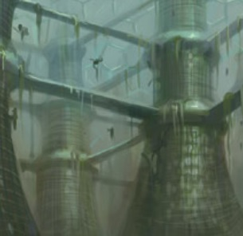
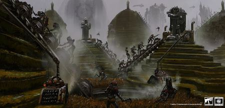
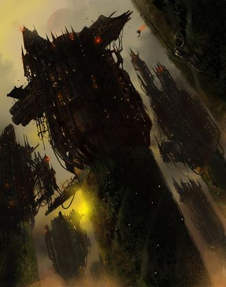
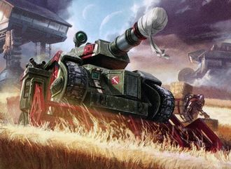

# 0865 农业世界 Agri World

精校状态：中文行文已逐段精校，部分术语仍为暂定

分类：地理 / 真实空间 Real Space

原文来源：https://www.bilibili.com/opus/1161721132392382467

原作者：帝国神选罐头

原文时间：2026年01月25日 14:31

[返回分类目录](目录.md) · [全书目录](../../目录.md)

<!-- A0865-B0001 -->
**英文原文**

"Hunger is no different from any other foe; defeat it in the Emperor’s name, and save Humanity."— Motto of Agri-World Viridia IV

<!-- /A0865-B0001 -->

<!-- A0865-B0002 -->

原译文

“饥饿与任何其他敌人没有什么不同；以帝皇的名义打败它，拯救人类。”— 农业世界维里迪亚四号的箴言

**校订译文**

“饥饿与任何其他敌人没有什么不同；以帝皇的名义打败它，拯救人类。”— 农业世界维里迪亚四号的箴言

<!-- /A0865-B0002 -->

<!-- A0865-B0003 -->
**英文原文**

An Agri-World (Agricultural World or Farming Planet) or α-class (alpha class) is a world classification defined as being devoted to food production. Agri Worlds can have an Oceanic sub-type.

<!-- /A0865-B0003 -->

<!-- A0865-B0004 -->

原译文

农业世界（农用世界或农业行星）或α类（阿尔法类）是一种世界分类，被定义为专门用于粮食生产。农业世界可以有一个海洋亚型。

**校订译文**

农业世界，也称农用世界或农耕行星，在帝国行星分类中列为α类（alpha类），主要从事食物生产，其中还包括海洋型农业世界。

<!-- /A0865-B0004 -->

<!-- A0865-B0005 图片 -->

<!-- A0865-B0006 -->

原译文

Agri-World 农业世界

**校订译文**

Agri-World 农业世界

<!-- /A0865-B0006 -->

<!-- A0865-B0007 -->
## Overview 概述

<!-- /A0865-B0007 -->

<!-- A0865-B0008 -->
**英文原文**

Despite Imperial propaganda, Agri-Worlds are often harsh and polluted environments ruled by an Imerpium that demands ceaseless back-breaking labor from its small populations. Agri Worlds are of paramount importance to the Imperium, for if one falls several others will likely fall indirectly due to a slow starvation. As precious as a Forge World or Mining World, Agri Worlds are often defended accordingly with orbital defences and bastions comparable to Fortress Worlds.

<!-- /A0865-B0008 -->

<!-- A0865-B0009 -->

原译文

尽管帝国进行了宣传，但农业世界往往是由一个帝国统治的恶劣和污染的环境，帝国要求其少数人口不间断地从事繁重的劳动。农业世界对帝国来说至关重要，因为如果一个世界沦陷，其他几个世界可能会因缓慢的饥饿而间接沦陷。与铸造世界或矿业世界一样珍贵，农业世界通常会相应地用与堡垒世界相当的轨道防御和堡垒进行防御。

**校订译文**

尽管帝国宣传声称农业世界十分美好，现实中的许多农业世界却环境恶劣、污染严重。帝国要求当地稀少的人口不停从事足以压垮脊背的重体力劳动。农业世界至关重要：一颗世界陷落，可能使依赖它供粮的其他数颗世界因长期饥饿而相继崩溃。它们的价值不亚于铸造世界或矿业世界，因此通常也设有强大的轨道防御与堡垒，其防卫规模足以比肩堡垒世界。

<!-- /A0865-B0009 -->

<!-- A0865-B0010 图片 -->

<!-- A0865-B0011 -->

原译文

Valley of Ancra on the minor Agri World of Ostia 奥斯蒂亚次级农业世界上的安克拉山谷

**校订译文**

Valley of Ancra on the minor Agri World of Ostia 奥斯蒂亚次级农业世界上的安克拉山谷

<!-- /A0865-B0011 -->

<!-- A0865-B0012 -->
**英文原文**

The majority of an Agri World's surface is given over to producing food for other worlds reliant on such imports - the food itself forms part of the planet's required tithe. Governors of such planets are required by the Adeptus Terra to protect the harvest and meet the quotas placed on them. Often inter-commander rivalry leads to attempts to destroy or steal crops and livestock and then blaming them on pirates or raids.

<!-- /A0865-B0012 -->

<!-- A0865-B0013 -->

原译文

农业世界的大部分面积都用于为依赖此类进口的其他世界生产粮食 — 粮食本身就是行星所需什一税的一部分。中央政务部要求这些行星的管理者保护收成并满足分配给它们的配额。指挥官之间的竞争往往导致破坏或偷窃农作物和牲畜的企图，然后将其归咎于海盗或袭击。

**校订译文**

农业世界的大部分地表用于生产食物，供应依赖进口的其他世界，而食物本身也是该星球须缴纳的什一税。中央政务部要求行星总督保护收成，完成征收配额。统治者之间的竞争却常使他们破坏或盗取彼此的作物和牲畜，再将责任推给海盗或劫掠者。

<!-- /A0865-B0013 -->

<!-- A0865-B0014 -->
**英文原文**

Worlds with 850 parts per 1000 of the planet's surface covered with crop cultivation, hydroponics, animal fodder or animal husbandry are classed as Agri-Worlds. The population usually ranges from between 15,000 to 1,000,000 - which is widely spread across the planet. The tithe grade of such worlds range from Exactis Prima to Exactis Particular.

<!-- /A0865-B0014 -->

<!-- A0865-B0015 -->

原译文

行星表面每千分之850的部分覆盖着作物种植、水培、动物饲料或畜牧业的世界被归类为农业世界。人口通常在1,5000到100,0000之间，分布在行星各地。这些世界的什一税等级从第一级上等到第一级特等。

**校订译文**

地表约85%的面积用于种植作物、水培、饲料生产或畜牧业的星球，会被归类为农业世界。人口通常为1.5万至100万，稀疏分布在各地。什一税等级则介于 Exactis Prima 与 Exactis Particular 之间，原稿暂译“第一级上等”至“第一级特等”。

**校注：** 原译1,5000与100,0000数字分组不规范，依英文15,000—1,000,000改为1.5万至100万。税级中文暂沿原稿，保留英文供核对。

<!-- /A0865-B0015 -->

<!-- A0865-B0016 -->
### Varieties 种类

<!-- /A0865-B0016 -->

<!-- A0865-B0017 -->
**英文原文**

Agri Worlds come in a variety of climates and biosppheres. Often stereotyped as world-farms of endless fields harvested in punishing crop rotations - which is accurate in some cases - there are actually countless ways a world can be exploited for massed food production with just as many varieties of food produced. Examples include teeming insect farms, to industrial abattoir cities, submariner fishing clans, subterranean macro fungus farms, inner ring orbital stations of asteroids, and all other forms of husbandry and harvesting of livestock. Even Ice Worlds can boast agri production, facilitated through various means, such as subterranean caverns or seas. These are only a few examples of all the grotesque landscapes created by Humanity's need to feed itself.

<!-- /A0865-B0017 -->

<!-- A0865-B0018 -->

原译文

农业世界有各种各样的气候和生物群落。通常被定型为世界农场，在惩罚性的作物轮作中收获无尽的田地 — 在某些情况下是准确的 — 实际上，有无数种方法可以利用一个世界进行大规模的粮食生产，生产同样多的粮食品种。例子包括昆虫养殖场、工业屠宰场城市、潜水捕鱼部落、地下大型真菌养殖场、小行星内环轨道站，以及所有其他形式的畜牧业和牲畜收割。即使是冰雪世界也可以通过各种方式（如地下洞穴或海洋）来促进农业生产。这些只是人类需要养活自己而创造的所有怪诞景观中的几个例子。

**校订译文**

农业世界的气候与生物圈形态多种多样。人们常把它们想象成无边无际的巨型农场，以严酷的轮作制度不断收获；有些世界确实如此，但大规模生产食物的方法远不止一种。密集的昆虫养殖场、工业化屠宰城市、潜海捕鱼部族、地下巨型真菌农场、小行星内环轨道站，以及其他各式养殖与收获体系，都能提供食物。即便冰雪世界，也可以利用地下洞窟或海洋开展农业。这些不过是人类为养活自己而创造的无数怪诞景观中的一小部分。

<!-- /A0865-B0018 -->

<!-- A0865-B0019 图片 -->

<!-- A0865-B0020 -->

原译文

Processing silos on Ostia in the isolated valley of Ancra 奥斯蒂亚孤立的安克拉山谷的加工筒仓

**校订译文**

Processing silos on Ostia in the isolated valley of Ancra 奥斯蒂亚孤立的安克拉山谷的加工筒仓

<!-- /A0865-B0020 -->

<!-- A0865-B0021 -->
**英文原文**

Masali, Quintarn and Tarentus form the group of planets called the 'Three Planets' in Ultramar, all of which are desert worlds. They are all classed as agri-worlds because of vast horticultural cities and moisture traps spread across the surface as well as bio-domes under which grow highly fertile forests. They are highly successful at producing vast amounts of food.

<!-- /A0865-B0021 -->

<!-- A0865-B0022 -->

原译文

马萨利、昆塔尔和塔伦图斯组成了奥特拉玛中被称为“三星”的行星群，它们都是沙漠世界。它们都被归类为农业世界，因为广阔的园艺城市和遍布地表的水分捕捉，以及生长着高度肥沃森林的生物穹顶。它们在生产大量食物方面非常成功。

**校订译文**

马萨里、昆坦和塔伦图斯合称奥特拉玛的“三星”。它们本是沙漠世界，却因遍布地表的园艺城市、集水装置，以及穹顶之下生长茂盛森林的生态设施，被归类为农业世界，能够稳定生产大量食物。

<!-- /A0865-B0022 -->

<!-- A0865-B0023 -->
**英文原文**

Oceanic Agri Worlds harvests typically consist of either its abundant marine fauna, or cultivated flora (such as algae or seaweed), or a combination of both algae and seafood.

<!-- /A0865-B0023 -->

<!-- A0865-B0024 -->

原译文

海洋农业世界的收成通常包括丰富的海洋动物群，或栽培的植物群（如藻类或海藻），或藻类和海鲜的组合。

**校订译文**

海洋型农业世界通常捕获丰富的海洋动物，或种植藻类、海草等水生植物，也有世界兼营两者。

<!-- /A0865-B0024 -->

<!-- A0865-B0025 -->
**英文原文**

To combat soil alkalinity, Agri Worlds often import artificial fertilisers from Hive Worlds who process and manufacture such exports from its organic offal.

<!-- /A0865-B0025 -->

<!-- A0865-B0026 -->

原译文

为了对抗土壤碱度，农业世界经常从巢都世界进口人工肥料，巢都世界从其有机废弃物中加工和制造此类出口产品。

**校订译文**

为降低土壤碱性，农业世界常从巢都世界进口人工肥料；这些肥料由巢都的有机废弃物加工而成。

<!-- /A0865-B0026 -->

<!-- A0865-B0027 -->
### World Selection 世界选择

<!-- /A0865-B0027 -->

<!-- A0865-B0028 -->
**英文原文**

All Imperial Agri Worlds are of similar sized, being located in similar orbital zones in their respective systems, receiving a specifically prescribed exposure to solar radiation. Their lands have to be within a tight compositional range, and they have to be close to major Imperial supply worlds. Worlds could also be selected due to an axial tilt that facilitates an endless growing season in one hemisphere.

<!-- /A0865-B0028 -->

<!-- A0865-B0029 -->

原译文

所有帝国农业世界的大小相似，位于各自星系中相似的轨道区域，接受专门规定的太阳辐射曝光时间。他们的土地必须在严格的成分范围内，并且必须靠近主要的帝国补给世界。也可以选择世界，因为轴向倾斜有助于一个半球无休止的生长季节。

**校订译文**

本节所述的标准农业世界，大小相近，位于各自恒星系统中相似的轨道区域，接受规定范围内的恒星辐射。土壤成分须满足严格要求，位置也必须靠近帝国的重要补给世界。若一颗星球的自转轴倾角能使某个半球常年处于生长季，也可能因此被选中。

**校注：** 本段将农业世界规格概括为“全部相似”，与前文多样生态有张力；按其标准化生产语境表述，不消除原稿差异。

<!-- /A0865-B0029 -->

<!-- A0865-B0030 -->
**英文原文**

Some worlds can be converted into Agri-Worlds at later points, if a planetary governor wills it. A Mining World spent of all its resources might petition to be converted into an Agri World, if there are still a salvageable remnants of a biosphere to co-opt. However, changing the tithe classification of a world to that of a different export class could take decades or centuries of work from Adeptus Administratum adepts. During this lengthy interim, many planetary governors could be executed for not fulfilling the tithe as mandated by the existing Administratum records, despite the apparent issues of being unable to do so. A proposed transition, often leads to local social upheaval or even civil wars amongst ruling Noble Houses, Cartels, gangs and general population. If successful, the population of the population of the once terminally unproductive world will be culled and the menials that remain will be worked far harder than before.

<!-- /A0865-B0030 -->

<!-- A0865-B0031 -->

原译文

如果行星管理者愿意，一些世界可以在以后转变为农业世界。如果仍有可挽救的生物圈残余可供选择，一个耗尽所有资源的矿业世界可能会申请转变为农业世界。然而，将世界的什一税分类改为不同的出口类别可能需要内务部专家们数十年或数百年的努力。在这漫长的过渡期间，许多行星总督可能会因为没有履行现有内务部记录规定的什一税而被处决，尽管显然存在无法这样做的问题。拟议的过渡往往会导致当地社会动荡，甚至导致统治贵族、企业联合、帮派和普通民众之间的内战。如果成功，这个曾经极度缺乏生产力的世界的人口将被淘汰，剩下的卑微者将比以前更加努力地工作。

**校订译文**

行星总督也可以申请在日后把原有世界转为农业世界。例如矿藏枯竭的矿业世界，只要还残留可利用的生物圈，就可能寻求转型。但要把什一税记录改成新的出口类别，往往需内政部文吏花费数十年乃至数百年。在漫长的等待期内，即使旧定额显然已无法完成，许多总督仍可能因未按现有档案缴足税额而被处决。转型提案也常引发社会动荡，甚至使统治贵族、卡特尔、帮派与普通民众卷入内战。即使转型成功，这个原本已失去生产前景的世界仍会经历人口削减，而留下的劳工将比过去工作得更加辛苦。

**校注：** cull 在帝国管理语境指削减人口，不是自然淘汰；menials 是劳工，不是抽象的卑微者。

<!-- /A0865-B0031 -->

<!-- A0865-B0032 -->
### Culture 文化

<!-- /A0865-B0032 -->

<!-- A0865-B0033 -->
**英文原文**

The Imperium is a diverse collection of worlds and the customs and traditions of from one Agri World to another can vary just as drastically. Some have Harvest Tithe festivals, where the inhabitant's celebrate with increased work hours of back-breaking labour that are bolstered by constant hymn. During the Harvest Tithe death tolls have a huge increase. This has lead many to local Death Cults to arise and incorporate outright human sacrifice, as well. If a Tithe vessel does not come, such as due to the Noctis Aeterna, populations might increase these bloody self-destructive traditions.

<!-- /A0865-B0033 -->

<!-- A0865-B0034 -->

原译文

帝国是一个多样化的世界集合，不同农业世界的习俗和传统也可能大相径庭。有些人有什一税收获节，那里的居民通过不断吟唱赞美诗来支撑他们繁重劳动的增加的工作时间，以此庆祝。在什一税收获，死亡人数大幅增加。这导致许多当地的死亡教派兴起，并纳入了彻底的人类献祭。如果什一税战舰不来，比如由于永恒之夜，人口可能会增加这些血腥的自我毁灭传统。

**校订译文**

帝国诸世界千差万别，农业世界之间的习俗也同样悬殊。有些地方庆祝什一税收获节的方式，是延长繁重劳动的工时，并以不间断的赞美诗鼓舞劳作。节日期间，死亡人数会大幅增加，许多地方由此出现死亡教派，甚至直接施行人祭。如果征税舰迟迟不来——例如受到永恒之夜影响——居民还可能进一步加剧这些血腥、自毁的传统。

<!-- /A0865-B0034 -->

<!-- A0865-B0035 图片 -->

<!-- A0865-B0036 -->

原译文

Viridia IV 维里迪亚四号

**校订译文**

Viridia IV 维里迪亚四号

<!-- /A0865-B0036 -->

<!-- A0865-B0037 -->
**英文原文**

Populations of Agri Worlds might be physically stronger and more muscled than the average Imperial, in general, due to their ceaseless physical toil. Others might be dexterously adept at a single monotonous task their life is dedicated to. Others still might have exceptional organisational system skills from the record-keeping and cataloguing of such vast quantities of imports and exports, a trait that leads the Adeptus Administrum to scoop up such individuals.

<!-- /A0865-B0037 -->

<!-- A0865-B0038 -->

原译文

一般来说，由于他们不断的体力劳动，农业世界的人口可能比普通帝国的人口身体更强壮，肌肉更发达。其他人可能擅长于他们一生中致力于的一项单调任务。其他人可能仍然具有出色的组织系统技能，能够记录和编目如此大量的进出口货物，这一特点促使内务部抓住这样的人。

**校订译文**

长期体力劳动可能使农业世界居民比一般帝国人更加健壮、肌肉发达。另一些人一生只重复一项单调工作，却因此练就极熟巧的技艺。还有人因长年记录、分类巨量进出口物资，养成出色的组织与管理能力，受到内政部招揽。

<!-- /A0865-B0038 -->

<!-- A0865-B0039 -->
**英文原文**

External influences like the Ecclesiarchy or Adeptus Mechanicus might seek to gain influence over an Agri-world through various means. The former could seek to indoctrinate the menial masses into believing that worship of the God-Emperor is shown through fervent labour during their 12 hour shifts. While the latter might seek to automate and increase yields and efficiency through servitorisation of much of the workforce.

<!-- /A0865-B0039 -->

<!-- A0865-B0040 -->

原译文

外部影响，如教会或机械神教，可能会通过各种方式寻求对农业世界的影响。前者可以试图向卑微的群众灌输，让他们相信在12小时的轮班中，对神皇的崇拜是通过狂热的劳动来体现的。而后者可能会寻求通过为大部分劳动力进行机仆化来实现自动化，提高产量和效率。

**校订译文**

国教与机械修会等外来机构，也会用各种手段扩大对农业世界的影响。前者可能教导劳苦大众，在每天十二小时的轮班中热切劳动，就是敬奉神皇；后者则可能将大部分劳动力改造成机仆，以实现自动化，提高产量与效率。

<!-- /A0865-B0040 -->

<!-- A0865-B0041 -->
### Quote 引用

<!-- /A0865-B0041 -->

<!-- A0865-B0042 -->
**英文原文**

A passage from the Lords of Silence described the process of creating and maintaining an Agri-World:

<!-- /A0865-B0042 -->

<!-- A0865-B0043 -->

原译文

寂静王的一段话描述了创建和维护农业世界的过程：

**校订译文**

《寂静领主》中的下列段落，描写了农业世界的建造与运作：

**校注：** Lords of Silence 为书名寂静领主，不是太空死灵的寂静王。下列引文按所给文本逐段翻译。

<!-- /A0865-B0043 -->

<!-- A0865-B0044 -->
**英文原文**

All agri worlds are of similar size, located in similar orbital zones within their void systems and subject to specific exposure to a prescribed spectrum of solar radiation. Their soils have to be within a tight compositional range, and they have to be close to major supply worlds.

<!-- /A0865-B0044 -->

<!-- A0865-B0045 -->

原译文

所有的农业世界都有相似的大小，位于其虚空星系内相似的轨道区域，并受到规定光谱的太阳辐射的特定照射。它们的土壤必须在严格的成分范围内，并且必须靠近主要的补给世界。

**校订译文**

所有农业世界的大小都相近，位于各自恒星系统中相似的轨道区域，并接受特定强度、规定光谱的恒星辐射。土壤成分必须严格达标，星球也必须靠近主要补给世界。

<!-- /A0865-B0045 -->

<!-- A0865-B0046 -->
**英文原文**

The Imperium is not a gentle custodian of such places. After discovery of a candidate planet, the first fifty years are spent in terraforming according to well-worn Martian procedures. All pre-existing life is scrubbed from the rocks, either by the application of controlled virus-chewers or by timed flame-drops. The atmosphere is regulated, first through the actions of gigantic macro-processors and thereafter by a land-based network of control units, more commonly referred to as command nodes. Weather, as least as generally understood, disappears. Rainfall becomes a matter of controlled timing, governed by satellites in low orbit and kept in line by fleets of dirigibles. The empty landscape is divided up into colossal production zones, each patrolled by crawlers and pest-thopters. Millions of base-level servitors are imported, kept at the very lowest level of cognitive function but bulked up by a ruthless level of muscle-binders.

<!-- /A0865-B0046 -->

<!-- A0865-B0047 -->

原译文

帝国不是这些地方的温和守护者。在发现一颗候选行星后，前五十年将根据火星上的成熟流程进行地球化改造。所有预先存在的生命都被从岩石上抹去，要么是通过使用受控的吞噬病毒，要么是定时降下火焰。大气首先通过大型宏处理器的行动进行调节，然后由陆基控制单元网络（通常称为指挥节点）进行调节。天气，至少正如人们普遍理解的那样，消失了。降雨成为一个时间控制问题，由低轨道上的卫星控制，并由飞船舰队保持一致。空旷的地形被划分为巨大的生产区，每个生产区都有爬行者和害虫扑翼机巡逻。数以百万计的基础级的机仆被进口，保持在认知功能的最低水平，但被无情的肌肉束等级所增强。

**校订译文**

帝国对这些地方从不温柔。找到合适的星球后，最初五十年用于执行早已定型的火星环境改造程序。受控的吞噬病毒，或按时投下的烈焰，会将地表原有生命清除殆尽。巨型处理设备先调节大气，随后由遍布地面的控制单元接管——人们通常称它们为指挥节点。至少在通常意义上，天气从此不复存在。降雨按计划发生，由低轨卫星控制，再由飞艇群调节。空旷地表被划成巨大的生产区，各区都有履带车辆与灭虫扑翼机巡查。数百万基础型机仆被运来，它们的认知功能被压至最低，肌肉却经过近乎残酷的强化。

**校注：** dirigibles 是飞艇，不是太空舰队；pest-thopters 按农用防虫语境译灭虫扑翼机。

<!-- /A0865-B0047 -->

<!-- A0865-B0048 -->
**英文原文**

Soon after this process completes, every agri world looks exactly the same – a flat, wind-rummaged plain of high-yield crops swaying towards the empty horizon. A person could walk for days and never see a distinctive feature. Not that anyone sane would choose to walk in such places – the industrial fertiliser dumps are so powerful that they turn the air orange and make it impossible to breathe unfiltered. A single growing season exhausts the soil completely, requiring continual delivery of more sprays of nitrates and phosphates, all delivered from the grimy berths of hovering despatch flyers. The entire world is given over to a remorseless monoculture, with orthogonal drainage channels burning with chem-residue and topsoil continually degrading into flimsier and flimsier dust.

<!-- /A0865-B0048 -->

<!-- A0865-B0049 -->

原译文

这个过程完成后不久，每个农业世界看起来都完全一样 — 一片平坦的、风吹的高产作物平原，向空旷的地平线摇曳。一个人可能会走上几天，却看不到任何明显的特征。并不是说任何理智的人都会选择在这样的地方行走 — 工业化肥堆的威力如此之大，以至于空气变成橙色，不经过滤就无法呼吸。一个生长季节就会完全耗尽土壤，需要不断地喷洒更多的硝酸盐和磷酸盐，所有这些都是从肮脏泊位上的盘旋发射飞行器喷洒的。整个世界都被无情的单一栽培所取代，正交的排水渠里燃烧着化学残留物，表层土不断降解成越来越脆弱的灰尘。

**校订译文**

改造完成后不久，每个农业世界便几乎一模一样：平坦原野上，高产作物随风摇摆，一直延伸到空无一物的地平线。一个人走上几天，也看不到任何可以辨认方位的地貌。当然，头脑清醒的人不会选择在这里徒步。工业肥料强烈的污染能将空气染成橙色，不经过滤便无法呼吸。一个生长季就足以耗尽土壤肥力，必须从悬停运输飞行器肮脏的舱位中，不断向地面喷洒硝酸盐和磷酸盐。整颗星球被迫种植单一作物，纵横直交的排水渠中充斥灼人的化学残留，表土不断退化，化为越来越细碎的尘埃。

<!-- /A0865-B0049 -->

<!-- A0865-B0050 -->
**英文原文**

But that doesn’t matter. A planet can be driven like this for thousands of years before it eventually keels over and becomes a death world. The quality of the crops gets steadily worse, but the quantity can be sustained almost indefinitely, assuming that supply lines are maintained and imports remain consistent. At the end of every season, the great harvester leviathans are stoked up and dragged from their pens and let loose on the grey fields, smokestacks belching and tracked undercarriages sinking deep. These massive creatures of high-sided metal and intricate pipework, the smallest of which are a hundred metres long, crawl across the blasted prairies, sucking up every last speck of pallid grain and piping it directly to antiseptic internal hoppers. Feed-landers come down from high flight, dock with the still-trundling leviathans and extract the raw material, from where it is taken into the city-sized processor vats, blasted with antibiotics, smashed, burned, crushed, then stamped and packaged. Once ready for transport, containers are dragged up into orbit aboard swell-bellied landers, ready for transfer to the void-bound mass conveyers, which deliver the refined product to every starving hive world and forge world in their long circuits.

<!-- /A0865-B0050 -->

<!-- A0865-B0051 -->

原译文

但这并不重要。一颗行星可以像这样被驱动数千年，直到它最终倾覆并成为一个死亡世界。作物的质量稳步下降，但如果供应线保持不变，进口保持一致，产量几乎可以无限期维持。每个季节结束时，巨大的收割者利维坦都会被启用，从围栏里移出来，在灰色的田野上放开，烟囱冒着烟，履带式起落架陷得很深。这些巨大的造物由高支撑金属和复杂的管道组成，其中最小的有一百米长，它们爬行在荒芜的草原上，吸走每一粒苍白的谷物，并将其直接输送到防腐的内部料斗中。进料斜槽从高空降落，与仍在移动的利维坦对接，提取原材料，从那里将其放入城市大小的加工桶中，用抗菌素爆破，破碎，焚烧，压碎，然后盖章和包装。一旦准备好运输，集装箱就会被装载在胀满的登陆舰上拖上轨道，准备转移到空绑的大输送机上，这些输送机在漫长的巡回中将精制产品运送到每个饥饿的巢都世界和铸造世界。

**校订译文**

但这无关紧要。星球可以被如此榨取数千年，直到最终崩溃，变成死亡世界。作物品质会持续下降，但只要补给线畅通、输入物资稳定，产量几乎可以无期限维持。每个收获季末，巨大的收割机械便被启动，拖出停放处，放入灰色田野。它们烟囱喷吐浓烟，履带深陷土壤，仿佛由高耸金属外壳与复杂管道拼成的巨兽；最小的一台也有百米长。它们爬过荒败的平原，吸尽每一粒苍白谷物，直接送入内部的无菌料斗。运粮登陆艇从高空降下，与仍在缓缓前进的巨兽对接，抽走原料，运往城市般庞大的处理槽。粮食在那里经过抗生素处理，再被打碎、焙烧、碾压，最终压制成型、包装。准备妥当的货箱装入大腹登陆艇，送上轨道，转交在虚空中航行的巨型运输船。这些船沿着漫长航线，将加工后的成品送往饥饿的巢都世界与铸造世界。

**校注：** harvester leviathans 为比喻巨型收割机械，不是泰伦利维坦虫巢舰队；feed-landers 是运粮登陆艇，非进料斜槽；tracked undercarriages 为履带底盘，非飞行器起落架。

<!-- /A0865-B0051 -->

<!-- A0865-B0052 -->
**英文原文**

There is a quaint tradition in the various propaganda departmentos of the Administratum of marketing agri worlds as quasi-paradises, free of the squalor and overcrowding of a standard urban station, and full of bucolic ease. Vid-cards are dropped into communal hab-warrens, extolling the virtues of a life lived outdoors with the sun on your back and a ruddy-faced boy or girl – subject to preference – by your side. In reality, life on an agri world is as unrelenting, back-breaking and monotonous as the vast majority of other Imperial vocations. There are no trees laden with glossy fruit, only kilometre after kilometre of hissing corn.

<!-- /A0865-B0052 -->

<!-- A0865-B0053 -->

原译文

内务部的各个宣传部门都有一种古怪的传统，将农业世界营销为准天堂，没有标准城市站的肮脏和过度拥挤，充满了田园般的安逸。视频卡被放在公共厕所里，赞美户外生活的优点，阳光照在你的背上，一个面色红润的男孩或女孩 — 取决于你的喜好 — 在你身边。事实上，农业世界的生活和绝大多数其他帝国职业一样无情、累人和单调。这里没有结满光滑果实的树，只有一公里又一公里发出嘶嘶声的谷物。

**校订译文**

内政部各宣传部门有一种奇特传统：把农业世界包装成近乎乐土的地方，宣称那里没有寻常城市聚居区的污秽与拥挤，只有田园生活的闲适。他们向密集的公共居住区投放影像卡片，赞美户外生活：阳光洒在背上，身边还有一位面色红润的男孩或女孩，任君选择。现实却是，农业世界的生活与帝国绝大多数职业一样，严苛、沉重、单调。这里没有挂满鲜亮果实的树木，只有连绵数公里、在风中沙沙作响的谷物。

**校注：** communal hab-warrens 是密集公共住区，不是公共厕所；corn 此处按泛指谷物处理。

<!-- /A0865-B0053 -->

<!-- A0865-B0054 -->
**英文原文**

There are no gentle strolls under the warming sun, only punishing work details in rad-suits, leaning into the dust-laden winds that howl around the equator with nothing to halt their rampage. Once the new arrivals have made planetfall and found this out, it is too late. Crew transports arrive on agri worlds full and leave empty. There is a saying among the indentured workers – you come for the soil, you end up part of it.

<!-- /A0865-B0054 -->

<!-- A0865-B0055 -->

原译文

在温暖的阳光下没有温和的散步，只有穿着防护服的惩罚工作细节，靠在赤道周围呼啸而过的尘土飞扬的风中，没有什么能阻止他们的暴行。一旦新来者发现了这一点，就太晚了。载人运输船满载抵达农业世界，空着离开。契约工人中有一句话 — 你来是为了土地，你最终会成为其中的一部分。

**校订译文**

这里没有暖阳下的悠然漫步，只有穿着防辐射服从事的严酷劳役。工人必须迎着尘风艰难前行；风暴环绕赤道呼啸，毫无遮挡。新来者降落地表、看清真相时，已经太迟。载人运输船满载而来，空船离去。契约劳工之间流传着一句话：“你为土地而来，最后也会化作它的一部分。”

**校注：** work details 指被分派的劳役，不是工作细节。

<!-- /A0865-B0055 -->

<!-- A0865-B0056 -->
## Notable Agri-Worlds 著名农业世界

<!-- /A0865-B0056 -->

<!-- A0865-B0057 -->

原译文

Aegis 神盾星

**校订译文**

Aegis 神盾星

<!-- /A0865-B0057 -->

<!-- A0865-B0058 -->

原译文

Aipolodon IV 艾波洛顿四号

**校订译文**

Aipolodon IV 艾波洛顿四号

<!-- /A0865-B0058 -->

<!-- A0865-B0059 -->
**英文原文**

Archaea IV - Ultima Segmentum

<!-- /A0865-B0059 -->

<!-- A0865-B0060 -->

原译文

古菌四号 - 极限星域

**校订译文**

古菌四号 - 极限星域

<!-- /A0865-B0060 -->

<!-- A0865-B0061 -->

原译文

Archaea System 古菌星系

**校订译文**

Archaea System 古菌星系

<!-- /A0865-B0061 -->

<!-- A0865-B0062 -->
**英文原文**

Argus - Quintillus System

<!-- /A0865-B0062 -->

<!-- A0865-B0063 -->

原译文

阿耳戈斯 - 昆提卢斯星系

**校订译文**

阿耳戈斯 - 昆提卢斯星系

<!-- /A0865-B0063 -->

<!-- A0865-B0064 -->
**英文原文**

Barbarossa IV - Segmentum Solar - The Black Templars hold – Barbarossa Keep is located there.

<!-- /A0865-B0064 -->

<!-- A0865-B0065 -->

原译文

巴巴罗萨四号 - 太阳星域 - 黑色圣堂坚守-巴巴罗萨要塞就在那里。

**校订译文**

巴巴罗萨四号——太阳星域；黑色圣堂的巴巴罗萨要塞坐落于此。

<!-- /A0865-B0065 -->

<!-- A0865-B0066 -->

原译文

Bellis XIV 贝利斯14号

**校订译文**

Bellis XIV 贝利斯十四号

<!-- /A0865-B0066 -->

<!-- A0865-B0067 -->
**英文原文**

Boonhaven - Segmentum Pacificus - Cabulis System

<!-- /A0865-B0067 -->

<!-- A0865-B0068 -->

原译文

布恩港 - 太平星域 - 卡布利斯星系

**校订译文**

布恩港 - 太平星域 - 卡布利斯星系

<!-- /A0865-B0068 -->

<!-- A0865-B0069 -->
**英文原文**

Candau (former) - Segmentum Ultima - Badab Sector - Now – Dead World

<!-- /A0865-B0069 -->

<!-- A0865-B0070 -->

原译文

坎道（前）- 极限星域 - 巴达布星区 - 现-死亡世界

**校订译文**

坎道（前）- 极限星域 - 巴达布星区 - 现-死寂世界

<!-- /A0865-B0070 -->

<!-- A0865-B0071 -->

原译文

Cassell 卡塞尔

**校订译文**

Cassell 卡塞尔

<!-- /A0865-B0071 -->

<!-- A0865-B0072 -->

原译文

Chariban Worlds 鬼魂世界

**校订译文**

Chariban Worlds 鬼魂世界

<!-- /A0865-B0072 -->

<!-- A0865-B0073 -->
**英文原文**

Chiros - Segmentum Tempestus

<!-- /A0865-B0073 -->

<!-- A0865-B0074 -->

原译文

凯罗斯 - 暴风星域

**校订译文**

彻洛斯——暴风星域。

<!-- /A0865-B0074 -->

<!-- A0865-B0075 -->
**英文原文**

Colcha - Segmentum Pacificus

<!-- /A0865-B0075 -->

<!-- A0865-B0076 -->

原译文

科尔查 - 太平星域

**校订译文**

科尔查 - 太平星域

<!-- /A0865-B0076 -->

<!-- A0865-B0077 -->
**英文原文**

Crultus - Macharian Sector - Cytheris Sub-Sector - Geminax System - Agri-World and agricultural centre of the Macharian Sector.

<!-- /A0865-B0077 -->

<!-- A0865-B0078 -->

原译文

克鲁特斯 - 马卡里安星区 - 西瑟里斯分区 - 杰米纳克斯星系 - 农业世界和马卡里安星区的农业中心。

**校订译文**

克鲁特斯 - 马卡里安星区 - 西瑟里斯次星区 - 杰米纳克斯星系 - 农业世界和马卡里安星区的农业中心。

<!-- /A0865-B0078 -->

<!-- A0865-B0079 -->

原译文

Curwen 柯温

**校订译文**

Curwen 柯温

<!-- /A0865-B0079 -->

<!-- A0865-B0080 -->
**英文原文**

Cyrus Vulpa - Segmentum Obscurus - Calixis Sector - Golgenna Reach

<!-- /A0865-B0080 -->

<!-- A0865-B0081 -->

原译文

西鲁斯·沃尔帕 - 朦胧星域 - 卡利西斯星区 - 戈尔根纳河段

**校订译文**

西鲁斯·沃尔帕 - 朦胧星域 - 卡利西斯星区 - 戈尔根纳疆域

<!-- /A0865-B0081 -->

<!-- A0865-B0082 -->
**英文原文**

Danik's World (former) - Now – War World, Ice World

<!-- /A0865-B0082 -->

<!-- A0865-B0083 -->

原译文

丹尼克世界（前）- 现-战争世界，冰雪世界

**校订译文**

丹尼克世界（前）- 现-战争世界，冰雪世界

<!-- /A0865-B0083 -->

<!-- A0865-B0084 -->

原译文

Delta Arbuthnot 德尔塔·阿巴思诺特

**校订译文**

Delta Arbuthnot 德尔塔·阿巴思诺特

<!-- /A0865-B0084 -->

<!-- A0865-B0085 -->
**英文原文**

Delta-Garmon II - Segmentum Solar - Beta-Garmon Cluster - Delta-Garmon System

<!-- /A0865-B0085 -->

<!-- A0865-B0086 -->

原译文

德尔塔-伽蒙二号 - 太阳星域 - 贝塔-伽蒙群星 - 德尔塔-伽蒙星系

**校订译文**

德尔塔-伽蒙二号 - 太阳星域 - 贝塔-伽蒙星群 - 德尔塔-伽蒙星系

**校注：** Beta-Garmon Cluster与863等同一星群统一中文。

<!-- /A0865-B0086 -->

<!-- A0865-B0087 -->

原译文

Dennar IV 丹纳四号

**校订译文**

Dennar IV 丹纳四号

<!-- /A0865-B0087 -->

<!-- A0865-B0088 -->
**英文原文**

Dentor - One of the main food supplier of Forge World Agripinaa

<!-- /A0865-B0088 -->

<!-- A0865-B0089 -->

原译文

登托尔 - 阿格里皮娜铸造世界的主要食品供应者之一

**校订译文**

登托尔 - 阿格里皮娜铸造世界的主要食品供应者之一

<!-- /A0865-B0089 -->

<!-- A0865-B0090 -->
**英文原文**

Dinorwyc Cluster - Segmentum Obscurus - Cadian Sector

<!-- /A0865-B0090 -->

<!-- A0865-B0091 -->

原译文

迪诺威克群星 - 朦胧星域 - 卡迪亚星区

**校订译文**

迪诺威克群星 - 朦胧星域 - 卡迪亚星区

<!-- /A0865-B0091 -->

<!-- A0865-B0092 -->
**英文原文**

Dreah - Segmentum Obscurus - Calixis Sector - Markayn Marches - Dreah System

<!-- /A0865-B0092 -->

<!-- A0865-B0093 -->

原译文

德里亚 - 朦胧星域 - 卡利西斯星区 - 马尔凯恩边区 - 德里亚星系

**校订译文**

德里亚 - 朦胧星域 - 卡利西斯星区 - 马尔坎边区 - 德里亚星系

<!-- /A0865-B0093 -->

<!-- A0865-B0094 -->
**英文原文**

Durer - Segmentum Obscurus - Scarus Sector - Ophidian Subsector

<!-- /A0865-B0094 -->

<!-- A0865-B0095 -->

原译文

杜雷尔 - 朦胧星域 - 斯卡鲁斯星区 - 欧菲迪安分区

**校订译文**

杜雷尔 - 朦胧星域 - 斯卡鲁斯星区 - 欧菲迪安次星区

<!-- /A0865-B0095 -->

<!-- A0865-B0096 -->

原译文

Eden Prime 伊甸一号

**校订译文**

Eden Prime 伊甸一号

<!-- /A0865-B0096 -->

<!-- A0865-B0097 -->
**英文原文**

Eireius (former) - Also former Jungle World, now – Dead World

<!-- /A0865-B0097 -->

<!-- A0865-B0098 -->

原译文

埃瑞乌斯（前）- 也是前丛林世界，现-死亡世界

**校订译文**

埃瑞乌斯（前）- 也是前丛林世界，现-死寂世界

<!-- /A0865-B0098 -->

<!-- A0865-B0099 -->
**英文原文**

Epirus - Segmentum Tempestus - Orpheus Sector

<!-- /A0865-B0099 -->

<!-- A0865-B0100 -->

原译文

伊庇鲁斯 - 暴风星域 - 俄耳甫斯星区

**校订译文**

伊庇鲁斯 - 暴风星域 - 俄耳甫斯星区

<!-- /A0865-B0100 -->

<!-- A0865-B0101 -->
**英文原文**

Erinia (former) - Now – Dead World

<!-- /A0865-B0101 -->

<!-- A0865-B0102 -->

原译文

厄里尼亚（前）- 现-死亡世界

**校订译文**

厄里尼亚（前）- 现-死寂世界

<!-- /A0865-B0102 -->

<!-- A0865-B0103 -->

原译文

Euthenia XX 尤西尼亚20号

**校订译文**

Euthenia XX 尤西尼亚二十号

<!-- /A0865-B0103 -->

<!-- A0865-B0104 -->
**英文原文**

Fleishgate - Livestock and slaughterhouse Agri World producing Grox, Bovian, and Gronlock exports to the Mawdlin System.

<!-- /A0865-B0104 -->

<!-- A0865-B0105 -->

原译文

血肉之门 - 畜牧业和屠宰场农业世界生产格洛克斯、博维安和格隆洛克，出口到莫德林星系。

**校订译文**

血肉之门 - 畜牧业和屠宰场农业世界生产格洛克斯、博维安和格隆洛克，出口到莫德林星系。

<!-- /A0865-B0105 -->

<!-- A0865-B0106 -->
**英文原文**

Gehöft (former) - Now – Dead World

<!-- /A0865-B0106 -->

<!-- A0865-B0107 -->

原译文

农庄星（前）- 现-死亡世界

**校订译文**

格霍夫特（原农业世界）——现为死寂世界。

<!-- /A0865-B0107 -->

<!-- A0865-B0108 -->
**英文原文**

Gheistos (former) - Now – Dead World

<!-- /A0865-B0108 -->

<!-- A0865-B0109 -->

原译文

盖斯托斯（前）- 现-死亡世界

**校订译文**

盖斯托斯（前）- 现-死寂世界

<!-- /A0865-B0109 -->

<!-- A0865-B0110 -->
**英文原文**

Gravalax - Ultima Segmentum

<!-- /A0865-B0110 -->

<!-- A0865-B0111 -->

原译文

格拉瓦拉克斯 - 极限星域

**校订译文**

格拉瓦拉克斯 - 极限星域

<!-- /A0865-B0111 -->

<!-- A0865-B0112 -->
**英文原文**

Gruss - Segmentum Obscurus - Calixis Sector - Modren’s Realm - The planet of the Vir Modren Rogue Trader Realm

<!-- /A0865-B0112 -->

<!-- A0865-B0113 -->

原译文

格鲁斯 - 朦胧星域 - 卡利西斯星区 - 莫德伦领域 - 行商浪人维尔·莫德伦领域的行星

**校订译文**

格鲁斯——朦胧星域；卡利西斯星区、莫德伦领地；属于行商浪人维尔·莫德伦统治的疆域。

<!-- /A0865-B0113 -->

<!-- A0865-B0114 -->

原译文

Hamooth 哈穆斯

**校订译文**

Hamooth 哈穆斯

<!-- /A0865-B0114 -->

<!-- A0865-B0115 -->
**英文原文**

Hesiod's Wake - Segmentum Obscurus - Calixis Sector - Hazeroth Abyss

<!-- /A0865-B0115 -->

<!-- A0865-B0116 -->

原译文

赫西俄德的觉醒 - 朦胧星域 - 卡利西斯星区 - 哈洗录深渊

**校订译文**

赫西奥德的觉醒 - 朦胧星域 - 卡利西斯星区 - 哈冼录深渊

<!-- /A0865-B0116 -->

<!-- A0865-B0117 -->
**英文原文**

Hilarion - Segmentum Obscurus - Calixis Sector - Hazeroth Abyss - Approximately 750,000,000 - Also – Feudal World

<!-- /A0865-B0117 -->

<!-- A0865-B0118 -->

原译文

希拉里翁 - 朦胧星域 - 卡利西斯星区 - 哈洗录深渊 - 约7.5亿 - 也是-封建世界

**校订译文**

希拉里翁 - 朦胧星域 - 卡利西斯星区 - 哈冼录深渊 - 约7.5亿 - 也是-封建世界

<!-- /A0865-B0118 -->

<!-- A0865-B0119 -->
**英文原文**

Hubris IV - Segmentum Obscurus - White Dwarf 264 (UK), pg. 67

<!-- /A0865-B0119 -->

<!-- A0865-B0120 -->

原译文

傲慢四号 - 朦胧星域 - 白矮人264期（UK）,67页

**校订译文**

傲慢四号——朦胧星域。底稿来源：《白矮人》英国版第264期，第67页。

<!-- /A0865-B0120 -->

<!-- A0865-B0121 -->
**英文原文**

Iax (former) - Ultima Segmentum - Ultramar - Iax System - Now – Death World. Also – former Paradise World

<!-- /A0865-B0121 -->

<!-- A0865-B0122 -->

原译文

艾克斯（前）- 极限星域 - 奥特拉玛 - 艾克斯星系 - 现-死亡世界。也是-前天堂世界

**校订译文**

艾克斯（前）- 极限星域 - 奥特拉玛 - 艾克斯星系 - 现-死亡世界。也是-前天堂世界

<!-- /A0865-B0122 -->

<!-- A0865-B0123 -->

原译文

Iesta Veracrux 艾斯塔·维拉克鲁克斯

**校订译文**

Iesta Veracrux 艾斯塔·维拉克鲁克斯

<!-- /A0865-B0123 -->

<!-- A0865-B0124 -->
**英文原文**

Iocanthos - Segmentum Obscurus - Calixis Sector - Golgenna Reach - 5,000,000,000

<!-- /A0865-B0124 -->

<!-- A0865-B0125 -->

原译文

伊欧坎索斯 - 朦胧星域 - 卡利西斯星区 - 戈尔根纳河段 - 50,0000,0000

**校订译文**

伊卡索斯——朦胧星域；卡利西斯星区、戈尔根纳疆域；人口50亿。

<!-- /A0865-B0125 -->

<!-- A0865-B0126 -->
**英文原文**

Jouran V - Jouran System

<!-- /A0865-B0126 -->

<!-- A0865-B0127 -->

原译文

约兰五号 - 约兰星系

**校订译文**

约兰五号 - 约兰星系

<!-- /A0865-B0127 -->

<!-- A0865-B0128 -->

原译文

Jumael IV 朱梅尔四号

**校订译文**

Jumael IV 朱梅尔四号

<!-- /A0865-B0128 -->

<!-- A0865-B0129 -->

原译文

Kabaal II 卡巴尔二号

**校订译文**

Kabaal II 卡巴尔二号

<!-- /A0865-B0129 -->

<!-- A0865-B0130 -->
**英文原文**

Kataris (former) - Segmentum Obscurus - Now – Dead World

<!-- /A0865-B0130 -->

<!-- A0865-B0131 -->

原译文

卡塔里斯（前）- 朦胧星域 - 现-死亡世界

**校订译文**

卡塔里斯（前）- 朦胧星域 - 现-死寂世界

<!-- /A0865-B0131 -->

<!-- A0865-B0132 -->
**英文原文**

Khai-zhan - Segmentum Obscurus - Cadian Sector - 4 million roughly

<!-- /A0865-B0132 -->

<!-- A0865-B0133 -->

原译文

凯-占 - 朦胧星域 - 卡迪亚星区 - 大约400万

**校订译文**

凯詹——朦胧星域；卡迪亚星区；人口约400万。

<!-- /A0865-B0133 -->

<!-- A0865-B0134 -->
**英文原文**

Kurkaris - Crucis

<!-- /A0865-B0134 -->

<!-- A0865-B0135 -->

原译文

库尔卡里斯 - 十字

**校订译文**

库尔卡里斯 - 十字

<!-- /A0865-B0135 -->

<!-- A0865-B0136 -->

原译文

Lesh 莱什

**校订译文**

Lesh 莱什

<!-- /A0865-B0136 -->

<!-- A0865-B0137 -->
**英文原文**

Libro - Segmentum Obscurus - Geminon System

<!-- /A0865-B0137 -->

<!-- A0865-B0138 -->

原译文

利布罗 - 朦胧星域 - 杰米农星系

**校订译文**

利布罗 - 朦胧星域 - 杰米农星系

<!-- /A0865-B0138 -->

<!-- A0865-B0139 -->
**英文原文**

Loressa - Agri World. Birthworld of Witch Hunter Tyrus. Attacked by the Daemon Prince Kholoth. - White Dwarf 260 (UK), pg. 58

<!-- /A0865-B0139 -->

<!-- A0865-B0140 -->

原译文

洛蕾莎 - 农业世界。女巫猎手泰勒斯的出生地。被恶魔王子科洛特袭击。- 白矮人260期（UK），58页

**校订译文**

洛蕾莎——猎巫者泰勒斯的出生地，曾遭恶魔亲王科洛特袭击。底稿来源：《白矮人》英国版第260期，第58页。

<!-- /A0865-B0140 -->

<!-- A0865-B0141 -->

原译文

Marunda II 马伦达二号

**校订译文**

Marunda II 马伦达二号

<!-- /A0865-B0141 -->

<!-- A0865-B0142 -->
**英文原文**

Masali - Ultima Segmentum

<!-- /A0865-B0142 -->

<!-- A0865-B0143 -->

原译文

马萨利 - 极限星域

**校订译文**

马萨里——极限星域。

<!-- /A0865-B0143 -->

<!-- A0865-B0144 -->
**英文原文**

Numinal - Segmentum Obscurus - Coronid Deeps - Ocean World

<!-- /A0865-B0144 -->

<!-- A0865-B0145 -->

原译文

努米纳尔 - 朦胧星域 - 王冠深渊 - 海洋世界

**校订译文**

努米纳尔——朦胧星域；科罗尼德深渊；也是海洋世界。

<!-- /A0865-B0145 -->

<!-- A0865-B0146 -->

原译文

Omus-2.8 奥姆斯-2.8

**校订译文**

Omus-2.8 奥姆斯-2.8

<!-- /A0865-B0146 -->

<!-- A0865-B0147 -->
**英文原文**

Orbel Quill - Segmentum Obscurus - Calixis Sector - Malfian Subsector

<!-- /A0865-B0147 -->

<!-- A0865-B0148 -->

原译文

奥贝尔·奎尔 - 朦胧星域 - 卡利西斯星区 - 马尔菲安分区

**校订译文**

奥贝尔·奎尔 - 朦胧星域 - 卡利西斯星区 - 马尔菲安次星区

<!-- /A0865-B0148 -->

<!-- A0865-B0149 -->
**英文原文**

Ostia - Segmentum Obscurus - Gothic Sector - Gilead System - Former Maiden World

<!-- /A0865-B0149 -->

<!-- A0865-B0150 -->

原译文

奥斯蒂亚 - 朦胧星域 - 哥特星区 - 吉利德星系 - 前少女世界

**校订译文**

奥斯蒂亚——朦胧星域；哥特星区、基列星系；原为少女世界。

<!-- /A0865-B0150 -->

<!-- A0865-B0151 -->

原译文

Pavar V 帕瓦尔五号

**校订译文**

Pavar V 帕瓦尔五号

<!-- /A0865-B0151 -->

<!-- A0865-B0152 -->
**英文原文**

The Pearl Moon - Segmentum Obscurus - Calixis Sector - Markayn Marches - 3,500,000 Human and Abhuman - Also – an Ocean World

<!-- /A0865-B0152 -->

<!-- A0865-B0153 -->

原译文

珍珠之月 - 朦胧星域 - 卡利西斯星区 - 马尔凯恩边区 - 350,0000人类和亚人 - 也是一个海洋世界

**校订译文**

明珠卫星——朦胧星域；卡利西斯星区、马尔坎边区；人口350万，包括人类与亚人；也是海洋世界。

<!-- /A0865-B0153 -->

<!-- A0865-B0154 -->
**英文原文**

Percipre - Segmentum Obscurus - Calixis Sector - Hazeroth Abyss

<!-- /A0865-B0154 -->

<!-- A0865-B0155 -->

原译文

珀西普里 - 朦胧星域 - 卡利西斯星区 - 哈洗录深渊

**校订译文**

珀西普里 - 朦胧星域 - 卡利西斯星区 - 哈冼录深渊

<!-- /A0865-B0155 -->

<!-- A0865-B0156 -->
**英文原文**

Peridos - Segmentum Obscurus - Diamor System

<!-- /A0865-B0156 -->

<!-- A0865-B0157 -->

原译文

佩里多斯 - 朦胧星域 - 迪亚莫尔星系

**校订译文**

佩里多斯 - 朦胧星域 - 迪亚莫尔星系

<!-- /A0865-B0157 -->

<!-- A0865-B0158 -->
**英文原文**

Phagir (former) - Segmentum Obscurus - Calixis Sector - Hazeroth Abyss - Now – Dead World

<!-- /A0865-B0158 -->

<!-- A0865-B0159 -->

原译文

法吉尔（前）- 朦胧星域 - 卡利西斯星区 - 哈洗录深渊 - 现-死亡世界

**校订译文**

法吉尔（前）- 朦胧星域 - 卡利西斯星区 - 哈冼录深渊 - 现-死寂世界

<!-- /A0865-B0159 -->

<!-- A0865-B0160 -->
**英文原文**

Picus - Orar Subsector

<!-- /A0865-B0160 -->

<!-- A0865-B0161 -->

原译文

皮库斯 - 祈祷分区

**校订译文**

皮库斯——奥拉尔次星区。

<!-- /A0865-B0161 -->

<!-- A0865-B0162 -->

原译文

Polom 波洛姆

**校订译文**

Polom 波洛姆

<!-- /A0865-B0162 -->

<!-- A0865-B0163 -->

原译文

Porozh 波洛兹

**校订译文**

Porozh 波洛兹

<!-- /A0865-B0163 -->

<!-- A0865-B0164 -->

原译文

Prosperity 繁荣星

**校订译文**

Prosperity 繁荣星

<!-- /A0865-B0164 -->

<!-- A0865-B0165 -->
**英文原文**

Quintarn - Ultima Segmentum

<!-- /A0865-B0165 -->

<!-- A0865-B0166 -->

原译文

昆塔尔 - 极限星域

**校订译文**

昆坦——极限星域。

<!-- /A0865-B0166 -->

<!-- A0865-B0167 -->
**英文原文**

Rashad Prime - Also – War World and Industrial World

<!-- /A0865-B0167 -->

<!-- A0865-B0168 -->

原译文

拉沙德一号 - 也是-战争世界和工业世界

**校订译文**

拉沙德主星——也是战争世界和工业世界。

<!-- /A0865-B0168 -->

<!-- A0865-B0169 -->
**英文原文**

Regulus - Segmentum Obscurus - Calixis Sector - Hazeroth Abyss - Also – War World and Industrial World

<!-- /A0865-B0169 -->

<!-- A0865-B0170 -->

原译文

轩辕十四 - 朦胧星域 - 卡利西斯星区 - 哈洗录深渊 - 也是-战争世界和工业世界

**校订译文**

轩辕十四 - 朦胧星域 - 卡利西斯星区 - 哈冼录深渊 - 也是-战争世界和工业世界

**校注：** Regulus 是农业世界名，沿原稿轩辕十四；不同于第617篇机械教人物雷古勒斯。

<!-- /A0865-B0170 -->

<!-- A0865-B0171 -->
**英文原文**

Rocyria - Segmentum Solar - One of the poorer core-worlds of the Moebian Domain.

<!-- /A0865-B0171 -->

<!-- A0865-B0172 -->

原译文

罗西利亚 - 太平星域 - 莫比安领域较贫穷的核心世界之一。

**校订译文**

罗西利亚——太阳星域；莫比安领中较贫困的核心世界之一。

**校注：** 英文 Segmentum Solar 明确为太阳星域，原译太平星域错误。

<!-- /A0865-B0172 -->

<!-- A0865-B0173 -->
**英文原文**

Samax IV(Agra "The Emperor's Garden") - Samax System - low

<!-- /A0865-B0173 -->

<!-- A0865-B0174 -->

原译文

萨马克斯四号（阿格拉“帝皇的花园”）- 萨马克斯星系 - 少

**校订译文**

萨马克斯四号，又称阿格拉或“帝皇的花园”——萨马克斯星系；人口稀少。

**校注：** low 在这一清单语境暂按人口稀少理解，原行未列栏标题，待核。

<!-- /A0865-B0174 -->

<!-- A0865-B0175 -->
**英文原文**

Sameter - Segmentum Obscurus - Scarus Sector - Helican Subsector - Gudrun System

<!-- /A0865-B0175 -->

<!-- A0865-B0176 -->

原译文

萨梅特 - 朦胧星域 - 斯卡鲁斯星区 - 赫利坎分区 - 古德伦星系

**校订译文**

萨米特——朦胧星域；斯卡鲁斯星区、赫利坎次星区、古德伦星系。

<!-- /A0865-B0176 -->

<!-- A0865-B0177 -->
**英文原文**

San Leor - Ultima Segmentum

<!-- /A0865-B0177 -->

<!-- A0865-B0178 -->

原译文

圣莱奥尔 - 极限星域

**校订译文**

桑洛尔——极限星域。

<!-- /A0865-B0178 -->

<!-- A0865-B0179 -->
**英文原文**

Saras VII - Segmentum Pacificus - Saras Sector

<!-- /A0865-B0179 -->

<!-- A0865-B0180 -->

原译文

萨拉斯七号 - 太平星域 - 萨拉斯星区

**校订译文**

萨拉斯七号 - 太平星域 - 萨拉斯星区

<!-- /A0865-B0180 -->

<!-- A0865-B0181 -->

原译文

Sharlor 夏洛尔

**校订译文**

Sharlor 夏洛尔

<!-- /A0865-B0181 -->

<!-- A0865-B0182 -->
**英文原文**

Siculi - Segmentum Obscurus - Calixis Sector - Adrantis Subsector - Tephaine System

<!-- /A0865-B0182 -->

<!-- A0865-B0183 -->

原译文

西库利 - 朦胧星域 - 卡利西斯星区 - 阿德兰蒂斯分区 - 泰菲娜星系

**校订译文**

西库利——朦胧星域；卡利西斯星区、阿德兰提斯次星区、忒法因星系。

<!-- /A0865-B0183 -->

<!-- A0865-B0184 -->
**英文原文**

Sigma-Agrius - Segmentum Obscurus - Agrippina Sector - Populated by Ratlings

<!-- /A0865-B0184 -->

<!-- A0865-B0185 -->

原译文

西格玛-阿格里乌斯 - 朦胧星域 - 阿格里皮娜星区 - 莱特林聚集

**校订译文**

西格玛-阿格里乌斯——朦胧星域；阿格里皮娜星区；居民为莱特林。

<!-- /A0865-B0185 -->

<!-- A0865-B0186 -->

原译文

Silvanos II 西尔瓦诺斯二号

**校订译文**

Silvanos II 西尔瓦诺斯二号

<!-- /A0865-B0186 -->

<!-- A0865-B0187 -->
**英文原文**

Solshen XIX - Segmentum Solar

<!-- /A0865-B0187 -->

<!-- A0865-B0188 -->

原译文

索尔申19号 - 太阳星域

**校订译文**

索尔申十九号——太阳星域。

<!-- /A0865-B0188 -->

<!-- A0865-B0189 -->
**英文原文**

Sondheim V (former) - Now – Destroyed

<!-- /A0865-B0189 -->

<!-- A0865-B0190 -->

原译文

桑德海姆五号（前）- 现-被毁

**校订译文**

桑德海姆五号（前）- 现-被毁

<!-- /A0865-B0190 -->

<!-- A0865-B0191 -->
**英文原文**

Sovven (former) - Ultima Segmentum - Corvus Sub-Sector - ~1,000 - Now – Dead World

<!-- /A0865-B0191 -->

<!-- A0865-B0192 -->

原译文

索文（前）- 极限星域 - 乌鸦分区 - ~1000 - 现死亡世界

**校订译文**

索文（原农业世界）——极限星域；乌鸦次星区；底稿记人口约一千，现为死寂世界。

**校注：** 现为死寂世界与约千人的人口记录并列，可能反映不同时间，保留状态差异。

<!-- /A0865-B0192 -->

<!-- A0865-B0193 -->
**英文原文**

Spectoris - Segmentum Obscurus - Calixis Sector - Drusus Marches - Also – Ocean World

<!-- /A0865-B0193 -->

<!-- A0865-B0194 -->

原译文

斯佩克托里斯 - 朦胧星域 - 卡利西斯星区 - 德鲁苏斯边区 - 也是海洋世界

**校订译文**

斯佩克托里斯 - 朦胧星域 - 卡利西斯星区 - 德鲁苏斯边区 - 也是海洋世界

<!-- /A0865-B0194 -->

<!-- A0865-B0195 -->
**英文原文**

Squire's Rest (former) - Ultima Segmentum - Sanctus sub-sector - formerly 10,000,000 - Now – Ork World

<!-- /A0865-B0195 -->

<!-- A0865-B0196 -->

原译文

侍从憩所（前）- 极限星域 - 圣哉分区 - 前1000,0000 - 现欧克世界

**校订译文**

侍从憩所（原农业世界）——极限星域；圣哉次星区；昔日人口一千万，现为欧克世界。

<!-- /A0865-B0196 -->

<!-- A0865-B0197 -->
**英文原文**

Stygian Prime - Segmentum Obscurus - Calixis Sector - Hazeroth Abyss - Stygian System

<!-- /A0865-B0197 -->

<!-- A0865-B0198 -->

原译文

冥界一号 - 朦胧星域 - 卡利西斯星区 - 哈洗录深渊 - 冥界星系

**校订译文**

冥界一号 - 朦胧星域 - 卡利西斯星区 - 哈冼录深渊 - 冥界星系

<!-- /A0865-B0198 -->

<!-- A0865-B0199 -->
**英文原文**

Sulyvan (former) - Ultima Segmentum - Jericho Reach - Acheros Salient - Alphis Minor - Now – Daemon World

<!-- /A0865-B0199 -->

<!-- A0865-B0200 -->

原译文

苏利文（前）- 极限星域 - 杰里科河段 - 阿刻戎突出部 - 阿尔菲斯次星 - 现恶魔世界

**校订译文**

苏利文（原农业世界）——极限星域；杰里科疆域、阿刻戎突出部、阿尔菲斯次星；现为恶魔世界。

<!-- /A0865-B0200 -->

<!-- A0865-B0201 -->
**英文原文**

Tarentus - Ultima Segmentum

<!-- /A0865-B0201 -->

<!-- A0865-B0202 -->

原译文

塔伦图斯 - 极限星域

**校订译文**

塔伦图斯 - 极限星域

<!-- /A0865-B0202 -->

<!-- A0865-B0203 -->
**英文原文**

Tarrenhorst (former) - Now – Dead World

<!-- /A0865-B0203 -->

<!-- A0865-B0204 -->

原译文

塔伦霍斯特（前）- 现死亡世界

**校订译文**

塔伦地垒（前）- 现死寂世界

<!-- /A0865-B0204 -->

<!-- A0865-B0205 -->
**英文原文**

Tarsis Ultra (former) - Ultima Segmentum - Tarsis Ultra System - 60,000,000 - Now – Dead World

<!-- /A0865-B0205 -->

<!-- A0865-B0206 -->

原译文

塔西斯·极限（前）- 极限星域 - 塔西斯·极限星系 - 6000,0000 - 现死亡世界

**校订译文**

塔西斯·极限（原农业世界）——极限星域；塔西斯·极限星系；底稿记人口六千万，现为死寂世界。

**校注：** 六千万人口与现为死寂世界的状态并列，可能反映不同时间，未擅自把人口归零。

<!-- /A0865-B0206 -->

<!-- A0865-B0207 -->
**英文原文**

Tephaine Minor - Segmentum Obscurus - Calixis Sector - Adrantis Subsector - Tephaine System

<!-- /A0865-B0207 -->

<!-- A0865-B0208 -->

原译文

泰菲娜次星 - 朦胧星域 - 卡利西斯星区 - 阿德兰蒂斯分区 - 泰菲娜星系

**校订译文**

忒法因次星——朦胧星域；卡利西斯星区、阿德兰提斯次星区、忒法因星系。

<!-- /A0865-B0208 -->

<!-- A0865-B0209 -->
**英文原文**

Thantus X (former) - Now – Ork World

<!-- /A0865-B0209 -->

<!-- A0865-B0210 -->

原译文

坦塔斯十号（前）- 现欧克世界

**校订译文**

坦塔斯十号（前）- 现欧克世界

<!-- /A0865-B0210 -->

<!-- A0865-B0211 -->
**英文原文**

Torian - Segmentum Obscurus - Chinchare

<!-- /A0865-B0211 -->

<!-- A0865-B0212 -->

原译文

托里安 - 朦胧星域 - 钦查

**校订译文**

托里安 - 朦胧星域 - 钦查

<!-- /A0865-B0212 -->

<!-- A0865-B0213 -->

原译文

Torodaris 托罗达里斯

**校订译文**

Torodaris 托罗达里斯

<!-- /A0865-B0213 -->

<!-- A0865-B0214 -->
**英文原文**

Tsade II - Segmentum Obscurus - Calixis Sector - Josian Reach - Tsade System

<!-- /A0865-B0214 -->

<!-- A0865-B0215 -->

原译文

萨德二号 - 朦胧星域 - 卡利西斯星区 - 乔西安河段 - 萨德星系

**校订译文**

萨德二号——朦胧星域；卡利西斯星区、约西亚疆域、萨德星系。

<!-- /A0865-B0215 -->

<!-- A0865-B0216 -->
**英文原文**

Ulthor - One of the main food suppliers of Forge World Agripinaa

<!-- /A0865-B0216 -->

<!-- A0865-B0217 -->

原译文

乌尔索尔 - 铸造世界阿格里皮娜的主要食品供应者之一

**校订译文**

乌尔索尔 - 铸造世界阿格里皮娜的主要食品供应者之一

<!-- /A0865-B0217 -->

<!-- A0865-B0218 -->

原译文

Umbador 安巴多

**校订译文**

Umbador 安巴多

<!-- /A0865-B0218 -->

<!-- A0865-B0219 -->

原译文

Vallenin 瓦伦宁

**校订译文**

Vallenin 瓦伦宁

<!-- /A0865-B0219 -->

<!-- A0865-B0220 -->

原译文

Verdan III 维尔丹三号

**校订译文**

Verdan III 维尔丹三号

<!-- /A0865-B0220 -->

<!-- A0865-B0221 -->
**英文原文**

Victrix Sonora - Segmentum Solar

<!-- /A0865-B0221 -->

<!-- A0865-B0222 -->

原译文

胜利之声 - 太阳星域

**校订译文**

胜利之声 - 太阳星域

<!-- /A0865-B0222 -->

<!-- A0865-B0223 -->
**英文原文**

Yayor - One of the main food suppliers of Forge World Agripinaa

<!-- /A0865-B0223 -->

<!-- A0865-B0224 -->

原译文

雅约尔 - 铸造世界阿格里皮娜的主要食品供应者之一

**校订译文**

雅约尔 - 铸造世界阿格里皮娜的主要食品供应者之一

<!-- /A0865-B0224 -->

本篇核心术语与暂定项

以下列出本篇出现的英文原形及核心术语表用词。同形词可能指不同对象，具体词义以本篇正文和校注为准；单复数、别名和仅见于图注的名称可能尚未列入。完整候选见[术语表](../../术语表/双语术语候选.csv)。

| 英文 | 采用中文 | 状态 |
| --- | --- | --- |
| Black Templars | 黑色圣堂 | 官方已核对 |
| Adeptus Mechanicus | 机械修会 | 官方已核对 |
| Ultramar | 奥特拉玛 | 官方已核对 |
| Imperium | 帝国 | 暂定·简称 |
| Administratum | 内政部 | 暂定 |
| Adeptus Administratum | 内政部 | 暂定 |
| Rogue Trader | 行商浪人 | 暂定 |
| Emperor | 帝皇 | 官方已核对 |
| Adeptus Terra | 中央政务部 | 暂定 |
| Ecclesiarchy | 国教会 | 暂定 |
| Hive World | 巢都世界 | 暂定·官方待核 |
| Agri-World | 农业世界 | 暂定·官方待核 |
| Forge World | 铸造世界 | 暂定·官方待核 |
| Abhuman | 亚人 | 暂定·官方待核 |
| Daemon Prince | 恶魔亲王 | 官方已核对 |
| Lords of Silence | 寂静领主 | 暂定·官方待核 |
| Maiden World | 少女世界 | 暂定·官方待核 |
| Terra | 泰拉 | 暂定·官方待核 |
| Segmentum Solar | 太阳星域 | 暂定·官方待核 |
| Segmentum Pacificus | 太平星域 | 暂定·官方待核 |
| Segmentum Obscurus | 朦胧星域 | 暂定·官方待核 |
| Segmentum Tempestus | 暴风星域 | 暂定·官方待核 |
| Ultima Segmentum | 极限星域 | 暂定·官方待核 |
| Segmentum | 星域 | 暂定·官方待核 |
| Sector | 星区 | 暂定·官方待核 |
| Subsector | 次星区 | 暂定·官方待核 |
| Badab | 巴达布 | 暂定·官方待核 |
| Agripinaa | 阿格里皮娜 | 暂定·官方待核 |
| Iax | 艾克斯 | 暂定·官方待核 |
| The Pearl Moon | 明珠卫星 | 暂定·官方待核 |
| Chiros | 彻洛斯 | 暂定·官方待核 |
| Iocanthos | 伊卡索斯 | 暂定·官方待核 |
| San Leor | 桑洛尔 | 暂定·官方待核 |
| Jouran | 约兰 | 暂定·官方待核 |
| Quintarn | 昆坦 | 暂定·官方待核 |
| Tarentus | 塔伦图斯 | 暂定·官方待核 |
| Khai-Zhan | 凯詹 | 暂定·官方待核 |
| Masali | 马萨里 | 暂定·官方待核 |
| Obscurus | 朦胧星 | 暂定·官方待核 |
| Rashad Prime | 拉沙德主星 | 暂定·官方待核 |
| Fortress Worlds | 堡垒世界 | 暂定·官方待核 |
| Moebian Domain | 莫比安领 | 暂定·官方待核 |
| Adept | 帝国任职者（广义）／文吏（行政语境） | 语境定译·官方待核 |
| The Black Templars | 黑色圣堂 | 暂定·官方待核 |
| Remnants | 残骸 | 暂定·官方待核 |
| Diamor | 迪亚莫尔 | 暂定·官方待核 |
| Virtues | 力天使 | 暂定·官方待核 |
| Jericho Reach | 杰里科疆域 | 暂定·官方待核 |
| Hazeroth Abyss | 哈冼录深渊 | 暂定·官方待核 |
| Tarsis Ultra | 塔西斯·极限 | 暂定·官方待核 |
| Sondheim V | 桑德海姆五号 | 暂定·官方待核 |
| Gravalax | 格拉瓦拉克斯 | 暂定·官方待核 |
| Sanctus | 圣裁者 | 官方已核对 |
| Coronid Deeps | 科罗尼德深渊 | 暂定·官方待核 |
| Numinal | 努米纳尔 | 暂定·官方待核 |
| Iax System | 艾克斯星系 | 暂定·官方待核 |
| Unrelenting | 无情号 | 暂定·官方待核 |
| Menials | 杂役 | 暂定·官方待核 |
| Hubris | 傲慢星 | 暂定·官方待核 |
| Gudrun | 古德伦 | 暂定·官方待核 |
| Sameter | 萨米特 | 暂定·官方待核 |
| Regulus | 雷古勒斯 | 暂定·官方待核 |
| Gehöft | 格霍夫特 | 暂定·官方待核 |
| Hesiod | 赫西奥德 | 暂定·官方待核 |
| Tarrenhorst | 塔伦地垒 | 暂定·官方待核 |
| Cyrus | 赛勒斯 | 暂定·官方待核 |
| Helican Subsector | 赫利坎次星区 | 暂定·官方待核 |
| System | 星系（恒星系统） | 暂定·官方待核 |
| Gilead System | 基列星系 | 暂定·官方待核 |
| Calixis Sector | 卡利西斯星区 | 暂定·官方待核 |
| Dead World | 死寂世界 | 暂定·官方待核 |
| Death World | 死亡世界 | 暂定·官方待核 |
| Golgenna Reach | 戈尔根纳疆域 | 暂定·官方待核 |
| Josian Reach | 约西亚疆域 | 暂定·官方待核 |
| Orar | 奥拉尔 | 暂定·官方待核 |
| Tephaine | 忒法因 | 暂定·官方待核 |
| Toil | 劳役星 | 暂定·官方待核 |
| Viridia IV | 维里迪亚四号 | 暂定·官方待核 |
| Exactis Prima | 第一级上等 | 暂定·官方待核 |
| Exactis Particular | 第一级特等 | 暂定·官方待核 |
| Three Planets | 三星 | 暂定·官方待核 |
| Harvest Tithe | 什一税收获节 | 暂定·官方待核 |
| Noctis Aeterna | 永恒之夜 | 暂定·官方待核 |
| Ostia | 奥斯蒂亚 | 暂定·官方待核 |
| Grox | 格洛克斯 | 暂定·官方待核 |
| Bovian | 博维安 | 暂定·官方待核 |
| Gronlock | 格隆洛克 | 暂定·官方待核 |
| Tephaine Minor | 忒法因次星 | 暂定·官方待核 |
| Archaea IV | 古菌四号 | 暂定·官方待核 |
| Argus | 阿耳戈斯 | 暂定·官方待核 |
| Barbarossa IV | 巴巴罗萨四号 | 暂定·官方待核 |
| Boonhaven | 布恩港 | 暂定·官方待核 |
| Candau | 坎道 | 暂定·官方待核 |
| Colcha | 科尔查 | 暂定·官方待核 |
| Crultus | 克鲁特斯 | 暂定·官方待核 |
| Cyrus Vulpa | 西鲁斯·沃尔帕 | 暂定·官方待核 |
| Danik's World | 丹尼克世界 | 暂定·官方待核 |
| Delta-Garmon II | 德尔塔-伽蒙二号 | 暂定·官方待核 |
| Dentor | 登托尔 | 暂定·官方待核 |
| Dinorwyc Cluster | 迪诺威克群星 | 暂定·官方待核 |
| Dreah | 德里亚 | 暂定·官方待核 |
| Durer | 杜雷尔 | 暂定·官方待核 |
| Eireius | 埃瑞乌斯 | 暂定·官方待核 |
| Epirus | 伊庇鲁斯 | 暂定·官方待核 |
| Erinia | 厄里尼亚 | 暂定·官方待核 |
| Fleishgate | 血肉之门 | 暂定·官方待核 |
| Gheistos | 盖斯托斯 | 暂定·官方待核 |
| Gruss | 格鲁斯 | 暂定·官方待核 |
| Hesiod's Wake | 赫西奥德的觉醒 | 暂定·官方待核 |
| Hilarion | 希拉里翁 | 暂定·官方待核 |
| Hubris IV | 傲慢四号 | 暂定·官方待核 |
| Jouran V | 约兰五号 | 暂定·官方待核 |
| Kataris | 卡塔里斯 | 暂定·官方待核 |
| Kurkaris | 库尔卡里斯 | 暂定·官方待核 |
| Libro | 利布罗 | 暂定·官方待核 |
| Loressa | 洛蕾莎 | 暂定·官方待核 |
| Orbel Quill | 奥贝尔·奎尔 | 暂定·官方待核 |
| Percipre | 珀西普里 | 暂定·官方待核 |
| Peridos | 佩里多斯 | 暂定·官方待核 |
| Phagir | 法吉尔 | 暂定·官方待核 |
| Picus | 皮库斯 | 暂定·官方待核 |
| Rocyria | 罗西利亚 | 暂定·官方待核 |
| Saras VII | 萨拉斯七号 | 暂定·官方待核 |
| Siculi | 西库利 | 暂定·官方待核 |
| Sigma-Agrius | 西格玛-阿格里乌斯 | 暂定·官方待核 |
| Solshen XIX | 索尔申十九号 | 暂定·官方待核 |
| Sovven | 索文 | 暂定·官方待核 |
| Spectoris | 斯佩克托里斯 | 暂定·官方待核 |
| Squire's Rest | 侍从憩所 | 暂定·官方待核 |
| Stygian Prime | 冥界一号 | 暂定·官方待核 |
| Sulyvan | 苏利文 | 暂定·官方待核 |
| Thantus X | 坦塔斯十号 | 暂定·官方待核 |
| Torian | 托里安 | 暂定·官方待核 |
| Tsade II | 萨德二号 | 暂定·官方待核 |
| Ulthor | 乌尔索尔 | 暂定·官方待核 |
| Victrix Sonora | 胜利之声 | 暂定·官方待核 |
| Yayor | 雅约尔 | 暂定·官方待核 |
| Feudal World | 封建世界 | 暂定·官方待核 |
| Industrial World | 工业世界 | 暂定·官方待核 |
| Mining World | 矿业世界 | 暂定·官方待核 |
| Paradise World | 天堂世界 | 暂定·官方待核 |
| War World | 战争世界 | 暂定·官方待核 |
| Beta | 贝塔号 | 暂定·官方待核 |
| Corvus Sub-sector | 乌鸦次星区 | 暂定·官方待核 |
| Orpheus Sector | 俄耳甫斯星区 | 暂定·官方待核 |
| The Lords of Silence | 寂静领主 | 暂定·官方待核 |
| Abattoir | 屠宰场 | 暂定·官方待核 |
| Cadian Sector | 卡迪亚星区 | 暂定·官方待核 |
| Scarus Sector | 斯卡鲁斯星区 | 暂定·官方待核 |
| Markayn Marches | 马尔凯恩边区 | 暂定·官方待核 |
| Drusus | 德鲁苏斯 | 暂定·官方待核 |
| Cytheris Sub-Sector | 西瑟里斯次星区 | 暂定·官方待核 |
| Quintillus System | 昆提卢斯星系 | 暂定·官方待核 |

