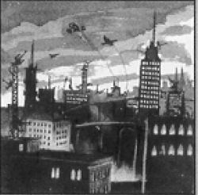

# 0868 文明世界 Civilised World

精校状态：中文行文已逐段精校，部分术语仍为暂定

分类：地理 / 真实空间 Real Space

原文来源：https://www.bilibili.com/opus/1112823917623377944

原作者：帝国神选罐头

原文时间：2025年09月15日 20:05

[返回分类目录](目录.md) · [全书目录](../../目录.md)

<!-- A0868-B0001 -->
**英文原文**

A γ-class or civilised world is a classification of a world's type in the Imperium.

<!-- /A0868-B0001 -->

<!-- A0868-B0002 -->

原译文

γ级或文明世界是帝国内的世界类型的分类。

**校订译文**

文明世界，即γ类世界，是帝国行星分类中的一种。

**校注：** γ是希腊字母分类代码，不是等级序号。

<!-- /A0868-B0002 -->

<!-- A0868-B0003 图片 -->

<!-- A0868-B0004 -->

原译文

Image of the Civilised World 文明世界图片

**校订译文**

Image of the Civilised World 文明世界图片

<!-- /A0868-B0004 -->

<!-- A0868-B0005 -->
**英文原文**

Of all the types of settlement in the Imperium, civilised worlds are the most common (although the term "civilised" here refers to their urban landscapes rather than to any pretence of social decorum.) On these self-sufficient worlds, the main population centres tend to be large cities or other urban environments that are supported by the planet's own agricultural production. The state of development both technologically and socially varies, but is most commonly around the current Imperial norm. Most adjuncts of the Imperial state will normally have a presence on the planet. By the classification guidelines, a civilised world has a population from 15,000,000 to 10,000,000,000 and pays tithes between Solutio Extremis and Exactis Tertius.

<!-- /A0868-B0005 -->

<!-- A0868-B0006 -->

原译文

在帝国的所有类型的定居点中，文明世界是最常见的（尽管这里的“文明”一词是指他们的城市景观，而不是任何社会礼仪的伪装。）在这些自给自足的世界上，主要的人口中心往往是大城市或其他由行星自身农业生产支持的城市环境。技术和社会的发展状况各不相同，但最常见的是围绕当前的帝国标准。帝国的大多数附属机构通常都会在这个行星上存在。根据分类指南，文明世界的人口在1500,0000到100,0000,0000之间，支付的什一税在第三级高等和第一级初等之间。

**校订译文**

在帝国的各类定居世界中，文明世界最为常见。这里的“文明”指城市景观，并不意味着居民讲究礼仪或社会风气文明。这些世界能够自给自足，人口主要集中于大型城市或其他都市聚居区，由星球自身的农业生产供养。各地科技与社会发展程度不一，但大多接近帝国当时的通常水平。帝国的大多数国家机构一般都在当地设有分支。按分类标准，文明世界的人口介于1500万至100亿之间，什一税等级从 Solutio Extremis 到 Exactis Tertius；原稿暂译“第三级高等”至“第一级初等”。

**校注：** 修正原译数字分组；税级中文尚未直核官方文本，保留英文及原稿暂译。

<!-- /A0868-B0006 -->

<!-- A0868-B0007 -->
## Subtypes of Civilised World 文明世界的子类型

<!-- /A0868-B0007 -->

<!-- A0868-B0008 -->
**英文原文**

Cardinal World (cc)

<!-- /A0868-B0008 -->

<!-- A0868-B0009 -->

原译文

红衣主教世界

**校订译文**

红衣主教世界（cc）

<!-- /A0868-B0009 -->

<!-- A0868-B0010 -->
**英文原文**

Garden World (cg)

<!-- /A0868-B0010 -->

<!-- A0868-B0011 -->

原译文

花园世界

**校订译文**

花园世界（cg）

<!-- /A0868-B0011 -->

<!-- A0868-B0012 -->
**英文原文**

Mining World (cm)

<!-- /A0868-B0012 -->

<!-- A0868-B0013 -->

原译文

矿业世界

**校订译文**

矿业世界（cm）

<!-- /A0868-B0013 -->

<!-- A0868-B0014 -->
## Notable Civilised Worlds 著名文明世界

<!-- /A0868-B0014 -->

<!-- A0868-B0015 -->
**英文原文**

Adumbria/Imperium

<!-- /A0868-B0015 -->

<!-- A0868-B0016 -->

原译文

亚杜布里亚/帝国

**校订译文**

亚杜布里亚/帝国

<!-- /A0868-B0016 -->

<!-- A0868-B0017 -->
**英文原文**

Auxesia (former)/Formerly — Imperium/Now — Dead World

<!-- /A0868-B0017 -->

<!-- A0868-B0018 -->

原译文

奥克塞西亚（前）/前帝国/现死亡世界

**校订译文**

奥克塞西亚（前）/前帝国/现死寂世界

<!-- /A0868-B0018 -->

<!-- A0868-B0019 -->
**英文原文**

Amistel Majoris/Obscurus/Imperium

<!-- /A0868-B0019 -->

<!-- A0868-B0020 -->

原译文

阿弥斯陶主星/朦胧星域/帝国

**校订译文**

阿弥斯陶主星——朦胧星域；帝国。

<!-- /A0868-B0020 -->

<!-- A0868-B0021 -->
**英文原文**

Calth/Ultima/Imperium

<!-- /A0868-B0021 -->

<!-- A0868-B0022 -->

原译文

考斯/极限星域/帝国

**校订译文**

考斯/极限星域/帝国

<!-- /A0868-B0022 -->

<!-- A0868-B0023 -->
**英文原文**

Cartheginus (former)/Unknown(just outside the Segmentum Solar)/Unknown, formerly Chaos (Horus), formerly Imperium/Former Refinery World. Now — Dead World

<!-- /A0868-B0023 -->

<!-- A0868-B0024 -->

原译文

卡特吉努斯（前）/未知（就在太阳星域之外）/未知，前混沌（荷鲁斯），前帝国/前精炼世界。现死亡世界

**校订译文**

卡特吉努斯（原文明世界）——星域归属不明，位于太阳星域边界之外不远处；现属帝国，荷鲁斯之乱期间曾归混沌；也是精炼世界，现列为死寂世界。

<!-- /A0868-B0024 -->

<!-- A0868-B0025 -->
**英文原文**

Chordelis (former)/Ultima/Imperium/16,000,000, with a PDF strength of 50,000 before destruction/Now — Dead World

<!-- /A0868-B0025 -->

<!-- A0868-B0026 -->

原译文

科德里斯（前）/极限星域/帝国/1600,0000人，包括行星防卫部队50000人在毁灭前/现死亡世界

**校订译文**

科德里斯（原文明世界）——极限星域；帝国；被毁前人口约1600万，行星防卫部队约5万人；现为死寂世界。

<!-- /A0868-B0026 -->

<!-- A0868-B0027 -->
**英文原文**

Crux/Pacificus/Imperium

<!-- /A0868-B0027 -->

<!-- A0868-B0028 -->

原译文

南十字/太平星域/帝国

**校订译文**

南十字/太平星域/帝国

<!-- /A0868-B0028 -->

<!-- A0868-B0029 -->
**英文原文**

Cyclopea/Obscurus/Imperium

<!-- /A0868-B0029 -->

<!-- A0868-B0030 -->

原译文

独眼巨人/朦胧星域/帝国

**校订译文**

独眼巨人/朦胧星域/帝国

<!-- /A0868-B0030 -->

<!-- A0868-B0031 -->
**英文原文**

Cyrene (former)/Ultima/Imperium/Now — Dead World

<!-- /A0868-B0031 -->

<!-- A0868-B0032 -->

原译文

昔兰尼（前）/极限星域/帝国/现死亡世界

**校订译文**

昔兰尼（前）/极限星域/帝国/现死寂世界

<!-- /A0868-B0032 -->

<!-- A0868-B0033 -->
**英文原文**

Delta Radhima/Imperium

<!-- /A0868-B0033 -->

<!-- A0868-B0034 -->

原译文

德尔塔·拉迪玛/帝国

**校订译文**

德尔塔·拉迪玛/帝国

<!-- /A0868-B0034 -->

<!-- A0868-B0035 -->
**英文原文**

Dheneb/Imperium

<!-- /A0868-B0035 -->

<!-- A0868-B0036 -->

原译文

天仓二/帝国

**校订译文**

天仓二/帝国

<!-- /A0868-B0036 -->

<!-- A0868-B0037 -->
**英文原文**

Elysia/Solar/Imperium

<!-- /A0868-B0037 -->

<!-- A0868-B0038 -->

原译文

艾丽西亚/太阳星域/帝国

**校订译文**

艾丽西亚——太阳星域；帝国。

<!-- /A0868-B0038 -->

<!-- A0868-B0039 -->
**英文原文**

Elysiar/Obscurus/Modren’s Realm

<!-- /A0868-B0039 -->

<!-- A0868-B0040 -->

原译文

埃利西亚/朦胧星域/莫德伦之域

**校订译文**

埃利西亚尔——朦胧星域；莫德伦领地；帝国。

**校注：** Elysiar 与 Elysia 拼写不同，分别保留“埃利西亚尔”和既定“艾丽西亚”，不把两颗行星合并。

<!-- /A0868-B0040 -->

<!-- A0868-B0041 -->
**英文原文**

Gudrun/Obscurus/Imperium

<!-- /A0868-B0041 -->

<!-- A0868-B0042 -->

原译文

古德伦/朦胧星域/帝国

**校订译文**

古德伦/朦胧星域/帝国

<!-- /A0868-B0042 -->

<!-- A0868-B0043 -->
**英文原文**

Happenstance/Imperium/Was part of the Sanctimonia Conflict

<!-- /A0868-B0043 -->

<!-- A0868-B0044 -->

原译文

机遇星/帝国/曾是圣洁冲突的一部分

**校订译文**

机遇星——帝国；圣洁星冲突发生地之一。

<!-- /A0868-B0044 -->

<!-- A0868-B0045 -->
**英文原文**

Hyrion Major/Imperium/Also — Desert World

<!-- /A0868-B0045 -->

<!-- A0868-B0046 -->

原译文

海瑞昂主星/帝国/也是沙漠世界

**校订译文**

海瑞昂主星/帝国/也是沙漠世界

<!-- /A0868-B0046 -->

<!-- A0868-B0047 -->
**英文原文**

Jollana/Imperium

<!-- /A0868-B0047 -->

<!-- A0868-B0048 -->

原译文

乔拉纳/帝国

**校订译文**

乔拉纳/帝国

<!-- /A0868-B0048 -->

<!-- A0868-B0049 -->
**英文原文**

Jouran/Imperium

<!-- /A0868-B0049 -->

<!-- A0868-B0050 -->

原译文

约兰/帝国

**校订译文**

约兰/帝国

<!-- /A0868-B0050 -->

<!-- A0868-B0051 -->
**英文原文**

Karos (former)/Imperium/Now — Ice World, former Industrial World, former Mining World

<!-- /A0868-B0051 -->

<!-- A0868-B0052 -->

原译文

卡罗斯（前）/帝国/现冰雪世界，前工业世界，前矿业世界

**校订译文**

卡罗斯（前）/帝国/现冰雪世界，前工业世界，前矿业世界

<!-- /A0868-B0052 -->

<!-- A0868-B0053 -->
**英文原文**

Kaurava I/Ultima/Imperium

<!-- /A0868-B0053 -->

<!-- A0868-B0054 -->

原译文

考拉瓦一号/极限星域/帝国

**校订译文**

考拉瓦一号/极限星域/帝国

<!-- /A0868-B0054 -->

<!-- A0868-B0055 -->
**英文原文**

Kaurava II/Ultima/Imperium

<!-- /A0868-B0055 -->

<!-- A0868-B0056 -->

原译文

考拉瓦二号/极限星域/帝国

**校订译文**

考拉瓦二号/极限星域/帝国

<!-- /A0868-B0056 -->

<!-- A0868-B0057 -->
**英文原文**

Kaurava III/Ultima/Imperium

<!-- /A0868-B0057 -->

<!-- A0868-B0058 -->

原译文

考拉瓦三号/极限星域/帝国

**校订译文**

考拉瓦三号/极限星域/帝国

<!-- /A0868-B0058 -->

<!-- A0868-B0059 -->
**英文原文**

Kaurava IV/Ultima/Imperium

<!-- /A0868-B0059 -->

<!-- A0868-B0060 -->

原译文

考拉瓦四号/极限星域/帝国

**校订译文**

考拉瓦四号/极限星域/帝国

<!-- /A0868-B0060 -->

<!-- A0868-B0061 -->
**英文原文**

Kintarre/Imperium

<!-- /A0868-B0061 -->

<!-- A0868-B0062 -->

原译文

钦塔尔/帝国

**校订译文**

钦塔尔/帝国

<!-- /A0868-B0062 -->

<!-- A0868-B0063 -->
**英文原文**

Kronus/Ultima/Imperium/Also — Tomb World

<!-- /A0868-B0063 -->

<!-- A0868-B0064 -->

原译文

克洛诺斯/极限星域/帝国/也是墓穴世界

**校订译文**

克洛诺斯/极限星域/帝国/也是墓穴世界

<!-- /A0868-B0064 -->

<!-- A0868-B0065 -->
**英文原文**

Luna/Solar/Imperium/Billions/Moon of Terra, also — Death World

<!-- /A0868-B0065 -->

<!-- A0868-B0066 -->

原译文

露娜/太阳星域/帝国/数十亿/泰拉的卫星，也是死亡世界

**校订译文**

月球——太阳星域、太阳星系；帝国；人口数十亿；泰拉的卫星，也被列为死亡世界。

**校注：** Luna 即月球。此行原文确为 Death World，保留死亡世界，不套用 Dead World 的死寂世界。

<!-- /A0868-B0066 -->

<!-- A0868-B0067 -->
**英文原文**

Lurid IX/Ultima/Imperium

<!-- /A0868-B0067 -->

<!-- A0868-B0068 -->

原译文

惊悚九号/极限星域/帝国

**校订译文**

惊悚九号/极限星域/帝国

<!-- /A0868-B0068 -->

<!-- A0868-B0069 -->
**英文原文**

Lysios (former)/Ultima/Now — Dead World

<!-- /A0868-B0069 -->

<!-- A0868-B0070 -->

原译文

莱西奥斯（前）/极限星域/现死亡世界

**校订译文**

莱西奥斯（前）/极限星域/现死寂世界

<!-- /A0868-B0070 -->

<!-- A0868-B0071 -->
**英文原文**

Manzipor/Imperium

<!-- /A0868-B0071 -->

<!-- A0868-B0072 -->

原译文

曼齐珀尔/帝国

**校订译文**

曼齐珀尔/帝国

<!-- /A0868-B0072 -->

<!-- A0868-B0073 -->
**英文原文**

Minerva/Solar/Imperium

<!-- /A0868-B0073 -->

<!-- A0868-B0074 -->

原译文

密涅瓦/太阳星域/帝国

**校订译文**

密涅瓦/太阳星域/帝国

<!-- /A0868-B0074 -->

<!-- A0868-B0075 -->
**英文原文**

Modren Prime/Obscurus/Modren's Realm

<!-- /A0868-B0075 -->

<!-- A0868-B0076 -->

原译文

莫德伦主星/朦胧星域/莫德伦之域

**校订译文**

莫德伦主星——朦胧星域；莫德伦领地；帝国。

<!-- /A0868-B0076 -->

<!-- A0868-B0077 -->
**英文原文**

Perlia/Ultima/Imperium

<!-- /A0868-B0077 -->

<!-- A0868-B0078 -->

原译文

佩利亚/极限星域/帝国

**校订译文**

佩利亚/极限星域/帝国

<!-- /A0868-B0078 -->

<!-- A0868-B0079 -->
**英文原文**

Pyran/Solar/Imperium

<!-- /A0868-B0079 -->

<!-- A0868-B0080 -->

原译文

皮兰/太阳星域/帝国

**校订译文**

皮兰/太阳星域/帝国

<!-- /A0868-B0080 -->

<!-- A0868-B0081 -->
**英文原文**

Pyrites/Pacificus/Imperium

<!-- /A0868-B0081 -->

<!-- A0868-B0082 -->

原译文

黄铁星/太平星域/帝国

**校订译文**

黄铁星/太平星域/帝国

<!-- /A0868-B0082 -->

<!-- A0868-B0083 -->
**英文原文**

Rhanda/Solar/Imperium

<!-- /A0868-B0083 -->

<!-- A0868-B0084 -->

原译文

兰达/太阳星域/帝国

**校订译文**

兰达/太阳星域/帝国

<!-- /A0868-B0084 -->

<!-- A0868-B0085 -->
**英文原文**

Sahch-V/Imperium

<!-- /A0868-B0085 -->

<!-- A0868-B0086 -->

原译文

萨赫奇五号/帝国

**校订译文**

萨赫奇五号/帝国

<!-- /A0868-B0086 -->

<!-- A0868-B0087 -->
**英文原文**

Sarum/Imperium

<!-- /A0868-B0087 -->

<!-- A0868-B0088 -->

原译文

萨鲁姆/帝国

**校订译文**

萨鲁姆/帝国

<!-- /A0868-B0088 -->

<!-- A0868-B0089 -->
**英文原文**

Scathe/Obscurus/Modren's Realm

<!-- /A0868-B0089 -->

<!-- A0868-B0090 -->

原译文

损害星/朦胧星域/莫德伦之域

**校订译文**

损害星——朦胧星域；莫德伦领地；帝国。

<!-- /A0868-B0090 -->

<!-- A0868-B0091 -->
**英文原文**

Surealis VI/Obscurus/Imperium

<!-- /A0868-B0091 -->

<!-- A0868-B0092 -->

原译文

苏瑞亚利斯六号/朦胧星域/帝国

**校订译文**

苏瑞亚利斯六号/朦胧星域/帝国

<!-- /A0868-B0092 -->

<!-- A0868-B0093 -->
**英文原文**

Tahnel/Solar/Imperium/Also - an Ocean World

<!-- /A0868-B0093 -->

<!-- A0868-B0094 -->

原译文

塔尼尔/太阳星域/帝国/也是一个海洋世界

**校订译文**

塔尼尔/太阳星域/帝国/也是一个海洋世界

<!-- /A0868-B0094 -->

<!-- A0868-B0095 -->
**英文原文**

Tallarn/Tempestus/Imperium

<!-- /A0868-B0095 -->

<!-- A0868-B0096 -->

原译文

塔兰/暴风星域/帝国

**校订译文**

塔兰/暴风星域/帝国

<!-- /A0868-B0096 -->

<!-- A0868-B0097 -->
**英文原文**

Tanakreg/Imperium/Unknown, probably one or two million/Also — Dead World

<!-- /A0868-B0097 -->

<!-- A0868-B0098 -->

原译文

塔纳克雷格/帝国/未知，可能一到二百万/也是死亡世界

**校订译文**

塔纳克雷格——帝国；人口不详，底稿另记约一两百万人；同时列为死寂世界。

**校注：** 人口未知、一两百万与死寂世界三项并列，可能来自不同资料或时期，保留差异并待核。

<!-- /A0868-B0098 -->

<!-- A0868-B0099 -->
**英文原文**

Tannen's World/Imperium

<!-- /A0868-B0099 -->

<!-- A0868-B0100 -->

原译文

坦能世界/帝国

**校订译文**

坦能世界/帝国

<!-- /A0868-B0100 -->

<!-- A0868-B0101 -->
**英文原文**

Therion/Tempestus/Imperium

<!-- /A0868-B0101 -->

<!-- A0868-B0102 -->

原译文

圣兽星/暴风星域/帝国

**校订译文**

圣兽星/暴风星域/帝国

<!-- /A0868-B0102 -->

<!-- A0868-B0103 -->
**英文原文**

Trepytos/Solar/Imperium

<!-- /A0868-B0103 -->

<!-- A0868-B0104 -->

原译文

特雷皮托斯/太阳星域/帝国

**校订译文**

特雷皮托斯/太阳星域/帝国

<!-- /A0868-B0104 -->

<!-- A0868-B0105 -->
**英文原文**

Truan IX (former)/Unknown, former Imperium/Now — Dead World

<!-- /A0868-B0105 -->

<!-- A0868-B0106 -->

原译文

特鲁安九号（前）/未知，前帝国/现死亡世界

**校订译文**

特鲁安九号（前）/未知，前帝国/现死寂世界

<!-- /A0868-B0106 -->

<!-- A0868-B0107 -->
**英文原文**

Valhalla/Ultima/Imperium

<!-- /A0868-B0107 -->

<!-- A0868-B0108 -->

原译文

瓦尔哈拉/极限星域/帝国

**校订译文**

瓦尔哈拉/极限星域/帝国

<!-- /A0868-B0108 -->

<!-- A0868-B0109 -->
**英文原文**

Varoli Secundus/Imperium

<!-- /A0868-B0109 -->

<!-- A0868-B0110 -->

原译文

瓦罗利次星/帝国

**校订译文**

瓦罗利次星/帝国

<!-- /A0868-B0110 -->

<!-- A0868-B0111 -->
**英文原文**

Voltemand/Pacificus/Imperium

<!-- /A0868-B0111 -->

<!-- A0868-B0112 -->

原译文

沃尔特曼德/太平星域/帝国

**校订译文**

沃尔特曼德/太平星域/帝国

<!-- /A0868-B0112 -->

<!-- A0868-B0113 -->
**英文原文**

Vordrost/Pacificus/Imperium

<!-- /A0868-B0113 -->

<!-- A0868-B0114 -->

原译文

沃德罗斯特/太平星域/帝国

**校订译文**

沃德罗斯特/太平星域/帝国

<!-- /A0868-B0114 -->

本篇核心术语与暂定项

以下列出本篇出现的英文原形及核心术语表用词。同形词可能指不同对象，具体词义以本篇正文和校注为准；单复数、别名和仅见于图注的名称可能尚未列入。完整候选见[术语表](../../术语表/双语术语候选.csv)。

| 英文 | 采用中文 | 状态 |
| --- | --- | --- |
| Imperium | 帝国 | 暂定·简称 |
| Terra | 泰拉 | 暂定·官方待核 |
| Horus | 荷鲁斯 | 暂定·官方待核 |
| Sarum | 萨勒姆 | 暂定·官方待核 |
| Segmentum Solar | 太阳星域 | 暂定·官方待核 |
| Segmentum | 星域 | 暂定·官方待核 |
| Jouran | 约兰 | 暂定·官方待核 |
| Elysia | 艾丽西亚 | 暂定·官方待核 |
| Valhalla | 瓦尔哈拉 | 暂定·官方待核 |
| Tallarn | 塔兰 | 暂定·官方待核 |
| Kronus | 克洛诺斯 | 暂定·官方待核 |
| Jollana | 乔拉纳 | 暂定·官方待核 |
| Calth | 考斯 | 暂定·官方待核 |
| Luna | 月球 | 暂定·官方待核 |
| Obscurus | 朦胧星 | 暂定·官方待核 |
| Civilised Worlds | 文明世界 | 暂定·官方待核 |
| Cardinal | 红衣主教 | 暂定 |
| Kaurava | 考拉瓦 | 暂定·官方待核 |
| Chordelis | 科德里斯 | 暂定·官方待核 |
| Gudrun | 古德伦 | 暂定·官方待核 |
| Lurid IX | 惊悚九号 | 暂定·官方待核 |
| Dead World | 死寂世界 | 暂定·官方待核 |
| Death World | 死亡世界 | 暂定·官方待核 |
| Cyclopea | 独眼巨人 | 暂定·官方待核 |
| Cardinal World | 红衣主教世界 | 暂定·官方待核 |
| Sanctimonia | 圣洁星 | 暂定·官方待核 |
| Civilised World | 文明世界 | 暂定·官方待核 |
| Solutio Extremis | 第三级高等 | 暂定·官方待核 |
| Exactis Tertius | 第一级初等 | 暂定·官方待核 |
| Elysiar | 埃利西亚尔 | 暂定·官方待核 |
| Adumbria | 亚杜布里亚 | 暂定·官方待核 |
| Auxesia | 奥克塞西亚 | 暂定·官方待核 |
| Amistel Majoris | 阿弥斯陶主星 | 暂定·官方待核 |
| Cartheginus | 卡特吉努斯 | 暂定·官方待核 |
| Crux | 南十字 | 暂定·官方待核 |
| Cyrene | 昔兰尼 | 暂定·官方待核 |
| Delta Radhima | 德尔塔·拉迪玛 | 暂定·官方待核 |
| Dheneb | 天仓二 | 暂定·官方待核 |
| Happenstance | 机遇星 | 暂定·官方待核 |
| Hyrion Major | 海瑞昂主星 | 暂定·官方待核 |
| Karos | 卡罗斯 | 暂定·官方待核 |
| Kaurava I | 考拉瓦一号 | 暂定·官方待核 |
| Kaurava II | 考拉瓦二号 | 暂定·官方待核 |
| Kaurava III | 考拉瓦三号 | 暂定·官方待核 |
| Kaurava IV | 考拉瓦四号 | 暂定·官方待核 |
| Kintarre | 钦塔尔 | 暂定·官方待核 |
| Lysios | 莱西奥斯 | 暂定·官方待核 |
| Manzipor | 曼齐珀尔 | 暂定·官方待核 |
| Minerva | 密涅瓦 | 暂定·官方待核 |
| Modren Prime | 莫德伦主星 | 暂定·官方待核 |
| Perlia | 佩利亚 | 暂定·官方待核 |
| Pyran | 皮兰 | 暂定·官方待核 |
| Pyrites | 黄铁星 | 暂定·官方待核 |
| Rhanda | 兰达 | 暂定·官方待核 |
| Sahch | 萨赫奇五号 | 暂定·官方待核 |
| Scathe | 损害星 | 暂定·官方待核 |
| Surealis VI | 苏瑞亚利斯六号 | 暂定·官方待核 |
| Tahnel | 塔尼尔 | 暂定·官方待核 |
| Tanakreg | 塔纳克雷格 | 暂定·官方待核 |
| Tannen's World | 坦能世界 | 暂定·官方待核 |
| Therion | 圣兽星 | 暂定·官方待核 |
| Trepytos | 特雷皮托斯 | 暂定·官方待核 |
| Truan IX | 特鲁安九号 | 暂定·官方待核 |
| Varoli Secundus | 瓦罗利次星 | 暂定·官方待核 |
| Voltemand | 沃尔特曼德 | 暂定·官方待核 |
| Vordrost | 沃德罗斯特 | 暂定·官方待核 |
| Industrial World | 工业世界 | 暂定·官方待核 |
| Mining World | 矿业世界 | 暂定·官方待核 |
| Garden World | 花园世界 | 暂定·官方待核 |

