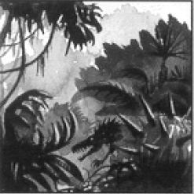

# 0869 死亡世界 Death World

精校状态：中文行文已逐段精校，部分术语仍为暂定

分类：地理 / 真实空间 Real Space

原文来源：https://www.bilibili.com/opus/1165329390265958404

原作者：帝国神选罐头

原文时间：2026年02月04日 07:53

[返回分类目录](目录.md) · [全书目录](../../目录.md)

<!-- A0869-B0001 -->
**英文原文**

A δτ-class or Death World (sometimes spelled as Deathworld) is a world classification defined by its extremely dangerous or aggressive native flora and fauna. These eco-systems are finely balanced between continual destruction and lightning-fast reproduction. Death worlds take many forms, ranging from jungle-covered hell-holes with carnivorous plants and animals to barren, volcanic wastelands racked by ion storms. The most famous and notorious Death World is the hellish planet of Catachan.

<!-- /A0869-B0001 -->

<!-- A0869-B0002 -->

原译文

δτ类或死亡世界（有时拼写为死亡世界）是一种世界分类，由其极其危险或具有侵略性的本土动植物群定义。这些生态系统在持续破坏和闪电般快速繁殖之间达到了微妙的平衡。死亡世界有很多种形式，从丛林覆盖的有食肉植物和动物的地狱之洞到被离子风暴折磨的贫瘠火山荒地。最著名和最臭名昭著的死亡世界是地狱般的卡塔昌行星。

**校订译文**

死亡世界，即δτ类世界，是一类以本土动植物极度危险、攻击性极强而著称的星球。英文名称为 Death World，也写作 Deathworld。其生态系统在持续毁灭与迅速繁殖之间维系着微妙的平衡。死亡世界的形态多种多样：有些密布丛林，遍生食肉动植物，宛如地狱；有些则是离子风暴肆虐的荒芜火山废土。其中最著名、也最令人闻风丧胆的，就是地狱般的卡塔昌。

**校注：** Death World 指生态极端危险的死亡世界，区别于 Dead World（死寂世界）。

<!-- /A0869-B0002 -->

<!-- A0869-B0003 图片 -->

<!-- A0869-B0004 -->

原译文

Image of a Death World 死亡世界的图像

**校订译文**

Image of a Death World 死亡世界的图像

<!-- /A0869-B0004 -->

<!-- A0869-B0005 -->
**英文原文**

Some worlds can be turned into Death Worlds, like what occurred on Indiga after numerous captive giant predators escaped from their zoos. When this happens, these worlds are labeled as Man-Made Death Worlds.

<!-- /A0869-B0005 -->

<!-- A0869-B0006 -->

原译文

有些世界可以变成死亡世界，就像在因迪加发生的无数圈养的巨型捕食者从动物园逃脱后那样。当这种情况发生时，这些世界被标记为人造死亡世界。

**校订译文**

有些星球会因外力变成死亡世界。例如，因迪加的大量圈养巨型掠食动物逃出动物园，便使整颗星球沦为此类环境。这种世界被称为“人造死亡世界”。

<!-- /A0869-B0006 -->

<!-- A0869-B0007 -->
**英文原文**

Humans can, and do, live on these worlds, but it is a never-ending struggle. On many death worlds it is as if the entire bio-mass of the planet were consciously motivated against human settlement - concentrating forces against intruders to destroy them. Death worlds with human settlements or colonies can have populations of 1,000 to 15,000,000.

<!-- /A0869-B0007 -->

<!-- A0869-B0008 -->

原译文

人类可以而且确实生活在这些世界上，但这是一场永无止境的斗争。在许多死亡世界中，就好像行星上的整个生物群都有意识地反对人类定居 — 集中力量对抗入侵者以摧毁他们。有人类定居点或殖民地的死亡世界的人口可能在1000到1500,0000之间。

**校订译文**

人类能够、也确实在这些世界上生存，但必须永无止境地挣扎。在许多死亡世界，整颗星球的生物仿佛都有意敌视人类定居，集中力量消灭外来者。存在人类聚落或殖民地的死亡世界，人口可能从一千人到一千五百万人不等。

**校注：** as if 是比喻，不能把整颗星球确有统一意识当成事实。原人口数字格式一并修正。

<!-- /A0869-B0008 -->

<!-- A0869-B0009 -->
**英文原文**

Death worlds are not usually inhabited, and are nearly impossible to colonise but still need to be explored, which means the establishment of outposts and other support facilities. Some planets have rich mineral wealth, animal life, vegetables or gases, so tithes might range from Solutio Tertius to Solutio Prima.

<!-- /A0869-B0009 -->

<!-- A0869-B0010 -->

原译文

死亡世界通常没有人居住，几乎不可能殖民，但仍需要探索，这意味着建立前哨和其他支持设施。一些行星拥有丰富的矿产资源、动物生命、蔬菜或气体，因此什一税可能从第三级初等到第三级上等不等。

**校订译文**

死亡世界通常无人居住，也几乎无法殖民，但仍需勘探，因此必须建立前哨站及其他支援设施。有些星球富含矿产、动物、植物或气体资源，其什一税等级可能介于 Solutio Tertius 与 Solutio Prima 之间，原稿暂译“第三级初等”至“第三级上等”。

<!-- /A0869-B0010 -->

<!-- A0869-B0011 -->
**英文原文**

Some Imperial ledgers refer to a Death world as In Articulo Mortis — "at the moment of demise". The planet Caliban was referred to as such prior to its destruction.

<!-- /A0869-B0011 -->

<!-- A0869-B0012 -->

原译文

一些帝国账簿将死亡世界称为濒死 — “在死亡的时刻”。卡利班行星在毁灭之前就被如此称呼。

**校订译文**

某些帝国簿册将死亡世界记作 In Articulo Mortis，意为“临死之际”。卡利班在毁灭前就曾被如此记载。

<!-- /A0869-B0012 -->

<!-- A0869-B0013 -->
### Notable Death Worlds 著名死亡世界

<!-- /A0869-B0013 -->

<!-- A0869-B0014 -->
**英文原文**

XIII

**补译**

十三号（XIII；暂定译名）

<!-- /A0869-B0014 -->

<!-- A0869-B0015 -->
**英文原文**

Ag'Ni - Ultima Segmentum

<!-- /A0869-B0015 -->

<!-- A0869-B0016 -->

原译文

阿格'尼 - 极限星域

**校订译文**

阿格'尼 - 极限星域

<!-- /A0869-B0016 -->

<!-- A0869-B0017 -->
**英文原文**

Alfrost - Ultima Segmentum - Corvus Sub-Sector

<!-- /A0869-B0017 -->

<!-- A0869-B0018 -->

原译文

阿尔弗罗斯特 - 极限星域 - 渡鸦分区

**校订译文**

阿尔弗罗斯特——极限星域；乌鸦次星区。

<!-- /A0869-B0018 -->

<!-- A0869-B0019 -->

原译文

Autega 奥泰加

**校订译文**

Autega 奥泰加

<!-- /A0869-B0019 -->

<!-- A0869-B0020 -->
**英文原文**

Baal - Ultima Segmentum - Baal System - 122,000 - Homeworld of the Blood Angels Chapter

<!-- /A0869-B0020 -->

<!-- A0869-B0021 -->

原译文

巴尔 - 极限星域 - 巴尔星系 - 12,2000 - 圣血天使战团的家园世界

**校订译文**

巴尔——极限星域；巴尔星系；人口12.2万；圣血天使战团的母星。

**校注：** 逐项复核英文目录行，补回所属星域、星系、行星类别或母星属性；删除英文未提供的星域信息。

<!-- /A0869-B0021 -->

<!-- A0869-B0022 -->
**英文原文**

Baal Secundus - Ultima Segmentum - Baal System - One of the twin moons which orbit Baal

<!-- /A0869-B0022 -->

<!-- A0869-B0023 -->

原译文

巴尔二号 - 极限星域 - 巴尔星系 - 围绕巴尔运行的双星之一

**校订译文**

巴尔二号——极限星域；巴尔星系；环绕巴尔的两颗卫星之一。

**校注：** Baal Secundus 是巴尔双卫星之一，原译“双子星”会使人误以为是恒星。 逐项复核英文目录行，补回所属星域、星系、行星类别或母星属性；删除英文未提供的星域信息。

<!-- /A0869-B0023 -->

<!-- A0869-B0024 -->
**英文原文**

Belisarius IV - Also Desert World

<!-- /A0869-B0024 -->

<!-- A0869-B0025 -->

原译文

贝利撒留四号 - 也是沙漠世界

**校订译文**

贝利撒留四号 - 也是沙漠世界

<!-- /A0869-B0025 -->

<!-- A0869-B0026 -->

原译文

Byssta 比斯塔

**校订译文**

Byssta 比斯塔

<!-- /A0869-B0026 -->

<!-- A0869-B0027 -->
**英文原文**

Caldera - Also Hive World

<!-- /A0869-B0027 -->

<!-- A0869-B0028 -->

原译文

火山口星 - 也是巢都世界

**校订译文**

卡尔德拉——也是巢都世界。

**校注：** 逐项复核英文目录行，补回所属星域、星系、行星类别或母星属性；删除英文未提供的星域信息。

<!-- /A0869-B0028 -->

<!-- A0869-B0029 -->
**英文原文**

Caliban (destroyed) - Segmentum Obscurus - Caliban System - Original homeworld of the Dark Angels Legion

<!-- /A0869-B0029 -->

<!-- A0869-B0030 -->

原译文

卡利班（毁灭）- 朦胧星域 - 卡利班星系 - 黑暗天使军团的原初家园世界

**校订译文**

卡利班（已毁灭）——朦胧星域；黑暗天使的母星。

<!-- /A0869-B0030 -->

<!-- A0869-B0031 -->

原译文

Canak 卡纳克

**校订译文**

Canak 卡纳克

**校注：** Canak 与后列 Kanak 的英文不同，是否为同名变体尚待核，未据中文相似直接合并。

<!-- /A0869-B0031 -->

<!-- A0869-B0032 -->
**英文原文**

Catachan - Ultima Segmentum - Catachan System - 12,000,000 - Considered the most notorious Death World and home to the brutal Catachan Jungle Fighters

<!-- /A0869-B0032 -->

<!-- A0869-B0033 -->

原译文

卡塔昌 - 极限星域 - 卡塔昌星系 - 1200,0000 - 被认为是最臭名昭著的死亡世界，也是残酷的卡塔昌丛林战士的家园

**校订译文**

卡塔昌——极限星域；卡塔昌星系；人口1200万；被视为最臭名昭著的死亡世界，也是凶悍的卡塔昌丛林斗士的故乡。

**校注：** 逐项复核英文目录行，补回所属星域、星系、行星类别或母星属性；删除英文未提供的星域信息。

<!-- /A0869-B0033 -->

<!-- A0869-B0034 -->

原译文

Cesstium 塞斯提乌姆

**校订译文**

Cesstium 塞斯提乌姆

<!-- /A0869-B0034 -->

<!-- A0869-B0035 -->

原译文

Cthelle 赛瑟尔

**校订译文**

Cthelle 赛瑟尔

<!-- /A0869-B0035 -->

<!-- A0869-B0036 -->

原译文

Crake's World 克莱克世界

**校订译文**

Crake's World 克莱克世界

<!-- /A0869-B0036 -->

<!-- A0869-B0037 -->
**英文原文**

Cretacia - Homeworld of the Flesh Tearers Chapter

<!-- /A0869-B0037 -->

<!-- A0869-B0038 -->

原译文

科瑞塔西亚 - 撕肉者战团的家园世界

**校订译文**

科瑞塔西亚——撕肉者战团的母星。

<!-- /A0869-B0038 -->

<!-- A0869-B0039 -->

原译文

Croatoa 克罗托亚

**校订译文**

Croatoa 克罗托亚

<!-- /A0869-B0039 -->

<!-- A0869-B0040 -->
**英文原文**

Damnia - Also recruiting world for the Angels of Vengeance Chapter

<!-- /A0869-B0040 -->

<!-- A0869-B0041 -->

原译文

达姆尼亚 - 也是复仇天使战团的招募世界

**校订译文**

达姆尼亚 - 也是复仇天使战团的招募世界

<!-- /A0869-B0041 -->

<!-- A0869-B0042 -->
**英文原文**

Demogorgon IV - Also War World.

<!-- /A0869-B0042 -->

<!-- A0869-B0043 -->

原译文

德莫高根四号 - 也是战争世界

**校订译文**

德莫高根四号 - 也是战争世界

<!-- /A0869-B0043 -->

<!-- A0869-B0044 -->
**英文原文**

Denkari Minor - Tropical world where Imperium, including the Tekarn 11th Heavy Tank Company, fought with Waaagh! Grughakh

<!-- /A0869-B0044 -->

<!-- A0869-B0045 -->

原译文

登卡里次星 - 帝国统治的热带世界，包括特卡恩第11重型坦克连队，与格鲁加克的Waaagh!作战

**校订译文**

登卡里次星——热带世界。帝国部队曾在此对抗格鲁格哈克大蛮干！参战部队包括泰卡恩第十一重型坦克连。

**校注：** 原译把帝国参战部队写成了星球本身“包括”这些单位，已恢复修饰关系。

<!-- /A0869-B0045 -->

<!-- A0869-B0046 -->
**英文原文**

Denkari-Prime - Death world where Imperium, including the Tekarn 90th Armoured Regiment, 23rd Imperial Navy Bomber Wing and 123rd Death Korps Armoured Regiment, 15th Heavy Company with the Macharius (Heavy Tank)s, fought with some enemy

<!-- /A0869-B0046 -->

<!-- A0869-B0047 -->

原译文

登卡里一号 - 帝国统治的死亡世界，包括特卡恩第90装甲兵团、帝国海军第23轰炸机联队和死亡军团第123装甲兵团、第15重型连队和马卡里乌斯（重型坦克），与一些敌人作战

**校订译文**

登卡里一号——死亡世界，帝国部队曾在此与敌军交战。参战部队包括泰卡恩第九十装甲团、帝国海军第二十三轰炸机联队、死亡兵团第一二三装甲团，以及装备马卡里乌斯重型坦克的第十五重型连。

**校注：** 原英文第十五重型连与第一二三装甲团之间的隶属关系标点含糊，暂列出所见单位，未断言独立建制；待核。

<!-- /A0869-B0047 -->

<!-- A0869-B0048 -->

原译文

Derwynia 德尔维尼亚

**校订译文**

Derwynia 德尔维尼亚

<!-- /A0869-B0048 -->

<!-- A0869-B0049 -->

原译文

Endymion Prime 恩底弥翁一号

**校订译文**

Endymion Prime 恩底弥翁主星

<!-- /A0869-B0049 -->

<!-- A0869-B0050 -->
**英文原文**

Fedrid - Segmentum Obscurus - Calixis Sector - Markayn Marches - Also — Feral World

<!-- /A0869-B0050 -->

<!-- A0869-B0051 -->

原译文

费德里德 - 朦胧星域 - 卡利西斯星区 - 马尔凯恩边区 - 也是蛮荒世界

**校订译文**

费德里德——朦胧星域；卡利西斯星区、马尔坎边区；也是蛮荒世界。

<!-- /A0869-B0051 -->

<!-- A0869-B0052 -->
**英文原文**

Fenris - Segmentum Obscurus - Fenris System - Homeworld of the Space Wolves Chapter

<!-- /A0869-B0052 -->

<!-- A0869-B0053 -->

原译文

芬里斯 - 朦胧星域 - 芬里斯星系 - 太空野狼战团的家园世界

**校订译文**

芬里斯 - 朦胧星域 - 芬里斯星系 - 太空野狼战团的家园世界

<!-- /A0869-B0053 -->

<!-- A0869-B0054 -->

原译文

Gath Rimmon 加特·里蒙

**校订译文**

Gath Rimmon 加特·里蒙

<!-- /A0869-B0054 -->

<!-- A0869-B0055 -->
**英文原文**

Gorang - Tempestus

<!-- /A0869-B0055 -->

<!-- A0869-B0056 -->

原译文

戈朗 - 暴风星域

**校订译文**

戈朗 - 暴风星域

<!-- /A0869-B0056 -->

<!-- A0869-B0057 -->
**英文原文**

Gregorn - Obscurus - Askellon Sector - Cyclopia Sub-Sector - Also a Feral World and Jungle World, heavy Ork presence

<!-- /A0869-B0057 -->

<!-- A0869-B0058 -->

原译文

格雷戈恩 - 朦胧星域 - 阿斯凯隆星区 - 独眼分区 - 也是一个蛮荒世界和丛林世界，存在大量的欧克

**校订译文**

格雷戈恩——朦胧星域；阿斯凯隆星区、赛克洛皮亚次星区；也是蛮荒世界与丛林世界，有大量欧克兽人活动。

<!-- /A0869-B0058 -->

<!-- A0869-B0059 -->
**英文原文**

Haddrack - Segmentum Obscurus - Calixis Sector - Drusus Marches - Also an Explorator Base and minor Forge World of the Adeptus Mechanicus

<!-- /A0869-B0059 -->

<!-- A0869-B0060 -->

原译文

哈德拉克 - 朦胧星域 - 卡利西斯星区 - 德鲁苏斯边区 - 也是一个机械神教的探索者基地和小型铸造世界

**校订译文**

哈德拉克——朦胧星域；卡利西斯星区、德鲁苏斯边区；也是机械修会探察基地和小型铸造世界。

<!-- /A0869-B0060 -->

<!-- A0869-B0061 -->

原译文

Hyperion 亥伯龙

**校订译文**

Hyperion 亥伯龙

<!-- /A0869-B0061 -->

<!-- A0869-B0062 -->
**英文原文**

Iax - Ultima Segmentum - Ultramar - Iax System - Former Paradise World/Agri World

<!-- /A0869-B0062 -->

<!-- A0869-B0063 -->

原译文

艾克斯 - 极限星域 - 奥特拉玛 - 艾克斯星系 - 前天堂世界/农业世界

**校订译文**

艾克斯——极限星域；奥特拉玛；艾克斯星系；原为天堂世界和农业世界。

<!-- /A0869-B0063 -->

<!-- A0869-B0064 -->
**英文原文**

Indiga - Ultima Segmentum - Former Menagerie World

<!-- /A0869-B0064 -->

<!-- A0869-B0065 -->

原译文

因迪加 - 极限星域 - 前兽群世界

**校订译文**

因迪加——极限星域；原为动物园世界。

**校注：** 逐项复核英文目录行，补回所属星域、星系、行星类别或母星属性；删除英文未提供的星域信息。

<!-- /A0869-B0065 -->

<!-- A0869-B0066 -->
**英文原文**

Jjojos - Ultima Segmentum

<!-- /A0869-B0066 -->

<!-- A0869-B0067 -->

原译文

乔乔斯 - 极限星域

**校订译文**

乔乔斯 - 极限星域

<!-- /A0869-B0067 -->

<!-- A0869-B0068 -->

原译文

Kanak 卡纳克

**校订译文**

Kanak 卡纳克

<!-- /A0869-B0068 -->

<!-- A0869-B0069 -->
**英文原文**

Karrik - Segmentum Obscurus - Calixis Sector - Markayn Marches - Also Ice World

<!-- /A0869-B0069 -->

<!-- A0869-B0070 -->

原译文

卡里克 - 朦胧星域 - 卡利西斯星区 - 马尔凯恩边区 - 也是冰雪世界

**校订译文**

卡里克——朦胧星域；卡利西斯星区、马尔坎边区；也是冰雪世界。

<!-- /A0869-B0070 -->

<!-- A0869-B0071 -->
**英文原文**

Kenov III - Segmentum Obscurus - Calixis Sector - Malfian Sub-Sector

<!-- /A0869-B0071 -->

<!-- A0869-B0072 -->

原译文

凯诺夫三号 - 朦胧星域 - 卡利西斯星区 - 马尔菲安分区

**校订译文**

凯诺夫三号——朦胧星域；卡利西斯星区、马尔菲安次星区。

<!-- /A0869-B0072 -->

<!-- A0869-B0073 -->
**英文原文**

Khymara - Ultima Segmentum - Maelstrom - Also a Mining World

<!-- /A0869-B0073 -->

<!-- A0869-B0074 -->

原译文

凯马拉 - 极限星域 - 大漩涡 - 也是矿业世界

**校订译文**

凯马拉 - 极限星域 - 大漩涡 - 也是矿业世界

<!-- /A0869-B0074 -->

<!-- A0869-B0075 -->
**英文原文**

Kragadam - Ultima Segmentum

<!-- /A0869-B0075 -->

<!-- A0869-B0076 -->

原译文

克拉格达姆 - 极限星域

**校订译文**

克拉格达姆 - 极限星域

<!-- /A0869-B0076 -->

<!-- A0869-B0077 -->
**英文原文**

Krakan - Also Jungle World

<!-- /A0869-B0077 -->

<!-- A0869-B0078 -->

原译文

克拉坎 - 也是丛林世界

**校订译文**

克拉坎 - 也是丛林世界

<!-- /A0869-B0078 -->

<!-- A0869-B0079 -->
**英文原文**

Krieg - Segmentum Tempestus - Former Hive World

<!-- /A0869-B0079 -->

<!-- A0869-B0080 -->

原译文

克里格 - 暴风星域 - 前巢都世界

**校订译文**

克里格 - 暴风星域 - 前巢都世界

<!-- /A0869-B0080 -->

<!-- A0869-B0081 -->
**英文原文**

Laius Rift - Crucis Sector

<!-- /A0869-B0081 -->

<!-- A0869-B0082 -->

原译文

拉伊俄斯裂隙 - 十字星区

**校订译文**

拉伊俄斯裂隙 - 十字星区

<!-- /A0869-B0082 -->

<!-- A0869-B0083 -->

原译文

Lesser Nox 小诺克斯

**校订译文**

Lesser Nox 小诺克斯

<!-- /A0869-B0083 -->

<!-- A0869-B0084 -->

原译文

Lost Hope 最后希望

**校订译文**

Lost Hope 失落希望

**校注：** Lost 是失落，不是 Last（最后）；原“最后希望”误译。

<!-- /A0869-B0084 -->

<!-- A0869-B0085 -->

原译文

Luther Macintyre IX 卢瑟·麦金泰尔九号

**校订译文**

Luther Macintyre IX 卢瑟·麦金泰尔九号

<!-- /A0869-B0085 -->

<!-- A0869-B0086 -->
**英文原文**

Makron V - Volcanic Death World

<!-- /A0869-B0086 -->

<!-- A0869-B0087 -->

原译文

马克龙五号 - 火山死亡世界

**校订译文**

马克龙五号 - 火山死亡世界

<!-- /A0869-B0087 -->

<!-- A0869-B0088 -->
**英文原文**

Malmar - Obscurus - Eye of Terror - Also Ocean World

<!-- /A0869-B0088 -->

<!-- A0869-B0089 -->

原译文

玛马尔 - 朦胧星域 - 恐惧之眼 - 也是海洋世界

**校订译文**

玛马尔 - 朦胧星域 - 恐惧之眼 - 也是海洋世界

<!-- /A0869-B0089 -->

<!-- A0869-B0090 -->

原译文

Maypax 梅帕克斯

**校订译文**

Maypax 梅帕克斯

<!-- /A0869-B0090 -->

<!-- A0869-B0091 -->

原译文

Megiddio Primus 米吉多一号

**校订译文**

Megiddio Primus 米吉多一号

<!-- /A0869-B0091 -->

<!-- A0869-B0092 -->
**英文原文**

Menazoid Epsilon - Segmentum Pacificus - Sabbat Worlds - Menazoid Clasp

<!-- /A0869-B0092 -->

<!-- A0869-B0093 -->

原译文

梅纳佐德埃普西隆 - 太平星域 - 萨巴特世界 - 梅纳佐德扣区

**校订译文**

梅纳佐伊德埃普西隆星 - 太平星域 - 萨巴特诸世界 - 梅纳佐德扣区

**校注：** Sabbat 为专名，统一圣萨巴特、萨巴特诸世界及相关远征的词根；原安息日诸世界保留在原译栏，中文暂定。

<!-- /A0869-B0093 -->

<!-- A0869-B0094 -->
**英文原文**

Messia - Segmentum Obscurus - Screaming Vortex - Affilation - Chaos

<!-- /A0869-B0094 -->

<!-- A0869-B0095 -->

原译文

弥赛亚 - 朦胧星域 - 尖啸漩涡 - 隶属混沌

**校订译文**

弥赛亚 - 朦胧星域 - 尖啸旋涡 - 隶属混沌

<!-- /A0869-B0095 -->

<!-- A0869-B0096 -->
**英文原文**

Midgardia(former, now - destroyed) - Segmentum Obscurus - Fenris System - 6'500'000'000 (before the destruction) - Now — destroyed

<!-- /A0869-B0096 -->

<!-- A0869-B0097 -->

原译文

米德加迪亚（前，现毁灭）- 朦胧星域 - 芬里斯星系 - 65,0000,0000（毁灭前）- 现毁灭

**校订译文**

米德加迪亚（已毁灭）——朦胧星域；芬里斯星系；人口65亿。

<!-- /A0869-B0097 -->

<!-- A0869-B0098 -->

原译文

Miral 米拉尔

**校订译文**

Miral 米拉尔

<!-- /A0869-B0098 -->

<!-- A0869-B0099 -->
**英文原文**

Moraz III - Also Jungle World. Infested with Genestealers

<!-- /A0869-B0099 -->

<!-- A0869-B0100 -->

原译文

莫拉兹三号 - 也是丛林世界。被基因窃取者侵扰

**校订译文**

莫拉兹三号 - 也是丛林世界。被基因窃取者侵扰

<!-- /A0869-B0100 -->

<!-- A0869-B0101 -->
**英文原文**

Mortressa - Segmentum Obscurus - Calixis Sector - Adrantis Subsector

<!-- /A0869-B0101 -->

<!-- A0869-B0102 -->

原译文

莫特雷萨 - 朦胧星域 - 卡利西斯星区 - 阿德兰蒂斯分区

**校订译文**

莫特雷萨——朦胧星域；卡利西斯星区；阿德兰提斯次星区。

**校注：** 逐项复核英文目录行，补回所属星域、星系、行星类别或母星属性；删除英文未提供的星域信息。

<!-- /A0869-B0102 -->

<!-- A0869-B0103 -->

原译文

Murder(One-Forty-Twenty) 谋杀星（140-20）

**校订译文**

Murder(One-Forty-Twenty) 谋杀星（140-20）

<!-- /A0869-B0103 -->

<!-- A0869-B0104 -->
**英文原文**

Nectavus VI - Ultima Segmentum - Traxis Sector - Also — Jungle World

<!-- /A0869-B0104 -->

<!-- A0869-B0105 -->

原译文

涅克塔维斯六号 - 极限星域 - 特拉克西斯星区 - 也是丛林世界

**校订译文**

涅克塔维斯六号 - 极限星域 - 特拉克西斯星区 - 也是丛林世界

<!-- /A0869-B0105 -->

<!-- A0869-B0106 -->

原译文

Nepenthis 忘忧星

**校订译文**

Nepenthis 忘忧星

<!-- /A0869-B0106 -->

<!-- A0869-B0107 -->
**英文原文**

Nocturne - Ultima Segmentum - 15,000,000 - Homeworld of the Salamanders

<!-- /A0869-B0107 -->

<!-- A0869-B0108 -->

原译文

夜曲星 - 极限星区 - 1500,0000 - 火蜥蜴的家园世界

**校订译文**

夜曲星——极限星域；人口1500万。

<!-- /A0869-B0108 -->

<!-- A0869-B0109 -->
**英文原文**

Nox Alpha - Segmentum Solar - Moebian Sector - A Moebian Domain Fringe world where the Moebian 6th regiment succumbed to Nurgle corruption and turned traitor.

<!-- /A0869-B0109 -->

<!-- A0869-B0110 -->

原译文

诺克斯阿尔法

**校订译文**

诺克斯·阿尔法——太阳星域；莫比亚星区；莫比安领的边缘世界。莫比亚第六团在此遭纳垢腐化，沦为叛军。

**校注：** 原译只剩行星名，补回星域、星区与莫比亚第六团堕落的整段信息。

<!-- /A0869-B0110 -->

<!-- A0869-B0111 -->
**英文原文**

Phyrr - Segmentum Obscurus - Calixis Sector - Hazeroth Abyss

<!-- /A0869-B0111 -->

<!-- A0869-B0112 -->

原译文

菲尔 - 朦胧星域 - 卡利西斯星区 - 哈洗录深渊

**校订译文**

菲尔——朦胧星域；卡利西斯星区、哈冼录深渊。

<!-- /A0869-B0112 -->

<!-- A0869-B0113 -->
**英文原文**

Piscina - Obscurus

<!-- /A0869-B0113 -->

<!-- A0869-B0114 -->

原译文

皮西纳 - 朦胧星域

**校订译文**

皮西纳 - 朦胧星域

<!-- /A0869-B0114 -->

<!-- A0869-B0115 -->
**英文原文**

Praxetl - Ultima Segmentum

<!-- /A0869-B0115 -->

<!-- A0869-B0116 -->

原译文

普拉克赛特尔 - 朦胧星域

**校订译文**

普拉克赛特尔——极限星域。

**校注：** Ultima Segmentum 为极限星域，原译朦胧星域错误。

<!-- /A0869-B0116 -->

<!-- A0869-B0117 -->
**英文原文**

Pythos - Ultima Segmentum - Demeter Sector - Pandorax System

<!-- /A0869-B0117 -->

<!-- A0869-B0118 -->

原译文

派索斯 - 极限星域 - 德墨忒尔星区 - 潘多拉克斯星系

**校订译文**

派索斯——极限星域；得墨忒耳星区、潘多拉克斯星系。

<!-- /A0869-B0118 -->

<!-- A0869-B0119 -->
**英文原文**

Sagasitane II - Ultima Segmentum - Bane's Landing System - Also - training facility of the Tempestus Scion

<!-- /A0869-B0119 -->

<!-- A0869-B0120 -->

原译文

萨加西坦二号 - 极限星域 - 灾落星系 - 也是暴风忠嗣训练设施

**校订译文**

萨加西坦二号——极限星域；灾祸降临星系；也是风暴忠嗣军的训练设施所在地。

<!-- /A0869-B0120 -->

<!-- A0869-B0121 -->
**英文原文**

Saggitarn - Segmentum Obscurus - Geminon System - Houses a training facility run by the Schola Progenium

<!-- /A0869-B0121 -->

<!-- A0869-B0122 -->

原译文

萨吉塔恩 - 朦胧星域 - 杰米农星系 - 设有由忠嗣学院运营的培训设施

**校订译文**

萨吉塔恩 - 朦胧星域 - 杰米农星系 - 设有由忠嗣学院运营的培训设施

<!-- /A0869-B0122 -->

<!-- A0869-B0123 -->

原译文

Sans Gaviria 桑斯·加维里亚

**校订译文**

Sans Gaviria 桑斯·加维里亚

<!-- /A0869-B0123 -->

<!-- A0869-B0124 -->

原译文

Settler's Bane 移民之灾

**校订译文**

Settler's Bane 移民之灾

<!-- /A0869-B0124 -->

<!-- A0869-B0125 -->
**英文原文**

Sycorax - Ultima Segmentum - 360,000

<!-- /A0869-B0125 -->

<!-- A0869-B0126 -->

原译文

赛科拉克斯 - 极限星域 - 36,0000

**校订译文**

赛科拉克斯 - 极限星域 - 36,0000

<!-- /A0869-B0126 -->

<!-- A0869-B0127 -->
**英文原文**

Tethys - Segmentum Solar - Sector Solar - Subsector Sol - Sol System - Moon of Saturn; Inquisition classified object

<!-- /A0869-B0127 -->

<!-- A0869-B0128 -->

原译文

忒提斯/土卫三 - 太阳星域 - 太阳星区 - 太阳分区 - 太阳系 - 土星的卫星

**校订译文**

忒提斯（土卫三）——太阳星域；太阳星区、太阳次星区、太阳星系；土星的卫星，被审判庭列为机密对象。

**校注：** 补回原译遗漏的审判庭机密对象状态。

<!-- /A0869-B0128 -->

<!-- A0869-B0129 -->
**英文原文**

Traigo - Unknown(just outside of Segmentum Solar) - Quintillus System - Also - Recruiting World

<!-- /A0869-B0129 -->

<!-- A0869-B0130 -->

原译文

特雷戈 - 未知（仅在太阳星域之外）- 昆提卢斯星系 - 也是招募世界

**校订译文**

特雷戈——星域归属不明，位于太阳星域边界之外不远处；昆提卢斯的征募世界。

<!-- /A0869-B0130 -->

<!-- A0869-B0131 -->
**英文原文**

UB-26

**补译**

UB-26（行星编号）

<!-- /A0869-B0131 -->

<!-- A0869-B0132 -->
**英文原文**

Vallyx V - Ultima Segmentum

<!-- /A0869-B0132 -->

<!-- A0869-B0133 -->

原译文

瓦利克斯五号 - 极限星域

**校订译文**

瓦利克斯五号 - 极限星域

<!-- /A0869-B0133 -->

<!-- A0869-B0134 -->
**英文原文**

Varestus Prime - Imperial Guard and Imperial Navy fight there with Orks

<!-- /A0869-B0134 -->

<!-- A0869-B0135 -->

原译文

瓦雷斯图斯一号 - 帝国卫队和帝国海军在那里与欧克作战

**校订译文**

瓦雷斯图斯一号 - 帝国卫队和帝国海军在那里与欧克作战

<!-- /A0869-B0135 -->

<!-- A0869-B0136 -->
**英文原文**

Vityris - Also — Mining World

<!-- /A0869-B0136 -->

<!-- A0869-B0137 -->

原译文

维提里斯 - 也是矿业世界

**校订译文**

维提里斯 - 也是矿业世界

<!-- /A0869-B0137 -->

<!-- A0869-B0138 -->
**英文原文**

Woe - Segmentum Obscurus - Calixis Sector - Josian Reach

<!-- /A0869-B0138 -->

<!-- A0869-B0139 -->

原译文

悲哀星 - 朦胧星域 - 卡利西斯星区 - 乔西安河段

**校订译文**

悲哀星——朦胧星域；卡利西斯星区、约西亚疆域。

<!-- /A0869-B0139 -->

<!-- A0869-B0140 -->
**英文原文**

Yanth - Segmentum Obscurus - Askellon Sector - Stygies Cluster

<!-- /A0869-B0140 -->

<!-- A0869-B0141 -->

原译文

扬特 - 朦胧星域 - 阿斯凯隆星区 - 冥河星群

**校订译文**

扬特——朦胧星域；阿斯凯隆星区、冥河星群。

<!-- /A0869-B0141 -->

<!-- A0869-B0142 -->
**英文原文**

Zel Secundus - Segmentum Obscurus - Calixis Sector - Drusus Marches

<!-- /A0869-B0142 -->

<!-- A0869-B0143 -->

原译文

泽尔二号 - 朦胧星域 - 卡利西斯星区 - 德鲁苏斯边区

**校订译文**

泽尔二号 - 朦胧星域 - 卡利西斯星区 - 德鲁苏斯边区

<!-- /A0869-B0143 -->

本篇核心术语与暂定项

以下列出本篇出现的英文原形及核心术语表用词。同形词可能指不同对象，具体词义以本篇正文和校注为准；单复数、别名和仅见于图注的名称可能尚未列入。完整候选见[术语表](../../术语表/双语术语候选.csv)。

| 英文 | 采用中文 | 状态 |
| --- | --- | --- |
| Blood Angels | 圣血天使 | 官方已核对 |
| Dark Angels | 黑暗天使 | 官方已核对 |
| Space Wolves | 太空野狼 | 官方已核对 |
| Adeptus Mechanicus | 机械修会 | 官方已核对 |
| Imperial Guard | 帝国卫队 | 暂定·语境区分 |
| Orks | 欧克蛮人 | 官方已核对 |
| Ultramar | 奥特拉玛 | 官方已核对 |
| Inquisition | 审判庭 | 暂定 |
| Imperium | 帝国 | 暂定·简称 |
| Imperial Navy | 帝国海军 | 暂定 |
| Nurgle | 纳垢 | 官方已核对 |
| Waaagh! | Waaagh! | 暂定·保留原文 |
| Eye of Terror | 恐惧之眼 | 官方已核对 |
| Maelstrom | 大漩涡 | 官方已核对 |
| Hive World | 巢都世界 | 暂定·官方待核 |
| Forge World | 铸造世界 | 暂定·官方待核 |
| Schola Progenium | 忠嗣学院 | 暂定·官方待核 |
| Segmentum Solar | 太阳星域 | 暂定·官方待核 |
| Segmentum Pacificus | 太平星域 | 暂定·官方待核 |
| Segmentum Obscurus | 朦胧星域 | 暂定·官方待核 |
| Segmentum Tempestus | 暴风星域 | 暂定·官方待核 |
| Ultima Segmentum | 极限星域 | 暂定·官方待核 |
| Segmentum | 星域 | 暂定·官方待核 |
| Sector | 星区 | 暂定·官方待核 |
| Subsector | 次星区 | 暂定·官方待核 |
| Salamanders | 火蜥蜴 | 暂定·官方待核 |
| Iax | 艾克斯 | 暂定·官方待核 |
| Caliban | 卡利班 | 暂定·官方待核 |
| Catachan | 卡塔昌 | 暂定·官方待核 |
| Fenris | 芬里斯 | 暂定·官方待核 |
| Baal | 巴尔 | 暂定·官方待核 |
| Cretacia | 科瑞塔西亚 | 暂定·官方待核 |
| Caldera | 卡尔德拉 | 暂定·官方待核 |
| Nocturne | 夜曲星 | 暂定·官方待核 |
| Midgardia | 米德加迪亚 | 暂定·官方待核 |
| Obscurus | 朦胧星 | 暂定·官方待核 |
| Phyrr | 菲尔 | 暂定·沿原稿 |
| Death Worlds | 死亡世界 | 暂定·官方待核 |
| Menazoid Epsilon | 梅纳佐伊德埃普西隆星 | 暂定·官方待核 |
| Moebian Domain | 莫比安领 | 暂定·官方待核 |
| Sol | 太阳系 | 暂定·官方待核 |
| Chapter | 战团 | 暂定·官方待核 |
| Flesh Tearers | 撕肉者 | 暂定·官方待核 |
| Angels of Vengeance | 复仇天使 | 暂定·官方待核 |
| Predators | 掠食者 | 暂定·官方待核 |
| Cyclopia | 赛克洛皮亚 | 暂定·官方待核 |
| Catachan Jungle Fighters | 卡塔昌丛林斗士 | 官方已核对 |
| Hazeroth Abyss | 哈冼录深渊 | 暂定·官方待核 |
| Vengeance | 复仇号 | 暂定·官方待核 |
| Iax System | 艾克斯星系 | 暂定·官方待核 |
| The Dark | 《黑暗》 | 暂定·官方待核 |
| The Blood | 鲜血 | 暂定·官方待核 |
| Pythos | 派索斯 | 暂定·官方待核 |
| Screaming Vortex | 尖啸旋涡 | 暂定·官方待核 |
| System | 星系（恒星系统） | 暂定·官方待核 |
| Calixis Sector | 卡利西斯星区 | 暂定·官方待核 |
| Death World | 死亡世界 | 暂定·官方待核 |
| Josian Reach | 约西亚疆域 | 暂定·官方待核 |
| Krieg | 克里格 | 暂定·官方待核 |
| Haddrack | 哈德拉克 | 暂定·官方待核 |
| Deathworld | 死亡世界 | 暂定·官方待核 |
| In Articulo Mortis | 临死之际 | 暂定·官方待核 |
| Menagerie World | 动物园世界 | 暂定·官方待核 |
| Waaagh! Grughakh | 格鲁格哈克大蛮干！ | 暂定·官方待核 |
| Tekarn | 泰卡恩 | 暂定·官方待核 |
| Ag'Ni | 阿格'尼 | 暂定·官方待核 |
| Alfrost | 阿尔弗罗斯特 | 暂定·官方待核 |
| Baal Secundus | 巴尔二号 | 暂定·官方待核 |
| Caliban (destroyed) | 卡利班 | 暂定·官方待核 |
| Damnia | 达姆尼亚 | 暂定·官方待核 |
| Demogorgon IV | 德莫高根四号 | 暂定·官方待核 |
| Denkari Minor | 登卡里次星 | 暂定·官方待核 |
| Denkari-Prime | 登卡里一号 | 暂定·官方待核 |
| Fedrid | 费德里德 | 暂定·官方待核 |
| Gorang | 戈朗 | 暂定·官方待核 |
| Gregorn | 格雷戈恩 | 暂定·官方待核 |
| Indiga | 因迪加 | 暂定·官方待核 |
| Jjojos | 乔乔斯 | 暂定·官方待核 |
| Karrik | 卡里克 | 暂定·官方待核 |
| Kenov III | 凯诺夫三号 | 暂定·官方待核 |
| Khymara | 凯马拉 | 暂定·官方待核 |
| Kragadam | 克拉格达姆 | 暂定·官方待核 |
| Krakan | 克拉坎 | 暂定·官方待核 |
| Laius Rift | 拉伊俄斯裂隙 | 暂定·官方待核 |
| Makron V | 马克龙五号 | 暂定·官方待核 |
| Malmar | 玛马尔 | 暂定·官方待核 |
| Messia | 弥赛亚 | 暂定·官方待核 |
| Midgardia(former, now | 米德加迪亚 | 暂定·官方待核 |
| Moraz III | 莫拉兹三号 | 暂定·官方待核 |
| Mortressa | 莫特雷萨 | 暂定·官方待核 |
| Nectavus VI | 涅克塔维斯六号 | 暂定·官方待核 |
| Nox Alpha | 诺克斯·阿尔法 | 暂定·官方待核 |
| Piscina | 皮希纳 | 暂定·官方待核 |
| Praxetl | 普拉克赛特尔 | 暂定·官方待核 |
| Sagasitane II | 萨加西坦二号 | 暂定·官方待核 |
| Saggitarn | 萨吉塔恩 | 暂定·官方待核 |
| Sycorax | 赛科拉克斯 | 暂定·官方待核 |
| Tethys | 忒提斯 | 暂定·官方待核 |
| Traigo | 特雷戈 | 暂定·官方待核 |
| Vallyx V | 瓦利克斯五号 | 暂定·官方待核 |
| Varestus Prime | 瓦雷斯图斯一号 | 暂定·官方待核 |
| Vityris | 维提里斯 | 暂定·官方待核 |
| Woe | 悲哀星 | 暂定·官方待核 |
| Yanth | 扬特 | 暂定·官方待核 |
| Zel Secundus | 泽尔二号 | 暂定·官方待核 |
| Feral World | 蛮荒世界 | 暂定·官方待核 |
| Solutio Tertius | 第三级初等 | 暂定·官方待核 |
| Solutio Prima | 第三级上等 | 暂定·官方待核 |
| Malfian Sub-Sector | 马尔菲安次星区 | 暂定·官方待核 |
| Sabbat Worlds | 萨巴特诸世界 | 暂定·官方待核 |
| Bane's Landing System | 灾祸降临星系 | 暂定·官方待核 |
| Mining World | 矿业世界 | 暂定·官方待核 |
| Paradise World | 天堂世界 | 暂定·官方待核 |
| War World | 战争世界 | 暂定·官方待核 |
| Macharius | 马卡里乌斯 | 暂定·官方待核 |
| Corruption | 腐败 | 暂定·官方待核 |
| Subsector Sol | 太阳次星区 | 暂定·官方待核 |
| Corvus Sub-sector | 乌鸦次星区 | 暂定·官方待核 |
| Markayn Marches | 马尔凯恩边区 | 暂定·官方待核 |
| Drusus | 德鲁苏斯 | 暂定·官方待核 |
| Saturn | 土星 | 暂定·官方待核 |
| Quintillus System | 昆提卢斯星系 | 暂定·官方待核 |
| Sector Solar | 太阳星区 | 暂定·官方待核 |
| Sol System | 太阳系 | 暂定·官方待核 |

