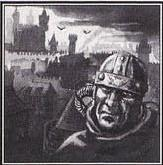

# 0871 封建世界 Feudal World

精校状态：中文行文已逐段精校，部分术语仍为暂定

分类：地理 / 真实空间 Real Space

原文来源：https://www.bilibili.com/opus/1167979208980299778

原作者：帝国神选罐头

原文时间：2026年02月11日 11:15

[返回分类目录](目录.md) · [全书目录](../../目录.md)

<!-- A0871-B0001 -->
**英文原文**

A μ-class, feudal world or medieval world is a classification of world existing in a technologically medieval state. The most advanced such worlds possess black powder weaponry, though some feudal world denizens still possess bionics. The tithes from these planets are slightly more than those of Feral Worlds (generally from Solutio Prima to Solutio Extremis), thanks to the development of agriculture. A feudal world typically has a population of 10,000,000 to 500,000,000 people.

<!-- /A0871-B0001 -->

<!-- A0871-B0002 -->

原译文

μ级，封建世界或中世纪世界是对于存在中世纪技术国家的世界的分类。最先进的世界拥有黑火药武器，尽管一些封建世界的居民仍然拥有仿生部件。由于农业的发展，这些行星的什一税略高于蛮荒世界（通常从第三级上等到第三级高等）。封建世界的人口通常在1亿至5亿之间。

**校订译文**

封建世界，又称中世纪世界，在帝国行星分类中属于μ类，其科技水平相当于中世纪。最先进的封建世界拥有黑火药武器，不过，有些居民仍保有机械义体。由于农业有所发展，这类行星的什一税略高于蛮荒世界，通常介于 Solutio Prima 与 Solutio Extremis 之间，原稿暂译“第三级上等”至“第三级高等”。人口一般为1000万至5亿。

**校注：** 10,000,000 为1000万，原译一亿多了一位。μ为分类代码，不是行政等级。

<!-- /A0871-B0002 -->

<!-- A0871-B0003 图片 -->

<!-- A0871-B0004 -->

原译文

Image of a Feudal World. Observe the bionics on the Imperial denizen 封建世界图像。观察到皇室成员的仿生部件

**校订译文**

Image of a Feudal World. Observe the bionics on the Imperial denizen 封建世界图景。注意这名帝国居民身上的机械义体。

**校注：** Imperial denizen 是帝国居民，并非皇室成员。

<!-- /A0871-B0004 -->

<!-- A0871-B0005 -->
**英文原文**

Feudal worlds are self-sufficient, and due to dependence on agriculture, a large part of the populations of these worlds are peasants, usually ruled by warrior aristocracies. Feudal worlds are of relatively little use to the Imperium; the true position of their place in the universe may constitute something of a culture shock to the inhabitants, making them poor material for Imperial service - although the warrior nobilities are often a source of recruits for the Space Marines.

<!-- /A0871-B0005 -->

<!-- A0871-B0006 -->

原译文

封建世界是自给自足的，由于对农业的依赖，这些世界的大部分人口是农民，通常由战士贵族统治。封建世界对帝国的用处相对较小；他们在宇宙中的真实位置可能会对居民构成某种文化冲击，使他们成为为帝国服役的可怜材料 — 尽管战士贵族往往是星际战士新兵的来源。

**校订译文**

封建世界能够自给自足；由于依赖农业，大部分居民是农民，通常由尚武贵族统治。这类世界对帝国的用处相对有限。居民一旦得知故乡在浩瀚宇宙中的真实地位，可能遭受强烈的文化冲击，因而往往不易适应帝国服役生活。不过，尚武贵族仍是星际战士的重要兵源。

**校注：** poor material 指不适宜征用服役，不是值得同情的“可怜材料”。

<!-- /A0871-B0006 -->

<!-- A0871-B0007 -->
## Notable Feudal Worlds 著名封建世界

<!-- /A0871-B0007 -->

<!-- A0871-B0008 -->
**英文原文**

Acreage - Obscurus - Calixis Sector - Josian Reach - Imperium

<!-- /A0871-B0008 -->

<!-- A0871-B0009 -->

原译文

埃克里奇 - 朦胧星域 - 卡利西斯星区 - 乔西安河段 - 帝国

**校订译文**

埃克里奇 - 朦胧星域 - 卡利西斯星区 - 约西亚疆域 - 帝国

<!-- /A0871-B0009 -->

<!-- A0871-B0010 -->
**英文原文**

Asgard - Imperium

<!-- /A0871-B0010 -->

<!-- A0871-B0011 -->

原译文

阿斯加德 - 帝国

**校订译文**

阿斯加德 - 帝国

<!-- /A0871-B0011 -->

<!-- A0871-B0012 -->
**英文原文**

Attila - Ultima - Imperium

<!-- /A0871-B0012 -->

<!-- A0871-B0013 -->

原译文

阿提拉 - 极限星域 - 帝国

**校订译文**

阿提拉 - 极限星域 - 帝国

<!-- /A0871-B0013 -->

<!-- A0871-B0014 -->
**英文原文**

Barathred - Sparse - Imperium

<!-- /A0871-B0014 -->

<!-- A0871-B0015 -->

原译文

巴拉特雷德 - 稀少 - 帝国

**校订译文**

巴拉特雷德——帝国；人口稀少。

**校注：** Sparse 按清单语境解作人口稀少；原文没有保留列标题，待核。

<!-- /A0871-B0015 -->

<!-- A0871-B0016 -->
**英文原文**

Battakkan - Ultima - Tau/Imperium

<!-- /A0871-B0016 -->

<!-- A0871-B0017 -->

原译文

巴塔坎 - 极限星域 - 钛/帝国

**校订译文**

巴塔坎 - 极限星域 - 钛/帝国

<!-- /A0871-B0017 -->

<!-- A0871-B0018 -->
**英文原文**

Calderis - Ultima - Korianis - Subsector Aurelia - 25 million - Imperium - Also — Desert World

<!-- /A0871-B0018 -->

<!-- A0871-B0019 -->

原译文

卡尔德里 - 极限星域 - 科里安尼斯星区 - 奥瑞利亚分区 - 2500万 - 帝国 - 也是沙漠世界

**校订译文**

卡德里斯——极限星域；科里亚尼斯星区、奥瑞利亚次星区；人口2500万；帝国；也是沙漠世界。

<!-- /A0871-B0019 -->

<!-- A0871-B0020 -->
**英文原文**

Centius Prime - Imperium

<!-- /A0871-B0020 -->

<!-- A0871-B0021 -->

原译文

森修斯一号 - 帝国

**校订译文**

森修斯一号 - 帝国

<!-- /A0871-B0021 -->

<!-- A0871-B0022 -->
**英文原文**

Chbal - Imperium

<!-- /A0871-B0022 -->

<!-- A0871-B0023 -->

原译文

奇巴尔 - 帝国

**校订译文**

奇巴尔 - 帝国

<!-- /A0871-B0023 -->

<!-- A0871-B0024 -->
**英文原文**

Coralax - Outside Imperial boundaries (to the east of Ultima Segmentum) - Imperium - Also — Adeptus Astartes Homeworld (Knights of the Raven)

<!-- /A0871-B0024 -->

<!-- A0871-B0025 -->

原译文

科拉拉克斯 - 帝国边界外（极限星域以东）- 帝国 - 也是阿斯塔特修会家园世界（渡鸦骑士）

**校订译文**

科拉拉克斯——位于帝国边界之外、极限星域以东；帝国；渡鸦骑士战团的母星。

<!-- /A0871-B0025 -->

<!-- A0871-B0026 -->
**英文原文**

Coseflame - Obscurus - Calixis Sector - Adrantis Nebula - Imperium

<!-- /A0871-B0026 -->

<!-- A0871-B0027 -->

原译文

科瑟弗雷姆 - 朦胧星域 - 卡利西斯星区 - 阿德兰蒂斯星云 - 帝国

**校订译文**

科瑟弗雷姆 - 朦胧星域 - 卡利西斯星区 - 阿德兰提斯星云 - 帝国

<!-- /A0871-B0027 -->

<!-- A0871-B0028 -->
**英文原文**

Cousteau XI (former) - Formerly Imperium - Now — Dead World, also formerly — Adeptus Astartes Homeworld (Fire Hawks)

<!-- /A0871-B0028 -->

<!-- A0871-B0029 -->

原译文

库斯托11号（前）- 前帝国 - 现死亡世界，也是前阿斯塔特修会家园世界（火鹰）

**校订译文**

库斯托十一号（原封建世界）——原属帝国；现为死寂世界；曾是火鹰战团的母星。

<!-- /A0871-B0029 -->

<!-- A0871-B0030 -->
**英文原文**

Elros - Obscurus - Calixis Sector - Hazeroth Abyss - Imperium

<!-- /A0871-B0030 -->

<!-- A0871-B0031 -->

原译文

埃尔洛斯 - 朦胧星域 - 卡利西斯星区 - 哈洗录深渊 - 帝国

**校订译文**

埃尔洛斯 - 朦胧星域 - 卡利西斯星区 - 哈冼录深渊 - 帝国

<!-- /A0871-B0031 -->

<!-- A0871-B0032 -->
**英文原文**

Fervious - Obscurus - Calixis Sector - Drusus Marches - Imperium

<!-- /A0871-B0032 -->

<!-- A0871-B0033 -->

原译文

费尔维厄斯 - 朦胧星域 - 卡利西斯星区 - 德鲁苏斯边区 - 帝国

**校订译文**

费尔维厄斯 - 朦胧星域 - 卡利西斯星区 - 德鲁苏斯边区 - 帝国

<!-- /A0871-B0033 -->

<!-- A0871-B0034 -->
**英文原文**

Heterodyne - Obscurus - Calixis Sector - Hazeroth Abyss - Imperium

<!-- /A0871-B0034 -->

<!-- A0871-B0035 -->

原译文

外差星 - 朦胧星域 - 卡利西斯星区 - 哈洗录深渊 - 帝国

**校订译文**

外差星 - 朦胧星域 - 卡利西斯星区 - 哈冼录深渊 - 帝国

<!-- /A0871-B0035 -->

<!-- A0871-B0036 -->
**英文原文**

Hilarion - Obscurus - Calixis Sector - Hazeroth Abyss - Approximately 750,000,000 - Imperium - Also — Agri World

<!-- /A0871-B0036 -->

<!-- A0871-B0037 -->

原译文

希拉里翁 - 朦胧星域 - 卡利西斯星区 - 哈洗录深渊 - 大约7.5亿 - 帝国 - 也是农业世界

**校订译文**

希拉里翁 - 朦胧星域 - 卡利西斯星区 - 哈冼录深渊 - 大约7.5亿 - 帝国 - 也是农业世界

<!-- /A0871-B0037 -->

<!-- A0871-B0038 -->
**英文原文**

Ichovor - Obscurus - Calixis Sector - Hazeroth Abyss - Imperium

<!-- /A0871-B0038 -->

<!-- A0871-B0039 -->

原译文

伊乔沃尔 - 朦胧星域 - 卡利西斯星区 - 哈洗录深渊 - 帝国

**校订译文**

伊乔沃尔 - 朦胧星域 - 卡利西斯星区 - 哈冼录深渊 - 帝国

<!-- /A0871-B0039 -->

<!-- A0871-B0040 -->
**英文原文**

Krastellan - Ultima - Imperium - Also — Knight World (House Hawkshroud)

<!-- /A0871-B0040 -->

<!-- A0871-B0041 -->

原译文

克拉斯特兰 - 极限星域 - 帝国 - 也是骑士世界（鹰覆家族）

**校订译文**

克拉斯特兰 - 极限星域 - 帝国 - 也是骑士世界（覆隼家族）

<!-- /A0871-B0041 -->

<!-- A0871-B0042 -->

原译文

Kvalgron 夸尔格伦

**校订译文**

Kvalgron 夸尔格伦

<!-- /A0871-B0042 -->

<!-- A0871-B0043 -->
**英文原文**

Mancora - Ultima - Imperium - Also — Adeptus Astartes Homeworld (Howling Griffons) and Knight World (House Trainor)

<!-- /A0871-B0043 -->

<!-- A0871-B0044 -->

原译文

曼科拉 - 极限星域 - 帝国 - 也是阿斯塔特修会家园世界（咆哮狮鹫）和骑士世界（特雷纳家族）

**校订译文**

曼科拉——极限星域；帝国；咆哮狮鹫战团的母星，同时也是特雷纳家族的骑士世界。

<!-- /A0871-B0044 -->

<!-- A0871-B0045 -->
**英文原文**

Penopass - Obscurus - Calixis Sector - Malfian Sub-Sector - Penopass System - Imperium

<!-- /A0871-B0045 -->

<!-- A0871-B0046 -->

原译文

佩诺帕斯 - 朦胧星域 - 卡利西斯星区 - 马尔菲安分区 - 佩诺帕斯星系 - 帝国

**校订译文**

佩诺帕斯 - 朦胧星域 - 卡利西斯星区 - 马尔菲安次星区 - 佩诺帕斯星系 - 帝国

<!-- /A0871-B0046 -->

<!-- A0871-B0047 -->
**英文原文**

Sacris - Obscurus - Calixis Sector - Drusus Marches - Imperium - Also — Adeptus Astartes Homeworld (Storm Wardens) and Forbidden World

<!-- /A0871-B0047 -->

<!-- A0871-B0048 -->

原译文

圣礼星 - 朦胧星域 - 卡利西斯星区 - 德鲁苏斯边区 - 帝国 - 也是阿斯塔特修会家园世界（风暴守望者）和禁忌世界

**校订译文**

圣礼星——朦胧星域；卡利西斯星区、德鲁苏斯边区；帝国；风暴看守者战团的母星，也是禁忌世界。

<!-- /A0871-B0048 -->

<!-- A0871-B0049 -->
**英文原文**

Sepheris Secundus - Obscurus - Calixis Sector - Golgenna Reach - 12,000,000,000 - Imperium - Also — Mining World

<!-- /A0871-B0049 -->

<!-- A0871-B0050 -->

原译文

塞菲里斯二号 - 朦胧星域 - 卡利西斯星区 - 戈尔根纳河段 - 120,0000,0000 - 帝国 - 也是矿业世界

**校订译文**

瑟菲瑞斯次星——朦胧星域；卡利西斯星区、戈尔根纳疆域；人口120亿；帝国；也是矿业世界。

<!-- /A0871-B0050 -->

<!-- A0871-B0051 -->
**英文原文**

Sigmatus - Obscurus - Imperium

<!-- /A0871-B0051 -->

<!-- A0871-B0052 -->

原译文

西格玛图斯 - 朦胧星域 - 帝国

**校订译文**

西格玛图斯 - 朦胧星域 - 帝国

<!-- /A0871-B0052 -->

<!-- A0871-B0053 -->
**英文原文**

Sisk - Obscurus - Calixis Sector - The Periphery - Imperium

<!-- /A0871-B0053 -->

<!-- A0871-B0054 -->

原译文

西斯科 - 朦胧星域 - 卡利西斯星区 - 边缘 - 帝国

**校订译文**

西斯科——朦胧星域；卡利西斯星区、边陲；帝国。

<!-- /A0871-B0054 -->

<!-- A0871-B0055 -->
**英文原文**

Solemnus - Solemnus System - Imperium - Former Adeptus Astartes Homeworld (Black Templars), Forbidden World

<!-- /A0871-B0055 -->

<!-- A0871-B0056 -->

原译文

庄严星 - 庄严星系 - 帝国 - 前阿斯塔特修会家园世界（黑色圣堂），禁忌世界

**校订译文**

庄严星——庄严星系；帝国；底稿列为黑色圣堂昔日母星，也是禁忌世界。

**校注：** 保留原文 Former Homeworld 的说法，不凭战团常见舰基传统删改此历史条目。

<!-- /A0871-B0056 -->

<!-- A0871-B0057 -->
**英文原文**

Solstice - Tempestus - Imperium

<!-- /A0871-B0057 -->

<!-- A0871-B0058 -->

原译文

至日星 - 暴风星域 - 帝国

**校订译文**

至日星 - 暴风星域 - 帝国

<!-- /A0871-B0058 -->

<!-- A0871-B0059 -->
**英文原文**

Sophano Secundus - Imperium

<!-- /A0871-B0059 -->

<!-- A0871-B0060 -->

原译文

索法诺二号 - 帝国

**校订译文**

索法诺二号 - 帝国

<!-- /A0871-B0060 -->

<!-- A0871-B0061 -->
**英文原文**

Tanith(former) - Pacificus - Sabbat Worlds - Tanith System - 0 - Now — Dead World

<!-- /A0871-B0061 -->

<!-- A0871-B0062 -->

原译文

塔尼斯（前）- 太平星域 - 安息日世界 - 塔尼斯星系 - 0 - 现死亡世界

**校订译文**

塔尼斯（原封建世界）——太平星域；萨巴特诸世界、塔尼斯星系；人口为零；现为死寂世界。

**校注：** Sabbat 为专名，统一圣萨巴特、萨巴特诸世界及相关远征的词根；原安息日诸世界保留在原译栏，中文暂定。

<!-- /A0871-B0062 -->

<!-- A0871-B0063 -->
**英文原文**

Tranquility-II - Ultima - Maelstrom Zone - Thousands - Imperium

<!-- /A0871-B0063 -->

<!-- A0871-B0064 -->

原译文

宁静二号 - 极限星域 - 大漩涡区 - 数千 - 帝国

**校订译文**

宁静二号——极限星域；大漩涡区域；人口数千；帝国。

<!-- /A0871-B0064 -->

<!-- A0871-B0065 -->
**英文原文**

Triandr - Imperium

<!-- /A0871-B0065 -->

<!-- A0871-B0066 -->

原译文

特瑞安德 - 帝国

**校订译文**

特瑞安德 - 帝国

<!-- /A0871-B0066 -->

<!-- A0871-B0067 -->
**英文原文**

Vandred - Imperium - Recruitment world for the Angels Sanguine Space Marine Chapter.

<!-- /A0871-B0067 -->

<!-- A0871-B0068 -->

原译文

万德雷德 - 帝国 - 血红天使星际战士战团的募兵世界

**校订译文**

万德雷德 - 帝国 - 鲜血天使星际战士战团的募兵世界

<!-- /A0871-B0068 -->

<!-- A0871-B0069 -->
**英文原文**

Vhospis - Imperium

<!-- /A0871-B0069 -->

<!-- A0871-B0070 -->

原译文

沃斯皮斯 - 帝国

**校订译文**

沃斯皮斯 - 帝国

<!-- /A0871-B0070 -->

<!-- A0871-B0071 -->
**英文原文**

Yamnan - Imperium

<!-- /A0871-B0071 -->

<!-- A0871-B0072 -->

原译文

雅姆南 - 帝国

**校订译文**

雅姆南 - 帝国

<!-- /A0871-B0072 -->

<!-- A0871-B0073 -->
**英文原文**

Ynnen(former) - Ultima - Jericho Reach - Imperium

<!-- /A0871-B0073 -->

<!-- A0871-B0074 -->

原译文

伊能（前）- 极限星域 - 杰里科河段 - 帝国

**校订译文**

伊能（前）- 极限星域 - 杰里科疆域 - 帝国

<!-- /A0871-B0074 -->

<!-- A0871-B0075 -->
**英文原文**

Zillman's Domain - Obscurus - Calixis Sector - Imperium

<!-- /A0871-B0075 -->

<!-- A0871-B0076 -->

原译文

齐尔曼之域 - 朦胧星域 - 卡利西斯星区 - 帝国

**校订译文**

齐尔曼之域 - 朦胧星域 - 卡利西斯星区 - 帝国

<!-- /A0871-B0076 -->

本篇核心术语与暂定项

以下列出本篇出现的英文原形及核心术语表用词。同形词可能指不同对象，具体词义以本篇正文和校注为准；单复数、别名和仅见于图注的名称可能尚未列入。完整候选见[术语表](../../术语表/双语术语候选.csv)。

| 英文 | 采用中文 | 状态 |
| --- | --- | --- |
| Space Marines | 星际战士 | 官方已核对 |
| Adeptus Astartes | 阿斯塔特修会 | 官方已核对 |
| Black Templars | 黑色圣堂 | 官方已核对 |
| Imperium | 帝国 | 暂定·简称 |
| Maelstrom | 大漩涡 | 官方已核对 |
| Subsector Aurelia | 奥瑞利亚次星区 | 暂定 |
| Ultima Segmentum | 极限星域 | 暂定·官方待核 |
| Segmentum | 星域 | 暂定·官方待核 |
| Sector | 星区 | 暂定·官方待核 |
| Subsector | 次星区 | 暂定·官方待核 |
| Tanith | 塔尼斯 | 暂定·官方待核 |
| Attila | 阿提拉 | 暂定·官方待核 |
| Calderis | 卡德里斯 | 暂定·官方待核 |
| Sepheris Secundus | 瑟菲瑞斯次星 | 暂定·官方待核 |
| Coralax | 科拉拉克斯 | 暂定·官方待核 |
| Solstice | 至日星 | 暂定·官方待核 |
| Mancora | 曼科拉 | 暂定·官方待核 |
| Solemnus | 庄严星 | 暂定·官方待核 |
| Krastellan | 克拉斯特兰 | 暂定·官方待核 |
| Obscurus | 朦胧星 | 暂定·官方待核 |
| Feral Worlds | 蛮荒世界 | 暂定·官方待核 |
| Feudal Worlds | 封建世界 | 暂定·官方待核 |
| Bionics | 仿生改造／仿生部件（依语境） | 语境定译·官方待核 |
| House Hawkshroud | 覆隼家族 | 暂定·官方待核 |
| Angels Sanguine | 鲜血天使 | 暂定·官方待核 |
| Space Marine | 星际战士 | 暂定·官方待核 |
| Chapter | 战团 | 暂定·官方待核 |
| Fire Hawks | 火鹰 | 暂定·官方待核 |
| Howling Griffons | 咆哮狮鹫 | 暂定·官方待核 |
| Knights of the Raven | 渡鸦骑士 | 暂定·官方待核 |
| Storm Wardens | 风暴看守者 | 暂定·官方待核 |
| Jericho Reach | 杰里科疆域 | 暂定·官方待核 |
| Hazeroth Abyss | 哈冼录深渊 | 暂定·官方待核 |
| System | 星系（恒星系统） | 暂定·官方待核 |
| Calixis Sector | 卡利西斯星区 | 暂定·官方待核 |
| Dead World | 死寂世界 | 暂定·官方待核 |
| Golgenna Reach | 戈尔根纳疆域 | 暂定·官方待核 |
| Josian Reach | 约西亚疆域 | 暂定·官方待核 |
| Hilarion | 希拉里翁 | 暂定·官方待核 |
| Solutio Extremis | 第三级高等 | 暂定·官方待核 |
| Solutio Prima | 第三级上等 | 暂定·官方待核 |
| Feudal World | 封建世界 | 暂定·官方待核 |
| Medieval World | 中世纪世界 | 暂定·官方待核 |
| Malfian Sub-Sector | 马尔菲安次星区 | 暂定·官方待核 |
| The Periphery | 边陲 | 暂定·官方待核 |
| Sabbat Worlds | 萨巴特诸世界 | 暂定·官方待核 |
| Knight World | 骑士世界 | 暂定·官方待核 |
| Mining World | 矿业世界 | 暂定·官方待核 |
| House Trainor | 特雷纳家族 | 暂定·官方待核 |
| Sigmatus | 西格玛图斯 | 暂定·官方待核 |
| Zillman's Domain | 齐尔曼领域 | 暂定·官方待核 |
| Drusus | 德鲁苏斯 | 暂定·官方待核 |

