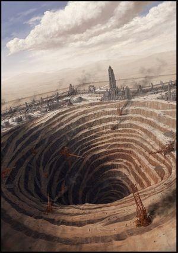

# 0875 矿业世界 Mining World

精校状态：中文行文已逐段精校，部分术语仍为暂定

分类：地理 / 真实空间 Real Space

原文来源：https://www.bilibili.com/opus/1170682865125425185

原作者：帝国神选罐头

原文时间：2026年02月18日 18:07

[返回分类目录](目录.md) · [全书目录](../../目录.md)

<!-- A0875-B0001 -->
**英文原文**

A Mining or Ю class World is a classification for worlds rich in materials what manufactorums and forge worlds are looking for. Enslaved and penal workers harvest these worlds of their mineral riches, whether they are gas, ore or any other mineral demanded by the Imperium. Many of these worlds are inhospitable to humans.

<!-- /A0875-B0001 -->

<!-- A0875-B0002 -->

原译文

矿业或Ю级世界是对制造业和铸造业正在寻找的材料丰富的世界的分类。被奴役和受惩罚的工人收获了这些世界的矿产资源，无论是天然气、矿石还是帝国要求的任何其他矿物。许多这样的世界不适合人类居住。

**校订译文**

矿业世界，即Ю类世界，蕴藏着制造厂与铸造世界所需的丰富原材料。奴隶和囚犯劳工在这些星球开采资源，无论是气体、矿石，还是帝国需要的其他矿物。许多矿业世界的环境并不适合人类居住。

**校注：** Ю为源文中的西里尔字母分类代码，予以保留。penal workers 是囚犯劳工，不是泛指受惩罚的人。

<!-- /A0875-B0002 -->

<!-- A0875-B0003 图片 -->

<!-- A0875-B0004 -->

原译文

An Imperial mining colony 帝国采矿殖民地

**校订译文**

An Imperial mining colony 帝国采矿殖民地

<!-- /A0875-B0004 -->

<!-- A0875-B0005 -->
## Notable Mining Worlds 著名矿业世界

<!-- /A0875-B0005 -->

<!-- A0875-B0006 -->
**英文原文**

Adacore - Imperium - Also — Tomb World

<!-- /A0875-B0006 -->

<!-- A0875-B0007 -->

原译文

阿达科尔 - 帝国 - 也是坟墓世界

**校订译文**

阿达科尔 - 帝国 - 也是坟墓世界

<!-- /A0875-B0007 -->

<!-- A0875-B0008 -->
**英文原文**

Asperity - Tempestus - Imperium

<!-- /A0875-B0008 -->

<!-- A0875-B0009 -->

原译文

严厉星 - 暴风星域 - 帝国

**校订译文**

严厉星 - 暴风星域 - 帝国

<!-- /A0875-B0009 -->

<!-- A0875-B0010 -->
**英文原文**

Balor - Ultima - Imperium

<!-- /A0875-B0010 -->

<!-- A0875-B0011 -->

原译文

巴罗尔 - 极限星域 - 帝国

**校订译文**

巴罗尔 - 极限星域 - 帝国

<!-- /A0875-B0011 -->

<!-- A0875-B0012 -->
**英文原文**

Balzac - Obscurus - Imperium

<!-- /A0875-B0012 -->

<!-- A0875-B0013 -->

原译文

巴尔扎克 - 朦胧星域 - 帝国

**校订译文**

巴尔扎克 - 朦胧星域 - 帝国

<!-- /A0875-B0013 -->

<!-- A0875-B0014 -->
**英文原文**

Barbarus Prime (former) - Ultima - Imperium - 9,000 before destruction - Now — Dead World

<!-- /A0875-B0014 -->

<!-- A0875-B0015 -->

原译文

巴巴鲁斯一号（前）- 极限星域 - 帝国 - 9000毁灭前 - 现死亡世界

**校订译文**

巴巴鲁斯一号（原矿业世界）——极限星域；帝国；毁灭前人口9000；现为死寂世界。

<!-- /A0875-B0015 -->

<!-- A0875-B0016 -->
**英文原文**

Bellis - Obscurus - Imperium - Rich deposits on the moons of the planet. Tried to secede but was returned to Imperium rule by the Dark Angels

<!-- /A0875-B0016 -->

<!-- A0875-B0017 -->

原译文

贝利斯 - 朦胧星域 - 帝国 - 行星的卫星上蕴藏着丰富的矿藏。试图脱离，但被黑暗天使带回帝国统治

**校订译文**

贝利斯——朦胧星域；帝国；其卫星上有丰富矿藏。曾试图脱离帝国，后被黑暗天使重新置于帝国统治之下。

<!-- /A0875-B0017 -->

<!-- A0875-B0018 -->
**英文原文**

Betalis III - Solar - Imperium - 62,000,000 - Also — Ice World

<!-- /A0875-B0018 -->

<!-- A0875-B0019 -->

原译文

贝塔利斯三号 - 太阳星域 - 帝国 - 6200,0000 - 也是冰雪世界

**校订译文**

贝塔利斯三号——太阳星域；帝国；人口6200万；也是冰雪世界。

<!-- /A0875-B0019 -->

<!-- A0875-B0020 -->
**英文原文**

Cagalian IX - Obscurus - Imperium/Genestealer Cults - Overtaken by the Cult of the Rusted Claw

<!-- /A0875-B0020 -->

<!-- A0875-B0021 -->

原译文

卡加利安九号 - 朦胧星域 - 帝国/基因窃取者教派 - 被锈爪教派所取代

**校订译文**

卡加利安九号——朦胧星域；帝国／基因窃取者教派；已被锈爪教派控制。

<!-- /A0875-B0021 -->

<!-- A0875-B0022 -->
**英文原文**

Chemos (former) - Ultima - N/A - None - Now - destroyed

<!-- /A0875-B0022 -->

<!-- A0875-B0023 -->

原译文

彻莫斯（前）- 极限星域 - 无 - 无 - 现毁灭

**校订译文**

彻莫斯（前）- 极限星域 - 无 - 无 - 现毁灭

<!-- /A0875-B0023 -->

<!-- A0875-B0024 -->
**英文原文**

Chinchare - Obscurus - Imperium - Skeleton crew of miners and associated staff of ~5000

<!-- /A0875-B0024 -->

<!-- A0875-B0025 -->

原译文

钦查尔 - 朦胧星域 - 帝国 - 约5000名采矿骷髅船员和相关工作人员

**校订译文**

钦查尔——朦胧星域；帝国；仅保留维持运作所需的矿工和相关人员，约5000人。

**校注：** skeleton crew 是维持运作的最少人员，并非骷髅船员。

<!-- /A0875-B0025 -->

<!-- A0875-B0026 -->
**英文原文**

Cinderus XI - Imperium

<!-- /A0875-B0026 -->

<!-- A0875-B0027 -->

原译文

辛德罗斯十一号 - 帝国

**校订译文**

煤灰十一号 - 帝国

**校注：** 对照本段英文确认同一实体，与全书核心译名统一；不改变同形异义词或省略称呼。

<!-- /A0875-B0027 -->

<!-- A0875-B0028 -->
**英文原文**

Cthonia (former) - Solar - N/A - None - Now - destroyed. Former Adeptus Astartes Homeworld (Sons of Horus)

<!-- /A0875-B0028 -->

<!-- A0875-B0029 -->

原译文

科索尼亚（前）- 太阳星域 - 无 - 现毁灭，前阿斯塔特修会家园世界（荷鲁斯之子）

**校订译文**

科索尼亚（原矿业世界）——太阳星域；归属不适用，已无人居住，现已毁灭；曾是荷鲁斯之子的母星。

<!-- /A0875-B0029 -->

<!-- A0875-B0030 -->
**英文原文**

Dalthus - Obscurus - Imperium

<!-- /A0875-B0030 -->

<!-- A0875-B0031 -->

原译文

达尔萨斯 - 朦胧星域 - 帝国

**校订译文**

达尔萨斯 - 朦胧星域 - 帝国

<!-- /A0875-B0031 -->

<!-- A0875-B0032 -->
**英文原文**

Damnos (former) - Ultima - Imperium - Now — Dead World. Also — Tomb World

<!-- /A0875-B0032 -->

<!-- A0875-B0033 -->

原译文

达姆诺斯（前）- 极限星域 - 帝国 - 现死亡世界。也是坟墓世界

**校订译文**

达蒙斯（前）- 极限星域 - 帝国 - 现死寂世界。也是坟墓世界

<!-- /A0875-B0033 -->

<!-- A0875-B0034 -->
**英文原文**

Deliverance - Tempestus - Imperium - Also — Adeptus Astartes Homeworld (Raven Guard)

<!-- /A0875-B0034 -->

<!-- A0875-B0035 -->

原译文

拯救星 - 暴风星域 - 帝国 - 也是阿斯塔特修会家园世界（暗鸦守卫）

**校订译文**

拯救星——暴风星域；帝国；暗鸦守卫的母星。

<!-- /A0875-B0035 -->

<!-- A0875-B0036 -->
**英文原文**

Desolatia IV - Imperium

<!-- /A0875-B0036 -->

<!-- A0875-B0037 -->

原译文

德索拉提亚四号 - 帝国

**校订译文**

德索拉提亚四号 - 帝国

<!-- /A0875-B0037 -->

<!-- A0875-B0038 -->
**英文原文**

Devlan - Ultima - Imperium

<!-- /A0875-B0038 -->

<!-- A0875-B0039 -->

原译文

德夫兰 - 极限星域 - 帝国

**校订译文**

德夫兰 - 极限星域 - 帝国

<!-- /A0875-B0039 -->

<!-- A0875-B0040 -->
**英文原文**

Dunroamin VI - Ultima - Imperium

<!-- /A0875-B0040 -->

<!-- A0875-B0041 -->

原译文

顿罗明六号 - 极限星域 - 帝国

**校订译文**

顿罗明六号 - 极限星域 - 帝国

<!-- /A0875-B0041 -->

<!-- A0875-B0042 -->
**英文原文**

Dutonis - Obscurus - Imperium - Also — Knight World (House Navaros and House Borgius — mutual rivals)

<!-- /A0875-B0042 -->

<!-- A0875-B0043 -->

原译文

杜托尼 - 朦胧星域 - 帝国 - 也是骑士世界（纳瓦罗斯家族和博吉乌斯家族 — 互为竞争对手）

**校订译文**

杜托尼 - 朦胧星域 - 帝国 - 也是骑士世界（纳瓦罗斯家族和博吉乌斯家族 — 互为竞争对手）

<!-- /A0875-B0043 -->

<!-- A0875-B0044 -->

原译文

Gabrydon 加布里顿

**校订译文**

Gabrydon 加布里顿

<!-- /A0875-B0044 -->

<!-- A0875-B0045 -->
**英文原文**

Geviox - Solar - Imperium - 5,000,000

<!-- /A0875-B0045 -->

<!-- A0875-B0046 -->

原译文

杰维奥克斯 - 太阳星域 - 帝国 - 500,0000

**校订译文**

杰维奥克斯——太阳星域；帝国；人口500万。

<!-- /A0875-B0046 -->

<!-- A0875-B0047 -->
**英文原文**

Ghosar Quintus - Ultima - Imperium - 15,000,000 - Subject of a Genestealer Cult's infection; In Imperial records mentioned as a Delverworld - a world scored of precious minerals

<!-- /A0875-B0047 -->

<!-- A0875-B0048 -->

原译文

戈萨尔五号 - 极限星域 - 帝国 - 1500,0000 - 受基因窃取者教派感染的对象；在帝国记录中被称为挖掘者世界 - 一个由珍贵矿物组成的世界

**校订译文**

戈萨尔五号——极限星域；帝国；人口1500万；遭基因窃取者教派渗透。帝国记录将其列为“深掘世界”（Delverworld），即因开采珍贵矿物而遍布掘痕的世界。

**校注：** scored of precious minerals 语法疑似有误，按 Delverworld 采掘语境暂解为矿业开采留下掘痕；不是整颗星球由贵重矿物组成，保留英文供核。

<!-- /A0875-B0048 -->

<!-- A0875-B0049 -->
**英文原文**

Gorvax - Imperium

<!-- /A0875-B0049 -->

<!-- A0875-B0050 -->

原译文

戈瓦克斯 - 帝国

**校订译文**

戈瓦克斯 - 帝国

<!-- /A0875-B0050 -->

<!-- A0875-B0051 -->
**英文原文**

Greater Eydolim - Ultima - Imperium

<!-- /A0875-B0051 -->

<!-- A0875-B0052 -->

原译文

大艾多利姆 - 极限星域 - 帝国

**校订译文**

大艾多利姆 - 极限星域 - 帝国

<!-- /A0875-B0052 -->

<!-- A0875-B0053 -->
**英文原文**

Guryan - Pacificus - Imperium

<!-- /A0875-B0053 -->

<!-- A0875-B0054 -->

原译文

古里安 - 太平星域 - 帝国

**校订译文**

古里安 - 太平星域 - 帝国

<!-- /A0875-B0054 -->

<!-- A0875-B0055 -->
**英文原文**

Hekarth V(former) - Imperium - Now — Dead World

<!-- /A0875-B0055 -->

<!-- A0875-B0056 -->

原译文

赫卡斯五号（前）- 帝国 - 现死亡世界

**校订译文**

赫卡斯五号（前）- 帝国 - 现死寂世界

<!-- /A0875-B0056 -->

<!-- A0875-B0057 -->
**英文原文**

Herod - Obscurus - Imperium - Also — Desert World

<!-- /A0875-B0057 -->

<!-- A0875-B0058 -->

原译文

希律 - 朦胧星域 - 帝国 - 也是沙漠世界

**校订译文**

希律 - 朦胧星域 - 帝国 - 也是沙漠世界

<!-- /A0875-B0058 -->

<!-- A0875-B0059 -->
**英文原文**

Ichtar IX - Imperium - 20,000,000(before incursion) - All citizens killed by Daemonic Incursion in 161.M32

<!-- /A0875-B0059 -->

<!-- A0875-B0060 -->

原译文

伊什塔尔九号 - 帝国 - 2000,0000（入侵前）- 161.M32所有居民被恶魔入侵杀害

**校订译文**

伊什塔尔九号——帝国；入侵前人口2000万；161.M32年恶魔入侵时，全体居民遭到杀戮。

<!-- /A0875-B0060 -->

<!-- A0875-B0061 -->
**英文原文**

Ixya (former) - Pacificus - Necron - None - Also — Tomb World, now - without humans

<!-- /A0875-B0061 -->

<!-- A0875-B0062 -->

原译文

伊克西亚（前）- 太平星域 - 死灵 - 无 - 也是坟墓世界，现无人

**校订译文**

伊克西亚（原矿业世界）——太平星域；太空死灵；也是古墓世界，现已无人类居民。

**校注：** without humans 只说明无人类，不等于没有太空死灵或任何其他居民。

<!-- /A0875-B0062 -->

<!-- A0875-B0063 -->
**英文原文**

Jubal - Pacificus - Imperium

<!-- /A0875-B0063 -->

<!-- A0875-B0064 -->

原译文

朱巴尔 - 太平星域 - 帝国

**校订译文**

朱巴尔 - 太平星域 - 帝国

<!-- /A0875-B0064 -->

<!-- A0875-B0065 -->
**英文原文**

Jupiter - Solar - Imperium - Sol System, also - a Forge World

<!-- /A0875-B0065 -->

<!-- A0875-B0066 -->

原译文

木星 - 太平星域 - 帝国 - 太阳系，也是铸造世界

**校订译文**

木星——太阳星域；太阳系；帝国；也是铸造世界。

**校注：** Solar 为太阳星域，原译太平星域错误。

<!-- /A0875-B0066 -->

<!-- A0875-B0067 -->
**英文原文**

Karos - Pacificus - Imperium - Now — Ice World, former Civilised World, former Industrial World

<!-- /A0875-B0067 -->

<!-- A0875-B0068 -->

原译文

卡洛斯 - 太平星域 - 帝国 - 现冰雪世界，前文明世界，前工业世界

**校订译文**

卡罗斯 - 太平星域 - 帝国 - 现冰雪世界，前文明世界，前工业世界

<!-- /A0875-B0068 -->

<!-- A0875-B0069 -->
**英文原文**

Karoscura - Imperium

<!-- /A0875-B0069 -->

<!-- A0875-B0070 -->

原译文

卡洛斯卡 - 帝国

**校订译文**

卡罗斯卡 - 帝国

<!-- /A0875-B0070 -->

<!-- A0875-B0071 -->
**英文原文**

Khymara - Ultima - Imperium - Also a Death World

<!-- /A0875-B0071 -->

<!-- A0875-B0072 -->

原译文

凯马拉 - 极限星域 - 帝国 - 也是死亡世界

**校订译文**

凯马拉 - 极限星域 - 帝国 - 也是死亡世界

<!-- /A0875-B0072 -->

<!-- A0875-B0073 -->
**英文原文**

Lemnos - Obscurus - Imperium

<!-- /A0875-B0073 -->

<!-- A0875-B0074 -->

原译文

利姆诺斯 - 朦胧星域 - 帝国

**校订译文**

利姆诺斯 - 朦胧星域 - 帝国

<!-- /A0875-B0074 -->

<!-- A0875-B0075 -->
**英文原文**

Luggnum - Obscurus - Imperium

<!-- /A0875-B0075 -->

<!-- A0875-B0076 -->

原译文

卢格南 - 朦胧星域 - 帝国

**校订译文**

卢格南 - 朦胧星域 - 帝国

<!-- /A0875-B0076 -->

<!-- A0875-B0077 -->
**英文原文**

Makenna VII - Obscurus - Chaos - Former Imperium world

<!-- /A0875-B0077 -->

<!-- A0875-B0078 -->

原译文

麦肯纳七号 - 朦胧星域 - 混沌 - 前帝国世界

**校订译文**

麦肯纳七号 - 朦胧星域 - 混沌 - 前帝国世界

<!-- /A0875-B0078 -->

<!-- A0875-B0079 -->
**英文原文**

Medusa V(former) - Ultima - Imperium - Now — Dead World. Also former Hive World.

<!-- /A0875-B0079 -->

<!-- A0875-B0080 -->

原译文

美杜莎五号（前）- 极限星域 - 帝国 - 现死亡世界。也是前巢都世界

**校订译文**

美杜莎五号（前）- 极限星域 - 帝国 - 现死寂世界。也是前巢都世界

<!-- /A0875-B0080 -->

<!-- A0875-B0081 -->
**英文原文**

Mekslag-Ikks (former) - Tempestus - Orks - Now — Ork World

<!-- /A0875-B0081 -->

<!-- A0875-B0082 -->

原译文

梅克斯拉格-伊克斯（前）- 暴风星域 - 欧克 - 现欧克世界

**校订译文**

梅克斯拉格-伊克斯（前）- 暴风星域 - 欧克 - 现欧克世界

<!-- /A0875-B0082 -->

<!-- A0875-B0083 -->
**英文原文**

Moloch I (former) - Unknown, former Imperium - Now — Dead World

<!-- /A0875-B0083 -->

<!-- A0875-B0084 -->

原译文

摩洛一号（前）- 未知，前帝国 - 现死亡世界

**校订译文**

摩洛一号（前）- 未知，前帝国 - 现死寂世界

<!-- /A0875-B0084 -->

<!-- A0875-B0085 -->
**英文原文**

Moloch II (former) - Unknown, former Imperium - Now — Dead World

<!-- /A0875-B0085 -->

<!-- A0875-B0086 -->

原译文

摩洛二号（前）- 未知，前帝国 - 现死亡世界

**校订译文**

摩洛二号（前）- 未知，前帝国 - 现死寂世界

<!-- /A0875-B0086 -->

<!-- A0875-B0087 -->
**英文原文**

Moloch III - Imperium - Now — War World

<!-- /A0875-B0087 -->

<!-- A0875-B0088 -->

原译文

摩洛三号 - 帝国 - 现战争世界

**校订译文**

摩洛三号 - 帝国 - 现战争世界

<!-- /A0875-B0088 -->

<!-- A0875-B0089 -->
**英文原文**

Mornax - Solar - Imperium - World of the Moebian Domain.

<!-- /A0875-B0089 -->

<!-- A0875-B0090 -->

原译文

莫纳克斯 - 太阳星域 - 帝国 -莫比安领域的世界

**校订译文**

莫纳克斯——太阳星域；帝国；莫比安领所属世界。

<!-- /A0875-B0090 -->

<!-- A0875-B0091 -->
**英文原文**

Mordant Prime - Obscurus - Imperium

<!-- /A0875-B0091 -->

<!-- A0875-B0092 -->

原译文

莫丹特一号 - 朦胧星域 - 帝国

**校订译文**

莫丹特主星 - 朦胧星域 - 帝国

<!-- /A0875-B0092 -->

<!-- A0875-B0093 -->
**英文原文**

Naxos - Obscurus - Imperium - 400,000 among miners and associated staff

<!-- /A0875-B0093 -->

<!-- A0875-B0094 -->

原译文

纳克索斯 - 朦胧星域 - 帝国 - 矿工和相关工作人员400000人

**校订译文**

纳克索斯——朦胧星域；帝国；矿工及相关人员共40万人。

<!-- /A0875-B0094 -->

<!-- A0875-B0095 -->
**英文原文**

Newseam - Ultima - Imperium/Genestealer Cults - Home to the Cult of the Rusted Claw

<!-- /A0875-B0095 -->

<!-- A0875-B0096 -->

原译文

纽西姆 - 极限星域 - 帝国/基因窃取者教派 - 锈爪教派的家园

**校订译文**

纽西姆 - 极限星域 - 帝国/基因窃取者教派 - 锈爪教派的家园

<!-- /A0875-B0096 -->

<!-- A0875-B0097 -->
**英文原文**

ND0/K4 - Obscurus - Imperium - ~4500 (?)

<!-- /A0875-B0097 -->

<!-- A0875-B0098 -->

原译文

ND0/K4 - 朦胧星域 - 帝国 - ~4500（?）

**校订译文**

ND0/K4 - 朦胧星域 - 帝国 - ~4500（?）

<!-- /A0875-B0098 -->

<!-- A0875-B0099 -->

原译文

Optima Prima - Obscurus - Imperium/Nurgle - Also — War World and Hive World 奥普蒂玛一号 - 朦胧星域 - 帝国/纳垢 - 也是战争世界和巢都世界

**校订译文**

Optima Prima - Obscurus - Imperium/Nurgle - Also — War World and Hive World 奥普蒂玛主星 - 朦胧星域 - 帝国/纳垢 - 也是战争世界和巢都世界

<!-- /A0875-B0099 -->

<!-- A0875-B0100 -->
**英文原文**

Oleumus - Imperium

<!-- /A0875-B0100 -->

<!-- A0875-B0101 -->

原译文

奥莱姆斯 - 帝国

**校订译文**

奥莱姆斯 - 帝国

<!-- /A0875-B0101 -->

<!-- A0875-B0102 -->
**英文原文**

Parocheus - Imperium

<!-- /A0875-B0102 -->

<!-- A0875-B0103 -->

原译文

帕罗切乌斯 - 帝国

**校订译文**

帕罗切乌斯 - 帝国

<!-- /A0875-B0103 -->

<!-- A0875-B0104 -->
**英文原文**

Pavonis - Ultima - Imperium - 300,000,000

<!-- /A0875-B0104 -->

<!-- A0875-B0105 -->

原译文

帕沃尼斯 - 极限星域 - 帝国 - 3,0000,0000

**校订译文**

帕沃尼斯——极限星域；帝国；人口3亿。

<!-- /A0875-B0105 -->

<!-- A0875-B0106 -->
**英文原文**

Pellucida IX - Obscurus - Imperium

<!-- /A0875-B0106 -->

<!-- A0875-B0107 -->

原译文

佩露西达九号 - 朦胧星域 - 帝国

**校订译文**

佩露西达九号 - 朦胧星域 - 帝国

<!-- /A0875-B0107 -->

<!-- A0875-B0108 -->
**英文原文**

Piscina IV - Imperium

<!-- /A0875-B0108 -->

<!-- A0875-B0109 -->

原译文

皮希纳四号 - 帝国

**校订译文**

皮希纳四号 - 帝国

<!-- /A0875-B0109 -->

<!-- A0875-B0110 -->
**英文原文**

Procon Secundus - Imperium

<!-- /A0875-B0110 -->

<!-- A0875-B0111 -->

原译文

普罗孔二号 - 帝国

**校订译文**

普罗孔二号 - 帝国

<!-- /A0875-B0111 -->

<!-- A0875-B0112 -->
**英文原文**

Purgatory of Soubirous - Obscurus - Imperium

<!-- /A0875-B0112 -->

<!-- A0875-B0113 -->

原译文

苏比鲁炼狱 - 朦胧星域 - 帝国

**校订译文**

苏比鲁炼狱 - 朦胧星域 - 帝国

<!-- /A0875-B0113 -->

<!-- A0875-B0114 -->
**英文原文**

Rhanda - Solar - Imperium - Also — Civilised World

<!-- /A0875-B0114 -->

<!-- A0875-B0115 -->

原译文

兰达 - 太阳星域 - 帝国 - 也是文明世界

**校订译文**

兰达 - 太阳星域 - 帝国 - 也是文明世界

<!-- /A0875-B0115 -->

<!-- A0875-B0116 -->
**英文原文**

Schrodinger VII (former) - Necrons, former Imperium - Tomb World, Ice World, also - former Hive World

<!-- /A0875-B0116 -->

<!-- A0875-B0117 -->

原译文

薛定谔七号（前）- 死灵，前帝国 - 坟墓世界，冰雪世界，也是前巢都世界

**校订译文**

薛定谔七号（原矿业世界）——现属太空死灵，原属帝国；也是古墓世界和冰雪世界，过去曾是巢都世界。

<!-- /A0875-B0117 -->

<!-- A0875-B0118 -->
**英文原文**

Sepheris Secundus - Obscurus - Imperium - 12,000,000,000 - Also — Feudal World

<!-- /A0875-B0118 -->

<!-- A0875-B0119 -->

原译文

塞菲里斯二号 - 朦胧星域 - 帝国 - 120,0000,0000

**校订译文**

瑟菲瑞斯次星——朦胧星域；帝国；人口120亿；也是封建世界。

**校注：** 补回原译遗漏的封建世界分类。

<!-- /A0875-B0119 -->

<!-- A0875-B0120 -->
**英文原文**

Shroud - Imperium - Millions - Also — Hive World and Ice World

<!-- /A0875-B0120 -->

<!-- A0875-B0121 -->

原译文

寿衣星 - 帝国 - 数百万 - 也是巢都世界和冰雪世界

**校订译文**

寿衣星 - 帝国 - 数百万 - 也是巢都世界和冰雪世界

<!-- /A0875-B0121 -->

<!-- A0875-B0122 -->
**英文原文**

Slud - Imperium

<!-- /A0875-B0122 -->

<!-- A0875-B0123 -->

原译文

斯勒德 - 帝国

**校订译文**

斯勒德 - 帝国

<!-- /A0875-B0123 -->

<!-- A0875-B0124 -->
**英文原文**

Sophano Prime - Obscurus - Imperium

<!-- /A0875-B0124 -->

<!-- A0875-B0125 -->

原译文

索法诺一号 - 朦胧星域 - 帝国

**校订译文**

索法诺一号 - 朦胧星域 - 帝国

<!-- /A0875-B0125 -->

<!-- A0875-B0126 -->
**英文原文**

Soryth - Obscurus - Imperium

<!-- /A0875-B0126 -->

<!-- A0875-B0127 -->

原译文

索瑞斯 - 朦胧星域 - 帝国

**校订译文**

索瑞斯 - 朦胧星域 - 帝国

<!-- /A0875-B0127 -->

<!-- A0875-B0128 -->
**英文原文**

Taros (T'ros) - Ultima - Tau, former Imperium - Now Tau World. Also — Desert World.

<!-- /A0875-B0128 -->

<!-- A0875-B0129 -->

原译文

塔罗斯（特'罗斯）- 极限星域 - 钛，前帝国 - 现钛世界。也是沙漠世界

**校订译文**

塔罗斯（特'罗斯）- 极限星域 - 钛，前帝国 - 现钛世界。也是沙漠世界

<!-- /A0875-B0129 -->

<!-- A0875-B0130 -->
**英文原文**

Tephra VII - Obscurus - Chaos, former — Imperium - None

<!-- /A0875-B0130 -->

<!-- A0875-B0131 -->

原译文

火山灰七号 - 朦胧星域 - 混沌，前帝国 - 无

**校订译文**

火山灰七号 - 朦胧星域 - 混沌，前帝国 - 无

<!-- /A0875-B0131 -->

<!-- A0875-B0132 -->
**英文原文**

Thandros System, Planets of the - Ultima(Eastern Fringe) - Imperium - Consist of Thandros II and Thandros III mining worlds

<!-- /A0875-B0132 -->

<!-- A0875-B0133 -->

原译文

桑德罗斯星系，极限星域（远东边缘）行星 - 帝国 - 由桑德罗斯二号和桑德罗斯三号矿业世界组成

**校订译文**

桑德罗斯星系诸行星——极限星域东部边缘；帝国；包括桑德罗斯二号与桑德罗斯三号两颗矿业世界。

<!-- /A0875-B0133 -->

<!-- A0875-B0134 -->
**英文原文**

Trollix - Imperium - Is noted to have lava oceans.

<!-- /A0875-B0134 -->

<!-- A0875-B0135 -->

原译文

特罗利克斯 - 帝国 - 据说有熔岩海洋。

**校订译文**

特罗利克斯 - 帝国 - 据说有熔岩海洋。

<!-- /A0875-B0135 -->

<!-- A0875-B0136 -->
**英文原文**

Uldan - Imperium - Also — Jungle World

<!-- /A0875-B0136 -->

<!-- A0875-B0137 -->

原译文

乌兰 - 帝国 - 也是丛林世界

**校订译文**

乌兰 - 帝国 - 也是丛林世界

<!-- /A0875-B0137 -->

<!-- A0875-B0138 -->
**英文原文**

Vernalis - Obscurus - Imperium

<!-- /A0875-B0138 -->

<!-- A0875-B0139 -->

原译文

维纳利斯 - 朦胧星域 - 帝国

**校订译文**

维纳利斯 - 朦胧星域 - 帝国

<!-- /A0875-B0139 -->

<!-- A0875-B0140 -->
**英文原文**

Vityris - Imperium - Also — Death World

<!-- /A0875-B0140 -->

<!-- A0875-B0141 -->

原译文

维提里斯 - 帝国 - 也是死亡世界

**校订译文**

维提里斯 - 帝国 - 也是死亡世界

<!-- /A0875-B0141 -->

<!-- A0875-B0142 -->
**英文原文**

Volyn - Imperium

<!-- /A0875-B0142 -->

<!-- A0875-B0143 -->

原译文

沃伦 - 帝国

**校订译文**

沃伦 - 帝国

<!-- /A0875-B0143 -->

<!-- A0875-B0144 -->
**英文原文**

Xanthematos - Imperium (former)

<!-- /A0875-B0144 -->

<!-- A0875-B0145 -->

原译文

桑特马托斯 - 帝国（前）

**校订译文**

桑特马托斯 - 帝国（前）

<!-- /A0875-B0145 -->

<!-- A0875-B0146 -->
**英文原文**

Zeutus - Imperium - Noted to have electro-clouds.

<!-- /A0875-B0146 -->

<!-- A0875-B0147 -->

原译文

祖图斯 - 帝国 - 注意到有电云。

**校订译文**

祖图斯——帝国；以带电云层著称。

<!-- /A0875-B0147 -->

本篇核心术语与暂定项

以下列出本篇出现的英文原形及核心术语表用词。同形词可能指不同对象，具体词义以本篇正文和校注为准；单复数、别名和仅见于图注的名称可能尚未列入。完整候选见[术语表](../../术语表/双语术语候选.csv)。

| 英文 | 采用中文 | 状态 |
| --- | --- | --- |
| Adeptus Astartes | 阿斯塔特修会 | 官方已核对 |
| Dark Angels | 黑暗天使 | 官方已核对 |
| Genestealer Cults | 基因窃取者教派 | 官方已核对 |
| Necrons | 太空死灵 | 官方已核对 |
| Orks | 欧克蛮人 | 官方已核对 |
| Imperium | 帝国 | 暂定·简称 |
| Hive World | 巢都世界 | 暂定·官方待核 |
| Forge World | 铸造世界 | 暂定·官方待核 |
| Barbarus | 巴巴鲁斯 | 暂定·官方待核 |
| Horus | 荷鲁斯 | 暂定·官方待核 |
| Sons of Horus | 荷鲁斯之子 | 暂定·官方待核 |
| Eastern Fringe | 东部边缘 | 暂定·官方待核 |
| Jupiter | 木星 | 暂定·官方待核 |
| Sepheris Secundus | 瑟菲瑞斯次星 | 暂定·官方待核 |
| Betalis III | 贝塔利斯三号 | 暂定·官方待核 |
| Deliverance | 拯救星 | 暂定·官方待核 |
| Ghosar Quintus | 戈萨尔五号 | 暂定·官方待核 |
| Piscina IV | 皮希纳四号 | 暂定·官方待核 |
| Mordant Prime | 莫丹特主星 | 暂定·官方待核 |
| Taros | 塔罗斯 | 暂定·官方待核 |
| Medusa V | 美杜莎五号 | 暂定·官方待核 |
| Damnos | 达蒙斯 | 暂定·官方待核 |
| Cthonia | 科索尼亚 | 暂定·官方待核 |
| Chemos | 彻莫斯 | 暂定·官方待核 |
| Obscurus | 朦胧星 | 暂定·官方待核 |
| Medusa | 美杜莎 | 暂定·官方待核 |
| Moloch III | 摩洛三号 | 暂定·官方待核 |
| Mining Worlds | 矿业世界 | 暂定·官方待核 |
| Moebian Domain | 莫比安领 | 暂定·官方待核 |
| Raven Guard | 暗鸦守卫 | 官方已核 |
| Sol | 太阳系 | 暂定·官方待核 |
| Barbarus Prime | 巴巴鲁斯一号 | 暂定·官方待核 |
| Cult of the Rusted Claw | 锈爪教派 | 暂定·官方待核 |
| Devlan | 德夫兰 | 暂定·官方待核 |
| Vernalis | 维纳利斯 | 暂定·官方待核 |
| The Dark | 《黑暗》 | 暂定·官方待核 |
| Quintus | 昆图斯 | 暂定·官方待核 |
| System | 星系（恒星系统） | 暂定·官方待核 |
| Dead World | 死寂世界 | 暂定·官方待核 |
| Death World | 死亡世界 | 暂定·官方待核 |
| Shroud | 裹尸布 | 暂定·官方待核 |
| Civilised World | 文明世界 | 暂定·官方待核 |
| Karos | 卡罗斯 | 暂定·官方待核 |
| Rhanda | 兰达 | 暂定·官方待核 |
| Khymara | 凯马拉 | 暂定·官方待核 |
| Piscina | 皮希纳 | 暂定·官方待核 |
| Vityris | 维提里斯 | 暂定·官方待核 |
| Feudal World | 封建世界 | 暂定·官方待核 |
| Industrial World | 工业世界 | 暂定·官方待核 |
| Knight World | 骑士世界 | 暂定·官方待核 |
| Delverworld | 深掘世界 | 暂定·官方待核 |
| Thandros System | 桑德罗斯星系 | 暂定·官方待核 |
| War World | 战争世界 | 暂定·官方待核 |
| claw | 利爪分队 | 暂定·官方待核 |
| T'ros | 特’罗斯 | 暂定·官方待核 |
| Cinderus XI | 煤灰十一号 | 暂定·官方待核 |
| Makenna VII | 马金纳七号 | 暂定·官方待核 |
| Luggnum | 卢格努姆 | 暂定·官方待核 |
| Sol System | 太阳系 | 暂定·官方待核 |

