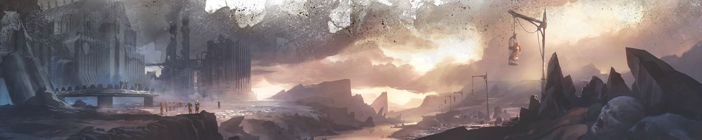

# 0877 刑罚世界 Penal World

精校状态：中文行文已逐段精校，部分术语仍为暂定

分类：地理 / 真实空间 Real Space

原文来源：https://www.bilibili.com/opus/1172115180918669329

原作者：帝国神选罐头

原文时间：2026年02月22日 14:45

[返回分类目录](目录.md) · [全书目录](../../目录.md)

<!-- A0877-B0001 -->
**英文原文**

Penal Worlds is a classification given by the Imperium, to worlds that are used to house Human convicts who have broken its laws. The chief authority of a Penal World is its Governor-Warden.

<!-- /A0877-B0001 -->

<!-- A0877-B0002 -->

原译文

刑罚世界是帝国对用来关押违反其法律的人类罪犯的世界的分类。刑罚世界的主要权威是其看守总督。

**校订译文**

刑罚世界是帝国用来关押触犯帝国法律的人类罪犯的世界，其最高负责人称为看守总督。

<!-- /A0877-B0002 -->

<!-- A0877-B0003 -->
**英文原文**

Penal Colony populations can have a wide range of incarcerated individuals. Some might house a million rapists, murderers, heretics, secessionists, thieves, mutants and criminals of a thousand other types. All discarded by the Imperium who loathed them.

<!-- /A0877-B0003 -->

<!-- A0877-B0004 -->

原译文

流放地人口中可能有各种各样的被监禁者。有些可能收容了百万强奸犯、杀人犯、异端、分裂主义者、小偷、变种人和千种其他类型的罪犯。所有这些都被厌恶他们的帝国抛弃了。

**校订译文**

刑罚殖民地关押着形形色色的人。有的收容上百万名强奸犯、杀人犯、异端、分离主义者、窃贼、变种人，以及犯下其他各类罪行的人。他们都是被帝国厌弃、抛弃的人。

<!-- /A0877-B0004 -->

<!-- A0877-B0005 -->
**英文原文**

Penal Worlds might house minor criminals such as recidivists, or the worst kind of criminals such as murderers, rapists, and heretics. Depending on their crimes and sentences, each group might be housed in specific Interment Spires. The worst criminals might be condemned to execution, but continue to be used as slave labour for a span of years (or even decades) in mining operations or other heavy labour.

<!-- /A0877-B0005 -->

<!-- A0877-B0006 -->

原译文

刑罚世界可能容纳累犯等轻微罪犯，或杀人犯、强奸犯和异端等最恶劣的罪犯。根据他们的罪行和判决，每个小组可能会被安置在特定的埋葬尖塔中。最严重的罪犯可能会被判处死刑，但在采矿作业或其他繁重劳动中继续被用作奴工多年（甚至几十年）。

**校订译文**

刑罚世界既可能关押罪行较轻的惯犯，也可能收押杀人犯、强奸犯和异端等最严重的罪犯。囚犯依罪名和刑期被分置于特定的监禁尖塔。罪行最重的人可能被判处死刑，却在执行前继续作为奴工，从事采矿或其他重体力劳动，长达数年甚至数十年。

**校注：** Interment 通常指埋葬，依关押与分区语境疑为 Internment 的误拼，暂译监禁尖塔并保留英文原文。recidivist 本身表示再犯者，并不必然是轻罪；原文这样归类，照实保留。

<!-- /A0877-B0006 -->

<!-- A0877-B0007 -->
**英文原文**

Children condemned of crimes are also sent to these prisons. These juves who witnessed a crime might receive a reduced sentence due to their young age, and only be condemned to a couple years of hard labour in a penal camp. Other times an innocent Guardsman is sentenced to life for a crime they didn't commit.

<!-- /A0877-B0007 -->

<!-- A0877-B0008 -->

原译文

被判有罪的儿童也被送往这些监狱。这些被目睹犯罪的青年可能会因年龄较小而被减刑，只会被判处在劳改营中苦役几年。其他时候，一名无辜的卫兵因他们没有犯下的罪行被判处终身监禁。

**校订译文**

被判有罪的儿童也会被送往这些监狱。原文称，目睹犯罪的少年可能因年幼而获减刑，只被判在刑罚营服数年苦役。无辜的帝国卫队士兵有时也会因未曾犯下的罪行被判终身监禁。

**校注：** 英文写 witnessed a crime（目睹犯罪），并非 witnessed committing a crime（被目击犯罪）；按现有英文译出，并标明此可疑表述待核，未擅改成确实犯罪。

<!-- /A0877-B0008 -->

<!-- A0877-B0009 图片 -->

<!-- A0877-B0010 -->

原译文

Imperial Penal Colony 帝国流放地

**校订译文**

Imperial Penal Colony 帝国刑罚殖民地

<!-- /A0877-B0010 -->

<!-- A0877-B0011 -->
## Notable Penal Worlds 著名刑罚世界

<!-- /A0877-B0011 -->

<!-- A0877-B0012 -->

原译文

Lost Hope 无望星

**校订译文**

Lost Hope 失落希望（原稿另译无望星）

**校注：** 沿869 Lost Hope 失落希望；保留本篇原稿别名无望星。

<!-- /A0877-B0012 -->

<!-- A0877-B0013 -->

原译文

Sacc-Five 萨克五

**校订译文**

Sacc-Five 萨克五

<!-- /A0877-B0013 -->

<!-- A0877-B0014 -->

原译文

Savlar 萨夫拉

**校订译文**

Savlar 萨夫拉

<!-- /A0877-B0014 -->

<!-- A0877-B0015 -->

原译文

Obscurus 朦胧星

**校订译文**

Obscurus 朦胧星

<!-- /A0877-B0015 -->

<!-- A0877-B0016 -->

原译文

Panoptic 全视星

**校订译文**

Panoptic 全视星

<!-- /A0877-B0016 -->

<!-- A0877-B0017 -->

原译文

Phyrr 菲尔

**校订译文**

Phyrr 菲尔

<!-- /A0877-B0017 -->

<!-- A0877-B0018 -->

原译文

Ixus IX 伊克萨斯九号

**校订译文**

Ixus IX 伊克萨斯九号

<!-- /A0877-B0018 -->

本篇核心术语与暂定项

以下列出本篇出现的英文原形及核心术语表用词。同形词可能指不同对象，具体词义以本篇正文和校注为准；单复数、别名和仅见于图注的名称可能尚未列入。完整候选见[术语表](../../术语表/双语术语候选.csv)。

| 英文 | 采用中文 | 状态 |
| --- | --- | --- |
| Imperium | 帝国 | 暂定·简称 |
| Penal Worlds | 刑罚世界 | 暂定·官方待核 |
| Penal World | 刑罚世界 | 暂定·官方待核 |
| Penal Colony | 刑罚殖民地 | 暂定·官方待核 |
| Governor-Warden | 看守总督 | 暂定·官方待核 |
| Interment Spires | 监禁尖塔 | 暂定·官方待核 |

