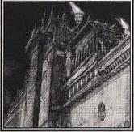
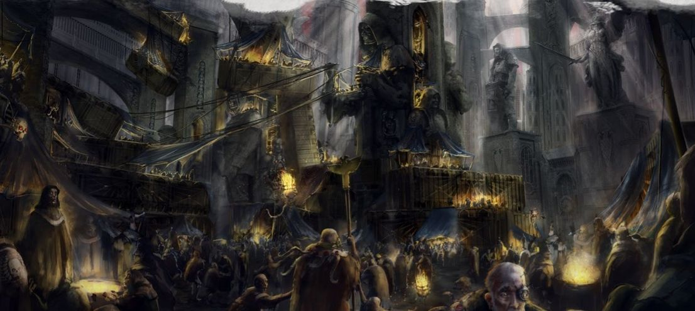

# 0878 圣地世界 Shrine World

精校状态：中文行文已逐段精校，部分术语仍为暂定

分类：地理 / 真实空间 Real Space

原文来源：https://www.bilibili.com/opus/1145321276527607816

原作者：帝国神选罐头

原文时间：2025年12月12日 09:51

[返回分类目录](目录.md) · [全书目录](../../目录.md)

<!-- A0878-B0001 -->
**英文原文**

Shrine Worlds (or Shrineworlds and Cathedral Worlds) are Imperial worlds devoted to a Saint of the Imperium and are often named in their honour. These worlds are ruled directly by the Adeptus Ministorum and attract huge amounts of pilgrims from all over the Imperium. There are also the dark mirrors to these places of Imperial devotion - fallen worlds where the inhabitants offer up ceaseless prayer to the Dark Gods. These places of obscene sacrifices and bloody rites are not suffered continued existence for long. Often Shrine Worlds are places of eternal rest for holy men and women of the Imperium and the entire surface of these sacred planets are given over to the hallowed crypts of sainted and great monolithic cathedra.

<!-- /A0878-B0001 -->

<!-- A0878-B0002 -->

原译文

圣地世界（或神殿世界和大教堂世界）是献给帝国圣人的帝国世界，通常以他们的名字命名。这些世界由国教教会直接统治，吸引了来自帝国各地的大量朝圣者。这些帝国虔诚之地也有黑暗的镜像 — 堕落世界，那里的居民不断地向黑暗诸神祈祷。这些淫秽祭祀和血腥仪式的场所并没有长期存在。圣地世界通常是帝国神圣男女永恒安息的地方，这些神圣行星的整个表面都被交给了神圣而伟大的整体式大教堂的神圣地下墓穴。

**校订译文**

圣地世界，又可称大教堂世界，是奉献给某位帝国圣人的行星，往往也以这位圣人的名字命名。英文 Shrine World 亦可连写为 Shrineworld。这些世界由国教会直接统治，吸引帝国各地的大量朝圣者。帝国的虔敬之地也有黑暗的对应物：在一些堕落世界，居民日夜向黑暗诸神祈祷。帝国不会容忍这些充斥亵渎献祭与血腥仪式的地方长久存在。许多圣地世界是帝国圣徒的永眠之所，整颗神圣星球的表面都布满圣人陵墓与宏伟的巨石大教堂。

**校注：** Shrineworlds 是连写变体，不构成另一个“神殿世界”分类。not suffered continued existence 表示不被容忍长期存在，并非证明所有这类世界都已被消灭。

<!-- /A0878-B0002 -->

<!-- A0878-B0003 图片 -->

<!-- A0878-B0004 -->

原译文

Image of the Shrine World 圣地世界图片

**校订译文**

Image of the Shrine World 圣地世界图片

<!-- /A0878-B0004 -->

<!-- A0878-B0005 -->
**英文原文**

Shrine worlds are often thick with incense and candle smoke. Tallow Worlds are known to export significant amounts of their candles to nearby shrine worlds. Although, these candles made from rendered down human bodies tend to give off an unpleasant smell.

<!-- /A0878-B0005 -->

<!-- A0878-B0006 -->

原译文

圣地世界通常充满了熏香和蜡烛烟雾。众所周知，油脂世界会向附近的圣地世界出口大量蜡烛。尽管如此，这些由经过人体提炼物制成的蜡烛往往会散发出难闻的气味。

**校订译文**

圣地世界常年笼罩在熏香与烛烟之中。油脂世界会向邻近圣地世界输出大量蜡烛。不过，这些蜡烛由人体熬炼出的脂肪制成，往往散发出难闻的气味。

<!-- /A0878-B0006 -->

<!-- A0878-B0007 -->
**英文原文**

Most shrine worlds usually fall into another category - for example, Hagia is an agri world while Herodor is a Hive World. They have a strong relationship with the saint in question, such as being the world of his or her birth or martyrdom.

<!-- /A0878-B0007 -->

<!-- A0878-B0008 -->

原译文

大多数神社世界通常属于另一类 — 例如，哈吉亚是一个农业世界，而希罗多尔是一个巢都世界。他们与所讨论的圣人有着密切的关系，比如成为他或她出生或殉道的世界。

**校订译文**

大多数圣地世界也属于其他世界类别。例如哈吉亚同时是农业世界，希罗多尔则是巢都世界。它们都与所奉敬的圣人关系密切，可能是其出生地或殉道之地。

<!-- /A0878-B0008 -->

<!-- A0878-B0009 图片 -->

<!-- A0878-B0010 -->

原译文

The Shrine World Enoch 伊诺克圣地世界

**校订译文**

The Shrine World Enoch 伊诺克圣地世界

<!-- /A0878-B0010 -->

<!-- A0878-B0011 -->
### Notable Shrine Worlds 著名圣地世界

<!-- /A0878-B0011 -->

<!-- A0878-B0012 -->
**英文原文**

Almarit (former) - Chaos/Khorne, former Imperium - Now — Daemon World, former Fortress World

<!-- /A0878-B0012 -->

<!-- A0878-B0013 -->

原译文

阿尔马里特（前）- 混沌/恐虐，前帝国 - 现—恶魔世界，前堡垒世界

**校订译文**

阿尔玛瑞特（原圣地世界）——现归属混沌恐虐，原属帝国；现为恶魔世界，过去也是堡垒世界。

<!-- /A0878-B0013 -->

<!-- A0878-B0014 -->
**英文原文**

Arthas Moloch (former) - Ultima - Tau Empire - Now — Tau World. Also — Artefact World

<!-- /A0878-B0014 -->

<!-- A0878-B0015 -->

原译文

阿尔萨斯·莫洛克（前）- 极限星域 - 钛帝国 - 现—钛世界。也是—神器世界

**校订译文**

阿尔萨斯·摩洛克（前）- 极限星域 - 钛帝国 - 现—钛世界。也是—神器世界

<!-- /A0878-B0015 -->

<!-- A0878-B0016 -->
**英文原文**

Aq'arus - Obscurus - Geminon System - Imperium

<!-- /A0878-B0016 -->

<!-- A0878-B0017 -->

原译文

阿克'拉斯 - 朦胧星炬 - 杰米农星系 - 帝国

**校订译文**

阿克’拉斯——朦胧星域；杰米农星系；帝国。

**校注：** 原译“朦胧星炬”应为朦胧星域。

<!-- /A0878-B0017 -->

<!-- A0878-B0018 -->
**英文原文**

Autega - Imperium - Also — Death World

<!-- /A0878-B0018 -->

<!-- A0878-B0019 -->

原译文

奥特加 - 帝国 - 也是死亡世界

**校订译文**

奥泰加——帝国；也是死亡世界。

<!-- /A0878-B0019 -->

<!-- A0878-B0020 -->
**英文原文**

Bekrin (former) - Ultima - Jericho Reach - Imperium - Now — Dead World

<!-- /A0878-B0020 -->

<!-- A0878-B0021 -->

原译文

贝克林（前）- 极限星域 - 杰里科河段 - 帝国 - 现—死亡世界

**校订译文**

贝克林（前）- 极限星域 - 杰里科疆域 - 帝国 - 现—死寂世界

<!-- /A0878-B0021 -->

<!-- A0878-B0022 -->
**英文原文**

Belatis IV - Imperium - None - Also — Ice World

**校注：** Belatis IV 按原拼写保留，不能仅凭近似字形与 Betalis IV 自动合并。

<!-- /A0878-B0022 -->

<!-- A0878-B0023 -->

原译文

贝拉蒂斯四号 - 帝国 - 无 - 也是—冰雪世界

**校订译文**

贝拉蒂斯四号 - 帝国 - 无 - 也是—冰雪世界

<!-- /A0878-B0023 -->

<!-- A0878-B0024 -->
**英文原文**

Benediction - Solar - Veritus Sub-Sector - Talledus System - Imperium - 100 billion

<!-- /A0878-B0024 -->

<!-- A0878-B0025 -->

原译文

祝福星 - 太阳星域 - 维里图斯分区 - 塔列多斯星系 - 帝国 - 1000亿

**校订译文**

祝福星 - 太阳星域 - 维里图斯次星区 - 塔勒都斯星系 - 帝国 - 1000亿

**校注：** 对照本段英文确认同一实体，与全书核心译名统一；不改变同形异义词或省略称呼。

<!-- /A0878-B0025 -->

<!-- A0878-B0026 -->
**英文原文**

Canticula - former Imperium - Was ravaged by Word Bearers

<!-- /A0878-B0026 -->

<!-- A0878-B0027 -->

原译文

坎蒂库拉 - 前帝国 - 被怀言者毁灭

**校订译文**

坎蒂库拉——原属帝国；曾遭怀言者蹂躏。

**校注：** ravaged 表示蹂躏破坏，并不足以断言整颗世界彻底毁灭。

<!-- /A0878-B0027 -->

<!-- A0878-B0028 -->
**英文原文**

Drusus Shrine World - Obscurus - Calixis Sector - Drusus Marches - Imperium

<!-- /A0878-B0028 -->

<!-- A0878-B0029 -->

原译文

德鲁苏斯圣地世界 - 朦胧星域 - 卡利西斯星区 - 德鲁苏斯边区 - 帝国

**校订译文**

德鲁苏斯圣地世界 - 朦胧星域 - 卡利西斯星区 - 德鲁苏斯边区 - 帝国

<!-- /A0878-B0029 -->

<!-- A0878-B0030 -->
**英文原文**

Emiline's Hope - Yerena System - Imperium

<!-- /A0878-B0030 -->

<!-- A0878-B0031 -->

原译文

艾米莉之希望 - 耶雷纳星系 - 帝国

**校订译文**

艾米琳之希望 - 耶雷纳星系 - 帝国

<!-- /A0878-B0031 -->

<!-- A0878-B0032 -->
**英文原文**

Eydolim - Ultima - Charadon Sector - Eydolim System - Imperium

<!-- /A0878-B0032 -->

<!-- A0878-B0033 -->

原译文

埃多利姆 - 极限星域 - 查拉顿星区 - 埃多利姆星系 - 帝国

**校订译文**

埃多利姆 - 极限星域 - 查拉顿星区 - 埃多利姆星系 - 帝国

<!-- /A0878-B0033 -->

<!-- A0878-B0034 -->
**英文原文**

Gundora - Tratoll System - Imperium - Also — War World

<!-- /A0878-B0034 -->

<!-- A0878-B0035 -->

原译文

贡多拉 - 特拉托尔星系 - 帝国 - 也是—战争世界

**校订译文**

贡多拉 - 特拉托尔星系 - 帝国 - 也是—战争世界

<!-- /A0878-B0035 -->

<!-- A0878-B0036 -->
**英文原文**

Hagia - Pacificus - Sabbat World - Imperium - Also — Agri World

<!-- /A0878-B0036 -->

<!-- A0878-B0037 -->

原译文

哈吉亚 - 太平星域 - 萨巴特世界 - 帝国 - 也是农业世界

**校订译文**

哈吉亚——太平星域；萨巴特诸世界；帝国；也是农业世界。

**校注：** Sabbat 为专名，统一圣萨巴特、萨巴特诸世界及相关远征的词根；原安息日诸世界保留在原译栏，中文暂定。

<!-- /A0878-B0037 -->

<!-- A0878-B0038 -->
**英文原文**

Idyll - Imperium

<!-- /A0878-B0038 -->

<!-- A0878-B0039 -->

原译文

牧歌星 - 帝国

**校订译文**

牧歌星 - 帝国

<!-- /A0878-B0039 -->

<!-- A0878-B0040 -->
**英文原文**

Innocence III - Imperium

<!-- /A0878-B0040 -->

<!-- A0878-B0041 -->

原译文

纯真三号 - 帝国

**校订译文**

纯真三号 - 帝国

<!-- /A0878-B0041 -->

<!-- A0878-B0042 -->
**英文原文**

Jakal II - Imperium

<!-- /A0878-B0042 -->

<!-- A0878-B0043 -->

原译文

贾卡尔二号 - 帝国

**校订译文**

贾卡尔二号 - 帝国

<!-- /A0878-B0043 -->

<!-- A0878-B0044 -->
**英文原文**

Jonah's World (former) - Obscurus - Imperium - Now — Dead World

<!-- /A0878-B0044 -->

<!-- A0878-B0045 -->

原译文

约拿世界（前）- 朦胧星域 - 帝国 - 现—死亡世界

**校订译文**

约拿世界（前）- 朦胧星域 - 帝国 - 现—死寂世界

<!-- /A0878-B0045 -->

<!-- A0878-B0046 -->
**英文原文**

Kathur - Obscurus - Scarus Sector - Imperium - Few (resettling)

<!-- /A0878-B0046 -->

<!-- A0878-B0047 -->

原译文

卡图尔 - 朦胧星域 - 斯卡鲁斯星区 - 帝国 - 少数（重新安置）

**校订译文**

卡图尔——朦胧星域；斯卡鲁斯星区；帝国；正在重新移民，目前居民稀少。

<!-- /A0878-B0047 -->

<!-- A0878-B0048 -->
**英文原文**

Lucid Prime - Imperium

<!-- /A0878-B0048 -->

<!-- A0878-B0049 -->

原译文

清醒一号 - 帝国

**校订译文**

清醒一号 - 帝国

<!-- /A0878-B0049 -->

<!-- A0878-B0050 -->
**英文原文**

Maccabeus Quintus - Obscurus - Calixis Sector - Drusus Marches - Maccabeus System - Imperium

<!-- /A0878-B0050 -->

<!-- A0878-B0051 -->

原译文

马卡比乌斯五号 - 朦胧星域 - 卡利西斯星区 - 德鲁苏斯边区 - 马卡比乌斯星系 - 帝国

**校订译文**

马卡贝乌斯五号 - 朦胧星域 - 卡利西斯星区 - 德鲁苏斯边区 - 马卡贝乌斯星系 - 帝国

<!-- /A0878-B0051 -->

<!-- A0878-B0052 -->
**英文原文**

Macharia - Pacificus - Imperium

<!-- /A0878-B0052 -->

<!-- A0878-B0053 -->

原译文

马卡里亚 - 太平星域 - 帝国

**校订译文**

马卡里亚 - 太平星域 - 帝国

<!-- /A0878-B0053 -->

<!-- A0878-B0054 -->
**英文原文**

Magdelene IX (former) - Tempestus - Forsarr Sector - Imperium - Now — Ork World

<!-- /A0878-B0054 -->

<!-- A0878-B0055 -->

原译文

马格德林九号（前）- 暴风星域 - 弗萨尔星区 - 帝国 - 现—欧克世界

**校订译文**

马格德林九号（前）- 暴风星域 - 弗萨尔星区 - 帝国 - 现—欧克世界

<!-- /A0878-B0055 -->

<!-- A0878-B0056 -->
**英文原文**

Mendaxis - Ultima - Bane's Landing System - Imperium

<!-- /A0878-B0056 -->

<!-- A0878-B0057 -->

原译文

门达克斯 - 极限星域 - 灾祸之终星系 - 帝国

**校订译文**

门达克斯——极限星域；灾祸降临星系；帝国。

<!-- /A0878-B0057 -->

<!-- A0878-B0058 -->
**英文原文**

Mithron - Imperium

<!-- /A0878-B0058 -->

<!-- A0878-B0059 -->

原译文

米特隆 - 帝国

**校订译文**

米特隆 - 帝国

<!-- /A0878-B0059 -->

<!-- A0878-B0060 -->
**英文原文**

Ophelia VII - Tempestus - Ophelia system - Imperium - Also — Cardinal World, Forge World

<!-- /A0878-B0060 -->

<!-- A0878-B0061 -->

原译文

奥菲利亚七号 - 暴风星域 - 奥菲利亚星系 - 帝国 - 也是—红衣主教世界，铸造世界

**校订译文**

奥菲利亚七号 - 暴风星域 - 奥菲利亚星系 - 帝国 - 也是—红衣主教世界，铸造世界

<!-- /A0878-B0061 -->

<!-- A0878-B0062 -->
**英文原文**

Piety (former) - Unknown, former Daemon, former Imperium - Now — Dead World, also former Daemon World

<!-- /A0878-B0062 -->

<!-- A0878-B0063 -->

原译文

虔诚星（前）- 未知，前恶魔，前帝国 - 现—死亡世界，也是前恶魔世界

**校订译文**

虔诚星（原圣地世界）——现归属不明，先后曾属帝国与恶魔；现为死寂世界，过去也是恶魔世界。

<!-- /A0878-B0063 -->

<!-- A0878-B0064 -->
**英文原文**

Piety of Seth - Obscurus - Calixis Sector - Adrantis Subsector - Imperium

<!-- /A0878-B0064 -->

<!-- A0878-B0065 -->

原译文

赛斯之虔 - 朦胧星域 - 卡利西斯星区 - 阿德兰提斯分区 - 帝国

**校订译文**

赛斯之虔 - 朦胧星域 - 卡利西斯星区 - 阿德兰提斯次星区 - 帝国

<!-- /A0878-B0065 -->

<!-- A0878-B0066 -->
**英文原文**

Ras Shakeh - Ras Subsector - Ras Shakeh System - Imperium

<!-- /A0878-B0066 -->

<!-- A0878-B0067 -->

原译文

拉斯·沙克 - 拉斯分区 - 拉斯·沙克星系 - 帝国

**校订译文**

拉斯·沙克 - 拉斯次星区 - 拉斯·沙克星系 - 帝国

<!-- /A0878-B0067 -->

<!-- A0878-B0068 -->
**英文原文**

Rhorsch - Imperium - Also — Jungle World

<!-- /A0878-B0068 -->

<!-- A0878-B0069 -->

原译文

罗尔沙赫 - 帝国 - 也是—丛林世界

**校订译文**

罗尔沙赫 - 帝国 - 也是—丛林世界

<!-- /A0878-B0069 -->

<!-- A0878-B0070 -->
**英文原文**

Saint Theresta - Ultima - Imperium

<!-- /A0878-B0070 -->

<!-- A0878-B0071 -->

原译文

圣塞雷斯塔 - 极限星域 - 帝国

**校订译文**

圣塞雷斯塔 - 极限星域 - 帝国

<!-- /A0878-B0071 -->

<!-- A0878-B0072 -->
**英文原文**

Saint Tylus - Imperium

<!-- /A0878-B0072 -->

<!-- A0878-B0073 -->

原译文

圣泰勒斯 - 帝国

**校订译文**

圣泰勒斯 - 帝国

<!-- /A0878-B0073 -->

<!-- A0878-B0074 -->
**英文原文**

Salamantis VI - Tempestus - Aesir Sector - Salamantis System - Imperium

<!-- /A0878-B0074 -->

<!-- A0878-B0075 -->

原译文

萨拉曼蒂斯六号 - 暴风星域 - 埃西尔星区 - 萨拉曼蒂斯星系 - 帝国

**校订译文**

萨拉曼蒂斯六号 - 暴风星域 - 埃西尔星区 - 萨拉曼蒂斯星系 - 帝国

<!-- /A0878-B0075 -->

<!-- A0878-B0076 -->
**英文原文**

Sanctia (former) - Obscurus - Imperium - None - Current status unknown

<!-- /A0878-B0076 -->

<!-- A0878-B0077 -->

原译文

桑蒂亚（前）- 朦胧星域 - 帝国 - 无 - 当前状态未知

**校订译文**

桑蒂亚（原圣地世界）——朦胧星域；帝国；人口栏记为无，当前状态不明。

<!-- /A0878-B0077 -->

<!-- A0878-B0078 -->
**英文原文**

Sanctus Lys - Palatine Sector - Imperium

<!-- /A0878-B0078 -->

<!-- A0878-B0079 -->

原译文

神圣利斯 - 帕拉蒂尼星区 - 帝国

**校订译文**

神圣利斯 - 帕拉蒂尼星区 - 帝国

<!-- /A0878-B0079 -->

<!-- A0878-B0080 -->
**英文原文**

Sarius V - Imperium - Also — Desert World

<!-- /A0878-B0080 -->

<!-- A0878-B0081 -->

原译文

萨里乌斯五号 - 帝国 - 也是—沙漠世界

**校订译文**

萨里乌斯五号 - 帝国 - 也是—沙漠世界

<!-- /A0878-B0081 -->

<!-- A0878-B0082 -->
**英文原文**

Sacaellum - Imperium - Black Templars fought there with various enemies

<!-- /A0878-B0082 -->

<!-- A0878-B0083 -->

原译文

萨卡勒姆 - 帝国 - 黑色圣堂在那里与各种敌人作战

**校订译文**

萨卡勒姆 - 帝国 - 黑色圣堂在那里与各种敌人作战

<!-- /A0878-B0083 -->

<!-- A0878-B0084 -->
**英文原文**

Shadowbrink (former) - Imperium (former) - Now — Dead World

<!-- /A0878-B0084 -->

<!-- A0878-B0085 -->

原译文

暗影边缘（前） - 帝国（前）- 现—死亡世界

**校订译文**

暗影边缘（前） - 帝国（前）- 现—死寂世界

<!-- /A0878-B0085 -->

<!-- A0878-B0086 -->
**英文原文**

St Capilene (former) - Imperium (former) - Now — Dead World

<!-- /A0878-B0086 -->

<!-- A0878-B0087 -->

原译文

圣卡皮林（前）- 帝国（前）- 现—死亡世界

**校订译文**

圣卡皮林（前）- 帝国（前）- 现—死寂世界

<!-- /A0878-B0087 -->

<!-- A0878-B0088 -->
**英文原文**

Valon Urr - Obscurus - Calixis Sector - Golgenna Reach - Imperium

<!-- /A0878-B0088 -->

<!-- A0878-B0089 -->

原译文

瓦隆·乌尔 - 朦胧星域 - 卡利西斯星区 - 戈尔根纳河段 - 帝国

**校订译文**

瓦隆·乌尔 - 朦胧星域 - 卡利西斯星区 - 戈尔根纳疆域 - 帝国

<!-- /A0878-B0089 -->

<!-- A0878-B0090 -->
**英文原文**

Veneris - Obscurus - Calixis Sector - Drusus Marches - Imperium

<!-- /A0878-B0090 -->

<!-- A0878-B0091 -->

原译文

温纳瑞斯 - 朦胧星域 - 卡利西斯星区 - 德鲁苏斯边区 - 帝国

**校订译文**

温纳瑞斯 - 朦胧星域 - 卡利西斯星区 - 德鲁苏斯边区 - 帝国

<!-- /A0878-B0091 -->

<!-- A0878-B0092 -->
**英文原文**

Vulgate - Imperium - Subject of a Daemonic invasion.

<!-- /A0878-B0092 -->

<!-- A0878-B0093 -->

原译文

圣经星 - 帝国 - 恶魔入侵的对象。

**校订译文**

圣经星——帝国；曾遭恶魔入侵。

<!-- /A0878-B0093 -->

本篇核心术语与暂定项

以下列出本篇出现的英文原形及核心术语表用词。同形词可能指不同对象，具体词义以本篇正文和校注为准；单复数、别名和仅见于图注的名称可能尚未列入。完整候选见[术语表](../../术语表/双语术语候选.csv)。

| 英文 | 采用中文 | 状态 |
| --- | --- | --- |
| Black Templars | 黑色圣堂 | 官方已核对 |
| Imperium | 帝国 | 暂定·简称 |
| Khorne | 恐虐 | 官方已核对 |
| Arthas Moloch | 阿尔萨斯·摩洛克 | 暂定 |
| Adeptus Ministorum | 国教会 | 暂定 |
| Hive World | 巢都世界 | 暂定·官方待核 |
| Shrine World | 圣地世界 | 暂定·官方待核 |
| Forge World | 铸造世界 | 暂定·官方待核 |
| Word Bearers | 怀言者 | 暂定·官方待核 |
| Sector | 星区 | 暂定·官方待核 |
| Subsector | 次星区 | 暂定·官方待核 |
| Ophelia VII | 奥菲利亚七号 | 暂定·官方待核 |
| Obscurus | 朦胧星 | 暂定·官方待核 |
| Macharia | 马卡里亚 | 暂定·官方待核 |
| Maccabeus Quintus | 马卡贝乌斯五号 | 暂定·官方待核 |
| Emiline's Hope | 艾米琳之希望 | 暂定·官方待核 |
| Cardinal | 红衣主教 | 暂定 |
| Palatine | 宫廷官 | 官方已核对 |
| Benediction | 祝福星 | 暂定·官方待核 |
| Jericho Reach | 杰里科疆域 | 暂定·官方待核 |
| Charadon | 查拉顿 | 暂定·官方待核 |
| Forsarr | 弗萨尔 | 暂定·官方待核 |
| Shadowbrink | 暗影边缘 | 暂定·官方待核 |
| Sanctus | 圣裁者 | 官方已核对 |
| Veritus Sub-Sector | 维里图斯次星区 | 暂定·官方待核 |
| Talledus System | 塔勒都斯星系 | 暂定·官方待核 |
| Ras Shakeh | 拉斯·沙克 | 暂定·官方待核 |
| Piety | 虔诚星 | 暂定·官方待核 |
| The Dark | 《黑暗》 | 暂定·官方待核 |
| Quintus | 昆图斯 | 暂定·官方待核 |
| Veritus | 维瑞图斯 | 暂定·官方待核 |
| System | 星系（恒星系统） | 暂定·官方待核 |
| Calixis Sector | 卡利西斯星区 | 暂定·官方待核 |
| Dead World | 死寂世界 | 暂定·官方待核 |
| Death World | 死亡世界 | 暂定·官方待核 |
| Golgenna Reach | 戈尔根纳疆域 | 暂定·官方待核 |
| Cardinal World | 红衣主教世界 | 暂定·官方待核 |
| Fortress World | 堡垒世界 | 暂定·官方待核 |
| Bane's Landing System | 灾祸降临星系 | 暂定·官方待核 |
| Gundora | 贡多拉 | 暂定·官方待核 |
| War World | 战争世界 | 暂定·官方待核 |
| Forsarr Sector | 弗萨尔星区 | 暂定·官方待核 |
| Ophelia System | 奥菲利亚星系 | 暂定·官方待核 |
| Tau Empire | 钛帝国 | 暂定·官方待核 |
| Vulgate | 沃尔盖特 | 暂定·官方待核 |
| Scarus Sector | 斯卡鲁斯星区 | 暂定·官方待核 |
| Maccabeus System | 马卡贝乌斯星系 | 暂定·官方待核 |
| Drusus | 德鲁苏斯 | 暂定·官方待核 |

