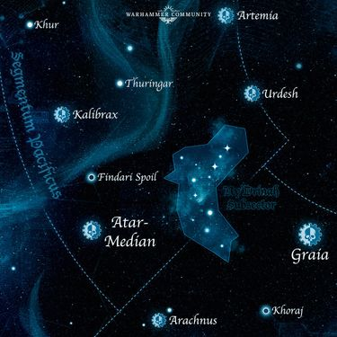

# 0889 铁带 Belt of Iron

精校状态：中文行文已逐段精校，部分术语仍为暂定

分类：地理 / 真实空间 Real Space

原文来源：https://www.bilibili.com/opus/1205032351425363972

原作者：帝国神选罐头

原文时间：2026年05月22日 07:40

[返回分类目录](目录.md) · [全书目录](../../目录.md)

<!-- A0889-B0001 -->
**英文原文**

The Belt of Iron is a vast region of space, comprising thousands of Systems across the borders of Segmentum Tempestus and Segmentum Pacificus. The name comes from the countless Forge Worlds located in the region, which warred upon each other during the Horus Heresy.

<!-- /A0889-B0001 -->

<!-- A0889-B0002 -->

原译文

铁带是一个广阔的空间区域，由跨越暴风星域和太平星域边界的数千个星系组成。这个名字来自该地区无数的铸造世界，它们在荷鲁斯叛乱期间相互争斗。

**校订译文**

铁带是一片跨越暴风星域与太平星域边界的广袤空域，包含数千个星系。这里分布着无数铸造世界，铁带也因此得名；荷鲁斯之乱期间，这些世界曾彼此交战。

<!-- /A0889-B0002 -->

<!-- A0889-B0003 图片 -->

<!-- A0889-B0004 -->

原译文

The Belt of Iron 铁带

**校订译文**

The Belt of Iron 铁带

<!-- /A0889-B0004 -->

<!-- A0889-B0005 -->
## History 历史

<!-- /A0889-B0005 -->

<!-- A0889-B0006 -->
**英文原文**

Most of the Forge Worlds within the Belt of Iron were settled before the Age of Strife and managed to weather the subsequent millennia in complete isolation. So isolated, each Forge World wrote its own history and established their own empires. When the Great Crusade pushed into the region the nascent Imperial encountered a series of geographically close but vastly different Forge Worlds. The first wave of Imperial expansion recruited Graia, Kalibrax, and Urdesh and their respective Titan Legions. The armies of these Forge Worlds joined the Crusade and were subsequently granted additional territories as a mark of loyalty. During this time, forces such as the Legio Astraman and Legio Kulisaetai fought against fellow Forge Worlds which refused to join the Imperium.

<!-- /A0889-B0006 -->

<!-- A0889-B0007 -->

原译文

铁带内的大多数铸造世界都是在纷争时代之前被定居的，并设法在完全隔离的情况下度过了随后的数千年。如此孤立，每个铸造世界都写下了自己的历史，建立了自己的帝国。当大远征进入该地区时，新生的帝国遇到了一系列地理位置相近但截然不同的铸造世界。帝国扩张的第一波招募了格拉亚、卡利布拉克斯和乌尔德什以及他们各自的泰坦军团。这些铸造世界的军队加入了远征，随后被授予额外的领土作为忠诚的标志。在此期间，旅星者军团和库利塞泰军团等部队与拒绝加入帝国的铸造世界同行作战。

**校订译文**

铁带的大多数铸造世界在纷争时代之前就已有居民，随后在完全孤立的情况下，熬过数千年动荡。漫长隔绝使每颗铸造世界都有自己的历史，建立起各自的帝国。大远征推进到这里时，新生的人类帝国遇到的是一系列地理位置相近、面貌却截然不同的铸造世界。第一轮扩张使格莱亚、卡利布拉克斯、乌尔迪什及各自的泰坦军团归附帝国。它们的军队加入远征，并因忠诚而获得额外领土作为奖赏。在此期间，旅星者军团和库利塞泰军团等部队，曾与拒绝加入帝国的其他铸造世界交战。

**校注：** fellow Forge Worlds 指其他铸造世界，不是与其并肩的“同行”；本句为彼此交战。granted additional territories as a mark of loyalty 是对忠诚的奖励，不是领土自身显示忠诚。

<!-- /A0889-B0007 -->

<!-- A0889-B0008 -->
**英文原文**

By the end of the Crusade the Belt of Iron spanned from Atar-Median to Graia and Valia-Maximal. During the subsequent Horus Heresy the disparate loyalties and ideals within this region proved a fertile ground for the agents of Fabricator-General Kelbor-Hal and many worlds rose up against the Emperor. In the ensuing Cataclysm of Iron, the region was devastated.

<!-- /A0889-B0008 -->

<!-- A0889-B0009 -->

原译文

远征结束时，铁带从阿塔尔·梅迪安延伸到格拉亚和瓦利亚-马克西马尔。在随后的荷鲁斯叛乱时期，该地区不同的忠诚和理想被证明是铸造将军凯尔博-哈尔的特工的沃土，许多世界都起来对抗帝皇。在随后的铁灾中，该地区遭到了破坏。

**校订译文**

大远征结束时，铁带的范围从阿塔尔中星延伸至格莱亚和瓦利亚-马克西马尔。荷鲁斯之乱爆发后，地区内各不相同的效忠关系与理念，为铸造将军凯尔博·哈尔的密探提供了活动土壤；许多世界随之举兵反叛帝皇。接踵而至的铁灾使整片地区遭到重创。

<!-- /A0889-B0009 -->

本篇核心术语与暂定项

以下列出本篇出现的英文原形及核心术语表用词。同形词可能指不同对象，具体词义以本篇正文和校注为准；单复数、别名和仅见于图注的名称可能尚未列入。完整候选见[术语表](../../术语表/双语术语候选.csv)。

| 英文 | 采用中文 | 状态 |
| --- | --- | --- |
| Horus Heresy | 荷鲁斯之乱 | 官方已核对 |
| Imperium | 帝国 | 暂定·简称 |
| History | 历史 | 编辑用语已统一 |
| Emperor | 帝皇 | 官方已核对 |
| Forge World | 铸造世界 | 暂定·官方待核 |
| Great Crusade | 大远征 | 暂定·官方待核 |
| Age of Strife | 纷争时代 | 暂定·官方待核 |
| Horus | 荷鲁斯 | 暂定·官方待核 |
| Segmentum Pacificus | 太平星域 | 暂定·官方待核 |
| Segmentum Tempestus | 暴风星域 | 暂定·官方待核 |
| Segmentum | 星域 | 暂定·官方待核 |
| Graia | 格莱亚 | 暂定·官方待核 |
| Titan | 泰坦 | 暂定·官方待核 |
| Fabricator-General | 铸造将军 | 暂定·官方待核 |
| Kelbor-Hal | 凯尔博·哈尔 | 暂定·官方待核 |
| Legio Astraman | 旅星者军团 | 暂定·官方待核 |
| Atar-Median | 阿塔尔中星 | 暂定·官方待核 |
| Kalibrax | 卡利布拉克斯 | 暂定·官方待核 |
| Urdesh | 乌尔迪什 | 暂定·官方待核 |
| Belt of Iron | 铁带 | 暂定·官方待核 |
| Cataclysm of Iron | 铁灾 | 暂定·官方待核 |
| Legio Kulisaetai | 库利塞泰军团 | 暂定·官方待核 |
| Valia-Maximal | 瓦利亚-马克西马尔 | 暂定·官方待核 |
| Fabricator | 铸造师 | 暂定·待核官方 |
| Titan Legions | 泰坦军团 | 暂定·官方待核 |

