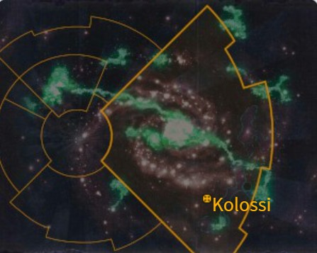

# 0897 科尔沃西 Korvosi

精校状态：中文行文已逐段精校，部分术语仍为暂定

分类：地理 / 真实空间 Real Space

原文来源：https://www.bilibili.com/opus/1168771445820489734

原作者：帝国神选罐头

原文时间：2026年02月13日 14:30

[返回分类目录](目录.md) · [全书目录](../../目录.md)

<!-- A0897-B0001 -->
### Basic Data 基本资料

原题：Basic Data 基础数据

<!-- /A0897-B0001 -->

<!-- A0897-B0002 -->
**英文原文**

Name:Korvosi

<!-- /A0897-B0002 -->

<!-- A0897-B0003 -->

原译文

名称：科尔沃西

**校订译文**

名称：科尔沃西

<!-- /A0897-B0003 -->

<!-- A0897-B0004 -->
**英文原文**

Segmentum:Unknown, formerly Ultima Segmentum

<!-- /A0897-B0004 -->

<!-- A0897-B0005 -->

原译文

星域：未知，前极限星域

**校订译文**

星域：未知，前极限星域

<!-- /A0897-B0005 -->

<!-- A0897-B0006 -->
**英文原文**

Sector:Unknown, formerly Charadon Sector

<!-- /A0897-B0006 -->

<!-- A0897-B0007 -->

原译文

星区：未知，前查拉顿星区

**校订译文**

星区：未知，前查拉顿星区

<!-- /A0897-B0007 -->

<!-- A0897-B0008 -->
**英文原文**

Subsector:Unknown, formerly Lirac Sub-Sector

<!-- /A0897-B0008 -->

<!-- A0897-B0009 -->

原译文

分区：未知，前利拉克分区

**校订译文**

次星区：现归属不明，原属利拉克次星区。

<!-- /A0897-B0009 -->

<!-- A0897-B0010 -->
**英文原文**

System:Unknown, formerly Tethras System

<!-- /A0897-B0010 -->

<!-- A0897-B0011 -->

原译文

星系：未知，前忒特拉斯星系

**校订译文**

星系：未知，前忒特拉斯星系

<!-- /A0897-B0011 -->

<!-- A0897-B0012 -->
**英文原文**

Affiliation:Chaos, formerly Imperium (House Raven)

<!-- /A0897-B0012 -->

<!-- A0897-B0013 -->

原译文

隶属：混沌，前帝国（渡鸦家族）

**校订译文**

隶属：混沌，前帝国（渡鸦家族）

<!-- /A0897-B0013 -->

<!-- A0897-B0014 -->
**英文原文**

Class:Daemon World, Fallen Knight World

<!-- /A0897-B0014 -->

<!-- A0897-B0015 -->

原译文

类别：恶魔世界，堕落骑士世界

**校订译文**

类别：恶魔世界，堕落骑士世界

<!-- /A0897-B0015 -->

<!-- A0897-B0016 -->
**英文原文**

Korvosi, formerly known as Kolossi, was a former Knight World of the Imperium. It is now a daemon world and current seat of power of the Daemon Prince Be'lakor, along with being the homeworld of the Chaos Knights of House Korvax.

<!-- /A0897-B0016 -->

<!-- A0897-B0017 -->

原译文

科尔沃西，原名科洛西，曾是帝国骑士世界。它现在是一个恶魔世界，是恶魔王子比'拉克的当前力量所在地，也是混沌骑士科瓦克斯家族的家园世界。

**校订译文**

科尔沃西原名克罗索斯，曾是帝国的骑士世界。如今，它已沦为恶魔世界，既是恶魔亲王比拉克尔的统治中心，也是科瓦克斯家族混沌骑士的母星。

**校注：** Be’lakor 依已核官方定译比拉克尔；原稿比拉克等异写保留于对照。

<!-- /A0897-B0017 -->

<!-- A0897-B0018 -->
## Overview 概述

<!-- /A0897-B0018 -->

<!-- A0897-B0019 -->
**英文原文**

Kolossi was home to the Knights of House Raven, amongst the most powerful, famed and numerous of the Questor Mechanicus Knight Houses. While it is not known with any certainty why House Raven was in possession of so many Knight suits, ancient records dating back to the settlement of the world refer to a STC archeotech long since lost. It is perhaps this miraculous technology and Kolossi's abundant natural resources that allowed House Raven to build its vast army of Knight suits. Others put forth the theory that the early settlers merely focused their output on the creation of Knight suits.

<!-- /A0897-B0019 -->

<!-- A0897-B0020 -->

原译文

科洛西是骑士渡鸦家族的所在地，是最强大、最著名、数量最多的机械教探索者骑士家族之一。虽然目前尚不清楚渡鸦家族为什么拥有如此多的骑士机甲，但可以追溯到世界殖民的古代记录中提到了早已丢失的STC考古科技。也许正是这种神奇的技术和科洛西丰富的自然资源，让渡鸦家族制造了庞大的骑士机甲大军。其他人提出的理论是，早期定居者只是将他们的产出集中在骑士机甲的制造上。

**校订译文**

克罗索斯是渡鸦家族的母星。在效忠机械教的骑士家族中，渡鸦家族名声显赫，实力与机甲数量都居前列。无人确知它为何拥有如此多的骑士机甲，但最早定居时期的古老记录提到过一项如今早已失传的标准建造模板古科技。或许正是这项神奇技术，加上克罗索斯丰富的天然资源，让家族建成庞大的骑士大军。也有人认为，早期定居者只是将生产能力集中用于制造骑士机甲。

**校注：** Questor Mechanicus 是效忠机械教的骑士类别，不是“机械教探索者”。

<!-- /A0897-B0020 -->

<!-- A0897-B0021 -->
**英文原文**

The surface of Kolossi is wracked by environmental degradation from the constant strip mining of the planet's resources and endless manufacturing. The few cities that exist on Kolossi can be found in fissures that run for hundreds of miles across the surface. These cities are powered by geothermal generatora and the population toils away in deep-core mines, forge-shrines and nutrient-gruel vats. They are ruled over by Nobles from House Raven, but they are often away on campaign and the responsibility for the administration of these cities falls upon lesser officials.

<!-- /A0897-B0021 -->

<!-- A0897-B0022 -->

原译文

科洛西的地表因行星资源的持续露天开采和无休止的制造业而受到环境退化的破坏。科洛西上存在的少数城市可以在地表数百英里的裂缝中找到。这些城市由地热发电机供电，人们在深核矿井、铸造圣地和营养粥桶中辛勤劳作。他们由渡鸦家族的贵族统治，但他们经常外出参加战役，这些城市的管理责任落在了下级官员身上。

**校订译文**

持续的露天采矿和无休止的工业生产，使克罗索斯地表的生态严重恶化。少数城市坐落在横贯地表、绵延数百英里的裂隙中，以地热发电维持运转。居民在深层矿井、铸造圣所和营养糊生产槽旁辛劳工作。统治他们的是渡鸦家族贵族；但贵族经常出征，城市的日常管理因而交给下级官员。

**校注：** generatora 疑为 generators 笔误，中文据地热发电语境译；劳工在生产槽设施工作，不是住在粥桶里。

<!-- /A0897-B0022 -->

<!-- A0897-B0023 -->
**英文原文**

The greatest of these cities was the fortress-city of the Keep Inviolate. Only the Fang on Fenris and the Emperor's Palace on Terra stand as mightier examples of such fortresses in the Imperium. Its upper heights reached past Kolossi's polluted atmosphere and out into the void of space. Likewise, its roots dug deep into Kolossi's crust and here amongst its foundation lay the Vault Transcendent, containing House Raven's massive number of Knight suits and relics.

<!-- /A0897-B0023 -->

<!-- A0897-B0024 -->

原译文

这些城市中最伟大的是严守不渝的堡垒城市。只有芬里斯上的长牙堡和泰拉上的帝皇宫殿是帝国中此类堡垒的更强大的例子。它的上部高度超过了科洛西被污染的大气层，进入了太空的虚空。同样，它的根深深地扎进了科洛西的地壳，在它的基础上奠定了超验穹顶，里面有渡鸦家族的大量骑士机甲和遗物。

**校订译文**

这些城市中最宏伟的是堡垒城市“不侵要塞”。在帝国境内，只有芬里斯的长牙堡和泰拉的帝皇宫殿比它更为雄伟。要塞上层穿过克罗索斯污浊的大气，直达太空；地基则深入星球地壳。名为“超验宝库”的设施就坐落于地基之间，存放渡鸦家族数量庞大的骑士机甲与遗物。

**校注：** Keep Inviolate 暂译不侵要塞，原“严守不渝”未表达堡垒名称；Vault Transcendent 为地下收藏设施，暂译超验宝库，非地上穹顶。

<!-- /A0897-B0024 -->

<!-- A0897-B0025 -->
## Fall 堕落

<!-- /A0897-B0025 -->

<!-- A0897-B0026 -->
**英文原文**

During the Charadon Campaign Kolossi met its end at the hands of the Daemon Prince Be'lakor, who unleashed a wave of darkness upon the planet. Assailed by dreams of madness, doubt, and hordes of Daemons the situation collapsed when corrupted Knights turned upon their lords. The planet fell, and the surviving elements of House Raven have now become a crusading force.

<!-- /A0897-B0026 -->

<!-- A0897-B0027 -->

原译文

在查拉顿战役中，科洛西在恶魔王子比'拉克手中终结，他在行星上释放了一股黑暗浪潮。被疯狂、怀疑和成群的恶魔部落所攻击，当腐化的骑士们转向他们的领主时，情况崩溃了。行星沦陷了，渡鸦家族幸存的成员现在已经成为一支运动部队。

**校订译文**

查拉顿战役中，恶魔亲王比拉克尔向克罗索斯释放黑暗浪潮，使这个世界走向末日。疯狂梦魇、猜疑与成群恶魔接连袭来；遭腐化的骑士又倒戈攻击领主，局势终于崩溃。行星沦陷后，渡鸦家族的幸存者转为一支四处征战的远征军。

**校注：** crusading force 为远征部队，原“运动部队”误译；turned upon 指倒戈袭击，不是简单转向。

<!-- /A0897-B0027 -->

<!-- A0897-B0028 图片 -->

<!-- A0897-B0029 -->

原译文

Former galactic position of Kolossi 科洛西的前银河位置

**校订译文**

Former galactic position of Kolossi 科洛西的前银河位置

<!-- /A0897-B0029 -->

<!-- A0897-B0030 -->
## Trivia 琐事

<!-- /A0897-B0030 -->

<!-- A0897-B0031 -->
**英文原文**

The name "Korvosi" is likely a reference to Corvus, a genus of birds which includes ravens (referencing that the planet was once home to House Raven, now corrupted into House Korvax).

<!-- /A0897-B0031 -->

<!-- A0897-B0032 -->

原译文

“科尔沃西”这个名字可能是指乌鸦属，这是一种包括乌鸦的鸟类（指这颗行星曾经是渡鸦家族的家园，现在被腐化成科瓦克斯家族）。

**校订译文**

“科尔沃西”一名可能取自拉丁学名 Corvus，即包含渡鸦在内的鸦属。这或许影射该世界曾是渡鸦家族的母星，而堕落后由科瓦克斯家族占据。

<!-- /A0897-B0032 -->

<!-- A0897-B0033 -->
## Notes 注释

<!-- /A0897-B0033 -->

<!-- A0897-B0034 -->
**英文原文**

Note 1: At one point in the 7th Edition Knights codex, during the description for Baron Daklorn, the planet's name is given as Kollossi. This is presumably a spelling error, as the planet's name is written as Kolossi both elsewhere in the book and when Daklorn's description was reprinted in the next edition's Knights codex.

<!-- /A0897-B0034 -->

<!-- A0897-B0035 -->

原译文

注释1：在第7版骑士圣典中，在描述达克洛恩男爵时，这颗行星的名字被称为科罗西。这可能是一个拼写错误，因为这颗行星的名字在书中的其他地方都写为科洛西，当达克洛恩的描述在下一版的骑士圣典中重印时也是如此。

**校订译文**

注1：第七版骑士圣典在介绍达克洛恩男爵时，有一处将行星名拼作 Kollossi。底稿作者认为这很可能是笔误：同书其他地方均写作 Kolossi，下一版圣典重印达克洛恩的描述时也采用 Kolossi。

**校注：** 保留英文字形，才能看出 Kollossi 与 Kolossi 的差异；源文关于第七版拼写的判断未独立核验。

<!-- /A0897-B0035 -->

本篇核心术语与暂定项

以下列出本篇出现的英文原形及核心术语表用词。同形词可能指不同对象，具体词义以本篇正文和校注为准；单复数、别名和仅见于图注的名称可能尚未列入。完整候选见[术语表](../../术语表/双语术语候选.csv)。

| 英文 | 采用中文 | 状态 |
| --- | --- | --- |
| Be'lakor | 比拉克尔 | 官方已核对 |
| Imperium | 帝国 | 暂定·简称 |
| Description | 描述 | 编辑用语已统一 |
| Archeotech | 古科技 | 暂定 |
| Emperor | 帝皇 | 官方已核对 |
| Daemon Prince | 恶魔亲王 | 官方已核对 |
| Terra | 泰拉 | 暂定·官方待核 |
| STC | 标准建造模板 | 暂定·官方待核 |
| Ultima Segmentum | 极限星域 | 暂定·官方待核 |
| Segmentum | 星域 | 暂定·官方待核 |
| Sector | 星区 | 暂定·官方待核 |
| Subsector | 次星区 | 暂定·官方待核 |
| Fenris | 芬里斯 | 暂定·官方待核 |
| Kolossi | 克罗索斯 | 暂定·官方待核 |
| Ancient | 旗手 | 官方已核对 |
| Questor Mechanicus | 机械教骑士 | 暂定·官方待核 |
| Charadon | 查拉顿 | 暂定·官方待核 |
| System | 星系（恒星系统） | 暂定·官方待核 |
| Knight World | 骑士世界 | 暂定·官方待核 |
| Korvosi | 科尔沃西 | 暂定·官方待核 |
| Kollossi | 克罗索斯 | 暂定·官方待核 |
| House Raven | 渡鸦家族 | 暂定·官方待核 |
| House Korvax | 科瓦克斯家族 | 暂定·官方待核 |
| Keep Inviolate | 不侵要塞 | 暂定·官方待核 |
| Vault Transcendent | 超验宝库 | 暂定·官方待核 |
| Daklorn | 达克洛恩 | 暂定·官方待核 |
| Lirac Sub-Sector | 利拉克次星区 | 暂定·官方待核 |
| Tethras System | 忒特拉斯星系 | 暂定·官方待核 |

