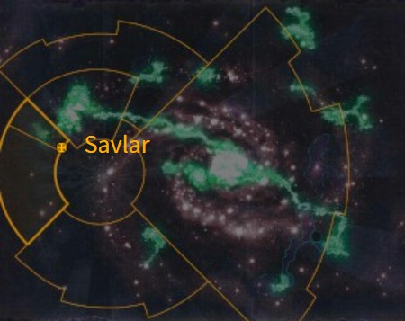
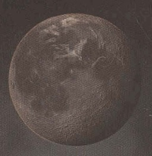

# 0912 萨夫拉 Savlar

精校状态：中文行文已逐段精校，部分术语仍为暂定

分类：地理 / 真实空间 Real Space

原文来源：https://www.bilibili.com/opus/1172412452776706055

原作者：帝国神选罐头

原文时间：2026年02月23日 09:59

[返回分类目录](目录.md) · [全书目录](../../目录.md)

<!-- A0912-B0001 图片 -->

<!-- A0912-B0002 -->

原译文

Map 地图

**校订译文**

Map 地图

<!-- /A0912-B0002 -->

<!-- A0912-B0003 -->
### Basic Data 基本资料

原题：Basic Data 基础数据

<!-- /A0912-B0003 -->

<!-- A0912-B0004 -->
**英文原文**

Name:Savlar

<!-- /A0912-B0004 -->

<!-- A0912-B0005 -->

原译文

名称：萨夫拉

**校订译文**

名称：萨夫拉

<!-- /A0912-B0005 -->

<!-- A0912-B0006 -->
**英文原文**

System:Savlar System

<!-- /A0912-B0006 -->

<!-- A0912-B0007 -->

原译文

星系：萨夫拉星系

**校订译文**

星系：萨夫拉星系

<!-- /A0912-B0007 -->

<!-- A0912-B0008 -->
**英文原文**

Affiliation:Imperium

<!-- /A0912-B0008 -->

<!-- A0912-B0009 -->

原译文

隶属：帝国

**校订译文**

隶属：帝国

<!-- /A0912-B0009 -->

<!-- A0912-B0010 -->
**英文原文**

Class:Penal World, Mining World

<!-- /A0912-B0010 -->

<!-- A0912-B0011 -->

原译文

类别：刑罚世界，矿业世界

**校订译文**

类别：刑罚世界，矿业世界

<!-- /A0912-B0011 -->

<!-- A0912-B0012 图片 -->

<!-- A0912-B0013 -->

原译文

Planetary Image 行星图像

**校订译文**

Planetary Image 行星图像

<!-- /A0912-B0013 -->

<!-- A0912-B0014 -->
**英文原文**

Savlar, also known as Savlar Penitens, is an Imperial Penal World. It is a toxic hellhole infamous for its Imperial Guard Regiments, known as the Savlar Chem Dogs.

<!-- /A0912-B0014 -->

<!-- A0912-B0015 -->

原译文

萨夫拉，也被称为萨夫拉忏悔，是一个帝国刑罚世界。这是一个有毒的地狱，因其被称为萨夫拉化学狗的帝国卫队兵团而臭名昭著。

**校订译文**

萨夫拉，又称萨夫拉忏悔星，是帝国的一颗刑罚世界。这个毒气弥漫的地狱，以从当地征募的帝国卫队——萨夫拉化学犬各团——臭名远扬。

<!-- /A0912-B0015 -->

<!-- A0912-B0016 -->
## Overview 概述

<!-- /A0912-B0016 -->

<!-- A0912-B0017 -->
**英文原文**

Savlar is said to be a world of sinners, heretics, murderers, thieves and rapists; indeed, it is claimed that only one in four born on Savlar knows their father. The world is blighted by gang warfare and crime, only kept in control by the threat of violence from Imperial authorities.

<!-- /A0912-B0017 -->

<!-- A0912-B0018 -->

原译文

据说萨夫拉是一个充满罪人、异端、杀人犯、小偷和强奸犯的世界；事实上，据说在萨夫拉出生的人中，只有四分之一的人认识他们的父亲。世界被帮派战争和犯罪所摧残，只有帝国当局的暴力威胁才能控制局面。

**校订译文**

据说，萨夫拉遍布罪人、异端、杀人犯、窃贼和强奸犯，甚至有传言称，当地出生的人只有四分之一知道自己的父亲是谁。帮派火并与犯罪蹂躏着这颗世界，帝国当局只能依靠武力威胁勉强控制局面。

**校注：** 原英文 said/claimed 是传言限定，予以保留，未将当地出生人口的传闻写成客观统计。

<!-- /A0912-B0018 -->

<!-- A0912-B0019 -->
**英文原文**

In addition to its societal maladies, Savlar is shrouded by a noxious and volatile atmosphere.

<!-- /A0912-B0019 -->

<!-- A0912-B0020 -->

原译文

除了社会弊病，萨夫拉还笼罩着一种有害和不稳定的大气。

**校订译文**

除了社会弊病，萨夫拉还笼罩在有毒且性质不稳定的大气之中。

<!-- /A0912-B0020 -->

<!-- A0912-B0021 -->
## History 历史

<!-- /A0912-B0021 -->

<!-- A0912-B0022 -->
**英文原文**

Savlar was once a Mining World notable only for the rich chemical deposits found on its moons.

<!-- /A0912-B0022 -->

<!-- A0912-B0023 -->

原译文

萨夫拉曾经是一个矿业世界，只因其卫星上发现的丰富化学沉积而闻名。

**校订译文**

萨夫拉原是一颗矿业世界，起初仅因卫星上的丰富化学矿藏而为人所知。

<!-- /A0912-B0023 -->

<!-- A0912-B0024 -->
**英文原文**

Unfortunately the planet failed in meeting its Imperial tithes, and so in M39 Savlar was converted into a penal colony populated by traitors, criminals and Adeptus Arbites troops guarding them. Since the mining workforce was bolstered by prisoners, the planet has come to supply raw material for three Civilised Worlds and two Forge Worlds in the nearby subsectors. The initial supply of prisoners consisted of those captured during the Bokur rebellion, but over the years regular shipments have come to Savlar from across the Armageddon Sector.

<!-- /A0912-B0024 -->

<!-- A0912-B0025 -->

原译文

不幸的是，这个行星未能满足帝国的什一税，因此在M39，萨夫拉被改造成一个由叛徒、罪犯和守卫他们的法务部部队组成的流放地。由于采矿工人得到了囚犯的支援，行星已经为附近分区的三个文明世界和两个铸造世界提供了原材料。最初的囚犯供应包括博库尔叛乱期间被俘的囚犯，但多年来，定期从阿玛吉多顿星区运送到萨夫拉。

**校订译文**

由于未能缴足帝国什一税，萨夫拉在第三十九千年被改为刑罚殖民地，关押叛徒和罪犯，由法务部人员看守。囚犯补充了采矿劳动力，使这里能够向邻近次星区的三颗文明世界与两颗铸造世界供应原料。首批囚犯来自博库尔叛乱；此后多年，阿玛吉多顿星区各地持续将囚犯运来。

**校注：** bolstered by prisoners 是囚犯成为劳动力的一部分，不是矿工获得囚犯组成的援军。

<!-- /A0912-B0025 -->

<!-- A0912-B0026 -->
**英文原文**

Some time later, an armed uprising took place. This would force Judge Callistar to form the Chem-Dogs as a response force to put the rebellion down. During the Third War for Armageddon, the Chem-Dogs would be deployed to Armageddon to meet the Imperium's desperate need for more troops.

<!-- /A0912-B0026 -->

<!-- A0912-B0027 -->

原译文

一段时间后，发生了武装叛乱。这将迫使卡利斯塔法官组建化学犬部队，作为镇压叛乱的反应部队。在第三次阿玛吉多顿战争期间，化学犬被部署到阿玛吉多顿，以满足帝国对更多军队的迫切需求。

**校订译文**

后来，当地爆发武装起义，卡利斯塔法官因此组建化学犬，作为镇压叛乱的应急部队。第三次阿玛吉多顿战争期间，帝国急需更多兵力，化学犬各团便被派往阿玛吉多顿。

<!-- /A0912-B0027 -->

<!-- A0912-B0028 -->
**英文原文**

At some point, Savlar was raided by the Night Lords, who overran Hive Apraxis.

<!-- /A0912-B0028 -->

<!-- A0912-B0029 -->

原译文

在某个时刻，萨夫拉遭到了午夜领主的突袭，他们占领了阿普拉克西斯巢都。

**校订译文**

在某个时刻，萨夫拉遭到了午夜领主的突袭，他们占领了阿普拉克西斯巢都。

<!-- /A0912-B0029 -->

<!-- A0912-B0030 -->
**英文原文**

During the Arks of Omen Campaign, Savlar was attacked by a Chaos Balefleet. Despite the efforts of its defenders, the Balefleet wreaked havoc on the planet.

<!-- /A0912-B0030 -->

<!-- A0912-B0031 -->

原译文

在噩兆方舟战役中，萨夫拉遭到混沌灾祸舰队的袭击。尽管守军付出了努力，灾祸舰队还是对行星造成了严重破坏。

**校订译文**

在噩兆方舟战役中，萨夫拉遭到混沌灾祸舰队的袭击。尽管守军付出了努力，灾祸舰队还是对行星造成了严重破坏。

<!-- /A0912-B0031 -->

<!-- A0912-B0032 -->
## Trivia 琐事

<!-- /A0912-B0032 -->

<!-- A0912-B0033 -->
## Conflicting sources 来源冲突

<!-- /A0912-B0033 -->

<!-- A0912-B0034 -->
**英文原文**

The Third War for Armageddon campaign website states that the Savlar system is located "just over a hundred light years from Armageddon". However, other sources place Savlar in the border regions between Segmentum Pacificus and Segmentum Solar, nowhere near Armageddon (which is located in the eastern part of Segmentum Solar).

<!-- /A0912-B0034 -->

<!-- A0912-B0035 -->

原译文

第三次阿玛吉多顿战争战役网站称，萨夫拉星系位于“距离阿玛吉多顿仅一百多光年”的地方。然而，其他来源将萨夫拉定位在太平星域和太阳星域之间的边界地区，远离阿玛吉多顿（位于太阳星域的东部）。

**校订译文**

第三次阿玛吉多顿战争战役网站称，萨夫拉星系位于“距离阿玛吉多顿仅一百多光年”的地方。然而，其他来源将萨夫拉定位在太平星域和太阳星域之间的边界地区，远离阿玛吉多顿（位于太阳星域的东部）。

**校注：** 保留底稿列出的两种地理定位及其冲突，未凭其中一种删除另一种。

<!-- /A0912-B0035 -->

本篇核心术语与暂定项

以下列出本篇出现的英文原形及核心术语表用词。同形词可能指不同对象，具体词义以本篇正文和校注为准；单复数、别名和仅见于图注的名称可能尚未列入。完整候选见[术语表](../../术语表/双语术语候选.csv)。

| 英文 | 采用中文 | 状态 |
| --- | --- | --- |
| Imperial Guard | 帝国卫队 | 暂定·语境区分 |
| Imperium | 帝国 | 暂定·简称 |
| Adeptus Arbites | 法务部 | 暂定 |
| Night Lords | 午夜领主 | 暂定·官方待核 |
| Segmentum Solar | 太阳星域 | 暂定·官方待核 |
| Segmentum Pacificus | 太平星域 | 暂定·官方待核 |
| Segmentum | 星域 | 暂定·官方待核 |
| Sector | 星区 | 暂定·官方待核 |
| Armageddon | 阿玛吉多顿 | 暂定·官方待核 |
| Savlar | 萨夫拉 | 暂定·官方待核 |
| Civilised Worlds | 文明世界 | 暂定·官方待核 |
| System | 星系（恒星系统） | 暂定·官方待核 |
| Mining World | 矿业世界 | 暂定·官方待核 |
| Penal World | 刑罚世界 | 暂定·官方待核 |
| Penal Colony | 刑罚殖民地 | 暂定·官方待核 |
| Savlar Penitens | 萨夫拉忏悔星 | 暂定·官方待核 |
| Bokur Rebellion | 博库尔叛乱 | 暂定·官方待核 |
| Callistar | 卡利斯塔 | 暂定·官方待核 |
| Hive Apraxis | 阿普拉克西斯巢都 | 暂定·官方待核 |
| Omen | 预兆号 | 暂定·官方待核 |
| Balefleet | 灾祸舰队 | 暂定·官方待核 |
| Armageddon Sector | 阿玛吉多顿星区 | 暂定·官方待核 |

