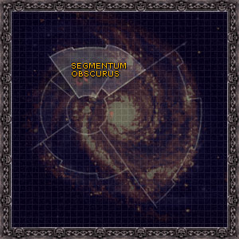

# 0919 朦胧星域 Segmentum Obscurus

精校状态：中文行文已逐段精校，部分术语仍为暂定

分类：地理 / 真实空间 Real Space / 朦胧星域 Segmentum Obscurus

原文来源：https://www.bilibili.com/opus/1137574216422391814

原作者：帝国神选罐头

原文时间：2025年11月21日 12:48

[返回分类目录](目录.md) · [全书目录](../../目录.md)

<!-- A0919-B0001 -->
**英文原文**

The Segmentum Obscurus is one of the five Segmentums, divisions of the Galaxy, of the Imperium. It is located to the north of Holy Terra, and its Segmentum Fortress is located at Cypra Mundi. One of its most notable features is the Eye of Terror, home of the Chaos Space Marines.

<!-- /A0919-B0001 -->

<!-- A0919-B0002 -->

原译文

朦胧星域是帝国的五个星域之一，银河系的一部分。它位于神圣泰拉以北，其星域堡垒位于赛普拉·蒙迪。它最引人注目的特征之一是恐惧之眼，混沌星际战士的所在地。

**校订译文**

朦胧星域是帝国划分银河的五大星域之一，位于神圣泰拉以北，其星域堡垒坐落于塞浦拉·蒙迪。最显著的地理特征之一是恐惧之眼，许多混沌星际战士盘踞于此。

<!-- /A0919-B0002 -->

<!-- A0919-B0003 -->
**英文原文**

Following the conclusion of the Thirteenth Black Crusade and the resurrection of Roboute Guilliman, much of Segmentum Obscurus has become stranded within Imperium Nihilus.

<!-- /A0919-B0003 -->

<!-- A0919-B0004 -->

原译文

随着第十三次黑色远征的结束和罗伯特·基里曼的复活，朦胧星域的大部分地区都被困在了帝国暗面内。

**校订译文**

第十三次黑色远征结束、罗保特·基里曼复活后，朦胧星域的大部分地区被隔绝在帝国暗面。

<!-- /A0919-B0004 -->

<!-- A0919-B0005 图片 -->

<!-- A0919-B0006 -->

原译文

Galactic map of Segmentum Obscurus 朦胧星域的银河系地图

**校订译文**

Galactic map of Segmentum Obscurus 朦胧星域的银河系地图

<!-- /A0919-B0006 -->

<!-- A0919-B0007 -->
## Notable Planets 著名行星

<!-- /A0919-B0007 -->

<!-- A0919-B0008 -->

原译文

Agripinaa 阿格里皮娜

**校订译文**

Agripinaa 阿格里皮娜

<!-- /A0919-B0008 -->

<!-- A0919-B0009 -->

原译文

Arkhona 阿科纳

**校订译文**

Arkhona 阿科纳

<!-- /A0919-B0009 -->

<!-- A0919-B0010 -->

原译文

Belial IV 贝利亚四号

**校订译文**

Belial IV 贝利亚四号

<!-- /A0919-B0010 -->

<!-- A0919-B0011 -->

原译文

Belis Corona 比利斯·卡罗那

**校订译文**

Belis Corona 贝利斯·卡罗纳

<!-- /A0919-B0011 -->

<!-- A0919-B0012 -->

原译文

Cadia 卡迪亚

**校订译文**

Cadia 卡迪亚

<!-- /A0919-B0012 -->

<!-- A0919-B0013 -->
**英文原文**

Caliban - destroyed

<!-- /A0919-B0013 -->

<!-- A0919-B0014 -->

原译文

卡利班 - 毁灭

**校订译文**

卡利班 - 毁灭

<!-- /A0919-B0014 -->

<!-- A0919-B0015 -->

原译文

Coronis Agathon 科罗尼斯·阿加松

**校订译文**

Coronis Agathon 科罗尼斯·阿加松

<!-- /A0919-B0015 -->

<!-- A0919-B0016 -->

原译文

Cypra Mundi 赛普拉·蒙迪

**校订译文**

Cypra Mundi 塞浦拉·蒙迪

<!-- /A0919-B0016 -->

<!-- A0919-B0017 -->

原译文

Dimmamar 迪亚玛尔

**校订译文**

Dimmamar 迪马默

<!-- /A0919-B0017 -->

<!-- A0919-B0018 -->

原译文

Fabris Callivant 法布里斯·卡利万特

**校订译文**

Fabris Callivant 法布里斯·卡利万特

<!-- /A0919-B0018 -->

<!-- A0919-B0019 -->

原译文

Fenris 芬里斯

**校订译文**

Fenris 芬里斯

<!-- /A0919-B0019 -->

<!-- A0919-B0020 -->

原译文

Kantrael 坎特拉尔

**校订译文**

Kantrael 坎特拉尔

<!-- /A0919-B0020 -->

<!-- A0919-B0021 -->

原译文

Lucius 卢修斯

**校订译文**

Lucius 卢修斯

<!-- /A0919-B0021 -->

<!-- A0919-B0022 -->

原译文

M'Pandex 姆'潘德克斯

**校订译文**

M'Pandex 姆'潘德克斯

<!-- /A0919-B0022 -->

<!-- A0919-B0023 -->

原译文

Medusa 美杜莎

**校订译文**

Medusa 美杜莎

<!-- /A0919-B0023 -->

<!-- A0919-B0024 -->

原译文

Mezoa 梅佐亚

**校订译文**

Mezoa 梅佐亚

<!-- /A0919-B0024 -->

<!-- A0919-B0025 -->

原译文

Mordant Prime 莫丹特一号

**校订译文**

Mordant Prime 莫丹特主星

<!-- /A0919-B0025 -->

<!-- A0919-B0026 -->

原译文

Mordian 莫迪安

**校订译文**

Mordian 莫迪安

<!-- /A0919-B0026 -->

<!-- A0919-B0027 -->

原译文

Nemesis Tessera 涅墨西斯·泰塞拉

**校订译文**

Nemesis Tessera 涅墨西斯·泰塞拉

<!-- /A0919-B0027 -->

<!-- A0919-B0028 -->

原译文

Orar 奥拉尔

**校订译文**

Orar 奥拉尔

<!-- /A0919-B0028 -->

<!-- A0919-B0029 -->

原译文

Ornsworld 昂斯沃尔德

**校订译文**

Ornsworld 昂斯沃尔德

<!-- /A0919-B0029 -->

<!-- A0919-B0030 -->

原译文

Port Maw 巨口港

**校订译文**

Port Maw 巨口港

<!-- /A0919-B0030 -->

<!-- A0919-B0031 -->

原译文

Praefex Venatoris 狩猎统领

**校订译文**

Praefex Venatoris 狩猎统领

<!-- /A0919-B0031 -->

<!-- A0919-B0032 -->

原译文

Sangua Terra 赤地星

**校订译文**

Sangua Terra 赤地星

<!-- /A0919-B0032 -->

<!-- A0919-B0033 -->

原译文

Scintilla 辛提拉

**校订译文**

Scintilla 辛提拉

<!-- /A0919-B0033 -->

<!-- A0919-B0034 -->

原译文

St. Josmane's Hope 圣约斯曼之希望

**校订译文**

St. Josmane's Hope 圣约斯曼之希望

<!-- /A0919-B0034 -->

<!-- A0919-B0035 -->

原译文

Thracian Primaris 色雷斯主星

**校订译文**

Thracian Primaris 色雷斯主星

<!-- /A0919-B0035 -->

<!-- A0919-B0036 -->

原译文

Tourmalid 托玛利德

**校订译文**

Tourmalid 托玛利德

<!-- /A0919-B0036 -->

<!-- A0919-B0037 -->

原译文

Vigilus 警戒星

**校订译文**

Vigilus 警戒星

<!-- /A0919-B0037 -->

<!-- A0919-B0038 -->

原译文

Vostroya 沃斯托尼亚

**校订译文**

Vostroya 沃斯特洛亚

<!-- /A0919-B0038 -->

<!-- A0919-B0039 -->

原译文

Yme-Loc 耶姆-洛克

**校订译文**

Yme-Loc 耶姆-洛克

<!-- /A0919-B0039 -->

<!-- A0919-B0040 -->

原译文

Belisar 贝利萨尔

**校订译文**

Belisar 贝利萨尔

<!-- /A0919-B0040 -->

<!-- A0919-B0041 -->

原译文

Demios Binary 德米奥斯二号

**校订译文**

Demios Binary 德米奥斯双星

**校注：** Binary 不是行星序数二，依864篇同名铸造世界译德米奥斯双星；具体天体构成待核。

<!-- /A0919-B0041 -->

<!-- A0919-B0042 -->

原译文

Sabena 萨贝纳

**校订译文**

Sabena 萨贝纳

<!-- /A0919-B0042 -->

<!-- A0919-B0043 -->

原译文

Barisa 巴里萨

**校订译文**

Barisa 巴里萨

<!-- /A0919-B0043 -->

<!-- A0919-B0044 -->

原译文

Exeltra Minor 埃克斯艾尔特拉次星

**校订译文**

Exeltra Minor 埃克斯艾尔特拉次星

<!-- /A0919-B0044 -->

<!-- A0919-B0045 -->

原译文

Clausten 克劳斯滕

**校订译文**

Clausten 克劳斯滕

<!-- /A0919-B0045 -->

<!-- A0919-B0046 -->

原译文

Helotas 赫洛塔斯

**校订译文**

Helotas 赫洛塔斯

<!-- /A0919-B0046 -->

<!-- A0919-B0047 -->

原译文

Vorga Torq 沃尔加·托克

**校订译文**

Vorga Torq 沃尔加·托克

<!-- /A0919-B0047 -->

<!-- A0919-B0048 -->

原译文

Varsavia 瓦萨韦亚

**校订译文**

Varsavia 瓦萨韦亚

<!-- /A0919-B0048 -->

<!-- A0919-B0049 -->
## Notable Other Celestial Objects 著名其他天体

<!-- /A0919-B0049 -->

<!-- A0919-B0050 -->

原译文

Eye of Terror 恐惧之眼

**校订译文**

Eye of Terror 恐惧之眼

<!-- /A0919-B0050 -->

<!-- A0919-B0051 -->

原译文

Nachmund Gauntlet 纳克蒙德走廊

**校订译文**

Nachmund Gauntlet 纳克蒙德走廊

<!-- /A0919-B0051 -->

<!-- A0919-B0052 -->

原译文

Sanctus Wall 神圣之墙

**校订译文**

Sanctus Wall 圣墙防线

<!-- /A0919-B0052 -->

<!-- A0919-B0053 -->

原译文

Halo Stars 光环群星

**校订译文**

Halo Stars 光环群星

<!-- /A0919-B0053 -->

<!-- A0919-B0054 -->

原译文

Gildar Rift 吉尔达裂隙

**校订译文**

Gildar Rift 吉尔达裂隙

<!-- /A0919-B0054 -->

<!-- A0919-B0055 -->

原译文

Coronid Deeps 科罗纳德深渊

**校订译文**

Coronid Deeps 科罗尼德深渊

<!-- /A0919-B0055 -->

<!-- A0919-B0056 -->

原译文

Boros Gate 博罗斯之门

**校订译文**

Boros Gate 博罗斯之门

<!-- /A0919-B0056 -->

<!-- A0919-B0057 -->

原译文

Craftworld Alaitoc 方舟世界阿莱托克

**校订译文**

Craftworld Alaitoc 方舟世界阿莱托克

<!-- /A0919-B0057 -->

<!-- A0919-B0058 -->

原译文

Craftworld Altansar 方舟世界阿塔兰萨

**校订译文**

Craftworld Altansar 奥坦萨方舟世界

<!-- /A0919-B0058 -->

<!-- A0919-B0059 -->

原译文

Polarian Badlands 北极星荒原

**校订译文**

Polarian Badlands 北极星荒原

<!-- /A0919-B0059 -->

<!-- A0919-B0060 -->

原译文

Koronus Expanse 科罗努斯扩区

**校订译文**

Koronus Expanse 克洛诺斯广域

<!-- /A0919-B0060 -->

<!-- A0919-B0061 -->

原译文

Molianis Reach 莫里阿尼斯河段

**校订译文**

Molianis Reach 莫里阿尼斯疆域

**校注：** Reach 在星际地域语境为疆域，不是地表河段。

<!-- /A0919-B0061 -->

<!-- A0919-B0062 -->
## Notable Sectors 著名星区

<!-- /A0919-B0062 -->

<!-- A0919-B0063 -->

原译文

Agripinaa Sector 阿格里皮娜星区

**校订译文**

Agripinaa Sector 阿格里皮娜星区

<!-- /A0919-B0063 -->

<!-- A0919-B0064 -->

原译文

Askellon Sector 阿斯凯隆星区

**校订译文**

Askellon Sector 阿斯凯隆星区

<!-- /A0919-B0064 -->

<!-- A0919-B0065 -->

原译文

Cadian Sector 卡迪亚星区

**校订译文**

Cadian Sector 卡迪亚星区

<!-- /A0919-B0065 -->

<!-- A0919-B0066 -->

原译文

Calixis Sector 卡利西斯星区

**校订译文**

Calixis Sector 卡利西斯星区

<!-- /A0919-B0066 -->

<!-- A0919-B0067 -->

原译文

Finial Sector 顶饰星区

**校订译文**

Finial Sector 顶饰星区

<!-- /A0919-B0067 -->

<!-- A0919-B0068 -->

原译文

Gothic Sector 哥特星区

**校订译文**

Gothic Sector 哥特星区

<!-- /A0919-B0068 -->

<!-- A0919-B0069 -->

原译文

Ixaniad Sector 伊克萨尼德星区

**校订译文**

Ixaniad Sector 伊萨尼亚德星区

<!-- /A0919-B0069 -->

<!-- A0919-B0070 -->

原译文

Mandragora Sector 曼德拉戈拉星区

**校订译文**

Mandragora Sector 曼德拉戈拉星区

<!-- /A0919-B0070 -->

<!-- A0919-B0071 -->

原译文

Scarus Sector 斯卡鲁斯星区

**校订译文**

Scarus Sector 斯卡鲁斯星区

<!-- /A0919-B0071 -->

<!-- A0919-B0072 -->

原译文

Scyllan Sector 斯库拉星区

**校订译文**

Scyllan Sector 斯库拉星区

<!-- /A0919-B0072 -->

<!-- A0919-B0073 -->

原译文

Stygius Sector 冥河星区

**校订译文**

Stygius Sector 冥河星区

<!-- /A0919-B0073 -->

<!-- A0919-B0074 -->

原译文

Tamahl Sector 塔马尔星区

**校订译文**

Tamahl Sector 塔马尔星区

<!-- /A0919-B0074 -->

<!-- A0919-B0075 -->
## Notable Systems 著名星系

<!-- /A0919-B0075 -->

<!-- A0919-B0076 -->

原译文

Agripinaa System 阿格里皮娜星系

**校订译文**

Agripinaa System 阿格里皮娜星系

<!-- /A0919-B0076 -->

<!-- A0919-B0077 -->

原译文

Belis Corona System 比利斯·卡罗那星系

**校订译文**

Belis Corona System 贝利斯·卡罗纳星系

<!-- /A0919-B0077 -->

<!-- A0919-B0078 -->

原译文

Cadian System 卡迪亚星系

**校订译文**

Cadian System 卡迪亚星系

<!-- /A0919-B0078 -->

<!-- A0919-B0079 -->

原译文

Dartaris System 达塔里斯星系

**校订译文**

Dartaris System 达塔里斯星系

<!-- /A0919-B0079 -->

<!-- A0919-B0080 -->

原译文

Dhobash System 多巴什星系

**校订译文**

Dhobash System 多巴什星系

<!-- /A0919-B0080 -->

<!-- A0919-B0081 -->

原译文

Kharon System 卡戎星系

**校订译文**

Kharon System 卡戎星系

<!-- /A0919-B0081 -->

<!-- A0919-B0082 -->

原译文

Mordian System 莫迪安星系

**校订译文**

Mordian System 莫迪安星系

<!-- /A0919-B0082 -->

<!-- A0919-B0083 -->

原译文

Nachmund System 纳克蒙德星系

**校订译文**

Nachmund System 纳克蒙德星系

<!-- /A0919-B0083 -->

<!-- A0919-B0084 -->

原译文

Oreicha System 奥雷查星系

**校订译文**

Oreicha System 奥雷查星系

<!-- /A0919-B0084 -->

<!-- A0919-B0085 -->

原译文

Prismata System 普里马塔星系

**校订译文**

Prismata System 普里马塔星系

<!-- /A0919-B0085 -->

<!-- A0919-B0086 -->

原译文

Sthenelus System 斯特内勒斯星系

**校订译文**

Sthenelus System 斯特内勒斯星系

<!-- /A0919-B0086 -->

<!-- A0919-B0087 -->

原译文

Vigilus System 警戒星系

**校订译文**

Vigilus System 警戒星系

<!-- /A0919-B0087 -->

<!-- A0919-B0088 -->
## Other Segmentums 其他星域

<!-- /A0919-B0088 -->

<!-- A0919-B0089 -->
**英文原文**

Segmentum Pacificus - Galactic South West

**校注：** 本节银河方位按原稿叙述照录，并非现实天文学的绝对上下方向。

<!-- /A0919-B0089 -->

<!-- A0919-B0090 -->

原译文

太平星域 - 银河西南部

**校订译文**

太平星域 - 银河西南部

<!-- /A0919-B0090 -->

<!-- A0919-B0091 -->
**英文原文**

Segmentum Solar - Galactic South

<!-- /A0919-B0091 -->

<!-- A0919-B0092 -->

原译文

太阳星域 - 银河南部

**校订译文**

太阳星域 - 银河南部

<!-- /A0919-B0092 -->

<!-- A0919-B0093 -->
**英文原文**

Segmentum Tempestus - Galactic Far South

<!-- /A0919-B0093 -->

<!-- A0919-B0094 -->

原译文

暴风星域 - 银河远南

**校订译文**

暴风星域 - 银河远南

<!-- /A0919-B0094 -->

<!-- A0919-B0095 -->
**英文原文**

Ultima Segmentum - Galactic South East

<!-- /A0919-B0095 -->

<!-- A0919-B0096 -->

原译文

极限星域 - 银河东南部

**校订译文**

极限星域 - 银河东南部

<!-- /A0919-B0096 -->

本篇核心术语与暂定项

以下列出本篇出现的英文原形及核心术语表用词。同形词可能指不同对象，具体词义以本篇正文和校注为准；单复数、别名和仅见于图注的名称可能尚未列入。完整候选见[术语表](../../术语表/双语术语候选.csv)。

| 英文 | 采用中文 | 状态 |
| --- | --- | --- |
| Space Marines | 星际战士 | 官方已核对 |
| Chaos Space Marines | 混沌星际战士 | 官方已核对 |
| Roboute Guilliman | 罗保特·基里曼 | 官方已核对 |
| Imperium | 帝国 | 暂定·简称 |
| Eye of Terror | 恐惧之眼 | 官方已核对 |
| Terra | 泰拉 | 暂定·官方待核 |
| Imperium Nihilus | 帝国暗面 | 暂定·官方待核 |
| Segmentum Solar | 太阳星域 | 暂定·官方待核 |
| Segmentum Pacificus | 太平星域 | 暂定·官方待核 |
| Segmentum Obscurus | 朦胧星域 | 暂定·官方待核 |
| Segmentum Tempestus | 暴风星域 | 暂定·官方待核 |
| Ultima Segmentum | 极限星域 | 暂定·官方待核 |
| Segmentum | 星域 | 暂定·官方待核 |
| Caliban | 卡利班 | 暂定·官方待核 |
| Cypra Mundi | 塞浦拉·蒙迪 | 暂定·官方待核 |
| Obscurus | 朦胧星 | 暂定·官方待核 |
| Segmentum Fortress | 星域堡垒 | 暂定·官方待核 |

