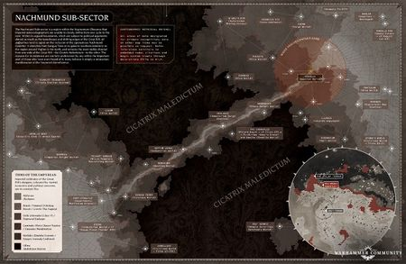

# 0921 纳克蒙德走廊 Nachmund Gauntlet

精校状态：中文行文已逐段精校，部分术语仍为暂定

分类：地理 / 真实空间 Real Space / 朦胧星域 Segmentum Obscurus

原文来源：https://www.bilibili.com/opus/1134580022877618200

原作者：帝国神选罐头

原文时间：2025年11月13日 11:09

[返回分类目录](目录.md) · [全书目录](../../目录.md)

<!-- A0921-B0001 -->
**英文原文**

The Nachmund Gauntlet is a region of space in Segmentum Obscurus focused around the Nachmund Sub-Sector.

<!-- /A0921-B0001 -->

<!-- A0921-B0002 -->

原译文

纳克蒙德走廊是朦胧星域中围绕纳克蒙德分区的一个空间区域。

**校订译文**

纳克蒙德走廊是朦胧星域的一片空域，以纳克蒙德次星区为中心。

<!-- /A0921-B0002 -->

<!-- A0921-B0003 图片 -->

<!-- A0921-B0004 -->

原译文

Nachmund Sub-Sector 纳克蒙德分区

**校订译文**

Nachmund Sub-Sector 纳克蒙德次星区

<!-- /A0921-B0004 -->

<!-- A0921-B0005 -->
## Overview 概述

<!-- /A0921-B0005 -->

<!-- A0921-B0006 -->
**英文原文**

Located near the remains of Cadia and the Eye of Terror, the Nachmund Gauntlet was for a time the only stable route through the dreaded Cicatrix Maledictum, making it strategically vital and a source for huge amounts of Imperial refugees. Later in the Indomitus Crusade, a second passage dubbed the Attilan Gate was also discovered.

<!-- /A0921-B0006 -->

<!-- A0921-B0007 -->

原译文

纳克蒙德走廊位于卡迪亚残骸和恐惧之眼附近，曾一度是穿过可怕的诅咒瘢痕的唯一稳定路线，使其具有战略重要性，也是大量帝国难民的来源。在不屈远征的后期，还发现了第二条被称为阿提兰之门的通道。

**校订译文**

纳克蒙德走廊靠近卡迪亚残骸与恐惧之眼，曾一度是穿越大裂隙的唯一稳定通道。因此，它战略价值极高，也承载着大量帝国难民的迁徙。不屈远征后期，人们又发现了第二条通道，称为阿提兰之门。

**校注：** 避免把路线本身误写成制造难民的地点；本篇已明确“曾一度”唯一，与880篇旧资料时点相互对照。

<!-- /A0921-B0007 -->

<!-- A0921-B0008 -->
**英文原文**

Currently, the both the northern and some of the southern end of the Nachmund Gauntlet is under siege by the Forces of Chaos though the Imperial succeeded in holding most of the region. During the Nachmund Rift War almost the entire northern region of the Gauntlet was lost to the Imperium, who now seeks to erect a defensive network known as the Sanctus Wall to block the invasion of the Black Legion under Haarken Worldclaimer. While many worlds north of the Sanctus Wall remain under Imperial control, they are essentially on their own to weather the coming storm. The situation for the Imperials worsened with the fall of most of Sangua Terra to the Chaos forces.

<!-- /A0921-B0008 -->

<!-- A0921-B0009 -->

原译文

目前，尽管帝国成功控制了该地区的大部分地区，但纳克蒙德走廊的北端和南端部分地区都被混沌部队围困。在纳克蒙德裂隙战争期间，几乎整个走廊北部地区对帝国来说都失落了，帝国现在试图建立一个名为圣墙的防御网络，以阻止夺世者哈肯领导的黑色军团的入侵。虽然圣墙以北的许多世界仍处于帝国的控制之下，但它们基本上只能靠自己来度过即将到来的风暴。随着赤地星大部分地区落入混沌部队之手，帝国的局势进一步恶化。

**校订译文**

尽管帝国一度守住大部分地区，纳克蒙德走廊北端和南端部分区域仍遭混沌围攻。纳克蒙德裂隙战争中，帝国几乎失去了整个北部区域，遂试图建立名为“圣墙防线”的防御网络，阻挡夺星者哈尔肯率领的黑色军团。圣墙以北仍有许多世界效忠帝国，但它们基本只能独力抵御即将到来的攻势。赤地星大部分地区被混沌占据后，帝国处境进一步恶化。

<!-- /A0921-B0009 -->

<!-- A0921-B0010 -->
## Known Systems and Celestial Bodies 著名星系和天体

<!-- /A0921-B0010 -->

<!-- A0921-B0011 -->
### Northern End 北端

<!-- /A0921-B0011 -->

<!-- A0921-B0012 -->

原译文

Agrofar 阿格罗法尔

**校订译文**

Agrofar 阿格罗法尔

<!-- /A0921-B0012 -->

<!-- A0921-B0013 -->
**英文原文**

Bade — Civilised World.

<!-- /A0921-B0013 -->

<!-- A0921-B0014 -->

原译文

巴德 — 文明世界

**校订译文**

巴德 — 文明世界

<!-- /A0921-B0014 -->

<!-- A0921-B0015 -->
**英文原文**

Centor's Landing — Shrine World.

<!-- /A0921-B0015 -->

<!-- A0921-B0016 -->

原译文

森托登陆 — 圣地世界

**校订译文**

森托登陆地——圣地世界。

<!-- /A0921-B0016 -->

<!-- A0921-B0017 -->
**英文原文**

Cholaris — Immaterium Surge Station.

<!-- /A0921-B0017 -->

<!-- A0921-B0018 -->

原译文

乔拉里斯 — 非物质界涌动空间站

**校订译文**

乔拉里斯——非物质界涌动站。

**校注：** Immaterium Surge Station 暂沿功能字面译，具体设施性质尚待核，未无据认定为普通太空港。

<!-- /A0921-B0018 -->

<!-- A0921-B0019 -->

原译文

Choraplex 乔拉普莱斯

**校订译文**

Choraplex 乔拉普莱斯

<!-- /A0921-B0019 -->

<!-- A0921-B0020 -->
**英文原文**

Daethe — Exodite World.

<!-- /A0921-B0020 -->

<!-- A0921-B0021 -->

原译文

戴瑟 — 蛮荒世界

**校订译文**

戴瑟——蛮荒灵族世界。

**校注：** Exodite World 为蛮荒灵族世界，区别人类Feral World蛮荒世界。

<!-- /A0921-B0021 -->

<!-- A0921-B0022 -->
**英文原文**

Consekratos Sancta — Ecclesiarchy-held world.

<!-- /A0921-B0022 -->

<!-- A0921-B0023 -->

原译文

圣化之地 — 国教控制世界

**校订译文**

圣化之地——国教会控制的世界。

<!-- /A0921-B0023 -->

<!-- A0921-B0024 -->
**英文原文**

Deverres — Mercantile Commune.

<!-- /A0921-B0024 -->

<!-- A0921-B0025 -->

原译文

德弗勒斯 — 商业公社

**校订译文**

德弗勒斯 — 商业公社

<!-- /A0921-B0025 -->

<!-- A0921-B0026 -->
**英文原文**

Dharrovar — Chaos Knight World.

<!-- /A0921-B0026 -->

<!-- A0921-B0027 -->

原译文

达尔罗瓦尔 — 混沌骑士世界

**校订译文**

达罗瓦尔——混沌骑士世界。

<!-- /A0921-B0027 -->

<!-- A0921-B0028 -->
**英文原文**

Dhulsa — Starfort.

<!-- /A0921-B0028 -->

<!-- A0921-B0029 -->

原译文

杜尔萨 — 星堡

**校订译文**

杜尔萨 — 星堡

<!-- /A0921-B0029 -->

<!-- A0921-B0030 -->
**英文原文**

Enkellion Drifts — Asteroid field.

<!-- /A0921-B0030 -->

<!-- A0921-B0031 -->

原译文

恩凯利恩漂流 — 小行星带

**校订译文**

恩凯利恩漂流带——小行星区。

<!-- /A0921-B0031 -->

<!-- A0921-B0032 -->
**英文原文**

Georgius VII — Seminary World.

<!-- /A0921-B0032 -->

<!-- A0921-B0033 -->

原译文

乔治七号 — 修道院世界

**校订译文**

乔治七号——神学院世界。

**校注：** Seminary 为神学院，原“修道院”不准确。

<!-- /A0921-B0033 -->

<!-- A0921-B0034 -->
**英文原文**

Helsor — Starfort.

<!-- /A0921-B0034 -->

<!-- A0921-B0035 -->

原译文

赫尔索尔 — 星堡

**校订译文**

赫尔索尔 — 星堡

<!-- /A0921-B0035 -->

<!-- A0921-B0036 -->
**英文原文**

Jagdeth Magna — Agri-World.

<!-- /A0921-B0036 -->

<!-- A0921-B0037 -->

原译文

贾格迪斯巨星 — 农业世界

**校订译文**

贾格迪斯·马格纳——农业世界。

**校注：** Magna 是名称组成部分，不能据此把一颗农业行星变成恒星分类“巨星”。

<!-- /A0921-B0037 -->

<!-- A0921-B0038 -->
**英文原文**

Kennet Majoris — Hive World (fallen to Chaos).

<!-- /A0921-B0038 -->

<!-- A0921-B0039 -->

原译文

肯尼特主星 — 巢都世界（堕入混沌）

**校订译文**

肯尼特主星 — 巢都世界（堕入混沌）

<!-- /A0921-B0039 -->

<!-- A0921-B0040 -->
**英文原文**

Orgalnafor — Industrial World (fallen to Chaos).

<!-- /A0921-B0040 -->

<!-- A0921-B0041 -->

原译文

奥尔加纳弗 — 工业世界（堕入混沌）

**校订译文**

奥尔加纳弗 — 工业世界（堕入混沌）

<!-- /A0921-B0041 -->

<!-- A0921-B0042 -->
**英文原文**

Parathis — Hive World.

<!-- /A0921-B0042 -->

<!-- A0921-B0043 -->

原译文

帕拉西斯 — 巢都世界

**校订译文**

帕拉西斯 — 巢都世界

<!-- /A0921-B0043 -->

<!-- A0921-B0044 -->
**英文原文**

Puvasta — Hive World.

<!-- /A0921-B0044 -->

<!-- A0921-B0045 -->

原译文

普瓦斯塔 — 巢都世界

**校订译文**

普瓦斯塔 — 巢都世界

<!-- /A0921-B0045 -->

<!-- A0921-B0046 -->
**英文原文**

Q'arl's Rim — Asteroid Mining Colony.

<!-- /A0921-B0046 -->

<!-- A0921-B0047 -->

原译文

卡'尔'斯边缘 — 小行星采矿殖民地

**校订译文**

卡尔之缘——小行星采矿殖民地。

**校注：** Q’arl’s 的s为所有格，不是人名中多出的“斯”。

<!-- /A0921-B0047 -->

<!-- A0921-B0048 -->
**英文原文**

Quarth — Knight World.

<!-- /A0921-B0048 -->

<!-- A0921-B0049 -->

原译文

夸尔斯 — 骑士世界

**校订译文**

夸尔斯 — 骑士世界

<!-- /A0921-B0049 -->

<!-- A0921-B0050 -->
**英文原文**

Shern — Forge World.

<!-- /A0921-B0050 -->

<!-- A0921-B0051 -->

原译文

舍恩 — 铸造世界

**校订译文**

舍恩 — 铸造世界

<!-- /A0921-B0051 -->

<!-- A0921-B0052 -->
**英文原文**

Skemass — Hive World.

<!-- /A0921-B0052 -->

<!-- A0921-B0053 -->

原译文

斯凯马斯 — 巢都世界

**校订译文**

斯凯马斯 — 巢都世界

<!-- /A0921-B0053 -->

<!-- A0921-B0054 -->
**英文原文**

St Marinus' Halo — Fortified Accretion Disc.

<!-- /A0921-B0054 -->

<!-- A0921-B0055 -->

原译文

圣马里努斯光环 — 强化吸积盘。

**校订译文**

圣马里努斯光环——设有防御设施的吸积盘。

**校注：** fortified 表示修筑防御工事，不是吸积盘物理性质得到强化。

<!-- /A0921-B0055 -->

<!-- A0921-B0056 -->
**英文原文**

Thort — Civilized World (fallen to Chaos).

<!-- /A0921-B0056 -->

<!-- A0921-B0057 -->

原译文

索尔特 — 文明世界（堕入混沌）

**校订译文**

索尔特 — 文明世界（堕入混沌）

<!-- /A0921-B0057 -->

<!-- A0921-B0058 -->
**英文原文**

Tratulan — Hive World.

<!-- /A0921-B0058 -->

<!-- A0921-B0059 -->

原译文

特拉图兰 — 巢都世界

**校订译文**

特拉图兰 — 巢都世界

<!-- /A0921-B0059 -->

<!-- A0921-B0060 -->
**英文原文**

Twins of Fundis — Astra Telepathica station (fallen to Chaos).

<!-- /A0921-B0060 -->

<!-- A0921-B0061 -->

原译文

丰迪斯双星 — 星语空间站（堕入混沌）。

**校订译文**

丰迪斯双星——星语部站点，已落入混沌之手。

**校注：** Astra Telepathica 是星语部，此行原译漏机构；station不必然是太空站。

<!-- /A0921-B0061 -->

<!-- A0921-B0062 -->
**英文原文**

Urastor — Death World (fallen to Chaos).

<!-- /A0921-B0062 -->

<!-- A0921-B0063 -->

原译文

乌拉斯托尔 — 死亡世界（堕入混沌）

**校订译文**

乌拉斯托尔 — 死亡世界（堕入混沌）

<!-- /A0921-B0063 -->

<!-- A0921-B0064 -->
**英文原文**

Utann's World — Civilized World.

<!-- /A0921-B0064 -->

<!-- A0921-B0065 -->

原译文

乌坦世界 — 文明世界

**校订译文**

乌坦世界 — 文明世界

<!-- /A0921-B0065 -->

<!-- A0921-B0066 -->
**英文原文**

Vageshizzar — Imperial Guard Muster World (fallen to Chaos).

<!-- /A0921-B0066 -->

<!-- A0921-B0067 -->

原译文

瓦格希扎尔 — 帝国卫队集合世界（堕入混沌）

**校订译文**

瓦格希扎尔——帝国卫队集结世界，已落入混沌之手。

<!-- /A0921-B0067 -->

<!-- A0921-B0068 -->
**英文原文**

Veitheim II — Forge World.

<!-- /A0921-B0068 -->

<!-- A0921-B0069 -->

原译文

维特海姆二号 — 铸造世界

**校订译文**

维特海姆二号 — 铸造世界

<!-- /A0921-B0069 -->

<!-- A0921-B0070 -->
**英文原文**

Vendigast — Mining World (fallen to Chaos).

<!-- /A0921-B0070 -->

<!-- A0921-B0071 -->

原译文

文迪伽斯特 — 矿业世界（堕入混沌）

**校订译文**

文迪伽斯特 — 矿业世界（堕入混沌）

<!-- /A0921-B0071 -->

<!-- A0921-B0072 -->
**英文原文**

Vigilus — Fortress World.

<!-- /A0921-B0072 -->

<!-- A0921-B0073 -->

原译文

警戒星 — 堡垒世界

**校订译文**

警戒星 — 堡垒世界

<!-- /A0921-B0073 -->

<!-- A0921-B0074 -->
**英文原文**

Vorandium — Agri-World.

<!-- /A0921-B0074 -->

<!-- A0921-B0075 -->

原译文

沃兰迪姆 — 农业世界

**校订译文**

沃兰迪姆 — 农业世界

<!-- /A0921-B0075 -->

<!-- A0921-B0076 -->
**英文原文**

Voranos — Explorator Way Station.

<!-- /A0921-B0076 -->

<!-- A0921-B0077 -->

原译文

沃拉诺斯 — 探索者中途站

**校订译文**

沃拉诺斯 — 探索者中途站

<!-- /A0921-B0077 -->

<!-- A0921-B0078 -->
**英文原文**

Vorilla Fen — Xenos colony.

<!-- /A0921-B0078 -->

<!-- A0921-B0079 -->

原译文

沃里拉·芬 — 异型殖民地

**校订译文**

沃里拉·芬——异形殖民地。

<!-- /A0921-B0079 -->

<!-- A0921-B0080 -->
**英文原文**

Yolaris — Civilized World.

<!-- /A0921-B0080 -->

<!-- A0921-B0081 -->

原译文

约拉里斯 — 文明世界

**校订译文**

约拉里斯 — 文明世界

<!-- /A0921-B0081 -->

<!-- A0921-B0082 -->
### Southern End 南端

<!-- /A0921-B0082 -->

<!-- A0921-B0083 -->
**英文原文**

Essau — Industrial World.

<!-- /A0921-B0083 -->

<!-- A0921-B0084 -->

原译文

以扫 — 工业世界

**校订译文**

以扫 — 工业世界

<!-- /A0921-B0084 -->

<!-- A0921-B0085 -->
**英文原文**

Felhart Domain — Black Templars Recruitment World.

<!-- /A0921-B0085 -->

<!-- A0921-B0086 -->

原译文

费尔哈特领域 — 黑色圣堂募兵世界

**校订译文**

费尔哈特领域 — 黑色圣堂募兵世界

<!-- /A0921-B0086 -->

<!-- A0921-B0087 -->
**英文原文**

Fort Cybaltus — Departmento Munitorum Arsenal World.

<!-- /A0921-B0087 -->

<!-- A0921-B0088 -->

原译文

塞巴尔图斯堡垒 — 军务部军械世界

**校订译文**

塞巴尔图斯堡垒 — 军务部军械世界

<!-- /A0921-B0088 -->

<!-- A0921-B0089 -->
**英文原文**

Gargazel — Starfort.

<!-- /A0921-B0089 -->

<!-- A0921-B0090 -->

原译文

加尔加泽尔 — 星堡

**校订译文**

加尔加泽尔 — 星堡

<!-- /A0921-B0090 -->

<!-- A0921-B0091 -->
**英文原文**

Ghoralik — Hive World.

<!-- /A0921-B0091 -->

<!-- A0921-B0092 -->

原译文

古拉里克 — 巢都世界

**校订译文**

古拉里克 — 巢都世界

<!-- /A0921-B0092 -->

<!-- A0921-B0093 -->
**英文原文**

Ligom — Hive World.

<!-- /A0921-B0093 -->

<!-- A0921-B0094 -->

原译文

利根 — 巢都世界

**校订译文**

利根 — 巢都世界

<!-- /A0921-B0094 -->

<!-- A0921-B0095 -->
**英文原文**

Nonavore — Bastion World.

<!-- /A0921-B0095 -->

<!-- A0921-B0096 -->

原译文

诺纳沃 — 堡垒世界

**校订译文**

诺纳沃尔——堡垒世界（Bastion World，哨兵世界别称）。

<!-- /A0921-B0096 -->

<!-- A0921-B0097 -->
**英文原文**

Okomeia — Knight World.

<!-- /A0921-B0097 -->

<!-- A0921-B0098 -->

原译文

奥科米亚 — 骑士世界

**校订译文**

奥科米亚 — 骑士世界

<!-- /A0921-B0098 -->

<!-- A0921-B0099 -->
**英文原文**

Prenzin — Explorator way station.

<!-- /A0921-B0099 -->

<!-- A0921-B0100 -->

原译文

普伦津 — 探索者中途站

**校订译文**

普伦津 — 探索者中途站

<!-- /A0921-B0100 -->

<!-- A0921-B0101 -->
**英文原文**

Sabellaax — Civilized World.

<!-- /A0921-B0101 -->

<!-- A0921-B0102 -->

原译文

萨贝拉克斯 — 文明世界

**校订译文**

萨贝拉克斯 — 文明世界

<!-- /A0921-B0102 -->

<!-- A0921-B0103 -->
**英文原文**

Sangua Terra — Fortress World.

<!-- /A0921-B0103 -->

<!-- A0921-B0104 -->

原译文

赤地星 — 堡垒世界

**校订译文**

赤地星 — 堡垒世界

<!-- /A0921-B0104 -->

<!-- A0921-B0105 -->

原译文

Scarlet Trianarius 猩红三角座

**校订译文**

Scarlet Trianarius 猩红三角座

<!-- /A0921-B0105 -->

<!-- A0921-B0106 -->
**英文原文**

Septum Verda — Industrial World.

<!-- /A0921-B0106 -->

<!-- A0921-B0107 -->

原译文

塞普图姆·维尔达 — 工业世界

**校订译文**

塞普图姆·维尔达 — 工业世界

<!-- /A0921-B0107 -->

<!-- A0921-B0108 -->

原译文

Vorlis Reef 沃利斯礁

**校订译文**

Vorlis Reef 沃利斯礁

<!-- /A0921-B0108 -->

<!-- A0921-B0109 -->
## Conflicting sources 来源冲突

<!-- /A0921-B0109 -->

<!-- A0921-B0110 -->
**英文原文**

The sourcebook War Zone Nachmund: Rift War shows the Sanguis System, and by extension Sangua Terra, as being in the neighbouring Gorandahl Sub-Sector.

<!-- /A0921-B0110 -->

<!-- A0921-B0111 -->

原译文

原始资料集《纳克蒙德战区：裂隙战争》显示，圣血星系，以及延伸的赤地星，位于邻近的戈兰达尔分区。

**校订译文**

资料集《纳克蒙德战区：裂隙战争》则将赤血星系，以及其中的赤地星，标在相邻的格兰达尔次星区。

**校注：** by extension 表示赤地星因属于该星系而随其定位，不是赤地星本身发生延伸。保留来源之间的归属冲突。

<!-- /A0921-B0111 -->

本篇核心术语与暂定项

以下列出本篇出现的英文原形及核心术语表用词。同形词可能指不同对象，具体词义以本篇正文和校注为准；单复数、别名和仅见于图注的名称可能尚未列入。完整候选见[术语表](../../术语表/双语术语候选.csv)。

| 英文 | 采用中文 | 状态 |
| --- | --- | --- |
| Black Templars | 黑色圣堂 | 官方已核对 |
| Imperial Guard | 帝国卫队 | 暂定·语境区分 |
| Cicatrix Maledictum | 大裂隙 | 暂定·别名对应 |
| Imperium | 帝国 | 暂定·简称 |
| Indomitus | 不屈学派 | 暂定·学派语境 |
| Eye of Terror | 恐惧之眼 | 官方已核对 |
| Ecclesiarchy | 国教会 | 暂定 |
| Departmento Munitorum | 军务部 | 暂定 |
| Hive World | 巢都世界 | 暂定·官方待核 |
| Agri-World | 农业世界 | 暂定·官方待核 |
| Shrine World | 圣地世界 | 暂定·官方待核 |
| Forge World | 铸造世界 | 暂定·官方待核 |
| Black Legion | 黑色军团 | 暂定·官方待核 |
| Exodite | 蛮荒灵族 | 暂定·官方待核 |
| Terra | 泰拉 | 暂定·官方待核 |
| Indomitus Crusade | 不屈远征 | 暂定·官方待核 |
| Nachmund Rift War | 纳克蒙德裂隙战争 | 暂定·官方待核 |
| Nachmund Gauntlet | 纳克蒙德走廊 | 暂定·官方待核 |
| Segmentum Obscurus | 朦胧星域 | 暂定·官方待核 |
| Segmentum | 星域 | 暂定·官方待核 |
| Sector | 星区 | 暂定·官方待核 |
| Cadia | 卡迪亚 | 暂定·官方待核 |
| Obscurus | 朦胧星 | 暂定·官方待核 |
| Vigilus | 警戒星 | 暂定·官方待核 |
| Xenos | 异形 | 暂定·官方待核 |
| Haarken Worldclaimer | 夺星者哈尔肯 | 官方已核对 |
| Sanctus | 圣裁者 | 官方已核对 |
| Attilan Gate | 阿提兰之门 | 暂定·官方待核 |
| Maledictum | 诅咒之印 | 暂定·官方待核 |
| System | 星系（恒星系统） | 暂定·官方待核 |
| Death World | 死亡世界 | 暂定·官方待核 |
| Shern | 舍恩 | 暂定·官方待核 |
| Civilised World | 文明世界 | 暂定·官方待核 |
| Fortress World | 堡垒世界 | 暂定·官方待核 |
| Sanctus Wall | 圣墙防线 | 暂定·官方待核 |
| Sangua Terra | 赤地星 | 暂定·官方待核 |
| Gorandahl Sub-Sector | 格兰达尔次星区 | 暂定·官方待核 |
| Industrial World | 工业世界 | 暂定·官方待核 |
| Knight World | 骑士世界 | 暂定·官方待核 |
| Mining World | 矿业世界 | 暂定·官方待核 |
| Bastion World | 堡垒世界（哨兵世界别称） | 暂定·官方待核 |
| Nachmund Sub-Sector | 纳克蒙德次星区 | 暂定·官方待核 |
| Centor's Landing | 森托登陆地 | 暂定·官方待核 |
| Cholaris | 乔拉里斯 | 暂定·官方待核 |
| Immaterium Surge Station | 非物质界涌动站 | 暂定·官方待核 |
| Jagdeth Magna | 贾格迪斯·马格纳 | 暂定·官方待核 |
| Q'arl's Rim | 卡尔之缘 | 暂定·官方待核 |
| Seminary World | 神学院世界 | 暂定·官方待核 |
| Nonavore | 诺纳沃尔 | 暂定·官方待核 |
| Sanguis System | 赤血星系 | 暂定·官方待核 |
| Fen | 芬恩 | 暂定·官方待核 |

