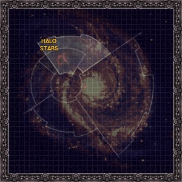

# 0922 光环群星 Halo Stars

精校状态：中文行文已逐段精校，部分术语仍为暂定

分类：地理 / 真实空间 Real Space / 朦胧星域 Segmentum Obscurus

原文来源：https://www.bilibili.com/opus/1153839781544722434

原作者：帝国神选罐头

原文时间：2026年01月04日 08:47

[返回分类目录](目录.md) · [全书目录](../../目录.md)

<!-- A0922-B0001 -->
**英文原文**

The Halo Stars are the stars bordering the outer reaches of Segmentum Obscurus.

<!-- /A0922-B0001 -->

<!-- A0922-B0002 -->

原译文

光环群星是与朦胧星域外部区域接壤的群星。

**校订译文**

光环群星分布在朦胧星域的外围边疆。

<!-- /A0922-B0002 -->

<!-- A0922-B0003 图片 -->

<!-- A0922-B0004 -->

原译文

Halo Stars 光环群星

**校订译文**

Halo Stars 光环群星

<!-- /A0922-B0004 -->

<!-- A0922-B0005 -->
## Overview 概述

<!-- /A0922-B0005 -->

<!-- A0922-B0006 -->
**英文原文**

The stars comprising the halo are very old and dispersed very thinly across the approximately two hundred thousand light years of the halo's diameter. Some are grouped together in clusters. The halo is almost entirely unexplored and probably contains few habitable systems. The region has an ominous reputation within the Imperium, with many considering it haunted and full of unknown horrors. Many expeditions into the Halo Stars have never returned.

<!-- /A0922-B0006 -->

<!-- A0922-B0007 -->

原译文

构成光环的群星非常古老，在光环直径约20万光年的范围内分散得非常稀疏。有些被聚集为星群。光环几乎完全未被探索，可能包含很少的可居住星系。该地区在帝国内部有着不祥的名声，许多人认为它闹鬼，充满了未知的恐怖。许多前往光环群星的探索者再也没有回来。

**校订译文**

这些恒星极其古老，稀疏地散布在直径约二十万光年的范围内，其中一些聚成星群。这片光环区域几乎未经探索，适宜居住的星系可能寥寥无几。它在帝国中名声不祥，许多人认为那里幽魂徘徊，潜藏未知的恐怖。许多深入光环群星的探险队从此一去不返。

**校注：** 保持 probably 与许多人认为的限定，不将传说中的恐怖直接作为已证实事实。二十万光年为设定底稿提供的尺度。

<!-- /A0922-B0007 -->

<!-- A0922-B0008 -->
**英文原文**

The Halo Stars include a Warp disturbance known as the Halo Scar, which makes travel through it nearly impossible.

<!-- /A0922-B0008 -->

<!-- A0922-B0009 -->

原译文

光环群星包括一种被称为光环疤痕的亚空间干扰，这使得穿越它几乎是不可能的。

**校订译文**

区域内有一处名为“光环疤痕”的亚空间扰动，使穿越该区域几乎不可能。

<!-- /A0922-B0009 -->

<!-- A0922-B0010 -->
## Known Worlds of the Halo Stars 光环群星的著名世界

<!-- /A0922-B0010 -->

<!-- A0922-B0011 -->

原译文

Cethlen 赛瑟伦

**校订译文**

Cethlen 赛瑟伦

<!-- /A0922-B0011 -->

<!-- A0922-B0012 -->
**英文原文**

Exniliho - Held the ancient artifact known as the Breath of the Gods

<!-- /A0922-B0012 -->

<!-- A0922-B0013 -->

原译文

埃克尼利霍 - 持有被称为“众神之息”的古代造物

**校订译文**

埃克尼利霍——曾藏有名为“众神之息”的古代造物。

<!-- /A0922-B0013 -->

本篇核心术语与暂定项

以下列出本篇出现的英文原形及核心术语表用词。同形词可能指不同对象，具体词义以本篇正文和校注为准；单复数、别名和仅见于图注的名称可能尚未列入。完整候选见[术语表](../../术语表/双语术语候选.csv)。

| 英文 | 采用中文 | 状态 |
| --- | --- | --- |
| Warp | 亚空间 | 官方已核对 |
| Imperium | 帝国 | 暂定·简称 |
| Segmentum Obscurus | 朦胧星域 | 暂定·官方待核 |
| Segmentum | 星域 | 暂定·官方待核 |
| Halo Stars | 光环群星 | 暂定·官方待核 |
| Obscurus | 朦胧星 | 暂定·官方待核 |
| Ancient | 旗手 | 官方已核对 |
| Halo Scar | 光环疤痕 | 暂定·官方待核 |
| Breath of the Gods | 众神之息 | 暂定·官方待核 |
| Exniliho | 埃克尼利霍 | 暂定·官方待核 |

