# 0923 卢修斯 Lucius

精校状态：中文行文已逐段精校，部分术语仍为暂定

分类：地理 / 真实空间 Real Space / 朦胧星域 Segmentum Obscurus

原文来源：https://www.bilibili.com/opus/1156813488070328321

原作者：帝国神选罐头

原文时间：2026年01月12日 09:07

[返回分类目录](目录.md) · [全书目录](../../目录.md)

<!-- A0923-B0001 图片 -->
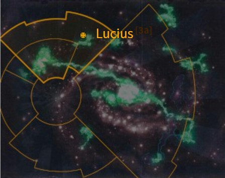

<!-- A0923-B0002 -->

原译文

Map 地图

**校订译文**

Map 地图

<!-- /A0923-B0002 -->

<!-- A0923-B0003 -->
### Basic Data 基本资料

原题：Basic Data 基础数据

<!-- /A0923-B0003 -->

<!-- A0923-B0004 -->
**英文原文**

Name:Lucius

<!-- /A0923-B0004 -->

<!-- A0923-B0005 -->

原译文

名称：卢修斯

**校订译文**

名称：卢修斯

<!-- /A0923-B0005 -->

<!-- A0923-B0006 -->
**英文原文**

Segmentum:Segmentum Obscurus

<!-- /A0923-B0006 -->

<!-- A0923-B0007 -->

原译文

星域：朦胧星域

**校订译文**

星域：朦胧星域

<!-- /A0923-B0007 -->

<!-- A0923-B0008 -->
**英文原文**

Affiliation:Imperium

<!-- /A0923-B0008 -->

<!-- A0923-B0009 -->

原译文

隶属：帝国

**校订译文**

隶属：帝国

<!-- /A0923-B0009 -->

<!-- A0923-B0010 -->
**英文原文**

Class:Forge World

<!-- /A0923-B0010 -->

<!-- A0923-B0011 -->

原译文

类别：铸造世界

**校订译文**

类别：铸造世界

<!-- /A0923-B0011 -->

<!-- A0923-B0012 -->
**英文原文**

Production Grade:III-Prima

<!-- /A0923-B0012 -->

<!-- A0923-B0013 -->

原译文

生产等级：三级-上等

**校订译文**

生产等级：III-Prima（原稿暂译三级上等）。

<!-- /A0923-B0013 -->

<!-- A0923-B0014 -->
**英文原文**

Tithe Grade:Aptus Non

<!-- /A0923-B0014 -->

<!-- A0923-B0015 -->

原译文

什一税等级：特级免税

**校订译文**

什一税等级：Aptus Non（原稿暂译特级免税）。

<!-- /A0923-B0015 -->

<!-- A0923-B0016 -->
**英文原文**

Lucius is a Forge World and is home to the Legio Astorum Titan Legion (AKA the "Warp Runners"). It also is the place of origin of the Macharius-class super-heavy battle tank.

<!-- /A0923-B0016 -->

<!-- A0923-B0017 -->

原译文

卢修斯是一个铸造世界，也是星象军团泰坦军团（又名“次元跑者”）的所在地。它也是马卡里乌斯级超重型战斗坦克的起源地。

**校订译文**

卢修斯是一颗铸造世界，也是星象泰坦军团的母星；该军团又称“亚空间跑者”。马卡里乌斯级超重型战斗坦克同样发源于此。

**校注：** 源文此处将Macharius称超重型，而后文图注称重型坦克；保留所给资料的分类差异，不无据抹平。

<!-- /A0923-B0017 -->

<!-- A0923-B0018 图片 -->
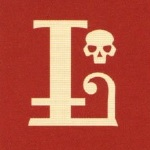

<!-- A0923-B0019 -->

原译文

Lucius' icon 卢修斯标志

**校订译文**

Lucius' icon 卢修斯标志

<!-- /A0923-B0019 -->

<!-- A0923-B0020 -->
## Overview 概述

<!-- /A0923-B0020 -->

<!-- A0923-B0021 -->
**英文原文**

The name of this world originates from Luciun, a unique alloy renowned for its durability. The war-plate and weapon of the armies of Lucius is made of Luciun, so the warriors of Lucius's forces have improved resilience against small-arms fire.

<!-- /A0923-B0021 -->

<!-- A0923-B0022 -->

原译文

这个世界的名字来源于光金，一种以耐用性而闻名的独特合金。卢修斯军队的战甲和武器是由光金制成的，因此卢修斯部队的战士们提高了对小型武器火力的抵抗力。

**校订译文**

行星之名取自一种名为光金（Luciun）的独特合金，它以坚固耐用著称。卢修斯军队用光金制造战甲和武器，因此能更好地承受轻武器火力。

<!-- /A0923-B0022 -->

<!-- A0923-B0023 图片 -->
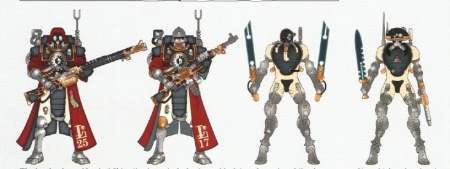

<!-- A0923-B0024 -->

原译文

Lucius Skitarii 卢修斯护教军

**校订译文**

Lucius Skitarii 卢修斯护教军

<!-- /A0923-B0024 -->

<!-- A0923-B0025 -->
**英文原文**

A hollow world (one of the Supernatura Majoris of the Imperium), Lucius has been part of a grand experiment that should have destroyed it a dozen times over. The centre of its once-barren core is an artificial sun, a titanic fusion reactor that powers the industry sprawling above. No one truly knows how this energy source came to be, though many Tech-Priests take credit. Lucius' boundless power supply has made it a forefront of military production, producing many types of guns and vehicles. Their Ironstriders and Onager Dunecrawlers are the most bellicose of all the Skitarii legions. Their Titan Legion are the infamous Legio Astorum, whose Princeps are trained at the Clone Academy located in Lucius' Overcity.

<!-- /A0923-B0025 -->

<!-- A0923-B0026 -->

原译文

卢修斯是一个空洞世界（帝国的主要超自然之一），它参与了一场本应摧毁它十几次的伟大实验。其曾经荒芜的核心中心是一个人造太阳，一个巨大的聚变反应堆，为上方庞大的工业提供动力。没有人真正知道这种能源是如何产生的，尽管许多技术深度对此表示邀功。卢修斯的无限能源供应使其成为军事生产的前沿，生产多种类型的枪炮和载具。他们的铁骑和野驴沙丘爬行者是所有护教军军团中最好战的。他们的泰坦军团是著名的星象军团，其首席在卢修斯的城市上空的克隆学院接受训练。

**校订译文**

卢修斯是一颗空心世界，被列为帝国的重大超自然奇观之一。它参与了一场宏大实验，照理说早该因此毁灭十余次，却仍然存在。曾经空无一物的核心中央，悬着一颗人造太阳——巨大的聚变反应堆，为上方遍布地层的工业设施供能。尽管许多技术祭司争相认领功劳，却无人真正知道这颗能源核心如何诞生。近乎无穷的能源使卢修斯成为军工生产重镇，出产多种枪炮与载具。当地的铁骑兵和沙丘爬行者，在各护教军军团中以好战著称。星象军团的泰坦首席则在卢修斯上城的克隆学院接受训练。

**校注：** Tech-Priests 原“技术深度”为明显误译，依官方技术祭司。Overcity 指上城，不是城市上空；Princeps为驾驶与指挥泰坦的首席，非笼统首领。

<!-- /A0923-B0026 -->

<!-- A0923-B0027 -->
**英文原文**

The illuminated letter that forms Lucius' icon is burnt into the surface of the planet, each detail a dozen miles from top to bottom.

<!-- /A0923-B0027 -->

<!-- A0923-B0028 -->

原译文

形成卢修斯的标志的发光字母被烧到行星表面，每个细节从上到下都有十几英里。

**校订译文**

卢修斯纹章中的花饰字母被灼刻在行星表面，每一处细节从上到下都约十二英里长。

**校注：** illuminated letter 在徽章语境为装饰性花饰字母，不必然指字母自身发光。dozen为十二，不译十几。

<!-- /A0923-B0028 -->

<!-- A0923-B0029 -->
**英文原文**

Lucius's forge is well-known for producing the Lucius Pattern Warhound Scout Titan and Lucius Pattern Drop Pod. It is also produces large quantities of Macharius Tanks of different patterns.

<!-- /A0923-B0029 -->

<!-- A0923-B0030 -->

原译文

卢修斯的铸造厂以生产卢修斯型战犬侦察泰坦和卢修斯型空投舱而闻名。它还生产大量不同型号的马卡里乌斯坦克。

**校订译文**

卢修斯的铸造厂以生产卢修斯型战犬级侦察泰坦与卢修斯型空降舱著称，同时也大量制造各种型号的马卡里乌斯坦克。

<!-- /A0923-B0030 -->

<!-- A0923-B0031 -->
## History 历史

<!-- /A0923-B0031 -->

<!-- A0923-B0032 -->
**英文原文**

At some point the planet suffered the disastrous Inculcata Schism, which nearly saw the Forge World implode with enough force to rip a hole in reality. Today this event is only spoken of in whispers.

<!-- /A0923-B0032 -->

<!-- A0923-B0033 -->

原译文

在某个时刻，行星遭受了灾难性的教化分裂，几乎导致铸造世界内爆，其力量足以在现实中撕开一个洞。如今，这一事件只在私下里被提及。

**校订译文**

这颗星球曾经历灾难性的教化分裂，险些在内爆中释放足以撕裂现实的力量。如今，人们只敢低声谈起此事。

<!-- /A0923-B0033 -->

<!-- A0923-B0034 -->
**英文原文**

In M41, Lucius was invaded by Hive Fleet Leviathan. Fortunately, the Mechanicus forces were victorious in driving away the Tyranids after months of bloody fighting winning the war of attrition when xenos could not keep pace with the refurbished robots and the recycled machinery parts of the Lucians.

<!-- /A0923-B0034 -->

<!-- A0923-B0035 -->

原译文

在M41，卢修斯被虫巢舰队利维坦入侵。幸运的是，经过数月的血腥战斗，机械教部队在驱逐泰伦方面取得了胜利 — 赢得了消耗战，异型无法跟上卢修斯人重装的机兵和回收的机械部件的步伐。

**校订译文**

第四十一千年，利维坦虫巢舰队入侵卢修斯。机械修会部队血战数月，最终赢得消耗战、逐退泰伦：卢修斯不断翻修机兵、回收机械部件，虫群的消耗与补充速度终究无法与之匹敌。

<!-- /A0923-B0035 -->

<!-- A0923-B0036 -->
## Lucius patterns 卢修斯型号

<!-- /A0923-B0036 -->

<!-- A0923-B0037 -->
**英文原文**

Lucius is known to produce its own patterns:

<!-- /A0923-B0037 -->

<!-- A0923-B0038 -->

原译文

众所周知，卢修斯会产生自己的型号：

**校订译文**

卢修斯生产多种自有型号：

<!-- /A0923-B0038 -->

<!-- A0923-B0039 -->
### Armoured Vehicles 装甲载具

<!-- /A0923-B0039 -->

<!-- A0923-B0040 图片 -->
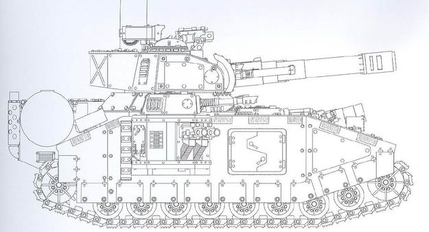

<!-- A0923-B0041 -->

原译文

Lucius pattern Baneblade 卢修斯型毒刃

**校订译文**

Lucius pattern Baneblade 卢修斯型毒刃

<!-- /A0923-B0041 -->

<!-- A0923-B0042 图片 -->
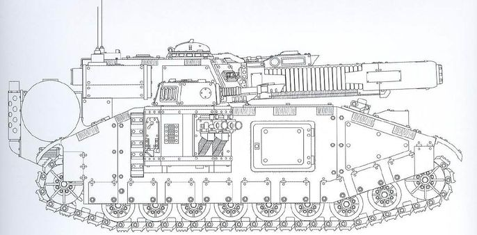

<!-- A0923-B0043 -->

原译文

Lucius pattern Stormblade 卢修斯型风暴刃

**校订译文**

Lucius pattern Stormblade 卢修斯型风暴刃

<!-- /A0923-B0043 -->

<!-- A0923-B0044 图片 -->
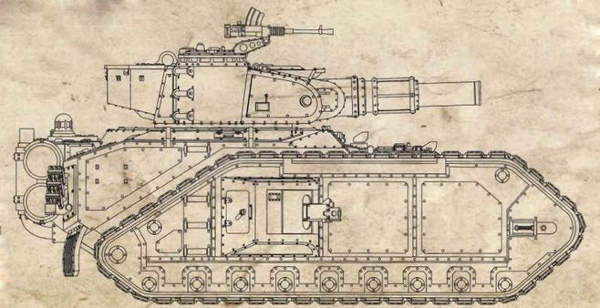

<!-- A0923-B0045 -->

原译文

Lucius pattern Macharius (Heavy Tank) 卢修斯型马卡里乌斯（重型坦克）

**校订译文**

Lucius pattern Macharius (Heavy Tank) 卢修斯型马卡里乌斯（重型坦克）

<!-- /A0923-B0045 -->

<!-- A0923-B0046 图片 -->
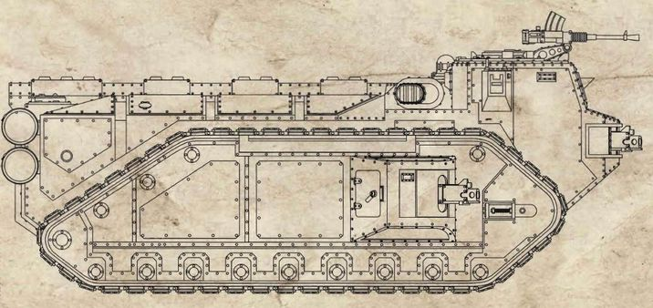

<!-- A0923-B0047 -->

原译文

Lucius pattern Crassus Armoured Transport 卢修斯型克拉苏装甲运输车

**校订译文**

Lucius pattern Crassus Armoured Transport 卢修斯型克拉苏装甲运输车

<!-- /A0923-B0047 -->

<!-- A0923-B0048 图片 -->
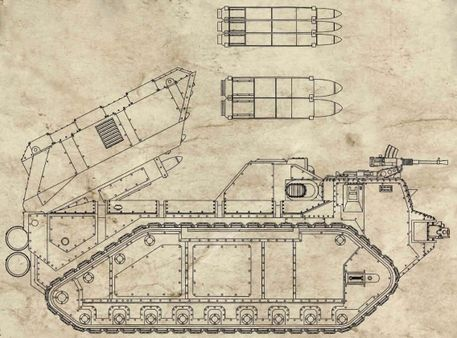

<!-- A0923-B0049 -->

原译文

Lucius pattern Praetor Armoured Assault Launcher 卢修斯型执政官装甲突击发射器

**校订译文**

Lucius pattern Praetor Armoured Assault Launcher 卢修斯型执政官装甲突击发射器

<!-- /A0923-B0049 -->

<!-- A0923-B0050 图片 -->
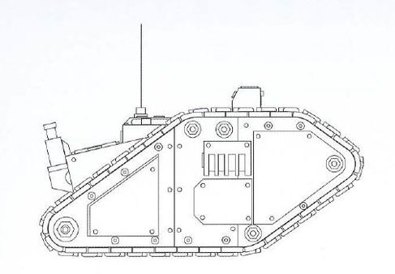

<!-- A0923-B0051 -->

原译文

Lucius pattern Cyclops Demolition Vehicle 卢修斯型独眼巨人爆破载具

**校订译文**

Lucius pattern Cyclops Demolition Vehicle 卢修斯型独眼巨人爆破车

**校注：** GW09第9页与GW10第8页可直接核对Cyclops Demolition Vehicle＝独眼巨人爆破车；附加Lucius型不因此声称完整型号已核官方。

<!-- /A0923-B0051 -->

<!-- A0923-B0052 -->
### Titans 泰坦

<!-- /A0923-B0052 -->

<!-- A0923-B0053 图片 -->
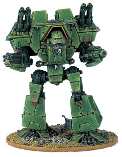

<!-- A0923-B0054 -->

原译文

Lucius pattern Warlord Titan 卢修斯型军阀泰坦

**校订译文**

Lucius pattern Warlord Titan 卢修斯型战将级泰坦

**校注：** Warlord/Reaver/Warhound按已核GW09/GW10第5页分别为战将级、掠夺者级、战犬级泰坦；完整卢修斯型号仍是词根参考。

<!-- /A0923-B0054 -->

<!-- A0923-B0055 图片 -->
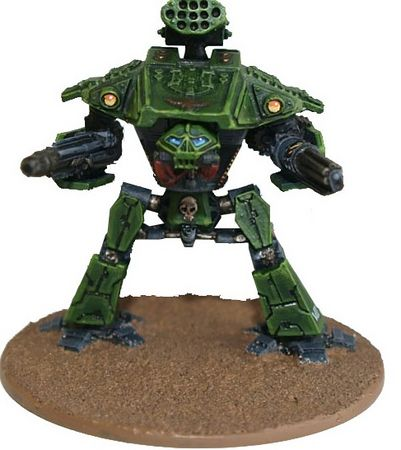

<!-- A0923-B0056 -->

原译文

Lucius Pattern Reaver Titan 卢修斯型掠夺者泰坦

**校订译文**

Lucius Pattern Reaver Titan 卢修斯型掠夺者级泰坦

<!-- /A0923-B0056 -->

<!-- A0923-B0057 图片 -->
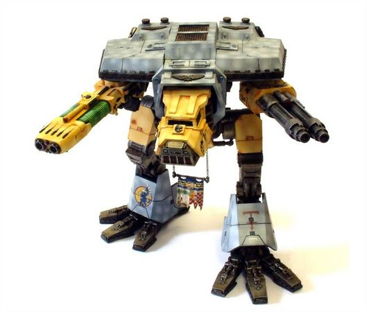

<!-- A0923-B0058 -->

原译文

Lucius Pattern Warhound Titan 卢修斯型战犬泰坦

**校订译文**

Lucius Pattern Warhound Titan 卢修斯型战犬级泰坦

<!-- /A0923-B0058 -->

<!-- A0923-B0059 -->
### Weapons 武器

<!-- /A0923-B0059 -->

<!-- A0923-B0060 图片 -->
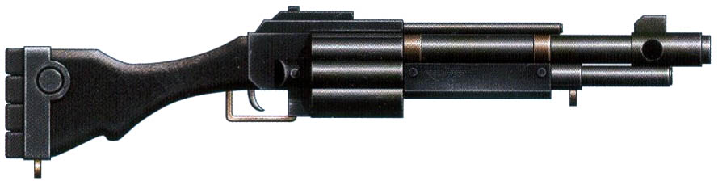

<!-- A0923-B0061 -->

原译文

Lucius pattern Mk 22c shotgun 卢修斯型Mk 22c霰弹枪

**校订译文**

Lucius pattern Mk 22c shotgun 卢修斯型Mk 22c霰弹枪

<!-- /A0923-B0061 -->

<!-- A0923-B0062 图片 -->
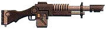

<!-- A0923-B0063 -->

原译文

Lucius Pattern no.98 Lasgun 卢修斯型98号激光枪

**校订译文**

Lucius Pattern no.98 Lasgun 卢修斯型98号激光枪

<!-- /A0923-B0063 -->

<!-- A0923-B0064 图片 -->
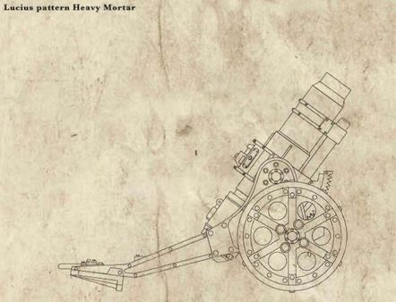

<!-- A0923-B0065 -->

原译文

Lucius pattern Heavy Mortar 卢修斯型重型迫击炮

**校订译文**

Lucius pattern Heavy Mortar 卢修斯型重型迫击炮

<!-- /A0923-B0065 -->

<!-- A0923-B0066 图片 -->
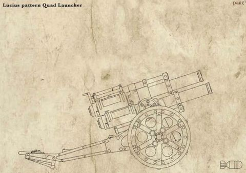

<!-- A0923-B0067 -->

原译文

Lucius pattern Quad Launcher 卢修斯型四管发射器

**校订译文**

Lucius pattern Quad Launcher 卢修斯型四管发射器

<!-- /A0923-B0067 -->

<!-- A0923-B0068 图片 -->
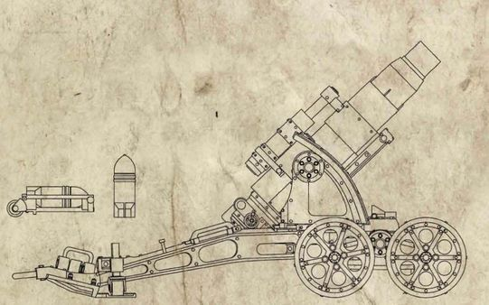

<!-- A0923-B0069 -->

原译文

Lucius pattern Medusa Siege Platform 卢修斯型美杜莎攻城平台

**校订译文**

Lucius pattern Medusa Siege Platform 卢修斯型美杜莎攻城平台

<!-- /A0923-B0069 -->

<!-- A0923-B0070 -->
### Other 其他

<!-- /A0923-B0070 -->

<!-- A0923-B0071 -->
**英文原文**

Type Five Icarus-pattern Personal Descent Unit — A type of grav-chute used by Astra Militarum drop troops.

<!-- /A0923-B0071 -->

<!-- A0923-B0072 -->

原译文

五型伊卡洛斯型个人降下装置 — 星界军空降部队使用的一种重力伞。

**校订译文**

伊卡洛斯式五型个人空降装置——星界军空降部队使用的一种重力伞。

<!-- /A0923-B0072 -->

本篇核心术语与暂定项

以下列出本篇出现的英文原形及核心术语表用词。同形词可能指不同对象，具体词义以本篇正文和校注为准；单复数、别名和仅见于图注的名称可能尚未列入。完整候选见[术语表](../../术语表/双语术语候选.csv)。

| 英文 | 采用中文 | 状态 |
| --- | --- | --- |
| Astra Militarum | 星界军 | 官方已核对 |
| Tyranids | 泰伦虫族 | 官方已核对 |
| Warp | 亚空间 | 官方已核对 |
| Imperium | 帝国 | 暂定·简称 |
| Forge World | 铸造世界 | 暂定·官方待核 |
| Skitarii | 护教军 | 暂定·官方待核 |
| Hive Fleet Leviathan | 利维坦虫巢舰队 | 暂定·官方待核 |
| Segmentum Obscurus | 朦胧星域 | 暂定·官方待核 |
| Segmentum | 星域 | 暂定·官方待核 |
| Lucius | 卢修斯 | 暂定·官方待核 |
| Obscurus | 朦胧星 | 暂定·官方待核 |
| Titan | 泰坦 | 暂定·官方待核 |
| Tech | 技术语 | 暂定·官方待核 |
| Aptus Non | 特级免税 | 暂定·官方待核 |
| Drop Pod | 空降舱 | 官方已核·中英对照 |
| Princeps | 首席 | 暂定·官方待核 |
| Scout | 侦察兵 | 暂定·官方待核 |
| Powers | 能天使 | 暂定·官方待核 |
| Xenos | 异形 | 暂定·官方待核 |
| Legio Astorum | 星象军团 | 暂定·官方待核 |
| Warp Runners | 亚空间跑者 | 暂定·官方待核 |
| Macharius | 马卡里乌斯 | 暂定·官方待核 |
| Luciun | 光金 | 暂定·官方待核 |
| Supernatura Majoris | 重大超自然奇观 | 暂定·官方待核 |
| Clone Academy | 克隆学院 | 暂定·官方待核 |
| Overcity | 上城 | 暂定·官方待核 |
| Inculcata Schism | 教化分裂 | 暂定·官方待核 |
| Type Five Icarus-pattern Personal Descent Unit | 伊卡洛斯式五型个人空降装置 | 暂定·官方待核 |

