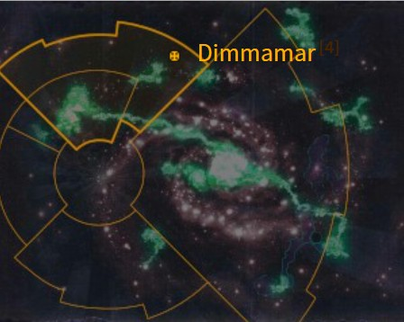

# 0924 迪马默 Dimmamar

精校状态：中文行文已逐段精校，部分术语仍为暂定

分类：地理 / 真实空间 Real Space / 朦胧星域 Segmentum Obscurus

原文来源：https://www.bilibili.com/opus/1157292694750363673

原作者：帝国神选罐头

原文时间：2026年01月13日 16:06

[返回分类目录](目录.md) · [全书目录](../../目录.md)

原篇名：迪马玛尔 Dimmamar

<!-- A0924-B0001 图片 -->

<!-- A0924-B0002 -->

原译文

Map 地图

**校订译文**

Map 地图

<!-- /A0924-B0002 -->

<!-- A0924-B0003 -->
### Basic Data 基本资料

原题：Basic Data 基础数据

<!-- /A0924-B0003 -->

<!-- A0924-B0004 -->
**英文原文**

Name:Dimmamar

<!-- /A0924-B0004 -->

<!-- A0924-B0005 -->

原译文

名称：迪马玛尔

**校订译文**

名称：迪马默（原稿另译迪马玛尔）。

**校注：** 沿核心及866篇Dimmamar＝迪马默，保留旧名对照。

<!-- /A0924-B0005 -->

<!-- A0924-B0006 -->
**英文原文**

Segmentum:Segmentum Obscurus

<!-- /A0924-B0006 -->

<!-- A0924-B0007 -->

原译文

星域：朦胧星域

**校订译文**

星域：朦胧星域

<!-- /A0924-B0007 -->

<!-- A0924-B0008 -->
**英文原文**

Affiliation:Imperium

<!-- /A0924-B0008 -->

<!-- A0924-B0009 -->

原译文

隶属：帝国

**校订译文**

隶属：帝国

<!-- /A0924-B0009 -->

<!-- A0924-B0010 -->
**英文原文**

Class:Cardinal World

<!-- /A0924-B0010 -->

<!-- A0924-B0011 -->

原译文

类别：枢机世界

**校订译文**

类别：红衣主教世界。

<!-- /A0924-B0011 -->

<!-- A0924-B0012 -->
**英文原文**

Dimmamar is an Imperial world in the Segmentum Obscurus.

<!-- /A0924-B0012 -->

<!-- A0924-B0013 -->

原译文

迪马玛尔是朦胧星域中的帝国世界。

**校订译文**

迪马默是朦胧星域中的一颗帝国世界。

<!-- /A0924-B0013 -->

<!-- A0924-B0014 -->
## Overview 概述

<!-- /A0924-B0014 -->

<!-- A0924-B0015 -->
**英文原文**

Dimmamar is most famous for two things: being the location where the Confederation of Light was founded, and being the birthplace of Sebastian Thor, who overthrew Goge Vandire and later became Ecclesiarch. It was also the first planet to defy the will of Vandire and declare him a heretic.

<!-- /A0924-B0015 -->

<!-- A0924-B0016 -->

原译文

迪马玛尔最出名的有两件事：一是光明同盟成立的地方，二是推翻高戈·范迪尔、后来成为教宗的塞巴斯蒂安·托尔的出生地。这也是第一个无视范迪尔意愿并宣布他为异端的行星。

**校订译文**

迪马默以两件事闻名：光明同盟在此成立，而推翻高戈·范迪尔、后来成为教宗的塞巴斯蒂安·托尔也出生于此。它还是第一颗公开违抗范迪尔、宣告他为异端的行星。

<!-- /A0924-B0016 -->

<!-- A0924-B0017 -->
**英文原文**

The people of Dimmamar have had past dealings with Fabius Bile, who is known on that planet as "the Chem-master."

<!-- /A0924-B0017 -->

<!-- A0924-B0018 -->

原译文

迪马玛尔的人们过去曾与法比乌斯·拜尔打过交道，他在那个行星上被称为“化学大师”

**校订译文**

迪马默居民过去曾与法比乌斯·拜尔打交道，在当地，他被称为“化学大师”。

<!-- /A0924-B0018 -->

<!-- A0924-B0019 -->
## History 历史

<!-- /A0924-B0019 -->

<!-- A0924-B0020 -->
**英文原文**

In 858.M41, Dimmamar would come under sudden attack from the Eldar of Craftworld Ulthwé without any warning or apparent reason. Seraphim led by Seraphim Superior Amelda of the Order of the Bloody Rose from the Sisters of Battle retaliated in a daring attack, slaying the Eldar Farseer.

<!-- /A0924-B0020 -->

<!-- A0924-B0021 -->

原译文

858.M41，迪马玛尔突然遭到方舟世界乌斯维的灵族的攻击，没有任何警告或明显的原因。由战斗修女鲜血玫瑰修会的高阶炽天使阿梅尔达领导的炽天使进行了大胆的反击，杀死了灵族先知。

**校订译文**

858.M41年，乌斯维方舟世界的灵族毫无预警地袭击迪马默，动机不明。鲜血玫瑰修会的炽天使小队长阿梅尔达率部发动大胆反击，杀死了灵族大先知。

**校注：** Seraphim Superior 是率领炽天使的队长职衔，不是另一个“高阶炽天使”种族或兵种；全职衔中文仍为暂定。

<!-- /A0924-B0021 -->

本篇核心术语与暂定项

以下列出本篇出现的英文原形及核心术语表用词。同形词可能指不同对象，具体词义以本篇正文和校注为准；单复数、别名和仅见于图注的名称可能尚未列入。完整候选见[术语表](../../术语表/双语术语候选.csv)。

| 英文 | 采用中文 | 状态 |
| --- | --- | --- |
| Eldar | 灵族 | 暂定·语境区分 |
| Imperium | 帝国 | 暂定·简称 |
| Farseer | 大先知 | 官方已核对 |
| Ulthwé | 乌斯维 | 暂定 |
| Craftworld | 方舟世界 | 官方已核对 |
| Goge Vandire | 高戈·范迪尔 | 暂定·官方待核 |
| The Order | 秩序 | 暂定·官方待核 |
| Sisters of Battle | 战斗修女 | 暂定·官方待核 |
| Segmentum Obscurus | 朦胧星域 | 暂定·官方待核 |
| Segmentum | 星域 | 暂定·官方待核 |
| Dimmamar | 迪马默 | 暂定·官方待核 |
| Obscurus | 朦胧星 | 暂定·官方待核 |
| Master | 导师（审判庭职衔）／舰务官（舰员职务） | 语境定译·官方待核 |
| Ecclesiarch | 教宗 | 暂定 |
| Cardinal | 红衣主教 | 暂定 |
| Confederation of Light | 光明同盟 | 暂定 |
| Order of the Bloody Rose | 鲜血玫瑰修会 | 暂定 |
| Fabius Bile | 法比乌斯·拜尔 | 官方已核对 |
| Cardinal World | 红衣主教世界 | 暂定·官方待核 |
| Sebastian Thor | 塞巴斯蒂安·托尔 | 暂定·官方待核 |
| Chem-master | 化学大师 | 暂定·官方待核 |
| Seraphim Superior | 炽天使小队长 | 暂定·官方待核 |
| Amelda | 阿梅尔达 | 暂定·官方待核 |

