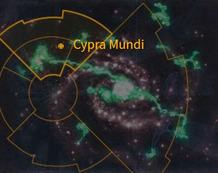
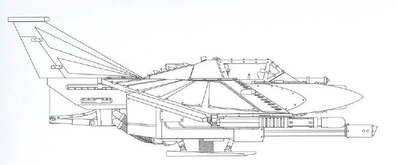
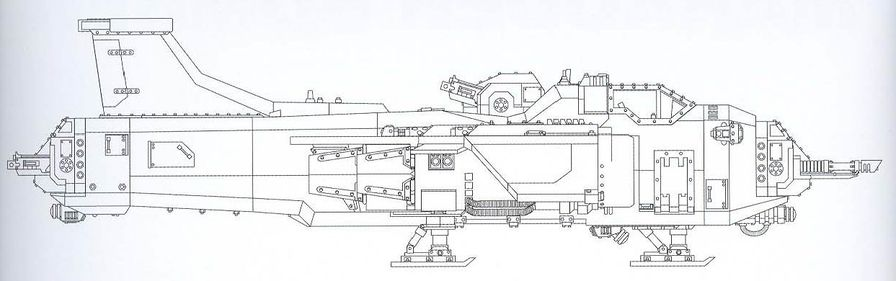
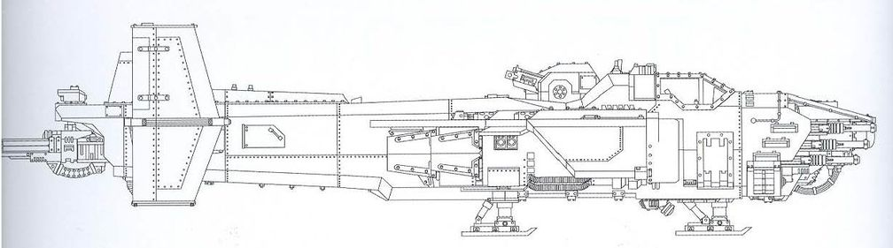

# 0925 塞浦拉·蒙迪 Cypra Mundi

精校状态：中文行文已逐段精校，部分术语仍为暂定

分类：地理 / 真实空间 Real Space / 朦胧星域 Segmentum Obscurus

原文来源：https://www.bilibili.com/opus/1167673639258030083

原作者：帝国神选罐头

原文时间：2026年02月10日 15:30

[返回分类目录](目录.md) · [全书目录](../../目录.md)

原篇名：凯普拉·蒙迪 Cypra Mundi

<!-- A0925-B0001 图片 -->

<!-- A0925-B0002 -->

原译文

Map 地图

**校订译文**

Map 地图

<!-- /A0925-B0002 -->

<!-- A0925-B0003 -->
### Basic Data 基本资料

原题：Basic Data 基础数据

<!-- /A0925-B0003 -->

<!-- A0925-B0004 -->
**英文原文**

Name:Cypra Mundi

<!-- /A0925-B0004 -->

<!-- A0925-B0005 -->

原译文

名称：凯普拉·蒙迪

**校订译文**

名称：塞浦拉·蒙迪（原稿另译凯普拉·蒙迪）。

<!-- /A0925-B0005 -->

<!-- A0925-B0006 -->
**英文原文**

Segmentum:Segmentum Obscurus

<!-- /A0925-B0006 -->

<!-- A0925-B0007 -->

原译文

星域：朦胧星域

**校订译文**

星域：朦胧星域

<!-- /A0925-B0007 -->

<!-- A0925-B0008 -->
**英文原文**

Affiliation:Imperium

<!-- /A0925-B0008 -->

<!-- A0925-B0009 -->

原译文

隶属：帝国

**校订译文**

隶属：帝国

<!-- /A0925-B0009 -->

<!-- A0925-B0010 -->
**英文原文**

Class:Forge World/Fleet Base

<!-- /A0925-B0010 -->

<!-- A0925-B0011 -->

原译文

类别：铸造世界/舰队基地

**校订译文**

类别：铸造世界/舰队基地

<!-- /A0925-B0011 -->

<!-- A0925-B0012 -->
**英文原文**

Cypra Mundi is a Forge World as well as the administrative and fleet capital of Segmentum Obscurus. Orbiting Cypra Mundi is a Segmentum Fortress, the base for fleet operations throughout Segmentum Obscurus. The Segmentum Fortress is controlled directly by an Administratum Master.

<!-- /A0925-B0012 -->

<!-- A0925-B0013 -->

原译文

凯普拉·蒙迪是一个铸造世界，也是朦胧星域的行政和舰队首都。环绕凯普拉·蒙迪的是星域堡垒，是整个朦胧星域舰队行动的基地。星域堡垒由内务部长直接控制。

**校订译文**

塞浦拉·蒙迪既是铸造世界，也是朦胧星域的行政与舰队中枢。行星轨道上设有一座星域堡垒，为整个朦胧星域的舰队行动提供基地，由一名内政部主管直接掌管。

**校注：** Administratum Master 是内政部主管人员，不等于整个内政部的部长。

<!-- /A0925-B0013 -->

<!-- A0925-B0014 -->
## Overview 概述

<!-- /A0925-B0014 -->

<!-- A0925-B0015 -->
**英文原文**

Cypra Mundi is home to the Collegium Analytica.

<!-- /A0925-B0015 -->

<!-- A0925-B0016 -->

原译文

凯普拉·蒙迪是分析学院的所在地。

**校订译文**

分析学院设于塞浦拉·蒙迪。

<!-- /A0925-B0016 -->

<!-- A0925-B0017 -->
## History 历史

<!-- /A0925-B0017 -->

<!-- A0925-B0018 -->
**英文原文**

The world was assimilated into the Imperium during the Great Crusade, when the early Ultramarines saved the planet from Orks. Its first unique Battleship design was the Annihilator Class.

<!-- /A0925-B0018 -->

<!-- A0925-B0019 -->

原译文

在大远征期间，世界被帝国吸收，当时早期的极限战士从欧克手中拯救了行星。它的第一艘独特的战舰设计是歼灭者级。

**校订译文**

大远征期间，早期极限战士从欧克手中解救了这颗星球，使其并入帝国。这里最早独立设计的战列舰型号是歼灭者级。

**校注：** unique Battleship design 指独有的战列舰设计型号，不是某一艘战舰。

<!-- /A0925-B0019 -->

<!-- A0925-B0020 -->
**英文原文**

In 865.M41, the planet was assaulted by the forces of Chaos.

<!-- /A0925-B0020 -->

<!-- A0925-B0021 -->

原译文

865.M41，这颗行星遭到了混沌部队的袭击。

**校订译文**

865.M41，这颗行星遭到了混沌部队的袭击。

<!-- /A0925-B0021 -->

<!-- A0925-B0022 -->
**英文原文**

Following the resurrection of Roboute Guilliman and the formation of the Great Rift, Cypra Mundi was one of the worlds which became stranded in the Dark Imperium.

<!-- /A0925-B0022 -->

<!-- A0925-B0023 -->

原译文

随着罗伯特·基里曼的复活和大裂隙的形成，凯普拉·蒙迪是陷入黑暗帝国的世界之一。

**校订译文**

罗保特·基里曼复活、大裂隙形成后，塞浦拉·蒙迪成为被隔绝在帝国暗面的世界之一。

**校注：** Dark Imperium 在此为Imperium Nihilus同义地理称呼，统一帝国暗面，不误作另一国家黑暗帝国。

<!-- /A0925-B0023 -->

<!-- A0925-B0024 -->
## Known Patterns 已知型号

<!-- /A0925-B0024 -->

<!-- A0925-B0025 图片 -->

<!-- A0925-B0026 -->

原译文

Cypra Mundi pattern Lightning 凯普拉·蒙迪型闪电

**校订译文**

Cypra Mundi pattern Lightning 塞浦拉·蒙迪型闪电

<!-- /A0925-B0026 -->

<!-- A0925-B0027 图片 -->

<!-- A0925-B0028 -->

原译文

Cypra Mundi pattern Marauder Bomber 凯普拉·蒙迪型掠夺者轰炸机

**校订译文**

Cypra Mundi pattern Marauder Bomber 塞浦拉·蒙迪型掠夺者轰炸机

<!-- /A0925-B0028 -->

<!-- A0925-B0029 图片 -->

<!-- A0925-B0030 -->

原译文

Cypra Mundi pattern Marauder Destroyer 凯普拉·蒙迪型掠夺者毁灭者

**校订译文**

Cypra Mundi pattern Marauder Destroyer 塞浦拉·蒙迪型掠夺者毁灭机

**校注：** Marauder Destroyer为飞行载具型号，原“掠夺者毁灭者”未显示其类别；暂沿词根译掠夺者毁灭机，官方待核。

<!-- /A0925-B0030 -->

本篇核心术语与暂定项

以下列出本篇出现的英文原形及核心术语表用词。同形词可能指不同对象，具体词义以本篇正文和校注为准；单复数、别名和仅见于图注的名称可能尚未列入。完整候选见[术语表](../../术语表/双语术语候选.csv)。

| 英文 | 采用中文 | 状态 |
| --- | --- | --- |
| Orks | 欧克蛮人 | 官方已核对 |
| Roboute Guilliman | 罗保特·基里曼 | 官方已核对 |
| Ultramarines | 极限战士 | 官方已核对 |
| Great Rift | 大裂隙 | 官方已核对 |
| Imperium | 帝国 | 暂定·简称 |
| Administratum | 内政部 | 暂定 |
| Forge World | 铸造世界 | 暂定·官方待核 |
| Great Crusade | 大远征 | 暂定·官方待核 |
| Dark Imperium | 黑暗帝国 | 暂定·官方待核 |
| Segmentum Obscurus | 朦胧星域 | 暂定·官方待核 |
| Segmentum | 星域 | 暂定·官方待核 |
| Cypra Mundi | 塞浦拉·蒙迪 | 暂定·官方待核 |
| Obscurus | 朦胧星 | 暂定·官方待核 |
| Master | 导师（审判庭职衔）／舰务官（舰员职务） | 语境定译·官方待核 |
| The Dark | 《黑暗》 | 暂定·官方待核 |
| Segmentum Fortress | 星域堡垒 | 暂定·官方待核 |
| Collegium Analytica | 分析学院 | 暂定·官方待核 |
| Annihilator Class | 歼灭者级（战列舰） | 暂定·官方待核 |

