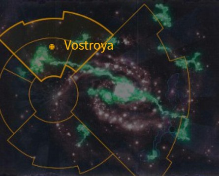
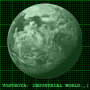

# 0926 沃斯特洛亚 Vostroya

精校状态：中文行文已逐段精校，部分术语仍为暂定

分类：地理 / 真实空间 Real Space / 朦胧星域 Segmentum Obscurus

原文来源：https://www.bilibili.com/opus/1168724875429281794

原作者：帝国神选罐头

原文时间：2026年02月13日 11:29

[返回分类目录](目录.md) · [全书目录](../../目录.md)

原篇名：沃斯托尼亚 Vostroya

<!-- A0926-B0001 图片 -->

<!-- A0926-B0002 -->

原译文

Map 地图

**校订译文**

Map 地图

<!-- /A0926-B0002 -->

<!-- A0926-B0003 -->
## Basic Data 基本资料

原题：Basic Data 基础数据

<!-- /A0926-B0003 -->

<!-- A0926-B0004 -->
**英文原文**

Name:Vostroya

<!-- /A0926-B0004 -->

<!-- A0926-B0005 -->

原译文

名称：沃斯托尼亚

**校订译文**

名称：沃斯特洛亚

<!-- /A0926-B0005 -->

<!-- A0926-B0006 -->
**英文原文**

Segmentum:Segmentum Obscurus

<!-- /A0926-B0006 -->

<!-- A0926-B0007 -->

原译文

星域：朦胧星域

**校订译文**

星域：朦胧星域

<!-- /A0926-B0007 -->

<!-- A0926-B0008 -->
**英文原文**

System:Vostroya

<!-- /A0926-B0008 -->

<!-- A0926-B0009 -->

原译文

星系：沃斯托尼亚星系

**校订译文**

星系：沃斯特洛亚星系

<!-- /A0926-B0009 -->

<!-- A0926-B0010 -->
**英文原文**

Population:~9.3 billion

<!-- /A0926-B0010 -->

<!-- A0926-B0011 -->

原译文

人口：约93亿

**校订译文**

人口：约93亿

<!-- /A0926-B0011 -->

<!-- A0926-B0012 -->
**英文原文**

Affiliation:Imperium

<!-- /A0926-B0012 -->

<!-- A0926-B0013 -->

原译文

隶属：帝国

**校订译文**

隶属：帝国

<!-- /A0926-B0013 -->

<!-- A0926-B0014 -->
**英文原文**

Class:Industrial World

<!-- /A0926-B0014 -->

<!-- A0926-B0015 -->

原译文

类别：工业世界

**校订译文**

类别：工业世界

<!-- /A0926-B0015 -->

<!-- A0926-B0016 -->
**英文原文**

Tithe Grade:Exactis Extremis

<!-- /A0926-B0016 -->

<!-- A0926-B0017 -->

原译文

什一税等级：第一级高等

**校订译文**

什一税等级：第一级极等

**校注：** Exactis Extremis 原稿译第一级高等，但全书另有 Exactis Excelsior 使用同一译名。为保留不同英文等级，Extremis 暂定第一级极等；级序和官方译名尚待核实，不与 Excelsior 合并。

<!-- /A0926-B0017 -->

<!-- A0926-B0018 图片 -->

<!-- A0926-B0019 -->

原译文

Planetary Image 行星图像

**校订译文**

Planetary Image 行星图像

<!-- /A0926-B0019 -->

<!-- A0926-B0020 -->
**英文原文**

Vostroya is a world of the Imperium, located in Segmentum Obscurus beyond the Eye of Terror, famous for its Vostroyan Firstborn regiments of the Imperial Guard.

<!-- /A0926-B0020 -->

<!-- A0926-B0021 -->

原译文

沃斯托尼亚是帝国的一个世界，位于朦胧星域的恐惧之眼以外，以其沃斯托尼亚长子兵团的帝国卫队而闻名。

**校订译文**

沃斯特洛亚是帝国的一颗行星，位于朦胧星域、恐惧之眼之外，以其帝国卫队沃斯特洛亚长子团闻名。

<!-- /A0926-B0021 -->

<!-- A0926-B0022 -->
## History 历史

<!-- /A0926-B0022 -->

<!-- A0926-B0023 -->
**英文原文**

Since the Great Crusade, Vostroya has acted as an industrial world, supplying arms and ammunition to the armies of the Imperium. In the ten thousand years after the crusade, the Vostroyans have continued the same task, living and dying on the production lines and complying with the endless schedule of manufacturing and assembly.

<!-- /A0926-B0023 -->

<!-- A0926-B0024 -->

原译文

自大远征以来，沃斯托尼亚一直是一个工业世界，为帝国军队提供武器和弹药。在大远征后的一万年里，沃斯托尼亚人一直在继续同样的任务，在生产线上生活和死亡，并遵守无休止的制造和装配时间表。

**校订译文**

自大远征以来，沃斯特洛亚一直作为工业世界，为帝国军队供应武器和弹药。远征之后的一万年间，当地人始终承担着这项任务。他们在生产线上度过一生直至死去，服从永无止息的生产与装配计划。

<!-- /A0926-B0024 -->

<!-- A0926-B0025 -->
**英文原文**

During the Horus Heresy, Vostroya refused to provide regiments to the Emperor, preferring instead to reserve the population in the manufactoria blanketing the world. After the Heresy came to an end, the Vostroyans agreed to supply every first born son to serve in the Imperial Guard regiments, to atone for their sins and repay their debt.

<!-- /A0926-B0025 -->

<!-- A0926-B0026 -->

原译文

在荷鲁斯叛乱时期，沃斯托尼亚拒绝向帝皇提供兵团，而是选择将人口保留在覆盖世界的制造厂。叛乱结束后，沃斯托尼亚人同意为每个长子提供在帝国卫队兵团服役的机会，以赎罪并偿还债务。

**校订译文**

荷鲁斯之乱期间，沃斯特洛亚拒绝向帝皇提供兵团，坚持将人口留在遍布星球的制造厂中工作。叛乱结束后，为赎罪并偿还所欠的债务，沃斯特洛亚人同意将每个家庭的长子送往帝国卫队服役。

**校注：** 英文指必须将每家的长子提供给帝国卫队，不是给长子一个自愿服役的机会。

<!-- /A0926-B0026 -->

<!-- A0926-B0027 -->
**英文原文**

Vostroya technically is neither a hive world nor a forge world. Instead, it falls somewhere in between (labelled an Industrial World). The birth and death rates of 9.3 billion inhabitants are very high, keeping the population figures fairly stable (taking into account that first-born sons are extremely numerous, providing a massive amount of soldiers for the founding and reinforcement of Imperial Guard regiments).

<!-- /A0926-B0027 -->

<!-- A0926-B0028 -->

原译文

从技术上讲，沃斯托尼亚既不是巢都世界，也不是铸造世界。相反，它介于两者之间（被称为工业世界）。93亿居民的出生率和死亡率非常高，使人口数字保持相当稳定（考虑到长子数量众多，为帝国卫队兵团的建立和加强提供了大量士兵）。

**校订译文**

严格来说，沃斯特洛亚既不是巢都世界，也不是铸造世界，而是介于两者之间的工业世界。当地约 93 亿人口的出生率与死亡率都很高，使总人口大体保持稳定。同时，数量庞大的长子不断离乡从军，为帝国卫队新建兵团和补充现有部队提供大量兵员。

<!-- /A0926-B0028 -->

<!-- A0926-B0029 -->
**英文原文**

Vostroya has suffered many conflicts, including at least eighteen "Great Wars". Within the ruins left by these wars lurks a substantial mutant population, who are hunted by bounty hunters or exterminated in PDF operations.

<!-- /A0926-B0029 -->

<!-- A0926-B0030 -->

原译文

沃斯托尼亚经历了许多冲突，包括至少十八次“大战”。在这些战争留下的废墟中，潜伏着大量的变种人，他们要么被赏金猎人追捕，要么在PDF的行动中被消灭。

**校订译文**

沃斯特洛亚经历过许多冲突，其中至少有十八场被称为“大战”。战争留下的废墟中潜伏着大量变种人，他们遭赏金猎人追捕，也会成为行星防卫军清剿行动的目标。

<!-- /A0926-B0030 -->

<!-- A0926-B0031 -->
## Geography 地理

<!-- /A0926-B0031 -->

<!-- A0926-B0032 -->
**英文原文**

The landscape is extremely bleak - highly polluted. Life outside 'managed' zones is almost impossible. Animal and plant life is almost non-existent. Most food is imported. Vostroya is famous for its harsh, cold winds and tainted, polluted air. Rebreathers and masks are often used to partially protect inhabitants from these hazards.

<!-- /A0926-B0032 -->

<!-- A0926-B0033 -->

原译文

地貌极其荒凉，污染严重。在“管理”区之外的生活几乎是不可能的。动植物几乎不存在。大部分食物都是进口的。沃斯托尼亚以其刺骨的寒风和污染严重的空气而闻名。呼吸器和口罩通常用于部分保护居民免受这些危害。

**校订译文**

这颗星球景象极其荒凉，污染严重。“管控区”之外几乎无法生存，动植物也近乎绝迹，大部分食品都必须依靠进口。沃斯特洛亚以刺骨寒风与污浊空气闻名，居民常佩戴循环呼吸器和面罩，多少减轻这些环境危害。

<!-- /A0926-B0033 -->

<!-- A0926-B0034 -->
**英文原文**

There are seven large and distinct administrative zones/regions stretching around the planet's more temperate equatorial belt (including The Magdan, Sohlsvod and Muskha). The far colder north and south are uninhabitable. Vostroya has one moon — Turtolsky.

<!-- /A0926-B0034 -->

<!-- A0926-B0035 -->

原译文

行星上更温和的赤道带周围有七个巨大而不同的行政区/地区（包括马格丹、索尔斯沃德和穆斯卡）。更冷的北方和南方不适合居住。沃斯托尼亚有一个卫星 — 图尔托斯基。

**校订译文**

沿气候相对温和的赤道带，分布着七个大型行政区域，包括马格丹、索尔斯沃德和穆斯卡。更寒冷的南北两端无法居住。沃斯特洛亚有一颗卫星，名为图尔托斯基。

<!-- /A0926-B0035 -->

<!-- A0926-B0036 -->
## Notable Locations 著名地点

<!-- /A0926-B0036 -->

<!-- A0926-B0037 -->

原译文

Hive Ahropol 阿罗波尔巢都

**校订译文**

Hive Ahropol 阿罗波尔巢都

<!-- /A0926-B0037 -->

<!-- A0926-B0038 -->

原译文

Hive Decius 德西乌斯巢都

**校订译文**

Hive Decius 德西乌斯巢都

<!-- /A0926-B0038 -->

<!-- A0926-B0039 -->

原译文

Hive Tzurka 祖尔卡巢都

**校订译文**

Hive Tzurka 祖尔卡巢都

<!-- /A0926-B0039 -->

<!-- A0926-B0040 -->
### Flora and Fauna 动植物

<!-- /A0926-B0040 -->

<!-- A0926-B0041 -->
**英文原文**

Birds - a rare sight on most of Vostroya.

<!-- /A0926-B0041 -->

<!-- A0926-B0042 -->

原译文

鸟 - 沃斯托尼亚大部分地区罕见的景象。

**校订译文**

鸟类——在沃斯特洛亚大部分地区已十分少见。

<!-- /A0926-B0042 -->

<!-- A0926-B0043 -->
**英文原文**

Chemdog - descended from the canids brought by the first settlers.

<!-- /A0926-B0043 -->

<!-- A0926-B0044 -->

原译文

化学狗 — 第一批定居者带来的犬科动物的后代。

**校订译文**

化学犬——最初定居者带来的犬科动物的后代。

<!-- /A0926-B0044 -->

<!-- A0926-B0045 -->
**英文原文**

Lungspider - hive vermin.

<!-- /A0926-B0045 -->

<!-- A0926-B0046 -->

原译文

肺蛛 - 巢都害虫

**校订译文**

肺蛛 - 巢都害虫

<!-- /A0926-B0046 -->

<!-- A0926-B0047 -->
**英文原文**

Rat - hive vermin.

<!-- /A0926-B0047 -->

<!-- A0926-B0048 -->

原译文

鼠 - 巢都害兽

**校订译文**

鼠 - 巢都害兽

<!-- /A0926-B0048 -->

<!-- A0926-B0049 -->
### Government 政府

<!-- /A0926-B0049 -->

<!-- A0926-B0050 -->
**英文原文**

Vostroya is ruled by the Techtriarchs, a council of Adeptus Mechanicus members and more traditional planetary government personnel/representatives.

<!-- /A0926-B0050 -->

<!-- A0926-B0051 -->

原译文

沃斯托尼亚由技术执政统治，技术执政是一个由机械神教成员和更传统的行星政府人员/代表组成的议会。

**校订译文**

沃斯特洛亚由技术执政议会统治。议会成员既有机械修会人员，也有传统行星政府的官员与代表。

<!-- /A0926-B0051 -->

<!-- A0926-B0052 -->
## Culture 文化

<!-- /A0926-B0052 -->

<!-- A0926-B0053 -->
**英文原文**

Generally Vostroyan males sport a moustache (moustaches are viewed as a sign of adulthood and masculine virility in Vostroyan society). The importance of a moustache for Vostroyan men varies depending on the region they come from. The people of Muskha, for example, place extreme levels of importance on having a moustache. A man without one is considered to be openly rejecting his manhood.

<!-- /A0926-B0053 -->

<!-- A0926-B0054 -->

原译文

一般来说，沃斯托尼亚男性留胡子（在沃斯托尼亚社会，胡子被视为成年和男性气概的标志）。胡子对沃斯托尼亚男性的重要性因他们来自的地区而异。例如，穆斯卡人非常重视留胡子。一个没有胡子的人会被认为是公开拒绝他的男子气概。

**校订译文**

沃斯特洛亚男性通常留有髭须，即上唇的胡须；在当地社会，这被视为成年与男子气概的象征。不同地区对此的重视程度并不相同。例如，穆斯卡人极其看重髭须：男子若不留髭须，就会被视为公然否认自己的男子身份。

<!-- /A0926-B0054 -->

<!-- A0926-B0055 -->
**英文原文**

The planet also produces a form of cigar, which produces blue smoke when ignited.

<!-- /A0926-B0055 -->

<!-- A0926-B0056 -->

原译文

这个行星还生产一种雪茄，点燃后会产生蓝烟。

**校订译文**

这个行星还生产一种雪茄，点燃后会产生蓝烟。

<!-- /A0926-B0056 -->

<!-- A0926-B0057 -->
## Terms 词语

<!-- /A0926-B0057 -->

<!-- A0926-B0058 -->
**英文原文**

ossbohk-vyar: form of hand-to-hand combat (exists in at least 23 "forms")

<!-- /A0926-B0058 -->

<!-- A0926-B0059 -->

原译文

奥斯博克‑维亚尔：肉搏战的形式（至少有23种“形式”）

**校订译文**

奥斯博克—维亚尔：一种徒手格斗术，至少有 23 种“套路”。

<!-- /A0926-B0059 -->

<!-- A0926-B0060 -->
**英文原文**

chevek: outsider, a non-Vostroyan (term is derogatory)

<!-- /A0926-B0060 -->

<!-- A0926-B0061 -->

原译文

切维克：外来者，非沃斯托尼亚人（这个词是贬义的）

**校订译文**

切维克：外来者，非沃斯特洛亚人（这个词是贬义的）

<!-- /A0926-B0061 -->

<!-- A0926-B0062 -->
**英文原文**

rahzvod: A clear alcoholic drink. There are many varieties depending on region of origin - some are slightly coloured by their ingredients.

<!-- /A0926-B0062 -->

<!-- A0926-B0063 -->

原译文

拉兹沃德：一种清澈的酒精饮料。根据产地的不同，有很多种类，有些种类的成分会稍微着色。

**校订译文**

拉兹沃德：一种清澈的酒。各产地的品种很多，部分酒液会因配料而略带颜色。

<!-- /A0926-B0063 -->

<!-- A0926-B0064 -->
**英文原文**

khek: swear word (adv khekking)

<!-- /A0926-B0064 -->

<!-- A0926-B0065 -->

原译文

凯克：发誓（副词khekking）

**校订译文**

凯克：一句脏话，其副词形式为 khekking。

**校注：** swear word 指脏话，不能译作发誓。

<!-- /A0926-B0065 -->

<!-- A0926-B0066 -->
**英文原文**

ohxolosvennoy (ohx'): A thick and salty drink brewed like coffee, described as being made from powdered grox meat with stimms and preservatives added. Manufactured primarily on Vostroya, the Vostroyrian workers swear by it as it is the only thing that helps them through their double shifts.

<!-- /A0926-B0066 -->

<!-- A0926-B0067 -->

原译文

奥索洛斯文诺伊（ohx'）：一种像咖啡一样酿造的浓咸饮品，被描述为由添加了兴奋剂和防腐剂的粉状格洛克斯肉制成。沃斯托尼亚的工人主要在沃斯托尼亚上生产，他们对此深信不疑，因为这是唯一能帮助他们度过两班倒的东西。

**校订译文**

奥索洛斯文诺伊（简称 ohx’）：一种像咖啡一样冲煮的浓稠咸饮。据说，它由格洛克斯肉粉加入兴奋剂和防腐剂制成，主要产自沃斯特洛亚。当地工人对它极为推崇，认为只有靠它才能熬过连上两班的工作。

**校注：** swear by 表示极为信赖、推崇；主语是工人，不是工人在当地被生产。double shifts 指连续工作两个班次，并非一般意义上的两班倒制度。

<!-- /A0926-B0067 -->

<!-- A0926-B0068 -->
**英文原文**

Shiny: slang for a fresh recruit from training into the Vostroyan Firstborn Regiments, a replacement.

<!-- /A0926-B0068 -->

<!-- A0926-B0069 -->

原译文

闪亮：俚语，指从沃斯托尼亚长子兵团训练中新招募的新兵，作为替补。

**校订译文**

闪亮：俚语，指刚结束训练、作为补充兵加入沃斯特洛亚长子团的新兵。

<!-- /A0926-B0069 -->

<!-- A0926-B0070 -->
**英文原文**

ushehk: seven string instrument played by a bow, the high pitched notes and small sizes might make it similar to a fiddle or violin.

<!-- /A0926-B0070 -->

<!-- A0926-B0071 -->

原译文

乌舍克：用弓演奏的七弦乐器，高音和小尺寸可能使其类似于提琴或小提琴。

**校订译文**

乌舍克：用弓拉奏的七弦乐器。其音调高、体积小，可能类似小提琴。

<!-- /A0926-B0071 -->

<!-- A0926-B0072 -->
**英文原文**

zadnik: derogatory term (noun)

<!-- /A0926-B0072 -->

<!-- A0926-B0073 -->

原译文

鞋跟：贬义词（名词）

**校订译文**

扎德尼克：一种贬称，词性为名词。

**校注：** 英文仅说明 zadnik 是贬义名词，未解释其具体含义。原稿“鞋跟”可能来自现实现成词义，缺乏本设定上下文支持，改为音译并保留其贬称性质。

<!-- /A0926-B0073 -->

本篇核心术语与暂定项

以下列出本篇出现的英文原形及核心术语表用词。同形词可能指不同对象，具体词义以本篇正文和校注为准；单复数、别名和仅见于图注的名称可能尚未列入。完整候选见[术语表](../../术语表/双语术语候选.csv)。

| 英文 | 采用中文 | 状态 |
| --- | --- | --- |
| Adeptus Mechanicus | 机械修会 | 官方已核对 |
| Imperial Guard | 帝国卫队 | 暂定·语境区分 |
| Horus Heresy | 荷鲁斯之乱 | 官方已核对 |
| Imperium | 帝国 | 暂定·简称 |
| Notes | 注释 | 编辑用语已统一 |
| Eye of Terror | 恐惧之眼 | 官方已核对 |
| Emperor | 帝皇 | 官方已核对 |
| Hive World | 巢都世界 | 暂定·官方待核 |
| Forge World | 铸造世界 | 暂定·官方待核 |
| Mutant | 变种人 | 暂定·官方待核 |
| Great Crusade | 大远征 | 暂定·官方待核 |
| Horus | 荷鲁斯 | 暂定·官方待核 |
| Segmentum Obscurus | 朦胧星域 | 暂定·官方待核 |
| Segmentum | 星域 | 暂定·官方待核 |
| Vostroya | 沃斯特洛亚 | 暂定·官方待核 |
| Obscurus | 朦胧星 | 暂定·官方待核 |
| Clear | 清明 | 暂定·官方待核 |
| Founding | 建军 | 暂定·官方待核 |
| Firstborn | 长子 | 暂定·官方待核 |
| Vostroyan Firstborn | 沃斯特洛亚长子团 | 暂定·官方待核 |
| System | 星系（恒星系统） | 暂定·官方待核 |
| Grox | 格洛克斯 | 暂定·官方待核 |
| Industrial World | 工业世界 | 暂定·官方待核 |
| Exactis Extremis | 第一级极等 | 暂定·官方待核 |
| Techtriarchs | 技术执政议会 | 暂定·官方待核 |
| Chemdog | 化学犬 | 暂定·官方待核 |
| Lungspider | 肺蛛 | 暂定·官方待核 |
| The Magdan | 马格丹 | 暂定·官方待核 |
| Sohlsvod | 索尔斯沃德 | 暂定·官方待核 |
| Muskha | 穆斯卡 | 暂定·官方待核 |
| Turtolsky | 图尔托斯基 | 暂定·官方待核 |
| ossbohk-vyar | 奥斯博克—维亚尔 | 暂定·官方待核 |
| chevek | 切维克 | 暂定·官方待核 |
| rahzvod | 拉兹沃德 | 暂定·官方待核 |
| khek | 凯克 | 暂定·官方待核 |
| ohxolosvennoy | 奥索洛斯文诺伊 | 暂定·官方待核 |
| ushehk | 乌舍克 | 暂定·官方待核 |
| zadnik | 扎德尼克 | 暂定·官方待核 |

