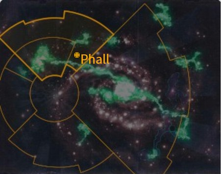

# 0927 法尔星系 Phall System

精校状态：中文行文已逐段精校，部分术语仍为暂定

分类：地理 / 真实空间 Real Space / 朦胧星域 Segmentum Obscurus

原文来源：https://www.bilibili.com/opus/1199623127863132161

原作者：帝国神选罐头

原文时间：2026年05月07日 17:50

[返回分类目录](目录.md) · [全书目录](../../目录.md)

<!-- A0927-B0001 -->
**英文原文**

The Phall System is a System of the Imperium in Segmentum Obscurus.

<!-- /A0927-B0001 -->

<!-- A0927-B0002 -->

原译文

法尔星系是朦胧星域中的帝国星系。

**校订译文**

法尔星系是朦胧星域中的帝国星系。

<!-- /A0927-B0002 -->

<!-- A0927-B0003 图片 -->

<!-- A0927-B0004 -->

原译文

Location of Phall 法尔的地点

**校订译文**

Location of Phall 法尔的位置

<!-- /A0927-B0004 -->

<!-- A0927-B0005 -->
## History 历史

<!-- /A0927-B0005 -->

<!-- A0927-B0006 -->
**英文原文**

Phall became infamous during the Horus Heresy for being the site of a major battle between the Imperial Fists and the Iron Warriors.

<!-- /A0927-B0006 -->

<!-- A0927-B0007 -->

原译文

法尔在荷鲁斯叛乱期间臭名昭著，因为它是帝国之拳和钢铁勇士之间一场重大战斗的地点。

**校订译文**

荷鲁斯之乱期间，帝国之拳与钢铁勇士在法尔展开一场大战，令该星系声名狼藉。

<!-- /A0927-B0007 -->

<!-- A0927-B0008 -->
**英文原文**

Due to the special significance the Phall System held for the Imperial Fists, after their division into Chapters as per the Codex Astartes, the system was the focal point of the secret "Last Wall Protocol". If Terra itself was under dire threat, all of the Imperial Fists successors would meet at Phall to discuss reunifying once more into a Legion with or without the approval of the Senatorum Imperialis. The protocol was enacted during the War of the Beast.

<!-- /A0927-B0008 -->

<!-- A0927-B0009 -->

原译文

由于法尔星系对帝国之拳具有特殊意义，在根据阿斯塔特圣典将其分为战团后，该星系成为秘密“最终高墙协议”的焦点。如果泰拉本身受到严重威胁，所有帝国之拳的子战团都将在法尔会面，讨论在帝国参议院批准或不批准的情况下再次统一为军团。该协议是在野兽战争期间通过的。

**校订译文**

法尔星系对帝国之拳意义特殊。因此，帝国之拳依照《阿斯塔特圣典》拆分为战团后，将法尔定为秘密“最终高墙协议”的集结地点。如果泰拉本身遭到严重威胁，帝国之拳的所有子战团都会前往法尔，共商重组军团，无论是否得到帝国参议院批准。野兽战争期间，这项协议曾被启用。

**校注：** enacted 在此指实际启动最终高墙协议，不是野兽战争时才通过制定。

<!-- /A0927-B0009 -->

<!-- A0927-B0010 -->
## Planets 行星

<!-- /A0927-B0010 -->

<!-- A0927-B0011 -->
**英文原文**

The Phall System consisted of two habitable agri worlds, Phall I and II. Both were recorded as peaceful, loyal to the Imperium, and lightly populated.

<!-- /A0927-B0011 -->

<!-- A0927-B0012 -->

原译文

法尔星系由两个可居住的农业世界组成，法尔一号和二号。两者都被记录为和平、忠于帝国、人口稀少。

**校订译文**

法尔星系由两个可居住的农业世界组成，法尔一号和二号。两者都被记录为和平、忠于帝国、人口稀少。

<!-- /A0927-B0012 -->

本篇核心术语与暂定项

以下列出本篇出现的英文原形及核心术语表用词。同形词可能指不同对象，具体词义以本篇正文和校注为准；单复数、别名和仅见于图注的名称可能尚未列入。完整候选见[术语表](../../术语表/双语术语候选.csv)。

| 英文 | 采用中文 | 状态 |
| --- | --- | --- |
| Horus Heresy | 荷鲁斯之乱 | 官方已核对 |
| Imperium | 帝国 | 暂定·简称 |
| Imperial Fists | 帝国之拳 | 暂定 |
| Iron Warriors | 钢铁勇士 | 暂定·官方待核 |
| Terra | 泰拉 | 暂定·官方待核 |
| Horus | 荷鲁斯 | 暂定·官方待核 |
| Segmentum Obscurus | 朦胧星域 | 暂定·官方待核 |
| Segmentum | 星域 | 暂定·官方待核 |
| Obscurus | 朦胧星 | 暂定·官方待核 |
| Codex Astartes | 阿斯塔特圣典 | 暂定·官方待核 |
| The Beast | 野兽 | 暂定·官方待核 |
| Imperialis | 帝国徽记 | 暂定·官方待核 |
| Last Wall Protocol | 最终高墙协议 | 暂定·官方待核 |
| System | 星系（恒星系统） | 暂定·官方待核 |

