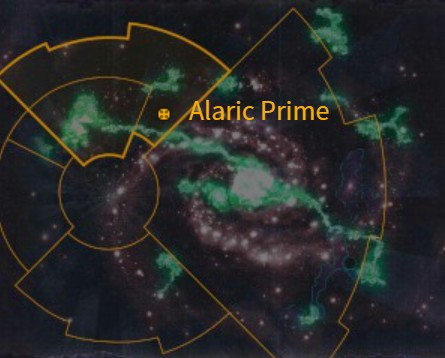
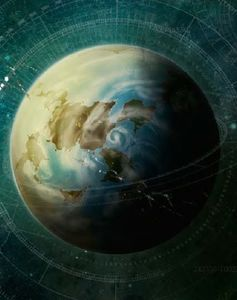

# 0928 阿拉里克主星 Alaric Prime

精校状态：中文行文已逐段精校，部分术语仍为暂定

分类：地理 / 真实空间 Real Space / 朦胧星域 Segmentum Obscurus

原文来源：https://www.bilibili.com/opus/1168755962410958849

原作者：帝国神选罐头

原文时间：2026年02月13日 13:30

[返回分类目录](目录.md) · [全书目录](../../目录.md)

原篇名：阿拉里克一号 Alaric Prime

<!-- A0928-B0001 图片 -->

<!-- A0928-B0002 -->

原译文

Map 地图

**校订译文**

Map 地图

<!-- /A0928-B0002 -->

<!-- A0928-B0003 -->
### Basic Data 基本资料

原题：Basic Data 基础数据

<!-- /A0928-B0003 -->

<!-- A0928-B0004 -->
**英文原文**

Name:Alaric Prime

<!-- /A0928-B0004 -->

<!-- A0928-B0005 -->

原译文

名称：阿拉里克一号

**校订译文**

名称：阿拉里克主星

<!-- /A0928-B0005 -->

<!-- A0928-B0006 -->
**英文原文**

Segmentum:Segmentum Obscurus

<!-- /A0928-B0006 -->

<!-- A0928-B0007 -->

原译文

星域：朦胧星域

**校订译文**

星域：朦胧星域

<!-- /A0928-B0007 -->

<!-- A0928-B0008 -->
**英文原文**

Subsector:Sanctus

<!-- /A0928-B0008 -->

<!-- A0928-B0009 -->

原译文

分区：圣洁分区

**校订译文**

次星区：圣洁次星区

<!-- /A0928-B0009 -->

<!-- A0928-B0010 -->
**英文原文**

Affiliation:Imperium

<!-- /A0928-B0010 -->

<!-- A0928-B0011 -->

原译文

隶属：帝国

**校订译文**

隶属：帝国

<!-- /A0928-B0011 -->

<!-- A0928-B0012 -->
**英文原文**

Class:Knight World

<!-- /A0928-B0012 -->

<!-- A0928-B0013 -->

原译文

类别：骑士世界

**校订译文**

类别：骑士世界

<!-- /A0928-B0013 -->

<!-- A0928-B0014 图片 -->

<!-- A0928-B0015 -->

原译文

Planetary Image 行星图像

**校订译文**

Planetary Image 行星图像

<!-- /A0928-B0015 -->

<!-- A0928-B0016 -->
**英文原文**

Alaric Prime is a Knight World of the Imperium.

<!-- /A0928-B0016 -->

<!-- A0928-B0017 -->

原译文

阿拉里克一号是帝国的骑士世界。

**校订译文**

阿拉里克主星是帝国的骑士世界。

<!-- /A0928-B0017 -->

<!-- A0928-B0018 -->
**英文原文**

The planet of Alaric Prime is as hidebound by tradition and protocol as any other Knight world, yet it also has to bear the further burden of several thousand years of careless lawmaking. No law upon Alaric Prime has ever been repealed. It is illegal to yawn during daylight hours, illegal to talk when a Noble is speaking in earshot, even illegal to point at the stars in the night sky. So numerous and restrictive are the archaic laws of Alaric Prime that a full two-thirds of the planet's populace has been incarcerated or exiled by the over-zealous Justicars attached to each knightly house. Most of Alaric Prime's surface is covered in a viscous sulphuric solution far thicker than seawater. The main continent of Alaric Prime is known as Sacred Isle, each island around it the domain of one of its knightly houses. The islands that form the rest of the habitable lands are little more than penitentiaries. Very few of those imprisoned are truly guilty of malicious conduct, but those that are criminal by nature inevitably thrive in the lawless proto-societies that result.

<!-- /A0928-B0018 -->

<!-- A0928-B0019 -->

原译文

阿拉里克一号行星和其他骑士世界一样，受到传统和协议的束缚，但它也必须承受数千年粗心立法的进一步负担。阿拉里克一号的法律从未被废除。白天打哈欠是违法的，贵族在听得见的地方说话也是违法的，甚至指着夜空中的星星也是违法的。阿拉里克一号的古老法律如此之多，如此之严格，以至于行星上整整三分之二的人口都被附属于每个骑士家族的过分狂热的审判者监禁或流放。阿拉里克一号的大部分表面都覆盖着比海水厚得多的粘稠硫酸溶液。阿拉里克一号的主要大陆被称为神圣岛，其周围的每个岛屿都是其骑士家族的领地之一。构成其余可居住土地的岛屿只不过是监狱。被监禁的人中很少有人真正犯有恶意行为，但那些天生犯罪的人不可避免地会在由此产生的无法无天的原始社会中茁壮成长。

**校订译文**

阿拉里克主星与其他骑士世界一样，受古老传统和礼法束缚，却还额外背负着数千年来草率立法积累的重担。这里从未废除过任何一条法律：白天打哈欠违法；若能听到贵族正在讲话，此时自己开口也违法；甚至用手指向夜空中的星辰都属违法。古老法律既繁多又严苛，各骑士家族所属的执法审判者又狂热执行，以致全星球整整三分之二的人口都曾被监禁或流放。星球大部分表面覆盖着远比海水黏稠的硫酸溶液。主要大陆名为神圣岛，周围各岛分别由骑士家族掌控；其余可居住的岛屿，几乎全是监狱。囚犯中真正犯下恶行的人很少，但那些生性凶恶之徒，却总能在监狱形成的无法无天的原始社群中如鱼得水。

**校注：** Justicars 此处是骑士家族所属的执法人员，暂作执法审判者；不套用灰骑士同名军职或基因窃取者单位名称。原文 far thicker than seawater 指液体更黏稠，不是液层更厚。

<!-- /A0928-B0019 -->

<!-- A0928-B0020 -->
**英文原文**

The planet was the site of a battle between Orks of the Red Waaagh! and the Wolf Lord Ragnar Blackmane's Great Company. Also Krom Dragongaze and his Wolf Guard suffered the painful defeat from the Orks here.

<!-- /A0928-B0020 -->

<!-- A0928-B0021 -->

原译文

这颗行星是欧克的红潮和狼主拉格纳·黑鬃的大连之间战斗的地点。克罗姆·龙瞪和他的野狼守卫也在这里遭受了来自欧克的痛苦失败。

**校订译文**

欧克红潮曾在这颗行星上与狼主拉格纳·黑鬃的大连交战。克罗姆·龙瞪及其野狼守卫也曾在此惨败于欧克。

<!-- /A0928-B0021 -->

<!-- A0928-B0022 -->
## Conflicting sources 来源冲突

<!-- /A0928-B0022 -->

<!-- A0928-B0023 -->
**英文原文**

Codex: Imperial Knights (6th Edition) shows Alaric Prime in the Ultima Segmentum; other sources show Alaric (Planet) at this approximate location.

<!-- /A0928-B0023 -->

<!-- A0928-B0024 -->

原译文

《圣典：帝国骑士》（第6版）中展示了极限星域的阿拉里克一号；其他资料显示，阿拉里克（行星）位于这个大致位置。

**校订译文**

《圣典：帝国骑士》（第 6 版）将阿拉里克主星标在极限星域；其他资料则将名为阿拉里克的行星标在大致相同的位置。

**校注：** 原文主动列出来源冲突：正文的朦胧星域与第6版圣典的极限星域不一致；保留两种记载，不擅自移动星球。

<!-- /A0928-B0024 -->

本篇核心术语与暂定项

以下列出本篇出现的英文原形及核心术语表用词。同形词可能指不同对象，具体词义以本篇正文和校注为准；单复数、别名和仅见于图注的名称可能尚未列入。完整候选见[术语表](../../术语表/双语术语候选.csv)。

| 英文 | 采用中文 | 状态 |
| --- | --- | --- |
| Orks | 欧克蛮人 | 官方已核对 |
| Imperium | 帝国 | 暂定·简称 |
| Waaagh! | Waaagh! | 暂定·保留原文 |
| Segmentum Obscurus | 朦胧星域 | 暂定·官方待核 |
| Ultima Segmentum | 极限星域 | 暂定·官方待核 |
| Segmentum | 星域 | 暂定·官方待核 |
| Subsector | 次星区 | 暂定·官方待核 |
| Alaric Prime | 阿拉里克主星 | 暂定·官方待核 |
| Obscurus | 朦胧星 | 暂定·官方待核 |
| Ragnar Blackmane | 拉格纳·黑鬃 | 官方已核 |
| Krom Dragongaze | 克罗姆·龙瞪 | 暂定·官方待核 |
| Red Waaagh! | 红潮 | 暂定·官方待核 |
| Wolf Guard | 野狼守卫 | 官方词根参考·通称待核 |
| Sanctus | 圣裁者 | 官方已核对 |
| Alaric | 阿拉里克 | 暂定·官方待核 |
| Bear | 熊 | 暂定·官方待核 |
| Knight World | 骑士世界 | 暂定·官方待核 |
| Sacred Isle | 神圣岛 | 暂定·官方待核 |

