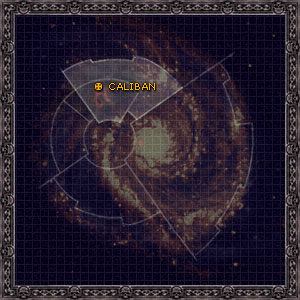
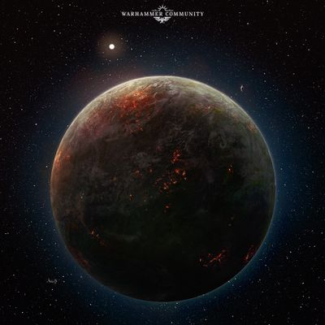
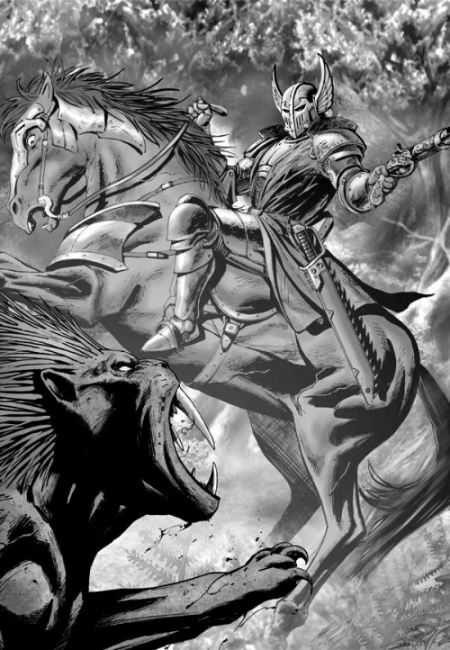

# 0929 卡利班 Caliban

精校状态：中文行文已逐段精校，部分术语仍为暂定

分类：地理 / 真实空间 Real Space / 朦胧星域 Segmentum Obscurus

原文来源：https://www.bilibili.com/opus/1092578193395679239

原作者：帝国神选罐头

原文时间：2025年07月23日 06:41

[返回分类目录](目录.md) · [全书目录](../../目录.md)

<!-- A0929-B0001 -->
### Map 地图

<!-- /A0929-B0001 -->

<!-- A0929-B0002 图片 -->

<!-- A0929-B0003 -->

原译文

Basic Data 基础信息

**校订译文**

Basic Data 基本资料

<!-- /A0929-B0003 -->

<!-- A0929-B0004 -->
**英文原文**

Name:Caliban

<!-- /A0929-B0004 -->

<!-- A0929-B0005 -->

原译文

名称：卡利班

**校订译文**

名称：卡利班

<!-- /A0929-B0005 -->

<!-- A0929-B0006 -->
**英文原文**

Segmentum:Segmentum Obscurus

<!-- /A0929-B0006 -->

<!-- A0929-B0007 -->

原译文

星域：朦胧星域

**校订译文**

星域：朦胧星域

<!-- /A0929-B0007 -->

<!-- A0929-B0008 -->
**英文原文**

Subsector:Caliban Subsector

<!-- /A0929-B0008 -->

<!-- A0929-B0009 -->

原译文

分区：卡利班分区

**校订译文**

次星区：卡利班次星区

<!-- /A0929-B0009 -->

<!-- A0929-B0010 -->
**英文原文**

System:Caliban System

<!-- /A0929-B0010 -->

<!-- A0929-B0011 -->

原译文

星系：卡利班星系

**校订译文**

星系：卡利班星系

<!-- /A0929-B0011 -->

<!-- A0929-B0012 -->
**英文原文**

Population:Millions

<!-- /A0929-B0012 -->

<!-- A0929-B0013 -->

原译文

人口：数百万

**校订译文**

人口：数百万

<!-- /A0929-B0013 -->

<!-- A0929-B0014 -->
**英文原文**

Affiliation:Imperium

<!-- /A0929-B0014 -->

<!-- A0929-B0015 -->

原译文

隶属关系：帝国

**校订译文**

隶属关系：帝国

<!-- /A0929-B0015 -->

<!-- A0929-B0016 -->
**英文原文**

Class:Former Feudal World/Death World/Legion Homeworld, Formerly Destroyed, reformed as Wyrmwood.

<!-- /A0929-B0016 -->

<!-- A0929-B0017 -->

原译文

级别：前封建世界/死亡世界/军团家园世界，从前被摧毁，改为龙林星

**校订译文**

类别：原封建世界／死亡世界／军团母星；曾被摧毁，后重构为龙林星。

<!-- /A0929-B0017 -->

<!-- A0929-B0018 图片 -->

<!-- A0929-B0019 -->

原译文

Planetary Image 星球图片

**校订译文**

Planetary Image 星球图片

<!-- /A0929-B0019 -->

<!-- A0929-B0020 -->
**英文原文**

Caliban was a Death World and the homeworld of the Dark Angels Space Marine Legion. It was a cursed but beautiful planet, being close to the realm of Chaos.

<!-- /A0929-B0020 -->

<!-- A0929-B0021 -->

原译文

卡利班是一个死亡世界，也是黑暗天使星际战士军团的家园世界。这是一个被诅咒但美丽的星球，靠近混沌领域。

**校订译文**

卡利班是一个死亡世界，也是黑暗天使星际战士军团的家园世界。这是一个被诅咒但美丽的星球，靠近混沌领域。

<!-- /A0929-B0021 -->

<!-- A0929-B0022 -->
## History 历史

<!-- /A0929-B0022 -->

<!-- A0929-B0023 -->
### Pre-Imperial History 帝国前历史

<!-- /A0929-B0023 -->

<!-- A0929-B0024 -->
**英文原文**

Unknown to the Dark Angels, long ago the brother to the Tuchulcha engine known as Ouroboros was embedded in Caliban's core. This may have been the original source of the planets warp-taint.

<!-- /A0929-B0024 -->

<!-- A0929-B0025 -->

原译文

黑暗天使不知道，很久以前，被称为衔尾蛇的图丘查引擎的兄弟就嵌入了卡利班的核心。这可能是行星亚空间污染的原始来源。

**校订译文**

黑暗天使并不知晓：很久以前，与图丘查同源、名为“衔尾蛇”的引擎，便已嵌入卡利班核心。它可能正是这颗行星亚空间污染的最初来源。

<!-- /A0929-B0025 -->

<!-- A0929-B0026 -->
**英文原文**

Large portions of Caliban were covered with dense forests, which in turn were inhabited by many dangerous forms of wildlife. The most feared and deadly were the Great Beasts. According to Luther, Caliban possessed a vicious intelligence that extended to its "living" forests and beastly wildlife. This intelligence was in constant conflict with the Human settlers, whom it came to despise.

<!-- /A0929-B0026 -->

<!-- A0929-B0027 -->

原译文

卡利班的大部分地区都覆盖着茂密的森林，而这些森林又居住着许多危险的野生动物。最可怕和最致命的是巨兽。据卢瑟说，卡利班拥有一种恶毒的智慧，这种智慧延伸到了它的“活”森林和野兽般的野生动物。这种生物一直与人类定居者发生冲突，并蔑视他们。

**校订译文**

卡利班大片土地覆盖着茂密森林，其中栖息着诸多危险生物，最令人畏惧、也最致命的便是巨兽。卢瑟声称，卡利班本身具有一种恶毒的意识，延伸到它“活着”的森林与凶残的野生生物之中。这股意识始终与人类定居者对抗，并逐渐憎恶起他们。

<!-- /A0929-B0027 -->

<!-- A0929-B0028 -->
**英文原文**

Isolated from Terra for approximately 5,000, years the people of Caliban lived in a Feudal system. The noble class founded many knightly orders tasked with protecting the population from the hardships and perils that came from living in such a deadly environment. The greatest and most controversial of these orders was known simply as The Order. The Order differed from the other knightly orders in that commoners were also accepted into their ranks. Lion El'Jonson and Luther were both members of The Order and would rise through the ranks together until Jonson eventually became Grand Master. Prior to the Emperor's arrival Jonson and Luther united virtually all the knightly orders in a successful campaign to rid the planet of all the Great Beasts.

<!-- /A0929-B0028 -->

<!-- A0929-B0029 -->

原译文

卡利班人与泰拉隔绝了大约5000年，生活在封建制度中。贵族阶层建立了许多骑士团，其任务是保护民众免受生活在如此致命的环境中所带来的困难和危险。这些骑士团中最伟大、最具争议的被称为秩序。秩序与其他骑士团的不同之处在于，平民也被纳入他们的行列。莱昂·艾尔庄森和卢瑟都是秩序的成员，他们将一起在队伍中崛起，直到庄森最终成为大导师。在帝皇到来之前，庄森和卢瑟几乎团结了所有骑士团，成功地消灭了星球上所有的巨兽。

**校订译文**

卡利班与泰拉隔绝了约五千年，当地人生活在封建制度之下。贵族建立了众多骑士团，保护民众免受险恶环境的威胁。其中最强大、也最受争议的一个，仅以“骑士团”自称。它与其他骑士团不同，也接受平民加入。莱昂·艾尔’庄森与卢瑟都是其成员，两人一路晋升，直到庄森最终成为大导师。帝皇抵达前，庄森与卢瑟几乎联合了所有骑士团，发动清剿，成功消灭了星球上的全部巨兽。

**校注：** The Order 此处是卡利班骑士组织，以“骑士团”为专名沿用326、633相关叙述；不套用第11篇同形的“秩序政权”。

<!-- /A0929-B0029 -->

<!-- A0929-B0030 图片 -->

<!-- A0929-B0031 -->

原译文

Knight of The Order battles a Great Beast of Caliban 秩序的骑士与卡利班巨兽作战

**校订译文**

Knight of The Order battles a Great Beast of Caliban 骑士团成员与卡利班巨兽交战

<!-- /A0929-B0031 -->

<!-- A0929-B0032 -->
**英文原文**

Though not technologically advanced, Calibanites were able to produce rudimentary bolters, chainswords, energy weapons, and even power armour thanks to fragments of STC's that remained on the world.

<!-- /A0929-B0032 -->

<!-- A0929-B0033 -->

原译文

虽然技术并不先进，但由于STC的碎片仍留在世界上，卡利班人能够生产出基本的爆矢枪、链锯剑、能量武器，甚至动力盔甲。

**校订译文**

卡利班科技水平虽不先进，却保留着一些标准建造模板（STC）碎片，足以制造简陋的爆矢枪、链锯剑、能量武器，甚至动力甲。

<!-- /A0929-B0033 -->

<!-- A0929-B0034 -->
**英文原文**

Caliban was home to dozens of languages commonly known as Calibanite, which would later be codified by imperial census takers as Lingua Mortis.

<!-- /A0929-B0034 -->

<!-- A0929-B0035 -->

原译文

卡利班是数十种语言的发源地，通常被称为卡利班语，后来被帝国人口普查员编纂为莫提斯语。

**校订译文**

卡利班存在数十种语言，统称卡利班诸语。帝国普查人员后来将它们编定为“死亡之语”。

<!-- /A0929-B0035 -->

<!-- A0929-B0036 -->
### The Great Crusade 大远征

<!-- /A0929-B0036 -->

<!-- A0929-B0037 -->
**英文原文**

The coming of the Emperor brought much change to Caliban. Jonson disbanded the knightly orders and eventually joined the Great Crusade at the head of his legion. Vast swathes of the planet were cleared. Mines were dug and huge manufactories were built to provide for the Legion and the Emperor's Crusade. Gone were the villages and towns and in their place vast structures called arcologies were built to house the population. Much of the nobility lost their peasant farmers, and disenfranchised they turned to rebellion.

<!-- /A0929-B0037 -->

<!-- A0929-B0038 -->

原译文

帝皇的到来给卡利班带来了很大的变化。庄森解散了骑士团，最终以军团长的身份加入了大远征。行星上大片地区被清理干净。挖掘了矿山，建造了巨大的铸造厂，为军团和帝皇的远征提供物资。村庄和城镇消失了，取而代之的是建造了被称为生态建筑的巨大建筑来容纳人口。许多贵族失去了他们的农民，被剥夺了权利，他们转向了叛乱。

**校订译文**

帝皇的到来彻底改变了卡利班。庄森解散各骑士团，最终率自己的军团加入大远征。星球大片森林被清除，矿井与巨型制造厂拔地而起，为军团和帝皇的远征供应物资。村镇消失，取而代之的是容纳居民的庞大生态建筑。许多贵族失去了依附自己的农民，又被剥夺权力，因而转向叛乱。

<!-- /A0929-B0038 -->

<!-- A0929-B0039 -->
**英文原文**

Meanwhile, Luther and a large portion of the Dark Angels returned to Caliban after a falling out with The Lion during the Sarosh campaign. Bitter, jealous, and feeling abandoned, Luther had to deal with an increasingly violent rebellion by the anti-Imperial nobility. Unbeknownst to the Dark Angels, there were also Chaos-affiliated Cultists and Sorcerers who had infiltrated Administratum staff disrupting the status quo on Caliban.

<!-- /A0929-B0039 -->

<!-- A0929-B0040 -->

原译文

与此同时，卢瑟和大部分黑暗天使在萨罗什战役中与莱昂发生争执后回到了卡利班。痛苦、嫉妒和被抛弃的感觉，卢瑟不得不应对反帝国贵族日益暴力的叛乱。黑暗天使不知道的是，还有与混沌有关的教派和巫师渗透到了行政部门的工作人员中，扰乱了卡利班的现状。

**校订译文**

与此同时，卢瑟在萨罗什战役期间与雄狮失和，随后与大批黑暗天使一同返回卡利班。他满怀怨恨、嫉妒与被抛弃的痛苦，还不得不应对反帝国贵族愈演愈烈的暴乱。黑暗天使不知道的是，混沌邪教徒与巫师也已渗透进内政部工作人员之中，暗中搅乱卡利班的局势。

<!-- /A0929-B0040 -->

<!-- A0929-B0041 -->
**英文原文**

During the Great Crusade, Caliban would serve as one of the two large outposts held by the Legion which saw the largest concentration of the Legion’s infrastructure, in the case of Caliban this was centered around the Fortress of The Order. The standard pattern of operations within the Legion saw it used as a base for resupply for a force that was primarily based within the mobile halls of the fleet. Only on the rarest of occasions did any of the Chapters of the Dark Angels return to their halls for any lengthy period of rest, with garrison duty left to the rawest recruits and those masters and seneschals with Deathwing lifeguard cadres that stood warden over it’s domain. The world was considered heavily fortified and defended.

<!-- /A0929-B0041 -->

<!-- A0929-B0042 -->

原译文

在大远征期间，卡利班成为军团拥有的两个大型前哨之一，是军团基础设施最集中的地方，就卡利班而言，它以骑士团要塞为中心。根据军团内部的标准作战模式，它被用作主要驻扎在舰队机动大厅内的部队的补给基地。只有在极少数情况下，黑暗天使的任何一个战团才会回到他们的大厅进行长时间的休息，驻军任务留给最初始的新兵和那些拥有死翼救援队干部的导师和总管，他们在自己的领地上担任守卫。这个世界被认为戒备森严。

**校订译文**

大远征期间，卡利班是军团两处大型据点之一，集中了大量基础设施，主要围绕骑士团要塞展开。按照军团的惯常行动方式，它为以机动舰队为家的主力部队提供补给。黑暗天使各战团极少返回据点长期休整。驻防职责通常由最稚嫩的新兵，以及率领死翼贴身卫队的导师和总管承担。这颗世界设防严密，守备森严。

<!-- /A0929-B0042 -->

<!-- A0929-B0043 -->
**英文原文**

The world also held sealed vaults containing large stocks of the Legion’s proscribed weaponry, including such types as life annihilating Gene-Phages, planet destroying Magna-Torpedos and the dreaded nanite scourge of the Silica-virae.

<!-- /A0929-B0043 -->

<!-- A0929-B0044 -->

原译文

世界各地还保存着密封的秘库，里面存放着大量军团被禁止使用的武器，包括毁灭生命的基因噬菌体、毁灭星球的巨型鱼雷和可怕的硅基病毒的纳米虫天灾。

**校订译文**

星球上还设有密封秘库，储存着军团的大量禁忌武器，包括灭绝生命的基因噬体、能够摧毁行星的巨型鱼雷，以及令人恐惧的硅基病毒纳米灾疫。

**校注：** Gene-Phages 沿326作基因噬体；英文未限为只感染细菌的噬菌体，不将其生物学作用范围缩窄。

<!-- /A0929-B0044 -->

<!-- A0929-B0045 -->
**英文原文**

The Calibanite Jaegers Solar Auxilia Regiments were mustered from Caliban.

<!-- /A0929-B0045 -->

<!-- A0929-B0046 -->

原译文

卡利班贼鸥太阳辅助军从卡利班集结。

**校订译文**

太阳辅助军的卡利班猎兵团也在此征募组建。

**校注：** Jaegers 在兵团名称中按猎兵理解；原贼鸥把该词另一种鸟类词义误套入军队。

<!-- /A0929-B0046 -->

<!-- A0929-B0047 -->
### Heresy 荷鲁斯之乱

原题：Heresy 叛乱

<!-- /A0929-B0047 -->

<!-- A0929-B0048 -->
**英文原文**

By the middle stages of the Horus Heresy the Terran cultists had been eradicated on Caliban, but Luther and his loyalists (most notably Lord Cypher, Astelan, and Zahariel) had gained a firm hold on the planet. Luther intended to proclaim Caliban independent from both the Warmaster and Imperium, but was plagued by the schemes and politicking. After the death of Belath Luther openly declared independence from Caliban and oversaw a purge of loyalist elements.

<!-- /A0929-B0048 -->

<!-- A0929-B0049 -->

原译文

到荷鲁斯叛乱中期，泰拉裔在卡利班被根除，但卢瑟和他的忠诚者（最著名的是塞弗领主、阿斯特兰和扎哈瑞尔）在这个行星上站稳了脚跟。卢瑟打算宣布卡利班独立于战帅和帝国，但受到计划和政治的困扰。贝拉斯死后，卢瑟公开宣布卡利班独立，并监督了对忠诚分子的清洗。

**校订译文**

荷鲁斯之乱中期，卡利班上的泰拉邪教徒已被肃清，卢瑟及其忠实追随者——尤其是塞弗领主、阿斯特兰与扎哈瑞尔——牢牢掌控了星球。卢瑟想让卡利班脱离战帅与帝国双方、宣布独立，却一直困于阴谋和政治倾轧。贝拉斯死后，他公开宣告独立，并主持清洗忠于帝国的力量。

**校注：** Terran cultists 指泰拉邪教徒，原译省略 cultists 后变成所有泰拉裔均被根除，已纠正。英文 independence from Caliban 与前句宣布卡利班脱离双方的叙述不合，正文按明确上下文处理为宣布独立，并在此保留该英文疑点。

<!-- /A0929-B0049 -->

<!-- A0929-B0050 -->
### Destruction 毁灭

<!-- /A0929-B0050 -->

<!-- A0929-B0051 -->
**英文原文**

When Jonson returned from the Horus Heresy, a withering salvo of fire knocked ships out of orbit. Over many decades Luther had corrupted the remaining legion on Caliban. Jonson was furious and moved his ships back into orbit, bombarding the planet. Eventually, Jonson ordered the invasion and the loyal Dark Angels landed across the planet. The corrupt Dark Angels took hold in the Order's monastery, and Luther and Jonson faced off. The ancient home was reduced to rubble and the planet was flattened.

<!-- /A0929-B0051 -->

<!-- A0929-B0052 -->

原译文

当庄森从荷鲁斯叛乱返回时，一发猛烈的炮火将战舰轰出轨道。几十年来，卢瑟腐化了卡利班上剩下的军团。庄森怒不可遏，将他的飞船调回轨道，轰炸了这颗行星。最终，庄森下令入侵，忠诚的黑暗天使降落在行星上。腐化的黑暗天使占据了骑士团的修道院，卢瑟和庄森对峙。这座古老的家园变成了瓦砾，星球被夷为平地。

**校订译文**

庄森从荷鲁斯之乱的战场返回时，迎接舰队的却是一轮猛烈齐射，将舰船轰离轨道。数十年间，卢瑟已腐化了留守卡利班的军团部队。庄森怒不可遏，命舰队重返轨道，轰击星球；随后又下令登陆，忠诚的黑暗天使在各地展开进攻。叛变的黑暗天使固守骑士团修道院，卢瑟与庄森最终正面交锋。古老的家园化为瓦砾，星球表面被夷平。

<!-- /A0929-B0052 -->

<!-- A0929-B0053 -->
**英文原文**

Eventually, due to the bombardment, the planet's crust began to shift and crack. Around the planet, the warp shifted as the dark powers realised they had failed again and a warp storm spewed forth around the planet. A swirling vortex of warp power was created around Caliban and it eventually broke apart, being pulled into the warp. Only an asteroid with the ruins of the Fortress Monastery remained. Luther was said to be found, but Jonson was nowhere to be seen. It is said that he was taken by the Watchers in the Dark.

<!-- /A0929-B0053 -->

<!-- A0929-B0054 -->

原译文

最终，由于轰炸，行星的地壳开始移动并破裂。在行星周围，随着黑暗势力意识到他们再次失败，亚空间发生了变化，一场亚空间风暴在行星周围喷涌而出。卡利班周围形成了一个旋转的亚空间漩涡，最终它被卷入亚空间。只剩下一颗小行星和堡垒修道院的废墟。据说卢瑟被找到了，但庄森却无处可寻。据说他被黑暗守望者带走了。

**校订译文**

持续轰炸最终使行星地壳移位、开裂。黑暗诸神意识到自己再次失败，周围的亚空间随之剧烈涌动，风暴将卡利班包围。亚空间能量形成旋转漩涡，星球终于四分五裂，被拖入其中。残留下来的，只有承载要塞修道院废墟的一块小行星残片。据说人们找到了卢瑟，庄森却踪影全无；另有说法称，他被黑暗守望者带走了。

<!-- /A0929-B0054 -->

<!-- A0929-B0055 -->
### Wyrmwood 龙林星

<!-- /A0929-B0055 -->

<!-- A0929-B0056 -->
**英文原文**

Ten millennia later, Vashtorr the Arkifane corrupted the ruins of Caliban with his techno-sorcery, transforming it into a mobile planetoid dubbed Wyrmwood. A planetoid of roiling Warp madness and infernal Daemonic industry, Wyrmwood was heavily garrisoned by the Cult of the Arkifane and Vashtorr's other allies. At its heart was a core sub-dimension from which Vashtorr assembled the other components of the Dissonance Engine: Ouroboros, Plagueheart, and eventually the Tuchulcha.

<!-- /A0929-B0056 -->

<!-- A0929-B0057 -->

原译文

一万年后，造物者瓦什托尔用他的科技魔法破坏了卡利班的废墟，将其变成了一个名为龙林星的移动小行星。龙林星是一个充满亚空间疯狂和炼狱恶魔工业的小行星，被造物者教派和瓦什托尔的其他盟友严密监视。其核心是一个核心子维度，瓦什托尔从中组装了不协引擎的其他组件：衔尾蛇、瘟疫之心，最后是图丘查。

**校订译文**

一万年后，造物者瓦什托尔以科技巫术腐化卡利班残骸，将其改造成能够移动的小型天体“龙林星”。那里翻涌着亚空间的疯狂，也遍布炼狱般的恶魔工业设施。造物者教派与瓦什托尔的盟友派重兵驻守，核心处则藏着一重子维度。瓦什托尔在其中组装不协引擎的组件：衔尾蛇、瘟疫之心，以及最后取得的图丘查。

<!-- /A0929-B0057 -->

<!-- A0929-B0058 -->
**英文原文**

During the Battle of Idolatros during the Arks of Omen Campaign, Wyrmwood was redirected into the Somnium Stars and used as the center of Vashtorr's plan to acquire the Tuchulcha from The Rock. The Dark Angels took the bait, and though Wyrmwood was boarded by the Unforgiven and heavily damaged Vashtorr succeeded in acquiring the last fragment of The Key he required. With the Dissonance Engine complete, Wyrmwood ascended to a level not even The Rock could harm and used its power to bore a tunnel into the reality between the Materium and Warp much like the Webway. Aboard the Wyrmwood, Vashtorr plunged the planetoid into the abyss he created in search of The Lock. The corrupted hulk next appeared at Vashtorr's command during the Pariah Crusade.

<!-- /A0929-B0058 -->

<!-- A0929-B0059 -->

原译文

在噩兆方舟战役期间的盲信星之战中，龙林星被重新引导到幻梦星，并被用作瓦什托尔从巨石中获得图丘查的计划的中心。黑暗天使上钩了，尽管龙林星被不可饶恕者且严重损害，但瓦什托尔登上了巨石，成功地获得了他所需要的最后一块钥匙。随着不协引擎的完成，龙林星升格到了一个连巨石都无法伤害其的水平，并利用它的力量在物质界和亚空间之间钻了一条隧道，就像网道一样。在龙林星上，瓦什托尔将小行星坠入他为寻找锁而创造的深渊。在遗弃者远征期间，这个腐化的废墟随后出现在瓦斯托尔的指挥下。

**校订译文**

噩兆方舟战役的盲信星之战中，瓦什托尔将龙林星移入幻梦群星，以此为诱饵，谋取巨石内的图丘查。黑暗天使果然上钩。戴罪者登陆龙林星并造成重创，却仍未阻止瓦什托尔取得所需的最后一块钥匙碎片。不协引擎组装完成后，龙林星升格为连巨石也无法伤害的存在。它运用自身力量，在物质界与亚空间之间凿出一条类似网道的通路。瓦什托尔身在龙林星上，驱使整颗天体冲入自己开辟的深渊，寻找“锁”。后来，这座腐化的庞然巨物又奉他之命，在被遗弃者远征期间现身。

**校注：** 原译添加了瓦什托尔此时登上巨石的动作，本句英文仅称其夺得最后碎片，故去掉添加。重组后的龙林星实际过程见843。

<!-- /A0929-B0059 -->

<!-- A0929-B0060 -->
## Geography 地理

<!-- /A0929-B0060 -->

<!-- A0929-B0061 -->
**英文原文**

Caliban is remembered for its forests, but it was more than simply covered with trees. Soaring mountain ranges touched the clouds, cut by deep valleys never reached by light of day. Kilometre-wide rivers twisted across the landscape like foaming serpents, sometimes narrowing to torrents so swift it would break a man’s bones to dare them, other times forming lakes so vast that their opposite shores were unknown to each other.

<!-- /A0929-B0061 -->

<!-- A0929-B0062 -->

原译文

卡利班以其森林而闻名，但它不仅仅是被树木覆盖着。高耸的山脉触及云层，被日光永远无法触及的深谷所切割。一公里宽的河流像发泡的蛇一样蜿蜒穿过风景，有时会变窄成湍急的洪流，让人不敢去挑战它们，有时会形成巨大的湖泊，以至于它们的对岸彼此都不相识。

**校订译文**

人们因森林而记住卡利班，但这颗星球绝非只有树木。高耸的山脉直抵云端，其间切入深不见日的峡谷。宽达一公里的河流如翻腾白沫的巨蛇，蜿蜒穿过大地；有时收窄为湍急的激流，足以将冒险涉入者撞得骨折，有时又汇成浩瀚湖泊，两岸遥遥相隔，互不可见。

<!-- /A0929-B0062 -->

<!-- A0929-B0063 -->
**英文原文**

It was a planet of dangerous moods too, a land that refused to be tamed by human hands. Storms would swell within Caliban’s mountains and tumble down to the lowlands, bringing wind and rain so ferocious they would sweep away all but the oldest trees and sturdiest walls. Spring floods swallowed whole towns. Tremors in the ground would open chasms in minutes, devouring buildings that had stood for centuries. Blizzards would bury forts and their defenders.

<!-- /A0929-B0063 -->

<!-- A0929-B0064 -->

原译文

这也是一个充满危险氛围的星球，一片拒绝被人类征服的土地。风暴会在卡利班的山脉内膨胀，并倾泻到低地，带来如此凶猛的风雨，除了最古老的树木和最坚固的墙壁外，它们会冲走所有的东西。春季洪水淹没了整个城镇。地面的震动会在几分钟内打开裂隙，吞噬已经屹立了几个世纪的建筑。暴风雪会掩埋堡垒及其防御者。

**校订译文**

卡利班的脾性同样危险，始终不肯为人类驯服。风暴在山中酝酿，再奔涌至低地，猛烈的风雨卷走一切，唯有最古老的树木和最坚固的墙壁能够幸存。春汛吞没整座城镇；地震可在几分钟内撕开深渊，吞噬屹立数百年的建筑；暴风雪则连堡垒与守军一起掩埋。

<!-- /A0929-B0064 -->

<!-- A0929-B0065 -->
### Beasts 野兽

<!-- /A0929-B0065 -->

<!-- A0929-B0066 -->
**英文原文**

The deadly creatures that populated Caliban's forests and wilds, known as the Great Beasts or simply the beasts, plagued the people of Caliban for centuries, killing many and forcing the populace to be ever wary of the forests, until Lion El'Jonson and the Order launched their campaign of extermination. Each great beast was said to be completely unique, a species within itself. There also existed the possibility that they were spawned from the warp.

<!-- /A0929-B0066 -->

<!-- A0929-B0067 -->

原译文

居住在卡利班森林和荒野中的致命生物，被称为巨兽或简称为野兽，几个世纪以来一直困扰着卡利班人民，杀死了许多人，迫使民众对森林保持警惕，直到莱昂·艾尔庄森和骑士团发动了灭绝战役。据说每种巨兽都是独一无二的，都是一个物种。也有可能它们是由亚空间产生的。

**校订译文**

卡利班森林与荒野中那些致命的生物，被称为“巨兽”，或简称“野兽”。它们肆虐了数百年，杀死无数居民，使人们始终提防森林，直到莱昂·艾尔’庄森与骑士团发动灭绝战役。据说，每一头巨兽都独一无二，单独构成一个物种；它们也可能诞生于亚空间。

<!-- /A0929-B0067 -->

<!-- A0929-B0068 -->
**英文原文**

This seems to be backed up by Zahariel's journey into the Northwilds and the unseemly intelligence and cruelty displayed by the beasts. All of them were lethal in their own way and slaying one would mark a supplicant's acceptance as a full knight into the Order.

<!-- /A0929-B0068 -->

<!-- A0929-B0069 -->

原译文

这似乎得到了扎哈瑞尔进入北方荒野的旅程以及野兽所表现出的不体面的智慧和残忍的支持。他们都以自己的方式致命，杀死一个人将标志着恳求者接受成为骑士团的正式骑士。

**校订译文**

扎哈瑞尔深入北方荒野的经历，以及巨兽展现出的异乎寻常的智慧与残忍，似乎支持它们来自亚空间的推测。每一头巨兽都有自己的致命之处。斩杀一头，便是申请者获准成为骑士团正式骑士的标志。

**校注：** slaying one 的 one 指巨兽，不是杀死一个人；supplicant 是申请加入骑士团者。

<!-- /A0929-B0069 -->

<!-- A0929-B0070 -->
### Locations 地点

<!-- /A0929-B0070 -->

<!-- A0929-B0071 -->
**英文原文**

Aldurukh: The fortress and central headquarters of The Order. It began as a simple cave that a great forgotten warrior used to fortify himself and others from the Beasts of Caliban, evolving over time. By the end of the Great Crusade, a developed city had been built around it.

<!-- /A0929-B0071 -->

<!-- A0929-B0072 -->

原译文

阿尔德鲁克：骑士团的堡垒和中央总部。它最初是一个简单的洞穴，一位被遗忘的伟大战士用它来防御卡利班野兽，随着时间的推移而演变。到远征结束时，一座发达的城市已经围绕着它建立起来。

**校订译文**

阿尔杜鲁赫要塞：骑士团的堡垒与总部。它最初只是一个山洞，一位姓名早已被遗忘的伟大战士利用它保护自己和其他人，抵御卡利班巨兽。要塞逐渐扩建；到大远征末期，周围已发展出一座繁荣城市。

**校注：** 沿1567 Aldurukh 阿尔杜鲁赫山的词根，本段明确指山洞发展而来的堡垒，译阿尔杜鲁赫要塞；原阿尔德鲁克留对照。

<!-- /A0929-B0072 -->

<!-- A0929-B0073 -->
**英文原文**

Stormhold: A city of 4 million people, the 3rd largest on Caliban.

<!-- /A0929-B0073 -->

<!-- A0929-B0074 -->

原译文

风暴据点：一座拥有400万人口的城市，是卡利班上第三大城市。

**校订译文**

风暴据点：拥有四百万人口的城市，规模居卡利班第三。

<!-- /A0929-B0074 -->

<!-- A0929-B0075 -->
**英文原文**

Dordred Heath - Part of the settlement of Storrock. Area where Luther grew up, fighting the Great Beasts.

<!-- /A0929-B0075 -->

<!-- A0929-B0076 -->

原译文

多德雷德荒原 - 斯托洛克定居点的一部分。卢瑟长大的地方，与巨兽作战。

**校订译文**

多德雷德荒原——斯托洛克聚居地的一部分。卢瑟在此长大，并与巨兽作战。

<!-- /A0929-B0076 -->

<!-- A0929-B0077 -->
## Trivia 琐事

<!-- /A0929-B0077 -->

<!-- A0929-B0078 -->
**英文原文**

Caliban is the name of a character in Shakespeare's "The Tempest". The character Caliban grows up alone, the only human on an island. This, combined with his ancestry (the son of a witch and a daemon), results in his wild and dangerous nature. Caliban is civilised by the arrival of a great sorcerer, but eventually grows resentful of his master and seeks to rebel under a new leader. In the end, however, he remains a servant of his first master. His character arc is notably similar to that of Lion El'Jonson.

<!-- /A0929-B0078 -->

<!-- A0929-B0079 -->

原译文

卡利班是莎士比亚“暴风雨”中一个角色的名字。角色卡利班独自长大，是岛上唯一的人。再加上他的祖先（一个女巫和一个恶魔的儿子），导致了他狂野而危险的天性。卡利班因一位伟大的巫师的到来而变得文明，但最终他对他的主人越来越不满，并试图在新领导人的领导下反抗。然而，最终他仍然是他的第一个主人的仆人。他的性格弧线与莱昂·艾尔庄森非常相似。

**校订译文**

卡利班也是莎士比亚《暴风雨》中的人物名。按本段介绍，这个角色独自长大，是岛上唯一的人；他又是女巫与恶魔之子，因而形成了狂野而危险的天性。一位伟大巫师抵达后教化了他，但他逐渐憎恨主人，企图追随新的领袖反叛，最终却仍是原主人的仆人。本文认为，这段人物经历与莱昂·艾尔’庄森颇为相似。

**校注：** 本节为英文底稿对莎士比亚人物经历及与庄森相似之处的评论，按原文保留并归于本文观点，不据此更改战锤人物实际经历。

<!-- /A0929-B0079 -->

<!-- A0929-B0080 -->
**英文原文**

The alternate spelling "Calibaun" is a Romany word for "black," the original colour of the Dark Angels' armour.

<!-- /A0929-B0080 -->

<!-- A0929-B0081 -->

原译文

另一种拼写“Calibaun”是一个吉普赛语单词，意为“黑色”，是黑暗天使盔甲的初始颜色。

**校订译文**

另一种拼写“Calibaun”据本段所述，是罗姆语中意为“黑色”的词，呼应黑暗天使动力甲最初的颜色。

**校注：** 词源说法来自原英文，未据语言学辞书独立核证；保留为本篇所述。

<!-- /A0929-B0081 -->

本篇核心术语与暂定项

以下列出本篇出现的英文原形及核心术语表用词。同形词可能指不同对象，具体词义以本篇正文和校注为准；单复数、别名和仅见于图注的名称可能尚未列入。完整候选见[术语表](../../术语表/双语术语候选.csv)。

| 英文 | 采用中文 | 状态 |
| --- | --- | --- |
| Dark Angels | 黑暗天使 | 官方已核对 |
| Horus Heresy | 荷鲁斯之乱 | 官方已核对 |
| Warp | 亚空间 | 官方已核对 |
| Imperium | 帝国 | 暂定·简称 |
| Webway | 网道 | 暂定 |
| Sorcerer | 巫师 | 官方已核对 |
| Administratum | 内政部 | 暂定 |
| Emperor | 帝皇 | 官方已核对 |
| The Order | 秩序 | 暂定·官方待核 |
| Great Crusade | 大远征 | 暂定·官方待核 |
| Terra | 泰拉 | 暂定·官方待核 |
| Horus | 荷鲁斯 | 暂定·官方待核 |
| STC | 标准建造模板 | 暂定·官方待核 |
| Lion El'Jonson | 莱昂·艾尔’庄森 | 官方已核对 |
| Solar Auxilia | 太阳辅助军 | 暂定·官方待核 |
| Segmentum Obscurus | 朦胧星域 | 暂定·官方待核 |
| Segmentum | 星域 | 暂定·官方待核 |
| Subsector | 次星区 | 暂定·官方待核 |
| Realm of Chaos | 混沌领域 | 暂定·官方待核 |
| Great Sorcerer | 大巫师 | 暂定·官方待核 |
| Caliban | 卡利班 | 暂定·官方待核 |
| Obscurus | 朦胧星 | 暂定·官方待核 |
| Pariah | 贱民 | 暂定·官方待核 |
| Master | 导师（审判庭职衔）／舰务官（舰员职务） | 语境定译·官方待核 |
| Unforgiven | 戴罪者 | 暂定·官方待核 |
| Ancient | 旗手 | 官方已核对 |
| First Master | 首席舰务官（舰员职务）／第一大师（极限战士职衔） | 语境定译·官方待核 |
| Space Marine Legion | 星际战士军团 | 暂定·官方待核 |
| Astelan | 阿斯特兰 | 暂定·官方待核 |
| Power Armour | 动力盔甲 | 暂定·官方待核 |
| Space Marine | 星际战士 | 暂定·官方待核 |
| Brother | 修士 | 暂定·官方待核 |
| Powers | 能天使 | 暂定·官方待核 |
| Lingua Mortis | 死亡之语 | 暂定·官方待核 |
| Silica-virae | 硅基病毒 | 暂定·官方待核 |
| Cypher | 塞弗 | 官方已核对 |
| Calibanite | 卡利班诸语 | 暂定·官方待核 |
| Vashtorr the Arkifane | 造物者瓦什托尔 | 官方已核对 |
| Ouroboros | 乌洛波洛斯 | 暂定·官方待核 |
| Pariah Crusade | 被遗弃者远征 | 暂定·官方待核 |
| Grand Master | 大导师 | 暂定·官方待核 |
| Tuchulcha | 图丘查 | 暂定·官方待核 |
| Zahariel | 扎哈瑞尔 | 暂定·官方待核 |
| The Key | 钥匙 | 暂定·官方待核 |
| The Lock | 锁 | 暂定·官方待核 |
| The Dark | 《黑暗》 | 暂定·官方待核 |
| Warp Storm | 亚空间风暴 | 暂定·官方待核 |
| System | 星系（恒星系统） | 暂定·官方待核 |
| Death World | 死亡世界 | 暂定·官方待核 |
| Feudal World | 封建世界 | 暂定·官方待核 |
| Omen | 预兆号 | 暂定·官方待核 |
| Touched | 受触者 | 暂定·官方待核 |
| Wyrmwood | 龙林星 | 暂定·官方待核 |
| Cult of the Arkifane | 造物者教派 | 暂定·官方待核 |
| Somnium Stars | 幻梦群星 | 暂定·官方待核 |
| Plagueheart | 瘟疫之心 | 暂定·官方待核 |
| Dissonance Engine | 不协引擎 | 暂定·官方待核 |
| Calibanite Jaegers | 卡利班猎兵团 | 暂定·官方待核 |
| Gene-Phages | 基因噬体 | 暂定·官方待核 |
| Stormhold | 风暴据点 | 暂定·官方待核 |
| Dordred Heath | 多德雷德荒原 | 暂定·官方待核 |
| Storrock | 斯托洛克 | 暂定·官方待核 |
| Aldurukh | 阿尔杜鲁赫山 | 暂定·官方待核 |

