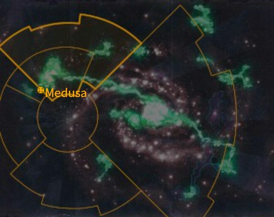
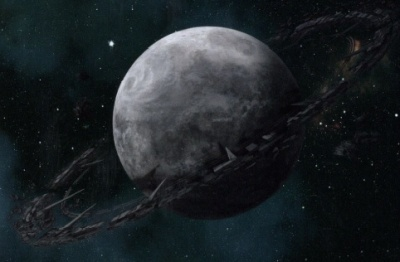

# 0930 美杜莎四号 Medusa IV

精校状态：中文行文已逐段精校，部分术语仍为暂定

分类：地理 / 真实空间 Real Space / 朦胧星域 Segmentum Obscurus

原文来源：https://www.bilibili.com/opus/1098188820829962275

原作者：帝国神选罐头

原文时间：2025年08月07日 09:33

[返回分类目录](目录.md) · [全书目录](../../目录.md)

<!-- A0930-B0001 图片 -->

<!-- A0930-B0002 -->

原译文

Map 地图

**校订译文**

Map 地图

<!-- /A0930-B0002 -->

<!-- A0930-B0003 -->
### Basic Data 基本资料

原题：Basic Data 基础信息

<!-- /A0930-B0003 -->

<!-- A0930-B0004 -->
**英文原文**

Name:Medusa IV

<!-- /A0930-B0004 -->

<!-- A0930-B0005 -->

原译文

名称：美杜莎

**校订译文**

名称：美杜莎四号

<!-- /A0930-B0005 -->

<!-- A0930-B0006 -->
**英文原文**

Segmentum:Segmentum Obscurus

<!-- /A0930-B0006 -->

<!-- A0930-B0007 -->

原译文

星域：朦胧星域

**校订译文**

星域：朦胧星域

<!-- /A0930-B0007 -->

<!-- A0930-B0008 -->
**英文原文**

Subsector:Medusan Sub-sector

<!-- /A0930-B0008 -->

<!-- A0930-B0009 -->

原译文

分区：美杜莎分区

**校订译文**

次星区：美杜莎次星区

<!-- /A0930-B0009 -->

<!-- A0930-B0010 -->
**英文原文**

System:Sthenelus System

<!-- /A0930-B0010 -->

<!-- A0930-B0011 -->

原译文

星系：斯忒涅洛斯星系

**校订译文**

星系：斯忒涅洛斯星系

<!-- /A0930-B0011 -->

<!-- A0930-B0012 -->
**英文原文**

Population:500,000 approx.

<!-- /A0930-B0012 -->

<!-- A0930-B0013 -->

原译文

人口：大约50,0000

**校订译文**

人口：约 50 万

<!-- /A0930-B0013 -->

<!-- A0930-B0014 -->
**英文原文**

Affiliation:Imperium

<!-- /A0930-B0014 -->

<!-- A0930-B0015 -->

原译文

隶属：帝国

**校订译文**

隶属：帝国

<!-- /A0930-B0015 -->

<!-- A0930-B0016 -->
**英文原文**

Class:Adeptus Astartes Homeworld, Waste World, unofficially a Death World

<!-- /A0930-B0016 -->

<!-- A0930-B0017 -->

原译文

级别：阿斯塔特修会家园世界，废弃世界，非正式的死亡世界

**校订译文**

类别：星际战士母星、荒废世界；虽无正式分类，实质上也是死亡世界。

<!-- /A0930-B0017 -->

<!-- A0930-B0018 -->
**英文原文**

Tithe Grade:Adeptus Non, post-industrial resource null as a Waste World

<!-- /A0930-B0018 -->

<!-- A0930-B0019 -->

原译文

什一税等级：特级免税，后工业时代的无资源废弃世界

**校订译文**

什一税等级：特级免税；作为工业资源已耗尽的荒废世界，资源产出记为无。

<!-- /A0930-B0019 -->

<!-- A0930-B0020 图片 -->

<!-- A0930-B0021 -->

原译文

Planetary Image 行星图像

**校订译文**

Planetary Image 行星图像

<!-- /A0930-B0021 -->

<!-- A0930-B0022 -->
**英文原文**

Medusa IV, commonly referred to as Medusa, is the Homeworld of the Iron Hands Space Marine Chapter.

<!-- /A0930-B0022 -->

<!-- A0930-B0023 -->

原译文

美杜莎四号，通常被称为美杜莎，是钢铁之手星际战士战团的家园世界。

**校订译文**

美杜莎四号，通常被称为美杜莎，是钢铁之手星际战士战团的家园世界。

<!-- /A0930-B0023 -->

<!-- A0930-B0024 -->
## Overview 概述

<!-- /A0930-B0024 -->

<!-- A0930-B0025 -->
**英文原文**

Medusa is a Waste World, that is a harsh realm of perpetual gloom, located extremely close to the Eye of Terror. With a dark and polluted sky, Medusa's sun rarely shines on the planet's surface and the world's geology is highly unstable, with earthquakes and volcanic eruptions constantly creating and destroying mountain ranges and seas. The people of Medusa are hardy and flourish despite the hostile environment. The population is broken up into clans who viciously compete and vie for natural resources and safe ground, as the unpredictable nature of Medusa's landscape means little can built in one place for long, save a few areas of relative calm which are mostly reserved for the Iron Hands Chapter. As the nomadic clans seek a new settlement, great caterpillar-like mining haulers carry their personal possessions and resources. It is because of its harsh environment that Medusa is considered to be a Death World, in all but name.

<!-- /A0930-B0025 -->

<!-- A0930-B0026 -->

原译文

美杜莎是一个废弃世界，这是一个永远黑暗的严酷领域，离恐惧之眼非常近。由于黑暗和污染的天空，美杜莎的太阳很少照射到行星表面，世界的地质非常不稳定，地震和火山爆发不断创造和破坏山脉和海洋。尽管环境恶劣，美杜莎人坚韧不拔，茁壮成长。由于美杜莎地貌的不可预测性意味着几乎没有什么可以在一个地方长期建造，除了一些相对平静的地区，这些地区大多是为钢铁之手战团保留的，因此人口被分成几个氏族，他们恶性地竞争和争夺自然资源和安全地带。随着游牧部落寻求新的定居地，像毛毛虫一样的大型采矿车会携带他们的个人财产和资源。正是由于其恶劣的环境，美杜莎被认为是一个死亡世界，除了名字。

**校订译文**

美杜莎是一颗荒废世界，终年阴沉，环境严酷，极其接近恐惧之眼。污浊昏暗的天空遮蔽恒星光芒，地表很少见到阳光。地质活动极不稳定，地震与火山喷发不断造就和摧毁山脉与海洋。当地人却顽强地在险恶环境中生存、繁衍。他们分属各个氏族，为自然资源和安全地带展开激烈争夺。美杜莎地貌变化难测，几乎没有建筑能长期留在原地，少数较稳定的地区又大多留给钢铁之手战团。游牧氏族寻找新的聚居地时，用庞大的履带式采矿运输车运载财物与资源。环境如此恶劣，使美杜莎虽无死亡世界之名，却有死亡世界之实。

<!-- /A0930-B0026 -->

<!-- A0930-B0027 -->
## History 历史

<!-- /A0930-B0027 -->

<!-- A0930-B0028 -->
**英文原文**

It is speculated by the Ordo Astra that Medusa was once the site of a battle between the Necrons and their ancient foes, and that a Necron presence on the world could endure to this day.

<!-- /A0930-B0028 -->

<!-- A0930-B0029 -->

原译文

据星界修会推测，美杜莎曾经是死灵和他们古老敌人之间战斗的地点，死灵在世界上的存在可以持续到今天。

**校订译文**

星界审判庭推测，美杜莎曾是太空死灵与其远古敌人交战的战场，太空死灵或许至今仍潜伏在这颗星球上。

<!-- /A0930-B0029 -->

<!-- A0930-B0030 -->
**英文原文**

Medusa was also referenced as a world rich in rare elements and technological wonders in the ancient human text, Legend of Sthenelus. This led it to be actively sought after by Rogue Traders and Mechanicum Explorators alike, when the Age of the Imperium began.

<!-- /A0930-B0030 -->

<!-- A0930-B0031 -->

原译文

美杜莎在古代人类文本 斯忒涅洛斯传说 中也被称为一个富含稀有元素和技术奇迹的世界。这导致它在帝国时代开始时受到行商浪人和机械教探索者的积极追捧。

**校订译文**

古代人类典籍《斯忒涅洛斯传说》也记载，美杜莎富藏稀有元素与科技奇迹。帝国时代伊始，行商浪人与机械教探索者因此都积极寻找这颗星球。

<!-- /A0930-B0031 -->

<!-- A0930-B0032 -->
**英文原文**

When the Primarch Ferrus Manus arrived on Medusa, he developed a great love for the harsh world that tempered him. He later became troubled by the weakness he saw in the Imperium, after being reunited with the Emperor, and deliberately chose not to conquer or change Medusa's environment because of this. As a result, the world was largely untouched by the Primarch, save for the creation of the Iron Hands and locations meant to support them.

<!-- /A0930-B0032 -->

<!-- A0930-B0033 -->

原译文

当费鲁斯·马努斯到达美杜莎时，他对这个严酷的世界产生了极大的热爱，这使他变得温和。后来，在与帝皇重聚后，他被帝国中的弱点所困扰，并因此故意选择不征服或改变美杜莎的环境。因此，除了钢铁之手的创造和旨在支持他们的地点外，世界在很大程度上没有受到原体的影响。

**校订译文**

原体费鲁斯·马努斯降临美杜莎后，深深爱上了这个锤炼自己的严酷世界。与帝皇重逢后，他开始为帝国所显露的软弱而忧虑，因而刻意不去征服美杜莎，也不改变它的环境。因此，除了组建钢铁之手及建设相应支援设施之外，原体基本保留了星球的原貌。

**校注：** tempered him 指严酷环境锤炼原体，不是使其变得温和。

<!-- /A0930-B0033 -->

<!-- A0930-B0034 -->
**英文原文**

During the 13th Black Crusade of Abaddon the Despoiler, Medusa would come under massive invasion from Chaos forces. The ensuing clash saw the largest tank battle in the Imperium since the Horus Heresy.

<!-- /A0930-B0034 -->

<!-- A0930-B0035 -->

原译文

在掠夺者阿巴顿的第13次黑色远征期间，美杜莎遭到混沌部队的大规模入侵。随后的冲突是自荷鲁斯叛乱以来帝国最大的坦克战。

**校订译文**

掠夺者阿巴顿发动第十三次黑色远征期间，混沌大军入侵美杜莎。随后的战斗，成为荷鲁斯之乱以来帝国规模最大的坦克会战。

<!-- /A0930-B0035 -->

<!-- A0930-B0036 -->
**英文原文**

Sometime after the formation of the Great Rift, Chaos Space Marine forces from the Death Guard, Cleaved, and Purge raided Medusa. Though the Iron Hands drove off the attack, the damage was great and parts of Medusa have since been quarantined due to infection.

<!-- /A0930-B0036 -->

<!-- A0930-B0037 -->

原译文

大裂隙形成后的某个时候，来自死亡守卫、分裂者和净世疫军的混沌星际战士突袭了美杜莎。尽管钢铁之手击退了袭击，但损失惨重，美杜莎的部分地区因感染而被隔离。

**校订译文**

大裂隙形成后的某个时候，来自死亡守卫、分裂者和净世疫军的混沌星际战士突袭了美杜莎。尽管钢铁之手击退了袭击，但损失惨重，美杜莎的部分地区因感染而被隔离。

<!-- /A0930-B0037 -->

<!-- A0930-B0038 -->
## Geography 地理

<!-- /A0930-B0038 -->

<!-- A0930-B0039 -->
### Known Locations 著名地点

<!-- /A0930-B0039 -->

<!-- A0930-B0040 -->
**英文原文**

Felgarrthi Mountains is a great mountain range that rose high over the basin of the plain. It consists of ten big countenances, each hundreds of metres in height, towering from the stormblasted summit.

<!-- /A0930-B0040 -->

<!-- A0930-B0041 -->

原译文

费尔加泽山脉是一条高耸于平原的盆地之上的山脉。它由十个巨大的面容组成，每个面都有几百米高，从风暴肆虐的山顶高耸而起。

**校订译文**

费尔加泽山脉高耸于平原盆地之上。在饱受风暴侵袭的峰顶，矗立着十张巨大面容，每一张都有数百米高。

**校注：** 英文明确写 ten big countenances（十张巨大面容），但未在本句说明成因或雕刻者，故保留奇特地貌描述，不擅改为十座普通山峰。

<!-- /A0930-B0041 -->

<!-- A0930-B0042 -->
**英文原文**

The Eye of Medusa — sacred place deep in this region. Acts as the meeting place of the Iron Council

<!-- /A0930-B0042 -->

<!-- A0930-B0043 -->

原译文

美杜莎之眼 — 这个地区深处的圣地。作为钢铁议会的聚会场所

**校订译文**

美杜莎之眼——位于该地区深处的圣地，也是钢铁议会的会晤场所。

<!-- /A0930-B0043 -->

<!-- A0930-B0044 -->
**英文原文**

Felgarrthi Steppe is a plain at the foot of the mountains of the same name.

<!-- /A0930-B0044 -->

<!-- A0930-B0045 -->

原译文

费尔加泽草原是同名山脉脚下的一片平原。

**校订译文**

费尔加泽草原是同名山脉脚下的一片平原。

<!-- /A0930-B0045 -->

<!-- A0930-B0046 -->
**英文原文**

Meduson, the only permanent settlement on Medusa.

<!-- /A0930-B0046 -->

<!-- A0930-B0047 -->

原译文

梅杜森，美杜莎唯一的永久定居点。

**校订译文**

梅杜森，美杜莎唯一的永久定居点。

<!-- /A0930-B0047 -->

<!-- A0930-B0048 -->
**英文原文**

Spukarri - The Land of Shadow. The most mysterious region of Medusa, said to be where Ferrus Manus spent his formative years. Locals consider this continent to be haunted and inhabited by monsters and devolved Artificial Intelligences. Few venture there, even amongst the Iron Hands themselves. It is said to be the site where Ferrus Manus bested Asirnoth, the Great Silver Wyrm. The mountain raise is said to have been personally collapsed by Ferrus himself.

<!-- /A0930-B0048 -->

<!-- A0930-B0049 -->

原译文

斯普卡里 - 暗影之地。美杜莎最神秘的地区，据说是费鲁斯·马努斯度过成长岁月的地方。当地人认为这片大陆被怪物和退化的人工智能所困扰和居住。很少有人敢去那里，即使是钢铁之手自己。据说，这里是马努斯击败巨大银龙阿西诺斯的地方。据说，这座山是由费鲁斯本人亲自倒塌的。

**校订译文**

斯普卡里——又称暗影之地，是美杜莎最神秘的地区，据说费鲁斯·马努斯在此度过了成长岁月。当地人相信，这片大陆闹鬼，栖居着怪物与退化的人工智能。即使钢铁之手也很少有人敢于深入。据说，费鲁斯正是在这里击败了巨型银龙阿西诺斯；那片山岭也被他亲手摧塌。

<!-- /A0930-B0049 -->

<!-- A0930-B0050 -->
**英文原文**

Karaashi, the great Ice Pinnacle where Ferrus Manus originally crashed onto Medusa, is still present to this day. However it is said to be half the size it once was.

<!-- /A0930-B0050 -->

<!-- A0930-B0051 -->

原译文

卡拉希，巨大的冰峰，即费鲁斯·马努斯最初撞击美杜莎的地方，至今仍存在。然而，据说它的大小只有以前的一半。

**校订译文**

卡拉希巨峰——费鲁斯·马努斯最初坠落美杜莎之处的巨大冰峰，至今依然存在，但据说规模只剩从前的一半。

<!-- /A0930-B0051 -->

<!-- A0930-B0052 -->
**英文原文**

Oraanus Rocks — a mountain ridge that extended for several hundred kilometers (north to south of the planet) and consists of ultra-hard lumps of diorite — a metamorphic crystal peculiar only to Medusa planet. It is a place of the Trial of Rocks — a test for Neophytes of the Iron Hands.

<!-- /A0930-B0052 -->

<!-- A0930-B0053 -->

原译文

奥兰努斯岩 — 一条绵延数百公里（从行星南北）的山脊，由超硬的闪长岩块组成 — 一种只有美杜莎行星特有的变质晶体。这是一个岩石试炼的地方 — 一个考验钢铁之手新进者的地方。

**校订译文**

奥兰努斯岩——一条南北延伸数百公里的山脊，由超硬的闪长岩块构成，原文称这是一种美杜莎独有的变质晶体。钢铁之手的新进战士会在这里接受“岩石试炼”。

**校注：** diorite 通常对应闪长岩，但英文将其解释为美杜莎特有的变质晶体；此处保留原文设定用法并注明，不把它当现实矿物学定义。

<!-- /A0930-B0053 -->

<!-- A0930-B0054 -->
**英文原文**

Halls of Conquest - The 10 mobile Land Behemoths of each Iron Hands Clan.

<!-- /A0930-B0054 -->

<!-- A0930-B0055 -->

原译文

征服大厅 - 每个钢铁之手氏族的10个移动陆地巨兽。

**校订译文**

征服大厅——钢铁之手各氏族所属的十座机动陆地巨兽。

**校注：** 原句为 The 10 mobile Land Behemoths of each Iron Hands Clan。正文按“各氏族所属的十座”保留总称，不采用原译“每个氏族十座”的放大解读。

<!-- /A0930-B0055 -->

<!-- A0930-B0056 -->
**英文原文**

Telstarax, a colossal planet-circling space station dating back to the Dark Age of Technology. It is believed that the Telstarax was used to plunder Medusa of its resources.

<!-- /A0930-B0056 -->

<!-- A0930-B0057 -->

原译文

荒讯星环，一个可以追溯到黑暗技术时代的巨大行星环绕空间站。据信，荒讯星环被用来掠夺美杜莎的资源。

**校订译文**

荒讯星环——一座环绕整颗行星的巨型空间站，历史可追溯至科技黑暗时代。据认为，它曾用于掠取美杜莎的资源。

<!-- /A0930-B0057 -->

<!-- A0930-B0058 -->
**英文原文**

Gorgon's Forge - Tech-Vault originally built by Ferrus Manus.

<!-- /A0930-B0058 -->

<!-- A0930-B0059 -->

原译文

戈尔贡铸造厂 - 最初由费鲁斯马努斯建造的技术秘库。

**校订译文**

戈尔贡铸造厂——最初由费鲁斯·马努斯建造的科技秘库。

<!-- /A0930-B0059 -->

<!-- A0930-B0060 -->
**英文原文**

Oraanus - Realm of Clan Dorrvok which serves as a testing ground for new recruits.

<!-- /A0930-B0060 -->

<!-- A0930-B0061 -->

原译文

奥兰努斯 - 多弗克氏族的领地，是新兵的试炼场。

**校订译文**

奥兰努斯 - 多弗克氏族的领地，是新兵的试炼场。

<!-- /A0930-B0061 -->

<!-- A0930-B0062 -->

原译文

Vaults of Medusa 美杜莎秘库

**校订译文**

Vaults of Medusa 美杜莎秘库

<!-- /A0930-B0062 -->

<!-- A0930-B0063 -->
### Fauna and Flora 动植物群

<!-- /A0930-B0063 -->

<!-- A0930-B0064 -->
**英文原文**

Mountain Yarrk — Creatures resembling something between a giant leopard and primate, several meters tall and with broad shoulders. Their long arms and powerful bodies are covered with black shaggy hair and their heads had manes. Yarrks are very fierce beasts and frequently used by the young Medusan clanmen to compete with for the attention of the Iron Hands recruiting new neophytes.

<!-- /A0930-B0064 -->

<!-- A0930-B0065 -->

原译文

山脉亚尔克 — 类似于巨型豹子和灵长类动物之间的生物，几米高，肩膀宽阔。它们的长臂和强壮的身体上长满了黑色蓬松的毛发，头上长着鬃毛。亚尔克是非常凶猛的野兽，经常被年轻的美杜莎氏族成员用来争夺钢铁之手招募新新进者的注意力。

**校订译文**

山地亚尔克——外形介于巨型豹类与灵长类之间，身高数米，双肩宽阔。长臂与强壮躯体覆满浓密黑毛，头部长有鬃毛。它们极其凶猛；年轻的美杜莎氏族成员常通过挑战它们，吸引钢铁之手征兵者的注意。

<!-- /A0930-B0065 -->

<!-- A0930-B0066 -->
**英文原文**

Oryx — Beasts with antlers.

<!-- /A0930-B0066 -->

<!-- A0930-B0067 -->

原译文

大羚羊 — 有鹿角的野兽。

**校订译文**

大羚羊 — 有鹿角的野兽。

<!-- /A0930-B0067 -->

<!-- A0930-B0068 -->
## Society 社会

<!-- /A0930-B0068 -->

<!-- A0930-B0069 -->
**英文原文**

The inhabitants of Medusa, including the Iron Hands, speak a variety of dialects of a language known as Medusan. Known dialects include:

<!-- /A0930-B0069 -->

<!-- A0930-B0070 -->

原译文

美杜莎的居民，包括钢铁之手，讲着美杜莎语的各种方言。已知的方言包括：

**校订译文**

美杜莎的居民，包括钢铁之手，讲着美杜莎语的各种方言。已知的方言包括：

<!-- /A0930-B0070 -->

<!-- A0930-B0071 -->
**英文原文**

Ekfrasi - Spoken by Clan Kaargul.

<!-- /A0930-B0071 -->

<!-- A0930-B0072 -->

原译文

埃克弗拉西语 - 由卡尔古氏族使用。

**校订译文**

埃克弗拉西语 - 由卡尔古氏族使用。

<!-- /A0930-B0072 -->

<!-- A0930-B0073 -->
**英文原文**

Tergiza - Spoken by Clan Raukaan.

<!-- /A0930-B0073 -->

<!-- A0930-B0074 -->

原译文

泰尔吉扎语 - 由劳坎氏族使用。

**校订译文**

泰尔吉扎语 - 由劳坎氏族使用。

<!-- /A0930-B0074 -->

<!-- A0930-B0075 -->
## Notes 注释

<!-- /A0930-B0075 -->

<!-- A0930-B0076 -->
**英文原文**

Before Medusa was written as a Waste World, the start of Farseer (Novel) (2002) was set on the Hive World Medusa, near the Eye of Terror. When Farseer was republished in 2010, it was released under the Heretic Tomes banner, indicating that parts of its background were no longer consistent with the current setting.

<!-- /A0930-B0076 -->

<!-- A0930-B0077 -->

原译文

在美杜莎被写成荒废世界之前，先知（小说）（2002）的开头设定在恐惧之眼附近的美杜莎巢都世界。当 先知 于2010年重新出版时，它以异端托姆斯的名义发行，表明其部分背景不再与当前的背景一致。

**校订译文**

在美杜莎被设定为荒废世界之前，2002 年小说《大先知》的开篇，将其描写为恐惧之眼附近的巢都世界。该书于 2010 年再版时，被收入“异端典籍”系列，表示其中部分背景已与当时的现行设定不符。

**校注：** 《大先知》与“异端典籍”为本稿暂译书名、系列名，未查得正式中文出版名。本段保留英文对2002、2010两个出版版本的说明。

<!-- /A0930-B0077 -->

<!-- A0930-B0078 -->
**英文原文**

There is another one Medusa IV, - a planet of the Medusa System in the Ultima Segmentum and it was a part of lore of The Fall of Medusa V campaign (2006).

<!-- /A0930-B0078 -->

<!-- A0930-B0079 -->

原译文

还有另一颗美杜莎四号，它是极限星域中美杜莎星系的一颗行星，也是美杜莎五号陷落战役（2006）传说的一部分。

**校订译文**

此外，极限星域的美杜莎星系中，还有另一颗名为美杜莎四号的行星。它属于 2006 年《美杜莎五号陷落》战役的背景设定。

**校注：** 此处明确提示有另一颗同名的美杜莎四号；不要把极限星域该行星与本篇钢铁之手母星合并。

<!-- /A0930-B0079 -->

本篇核心术语与暂定项

以下列出本篇出现的英文原形及核心术语表用词。同形词可能指不同对象，具体词义以本篇正文和校注为准；单复数、别名和仅见于图注的名称可能尚未列入。完整候选见[术语表](../../术语表/双语术语候选.csv)。

| 英文 | 采用中文 | 状态 |
| --- | --- | --- |
| Adeptus Astartes | 阿斯塔特修会 | 官方已核对 |
| Death Guard | 死亡守卫 | 官方已核对 |
| Necrons | 太空死灵 | 官方已核对 |
| Horus Heresy | 荷鲁斯之乱 | 官方已核对 |
| Great Rift | 大裂隙 | 官方已核对 |
| Imperium | 帝国 | 暂定·简称 |
| Mechanicum | 机械教 | 暂定·历史称谓 |
| Dark Age of Technology | 黑暗科技时代 | 暂定 |
| Farseer | 大先知 | 官方已核对 |
| Eye of Terror | 恐惧之眼 | 官方已核对 |
| Emperor | 帝皇 | 官方已核对 |
| Primarch | 原体 | 官方已核对 |
| Hive World | 巢都世界 | 暂定·官方待核 |
| Ferrus Manus | 费鲁斯·马努斯 | 暂定·官方待核 |
| Horus | 荷鲁斯 | 暂定·官方待核 |
| Iron Hands | 钢铁之手 | 暂定·官方待核 |
| Segmentum Obscurus | 朦胧星域 | 暂定·官方待核 |
| Ultima Segmentum | 极限星域 | 暂定·官方待核 |
| Segmentum | 星域 | 暂定·官方待核 |
| Sector | 星区 | 暂定·官方待核 |
| Subsector | 次星区 | 暂定·官方待核 |
| Age of the Imperium | 帝国时代 | 暂定·官方待核 |
| Perpetual | 永生者 | 暂定·官方待核 |
| Medusa V | 美杜莎五号 | 暂定·官方待核 |
| Obscurus | 朦胧星 | 暂定·官方待核 |
| Medusa | 美杜莎 | 暂定·官方待核 |
| Tech | 技术语 | 暂定·官方待核 |
| Ancient | 旗手 | 官方已核对 |
| Ordo Astra | 星界审判庭 | 暂定·官方待核 |
| Despoiler | 劫掠者 | 暂定·官方待核 |
| Space Marine | 星际战士 | 暂定·官方待核 |
| Chapter | 战团 | 暂定·官方待核 |
| Asirnoth | 阿西诺斯 | 暂定·官方待核 |
| Clan Dorrvok | 多弗克氏族 | 暂定·官方待核 |
| Clan Raukaan | 劳坎氏族 | 暂定·官方待核 |
| Abaddon the Despoiler | 掠夺者阿巴顿 | 官方已核对 |
| Clan Kaargul | 卡尔古氏族 | 暂定·官方待核 |
| Land Behemoths | 陆地巨兽 | 暂定·官方待核 |
| Fall of Medusa V | 美杜莎五号陷落 | 暂定·官方待核 |
| Sthenelus | 斯特涅洛斯号 | 暂定·官方待核 |
| The Dark | 《黑暗》 | 暂定·官方待核 |
| System | 星系（恒星系统） | 暂定·官方待核 |
| Death World | 死亡世界 | 暂定·官方待核 |
| Waste World | 荒废世界 | 暂定·官方待核 |
| Sthenelus System | 斯忒涅洛斯星系 | 暂定·官方待核 |
| Legend of Sthenelus | 《斯忒涅洛斯传说》 | 暂定·官方待核 |
| Felgarrthi Mountains | 费尔加泽山脉 | 暂定·官方待核 |
| Felgarrthi Steppe | 费尔加泽草原 | 暂定·官方待核 |
| The Eye of Medusa | 美杜莎之眼 | 暂定·官方待核 |
| Spukarri | 斯普卡里 | 暂定·官方待核 |
| Oraanus Rocks | 奥兰努斯岩 | 暂定·官方待核 |
| Trial of Rocks | 岩石试炼 | 暂定·官方待核 |
| Halls of Conquest | 征服大厅 | 暂定·官方待核 |
| Telstarax | 荒讯星环 | 暂定·官方待核 |
| Oraanus | 奥兰努斯 | 暂定·官方待核 |
| Mountain Yarrk | 山地亚尔克 | 暂定·官方待核 |
| Ekfrasi | 埃克弗拉西语 | 暂定·官方待核 |
| Tergiza | 泰尔吉扎语 | 暂定·官方待核 |
| Heretic Tomes | 异端典籍 | 暂定·官方待核 |
| Gorgon | 戈尔贡 | 暂定·官方待核 |
| Medusa IV | 美杜莎四号 | 暂定·官方待核 |

