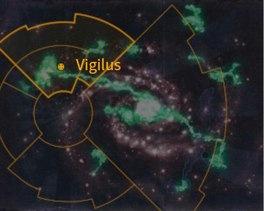
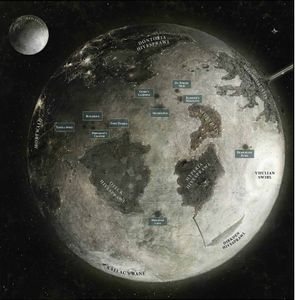
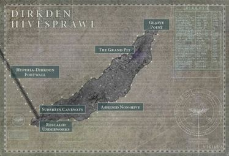
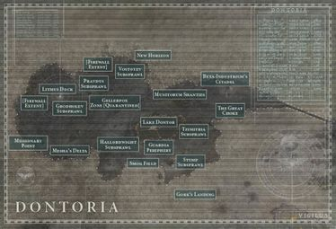
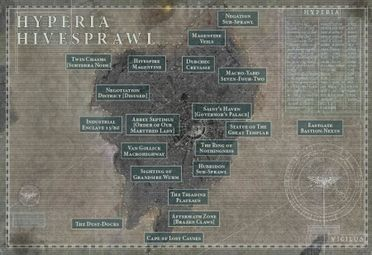
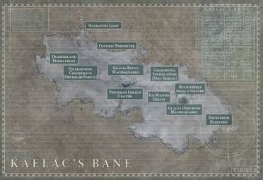
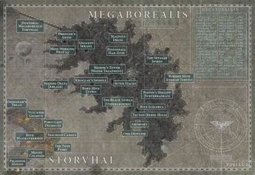
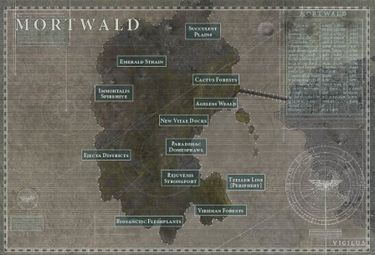
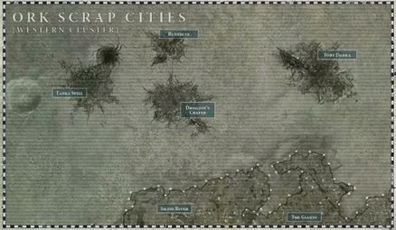
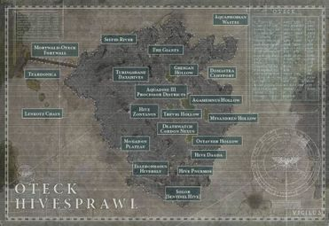

# 0932 警戒星 Vigilus

精校状态：中文行文已逐段精校，部分术语仍为暂定

分类：地理 / 真实空间 Real Space / 朦胧星域 Segmentum Obscurus

原文来源：https://www.bilibili.com/opus/1173579434038394880

原作者：帝国神选罐头

原文时间：2026年02月26日 13:27

[返回分类目录](目录.md) · [全书目录](../../目录.md)

<!-- A0932-B0001 图片 -->

<!-- A0932-B0002 -->

原译文

Map 地图

**校订译文**

Map 地图

<!-- /A0932-B0002 -->

<!-- A0932-B0003 -->
### Basic Data 基本资料

原题：Basic Data 基础数据

<!-- /A0932-B0003 -->

<!-- A0932-B0004 -->
**英文原文**

Name:Vigilus

<!-- /A0932-B0004 -->

<!-- A0932-B0005 -->

原译文

名称：警戒星

**校订译文**

名称：警戒星

<!-- /A0932-B0005 -->

<!-- A0932-B0006 -->
**英文原文**

Segmentum:Segmentum Obscurus

<!-- /A0932-B0006 -->

<!-- A0932-B0007 -->

原译文

星域：朦胧星域

**校订译文**

星域：朦胧星域

<!-- /A0932-B0007 -->

<!-- A0932-B0008 -->
**英文原文**

Subsector:Nachmund

<!-- /A0932-B0008 -->

<!-- A0932-B0009 -->

原译文

分区：纳克蒙德

**校订译文**

次星区：纳克蒙德次星区

<!-- /A0932-B0009 -->

<!-- A0932-B0010 -->
**英文原文**

System:Vigilus System

<!-- /A0932-B0010 -->

<!-- A0932-B0011 -->

原译文

星系：警戒星系

**校订译文**

星系：警戒星系

<!-- /A0932-B0011 -->

<!-- A0932-B0012 -->
**英文原文**

Population:~167,000,000,000

<!-- /A0932-B0012 -->

<!-- A0932-B0013 -->

原译文

人口：~1670,0000,0000

**校订译文**

人口：约 1670 亿

<!-- /A0932-B0013 -->

<!-- A0932-B0014 -->
**英文原文**

Affiliation:Imperium

<!-- /A0932-B0014 -->

<!-- A0932-B0015 -->

原译文

隶属：帝国

**校订译文**

隶属：帝国

<!-- /A0932-B0015 -->

<!-- A0932-B0016 -->
**英文原文**

Class:Hive World/War World, Sentinel World

<!-- /A0932-B0016 -->

<!-- A0932-B0017 -->

原译文

类别：巢都世界/战争世界，哨兵世界

**校订译文**

类别：巢都世界／战争世界、哨兵世界

<!-- /A0932-B0017 -->

<!-- A0932-B0018 -->
**英文原文**

Tithe Grade:Solutio Extremis

<!-- /A0932-B0018 -->

<!-- A0932-B0019 -->

原译文

什一税等级：第三级高等

**校订译文**

什一税等级：第三级高等

<!-- /A0932-B0019 -->

<!-- A0932-B0020 图片 -->

<!-- A0932-B0021 -->

原译文

Planetary Image 行星图像

**校订译文**

Planetary Image 行星图像

<!-- /A0932-B0021 -->

<!-- A0932-B0022 -->
**英文原文**

Vigilus is an Imperial world that is a key route through the Great Rift and, as a result, has become heavily contested by various factions. Currently, xenos such as Orks, Genestealers, and Eldar as well as the forces of Chaos have embedded themselves on the planet and it stands on the verge of collapse.

<!-- /A0932-B0022 -->

<!-- A0932-B0023 -->

原译文

警戒星是一个帝国世界，是穿越大裂隙的关键路线，因此受到各派系的激烈争夺。目前，欧克、基因窃取者和灵族等异型以及混沌部队已经在行星上扎根，行星正处于崩溃的边缘。

**校订译文**

警戒星是穿越大裂隙的关键通路之一，因而成为各方势力激烈争夺的帝国世界。欧克、基因窃取者、灵族等异形，以及混沌军队，都已在星球上立足，将它推至崩溃边缘。

<!-- /A0932-B0023 -->

<!-- A0932-B0024 -->
## Overview 概述

<!-- /A0932-B0024 -->

<!-- A0932-B0025 -->
## History 历史

<!-- /A0932-B0025 -->

<!-- A0932-B0026 -->
**英文原文**

In the years before the opening of the Cicatrix Maledictum, Vigilus was a vital source of manpower and material for the Imperium’s endless wars. The planet is made up of vast hive cities and colossal forges, broken up by dust-bowl wastelands and fortified reservoirs holding the planet’s scarce supply of potable water. For its economy, Vigilus was known for its exporting of excellent defensive technology thanks to an STC device found by local Tech-Priests. The STC allowed them to produce bastion-class force fields which soon became popular in the greater Imperium. The Force-fields are a staple of Vigilus and a cornerstone of its defense. In this time the world was ruled by Governor Lucienne Agamemnus IX, part of a dynasty that had overseen the planet's affairs for millennia and had long ago signed a treaty with the Mechanicum.

<!-- /A0932-B0026 -->

<!-- A0932-B0027 -->

原译文

在诅咒伤痕打开之前的几年里，警戒星是帝国无休止战争的重要人力和物力来源。这个行星由巨大的巢都城市和巨大的铸造厂组成，被尘暴荒原和储存行星稀缺饮用水的强化水库所分割。在经济方面，警戒星以出口卓越的防御技术而闻名，这要归功于当地技术神甫发现的STC设备。STC允许他们生产堡垒级的力场，很快在更大的帝国中流行起来。力场是警戒星的主要产品，也是其防御的基石。在此期间，世界由总督卢西安·阿伽门努斯九世统治，该王朝统治行星事务已有数千年，很久以前就与机械教签署了一项条约。

**校订译文**

大裂隙开启前，警戒星一直为帝国无休止的战争提供重要的人力与物资。巨型巢都和庞大制造厂遍布星球，其间是尘土荒原，以及储存稀缺饮用水、设有严密防御的水库。当地技术祭司发现一台标准建造模板（STC）设备后，便能生产堡垒级力场，使警戒星以出口优良防御技术闻名。这种力场很快广泛用于帝国各地，既是警戒星的主要产品，也是自身防御的基石。当时，星球由总督卢西安·阿伽门努斯九世统治。他的家族掌管这里已有数千年，也早已与机械教订立条约。

<!-- /A0932-B0027 -->

<!-- A0932-B0028 -->
**英文原文**

Despite its power, the Agamemnus Dynasty was constantly subverted by the power of the Ecclesiarchy, which managed to gain influence over the world's PDF (known as the Vigilant Guard and Vigilant Creedsmen) as well as local Imperial Guard garrisons. The Ministorum brought in Adepta Sororitas enforcers to make sure their power over Vigilus was not tested. Despite this all-out war between the Agamemnus Dynasty, Mechanicum, and Ecclesiarchy was avoided thanks to a combined body known as the Aquiliarian Council.

<!-- /A0932-B0028 -->

<!-- A0932-B0029 -->

原译文

尽管阿伽门努斯王朝拥有强大的力量，但它不断被国教的力量颠覆，国教设法对世界各地的行星防御部队（称为警戒卫队和警戒信徒）以及当地的帝国卫队驻军产生影响。军务部带来了法务部执法者，以确保他们对警戒星的权力没有受到考验。尽管阿伽门努斯王朝、机械教和国教之间爆发了这场全面战争，但由于成立了一个名为天鹰议会的联合机构，这场战争得以避免。

**校订译文**

阿伽门努斯王朝虽权势显赫，却一直受到国教势力侵蚀。国教设法影响本地行星防卫军——警戒卫队与警戒信徒——以及帝国卫队驻军，又引入修女会武力执法，确保自己的权威不受挑战。所幸，各方共设的阿奎拉议会居中协调，使阿伽门努斯王朝、机械教与国教之间避免了全面战争。

**校注：** Ministorum 指国教，Adepta Sororitas 指修女会；原译误为军务部和法务部。all-out war ... was avoided 指全面战争被避免，并非已经爆发战争后又避免。

<!-- /A0932-B0029 -->

<!-- A0932-B0030 -->
**英文原文**

After the opening of the Great Rift, Vigilus was within the Imperium Nihilus and has become one of the only stable routes from one side of the rift to the other, making it strategically vital. As a result, Vigilus has become a sanctuary for refugees crammed within its Hive-sprawls who wish to traverse the Nachmund Gauntlet. Each such sprawl is protected by psychically charged Bastion-class force fields that render comatose any who would seek to breach their boundaries, enabling the defenders to slaughter them at leisure. The world quickly became a popular Mechanicum stronghold of the Forge World Stygies VIII due to the proximity to the Stygius Front.

<!-- /A0932-B0030 -->

<!-- A0932-B0031 -->

原译文

大裂隙打开后，警戒星位于帝国暗面内，并成为从裂隙一侧到另一侧的唯一稳定路线之一，使其具有战略重要性。因此，警戒星已成为拥挤在其巢都中的难民的避难所，他们希望穿越纳克蒙德走廊。每一个这样的扩区都受到精神上充满压力的堡垒级力场的保护，这些力场会使任何试图突破其边界的人昏迷，使防御者能够随意屠杀他们。由于靠近黄泉前线，这个世界很快成为铸造世界黄泉八号的一个受欢迎的机械教要塞。

**校订译文**

大裂隙开启后，警戒星落入帝国暗面，却仍控制着横跨裂隙的少数稳定通路之一，因此战略地位至关重要。希望穿越纳克蒙德走廊的难民涌入巢都扩区，将这里当作避难所。每座扩区都由充注灵能的堡垒级力场保护；试图强行穿越边界者会陷入昏迷，守军便可从容将其杀死。由于毗邻黄泉前线，这颗星球很快成为铸造世界黄泉八号重视的机械教据点。

**校注：** psychically charged 指由灵能充能，不是精神压力；force fields 令闯入者昏迷是英文明确叙述。

<!-- /A0932-B0031 -->

<!-- A0932-B0032 -->
## Invasions 入侵

<!-- /A0932-B0032 -->

<!-- A0932-B0033 -->
**英文原文**

Because of its strategic location, Vigilus has fallen victim to a large number of invasions which includes Orks, Genestealer Cults, Dark Eldar, Saim-Hann Eldar, and Chaos.

<!-- /A0932-B0033 -->

<!-- A0932-B0034 -->

原译文

由于其战略位置，警戒星成为了大量入侵的受害者，其中包括欧克、基因窃取者教派、黑暗灵族、塞姆-罕灵族和混沌。

**校订译文**

正因战略位置重要，警戒星屡遭入侵，进攻者包括欧克、基因窃取者教派、黑暗灵族、塞姆罕灵族与混沌势力。

<!-- /A0932-B0034 -->

<!-- A0932-B0035 -->
## Geography 地理

<!-- /A0932-B0035 -->

<!-- A0932-B0036 -->
**英文原文**

Vigilus is an arid dust bowl-like planet, and as a result water is extremely valuable and scarce. Even the consumption of water is seen as a status symbol. The poor drink yellow foul-tasting water from deep underground known as aqua subterra, while the elite drink water from melted icebergs known as aqua glacius. The Mechanicum population on Vigilus drinks aqua meteoris which is harnessed from orbiting asteroids while the Ecclesiarchy drink aqua sanctus, which is purified with holy oils.

<!-- /A0932-B0036 -->

<!-- A0932-B0037 -->

原译文

警戒星是一个干旱的尘暴行星，因此水非常宝贵和稀缺。甚至水的消耗也被视为一种地位的象征。穷人喝的是来自地下深处的黄色污染水，被称为地下水，而精英们喝的是融化的冰山水，被称作冰川水。警戒星上的机械教人口饮用从轨道小行星上捕获的水陨石，而国教饮用用圣油净化的圣水。

**校订译文**

警戒星干旱多尘，水极其稀缺而珍贵，就连饮水方式也成为身份象征。穷人饮用地下深处抽出的黄色劣质水，称为“地下水”（aqua subterra）；权贵则享用融化冰山所得的“冰川水”（aqua glacius）。当地机械教人员喝的是从轨道小行星中提取的“陨石水”（aqua meteoris）；国教成员则饮用经圣油净化的“圣水”（aqua sanctus）。

<!-- /A0932-B0037 -->

<!-- A0932-B0038 -->
### Known Locations 已知地点

<!-- /A0932-B0038 -->

<!-- A0932-B0039 -->
**英文原文**

Hyperia Hivesprawl — The largest the major Hivesprawls of Vigilus and home to its central government.

<!-- /A0932-B0039 -->

<!-- A0932-B0040 -->

原译文

海珀利亚巢都扩区 — 警戒星最大的主要巢都扩区，也是其中央政府的所在地。

**校订译文**

海珀利亚巢都扩区 — 警戒星最大的主要巢都扩区，也是其中央政府的所在地。

<!-- /A0932-B0040 -->

<!-- A0932-B0041 -->
**英文原文**

Saint's Haven — The capital of Vigilus and home to the Agamemnus Dynasty. Has since become the command center of Marneus Calgar.

<!-- /A0932-B0041 -->

<!-- A0932-B0042 -->

原译文

圣者之港 — 警戒星的首都，阿伽门努斯王朝的所在地。此后成为马涅乌斯·卡尔加的指挥中心。

**校订译文**

圣者之港 — 警戒星的首都，阿伽门努斯王朝的所在地。此后成为马涅乌斯·卡尔加的指挥中心。

<!-- /A0932-B0042 -->

<!-- A0932-B0043 -->
**英文原文**

Ring of Nothingless — Moat-like chasm that surrounds Saint's Haven.

<!-- /A0932-B0043 -->

<!-- A0932-B0044 -->

原译文

无物之环 — 环绕圣者之港的护城河般的深渊。

**校订译文**

无物之环 — 环绕圣者之港的护城河般的深渊。

<!-- /A0932-B0044 -->

<!-- A0932-B0045 -->
**英文原文**

Trinity Hives — Three massive Hives known as Santifi-Ultima, Magentine, and Martyr's Pyre. The Hives and the precious drinking water it controls are both controlled by the Ecclesiarchy.

<!-- /A0932-B0045 -->

<!-- A0932-B0046 -->

原译文

三位一体巢都 — 三个巨大的巢都，分别被称为圣蒂菲-终极、马根廷和殉道者柴堆。巢都及其控制的珍贵饮用水都由国教控制。

**校订译文**

三位一体巢都——由圣蒂菲—终极、品红与殉道者柴堆三座巨型巢都组成。巢都及其掌握的珍贵饮用水均受国教控制。

<!-- /A0932-B0046 -->

<!-- A0932-B0047 -->
**英文原文**

Industrial Enclaves — Endless maze of factories in the western portion of the Hivesprawl.

<!-- /A0932-B0047 -->

<!-- A0932-B0048 -->

原译文

工业飞地 — 巢都扩区西部无尽的迷宫般的工厂。

**校订译文**

工业飞地 — 巢都扩区西部无尽的迷宫般的工厂。

<!-- /A0932-B0048 -->

<!-- A0932-B0049 -->
**英文原文**

Negation District — Once a cosmopolitan area of gothic architecture, now a slum. Located in the West.

<!-- /A0932-B0049 -->

<!-- A0932-B0050 -->

原译文

否定区 — 曾经是哥特式建筑的世界性地区，现在是贫民窟。位于西部。

**校订译文**

否定区——位于西部，曾是汇聚各地居民、遍布哥特式建筑的繁华街区，如今已沦为贫民窟。

<!-- /A0932-B0050 -->

<!-- A0932-B0051 -->
**英文原文**

Twin Chasms — Mining center for amethyst. Located in the north.

<!-- /A0932-B0051 -->

<!-- A0932-B0052 -->

原译文

双子裂隙 — 紫水晶开采中心。位于北部。

**校订译文**

双子裂隙 — 紫水晶开采中心。位于北部。

<!-- /A0932-B0052 -->

<!-- A0932-B0053 -->
**英文原文**

Magentine Veils — The northern limits of the continent where the citizens live short and dirty lives.

<!-- /A0932-B0053 -->

<!-- A0932-B0054 -->

原译文

马根廷帷幕 — 大陆的北部边界，那里的公民过着短暂而肮脏的生活。

**校订译文**

品红帷幕——位于大陆北缘，居民生活肮脏困苦，寿命短暂。

**校注：** 沿833品红帷幕译名。此处为地理区域，先前词表“军事力量专名”说明不准确，已同步修正。

<!-- /A0932-B0054 -->

<!-- A0932-B0055 -->
**英文原文**

Macro-Yard — A vast maze of decomissioned spacecraft. Hub of the black market. Located in the northeast.

<!-- /A0932-B0055 -->

<!-- A0932-B0056 -->

原译文

宏区 — 一个由退役航天器组成的巨大迷宫。黑市的中心。位于东北部。

**校订译文**

宏船场——东北部由大量退役飞船组成的庞大迷宫，也是黑市中心。

<!-- /A0932-B0056 -->

<!-- A0932-B0057 -->
**英文原文**

Hubrion Sub-Sprawl — Located in the southeast.

<!-- /A0932-B0057 -->

<!-- A0932-B0058 -->

原译文

哈布里恩分扩区 — 位于东南部。

**校订译文**

哈布里恩分扩区 — 位于东南部。

<!-- /A0932-B0058 -->

<!-- A0932-B0059 -->
**英文原文**

Triadine Plateau — Located in the southeast.

<!-- /A0932-B0059 -->

<!-- A0932-B0060 -->

原译文

特里亚丁高原 — 位于东南部。

**校订译文**

特里亚丁高原 — 位于东南部。

<!-- /A0932-B0060 -->

<!-- A0932-B0061 -->
**英文原文**

Van Gollick Macrohighway — Major transportation hub.

<!-- /A0932-B0061 -->

<!-- A0932-B0062 -->

原译文

范·戈利克宏道 — 主要的交通枢纽。

**校订译文**

范·戈利克宏道 — 主要的交通枢纽。

<!-- /A0932-B0062 -->

<!-- A0932-B0063 -->
**英文原文**

Cape of Lost Causes — Southernmost point of Hyperia.

<!-- /A0932-B0063 -->

<!-- A0932-B0064 -->

原译文

失落之岬 — 海珀利亚的最南端。

**校订译文**

失落之岬 — 海珀利亚的最南端。

<!-- /A0932-B0064 -->

<!-- A0932-B0065 -->
**英文原文**

Megaborealis — Continent ceded to the Adeptus Mechanicus 1,000 years ago in the Pact of Fire and Steel. The Agamemnus Dynasty agreed to give up the continent to Mechanicum activities in exchange for new technologies and their military might for defense. Today Megaborealis is nearly stripped of all of its resources. The continent is said to be highly dangerous due to seismic instability. Much activity goes on underground.

<!-- /A0932-B0065 -->

<!-- A0932-B0066 -->

原译文

大北极光 — 1000年前，在《火与钢公约》中，大陆割让给了机械教。阿伽门努斯王朝同意将大陆交给机械教活动，以换取新技术及其防御军事力量。如今，大北极光几乎被剥夺了所有的资源。据说，由于地震的不稳定性，该大陆非常危险。许多活动在地下进行。

**校订译文**

大北极光——一千年前，阿伽门努斯王朝依据《火与钢公约》，将这片大陆交给机械修会，以换取新技术及其军事保护。如今，大陆资源几乎开采殆尽；地质活动不稳定，环境危险，大量生产活动都在地下进行。

<!-- /A0932-B0066 -->

<!-- A0932-B0067 -->
**英文原文**

Black Levels — Blackstone mine worked by Servitors.

<!-- /A0932-B0067 -->

<!-- A0932-B0068 -->

原译文

黑层 — 机仆工作的黑石矿。

**校订译文**

黑层 — 机仆工作的黑石矿。

<!-- /A0932-B0068 -->

<!-- A0932-B0069 -->
**英文原文**

Bore-Hives — Massive drilling platforms originally launched from orbit that over time became population, economic, and administrative centres in their own right.

<!-- /A0932-B0069 -->

<!-- A0932-B0070 -->

原译文

钻孔巢都 — 大型钻井平台最初是从轨道上发射的，随着时间的推移，这些平台本身就成为了人口、经济和行政中心。

**校订译文**

钻孔巢都 — 大型钻井平台最初是从轨道上发射的，随着时间的推移，这些平台本身就成为了人口、经济和行政中心。

<!-- /A0932-B0070 -->

<!-- A0932-B0071 -->
**英文原文**

Bore-Hive Scelerus — the main power source (generated over 50% of the energy needed to power all Megaborealis. Mainly destroyed after the end of the twelve-year battle for Scelerus during the War of Beasts.

<!-- /A0932-B0071 -->

<!-- A0932-B0072 -->

原译文

钻孔巢都斯凯勒斯 — 主要能源（产生了为所有大北极光提供动力所需能量的50%以上。主要在野兽战争期间为期12年的斯凯勒斯之战结束后被摧毁。）

**校订译文**

钻孔巢都斯凯勒斯——主要能源中心，曾供应大北极光一半以上的能源。野兽之战期间，斯凯勒斯之战持续十二年，结束时这座巢都已大部分被毁。

<!-- /A0932-B0072 -->

<!-- A0932-B0073 -->
**英文原文**

Bore-Hive Ultris

<!-- /A0932-B0073 -->

<!-- A0932-B0074 -->

原译文

钻孔巢都乌尔特里斯

**校订译文**

钻孔巢都乌尔特里斯

<!-- /A0932-B0074 -->

<!-- A0932-B0075 -->

原译文

Grisport 格里斯港

**校订译文**

Grisport 格里斯港

<!-- /A0932-B0075 -->

<!-- A0932-B0076 -->
**英文原文**

Hive Ankhar Tertius — Deep below is the home of the original Genestealer infestation that plagues Vigilus. Now largely in Genestealer Cult hands.

<!-- /A0932-B0076 -->

<!-- A0932-B0077 -->

原译文

安哈尔三号巢都 — 下层深处是困扰警戒星的最初基因窃取者侵扰的家园。现在主要掌握在基因窃取者教派手中。

**校订译文**

安哈尔三号巢都——其地下深处是警戒星最早一轮基因窃取者感染的发源地，如今大部分已被基因窃取者教派控制。

<!-- /A0932-B0077 -->

<!-- A0932-B0078 -->
**英文原文**

Kraxxon — Region of refineries.

<!-- /A0932-B0078 -->

<!-- A0932-B0079 -->

原译文

克拉克森 — 精炼厂地区

**校订译文**

克拉克森 — 精炼厂地区

<!-- /A0932-B0079 -->

<!-- A0932-B0080 -->
**英文原文**

Omnissian Hoist — Vast edifice that rises into Vigilus' atmosphere from the Stygian Spires. Links with the orbiting Space Station of Sacrus Tora Hawking to produce a massive series of Space Elevators. Mineral crates are loaded from Stygian Spires and sent into orbital freighters via massive chainbelts.

<!-- /A0932-B0080 -->

<!-- A0932-B0081 -->

原译文

万机神升降机 — 从黄泉尖塔升至警戒星大气层的巨大建筑。与神圣谕示鹰猎轨道空间站建立联系，生产一系列大型太空电梯。矿物箱从黄泉尖塔装载，并通过巨大的链带送入轨道货船。

**校订译文**

欧姆尼赛亚升降机——从黄泉尖塔向大气层延伸的巨型构筑物。它与轨道上的萨克鲁斯·托拉·霍金空间站相接，共同组成庞大的太空电梯系统。矿物货箱在黄泉尖塔装载后，沿巨型链带被送入轨道货船。

<!-- /A0932-B0081 -->

<!-- A0932-B0082 -->
**英文原文**

Piston's Hollow — Subterranean District

<!-- /A0932-B0082 -->

<!-- A0932-B0083 -->

原译文

活塞空洞 — 地下地区

**校订译文**

活塞空洞 — 地下地区

<!-- /A0932-B0083 -->

<!-- A0932-B0084 -->
**英文原文**

Sacrus Tora Hawking — Space Station that serves as Vigilus' primary interplanetary hub. Also used for mining water from asteroids gathered by Mechanicum vessels, which is then sent below. Links directly to the Omnissian Hoist.

<!-- /A0932-B0084 -->

<!-- A0932-B0085 -->

原译文

神圣谕示鹰猎 —空间站，警戒星的主要行星间中心。也用于从机械教战舰聚集的小行星上开采水，然后将其送到下面。直接链接到万机神起重机。

**校订译文**

萨克鲁斯·托拉·霍金——警戒星最主要的行星际交通枢纽空间站，直接连接欧姆尼赛亚升降机。机械教舰船收集的小行星也在这里接受处理，提取水资源，再送往下方的行星。

**校注：** Sacrus Tora Hawking 在本篇及833均明确是轨道空间站名。采用既定音译萨克鲁斯·托拉·霍金，但不能因形式似人名就把它登记为人物。

<!-- /A0932-B0085 -->

<!-- A0932-B0086 -->
**英文原文**

Scelerus — Bore-hive. Built atop a great thermal stack that yielded practically endless geothermic power Scelerus provided over half of the energy that kept running countless manufactorums of Megaborealis.

<!-- /A0932-B0086 -->

<!-- A0932-B0087 -->

原译文

斯凯勒斯 — 钻孔巢都。斯凯勒斯建在一个巨大的热堆之上，产生了几乎无穷无尽的地热能，提供了维持无数大北极星工厂运行的一半以上的能量。

**校订译文**

斯凯勒斯——建在巨型地热设施上的钻孔巢都。该设施几乎能提供无穷地热能；大北极光无数制造厂运行所需的能源，一半以上来自这里。

<!-- /A0932-B0087 -->

<!-- A0932-B0088 -->
**英文原文**

Mortwald — Vigilus' primary food source as well as a center of rejuvenat treatments. The only place where lush vegetation is found. Ruled over by the Governor's brother, Deinos Agamemnus. Population: 19.7 billion. At the end of the War of Nightmares was lost to Flawless Host, Black Legion, Daemons of Khorne and Iron Warriors forces.

<!-- /A0932-B0088 -->

<!-- A0932-B0089 -->

原译文

莫特瓦尔德 — 警戒星的主要食物来源以及回春治疗中心。唯一一个植被茂盛的地方。由总督的兄弟迪诺斯·阿伽门努斯统治。人口：197亿。在噩梦战争结束时，他们输给了无瑕之主、黑色军团、恐虐恶魔和钢铁勇士的部队。

**校订译文**

莫特瓦德——警戒星的主要粮食产区与回春治疗中心，也是唯一植被茂盛的地方。它由总督的兄弟迪诺斯·阿伽门努斯统治，人口约 197 亿。噩梦战争末期，这里落入无瑕之主、黑色军团、恐虐恶魔与钢铁勇士之手。

<!-- /A0932-B0089 -->

<!-- A0932-B0090 -->

原译文

Eastern Cactus Forests 东部仙人掌林

**校订译文**

Eastern Cactus Forests 东部仙人掌林

<!-- /A0932-B0090 -->

<!-- A0932-B0091 -->
**英文原文**

Enclaves — Secluded bio-domes where the elite of Mortwald live.

<!-- /A0932-B0091 -->

<!-- A0932-B0092 -->

原译文

飞地 — 莫特瓦尔德精英居住的隐秘生物穹顶。

**校订译文**

飞地 — 莫特瓦德精英居住的隐秘生物穹顶。

<!-- /A0932-B0092 -->

<!-- A0932-B0093 -->
**英文原文**

Djodrolev Hivestar — Hive slum

<!-- /A0932-B0093 -->

<!-- A0932-B0094 -->

原译文

乔德罗列夫巢都 — 巢都贫民窟

**校订译文**

乔德罗列夫巢都 — 巢都贫民窟

<!-- /A0932-B0094 -->

<!-- A0932-B0095 -->
**英文原文**

Electros Hive — Hive slum

<!-- /A0932-B0095 -->

<!-- A0932-B0096 -->

原译文

电子巢都 — 巢都贫民窟

**校订译文**

电子巢都 — 巢都贫民窟

<!-- /A0932-B0096 -->

<!-- A0932-B0097 -->
**英文原文**

New Vitae Docks — Wealthy and valued area where foreign visitors often travel to.

<!-- /A0932-B0097 -->

<!-- A0932-B0098 -->

原译文

新维塔码头 — 外星游客经常前往的富裕和有价值的地区。

**校订译文**

新维塔码头——富裕而重要的区域，外来访客经常到此。

<!-- /A0932-B0098 -->

<!-- A0932-B0099 -->
**英文原文**

Rejuvenus Strongport — lesser nobility enjoy rejuvenant treatments in this region.

<!-- /A0932-B0099 -->

<!-- A0932-B0100 -->

原译文

回春强港 — 在这个地区，较低级别的贵族享受着回春治疗。

**校订译文**

回春强港——较低等级的贵族在此接受回春治疗。

<!-- /A0932-B0100 -->

<!-- A0932-B0101 -->
**英文原文**

Biosantic Fleshplants — The most advanced rejuvenat center on Vigilus and used for only the most extreme cases. The suturing of old heads to fresh bodies is not unheard of.

<!-- /A0932-B0101 -->

<!-- A0932-B0102 -->

原译文

生圣肉植 — 警戒星最先进的回春中心，仅用于最极端的情况。将旧头缝合到新身上并非闻所未闻。

**校订译文**

拜奥桑蒂克肉身工厂——警戒星最先进的回春治疗中心，只处理最极端的病例。把衰老的头颅缝接到年轻身体上，也并非罕见之事。

**校注：** fleshplants 在回春设施语境中指处理肉身的工厂，不是肉质植物；Biosantic 沿834拜奥桑蒂克词根。

<!-- /A0932-B0102 -->

<!-- A0932-B0103 -->
**英文原文**

Deinos Trench Network — fortified defensive line surrounding Mortwald, formed due to Deinos' suspicion of the Mechanicus on Vigilus.

<!-- /A0932-B0103 -->

<!-- A0932-B0104 -->

原译文

迪诺斯壕沟网络 — 围绕莫特瓦尔德的强化防线，是由于迪诺斯对警戒星的机械教的怀疑而形成的。

**校订译文**

迪诺斯壕沟网络——围绕莫特瓦德的坚固防线，因迪诺斯提防警戒星上的机械修会而修建。

<!-- /A0932-B0104 -->

<!-- A0932-B0105 -->
**英文原文**

Trzeller Line — Southern defensive line that joins with the Deinos Trench Network.

<!-- /A0932-B0105 -->

<!-- A0932-B0106 -->

原译文

特雷泽尔防线——与迪诺斯壕沟网络相连的南部防线。

**校订译文**

特雷泽尔防线——与迪诺斯壕沟网络相连的南部防线。

<!-- /A0932-B0106 -->

<!-- A0932-B0107 -->
**英文原文**

Oteck Hivesprawl — The primary source of water on Vigilus. Vast networks of heavily guarded macro-ducts spread the water throughout Vigilus. During the War of Beasts it became the site of a major Ork assault from without and Genestealer Cult uprising from within. Population: 22.8 billion. At the end of the War of Nightmares was lost to Pauper Princes Genestealer Cults, the last forces of Adepta Sororitas retreated from the continent.

<!-- /A0932-B0107 -->

<!-- A0932-B0108 -->

原译文

奥泰克巢都扩区 — 警戒星的主要水源。由戒备森严的大型管道组成的庞大网络将水分散到整个警戒星。在野兽战争期间，它成为了外部欧克发动大规模袭击和内部基因窃取者教派叛乱的地点。人口：228亿。在噩梦战争结束时，乞丐王子基因窃取者教派败北，修女会的最后一支部队从大陆撤退。

**校订译文**

奥特克巢都扩区——警戒星的主要水源地。庞大的巨型输水管网戒备森严，将水送往全星球。野兽之战期间，欧克从外部大举进攻，基因窃取者教派又在内部起义。当地人口约 228 亿。噩梦战争末期，扩区落入乞丐王子基因窃取者教派之手，最后的修女会部队也撤离了这片大陆。

**校注：** was lost to Pauper Princes 的主语是扩区，表示被乞丐王子占领，原译“乞丐王子败北”颠倒了胜败。

<!-- /A0932-B0108 -->

<!-- A0932-B0109 -->
**英文原文**

The Hollows — 5 enormous reservoirs more akin to inland seas (Greigan, Mysandren, Trevig, Ostaveer, and Agamemnus). Contain islands such as Tzardonica, Luthvren, and the Lenkotz Chain.

<!-- /A0932-B0109 -->

<!-- A0932-B0110 -->

原译文

空洞 — 5个更类似于内海的巨大水库（格雷根、迈桑德伦、特雷维格、奥斯塔维尔和阿伽门努斯）。包含扎多尼卡、卢瑟文和伦科茨链等岛屿。

**校订译文**

空洞——五座几乎堪比内海的巨型水库，分别名为格雷根、迈桑德伦、特雷维格、奥斯塔维尔与阿伽门努斯。其中分布着扎多尼卡、卢瑟文及伦科茨群岛等岛屿。

<!-- /A0932-B0110 -->

<!-- A0932-B0111 -->
**英文原文**

Aquadine III Processor District — Processes and distributes water from The Hollows.

<!-- /A0932-B0111 -->

<!-- A0932-B0112 -->

原译文

阿奎坦三号处理区 — 处理和分配来自空洞的水。

**校订译文**

阿奎坦三号处理区 — 处理和分配来自空洞的水。

<!-- /A0932-B0112 -->

<!-- A0932-B0113 -->
**英文原文**

Hives Dagda & Pneumos — Share an intense rivalry over who can generate the most water pressure in planetwide distribution.

<!-- /A0932-B0113 -->

<!-- A0932-B0114 -->

原译文

达格达&普纽莫斯巢都 — 在全球范围内，谁能产生最大的水压，这是一个激烈的竞争。

**校订译文**

达格达与普纽莫斯巢都——两座巢都激烈竞争，看谁能在面向全星球的供水系统中产生更高水压。

<!-- /A0932-B0114 -->

<!-- A0932-B0115 -->
**英文原文**

Ellerophosus Hivebelt — cluster of medium-sized hives

<!-- /A0932-B0115 -->

<!-- A0932-B0116 -->

原译文

埃勒罗弗索斯巢都带 — 中型巢都群

**校订译文**

埃勒罗弗索斯巢都带 — 中型巢都群

<!-- /A0932-B0116 -->

<!-- A0932-B0117 -->
**英文原文**

Turingsbane Datahives — Mechanicum-run site built on top of a pre-Imperial settlement. Home to ancient technology and data.

<!-- /A0932-B0117 -->

<!-- A0932-B0118 -->

原译文

图灵之灾数据巢都 — 建立在帝国统治前定居点之上的机械教测试地点。古代技术和数据的家园。

**校订译文**

图灵克星数据巢——由机械教运营，建在一处帝国时代以前的聚居地之上，保存着古老的技术与数据。

<!-- /A0932-B0118 -->

<!-- A0932-B0119 -->
**英文原文**

Solor — A sentinel hive that keeps watch over the wastelands of the south.

<!-- /A0932-B0119 -->

<!-- A0932-B0120 -->

原译文

索洛尔 — 一个守卫南方荒地的哨兵巢都。

**校订译文**

索洛尔——守望南方荒原的哨戒巢都。

<!-- /A0932-B0120 -->

<!-- A0932-B0121 -->
**英文原文**

Hive Zontanus — south

<!-- /A0932-B0121 -->

<!-- A0932-B0122 -->

原译文

佐坦纳斯巢都 — 南部

**校订译文**

佐坦纳斯巢都 — 南部

<!-- /A0932-B0122 -->

<!-- A0932-B0123 -->
**英文原文**

Sumphall Districts — south

<!-- /A0932-B0123 -->

<!-- A0932-B0124 -->

原译文

桑法尔地区 - 南部

**校订译文**

桑法尔地区 - 南部

<!-- /A0932-B0124 -->

<!-- A0932-B0125 -->
**英文原文**

Siltid River — North

<!-- /A0932-B0125 -->

<!-- A0932-B0126 -->

原译文

淤泥河 — 北部

**校订译文**

淤泥河 — 北部

<!-- /A0932-B0126 -->

<!-- A0932-B0127 -->
**英文原文**

Kaelac's Bane — Frozen wasteland to the north. Its icecaps are used as a water source for the planet's nobility and is also mined for minerals and ore by the Mechanicum. Its size has shrunk considerably over the years due to the Imperial presence but is still home to many dangerous beasts. Population: 4.1 million. At the end of the War of Nightmares was lost. All population and saved pure ice water were evacuated to other continents.

<!-- /A0932-B0127 -->

<!-- A0932-B0128 -->

原译文

凯拉克之灾 — 北面是冰冻荒地。它的冰盖被用作行星贵族的水源，也被机械教开采矿物和矿石。由于帝国的存在，它的规模多年来大幅缩小，但仍然是许多危险野兽的家园。人口：410万。噩梦战争结束时，他们输了。所有人口和保存的纯净冰水都被疏散到其他大陆。

**校订译文**

凯拉克之灾——位于北方的冰冻荒原，人口约 410 万。冰盖供贵族饮水，机械教也在这里开采矿物。帝国多年开发使这片地区大幅萎缩，但仍有许多危险野兽栖居。噩梦战争末期，该地失守，居民及保住的纯净冰水被全部转移至其他大陆。

<!-- /A0932-B0128 -->

<!-- A0932-B0129 -->
**英文原文**

Hyperia - remained in the Imperial hands as a last stand continent.

<!-- /A0932-B0129 -->

<!-- A0932-B0130 -->

原译文

海珀利亚 - 作为最后一块大陆，它仍然掌握在帝国手中。

**校订译文**

海珀利亚——仍由帝国掌控，是其进行最后抵抗的大陆。

<!-- /A0932-B0130 -->

<!-- A0932-B0131 -->
**英文原文**

Venstran & Heliostrike Impact Craters — major water production sites

<!-- /A0932-B0131 -->

<!-- A0932-B0132 -->

原译文

文斯特兰和日神之击撞击坑 — 主要产水地点

**校订译文**

文斯特兰和日神之击撞击坑 — 主要产水地点

<!-- /A0932-B0132 -->

<!-- A0932-B0133 -->
**英文原文**

Glacia Betus & Gacia Omicroid — major water production sites.

<!-- /A0932-B0133 -->

<!-- A0932-B0134 -->

原译文

贝图斯冰川和奥密克洛伊德冰川 — 主要的产水地点。

**校订译文**

贝图斯冰川和奥密克洛伊德冰川 — 主要的产水地点。

<!-- /A0932-B0134 -->

<!-- A0932-B0135 -->
**英文原文**

Quixotine Loop — Forcefield network that rotects the water and mechanicum mining centers.

<!-- /A0932-B0135 -->

<!-- A0932-B0136 -->

原译文

奎克索汀回路 — 保护水和机械教采矿中心的力场网络。

**校订译文**

奎克索汀回路——保护水资源设施与机械教采矿中心的力场网络。

<!-- /A0932-B0136 -->

<!-- A0932-B0137 -->
**英文原文**

Dirkden Hivesprawl — Plagued by issues even before the War of Beasts. Originally a home for the elite, it was all but abandoned by the Agamemnus Dynasty. It has since become home to half-feral outcasts, mutants, and Genestealer Cultists. Even before the war, Genestealer Hybrids were more common than loyal Imperial citizens in Dirkden. Eventually abandoned to Orks and Genestealers during the war by Marneus Calgar.

<!-- /A0932-B0137 -->

<!-- A0932-B0138 -->

原译文

德克登巢都扩区 — 早在野兽战争之前就饱受问题困扰。它原本是精英阶层的家园，但几乎被阿伽门努斯王朝抛弃了。自那以后，它成为了半野生弃儿、变种人和基因窃取者的家园。即使在战争之前，混种基因窃取者在德克登也比忠诚的帝国公民更常见。最终在战争期间被马涅乌斯·卡尔加遗弃给了欧克和基因窃取者。

**校订译文**

德克登巢都扩区——在野兽之战前就已问题重重。这里原是权贵居住区，后来几乎被阿伽门努斯王朝抛弃，逐渐聚集起半野化的流民、变种人与基因窃取者教徒。甚至在开战前，基因窃取者混种就已比忠诚的帝国公民更加常见。战争期间，马涅乌斯·卡尔加最终放弃该区，任其落入欧克和基因窃取者之手。

<!-- /A0932-B0138 -->

<!-- A0932-B0139 -->
**英文原文**

Ashenid Non-Hive — half-finished skeleton hive city. The architect that built it eventually abandoned the original concept of an open-air hive and instead began to dig downward, creating vast subterranean levels.

<!-- /A0932-B0139 -->

<!-- A0932-B0140 -->

原译文

阿什尼德空巢都 — 半成品骨架巢都城市。建造它的建筑师最终放弃了露天巢都的最初概念，而是开始向下挖掘，创造出巨大的地下层。

**校订译文**

阿什尼德空巢都——只建成半副骨架的巢都。建筑师最终放弃露天巢都的最初构想，转而向下开挖，建成广阔的地下层。

<!-- /A0932-B0140 -->

<!-- A0932-B0141 -->
**英文原文**

Glaive Point — Northern Point

<!-- /A0932-B0141 -->

<!-- A0932-B0142 -->

原译文

格莱夫点 — 极北点

**校订译文**

格莱夫点 — 极北点

<!-- /A0932-B0142 -->

<!-- A0932-B0143 -->
**英文原文**

Rescalid Underworks — Southern point

<!-- /A0932-B0143 -->

<!-- A0932-B0144 -->

原译文

瑞斯卡利德下层结构 — 极南点

**校订译文**

瑞斯卡利德下层结构 — 极南点

<!-- /A0932-B0144 -->

<!-- A0932-B0145 -->
**英文原文**

Dontoria Hivesprawl — Critically overpopulated Hivesprawl. The population density has created a polluted, putrid atmosphere. Has since become decimated by Gellerpox outbreaks. At the end of the War of Nightmares was lost to Purge and other Nurgle forces.

<!-- /A0932-B0145 -->

<!-- A0932-B0146 -->

原译文

多托利亚巢都扩区 — 巢都扩区人口严重过剩。人口密度造成了污染、腐烂的大气。此后，它因盖勒铁瘟爆发而大量死亡。在噩梦战争结束时，他们输给了净世疫军和其他纳垢部队。

**校订译文**

多托瑞亚巢都扩区——人口极度拥挤，空气污浊腐臭。盖勒瘟疫爆发后，大批居民死亡。噩梦战争末期，扩区落入净世疫军与其他纳垢势力之手。

<!-- /A0932-B0146 -->

<!-- A0932-B0147 -->
**英文原文**

Lake Dontor — Sole source of water. Despite being horrifically polluted, it is still home to massive urban conglomerations of walkways, boats, and barges built directly on top of it.

<!-- /A0932-B0147 -->

<!-- A0932-B0148 -->

原译文

多托尔湖 — 唯一的水源。尽管受到了可怕的污染，但它仍然是直接建在其上的走道、船只和驳船的大型城市聚集的所在地。

**校订译文**

多托尔湖——当地唯一水源。湖水虽污染严重，水面上仍直接建起大片城区，由步道、船只与驳船连接而成。

<!-- /A0932-B0148 -->

<!-- A0932-B0149 -->
**英文原文**

Tzimitria, Stump, Grodholev, Pravdus, & Vostoyev Subsprawls — Ecclesiarchy stronghholds used to produce weaponry for Wars of Faith and the Vigilant Guard.

<!-- /A0932-B0149 -->

<!-- A0932-B0150 -->

原译文

茨米特里亚，树桩，格罗德霍列夫，普拉夫杜斯和沃斯托耶夫分扩区 — 国教要塞，曾为信仰战争和警戒卫队生产武器。

**校订译文**

茨米特里亚，树桩，格罗德霍列夫，普拉夫杜斯和沃斯托耶夫分扩区 — 国教要塞，曾为信仰战争和警戒卫队生产武器。

<!-- /A0932-B0150 -->

<!-- A0932-B0151 -->
**英文原文**

New Horizon — Extreme north of the continent.

<!-- /A0932-B0151 -->

<!-- A0932-B0152 -->

原译文

新地平线 — 大陆的最北端。

**校订译文**

新地平线 — 大陆的最北端。

<!-- /A0932-B0152 -->

<!-- A0932-B0153 -->
**英文原文**

Missionary Point — Extreme south of the continent

<!-- /A0932-B0153 -->

<!-- A0932-B0154 -->

原译文

传教士点 — 大陆的最南端。

**校订译文**

传教士点 — 大陆的最南端。

<!-- /A0932-B0154 -->

<!-- A0932-B0155 -->

原译文

Smog Field 烟雾场

**校订译文**

Smog Field 烟雾场

<!-- /A0932-B0155 -->

<!-- A0932-B0156 -->

原译文

Great Coke 大焦炭

**校订译文**

Great Coke 大焦炭

<!-- /A0932-B0156 -->

<!-- A0932-B0157 -->

原译文

Mesha's Delta 梅沙三角洲

**校订译文**

Mesha's Delta 梅沙三角洲

<!-- /A0932-B0157 -->

<!-- A0932-B0158 -->
**英文原文**

Storvhal — Equatorial zone and main source of energy on Vigilus. The sprawl is home to vast farm-generators which harness the volcanic power of the planet. Overseen by the Mechanicum.

<!-- /A0932-B0158 -->

<!-- A0932-B0159 -->

原译文

斯托夫哈尔 — 赤道带和警戒星的主要能源。该地区是利用行星火山能量的大型农场发电机的所在地。由机械教监督。

**校订译文**

斯托夫哈尔——位于赤道，是警戒星的主要能源产区。扩区内大片发电设施汲取行星火山能量，由机械教监管。

**校注：** farm-generators 此处是大规模成片发电设施，利用火山能量，不是农业农场。

<!-- /A0932-B0159 -->

<!-- A0932-B0160 -->
**英文原文**

Phaestos Mound — Southern volcanic generator complex.

<!-- /A0932-B0160 -->

<!-- A0932-B0161 -->

原译文

费斯托斯土丘 — 南部火山发电机建筑群。

**校订译文**

费斯托斯土丘 — 南部火山发电机建筑群。

<!-- /A0932-B0161 -->

<!-- A0932-B0162 -->
**英文原文**

Omnissiah's Tread — Northern volcanic generator complex.

<!-- /A0932-B0162 -->

<!-- A0932-B0163 -->

原译文

万机神之踏 — 北部火山发电机建筑群。

**校订译文**

欧姆尼赛亚之踏——北部火山发电设施群。

<!-- /A0932-B0163 -->

<!-- A0932-B0164 -->
**英文原文**

Vulcanid Geohive — Hive City

<!-- /A0932-B0164 -->

<!-- A0932-B0165 -->

原译文

沃坎尼德地巢都 — 巢都城市

**校订译文**

沃坎尼德地巢都 — 巢都城市

<!-- /A0932-B0165 -->

<!-- A0932-B0166 -->
**英文原文**

Hive Magmathermid — Hive City

<!-- /A0932-B0166 -->

<!-- A0932-B0167 -->

原译文

大瑟米德巢都 — 巢都城市

**校订译文**

玛格玛瑟米德巢都——巢都城市。

<!-- /A0932-B0167 -->

<!-- A0932-B0168 -->
**英文原文**

Voschian Canals — Network of energy ducts that channel Storvahl's power throughout the rest of Vigilus.

<!-- /A0932-B0168 -->

<!-- A0932-B0169 -->

原译文

沃希安管道 — 将斯托夫哈尔的电力输送到警戒星其他地区的能源管道网络。

**校订译文**

沃希安管道 — 将斯托夫哈尔的电力输送到警戒星其他地区的能源管道网络。

<!-- /A0932-B0169 -->

<!-- A0932-B0170 -->
**英文原文**

Pyroclast Districts — Home to religious fanatics which worship the volcanic elements of the earth to be an expression of the Emperor himself. Eventually became a hotbed of Chaos Cult activity under Vannadan the Firebrand.

<!-- /A0932-B0170 -->

<!-- A0932-B0171 -->

原译文

火山碎屑区 — 宗教狂热分子的家园，他们崇拜行星上的火山元素，以此表达帝皇本人。最终成为火把瓦纳丹领导下的混沌教派活动的温床。

**校订译文**

火山碎屑区——当地宗教狂热者将火山力量视为帝皇本人的显现，予以崇拜。后来，此地成为煽动者瓦纳丹麾下混沌教派的活动温床。

**校注：** 当地人把火山现象视为帝皇的显现，不是以崇拜行为表达帝皇本人。

<!-- /A0932-B0171 -->

<!-- A0932-B0172 -->
**英文原文**

The Wastes — Vast wasteland that dominates much of the planet. Devoid of greenery and water. At the end of the War of Nightmares was enveloped in unstoppable fighting and skirmishes between the Ork Speedwaagh! and Adepta Sororitas and other Imperial Forces. Also there are a high danger of raiders of the Drukhari, xenocultist outriders, giant terrestine molerats, wild grox herds, warp-gheists and Daemons.

<!-- /A0932-B0172 -->

<!-- A0932-B0173 -->

原译文

大荒地 — 占据行星大部分地区的广袤荒地。缺乏绿色植物和水。在噩梦战争结束时，欧克极速Waaagh！和修女会和其他帝国部队之间爆发了不可阻挡的战斗和小规模冲突。此外还有杜鲁卡里的袭击者、异型信徒、巨型陆地鼹鼠、野生格洛克斯兽群、亚空间幽魂和恶魔。

**校订译文**

大荒地——占据星球大片地域的广袤荒原，没有绿意，也缺乏水。噩梦战争结束时，欧克极速 Waaagh! 与修女会、其他帝国军之间的大小战斗仍在这里持续。此外，黑暗灵族劫掠者、异形邪教游骑兵、巨型地底鼹鼠、野生格洛克斯兽群、亚空间幽魂及恶魔，也都构成严重威胁。

<!-- /A0932-B0173 -->

<!-- A0932-B0174 -->
**英文原文**

Vhulian Swirl — The most dangerous area of Vigilus, home to a continuous dust storm more akin to a massive hurricane.

<!-- /A0932-B0174 -->

<!-- A0932-B0175 -->

原译文

维胡里安旋涡 — 警戒星最危险的地区，是持续的沙尘暴的所在地，更像是一场大规模飓风。

**校订译文**

维胡利安漩涡——警戒星最危险的地区，终年盘踞着一场近似巨型飓风的沙尘暴。

<!-- /A0932-B0175 -->

<!-- A0932-B0176 -->
**英文原文**

Scrap Cities — Vast conglomerations in the wastelands of Vigilus formed by the Orks in the wake of their invasion.

<!-- /A0932-B0176 -->

<!-- A0932-B0177 -->

原译文

废料城市 — 欧克入侵后，在警戒星的荒地上形成的巨大聚集地。

**校订译文**

废料城市 — 欧克入侵后，在警戒星的荒地上形成的巨大聚集地。

<!-- /A0932-B0177 -->

<!-- A0932-B0178 -->
**英文原文**

Western Scrap City Cluster — Consisting of four scrap-cities including the "capital" of Fort Dakka overseen by Krooldakka himself.

<!-- /A0932-B0178 -->

<!-- A0932-B0179 -->

原译文

西部废料城市群 — 由四个废料城市组成，其中包括克鲁达卡亲自监管的“首都”达卡堡垒。

**校订译文**

西部废料城市群——由四座废料城组成，其中的“首都”哒咔堡垒由克鲁哒咔亲自统辖。

<!-- /A0932-B0179 -->

<!-- A0932-B0180 -->
**英文原文**

Tanka Spill — Scrap city built in vast rivers of industrial runoff and petrochemical fluids formed from Imperial industry. Home of the Mek Boss Big Tanka.

<!-- /A0932-B0180 -->

<!-- A0932-B0181 -->

原译文

坦卡溢出 — 这座废料城市建在帝国工业形成的巨大工业径流和石化流体河流中。技霸大坦卡的家。

**校订译文**

坦咔溢出——这座废料城建在帝国工业废水与石化液体汇成的宽阔河流中，是技师头目大坦咔的据点。

<!-- /A0932-B0181 -->

<!-- A0932-B0182 -->
**英文原文**

Runthive — Grot stronghold and Squig farm under the control of Snakebite Warboss Ogrokk Bitespider.

<!-- /A0932-B0182 -->

<!-- A0932-B0183 -->

原译文

奔巢 - 屁精要塞和史古格农场，由蛇咬战争头目欧格洛克·咬蛛控制。

**校订译文**

奔巢——蛇咬战争头目欧格洛克·咬蛛控制的屁精要塞与史古革养殖场。

<!-- /A0932-B0183 -->

<!-- A0932-B0184 -->
**英文原文**

Drogzot's Crater — Lair of Deathskulls Boss Drogzot, used as a salvaging centre and major Ork economic hub.

<!-- /A0932-B0184 -->

<!-- A0932-B0185 -->

原译文

德罗格佐特的造物 —死颅头目德罗格佐特的巢穴，被用作打捞中心和主要的欧克经济中心。

**校订译文**

德罗格佐特环形坑——死颅头目德罗格佐特的巢穴，也是废料回收中心及重要的欧克经济枢纽。

**校注：** Crater 指坑、陨坑，不能误读为 creator 或造物。

<!-- /A0932-B0185 -->

<!-- A0932-B0186 -->
**英文原文**

Skumtown — Goff centre.

<!-- /A0932-B0186 -->

<!-- A0932-B0187 -->

原译文

污垢镇 — 高夫中心

**校订译文**

污垢镇 — 高夫中心

<!-- /A0932-B0187 -->

<!-- A0932-B0188 -->
**英文原文**

Gork's Landing — factory-complex of Big Mek Zogbag.

<!-- /A0932-B0188 -->

<!-- A0932-B0189 -->

原译文

搞哥的登陆场 —大技霸佐格巴格的工厂建筑群

**校订译文**

搞哥登陆场 —大技霸佐格巴格的工厂建筑群

<!-- /A0932-B0189 -->

<!-- A0932-B0190 -->
**英文原文**

Da Wheel Hub — Speed Freak centre and major site of races. Controlled by Big Mek Tankskrappa.

<!-- /A0932-B0190 -->

<!-- A0932-B0191 -->

原译文

轮胎枢纽 —极速怪胎中心和主要比赛场地。由大技霸坦克拉帕控制。

**校订译文**

轮毂 —极速怪胎中心和主要比赛场地。由大技霸坦克拉帕控制。

<!-- /A0932-B0191 -->

<!-- A0932-B0192 -->
**英文原文**

'Rakkuk's Mek-Maze

<!-- /A0932-B0192 -->

<!-- A0932-B0193 -->

原译文

拉库克的技术迷宫

**校订译文**

拉库克的技师迷宫

<!-- /A0932-B0193 -->

<!-- A0932-B0194 -->
**英文原文**

Mekstop City — Premier site for vehicle customization overseen by Drokk and his rivet crew.

<!-- /A0932-B0194 -->

<!-- A0932-B0195 -->

原译文

技停城 — 由德洛克和他的铆接队监督的载具定制首选地点。

**校订译文**

技师停城 — 由德洛克和他的铆接队监督的载具定制首选地点。

<!-- /A0932-B0195 -->

<!-- A0932-B0196 -->
**英文原文**

'Hurrikane Rekk — Early Ork settlement all but destroyed by the Vhulian Dust Swirl. Still exists as a shanty town.

<!-- /A0932-B0196 -->

<!-- A0932-B0197 -->

原译文

飓风摧毁 — 早期的欧克聚居地，几乎被维胡里安沙尘旋涡摧毁。仍然是一个棚户区。

**校订译文**

飓风摧毁 — 早期的欧克聚居地，几乎被维胡里安沙尘旋涡摧毁。仍然是一个棚户区。

<!-- /A0932-B0197 -->

<!-- A0932-B0198 -->
**英文原文**

Choralium — Astropathic station. All but shut down due to supernatural phenomena in wake of the Great Rift. Though largely safe from the War of Beasts, there are several Genestealer Cult infestations underway.

<!-- /A0932-B0198 -->

<!-- A0932-B0199 -->

原译文

科拉利姆 — 星语站。由于大裂隙后的超自然现象，几乎全部关闭。虽然基本上不受野兽战争的影响，但有几个基因窃取者教派正在肆虐。

**校订译文**

科拉利姆——星语通讯站。大裂隙开启后，超自然现象使其近乎停摆。这里虽大体避开了野兽之战的战火，却正遭数股基因窃取者教派渗透。

<!-- /A0932-B0199 -->

<!-- A0932-B0200 -->
### Maps of Regions 地区地图

<!-- /A0932-B0200 -->

<!-- A0932-B0201 图片 -->

<!-- A0932-B0202 -->

原译文

Dirkden Hivesprawl Map 德克登巢都扩区地图

**校订译文**

Dirkden Hivesprawl Map 德克登巢都扩区地图

<!-- /A0932-B0202 -->

<!-- A0932-B0203 图片 -->

<!-- A0932-B0204 -->

原译文

Dontoria Hivesprawl Map 多托利亚巢都扩区地图

**校订译文**

Dontoria Hivesprawl Map 多托瑞亚巢都扩区地图

<!-- /A0932-B0204 -->

<!-- A0932-B0205 图片 -->

<!-- A0932-B0206 -->

原译文

Hyperia Hivesprawl Map 海珀利亚巢都扩区地图

**校订译文**

Hyperia Hivesprawl Map 海珀利亚巢都扩区地图

<!-- /A0932-B0206 -->

<!-- A0932-B0207 图片 -->

<!-- A0932-B0208 -->

原译文

Kaelac's Bane Map 凯拉克之灾地图

**校订译文**

Kaelac's Bane Map 凯拉克之灾地图

<!-- /A0932-B0208 -->

<!-- A0932-B0209 图片 -->

<!-- A0932-B0210 -->

原译文

Megaborealis and Storvhal Map 大北极星和斯托夫哈尔地图

**校订译文**

Megaborealis and Storvhal Map 大北极光与斯托夫哈尔地图

<!-- /A0932-B0210 -->

<!-- A0932-B0211 图片 -->

<!-- A0932-B0212 -->

原译文

Mortwald Map 莫特瓦尔德地图

**校订译文**

Mortwald Map 莫特瓦德地图

<!-- /A0932-B0212 -->

<!-- A0932-B0213 图片 -->

<!-- A0932-B0214 -->

原译文

Ork Scrap Cities (Western Cluster) 欧克废料城市（西部集群）

**校订译文**

Ork Scrap Cities (Western Cluster) 欧克废料城市（西部集群）

<!-- /A0932-B0214 -->

<!-- A0932-B0215 图片 -->

<!-- A0932-B0216 -->

原译文

Oteck Hivesprawl Map 奥泰克巢都扩区地图

**校订译文**

Oteck Hivesprawl Map 奥特克巢都扩区地图

<!-- /A0932-B0216 -->

<!-- A0932-B0217 -->
## Life Forms 生物

<!-- /A0932-B0217 -->

<!-- A0932-B0218 -->

原译文

Ambull 安布尔

**校订译文**

Ambull 安布尔

<!-- /A0932-B0218 -->

<!-- A0932-B0219 -->
**英文原文**

Ice Mantis — Stallion-sized insects who adapted to the cold climate of the Kaelac's Bane region

<!-- /A0932-B0219 -->

<!-- A0932-B0220 -->

原译文

冰螳螂 — 适应凯拉克之灾地区寒冷气候的公马大小的昆虫

**校订译文**

冰螳螂——体型如成年公马般大小的昆虫，适应了凯拉克之灾的寒冷气候。

<!-- /A0932-B0220 -->

<!-- A0932-B0221 -->
**英文原文**

Terrestine Molerat — These creatures could grow to the size of a locomotive carriage. They inhabit the northern reaches of the planet.

<!-- /A0932-B0221 -->

<!-- A0932-B0222 -->

原译文

地底鼹鼠 — 这些生物可以长到火车车厢的大小。它们栖息在行星的北部。

**校订译文**

地底鼹鼠 — 这些生物可以长到火车车厢的大小。它们栖息在行星的北部。

<!-- /A0932-B0222 -->

<!-- A0932-B0223 -->
## Satellites 卫星

<!-- /A0932-B0223 -->

<!-- A0932-B0224 -->
**英文原文**

Vigilus' sole moon is called Neo-vellum. It is home to an Administratum Fortress. Population: 17.2 billion.

<!-- /A0932-B0224 -->

<!-- A0932-B0225 -->

原译文

警戒星唯一的卫星被称为新维勒姆。它是一座内务部要塞的所在地。人口：172亿。

**校订译文**

警戒星唯一的卫星名为新维勒姆，设有一座内政部要塞，人口约 172 亿。

<!-- /A0932-B0225 -->

本篇核心术语与暂定项

以下列出本篇出现的英文原形及核心术语表用词。同形词可能指不同对象，具体词义以本篇正文和校注为准；单复数、别名和仅见于图注的名称可能尚未列入。完整候选见[术语表](../../术语表/双语术语候选.csv)。

| 英文 | 采用中文 | 状态 |
| --- | --- | --- |
| Adepta Sororitas | 修女会 | 官方已核对 |
| Adeptus Mechanicus | 机械修会 | 官方已核对 |
| Imperial Guard | 帝国卫队 | 暂定·语境区分 |
| Eldar | 灵族 | 暂定·语境区分 |
| Drukhari | 黑暗灵族 | 官方已核对 |
| Dark Eldar | 黑暗灵族 | 暂定·旧称对应 |
| Genestealer Cults | 基因窃取者教派 | 官方已核对 |
| Orks | 欧克蛮人 | 官方已核对 |
| Warp | 亚空间 | 官方已核对 |
| Great Rift | 大裂隙 | 官方已核对 |
| Cicatrix Maledictum | 大裂隙 | 暂定·别名对应 |
| Imperium | 帝国 | 暂定·简称 |
| Mechanicum | 机械教 | 暂定·历史称谓 |
| Khorne | 恐虐 | 官方已核对 |
| Nurgle | 纳垢 | 官方已核对 |
| Administratum | 内政部 | 暂定 |
| Emperor | 帝皇 | 官方已核对 |
| Ecclesiarchy | 国教会 | 暂定 |
| Hive World | 巢都世界 | 暂定·官方待核 |
| Forge World | 铸造世界 | 暂定·官方待核 |
| Black Legion | 黑色军团 | 暂定·官方待核 |
| Iron Warriors | 钢铁勇士 | 暂定·官方待核 |
| Squig | 史古格 | 暂定·官方待核 |
| STC | 标准建造模板 | 暂定·官方待核 |
| Enforcers | 地方执法者 | 暂定·官方待核 |
| Imperium Nihilus | 帝国暗面 | 暂定·官方待核 |
| War of Beasts | 野兽之战 | 暂定·官方待核 |
| Nachmund Gauntlet | 纳克蒙德走廊 | 暂定·官方待核 |
| Segmentum Obscurus | 朦胧星域 | 暂定·官方待核 |
| Segmentum | 星域 | 暂定·官方待核 |
| Subsector | 次星区 | 暂定·官方待核 |
| Omnissiah | 欧姆尼赛亚 | 暂定·官方待核 |
| Stygies VIII | 黄泉八号 | 暂定·官方待核 |
| Obscurus | 朦胧星 | 暂定·官方待核 |
| Vigilus | 警戒星 | 暂定·官方待核 |
| Tech | 技术语 | 暂定·官方待核 |
| Pyroclast | 焚火者 | 暂定 |
| Missionary | 传教士 | 暂定 |
| Ancient | 旗手 | 官方已核对 |
| Brother | 修士 | 暂定·官方待核 |
| Marneus Calgar | 马涅乌斯·卡尔加 | 暂定·官方待核 |
| Firebrand | 火焰烙印号（舰船）／纵火者（福格瑞姆的枪械） | 语境定译·官方待核 |
| Host | 天军 | 暂定·官方待核 |
| Xenos | 异形 | 暂定·官方待核 |
| Saim-Hann | 塞姆罕 | 暂定·官方待核 |
| Big Mek | 蛮人大技师 | 官方已核对 |
| Mek | 蛮人技师 | 官方已核对 |
| Warboss | 战争头目 | 官方已核对 |
| Deathskulls | 死颅 | 暂定·官方待核 |
| Gork | 搞哥 | 暂定·官方待核 |
| Sanctus | 圣裁者 | 官方已核对 |
| Glaive | 长刀号（舰船）／飞刃（坦克） | 语境定译·官方待核 |
| Vigilant | 维吉兰特 | 暂定·官方待核 |
| Glacius | 格雷休斯 | 暂定·官方待核 |
| Maledictum | 诅咒之印 | 暂定·官方待核 |
| System | 星系（恒星系统） | 暂定·官方待核 |
| Hive City | 巢都城市 | 暂定·官方待核 |
| Grox | 格洛克斯 | 暂定·官方待核 |
| Solutio Extremis | 第三级高等 | 暂定·官方待核 |
| War World | 战争世界 | 暂定·官方待核 |
| Sentinel World | 哨兵世界 | 暂定·官方待核 |
| Solor | 索洛尔 | 暂定·官方待核 |
| Megaborealis | 大北极光 | 暂定·官方待核 |
| Sacrus Tora Hawking | 萨克鲁斯·托拉·霍金 | 暂定·官方待核 |
| Electros | 埃莱克特罗斯 | 暂定·待核官方 |
| Mortwald | 莫特瓦德 | 暂定·官方待核 |
| Omnissian Hoist | 欧姆尼赛亚升降机 | 暂定·官方待核 |
| Gellerpox | 盖勒瘟疫 | 暂定·待核官方 |
| Lenkotz Chain | 伦科茨链区 | 暂定·待核官方 |
| Vhulian Swirl | 维胡利安漩涡 | 暂定·官方待核 |
| Phaestos Mound | 费斯托斯土丘 | 暂定·官方待核 |
| Turingsbane Datahives | 图灵克星数据巢 | 暂定·官方待核 |
| Magentine Veils | 品红帷幕 | 暂定·官方待核 |
| Lucienne Agamemnus IX | 卢西安·阿伽门努斯九世 | 暂定·待核官方 |
| Deinos Agamemnus | 迪诺斯·阿伽门努斯 | 暂定·待核官方 |
| Vigilant Guard | 警戒卫队 | 暂定·官方待核 |
| Vigilant Creedsmen | 警戒信徒 | 暂定·官方待核 |
| Fort Dakka | 哒咔堡 | 暂定·官方待核 |
| Tanka Spill | 坦咔溢出 | 暂定·官方待核 |
| Drogzot's Crater | 德罗格佐特环形坑 | 暂定·官方待核 |
| Runthive | 奔巢 | 暂定·官方待核 |
| Mekstop City | 技师停城 | 暂定·官方待核 |
| Gork's Landing | 搞哥登陆场 | 暂定·官方待核 |
| Da Wheel Hub | 轮毂 | 暂定·官方待核 |
| Skumtown | 污垢镇 | 暂定·官方待核 |
| Hurrikane Rekk | 飓风摧毁 | 暂定·官方待核 |
| Wild Grox | 野生格洛克斯 | 暂定·官方待核 |
| Hyperia Hivesprawl | 海珀利亚巢都扩区 | 暂定·官方待核 |
| Saint's Haven | 圣者之港 | 暂定·官方待核 |
| Ring of Nothingless | 无物之环 | 暂定·官方待核 |
| Trinity Hives | 三位一体巢都 | 暂定·官方待核 |
| Industrial Enclaves | 工业飞地 | 暂定·官方待核 |
| Negation District | 否定区 | 暂定·官方待核 |
| Twin Chasms | 双子裂隙 | 暂定·官方待核 |
| Macro-Yard | 宏船场 | 暂定·官方待核 |
| Hubrion Sub-Sprawl | 哈布里恩分扩区 | 暂定·官方待核 |
| Triadine Plateau | 特里亚丁高原 | 暂定·官方待核 |
| Van Gollick Macrohighway | 范·戈利克宏道 | 暂定·官方待核 |
| Cape of Lost Causes | 失落之岬 | 暂定·官方待核 |
| Black Levels | 黑层 | 暂定·官方待核 |
| Bore-Hives | 钻孔巢都 | 暂定·官方待核 |
| Bore-Hive Scelerus | 钻孔巢都斯凯勒斯 | 暂定·官方待核 |
| Bore-Hive Ultris | 钻孔巢都乌尔特里斯 | 暂定·官方待核 |
| Hive Ankhar Tertius | 安哈尔三号巢都 | 暂定·官方待核 |
| Kraxxon | 克拉克森 | 暂定·官方待核 |
| Piston's Hollow | 活塞空洞 | 暂定·官方待核 |
| Scelerus | 斯凯勒斯 | 暂定·官方待核 |
| Enclaves | 飞地 | 暂定·官方待核 |
| Djodrolev Hivestar | 乔德罗列夫巢都 | 暂定·官方待核 |
| Electros Hive | 电子巢都 | 暂定·官方待核 |
| New Vitae Docks | 新维塔码头 | 暂定·官方待核 |
| Rejuvenus Strongport | 回春强港 | 暂定·官方待核 |
| Biosantic Fleshplants | 拜奥桑蒂克肉身工厂 | 暂定·官方待核 |
| Deinos Trench Network | 迪诺斯壕沟网络 | 暂定·官方待核 |
| Trzeller Line | 特雷泽尔防线 | 暂定·官方待核 |
| Oteck Hivesprawl | 奥特克巢都扩区 | 暂定·官方待核 |
| The Hollows | 空洞 | 暂定·官方待核 |
| Aquadine III Processor District | 阿奎坦三号处理区 | 暂定·官方待核 |
| Hives Dagda & Pneumos | 达格达与普纽莫斯巢都 | 暂定·官方待核 |
| Ellerophosus Hivebelt | 埃勒罗弗索斯巢都带 | 暂定·官方待核 |
| Hive Zontanus | 佐坦纳斯巢都 | 暂定·官方待核 |
| Sumphall Districts | 桑法尔地区 | 暂定·官方待核 |
| Siltid River | 淤泥河 | 暂定·官方待核 |
| Kaelac's Bane | 凯拉克之灾 | 暂定·官方待核 |
| Hyperia | 海珀利亚 | 暂定·官方待核 |
| Venstran & Heliostrike Impact Craters | 文斯特兰和日神之击撞击坑 | 暂定·官方待核 |
| Glacia Betus & Gacia Omicroid | 贝图斯冰川和奥密克洛伊德冰川 | 暂定·官方待核 |
| Quixotine Loop | 奎克索汀回路 | 暂定·官方待核 |
| Dirkden Hivesprawl | 德克登巢都扩区 | 暂定·官方待核 |
| Ashenid Non-Hive | 阿什尼德空巢都 | 暂定·官方待核 |
| Glaive Point | 格莱夫点 | 暂定·官方待核 |
| Rescalid Underworks | 瑞斯卡利德下层结构 | 暂定·官方待核 |
| Dontoria Hivesprawl | 多托瑞亚巢都扩区 | 暂定·官方待核 |
| Lake Dontor | 多托尔湖 | 暂定·官方待核 |
| Tzimitria, Stump, Grodholev, Pravdus, & Vostoyev Subsprawls | 茨米特里亚，树桩，格罗德霍列夫，普拉夫杜斯和沃斯托耶夫分扩区 | 暂定·官方待核 |
| New Horizon | 新地平线 | 暂定·官方待核 |
| Missionary Point | 传教士点 | 暂定·官方待核 |
| Storvhal | 斯托夫哈尔 | 暂定·官方待核 |
| Omnissiah's Tread | 欧姆尼赛亚之踏 | 暂定·官方待核 |
| Vulcanid Geohive | 沃坎尼德地巢都 | 暂定·官方待核 |
| Hive Magmathermid | 玛格玛瑟米德巢都 | 暂定·官方待核 |
| Voschian Canals | 沃希安管道 | 暂定·官方待核 |
| Pyroclast Districts | 火山碎屑区 | 暂定·官方待核 |
| The Wastes | 大荒地 | 暂定·官方待核 |
| Scrap Cities | 废料城市 | 暂定·官方待核 |
| Western Scrap City Cluster | 西部废料城市群 | 暂定·官方待核 |
| 'Rakkuk's Mek-Maze | 拉库克的技师迷宫 | 暂定·官方待核 |
| 'Hurrikane Rekk | 飓风摧毁 | 暂定·官方待核 |
| Choralium | 科拉利姆 | 暂定·官方待核 |
| Ice Mantis | 冰螳螂 | 暂定·官方待核 |
| Terrestine Molerat | 地底鼹鼠 | 暂定·官方待核 |

