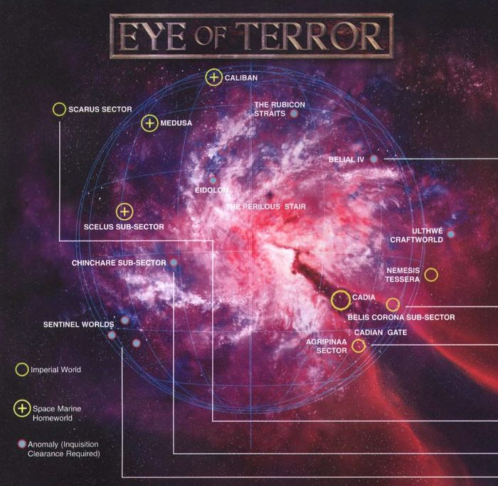
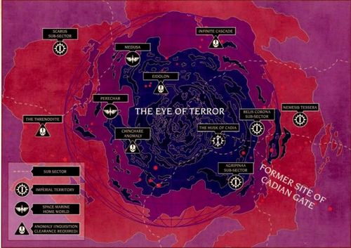
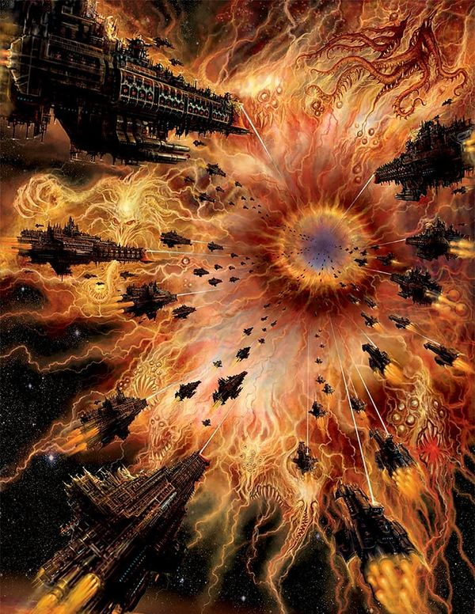
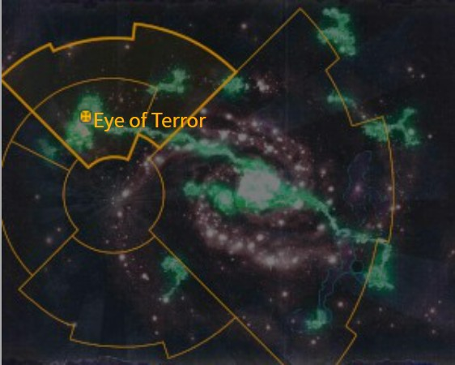

# 0933 恐惧之眼 Eye of Terror

精校状态：中文行文已逐段精校，部分术语仍为暂定

分类：地理 / 真实空间 Real Space / 朦胧星域 Segmentum Obscurus

原文来源：https://www.bilibili.com/opus/1080489230560395270

原作者：帝国神选罐头

原文时间：编辑于 2025年09月28日 16:00

[返回分类目录](目录.md) · [全书目录](../../目录.md)

<!-- A0933-B0001 -->
**英文原文**

The Eye of Terror (Ocularis Terribus, Anathema Nonplus Ultra (Ordo Malleus), Ocularis Malifica) is a massive Warp rift, where the Warp co-exists with real space, the largest and most well-known in the Galaxy. It is located at the edge of the Galaxy, to the north and west of Terra, in the Segmentum Obscurus.

<!-- /A0933-B0001 -->

<!-- A0933-B0002 -->

原译文

恐惧之眼（恐怖之眼、终极诅咒（圣锤修会）、邪恶之眼）是一个巨大的亚空间裂隙，银河系中最大、最著名的亚空间与真实空间共存之地。它位于银河系的边缘，在泰拉的西北部，在朦胧星域。

**校订译文**

恐惧之眼又称恐怖之眼（Ocularis Terribus）、终极诅咒（Anathema Nonplus Ultra，恶魔审判庭用名）或邪恶之眼（Ocularis Malifica）。它是一道巨大的亚空间裂隙，使亚空间与现实空间在此共存，本文称其为银河中规模最大、最为人熟知的此类区域。它位于朦胧星域、泰拉西北方的银河边缘。

**校注：** “银河最大裂隙”是原文表述；本篇同时收有大裂隙形成前后的材料，故归于本文描述，不抹去其年代层次。三组高哥特语别称沿原稿暂译，不宣称官方。

<!-- /A0933-B0002 -->

<!-- A0933-B0003 图片 -->

<!-- A0933-B0004 -->

原译文

The Eye of Terror and its surroundings at the time of the 13th Black Crusade 第13次黑色远征时的恐惧之眼及其周围环境

**校订译文**

The Eye of Terror and its surroundings at the time of the 13th Black Crusade 第13次黑色远征时的恐惧之眼及其周围环境

<!-- /A0933-B0004 -->

<!-- A0933-B0005 -->
###### Overview 概述

<!-- /A0933-B0005 -->

<!-- A0933-B0006 -->
**英文原文**

The Eye of Terror is an area of the Galaxy where the Warp and realspace overlap. A ship can enter the Warp without a Warp drive simply by crossing its border. The area used to be the domain of the old Eldar empire. When Slaanesh was born, the energy of their birth permanently breached the veil between realspace and the Warp; all the planets and stars that existed in that area are now within the Warp. These worlds have become daemon worlds. At the very centre of the Eye lies the "byssos", a hole in the fabric of reality through which raw Chaos energy pours out.

<!-- /A0933-B0006 -->

<!-- A0933-B0007 -->

原译文

恐惧之眼是银河系中亚空间和真实空间重叠的区域。一艘战舰需越过其边界，就可以在没有亚空间驱动器的情况下进入亚空间。该地区曾经是旧灵族帝国的领地。当色孽诞生时，祂诞生的能量永久地打破了现实空间和亚空间之间的帷幕；该地区存在的所有行星和恒星现在都在亚空间内。这些世界已经变成了恶魔世界。恐惧之眼的中心是“深渊”，现实结构中的一个洞，原始的混沌能量通过这个洞倾泻而出。

**校订译文**

恐惧之眼是银河中亚空间与现实空间相互重叠的区域。飞船只须越过边界，便能进入亚空间，甚至无需亚空间引擎。这里曾是古代灵族帝国的疆域。色孽诞生时释放的能量永久撕开了两种空间之间的帷幕，使当地原有的行星与恒星尽数落入亚空间，诸世界化为恶魔世界。恐惧之眼正中心被称为“深渊”（byssos），那是现实结构中的一个空洞，原始混沌能量源源不断地从中涌出。

<!-- /A0933-B0007 -->

<!-- A0933-B0008 -->
## History 历史

<!-- /A0933-B0008 -->

<!-- A0933-B0009 -->
**英文原文**

The Eye of Terror is not a natural phenomenon, as it was created by the Old Ones during the War in Heaven, as they fought the Necrons. The Necrons would later seal the Eye of Terror closed but it was later reopened by the psychic shock wave that accompanied the birth of the fourth Chaos God, Slaanesh, during the Fall of the Eldar.

<!-- /A0933-B0009 -->

<!-- A0933-B0010 -->

原译文

恐惧之眼不是一种自然现象，因为它是由古圣在天堂之战期间与死灵作战时创造的。死灵后来将关闭的恐怖之眼封锁起来，但后来在灵族之陨期间，随着第四位混沌之神色孽的诞生，灵能冲击波重新打开了它。

**校订译文**

恐惧之眼并非自然现象。按本篇所述，它最初由古圣在天堂之战中对抗太空死灵时创造，后来被太空死灵封闭。灵族之陨期间，第四位混沌之神色孽诞生，伴随而来的灵能冲击波又将它重新撕开。

**校注：** 原文明确叙述古圣创造、太空死灵封闭、色孽诞生时重开的三阶段历史；与仅讲色孽诞生导致裂隙的旧说有叙述差异，按本段保留，不自行调和。

<!-- /A0933-B0010 -->

<!-- A0933-B0011 -->
**英文原文**

The shock of the birth was so great it could not wholly be contained within the Warp, but spilled out into reality through the minds of the Eldar. Consequently, the Eye covers most of the region of the former Eldar Empire. Other zones of overlap were created, but the Eye is the most significant.

<!-- /A0933-B0011 -->

<!-- A0933-B0012 -->

原译文

诞生的冲击是如此之大，以至于无法完全被亚空间所控制，而是通过灵族的思想传播到现实中。因此，恐惧之眼覆盖了前灵族帝国的大部分地区。创建了其他重叠区域，但恐惧之眼是最重要的。

**校订译文**

色孽诞生的冲击如此剧烈，连亚空间都无法完全容纳；它通过灵族的心灵溢入现实。因此，恐惧之眼覆盖了旧灵族帝国的大部分疆土。这场灾变也造成了其他空间重叠区，但恐惧之眼是其中最为重要的一处。

<!-- /A0933-B0012 -->

<!-- A0933-B0013 -->
**英文原文**

Sometime at the dawn of the Imperium but before the Horus Heresy, the Eye of Terror was discovered by Imperial explorers in what was presumably a fairly remote region of the Galaxy, and Imperial scholars named is Cygnus X-1. The Eye didn't come into prominence until it was later discovered by the Word Bearers, who had arrived officially for conquest, but actually on a personal mission for renewed faith, and it was here that they discovered the "Primordial Truth". It would later be visited by the Emperor's Children and the Iron Warriors, intent on an expedition within the Eye, in search of the Angel Exterminatus. Before embarking upon this journey, Perturabo had formally named it the Eye of Terror.

<!-- /A0933-B0013 -->

<!-- A0933-B0014 -->

原译文

在帝国黎明的某个时候，但在荷鲁斯叛乱之前，帝国探索者在银河系相当偏远的地区发现了恐惧之眼，帝国学者将其命名为天鹅座X-1。恐惧之眼直到后来被怀言者发现才变得明显，怀言者正式抵达是为了征服，但实际上是为了更新信仰的个人使命，正是在这里，他们发现了“原初真理”。后来，帝皇之子和钢铁勇士来到了这里，他们打算在恐惧之眼内探索，寻找灭绝天使。在踏上这段旅程之前，佩图拉博正式将其命名为“恐惧之眼”。

**校订译文**

帝国建立初期、荷鲁斯之乱爆发以前，帝国探索者在银河一处想必相当偏远的区域发现恐惧之眼，学者将其命名为“天鹅座 X-1”。直到怀言者后来抵达，它才真正引起重视。怀言者表面上为征服而来，实际却怀着重新寻找信仰的私下使命；他们正是在此发现了“原初真理”。帝皇之子与钢铁勇士后来也来到这里，准备深入其中寻找“灭绝天使”。启程之前，佩图拉博正式将这片区域命名为恐惧之眼。

<!-- /A0933-B0014 -->

<!-- A0933-B0015 -->
**英文原文**

Old star charts all came to map the Eye of Terror with the legend "Abandon hope all ye who enter here".

<!-- /A0933-B0015 -->

<!-- A0933-B0016 -->

原译文

古老的星图都描绘了恐惧之眼，传说“所有进入这里的人都放弃希望”。

**校订译文**

古老星图标绘恐惧之眼时，都附有一句题注：“进入此地者，当舍弃一切希望。”

**校注：** legend 在星图语境中是题注、标注，不是传说。

<!-- /A0933-B0016 -->

<!-- A0933-B0017 -->
**英文原文**

For the Traitor Legions, the Eye of Terror has been their exile, sanctuary, and safe haven for ten thousand years, from which they strike out at opportune, seemingly random moments. The Eye is also sanctuary for the most heretical renegades, fugitives of Imperial justice, and traitors throughout the Galaxy, and all are welcomed as fellow enemies of the Emperor and the Imperium.

<!-- /A0933-B0017 -->

<!-- A0933-B0018 -->

原译文

对于叛徒军团来说，恐惧之眼是他们一万年来的流放地、避难所和避风港，他们在适当的、看似随机的时刻从中脱身。恐惧之眼也是银河系中最异端的叛徒、帝国审判的逃犯和叛徒的避难所，所有人都被视为帝皇和帝国的敌人。

**校订译文**

一万年来，恐惧之眼一直是叛徒军团的流放地、庇护所与安全港。他们以此为基地，选择时机向外出击，在外界看来往往毫无规律可循。银河中那些最顽固的异端、逃避帝国制裁的亡命徒和叛逆，也都能在这里寻求庇护。作为帝皇与帝国的共同敌人，他们会受到接纳。

<!-- /A0933-B0018 -->

<!-- A0933-B0019 图片 -->

<!-- A0933-B0020 -->

原译文

The Eye of Terror and its surroundings in the present setting 当前背景下的恐惧之眼及其周围环境

**校订译文**

The Eye of Terror and its surroundings in the present setting 当前背景下的恐惧之眼及其周围环境

<!-- /A0933-B0020 -->

<!-- A0933-B0021 -->
**英文原文**

The Imperial world of Cadia was the nearest to the best-known stable gateway into the Eye, the Cadian Gate; consequently, it was the most fortified and militarised world in the Imperium, the first line of defense against Chaos incursions into real space. It would seem that ships exit through this gateway far more often than they enter it.

<!-- /A0933-B0021 -->

<!-- A0933-B0022 -->

原译文

卡迪亚帝国世界是最接近最著名的通往恐惧之眼的稳定大门 — 卡迪亚之门的地方；因此，它是帝国中最坚固、最军事化的世界，是抵御混沌入侵现实空间的第一道防线。看起来，战舰通过这个门户离开的频率远高于进入的频率。

**校订译文**

通往恐惧之眼最著名的稳定通路，是卡迪亚之门；帝国世界卡迪亚位于其近旁。因此，卡迪亚成为帝国设防最严、军事化程度最高的世界，构成抵御混沌侵入现实空间的第一道防线。相比驶入，舰船似乎更常通过这道门户驶出恐惧之眼。

<!-- /A0933-B0022 -->

<!-- A0933-B0023 -->
### Abaddon the Despoiler 掠夺者阿巴顿

<!-- /A0933-B0023 -->

<!-- A0933-B0024 -->
**英文原文**

Abaddon the Despoiler led an attack through the Eye of Terror during a massive campaign, the 13th Black Crusade, which sealed the fate of Cadia and many other systems.

<!-- /A0933-B0024 -->

<!-- A0933-B0025 -->

原译文

在一场大规模的战役中，掠夺者阿巴顿通过恐惧之眼领导了一场袭击，即第13次黑色远征，这场战役决定了卡迪亚和许多其他星系的命运。

**校订译文**

掠夺者阿巴顿发动第十三次黑色远征，率军从恐惧之眼出击。这场庞大战役决定了卡迪亚及许多其他星系的命运。

<!-- /A0933-B0025 -->

<!-- A0933-B0026 -->
###### Description 描述

<!-- /A0933-B0026 -->

<!-- A0933-B0027 -->
### General Geography 地理概况

原题：General Geography 普通地理

<!-- /A0933-B0027 -->

<!-- A0933-B0028 -->
**英文原文**

The geography of the Eye of Terror can best be described by the behaviours of the warp in this region:

<!-- /A0933-B0028 -->

<!-- A0933-B0029 -->

原译文

恐惧之眼的地理特征可以用该地区亚空间的表现来最好地描述：

**校订译文**

要理解恐惧之眼的地理形态，最好的办法是观察亚空间在此如何运作。

<!-- /A0933-B0029 -->

<!-- A0933-B0030 -->
**英文原文**

When travelling near to the Eye of Terror, one will first notice a gradual increase in the distorting and mutating effects of the Warp. In terms of optical appearance, the Eye of Terror has a nebulous violet sheen with streaks of red, purple and blue. Imperial ships avoid the area around the Eye for thousands of light-years. Ships traveling too close to the Eye can be thrown far off-course - they can also be caught in temporal whirlpools which carry them backwards or forwards in time, or which trap them in limbo forever.

<!-- /A0933-B0030 -->

<!-- A0933-B0031 -->

原译文

当接近恐惧之眼时，人们会首先注意到亚空间和变异情况的逐渐增加。在光学外观方面，恐惧之眼具有模糊的紫色光泽，带有红色、紫色和蓝色条纹。帝国船只避开了恐惧之眼周围数千光年的区域。过于靠近恐惧之眼的船只可能会偏离航线 — 它们也可能被困在时间漩涡中，这些漩涡会使它们在时间上前后移动，或者将它们永远困在不定状态中。

**校订译文**

接近恐惧之眼时，首先能察觉到亚空间造成的扭曲与变异逐渐加剧。目视之下，它呈现朦胧的紫罗兰色光晕，其间划过红、紫、蓝色条纹。帝国舰船通常避开它周围数千光年的区域。靠得太近的船可能被抛离航线，也可能陷入时间漩涡，被送往过去或未来，甚至永远困于时间的缝隙中。

<!-- /A0933-B0031 -->

<!-- A0933-B0032 图片 -->

<!-- A0933-B0033 -->

原译文

The Eye of Terror 恐惧之眼

**校订译文**

The Eye of Terror 恐惧之眼

<!-- /A0933-B0033 -->

<!-- A0933-B0034 -->
**英文原文**

This trend culminates into a "wall" of powerful warpstorms that effectively separate the inside of the Eye of Terror from the outside, as travel through them is next to impossible. Any attempts to cross these warpstorms with any semblance of an organized fleet are doomed to begin with, as the storms scatter the ships into all directions. The only safe and reliable opening in this barrier was the Cadian Gate, and the region was heavily defended and patrolled by the Imperium military. It's not unusual for Chaos Warbands returning to the Eye of Terror to take up a resting-period in safe distance from these warpstorms, before they continue their travel through these warpstorms into the Eye of Terror proper.

<!-- /A0933-B0034 -->

<!-- A0933-B0035 -->

原译文

这一趋势最终形成了一堵强大的亚空间风暴“墙”，有效地将恐惧之眼的内部与外部隔开，因为穿越它们几乎是不可能的。任何试图以任何有组织的舰队的形式穿越这些亚空间风暴的企图都注定要破灭，因为风暴会将船只分散到各个方向。这道屏障唯一安全可靠的入口是卡迪亚之门，该地区受到帝国军队的严密防御和巡逻。回到恐惧之眼的混沌战士在继续穿越这些亚空间风暴进入恐惧之眼之前，会在远离这些亚空间风暴的安全距离内休息一段时间，这并不罕见。

**校订译文**

这种影响最终形成一道强大亚空间风暴组成的“墙”，将恐惧之眼内外隔开，几乎无法穿越。任何试图维持舰队建制、整体穿过风暴的行动都注定失败，因为舰船会被吹散到四面八方。屏障中唯一安全可靠的开口曾是卡迪亚之门，因此帝国重兵驻防，并持续巡逻。返回恐惧之眼的混沌战帮常会先在远离风暴的安全区域休整，再继续穿越屏障，进入其内部。

<!-- /A0933-B0035 -->

<!-- A0933-B0036 -->
**英文原文**

Behind these warpstorms lies the inside of the Eye of Terror. Here, there are warpstorms as well, but also areas where the influence of the warp is faint, though never completely gone. Inside the Eye of Terror, realspace and warp overlap to various degrees, but there is never really a stable balance between them. These warpstorms and calm zones move about unpredictably inside the Eye of Terror in a chaotic sort of tides, but there are also areas that are constantly filled with warpstorms or constantly calm. There are stable secret pathways where a ship can travel through the Eye of Terror without encountering the dangers of the warp, though further details are scarce and the locations of these safe pathways are only known to the Eldar.

<!-- /A0933-B0036 -->

<!-- A0933-B0037 -->

原译文

在这些亚空间风暴的背后，隐藏着恐惧之眼的内部。在这里，也有亚空间风暴，但也有亚空间影响微弱的区域，尽管从未完全消失。在恐惧之眼中，真实空间和亚空间在不同程度上重叠，但它们之间从来没有真正的稳定平衡。这些风暴和平静区在恐惧之眼内以混乱的潮汐形式不可预测地移动，但也有一些地区不断充满亚空间风暴或保持平静。有稳定的秘密通道，船只可以穿过恐惧之眼，而不会遇到亚空间的危险，尽管进一步的细节很少，这些安全通道的位置只有灵族知道。

**校订译文**

风暴墙之后才是恐惧之眼内部。那里同样存在亚空间风暴，却也有影响较弱的区域，只是从不完全消失。现实空间与亚空间以不同程度重叠，始终无法达到真正稳定的平衡。风暴与平静区如混乱的潮汐，不可预测地迁移；也有一些地方常年风暴肆虐，或始终相对平静。另有稳定而隐秘的安全路径，能让飞船避开亚空间危险、穿越恐惧之眼，但详情鲜为人知，只有灵族掌握其位置。

<!-- /A0933-B0037 -->

<!-- A0933-B0038 -->
**英文原文**

In general terms, the influence of the warp gets stronger and stronger the closer you get to the centre of the Eye of Terror and even the most basic laws of nature begin to lose all meaning. At the very centre, there is pure warp.

<!-- /A0933-B0038 -->

<!-- A0933-B0039 -->

原译文

一般来说，越接近恐惧之眼的中心，亚空间的影响就越强，甚至最基本的自然法则也开始失去意义。在中心，有纯粹的亚空间。

**校订译文**

一般来说，越接近恐惧之眼的中心，亚空间的影响就越强，甚至最基本的自然法则也开始失去意义。在中心，有纯粹的亚空间。

<!-- /A0933-B0039 -->

<!-- A0933-B0040 -->
**英文原文**

The warp runs in currents and waves. Inside the Eye of Terror there are dead zones where certain currents of the warp end. If a Space Hulk is adrift in the warp and gets caught in one of these currents, it gets "washed ashore" in one of these dead zones in the Eye of Terror, where it can be claimed by enterprising warbands.

<!-- /A0933-B0040 -->

<!-- A0933-B0041 -->

原译文

亚空间在流和波中运行。在恐惧之眼内部，有一些死亡区，某些亚空间流在那里结束。如果一艘太空废船在亚空间中漂流，并被困在其中一股流中，它就会在恐惧之眼的其中一个死亡区“被冲上岸”，在那里，它可以被有魄力的战帮占领。

**校订译文**

亚空间像水流与波浪一样涌动。恐惧之眼中存在一些滞流区，特定亚空间流会在那里终止。太空废船若在漂流中被这类水流卷走，就可能在某处滞流区“冲上岸”，供有心的战帮占为己有。

**校注：** dead zones 这里指特定亚空间流终止的区域，并非行星分类 Dead World。暂译滞流区以明确所指。

<!-- /A0933-B0041 -->

<!-- A0933-B0042 -->
### Celestial Regions and Objects 天区与天体

原题：Celestial Regions and Objects 天体区域和物质

<!-- /A0933-B0042 -->

<!-- A0933-B0043 -->
**英文原文**

It is virtually impossible to make a map of the Eye of Terror. Objects, planets and stars change their positions, disappear or transform into something else. Very few locations in the Eye of Terror have a fixed position, and out of those most belong to the most powerful Daemons and Daemon Princes. The few others are hotly contested for their strategic value.

<!-- /A0933-B0043 -->

<!-- A0933-B0044 -->

原译文

绘制恐惧之眼地图几乎是不可能的。物体、行星和恒星会改变位置、消失或变成其他东西。在恐惧之眼，很少有地方有固定的位置，其中大多数属于最强大的恶魔和恶魔王子。其他少数几个因其战略价值而备受争议。

**校订译文**

恐惧之眼几乎无法绘制成地图。物体、行星与恒星不断改变位置，消失，或变成其他东西。位置固定的地点寥寥无几，大多属于最强大的恶魔与恶魔亲王；剩下的少数地点，则因战略价值而遭到激烈争夺。

<!-- /A0933-B0044 -->

<!-- A0933-B0045 图片 -->

<!-- A0933-B0046 -->

原译文

The Eye of Terror in the Segmentum Obscurus before the formation of the Great Rift 大裂隙形成前的朦胧星域的恐惧之眼

**校订译文**

The Eye of Terror in the Segmentum Obscurus before the formation of the Great Rift 大裂隙形成前的朦胧星域的恐惧之眼

<!-- /A0933-B0046 -->

<!-- A0933-B0047 -->
**英文原文**

Inside the Eye of Terror, space is filled with all sorts disturbing phenomena, such as transparent curtains being suspended in mid-space, or faces and shapes appearing out of nowhere and disappearing again. Suns move and arrange into ever-new constellations, sometimes a giant face. Sometimes a sun is elongated across impossible distances.

<!-- /A0933-B0047 -->

<!-- A0933-B0048 -->

原译文

在恐惧之眼内部，空间充满了各种令人不安的现象，比如透明的帷幕悬挂在中间的空间，或者突然出现又消失的面孔和形状。太阳移动并排列成新的星座，有时是一张巨大的脸。有时，太阳会被拉长到不可能的距离。

**校订译文**

恐惧之眼内充满令人不安的异象：透明帷幕悬在虚空，面孔与轮廓凭空出现，又再度消失。恒星不断移动，排列成新的星座，有时甚至组成巨大的脸。有些恒星还会被拉伸，横跨不可思议的距离。

<!-- /A0933-B0048 -->

<!-- A0933-B0049 -->
**英文原文**

The Eye of Terror also contains destroyed planets, the remnants of the ancient Eldar Empire. Also spaceship-wrecks are adrift here, sometimes still inhabited by its crew.

<!-- /A0933-B0049 -->

<!-- A0933-B0050 -->

原译文

恐惧之眼还包含被摧毁的行星，即古代灵族帝国的遗迹。此外，飞船残骸也漂浮在这里，有时仍有船员居住。

**校订译文**

恐惧之眼还包含被摧毁的行星，即古代灵族帝国的遗迹。此外，飞船残骸也漂浮在这里，有时仍有船员居住。

<!-- /A0933-B0050 -->

<!-- A0933-B0051 图片 -->

<!-- A0933-B0052 -->

原译文

The Eye of Terror after the formation of the Great Rift 大裂隙形成后的恐惧之眼

**校订译文**

The Eye of Terror after the formation of the Great Rift 大裂隙形成后的恐惧之眼

<!-- /A0933-B0052 -->

<!-- A0933-B0053 -->
**英文原文**

There still are functional Webway-portals in the Eye of Terror. Most passages in the region that is now the Eye of Terror were destroyed during the birth of Slaanesh. Usage of the remaining portals and passages is impractical for servants of Chaos: out of those remaining passages, most are overrun with daemons and trespassing is simply too dangerous. Also many passages lead to places that used to be important during the days of the ancient Aeldari-empire but are entirely irrelevant nowadays. And in any case, only very few portals are known.

<!-- /A0933-B0053 -->

<!-- A0933-B0054 -->

原译文

恐惧之眼仍然有功能性的网道门户。现在是恐惧之眼的地区的大部分通道在色孽诞生时都被摧毁了。对于混沌之仆来说，使用剩余的入口和通道是不切实际的：在这些剩余的通道中，大多数都被恶魔淹没，擅自进入太危险了。此外，许多段落都指向了在古代灵族帝国时期曾经重要但现在完全无关紧要的地方。无论如何，已知的门户很少。

**校订译文**

恐惧之眼内仍有一些能使用的网道门户。色孽诞生时，当地大部分网道通路已被摧毁。余下的门户和路径对混沌仆从也难有实际用途：许多已被恶魔占据，擅自闯入过于危险；另一些通往古灵族帝国时代的重要地点，如今那些地方却已毫无价值。况且，已知门户本就极少。

<!-- /A0933-B0054 -->

<!-- A0933-B0055 -->
**英文原文**

Adraith — Daemon World

<!-- /A0933-B0055 -->

<!-- A0933-B0056 -->

原译文

阿德赖斯 — 恶魔世界

**校订译文**

阿德赖斯 — 恶魔世界

<!-- /A0933-B0056 -->

<!-- A0933-B0057 -->
**英文原文**

Aktosha — Slaanesh Daemon World, Former Crone World

<!-- /A0933-B0057 -->

<!-- A0933-B0058 -->

原译文

阿克托沙 — 色孽恶魔世界，前老妪世界

**校订译文**

阿克托沙 — 色孽恶魔世界，前老妪世界

<!-- /A0933-B0058 -->

<!-- A0933-B0059 -->
**英文原文**

Anathrax — Nurgle Daemon World

<!-- /A0933-B0059 -->

<!-- A0933-B0060 -->

原译文

阿纳斯拉克斯 — 纳垢恶魔世界

**校订译文**

阿纳斯拉克斯 — 纳垢恶魔世界

<!-- /A0933-B0060 -->

<!-- A0933-B0061 -->
**英文原文**

Araki — Daemon War World fought over by the rival Chaos Lords Toxus the Decayed and Xaarn the Annihilator

<!-- /A0933-B0061 -->

<!-- A0933-B0062 -->

原译文

阿拉基 - 恶魔战争世界由敌对的混沌领主腐朽者托克斯和歼灭者沙恩争夺

**校订译文**

阿拉基——一颗处于战争中的恶魔世界，敌对的混沌领主腐朽者托克斯与歼灭者沙恩在此争夺统治权。

<!-- /A0933-B0062 -->

<!-- A0933-B0063 -->

原译文

Belial IV Subsector 贝利亚四号分区

**校订译文**

Belial IV Subsector 贝利亚四号次星区

<!-- /A0933-B0063 -->

<!-- A0933-B0064 -->

原译文

Belial IV System 贝利亚四号星系

**校订译文**

Belial IV System 贝利亚四号星系

<!-- /A0933-B0064 -->

<!-- A0933-B0065 -->
**英文原文**

Belial IV — Crone World, most ill-famed planet of the Eye of Terror

<!-- /A0933-B0065 -->

<!-- A0933-B0066 -->

原译文

贝利亚四号 — 老妪世界，最臭名昭著的恐惧之眼星球

**校订译文**

贝利亚四号 — 老妪世界，最臭名昭著的恐惧之眼星球

<!-- /A0933-B0066 -->

<!-- A0933-B0067 -->
**英文原文**

Bubonicus — Nurgle Daemon World

<!-- /A0933-B0067 -->

<!-- A0933-B0068 -->

原译文

布波尼库斯 — 纳垢恶魔世界

**校订译文**

布波尼库斯 — 纳垢恶魔世界

<!-- /A0933-B0068 -->

<!-- A0933-B0069 -->
**英文原文**

Chimera System — Has nine worlds mutated by its Star Chimera

<!-- /A0933-B0069 -->

<!-- A0933-B0070 -->

原译文

奇美拉星系 — 有九个世界被它的星球奇美拉变异了

**校订译文**

奇美拉星系——其恒星奇美拉使星系内九颗世界发生变异。

**校注：** Star Chimera 指恒星，不是行星；九个世界受到恒星影响而异变。

<!-- /A0933-B0070 -->

<!-- A0933-B0071 -->
**英文原文**

Eidafaeron — Crone World, Homeworld of Phoenix Lords Asurmen and Jain Zar

<!-- /A0933-B0071 -->

<!-- A0933-B0072 -->

原译文

艾达法伦 — 老妪世界，凤凰领主阿苏曼和贾恩·扎尔的家园

**校订译文**

艾达法伦——老妪世界，凤凰领主阿苏曼与简恩·扎尔的母星。

<!-- /A0933-B0072 -->

<!-- A0933-B0073 -->

原译文

Eidolon Subsector 艾多隆分区

**校订译文**

Eidolon Subsector 艾多隆次星区

<!-- /A0933-B0073 -->

<!-- A0933-B0074 -->
**英文原文**

Drakaasi — Khorne Daemon World

<!-- /A0933-B0074 -->

<!-- A0933-B0075 -->

原译文

德拉卡西 — 恐虐恶魔世界

**校订译文**

德拉卡西 — 恐虐恶魔世界

<!-- /A0933-B0075 -->

<!-- A0933-B0076 -->
**英文原文**

Eidolon — Daemon World, former Eldar Maiden World

<!-- /A0933-B0076 -->

<!-- A0933-B0077 -->

原译文

艾多隆 — 恶魔世界，前灵族少女世界

**校订译文**

艾多隆——恶魔世界，原为灵族处女世界。

<!-- /A0933-B0077 -->

<!-- A0933-B0078 -->
**英文原文**

Oliensis — Slaanesh Daemon World

<!-- /A0933-B0078 -->

<!-- A0933-B0079 -->

原译文

欧连西斯 — 色孽恶魔世界

**校订译文**

欧连西斯 — 色孽恶魔世界

<!-- /A0933-B0079 -->

<!-- A0933-B0080 -->
**英文原文**

Plague Planet — Homeworld of the Death Guard

<!-- /A0933-B0080 -->

<!-- A0933-B0081 -->

原译文

瘟疫星 — 死亡守卫家园世界

**校订译文**

瘟疫星 — 死亡守卫家园世界

<!-- /A0933-B0081 -->

<!-- A0933-B0082 -->
**英文原文**

Gallium — Hell Forge Daemon World of the Dark Mechanicum

<!-- /A0933-B0082 -->

<!-- A0933-B0083 -->

原译文

镓 — 黑暗机械教的地狱熔炉恶魔世界

**校订译文**

镓 — 黑暗机械教的地狱熔炉恶魔世界

<!-- /A0933-B0083 -->

<!-- A0933-B0084 -->
**英文原文**

Gorgon — The Red Star of Destruction

<!-- /A0933-B0084 -->

<!-- A0933-B0085 -->

原译文

戈尔贡 — 毁灭的红星

**校订译文**

戈尔贡 — 毁灭的红星

<!-- /A0933-B0085 -->

<!-- A0933-B0086 -->
**英文原文**

Harmony — Daemon World of the Emperor's Children

<!-- /A0933-B0086 -->

<!-- A0933-B0087 -->

原译文

和谐星 — 帝皇之子的恶魔世界

**校订译文**

和谐星 — 帝皇之子的恶魔世界

<!-- /A0933-B0087 -->

<!-- A0933-B0088 -->
**英文原文**

Ichoria — Daemon World

<!-- /A0933-B0088 -->

<!-- A0933-B0089 -->

原译文

伊科瑞亚 — 恶魔世界

**校订译文**

伊科瑞亚 — 恶魔世界

<!-- /A0933-B0089 -->

<!-- A0933-B0090 -->
**英文原文**

Iydris — Crone World near a Supermassive Black Hole

<!-- /A0933-B0090 -->

<!-- A0933-B0091 -->

原译文

伊德瑞斯 — 超大质量黑洞附近的老妪世界

**校订译文**

伊德瑞斯 — 超大质量黑洞附近的老妪世界

<!-- /A0933-B0091 -->

<!-- A0933-B0092 -->
**英文原文**

Logans World — Primative World where Humans and Orks cooperate and compete

<!-- /A0933-B0092 -->

<!-- A0933-B0093 -->

原译文

洛根世界 — 人类和欧克合作与竞争的原始世界

**校订译文**

洛根世界 — 人类和欧克合作与竞争的原始世界

<!-- /A0933-B0093 -->

<!-- A0933-B0094 -->
**英文原文**

Kulrei'arah — Nurgle Daemon World, former Eldar World

<!-- /A0933-B0094 -->

<!-- A0933-B0095 -->

原译文

库雷’亚拉 — 纳垢恶魔世界，前灵族世界

**校订译文**

库雷’亚拉 — 纳垢恶魔世界，前灵族世界

<!-- /A0933-B0095 -->

<!-- A0933-B0096 -->
**英文原文**

Maeleum — Dead World, temporarily the Homeworld of the Sons of Horus

<!-- /A0933-B0096 -->

<!-- A0933-B0097 -->

原译文

玛勒姆 — 死亡世界，暂时是荷鲁斯之子的家园世界

**校订译文**

玛勒姆——死寂世界，曾一度作为荷鲁斯之子的母星。

<!-- /A0933-B0097 -->

<!-- A0933-B0098 -->
**英文原文**

Medrengard — Homeworld of the Iron Warriors

<!-- /A0933-B0098 -->

<!-- A0933-B0099 -->

原译文

梅德林加德 — 钢铁勇士的家园世界

**校订译文**

梅林德加德——钢铁勇士的母星。

<!-- /A0933-B0099 -->

<!-- A0933-B0100 -->
**英文原文**

Miarisillion — Daemon World, former Crone World

<!-- /A0933-B0100 -->

<!-- A0933-B0101 -->

原译文

米亚瑞西利恩 — 恶魔世界，前老妪世界

**校订译文**

米亚瑞西利恩 — 恶魔世界，前老妪世界

<!-- /A0933-B0101 -->

<!-- A0933-B0102 -->
**英文原文**

Nardonis — Slaanesh Daemon World ruled by Nardonis

<!-- /A0933-B0102 -->

<!-- A0933-B0103 -->

原译文

纳尔多尼斯 — 纳尔多尼斯统治的色孽恶魔世界

**校订译文**

纳尔多尼斯 — 纳尔多尼斯统治的色孽恶魔世界

<!-- /A0933-B0103 -->

<!-- A0933-B0104 -->
**英文原文**

Phagos VII — Nurgle Daemon World

<!-- /A0933-B0104 -->

<!-- A0933-B0105 -->

原译文

法戈斯七号 — 纳垢恶魔世界

**校订译文**

法戈斯七号 — 纳垢恶魔世界

<!-- /A0933-B0105 -->

<!-- A0933-B0106 -->
**英文原文**

Pluvioris — Daemon World

<!-- /A0933-B0106 -->

<!-- A0933-B0107 -->

原译文

普鲁维奥里斯 — 恶魔世界

**校订译文**

普鲁维奥里斯 — 恶魔世界

<!-- /A0933-B0107 -->

<!-- A0933-B0108 -->
**英文原文**

Sicarus — Homeworld of the Word Bearers

<!-- /A0933-B0108 -->

<!-- A0933-B0109 -->

原译文

西卡鲁斯 — 怀言者的家园世界

**校订译文**

西卡鲁斯 — 怀言者的家园世界

<!-- /A0933-B0109 -->

<!-- A0933-B0110 -->
**英文原文**

Skalathrax — Former Daemon World of the World Eaters

<!-- /A0933-B0110 -->

<!-- A0933-B0111 -->

原译文

斯凯拉斯莱克斯 — 吞世者的前恶魔世界

**校订译文**

斯卡拉特拉克斯——吞世者曾经的恶魔世界。

<!-- /A0933-B0111 -->

<!-- A0933-B0112 -->
**英文原文**

Sublime — Black Market/Neutral World

<!-- /A0933-B0112 -->

<!-- A0933-B0113 -->

原译文

极端星 — 黑市/中立世界

**校订译文**

极端星 — 黑市/中立世界

<!-- /A0933-B0113 -->

<!-- A0933-B0114 -->
**英文原文**

Temporia — Hell Forge Daemon World of the Dark Mechanicum

<!-- /A0933-B0114 -->

<!-- A0933-B0115 -->

原译文

坦珀利亚 — 黑暗机械教的地狱熔炉恶魔世界

**校订译文**

坦珀利亚 — 黑暗机械教的地狱熔炉恶魔世界

<!-- /A0933-B0115 -->

<!-- A0933-B0116 -->
**英文原文**

Uolesh — Daemon World

<!-- /A0933-B0116 -->

<!-- A0933-B0117 -->

原译文

乌奥列什 — 恶魔世界

**校订译文**

乌奥列什 — 恶魔世界

<!-- /A0933-B0117 -->

<!-- A0933-B0118 -->
**英文原文**

Uphrateus — Daemonic War World, former Homeworld of the Sentinels of Uphrateus Chapter

<!-- /A0933-B0118 -->

<!-- A0933-B0119 -->

原译文

幼发拉底 — 恶魔战争世界，幼发拉底哨兵战团的前家园世界

**校订译文**

幼发拉底 — 恶魔战争世界，幼发拉底哨兵战团的前家园世界

<!-- /A0933-B0119 -->

<!-- A0933-B0120 -->
**英文原文**

Uralan — Where Abaddon the Despoiler found Drach'nyen

<!-- /A0933-B0120 -->

<!-- A0933-B0121 -->

原译文

乌拉兰 — 掠夺者阿巴顿发现德拉科’尼恩的位置

**校订译文**

乌拉兰——掠夺者阿巴顿发现德拉科尼恩之处。

<!-- /A0933-B0121 -->

<!-- A0933-B0122 -->
**英文原文**

Urum — Daemon World, former Crone World, base of Fabius Bile and his Consortium

<!-- /A0933-B0122 -->

<!-- A0933-B0123 -->

原译文

乌鲁姆 — 恶魔世界，前老妪世界，法比乌斯·拜耳及其联合的基地

**校订译文**

乌鲁姆——恶魔世界，原为老妪世界，是法比乌斯·拜尔及其共同体的基地。

<!-- /A0933-B0123 -->

<!-- A0933-B0124 -->
**英文原文**

World of Immortal Sorrows — Slaanesh Daemon World, former Crone World

<!-- /A0933-B0124 -->

<!-- A0933-B0125 -->

原译文

不朽悲伤世界 — 色孽恶魔世界，前老妪世界

**校订译文**

不朽悲伤世界 — 色孽恶魔世界，前老妪世界

<!-- /A0933-B0125 -->

<!-- A0933-B0126 -->
**英文原文**

Xana II — Hell Forge Daemon World of the Dark Mechanicum

<!-- /A0933-B0126 -->

<!-- A0933-B0127 -->

原译文

夏纳二号 — 黑暗机械教的地狱熔炉恶魔世界

**校订译文**

夏娜二号 — 黑暗机械教的地狱熔炉恶魔世界

<!-- /A0933-B0127 -->

<!-- A0933-B0128 -->

原译文

Rogue Celestial Objects: 流浪天体：

**校订译文**

Rogue Celestial Objects: 流浪天体：

<!-- /A0933-B0128 -->

<!-- A0933-B0129 -->
**英文原文**

Sortiarius — Planet of the Sorcerers — Homeworld of the Thousand Sons. Has since moved into orbit over Prospero

<!-- /A0933-B0129 -->

<!-- A0933-B0130 -->

原译文

索提尔瑞斯 — 巫师星 — 千子家园世界。此后，它已进入普罗斯佩罗上空的轨道

**校订译文**

索提尔瑞斯——又称巫师星，千子的母星；如今已迁至普罗斯佩罗上空的轨道。

**校注：** 本句原文称巫师星进入普罗斯佩罗上空轨道，按原叙述保留；不同篇目的轨道/双行星关系如有差异，需另核来源。

<!-- /A0933-B0130 -->

<!-- A0933-B0131 -->
**英文原文**

Chinchare System — now in the Halo Stars

<!-- /A0933-B0131 -->

<!-- A0933-B0132 -->

原译文

钦查尔星系 — 现在在光环群星

**校订译文**

钦查尔星系 — 现在在光环群星

<!-- /A0933-B0132 -->

<!-- A0933-B0133 -->

原译文

Chinchare 钦查尔

**校订译文**

Chinchare 钦查尔

<!-- /A0933-B0133 -->

<!-- A0933-B0134 -->
### Life in the Eye of Terror 恐惧之眼中的生活

<!-- /A0933-B0134 -->

<!-- A0933-B0135 -->
**英文原文**

Merely being inside the Eye of Terror is already extremely dangerous, though, ironically, a violent death at the hands of servants of the Dark Gods is one of the lesser worries. The main danger is the corruptive influence of the warp itself. Laws of nature become unreliable and the warp distorts flesh, soul and matter. Mortals within the Eye, constantly exposed to the effects of Chaos, are physically warped so their bodies come to reflect their flawed natures; the Death Guard, for example, worship Nurgle, Chaos God of Decay, leading their bodies to become bloated and putrid.

<!-- /A0933-B0135 -->

<!-- A0933-B0136 -->

原译文

仅仅身处恐惧之眼就已经非常危险了，尽管具有讽刺意味的是，黑暗诸神之仆的暴力死亡是一个较小的担忧。主要的危险是帷幕本身的腐化影响。自然法则变得不可靠，扭曲了肉体、灵魂和物质。恐惧之眼中的凡人不断暴露在混沌的影响下，身体扭曲，因此他们的身体反映了他们有缺陷的本性；例如，死亡守卫崇拜腐朽的混沌之神纳垢，导致他们的身体变得臃肿和腐烂。

**校订译文**

身处恐惧之眼，本身就极其危险。讽刺的是，死于黑暗诸神仆从的暴力，反而只是较次要的担忧。最大的危险来自亚空间本身的腐化：自然法则不再可靠，血肉、灵魂与物质都遭到扭曲。凡人不断暴露在混沌之下，肉身逐渐变形，映出其本性中的缺陷。例如，死亡守卫崇拜腐朽之神纳垢，身体因而臃肿、腐烂。

<!-- /A0933-B0136 -->

<!-- A0933-B0137 -->
**英文原文**

Here are some examples of how these changes in the laws of nature can manifest: On Medrengard, the sky is blindingly white and the sun is black. On Drakaasi there is an ocean filled with blood instead of water, and it extends via rivers of blood deep in-land. The planet Sublime is frozen in time mid-explosion. The planet is shattered into thousands of fragments which simply levitate suspended in space. The Planet of Sorcerers is covered with impossible landscapes that change all the time. The location of streets and buildings can change over-night.

<!-- /A0933-B0137 -->

<!-- A0933-B0138 -->

原译文

以下是一些自然法则的变化如何体现的例子：在梅德林加德，天空是耀眼的白色，太阳是黑色的。在德拉卡西，有一个充满鲜血而不是水的海洋，它通过陆地深处的鲜血之河延伸。极端星在爆炸中被冻结。这颗行星被粉碎成数千块碎片，这些碎片只是悬浮在太空中。巫师星上布满了不可能的风景，这些风景一直在变化。街道和建筑物的位置可能会在夜间发生变化。

**校订译文**

自然法则在这里的变异，有时清晰可见。梅林德加德的天空白得刺眼，太阳却一片漆黑。德拉卡西有一片以鲜血取代海水的海洋，血河从中延伸，深入内陆。极端星则停滞在爆炸的一瞬：星球已碎成数千块，却悬在太空中，不再继续飞散。巫师星上遍布违背常理、不断变化的景观，街道与建筑的位置甚至会在一夜之间改变。

<!-- /A0933-B0138 -->

<!-- A0933-B0139 -->
**英文原文**

Inside the Eye of Terror, if you think it, then the warp can make it become reality, though always at a price. Unfettered imagination is a very dangerous thing in the Eye of Terror, for it takes a disciplined mind to prevent these manifestations of the warp from getting out of hand. After the Horus Heresy, when hordes of traitors sought refuge in the Eye of Terror, those weakest of mind and least disciplined were very quickly culled, killed off by their own thoughts and fantasy run rampant.

<!-- /A0933-B0139 -->

<!-- A0933-B0140 -->

原译文

在恐惧之眼中，如果你这样想，那么亚空间可以让它成为现实，尽管总是要付出代价。在恐惧之眼，不受约束的想象是一件非常危险的事情，因为需要有一个有纪律的头脑来防止这些亚空间的表现失控。荷鲁斯叛乱之后，当成群的叛徒在恐惧之眼寻求庇护时，那些意志薄弱、纪律最差的人很快就被淘汰，被自己的思想和幻想所扼杀。

**校订译文**

在恐惧之眼，心中所想可以被亚空间化为现实，但代价总是随之而来。无拘无束的想象极其危险，唯有严守心智，才能避免念头的具象失控。荷鲁斯之乱后，大群叛徒涌入这里避难；意志最薄弱、自制最差的人很快遭到淘汰，被自己失控的思想与幻想杀死。

<!-- /A0933-B0140 -->

<!-- A0933-B0141 -->
**英文原文**

For example, there are monumental architectures in the Eye of Terror, such as landscapes of skulls or fortresses fashioned from bones. However none of those are built or arranged by anyone. It is the warp that manifests them and turns them into reality, into matter, by reacting to thoughts. As another example, the Dark Mechanicum forge-world Gallium is covered with smelteries and forges, operated by robotic slaves with clock-work bodies. None of this industry was built, but rather it was the character of the Dark Mechanicum and Iron Warriors that rule this planet that subconsciously coaxed the warp into transforming the original landscape into this.

<!-- /A0933-B0141 -->

<!-- A0933-B0142 -->

原译文

例如，恐惧之眼中有纪念性建筑，如头骨景观或用骨头建造的堡垒。然而，这些都不是由任何人建造或安排的。正是这种亚空间体现了它们，并通过对思想的反馈将它们变成了现实，变成了物质。再举一个例子，黑暗机械教锻造世界镓被冶炼厂和铸造厂所覆盖，由具有打点工作身体的机器人奴隶操作。这个工业并不是建立起来，而是统治这个星球的黑暗机械教和钢铁勇士的性格下意识地诱使亚空间将原始景观变成了这样。

**校订译文**

恐惧之眼有许多宏伟造物，例如骷髅遍地的景观、白骨组成的堡垒。它们却无人建造或布置，而是亚空间回应思想，将其显化为真实物质。黑暗机械教的铸造世界镓，便遍布冶炼厂与锻炉，由发条机械躯体的奴工操作。这些工业设施并非实际施工而成，而是统治当地的黑暗机械教与钢铁勇士，其性情与观念无意识地诱使亚空间将原有地貌改造成这副模样。

**校注：** clock-work bodies 指钟表式齿轮、发条机械躯体；原打点工作身体误解了复合词。

<!-- /A0933-B0142 -->

<!-- A0933-B0143 -->
**英文原文**

Humans, be they faithful Cultists or mere slaves, are no more than the playthings of the daemons and the chaos gods. For the glory of Chaos they undertake gargantuan, but nevertheless pointless projects. For example, they get divided up into armies and sent to fight each other, form giant religious ceremonies or build monuments or waste away with utter pointless work such as cataloguing and categorizing grains of sand. And this insanity can change into a different kind of insanity at any moment. However this is not true for all inhabitants of the Eye of Terror. Many slaves live rather predictable, though not at all comfortable or safe, lives in service to a warband or as workers in a forge. And the warbands have their own designs, plans and goals.

<!-- /A0933-B0143 -->

<!-- A0933-B0144 -->

原译文

人类，无论是忠实的信徒还是纯粹的奴隶，都不过是恶魔和混沌诸神的玩物。为了混沌的荣耀，他们进行了庞大但毫无意义的行动。例如，他们被分成军队，被派去互相战斗，举行盛大的宗教仪式，建造纪念碑，或者进行毫无意义的工作，如对沙粒进行编目和分类。这种疯狂随时都可能变成另一种疯狂。然而，并非所有恐惧之眼的居民都是如此。许多奴隶过着相当可预测的生活，尽管一点也不舒适或安全，他们为一个战帮服务，或者在铸造厂当工人。战帮有自己的设计、计划和目标。

**校订译文**

人类无论是虔诚信徒，还是普通奴隶，在恶魔与混沌诸神眼中都只是玩物。他们为了混沌的荣耀，承担庞大却毫无意义的工程：被编成军队互相厮杀，举行巨型宗教仪式，修建纪念碑，或在给沙粒逐一登记分类之类的无用劳动中耗尽生命。这种疯狂又随时可能变为另一种疯狂。不过，恐惧之眼的居民并非全都如此。许多奴隶为战帮服务，或在铸造厂工作，生活虽毫不舒适、安全，却还算有规律可循。战帮也各自有自己的谋划、计划与目标。

<!-- /A0933-B0144 -->

<!-- A0933-B0145 -->
**英文原文**

There are the fortresses and domains of the Chaos Space Marines and the Dark Mechanicum, but even beyond those, the Eye of Terror is full of human settlements of all kinds of Cultists. Additionally, there are various kinds of mutant-tribes and mutant-hordes, ranging from primitive and feral up to those who have their own spaceships. Beastmen are also widely spread. They can be found in various breeds, loyalties and faiths on various planets.

<!-- /A0933-B0145 -->

<!-- A0933-B0146 -->

原译文

这里有混沌星际战士和黑暗机械教的堡垒和领地，但即使在这些堡垒和领地之外，恐惧之眼也充满了各种教派的人类定居点。此外，还有各种各样的变种族群和变种部落，从原始和野生到拥有自己飞船的人。野兽人也广泛传播。它们可以在不同的星球上找到不同的品种、忠诚和信仰。

**校订译文**

混沌星际战士与黑暗机械教拥有自己的要塞和领地，之外也遍布各类人类邪教徒的聚居地。变种人部落与群落形态多样，有些原始野蛮，有些已拥有自己的飞船。野兽人也广泛分布在许多星球上，族群、效忠对象与信仰各不相同。

<!-- /A0933-B0146 -->

<!-- A0933-B0147 -->
**英文原文**

Supposedly, there are thousands of planets inside the Eye of Terror which are free of the influence of the Traitor Legions.

<!-- /A0933-B0147 -->

<!-- A0933-B0148 -->

原译文

据推测，恐惧之眼内有数千颗行星不受叛徒军团的影响。

**校订译文**

据推测，恐惧之眼内有数千颗行星不受叛徒军团的影响。

<!-- /A0933-B0148 -->

<!-- A0933-B0149 -->
**英文原文**

Daemons can easily manifest. Weaker daemons are born all the time in the Eye of Terror where humans reside, from emotional events such as suffering or a murder. They are neither particularly intelligent nor strong, and some aren't even particularly evil. But most are a dangerous nuisance and not even worthy being bound into service and many warbands regularly send out hunting-parties on patrol to get rid of them.

<!-- /A0933-B0149 -->

<!-- A0933-B0150 -->

原译文

恶魔很容易显现出来。在人类居住的恐惧之眼，由于痛苦或谋杀等情感事件，较弱的恶魔一直在诞生。他们既不是特别聪明也不是特别强壮，有些甚至不是特别邪恶。但大多数都是危险的讨厌鬼，甚至不值得作为服役者，许多战帮经常派出狩猎队巡逻，以摆脱它们。

**校订译文**

恶魔很容易在此显形。人类居住之处，痛苦或谋杀之类充满情绪的事件不断催生弱小恶魔。它们通常既不聪明，也不强大，有些甚至并不特别邪恶。但大多数都是危险的祸害，弱得连束缚起来使唤都不值得；许多战帮会定期派猎队巡逻，将它们清除。

<!-- /A0933-B0150 -->

<!-- A0933-B0151 -->
**英文原文**

The constantly waxing and waning presence of the influence of the warp places a large strain on the minds of psykers. Resistance is futile, for even the strongest mind will eventually break. Rather psykers need to learn to let their mind flow with the warp instead of pushing against it.

<!-- /A0933-B0151 -->

<!-- A0933-B0152 -->

原译文

亚空间影响的不断增减给灵能者的思想带来了巨大的压力。抵抗是徒劳的，因为即使是最坚强的头脑最终也会崩溃。相反，灵能者需要学会让他们的思维随着亚空间流动，而不是逆着亚空间对抗。

**校订译文**

亚空间影响的不断增减给灵能者的思想带来了巨大的压力。抵抗是徒劳的，因为即使是最坚强的头脑最终也会崩溃。相反，灵能者需要学会让他们的思维随着亚空间流动，而不是逆着亚空间对抗。

<!-- /A0933-B0152 -->

<!-- A0933-B0153 -->
### Industry, Agriculture and Technology 工业、农业和技术

<!-- /A0933-B0153 -->

<!-- A0933-B0154 -->
**英文原文**

Many Warbands of Chaos face shortages of ammunitions, spare-parts, energy, slaves, e.t.c., because there is no organized industrial infrastructure in the Eye of Terror, in contrast to the industrial support loyalist Space Marine Chapters get from the wider Imperium. Even if a Warband is lucky enough to control a planet in the Eye of Terror with a semblance of industry and means of production, they must constantly defend it against rival warbands seeking to raid and conquer. The denizens of the Eye of Terror are in a constant state of war with each for reasons such as supplies, territory and clean drinking-water, or sometimes simply for the sake of power, pride and glory.

<!-- /A0933-B0154 -->

<!-- A0933-B0155 -->

原译文

许多混沌战帮带面临着弹药、备件、能源、奴隶等的短缺，因为在恐惧之眼没有有组织的工业基础设施，这与更广泛的帝国所提供的工业支持形成鲜明对比。即使一个战帮足够幸运，控制了恐惧之眼中的一个以工业和生产手段为名的星球，他们也必须不断地保护它免受寻求突袭和征服的敌对战帮的攻击。恐惧之眼的居民由于供应、领土和清洁饮用水等原因，有时仅仅是为了权力、骄傲和荣耀，与每个人都处于持续的战争状态。

**校订译文**

许多混沌战帮缺乏弹药、零件、能源与奴隶等资源。忠诚派星际战士战团能从帝国各地获得工业支援，恐惧之眼却没有统一组织的工业基础。即使某个战帮幸运地控制了一颗尚有工业与生产能力的行星，也必须不断防备敌对战帮的劫掠与征服。为了物资、领地和干净饮水，或仅仅为了权势、自尊与荣耀，当地各方几乎始终互相交战。

<!-- /A0933-B0155 -->

<!-- A0933-B0156 -->
**英文原文**

The Dark Mechanicum controls various forge-worlds in the Eye of Terror, where they produce and sell all kinds of war-supplies, up to and including warships and Chaos-Titans. However, even the Dark Mechanicum is by no means unified. It is splintered into countless tiny domains, divided by bitter philosophical disputes.

<!-- /A0933-B0156 -->

<!-- A0933-B0157 -->

原译文

黑暗机械教在恐惧之眼控制着各种铸造世界，在那里他们生产和销售各种战争物资，包括军舰和混沌泰坦。然而，即使是黑暗机械教也绝不是统一的。它被分裂成无数的小领域，被激烈的哲学争论所分割。

**校订译文**

黑暗机械教控制着恐惧之眼内的多颗铸造世界，生产、出售各种战争物资，甚至包括战舰与混沌泰坦。但它本身远非统一整体：激烈的学说争端，将其分裂成无数微小领地。

<!-- /A0933-B0157 -->

<!-- A0933-B0158 -->
**英文原文**

Technological devices do not work properly inside the Eye of Terror but suffer from a variety of malfunctions due to the corrupting influence of the warp. This is the reason why Chaos Space Marines so willingly pay the high price necessary to buy or construct a daemon engine: It is the only kind of technology that works reliably in the Eye of Terror.

<!-- /A0933-B0158 -->

<!-- A0933-B0159 -->

原译文

技术设备在恐惧之眼内无法正常工作，由于亚空间的破坏性影响，会出现各种故障。这就是混沌星际战士如此愿意支付高昂价格购买或制造恶魔引擎的原因：这是唯一一种在恐惧之眼可靠工作的技术。

**校订译文**

技术设备在恐惧之眼内无法正常工作，由于亚空间的破坏性影响，会出现各种故障。这就是混沌星际战士如此愿意支付高昂价格购买或制造恶魔引擎的原因：这是唯一一种在恐惧之眼可靠工作的技术。

**校注：** “恶魔引擎是唯一可靠技术”为本篇英文的概括，不据其他篇出现普通装备而擅改其断言。

<!-- /A0933-B0159 -->

<!-- A0933-B0160 -->
**英文原文**

This lack of industrial capacity, compared to the Imperium, is compounded by the fact that it is not possible to maintain an organized industry in the Eye of Terror. Warp-spawned plagues and pandemics regularly wipe out entire slave-populations. Some slave-raids by servants of Chaos serve the simple purpose to refill their slave-stock after it has died off yet again.

<!-- /A0933-B0160 -->

<!-- A0933-B0161 -->

原译文

与帝国时期相比，这种工业能力的缺乏更加严重，因为在恐惧之眼，不可能维持一个有组织的工业。亚空间引发的瘟疫和流行病经常消灭整个星球的奴隶人口。混沌之仆进行的一些奴隶袭击，其目的很简单，就是在奴隶死亡后重新补充奴隶。

**校订译文**

相较帝国，恐惧之眼的工业能力本就不足，而这里也难以维持有组织的生产，令问题雪上加霜。亚空间滋生的瘟疫和大流行病时常使整批奴隶死绝。混沌仆从有时外出劫奴，目的仅仅是补足再次耗尽的劳动力。

<!-- /A0933-B0161 -->

<!-- A0933-B0162 -->
**英文原文**

There is also no large-scale agriculture that could even feed a larger slave-population. For people in the Eye of Terror it is not unusual at all to feed on plants mutated by the warp, or to eat the dead. Some hunt mutants for food. Some Chaos Space Marines hunt feral, independent mutant tribes, who are not in service to some master, for sport and for food.

<!-- /A0933-B0162 -->

<!-- A0933-B0163 -->

原译文

也没有大规模的农业可以养活更多的奴隶人口。对于恐惧之眼中的人来说，以亚空间变异的植物为食或吃死者并不罕见。一些人猎杀变种人作为食物。一些混沌星际战士为了运动和食物，猎杀不为某个主人服务的野生、独立的变种族群。

**校订译文**

这里也没有足以养活大量奴隶的大规模农业。人们常以亚空间变异植物或尸体为食，也有人猎杀变种人吃肉。一些混沌星际战士更会猎杀那些未受任何主人统治、仍自由生活的野蛮变种人部落，既取食，也以此取乐。

<!-- /A0933-B0163 -->

<!-- A0933-B0164 -->
**英文原文**

Even though those in the Eye of Terror have huge difficulties maintaining imperial technology, the strong presence of the warp in Eye of Terror allows for the construction of truly unique inventions that cannot be made anywhere else: There are several psychically active alloys which are used in sorcery and which can only be found in the Eye of Terror. The Savage Morticians used a poison can only exist in the Eye of Terror. The fleet of the Warsmith contained a huge dropship that was a the product of a mixture of evolution, sorcery and impossible physics. The construction would not have been possible anywhere else but inside the Eye of Terror.

<!-- /A0933-B0164 -->

<!-- A0933-B0165 -->

原译文

尽管恐惧之眼的人在维护帝国技术方面遇到了巨大的困难，但恐惧之眼中亚空间的强大存在允许构建其他任何地方都无法制造的真正独特的发明：有几种用于巫术的灵能活性合金，只能在恐惧之眼找到。野蛮葬仪师使用的毒药只能存在于恐惧之眼。战争铁匠的舰队中有一艘巨大的战舰，这是进化、巫术和不可能的物理学的混合产物。除了恐惧之眼，在其他任何地方都不可能建造。

**校订译文**

恐惧之眼居民虽极难维持帝国技术正常运作，浓厚的亚空间力量却也允许他们制造别处绝不可能出现的独特造物。一些用于巫术的灵能活性合金，只能在这里找到；野蛮葬仪师使用过一种只能在恐惧之眼存在的毒药。“战争铁匠”的舰队中还有一艘巨型登陆舰，是演化、巫术与违背常理的物理规律共同作用的产物，唯有在这里才能造就。

**校注：** dropship 是登陆舰，不是泛称战舰；原文只称 the Warsmith，未在本段明言其姓名，不凭记忆补人名。

<!-- /A0933-B0165 -->

<!-- A0933-B0166 -->
### Trade, Agents and Mercenaries 贸易、代理人和雇佣兵

<!-- /A0933-B0166 -->

<!-- A0933-B0167 -->
**英文原文**

There are several large-scale trading-hubs, e.g. on the Daemon-world Sublime, which are generally respected as neutral territory where violence is frowned upon.

<!-- /A0933-B0167 -->

<!-- A0933-B0168 -->

原译文

有几个大型贸易中心，例如在恶魔世界极端星，那里通常被视为不允许暴力的中立领土。

**校订译文**

恐惧之眼设有数座大型贸易中心，例如恶魔世界极端星上的市场。人们通常尊重其中立地位，不赞同在那里诉诸暴力。

<!-- /A0933-B0168 -->

<!-- A0933-B0169 -->
**英文原文**

There are not only the domains of Chaos Space Marines and Dark Mechanicum in the Eye of Terror. There are billions upon billions of mutants living in the Eye of Terror, though they are relegated to the lowest rungs of power. These vast hordes make up the back-bones of most Chaos-armies and even go to war against each other for the opportunity to join a war or raid for murder and plunder. They own their own spaceships and a sufficiently powerful Lord of Chaos will have no problem attracting their services. Beastmen can also be found on many worlds. There are several worlds inhabited by Beastmen worshipping Khorne.

<!-- /A0933-B0169 -->

<!-- A0933-B0170 -->

原译文

恐惧之眼不仅有混沌星际战士和黑暗机械教的领域。数十亿的变种人生活在恐惧之眼，尽管他们被降级到权力的最底层。这些庞大的部落组成了大多数混沌军队的脊梁，甚至为了加入战争或突袭谋杀和掠夺的机会而相互开战。他们拥有自己的战舰，一个足够强大的混沌领主将毫无问题地吸引他们的服务。野兽人也可以在许多世界上找到。有几个世界居住着崇拜恐虐的野兽人。

**校订译文**

恐惧之眼并不只有混沌星际战士与黑暗机械教的领地，还生活着数以十亿计的变种人，尽管他们处于权力结构的最底层。这些庞大族群构成了大多数混沌军队的主力，甚至会为争取参战、随军劫掠的机会而彼此开战。他们拥有自己的飞船，足够强大的混沌领主轻易就能招揽其效力。许多世界上还有野兽人，其中数颗星球的野兽人居民崇拜恐虐。

<!-- /A0933-B0170 -->

<!-- A0933-B0171 -->
**英文原文**

Assembling an army is not difficult in the Eye of Terror. Many servants of Chaos do not really care much for whom they fight or why. All they care for is to gain more power for themselves, by taking opportunities for murder, plunder and glory.

<!-- /A0933-B0171 -->

<!-- A0933-B0172 -->

原译文

在恐惧之眼，组建军队并不困难。混沌的许多仆人并不真正关心他们与谁战斗或为什么战斗。他们所关心的只是通过抓住谋杀、掠夺和荣耀的机会，为自己获得更多的权力。

**校订译文**

在恐惧之眼，集结一支军队并不难。许多混沌仆从并不在乎为谁而战，或为何而战，只想把握杀戮、掠夺和赢取荣耀的机会，为自己谋得更多力量。

**校注：** for whom they fight 指为谁效力，不是与谁交战。

<!-- /A0933-B0172 -->

<!-- A0933-B0173 -->
**英文原文**

Espionage is a basic fact of life in the Eye of Terror and it is extremely difficult to keep major events a secret. The societies in the Eye of terror are rife with word-of-mouth, legends, stories and rumors, even amongst the lowest ranks of society.

<!-- /A0933-B0173 -->

<!-- A0933-B0174 -->

原译文

间谍活动是恐惧之眼中的一个基本事实，对重大事件保密是极其困难的。恐惧之眼的社会充斥着口口相传、传说、故事和谣言，即使在社会最底层也是如此。

**校订译文**

间谍活动是恐惧之眼的日常，大事极难保密。传说、故事与流言在各个社会阶层口耳相传，即便最底层也不例外。

<!-- /A0933-B0174 -->

<!-- A0933-B0175 -->
**英文原文**

If you are in want of information on the most esoteric and dangerous of topics, there are seers, sorcerers and other specialists available for hire in the Eye of Terror, at quite the price of course.

<!-- /A0933-B0175 -->

<!-- A0933-B0176 -->

原译文

如果你想了解最深奥和最危险的话题，恐惧之眼可以雇佣先知、巫师和其他专家，当然价格也很高。

**校订译文**

如果你想了解最深奥和最危险的话题，恐惧之眼可以雇佣先知、巫师和其他专家，当然价格也很高。

<!-- /A0933-B0176 -->

<!-- A0933-B0177 -->
**英文原文**

The Warp Ghosts are an enigmatic and extremely secretive warband that rents out their services as ferrymen in the Eye of Terror. They are capable of navigating even the most dire of warpstorms by somehow finding calm pathways through them. As payment, they sometimes take psykers, and sometimes they take artefacts and supplies.

<!-- /A0933-B0177 -->

<!-- A0933-B0178 -->

原译文

亚空间幽灵是一个神秘而极其隐秘的战帮，在恐惧之眼出租他们的渡轮服务。他们能够通过某种方式找到平静的路径，在最可怕的亚空间风暴中航行。作为报酬，他们有时会拿走灵能者，有时会拿走造物和支持品。

**校订译文**

亚空间幽灵是一个神秘而极端隐秘的战帮，受雇为人引渡穿越恐惧之眼。他们似乎总能在风暴中找到平静通路，连最凶险的亚空间风暴也能穿过。他们有时收取灵能者作为报酬，有时则索要遗物和物资。

<!-- /A0933-B0178 -->

<!-- A0933-B0179 -->
## Around the Eye of Terror 恐惧之眼周围

<!-- /A0933-B0179 -->

<!-- A0933-B0180 -->
**英文原文**

Due to the constant threat of raids and incursions, the Imperium is present in one way or another in almost every system within 500 light-years of the Eye. This presence can range from small listening posts to heavily fortified frontier worlds.

<!-- /A0933-B0180 -->

<!-- A0933-B0181 -->

原译文

由于持续的突袭和入侵威胁，帝国以某种方式存在于距离恐惧之眼500光年以内的几乎每个星系中。这种存在可以从小型监听站到戒备森严的边缘世界。

**校订译文**

由于持续受到劫掠与入侵威胁，帝国在恐惧之眼周边五百光年内几乎每个星系都设有据点，从小型监听站到重兵设防的边疆世界，不一而足。

<!-- /A0933-B0181 -->

<!-- A0933-B0182 -->

原译文

Agripinaa Sector 阿格里皮纳星区

**校订译文**

Agripinaa Sector 阿格里皮娜星区

<!-- /A0933-B0182 -->

<!-- A0933-B0183 -->

原译文

Agripinaa System 阿格里皮纳星系

**校订译文**

Agripinaa System 阿格里皮娜星系

<!-- /A0933-B0183 -->

<!-- A0933-B0184 -->
**英文原文**

Agripinaa — Major Militaristic Forge World

<!-- /A0933-B0184 -->

<!-- A0933-B0185 -->

原译文

阿格里皮纳 — 主要黩武铸造世界

**校订译文**

阿格里皮娜——军事力量强大的重要铸造世界。

<!-- /A0933-B0185 -->

<!-- A0933-B0186 -->
**英文原文**

Belis Corona Sector — Heart of the Imperium's naval efforts

<!-- /A0933-B0186 -->

<!-- A0933-B0187 -->

原译文

贝利斯·卡罗那星区 — 帝国海军行动的核心

**校订译文**

贝利斯·卡罗纳星区 — 帝国海军行动的核心

<!-- /A0933-B0187 -->

<!-- A0933-B0188 -->

原译文

Belis Corona System 贝利斯·卡罗那星系

**校订译文**

Belis Corona System 贝利斯·卡罗纳星系

<!-- /A0933-B0188 -->

<!-- A0933-B0189 -->
**英文原文**

Belis Corona — All of Battlefleet Obscurus could dock in its orbital shipyards

<!-- /A0933-B0189 -->

<!-- A0933-B0190 -->

原译文

贝利斯·卡罗那 — 所有的朦胧舰队都可以在其轨道船厂停靠

**校订译文**

贝利斯·卡罗纳——其轨道船坞足以容纳整支朦胧舰队停泊。

<!-- /A0933-B0190 -->

<!-- A0933-B0191 -->
**英文原文**

Cadian Sector — Possibly the most well-known system

<!-- /A0933-B0191 -->

<!-- A0933-B0192 -->

原译文

卡迪亚星区 — 可能是最著名的星系

**校订译文**

卡迪亚星区——可能是当地最为人熟知的区域。

**校注：** 条目名是 Cadian Sector 卡迪亚星区，后面的英文却说 system；中文按条目明确层级用区域，保留原文层级混用的疑点。

<!-- /A0933-B0192 -->

<!-- A0933-B0193 -->

原译文

Cadian System 卡迪亚星系

**校订译文**

Cadian System 卡迪亚星系

<!-- /A0933-B0193 -->

<!-- A0933-B0194 -->
**英文原文**

Cadia — Fortress World, destroyed in the 13th Black Crusade

<!-- /A0933-B0194 -->

<!-- A0933-B0195 -->

原译文

卡迪亚 — 堡垒世界，在第13次黑色远征被摧毁

**校订译文**

卡迪亚 — 堡垒世界，在第13次黑色远征被摧毁

<!-- /A0933-B0195 -->

<!-- A0933-B0196 -->
**英文原文**

Scarus Sector — Most populous sector, with no fewer than six Hive Worlds

<!-- /A0933-B0196 -->

<!-- A0933-B0197 -->

原译文

斯卡鲁斯星区 — 人口最多的星区，至少有六个巢都世界

**校订译文**

斯卡鲁斯星区 — 人口最多的星区，至少有六个巢都世界

<!-- /A0933-B0197 -->

<!-- A0933-B0198 -->

原译文

Thracian Primaris System 色雷斯主星星系

**校订译文**

Thracian Primaris System 色雷斯主星星系

<!-- /A0933-B0198 -->

<!-- A0933-B0199 -->
**英文原文**

Thracian Primaris — Capital — Covered in Hive cities

<!-- /A0933-B0199 -->

<!-- A0933-B0200 -->

原译文

色雷斯主星 — 首都 — 被巢都覆盖

**校订译文**

色雷斯主星 — 首都 — 被巢都覆盖

<!-- /A0933-B0200 -->

<!-- A0933-B0201 -->
**英文原文**

Sentinel Worlds — A collection of blighted worlds

<!-- /A0933-B0201 -->

<!-- A0933-B0202 -->

原译文

哨兵世界 — 一系列破败的世界

**校订译文**

哨兵世界 — 一系列破败的世界

**校注：** 本清单的 Sentinel Worlds 指一组世界；沿核心哨兵世界，不擅将其当作单颗行星。

<!-- /A0933-B0202 -->

<!-- A0933-B0203 -->

原译文

Hydra Cordatus System 海德拉之心星系

**校订译文**

Hydra Cordatus System 海德拉之心星系

<!-- /A0933-B0203 -->

<!-- A0933-B0204 -->

原译文

Hydra Cordatus 海德拉之心

**校订译文**

Hydra Cordatus 海德拉之心

<!-- /A0933-B0204 -->

<!-- A0933-B0205 -->

原译文

Unknown Sector 未知星区

**校订译文**

Unknown Sector 未知星区

<!-- /A0933-B0205 -->

<!-- A0933-B0206 -->

原译文

Caliban Subsector 卡利班分区

**校订译文**

Caliban Subsector 卡利班次星区

<!-- /A0933-B0206 -->

<!-- A0933-B0207 -->

原译文

Caliban System 卡利班星系

**校订译文**

Caliban System 卡利班星系

<!-- /A0933-B0207 -->

<!-- A0933-B0208 -->
**英文原文**

Caliban — Former Homeworld of the Dark Angels

<!-- /A0933-B0208 -->

<!-- A0933-B0209 -->

原译文

卡利班 — 黑暗天使的前家园世界

**校订译文**

卡利班 — 黑暗天使的前家园世界

<!-- /A0933-B0209 -->

<!-- A0933-B0210 -->
**英文原文**

Chinchare Subsector

<!-- /A0933-B0210 -->

<!-- A0933-B0211 -->

原译文

钦查尔分区

**校订译文**

钦查尔次星区

<!-- /A0933-B0211 -->

<!-- A0933-B0212 -->
**英文原文**

Medusan Subsector — Uncivilised barbarians cover many planets

<!-- /A0933-B0212 -->

<!-- A0933-B0213 -->

原译文

美杜莎分区 — 未开化的野蛮人覆盖了许多星球

**校订译文**

美杜莎次星区——许多行星上遍布未开化的部族。

<!-- /A0933-B0213 -->

<!-- A0933-B0214 -->

原译文

Sthenelus System 斯忒涅洛斯星系

**校订译文**

Sthenelus System 斯忒涅洛斯星系

<!-- /A0933-B0214 -->

<!-- A0933-B0215 -->
**英文原文**

Medusa IV — Homeworld of the Iron Hands Chapter

<!-- /A0933-B0215 -->

<!-- A0933-B0216 -->

原译文

美杜莎四号 — 钢铁之手战团的家园世界

**校订译文**

美杜莎四号 — 钢铁之手战团的家园世界

<!-- /A0933-B0216 -->

<!-- A0933-B0217 -->

原译文

Scelus Subsector 斯凯鲁斯分区

**校订译文**

Scelus Subsector 斯凯鲁斯次星区

<!-- /A0933-B0217 -->

<!-- A0933-B0218 -->

原译文

Scelus 斯凯鲁斯

**校订译文**

Scelus 斯凯鲁斯

<!-- /A0933-B0218 -->

<!-- A0933-B0219 -->

原译文

Unknown Subsector 未知分区

**校订译文**

Unknown Subsector 未知次星区

<!-- /A0933-B0219 -->

<!-- A0933-B0220 -->
**英文原文**

Belsimar — Former Paradise World

<!-- /A0933-B0220 -->

<!-- A0933-B0221 -->

原译文

贝尔西马尔 — 前天堂世界

**校订译文**

贝尔西马尔 — 前天堂世界

<!-- /A0933-B0221 -->

<!-- A0933-B0222 -->

原译文

Boros System 博罗斯星系

**校订译文**

Boros System 博罗斯星系

<!-- /A0933-B0222 -->

<!-- A0933-B0223 -->
**英文原文**

Boros Gate — Region allowing stable routes to Terra. Second in strategic value after the Cadian Gate

<!-- /A0933-B0223 -->

<!-- A0933-B0224 -->

原译文

博罗斯之门 — 该地区允许通往泰拉的稳定航线。战略价值仅次于卡迪亚之门

**校订译文**

博罗斯之门 — 该地区允许通往泰拉的稳定航线。战略价值仅次于卡迪亚之门

<!-- /A0933-B0224 -->

<!-- A0933-B0225 -->

原译文

Brigannion Four 布里甘尼翁四号

**校订译文**

Brigannion Four 布里甘尼翁四号

<!-- /A0933-B0225 -->

<!-- A0933-B0226 -->
**英文原文**

Caligula — Frontier World

<!-- /A0933-B0226 -->

<!-- A0933-B0227 -->

原译文

卡里古拉 — 边缘世界

**校订译文**

卡里古拉 — 边缘世界

<!-- /A0933-B0227 -->

<!-- A0933-B0228 -->
**英文原文**

Daizamm — Daemon World, former Homeworld of Chaos Lord Zymran

<!-- /A0933-B0228 -->

<!-- A0933-B0229 -->

原译文

戴扎姆 — 恶魔世界，混沌领齐姆兰的前家园世界

**校订译文**

戴扎姆——恶魔世界，混沌领主齐姆兰的旧母星。

<!-- /A0933-B0229 -->

<!-- A0933-B0230 -->
**英文原文**

Dheneb - Ice World

<!-- /A0933-B0230 -->

<!-- A0933-B0231 -->

原译文

天仓二 - 冰雪世界

**校订译文**

天仓二 - 冰雪世界

<!-- /A0933-B0231 -->

<!-- A0933-B0232 -->
**英文原文**

Malmar — Oceanic Death World

<!-- /A0933-B0232 -->

<!-- A0933-B0233 -->

原译文

玛尔玛 — 海洋死亡世界

**校订译文**

玛马尔 — 海洋死亡世界

<!-- /A0933-B0233 -->

<!-- A0933-B0234 -->
**英文原文**

Mordriana III — Feral Jungle World

<!-- /A0933-B0234 -->

<!-- A0933-B0235 -->

原译文

莫德里亚纳三号 — 野性丛林世界

**校订译文**

莫德里亚纳三号 — 野性丛林世界

<!-- /A0933-B0235 -->

<!-- A0933-B0236 -->
**英文原文**

Makenna VII — Mining World

<!-- /A0933-B0236 -->

<!-- A0933-B0237 -->

原译文

马金纳七号 — 矿业世界

**校订译文**

马金纳七号 — 矿业世界

<!-- /A0933-B0237 -->

<!-- A0933-B0238 -->

原译文

Nemesis Tessera System 涅莫西斯·特塞拉星系

**校订译文**

Nemesis Tessera System 涅莫西斯·特塞拉星系

<!-- /A0933-B0238 -->

<!-- A0933-B0239 -->

原译文

Nemesis Tessera 涅莫西斯·特塞拉

**校订译文**

Nemesis Tessera 涅莫西斯·特塞拉

<!-- /A0933-B0239 -->

<!-- A0933-B0240 -->
**英文原文**

Pascaari — War World

<!-- /A0933-B0240 -->

<!-- A0933-B0241 -->

原译文

帕斯卡里 — 战争世界

**校订译文**

帕斯卡里 — 战争世界

<!-- /A0933-B0241 -->

<!-- A0933-B0242 -->

原译文

Persembe 珀森贝

**校订译文**

Persembe 珀森贝

<!-- /A0933-B0242 -->

<!-- A0933-B0243 -->

原译文

Ptolemax XI 托勒马克斯11号

**校订译文**

Ptolemax XI 托勒马克斯11号

<!-- /A0933-B0243 -->

<!-- A0933-B0244 -->
**英文原文**

Sigmatus — Feudal World

<!-- /A0933-B0244 -->

<!-- A0933-B0245 -->

原译文

西格玛图斯 — 封建世界

**校订译文**

西格玛图斯 — 封建世界

<!-- /A0933-B0245 -->

<!-- A0933-B0246 -->
**英文原文**

Urthwart — Dead World

<!-- /A0933-B0246 -->

<!-- A0933-B0247 -->

原译文

厄斯沃尔特 — 死亡世界

**校订译文**

乌尔斯勒——死寂世界。

**校注：** 原文明写 Dead World，故译死寂世界；829将同名地点记为恶魔世界，此处保留来源分类差异。

<!-- /A0933-B0247 -->

<!-- A0933-B0248 -->
**英文原文**

Y'gharnak — Daemon World

<!-- /A0933-B0248 -->

<!-- A0933-B0249 -->

原译文

伊’格哈纳克 — 恶魔世界

**校订译文**

伊’格哈纳克 — 恶魔世界

<!-- /A0933-B0249 -->

<!-- A0933-B0250 -->
**英文原文**

Zosma — Forge World

<!-- /A0933-B0250 -->

<!-- A0933-B0251 -->

原译文

佐斯玛 — 铸造世界

**校订译文**

佐斯玛 — 铸造世界

<!-- /A0933-B0251 -->

本篇核心术语与暂定项

以下列出本篇出现的英文原形及核心术语表用词。同形词可能指不同对象，具体词义以本篇正文和校注为准；单复数、别名和仅见于图注的名称可能尚未列入。完整候选见[术语表](../../术语表/双语术语候选.csv)。

| 英文 | 采用中文 | 状态 |
| --- | --- | --- |
| Space Marines | 星际战士 | 官方已核对 |
| Dark Angels | 黑暗天使 | 官方已核对 |
| Chaos Space Marines | 混沌星际战士 | 官方已核对 |
| Death Guard | 死亡守卫 | 官方已核对 |
| Thousand Sons | 千子 | 官方已核对 |
| World Eaters | 吞世者 | 官方已核对 |
| Aeldari | 艾达灵族 | 官方已核对 |
| Eldar | 灵族 | 暂定·语境区分 |
| Necrons | 太空死灵 | 官方已核对 |
| Orks | 欧克蛮人 | 官方已核对 |
| Chimera | 奇美拉 | 官方已核对 |
| Horus Heresy | 荷鲁斯之乱 | 官方已核对 |
| Warp | 亚空间 | 官方已核对 |
| Imperium | 帝国 | 暂定·简称 |
| Mechanicum | 机械教 | 暂定·历史称谓 |
| Dark Mechanicum | 黑暗机械教 | 暂定·官方待核 |
| Daemon Engine | 恶魔引擎 | 暂定 |
| Warp Drive | 亚空间驱动装置 | 暂定 |
| Webway | 网道 | 暂定 |
| Khorne | 恐虐 | 官方已核对 |
| Nurgle | 纳垢 | 官方已核对 |
| Old Ones | 古圣 | 暂定 |
| Eye of Terror | 恐惧之眼 | 官方已核对 |
| Ordo Malleus | 恶魔审判庭 | 用户指定 |
| Emperor | 帝皇 | 官方已核对 |
| Forge World | 铸造世界 | 暂定·官方待核 |
| Mutant | 变种人 | 暂定·官方待核 |
| Word Bearers | 怀言者 | 暂定·官方待核 |
| Emperor's Children | 帝皇之子 | 官方已核对 |
| Slaanesh | 色孽 | 官方已核对 |
| Iron Warriors | 钢铁勇士 | 暂定·官方待核 |
| Planet of Sorcerers | 巫师之星 | 暂定·官方待核 |
| Maiden World | 少女世界 | 暂定·官方待核 |
| Terra | 泰拉 | 暂定·官方待核 |
| Murder | 谋杀 | 暂定·官方待核 |
| Horus | 荷鲁斯 | 暂定·官方待核 |
| Sons of Horus | 荷鲁斯之子 | 暂定·官方待核 |
| Iron Hands | 钢铁之手 | 暂定·官方待核 |
| Segmentum Obscurus | 朦胧星域 | 暂定·官方待核 |
| Segmentum | 星域 | 暂定·官方待核 |
| Sector | 星区 | 暂定·官方待核 |
| Subsector | 次星区 | 暂定·官方待核 |
| Halo Stars | 光环群星 | 暂定·官方待核 |
| War in Heaven | 天堂之战 | 暂定·官方待核 |
| Beastmen | 野兽人 | 暂定·官方待核 |
| Agripinaa | 阿格里皮娜 | 暂定·官方待核 |
| Caliban | 卡利班 | 暂定·官方待核 |
| Cadia | 卡迪亚 | 暂定·官方待核 |
| Belis Corona | 贝利斯·卡罗纳 | 暂定·官方待核 |
| Obscurus | 朦胧星 | 暂定·官方待核 |
| Medusa | 美杜莎 | 暂定·官方待核 |
| Sentinel Worlds | 哨兵世界 | 暂定·官方待核 |
| Warsmith | 战争铁匠 | 暂定·官方待核 |
| Master | 导师（审判庭职衔）／舰务官（舰员职务） | 语境定译·官方待核 |
| Mission | 教团／传教机构 | 暂定 |
| Fabius Bile | 法比乌斯·拜尔 | 官方已核对 |
| Ancient | 旗手 | 官方已核对 |
| Veil | 韦尔 | 暂定·官方待核 |
| Maeleum | 玛勒姆 | 暂定·官方待核 |
| Eidolon | 艾多隆 | 暂定·官方待核 |
| Despoiler | 劫掠者 | 暂定·官方待核 |
| Space Marine | 星际战士 | 暂定·官方待核 |
| Chapter | 战团 | 暂定·官方待核 |
| Belial | 贝利亚 | 官方已核 |
| The Angel | 天使 | 暂定·官方待核 |
| Remnants | 残骸 | 暂定·官方待核 |
| Sentinels of Uphrateus | 幼发拉底哨兵 | 暂定·官方待核 |
| Sicarus | 西卡鲁斯 | 暂定·官方待核 |
| Primordial Truth | 原初真理 | 暂定·官方待核 |
| Abaddon the Despoiler | 掠夺者阿巴顿 | 官方已核对 |
| Bubonicus | 布波尼库斯 | 暂定·官方待核 |
| Xana II | 夏娜二号 | 暂定·官方待核 |
| Asurmen | 阿苏曼 | 官方已核对 |
| Jain Zar | 简恩·扎尔 | 官方已核对 |
| Sortiarius | 索提尔瑞斯 | 暂定·官方待核 |
| Medrengard | 梅林德加德 | 暂定·官方待核 |
| Iydris | 伊德瑞斯 | 暂定·官方待核 |
| Harmony | 和谐星 | 暂定·官方待核 |
| Strain | 群系 | 暂定·官方待核 |
| Rampant | 猖獗号 | 暂定·官方待核 |
| Ferrymen | 摆渡人 | 暂定·官方待核 |
| Uralan | 乌拉兰 | 暂定·官方待核 |
| Thracian Primaris | 色雷斯主星 | 暂定·官方待核 |
| The Dark | 《黑暗》 | 暂定·官方待核 |
| Price | 普莱斯 | 暂定·官方待核 |
| Real Space | 现实空间 | 暂定·官方待核 |
| System | 星系（恒星系统） | 暂定·官方待核 |
| Dead World | 死寂世界 | 暂定·官方待核 |
| Death World | 死亡世界 | 暂定·官方待核 |
| Xana | 夏娜 | 暂定·官方待核 |
| Zosma | 佐斯玛 | 暂定·官方待核 |
| Dheneb | 天仓二 | 暂定·官方待核 |
| Malmar | 玛马尔 | 暂定·官方待核 |
| Feudal World | 封建世界 | 暂定·官方待核 |
| Fortress World | 堡垒世界 | 暂定·官方待核 |
| Mining World | 矿业世界 | 暂定·官方待核 |
| Paradise World | 天堂世界 | 暂定·官方待核 |
| War World | 战争世界 | 暂定·官方待核 |
| Savage Morticians | 野蛮葬仪师 | 暂定·官方待核 |
| Urthwart | 乌尔斯勒 | 暂定·官方待核 |
| Boros Gate | 博罗斯之门 | 暂定·官方待核 |
| Ocularis Terribus | 恐怖之眼 | 暂定·官方待核 |
| Anathema Nonplus Ultra | 终极诅咒 | 暂定·官方待核 |
| Ocularis Malifica | 邪恶之眼 | 暂定·官方待核 |
| byssos | 深渊 | 暂定·官方待核 |
| Angel Exterminatus | 灭绝天使 | 暂定·官方待核 |
| Warp Ghosts | 亚空间幽灵 | 暂定·官方待核 |
| Toxus the Decayed | 腐朽者托克斯 | 暂定·官方待核 |
| Xaarn the Annihilator | 歼灭者沙恩 | 暂定·官方待核 |
| Adraith | 阿德赖斯 | 暂定·官方待核 |
| Aktosha | 阿克托沙 | 暂定·官方待核 |
| Anathrax | 阿纳斯拉克斯 | 暂定·官方待核 |
| Araki | 阿拉基 | 暂定·官方待核 |
| Belial IV | 贝利亚四号 | 暂定·官方待核 |
| Chimera System | 奇美拉星系 | 暂定·官方待核 |
| Eidafaeron | 艾达法伦 | 暂定·官方待核 |
| Drakaasi | 德拉卡西 | 暂定·官方待核 |
| Oliensis | 欧连西斯 | 暂定·官方待核 |
| Plague Planet | 瘟疫星 | 暂定·官方待核 |
| Gallium | 镓 | 暂定·官方待核 |
| Gorgon | 戈尔贡 | 暂定·官方待核 |
| Ichoria | 伊科瑞亚 | 暂定·官方待核 |
| Logans World | 洛根世界 | 暂定·官方待核 |
| Kulrei'arah | 库雷’亚拉 | 暂定·官方待核 |
| Miarisillion | 米亚瑞西利恩 | 暂定·官方待核 |
| Nardonis | 纳尔多尼斯 | 暂定·官方待核 |
| Phagos VII | 法戈斯七号 | 暂定·官方待核 |
| Pluvioris | 普鲁维奥里斯 | 暂定·官方待核 |
| Skalathrax | 斯卡拉特拉克斯 | 暂定·官方待核 |
| Sublime | 极端星 | 暂定·官方待核 |
| Temporia | 坦珀利亚 | 暂定·官方待核 |
| Uolesh | 乌奥列什 | 暂定·官方待核 |
| Uphrateus | 幼发拉底 | 暂定·官方待核 |
| Urum | 乌鲁姆 | 暂定·官方待核 |
| World of Immortal Sorrows | 不朽悲伤世界 | 暂定·官方待核 |
| Chinchare System | 钦查尔星系 | 暂定·官方待核 |
| Belis Corona Sector | 贝利斯·卡罗纳星区 | 暂定·官方待核 |
| Cadian Sector | 卡迪亚星区 | 暂定·官方待核 |
| Scarus Sector | 斯卡鲁斯星区 | 暂定·官方待核 |
| Medusan Subsector | 美杜莎次星区 | 暂定·官方待核 |
| Medusa IV | 美杜莎四号 | 暂定·官方待核 |
| Belsimar | 贝尔西马尔 | 暂定·官方待核 |
| Caligula | 卡里古拉 | 暂定·官方待核 |
| Daizamm | 戴扎姆 | 暂定·官方待核 |
| Mordriana III | 莫德里亚纳三号 | 暂定·官方待核 |
| Makenna VII | 马金纳七号 | 暂定·官方待核 |
| Pascaari | 帕斯卡里 | 暂定·官方待核 |
| Sigmatus | 西格玛图斯 | 暂定·官方待核 |
| Y'gharnak | 伊’格哈纳克 | 暂定·官方待核 |

