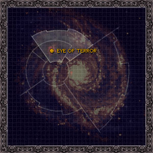

# 0934 和谐星 Harmony

精校状态：中文行文已逐段精校，部分术语仍为暂定

分类：地理 / 真实空间 Real Space / 朦胧星域 Segmentum Obscurus

原文来源：https://www.bilibili.com/opus/1107993836061196297

原作者：帝国神选罐头

原文时间：2025年09月02日 19:41

[返回分类目录](目录.md) · [全书目录](../../目录.md)

<!-- A0934-B0001 图片 -->

<!-- A0934-B0002 -->

原译文

Map 地图

**校订译文**

Map 地图

<!-- /A0934-B0002 -->

<!-- A0934-B0003 -->
### Basic Data 基本资料

原题：Basic Data 基础信息

<!-- /A0934-B0003 -->

<!-- A0934-B0004 -->
**英文原文**

Name:Harmony

<!-- /A0934-B0004 -->

<!-- A0934-B0005 -->

原译文

名称：和谐星

**校订译文**

名称：和谐星

<!-- /A0934-B0005 -->

<!-- A0934-B0006 -->
**英文原文**

Segmentum:Segmentum Obscurus

<!-- /A0934-B0006 -->

<!-- A0934-B0007 -->

原译文

星域：朦胧星域

**校订译文**

星域：朦胧星域

<!-- /A0934-B0007 -->

<!-- A0934-B0008 -->
**英文原文**

Sector:Eye of Terror

<!-- /A0934-B0008 -->

<!-- A0934-B0009 -->

原译文

星区：恐惧之眼

**校订译文**

星区：恐惧之眼

<!-- /A0934-B0009 -->

<!-- A0934-B0010 -->
**英文原文**

Affiliation:Chaos (Emperor's Children)

<!-- /A0934-B0010 -->

<!-- A0934-B0011 -->

原译文

隶属：混沌（帝皇之子）

**校订译文**

隶属：混沌（帝皇之子）

<!-- /A0934-B0011 -->

<!-- A0934-B0012 -->
**英文原文**

Class:Daemon World

<!-- /A0934-B0012 -->

<!-- A0934-B0013 -->

原译文

级别：恶魔世界

**校订译文**

级别：恶魔世界

<!-- /A0934-B0013 -->

<!-- A0934-B0014 -->
**英文原文**

Harmony is a Daemon World in the Eye of Terror.

<!-- /A0934-B0014 -->

<!-- A0934-B0015 -->

原译文

和谐星是恐惧之眼中的恶魔世界

**校订译文**

和谐星是恐惧之眼中的恶魔世界

<!-- /A0934-B0015 -->

<!-- A0934-B0016 -->
## Overview 概述

<!-- /A0934-B0016 -->

<!-- A0934-B0017 -->
**英文原文**

The world served as one of the largest bases of the Emperor's Children during the Legion War in the aftermath of the Horus Heresy. In addition to housing large numbers of feuding Dark Mechanicus city-states, Harmony was also home to the Canticle City, the fortress of the Emperor's Children. It was here that Fabius Bile held the cloned Horus Lupercal.

<!-- /A0934-B0017 -->

<!-- A0934-B0018 -->

原译文

在荷鲁斯叛乱之后的军团战争中，这个世界是帝皇之子最大的基地之一。除了容纳大量长期争斗的黑暗机械教城邦外，和谐星还是帝皇之子的堡垒颂歌城的所在地。法比乌斯·拜尔就是在这里维持被克隆的荷鲁斯·卢佩卡尔。

**校订译文**

荷鲁斯之乱后的军团战争期间，和谐星是帝皇之子最大的基地之一。星球上除分布着众多相互争斗的黑暗机械教城邦，还坐落着帝皇之子的要塞颂歌城。法比乌斯·拜尔正是在这里保存着荷鲁斯·卢佩卡尔的克隆体。

<!-- /A0934-B0018 -->

<!-- A0934-B0019 -->
**英文原文**

In the end, Harmony was assaulted by forces of the newly created Black Legion under Ezekyle Abaddon. Thousand Sons Sorcerers allied to Abaddon psychically dropped the Cruiser Tlaloc from orbit during the battle, wiping out the Canticle City and forcing the Emperor's Children to flee the planet. After dealing with the Emperor's Children, Abaddon killed the clone of Horus.

<!-- /A0934-B0019 -->

<!-- A0934-B0020 -->

原译文

最后，和谐星遭到以泽凯尔·阿巴顿领导的新成立的黑色军团的袭击。在战斗中，与阿巴顿结盟的千子巫师灵机一动，将巡洋舰特拉洛克号从轨道上抛下，摧毁了颂歌城，迫使帝皇之子们逃离了这个行星。在处理完帝皇之子后，阿巴顿杀死了荷鲁斯的克隆人。

**校订译文**

后来，以泽凯尔·阿巴顿率新组建的黑色军团进攻和谐星。与他结盟的千子巫师运用灵能，将巡洋舰特拉洛克号从轨道拽下，摧毁颂歌城，迫使帝皇之子逃离星球。解决帝皇之子后，阿巴顿又杀死了荷鲁斯的克隆体。

**校注：** psychically 指运用灵能，不是灵机一动。

<!-- /A0934-B0020 -->

<!-- A0934-B0021 -->
**英文原文**

Presently, Harmony is still a major base for the Emperor's Children, specifically Eidolon's Phoenix Conclave. It still bears the scars of Abaddon's raid millennia earlier, with great cracks in the planets crust visible and much in the way of tectonic instability.

<!-- /A0934-B0021 -->

<!-- A0934-B0022 -->

原译文

目前，和谐星仍然是帝皇之子的主要基地，特别是艾多隆的凤凰秘会。它仍然带有数千年前阿巴顿突袭的痕迹，行星地壳上可见巨大的裂缝，而且构造不稳定。

**校订译文**

如今，和谐星仍是帝皇之子的主要基地，尤其由艾多隆的凤凰秘会使用。数千年前阿巴顿袭击留下的伤痕依旧清晰：地壳裂缝巨大，地质活动极不稳定。

<!-- /A0934-B0022 -->

本篇核心术语与暂定项

以下列出本篇出现的英文原形及核心术语表用词。同形词可能指不同对象，具体词义以本篇正文和校注为准；单复数、别名和仅见于图注的名称可能尚未列入。完整候选见[术语表](../../术语表/双语术语候选.csv)。

| 英文 | 采用中文 | 状态 |
| --- | --- | --- |
| Thousand Sons | 千子 | 官方已核对 |
| Horus Heresy | 荷鲁斯之乱 | 官方已核对 |
| Eye of Terror | 恐惧之眼 | 官方已核对 |
| Emperor | 帝皇 | 官方已核对 |
| Black Legion | 黑色军团 | 暂定·官方待核 |
| Emperor's Children | 帝皇之子 | 官方已核对 |
| Horus | 荷鲁斯 | 暂定·官方待核 |
| Segmentum Obscurus | 朦胧星域 | 暂定·官方待核 |
| Segmentum | 星域 | 暂定·官方待核 |
| Sector | 星区 | 暂定·官方待核 |
| Obscurus | 朦胧星 | 暂定·官方待核 |
| Fabius Bile | 法比乌斯·拜尔 | 官方已核对 |
| Horus Lupercal | 荷鲁斯·卢佩卡尔 | 暂定·官方待核 |
| Lupercal | 卢佩卡尔 | 暂定·官方待核 |
| Scars | 伤疤 | 暂定·官方待核 |
| Eidolon | 艾多隆 | 暂定·官方待核 |
| Ezekyle Abaddon | 以泽凯尔·阿巴顿 | 暂定·官方待核 |
| Dark Mechanicus | 黑暗机械教 | 暂定·官方待核 |
| Phoenix Conclave | 凤凰秘会 | 暂定·官方待核 |
| Canticle City | 颂歌城 | 暂定·官方待核 |
| Harmony | 和谐星 | 暂定·官方待核 |
| Legion War | 军团战争 | 暂定·官方待核 |
| Tlaloc | 特拉洛克号 | 暂定·官方待核 |

