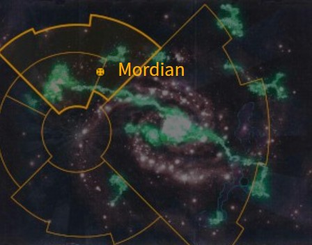
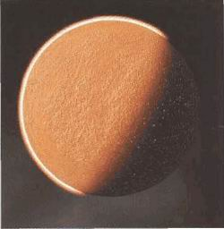

# 0935 莫迪安 Mordian

精校状态：中文行文已逐段精校，部分术语仍为暂定

分类：地理 / 真实空间 Real Space / 朦胧星域 Segmentum Obscurus

原文来源：https://www.bilibili.com/opus/1155071436400885762

原作者：帝国神选罐头

原文时间：2026年01月07日 16:27

[返回分类目录](目录.md) · [全书目录](../../目录.md)

<!-- A0935-B0001 图片 -->

<!-- A0935-B0002 -->

原译文

Map 地图

**校订译文**

Map 地图

<!-- /A0935-B0002 -->

<!-- A0935-B0003 -->
### Basic Data 基本资料

原题：Basic Data 基础信息

<!-- /A0935-B0003 -->

<!-- A0935-B0004 -->
**英文原文**

Name:Mordian

<!-- /A0935-B0004 -->

<!-- A0935-B0005 -->

原译文

名称：莫迪安

**校订译文**

名称：莫迪安

<!-- /A0935-B0005 -->

<!-- A0935-B0006 -->
**英文原文**

Segmentum:Segmentum Obscurus

<!-- /A0935-B0006 -->

<!-- A0935-B0007 -->

原译文

星域：朦胧星域

**校订译文**

星域：朦胧星域

<!-- /A0935-B0007 -->

<!-- A0935-B0008 -->
**英文原文**

Sector:Stygius Sector

<!-- /A0935-B0008 -->

<!-- A0935-B0009 -->

原译文

星区：冥河星区

**校订译文**

星区：冥河星区

<!-- /A0935-B0009 -->

<!-- A0935-B0010 -->
**英文原文**

System:Mordian System

<!-- /A0935-B0010 -->

<!-- A0935-B0011 -->

原译文

星系：莫迪安星系

**校订译文**

星系：莫迪安星系

<!-- /A0935-B0011 -->

<!-- A0935-B0012 -->
**英文原文**

Affiliation:Imperium

<!-- /A0935-B0012 -->

<!-- A0935-B0013 -->

原译文

隶属：帝国

**校订译文**

隶属：帝国

<!-- /A0935-B0013 -->

<!-- A0935-B0014 -->
**英文原文**

Class:Hive World

<!-- /A0935-B0014 -->

<!-- A0935-B0015 -->

原译文

类别：巢都世界

**校订译文**

类别：巢都世界

<!-- /A0935-B0015 -->

<!-- A0935-B0016 图片 -->

<!-- A0935-B0017 -->

原译文

Planetary Image 行星图像

**校订译文**

Planetary Image 行星图像

<!-- /A0935-B0017 -->

<!-- A0935-B0018 -->
**英文原文**

Mordian is a Imperium Hive World that was renowned as the Homeworld of the Iron Guard Regiments of the Imperial Guard.

<!-- /A0935-B0018 -->

<!-- A0935-B0019 -->

原译文

莫迪安是一个帝国巢都世界，著名的帝国卫队铁卫兵团的家园世界。

**校订译文**

莫迪安是一颗帝国巢都世界，也是著名帝国卫队莫迪安铁卫各团的母星。

<!-- /A0935-B0019 -->

<!-- A0935-B0020 -->
## Overview 概述

<!-- /A0935-B0020 -->

<!-- A0935-B0021 -->
**英文原文**

Mordian is a tidally locked planet; the time of the planet's rotation equal to the time of its revolution around its sun. Consequently, half of the planet is in perpetual darkness while the other is constantly burned by the harsh sun. All life is on its dark side. For good reason, Mordian is also known as the World of Eternal Night.

<!-- /A0935-B0021 -->

<!-- A0935-B0022 -->

原译文

莫迪安是一颗潮汐锁定的行星；行星自转的时间等于它绕太阳公转的时间。因此，行星的一半永远处于黑暗之中，而另一半则不断被强烈的太阳灼烧。所有的生命都在黑暗的一面。有充分的理由，莫迪安也被称为永夜世界。

**校订译文**

莫迪安受到潮汐锁定，自转周期与绕恒星公转的周期相同。因此，星球一面永远黑暗，另一面则持续受到烈日炙烤。一切生命都集中在背阴面，“永夜世界”之称由此而来。

<!-- /A0935-B0022 -->

<!-- A0935-B0023 -->
**英文原文**

Mordian's hundreds of millions of inhabitants live on a land surface barely one tenth the size of Earth. Its hive cities are characterized by pyramidal, multi-levelled towers rising like mountains towards space. The government is known as the Tetrarchy, and strictly controls and rations the planet's meager resources. Mordian naturally breeds discontent, and the Iron Guard is the only thing that stands between order and total anarchy.

<!-- /A0935-B0023 -->

<!-- A0935-B0024 -->

原译文

莫迪安的数亿居民生活在只有地球十分之一大小的陆地上。它的巢都城市以金字塔形、多层次的塔楼为特征，这些塔楼像山脉一样向太空升起。政府被称为四分统治，严格控制和配给行星上微薄的资源。莫迪安自然会滋生不满，而铁卫是唯一一个站在秩序和完全无政府状态之间的。

**校订译文**

莫迪安数亿居民挤在仅约地球十分之一大小的陆地上。巢都由层层叠起的金字塔状高塔构成，如群山般伸向太空。统治政府称“四分统治”，严格管制、配给星球有限的资源。不满因此不断滋生，唯有铁卫维系秩序，使社会免于坠入彻底的无政府状态。

**校注：** Tetrarchy 此处是莫迪安政府名称，暂沿四分统治；不与极限星域的四方领主职衔或政府自动混并。

<!-- /A0935-B0024 -->

<!-- A0935-B0025 -->
## History 历史

<!-- /A0935-B0025 -->

<!-- A0935-B0026 -->
### Chaos Invasion 混沌入侵

<!-- /A0935-B0026 -->

<!-- A0935-B0027 -->
**英文原文**

The greatest threat faced by Mordian came as a result of a conspiracy among Chaos cultists. Summoned by a spell, ships from the Eye of Terror poured Chaos Marines from the skies and daemons appeared within the streets. In the resulting Battle of Mordian, the Mordian Iron Guard eventually emerged victorious against the invasion.

<!-- /A0935-B0027 -->

<!-- A0935-B0028 -->

原译文

莫迪安面临的最大威胁来自混沌邪教徒之间的阴谋。在咒语的召唤下，恐惧之眼的船只从天空中倾泻出混沌星际战士，恶魔出现在街道上。在由此诞生的莫迪安之战中，莫迪安铁卫最终战胜了入侵。

**校订译文**

莫迪安曾面临一场由混沌邪教徒阴谋引发的重大危机。咒术召来恐惧之眼的舰船，混沌星际战士从天而降，恶魔也在街头显形。莫迪安铁卫最终在这场莫迪安之战中击退入侵者。

<!-- /A0935-B0028 -->

<!-- A0935-B0029 -->
### Dark Imperium 帝国暗面

原题：Dark Imperium 黑暗帝国

<!-- /A0935-B0029 -->

<!-- A0935-B0030 -->
**英文原文**

Following the resurrection of Roboute Guilliman and the formation of the Great Rift, Mordian was one of the worlds which became stranded in the Dark Imperium. Mordian was subsequently besieged by the Thousand Sons and Cultists during the Invasion of the Stygius Sector and though the Imperium's Stygius Crusade later broke the siege, it proved to be no match for Tzeentch's invading forces. The overwhelmed Crusade, was soon forced to retreat from the Stygius Sector. However it is known that thanks to the efforts of the Iron Hands and their Successor Chapters Mordian continues to be held against Chaos forces.

<!-- /A0935-B0030 -->

<!-- A0935-B0031 -->

原译文

随着罗伯特·基里曼的复活和大裂隙的形成，莫迪安是被困在黑暗帝国中的世界之一。在冥河星区入侵期间，莫迪安随后被千子和邪教徒围困，尽管帝国的冥河远征后来打破了围困，但事实证明，它无法与奸奇的入侵部队匹敌。被淹没的远征很快被迫从冥河星区撤退。然而，众所周知，由于钢铁之手及其子战团的努力，莫迪安继续坚持对抗混沌部队。

**校订译文**

罗保特·基里曼复活、大裂隙形成后，莫迪安成为被困在帝国暗面的世界之一。冥河星区遭入侵时，千子与邪教徒围困莫迪安。帝国的冥河远征虽一度解围，却终究无法匹敌奸奇大军，很快被迫撤出星区。不过，依靠钢铁之手及其子战团的奋战，莫迪安仍在抵抗混沌，尚未陷落。

<!-- /A0935-B0031 -->

<!-- A0935-B0032 -->
**英文原文**

Mordian has since become a the site of a contest between multiple factions. The Thousand Sons Exalted Sorcerer Khethos Vorsch has infiltrated the world under the apprenticeship of Ahriman, who is represented by his Daemonhost known as The Vessel. Other invaders include the Great Harlequin Rillietann and Necron Overlord Serevakh/Trazyn. Vorsch was eventually successful in shattering the Webway network above Mordian, bringing the realm of Shaa-Dom over the world and causing total chaos.

<!-- /A0935-B0032 -->

<!-- A0935-B0033 -->

原译文

自那以后，莫迪安成为了多个派系之间竞争的场所。千子至尊巫师凯索斯·沃施在从于阿里曼的学徒生涯中渗透到了世界各地，阿里曼由他的恶魔宿主容器代表。其他入侵者包括大丑角里列坦和死灵霸主塞雷瓦赫/塔拉辛。沃施最终成功地摧毁了莫迪安上方的网道网络，将沙-杜姆的领域带到了世界各地，并造成了彻底的混乱。

**校订译文**

此后，莫迪安又成为多方争夺之地。阿里曼的学徒、千子高阶巫师凯索斯·沃施潜入星球；阿里曼本人则通过名为“容器”的恶魔宿主介入。其他入侵者包括大丑角里列坦，以及太空死灵霸主塞雷瓦赫／塔拉辛。沃施最终击碎莫迪安上空的网道网络，使沙多姆领域降临星球上方，引发彻底的混乱。

**校注：** 原文将太空死灵霸主记作 Serevakh/Trazyn，本段没有解释两名的关系，保留并列写法，不自行补入化身、伪装或替身的结论。

<!-- /A0935-B0033 -->

本篇核心术语与暂定项

以下列出本篇出现的英文原形及核心术语表用词。同形词可能指不同对象，具体词义以本篇正文和校注为准；单复数、别名和仅见于图注的名称可能尚未列入。完整候选见[术语表](../../术语表/双语术语候选.csv)。

| 英文 | 采用中文 | 状态 |
| --- | --- | --- |
| Imperial Guard | 帝国卫队 | 暂定·语境区分 |
| Thousand Sons | 千子 | 官方已核对 |
| Roboute Guilliman | 罗保特·基里曼 | 官方已核对 |
| Great Rift | 大裂隙 | 官方已核对 |
| Imperium | 帝国 | 暂定·简称 |
| Webway | 网道 | 暂定 |
| Sorcerer | 巫师 | 官方已核对 |
| Tzeentch | 奸奇 | 官方已核对 |
| Harlequin | 丑角 | 暂定 |
| Eye of Terror | 恐惧之眼 | 官方已核对 |
| Hive World | 巢都世界 | 暂定·官方待核 |
| Iron Hands | 钢铁之手 | 暂定·官方待核 |
| Dark Imperium | 黑暗帝国 | 暂定·官方待核 |
| Segmentum Obscurus | 朦胧星域 | 暂定·官方待核 |
| Segmentum | 星域 | 暂定·官方待核 |
| Sector | 星区 | 暂定·官方待核 |
| Perpetual | 永生者 | 暂定·官方待核 |
| Mordian | 莫迪安 | 暂定·官方待核 |
| Obscurus | 朦胧星 | 暂定·官方待核 |
| Overlord | 霸主 | 官方已核对 |
| Invaders | 侵略者 | 暂定·官方待核 |
| Great Harlequin | 大丑角（神祇尊号） | 暂定·官方待核 |
| Shaa-Dom | 沙多姆 | 暂定·官方待核 |
| Exalted Sorcerer | 高阶巫师 | 官方已核对 |
| The Dark | 《黑暗》 | 暂定·官方待核 |
| System | 星系（恒星系统） | 暂定·官方待核 |
| Mordian Iron Guard | 莫迪安铁卫 | 暂定·官方待核 |
| Stygius Sector | 冥河星区 | 暂定·官方待核 |
| Stygius Crusade | 冥河远征 | 暂定·官方待核 |
| World of Eternal Night | 永夜世界 | 暂定·官方待核 |
| Khethos Vorsch | 凯索斯·沃施 | 暂定·官方待核 |
| Serevakh | 塞雷瓦赫 | 暂定·官方待核 |

