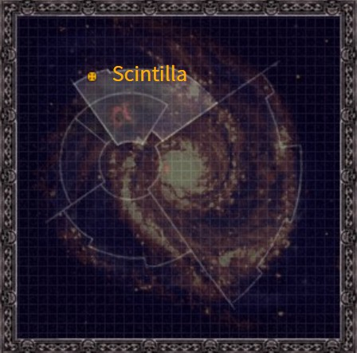
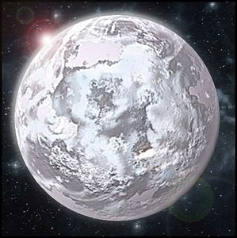

# 0936 辛提拉 Scintilla

精校状态：中文行文已逐段精校，部分术语仍为暂定

分类：地理 / 真实空间 Real Space / 朦胧星域 Segmentum Obscurus

原文来源：https://www.bilibili.com/opus/1155385355556356104

原作者：帝国神选罐头

原文时间：2026年01月08日 12:45

[返回分类目录](目录.md) · [全书目录](../../目录.md)

<!-- A0936-B0001 图片 -->

<!-- A0936-B0002 -->

原译文

Map 地图

**校订译文**

Map 地图

<!-- /A0936-B0002 -->

<!-- A0936-B0003 -->
### Basic Data 基本资料

原题：Basic Data 基础信息

<!-- /A0936-B0003 -->

<!-- A0936-B0004 -->
**英文原文**

Name:Scintilla

<!-- /A0936-B0004 -->

<!-- A0936-B0005 -->

原译文

名称：辛提拉

**校订译文**

名称：辛提拉

<!-- /A0936-B0005 -->

<!-- A0936-B0006 -->
**英文原文**

Segmentum:Segmentum Obscurus

<!-- /A0936-B0006 -->

<!-- A0936-B0007 -->

原译文

星域：朦胧星域

**校订译文**

星域：朦胧星域

<!-- /A0936-B0007 -->

<!-- A0936-B0008 -->
**英文原文**

Sector:Calixis Sector

<!-- /A0936-B0008 -->

<!-- A0936-B0009 -->

原译文

星区：卡利西斯星区

**校订译文**

星区：卡利西斯星区

<!-- /A0936-B0009 -->

<!-- A0936-B0010 -->
**英文原文**

Subsector:Golgenna Reach

<!-- /A0936-B0010 -->

<!-- A0936-B0011 -->

原译文

分区：戈尔根纳河段

**校订译文**

次星区：戈尔根纳疆域

<!-- /A0936-B0011 -->

<!-- A0936-B0012 -->
**英文原文**

Population:25 billion

<!-- /A0936-B0012 -->

<!-- A0936-B0013 -->

原译文

人口：250亿

**校订译文**

人口：250亿

<!-- /A0936-B0013 -->

<!-- A0936-B0014 -->
**英文原文**

Affiliation:Imperium

<!-- /A0936-B0014 -->

<!-- A0936-B0015 -->

原译文

隶属：帝国

**校订译文**

隶属：帝国

<!-- /A0936-B0015 -->

<!-- A0936-B0016 -->
**英文原文**

Class:Hive World

<!-- /A0936-B0016 -->

<!-- A0936-B0017 -->

原译文

类别：巢都世界

**校订译文**

类别：巢都世界

<!-- /A0936-B0017 -->

<!-- A0936-B0018 -->
**英文原文**

Tithe Grade:Exactus Extremis

<!-- /A0936-B0018 -->

<!-- A0936-B0019 -->

原译文

什一税等级：第一级高等

**校订译文**

什一税等级：第一级极等

**校注：** 英文作 Exactus Extremis，926作 Exactis Extremis；暂按同一等级拼写变体，沿第一级极等区分 Excelsior，未宣称官方级序。

<!-- /A0936-B0019 -->

<!-- A0936-B0020 图片 -->

<!-- A0936-B0021 -->

原译文

Planetary Image 行星图像

**校订译文**

Planetary Image 行星图像

<!-- /A0936-B0021 -->

<!-- A0936-B0022 -->
**英文原文**

Scintilla is the sector capital of the Calixis Sector.

<!-- /A0936-B0022 -->

<!-- A0936-B0023 -->

原译文

辛提拉是卡利西斯星区的星区首都。

**校订译文**

辛提拉是卡利西斯星区的星区首都。

<!-- /A0936-B0023 -->

<!-- A0936-B0024 -->
## Overview 概述

<!-- /A0936-B0024 -->

<!-- A0936-B0025 -->
**英文原文**

The world is governed by Calixis' Sector Governor, currently Marius Hax. It is a thriving Imperial hub that supports the largest planetary population in the territory. It is dominated by two vast hive cities, Hive Sibellus and Hive Tarsus which hold the majority of the planetary population. Despite the dominance of those two hives, the "offspring" communities of Ambulon and Gunmetal City contribute significantly to the planet's economy as well. Scintilla is a world where the powerful and wealthy compete with ruthless appetite. Magnificence is astonishing on Scintilla, from the wondrous fashions of the hive's nobility to the spectacle of the hives themselves. Landmarks like Lucid Palace and the Cathedral of Illumination, are famous throughout the Calixis Sector.

<!-- /A0936-B0025 -->

<!-- A0936-B0026 -->

原译文

世界由卡利西斯的星区总督马里乌斯·哈克斯管理。它是一个繁荣的帝国中心，支持着该地区最大的行星人口。它由两个巨大的巢都城市主导，西贝卢斯巢都和塔苏斯巢都，这两个城市拥有行星上大部分的人口。尽管这两个巢都占据主导地位，但安布隆和炮铜城的“后代”社区也为行星的经济做出了重大贡献。辛提拉是一个强者和富人与无情欲望竞争的世界。辛提拉的壮观令人惊叹，从巢都贵族的奇妙时尚到巢都本身的奇观。清醒宫殿和启明大教堂等地标在整个卡利西斯星区都很有名。

**校订译文**

辛提拉由卡利西斯星区总督统治，本文所述时任总督为马里乌斯·哈克斯。这是一处繁荣的帝国枢纽，也是本星区人口最多的行星。西贝卢斯与塔苏斯两座巨型巢都占据主导地位，容纳了星球的大部分人口；衍生出的安布隆与枪铁城，也对经济贡献巨大。在辛提拉，权贵为满足贪欲而展开残酷竞争。从巢都贵族华丽的服饰，到巢都本身的宏伟景象，这里无不令人惊叹。明澈宫与启明大教堂等地标，更是闻名整个卡利西斯星区。

**校注：** Lucid Palace 原清醒宫殿，暂改明澈宫，保留英文与原译便于核查；Gunmetal City 则沿1249已定枪铁城。

<!-- /A0936-B0026 -->

<!-- A0936-B0027 -->
**英文原文**

It is also a world of corruption where members of noble houses are deluded by their wealth and status and the corruption and privilege runs deep in the culture of the high-born. Noble houses consider themselves (sometimes correctly) as above or outside Imperial law and can wield immense influence. Their attitude towards the lower-born is callous; it is not unknown for thrill-seeking degenerates from noble houses to prey upon lesser humans as a sport.

<!-- /A0936-B0027 -->

<!-- A0936-B0028 -->

原译文

这也是一个腐败的世界，贵族阶层的成员被他们的财富和地位所迷惑，腐败和特权深深植根于贵族的文化中。贵族认为自己（有时是正确的）凌驾于帝国法律之上或之外，可以施加巨大的影响。他们对低收入者的态度冷酷无情；寻求刺激的人从贵族家族到折磨低等人类作为一种运动，这并不罕见。

**校订译文**

辛提拉同样腐败深重。贵族沉迷于财富与地位，腐败和特权深植于其文化。他们自认凌驾于帝国法律之上，或根本不受法律约束；有时事实也的确如此，他们足以施加巨大的影响。面对出身低微者，贵族往往冷酷无情。有些堕落贵族甚至为追求刺激，将平民当作猎物取乐。

**校注：** lower-born 指出身较低阶层者，不等于单纯低收入；贵族狩猎他们取乐的含义已补明。

<!-- /A0936-B0028 -->

<!-- A0936-B0029 -->
**英文原文**

On the other end of the social spectrum, the underhives are rife with mutants, outlaws and ultra-violent gangs, as well psychotic zealots from the Redemption Cult.

<!-- /A0936-B0029 -->

<!-- A0936-B0030 -->

原译文

在社会光谱的另一端，下巢充斥着变种人、亡命徒和极端暴力帮派，以及来自救赎教派的精神狂热分子。

**校订译文**

在社会的另一端，下巢充斥着变种人、亡命徒、极端暴力的帮派，以及救赎教派中近乎疯狂的狂热信徒。

<!-- /A0936-B0030 -->

<!-- A0936-B0031 -->
**英文原文**

The middle hives are trapped between aristo spires and rancid underhives and the hivers live the thankless life of unending toil, where ignorance is a virtue and death a reward for a lifetime of loyal, drone servitude, fulfilling the exorbitant tithes levied on Scintilla by the Administratum. It has been this way since the days of Angevin and some of Scintilla corruption is so deeply ingrained that it is invisible even to those who perpetrate it.

<!-- /A0936-B0031 -->

<!-- A0936-B0032 -->

原译文

中巢被困在贵族尖塔和腐烂的下巢之间，巢都人过着吃力不讨好的无休止的劳动生活，无知是一种美德，死亡是终身忠诚，如蜂般役使的回报，实现了内务部对辛提拉征收的过高什一税。自从安茹时期以来，情况就是这样，一些辛提拉的腐败根深蒂固，甚至对那些实施腐败的人来说也是看不见的。

**校订译文**

中巢夹在贵族尖塔与污秽下巢之间。居民日复一日劳作，终生得不到回报，只为缴足内政部向辛提拉征收的高额什一税。在这里，无知被视为美德，死亡则成为一生忠诚而机械地服役之后的奖赏。自安茹时代以来，一切便是如此。某些腐败已根深蒂固，连亲手作恶的人也不再察觉。

<!-- /A0936-B0032 -->

<!-- A0936-B0033 -->
## Geography 地理

<!-- /A0936-B0033 -->

<!-- A0936-B0034 -->
**英文原文**

Scintilla has three main continents: one surrounds the planet's southern polar cap and is mountainous (including a number of volcanoes), the second is an equatorial crescent covered in extensive deserts and jungle (featuring both Hive Tarsus and the extinct Hive Tenebra), and the final is a northern temperate landmass, home to Hive Sibellus, Ambulon and Gunmetal City. A heavily polluted ocean covers the rest of the planet's surface. This ocean does support lifeforms, but its fish stocks have been heavily depleted.

<!-- /A0936-B0034 -->

<!-- A0936-B0035 -->

原译文

辛提拉有三个主要大陆：一个围绕着行星的南极极冠，多山（包括许多火山），第二个是赤道新月，覆盖着广阔的沙漠和丛林（以塔苏斯巢都和已绝迹的阴影巢都占重要地位），最后一个是北温带地块，是西贝卢斯巢都、安布隆和炮铜城的所在地。严重污染的海洋覆盖了行星表面的其余部分。这片海洋确实支持生命形式，但其鱼类种群已经严重枯竭。

**校订译文**

辛提拉有三块主要大陆。第一块环绕南极冰盖，多山，分布着多座火山；第二块位于赤道，呈新月形，大片沙漠与丛林覆盖其上，塔苏斯巢都与已废弃的阴影巢都便坐落于此；第三块处于北部温带，是西贝卢斯、安布隆和枪铁城的所在地。其余表面被严重污染的海洋覆盖，海中尚有生命，但鱼群资源已近枯竭。

<!-- /A0936-B0035 -->

<!-- A0936-B0036 -->
**英文原文**

The overall climate is temperate.

<!-- /A0936-B0036 -->

<!-- A0936-B0037 -->

原译文

整体气候温和。

**校订译文**

整体气候温和。

<!-- /A0936-B0037 -->

<!-- A0936-B0038 -->
### Hives Sibellus and Tarsus 西贝卢斯和塔苏斯巢都

<!-- /A0936-B0038 -->

<!-- A0936-B0039 -->
**英文原文**

The two hives are Scintilla's most important features: immense, multi-levelled cities that house billions of citizens. The hives are largely independent, ruled by the councils drawn from the nobles of the spires. The majority of the inhabitants of the middle hives are the laboring class, without whom the planet's manufactories and trade houses would cease to function. Almost all middle hivers are owned or indentured to nobles from great sector-wide families or Scintilla's own lesser houses. The most neglected, polluted and crime-ridden areas of the hives are underhives, where life is cheap and brutal gangs fight for supremacy before inevitable violent death claims them. As long as the violence doesn't spill into middle hives, the authorities are happy to let the gangs kill each other in the cesspit of the underhive.

<!-- /A0936-B0039 -->

<!-- A0936-B0040 -->

原译文

这两个巢都是辛提拉最重要的特征：容纳数十亿公民的巨大、多层次的城市。巢都基本上是独立的，由尖塔贵族组成的议会统治。中巢的大多数居民是劳动阶级，没有他们，行星上的制造厂和贸易家族将停止运作。几乎所有的中巢人都是来自大全星区家庭或辛提拉自己的次级家族的贵族所拥有或签订的契约。巢都中最被忽视、污染最严重、犯罪最猖獗的地区是下巢，那里的生活成本很低，残酷的帮派在不可避免的暴力死亡之前争夺霸权。只要暴力不蔓延到中巢，当局就很乐意让帮派在下巢的粪坑里互相残杀。

**校订译文**

两座巨型巢都是辛提拉最重要的城市，各由层层叠起的建筑组成，容纳数十亿居民。巢都大体自治，由尖塔贵族组成的议会统治。中巢多数人是劳动者，星球的制造厂和商行全靠他们维持运转。他们几乎全是贵族的财产或契约劳工，主人既可能是势力遍及全星区的大家族，也可能是辛提拉本地的小贵族。下巢则最受忽视，污染和犯罪也最严重。那里人命低贱，残暴帮派争夺统治权，最终难免死于暴力。只要战火不蔓延到中巢，当局就乐得让他们在下巢这片污泥潭中自相残杀。

**校注：** life is cheap 指人命不值钱，不是生活成本低。owned or indentured 指被拥有或受契约束缚，原句缺失主从关系。

<!-- /A0936-B0040 -->

<!-- A0936-B0041 -->
**英文原文**

Scintilla's two great hives have always competed against each other for prestige and influence, but no rational observer could fail to acknowledge Hive Sibellus's dominance. It is larger than Hive Tarsus, referred to as "the Capital" or the "ruling hive" and is the seat of both political and administrative power and the centre of the planet's manufacturing might. Hive Tarsus is a dark, shadowy twin of the Hives Sibellus, referred by Sibellians as the "other place" and is a mercantile hive which controls all off-world trade and commerce. Neither hive could function without each other, a fact celebrated in Scintillan proverbs and myths. However neither great hive could openly admit the importance of "offspring" communities, Ambulon and Gunmetal City, both of which wield considerable influence.

<!-- /A0936-B0041 -->

<!-- A0936-B0042 -->

原译文

辛提拉的两个大巢都一直在争夺声望和影响力，但任何理性的观察者都不会不承认西贝卢斯巢都的统治地位。它比被称为“首都”或“统治巢都”的塔苏斯巢都还要大，是政治和行政权力的所在地，也是行星制造业的中心。塔苏斯巢都是西贝卢斯巢都的一个黑暗、阴暗的双胞胎，西贝卢斯人称之为“另一个地方”，是一个控制着所有世界贸易和商业的商业巢都。这两个巢都都离不开彼此，这一点在辛提拉的谚语和神话中得到了证实。然而，这两个大巢都都不能公开承认“后代”社区的重要性，安布隆和炮铜城，这两座社区都有相当大的影响力。

**校订译文**

两座大巢都长期争夺声望与影响力，但西贝卢斯的优势无可否认。它比塔苏斯更大，被称为“首都”或“统治巢都”，既是政治与行政中心，也是制造业核心。塔苏斯像它一个阴郁的孪生兄弟，被西贝卢斯居民称为“另一个地方”；这座商业巢都掌控着所有对外贸易。二者彼此依存，辛提拉的谚语与神话也反复歌咏这一点。然而，两座大巢都都不愿公开承认安布隆与枪铁城这些衍生城市的重要性，尽管后者同样影响巨大。

**校注：** 被称首都/统治巢都、掌握政治行政与制造业的是西贝卢斯，不是塔苏斯。off-world trade 指星外贸易，不是全世界内部贸易。

<!-- /A0936-B0042 -->

<!-- A0936-B0043 -->
## Society 社会

<!-- /A0936-B0043 -->

<!-- A0936-B0044 -->
### Military 军事

<!-- /A0936-B0044 -->

<!-- A0936-B0045 -->
**英文原文**

The planet possesses a large Planetary Defence Force called the Army of the Scintillan Protectorate, which is based out of Hive Tarsus. This army is regarded as relatively high quality.

<!-- /A0936-B0045 -->

<!-- A0936-B0046 -->

原译文

这颗行星拥有一支庞大的行星防御部队，名为辛提拉保护军，其基地设在塔苏斯巢都。这支军队被认为是相对高素质的。

**校订译文**

辛提拉拥有一支规模庞大、素质颇高的行星防卫军，称辛提拉保护军，以塔苏斯巢都为基地。

<!-- /A0936-B0046 -->

<!-- A0936-B0047 -->
**英文原文**

In addition, Scintilla raises Imperial Guard Regiments known as the Scintillan Fusiliers. A large number of recruits are drawn from Scintilla, from both the PDF and the planet's large underhive population.

<!-- /A0936-B0047 -->

<!-- A0936-B0048 -->

原译文

此外，辛提拉还培养了被称为辛提拉燧发枪手的帝国卫队兵团。大量新兵来自辛提拉，来自PDF和行星上庞大的下巢人口。

**校订译文**

当地还组建名为“辛提拉燧发枪手”的帝国卫队各团，大量兵员来自行星防卫军及庞大的下巢人口。

<!-- /A0936-B0048 -->

<!-- A0936-B0049 -->
### Economy 经济

<!-- /A0936-B0049 -->

<!-- A0936-B0050 -->
**英文原文**

The local coinage of Scintilla are denominations of Thrones known as Scints, Scolds and Scabs. In the depths of Gunmetal City, however, some communities are known to trade rounds of ammunition as alternative currency.

<!-- /A0936-B0050 -->

<!-- A0936-B0051 -->

原译文

辛提拉的当地货币是被称为辛币、辛金和辛票的王座币面额。然而，在炮铜城的深处，一些社区以交换弹药作为替代货币而闻名。

**校订译文**

辛提拉当地使用王座币体系，不同面额分别称为辛币、辛金与辛票。但在枪铁城深处，一些社区也用子弹充当货币进行交易。

<!-- /A0936-B0051 -->

<!-- A0936-B0052 -->
**英文原文**

In addition to the manpower the planet provides for the Astra Militarum, Scintilla is a major exporter of manufactured goods, including ship-drive components and weaponry.

<!-- /A0936-B0052 -->

<!-- A0936-B0053 -->

原译文

除了行星为星界军提供的人力外，辛提拉还是制成品的主要出口者，包括舰船驱动部件和武器。

**校订译文**

除了行星为星界军提供的人力外，辛提拉还是制成品的主要出口者，包括舰船驱动部件和武器。

<!-- /A0936-B0053 -->

<!-- A0936-B0054 -->
**英文原文**

In terms of imports, Scintilla cannot produce enough food to support itself, requiring supplies brought in from multiple agri-worlds across the Calixis Sector.

<!-- /A0936-B0054 -->

<!-- A0936-B0055 -->

原译文

在进口方面，辛提拉无法生产足够的粮食来养活自己，需要从卡利西斯星区的多个农业世界进口物资。

**校订译文**

在进口方面，辛提拉无法生产足够的粮食来养活自己，需要从卡利西斯星区的多个农业世界进口物资。

<!-- /A0936-B0055 -->

<!-- A0936-B0056 -->
## Religion 宗教

<!-- /A0936-B0056 -->

<!-- A0936-B0057 -->
**英文原文**

The Cult of the Redemption is active on several planets, but its spiritual home in the Calixis Sector is Scintilla.

<!-- /A0936-B0057 -->

<!-- A0936-B0058 -->

原译文

救赎教派在几个行星上都很活跃，但它在卡利西斯星区的精神家园是辛提拉。

**校订译文**

救赎教派在几个行星上都很活跃，但它在卡利西斯星区的精神家园是辛提拉。

<!-- /A0936-B0058 -->

<!-- A0936-B0059 -->
## Satellites 卫星

<!-- /A0936-B0059 -->

<!-- A0936-B0060 -->
**英文原文**

Scintillia has two moons, called Sothus and Lachesis, the latter of which is home to an Inquisitorial fortress called the Bastion Serpentis.

<!-- /A0936-B0060 -->

<!-- A0936-B0061 -->

原译文

辛提拉有两个卫星，分别是索托斯和拉刻西斯，后者是一个名为天蛇堡垒的审判庭堡垒的所在地。

**校订译文**

辛提拉有两颗卫星：索托斯与拉刻西斯。后者设有审判庭要塞“天蛇堡垒”。

<!-- /A0936-B0061 -->

<!-- A0936-B0062 -->
**英文原文**

In addition to the planet's natural satellites, there is a set of orbital docks in geostationary orbit above Hive Tarsus.

<!-- /A0936-B0062 -->

<!-- A0936-B0063 -->

原译文

除了行星的天然卫星外，在塔苏斯巢都上方的行星静止轨道上还有一组轨道码头。

**校订译文**

除了行星的天然卫星外，在塔苏斯巢都上方的行星静止轨道上还有一组轨道码头。

<!-- /A0936-B0063 -->

<!-- A0936-B0064 -->
## Other Planetary Data 其他行星数据

<!-- /A0936-B0064 -->

<!-- A0936-B0065 -->
**英文原文**

Galactic Position: 88/23/CS/SW

<!-- /A0936-B0065 -->

<!-- A0936-B0066 -->

原译文

银河系位置：88/23/CS/SW

**校订译文**

银河系位置：88/23/CS/SW

<!-- /A0936-B0066 -->

<!-- A0936-B0067 -->
**英文原文**

Mean Surface Temperature: 22°C

<!-- /A0936-B0067 -->

<!-- A0936-B0068 -->

原译文

平均表面温度：22°C

**校订译文**

平均表面温度：22°C

<!-- /A0936-B0068 -->

<!-- A0936-B0069 -->
**英文原文**

Tropospheric Composition: Nitrogen 72%, Oxygen 25%, Argon 1%, Ozone 1%, Carbon Dioxide 0.5%

<!-- /A0936-B0069 -->

<!-- A0936-B0070 -->

原译文

对流层成分：氮72%，氧25%，氩1%，臭氧1%，二氧化碳0.5%

**校订译文**

对流层成分：氮72%，氧25%，氩1%，臭氧1%，二氧化碳0.5%

**校注：** 原文所列气体百分比合计99.5%，并非完整100%；正文保留原数字，不自补缺失成分。

<!-- /A0936-B0070 -->

<!-- A0936-B0071 -->
## Contact with Other Worlds 与其他世界的联系

<!-- /A0936-B0071 -->

<!-- A0936-B0072 -->
**英文原文**

As the sector capital, Scintilla has a great deal of contact with other worlds in the Calixis Sector, as well as worlds in other sectors and segmentums. Stable warp routes link Scintilla to Baraspine, Iocanthus, Luggnum, Malfi, Orbel Quill, Sepheris Secundus, Settlement 228 and Tranch.

<!-- /A0936-B0072 -->

<!-- A0936-B0073 -->

原译文

作为星区首都，辛提拉与卡利西斯星区的其他世界以及其他星区和星域的世界有着大量的联系。稳定的亚空间路线将辛提拉连接到巴拉之脊、约坎瑟斯、卢格努姆、马尔菲、奥贝尔·奎尔、赛珀里斯二号、结算228和特兰奇。

**校订译文**

作为星区首府，辛提拉与卡利西斯其他世界联系密切，也与其他星区乃至星域往来频繁。稳定的亚空间航路将它连接至巴拉斯佩恩、伊卡索斯、卢格努姆、马尔菲、奥贝尔·奎尔、瑟菲瑞斯次星、228 号聚居地及特伦奇。

**校注：** Iocanthus 与随后专篇 Iocanthos 拼写不同，按同一航路关联世界暂沿核心伊卡索斯；Settlement 228 是聚居地名称，原“结算228”误取财务义。

<!-- /A0936-B0073 -->

本篇核心术语与暂定项

以下列出本篇出现的英文原形及核心术语表用词。同形词可能指不同对象，具体词义以本篇正文和校注为准；单复数、别名和仅见于图注的名称可能尚未列入。完整候选见[术语表](../../术语表/双语术语候选.csv)。

| 英文 | 采用中文 | 状态 |
| --- | --- | --- |
| Astra Militarum | 星界军 | 官方已核对 |
| Imperial Guard | 帝国卫队 | 暂定·语境区分 |
| Warp | 亚空间 | 官方已核对 |
| Imperium | 帝国 | 暂定·简称 |
| Administratum | 内政部 | 暂定 |
| Hive World | 巢都世界 | 暂定·官方待核 |
| Segmentum Obscurus | 朦胧星域 | 暂定·官方待核 |
| Segmentum | 星域 | 暂定·官方待核 |
| Sector | 星区 | 暂定·官方待核 |
| Subsector | 次星区 | 暂定·官方待核 |
| Scintilla | 辛提拉 | 暂定·官方待核 |
| Sepheris Secundus | 瑟菲瑞斯次星 | 暂定·官方待核 |
| Obscurus | 朦胧星 | 暂定·官方待核 |
| Thrones | 王座币 | 暂定·官方待核 |
| Calixis Sector | 卡利西斯星区 | 暂定·官方待核 |
| Golgenna Reach | 戈尔根纳疆域 | 暂定·官方待核 |
| Baraspine | 巴拉斯佩恩 | 暂定·官方待核 |
| Malfi | 马尔菲 | 暂定·官方待核 |
| Tranch | 特伦奇 | 暂定·官方待核 |
| Toil | 劳役星 | 暂定·官方待核 |
| Orbel Quill | 奥贝尔·奎尔 | 暂定·官方待核 |
| Tarsus | 塔苏斯 | 暂定·官方待核 |
| Corruption | 腐败 | 暂定·官方待核 |
| Gunmetal City | 枪铁城 | 暂定·官方待核 |
| Exactus Extremis | 第一级极等 | 暂定·官方待核 |
| Marius Hax | 马里乌斯·哈克斯 | 暂定·官方待核 |
| Hive Sibellus | 西贝卢斯巢都 | 暂定·官方待核 |
| Hive Tarsus | 塔苏斯巢都 | 暂定·官方待核 |
| Ambulon | 安布隆 | 暂定·官方待核 |
| Lucid Palace | 明澈宫 | 暂定·官方待核 |
| Cathedral of Illumination | 启明大教堂 | 暂定·官方待核 |
| Hive Tenebra | 阴影巢都 | 暂定·官方待核 |
| Army of the Scintillan Protectorate | 辛提拉保护军 | 暂定·官方待核 |
| Scintillan Fusiliers | 辛提拉燧发枪手 | 暂定·官方待核 |
| Scints | 辛币 | 暂定·官方待核 |
| Scolds | 辛金 | 暂定·官方待核 |
| Sothus | 索托斯 | 暂定·官方待核 |
| Lachesis | 拉刻西斯 | 暂定·官方待核 |
| Bastion Serpentis | 天蛇堡垒 | 暂定·官方待核 |
| Settlement 228 | 228号聚居地 | 暂定·官方待核 |
| Luggnum | 卢格努姆 | 暂定·官方待核 |
| Iocanthus | 伊卡索斯 | 暂定·官方待核 |
| Magnificence | 华丽号 | 暂定·官方待核 |

