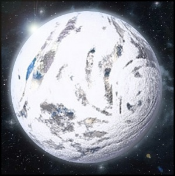
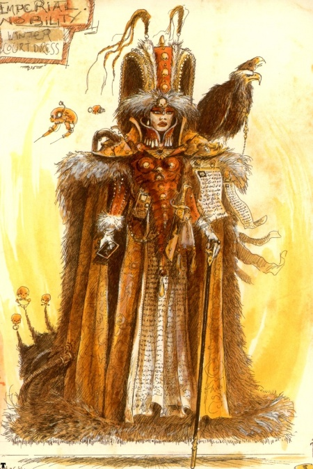

# 0938 瑟菲瑞斯次星 Sepheris Secundus

精校状态：中文行文已逐段精校，部分术语仍为暂定

分类：地理 / 真实空间 Real Space / 朦胧星域 Segmentum Obscurus

原文来源：https://www.bilibili.com/opus/1166827904379650057

原作者：帝国神选罐头

原文时间：2026年02月08日 08:48

[返回分类目录](目录.md) · [全书目录](../../目录.md)

原篇名：塞菲里斯二号 Sepheris Secundus

<!-- A0938-B0001 -->
### Basic Data 基本资料

原题：Basic Data 基础数据

<!-- /A0938-B0001 -->

<!-- A0938-B0002 -->
**英文原文**

Name:Sepheris Secundus

<!-- /A0938-B0002 -->

<!-- A0938-B0003 -->

原译文

名称：塞菲里斯二号

**校订译文**

名称：瑟菲瑞斯次星

<!-- /A0938-B0003 -->

<!-- A0938-B0004 -->
**英文原文**

Segmentum:Segmentum Obscurus

<!-- /A0938-B0004 -->

<!-- A0938-B0005 -->

原译文

星域：朦胧星域

**校订译文**

星域：朦胧星域

<!-- /A0938-B0005 -->

<!-- A0938-B0006 -->
**英文原文**

Sector:Calixis Sector

<!-- /A0938-B0006 -->

<!-- A0938-B0007 -->

原译文

星区：卡利西斯星区

**校订译文**

星区：卡利西斯星区

<!-- /A0938-B0007 -->

<!-- A0938-B0008 -->
**英文原文**

Subsector:Golgenna Reach

<!-- /A0938-B0008 -->

<!-- A0938-B0009 -->

原译文

分区：戈尔根纳河段

**校订译文**

次星区：戈尔根纳疆域

<!-- /A0938-B0009 -->

<!-- A0938-B0010 -->
**英文原文**

Population:12,000,000,000

<!-- /A0938-B0010 -->

<!-- A0938-B0011 -->

原译文

人口：120,0000,0000

**校订译文**

人口：120 亿

<!-- /A0938-B0011 -->

<!-- A0938-B0012 -->
**英文原文**

Affiliation:Imperium

<!-- /A0938-B0012 -->

<!-- A0938-B0013 -->

原译文

隶属：帝国

**校订译文**

隶属：帝国

<!-- /A0938-B0013 -->

<!-- A0938-B0014 -->
**英文原文**

Class:Mining World/Feudal World

<!-- /A0938-B0014 -->

<!-- A0938-B0015 -->

原译文

类别：矿业世界/封建世界

**校订译文**

类别：矿业世界/封建世界

<!-- /A0938-B0015 -->

<!-- A0938-B0016 -->
**英文原文**

Tithe Grade:Exactus Extremis

<!-- /A0938-B0016 -->

<!-- A0938-B0017 -->

原译文

什一税等级：第一等高级

**校订译文**

什一税等级：第一级极等

<!-- /A0938-B0017 -->

<!-- A0938-B0018 图片 -->

<!-- A0938-B0019 -->

原译文

Planetary Image 行星图像

**校订译文**

Planetary Image 行星图像

<!-- /A0938-B0019 -->

<!-- A0938-B0020 -->
**英文原文**

Sepheris Secundus is an Imperial Mining and Feudal World.

<!-- /A0938-B0020 -->

<!-- A0938-B0021 -->

原译文

塞菲里斯二号是一个帝国矿业和封建世界。

**校订译文**

瑟菲瑞斯次星是一个帝国矿业和封建世界。

<!-- /A0938-B0021 -->

<!-- A0938-B0022 -->
## Overview 概述

<!-- /A0938-B0022 -->

<!-- A0938-B0023 -->
**英文原文**

Sepheris Secundus is a world of immense mineral wealth, city-sized mines, billions-strong hordes of serfs and the sharpest divide between the elites and the masses in the Calixis Sector. It is a grim place of snow and twilight, feral mutants, and lives spent in back-breaking labour deep beneath the ground. The Imperium's eagerness to exploit Sepheris Secundus's vast resources is such that the planet is, at the same time, the richest and poorest world in the sector.

<!-- /A0938-B0023 -->

<!-- A0938-B0024 -->

原译文

塞菲里斯二号是一个拥有巨大矿产财富、城市规模的矿山、数十亿农奴的世界，也是卡利西斯星区精英和群众之间最尖锐的分歧。这是一个寒冷的地方，有雪和黄昏，野蛮变种人，生活在地下深处的艰苦劳动中。帝国急于开发塞菲里斯二号的丰富资源，因此行星同时也是该星区最富有和最贫穷的世界。

**校订译文**

瑟菲瑞斯次星矿藏极富，矿区大如城市，数十亿农奴在其中劳作；它也是卡利西斯星区贫富分化最为悬殊的世界。冰雪与昏暮笼罩大地，野蛮变种人潜伏四处，人们在地下深处的繁重苦役中度过一生。帝国对矿产的贪婪开采，使它同时成为星区最富有、也最贫困的世界。

<!-- /A0938-B0024 -->

<!-- A0938-B0025 -->
**英文原文**

Sepheris Secundus's climate is cold and stormy, its surface obscured by a mantle of cloud. It has no oceans save for the small polar seas, so the moisture in its atmosphere comes from below the crust, spewed out from failed mine workings or natural geysers that pockmark the planet like pustules. Its surface is split between the vast open mines like deep scars in the crust and the dense, snow laden forests broken only by the ruins of failed kingdoms that tried to claim Sepheris Secundus in the past. With its endless blizzards, widespread ignorance and antiquated methods for doing everything, Sepheris Secundus would be a meaningless backwater were it not for the enormous mineral wealth beneath its surface.

<!-- /A0938-B0025 -->

<!-- A0938-B0026 -->

原译文

塞菲里斯二号的气候寒冷多风暴，其表面被云层遮蔽。除了极地的小海洋，它没有海洋，因此其大气中的水分来自地壳以下，从失败的矿井或天然间歇泉中喷出，这些间歇泉像脓疱一样在行星上留下麻点。它的表面被巨大的露天矿和浓密的白雪覆盖的森林所分割，前者像地壳上的深深伤痕，后者只被过去试图占领塞菲里斯二号的失败王国的废墟所破坏。由于无休止的暴风雪、普遍的无知和过时的做事方法，如果不是因为其表面下巨大的矿产财富，塞菲里斯二号将是一个毫无意义的死水。

**校订译文**

瑟菲瑞斯次星寒冷多风暴，厚云遮蔽地表。除极地小片海域外，这里没有海洋；大气中的水汽主要来自地壳深处，从废损矿井和天然间歇泉喷出，像脓疱般遍布星球。地表一半是伤口般切入岩层的巨型露天矿，一半是积雪深厚的密林。林间散布着昔日企图统治此地、如今已覆灭的王国遗迹。暴风雪无休无止，人们普遍愚昧，事事沿用陈旧方法；若非地下矿藏丰厚，这里只会是一处无足轻重的偏远荒地。

<!-- /A0938-B0026 -->

<!-- A0938-B0027 -->
## The Suffering Kingdom 痛苦王国

<!-- /A0938-B0027 -->

<!-- A0938-B0028 -->
**英文原文**

While the whole Imperium is a feudal empire, feudalism is an extreme on Sepheris Secundus. Everyone born on the planet must have a master to whom they pay nine-tenths of everything they produce, which for most citizens means the ore they hack from the rock faces of the planet's mines. Queen Lachryma III, the planet's absolute monarch, sits at the top of this feudal system. The rights to the labour of these billions of serfs belong to the barons appointed by the queen or to noble families and business consortiums that purchase them from the crown. The queen's own master is the Imperium, to whom she hands over truly staggering amounts of ore, metals and raw fuel to fulfil the planet's tithe. Sepheris Secundus's tithe is the highest in the Calixis Sector, and without its immense output of raw materials, the economy of the whole province would be badly unsettled.

<!-- /A0938-B0028 -->

<!-- A0938-B0029 -->

原译文

虽然整个帝国是一个封建帝国，但封建主义在塞菲里斯二号上是一个极端。每个出生在这个行星上的人都必须有一个主人，他们向他支付他们生产的一切的十分之九，对大多数公民来说，这意味着他们从行星矿山的岩壁上凿下的矿石。行星上的绝对君主女王拉克莉玛三世坐在这个封建制度的顶端。这些数十亿农奴的劳动权属于女王任命的贵族或从王室购买他们的贵族家族和商业财团。女王自己的主人是帝国，她向帝国移交了数量惊人的矿石、金属和原燃料，以满足行星的什一税。塞菲里斯二号的什一税是卡利西斯星区最高的，如果没有其巨大的原材料产量，整个行省的经济将非常不稳定。

**校订译文**

整个人类帝国本就是封建帝国，但瑟菲瑞斯次星将这种制度推至极端。每个生于此地的人都必须有主人，并将全部产出的十分之九交给对方；对大多数人来说，产出就是从矿壁上凿下的矿石。绝对君主拉克莉玛三世女王位于制度顶端。数十亿农奴的劳役支配权，属于她任命的男爵，或向王室购买这些权利的贵族家族与商业财团。女王也有自己的主人——帝国。她必须上缴数量惊人的矿石、金属与未加工燃料，履行星球的什一税义务。这里的税额是卡利西斯星区之最，若失去如此庞大的原料产出，全星区经济都会受到严重冲击。

<!-- /A0938-B0029 -->

<!-- A0938-B0030 图片 -->

<!-- A0938-B0031 -->

原译文

Queen Lachryma III of Sepheris Secundus 塞菲里斯二号的女王拉克莉玛三世

**校订译文**

Queen Lachryma III of Sepheris Secundus 瑟菲瑞斯次星的女王拉克莉玛三世

<!-- /A0938-B0031 -->

<!-- A0938-B0032 -->
**英文原文**

Two principal forces maintain Sepheris Secundus's feudal system. The first is the weight of tradition: every serf labouring in the mines is doing what his father did and his grandfather before that, often at the same rock face. The second force is physical violence. One of the reasons that Sepheris Secundus's culture is so primitive by many standards is that weaponry and other technology is monopolised by the crown. The queen's Royal Scourges are equipped with lasguns, grenades and chainblades, contrasting with their gaudy, stained-glass-like armour. Though few in number, the technological advantage that these troops possess has been enough to put down a great many uprisings in the mines of Sepheris Secundus, and the planet's history is littered with massacres where thousands of serfs fell to volleys of lasgun fire.

<!-- /A0938-B0032 -->

<!-- A0938-B0033 -->

原译文

两股主要力量维持着塞菲里斯二号的封建制度。首先是传统的重量：每一个在矿井里劳动的农奴都在做他父亲和祖父之前所做的事情，通常是在同一个岩壁上。第二种力量是身体暴力。塞菲里斯二号的文化从许多标准来看都是如此原始的原因之一是武器和其他技术被王室垄断。女王的皇家天灾装备了激光枪、手榴弹和链锯刃，与他们华丽的染色类玻璃盔甲形成鲜明对比。尽管人数不多，但这些部队所拥有的技术优势足以平息塞菲里斯二号矿区的许多起义，这个行星的历史上到处都是屠杀，成千上万的农奴被激光枪扫射。

**校订译文**

维系这种封建秩序的主要有两股力量。第一是传统的重压：矿井里的每个农奴，都重复着父祖的劳动，往往连面对的矿壁也没有变。第二便是武力。王室垄断武器与其他技术，是当地社会在许多方面如此落后的原因之一。女王的皇家天灾装备激光枪、手榴弹与链锯刃，却穿着华丽如彩色玻璃的甲胄，形成强烈反差。他们人数虽少，技术优势却足以镇压矿区的一次次起义。行星历史中，满是数千农奴倒在激光齐射之下的惨案。

**校注：** stained-glass-like 指甲胄外观如彩色玻璃，未必断言整套甲胄的材料；镜盾段则明确使用彩色玻璃。

<!-- /A0938-B0033 -->

<!-- A0938-B0034 -->
## Planetary Data 行星数据

<!-- /A0938-B0034 -->

<!-- A0938-B0035 -->
**英文原文**

Galactic Position: 52/34/CS/NNE.

<!-- /A0938-B0035 -->

<!-- A0938-B0036 -->

原译文

银河系位置：52/34/CS/NNE。

**校订译文**

银河系位置：52/34/CS/NNE。

<!-- /A0938-B0036 -->

<!-- A0938-B0037 -->
**英文原文**

Orbital Distance: 34.88 AU

<!-- /A0938-B0037 -->

<!-- A0938-B0038 -->

原译文

轨道距离：34.88天文单位

**校订译文**

轨道距离：34.88天文单位

<!-- /A0938-B0038 -->

<!-- A0938-B0039 -->
**英文原文**

Gravitation: 1.12G

<!-- /A0938-B0039 -->

<!-- A0938-B0040 -->

原译文

重力：1.12G

**校订译文**

重力：1.12G

<!-- /A0938-B0040 -->

<!-- A0938-B0041 -->
**英文原文**

Average Temperature: 3°С

<!-- /A0938-B0041 -->

<!-- A0938-B0042 -->

原译文

平均温度：3°С

**校订译文**

平均温度：3°С

<!-- /A0938-B0042 -->

<!-- A0938-B0043 -->
**英文原文**

Aestimate: A777

<!-- /A0938-B0043 -->

<!-- A0938-B0044 -->

原译文

评估：A777

**校订译文**

评估：A777

<!-- /A0938-B0044 -->

<!-- A0938-B0045 -->
**英文原文**

Satellites: Three moons, none inhabited.

<!-- /A0938-B0045 -->

<!-- A0938-B0046 -->

原译文

卫星：三颗卫星，无人居住。

**校订译文**

卫星：三颗卫星，无人居住。

<!-- /A0938-B0046 -->

<!-- A0938-B0047 -->
**英文原文**

Planetary Governor: Queen Lachryma III.

<!-- /A0938-B0047 -->

<!-- A0938-B0048 -->

原译文

行星总督：女王拉克莉玛三世。

**校订译文**

行星总督：女王拉克莉玛三世。

<!-- /A0938-B0048 -->

<!-- A0938-B0049 -->
**英文原文**

Economy: Chips or Lumps - In the mines and villages of Sepheris Secundus life revolves around endless mining, to the point where chips and lumps of ore are sometimes used as a default currency.

<!-- /A0938-B0049 -->

<!-- A0938-B0050 -->

原译文

经济：碎片或块 - 在塞菲里斯二号的矿山和村庄，生活围绕着无休止的采矿，以至于矿石碎片和块有时被用作默认货币。

**校订译文**

经济：矿片与矿块——矿山和村落的生活完全围绕无休止的采矿展开，以至于矿石碎片和矿块有时就充当通用货币。

<!-- /A0938-B0050 -->

<!-- A0938-B0051 -->
**英文原文**

Principle Exports: Sepheris Secundus is the largest exporting planet in the Calixis Sector. Without its massive exports of ore, metals and fuel, the trade of the Calixis Sector could not function.

<!-- /A0938-B0051 -->

<!-- A0938-B0052 -->

原译文

主要出口：塞菲里斯二号是卡利西斯地区最大的出口行星。没有大量的矿石、金属和燃料出口，卡利西斯星区的贸易就无法运作。

**校订译文**

主要出口：瑟菲瑞斯次星是卡利西斯星区最大的出口世界。若没有它大量供应的矿石、金属与燃料，星区贸易便无法正常运转。

<!-- /A0938-B0052 -->

<!-- A0938-B0053 -->
**英文原文**

Mirror Shield: Used by the Royal Scourges on Sepheris Secundus, the shield is a large rectangular shape that will cover about two thirds of a human sized body. The shield is made from layers of stained glass, a material used in large quantities by the barons of Sepheris Secundus, this gives the shield a mirrored effect that has been known to repel las-weapon shots of a low strength.

<!-- /A0938-B0053 -->

<!-- A0938-B0054 -->

原译文

镜盾：由皇家天灾在塞菲里斯二号上使用，盾牌是一个大的矩形形状，可以覆盖大约三分之二的人体大小。盾牌由多层染色玻璃制成，塞菲里斯二号的贵族们大量使用这种材料，这使盾牌具有镜面效果，已知可以排斥低强度的激光武器射击。

**校订译文**

镜盾：皇家天灾使用的大型长方形盾牌，能遮住人体约三分之二的面积。它由多层彩色玻璃构成，当地男爵也大量使用这种材料。层叠结构产生镜面反射效果，足以抵挡部分低功率激光射击。

<!-- /A0938-B0054 -->

<!-- A0938-B0055 -->
**英文原文**

Principle Imports: Sepheris Secundus relies on imports of food from the sector's Agri Worlds.

<!-- /A0938-B0055 -->

<!-- A0938-B0056 -->

原译文

主要进口：塞菲里斯二号依赖于从该星区的农业世界进口食品。

**校订译文**

主要进口：瑟菲瑞斯次星依赖于从该星区的农业世界进口食品。

<!-- /A0938-B0056 -->

<!-- A0938-B0057 -->
**英文原文**

Imperial Guard Recruitment: Sepheris Secundus's vast population makes it a potential supplier of Imperial Guard recruits, although a relatively small proportion of the population would be suitable because of universally poor health, along with the risk of exposing the subjugated masses to the possibility of life outside the mines.

<!-- /A0938-B0057 -->

<!-- A0938-B0058 -->

原译文

帝国卫队招募：塞菲里斯二号庞大的人口使其成为帝国卫队新兵的潜在供应者，尽管由于普遍的健康状况不佳，以及被征服的群众可能在矿井外生活的风险，相对较小的人口比例是合适的。Gorgonid Prime — is a vast, mining complex, one of the largest on the planet. The extracted ore rises up through a variety of cranes and elevators, in order to then move to the spaceport, where the ore is sent for sale to other planets. Many serfs constantly working here, in the morning going to mine, and in the evening - returning to their miserable homes. Almost all serfs spend their entire lives in Gorgonid Prime, never go beyond it. Barons closely watching for ore mining, and withdrawn from serfs 9/10 of all mined materials. The whole life of serfs is deep-regulated dependent on the whims of the barons - even marriage is permitted or prohibited directly by barons.戈尔戈尼德一号是一个巨大的采矿建筑群，是行星上最大的采矿建筑群之一。开采的矿石通过各种起重机和电梯上升，然后运往太空港，在那里矿石被运往其他行星出售。许多农奴不停地在这里工作，早上去矿井，晚上回到他们悲惨的家。几乎所有的农奴一生都在戈尔戈尼德一号度过，从未离开过。贵族们密切关注矿石开采，并从农奴那里撤走了9/10的开采材料。农奴的整个人生都深受贵族的影响，甚至贵族直接允许或禁止婚姻。Gorgonid Prime divided into several areas: 戈尔戈尼德一号分为几个区域：

**校订译文**

帝国卫队征兵：庞大人口使瑟菲瑞斯次星成为潜在兵源，但居民健康普遍恶劣，真正适合服役的比例很小。此外，征兵还可能让受压迫者意识到，矿井之外存在另一种生活；统治者同样忌惮这一点。

Gorgonid Prime — is a vast, mining complex, one of the largest on the planet. The extracted ore rises up through a variety of cranes and elevators, in order to then move to the spaceport, where the ore is sent for sale to other planets. Many serfs constantly working here, in the morning going to mine, and in the evening - returning to their miserable homes. Almost all serfs spend their entire lives in Gorgonid Prime, never go beyond it. Barons closely watching for ore mining, and withdrawn from serfs 9/10 of all mined materials. The whole life of serfs is deep-regulated dependent on the whims of the barons - even marriage is permitted or prohibited directly by barons.

戈尔戈尼德主矿区——行星上规模最大的采矿设施群之一。矿石由起重机与升降机运至上层，再送往太空港，出售给其他世界。大批农奴日复一日清晨下矿、晚间回到破败家中，几乎一生都不曾离开。男爵严密监督开采，拿走产量的十分之九；农奴生活事事受其喜怒摆布，连结婚也须由男爵准许。

Gorgonid Prime divided into several areas: 
戈尔戈尼德主矿区分为以下区域：

**校注：** 本块同时包含中文正文及错粘入的完整英文矿区介绍与小标题；原英文逐字保留，以空行分开并校订对应中文。Gorgonid Prime 是大型矿区，并非本句的一颗编号行星。

<!-- /A0938-B0058 -->

<!-- A0938-B0059 -->
**英文原文**

Commons — living area of serfs and their masters - barons. Serfs live there in small houses, somehow clinging to the narrow streets. Often the family for generations living in just one room, that lit only by candles. Barons also live in the Commons, but in a much more comfortable houses and castles, protected by a variety of guard soldiers and servants. They often walk in their areas, with serf that approach too close to them, drive away by the special units — Stench Wardens, which wave the censers with aromatic substances, that clean the air of the stench of serfs.

<!-- /A0938-B0059 -->

<!-- A0938-B0060 -->

原译文

公地区 — 农奴及其主人 — 贵族的生活区。农奴们住在那里的小房子里，不知怎么地，它们紧紧贴住狭窄的街道。通常，一家人几代人只住在一个房间里，只有蜡烛照亮。贵族们也住在公地，但住在更舒适的房子和城堡里，由各种卫兵和仆人保护。他们经常在自己的地区行走，农奴离他们太近，被特殊的单位驱离 — 恶臭守望者，他们挥舞着装有芳香物质的香炉，清除了农奴的恶臭。

**校订译文**

公地区——农奴与其主人男爵的居住区。农奴小屋紧挤着狭窄街道，一家数代人常共住一间房，只靠蜡烛照明。男爵也住在此区，但拥有舒适宅邸和城堡，以及众多卫兵、仆人。他们出行时，名为恶臭守望者的专门卫队会驱赶靠得过近的农奴，并挥动香炉，用香气遮去农奴身上的臭味。

<!-- /A0938-B0060 -->

<!-- A0938-B0061 -->
**英文原文**

The Face — includes all the areas where mined ore and other materials. Serfs work there in galleries, with each serf has its own clearly designated location, where it can extract ore. Serfs pole their workplace with the special mark on the adjacent walls, made in their own blood. When the new area of the Faces blasted by engineers of the Disassemblers' Guild, a lot of serfs rush to occupy new areas, often trampling each other to death in the process.

<!-- /A0938-B0061 -->

<!-- A0938-B0062 -->

原译文

表面区 — 包括开采矿石和其他材料的所有区域。农奴们在长廊里工作，每个农奴都有自己明确指定的位置，可以在那里提取矿石。农奴们用自己的血液在相邻的墙上刻上特殊的标记，作为他们工作场所的标杆。当拆解行会的工程师们对新的地表区域进行爆破时，许多农奴争相占领新的区域，在这个过程中经常互相踩踏致死。

**校订译文**

采掘区——所有开采矿石及其他材料的区域。农奴在矿道中劳作，每人都有划定的采掘位置，并用自己的血在附近岩壁留下标记。拆解行会工程师炸开新的工作面时，农奴蜂拥争抢位置，常有人被踩踏致死。

**校注：** The Face 在矿业语境中指采掘工作面，原“表面区”会误导为地表；暂作采掘区。

<!-- /A0938-B0062 -->

<!-- A0938-B0063 -->
**英文原文**

The Shatters — the deepest parts of Gorgonid, where even serfs don’t work because of the increased danger. It is home to those serfs who were persecuted for crimes, and also home to numerous mutants that constantly born in Gorgonid due to water pollution and radioactivity. Mutants here occupy a special position, and the most powerful of them even flourishing - usually representing a monstrous creatures, or psykers, with special abilities. It is believed that much of the economy depends on Gorgonid illegal sale of ore mined here and secretly selled by the mutants to serfs, that not very clear on hand.

<!-- /A0938-B0063 -->

<!-- A0938-B0064 -->

原译文

破碎区 — 戈尔戈尼德最深处，由于危险增加，即使是农奴也不工作。这里是那些因犯罪而受到迫害的农奴的家园，也是由于水污染和放射性而不断在戈尔戈尼德出生的众多变种人的家园。这里的变种人占据着特殊的地位，其中最强大的变种人甚至繁荣昌盛 — 通常代表一种具有特殊能力的怪物或灵能者。据信，大部分经济都依赖于戈尔戈尼德非法出售在这里开采的矿石，并由变种人秘密出售给农奴，目前尚不清楚。

**校订译文**

破碎区——戈尔戈尼德最深处，危险得连农奴也不在那里正常劳作。因犯罪遭追捕的农奴藏身于此；水污染与辐射不断催生的变种人，也聚集在这里。变种人在当地具有特殊地位，最强者甚至生活优裕，通常是可怕的怪物或拥有异能的灵能者。据说，戈尔戈尼德经济有很大一部分依靠这里的矿石黑市：变种人采矿后，将其秘密卖给参与非法交易的农奴。

**校注：** 英文 not very clear on hand 语病明显，结合秘密矿石交易语境，暂按不法/手脚不干净的农奴理解；原“目前尚不清楚”不成立。

<!-- /A0938-B0064 -->

<!-- A0938-B0065 -->
**英文原文**

The Tumble — outer space around the Gorgonid, the only area outside it, which visited sometimes by serfs. Here there is a varied trade, hired killers, held dirty deals and so on. It is believed that even mutants of Shatters come here from time to time through special secret tunnels.

<!-- /A0938-B0065 -->

<!-- A0938-B0066 -->

原译文

翻滚区 — 戈尔戈尼德周围的外太空，是唯一一个偶尔有农奴造访的区域。这里有各种各样的交易，雇佣杀手，进行肮脏交易等等。据信，即使是破碎区的变种人也会不时通过特殊的秘密隧道来到这里。Cults of the Gorgonid 戈尔戈尼德的教派The Gorgonid inhabits a wide variety of cults and secret societies, some of which are particularly dangerous.戈尔戈尼人生活在各种各样的教派和秘密社团中，其中一些特别危险。

**校订译文**

翻滚区——戈尔戈尼德周围的外缘地区，也是农奴偶尔能走出矿区前往的唯一地方。各类交易、雇凶杀人和肮脏勾当在此进行。据说，破碎区的变种人也会沿秘密隧道来到这里。

Cults of the Gorgonid 戈尔戈尼德的教派

The Gorgonid inhabits a wide variety of cults and secret societies, some of which are particularly dangerous.

戈尔戈尼德存在各式教派与秘密结社，其中一些极其危险。

**校注：** 英文 outer space around the Gorgonid 用词不当；从“矿区之外、农奴步行往来、秘密隧道通达”的上下文判断，指矿区外缘地带，不是外太空。嵌入本块的英文小标题和完整句子均保留。

<!-- /A0938-B0066 -->

<!-- A0938-B0067 -->
**英文原文**

Loathers — are the people that have left any hope and sell their services as the assassins, destroying everyone on their way and carrying the despair, which filled their own souls.

<!-- /A0938-B0067 -->

<!-- A0938-B0068 -->

原译文

憎恶者 — 是那些失去任何希望并作为刺客出售服务的人，他们摧毁了路上的每个人，并带着充满自己灵魂的绝望。

**校订译文**

憎恶者——彻底丧失希望的人，以受雇刺杀为生。他们杀死阻挡自己的人，把充满自身灵魂的绝望也带给他人。

<!-- /A0938-B0068 -->

<!-- A0938-B0069 -->
**英文原文**

The Orphan's Crusade — looking and secretly kidnapping people with unusual abilities. What they do with them is unknown.

<!-- /A0938-B0069 -->

<!-- A0938-B0070 -->

原译文

孤儿远征 — 寻找并秘密绑架具有不同寻常能力的人。他们用他们做什么是未知的。

**校订译文**

孤儿远征——搜寻并秘密绑架身具异能者的组织，没人知道俘虏随后会遭遇什么。

<!-- /A0938-B0070 -->

<!-- A0938-B0071 -->
**英文原文**

Granit Crown — perhaps the most terrible of all the cults. Its symbol is a blinded eye. It is believed that the leaders of this cult have a considerable power that even mutants pay tribute to them. Therefore, the history of the Granit Crown passed from the serf to serf, having become more and more terrible at time.

<!-- /A0938-B0071 -->

<!-- A0938-B0072 -->

原译文

花岗岩王冠 — 也许是所有教派中最可怕的。它的标志是一只失明的眼睛。据信，这个叫教派的领导人拥有相当大的力量，即使是变种人也会向他们致敬。因此，花岗岩王冠的历史从农奴到农奴，在当时变得越来越可怕。

**校订译文**

花岗岩王冠——或许是所有教派中最可怕的一支，以一只失明之眼为标志。据说其领袖权势极大，连变种人也向他们纳贡。关于这个教派的故事在农奴间口耳相传，越传越骇人。

<!-- /A0938-B0072 -->

<!-- A0938-B0073 -->
**英文原文**

Brotherhood of Malice. At some time on the planet broke out a rebellion – the unknown Chaos Cult promise the miners freeing from the labour and the Emperor’s Tithe. The Inquisition uncovered and eradicated this cult but some of unholy texts (in the form of the copies) survived. Miners were astonished at what they have read and some of them create the cult that believes that the planet simply don’t deserved the forgiveness and had to be destroyed or exterminatied by Imperium. They called themselves as the Brotherhood of Malice and embarked on their insane mission, trying to cause enough trouble that the forces of the Imperium would come and purge this planet. But Sepherus Secundus holds a great importance to the Calixis Sector. So the authorities decided to eliminated the Brotherhood instead. After the cultists destroyed some important and valuable object, the Imperial Guard 97th Battalion arrived and after the two days of pitched fighting cleaned out all of the cult members. Few of the survivors run for the deep of the Shatters though and the Imperial Guard follow them there. But the brave soldiers found there not only the remained cultists but a mutants and daemons also. For there was strange and dangerous Antithesis Stone that turned people to the grotesque mutants. Of the all Guardsman who descent to Shatters only a handful return, babbling about blood, mutants and death. Commissar Nihilius decided to seal the Shatters at all and call for Inquisition. Instead of the real Inquisitors their Acolytes arrived though and with some luck and sheer ignorance seasoned with bravery, they were able to destroy the Stone and complete the mission. It remains unknown though whether there was any connection between the ill-fated Brotherhood of Malice, who were just heretics, with some of the greatest Chaos cults of the planet.

<!-- /A0938-B0073 -->

<!-- A0938-B0074 -->

原译文

恶意兄弟会。在这个行星上的某个时候爆发了一场叛乱 — 未知的混沌教派承诺矿工们将从劳动和帝皇的什一税中解放出来。审判庭揭露并根除了这个教派，但一些邪恶的文本（以副本的形式）幸存下来。矿工们对他们所读到的内容感到惊讶，其中一些人创造了一个教派，认为这个行星根本不值得宽恕，必须被帝国摧毁或灭绝。他们自称为恶意兄弟会，开始了他们疯狂的使命，试图制造足够的麻烦，让帝国的部队来清洗这个行星。但塞菲里斯二号对卡利西斯星区具有重要意义。因此，当局决定歼灭兄弟会。在教派摧毁了一些重要和有价值的物品后，帝国卫队第97营抵达，经过两天的激战，清除了所有教派成员。不过，幸存者中有很少的人跑到破碎区深处，帝国卫队也跟着他们到了那里。但勇敢的士兵们在那里不仅发现了剩下的信徒，还发现了变种人和恶魔。因为有一种奇怪而危险的对立之石，它把人们变成了怪诞的变种人。在所有下到破碎区的卫兵中，只有少数人回来了，他们喋喋不休地谈论着鲜血、变种人和死亡。政委尼希利厄斯决定彻底封死破碎区，并呼唤审判庭。然而，他们的侍从并没有真正的审判官，而是凭借一些运气和纯粹的无知以及勇气，他们能够摧毁石头并完成任务。然而，目前尚不清楚命运多舛的恶意兄弟会（他们只是异端）与行星上一些最大的混沌教派之间是否有任何联系。Stable warp routes link Sepheris Secundus to Scintilla, Iocanthus, Fedrid and Ganf Magna. Sepheris Secundus is also one of the planets on the path of The Misericord.稳定的亚空间航线将塞菲里斯二号连接到辛提拉、约坎瑟斯、费德里德和甘夫·马格纳。塞菲里斯二号也是慈悲之路上的行星之一。Notes 注释

**校订译文**

恶意兄弟会——星球曾爆发一场叛乱：一个不知名的混沌教派，许诺矿工摆脱苦役与帝皇的什一税。审判庭揭露并铲除了该教派，部分亵渎文献的抄本却流传下来。读到它们的矿工深受震动，一些人结社，认定这颗世界不配获得宽恕，只应由帝国摧毁或执行灭绝令。他们自称恶意兄弟会，决意制造足够多的麻烦，引来帝国彻底清洗星球。但瑟菲瑞斯次星对卡利西斯太过重要，当局选择只铲除兄弟会。邪教徒毁坏了一处重要设施后，帝国卫队第 97 营抵达，经过两天激战摧毁其主要力量。少数幸存者逃入破碎区，卫队尾随深入，却不仅遇上邪教残党，还遭遇变种人与恶魔。那里有一块诡异危险的对立之石，能把人变成畸形怪物。下到破碎区的士兵，只有少数回来，语无伦次地念叨鲜血、变种人与死亡。政委尼希利厄斯下令全面封锁该区，向审判庭求援。实际赶来的不是审判官本人，而是其侍从。他们凭借运气、近乎无知的冒险与勇气，终于摧毁石头，完成任务。至于恶意兄弟会这些异端，是否与当地更大的混沌教派有关，依旧无人知晓。

Stable warp routes link Sepheris Secundus to Scintilla, Iocanthus, Fedrid and Ganf Magna. Sepheris Secundus is also one of the planets on the path of The Misericord.

稳定的亚空间航路将瑟菲瑞斯次星连接至辛提拉、伊卡索斯、费德里德与甘夫·马格纳。这里也是慈悲号行经的世界之一。

Notes 注释

**校注：** 英文先说 cleaned out all，紧接又写少数幸存者逃亡，中文按后句保留幸存者；无须说全员被杀。Acolytes 是审判官派出的侍从，原译施受关系错误。末尾混入的英文航路说明与 Notes 标题均保留。The Misericord 为卡利西斯特许商船，非“慈悲之路”；此实体识别参考非官方 Lexicanum https://wh40k.lexicanum.com/wiki/The_Misericord ，该页指向《Dark Heresy Core Rulebook》Chapter XI，此次未独立核读该原书，不将中文舰名标官译。

<!-- /A0938-B0074 -->

<!-- A0938-B0075 -->
**英文原文**

At least one source gives the planet's name as Sephiris Secundus. This is presumably an error, as the rest of the source consistently spells the planet's name as Sepheris Secundus.

<!-- /A0938-B0075 -->

<!-- A0938-B0076 -->

原译文

至少有一个消息来源称这颗行星的名字是塞菲瑞斯二号。这可能是一个错误，因为其他来源一直将这颗行星的名字拼写为塞菲里斯二号。

**校订译文**

至少一份资料将星球拼作 Sephiris Secundus。这大概是笔误，因为同一份资料的其余部分都一致使用 Sepheris Secundus。

**校注：** rest of the source 指同一资料的其余部分，不是其他资料；Sephiris/Sepheris 的英文拼写差异原样保留。

<!-- /A0938-B0076 -->

本篇核心术语与暂定项

以下列出本篇出现的英文原形及核心术语表用词。同形词可能指不同对象，具体词义以本篇正文和校注为准；单复数、别名和仅见于图注的名称可能尚未列入。完整候选见[术语表](../../术语表/双语术语候选.csv)。

| 英文 | 采用中文 | 状态 |
| --- | --- | --- |
| Imperial Guard | 帝国卫队 | 暂定·语境区分 |
| Commissar | 政委 | 官方已核对 |
| Inquisition | 审判庭 | 暂定 |
| Imperium | 帝国 | 暂定·简称 |
| History | 历史 | 编辑用语已统一 |
| Emperor | 帝皇 | 官方已核对 |
| The Brotherhood | 兄弟会 | 暂定·官方待核 |
| Segmentum Obscurus | 朦胧星域 | 暂定·官方待核 |
| Segmentum | 星域 | 暂定·官方待核 |
| Sector | 星区 | 暂定·官方待核 |
| Subsector | 次星区 | 暂定·官方待核 |
| Brotherhood | 兄弟会 | 暂定·官方待核 |
| Sepheris Secundus | 瑟菲瑞斯次星 | 暂定·官方待核 |
| Obscurus | 朦胧星 | 暂定·官方待核 |
| Clear | 清明 | 暂定·官方待核 |
| Master | 导师（审判庭职衔）／舰务官（舰员职务） | 语境定译·官方待核 |
| Mission | 教团／传教机构 | 暂定 |
| Scars | 伤疤 | 暂定·官方待核 |
| Absolute | 绝对号 | 暂定·官方待核 |
| Malice | 恶意 | 暂定·官方待核 |
| Principal | 首席（史洛斯职衔） | 暂定·官方待核 |
| Forgiveness | 宽恕 | 暂定·官方待核 |
| System | 星系（恒星系统） | 暂定·官方待核 |
| Calixis Sector | 卡利西斯星区 | 暂定·官方待核 |
| Golgenna Reach | 戈尔根纳疆域 | 暂定·官方待核 |
| Feudal World | 封建世界 | 暂定·官方待核 |
| Mining World | 矿业世界 | 暂定·官方待核 |
| Exactus Extremis | 第一级极等 | 暂定·官方待核 |
| Lachryma III | 拉克莉玛三世 | 暂定·官方待核 |
| Royal Scourges | 皇家天灾 | 暂定·官方待核 |
| Mirror Shield | 镜盾 | 暂定·官方待核 |
| Stench Wardens | 恶臭守望者 | 暂定·官方待核 |
| The Shatters | 破碎区 | 暂定·官方待核 |
| The Tumble | 翻滚区 | 暂定·官方待核 |
| Loathers | 憎恶者 | 暂定·官方待核 |
| Granit Crown | 花岗岩王冠 | 暂定·官方待核 |
| Brotherhood of Malice | 恶意兄弟会 | 暂定·官方待核 |
| Antithesis Stone | 对立之石 | 暂定·官方待核 |
| Nihilius | 尼希利厄斯 | 暂定·官方待核 |
| Antithesis | 对立号 | 暂定·官方待核 |

