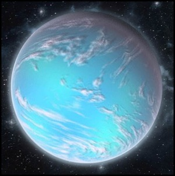

# 0939 明珠卫星 Pearl Moon

精校状态：中文行文已逐段精校，部分术语仍为暂定

分类：地理 / 真实空间 Real Space / 朦胧星域 Segmentum Obscurus

原文来源：https://www.bilibili.com/opus/1161261377664319488

原作者：帝国神选罐头

原文时间：2026年01月24日 08:47

[返回分类目录](目录.md) · [全书目录](../../目录.md)

原篇名：珍珠之月 Pearl Moon

<!-- A0939-B0001 -->
### Basic Data 基本资料

原题：Basic Data 基础数据

<!-- /A0939-B0001 -->

<!-- A0939-B0002 -->
**英文原文**

Name:The Pearl Moon of Karrik

<!-- /A0939-B0002 -->

<!-- A0939-B0003 -->

原译文

名称：卡里克的珍珠之月

**校订译文**

名称：卡里克的明珠卫星

**校注：** The Pearl Moon 沿865既定明珠卫星；原珍珠之月保留对照。

<!-- /A0939-B0003 -->

<!-- A0939-B0004 -->
**英文原文**

Segmentum:Segmentum Obscurus

<!-- /A0939-B0004 -->

<!-- A0939-B0005 -->

原译文

星域：朦胧星域

**校订译文**

星域：朦胧星域

<!-- /A0939-B0005 -->

<!-- A0939-B0006 -->
**英文原文**

Sector:Calixis Sector

<!-- /A0939-B0006 -->

<!-- A0939-B0007 -->

原译文

星区：卡利西斯星区

**校订译文**

星区：卡利西斯星区

<!-- /A0939-B0007 -->

<!-- A0939-B0008 -->
**英文原文**

Subsector:Markayn Marches

<!-- /A0939-B0008 -->

<!-- A0939-B0009 -->

原译文

分区：马尔凯恩边区

**校订译文**

次星区：马尔凯恩边区

<!-- /A0939-B0009 -->

<!-- A0939-B0010 -->
**英文原文**

Primary:Karrik

<!-- /A0939-B0010 -->

<!-- A0939-B0011 -->

原译文

主星：卡里克

**校订译文**

所环绕天体：卡里克

<!-- /A0939-B0011 -->

<!-- A0939-B0012 -->
**英文原文**

Population:3,500,000 Human and Abhuman.

<!-- /A0939-B0012 -->

<!-- A0939-B0013 -->

原译文

人口：350,0000人类和亚人

**校订译文**

人口：350 万人类及亚人

<!-- /A0939-B0013 -->

<!-- A0939-B0014 -->
**英文原文**

Affiliation:Imperium

<!-- /A0939-B0014 -->

<!-- A0939-B0015 -->

原译文

隶属：帝国

**校订译文**

隶属：帝国

<!-- /A0939-B0015 -->

<!-- A0939-B0016 -->
**英文原文**

Class:Agri World, Ocean World

<!-- /A0939-B0016 -->

<!-- A0939-B0017 -->

原译文

类别：农业世界，海洋世界

**校订译文**

类别：农业世界，海洋世界

<!-- /A0939-B0017 -->

<!-- A0939-B0018 图片 -->

<!-- A0939-B0019 -->

原译文

Lunar Image 卫星图像

**校订译文**

Lunar Image 卫星图像

<!-- /A0939-B0019 -->

<!-- A0939-B0020 -->
**英文原文**

The Pearl Moon is an Ocean World with no permanent land masses besides man-made structures.

<!-- /A0939-B0020 -->

<!-- A0939-B0021 -->

原译文

珍珠之月是一个海洋世界，除了人造建筑外，没有永久的陆地。

**校订译文**

明珠卫星是一个海洋世界，除了人造建筑外，没有永久的陆地。

<!-- /A0939-B0021 -->

<!-- A0939-B0022 -->
## Planetary Data 行星数据

<!-- /A0939-B0022 -->

<!-- A0939-B0023 -->
**英文原文**

Equatorial Circumference: 12,500 Miles.

<!-- /A0939-B0023 -->

<!-- A0939-B0024 -->

原译文

赤道周长：12500英里。

**校订译文**

赤道周长：12500英里。

<!-- /A0939-B0024 -->

<!-- A0939-B0025 -->
**英文原文**

Gravity: 1.21G

<!-- /A0939-B0025 -->

<!-- A0939-B0026 -->

原译文

重力：1.21G

**校订译文**

重力：1.21G

<!-- /A0939-B0026 -->

<!-- A0939-B0027 -->
**英文原文**

Satellites: The Pearl Moon is Karrik's satellite.

<!-- /A0939-B0027 -->

<!-- A0939-B0028 -->

原译文

卫星：珍珠之月是卡里克的卫星。

**校订译文**

卫星：明珠卫星是卡里克的卫星。

<!-- /A0939-B0028 -->

<!-- A0939-B0029 -->
**英文原文**

Climate Classification: Extreme - Hyper Humid.

<!-- /A0939-B0029 -->

<!-- A0939-B0030 -->

原译文

气候分类：极端-超潮湿。

**校订译文**

气候分类：极端-超潮湿。

<!-- /A0939-B0030 -->

<!-- A0939-B0031 -->
**英文原文**

Mean Surface Temperature: 35°C.

<!-- /A0939-B0031 -->

<!-- A0939-B0032 -->

原译文

平均表面温度：35°C。

**校订译文**

平均表面温度：35°C。

<!-- /A0939-B0032 -->

<!-- A0939-B0033 -->
**英文原文**

Tropospheric Composition: Nitrogen 72%, Oxygen 25%, Argon 1%, Ozone 1%, Carbon Dioxide 0.5%.

<!-- /A0939-B0033 -->

<!-- A0939-B0034 -->

原译文

对流层成分：氮72%，氧25%，氩1%，臭氧1%，二氧化碳0.5%。

**校订译文**

对流层成分：氮72%，氧25%，氩1%，臭氧1%，二氧化碳0.5%。

**校注：** 本组大气百分比合计99.5%，保持英文数字，不擅补余下成分。

<!-- /A0939-B0034 -->

<!-- A0939-B0035 -->
## Information 信息

<!-- /A0939-B0035 -->

<!-- A0939-B0036 -->
**英文原文**

The population of The Pearl Moon are mostly employed with gathering, packaging and shipping out seafood and algae to feed the populaces of other worlds in the Calixis Sector. Despite being a relatively peaceful place to live, life on the oceans of The Pearl Moon is hard, and the average lifespan is about 40. Most people live on large farming rigs that are suspended over submerged reefs and rocks by numerous cables. The people of The Pearl Moon tend to possess a high degree of tolerance to motion sickness and contact with slightly caustic environmental conditions. Despite their harsh life something about an existence on the ocean appeals to many people here, and they can become maudlin if taken from their homeworld.

<!-- /A0939-B0036 -->

<!-- A0939-B0037 -->

原译文

珍珠之月的人口主要从事收集、包装和运输海鲜和藻类，以养活卡利西斯星区其他世界的人口。尽管是一个相对和平的居住地，但珍珠之月的海洋上的生活很艰难，平均寿命约为40岁。大多数人生活在大型农业钻井平台上，这些钻井平台通过许多电缆悬挂在淹没的礁石和岩石上。珍珠之月的人们往往对晕动病和接触轻微腐蚀性环境条件具有高度的耐受性。尽管他们的生活很艰苦，但海洋上的生活对这里的许多人来说都很有吸引力，如果被带离家园世界，他们可能会变得多愁善感。

**校订译文**

明珠卫星的居民主要采集、包装和运送海产与藻类，为卡利西斯其他世界提供食物。这里虽较为和平，海上生活却艰苦，平均寿命仅约四十岁。多数人居住在大型养殖平台上，由大量缆索将平台锚固于水下礁石和岩层。当地人不易晕船，也较能忍受环境的轻微腐蚀性。尽管日子艰难，海洋生活仍深深吸引着他们；离开母星，往往会变得郁郁寡欢。

**校注：** farming rigs 是海上养殖平台，不都属于钻井平台；后文另明确其中部分兼有燃料钻采设施。缆索用于锚固，不是传电电缆。

<!-- /A0939-B0037 -->

<!-- A0939-B0038 -->
**英文原文**

Planetary Governor Lord Spheng and a bevy of his cronies form an effective oligarchy who concern themselves mainly with strategies to meet their tithe quota. There is a greater separation of church and state on The Pearl Moon than on most Imperial Worlds, though Artaxis and his friends are careful to remain on the right side of The Pearl Moon's religious authorities. The population of the moon is too small for heretical cults to take hold successfully, though folk tales abound of sunken cities, giant white whaleworms and weird islands covered in alien architecture that are revealed during certain confluences of the moons, but sensible folk are dismissive of them. Small communities of both Ratlings and Ogryns live on the rigs of The Pearl Moon.

<!-- /A0939-B0038 -->

<!-- A0939-B0039 -->

原译文

行星总督斯彭领主和他的一群亲信组成了一个有效的寡头政治，他们主要关心实现什一税配额的策略。与大多数帝国世界相比，珍珠之月的政教分离程度更高，尽管阿尔塔克西斯和他的朋友们小心翼翼地站在珍珠之月宗教权威之右。卫星上的人口太少，异端教派无法成功扎根，尽管民间故事中充斥着沉没的城市、巨大的白色蠕鲸和被异型建筑覆盖的奇怪岛屿，这些故事在卫星的某些交汇处被揭示出来，但明智的人对它们不屑一顾。莱特林和欧格林的小社区都住在珍珠之月的钻井平台上。

**校订译文**

总督斯彭领主与一群亲信组成了实际上的寡头统治集团，主要琢磨如何完成什一税配额。这里的政教分离程度高于多数帝国世界，但阿尔塔克西斯及其同伴仍小心维持与宗教当局的良好关系。原文认为，当地人口太少，不利于异端教派扎根。民间却流传着沉没城市、巨型白色蠕鲸，以及覆盖异形建筑的怪岛的故事；据说这些岛屿会在月体形成特定排列时显露，不过理智者对此嗤之以鼻。各养殖平台上还居住着莱特林和欧格林的小型社群。

**校注：** 原文先称总督 Lord Spheng，随后突然出现 Artaxis，未交代二者关系；保留两名并在此标疑，不擅认同一人。right side of 指保持良好关系，不是位于右侧。人口少便无异端教派为原文观点，未作普遍设定推断。

<!-- /A0939-B0039 -->

<!-- A0939-B0040 -->
**英文原文**

Whilst the population of the moon is peaceful and loyal to the Imperium this is an important world for the sector, and relatively vulnerable, so it may make a tempting target for the forces of Chaos, or some other foe.

<!-- /A0939-B0040 -->

<!-- A0939-B0041 -->

原译文

虽然卫星上的人口是和平的，忠于帝国，但这对该星区来说是一个重要的世界，相对脆弱，因此它可能成为混沌部队或其他敌人的诱人目标。

**校订译文**

居民虽性情平和、忠于帝国，这颗世界却对星区十分重要，防御又较薄弱，因此可能成为混沌或其他敌人眼中诱人的目标。

<!-- /A0939-B0041 -->

<!-- A0939-B0042 -->
### Religion 宗教

<!-- /A0939-B0042 -->

<!-- A0939-B0043 -->
**英文原文**

A conservative, but not zealous, adherence to the Imperial Cult. Karrik's monodominant beliefs are also an influence here.

<!-- /A0939-B0043 -->

<!-- A0939-B0044 -->

原译文

对帝国教派遵循保守但不狂热。卡里克的单优信仰也在这里产生了影响。

**校订译文**

当地保守地信奉帝国国教，但并不狂热。卡里克的单一主宰信仰也在此产生影响。

**校注：** monodominant 作为信仰名称暂译单一主宰，原单优用语不清。此段未解释教义，不补写其具体主张。

<!-- /A0939-B0044 -->

<!-- A0939-B0045 -->
### Climate 气候

<!-- /A0939-B0045 -->

<!-- A0939-B0046 -->
**英文原文**

The Pearl Moon's warm temperatures and abundance of water make for a humid atmosphere and precipitation is heavy. The skies of The Pearl Moon are usually filled with roiling thunderclouds, though storms on the planet often look worse than they are.

<!-- /A0939-B0046 -->

<!-- A0939-B0047 -->

原译文

珍珠之月温暖的温度和丰富的水分使大气湿润，降水量很大。珍珠之月的天空通常布满了翻滚的雷雨云，尽管行星上的风暴看起来往往比实际情况更糟糕。

**校订译文**

气温温暖、水量充沛，使明珠卫星空气潮湿、降雨丰沛。天空常堆积着翻滚的雷云，不过许多风暴只是看上去骇人，实际并没有那么猛烈。

<!-- /A0939-B0047 -->

<!-- A0939-B0048 -->
**英文原文**

Cloud cover means that the nights remain warm, though the seas absorb some heat meaning that the temperature does drop towards sunrise.

<!-- /A0939-B0048 -->

<!-- A0939-B0049 -->

原译文

云层覆盖意味着夜晚仍然温暖，尽管海洋吸收了一些热量，这意味着气温在日出时确实会下降。

**校订译文**

云层使夜晚依旧温暖；海洋又会吸收一部分热量，因此接近日出时，气温仍会下降。

<!-- /A0939-B0049 -->

<!-- A0939-B0050 -->
### Climatic Regions 气候区域

<!-- /A0939-B0050 -->

<!-- A0939-B0051 -->
**英文原文**

The entire surface of The Pearl Moon is covered in ocean. Sometimes the gravitational pull of the moons or volcanic activity will reveal small atolls, but these are soon covered by the tide or worn away by the action of waves. Some reefs of note exist, such as the great rocky Shatterships to the north pole of the planet. For the most part though the ocean is deep, and in some areas unfathomed. The Pearl Moon is a warm world, and sea ice does not form at the poles.

<!-- /A0939-B0051 -->

<!-- A0939-B0052 -->

原译文

珍珠之月的整个表面都被海洋覆盖着。有时，卫星的引力或火山活动会揭示出小环礁，但这些环礁很快就会被潮汐覆盖或被波浪的作用磨损。一些值得注意的礁存在，比如地球北极的巨大岩石碎舰。尽管海洋在很大程度上很深，在某些地区甚至深不可测。珍珠之月是一个温暖的世界，两极不会形成海冰。

**校订译文**

明珠卫星表面全部被海洋覆盖。卫星引力或火山活动有时会让小环礁露出水面，但很快又被潮水淹没或被波浪磨蚀。也有值得注意的礁群，例如北极附近规模庞大的碎舰礁。大部分海域水深惊人，有些地方还未测得海底。这颗世界十分温暖，两极也不会形成海冰。

**校注：** moons 为原文复数，可能指当地其他月体的引力，未明示数量；不擅设明珠卫星自身另有几颗卫星。

<!-- /A0939-B0052 -->

<!-- A0939-B0053 -->
### Climatic Phenomenon 气候现象

<!-- /A0939-B0053 -->

<!-- A0939-B0054 -->
**英文原文**

Near-constant storms.

<!-- /A0939-B0054 -->

<!-- A0939-B0055 -->

原译文

近乎持续的风暴。

**校订译文**

近乎持续的风暴。

<!-- /A0939-B0055 -->

<!-- A0939-B0056 -->
### Terra-Forming 环境改造

原题：Terra-Forming 地形形成

<!-- /A0939-B0056 -->

<!-- A0939-B0057 -->
**英文原文**

In order to farm fish on the planet rigs come equipped with hydro-processing units that remove alkaline minerals from the water. There are some worries that this may lead to a planetwide lowering of the oceans ph, but the government of The Pearl Moon aren't overly concerned about this. A number of species not native to the planet have been introduced for farming purposes.

<!-- /A0939-B0057 -->

<!-- A0939-B0058 -->

原译文

为了在行星上养鱼，钻井平台配备了水力处理单元，可以从水中去除碱性矿物质。有人担心这可能会导致全球海洋ph值下降，但珍珠之月的政府对此并不太担心。许多非行星本土物种已被引入用于农业目的。

**校订译文**

为了养鱼，各平台配备水处理装置，去除水中的碱性矿物。有人担忧，这会使全球海水的 pH 值下降，但当地政府并不在意。人们还为养殖引入了数种非本土生物。

<!-- /A0939-B0058 -->

<!-- A0939-B0059 -->
### Native Flora and Fauna 本地动植物

<!-- /A0939-B0059 -->

<!-- A0939-B0060 -->
**英文原文**

A variety of animals and plants live in the seas of The Pearl Moon, the vast majority of them forming a vast planktonic soup drifting in the great ocean. There are no known vertebrates native to The Pearl Moon, though a number of creatures analogous to Terran annelids, molluscs and crustaceans exist. Some of these are real monsters of the deep, and attacks on ships and rigs by massive and ravenous whale-worms, or huge crab-like Rhanniniods, are uncommon but not unknown.

<!-- /A0939-B0060 -->

<!-- A0939-B0061 -->

原译文

珍珠之月的海中生活着各种动植物，其中绝大多数形成了漂浮在大海中的巨大浮游生物汤。尽管存在许多类似于泰拉环节动物、软体动物和甲壳类动物的生物，但目前还没有已知的珍珠之月原生脊椎动物。其中一些是真正的深海怪物，巨大而贪婪的蠕鲸或像螃蟹一样的大型兰尼奥德对船只和钻井平台的攻击并不常见，但并非不为人知。

**校订译文**

海中生活着各类动植物，绝大多数是漂游在广阔海洋中的浮游生物，形成浓密的生命汤。这里没有已知的本土脊椎动物，却有许多类似泰拉环节动物、软体动物与甲壳类的物种。部分堪称真正的深海巨怪：庞大贪食的蠕鲸与巨蟹般的兰尼奥德，偶尔会袭击船只和养殖平台。

<!-- /A0939-B0061 -->

<!-- A0939-B0062 -->
### Alien Flora and Fauna 外来动植物

<!-- /A0939-B0062 -->

<!-- A0939-B0063 -->
**英文原文**

A number of species of fish have been introduced from other worlds inhabited by humans, including breeds of cod and tuna.

<!-- /A0939-B0063 -->

<!-- A0939-B0064 -->

原译文

许多鱼类物种是从人类居住的其他世界引进的，包括鳕鱼和金枪鱼品种。

**校订译文**

许多鱼类物种是从人类居住的其他世界引进的，包括鳕鱼和金枪鱼品种。

<!-- /A0939-B0064 -->

<!-- A0939-B0065 -->
### Economy 经济

<!-- /A0939-B0065 -->

<!-- A0939-B0066 -->
**英文原文**

The population of The Pearl Moon mostly live on vast farming rigs, tethered to submerged reef or rocks by numerous cables. People on The Pearl Moon use the currency of Karrik. Most workers are farmers and labourers, though many rigs come with drilling and mining facilities to take advantage of the considerable fossil fuel wealth of the moon.

<!-- /A0939-B0066 -->

<!-- A0939-B0067 -->

原译文

珍珠之月的居民大多生活在巨大的农业钻井平台上，通过无数电缆与水下礁石或岩石相连。珍珠之月上的人们使用卡里克的货币。大多数工人都是农民和工人，尽管许多钻井平台都配有钻井和采矿设施，以利用卫星上丰富的化石燃料资源。

**校订译文**

多数居民住在巨型养殖平台上，平台以大量缆索锚定于水下礁石或岩层。当地使用卡里克的货币，居民主要从事养殖和体力劳动。不少平台同时配有钻探、采矿设施，开发这颗卫星丰富的化石燃料。

<!-- /A0939-B0067 -->

<!-- A0939-B0068 -->
### Society 社会

<!-- /A0939-B0068 -->

<!-- A0939-B0069 -->
**英文原文**

Mostly poor farm labourers operating in 'work gangs'. A high level of technology is maintained, with many tasks automated. Ministorium Galaxia missionaries report very little in the way of genetic mutation. A small number of Ratlings are employed in work gangs on many rigs, keeping maintainance channels and drains clear. Ogryn work gangs are also present to help with hard labour on the docks of the rigs.

<!-- /A0939-B0069 -->

<!-- A0939-B0070 -->

原译文

大多数是在“工作帮派”中工作的贫困农场工人。保持了高水平的技术，许多任务实现了自动化。国教银河传教士报告的基因突变很少。许多钻井平台上的工作帮派雇佣了少量的莱特林，以保持维护通道和排水沟的畅通。欧格林工作帮派也在场，帮助在钻井平台码头上做苦工。

**校订译文**

社会以贫穷的养殖劳工为主，他们组成工作队共同劳动。当地保持着较高技术水平，许多工序已自动化。银河传教团的传教士报告称，这里的基因突变极少。许多平台雇用少量莱特林，负责清理维护通道与排水沟；欧格林工作队则在码头承担重体力劳动。

**校注：** Ministorium Galaxia 与已定 Ministorum Galaxia 拼写略异，按同一传教组织暂沿银河传教团；work gangs 是工作队，不是犯罪帮派。

<!-- /A0939-B0070 -->

<!-- A0939-B0071 -->
### Water Supply 供水

<!-- /A0939-B0071 -->

<!-- A0939-B0072 -->
**英文原文**

The water of The Pearl Moon's Oceans is salty and somewhat alkaline, but hydro-processing plants situated in the rigs turn it into drinkable water. Rain water is also fairly easy to collect, and is quite potable, though off-worlders can find that it tastes odd.

<!-- /A0939-B0072 -->

<!-- A0939-B0073 -->

原译文

珍珠之月的海洋的水是咸的，有点碱性，但位于钻井平台上的水力处理将其转化为饮用水。雨水也很容易收集，而且很容易饮用，尽管外世界人会发现它的味道很奇怪。

**校订译文**

当地海水含盐、略呈碱性，平台上的水处理厂可将其转化为饮用水。雨水也很容易收集，可以直接饮用，不过外来者可能不习惯它的味道。

<!-- /A0939-B0073 -->

<!-- A0939-B0074 -->
### Principle Exports 主要出口

<!-- /A0939-B0074 -->

<!-- A0939-B0075 -->
**英文原文**

Foodstuffs (mostly algae, but some fish and other edible sea creatures too), natural gas. The Imperium expects The Pearl Moon to produce enough to food to supplement the diets of Imperial Citizens living on less fertile worlds throughout the Calixis sector. Planets such as Karrik receive regular shipments from The Pearl Moon.

<!-- /A0939-B0075 -->

<!-- A0939-B0076 -->

原译文

食品原料（主要是藻类，但也有一些鱼类和其他可食用的海洋生物）、天然气。帝国希望珍珠之月能够生产足够的食物，以补充生活在整个卡利西斯星区不太肥沃的世界上的帝国公民的饮食。像卡里克这样的行星定期收到来自珍珠月的货物。

**校订译文**

主要出口食品——以藻类为主，也包括鱼类与其他可食海生物——以及天然气。帝国要求明珠卫星生产足量食物，补充卡利西斯星区那些较贫瘠世界的居民饮食。卡里克等行星定期接收这里运出的货物。

<!-- /A0939-B0076 -->

<!-- A0939-B0077 -->
### Principle Imports 主要进口

<!-- /A0939-B0077 -->

<!-- A0939-B0078 -->
**英文原文**

Building materials for rigs and ships, mechanical goods, electrical devices, farming equipment.

<!-- /A0939-B0078 -->

<!-- A0939-B0079 -->

原译文

钻井平台和船舶的建筑材料、机械产品、电气设备、农业设备。

**校订译文**

平台与船舶建材、机械产品、电气装置，以及养殖设备。

<!-- /A0939-B0079 -->

<!-- A0939-B0080 -->
### Conflicts 冲突

<!-- /A0939-B0080 -->

<!-- A0939-B0081 -->
**英文原文**

Not of any significance, the small population and harsh living conditions breeds a sense of community that means the people of The Pearl Moon are relatively peaceful.

<!-- /A0939-B0081 -->

<!-- A0939-B0082 -->

原译文

没有任何意义，人口稀少和恶劣的生活条件孕育了一种社区意识，这意味着珍珠之月的人民相对和平。

**校订译文**

当地没有值得一提的大规模冲突。人口稀少、生活艰苦，反而培养了团结互助的意识，使居民较为平和。

<!-- /A0939-B0082 -->

<!-- A0939-B0083 -->
### Defences 防御

<!-- /A0939-B0083 -->

<!-- A0939-B0084 -->
**英文原文**

Almost every large rig on the planet carries some form of large weapon such as a macro cannon or defence laser. A small PDF exists, but the terrain of the planet means that the force receives very limited training, and its performance is not well regarded.

<!-- /A0939-B0084 -->

<!-- A0939-B0085 -->

原译文

行星上几乎每个大型钻机都携带某种形式的大型武器，如宏炮或防御激光。存在一只小的PDF，但行星的地形意味着部队接受的训练非常有限，其表现也不受好评。

**校订译文**

几乎每座大型平台都配有宏炮或防御激光炮之类的重型武器。当地也维持一支小型行星防卫军，但海洋环境严重限制了训练，其战斗表现并不被看好。

<!-- /A0939-B0085 -->

<!-- A0939-B0086 -->
### Imperial Guard Recruitment 帝国卫队招募

<!-- /A0939-B0086 -->

<!-- A0939-B0087 -->
**英文原文**

The Pearl Moon is not expected to raise any Imperial Guard Regiments, only their Planetary Defence Force. The population's farming work is considered an important enough service.

<!-- /A0939-B0087 -->

<!-- A0939-B0088 -->

原译文

预计珍珠之月不会培养任何帝国卫队，只会培养他们的行星防御部队。人们的农业工作被认为是一项足够重要的服役。

**校订译文**

帝国不要求明珠卫星组建帝国卫队兵团，只需维持行星防卫军。居民从事食物生产，已被视为足够重要的贡献。

**校注：** not expected to raise 指帝国不要求征组兵团，不是预测未来不会组建。

<!-- /A0939-B0088 -->

<!-- A0939-B0089 -->
### Contact with other Worlds 与其他世界的联系

<!-- /A0939-B0089 -->

<!-- A0939-B0090 -->
**英文原文**

The Pearl Moon sends shipments of food to many other worlds in the Calixis Sector.

<!-- /A0939-B0090 -->

<!-- A0939-B0091 -->

原译文

珍珠之月向卡利西斯星区的许多其他世界运送食物。

**校订译文**

明珠卫星向卡利西斯星区的许多其他世界运送食物。

<!-- /A0939-B0091 -->

本篇核心术语与暂定项

以下列出本篇出现的英文原形及核心术语表用词。同形词可能指不同对象，具体词义以本篇正文和校注为准；单复数、别名和仅见于图注的名称可能尚未列入。完整候选见[术语表](../../术语表/双语术语候选.csv)。

| 英文 | 采用中文 | 状态 |
| --- | --- | --- |
| Imperial Guard | 帝国卫队 | 暂定·语境区分 |
| Ogryn | 欧格林 | 官方已核对 |
| Imperium | 帝国 | 暂定·简称 |
| Equipment | 装备 | 编辑用语已统一 |
| Abhuman | 亚人 | 暂定·官方待核 |
| Imperial Cult | 帝皇信仰 | 暂定·官方待核 |
| Segmentum Obscurus | 朦胧星域 | 暂定·官方待核 |
| Segmentum | 星域 | 暂定·官方待核 |
| Sector | 星区 | 暂定·官方待核 |
| Subsector | 次星区 | 暂定·官方待核 |
| The Pearl Moon | 明珠卫星 | 暂定·官方待核 |
| Obscurus | 朦胧星 | 暂定·官方待核 |
| Clear | 清明 | 暂定·官方待核 |
| Calixis Sector | 卡利西斯星区 | 暂定·官方待核 |
| Karrik | 卡里克 | 暂定·官方待核 |
| Macro Cannon | 宏炮 | 暂定·官方待核 |
| Markayn Marches | 马尔凯恩边区 | 暂定·官方待核 |
| Lord Spheng | 斯彭领主 | 暂定·官方待核 |
| Artaxis | 阿尔塔克西斯 | 暂定·官方待核 |
| monodominant beliefs | 单一主宰信仰 | 暂定·官方待核 |
| Shatterships | 碎舰礁 | 暂定·官方待核 |
| Rhanniniods | 兰尼奥德 | 暂定·官方待核 |
| Ministorium Galaxia | 银河传教团 | 暂定·官方待核 |

