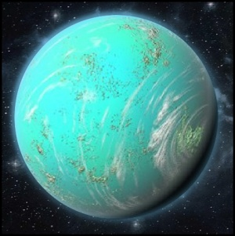

# 0941 瑞斯 Reth

精校状态：中文行文已逐段精校，部分术语仍为暂定

分类：地理 / 真实空间 Real Space / 朦胧星域 Segmentum Obscurus

原文来源：https://www.bilibili.com/opus/1171760060145074216

原作者：帝国神选罐头

原文时间：2026年02月21日 15:47

[返回分类目录](目录.md) · [全书目录](../../目录.md)

<!-- A0941-B0001 -->
### Basic Data 基本资料

原题：Basic Data 基础数据

<!-- /A0941-B0001 -->

<!-- A0941-B0002 -->
**英文原文**

Name:Reth

<!-- /A0941-B0002 -->

<!-- A0941-B0003 -->

原译文

名称：瑞斯

**校订译文**

名称：瑞斯

<!-- /A0941-B0003 -->

<!-- A0941-B0004 -->
**英文原文**

Segmentum:Segmentum Obscurus

<!-- /A0941-B0004 -->

<!-- A0941-B0005 -->

原译文

星域：朦胧星域

**校订译文**

星域：朦胧星域

<!-- /A0941-B0005 -->

<!-- A0941-B0006 -->
**英文原文**

Sector:Calixis Sector

<!-- /A0941-B0006 -->

<!-- A0941-B0007 -->

原译文

星区：卡利西斯星区

**校订译文**

星区：卡利西斯星区

<!-- /A0941-B0007 -->

<!-- A0941-B0008 -->
**英文原文**

Subsector:Adrantis Subsector

<!-- /A0941-B0008 -->

<!-- A0941-B0009 -->

原译文

分区：阿德兰蒂斯分区

**校订译文**

次星区：阿德兰提斯次星区

<!-- /A0941-B0009 -->

<!-- A0941-B0010 -->
**英文原文**

System:Tephaine System

<!-- /A0941-B0010 -->

<!-- A0941-B0011 -->

原译文

星区：特菲纳星系

**校订译文**

星系：忒法因星系

<!-- /A0941-B0011 -->

<!-- A0941-B0012 -->
**英文原文**

Population:640,000,000

<!-- /A0941-B0012 -->

<!-- A0941-B0013 -->

原译文

人口：6,4000,0000

**校订译文**

人口：6.4 亿

<!-- /A0941-B0013 -->

<!-- A0941-B0014 -->
**英文原文**

Affiliation:Imperium

<!-- /A0941-B0014 -->

<!-- A0941-B0015 -->

原译文

隶属：帝国

**校订译文**

隶属：帝国

<!-- /A0941-B0015 -->

<!-- A0941-B0016 -->
**英文原文**

Class:Paradise World

<!-- /A0941-B0016 -->

<!-- A0941-B0017 -->

原译文

类别：天堂世界

**校订译文**

类别：天堂世界

<!-- /A0941-B0017 -->

<!-- A0941-B0018 图片 -->

<!-- A0941-B0019 -->

原译文

Planetary Image 行星图像

**校订译文**

Planetary Image 行星图像

<!-- /A0941-B0019 -->

<!-- A0941-B0020 -->
**英文原文**

Historically, Reth has been entirely dependent upon its reputation as a paradise world. Consisting largely of a vast archipelago of thousands of golden islands scattered across a shallow warm turquoise sea, its climate and environment are said to be perfect for soothing and rejuvenating the tired and troubled mind.

<!-- /A0941-B0020 -->

<!-- A0941-B0021 -->

原译文

从历史上看，瑞斯完全依赖于其作为天堂世界的声誉。它主要由散布在浅而温暖的绿松石海中的数千个金色岛屿组成的庞大群岛组成，据说它的气候和环境非常适合舒缓和恢复疲惫和困扰的心灵。

**校订译文**

瑞斯历来依靠天堂世界的美名维生。温暖浅碧的海洋中，散布着数千座金色小岛，组成广阔群岛。据说，这里的气候与环境最适合抚慰疲惫、困扰的心灵，使人恢复活力。

<!-- /A0941-B0021 -->

<!-- A0941-B0022 -->
## History 历史

<!-- /A0941-B0022 -->

<!-- A0941-B0023 -->
**英文原文**

For over a thousand years, the planet's hereditary monarchs traded off this reputation, until the de Caul family staged a successful coup two centuries ago. The de Cauls, a mid-ranking clan of Imperial nobles, brought a new and more severe interpretation of the Imperial cult to the laid back and pleasure loving planet.

<!-- /A0941-B0023 -->

<!-- A0941-B0024 -->

原译文

一千多年来，这个行星上的世袭君主一直在利用这一声誉，直到两个世纪前德·考尔斯家族发动了一场成功的政变。德·考尔斯是一个中等级别的帝国贵族家族，为这个悠闲而热爱享乐的行星带来了对帝国教派的新的、更严厉的解释。

**校订译文**

一千多年来，当地世袭君主一直倚赖这份名声获利。直到两百年前，中等门第的帝国贵族德·考尔家族政变成功，夺取统治权，为悠闲享乐的瑞斯带来了更加严苛的国教教义解释。

<!-- /A0941-B0024 -->

<!-- A0941-B0025 -->
**英文原文**

Now, whilst it retains (to some extent) its status as a favoured destination for senior Adeptus Terra functionaries and Imperial Nobles, it also boasts a small, yet influential, complex for the treatment of mental disorders operated by the Orders Hospitaller of the Adepta Sororitas. This facility, the Asylum of Saint Vero, based on Reth's third largest island, treats over a million inmates, all suffering from a variety of mental illnesses. It is a conglomeration of hospitals, clinics and shrines maintained by the dutiful and dedicated sisters.

<!-- /A0941-B0025 -->

<!-- A0941-B0026 -->

原译文

现在，虽然它（在某种程度上）保留了其作为高级中央政务部官员和帝国贵族的首选目的地的地位，但它也拥有一个由修女会的医院修会管理的小型但有影响力的精神障碍治疗建筑群。这个位于瑞斯第三大岛上的圣维罗精神病院，治疗了100多万名病人，他们都患有各种精神疾病。它是由尽职尽责和敬业的修女们维护的医院、诊所和圣地的集合。

**校订译文**

如今，瑞斯在一定程度上仍是中央政务部高级官员和帝国贵族青睐的去处，同时又拥有一处规模不大、影响却不小的精神疾病治疗设施，由修女会医疗修会管理。圣维罗精神病院位于第三大岛上，收治着一百多万名患有各类精神疾病的住院者。它由医院、诊所与圣所构成，靠尽忠职守的修女维持运作。

**校注：** 英文 small complex 与 over a million inmates 同时出现，数量与相对规模均保留，不自行删减一百多万。

<!-- /A0941-B0026 -->

<!-- A0941-B0027 -->
**英文原文**

Disquieting rumours persist that many of the unfortunate patients of the St. Vero asylum are in fact psykers brought to the planet for reasons unknown. The Inquisition has, on occasion, sent its own most troubled members to a secret bunker, known as the Chapel of Blessed Peace, sited below the asylum and protected by Hexagrammic Wards, silver seals of great potency and Inquisitorial Stormtroopers of ancient charter. Many valued Imperial servants whose talents are deemed 'useful' to the Imperium, are sent to Reth for a period of recuperation, and in some cases, mind-cleansing.

<!-- /A0941-B0027 -->

<!-- A0941-B0028 -->

原译文

令人不安的谣言持续存在，圣维罗精神病院的许多不幸患者实际上是出于未知原因被带到这个行星的灵能者。审判庭有时会将自己最麻烦的成员派往一个秘密地堡，即被称为受祝和平礼拜堂的地堡，该地堡位于精神病院下方，由六芒保护、强大的银印和古代宪章的审判庭风暴兵保护。许多有价值的帝国之仆，他们的才能被认为对帝国“有用”，被派往瑞斯进行一段时间的康复，在某些情况下，还可以净化心灵。

**校订译文**

一些令人不安的传闻称，圣维罗的许多不幸病人其实是灵能者，不知为何被送到这里。审判庭有时也会把精神困扰最严重的成员，送往病院下方名为“受祝和平礼拜堂”的秘密地堡。那里由六芒星防护、威力强大的银质封印，以及依据古老特许令驻守的审判庭风暴兵保护。许多才干仍被认为对帝国“有用”的重要人员，会被送来休养；部分人还会接受心智清洗。

**校注：** most troubled 指精神困扰严重，不是最惹麻烦；mind-cleansing 为心智清洗，不能弱化为普通净化心灵。古老 charter 修饰驻守部队的授权依据，不是把宪章本身当作护卫。

<!-- /A0941-B0028 -->

<!-- A0941-B0029 -->
## Planetary Data 行星数据

<!-- /A0941-B0029 -->

<!-- A0941-B0030 -->
**英文原文**

Equatorial Circumference: 22,768 Miles.

<!-- /A0941-B0030 -->

<!-- A0941-B0031 -->

原译文

赤道周长：22768英里。

**校订译文**

赤道周长：22768英里。

<!-- /A0941-B0031 -->

<!-- A0941-B0032 -->
**英文原文**

Gravity: 0.89 G.

<!-- /A0941-B0032 -->

<!-- A0941-B0033 -->

原译文

重力：0.89G。

**校订译文**

重力：0.89G。

<!-- /A0941-B0033 -->

<!-- A0941-B0034 -->
**英文原文**

Years and Days: Reth takes 379 Terran days to Orbit its star and spins on its axis every 22 Terran hours.

<!-- /A0941-B0034 -->

<!-- A0941-B0035 -->

原译文

年与日：瑞斯需要379泰拉日绕其恒星运行，每22个泰拉时绕其轴旋转一次。

**校订译文**

年与日：绕恒星一周需 379 泰拉日，自转一周需 22 泰拉小时。

<!-- /A0941-B0035 -->

<!-- A0941-B0036 -->
**英文原文**

Satellites: Tyder (barren moon), Sedwyr (barren moon/asteroid) and Quaddisar Palace (space station and casino).

<!-- /A0941-B0036 -->

<!-- A0941-B0037 -->

原译文

卫星：泰德（贫瘠的月球）、塞德维尔（贫瘠的月亮/小行星）和夸迪萨尔宫殿（空间站和赌场）。

**校订译文**

卫星：泰德（荒芜卫星）、塞德维尔（荒芜卫星／小行星），以及夸迪萨尔宫殿（兼作赌场的空间站）。

<!-- /A0941-B0037 -->

<!-- A0941-B0038 -->
**英文原文**

Mean Surface Temperature: 31°C.

<!-- /A0941-B0038 -->

<!-- A0941-B0039 -->

原译文

平均地表温度：31°C。

**校订译文**

平均地表温度：31°C。

<!-- /A0941-B0039 -->

<!-- A0941-B0040 -->
**英文原文**

Tropospheric Composition: Nitrogen 78%, Oxygen 21%, Argon 1%, Carbon Dioxide 0.3%, Water Vapor (trace)

<!-- /A0941-B0040 -->

<!-- A0941-B0041 -->

原译文

对流层成分：氮78%，氧21%，氩1%，二氧化碳0.3%，水蒸气（微量）

**校订译文**

对流层成分：氮78%，氧21%，氩1%，二氧化碳0.3%，水蒸气（微量）

**校注：** 原文氮、氧、氩、二氧化碳合计100.3%，另有微量水汽；保留源数字，作为待核数据错误，不擅调整。

<!-- /A0941-B0041 -->

<!-- A0941-B0042 -->
**英文原文**

Planetary Governor: Jedidiah de Caul is the authorised representative of His Imperial Majesty's Administratum on Reth. A sober, unbending hereditary monarch of strong religious leanings, he is a poor fit with the easygoing Rethian people. Unfortunately for the Rethians, in any such conflict they are likely to come off the worse given de Caul's tremendous family connections and the support of a strong Magistratum contingent.

<!-- /A0941-B0042 -->

<!-- A0941-B0043 -->

原译文

行星总督：杰迪代亚·德·考尔是帝皇在瑞斯上内务部的授权代表。他是一位冷静、坚定的世袭君主，有着强烈的宗教倾向，与随和的瑞斯人格格不入。不幸的是，对于瑞斯人来说，在任何这样的冲突中，考虑到德·考尔巨大的家族关系和强大的执法官特遣队的支持，他们的处境可能会更糟。

**校订译文**

行星总督：杰迪代亚·德·考尔，是帝皇治下内政部在瑞斯的授权代表。他严肃顽固、笃信宗教，与性情随和的居民格格不入。不幸的是，他拥有庞大的家族人脉，又有强大的地方执法部队支持，双方若发生冲突，吃亏的往往只能是瑞斯人。

<!-- /A0941-B0043 -->

<!-- A0941-B0044 -->
**英文原文**

Religion: Rethians, whilst retaining a proper respect for the Lord of Mankind, tend to think of him in fairly abstract, neutral terms. Rethians are typically laid back and would rather enjoy a life of mild sin than a life of confessing over imagined sins. Whilst this rarely converts into outright heresy, many outsiders feel that the average Rethian needs to have the love of the Emperor thrashed into them. Sadly for the Rethians, their current Governor agrees and firmly holds this view.

<!-- /A0941-B0044 -->

<!-- A0941-B0045 -->

原译文

宗教：瑞斯人在保持对人类之主的适当尊重的同时，倾向于用相当抽象、中立的术语来看待他。瑞斯人通常很悠闲，宁愿享受轻微罪恶的生活，也不愿承认想象中的罪恶。虽然这很少转化为彻头彻尾的异端，但许多外来者认为，对于普通的瑞斯人需要把帝皇之爱灌输给他们。可悲的是，对于瑞斯人来说，他们现任的总督同意并坚定地持有这一观点。

**校订译文**

宗教：瑞斯人对人类之主保持应有敬意，却更多以抽象、平和的方式看待祂。他们通常悠闲随性，宁愿带着少许小罪过享受人生，也不肯终日为臆想的罪孽忏悔。这种态度很少发展成真正的异端，但许多外来者认为，必须用鞭打让他们学会爱戴帝皇。居民的不幸在于，现任总督也坚定认同这一观点。

**校注：** thrashed into 表示以暴力强行灌输，原译仅作一般灌输，漏掉了当地人与统治者冲突的关键。

<!-- /A0941-B0045 -->

<!-- A0941-B0046 -->
**英文原文**

Climate: Reth's climate is uniformly warm and sunny, with a tropical monsoon season throughout the Equatorial band.

<!-- /A0941-B0046 -->

<!-- A0941-B0047 -->

原译文

气候：瑞斯的气候均匀温暖，阳光充足，赤道带有热带季风季。

**校订译文**

气候：瑞斯的气候均匀温暖，阳光充足，赤道带有热带季风季。

<!-- /A0941-B0047 -->

<!-- A0941-B0048 -->
**英文原文**

Seas: Reth lacks any major continents or landmasses, instead girdled with thousands of tiny coral islands of great beauty. These coral islands sit atop vast shallow reefs that cover most of the planet.

<!-- /A0941-B0048 -->

<!-- A0941-B0049 -->

原译文

海洋：瑞斯没有任何主要的大陆或陆地，而是被数千个美丽的小珊瑚岛环绕。这些珊瑚岛坐落在覆盖行星大部分地区的巨大浅礁之上。

**校订译文**

海洋：瑞斯没有任何主要的大陆或陆地，而是被数千个美丽的小珊瑚岛环绕。这些珊瑚岛坐落在覆盖行星大部分地区的巨大浅礁之上。

<!-- /A0941-B0049 -->

<!-- A0941-B0050 -->
**英文原文**

Alien Flora and Fauna: The reefs are home to billions of beautiful Nautiline. Nautiline resemble terran shrimp, but are unrelated to any Terran creature: they came to their current form by convergent evolution. Nautiline of different species dominate every niche in the planet's ecosystem, but few are dangerous to man. Most are delicious, although they are notorious for decaying rapidly when out of the water.

<!-- /A0941-B0050 -->

<!-- A0941-B0051 -->

原译文

外星动植物：珊瑚礁是数十亿美丽的诺泰林的家园。诺泰林类似于泰拉虾，但与任何泰拉生物都无关：它们是通过趋同进化形成的。不同种类的诺泰林主宰着行星生态系统中的每一个生态位，但很少对人类构成危险。大多数都很美味，尽管它们在离开水后会迅速腐烂。

**校订译文**

外星动植物：珊瑚礁是数十亿美丽的诺泰林的家园。诺泰林类似于泰拉虾，但与任何泰拉生物都无关：它们是通过趋同进化形成的。不同种类的诺泰林主宰着行星生态系统中的每一个生态位，但很少对人类构成危险。大多数都很美味，尽管它们在离开水后会迅速腐烂。

<!-- /A0941-B0051 -->

<!-- A0941-B0052 -->
**英文原文**

Economy: The entire planet's economy is dedicated to maintaining the glasshouses and producing crops for export.

<!-- /A0941-B0052 -->

<!-- A0941-B0053 -->

原译文

经济：整个行星的经济都致力于维护温室和生产出口作物。

**校订译文**

经济：整个行星的经济都致力于维护温室和生产出口作物。

**校注：** 本段突然称经济完全依赖温室与出口作物，与前后渔业、旅游及疗养经济叙述不合，疑似来源拼接问题；原英文未据此改写，中文保持对照并标疑。

<!-- /A0941-B0053 -->

<!-- A0941-B0054 -->
**英文原文**

Society: The people of Reth are scatterred across thousands of islands, and most communities are very small, usually never more than a few thousand people at most. The majority of the population live relaxed lives: they are dependant upon their fishermen, but the seas are so plentiful that they rarely need to work too hard to eke out a living. Most communities are run by a small council of elders, with politely indifferent deference paid to local Ministorum priests. The planet is not heavily mechanised, but has a relatively high level of technology, with plentiful vox-casters, hovercraft (for navigating the reefs) and stun-nets for fishing.

<!-- /A0941-B0054 -->

<!-- A0941-B0055 -->

原译文

社会：瑞斯人分散在数千个岛屿上，大多数社区都很小，通常最多不超过几千人。大多数人过着轻松的生活：他们依赖渔民，但海洋资源丰富，他们很少需要太努力地工作来维持生计。大多数社区由一个由长老组成的小型议会管理，对当地国教牧师表示礼貌而漠不关心的尊重。这个行星没有高度机械化，但技术水平相对较高，有大量的音阵通讯器、气垫船（用于在礁石上航行）和捕鱼用的眩晕网。

**校订译文**

社会：居民散居数千座岛屿，多数社区至多只有数千人。大家生活轻松，主要依靠渔民供养；海产丰饶，几乎不必过分劳苦便能糊口。社区通常由小型长老议会管理，对教廷牧师保持礼貌、却不甚热切的尊敬。星球的机械化程度不高，技术水平却不低：通讯器广泛使用，人们以气垫船穿行礁区，以眩晕网捕鱼。

<!-- /A0941-B0055 -->

<!-- A0941-B0056 -->
**英文原文**

Principal Exports: Tourism and 'healthcare'. The de Cauls have attempted, with limited success, to branch out into inter-sector banking services and luxury foodstuffs.

<!-- /A0941-B0056 -->

<!-- A0941-B0057 -->

原译文

主要出口产品：旅游业和“医疗保健”。德·考尔斯试图将业务扩展到跨星区银行服务和奢侈食品领域，但收效甚微。

**校订译文**

主要对外收入：旅游与“医疗保健”。德·考尔家族也尝试经营跨星区银行服务及奢侈食品，成效有限。

<!-- /A0941-B0057 -->

<!-- A0941-B0058 -->
**英文原文**

Defences: The planet operates 59 PDF regiments of mediocre reputation, primarily based upon sea vessels that police the major shipping routes. The wealthy de Caul family also operate a small system defence Monitor, the Vigilance.

<!-- /A0941-B0058 -->

<!-- A0941-B0059 -->

原译文

防御：该行星维持着59个声誉平庸的PDF兵团，主要依靠管理主要航线的海舰。富有的德·考尔家族还经营着一个小型星系防御监视器，即警戒。

**校订译文**

防御：星球维持 59 个行星防卫军团，战力评价平平，主要驻于巡逻主要航路的海船上。富有的德·考尔家族还拥有一艘小型星系防御重炮舰，名为警戒号。

**校注：** Monitor 此处为星系防御舰艇类型，不是监视器设备；暂译重炮舰。

<!-- /A0941-B0059 -->

<!-- A0941-B0060 -->
**英文原文**

Imperial Guard Recruitment: The Rethians have raised Imperial Guard regiments in the past, the only notable regiment being the Rethian IVth, who drowned in their entirety when their planetary lander crashed in an assault on heretics on the island of Issikunda during the Vrran Crusade in M39.

<!-- /A0941-B0060 -->

<!-- A0941-B0061 -->

原译文

帝国卫队招募：瑞斯人过去曾组建过帝国卫队兵团，唯一值得注意的兵团是瑞斯第四兵团，在M39的弗兰远征期间，他们的行星登陆器在攻击伊西昆达岛上的异端时坠毁，他们全部淹死了。

**校订译文**

帝国卫队征兵：瑞斯过去曾组建帝国卫队兵团，其中最出名的是瑞斯第四团。第 39 个千年的弗兰远征中，该团进攻伊西昆达岛的异端时，行星登陆艇坠毁，全团溺亡。

<!-- /A0941-B0061 -->

<!-- A0941-B0062 -->
## Contact with Other Worlds 与其他世界的联系

<!-- /A0941-B0062 -->

<!-- A0941-B0063 -->
**英文原文**

Reth is part of the Tephaine System, and has close contact with the neighbouring worlds Tephaine, Tephaine Minor and Siculi. The nearest major world is Baraspine.

<!-- /A0941-B0063 -->

<!-- A0941-B0064 -->

原译文

瑞斯是特菲纳星系的一部分，与邻近的特菲纳、特菲纳次星和西库利世界有着密切的联系。最近的主要世界是巴拉之脊。

**校订译文**

瑞斯属于忒法因星系，与邻近的忒法因、忒法因次星及西库利往来密切。最近的重要世界是巴拉斯佩恩。

<!-- /A0941-B0064 -->

本篇核心术语与暂定项

以下列出本篇出现的英文原形及核心术语表用词。同形词可能指不同对象，具体词义以本篇正文和校注为准；单复数、别名和仅见于图注的名称可能尚未列入。完整候选见[术语表](../../术语表/双语术语候选.csv)。

| 英文 | 采用中文 | 状态 |
| --- | --- | --- |
| Adepta Sororitas | 修女会 | 官方已核对 |
| Imperial Guard | 帝国卫队 | 暂定·语境区分 |
| Inquisition | 审判庭 | 暂定 |
| Imperium | 帝国 | 暂定·简称 |
| Administratum | 内政部 | 暂定 |
| Emperor | 帝皇 | 官方已核对 |
| Adeptus Terra | 中央政务部 | 暂定 |
| Terra | 泰拉 | 暂定·官方待核 |
| Imperial Cult | 帝皇信仰 | 暂定·官方待核 |
| Inquisitorial Stormtroopers | 审判庭风暴兵 | 暂定·官方待核 |
| Segmentum Obscurus | 朦胧星域 | 暂定·官方待核 |
| Segmentum | 星域 | 暂定·官方待核 |
| Sector | 星区 | 暂定·官方待核 |
| Subsector | 次星区 | 暂定·官方待核 |
| Reth | 瑞斯 | 暂定·官方待核 |
| Obscurus | 朦胧星 | 暂定·官方待核 |
| Orders Hospitaller | 医疗修会 | 暂定 |
| Hospitaller | 医疗修女 | 官方已核对 |
| Ancient | 旗手 | 官方已核对 |
| Monitor | 监视者 | 暂定·官方待核 |
| Defence Monitor | 防御重炮舰 | 暂定·官方待核 |
| Principal | 首席（史洛斯职衔） | 暂定·官方待核 |
| System | 星系（恒星系统） | 暂定·官方待核 |
| Calixis Sector | 卡利西斯星区 | 暂定·官方待核 |
| Baraspine | 巴拉斯佩恩 | 暂定·官方待核 |
| Tephaine | 忒法因 | 暂定·官方待核 |
| Tephaine Minor | 忒法因次星 | 暂定·官方待核 |
| Siculi | 西库利 | 暂定·官方待核 |
| Paradise World | 天堂世界 | 暂定·官方待核 |
| System Defence Monitor | 星系防御重炮舰 | 暂定·官方待核 |
| Magistratum | 地方执法机构 | 暂定·官方待核 |
| de Caul family | 德·考尔家族 | 暂定·官方待核 |
| Jedidiah de Caul | 杰迪代亚·德·考尔 | 暂定·官方待核 |
| Asylum of Saint Vero | 圣维罗精神病院 | 暂定·官方待核 |
| Chapel of Blessed Peace | 受祝和平礼拜堂 | 暂定·官方待核 |
| Hexagrammic Wards | 六芒星防护 | 暂定·官方待核 |
| Tyder | 泰德 | 暂定·官方待核 |
| Sedwyr | 塞德维尔 | 暂定·官方待核 |
| Quaddisar Palace | 夸迪萨尔宫殿 | 暂定·官方待核 |
| Nautiline | 诺泰林 | 暂定·官方待核 |
| Rethian IVth | 瑞斯第四团 | 暂定·官方待核 |
| Issikunda | 伊西昆达 | 暂定·官方待核 |
| Vrran Crusade | 弗兰远征 | 暂定·官方待核 |

