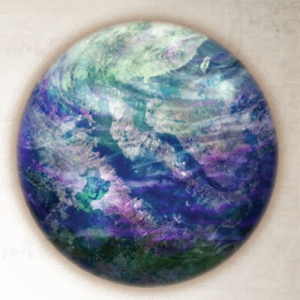

# 0942 菲尔 Phyrr

精校状态：中文行文已逐段精校，部分术语仍为暂定

分类：地理 / 真实空间 Real Space / 朦胧星域 Segmentum Obscurus

原文来源：https://www.bilibili.com/opus/1173150796286525445

原作者：帝国神选罐头

原文时间：2026年02月25日 09:44

[返回分类目录](目录.md) · [全书目录](../../目录.md)

<!-- A0942-B0001 -->
### Basic Data 基本资料

原题：Basic Data 基础数据

<!-- /A0942-B0001 -->

<!-- A0942-B0002 -->
**英文原文**

Name:Phyrr

<!-- /A0942-B0002 -->

<!-- A0942-B0003 -->

原译文

名称：菲尔

**校订译文**

名称：菲尔

<!-- /A0942-B0003 -->

<!-- A0942-B0004 -->
**英文原文**

Segmentum:Segmentum Obscurus

<!-- /A0942-B0004 -->

<!-- A0942-B0005 -->

原译文

星域：朦胧星域

**校订译文**

星域：朦胧星域

<!-- /A0942-B0005 -->

<!-- A0942-B0006 -->
**英文原文**

Sector:Calixis Sector

<!-- /A0942-B0006 -->

<!-- A0942-B0007 -->

原译文

星区：卡利西斯星区

**校订译文**

星区：卡利西斯星区

<!-- /A0942-B0007 -->

<!-- A0942-B0008 -->
**英文原文**

Subsector:Hazeroth Abyss

<!-- /A0942-B0008 -->

<!-- A0942-B0009 -->

原译文

分区：哈洗录深渊

**校订译文**

次星区：哈冼录深渊

<!-- /A0942-B0009 -->

<!-- A0942-B0010 -->
**英文原文**

Affiliation:Imperium

<!-- /A0942-B0010 -->

<!-- A0942-B0011 -->

原译文

隶属：帝国

**校订译文**

隶属：帝国

<!-- /A0942-B0011 -->

<!-- A0942-B0012 -->
**英文原文**

Class:Death World, Penal World

<!-- /A0942-B0012 -->

<!-- A0942-B0013 -->

原译文

类别：死亡世界，刑罚世界

**校订译文**

类别：死亡世界，刑罚世界

<!-- /A0942-B0013 -->

<!-- A0942-B0014 图片 -->

<!-- A0942-B0015 -->

原译文

Planetary Image 行星图像

**校订译文**

Planetary Image 行星图像

<!-- /A0942-B0015 -->

<!-- A0942-B0016 -->
**英文原文**

Phyrr is a Death World and a Penal World in the Calixis Sector.

<!-- /A0942-B0016 -->

<!-- A0942-B0017 -->

原译文

菲尔是卡利西斯星区的死亡世界和刑罚世界。

**校订译文**

菲尔是卡利西斯星区的死亡世界和刑罚世界。

<!-- /A0942-B0017 -->

<!-- A0942-B0018 -->
## Overview 概述

<!-- /A0942-B0018 -->

<!-- A0942-B0019 -->
**英文原文**

Explorator teams discovered Phyrr a few decades after Lord Militant Angevin finished conquering the Calixis Sector, part of a massive effort by Sector Governor Drusus to survey and catalogue the Imperium’s newest domain. From space, Phyrr looked like a glimmering, blue–green jewel, with pristine oceans, rolling sun–warmed plains, and lush forests with a breathable atmosphere.

<!-- /A0942-B0019 -->

<!-- A0942-B0020 -->

原译文

探索者团队在军务领主安茹完成对卡利西斯星区的征服的几十年后发现了菲尔，这是星区总督德鲁苏斯为调查和编目帝国最新领地而做出的巨大努力的一部分。从太空看，菲尔就像一颗闪闪发光的蓝绿色宝石，拥有原始的海洋、连绵起伏的阳光，温暖的平原和郁郁葱葱的森林，空气清新。

**校订译文**

军务领主安茹完成对卡利西斯星区的征服数十年后，一支探索队发现了菲尔。当时，星区总督德鲁苏斯正大规模勘察并编录帝国的新领地，这次探索也是其中的一部分。从太空望去，菲尔如同一颗闪耀的蓝绿色宝石，有纯净的海洋、沐浴在暖阳下的起伏平原、茂密的森林，以及可供人类呼吸的大气。

<!-- /A0942-B0020 -->

<!-- A0942-B0021 -->
**英文原文**

Though the water of Phyrr is pure and the air clean, every plant and animal on the planet is completely lethal to human life. If ingested, a handful of spores can kill a full grown man within an hour, and a bite or sting from any of the planet’s indigenous creatures slays more quickly than that. The gene–toxins contained within the animal and plant life of Phyrr devastate the cells of any non–native creature, quickly rendering that creature into a skeleton surrounded by a pool of bloody sludge.

<!-- /A0942-B0021 -->

<!-- A0942-B0022 -->

原译文

虽然菲尔的水很纯净，空气也很干净，但行星上的每一种植物和动物对人类生命都是致命的。如果摄入，少量孢子可以在一小时内杀死一个成年男子，而行星上任何本土生物的叮咬或蜇伤都会比这更快地杀死人。菲尔动植物体内含有的基因毒素会破坏任何非本土生物的细胞，迅速使该生物变成一个被血污包围的骨架。

**校订译文**

菲尔水质纯净、空气清洁，然而星球上的每一种动植物都足以致人死命。摄入少量孢子，就能让一名成年人在一小时内丧命；任何本土生物的叮咬或蜇刺，致死速度还要更快。菲尔动植物体内的基因毒素会摧毁一切非本土生物的细胞，迅速将受害者化为一摊血肉烂泥中的骸骨。

<!-- /A0942-B0022 -->

<!-- A0942-B0023 -->
## Commerce 商业

<!-- /A0942-B0023 -->

<!-- A0942-B0024 -->
**英文原文**

After years of unsuccessful experimentation, the Magos Biologis declared there was no cure or inoculation against Phyrr, save a contained bio–suit. However, those same toxins so deadly to humanity are also extremely valuable to some of the more esoteric and incomprehensible industries of the Biologus branch of the Mechanicus so that the Administratum has bequeathed Phyrr to the Mechanicus as a harvest–world.

<!-- /A0942-B0024 -->

<!-- A0942-B0025 -->

原译文

经过多年不成功的实验，生物贤者宣布，除了一套封闭的生物服外，没有治愈或接种对抗菲尔的方法。然而，这些对人类如此致命的毒素对机械教的生物分支的一些更深奥和不可理解的行业来说也是非常有价值的，因此内务部将菲尔作为收获世界留给了机械教。

**校订译文**

经过多年失败的实验，生物贤者宣布，菲尔的毒素既无药可医，也无法通过接种预防，唯有密闭的防生化服才能提供保护。然而，这些对人类极其致命的毒素，对于机械修会生物分支的某些深奥难解的产业却极有价值。因此，内政部将菲尔划给机械修会，作为采收原料的世界。

<!-- /A0942-B0025 -->

<!-- A0942-B0026 -->
**英文原文**

The Mechanicus keep a small spaceport and research facility on the larger of Phyrr’s two moons, and a larger harvest facility on Phyrr’s surface. The facility is staffed by criminals for whom Phyrr is considered a death sentence. Although the air is quad–filtered, the entire complex void–shielded, and the convicts equipped with bio–suits, a single failure to follow decontamination procedures kills dozens. The Mechanicus require “complete personnel replenishment” every few years. The Mechanicus remotely operate the facility from the moon base. They do not bother with guards or security systems since there is nowhere for the prisoners to escape. Should the convicts become violent or riotous, the Tech Priests are willing to switch off the air filters and let Phyrr’s nature take its course.

<!-- /A0942-B0026 -->

<!-- A0942-B0027 -->

原译文

机械教在菲尔的两颗卫星中较大的卫星上拥有一个小型太空港和研究设施，在菲尔表面拥有一个较大的收获设施。该设施配备了罪犯，对他们来说，菲尔被视为死刑。尽管空气经过了四次过滤，整个建筑群的空隙都被屏蔽了，罪犯也配备了生物服，但一次不遵守净化程序就会导致数十人死亡。机械教每隔几年就需要“全面补充人员”。机械教从月球基地远程操作该设施。他们不烦恼警卫或安全系统，因为囚犯无处可逃。如果罪犯变得暴力或暴乱，技术神甫们愿意关闭空气过滤器，让菲尔的自然任其发展。

**校订译文**

机械修会在菲尔两颗卫星中较大的一颗上设有小型太空港和研究设施，并在行星表面建有规模更大的采收设施。地表设施的劳力全是罪犯；对他们而言，被送到菲尔就相当于判了死刑。这里的空气经过四重过滤，整个设施有虚空盾保护，囚犯也配有防生化服，但哪怕只有一次未按程序去污，就会死掉数十人。机械修会每隔几年便需要一次“全员补充”。技术祭司从卫星基地远程控制地表设施，不必安排警卫或安装安保系统，因为囚犯无处可逃。一旦囚犯施暴或发动骚乱，技术祭司便会关闭空气过滤器，让菲尔的自然环境替他们解决问题。

<!-- /A0942-B0027 -->

<!-- A0942-B0028 -->
**英文原文**

Ships seldom stop at Phyrr save the occasional heavily armoured convoy of the Mechanicus, arriving to pick up the accumulated stocks of bio–compounds. More rarely, prison scows arrive bearing a new supply of labour for the planet–side facilities. Chartist Captains generally avoid the planet, for the Tech-priests of Phyrr are disinterested in trading.

<!-- /A0942-B0028 -->

<!-- A0942-B0029 -->

原译文

除了偶尔抵达的机械教重型装甲船队，船只很少在菲尔停靠，他们来这里是为了装载积聚的生物化合物储备。更为罕见的是，监狱驳船为行星一侧的设施带来了新的劳动力供应。宪章船长通常会避开这个行星，因为菲尔的技术神甫对交易不感兴趣。

**校订译文**

鲜有舰船在菲尔停靠，只有机械修会偶尔派来重装甲护航船队，运走积存的生物化合物。运送新一批劳力到地表设施的囚犯驳船更为罕见。特许舰长通常会避开这个星球，因为当地技术祭司对贸易毫无兴趣。

<!-- /A0942-B0029 -->

<!-- A0942-B0030 -->
## Known Fauna 已知动物

<!-- /A0942-B0030 -->

<!-- A0942-B0031 -->

原译文

Phyrr Cat 菲尔猫

**校订译文**

Phyrr Cat 菲尔猫

<!-- /A0942-B0031 -->

本篇核心术语与暂定项

以下列出本篇出现的英文原形及核心术语表用词。同形词可能指不同对象，具体词义以本篇正文和校注为准；单复数、别名和仅见于图注的名称可能尚未列入。完整候选见[术语表](../../术语表/双语术语候选.csv)。

| 英文 | 采用中文 | 状态 |
| --- | --- | --- |
| Imperium | 帝国 | 暂定·简称 |
| Administratum | 内政部 | 暂定 |
| Magos Biologis | 生物贤者 | 暂定·官方待核 |
| Segmentum Obscurus | 朦胧星域 | 暂定·官方待核 |
| Segmentum | 星域 | 暂定·官方待核 |
| Sector | 星区 | 暂定·官方待核 |
| Subsector | 次星区 | 暂定·官方待核 |
| Obscurus | 朦胧星 | 暂定·官方待核 |
| Phyrr | 菲尔 | 暂定·沿原稿 |
| Tech | 技术语 | 暂定·官方待核 |
| Hazeroth Abyss | 哈冼录深渊 | 暂定·官方待核 |
| Calixis Sector | 卡利西斯星区 | 暂定·官方待核 |
| Death World | 死亡世界 | 暂定·官方待核 |
| Penal World | 刑罚世界 | 暂定·官方待核 |
| Drusus | 德鲁苏斯 | 暂定·官方待核 |

