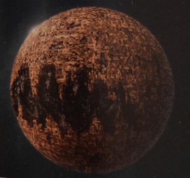
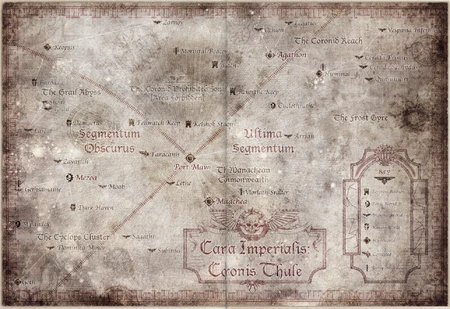
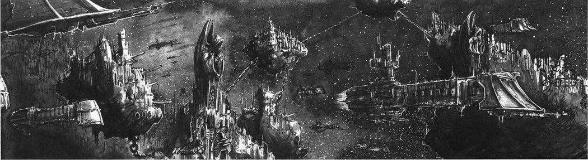
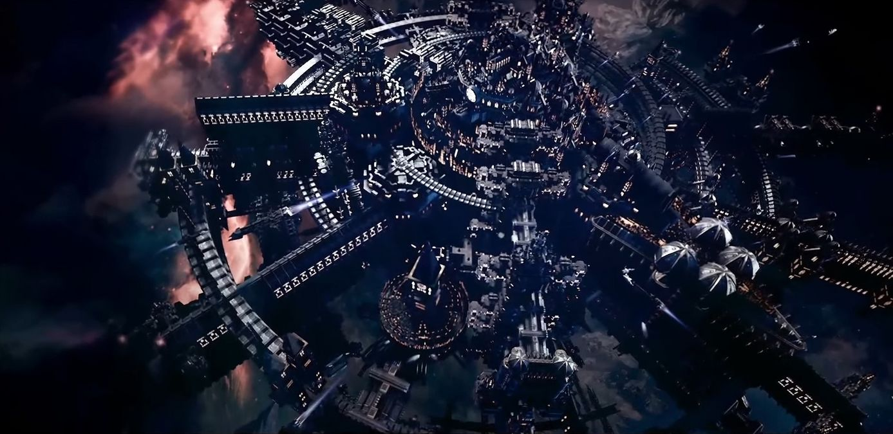
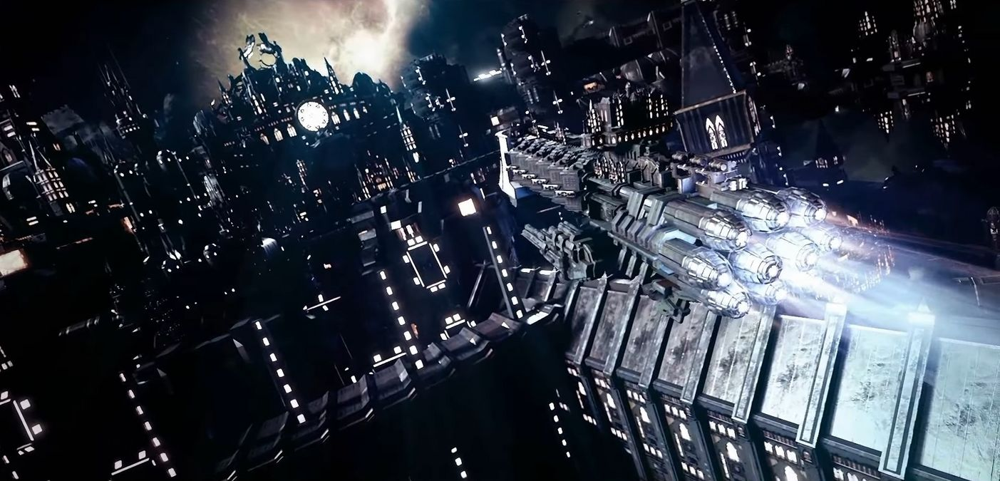
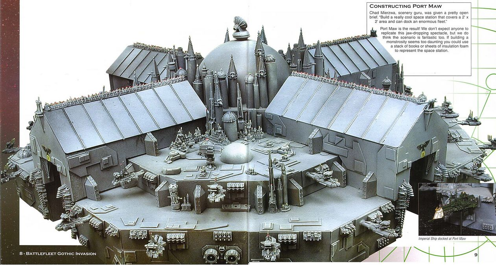
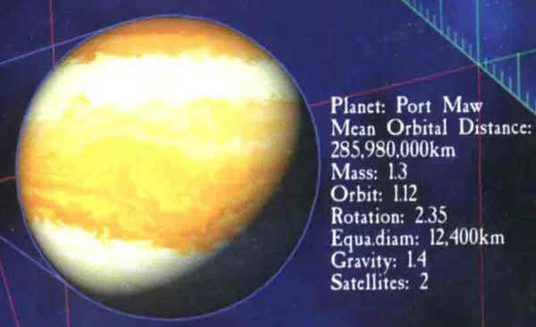

# 0943 巨口港 Port Maw

精校状态：中文行文已逐段精校，部分术语仍为暂定

分类：地理 / 真实空间 Real Space / 朦胧星域 Segmentum Obscurus

原文来源：https://www.bilibili.com/opus/1156090168321507347

原作者：帝国神选罐头

原文时间：编辑于 2026年01月10日 11:49

[返回分类目录](目录.md) · [全书目录](../../目录.md)

<!-- A0943-B0001 -->
### Basic Data 基本资料

原题：Basic Data 基础信息

<!-- /A0943-B0001 -->

<!-- A0943-B0002 -->
**英文原文**

Name:Port Maw

<!-- /A0943-B0002 -->

<!-- A0943-B0003 -->

原译文

名称：巨口港

**校订译文**

名称：巨口港

<!-- /A0943-B0003 -->

<!-- A0943-B0004 -->
**英文原文**

Segmentum:Segmentum Obscurus

<!-- /A0943-B0004 -->

<!-- A0943-B0005 -->

原译文

星域：朦胧星域

**校订译文**

星域：朦胧星域

<!-- /A0943-B0005 -->

<!-- A0943-B0006 -->
**英文原文**

Sector:Gothic Sector

<!-- /A0943-B0006 -->

<!-- A0943-B0007 -->

原译文

星区：哥特星区

**校订译文**

星区：哥特星区

<!-- /A0943-B0007 -->

<!-- A0943-B0008 -->
**英文原文**

Subsector:Port Maw Subsector

<!-- /A0943-B0008 -->

<!-- A0943-B0009 -->

原译文

分区：巨口分区

**校订译文**

次星区：巨口港次星区

<!-- /A0943-B0009 -->

<!-- A0943-B0010 -->
**英文原文**

System:Port Maw System

<!-- /A0943-B0010 -->

<!-- A0943-B0011 -->

原译文

星系：巨口星系

**校订译文**

星系：巨口港星系

<!-- /A0943-B0011 -->

<!-- A0943-B0012 -->
**英文原文**

Population:Over 200 Billion

<!-- /A0943-B0012 -->

<!-- A0943-B0013 -->

原译文

人口：超过2000亿

**校订译文**

人口：超过2000亿

<!-- /A0943-B0013 -->

<!-- A0943-B0014 -->
**英文原文**

Affiliation:Imperium

<!-- /A0943-B0014 -->

<!-- A0943-B0015 -->

原译文

隶属：帝国

**校订译文**

隶属：帝国

<!-- /A0943-B0015 -->

<!-- A0943-B0016 -->
**英文原文**

Class:Hive World

<!-- /A0943-B0016 -->

<!-- A0943-B0017 -->

原译文

类别：巢都世界

**校订译文**

类别：巢都世界

<!-- /A0943-B0017 -->

<!-- A0943-B0018 图片 -->

<!-- A0943-B0019 -->

原译文

Planetary Image 行星图片

**校订译文**

Planetary Image 行星图片

<!-- /A0943-B0019 -->

<!-- A0943-B0020 -->
**英文原文**

Port Maw refers both to the Imperial hive world, its three large Naval Stations (one of which is the Nexus System - Fleet Command for Battlefleet Gothic and the Gothic Sector's largest shipyard and repair station), and its significant support network of orbital stations and installations. Located within what is now the Port Maw Subsector, it is currently the sector capital of the Gothic Sector of Segmentum Obscurus. During the Great Crusade and Horus Heresy, it served as a major naval installation for what was then the the Coronid Deeps.

<!-- /A0943-B0020 -->

<!-- A0943-B0021 -->

原译文

巨口既指帝国巢都世界，也指其三个大型海军基地（其中之一是枢纽星系 - 哥特舰队指挥部和哥特星区最大的造船厂和维修站），以及其重要的轨道站和设施支持网络。它位于现在的巨口港分区内，目前是朦胧星域的哥特星区的首府。在大远征和荷鲁斯叛乱期间，它曾是当时的王冠深渊的主要海军设施。

**校订译文**

巨口港这一名称既指帝国的这颗巢都世界，也包括其三座大型海军基地，以及由众多轨道站和设施组成的庞大支援网络。三座基地之一是枢纽系统，其中设有哥特舰队指挥部，以及哥特星区最大的造船厂和维修站。巨口港位于如今的巨口港次星区，是朦胧星域哥特星区的首府。在大远征及荷鲁斯之乱期间，它是当时科罗尼德深渊地区的一处重要海军设施。

**校注：** Nexus System 在本段指三座海军基地之一及其指挥、造修船设施，暂译“枢纽系统”，不按普通恒星系统译作星系。

<!-- /A0943-B0021 -->

<!-- A0943-B0022 -->
**英文原文**

An artificial planetoid, Port Maw distantly orbits around a larger and (at least during the Great Crusade) more habitable planet called Æstellica.

<!-- /A0943-B0022 -->

<!-- A0943-B0023 -->

原译文

巨口星是一颗人造小行星，它绕着一颗更大、更宜居的被称为埃斯特利卡的行星（至少在大远征期间）运行。

**校订译文**

巨口港是一颗人造小行星，沿着遥远的轨道绕埃斯特利卡运行。后者是一颗体积更大、至少在大远征时期也更适宜居住的行星。

<!-- /A0943-B0023 -->

<!-- A0943-B0024 -->
### History 历史

<!-- /A0943-B0024 -->

<!-- A0943-B0025 -->
### The Great Crusade 大远征

<!-- /A0943-B0025 -->

<!-- A0943-B0026 -->
**英文原文**

An artificial planetoid, port maw was discovered by the 60th Expeditionary Fleet in a region of space then known as the Coronid Deeps. Observing the 500 kilometer wide aperture in the planets surface, giving it the appearance of a vast fanged mouth, the members of the fleet would give it its eponymous name: Port Maw.

<!-- /A0943-B0026 -->

<!-- A0943-B0027 -->

原译文

第60远征舰队在当时被称为“王冠深渊”的太空区域发现了一个人造小行星。观察到行星表面500公里宽的孔径，使其看起来像一个巨大的尖牙嘴，舰队成员为其命名：巨口。

**校订译文**

第60远征舰队在当时称为科罗尼德深渊的区域发现了这颗人造小行星。星体表面有一个宽达500公里的开口，看起来像一张布满獠牙的巨口，舰队成员便据此将它命名为“巨口港”。

<!-- /A0943-B0027 -->

<!-- A0943-B0028 图片 -->

<!-- A0943-B0029 -->

原译文

Port Maw as a part of the Coronid Deeps 巨口星作为王冠深渊的一部分

**校订译文**

Port Maw as a part of the Coronid Deeps 科罗尼德深渊中的巨口港

<!-- /A0943-B0029 -->

<!-- A0943-B0030 -->
**英文原文**

In 001.M31, in the final years of the Great Crusade, an Imperialis Armada facility would begin construction at the direct behest of the Officio Astra, as part of a strategic plan to consolidate fleet assets and operational structures in the region following the triumph of the Ullanor Crusade and the appointment of Horus Lupercal as Warmaster. It was intended for Port Maw to become one of the most powerful naval facilities in the entire northern Imperium. The hollow artificial planetoid offered unparalleled defense against assault to developments and facilities inside its core, while construction began on vast trans-orbital dockayrds, battlestations and provender belts in the surrounding star system.

<!-- /A0943-B0030 -->

<!-- A0943-B0031 -->

原译文

001.M31，在大远征的最后几年，帝国无敌舰队的一个设施将在星界庭的直接指示下开始建设，这是在乌兰诺远征胜利和任命荷鲁斯·卢佩卡尔为战帅后巩固该地区舰队资产和作战结构的战略计划的一部分。它的目的是让巨口港成为整个帝国北方最强大的海军设施之一。这颗中空的人造小行星为其核心内的开发和设施提供了无与伦比的防御，同时开始在周围恒星系统中建造巨大的跨轨道码头、战斗站和补给带。

**校订译文**

001.M31，大远征的最后几年，一处帝国无敌舰队设施奉星界署直接命令开始修建。乌兰诺远征胜利、荷鲁斯·卢佩卡尔获任战帅之后，帝国开始推行整合当地舰队资源和作战组织的战略计划，这项工程便是其中的一环。巨口港预定成为帝国北部最强大的海军设施之一。这颗中空的人造小行星，能为核心内部的建筑与设施提供无与伦比的防护；与此同时，周边星系内也开始兴建规模庞大的跨轨道船坞、战斗空间站和补给设施带。

**校注：** Officio Astra 是行政机构名称，暂译“星界署”；不与 Ordo Astra 星界审判庭合并。

<!-- /A0943-B0031 -->

<!-- A0943-B0032 -->
### War Fleet of the Port Maw Armada 巨口港舰队的作战兵力

原题：War Fleet of the Port Maw Armada 巨口港舰队的战争舰队

<!-- /A0943-B0032 -->

<!-- A0943-B0033 -->
**英文原文**

Port Maw's fleet anchorage would be one of a handful of massive fleet bases situated on the borders of the Imperium. Though still dwarfed by Battlefleet Solar, they were built by an Imperium that had largely conquered the galaxy, rather than one which set out to conquer it. At least one of these was built in each Segmentum Majoris, with more planned, to hold and defend a galaxy so hard fought over. As such, they functioned as ports of supply and muster, command-and-control, and as home bases for a permanent armada of warships with their own armies of Auxilia troops. They would serve as a source of deep range patrols and rapid-reaction forces to respond to sudden threats such as civil-disturbances, rebellion, or attacks from within or without the Imperium's new borders.

<!-- /A0943-B0033 -->

<!-- A0943-B0034 -->

原译文

巨口港的舰队锚地将是帝国边界上为数不多的大型舰队基地之一。尽管与太阳战斗舰队相比仍然相形见绌，但它们是由一个在很大程度上征服了银河系的帝国建造的，而不是一个打算征服它的帝国。每个主要星域都至少建造了一个这样的，并计划了更多，以守住和保卫一个如此激烈争夺的银河。因此，它们作为补给和集结、指挥和控制的港口，以及拥有自己的辅助部队的永久舰队的大本营。它们将作为远程巡逻和快速反应部队的来源，以应对突发威胁，如内战、叛乱或来自帝国的新边界内外的袭击。

**校订译文**

巨口港的舰队锚地，是帝国边境屈指可数的大型舰队基地之一。尽管这些基地的力量依然远逊于太阳舰队，但建造它们时，帝国已经大体征服银河，不再处于出发征服银河的阶段。为守住历经苦战夺取的疆域，每个大星域都至少建有一处这样的基地，另有更多基地列入规划。它们兼具补给、集结和指挥控制功能，也是常驻舰队的母港；这些舰队还配属自己的辅助军部队。基地派出远程巡逻兵力与快速反应部队，以应对内乱、叛乱，以及来自帝国新边界内外的突然袭击。

<!-- /A0943-B0034 -->

<!-- A0943-B0035 图片 -->

<!-- A0943-B0036 -->

原译文

"And about Port Maw were ringed many defences. Fortresses in orbit and platforms bristling with weapons lay in wait for an unwary attack. Minefields in abundance were there to discourage the foolish." - The Lexicus Planetarium, M38 “巨口港周围环绕着许多防御工事。轨道上的堡垒和布满武器的平台等待着不警觉的攻击。那里有大量的雷区来阻止愚蠢的人。” - 星表典籍，M38

**校订译文**

"And about Port Maw were ringed many defences. Fortresses in orbit and platforms bristling with weapons lay in wait for an unwary attack. Minefields in abundance were there to discourage the foolish." - The Lexicus Planetarium, M38 “巨口港四周防线重重。轨道堡垒与遍布武器的平台严阵以待，准备迎击贸然来犯之敌；密集的雷区，则足以让莽撞之徒望而却步。”——《星表典籍》，M38

<!-- /A0943-B0036 -->

<!-- A0943-B0037 -->
**英文原文**

The Port Maw armada outnumbered and likely out-gunned any single Expeditionary fleet of the Great Crusade, at least on paper. Made up of several hundred first and second rate ships of the line, various cruisers and assault vessels intended to dominate 'small wars' and conduct long patrols, as well as frigates and destroyers meant for escort duty, destroy marauders, and hunt those who would disturb the Emperor's Peace. Such fleets possessed fewer large capital class ships than the conquest forces of the Great Crusade, but those they did possess were often powerful examples of the type, such as Goliath Class Battleship and Legatus Class Battleships - strong support-intensive designs that had been replaced in frontline service by Gloriana and Victory patterns.

<!-- /A0943-B0037 -->

<!-- A0943-B0038 -->

原译文

至少在纸面上，巨口港舰队的数量超过了大远征中的任何一支远征舰队，而且可能超过了任何一支。由数百艘一级和二级战列舰组成，各种巡洋舰和攻击舰旨在主导“小型战争”并进行长时间巡逻，以及护卫舰和驱逐舰，用于护航、摧毁掠夺者和追捕扰乱帝皇的和平的人。与大远征的征服部队相比，这些舰队拥有的大型主力级舰船较少，但他们拥有的往往是这种类型的强大模范，如歌利亚级战列舰和副将级战列舰 - 强大的支援密集型设计，在前线服役中已被荣光女王和胜利型所取代。

**校订译文**

至少从纸面实力来看，巨口港舰队的舰艇数量超过大远征中的任何一支单独的远征舰队，火力很可能也更强。舰队拥有数百艘一、二等战列舰，以及各种巡洋舰和突击舰，用于压制“小规模战争”并执行长期巡逻；另有护卫舰和驱逐舰负责护航、消灭劫掠者，追捕一切扰乱帝皇治下和平的敌人。与大远征的征服舰队相比，这类舰队的大型主力舰较少，但所拥有的往往都是同类中的强力舰型，例如歌利亚级和特使级战列舰。这些舰型威力强大，却也需要繁重的后勤保障，在前线服役序列中已经被荣光女王级和胜利型舰艇取代。

<!-- /A0943-B0038 -->

<!-- A0943-B0039 -->
**英文原文**

Unlike the fleets of the Legiones Astartes, Explorator Fleet, and Rogue Traders, these fleets were defensive in nature, able to be piecemealed into smaller commands as needed and were manned by Solar Auxilia almost exclusively, without any transhuman (i.e. Astartes) components, and outside the typical command structure of the great crusade. Their Grand Admirals and Lord Marshalls operated under orders directly from the Council of Terra, and were equal or greater in authority to the Lord Commanders of individual planets their ships protected. Of course, in practice, it was a foolish Grand Admiral that did not defer to a Primarch or an emissary of the Terran Court or Mars, but this represented a growing distance between the nascent Imperium's forces of conquest and those of defense. As such, the Traitors influence on these forces in the opening of the Horus Heresy were lessened. This would be demonstrated during the Horus Heresy where those traitor elements of Port Maw's Warfleet that turned were conducted by a minority mutiny or by cadre's of traitor officers, rather than wholesale forces swearing to the Warmaster.

<!-- /A0943-B0039 -->

<!-- A0943-B0040 -->

原译文

与阿斯塔特军团舰队、探索者舰队和行商浪人舰队不同，这些舰队本质上是防御性的，能够根据需要分成更小的指挥，几乎完全由太阳辅助军控制，没有任何超人（即阿斯塔特）部分，也不在大远征的典型指挥结构之外。他们的海军大将和领主元帅直接根据泰拉议会的命令行事，在权力上与他们的舰船所保护的各个行星的领主指挥官相等或更大。当然，在实践中，一个愚蠢的海军大将不服从原体、泰拉王宫或火星的使者，但这代表了新生帝国的征服部队和防御部队之间的距离越来越远。因此，在荷鲁斯叛乱开始时，叛徒对这些势力的影响减弱了。这将在荷鲁斯叛乱期间得到证明，在那里，巨口港战争舰队的叛徒成员是由少数派叛乱或叛徒军官干部进行的，而不是向战帅宣誓的大规模部队。

**校订译文**

与阿斯塔特军团舰队、探索舰队和行商浪人舰队不同，这类舰队以防御为本，可以按需要拆分为规模较小的指挥单位。舰上人员几乎全由太阳辅助军组成，没有阿斯塔特之类的超人类成员，也不受大远征常规指挥体系管辖。舰队的海军元帅和领主元帅直接听命于泰拉议会，其权力不低于所辖舰艇保护的各行星领主指挥官。当然，实际行事时，若有海军元帅拒绝听从原体、泰拉宫廷使者或火星使者，便是愚蠢之举；但这种体制仍表明，新生帝国的征服力量与防御力量正在逐渐分离。因此，荷鲁斯之乱初期，叛徒对这些部队的影响相对有限。巨口港作战舰队后来发生的叛变也体现了这一点：叛变由少数人员兵变或一批叛徒军官策动，并非整支大军集体向战帅效忠。

**校注：** 修正 outside 的反向译法：这些舰队在大远征常规指挥体系之外。Grand Admiral 沿778同一指挥官的“海军元帅”，职衔暂定。

<!-- /A0943-B0040 -->

<!-- A0943-B0041 -->
**英文原文**

By the time of the Manachean War, Port Maw's War Fleet included a score of battleships, dozens of squadrons of cruisers, countless hundreds of escort craft, and thousands of servitor-drone tenders, provision ships, troop transports and orbital lighters.

<!-- /A0943-B0041 -->

<!-- A0943-B0042 -->

原译文

到马纳切安战争时，巨口港的战争舰队包括数十艘战列舰、数十个巡洋舰中队、无数艘护卫舰和数千艘无人机仆供应舰、补给舰、运兵船和轨道驳船。

**校订译文**

到玛纳基安战争爆发时，巨口港作战舰队拥有二十艘战列舰、数十个巡洋舰中队、成百上千的护航舰艇，以及数千艘机仆无人补给艇、补给船、运兵船和轨道驳船。

**校注：** a score 为二十，不是数十。

<!-- /A0943-B0042 -->

<!-- A0943-B0043 图片 -->

<!-- A0943-B0044 -->

原译文

Port Maw Imperial Space Station and Star Fort 巨口港帝国空间站和星堡

**校订译文**

Port Maw Imperial Space Station and Star Fort 巨口港帝国空间站和星堡

<!-- /A0943-B0044 -->

<!-- A0943-B0045 -->
### Horus Heresy 荷鲁斯之乱

原题：Horus Heresy 荷鲁斯叛乱

<!-- /A0943-B0045 -->

<!-- A0943-B0046 -->
**英文原文**

In the early stages of the Horus Heresy, where much of the Imperium was kept in the dark regarding the attrocity at Isstvan and word of Horus' betrayal reaching Terra itself, Port Maw was used as a layover and resupply station for the fleets which would be deployed to the ill-fated punitive mission to Isstvan V.

<!-- /A0943-B0046 -->

<!-- A0943-B0047 -->

原译文

在荷鲁斯叛乱的早期阶段，帝国的大部分地区都对伊斯塔万的暴行和荷鲁斯背叛泰拉的消息一无所知，巨口港被用作舰队的中转站和补给站，这些舰队将被部署到伊斯塔万五号命运多舛的惩罚性任务中。

**校订译文**

荷鲁斯之乱初期，伊斯塔万暴行及荷鲁斯叛变的消息传到了泰拉，而帝国大部分地区仍蒙在鼓里。巨口港成为了舰队的中转补给站；这些舰队即将前往伊斯塔万五号，执行那场命途多舛的讨伐行动。

**校注：** 英文句法松散；reaching Terra 指叛变消息传到泰拉，不是“背叛泰拉”。

<!-- /A0943-B0047 -->

<!-- A0943-B0048 -->
**英文原文**

The great construction works project surrounding Port Maw was far from complete by the start of Lupercal's war on the Imperium. Nevertheless, Port Maw was already operational in some limited capacity as a naval supply base and muster station, even as the very first drops of blood were being shed at Isstvan. Hundreds of millions of workers as well as planet-side administration and support staff were already firmly established on the habitable planet of Æstellica which Port Maw orbited around. Most importantly, it alongside the rest of the Coronid deeps could call upon regiments kept to the standards of the Solar Auxilia pattern, thanks to the high technological and industrial basis of the Manachean Commonwealth allowing for such troops to be supplied and maintained.

<!-- /A0943-B0048 -->

<!-- A0943-B0049 -->

原译文

到牧狼神对帝国的战争开始时，巨口港周围的大型建筑工程项目还远未完成。尽管如此，即使在伊斯塔万落下第一滴血的时候，巨口港作为海军补给基地和集结站已经在有限的能力下运作。数亿名工作人员以及行星侧的管理和支援人员已经在巨口港环绕的宜居行星埃斯特利卡上站稳了脚跟。最重要的是，由于马纳切安联邦的高科技和工业基础允许供应和维护这些部队，它与王冠深渊的其他部分一起，可以召集符合太阳辅助军型标准的兵团。

**校订译文**

卢佩卡尔向帝国开战时，巨口港周边的大规模建设仍远未竣工。不过，当伊斯塔万刚刚流下第一滴鲜血时，巨口港就已经能够有限度地承担海军补给和兵力集结任务。巨口港所环绕的宜居行星埃斯特利卡上，已经安置了数亿工人，以及地面行政和支援人员。更重要的是，玛纳基安联邦雄厚的技术与工业基础，足以供养并维持符合太阳辅助军制式标准的军团；巨口港和科罗尼德深渊的其他地区都能征调这些部队。

<!-- /A0943-B0049 -->

<!-- A0943-B0050 图片 -->

<!-- A0943-B0051 -->

原译文

A ship docking at Port Maw 一艘船停靠在巨口港

**校订译文**

A ship docking at Port Maw 一艘船停靠在巨口港

<!-- /A0943-B0051 -->

<!-- A0943-B0052 -->
**英文原文**

Horus had not left Port Maw outside of his schemes for rebellion. Traitor Agents were already embedded throughout the Coronid Deeps. By the time of the Isstvan III attrocity, Horus had already used his influence as Warmaster to have elements of Port Maw's armada scattered on deep patrols in space or chasing rumors of threats. By 006.M31 efforts by Port Maw to recall their fleet were greatly disrupted by the warp turbulence so infamously associated with the Horus Heresay, and their fleets found the shadowy threats they chased now very much real.

<!-- /A0943-B0052 -->

<!-- A0943-B0053 -->

原译文

荷鲁斯并没有离开巨口港，脱离他的叛乱计划。叛徒特工已经渗透到整个王冠深渊。在伊斯塔万三号暴行时期，荷鲁斯已经利用他作为战帅的影响力，让巨口港的舰队成员分散在太空中进行深渊巡逻或追逐威胁的谣言。到006.M31，巨口港召回舰队的努力被与荷鲁斯叛乱有关的亚空间湍流严重扰乱，他们的舰队发现他们现在追逐的阴影的威胁非常真实。

**校订译文**

荷鲁斯的叛乱计划也将巨口港纳入其中。叛徒特工早已遍布科罗尼德深渊。伊斯塔万三号暴行发生时，荷鲁斯已经利用战帅的影响力，把巨口港舰队的部分兵力分散出去，令其深入太空巡逻，或追查传闻中的威胁。到006.M31，巨口港试图召回舰队，却受到荷鲁斯之乱期间臭名昭著的亚空间动荡严重阻碍；与此同时，四散的舰队发现，自己追逐的那些扑朔迷离的威胁，如今已成为实实在在的敌人。

<!-- /A0943-B0053 -->

<!-- A0943-B0054 -->
**英文原文**

When the war finally arrived to Port Maw, Archmagos-Astral Leit Mercuric, secretly aligned to Horus, would use Port Maw's powerful Control Panopticon to devastating the assembling Coronids Deep fleet at Port Maw, until was at last disabled by the 905th Lethe Cohort and then destroyed by the Kurga under the orders of Grand Admiral Ospheus LaBray.

<!-- /A0943-B0054 -->

<!-- A0943-B0055 -->

原译文

当战争最终到达巨口港时，秘密与荷鲁斯结盟的星界大贤者莱特·默丘里克利巨口港强大的全景控制摧毁在巨口港集结的王冠深渊舰队，直到最后被第905勒忒大队瘫痪，然后在海军元帅奥斯菲厄斯·拉·布雷的命令下被库尔加摧毁。

**校订译文**

战争终于波及巨口港时，暗中投靠荷鲁斯的星界大贤者莱特·墨丘利克利用巨口港强大的控制全景监控塔，重创了正在港内集结的科罗尼德深渊舰队。最终，第905勒忒大队使这座设施瘫痪，随后海军元帅奥菲斯·拉布雷下令，由库尔加号将其摧毁。

<!-- /A0943-B0055 -->

<!-- A0943-B0056 图片 -->

<!-- A0943-B0057 -->

原译文

Port Maw Imperial Space Station and Star Fort 巨口港帝国空间站和星堡

**校订译文**

Port Maw Imperial Space Station and Star Fort 巨口港帝国空间站和星堡

<!-- /A0943-B0057 -->

<!-- A0943-B0058 -->
### Post Heresy 荷鲁斯之乱后

原题：Post Heresy 叛乱后

<!-- /A0943-B0058 -->

<!-- A0943-B0059 -->
**英文原文**

Port Maw now functions as the Gothic Sector's main naval base, acting as the headquarters for Battlefleet Gothic. The planet is encircled by hundreds of defensive systems, including monitor ships, minefields and defence satellites, which rendered it impregnable during the 12th Black Crusade, otherwise known as the Gothic War. However, the forces of Chaos were able to blockade the planet for almost the whole length of the war. Port Maw also maintains defence space stations throughout the sector, such as those orbiting Verstap and Luxor, which are rare exceptions to the usual hegemony of the Imperial Navy and Adeptus Mechanicus in controlling such structures.

<!-- /A0943-B0059 -->

<!-- A0943-B0060 -->

原译文

巨口港现在是哥特星区的主要海军基地，是哥特战斗舰队的总部。行星被数百个防御系统包围，包括监测舰、雷区和防御卫星，这使得它在第12次黑色远征，也被称为哥特战争期间坚不可摧。然而，混沌部队几乎在整个战争期间都封锁了行星。巨口港还维护着整个星区的防御空间站，例如围绕韦斯塔普和卢克索运行的空间站，这些空间站是帝国海军和机械神教在控制此类结构方面通常霸权的罕见例外。

**校订译文**

巨口港如今是哥特星区的主要海军基地，也是哥特舰队的总部。星球周围部署着数百套防御系统，包括重炮舰、雷区和防御卫星，使它在第十二次黑色远征、亦即哥特战争中坚不可摧。然而，混沌军队几乎在整场战争中都维持着对该星球的封锁。巨口港还负责维护星区各地的防御空间站，例如韦斯塔普和卢克索的轨道站。这类设施通常由帝国海军和机械修会垄断控制，这些空间站则是少见的例外。

<!-- /A0943-B0060 -->

<!-- A0943-B0061 -->
## Conflicting Sources 来源冲突

<!-- /A0943-B0061 -->

<!-- A0943-B0062 图片 -->

<!-- A0943-B0063 -->

原译文

Port Maw as depicted in the Battlefleet Gothic Rulebook 《哥特舰队规则书》中描述的巨口星

**校订译文**

Port Maw as depicted in the Battlefleet Gothic Rulebook 《哥特舰队规则书》中描绘的巨口港

<!-- /A0943-B0063 -->

<!-- A0943-B0064 -->
**英文原文**

The image on the Battlefleet Gothic Rulebook depicted a typical planet, making no reference to any sort of hollow world as the later The Horus Heresy (Game) would.

<!-- /A0943-B0064 -->

<!-- A0943-B0065 -->

原译文

《哥特舰队规则书》中的图像描绘了一个典型的行星，没有像后来的《荷鲁斯叛乱》（游戏）那样提及任何类别的空洞世界。

**校订译文**

《哥特舰队规则书》中的图像呈现的是一颗普通行星，并未像后来的《荷鲁斯之乱》游戏那样，将其描述为中空的星体。

<!-- /A0943-B0065 -->

<!-- A0943-B0066 -->
**英文原文**

It is not impossible the pictured image may instead be Æstellica, its name during the Great Crusade having given way to the much more famed Port Maw by the Gothic War.

<!-- /A0943-B0066 -->

<!-- A0943-B0067 -->

原译文

这不是不可能的，照片中的图像可能是埃斯特利卡，它在大远征的名字在哥特战争中让位于更著名的巨口港。

**校订译文**

也有一种可能：图中实际描绘的是埃斯特利卡。到了哥特战争时期，它在大远征时所用的名称，或许已经被知名度更高的“巨口港”取代。

**校注：** 本段是原文为调和图像与后续游戏设定提出的推测，不据此断言两星名称相同。

<!-- /A0943-B0067 -->

<!-- A0943-B0068 -->
## Trivia 琐事

<!-- /A0943-B0068 -->

<!-- A0943-B0069 -->
**英文原文**

Port Maw as portrayed in the Battlefleet Gothic: Armada (Video Game) appears to be visually inspired by the depiction of Port Wander in the Fantasy Flight Games Rogue Trader RPG.

<!-- /A0943-B0069 -->

<!-- A0943-B0070 -->

原译文

《哥特舰队：阿玛达》（电子游戏）中描绘的巨口港在视觉上似乎受到了幻想飞行游戏行商浪人RPG中对漫游港的描绘的启发。

**校订译文**

电子游戏《哥特舰队：阿玛达》中的巨口港，其视觉设计似乎受到 Fantasy Flight Games 出品的《行商浪人》角色扮演游戏中漫游港形象的启发。

<!-- /A0943-B0070 -->

本篇核心术语与暂定项

以下列出本篇出现的英文原形及核心术语表用词。同形词可能指不同对象，具体词义以本篇正文和校注为准；单复数、别名和仅见于图注的名称可能尚未列入。完整候选见[术语表](../../术语表/双语术语候选.csv)。

| 英文 | 采用中文 | 状态 |
| --- | --- | --- |
| Adeptus Mechanicus | 机械修会 | 官方已核对 |
| Horus Heresy | 荷鲁斯之乱 | 官方已核对 |
| Warp | 亚空间 | 官方已核对 |
| Imperium | 帝国 | 暂定·简称 |
| Imperial Navy | 帝国海军 | 暂定 |
| Servitor | 机仆 | 暂定 |
| Rogue Trader | 行商浪人 | 暂定 |
| Emperor | 帝皇 | 官方已核对 |
| Primarch | 原体 | 官方已核对 |
| Hive World | 巢都世界 | 暂定·官方待核 |
| Goliath | 歌利亚 | 暂定·官方待核 |
| Great Crusade | 大远征 | 暂定·官方待核 |
| Terra | 泰拉 | 暂定·官方待核 |
| Horus | 荷鲁斯 | 暂定·官方待核 |
| Isstvan III | 伊斯塔万三号 | 暂定·官方待核 |
| Legiones Astartes | 阿斯塔特军团 | 暂定·官方待核 |
| Solar Auxilia | 太阳辅助军 | 暂定·官方待核 |
| Imperialis Armada | 帝国无敌舰队 | 暂定·官方待核 |
| Segmentum Obscurus | 朦胧星域 | 暂定·官方待核 |
| Segmentum | 星域 | 暂定·官方待核 |
| Sector | 星区 | 暂定·官方待核 |
| Subsector | 次星区 | 暂定·官方待核 |
| Port Maw | 巨口港 | 暂定·官方待核 |
| Mars | 火星 | 暂定·官方待核 |
| Obscurus | 朦胧星 | 暂定·官方待核 |
| Port Wander | 漫游港 | 暂定·官方待核 |
| Mission | 教团／传教机构 | 暂定 |
| Cadre | 骨干连（寂静修女）／核心队（钛族） | 语境定译·钛族词根参考 |
| Horus Lupercal | 荷鲁斯·卢佩卡尔 | 暂定·官方待核 |
| Lupercal | 卢佩卡尔 | 暂定·官方待核 |
| Ullanor | 乌兰诺 | 暂定·官方待核 |
| Isstvan | 伊斯塔万 | 暂定·官方待核 |
| Destroyers | 毁灭者 | 暂定·官方待核 |
| Marauders | 掠夺者 | 暂定·官方待核 |
| Monitor | 监视者 | 暂定·官方待核 |
| Cohort | 大队 | 暂定·官方待核 |
| Imperialis | 帝国徽记 | 暂定·官方待核 |
| Manachean War | 玛纳基安战争 | 暂定·官方待核 |
| Manachean Commonwealth | 玛纳基安联邦 | 暂定·官方待核 |
| Coronid Deeps | 科罗尼德深渊 | 暂定·官方待核 |
| Ospheus LaBray | 奥菲斯·拉布雷 | 暂定·官方待核 |
| Leit Mercuric | 莱特·墨丘利克 | 暂定·官方待核 |
| Archmagos-Astral | 星界大贤者 | 暂定·官方待核 |
| Kurga | 库尔加号 | 暂定·官方待核 |
| The Dark | 《黑暗》 | 暂定·官方待核 |
| System | 星系（恒星系统） | 暂定·官方待核 |
| Goliath Class Battleship | 歌利亚级战列舰 | 暂定·官方待核 |
| Legatus Class | 特使级 | 暂定·官方待核 |
| Port Maw Subsector | 巨口港次星区 | 暂定·沿现稿词根 |
| Æstellica | 埃斯特利卡 | 暂定·沿原稿 |
| Nexus System | 枢纽系统 | 暂定·语境分义 |
| Officio Astra | 星界署 | 暂定·修正机构义 |
| Grand Admiral | 海军元帅 | 暂定·沿778同人职衔 |

