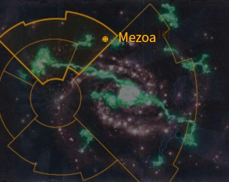
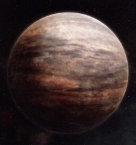

# 0944 梅佐亚 Mezoa

精校状态：中文行文已逐段精校，部分术语仍为暂定

分类：地理 / 真实空间 Real Space / 朦胧星域 Segmentum Obscurus

原文来源：https://www.bilibili.com/opus/1160161960538406916

原作者：帝国神选罐头

原文时间：2026年01月21日 09:40

[返回分类目录](目录.md) · [全书目录](../../目录.md)

<!-- A0944-B0001 图片 -->

<!-- A0944-B0002 -->

原译文

Map 地图

**校订译文**

Map 地图

<!-- /A0944-B0002 -->

<!-- A0944-B0003 -->
### Basic Data 基本资料

原题：Basic Data 基础数据

<!-- /A0944-B0003 -->

<!-- A0944-B0004 -->
**英文原文**

Name:Mezoa

<!-- /A0944-B0004 -->

<!-- A0944-B0005 -->

原译文

名称：梅佐亚

**校订译文**

名称：梅佐亚

<!-- /A0944-B0005 -->

<!-- A0944-B0006 -->
**英文原文**

Segmentum:Segmentum Obscurus

<!-- /A0944-B0006 -->

<!-- A0944-B0007 -->

原译文

星域：朦胧星域

**校订译文**

星域：朦胧星域

<!-- /A0944-B0007 -->

<!-- A0944-B0008 -->
**英文原文**

Sector:Gothic Sector

<!-- /A0944-B0008 -->

<!-- A0944-B0009 -->

原译文

星区：哥特星区

**校订译文**

星区：哥特星区

<!-- /A0944-B0009 -->

<!-- A0944-B0010 -->
**英文原文**

Subsector:Cyclops Cluster

<!-- /A0944-B0010 -->

<!-- A0944-B0011 -->

原译文

分区：独眼巨人星群

**校订译文**

次星区：独眼巨人星群

<!-- /A0944-B0011 -->

<!-- A0944-B0012 -->
**英文原文**

Affiliation:Imperium

<!-- /A0944-B0012 -->

<!-- A0944-B0013 -->

原译文

隶属：帝国

**校订译文**

隶属：帝国

<!-- /A0944-B0013 -->

<!-- A0944-B0014 -->
**英文原文**

Class:Forge World

<!-- /A0944-B0014 -->

<!-- A0944-B0015 -->

原译文

类别：铸造世界

**校订译文**

类别：铸造世界

<!-- /A0944-B0015 -->

<!-- A0944-B0016 -->
**英文原文**

Production Grade:II-Tertius

<!-- /A0944-B0016 -->

<!-- A0944-B0017 -->

原译文

生产等级：二级 - 初等

**校订译文**

生产等级：二级 - 初等

<!-- /A0944-B0017 -->

<!-- A0944-B0018 -->
**英文原文**

Tithe Grade:Aptus Non

<!-- /A0944-B0018 -->

<!-- A0944-B0019 -->

原译文

什一税等级：特级免税

**校订译文**

什一税等级：特级免税

<!-- /A0944-B0019 -->

<!-- A0944-B0020 图片 -->

<!-- A0944-B0021 -->

原译文

Planetary Image 行星图像

**校订译文**

Planetary Image 行星图像

<!-- /A0944-B0021 -->

<!-- A0944-B0022 -->
**英文原文**

Mezoa is a Forge World and naval base located in the Cyclops Cluster sub-sector of Segmentum Obscurus.

<!-- /A0944-B0022 -->

<!-- A0944-B0023 -->

原译文

梅佐亚是一个铸造世界和海军基地，位于朦胧星域的独眼巨人星群分区。

**校订译文**

梅佐亚是一颗铸造世界，也是一处海军基地，位于朦胧星域的独眼巨人星群次星区。

<!-- /A0944-B0023 -->

<!-- A0944-B0024 -->
**英文原文**

It is the location of a unique variation of the Cult Mechanicus known as the Path of the Flame Eternal.

<!-- /A0944-B0024 -->

<!-- A0944-B0025 -->

原译文

这是被称为火焰永恒之路的机械教派的独特变体的所在地。

**校订译文**

这里的机械教派有一种独特的信仰形式，称为“永恒之焰之路”。

<!-- /A0944-B0025 -->

<!-- A0944-B0026 -->
## History 历史

<!-- /A0944-B0026 -->

<!-- A0944-B0027 -->
**英文原文**

The volcanic world of Mezoa was founded during the early phases of the Great Crusade, and its construction was overseen by the Mechanicum, the Emperor of Mankind and Ferrus Manus.

<!-- /A0944-B0027 -->

<!-- A0944-B0028 -->

原译文

梅佐亚火山世界是在大远征的早期阶段建立的，其建设由机械教、人类帝皇和费鲁斯·马努斯监督。

**校订译文**

梅佐亚是一颗火山世界，其铸造世界设施始建于大远征初期，由机械教、人类帝皇和费鲁斯·马努斯共同监督建设。

<!-- /A0944-B0028 -->

<!-- A0944-B0029 -->
**英文原文**

The Lucien Forge was ordered to aid in forge world's foundation with supplies and manpower. In their reluctance to do so, they used the opportunity instead to exile various apostate Tech-Priests from their ranks.

<!-- /A0944-B0029 -->

<!-- A0944-B0030 -->

原译文

吕西安锻造世界奉命用物资和人力协助铸造世界的建立。由于他们不愿意这样做，他们利用这个机会将各种变节的技术神甫从他们的队伍中驱逐出去。

**校订译文**

吕西安铸造厂奉命提供物资和人手，协助这颗铸造世界的建设。由于不愿承担这项任务，他们反而借机将己方一些离经叛道的技术祭司流放到这里。

**校注：** Lucien Forge 按原文为铸造机构名称，未明确说它是一颗独立铸造世界；故不用原稿“吕西安锻造世界”。

<!-- /A0944-B0030 -->

<!-- A0944-B0031 -->
**英文原文**

During the Horus Heresy, Mezoa was attacked by the forces of Chaos and became encircled by the Dark Empire. Despite its status as a forge world, Mezoa has never been home to any Titan Legion, as the solidified lava that forms much of its surface would not support the colossal weight of those war machines.

<!-- /A0944-B0031 -->

<!-- A0944-B0032 -->

原译文

在荷鲁斯叛乱时期，梅佐亚遭到混沌部队的袭击，并被黑暗帝国包围。尽管梅佐亚是一个铸造世界，但它从未有过任何泰坦军团，因为形成其大部分表面的凝固熔岩无法支撑这些战争机器的巨大重量。

**校订译文**

荷鲁斯之乱期间，梅佐亚遭到混沌部队攻击，并被黑暗帝国包围。尽管是一颗铸造世界，梅佐亚却从未成为任何泰坦军团的驻地：覆盖其大部分地表的凝固熔岩，无法承受这些战争机器的庞大重量。

<!-- /A0944-B0032 -->

<!-- A0944-B0033 -->
**英文原文**

Mezoa is orbited by two moons, both of which house Schola Progenium and Militarum Tempestus training facilities devoted to the Lambdan Lions regiments, who have been seconded to the command of the Mezoan priesthood.

<!-- /A0944-B0033 -->

<!-- A0944-B0034 -->

原译文

梅佐亚被两个卫星环绕，这两个卫星都有忠嗣学院和暴风军训练设施，专门用于兰布丹之狮兵团，他们被借调到梅佐亚祭司的指挥之下。

**校订译文**

梅佐亚有两颗卫星，上面都设有忠嗣学院和暴风军训练设施，专供兰布丹之狮诸团使用。这些部队已被借调，听从梅佐亚祭司团指挥。

<!-- /A0944-B0034 -->

本篇核心术语与暂定项

以下列出本篇出现的英文原形及核心术语表用词。同形词可能指不同对象，具体词义以本篇正文和校注为准；单复数、别名和仅见于图注的名称可能尚未列入。完整候选见[术语表](../../术语表/双语术语候选.csv)。

| 英文 | 采用中文 | 状态 |
| --- | --- | --- |
| Horus Heresy | 荷鲁斯之乱 | 官方已核对 |
| Imperium | 帝国 | 暂定·简称 |
| Mechanicum | 机械教 | 暂定·历史称谓 |
| Cult Mechanicus | 机械教派 | 暂定·概念区分 |
| Emperor of Mankind | 人类帝皇 | 暂定 |
| Emperor | 帝皇 | 官方已核对 |
| Forge World | 铸造世界 | 暂定·官方待核 |
| Schola Progenium | 忠嗣学院 | 暂定·官方待核 |
| Great Crusade | 大远征 | 暂定·官方待核 |
| Ferrus Manus | 费鲁斯·马努斯 | 暂定·官方待核 |
| Horus | 荷鲁斯 | 暂定·官方待核 |
| Segmentum Obscurus | 朦胧星域 | 暂定·官方待核 |
| Segmentum | 星域 | 暂定·官方待核 |
| Sector | 星区 | 暂定·官方待核 |
| Subsector | 次星区 | 暂定·官方待核 |
| Mezoa | 梅佐亚 | 暂定·官方待核 |
| Obscurus | 朦胧星 | 暂定·官方待核 |
| Titan | 泰坦 | 暂定·官方待核 |
| Tech | 技术语 | 暂定·官方待核 |
| Aptus Non | 特级免税 | 暂定·官方待核 |
| Militarum Tempestus | 暴风军 | 暂定·官方待核 |
| Cyclops Cluster | 独眼巨人星群 | 暂定·官方待核 |
| The Dark | 《黑暗》 | 暂定·官方待核 |
| Path of the Flame Eternal | 永恒之焰之路 | 暂定·官方待核 |
| Lucien Forge | 吕西安铸造厂 | 暂定·官方待核 |
| Lambdan Lions | 兰布丹之狮 | 暂定·官方待核 |

