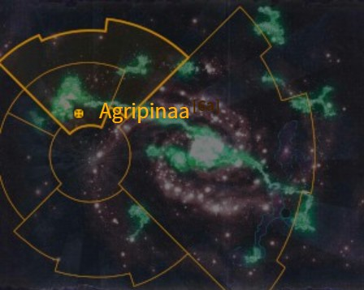
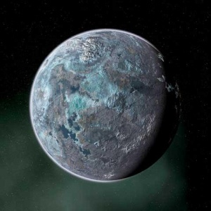
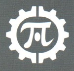
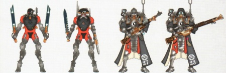
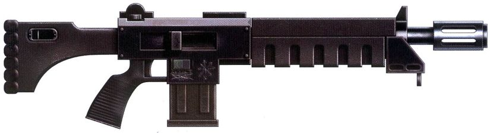
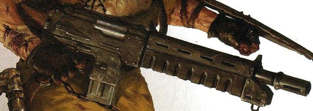

# 0945 阿格里皮娜 Agripinaa

精校状态：中文行文已逐段精校，部分术语仍为暂定

分类：地理 / 真实空间 Real Space / 朦胧星域 Segmentum Obscurus

原文来源：https://www.bilibili.com/opus/1156559475061030912

原作者：帝国神选罐头

原文时间：2026年01月11日 16:41

[返回分类目录](目录.md) · [全书目录](../../目录.md)

<!-- A0945-B0001 图片 -->

<!-- A0945-B0002 -->

原译文

Map 地图

**校订译文**

Map 地图

<!-- /A0945-B0002 -->

<!-- A0945-B0003 -->
### Basic Data 基本资料

原题：Basic Data 基础信息

<!-- /A0945-B0003 -->

<!-- A0945-B0004 -->
**英文原文**

Name:Agripinaa

<!-- /A0945-B0004 -->

<!-- A0945-B0005 -->

原译文

名称：阿格里皮娜

**校订译文**

名称：阿格里皮娜

<!-- /A0945-B0005 -->

<!-- A0945-B0006 -->
**英文原文**

Segmentum:Segmentum Obscurus

<!-- /A0945-B0006 -->

<!-- A0945-B0007 -->

原译文

星域：朦胧星域

**校订译文**

星域：朦胧星域

<!-- /A0945-B0007 -->

<!-- A0945-B0008 -->
**英文原文**

Sector:Agripinaa Sector

<!-- /A0945-B0008 -->

<!-- A0945-B0009 -->

原译文

星区：阿格里皮娜星区

**校订译文**

星区：阿格里皮娜星区

<!-- /A0945-B0009 -->

<!-- A0945-B0010 -->
**英文原文**

System:Agripinaa System

<!-- /A0945-B0010 -->

<!-- A0945-B0011 -->

原译文

星系：阿格里皮娜星系

**校订译文**

星系：阿格里皮娜星系

<!-- /A0945-B0011 -->

<!-- A0945-B0012 -->
**英文原文**

Population:80,000,000

<!-- /A0945-B0012 -->

<!-- A0945-B0013 -->

原译文

人口：8000,0000

**校订译文**

人口：8000万

<!-- /A0945-B0013 -->

<!-- A0945-B0014 -->
**英文原文**

Affiliation:Imperium

<!-- /A0945-B0014 -->

<!-- A0945-B0015 -->

原译文

隶属：帝国

**校订译文**

隶属：帝国

<!-- /A0945-B0015 -->

<!-- A0945-B0016 -->
**英文原文**

Class:Forge World

<!-- /A0945-B0016 -->

<!-- A0945-B0017 -->

原译文

类别：铸造世界

**校订译文**

类别：铸造世界

<!-- /A0945-B0017 -->

<!-- A0945-B0018 -->
**英文原文**

Production Grade:I-Extremis

<!-- /A0945-B0018 -->

<!-- A0945-B0019 -->

原译文

生产等级：一级-高等

**校订译文**

生产等级：一级极等

**校注：** Extremis 与本稿 Excelsior“高等”区分，暂译“极等”；此处是生产等级，不与什一税等级混为同一制度。

<!-- /A0945-B0019 -->

<!-- A0945-B0020 -->
**英文原文**

Tithe Grade:Aptus Non/Exactis Tertius

<!-- /A0945-B0020 -->

<!-- A0945-B0021 -->

原译文

什一税级别：特级免税/第一级初等

**校订译文**

什一税级别：特级免税/第一级初等

<!-- /A0945-B0021 -->

<!-- A0945-B0022 图片 -->

<!-- A0945-B0023 -->

原译文

Planetary Image 行星图像

**校订译文**

Planetary Image 行星图像

<!-- /A0945-B0023 -->

<!-- A0945-B0024 -->
**英文原文**

Agripinaa is a Forge World located close to the Eye of Terror and is the principal supplier of arms to the entire Cadian Gate region. It is known as the Orb of a Thousand Scars.

<!-- /A0945-B0024 -->

<!-- A0945-B0025 -->

原译文

阿格里皮娜是一个靠近恐惧之眼的铸造世界，是整个卡迪亚之门地区的主要武器供应商。它被称为千疤之球。

**校订译文**

阿格里皮娜是一颗位于恐惧之眼附近的铸造世界，也是整个卡迪亚之门地区的主要军火供应地，被称为“千疤之球”。

<!-- /A0945-B0025 -->

<!-- A0945-B0026 图片 -->

<!-- A0945-B0027 -->

原译文

The icon of Agripinaa 阿格里皮娜的标志

**校订译文**

The icon of Agripinaa 阿格里皮娜的标志

<!-- /A0945-B0027 -->

<!-- A0945-B0028 -->
## Overview 概述

<!-- /A0945-B0028 -->

<!-- A0945-B0029 -->
**英文原文**

Agripinaa exists upon the threshold of the Eye of Terror. Were it not for the defences of the Cadian System, it would have fallen long ago. The planet's technological bounty has led many Warpsmiths of Chaos to raid the planet, including several full-scale invasions. This has left its surface with a battered and scarred appearance, its atmosphere toxic to human life, forcing the population of 80 million industrial slaves to live in sealed hives. In exchange for protection, Agripinaa provided the Cadian System with most of its armaments as well as supplementing them with Skitarii forces.

<!-- /A0945-B0029 -->

<!-- A0945-B0030 -->

原译文

阿格里皮娜存在于恐惧之眼的门槛上。要不是卡迪亚星系的防御，它早就陷落了。这个行星的技术财富导致许多混沌次元铁匠袭击了这个行星，包括几次全面入侵。这使其表面留下了伤痕累累的外观，其大气对人类生命有毒，迫使8000万工业奴隶生活在密封的巢都中。作为保护的交换，阿格里皮娜向卡迪亚星系提供了大部分武器，并辅以护教军部队。

**校订译文**

阿格里皮娜就在恐惧之眼的门口，若非卡迪亚星系的防御屏障，它早已陷落。这里丰富的技术资源引来许多混沌次元铁匠劫掠，甚至多次招致全面入侵。连番战火使星球表面伤痕累累，大气也变得对人类有毒，迫使8000万工业奴隶生活在密闭巢都中。作为获得保护的回报，阿格里皮娜供应卡迪亚星系所需的大部分军备，并派出护教军增援。

<!-- /A0945-B0030 -->

<!-- A0945-B0031 图片 -->

<!-- A0945-B0032 -->

原译文

Agripinaa Skitarii 阿格里皮娜护教军

**校订译文**

Agripinaa Skitarii 阿格里皮娜护教军

<!-- /A0945-B0032 -->

<!-- A0945-B0033 -->
**英文原文**

Agripinaa does not sit solely on the defensive, however. They have a history of dispatching war fleets into the Eye of Terror to crush Forge Worlds of the Dark Mechanicus. One notable campaign was against the Dark Forge of Temporia.

<!-- /A0945-B0033 -->

<!-- A0945-B0034 -->

原译文

然而，阿格里皮娜并没有完全处于守势。他们有派遣战争舰队进入恐惧之眼粉碎黑暗机械教铸造世界的历史。一场值得注意的战役是对抗坦波里亚的黑暗熔炉。

**校订译文**

然而，阿格里皮娜并非一味固守。它曾多次派出作战舰队，深入恐惧之眼摧毁黑暗机械教的铸造世界，其中较为著名的一次，就是进攻坦珀利亚黑暗铸造世界的战役。

<!-- /A0945-B0034 -->

<!-- A0945-B0035 -->
**英文原文**

Three full agri-worlds support Agripinaa with food — Yayor, Dentor and Ulthor. The main defence of Agripinaa includes Titans of the Legio Praesidium Vortex, a trio of Ramilies-class Star Forts, Battlefleet Agripinaa, along with many Skitarii Legions and the fleets of the Basilikon Astra.

<!-- /A0945-B0035 -->

<!-- A0945-B0036 -->

原译文

三个完整的农业世界为阿格里皮娜提供食物 — 亚约尔、登托尔和乌索尔。阿格里皮娜的主要防御包括旋涡堡垒军团的泰坦、三个拉米雷斯级星堡、阿格里皮娜战斗舰队，以及许多护教军军团和星界君主舰队。

**校订译文**

亚约尔、登托尔和乌索尔这三颗农业世界，全力为阿格里皮娜供应粮食。星球的主要防御力量包括旋涡堡垒军团的泰坦、三座拉米雷斯级星堡、阿格里皮娜舰队、大量护教军军团，以及星界君主舰队的舰船。

<!-- /A0945-B0036 -->

<!-- A0945-B0037 -->
## History 历史

<!-- /A0945-B0037 -->

<!-- A0945-B0038 -->
### Thirteenth Black Crusade 第十三次黑色远征

<!-- /A0945-B0038 -->

<!-- A0945-B0039 -->
**英文原文**

Due to its proximity to the Cadian Gate, Agripinaa suffered greatly during Abaddon the Despoiler's 13th Black Crusade. The planet was invaded by an enormous World Eaters army under Kossolax the Foresworn, who sacrificed millions of its citizens over forty hours to summon a horde of Khornate Daemons, including a Bloodthirster. Eventually, however, thanks to four companies of the Blood Angels, the World Eaters and their Daemonic allies were defeated and pushed off the devastated world.

<!-- /A0945-B0039 -->

<!-- A0945-B0040 -->

原译文

由于靠近卡迪亚之门，阿格里皮娜在掠夺者阿巴顿的第13次黑色远征中遭受了巨大的痛苦。这个行星被背誓者科索拉克斯领导的一支庞大的吞世者军队入侵，他们在40多个小时内献祭了数百万公民，召唤了一大群恐虐恶魔，其中包括一名嗜血狂魔。然而，最终，多亏了圣血天使的四个连队，吞世者和他们的恶魔盟友被击败，并被赶出了这个被摧毁的世界。

**校订译文**

由于靠近卡迪亚之门，阿格里皮娜在掠夺者阿巴顿发动的第十三次黑色远征中遭受重创。背誓者科索拉克斯率领庞大的吞世者军队入侵此地，在四十小时内献祭了数百万居民，召来一大群恐虐恶魔，其中包括一头嗜血狂魔。最终，圣血天使的四个连队击败了吞世者及其恶魔盟友，将他们赶出这颗饱受蹂躏的星球。

**校注：** over forty hours 在此描述献祭持续四十小时，而非超过四十小时；ravaged world 为遭到蹂躏的世界，并非星体已毁灭。

<!-- /A0945-B0040 -->

<!-- A0945-B0041 -->
**英文原文**

Following the destruction of Cadia in the Thirteenth Black Crusade, Chaos forces launched another assault on Agripinaa. Daemon Engines led by many Warpsmiths invaded the Forge World, diseases and maladies ravaged on its surface, thrown at the planet from the hulks appeared from the Eye. Hordes of shambling dead crawled from the vents and cog clusters of cities. Later the battle was joined by the fleets of the World Eaters, Night Lords, Black Legion, Thousand Sons and Death Guard Legions under the World Eaters Chaos lord Kossolax. Even Daemons manifested on the planet. However, despite all this the Cadian Diaspora proved decisive in the world's defense.

<!-- /A0945-B0041 -->

<!-- A0945-B0042 -->

原译文

在第十三次黑色远征中摧毁卡迪亚后，混沌部队对阿格里皮娜发动了另一次进攻。由许多次元铁匠领导的恶魔引擎入侵了铸造世界，疾病和病痛在其表面肆虐，从恐惧之眼中出现的废船从其上投下到行星。成群蹒跚的死者从城市的通风口和齿轮群中爬出来。后来，吞世者混沌领主科索拉克斯率领的吞世者、午夜领主、黑色军团、千子和死亡守卫军团的舰队加入了这场战斗。甚至恶魔也出现在这个行星上。然而，尽管如此，事实证明，卡迪亚流民在世界的防御中起到了决定性作用。

**校订译文**

卡迪亚在第十三次黑色远征中毁灭后，混沌军队又一次进攻阿格里皮娜。众多次元铁匠率领恶魔引擎入侵这颗铸造世界；从恐惧之眼涌出的废船将疫病投向地表，使疾病四处肆虐。成群蹒跚的死者从城市通风口和齿轮丛中爬出。随后，在吞世者混沌领主科索拉克斯指挥下，吞世者、午夜领主、黑色军团、千子和死亡守卫的舰队也加入战斗，甚至有恶魔在地表显现。尽管如此，逃离故土的卡迪亚人在保卫这颗世界时发挥了决定性作用。

<!-- /A0945-B0042 -->

<!-- A0945-B0043 -->
**英文原文**

Since the destruction of Cadia, Agripinaa has become a key world for refugees of the Cadian Gate. The ruling Magi of Agripinaa welcome all willing to serve the Omnissiah, provided they contribute their flesh. Many have chosen starvation over what the Magi see as a logical contribution, but countless others have stepped willingly into the Omnissiah's embrace. This influx of raw organic materials has thus far allowed Agripinaa to replace its losses from the earlier Chaos invasion.

<!-- /A0945-B0043 -->

<!-- A0945-B0044 -->

原译文

自从卡迪亚被摧毁以来，阿格里皮娜已经成为卡迪亚之门难民的关键世界。阿格里皮娜的执政圣贤士欢迎所有愿意为欧姆尼赛亚服务的人，只要他们贡献自己的血肉。许多人选择了饥饿，而不是圣贤士所认为的合乎逻辑的贡献，但无数其他人已经心甘情愿地走进了欧姆尼赛亚的怀抱。到目前为止，有机原料的涌入使阿格里皮娜能够弥补早期混沌入侵造成的损失。

**校订译文**

卡迪亚毁灭后，阿格里皮娜成为卡迪亚之门难民的重要去处。统治星球的贤者欢迎一切愿意侍奉欧姆尼赛亚的人，条件是献出自己的血肉。贤者认为这种贡献合乎逻辑，但许多人宁愿饿死也不肯接受；另有无数人自愿投入欧姆尼赛亚的怀抱。源源不断涌入的有机原料，使阿格里皮娜至今得以补足先前混沌入侵造成的损失。

<!-- /A0945-B0044 -->

<!-- A0945-B0045 -->
**英文原文**

After the fall of their sister world Cadia, the skitarii legions of Agripinaa have begun to induct refugees into their ranks, alongside the usual elevated menials and vat-born. Each take the Vows of Integration in supplication to their new tech-priest master, and seek sanctuary from the enemies of the Omnissiah whilst wishing to serve Him.

<!-- /A0945-B0045 -->

<!-- A0945-B0046 -->

原译文

在他们的姐妹世界卡迪亚沦陷后，阿格里皮娜的护教军军团已经开始将难民纳入他们的队伍，与通常的晋升仆人和缸裔一起。每个人都带着整合誓言向他们的新技术神甫主人恳求，并在希望侍奉他的同时，寻求庇护，对于欧姆尼赛亚之敌。

**校订译文**

姐妹世界卡迪亚沦陷后，阿格里皮娜的护教军军团开始招收难民，与照常选拔的晋升杂役和缸裔一同服役。所有人都向新的技术祭司主人宣立整合誓言，既希望侍奉欧姆尼赛亚，也希望获得庇护，免遭祂的敌人侵害。

<!-- /A0945-B0046 -->

<!-- A0945-B0047 -->
## Agripinaa patterns 阿格里皮娜型号

<!-- /A0945-B0047 -->

<!-- A0945-B0048 -->
**英文原文**

Agripinaa is known to produce its own patterns of autogun:

<!-- /A0945-B0048 -->

<!-- A0945-B0049 -->

原译文

众所周知，阿格里皮娜会产生自己的自动枪型号：

**校订译文**

阿格里皮娜生产以下自有型号的自动枪：

<!-- /A0945-B0049 -->

<!-- A0945-B0050 图片 -->

<!-- A0945-B0051 -->

原译文

Agripinaa pattern type II Autogun 阿格里皮娜型II型自动枪

**校订译文**

Agripinaa pattern type II Autogun 阿格里皮娜式II型自动枪

<!-- /A0945-B0051 -->

<!-- A0945-B0052 图片 -->

<!-- A0945-B0053 -->

原译文

Agripinaa pattern type III Autogun 阿格里皮娜型III型自动枪

**校订译文**

Agripinaa pattern type III Autogun 阿格里皮娜式III型自动枪

<!-- /A0945-B0053 -->

<!-- A0945-B0054 -->
**英文原文**

Is is known that Leman Russ Eradicators built on Agripinaa are particularly prized for the accuracy and reliability of their Nova Cannons.

<!-- /A0945-B0054 -->

<!-- A0945-B0055 -->

原译文

众所周知，在阿格里皮娜制造的黎曼鲁斯根除者因其新星炮的准确性和可靠性而特别珍贵。

**校订译文**

阿格里皮娜制造的黎曼鲁斯根除者坦克，以其新星炮出色的精度和可靠性而备受推崇。

<!-- /A0945-B0055 -->

<!-- A0945-B0056 -->
## Other Planetary Data 其他行星数据

<!-- /A0945-B0056 -->

<!-- A0945-B0057 -->
**英文原文**

Designation: AM23.5

<!-- /A0945-B0057 -->

<!-- A0945-B0058 -->

原译文

名称：AM23.5

**校订译文**

编号：AM23.5

<!-- /A0945-B0058 -->

<!-- A0945-B0059 -->
**英文原文**

Orbital Distance: 2.4AU

<!-- /A0945-B0059 -->

<!-- A0945-B0060 -->

原译文

轨道距离：2.4AU

**校订译文**

轨道距离：2.4AU

<!-- /A0945-B0060 -->

<!-- A0945-B0061 -->
**英文原文**

Gravity: 0.77G

<!-- /A0945-B0061 -->

<!-- A0945-B0062 -->

原译文

重力：0.77G

**校订译文**

重力：0.77G

<!-- /A0945-B0062 -->

<!-- A0945-B0063 -->
**英文原文**

Temperature: 4°С

<!-- /A0945-B0063 -->

<!-- A0945-B0064 -->

原译文

温度：4°С

**校订译文**

温度：4°С

<!-- /A0945-B0064 -->

<!-- A0945-B0065 -->
**英文原文**

Aestimare: B30

<!-- /A0945-B0065 -->

<!-- A0945-B0066 -->

原译文

评估：B30

**校订译文**

评估：B30

<!-- /A0945-B0066 -->

<!-- A0945-B0067 -->
## Conflicting sources 来源冲突

<!-- /A0945-B0067 -->

<!-- A0945-B0068 -->
**英文原文**

Different sources give different Tithe Grades for Agripinaa.

<!-- /A0945-B0068 -->

<!-- A0945-B0069 -->

原译文

不同的来源对阿格里皮娜给出了不同的什一税等级。

**校订译文**

不同的来源对阿格里皮娜给出了不同的什一税等级。

<!-- /A0945-B0069 -->

本篇核心术语与暂定项

以下列出本篇出现的英文原形及核心术语表用词。同形词可能指不同对象，具体词义以本篇正文和校注为准；单复数、别名和仅见于图注的名称可能尚未列入。完整候选见[术语表](../../术语表/双语术语候选.csv)。

| 英文 | 采用中文 | 状态 |
| --- | --- | --- |
| Blood Angels | 圣血天使 | 官方已核对 |
| Death Guard | 死亡守卫 | 官方已核对 |
| Thousand Sons | 千子 | 官方已核对 |
| World Eaters | 吞世者 | 官方已核对 |
| Imperium | 帝国 | 暂定·简称 |
| Tech-Priest | 技术祭司 | 官方已核对 |
| History | 历史 | 编辑用语已统一 |
| Eye of Terror | 恐惧之眼 | 官方已核对 |
| Forge World | 铸造世界 | 暂定·官方待核 |
| Black Legion | 黑色军团 | 暂定·官方待核 |
| Night Lords | 午夜领主 | 暂定·官方待核 |
| COG | 机灵 | 暂定·官方待核 |
| Skitarii | 护教军 | 暂定·官方待核 |
| Segmentum Obscurus | 朦胧星域 | 暂定·官方待核 |
| Segmentum | 星域 | 暂定·官方待核 |
| Sector | 星区 | 暂定·官方待核 |
| Omnissiah | 欧姆尼赛亚 | 暂定·官方待核 |
| Agripinaa | 阿格里皮娜 | 暂定·官方待核 |
| Cadia | 卡迪亚 | 暂定·官方待核 |
| Obscurus | 朦胧星 | 暂定·官方待核 |
| Aestimare | 战略价值评级 | 暂定·官方待核 |
| Tech | 技术语 | 暂定·官方待核 |
| Aptus Non | 特级免税 | 暂定·官方待核 |
| Master | 导师（审判庭职衔）／舰务官（舰员职务） | 语境定译·官方待核 |
| Scars | 伤疤 | 暂定·官方待核 |
| Despoiler | 劫掠者 | 暂定·官方待核 |
| Dark Mechanicus | 黑暗机械教 | 暂定·官方待核 |
| Bloodthirster | 嗜血狂魔 | 官方已核对 |
| Abaddon the Despoiler | 掠夺者阿巴顿 | 官方已核对 |
| Principal | 首席（史洛斯职衔） | 暂定·官方待核 |
| Horde | 部落 | 暂定·官方待核 |
| Kossolax | 科索拉克斯 | 暂定·官方待核 |
| Menials | 杂役 | 暂定·官方待核 |
| Vat-born | 缸裔 | 暂定·官方待核 |
| The Dark | 《黑暗》 | 暂定·官方待核 |
| The Blood | 鲜血 | 暂定·官方待核 |
| Basilikon Astra | 星界君主舰队 | 暂定·官方待核 |
| System | 星系（恒星系统） | 暂定·官方待核 |
| Dentor | 登托尔 | 暂定·官方待核 |
| Ulthor | 乌尔索尔 | 暂定·官方待核 |
| Yayor | 雅约尔 | 暂定·官方待核 |
| Exactis Tertius | 第一级初等 | 暂定·官方待核 |
| Kossolax the Foresworn | 背誓者科索拉克斯 | 暂定·官方待核 |
| Autogun | 自动枪 | 暂定·官方待核 |
| Temporia | 坦珀利亚 | 暂定·官方待核 |
| I-Extremis | 一级极等 | 暂定·官方待核 |
| Orb of a Thousand Scars | 千疤之球 | 暂定·官方待核 |
| Legio Praesidium Vortex | 旋涡堡垒军团 | 暂定·官方待核 |
| Vows of Integration | 整合誓言 | 暂定·官方待核 |
| Skitarii Forces | 护教军部队 | 暂定·官方待核 |

