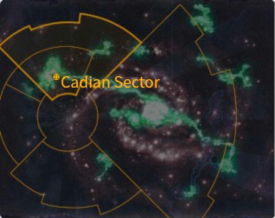
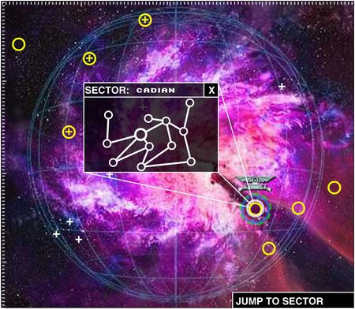
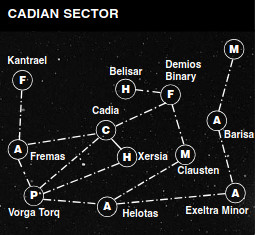

# 0947 卡迪亚星区 Cadian Sector

精校状态：中文行文已逐段精校，部分术语仍为暂定

分类：地理 / 真实空间 Real Space / 朦胧星域 Segmentum Obscurus

原文来源：https://www.bilibili.com/opus/1134169874973589504

原作者：帝国神选罐头

原文时间：2025年11月12日 08:38

[返回分类目录](目录.md) · [全书目录](../../目录.md)

<!-- A0947-B0001 -->
**英文原文**

The Cadian Sector is a Sector of the Imperium, located in Segmentum Obscurus.

<!-- /A0947-B0001 -->

<!-- A0947-B0002 -->

原译文

卡迪亚星区是帝国的一个星区，位于朦胧星域。

**校订译文**

卡迪亚星区是帝国的一个星区，位于朦胧星域。

<!-- /A0947-B0002 -->

<!-- A0947-B0003 图片 -->

<!-- A0947-B0004 -->

原译文

History 历史

**校订译文**

History 历史

<!-- /A0947-B0004 -->

<!-- A0947-B0005 图片 -->

<!-- A0947-B0006 -->

原译文

Cadian Sector Map 卡迪亚星区地图

**校订译文**

Cadian Sector Map 卡迪亚星区地图

<!-- /A0947-B0006 -->

<!-- A0947-B0007 -->
**英文原文**

Lying directly on the only stable route of the Cadian Gate, the Cadian Sector is among the most heavily fortified in the Imperium and has had to bear the brunt of Abaddon the Despoiler's Black Crusades as well as constant infiltration by Chaos Cultists and the Alpha Legion. During the latest such war, the Thirteenth Black Crusade, the Cadian Sector's defences, including Battlefleet Cadia, were ravaged by Chaos forces and Cadia itself eventually fell. Since the fall of Cadia the remaining Imperial worlds in the region have struggled to hold on against renewed Chaos offensives, and Indomitus Crusade Fleet Secundus is active in the region to try reverse the situation.

<!-- /A0947-B0007 -->

<!-- A0947-B0008 -->

原译文

卡迪亚星区直接位于卡迪亚之门唯一稳定的路线上，是帝国中防御最严密的地区之一，不得不承受掠夺者阿巴顿的黑色远征的冲击，以及混沌邪教徒和阿尔法军团的不断渗透。在最近的一场这样的战争中，即第十三次黑色远征，卡迪亚星区的防御，包括卡迪亚舰队，被混沌部队摧毁，卡迪亚最终陷落。自卡迪亚陷落以来，该地区剩余的帝国世界一直在努力抵抗新的混沌攻势，不屈远征第二舰队在该地区积极活动，试图扭转局势。

**校订译文**

卡迪亚星区扼守卡迪亚之门唯一的稳定航线，是帝国设防最严密的地区之一，既要首当其冲地承受掠夺者阿巴顿的黑色远征，也要应对混沌邪教徒和阿尔法军团持续不断的渗透。在最近一次战争——第十三次黑色远征中，包括卡迪亚舰队在内的星区防御力量遭到混沌军队重创，卡迪亚本身最终也告陷落。此后，该地区残存的帝国世界一直艰难抵御新一轮混沌攻势。不屈远征第二舰队正在当地活动，试图扭转局势。

<!-- /A0947-B0008 -->

<!-- A0947-B0009 图片 -->

<!-- A0947-B0010 -->

原译文

Cadian Sector Map 卡迪亚星区地图

**校订译文**

Cadian Sector Map 卡迪亚星区地图

<!-- /A0947-B0010 -->

<!-- A0947-B0011 -->
### Notable Celestial Regions and Objects 著名的天体地区和天体

<!-- /A0947-B0011 -->

<!-- A0947-B0012 -->
**英文原文**

Barisa - Agri-World

<!-- /A0947-B0012 -->

<!-- A0947-B0013 -->

原译文

巴里萨 - 农业世界

**校订译文**

巴里萨 - 农业世界

<!-- /A0947-B0013 -->

<!-- A0947-B0014 -->
**英文原文**

Belisar - Hive World

<!-- /A0947-B0014 -->

<!-- A0947-B0015 -->

原译文

贝利萨尔 - 巢都世界

**校订译文**

贝利萨尔 - 巢都世界

<!-- /A0947-B0015 -->

<!-- A0947-B0016 -->

原译文

Cadian System 卡迪亚星系

**校订译文**

Cadian System 卡迪亚星系

<!-- /A0947-B0016 -->

<!-- A0947-B0017 -->
**英文原文**

Cadia - Dead World, Daemon World, former Fortress World

<!-- /A0947-B0017 -->

<!-- A0947-B0018 -->

原译文

卡迪亚 - 死亡世界，恶魔世界，前堡垒世界

**校订译文**

卡迪亚 — 死寂世界、恶魔世界，原为要塞世界

<!-- /A0947-B0018 -->

<!-- A0947-B0019 -->
**英文原文**

Clausten - Mining World

<!-- /A0947-B0019 -->

<!-- A0947-B0020 -->

原译文

克劳斯滕 - 矿业世界

**校订译文**

克劳斯滕 - 矿业世界

<!-- /A0947-B0020 -->

<!-- A0947-B0021 -->
**英文原文**

Demios Binary - Forge World

<!-- /A0947-B0021 -->

<!-- A0947-B0022 -->

原译文

德米奥斯二号 - 铸造世界

**校订译文**

德米奥斯双星 — 铸造世界

**校注：** Binary 指双星，不是编号二号；Demios 不擅改为另一个铸造世界 Deimos。

<!-- /A0947-B0022 -->

<!-- A0947-B0023 -->
**英文原文**

Exeltra Minor - Agri-World

<!-- /A0947-B0023 -->

<!-- A0947-B0024 -->

原译文

埃克斯艾尔特拉次星 - 农业世界

**校订译文**

埃克斯艾尔特拉次星 - 农业世界

<!-- /A0947-B0024 -->

<!-- A0947-B0025 -->
**英文原文**

Fremas - Agri-World

<!-- /A0947-B0025 -->

<!-- A0947-B0026 -->

原译文

弗瑞马斯 - 农业世界

**校订译文**

弗瑞马斯 - 农业世界

<!-- /A0947-B0026 -->

<!-- A0947-B0027 -->
**英文原文**

Helotas - Agri-World

<!-- /A0947-B0027 -->

<!-- A0947-B0028 -->

原译文

赫洛塔斯 - 农业世界

**校订译文**

赫洛塔斯 - 农业世界

<!-- /A0947-B0028 -->

<!-- A0947-B0029 -->
**英文原文**

Kantrael - Forge World

<!-- /A0947-B0029 -->

<!-- A0947-B0030 -->

原译文

坎特拉尔 - 铸造世界

**校订译文**

坎特拉尔 - 铸造世界

<!-- /A0947-B0030 -->

<!-- A0947-B0031 -->
**英文原文**

Khai-zhan - Agri World / Ocean World

<!-- /A0947-B0031 -->

<!-- A0947-B0032 -->

原译文

凯-占 - 农业世界/海洋世界

**校订译文**

凯詹 — 农业世界／海洋世界

<!-- /A0947-B0032 -->

<!-- A0947-B0033 -->
**英文原文**

Vorga Torq - Penal World

<!-- /A0947-B0033 -->

<!-- A0947-B0034 -->

原译文

沃尔加·托克 - 刑罚世界

**校订译文**

沃尔加·托克 - 刑罚世界

<!-- /A0947-B0034 -->

<!-- A0947-B0035 -->
**英文原文**

Xersia - Hive World

<!-- /A0947-B0035 -->

<!-- A0947-B0036 -->

原译文

瑟西亚 - 巢都世界

**校订译文**

瑟西亚 - 巢都世界

<!-- /A0947-B0036 -->

<!-- A0947-B0037 -->

原译文

Unknown Mining World 未知矿业世界

**校订译文**

Unknown Mining World 未知矿业世界

<!-- /A0947-B0037 -->

本篇核心术语与暂定项

以下列出本篇出现的英文原形及核心术语表用词。同形词可能指不同对象，具体词义以本篇正文和校注为准；单复数、别名和仅见于图注的名称可能尚未列入。完整候选见[术语表](../../术语表/双语术语候选.csv)。

| 英文 | 采用中文 | 状态 |
| --- | --- | --- |
| Imperium | 帝国 | 暂定·简称 |
| Indomitus | 不屈学派 | 暂定·学派语境 |
| Hive World | 巢都世界 | 暂定·官方待核 |
| Agri-World | 农业世界 | 暂定·官方待核 |
| Forge World | 铸造世界 | 暂定·官方待核 |
| Indomitus Crusade | 不屈远征 | 暂定·官方待核 |
| Segmentum Obscurus | 朦胧星域 | 暂定·官方待核 |
| Segmentum | 星域 | 暂定·官方待核 |
| Sector | 星区 | 暂定·官方待核 |
| Khai-Zhan | 凯詹 | 暂定·官方待核 |
| Cadia | 卡迪亚 | 暂定·官方待核 |
| Obscurus | 朦胧星 | 暂定·官方待核 |
| Alpha Legion | 阿尔法军团 | 暂定·官方待核 |
| Despoiler | 劫掠者 | 暂定·官方待核 |
| Abaddon the Despoiler | 掠夺者阿巴顿 | 官方已核对 |
| Bear | 熊 | 暂定·官方待核 |
| Dead World | 死寂世界 | 暂定·官方待核 |
| Demios Binary | 德米奥斯双星 | 暂定·官方待核 |
| Kantrael | 坎特拉尔 | 暂定·官方待核 |
| Fortress World | 堡垒世界 | 暂定·官方待核 |
| Mining World | 矿业世界 | 暂定·官方待核 |
| Penal World | 刑罚世界 | 暂定·官方待核 |
| Cadian Sector | 卡迪亚星区 | 暂定·官方待核 |

